# 2.3.2 Producentensurplus en totaal surplus

Reparatiecoördinator Amina regelt één paraplureparatie. De klant wil daarvoor maximaal € 18 betalen, de extra reparatiekosten zijn € 7 en de afgesproken prijs is € 10. De klant heeft € 8 voordeel. Heeft de reparateur dan niets over?

**Dit leer je**

1. Je kunt het marktevenwicht berekenen en CS en PS grafisch herkennen.
2. Je kunt CS, PS en TS berekenen met de juiste oppervlakten en eenheden.
3. Je kunt binnen het gegeven model de aanbodlijn als marginale-kostenlijn gebruiken.
4. Je kunt met betalingsbereidheid en marginale kosten uitleggen waarom TS bij het evenwicht maximaal is, zonder daaruit een eerlijkheidsoordeel af te leiden.

### Twee voordelen bij één transactie

Uit §2.3.1 ken je consumentensurplus: betalingsbereidheid min betaalde prijs bij een daadwerkelijke aankoop. De klant heeft hier CS = 18 − 10 = € 8. Maar de reparateur ontvangt € 10 voor werk dat € 7 extra kost. Ook aan de verkoperskant ontstaat een verschil.

> **Definitie: producentensurplus (PS)**
>
> In dit model is het producentensurplus per verkochte eenheid de ontvangen prijs min de marginale kosten van die eenheid. Het gezamenlijke PS telt deze verschillen op over alle werkelijk verkochte eenheden.

De reparateur heeft PS = 10 − 7 = € 3. We kennen de vaste kosten niet: dit bewijst dus niet dat de winst € 3 is. Een niet-genoemde kostenpost is niet vanzelf nul.

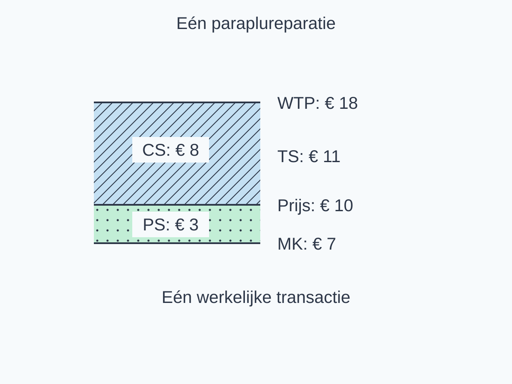{alt="Surplus van koper en reparateur bij één paraplureparatie." width=166mm}

> **Definitie: totaal surplus (TS)**
>
> Het totale surplus is het gezamenlijke voordeel van kopers en verkopers in het gegeven model: TS = CS + PS, in euro.

<table style="break-inside:avoid"><colgroup><col style="width:40%"><col style="width:30%"><col style="width:30%"></colgroup><thead><tr><th>Voordeel bij deze ene reparatie</th><th>Berekening</th><th>Bedrag</th></tr></thead><tbody>
<tr><td>Koper: CS</td><td>18 − 10</td><td>€ 8</td></tr>
<tr><td>Reparateur: PS</td><td>10 − 7</td><td>€ 3</td></tr>
<tr><td>Samen: TS</td><td>8 + 3</td><td>€ 11</td></tr>
</tbody></table>

De betaling van de koper is de ontvangst van de reparateur. Daardoor valt de prijs weg als je de voordelen optelt: (18 − 10) + (10 − 7) = 18 − 7 = € 11. Algemeen, per transactie: (WTP − P) + (P − MK) = WTP − MK. WTP is hier de afkorting van betalingsbereidheid.

### Van één reparatie naar een marktmodel

Eén reparatie is een losse transactie. Voor een grotere markt gebruiken we nu een **continu lineair model**, net zoals bij de oppervlakte in §2.3.1. Een rechte lijn is een modelaanname, niet een exacte optelling van enkele losse kopers of producten.

We bekijken identieke tulpenbossen op één marktochtend. Vraag: P = 30 − 0,5Q. Aanbod: P = 6 + 0,25Q, voor 0 ≤ Q ≤ 60. P is euro per bos en Q is bossen op deze marktochtend. Alle andere omstandigheden blijven gelijk.

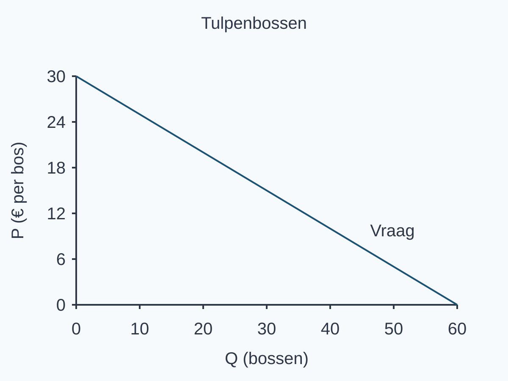{alt="Vraaglijn voor tulpenbossen vóór toevoeging van de aanbodlijn." width=166mm}

In §1.3.1 vertelde aanbod hoeveel aanbieders bij elke prijs willen verkopen. **Hier voegen we een modelafspraak toe:** de inverse aanbodlijn geeft de marginale kosten van iedere opeenvolgende markteenheid in het hele genoemde bereik, ook als die eenheid niet wordt verkocht. De goedkoopste eenheden komen eerst; de volgende kunnen hogere extra kosten hebben. Dit is niet GTK van één kweker.

> **Twee betekenissen zorgvuldig uit elkaar**
>
> In §2.1.3 berekende je MK = ΔTK/ΔQ als gemiddelde extra kosten over een tabelinterval. Daarmee kende je niet de kosten van één afzonderlijk product. Hier levert de gegeven aanbodlijn juist een kostenwaarde bij iedere opeenvolgende hoeveelheid. Dat geldt dankzij de expliciete modelafspraak, niet omdat ieder intervalgemiddelde een eenheidskost zou zijn.

We nemen aan dat de hoogste vragers kopen van aanbieders met de laagste MK, tegen één uniforme prijs. Iedere hoeveelheid in het genoemde bereik is technisch mogelijk. Er zijn geen externe effecten of transactiekosten. Deze voorwaarden begrenzen onze conclusie over het gezamenlijke surplus; zij beschrijven niet alle maatschappelijke omstandigheden.

### Vraag en aanbod op dezelfde hoeveelheid vergelijken

De vraaglijn geeft bij Q = 16 een betalingsbereidheid van 30 − 0,5 × 16 = € 22 per bos. De aanbodlijn geeft bij diezelfde Q marginale kosten van 6 + 0,25 × 16 = € 10 per bos. Lees steeds de eenheden en dezelfde rij.

<table style="break-inside:avoid"><colgroup><col style="width:24%"><col style="width:38%"><col style="width:38%"></colgroup><thead><tr><th>Q (bossen)</th><th>Betalingsbereidheid (€ per bos)</th><th>MK (€ per bos)</th></tr></thead><tbody>
<tr><td>0</td><td>30</td><td>6</td></tr>
<tr><td>16</td><td>22</td><td>10</td></tr>
<tr><td>32</td><td>14</td><td>14</td></tr>
<tr><td>48</td><td>6</td><td>18</td></tr>
<tr><td>60</td><td>0</td><td>21</td></tr>
</tbody></table>

De tabel beschrijft het hele mogelijke bereik. De rij Q = 60 betekent niet dat 60 bossen daadwerkelijk worden verkocht.

Voor marktevenwicht moeten beide functies bij dezelfde Q dezelfde P geven:

30 − 0,5Q = 6 + 0,25Q → 24 = 0,75Q → Qe = 32 bossen.

Pe = 30 − 0,5 × 32 = € 14 per bos. Controle met aanbod: 6 + 0,25 × 32 = 14. Het snijpunt E is (32, 14). Hier wordt de evenwichtshoeveelheid werkelijk verhandeld volgens de genoemde toedeling.

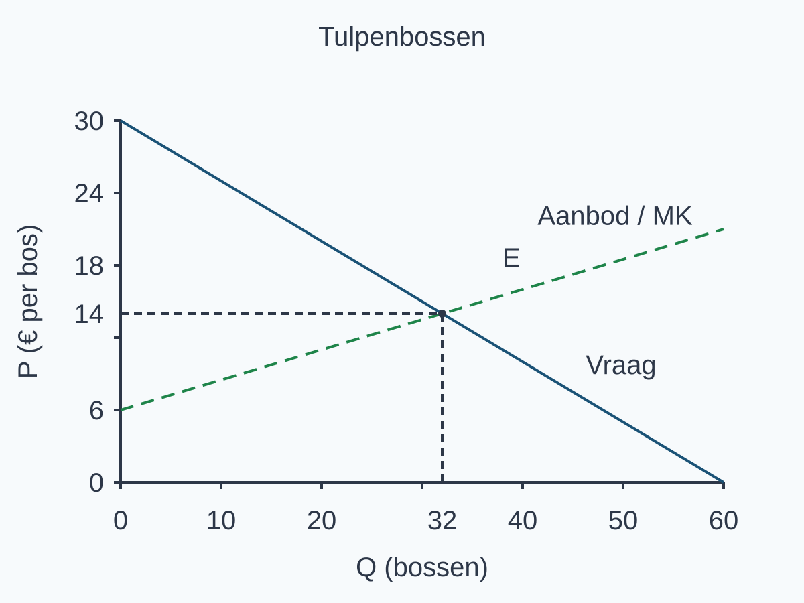{alt="Evenwicht van vraag en aanbod voor tulpenbossen." width=166mm}

### Eerst het voordeel van de kopers

Van Q = 0 tot Q = 32 ligt het CS boven de prijs € 14 en onder de vraaglijn. Zoals in §2.3.1 telt de oppervlakte de verschillen van de werkelijk gekochte eenheden op. De driehoek heeft basis 32 bossen en loodrechte hoogte 30 − 14 = € 16 per bos.

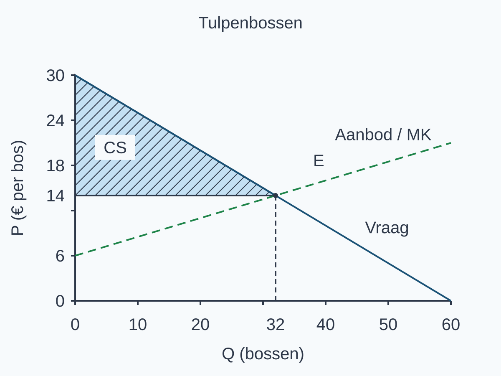{alt="Consumentensurplus boven de prijs van tulpenbossen." width=166mm}

CS = ½ × basis × hoogte = ½ × 32 × (30 − 14) = **€ 256**.

Bossen × euro per bos geeft euro: het gezamenlijke voordeel van de kopers, niet € 256 per koper en niet een uitbetaling.

### Dan het voordeel van de verkopers

Het PS ligt onder de prijs € 14 en boven de aanbodlijn, over dezelfde 32 verkochte bossen. De basis is weer 32, maar de hoogte is nu 14 − 6 = € 8 per bos. De 6 is het beginpunt van de aanbodlijn: daarom is de hoogte niet 14.

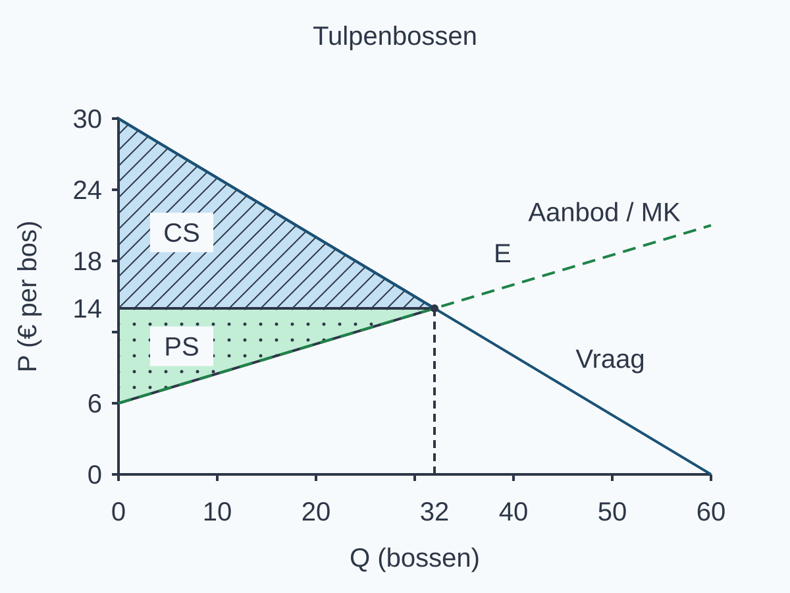{alt="Consumenten- en producentensurplus bij tulpenbossen." width=166mm}

PS = ½ × 32 × (14 − 6) = **€ 128**. TS = CS + PS = € 256 + € 128 = **€ 384**.

<table style="break-inside:avoid"><colgroup><col style="width:40%"><col style="width:30%"><col style="width:30%"></colgroup><thead><tr><th>Bedrag</th><th>Betekenis</th><th>Berekening</th></tr></thead><tbody>
<tr><td>CS: € 256</td><td>Voordeel van de kopers</td><td>½ × 32 × 16</td></tr>
<tr><td>PS: € 128</td><td>Voordeel van de verkopers in dit model</td><td>½ × 32 × 8</td></tr>
<tr><td>TS: € 384</td><td>Beide voordelen samen</td><td>256 + 128</td></tr>
<tr><td>Betaling/omzet: € 448</td><td>Ontvangen verkoopbedrag</td><td>32 × 14</td></tr>
</tbody></table>

> **Niet verwisselen**
>
> Prijs × hoeveelheid is betaling/omzet, niet PS of TS. Ook “PS = € 128, dus winst = € 128” is niet onderbouwd: de vaste kosten ontbreken. Voor winst moet je de relevante totale kosten kennen. De driehoeksformules werken hier bij rechte lijnen, evenwicht en de expliciete verkoop- en toedelingsvoorwaarden; gebruik ze niet automatisch bij elke andere transactiehoeveelheid.

### Waarom het totale surplus hier maximaal is

Vergelijk de betalingsbereidheid met MK. Bij Q = 16 is het marginale verschil 22 − 10 = +€ 12 per bos: extra handel rond deze hoeveelheid voegt surplus toe. Bij Q = 48 is het 6 − 18 = −€ 12: extra handel rond die hoeveelheid verlaagt TS.

De twee rijen illustreren een patroon dat je over het **hele bereik** in de lijnen ziet. Voor 0 ≤ Q < 32 ligt vraag boven aanbod: iedere extra transactie heeft betalingsbereidheid hoger dan MK. Bij Q = 32 zijn beide € 14; het marginale verschil is nul. Voor 32 < Q ≤ 60 ligt vraag onder aanbod en zijn de extra kosten groter dan de betalingsbereidheid. Eerder stoppen laat positieve bijdragen liggen; verder doorgaan voegt negatieve bijdragen toe. Daarom is TS binnen dit model maximaal bij Q = 32.

Een **nulverschil bij het snijpunt** betekent niet dat het gezamenlijke surplus nul is. De eerdere transacties hebben samen al € 384 voordeel opgeleverd. Als controle vormt het hele gebied tussen vraag en aanbod tot Q = 32 één driehoek: ½ × 32 × (30 − 6) = € 384.

Een puntvergelijking is geen berekening van de oppervlakte over een heel interval: over een eindige stap veranderen de lijnwaarden. Je gebruikt hier de waarde bij de genoemde Q om het marginale teken te duiden; je vervangt die Q niet door het volgende gehele nummer.

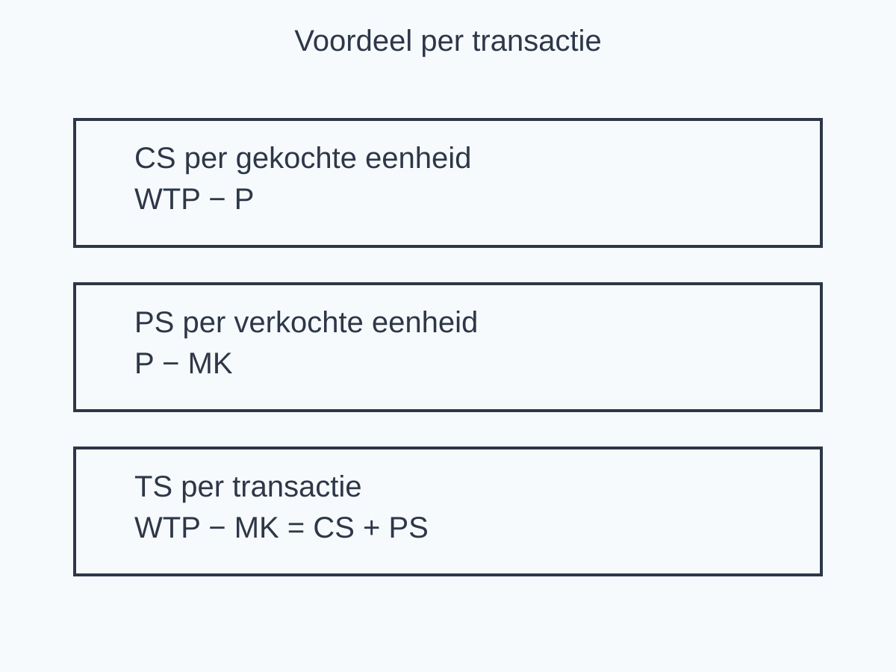{alt="Samenhang van CS, PS en TS en de grens van een verdelingsuitspraak." width=166mm}

Maximaal TS betekent **geen oordeel over eerlijkheid**. De som geeft geen norm voor hoe voordeel verdeeld zou moeten zijn en omvat niet alle omstandigheden die maatschappelijke welvaart bepalen. De conclusie geldt onder de gegeven toedeling en overige modelvoorwaarden, niet voor iedere markt in iedere situatie. We kiezen hiermee ook geen winstmaximaliserende afzet voor een onderneming.

**Vaste aanpak:** lees bronvoorwaarden, bereik, eenheden en werkelijke handel; stel vraag gelijk aan aanbod en controleer beide; markeer E en de twee gebieden; bereken basis × hoogte × ½ en tel in euro op; verklaar het maximum met de vergelijking vóór, bij en na E en begrens de conclusie.

## Uitgewerkt voorbeeld

Op één handelsdag worden identieke sporthanddoeken verhandeld. Vraag: P = 30 − Q; aanbod: P = 6 + Q, voor 0 ≤ Q ≤ 30. P is euro per handdoek en Q is handdoeken. We gebruiken een continu lineair marktmodel: de vraaglijn ordent betalingsbereidheid van hoog naar laag en de aanbodlijn geeft de marginale kosten van iedere opeenvolgende eenheid, ook buiten de werkelijk verkochte hoeveelheid. De hoogste vragers kopen van de aanbieders met de laagste marginale kosten. Iedereen betaalt dezelfde prijs; er zijn geen externe effecten of transactiekosten. Alle hoeveelheden in dit bereik zijn technisch mogelijk en alle andere omstandigheden blijven gelijk.

We beantwoorden vijf vragen: a) Wat zijn Pe en Qe? b) Waar liggen het evenwicht, CS en PS in de geleverde grafiek? c) Hoe groot zijn CS, PS en TS? d) Wat betekent de vergelijking bij Q = 10 en Q = 14? e) Waarom is TS maximaal bij Q = 12, zonder dat dit eerlijkheid bewijst?

**1. Kies de bronnen en bereken het evenwicht.** De functies beschrijven dezelfde handelsdag en dezelfde handdoeken. In het evenwicht leveren beide bij dezelfde Q dezelfde P:

30 − Q = 6 + Q → 24 = 2Q → Qe = 12 handdoeken.

Pe = 30 − 12 = € 18 per handdoek. Controle met aanbod: 6 + 12 = 18. Beide functies geven dezelfde prijs.

**2. Markeer de gebieden.** Het snijpunt E is (12, 18). Trek vanuit E de hulplijnen naar Q = 12 en P = 18. CS ligt boven de prijs en onder de vraaglijn, alleen van Q = 0 tot Q = 12. PS ligt onder de prijs en boven de aanbodlijn, over dezelfde werkelijk verkochte hoeveelheid. De lijnen zijn al gegeven; je voegt de markeringen toe.

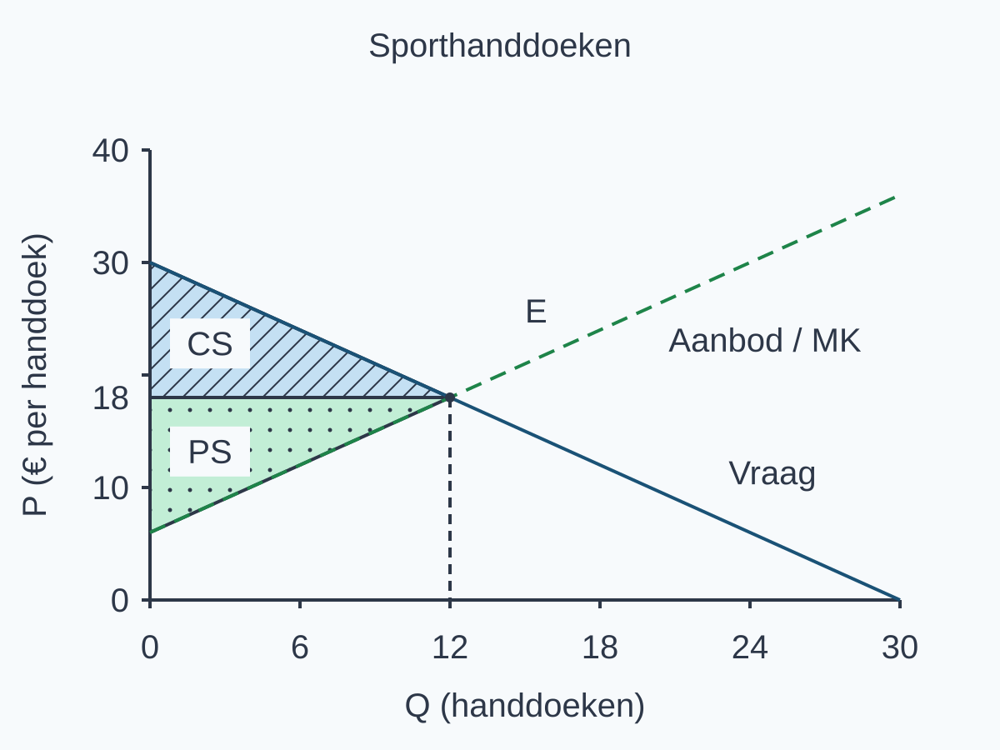{alt="Uitgewerkt surplusmodel voor sporthanddoeken." width=166mm}

**3. Bereken met basis, hoogte en eenheid.** Beide driehoeken hebben basis 12 handdoeken. Hun hoogten zijn prijsverschillen, niet automatisch de prijs zelf.

CS = ½ × 12 × (30 − 18) = ½ × 12 × 12 = € 72.

PS = ½ × 12 × (18 − 6) = ½ × 12 × 12 = € 72.

TS = CS + PS = € 72 + € 72 = € 144. Handdoeken × euro per handdoek geeft euro.

**4. Vergelijk betalingsbereidheid en marginale kosten.** Lees steeds dezelfde rij. De tabel beschrijft mogelijke hoeveelheden, niet alleen wat werkelijk wordt verkocht.

<table style="break-inside:avoid"><colgroup><col style="width:24%"><col style="width:38%"><col style="width:38%"></colgroup><thead><tr><th>Q (handdoeken)</th><th>Betalingsbereidheid (€ per handdoek)</th><th>MK (€ per handdoek)</th></tr></thead><tbody>
<tr><td>10</td><td>20</td><td>16</td></tr>
<tr><td>12</td><td>18</td><td>18</td></tr>
<tr><td>14</td><td>16</td><td>20</td></tr>
</tbody></table>

Bij Q = 10 is het marginale verschil 20 − 16 = +€ 4 per handdoek: extra handel rond die hoeveelheid voegt surplus toe. Bij Q = 14 is het 16 − 20 = −€ 4: extra handel daar verlaagt TS. De tabel geeft puntvergelijkingen in het continue model, niet een gemiddelde over een heel hoeveelheidinterval.

**5. Leg het maximum en zijn grens uit.** Voor 0 ≤ Q < 12 ligt vraag boven aanbod: de betalingsbereidheid is hoger dan MK en extra transacties voegen surplus toe. Bij Q = 12 zijn beide € 18; het marginale verschil is nul, maar het totale surplus is € 144. Voor 12 < Q ≤ 30 ligt vraag onder aanbod: extra transacties verlagen TS. Eerder stoppen laat positieve bijdragen liggen; verder doorgaan voegt negatieve bijdragen toe. Daarom is TS binnen deze modelvoorwaarden en dit bereik maximaal bij Q = 12. Dat CS en PS hier gelijk zijn, bepaalt geen norm voor een eerlijke verdeling. Het model omvat bovendien niet alle omstandigheden die maatschappelijke welvaart bepalen.

> **Onthoud**
>
> - Bij evenwicht leveren vraag en aanbod dezelfde prijs en hoeveelheid op.
> - CS ligt boven de prijs; PS ligt eronder en boven de aanbodlijn, alleen bij verkochte eenheden.
> - Bereken elk driehoeksgebied met 1/2×basis×hoogte; TS=CS+PS, in euro.
> - In dit model is aanbod de MK van iedere opeenvolgende eenheid; WTP−MK bepaalt het marginale surplus. PS is niet automatisch winst.
> - Maximaal TS bewijst geen eerlijke verdeling. Hierna onderzoek je wat een beperking van transacties met surplus doet.

## Startopgaven

Korte route: Startopgaven → Zelfstandige oefening → Doeloefening. Extra hulp nodig? Maak eerst Begeleide inoefening.

**Opgave 1 — Ophalen**

a\) **(2 punten)** Een markt voor sleutelhangers heeft Qv = 24 − 2P en Qa = 2P − 8, voor 4 ≤ P ≤ 12. P is euro per sleutelhanger, Q sleutelhangers. Bereken Pe en Qe en controleer beide functies. Welke variabele staat op elke as?

b\) **(2 punten)** Bij 10 boekenleggers zijn TK € 100, bij 15 zijn TK € 130, op dezelfde dag. Bereken MK over 10–15. Weet je hiermee precies de kosten van alleen de vijftiende boekenlegger?

> Gebruik dezelfde begin- en eindhoeveelheid: MK=ΔTK/ΔQ. Een intervalgemiddelde is niet vanzelf een afzonderlijke eenheidskost.

c\) **(1 punt)** In een gegeven continu marktmodel worden vier ansichtkaarten verkocht voor P = € 6 aan de kopers met de hoogste betalingsbereidheid. De lineaire vraaglijn loopt over deze verkochte eenheden van (Q = 0, P = 10) tot (Q = 4, P = 6). Bereken CS met basis en hoogte.

**Opgave 2 — Begripscheck**

Eén verkochte fietsbel heeft een betalingsbereidheid van € 15, marginale kosten van € 7 en een prijs van € 10. Vaste kosten zijn onbekend.

a\) **(1 punt)** Bereken het voordeel van koper en verkoper afzonderlijk.

b\) **(1 punt)** Bereken TS en controleer zonder de prijs te gebruiken.

c\) **(2 punten)** Een leerling noemt PS = € 3 de winst en TS = € 8 een bewijs dat de verdeling eerlijk is. Geef bij elke uitspraak de ontbrekende informatie of norm.

## Begeleide inoefening

Heb je deze hulp niet nodig? Ga dan verder met Zelfstandige oefening.

**Opgave 3 — Plantjes**

Voor identieke plantjes op één marktdag geldt vraag P = 18 − Q en aanbod P = 6 + Q, voor 0 ≤ Q ≤ 18. P is euro per plantje en Q plantjes. We gebruiken een continu lineair marktmodel. Aanbod geeft MK van iedere opeenvolgende eenheid in het hele bereik, ook van niet-verkochte eenheden. De hoogste vragers kopen van de aanbieders met de laagste MK; alle transacties hebben dezelfde prijs. Iedere hoeveelheid in dit bereik is technisch mogelijk, er zijn geen externe effecten of transactiekosten en andere omstandigheden blijven gelijk.

Het evenwicht is al berekend: 18 − Q = 6 + Q → 12 = 2Q → Qe = 6. Pe = 18 − 6 = 12; controle: 6 + 6 = 12. Beide driehoeken hebben basis 6 plantjes en hoogte € 6 per plantje: CS = ½ × 6 × (18 − 12) = € 18 en PS = ½ × 6 × (12 − 6) = € 18.

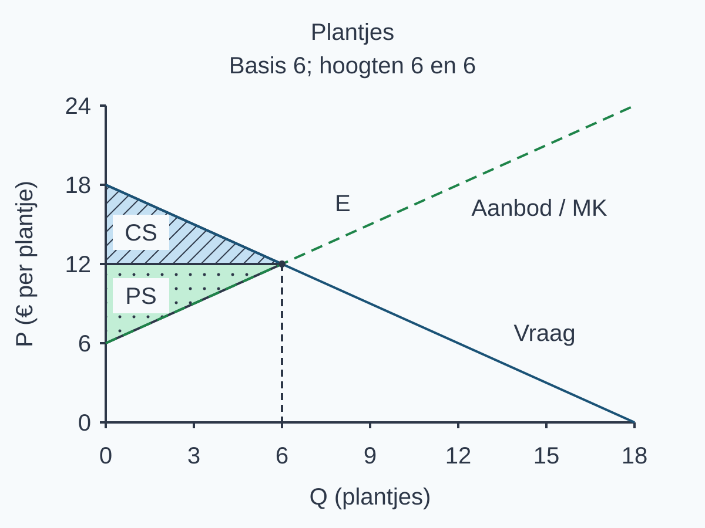{alt="Gemarkeerde surplusgebieden bij plantjes met basis en hoogten." width=166mm}

a\) **(2 punten)** Vul TS in en leg uit waarom je voor de PS-hoogte 12 − 6 gebruikt, niet 12.

<table style="break-inside:avoid"><colgroup><col style="width:24%"><col style="width:38%"><col style="width:38%"></colgroup><thead><tr><th>Q (plantjes)</th><th>Betalingsbereidheid (€ per plantje)</th><th>MK (€ per plantje)</th></tr></thead><tbody>
<tr><td>4</td><td>14</td><td>10</td></tr>
</tbody></table>

b\) **(1 punt)** Vul voor de tabelrij WTP − MK in en duid het teken.

c\) **(3 punten)** Waarom is TS bij deze plantjes maximaal bij Q = 6 binnen 0 ≤ Q ≤ 18, zonder dat dit een oordeel over eerlijkheid oplevert? Gebruik dezelfde geleverde grafiek en vul de zinnen aan. Schrijf daarna de laatste zin in eigen woorden.

- Voor 0 ≤ Q < 6 ligt de vraaglijn ... de aanbodlijn. De betalingsbereidheid is dus ... dan MK. Het toevoegen van zulke transacties laat TS ... .
- Bij Q = 6 zijn betalingsbereidheid en MK beide ... euro per plant. Hun verschil is ... . Het totale surplus is daar ... euro; dat is iets anders dan het marginale verschil.
- Voor 6 < Q ≤ 18 ligt de vraaglijn ... de aanbodlijn. De betalingsbereidheid is dan ... dan MK. Extra transacties na Q = 6 laten TS ... .
- Stoppen vóór Q = 6 laat ... liggen; doorgaan na Q = 6 voegt ... toe. Daarom is TS binnen dit modelbereik maximaal bij ... .
- Dit maximum geldt onder ... . Het bewijst niet dat de verdeling eerlijk is, want ... . Het is ook geen volledig maatschappelijk welvaartsoordeel, want ... .

**Opgave 4 — Kaarsen**

Voor identieke kaarsen op één avondmarkt geldt vraag P = 26 − 0,5Q en aanbod P = 8 + 0,25Q, voor 0 ≤ Q ≤ 52. P is euro per kaars en Q kaarsen. Dit is een continu lineair marktmodel: de aanbodlijn geeft MK van iedere opeenvolgende eenheid over het hele bereik, ook van niet-verkochte eenheden. De hoogste vragers kopen van de aanbieders met de laagste MK tegen dezelfde prijs. Alle genoemde hoeveelheden zijn technisch mogelijk. Er zijn geen externe effecten of transactiekosten; andere omstandigheden blijven gelijk.

De evenwichtsvergelijking is 26 − 0,5Q = 8 + 0,25Q. Hieruit volgt Qe = 24.

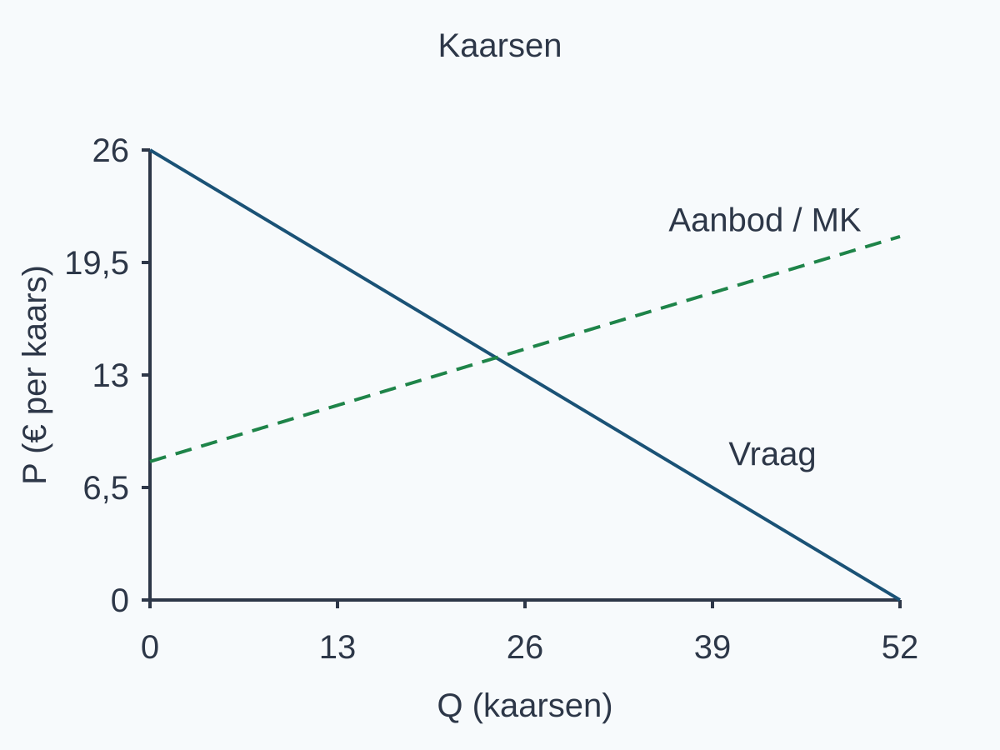{alt="Geleverde vraag- en aanbodlijnen voor kaarsen zonder antwoordmarkeringen." width=166mm}

a\) **(1 punt)** Bereken en controleer P.

b\) **(3 punten)** Markeer E, CS en PS en bereken CS, PS en TS met basis, hoogte en eenheid.

<table style="break-inside:avoid"><colgroup><col style="width:24%"><col style="width:38%"><col style="width:38%"></colgroup><thead><tr><th>Q (kaarsen)</th><th>Betalingsbereidheid (€ per kaars)</th><th>MK (€ per kaars)</th></tr></thead><tbody>
<tr><td>20</td><td>16</td><td>13</td></tr>
<tr><td>28</td><td>12</td><td>15</td></tr>
</tbody></table>

c\) **(1 punt)** Wat doet de marginale transactie bij elk van deze twee hoeveelheden met TS?

d\) **(3 punten)** Leg in een samenhangende uitleg uit waarom TS voor deze kaarsen maximaal is bij Q = 24 binnen 0 ≤ Q ≤ 52. Beoordeel daarbij: “Bij dat maximum is de verdeling dus eerlijk en is alle maatschappelijke welvaart gemeten.”

Denk aan de marginale vergelijking over het hele bereik.

**Opgave 5 — Een gegraveerde mok**

Eén gegraveerde mok wordt daadwerkelijk verkocht voor € 14. In het begin zijn de betalingsbereidheid € 18 en de marginale kosten € 10. De transactie en de prijs blijven in alle vier gevallen onveranderd. Alleen de hieronder genoemde bedragen veranderen; dit zijn marginale kosten per mok, geen vaste kosten.

<table style="break-inside:avoid"><colgroup><col style="width:34%"><col style="width:34%"><col style="width:16%"><col style="width:16%"></colgroup><thead><tr><th>Geval</th><th>Betalingsbereidheid (€)</th><th>MK (€)</th><th>Prijs (€)</th></tr></thead><tbody>
<tr><td>Begin</td><td>18</td><td>10</td><td>14</td></tr>
<tr><td>Alleen betalingsbereidheid verandert</td><td>20</td><td>10</td><td>14</td></tr>
<tr><td>Alleen MK verandert</td><td>18</td><td>13</td><td>14</td></tr>
<tr><td>Beide veranderen</td><td>20</td><td>13</td><td>14</td></tr>
</tbody></table>

a\) **(1 punt)** Alleen de betalingsbereidheid verandert. Bereken CS, PS en TS.

b\) **(1 punt)** Alleen MK verandert. Bereken CS, PS en TS.

c\) **(1 punt)** Beide veranderen. Bereken CS, PS en TS en vergelijk met het begin.

d\) **(1 punt)** Een leerling zegt: “Twee bedragen stijgen, dus TS stijgt.” Waarom is dat onjuist?

## Zelfstandige oefening

**Opgave 6 — Fruitrepen**

Op een eendaags sportevenement worden identieke verse fruitrepen verhandeld. Vraag: P = 36 − 0,5Q; aanbod: P = 6 + 0,25Q, voor 0 ≤ Q ≤ 72. P is euro per reep en Q fruitrepen. Het continue lineaire marktmodel geeft via de aanbodlijn MK van iedere opeenvolgende eenheid in het hele bereik, ook van niet-verkochte eenheden. De hoogste vragers kopen van de aanbieders met de laagste MK tegen dezelfde prijs. Alle hoeveelheden binnen dit bereik zijn technisch mogelijk. Er zijn geen externe effecten of transactiekosten en overige omstandigheden blijven gelijk.

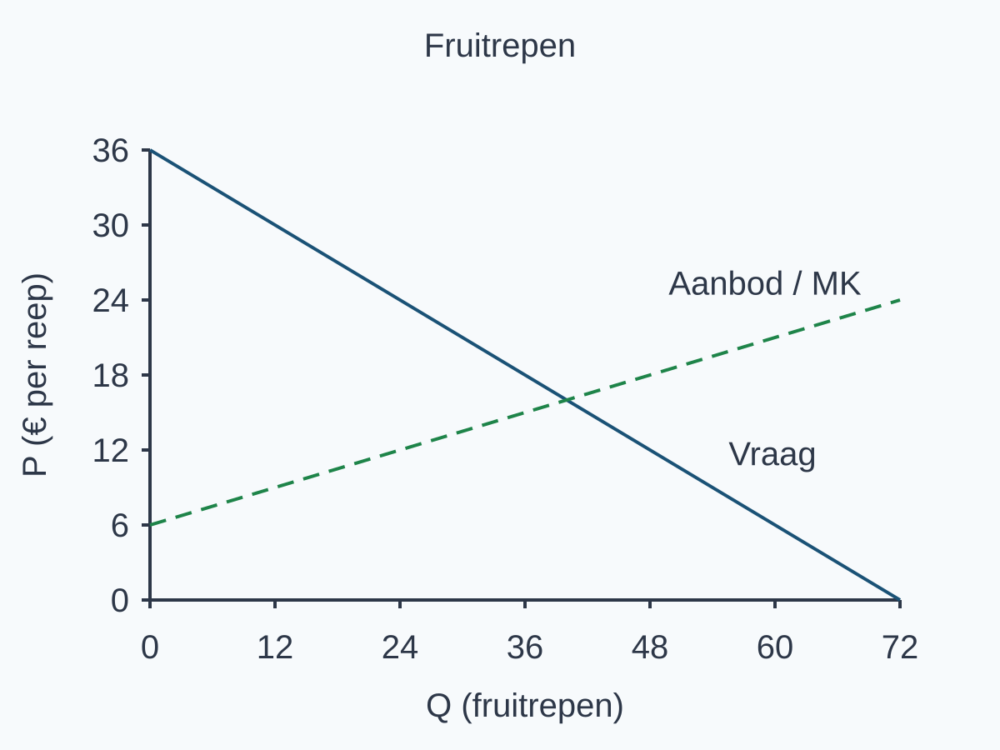{alt="Geleverde vraag- en aanbodlijnen voor fruitrepen zonder antwoordmarkeringen." width=166mm}

<table style="break-inside:avoid"><colgroup><col style="width:24%"><col style="width:38%"><col style="width:38%"></colgroup><thead><tr><th>Q (fruitrepen)</th><th>Betalingsbereidheid (€ per reep)</th><th>MK (€ per reep)</th></tr></thead><tbody>
<tr><td>32</td><td>20</td><td>14</td></tr>
<tr><td>48</td><td>12</td><td>18</td></tr>
</tbody></table>

a\) **(2 punten)** Bereken en controleer Pe en Qe.

b\) **(2 punten)** Markeer het evenwicht en arceer en benoem CS en PS in de geleverde grafiek. Teken de lijnen niet opnieuw.

c\) **(3 punten)** Bereken CS, PS en TS met basis, hoogte en eenheid.

d\) **(2 punten)** Vergelijk met de tabel de marginale bijdragen bij Q = 32 en Q = 48.

e\) **(2 punten)** Leg uit waar TS maximaal is in dit model en waarom dit niet beslist of de verdeling eerlijk is.

**Opgave 7 — Inpakkraam**

Een inpakkraam verkocht 20 pakketten voor € 8 per pakket. Een gegeven analyse meldt een PS van € 60. Vaste en totale kosten zijn niet gegeven.

**(2 punten)** Welke bron geeft de omzet, welke het PS? Kun je de winst vaststellen? Leg uit.

## Doeloefening

**Opgave 8**

Voor concertkaartjes geldt vraag P=50−0,5Q en aanbod P=5+0,25Q. P is in euro per kaartje en Q in kaartjes. Binnen dit marktmodel stelt de inverse aanbodlijn voor 0≤Q≤100 de marginale kosten van iedere opeenvolgende eenheid voor, ook als die eenheid in het evenwicht niet wordt verkocht.

**Basisgrafiek**

Een assenstelsel met horizontaal Q (kaartjes) van 0 tot 100 en verticaal P (€ per kaartje) van €0 tot €50. De lijnen vraag en aanbod zijn volledig getekend en gelabeld; evenwicht, CS en PS zijn nog niet gemarkeerd.

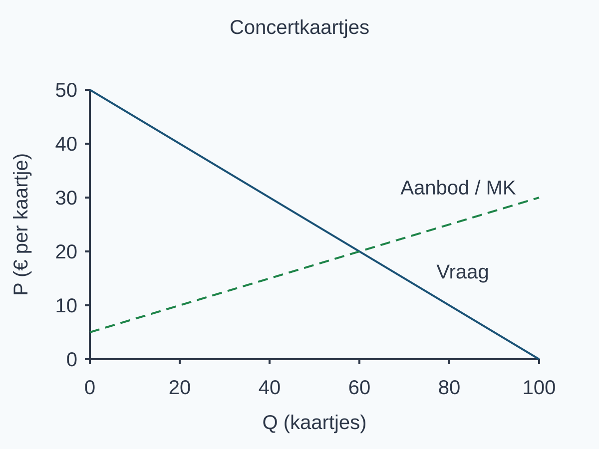{alt="Basisgrafiek voor concertkaartjes met vraag en aanbod zonder antwoordmarkeringen." width=166mm}

**Marginale vergelijking**

De waarden zijn met de gegeven vraag- en aanbodfunctie berekend.

<table style="break-inside:avoid"><colgroup><col style="width:24%"><col style="width:38%"><col style="width:38%"></colgroup><thead><tr><th>Q</th><th>betalingsbereidheid volgens vraaglijn</th><th>marginale kosten volgens aanbodlijn</th></tr></thead><tbody>
<tr><td>50</td><td>€25</td><td>€17,50</td></tr>
<tr><td>70</td><td>€15</td><td>€22,50</td></tr>
</tbody></table>

a\) **(2 punten)** Bereken de evenwichtsprijs en -hoeveelheid.

b\) **(2 punten)** Markeer het evenwicht in de basisgrafiek en arceer en benoem CS en PS. Teken de lijnen niet opnieuw.

c\) **(3 punten)** Bereken CS, PS en TS met basis, hoogte en eenheid.

d\) **(2 punten)** Vergelijk met de tabel bij Q=50 en Q=70 de betalingsbereidheid met de marginale kosten en geef per hoeveelheid aan of één extra transactie TS verhoogt of verlaagt.

e\) **(2 punten)** Leg uit waarom TS in dit model maximaal is bij Q=60 en waarom dit geen oordeel over een eerlijke verdeling oplevert.

## Denkertje / Bonusopgave

**Opgave 9 — Een andere prijs (optioneel)**

Voor één al afgesproken reparatie van een theaterkostuum is de betalingsbereidheid € 22, zijn de marginale kosten € 9 en is de prijs € 14. Bekijk alleen deze transactie. De partijen, het werk, de kwaliteit en de kosten blijven gelijk; de reparatie vindt bij alle beschouwde prijzen plaats.

Ontwerp een andere prijs dan € 14 waarvoor beide partijen nog voordeel hebben. Laat zien wat er met CS, PS en TS gebeurt. Beoordeel de uitspraak: “Een hoger PS bewijst een groter totaal surplus én een eerlijkere verdeling.”

## Herhaling / Herhaling en interleaving

**Opgave 10 — Een interval**

**(2 punten)** Bij 4 bedrukte etiketten zijn TK € 38; bij 10 zijn TK € 62, op dezelfde dag. Bereken MK over 4–10 en leg uit waarom dit niet automatisch de kosten van alleen het tiende etiket zijn.

**Opgave 11 — Wie koopt?**

**(2 punten)** Drie kopers willen maximaal € 9, € 6 en € 3 betalen voor ieder één badge. De prijs is € 6; er is voldoende voorraad. Wie minstens de prijs wil betalen, koopt. Wie koopt en hoe groot is het gezamenlijke CS?
