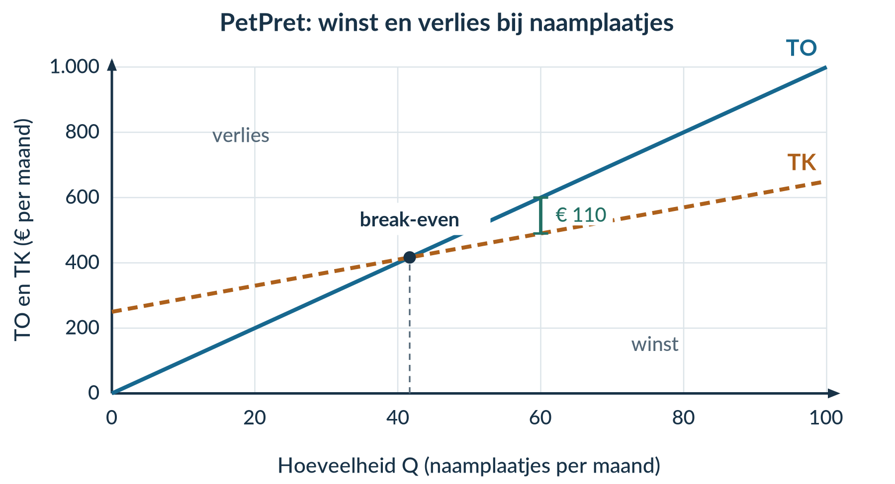

# 2.1.1 Kostenstructuren

## Opgave 1 · Even ophalen

**a)** Vul N = 20 in: R = 40 + 3 × 20 = 40 + 60 = **€ 100 voor de uitstap**.

*Waarom:* het bedrag bestaat uit € 40 plus € 3 voor elk van de 20 deelnemers.

**b)** Bedrag per deelnemer = R / N = 100 / 20 = **€ 5 per deelnemer**.

*Waarom:* je verdeelt het hele bedrag, dus ook de € 40, over de groep.

## Opgave 2 · Begripscheck

**a)** Huur: **€ 600 per maand bij beide hoeveelheden**. Inkt bij 500 posters: 0,20 × 500 = **€ 100 per maand**. Inkt bij 1.000 posters: 0,20 × 1.000 = **€ 200 per maand**.

*Waarom:* de huur verandert niet met het aantal posters. Het totale inktbedrag groeit wel mee. De productie blijft onder de capaciteit.

**b)** € 600 per maand zijn de **TCK**, niet de GCK. GCK = TCK / Q. Bij 500 posters: 600 / 500 = **€ 1,20 per poster**; bij 1.000 posters: 600 / 1.000 = **€ 0,60 per poster**.

*Waarom:* TCK gaan over de hele maand, GCK over één poster.

## Opgave 3 · TasDruk

**a)** ‘Het totale maandbedrag blijft **€ 120** als het aantal tassen **verandert, tot en met de capaciteit van 500 tassen per maand**.’

*Waarom:* de afgesproken huur hangt deze maand niet af van Q.

**b)** TCK = **120**. Variabele kosten per tas = 0,40 + 0,10 = **€ 0,50**. Dus **TVK = 0,50Q** en **TK = 120 + 0,50Q**, in euro per maand.

*Waarom:* tel eerst de vaste bedragen en de bedragen per tas afzonderlijk op. Alleen het bedrag per tas vermenigvuldig je met Q.

**c)** Bij Q = 200: TK = 120 + 0,50 × 200 = € 220; GTK = 220 / 200 = € 1,10. Bij Q = 400: TVK = 0,50 × 400 = € 200; TK = 120 + 200 = € 320; GTK = 320 / 400 = € 0,80.

| Q (tassen per maand) | TCK (€ per maand) | TVK (€ per maand) | TK (€ per maand) | GTK (€ per tas) |
|---:|---:|---:|---:|---:|
| 200 | 120 | 100 | 220 | 1,10 |
| 400 | 120 | 200 | 320 | 0,80 |

*Waarom:* TK bevatten beide kostensoorten. Voor GTK deel je TK door alle geproduceerde tassen.

**d)** Bij Q = 200: GCK = 120 / 200 = **€ 0,60 per tas**; GVK = 100 / 200 = **€ 0,50 per tas**. Bij Q = 400: GCK = 120 / 400 = **€ 0,30 per tas**; GVK = 200 / 400 = **€ 0,50 per tas**.

*Waarom:* GTK daalt doordat dezelfde constante kosten over meer tassen worden verdeeld. GVK blijft € 0,50 per tas, omdat materiaal en inkt per tas evenveel blijven kosten.

## Opgave 4 · SleutelStudio

**a)** **Constant:** huur en abonnement. Hun totale maandbedragen veranderen niet met Q. **Variabel:** materiaal en verpakking. Hun totale bedragen stijgen als meer sleutelhangers worden gemaakt.

*Waarom:* het gedrag van het totale bedrag bepaalt de indeling.

**b)** TCK = 90 + 30 = **120**. Variabele kosten per sleutelhanger = 1,20 + 0,30 = **€ 1,50**. Dus **TVK = 1,50Q** en **TK = 120 + 1,50Q**, in euro per maand.

*Waarom:* de vaste bedragen tel je op; de bedragen per product vermenigvuldig je met Q.

**c)** Gebruik GCK = TCK / Q, GVK = TVK / Q en GTK = TK / Q.

| Q (per maand) | GCK (€ per sleutelhanger) | GVK (€ per sleutelhanger) | GTK (€ per sleutelhanger) |
|---:|---:|---:|---:|
| 100 | 120 / 100 = 1,20 | 150 / 100 = 1,50 | 270 / 100 = 2,70 |
| 200 | 120 / 200 = 0,60 | 300 / 200 = 1,50 | 420 / 200 = 2,10 |

*Waarom:* **GCK halveert**, omdat dezelfde € 120 over tweemaal zoveel producten wordt verdeeld. GVK blijft gelijk. GTK daalt maar halveert niet, doordat alleen het constante deel per product halveert.

## Opgave 5 · Twee veranderingen bij TafelTint

**a)** April: TVK = 1 × 200 = € 200; TK = 200 + 200 = **€ 400**. Mei: TVK = 0,80 × 200 = € 160; TK = 240 + 160 = **€ 400**.

| Maand | TCK (€ per maand) | TVK (€ per maand) | TK (€ per maand) |
|---|---:|---:|---:|
| April | 200 | 200 | 400 |
| Mei | 240 | 160 | 400 |

*Waarom:* bereken beide veranderingen. Alleen naar de huur kijken geeft geen volledig kostenbeeld.

**b)** De huurverhoging verhoogt **TCK met € 40 per maand**. De lagere materiaalprijs verlaagt **TVK bij Q = 200 met € 40 per maand**.

*Waarom:* huur is binnen elke maand onafhankelijk van Q. Een andere maandhuur maakt de huur nog geen variabele kostenpost.

**c)** De uitspraak is **onjuist**. Het effect van de hogere huur (+€ 40) wordt precies gecompenseerd door goedkoper materiaal (−€ 40). TK blijft **€ 400 per maand**.

*Waarom:* twee veranderingen kunnen elkaar opheffen.

## Opgave 6 · FietsGlans

**a)** Huur en verzekering zijn constant: hun maandbedragen veranderen niet met Q. Reinigingsmiddel en beschermhoes zijn variabel: hun totale kosten groeien mee met Q. TCK = 240 + 60 = **300**; TVK = (0,60 + 0,40)Q = **Q**; **TK = 300 + Q**, in euro per maand.

*Waarom:* kosten per fiets vermenigvuldig je met het aantal fietsen; vaste maandbedragen niet.

**b)** Gebruik steeds totaalbedrag / Q.

| Q (fietsen per maand) | GCK (€ per fiets) | GVK (€ per fiets) | GTK (€ per fiets) |
|---:|---:|---:|---:|
| 200 | 300 / 200 = 1,50 | 200 / 200 = 1,00 | 500 / 200 = 2,50 |
| 400 | 300 / 400 = 0,75 | 400 / 400 = 1,00 | 700 / 400 = 1,75 |

*Waarom:* GCK daalt door spreiding over meer fietsen. GVK blijft gelijk door het vaste bedrag per fiets.

**c)** TK bij 200 fietsen = 300 + 200 = **€ 500 per maand**. TK bij 400 fietsen = 300 + 400 = **€ 700 per maand**.

*Waarom:* meer fietsen kosten samen meer materiaal. Toch worden de constante kosten over meer fietsen verdeeld. Daardoor stijgt TK, terwijl GTK daalt.

## Opgave 7 · Doeloefening · Bakkerij De Korenaar

**a)**

| Kostenpost | Soort | Reden |
|---|---|---|
| Huur en verzekering | Constant | Het totale maandbedrag van € 440 verandert niet met Q. |
| Netaansluiting en abonnement | Constant | Het totale maandbedrag van € 60 verandert niet met Q. |
| Meel en verpakking | Variabel | Het totale bedrag stijgt met € 0,70 per extra brood. |
| Elektriciteitsverbruik ovens | Variabel | Het totale bedrag stijgt met € 0,10 per extra brood. |

*Waarom:* aansluiting en stroomverbruik hebben een verschillend kostenpatroon. Beoordeel ze afzonderlijk, ook als ze op één energierekening staan.

**b)** TCK = 440 + 60 = **500**. Variabele kosten per brood = 0,70 + 0,10 = **€ 0,80**. Dus **TVK = 0,80Q** en **TK = 500 + 0,80Q**, in euro per maand.

*Waarom:* de totale vaste bedragen tel je bij elkaar op. De kosten per brood worden met Q vermenigvuldigd.

**c)** Bij Q = 500: TVK = 0,80 × 500 = € 400; TK = 500 + 400 = € 900.

GCK = 500 / 500 = **€ 1,00 per brood**. GVK = 400 / 500 = **€ 0,80 per brood**. GTK = 900 / 500 = **€ 1,80 per brood**.

*Waarom:* elk gemiddelde verdeelt het bijbehorende maandbedrag over de 500 broden.

**d)** Bij Q = 1.000: TVK = 0,80 × 1.000 = € 800; TK = 500 + 800 = € 1.300.

GCK = 500 / 1.000 = **€ 0,50 per brood**. GVK = 800 / 1.000 = **€ 0,80 per brood**. GTK = 1.300 / 1.000 = **€ 1,30 per brood**.

*Waarom:* de capaciteit is nog niet overschreden. De vaste maandbedragen en de variabele kosten per brood blijven daarom volgens de gegevens hetzelfde.

**e)**

| Q (broden per maand) | TCK (€ per maand) | TVK (€ per maand) | TK (€ per maand) |
|---:|---:|---:|---:|
| 500 | 500 | 400 | 900 |
| 1.000 | 500 | 800 | 1.300 |

TCK blijft gelijk. TVK verdubbelt. TK stijgt, maar verdubbelt niet. **GCK halveert van € 1,00 naar € 0,50 per brood; GVK blijft € 0,80 per brood; GTK daalt van € 1,80 naar € 1,30 per brood.**

*Waarom:* dezelfde TCK worden over tweemaal zoveel broden verdeeld. De variabele kosten per brood veranderen niet. Alleen het vaste deel van GTK halveert. Dit geldt voor de genoemde maand en productie tot en met de capaciteit van 1.000 broden.

## Opgave 8 · Denkertje · Eén rekening vertelt niet alles

**Een mogelijk modelantwoord bij a–c**

Neem model A: **TK = 100 + 2Q**. Neem model B: **TK = 200 + Q**. Bij Q = 100 geven beide € 300: 100 + 2 × 100 = 300 en 200 + 100 = 300.

Bij Q = 200 geeft A: 100 + 2 × 200 = **€ 500**. B geeft: 200 + 200 = **€ 400**. De uitspraak is dus onjuist. Eén waarneming vertelt niet welk deel constant en welk deel variabel is. Beide modellen kunnen bij de waarneming passen, maar een andere voorspelling opleveren.

**Beoordelingscriteria:** twee verschillende passende functies met positieve TCK en constante variabele kosten per product; een juiste controle bij Q = 100 en vergelijking bij Q = 200; een uitleg waarom één waarneming onvoldoende is. Andere geldige functies zijn ook goed.

## Opgave 9 · Herhaling · Procenten

Toename = 648 − 540 = **108 leden**. Procentuele stijging = (108 / 540) × 100% = **20%**.

*Waarom:* het oorspronkelijke aantal van 540 leden is de basis van de vergelijking. Herhaal §1.1.2 als je de noemer lastig vindt.

## Opgave 10 · Herhaling · Tabel lezen

**a)** Bij 10 deelnemers lees je **€ 30 voor de groep** af. Per persoon: 30 / 10 = **€ 3**.

*Waarom:* de tabel geeft het totaalbedrag, niet de prijs per persoon.

**b)** Van 5 naar 10 deelnemers: 30 − 20 = **€ 10 extra voor de groep**. Per extra deelnemer: 10 / 5 = **€ 2**. Van 10 naar 15 deelnemers is de uitkomst hetzelfde.

*Waarom:* de stijging van het totaal hoort bij vijf extra deelnemers samen. Herhaal §1.1.3 bij moeite met het aflezen.

# 2.1.2 Opbrengsten, winst en break-even

## Opgave 1 · Kosten ophalen

**a)** TK = 180 + 3 × 40 = 180 + 120 = **€ 300 per week**. GTK = TK / Q = 300 / 40 = **€ 7,50 per badge**.

*Waarom:* eerst bereken je alle kosten; daarna verdeel je die over de 40 badges.

**b)** **TCK = € 180 per week**. De variabele kosten zijn **€ 3 per badge**.

*Waarom:* 180 staat los van Q; 3 wordt vermenigvuldigd met Q.

## Opgave 2 · Opbrengst is niet hetzelfde als winst

**a)** TO = P × Q = 4 × 80 = **€ 320 voor de activiteit**. GO = TO / Q = 320 / 80 = **€ 4 per entreekaart**. Winst = TO − TK = 320 − 250 = **€ 70 voor de activiteit**.

*Waarom:* opbrengst komt van klanten. Voor winst moeten alle kosten er nog af.

**b)** De leerling verwart **TO met winst**. De € 320 is omzet. Na aftrek van € 250 kosten blijft **€ 70 winst** over.

*Waarom:* een hoog verkoopbedrag is op zichzelf geen bewijs van winst.

## Opgave 3 · SokkenShop

**a)** Het snijpunt ligt bij **Q = 60 paar sokken per week**. Daar zijn TO en TK allebei **€ 360 per week**. Controle: 6 × 60 = 360 en 180 + 3 × 60 = 360.

*Waarom:* bij het snijpunt zijn opbrengsten en kosten gelijk.

**b)** Bij Q = 90: TO = 6 × 90 = **€ 540 per week**; TK = 180 + 3 × 90 = **€ 450 per week**; winst = 540 − 450 = **€ 90 per week**.

*Waarom:* het verticale lijnstuk verbindt TO en TK bij dezelfde Q. De lengte geeft hun verschil in euro per week weer. De volledig gemarkeerde grafiek staat bij de opgave in het hoofdstuk.

**c)** TO = **6 × Q**, dus GO = 6Q / Q = **€ 6 per paar** voor Q > 0.

*Waarom:* ieder paar wordt voor dezelfde prijs verkocht.

## Opgave 4 · KaartKunst

**a)** TO = P × Q = **4Q**. Bij Q = 0: TO = 4 × 0 = **€ 0 per week**. Bij Q = 120: TO = 4 × 120 = **€ 480 per week**. Trek TO door (0; 0) en (120; 480).

*Waarom:* een vaste prijs levert een rechte opbrengstenlijn door de oorsprong op.

**b)** 4Q = 120 + Q → 3Q = 120 → **Q = 40 kaarten per week**. TO = 4 × 40 = **€ 160 per week**. Het snijpunt is (40; 160). Onder 40 kaarten is er verlies; boven 40 tot en met de capaciteit is er winst.

*Waarom:* links van het snijpunt ligt TK boven TO; rechts ligt TO boven TK.

**c)** Bij Q = 90: TO = 4 × 90 = € 360; TK = 120 + 90 = € 210; winst = 360 − 210 = **€ 150 per week**.

*Waarom:* het gaat om een verticale afstand bij Q = 90, niet om een oppervlakte tussen de lijnen.

<figure><figcaption>Grafiekantwoord. Verlies bij Q &lt; 40; winst bij 40 &lt; Q ≤ 120.</figcaption></figure>

## Opgave 5 · TheeTuin

**a)** TO = TK → 4Q = 180 + Q → 3Q = 180 → **Q = 60 pakketten per week**.

Bij Q = 40: TO = 4 × 40 = € 160; TK = 180 + 40 = € 220. **TK ligt boven TO.** Bij Q = 100: TO = 4 × 100 = € 400; TK = 180 + 100 = € 280. **TO ligt boven TK.**

*Waarom:* onder de break-even-afzet is er verlies, erboven winst, zolang de gegeven functies gelden.

**b)** Mogelijke punten voor TO: **(0; 0)** en **(100; 400)**. Voor TK: **(0; 180)** en **(100; 280)**. De eerste coördinaat is pakketten per week; de tweede euro per week.

Bij Q = 100: verticale afstand = TO − TK = 400 − 280 = **€ 120 winst per week**.

*Waarom:* twee punten bepalen een rechte lijn. Het verschil tussen de twee lijnhoogten bij dezelfde Q geeft winst.

## Opgave 6 · PetPret

**a)** **TO = 10Q**. Bij Q = 60: TO = 10 × 60 = € 600; GO = 600 / 60 = **€ 10 per naamplaatje**.

*Waarom:* alle naamplaatjes hebben dezelfde verkoopprijs. Daarom geldt bij Q > 0: GO = P.

**b)** Bij Q = 30: TO = 10 × 30 = € 300; TK = 250 + 4 × 30 = € 370. Winst = 300 − 370 = **−€ 70 per maand**, dus € 70 verlies. Bij Q = 60: TO = € 600; TK = 250 + 4 × 60 = € 490. Winst = 600 − 490 = **€ 110 per maand**.

*Waarom:* pas na aftrek van zowel vaste als variabele kosten zie je het resultaat.

**c)** 10Q = 250 + 4Q → 6Q = 250 → Q = 250 / 6 = **41,67 naamplaatjes per maand volgens de rechte lijnen**. Het eerste gehele aantal zonder verlies is **42**. Controle: winst bij 41 = 410 − 414 = −€ 4; bij 42 = 420 − 418 = **€ 2**.

*Waarom:* je kunt geen deel van een naamplaatje verkopen. Naar 41 afronden zou nog verlies opleveren.

**d)** Horizontaal: naamplaatjes per maand; verticaal: TO en TK in euro per maand. TO gaat door (0; 0) en (100; 1.000). TK gaat door (0; 250) en (100; 650). Het snijpunt is ongeveer **(41,67; 416,67)**. Er is verlies links en winst rechts van het snijpunt, tot de capaciteit van 100.

*Waarom:* TO ligt rechts boven TK. Het lijnstuk bij Q = 60 loopt van € 490 tot € 600 en geeft € 110 winst weer.

<figure><figcaption>Grafiekantwoord. Geen oppervlakte inkleuren als winst.</figcaption></figure>

## Opgave 7 · Een indrukwekkend verkoopbedrag

Winst = TO − TK = 2.000 − 2.020 = **−€ 20 op zaterdag**, dus **€ 20 verlies**. De uitspraak is onjuist.

*Waarom:* de kosten zijn hoger dan de omzet. De hoogte van de omzet alleen zegt niet of er winst is.

## Opgave 8 · Doeloefening · Bakkerij De Korenaar

**a)** TO = P × Q = **1,50Q**, in euro per maand. Voor Q > 0: GO = TO / Q = 1,50Q / Q = **€ 1,50 per brood**.

*Waarom:* ieder brood brengt dezelfde prijs op. Het gemiddelde van die gelijke prijzen is weer € 1,50.

**b)** Bij Q = 500: TO = 1,50 × 500 = € 750; TK = 500 + 0,80 × 500 = € 900. Winst = 750 − 900 = **−€ 150 per maand**.

Bij Q = 1.000: TO = 1,50 × 1.000 = € 1.500; TK = 500 + 0,80 × 1.000 = € 1.300. Winst = 1.500 − 1.300 = **€ 200 per maand**.

*Waarom:* bij 500 broden is de opbrengst onvoldoende om alle kosten te dekken. Bij 1.000 broden is de opbrengst wel hoger dan de kosten.

**c)** Stel TO gelijk aan TK en los de vergelijking op:

1,50Q = 500 + 0,80Q 0,70Q = 500 Q = 500 / 0,70 = 714,285714…

Volgens de rechte lijnen is de break-even-afzet ongeveer **714,29 broden per maand**. De bijbehorende opbrengst is 1,50 × (500 / 0,70) ≈ **€ 1.071,43 per maand**.

Het eerste gehele aantal broden zonder verlies is **715**. Controle: bij 714 is winst = 0,70 × 714 − 500 = −€ 0,20; bij 715 is winst = 0,70 × 715 − 500 = **€ 0,50 per maand**.

*Waarom:* de lijnberekening mag tussen gehele aantallen uitkomen. Bij echte broden heb je het eerstvolgende gehele aantal nodig om geen verlies te maken. Dat is niet exact hetzelfde als winst nul.

**d)** Horizontaal: **Q, broden per maand**. Verticaal: **TO en TK, euro per maand**. TO gaat door (0; 0) en (1.000; 1.500). TK gaat door (0; 500) en (1.000; 1.300). Markeer het snijpunt **(714,29; 1.071,43)**. Links is er verlies; rechts is er winst, tot en met de capaciteit van 1.000 broden.

*Waarom:* de winst bij Q = 1.000 is de verticale afstand tussen € 1.300 en € 1.500: **€ 200 per maand**. Een oppervlakte is hier geen winstbedrag.

<figure><figcaption>Volledig grafiekantwoord. De as loopt iets verder door voor de labels; de kosten- en opbrengstenlijnen stoppen bij de capaciteit.</figcaption></figure>

## Opgave 9 · Denkertje · Uitverkocht, maar toch verlies

**Een mogelijk modelantwoord bij a–b**

Uitverkocht betekent Q = 80. TO = 8 × 80 = **€ 640 per voorstelling**. TK = 500 + 2 × 80 = **€ 660 per voorstelling**. Winst = 640 − 660 = **−€ 20 per voorstelling**.

Break-even: 8Q = 500 + 2Q → 6Q = 500 → Q = **83,33 bezoekers** volgens de rechte lijnen. Het eerste gehele aantal zonder verlies zou 84 zijn. Dat past niet in het theater. ‘Uitverkocht’ betekent dus niet automatisch ‘winst’.

**Verandering 1:** verlaag alleen TCK naar **€ 480 per voorstelling**. Bij 80 bezoekers worden TK = 480 + 2 × 80 = € 640 en TO = € 640. De voorstelling is dan precies break-even.

**Verandering 2:** houd de oorspronkelijke kosten en verhoog alleen de prijs naar **€ 8,25 per kaartje**. Als alle 80 kaarten worden verkocht, is TO = 8,25 × 80 = € 660 = TK. Ook dan is de voorstelling precies break-even. De berekening bewijst niet dat alle kaarten bij de hogere prijs werkelijk worden verkocht.

**Beoordelingscriteria:** juiste verlies- en break-evenberekening; expliciete vergelijking met 80 zitplaatsen; twee verschillende, kloppende wijzigingen zonder capaciteitsuitbreiding. Andere passende wijzigingen, zoals lagere variabele kosten, zijn ook goed.

## Opgave 10 · Herhaling · Totaal en gemiddeld

TCK = **€ 400 per maand**. TVK = 6 × 100 = **€ 600 per maand**. TK = 400 + 600 = **€ 1.000 per maand**.

GCK = 400 / 100 = **€ 4 per boek**. GVK = 600 / 100 = **€ 6 per boek**. GTK = 1.000 / 100 = **€ 10 per boek**.

*Waarom:* de eerste drie bedragen gaan over de hele productie. De laatste drie delen die bedragen door het aantal boeken. Controle: 4 + 6 = 10. Herhaal §2.1.1 bij verwarring tussen totaal en gemiddeld.

## Opgave 11 · Herhaling · Procenten blijven handig

**a)** Procentuele omzetstijging = ((1.400 − 1.250) / 1.250) × 100% = (150 / 1.250) × 100% = **12%**.

*Waarom:* de oude omzet vormt de basis. Herhaal §1.1.2 bij twijfel over de noemer.

**b)** **Nee.** Winst = TO − TK. De kosten van beide maanden ontbreken. Daardoor kun je de winstbedragen en hun procentuele verandering niet bepalen.

*Waarom:* omzetgroei kan samengaan met een andere kostenontwikkeling.

# 2.1.3 Marginale kosten en marginale opbrengsten

## Opgave 1 · Kosten, opbrengst en winst ophalen

Bij Q = 10: TK = 60 + 2 × 10 = € 80; TO = 5 × 10 = € 50; winst = 50 − 80 = −€ 30. Bij Q = 20: TK = 60 + 2 × 20 = € 100; TO = 5 × 20 = € 100; winst = 100 − 100 = € 0.

| Q (spellen per week) | TK (€ per week) | TO (€ per week) | Winst (€ per week) |
|---:|---:|---:|---:|
| 10 | 80 | 50 | −30 |
| 20 | 100 | 100 | 0 |

*Waarom:* winst is het verschil tussen opbrengst en kosten bij dezelfde hoeveelheid. Een negatief resultaat betekent verlies.

## Opgave 2 · Welk getal hoort onder de breuk?

Noor vergeet te delen door het aantal **extra kaarsen**. ΔQ = 30 − 20 = 10; ΔTK = 140 − 100 = € 40.

MK = ΔTK / ΔQ = (140 − 100) / (30 − 20) = 40 / 10 = **€ 4 per extra kaars**, voor de stap van 20 naar 30 kaarsen.

*Waarom:* de € 40 is de kostenstijging voor tien extra kaarsen samen, niet voor één kaars.

## Opgave 3 · HoesHandig

**a)** ΔQ = 10 − 0 = **10 hoesjes**; ΔTK = 130 − 100 = **€ 30**; ΔTO = 80 − 0 = **€ 80**.

*Waarom:* gebruik voor alle verschillen dezelfde twee rijen.

**b)** MK = ΔTK / ΔQ = 30 / 10 = **€ 3 per extra hoesje**. MO = ΔTO / ΔQ = 80 / 10 = **€ 8 per extra hoesje**. Zet beide waarden bij Q = 10.

*Waarom:* de uitkomsten horen bij de stap van 0 naar 10 hoesjes. De laatste rij is alleen de afgesproken plaats om ze te noteren.

**c)** Winst per rij: 0 − 100 = −€ 100; 80 − 130 = −€ 50; 160 − 160 = € 0; 240 − 190 = € 50.

Voor de volgende stappen: MK = (160 − 130) / 10 = 3 en (190 − 160) / 10 = 3. MO = (160 − 80) / 10 = 8 en (240 − 160) / 10 = 8.

| Q (per week) | TK (€ per week) | TO (€ per week) | Winst (€ per week) | MK (€ per extra hoesje) | MO (€ per extra hoesje) |
|---:|---:|---:|---:|---:|---:|
| 0 | 100 | 0 | −100 | — | — |
| 10 | 130 | 80 | −50 | 3 | 8 |
| 20 | 160 | 160 | 0 | 3 | 8 |
| 30 | 190 | 240 | 50 | 3 | 8 |

*Waarom:* ieder extra hoesje brengt dezelfde verkoopprijs van € 8 op. Daarom blijft MO constant.

## Opgave 4 · PotAtelier

**a)** Bereken eerst de verschillen en deel door de stapgrootte:

Van Q = 0 naar 2: MK = (54 − 50) / (2 − 0) = **€ 2 per extra pot**. MO = (40 − 0) / 2 = **€ 20 per extra pot**.

Van Q = 2 naar 4: MK = (66 − 54) / (4 − 2) = **€ 6 per extra pot**. MO = (80 − 40) / 2 = **€ 20 per extra pot**.

Van Q = 4 naar 6: MK = (86 − 66) / (6 − 4) = **€ 10 per extra pot**. MO = (120 − 80) / 2 = **€ 20 per extra pot**.

| Q (potten per week) | TK (€ per week) | TO (€ per week) | MK (€ per extra pot) | MO (€ per extra pot) |
|---:|---:|---:|---:|---:|
| 0 | 50 | 0 | — | — |
| 2 | 54 | 40 | 2 | 20 |
| 4 | 66 | 80 | 6 | 20 |
| 6 | 86 | 120 | 10 | 20 |

*Waarom:* elke rij met een marginale waarde beschrijft de verandering vanaf de vorige rij.

**b)** De MK van **€ 10 per extra pot** hoort bij de stap van **4 naar 6 potten per week**. Die twee extra potten kosten samen € 20 extra, gemiddeld € 10 per extra pot.

*Waarom:* dit is niet automatisch de exacte kostenstijging van alleen de zesde pot, en ook niet GTK van alle zes potten.

**c)** MK stijgt van **€ 2 via € 6 naar € 10 per extra pot**. MO blijft **€ 20 per extra pot**.

*Waarom:* de kosten nemen per extra pot gemiddeld steeds sterker toe, maar de verkoopprijs blijft gelijk.

## Opgave 5 · Niet elke tabelstap is even groot

**a)** Van Q = 0 naar 10: MK = (120 − 80) / (10 − 0) = 40 / 10 = **€ 4 per extra armband**. MO = (90 − 0) / (10 − 0) = 90 / 10 = **€ 9 per extra armband**.

Van Q = 10 naar 30: MK = (200 − 120) / (30 − 10) = 80 / 20 = **€ 4 per extra armband**. MO = (270 − 90) / (30 − 10) = 180 / 20 = **€ 9 per extra armband**.

*Waarom:* de tweede stap bevat twintig extra armbanden; de eerste tien. Daarom verschillen de noemers.

**b)** De conclusie is **onjuist**. De totale extra kosten verdubbelen, maar het aantal extra armbanden ook. MK blijft **€ 4 per extra armband**.

*Waarom:* een groter rijverschil is niet genoeg om te concluderen dat de kosten per extra product hoger zijn.

## Opgave 6 · StikSnel en Keramiek Nova

**a)** StikSnel: winst = TO − TK. Per rij: 0 − 90 = −90; 35 − 100 = −65; 70 − 110 = −40; 105 − 120 = −15, in euro per week. De marginale waarden staan bij de laatste rij van elke stap.

| StikSnel: Q | TK (€ per week) | TO (€ per week) | Winst (€ per week) | MK (€ per extra etui) | MO (€ per extra etui) |
|---:|---:|---:|---:|---:|---:|
| 0 | 90 | 0 | −90 | — | — |
| 5 | 100 | 35 | −65 | 2 | 7 |
| 10 | 110 | 70 | −40 | 2 | 7 |
| 15 | 120 | 105 | −15 | 2 | 7 |

| Keramiek Nova: Q | TK (€ per week) | TO (€ per week) | Winst (€ per week) | MK (€ per extra mok) | MO (€ per extra mok) |
|---:|---:|---:|---:|---:|---:|
| 0 | 60 | 0 | −60 | — | — |
| 3 | 69 | 72 | 3 | 3 | 24 |
| 6 | 96 | 144 | 48 | 9 | 24 |
| 9 | 141 | 216 | 75 | 15 | 24 |

*Waarom:* winst gaat over het totale resultaat bij Q. MK en MO gaan over de stap vanaf de vorige rij, per extra product.

**b)** StikSnel, eerste stap: MK = (100 − 90) / (5 − 0) = **€ 2 per extra etui**; MO = (35 − 0) / (5 − 0) = **€ 7 per extra etui**. De twee volgende stappen hebben dezelfde toenames en stapgrootte.

Keramiek Nova: MK van 0 naar 3 = (69 − 60) / (3 − 0) = **€ 3 per extra mok**. MK van 3 naar 6 = (96 − 69) / (6 − 3) = **€ 9 per extra mok**. MK van 6 naar 9 = (141 − 96) / (9 − 6) = **€ 15 per extra mok**. MO per stap: 72 / 3 = **€ 24 per extra mok**.

*Waarom:* bij elke berekening hoort de teller bij dezelfde stap als de noemer.

**c)** StikSnel heeft constante MK; Keramiek Nova heeft stijgende MK. MO blijft bij StikSnel **€ 7** en bij Keramiek Nova **€ 24 per extra product**.

*Waarom:* beide ondernemingen verkopen ieder extra product voor dezelfde, eigen vaste prijs.

**d)** De € 15 is MK over de stap van **6 naar 9 mokken**, niet het gemiddelde van alle negen mokken. GTK = TK / Q = 141 / 9 ≈ **€ 15,67 per mok**.

*Waarom:* GTK deelt alle kosten door alle mokken; MK deelt alleen de extra kosten door de extra mokken.

## Opgave 7 · Doeloefening · Linea en Curva

**a)** Gebruik winst = TO − TK. Linea: bij Q = 0 is winst = 0 − 200 = **−€ 200**; bij Q = 10: 80 − 230 = **−€ 150**; bij Q = 20: 160 − 260 = **−€ 100**; bij Q = 30: 240 − 290 = **−€ 50**, steeds per week.

*Waarom:* Linea heeft in alle getoonde rijen minder opbrengst dan kosten. Dat levert negatieve winstbedragen op.

**b)** Eerste stap Linea: MK = (230 − 200) / (10 − 0) = 30 / 10 = **€ 3 per extra product**. MO = (80 − 0) / (10 − 0) = 80 / 10 = **€ 8 per extra product**.

Bij de volgende stappen stijgen TK telkens € 30 en TO telkens € 80, bij tien extra producten. Daarom staan dezelfde waarden bij Q = 20 en Q = 30.

| Linea: Q (per week) | TK (€ per week) | TO (€ per week) | Winst (€ per week) | MK (€ per extra product) | MO (€ per extra product) |
|---:|---:|---:|---:|---:|---:|
| 0 | 200 | 0 | −200 | — | — |
| 10 | 230 | 80 | −150 | 3 | 8 |
| 20 | 260 | 160 | −100 | 3 | 8 |
| 30 | 290 | 240 | −50 | 3 | 8 |

*Waarom:* de tabelplaats Q = 10 beschrijft de stap 0 → 10; Q = 20 de stap 10 → 20; Q = 30 de stap 20 → 30.

**c)** MO blijft bij Linea **€ 8 per extra product**, omdat ieder product voor € 8 wordt verkocht.

*Waarom:* TO = 8Q. Elke extra verkochte eenheid voegt hetzelfde bedrag toe aan TO.

**d)** Curva, stap 0 → 5: MK = (125 − 100) / (5 − 0) = **€ 5 per extra product**. Stap 5 → 10: MK = (200 − 125) / (10 − 5) = **€ 15 per extra product**. Stap 10 → 15: MK = (325 − 200) / (15 − 10) = **€ 25 per extra product**.

MO over de eerste stap = (150 − 0) / (5 − 0) = **€ 30 per extra product**. De vaste verkoopprijs geeft dezelfde MO bij de andere stappen.

| Curva: Q (per week) | TK (€ per week) | TO (€ per week) | Winst (€ per week) | MK (€ per extra product) | MO (€ per extra product) |
|---:|---:|---:|---:|---:|---:|
| 0 | 100 | 0 | −100 | — | — |
| 5 | 125 | 150 | 25 | 5 | 30 |
| 10 | 200 | 300 | 100 | 15 | 30 |
| 15 | 325 | 450 | 125 | 25 | 30 |

*Waarom:* de kostentoenames per groep van vijf worden groter. De opbrengsttoenames blijven € 150 per groep.

**e)** Linea heeft **constante MK** van € 3. Curva heeft **stijgende MK** van € 5, € 15 en € 25 per extra product. MK betekent hier: de gemiddelde extra totale kosten per extra product **binnen de genoemde tabelstap**. MO betekent hetzelfde voor extra totale opbrengst.

*Waarom:* je verdeelt een verandering over het aantal extra producten in die stap. Dit is geen berekening met afgeleiden en vraagt niet om de hoeveelheid met maximale winst.

## Opgave 8 · Denkertje · Een dalend gemiddelde en stijgende extra kosten

**Een mogelijk modelantwoord bij a–c**

GTK bij 10 dienbladen = 200 / 10 = **€ 20 per dienblad**; bij 20 = 300 / 20 = **€ 15**; bij 30 = 420 / 30 = **€ 14**. GTK daalt dus.

MK van 10 naar 20 = (300 − 200) / (20 − 10) = **€ 10 per extra dienblad**. MK van 20 naar 30 = (420 − 300) / (30 − 20) = **€ 12 per extra dienblad**. MK stijgt dus.

Dat is niet tegenstrijdig. GTK gaat over **alle** dienbladen. MK gaat over de **extra** dienbladen in een stap. De eerste extra groep kost per dienblad minder dan het vorige gemiddelde van € 20. De tweede extra groep kost per dienblad € 12, nog steeds minder dan het vorige gemiddelde van € 15. Daardoor kan het gemiddelde verder dalen, terwijl de extra kosten oplopen.

De uitspraak is **onjuist**: deze tabel is een tegenvoorbeeld.

**Beoordelingscriteria:** alle drie GTK-uitkomsten en beide MK-uitkomsten correct met eenheid; heldere scheiding tussen alle en extra producten; de uitspraak onderbouwd weerleggen. Alleen ‘het zijn verschillende begrippen’ is nog geen volledige verklaring.

## Opgave 9 · Herhaling · Break-even blijven oefenen

TO = TK → 5Q = 150 + 2Q → 3Q = 150 → **Q = 50 puzzels per maand**.

Bij Q = 80: TO = 5 × 80 = € 400; TK = 150 + 2 × 80 = € 310; winst = 400 − 310 = **€ 90 per maand**.

*Waarom:* bij 50 puzzels worden precies alle kosten gedekt. Bij 80 puzzels ligt TO boven TK. Herhaal §2.1.2 als het oplossen van de vergelijking niet lukt.

## Opgave 10 · Herhaling · Procentuele verandering

Procentuele stijging = ((100 − 80) / 80) × 100% = (20 / 80) × 100% = **25%**.

*Waarom:* de oorspronkelijke 80 shirts vormen de basis. Herhaal §1.1.2 bij twijfel over de noemer.

# 2.1.4 Gemengde opgaven

## Opgave 1 · ShirtSprint op het schoolfeest

**a)** TCK = 480 + 120 = **€ 600 voor het schoolfeest**. Variabele kosten per shirt = 4 + 1 = **€ 5 per shirt**. P = **€ 11 per shirt**. De **600 verwachte bezoekers** zijn niet nodig om TK en TO op te stellen.

*Waarom:* het vaste kraam- en vergunningbedrag verandert niet met Q. De totale shirt-, bedrukking- en verpakkingskosten wel. Het aantal bezoekers is niet automatisch het aantal kopers.

**b)** **TK = 600 + 5Q** en **TO = 11Q**, in euro voor het schoolfeest, tot en met 300 shirts.

*Waarom:* vermenigvuldig de bedragen per shirt met Q en voeg alleen bij TK het vaste bedrag toe.

**c)** Bij Q = 150: TK = 600 + 5 × 150 = **€ 1.350**; TO = 11 × 150 = **€ 1.650**; winst = 1.650 − 1.350 = **€ 300**, alle drie voor het schoolfeest. GTK = 1.350 / 150 = **€ 9 per shirt**.

*Waarom:* winst is een totaalverschil; GTK is een bedrag per shirt.

**d)** 11Q = 600 + 5Q → 6Q = 600 → **Q = 100 shirts**. Bij dat aantal: TO = 11 × 100 = € 1.100 en TK = 600 + 5 × 100 = € 1.100. Winst = **€ 0**.

*Waarom:* break-even betekent dat opbrengst en kosten gelijk zijn. Het betekent niet dat er niets in de kassa zit. Er is juist € 1.100 verkoopopbrengst.

## Opgave 2 · FotoFun

**a)** Bij Q = 30: TO = **€ 180 per feest**; TK = **€ 300 per feest**. Winst = 180 − 300 = **−€ 120 per feest**, dus € 120 verlies.

*Waarom:* bij Q = 30 ligt de kostenlijn boven de opbrengstenlijn.

**b)** Het snijpunt ligt bij **60 foto’s per feest**. TO en TK zijn daar beide **€ 360 per feest**.

*Waarom:* beide lijnen hebben bij die Q dezelfde hoogte; de winst is nul.

**c)** Bij Q = 90: TO = € 540; TK = € 420. Winst = 540 − 420 = **€ 120 per feest**. Markeer het verticale lijnstuk bij Q = 90 van € 420 tot € 540.

*Waarom:* de verticale as geeft totale eurobedragen weer. Hun verschil is winst. Een driehoeksoppervlakte vermenigvuldigt ook nog met een hoeveelheid en geeft hier niet de winst.

**d)** Stap 60 → 90: MK = (420 − 360) / (90 − 60) = 60 / 30 = **€ 2 per extra foto**. MO = (540 − 360) / (90 − 60) = 180 / 30 = **€ 6 per extra foto**. De winst stijgt met ΔTO − ΔTK = 180 − 60 = **€ 120 per feest**. Controle: (MO − MK) × ΔQ = (6 − 2) × 30 = € 120.

*Waarom:* die dertig extra foto’s brengen samen € 180 extra op en kosten € 60 extra.

<figure><figcaption>Grafiekantwoord bij b en c. Het lijnstuk geeft winst weer, geen oppervlakte.</figcaption></figure>

## Opgave 3 · Twee offertes voor clubsjaals

**a)** Offerte A: **TK = 100 + 4Q**. Het constante bedrag is € 100 per bestelling; de totale variabele kosten zijn 4Q. Offerte B: **TK = 280 + Q**. Het constante bedrag is € 280 per bestelling; de totale variabele kosten zijn Q. Alle totale bedragen zijn euro per bestelling.

*Waarom:* de vaste rekening staat los van het aantal sjaals, het variabele bedrag groeit mee met Q.

**b)**

| Q (sjaals) | TK offerte A (€ per bestelling) | TK offerte B (€ per bestelling) |
|---:|---:|---:|
| 30 | 100 + 4 × 30 = 220 | 280 + 30 = 310 |
| 80 | 100 + 4 × 80 = 420 | 280 + 80 = 360 |

*Waarom:* bij weinig sjaals weegt het lagere vaste bedrag van A zwaar. Bij meer sjaals wordt het lage bedrag per sjaal van B belangrijker.

**c)** TO bij 80 sjaals = 8 × 80 = **€ 640 per bestelling**. Winst met A = 640 − 420 = **€ 220**. Winst met B = 640 − 360 = **€ 280**. **B geeft de hoogste winst.**

*Waarom:* de opbrengst is gelijk, maar B heeft bij deze hoeveelheid de laagste totale kosten.

**d)** De uitspraak is **onjuist**. Bij 30 sjaals is A goedkoper, maar bij 80 sjaals is B goedkoper. Het verschil bij 80 is 420 − 360 = **€ 60 per bestelling**.

*Waarom:* alleen vaste bedragen vergelijken laat de variabele kosten buiten beschouwing.

## Opgave 4 · SkateService

**Eerst de winstkolom:** winst = TO − TK. Bij Q = 10: 400 − 260 = € 140. Bij Q = 20: 800 − 320 = € 480. Bij Q = 30: 1.200 − 410 = € 790.

| Q (beurten per week) | TK (€ per week) | TO (€ per week) | Winst (€ per week) |
|---:|---:|---:|---:|
| 10 | 260 | 400 | 140 |
| 20 | 320 | 800 | 480 |
| 30 | 410 | 1.200 | 790 |

*Waarom:* de winstcellen horen bij het totale aantal beurten in die rij.

**a)** Van 10 naar 20 beurten: MK = (320 − 260) / (20 − 10) = **€ 6 per extra beurt**; MO = (800 − 400) / 10 = **€ 40 per extra beurt**. Van 20 naar 30: MK = (410 − 320) / (30 − 20) = **€ 9 per extra beurt**; MO = (1.200 − 800) / 10 = **€ 40 per extra beurt**.

*Waarom:* beide stappen bevatten tien extra beurten. Het kostenverschil groeit; het opbrengstverschil niet.

**b)** Eerste extra groep (10 → 20): extra winst = 480 − 140 = **€ 340 per week**. Tweede extra groep (20 → 30): 790 − 480 = **€ 310 per week**.

*Waarom:* in de tweede groep zijn de extra kosten € 90 in plaats van € 60, terwijl beide groepen € 400 extra opbrengen.

**c)** De uitspraak is **onjuist**. Gelijke extra omzet betekent niet gelijke extra winst. De tweede groep levert **€ 30 minder extra winst** op.

*Waarom:* extra winst is extra opbrengst min extra kosten.

## Opgave 5 · Doeloefening · SmoothBox

**a)** Uit bron A: **TCK = € 1.200 per dag**, variabele kosten **€ 2 per lunchbox**, verkoopprijs **€ 5 per lunchbox**. De totale constante kosten blijven € 1.200 bij een andere Q. De totale variabele kosten veranderen met Q. Het aantal van **4.000 verwachte bezoekers** is niet nodig voor TK en TO.

*Waarom:* het bezoekcijfer is geen gegarandeerde afzet. De kosten- en opbrengstfuncties worden opgebouwd uit vaste bedragen en bedragen per lunchbox.

**b)** Voor vrijdag: **TK = 1.200 + 2Q**, **TO = 5Q**, in euro per dag, tot en met de capaciteit van 1.000 lunchboxen.

Break-even: 5Q = 1.200 + 2Q → 3Q = 1.200 → **Q = 400 lunchboxen per dag**. Daarbij is TO = 5 × 400 = **€ 2.000 per dag**.

*Waarom:* op vrijdag bedragen de opbrengsten bij 400 lunchboxen precies evenveel als alle kosten.

**c)** Bij Q = 700: TK = 1.200 + 2 × 700 = € 2.600; TO = 5 × 700 = € 3.500. Winst = 3.500 − 2.600 = **€ 900 per dag**. GTK = TK / Q = 2.600 / 700 ≈ **€ 3,71 per lunchbox**.

*Waarom:* de winst is het totale verschil. GTK verdeelt alle € 2.600 kosten over de 700 lunchboxen.

**d)** Gebruik voor zaterdag bron B, niet de vrijdagkostenfunctie.

| Stap op zaterdag | MK (€ per extra lunchbox) | MO (€ per extra lunchbox) |
|---|---|---|
| 700 → 800 | (2.900 − 2.600) / (800 − 700) = **3,00** | (4.000 − 3.500) / 100 = **5,00** |
| 800 → 900 | (3.250 − 2.900) / (900 − 800) = **3,50** | (4.500 − 4.000) / 100 = **5,00** |
| 900 → 1.000 | (3.650 − 3.250) / (1.000 − 900) = **4,00** | (5.000 − 4.500) / 100 = **5,00** |

*Waarom:* het zaterdagmenu heeft andere variabele kosten. De TCK zijn nog steeds € 1.200 per dag; ze veranderen niet doordat Q toeneemt. De prijs per lunchbox blijft € 5.

**e)** Markeer voor vrijdag het punt **(400; 2.000)** in bron C. De vrijdagwinst is positief bij **meer dan 400 tot en met 1.000 lunchboxen per dag**. Bij gehele aantallen zijn dat 401 tot en met 1.000 lunchboxen.

Op vrijdag: MO − MK = 5 − 2 = **€ 3 per extra lunchbox**. Op zaterdag achtereenvolgens: 5 − 3 = **€ 2**; 5 − 3,50 = **€ 1,50**; 5 − 4 = **€ 1 per extra lunchbox**.

De positieve verticale winstafstand groeit dus **op vrijdag bij meer dan 400 tot en met 1.000 lunchboxen het snelst**. Dit is een vergelijking met alle drie de gegeven zaterdagstappen.

*Waarom:* een winstafstand groeit met de extra opbrengst min de extra kosten. Vergelijk bedragen per extra lunchbox, niet alleen totale winstbedragen. Over niet-gegeven zaterdaghoeveelheden doet dit antwoord geen uitspraak.

<figure><figcaption>Grafiekantwoord bij e. Op zaterdag worden alleen de gegeven tabelpunten verbonden; de vrijdagfunctie vervangt de zaterdaggegevens niet.</figcaption></figure>

**f)** De uitspraak is **onjuist**. Extra winst van 700 naar 800 = (5 − 3) × 100 = **€ 200 per dag**. Van 800 naar 900 = (5 − 3,50) × 100 = **€ 150 per dag**. Van 900 naar 1.000 = (5 − 4) × 100 = **€ 100 per dag**.

*Waarom:* elke groep brengt € 500 extra op, maar kost achtereenvolgens € 300, € 350 en € 400 extra. Daarom daalt de extra winst per groep.

## Opgave 6 · Denkertje · Meer productie zonder meer verkoop

**Een mogelijk modelantwoord bij a–c**

De afspraak ‘alle geproduceerde producten worden verkocht’ geldt hier niet. Er zijn **100 gemaakte muffins**, maar slechts **70 verkochte muffins**.

Werkelijke TO = 2 × 70 = **€ 140**. TK = 60 + 0,80 × 100 = **€ 140**. Winst = 140 − 140 = **€ 0** voor het leerlingenbedrijf. Sam telt ten onrechte opbrengst van dertig onverkochte muffins mee.

De kosten hangen hier af van de **geproduceerde** hoeveelheid; de opbrengst van de **verkochte** hoeveelheid. Je mag die aantallen niet gelijkstellen.

De uitspraak bij c is juist. Met 100 gemaakte muffins zijn GTK = 140 / 100 = **€ 1,40 per gemaakte muffin**. Ter vergelijking: als het bedrijf alleen de 70 verkochte muffins had gemaakt, waren TK = 60 + 0,80 × 70 = **€ 116** en GTK = 116 / 70 ≈ **€ 1,66 per muffin**. Met dezelfde verkoopopbrengst van € 140 was de winst dan **€ 24** geweest. Meer produceren geeft hier lagere GTK, maar lagere winst.

**Beoordelingscriteria:** productie en afzet uit elkaar houden; € 140 opbrengst, € 140 kosten en € 0 winst correct berekenen; de vergelijking tussen GTK en winst uitleggen met de onverkochte voorraad. De extra vergelijking met 70 gemaakte muffins is een sterke uitwerking, geen vereiste extra formule.

## Opgave 7 · Drie verschillende vragen

**a)** TK = 100 + 2 × 50 = **€ 200 per week**.

*Waarom:* dit zijn de kosten van alle vijftig posters samen.

**b)** GTK = TK / Q = 200 / 50 = **€ 4 per poster**.

*Waarom:* je verdeelt alle kosten over alle vijftig posters.

**c)** Bij Q = 40: TK = 100 + 2 × 40 = € 180; TO = 5 × 40 = € 200. Bij Q = 50: TK = € 200; TO = 5 × 50 = € 250.

MK = (200 − 180) / (50 − 40) = **€ 2 per extra poster**. MO = (250 − 200) / (50 − 40) = **€ 5 per extra poster**.

*Waarom:* voor marginale bedragen neem je alleen de verschillen en deel je door tien extra posters.

**d)** Winst = TO − TK = 250 − 200 = **€ 50 per week**.

*Waarom:* het verschil tussen de totale verkoopopbrengst en alle kosten is wat overblijft.