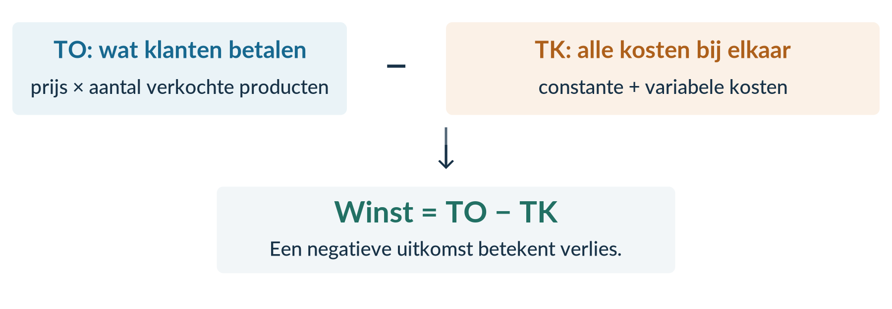
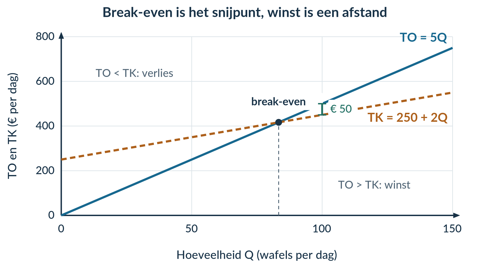
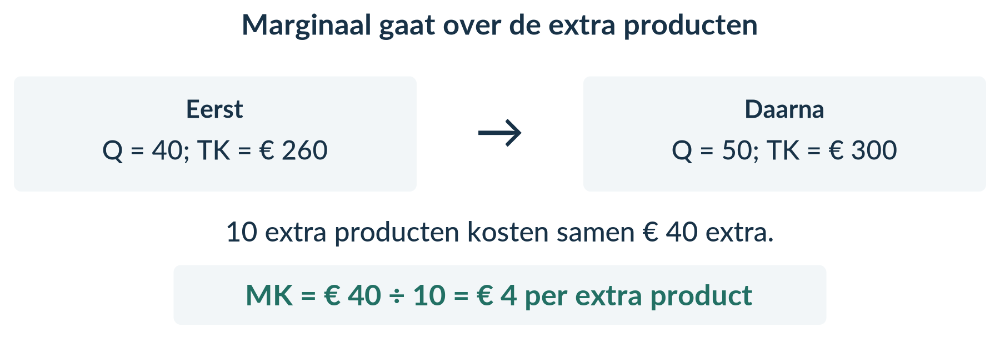
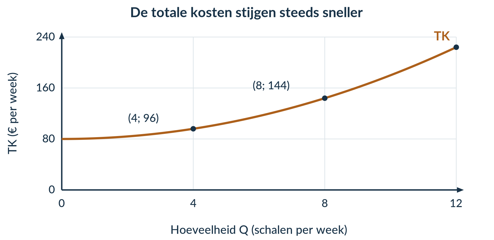
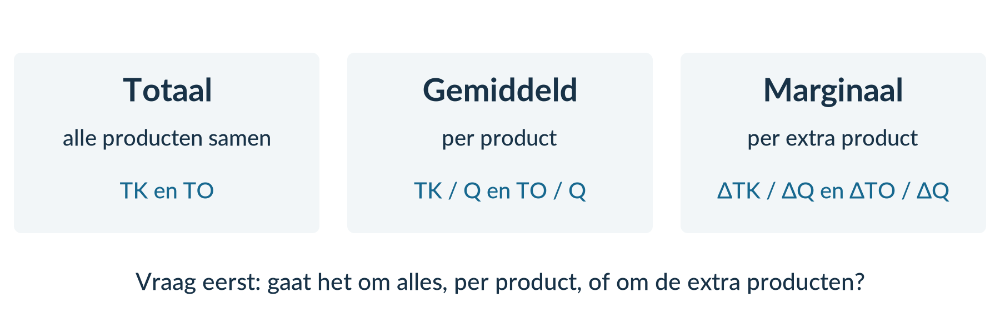

BOEK 2 · HOOFDSTUK 1 · ECONOMIE · 4 VWO

2.1 KOSTEN EN OPBRENGSTEN

Wat houd je eraan over?

Veel verkopen is niet hetzelfde als veel verdienen. In dit hoofdstuk ontdek je waar het geld van een onderneming blijft.

Een klas verkoopt lunchboxen op een festival. De kassa loopt vol. Toch is er nog geen reden om te juichen: de kraam, ingrediënten en verpakkingen moeten ook worden betaald. En wat gebeurt er als de klas honderd extra lunchboxen maakt?

Je leert dezelfde onderneming op drie manieren bekijken: **alles bij elkaar**, **per product** en **per extra product**. Woorden, berekeningen, tabellen en grafieken helpen je daarbij.

<a href="#s211"><b>2.1.1 Kostenstructuren 2</b>Constante, variabele, totale en gemiddelde kosten</a>
<a href="#s212"><b>2.1.2 Opbrengsten, winst en break-even 10</b>Van omzet naar resultaat; rekenen en tekenen</a>
<a href="#s213"><b>2.1.3 Marginale kosten en marginale opbrengsten 19</b>Wat kosten en leveren extra producten op?</a>
<a href="#s214"><b>2.1.4 Gemengde opgaven 29</b>Zelf gegevens kiezen, combineren en conclusies onderbouwen</a>

<b>Na dit hoofdstuk kun je</b> 
kosten indelen en kostenfuncties opstellen; totale en gemiddelde kosten, opbrengsten en winst berekenen; break-even bepalen en in een grafiek herkennen; extra kosten en opbrengsten per product berekenen; en een uitspraak controleren met gegevens.

<b>Zo werk je met dit boek</b> 
Lees de uitleg en het uitgewerkte voorbeeld. Begeleide inoefening is voor de meeste leerlingen een normaal onderdeel van leren. Volg na de startopgaven de begeleide en zelfstandige oefening naar de doeloefening. Heb je minder tussenstappen nodig en wil je extra uitdaging? Volg de uitdagende route met de bonus. Herhaling is extra bij beide routes.  
Werk in je schrift. Neem tabellen over als de invulruimte niet genoeg is. Gebruik een rekenmachine, liniaal en ruitjespapier. Bewaar tussenuitkomsten; rond geldbedragen aan het einde af op centen.

Alle ondernemingen en gegevens in de opgaven zijn lesvoorbeelden. Er wordt geen btw berekend. Bij opbrengstenopgaven wordt de genoemde productie ook verkocht, tenzij anders vermeld.

2.1.1 · KOSTENSTRUCTUREN

# Twee keer zoveel produceren, twee keer zoveel kosten?

Fles & Co bedrukt drinkflessen. De werkplaats kost € 300 huur per maand. Het materiaal kost € 2 per fles. Deze maand wil het bedrijf niet 200, maar 400 flessen maken. Verdubbelen de kosten dan ook?

<b>Lesdoelen</b> 
Je kunt kosten indelen als constant of variabel en je keuze uitleggen. Je kunt TCK, TVK en TK als functie van Q opschrijven. Je kunt gemiddelde kosten berekenen met de juiste eenheid. Je kunt uitleggen hoe totale en gemiddelde kosten veranderen bij meer productie.

### Kijk naar wat er met het totale bedrag gebeurt

<b>Constante kosten</b> veranderen niet als de productie verandert, zolang de productiecapaciteit gelijk blijft. We bekijken steeds één afgesproken periode, bijvoorbeeld een maand.

<b>Productiecapaciteit</b> is de maximale hoeveelheid die een onderneming in een bepaalde periode kan produceren met de beschikbare mensen en middelen.

Fles & Co kan maximaal **600 flessen per maand** maken. Tot en met die capaciteit blijft de maandhuur € 300. Ook als het bedrijf een maand niets produceert, moet het de huur betalen.

<b>Variabele kosten</b> veranderen wél met de hoeveelheid die een onderneming produceert. Denk aan materiaal dat voor ieder product nodig is.

<figure><figcaption>Figuur 1. De huur blijft gelijk; het totale materiaalbedrag groeit mee.</figcaption></figure>

<b>Een maandelijkse rekening is niet automatisch constant.</b> Een energierekening kan bestaan uit een vast abonnement én stroomverbruik dat met de productie verandert. Beoordeel de onderdelen afzonderlijk.

### Van het verhaal naar een formule

We gebruiken **Q** voor het aantal geproduceerde flessen per maand. De huur van Fles & Co vormt hier alle constante kosten. Het materiaal vormt alle variabele kosten.

<b>TCK = 300</b> <b>TVK = 2Q</b> <b>TK = TCK + TVK = 300 + 2Q</b>

**TCK** zijn de totale constante kosten. **TVK** zijn de totale variabele kosten. **TK** zijn de totale kosten. Alle drie zijn bedragen in **euro per maand**. De 2 in TVK = 2Q betekent € 2 materiaal per fles.

Vul Q in, bereken TVK en tel TCK erbij op. Bij Q = 200: TK = 300 + 2 × 200 = **€ 700 per maand**.

| Q (flessen per maand) | TCK (€ per maand) | TVK (€ per maand) | TK (€ per maand) |
|---:|---:|---:|---:|
| 0 | 300 | 0 | 300 |
| 200 | 300 | 400 | 700 |
| 400 | 300 | 800 | 1.100 |
| 600 | 300 | 1.200 | 1.500 |

### Dezelfde informatie in een grafiek

Begin bij Q = 0: TCK en TK zijn € 300, maar TVK is € 0. De TCK-lijn loopt horizontaal. Voor elke extra fles komen er € 2 variabele kosten bij. Daarom stijgen TVK en TK even snel. **TK ligt steeds € 300 boven TVK.**

<figure><figcaption>Figuur 2. De verticale afstand tussen TK en TVK is steeds gelijk aan TCK.</figcaption></figure>

Van 200 naar 400 flessen verdubbelt TVK. **TK stijgt van € 700 naar € 1.100 en verdubbelt niet:** TCK blijft gelijk.

### Waarom kan meer produceren per fles goedkoper zijn?

De huur is € 300 per maand. Bij 200 flessen verdeel je die huur over 200 producten: € 1,50 per fles. Bij 400 flessen is dat € 0,75 per fles. Het totale huurbedrag daalt niet; **het bedrag per fles daalt**.

<b>Gemiddelde kosten</b> zijn de kosten per product. Je berekent ze door de betreffende totale kosten te delen door Q.

<b>GCK = TCK / Q</b> &nbsp; · &nbsp; <b>GVK = TVK / Q</b> <b>GTK = TK / Q = GCK + GVK</b>

GCK, GVK en GTK zijn de gemiddelde constante, variabele en totale kosten. Hier is de eenheid **euro per fles**. Deze formules gebruik je alleen bij **Q > 0**: delen door nul kan niet.

| Q (flessen per maand) | GCK (€ per fles) | GVK (€ per fles) | GTK (€ per fles) |
|---:|---:|---:|---:|
| 200 | 300 / 200 = 1,50 | 400 / 200 = 2,00 | 700 / 200 = 3,50 |
| 400 | 300 / 400 = 0,75 | 800 / 400 = 2,00 | 1.100 / 400 = 2,75 |

De materiaalkosten per fles blijven € 2. Daardoor blijft GVK hier gelijk. GTK daalt alleen doordat GCK daalt. GTK halveert dus niet als Q verdubbelt.

<figure><figcaption>Figuur 3. GTK bestaat uit GCK plus GVK. De getekende krommen beginnen bij Q = 75; bij Q = 0 bestaan geen gemiddelde kosten.</figcaption></figure>

<b>GVK is niet altijd constant.</b> Dat geldt hier omdat elke fles hetzelfde bedrag aan materiaal kost. Bij een andere productiewijze kunnen de variabele kosten per product veranderen. De formule GVK = TVK / Q blijft dan bruikbaar.

## Uitgewerkt voorbeeld

**PlakLab** maakt stickers. Het bedrijf betaalt € 220 huur en € 80 abonnementskosten per maand. Folie kost € 0,80 per sticker; inkt kost € 0,20 per sticker. De capaciteit is 600 stickers per maand. Vergelijk een productie van 150 en 300 stickers in dezelfde maand.

### Stap 1 · Deel de kosten in en leg uit waarom

| Kostenpost | Soort kosten | Reden |
|---|---|---|
| Huur en abonnementen | Constant | Het totale maandbedrag blijft gelijk bij meer stickers. |
| Folie en inkt | Variabel | Het totale bedrag groeit met het aantal stickers. |

### Stap 2 · Stel de functies op

TCK = 220 + 80 = **300**. Per sticker is € 0,80 + € 0,20 = **€ 1** aan variabele kosten nodig. Dus **TVK = Q** en **TK = 300 + Q**. De uitkomsten zijn euro per maand.

### Stap 3 · Bereken totale en gemiddelde kosten

Bij Q = 150: TVK = 1 × 150 = € 150 en TK = 300 + 150 = € 450 per maand.

GCK = 300 / 150 = **€ 2 per sticker**. GVK = 150 / 150 = **€ 1 per sticker**. GTK = 450 / 150 = **€ 3 per sticker**.

| Q (stickers per maand) | TCK (€ per maand) | TVK (€ per maand) | TK (€ per maand) |
|---:|---:|---:|---:|
| 150 | 300 | 150 | 450 |
| 300 | 300 | 300 | 600 |

| Q (stickers per maand) | GCK (€ per sticker) | GVK (€ per sticker) | GTK (€ per sticker) |
|---:|---:|---:|---:|
| 150 | 2,00 | 1,00 | 3,00 |
| 300 | 300 / 300 = 1,00 | 300 / 300 = 1,00 | 600 / 300 = 2,00 |

### Stap 4 · Verbind de cijfers aan het verhaal

TCK blijft € 300. TVK verdubbelt, maar TK stijgt van € 450 naar € 600 en verdubbelt niet. GCK halveert: dezelfde € 300 wordt over tweemaal zoveel stickers verdeeld. GVK blijft € 1. Daarom daalt GTK van € 3 naar € 2, **niet naar € 1,50**. Beide hoeveelheden passen binnen de capaciteit.

<b>Onthoud</b> 
Constant of variabel? Kijk naar het totale bedrag bij een andere Q. 
TK = TCK + TVK. Gemiddeld betekent: deel door Q, met Q > 0. 
Totaal: € per periode. Gemiddeld: € per product. 
GCK daalt bij meer productie; GVK blijft alleen gelijk als de variabele kosten per product gelijk blijven. 
Hierna voeg je de opbrengsten toe om de winst te berekenen.

## Startopgaven

<b>Opgave 1 · Even ophalen</b>

Een vereniging gebruikt de formule R = 40 + 3N voor het bedrag van een uitstap. R is in euro; N is het aantal deelnemers.

a) Bereken R bij N = 20.

b) Verdeel dat bedrag gelijk over de 20 deelnemers. Hoeveel betaalt ieder?

<b>Opgave 2 · Begripscheck</b>

Een drukker betaalt € 600 huur per maand en € 0,20 inkt per poster. Hij kan maximaal 5.000 posters per maand drukken.

a) Hij drukt deze maand 1.000 in plaats van 500 posters. Welke kostenpost verandert in totaal? Welke niet?

b) Een leerling noemt € 600 de GCK. Leg uit wat er aan die uitspraak niet klopt.

<b>Normale route:</b> Startopgaven → Begeleide inoefening → Zelfstandige oefening → Doeloefening. <b>Uitdagende route (minder tussenstappen, extra uitdaging):</b> Startopgaven → Zelfstandige oefening → Doeloefening → Denkertje / Bonusopgave. Herhaling is extra bij beide routes.

## Begeleide inoefening

*Begeleide inoefening hoort bij leren: je oefent met denkstappen en doet steeds meer zelf.*

<b>Opgave 3 · TasDruk — met denkstappen</b>

TasDruk betaalt € 120 per maand voor een werkruimte. Stof kost € 0,40 en inkt € 0,10 per tas. De capaciteit is 500 tassen per maand.

a) De werkruimte is een constante kostenpost. Maak de verklaring af: ‘Het totale maandbedrag blijft … als het aantal tassen …’

b) Vul aan: TCK = …; variabele kosten per tas = 0,40 + … = …; TVK = … × Q; TK = … + … × Q.

c) Neem de tabel over en vul de lege cellen in. Gebruik eerst TK = TCK + TVK; deel daarna door Q.

| Q (tassen per maand) | TCK (€ per maand) | TVK (€ per maand) | TK (€ per maand) | GTK (€ per tas) |
|---:|---:|---:|---:|---:|
| 200 | 120 | 100 | … | … |
| 400 | … | … | … | … |

d) Bereken ook GCK en GVK bij beide hoeveelheden. Maak af: ‘GTK daalt, omdat … over meer tassen worden verdeeld. GVK blijft …, omdat …’

<b>Opgave 4 · SleutelStudio — minder hulp</b>

SleutelStudio betaalt per maand € 90 huur en € 30 voor een vast abonnement. Materiaal kost € 1,20 en een verpakking € 0,30 per sleutelhanger. De capaciteit is 300 sleutelhangers per maand.

a) Deel de vier kostenposten in. Geef bij elke soort kosten één verklaring.

b) Stel TCK, TVK en TK op.

c) Bereken GCK, GVK en GTK bij Q = 100 en Q = 200. Leg uit welk gemiddelde halveert en welk niet.

## Zelfstandige oefening

<b>Opgave 5 · Twee veranderingen bij TafelTint</b>

TafelTint maakt placemats. In april is de maandhuur € 200 en kost materiaal € 1 per placemat. In mei is de maandhuur € 240 en kost materiaal € 0,80 per placemat. In beide maanden maakt het bedrijf 200 placemats. De capaciteit blijft 600 per maand. Er zijn geen andere kosten.

a) Bereken TCK, TVK en TK voor april en mei.

b) Bekijk de huurverhoging en de lagere materiaalprijs afzonderlijk. Welke verandering raakt de constante kosten? Welke de variabele kosten?

c) Een leerling zegt: ‘De huur stijgt, dus TK stijgt ook.’ Beoordeel dit met je uitkomsten.

<b>Opgave 6 · FietsGlans</b>

FietsGlans maakt fietsen schoon. Per maand betaalt het bedrijf € 240 huur en € 60 verzekering. Reinigingsmiddel kost € 0,60 en een beschermhoes € 0,40 per fiets. De capaciteit is 600 fietsen per maand.

a) Classificeer de kosten en stel TCK, TVK en TK op.

b) Bereken GCK, GVK en GTK bij 200 en 400 fietsen per maand. Noteer de eenheden.

c) Bereken ook TK bij beide hoeveelheden. Leg uit waarom TK stijgt, terwijl GTK daalt.

## Doeloefening

<b>Opgave 7 · Bakkerij De Korenaar</b>

De Korenaar kan maximaal **1.000 broden per maand** bakken. Deze maand blijven de ruimte en ovens hetzelfde. Tot en met die capaciteit gelden de volgende kosten:

| Kostenpost | Bedrag |
|---|---:|
| Huur en verzekering samen | € 440 per maand |
| Netaansluiting en energieabonnement samen | € 60 per maand |
| Meel en verpakking samen | € 0,70 per brood |
| Elektriciteitsverbruik van de ovens | € 0,10 per brood |

Q is het aantal broden per maand.

a) Neem de classificatietabel over en vul **alle lege cellen** in. Geef telkens aan hoe het totale bedrag reageert op een verandering van Q.

| Kostenpost | Constant of variabel? | Reden |
|---|---|---|
| Huur en verzekering | … | … |
| Netaansluiting en abonnement | … | … |
| Meel en verpakking | … | … |
| Elektriciteitsverbruik ovens | … | … |

b) Stel de functies voor TCK, TVK en TK op.

c) Bereken bij Q = 500 de GCK, GVK en GTK. Noteer de volledige eenheden.

d) Bereken bij Q = 1.000 de GCK, GVK en GTK. Noteer de volledige eenheden.

e) Vergelijk eerst TCK, TVK en TK bij beide hoeveelheden. Leg daarna met je uitkomsten uit waarom GCK halveert, GVK gelijk blijft en GTK niet halveert als Q verdubbelt. Je vergelijkt dezelfde maand en dezelfde productiecapaciteit.

<b>Kijk na en herstel</b> 
Controleer niet alleen de getallen. Heb je bij de kostenindeling een reden gegeven? Staan de juiste eenheden bij de gemiddelden? Legt je laatste antwoord het verschil tussen totaal en gemiddeld uit?

## Denkertje / Bonusopgave

<b>Opgave 8 · Eén rekening vertelt niet alles</b>

Een bedrijf maakt 100 stoffen vlaggetjes. De totale kosten zijn € 300. Over de kostenopbouw weet je verder niets.

a) Bedenk twee verschillende kostenfuncties die allebei bij deze gegevens passen. Gebruik positieve constante kosten en constante variabele kosten per vlaggetje.

b) Laat zien dat de twee functies bij 200 vlaggetjes verschillende totale kosten kunnen geven. Neem aan dat de capaciteit daarvoor groot genoeg is.

c) Beoordeel de uitspraak: ‘Als je TK bij één hoeveelheid kent, weet je ook hoeveel een verdubbeling van Q kost.’

## Herhaling / Herhaling en interleaving

<b>Opgave 9 · Procenten</b> Herhaling §1.1.2

Een sportvereniging heeft eerst 540 leden en later 648 leden. Bereken de procentuele stijging. Laat zien welk aantal je als uitgangspunt gebruikt.

<b>Opgave 10 · Tabel lezen</b> Herhaling §1.1.3

Een boottocht heeft de volgende prijstabel voor groepen.

| Aantal deelnemers | 5 | 10 | 15 |
|---|---:|---:|---:|
| Totaal te betalen (€) | 20 | 30 | 40 |

a) Hoeveel betaalt een groep van 10 deelnemers samen? Hoeveel is dat per persoon?

b) Met hoeveel euro stijgt het totaalbedrag als er 5 deelnemers bijkomen? Hoeveel is dat per extra deelnemer?

<b>Terug naar de openingsvraag</b> 
Bij Fles & Co verdubbelt het totale materiaalbedrag als de productie verdubbelt. De huur blijft gelijk. Daarom verdubbelen de totale kosten niet. Het bedrijf maakt meer flessen, maar verdeelt dezelfde huur over meer producten.

2.1.2 · OPBRENGSTEN, WINST EN BREAK-EVEN

# Een volle kassa: is dat winst?

Een wafelverkoper ontvangt € 500 op één dag. ‘Mooi, € 500 verdiend!’ zegt een vriend. Maar de verkoper heeft ook ingrediënten gekocht en een kraam gehuurd. Wat blijft er werkelijk over?

<b>Lesdoelen</b> 
Je kunt TO, GO en winst berekenen. Je kunt uitleggen waarom GO bij een vaste prijs gelijk is aan die prijs. Je kunt break-even algebraïsch bepalen en verstandig afronden op hele producten. Je kunt TK en TO tekenen en winst of verlies als verticale afstand aangeven.

### Opbrengst: het geld dat de verkoop oplevert

<b>Totale opbrengst (TO)</b> is het bedrag dat een onderneming met de verkoop ontvangt. Een ander woord is <b>omzet</b>.

Bij een vaste verkoopprijs **P** levert elk verkocht product hetzelfde bedrag op. Verkoop je 100 wafels voor € 5 per stuk, dan is TO = 5 × 100 = **€ 500 per dag**.

<b>TO = P × Q</b> <b>GO = TO / Q</b> &nbsp; (alleen bij Q > 0)

**GO** is de gemiddelde opbrengst: de opbrengst per verkocht product. Bij een vaste prijs van € 5 is GO = 500 / 100 = **€ 5 per wafel**. Dat is logisch: ieder verkocht exemplaar levert € 5 op. Dus bij een vaste prijs geldt **GO = P**.

<figure><figcaption>Figuur 1. De omzet is nog niet het bedrag dat je overhoudt.</figcaption></figure>

<b>Onze afspraak</b> 
In de opgaven worden alle gemaakte producten verkocht. Daarom gebruiken we dezelfde Q voor productie en verkoop. Als dat niet zo is, staat dat erbij.

### Trek alle kosten af, niet alleen de ingrediënten

<b>Winst</b> is de totale opbrengst min de totale kosten. Een negatieve winst noemen we <b>verlies</b>.

<b>Winst = TO − TK</b>

WafelWagen heeft TK = 250 + 2Q per dag. De kraam kost € 250; iedere wafel kost € 2 aan ingrediënten en verpakking. De verkoopprijs is € 5 per wafel. De capaciteit is 150 wafels per dag.

Bij 50 wafels is TO = 5 × 50 = € 250. TK = 250 + 2 × 50 = € 350. De winst is 250 − 350 = **−€ 100 per dag**: een verlies van € 100.

Bij 100 wafels is TO = 5 × 100 = € 500. TK = 250 + 2 × 100 = € 450. De winst is **€ 50 per dag**.

| Verkochte wafels per dag | TO (€ per dag) | TK (€ per dag) | Winst (€ per dag) |
|---:|---:|---:|---:|
| 0 | 0 | 250 | −250 |
| 50 | 250 | 350 | −100 |
| 100 | 500 | 450 | 50 |

### Waar stopt het verlies?

<b>Break-even</b> betekent dat de totale opbrengst precies gelijk is aan de totale kosten. De winst is dan nul. De bijbehorende verkochte hoeveelheid heet de <b>break-even-afzet</b>.

Bij WafelWagen ligt dat punt tussen 50 en 100 wafels. Je vindt het precies door TO en TK aan elkaar gelijk te stellen:

5Q = 250 + 2Q 
5Q − 2Q = 250 
3Q = 250 
Q = 250 / 3 = 83,333…

De rechte lijnen snijden elkaar bij ongeveer **83,33 wafels**. De echte verkoper verkoopt alleen hele wafels. Bij 83 wafels is de winst 415 − 416 = **−€ 1**. Bij 84 wafels is de winst 420 − 418 = **€ 2**. Dus **84 wafels** is het eerste gehele aantal zonder verlies.

<b>Niet gewoon afronden naar het dichtstbijzijnde getal.</b> 
Bij een stijgende winst moet je een niet-gehele break-even-afzet naar boven afronden om geen verlies te maken. Controleer ook of dat aantal binnen de productiecapaciteit past. Break-even betekent niet dat kosten en opbrengsten nul zijn.

### Teken eerst de assen, daarna de lijnen

Voor WafelWagen gebruik je horizontaal **Q: wafels per dag**. Verticaal staan **TK en TO: euro per dag**. Kies een schaal waarop 150 wafels en € 800 passen.

Voor een rechte lijn heb je twee punten nodig. Bij TO = 5Q kun je (0; 0) en (100; 500) gebruiken. Bij TK = 250 + 2Q zijn (0; 250) en (100; 450) handige punten. Trek beide lijnen tot de capaciteit van 150 wafels.

<figure><figcaption>Figuur 2. Bij een vaste Q lees je twee bedragen af; het verschil is de winst of het verlies.</figcaption></figure>

### Lees de grafiek bij één hoeveelheid

**Links van het snijpunt** ligt TK boven TO. De kosten zijn hoger dan de opbrengsten: er is verlies. **Rechts van het snijpunt** ligt TO boven TK. Er is winst.

Bij Q = 100 is de verticale afstand 500 − 450 = **€ 50**. Die afstand hoort bij één productiehoeveelheid. Een gekleurde oppervlakte tussen de lijnen is hier **geen winstbedrag**.

<b>Kijk naar het soort grafiek.</b> 
Deze verticale as toont totale bedragen. Daarom is winst een verticale afstand. Je berekent geen driehoek of rechthoek. De oppervlakte heeft hier niet de eenheid euro.

Een lijn door niet-gehele aantallen maakt het verband zichtbaar. De lijn gaat bijvoorbeeld door Q = 83,33. Voor een verkoopbeslissing met hele producten vertaal je die uitkomst terug naar een haalbaar geheel aantal.

## Uitgewerkt voorbeeld

**WafelWagen** heeft TK = 250 + 2Q en verkoopt wafels voor een vaste prijs van € 5. De capaciteit is 150 wafels per dag. Bereken opbrengsten, winst en break-even. Geef de uitkomsten ook in een grafiek weer.

### Stap 1 · Stel TO op en verklaar GO

TO = P × Q = **5Q**. Bij Q > 0 geldt GO = TO / Q = 5Q / Q = **€ 5 per wafel**. Ieder verkocht exemplaar heeft dezelfde prijs.

### Stap 2 · Vul Q in en trek TK van TO af

| Q (wafels per dag) | TO (€ per dag) | TK (€ per dag) | Winst (€ per dag) |
|---:|---:|---:|---:|
| 50 | 5 × 50 = 250 | 250 + 2 × 50 = 350 | 250 − 350 = −100 |
| 100 | 5 × 100 = 500 | 250 + 2 × 100 = 450 | 500 − 450 = 50 |

Bij 50 wafels is er € 100 verlies; bij 100 wafels is er € 50 winst.

### Stap 3 · Los TO = TK op en duid de uitkomst

5Q = 250 + 2Q → 3Q = 250 → Q = **83,333… wafels per dag**.

Het snijpunt van de lijnen ligt bij Q ≈ **83,33**. De bijbehorende opbrengst is 5 × 83,333… ≈ **€ 416,67**. Gebruik hier de onafgeronde Q.

Het eerste gehele aantal zonder verlies is **84 wafels per dag**. Controle: TO = € 420 en TK = € 418, dus € 2 winst. Dit aantal past binnen de capaciteit van 150 wafels.

### Stap 4 · Teken en controleer

Gebruik figuur 2 op de vorige pagina als controle. De horizontale as toont wafels per dag; de verticale as toont euro per dag. TO begint bij nul; TK begint bij € 250. Beide lijnen hebben een naam.

Het snijpunt is gemarkeerd. Links geldt TO < TK; rechts geldt TO > TK. Bij Q = 100 is de winst een **verticale afstand van € 50**, geen oppervlakte.

<b>Onthoud</b> 
TO = P × Q. GO = TO / Q; bij een vaste prijs is GO = P. 
Winst = TO − TK. Een negatieve uitkomst is verlies. 
Break-even: stel TO gelijk aan TK en los Q op. 
Maak onderscheid tussen het snijpunt en het eerste gehele aantal zonder verlies. 
Hierna onderzoek je de kosten en opbrengsten van extra producten.

## Startopgaven

<b>Opgave 1 · Kosten ophalen</b>

Een borduuratelier heeft TK = 180 + 3Q. Q is het aantal badges per week. De capaciteit is 200 badges per week.

a) Bereken TK bij Q = 40. Bereken daarna GTK.

b) Hoeveel bedragen TCK en de variabele kosten per badge?

<b>Opgave 2 · Opbrengst is niet hetzelfde als winst</b>

Een vereniging verkoopt 80 entreekaarten voor een vaste prijs van € 4 per stuk. De totale kosten van de activiteit zijn € 250.

a) Bereken TO, GO en winst. Noteer telkens de juiste eenheid.

b) Een leerling zegt: ‘De vereniging maakt € 320 winst.’ Leg de fout uit.

<b>Normale route:</b> Startopgaven → Begeleide inoefening → Zelfstandige oefening → Doeloefening. <b>Uitdagende route (minder tussenstappen, extra uitdaging):</b> Startopgaven → Zelfstandige oefening → Doeloefening → Denkertje / Bonusopgave. Herhaling is extra bij beide routes.

## Begeleide inoefening

*Begeleide inoefening hoort bij leren: je oefent met denkstappen en doet steeds meer zelf.*

<b>Opgave 3 · SokkenShop — eerst herkennen</b>

SokkenShop heeft TK = 180 + 3Q en TO = 6Q. De capaciteit is 120 paar sokken per week. Bekijk de volledig getekende grafiek op de volgende pagina.

a) Lees het break-evenpunt af. Hoeveel paar sokken worden verkocht? Hoe hoog zijn TO en TK dan?

b) Lees bij Q = 90 de opbrengst, de kosten en de winst af. Verklaar waarom het getekende verticale lijnstuk winst weergeeft.

c) Vul aan: TO = … × Q, dus bij Q > 0 is GO = … per paar. Dit geldt omdat …

<b>Bij een grafiekantwoord</b> 
Noteer eerst de afgelezen waarden met eenheid. Schrijf daarna de berekening of conclusie op. Zo kan iemand anders volgen hoe je de grafiek gebruikt.

<figure><figcaption>Bij opgave 3. Beide lijnen en de winstafstand zijn al getekend.</figcaption></figure>

<b>Opgave 4 · KaartKunst — vul de grafiek aan</b>

KaartKunst heeft TK = 120 + Q en verkoopt iedere kaart voor € 4. Q is het aantal kaarten per week; de capaciteit is 120 kaarten.

a) Stel TO op. Bereken TO bij Q = 0 en Q = 120. Gebruik deze punten om TO in de basisgrafiek te tekenen.

b) Los 4Q = 120 + Q op. Markeer het snijpunt. Geef aan waar winst en waar verlies ontstaat.

c) Bereken bij Q = 90 de winst en teken die als verticale afstand.

<figure><figcaption>Bij opgave 4. De assen en TK staan klaar; jij vult de rest aan.</figcaption></figure>

<b>Opgave 5 · TheeTuin — zonder voorgedrukte grafiek</b>

TheeTuin heeft TK = 180 + Q en TO = 4Q. Q is het aantal theepakketten per week; de capaciteit is 120 pakketten.

a) Bereken de break-even-afzet. Leg in woorden uit welke lijn bij Q = 40 boven ligt en welke bij Q = 100 boven ligt.

b) Noteer voor iedere lijn twee punten waarmee je de grafiek zou kunnen tekenen. Bereken bij Q = 100 de verticale winstafstand.

## Zelfstandige oefening

<b>Opgave 6 · PetPret</b>

PetPret maakt naamplaatjes voor honden. De kostenfunctie is TK = 250 + 4Q. De vaste verkoopprijs is € 10 per naamplaatje. Q is het aantal naamplaatjes per maand. De capaciteit is 100 per maand.

a) Stel TO op. Bereken en verklaar GO bij Q = 60.

b) Bereken de winst bij Q = 30 en Q = 60.

c) Bepaal de break-even-afzet algebraïsch. Geef ook het eerste gehele aantal naamplaatjes zonder verlies.

d) Teken TK en TO in één assenstelsel. Benoem grootheden en eenheden. Markeer break-even, winst en verlies. Geef bij Q = 60 de winst weer als verticale afstand.

<b>Opgave 7 · Een indrukwekkend verkoopbedrag</b>

Een merchandiseverkoper heeft op een zaterdag € 2.000 omzet en € 2.020 totale kosten. Een vriend zegt: ‘Met zo’n hoge omzet zal je wel winst maken.’ Bereken het resultaat en beoordeel de uitspraak.

## Doeloefening

<b>Opgave 8 · Bakkerij De Korenaar</b>

De Korenaar heeft de kostenfunctie **TK = 500 + 0,80Q**. Ieder brood wordt verkocht voor een vaste prijs van **€ 1,50**. De capaciteit is **1.000 broden per maand**. Q is het aantal broden per maand. Totale bedragen zijn in euro per maand.

a) Stel de functie voor TO op. Leg voor Q > 0 uit waarom GO hier gelijk is aan de prijs.

b) Bereken de winst bij Q = 500 en bij Q = 1.000.

c) Los algebraïsch TO = TK op. Noteer zowel de break-even-afzet volgens de rechte lijnen als het eerste gehele aantal broden waarbij geen verlies ontstaat.

d) Teken TK en TO in één assenstelsel. Benoem beide assen met grootheid en eenheid. Markeer het break-evenpunt en geef aan waar winst en waar verlies ontstaat. Geef bij Q = 1.000 de winst van € 200 weer als verticale afstand. Kleur geen oppervlakte als winst.

<b>Controle van je tekening</b> 
Begin niet met mooi maken, maar met controleren. Passen je berekende waarden op de lijnen? Staan er getallen op de assen? Hebben beide lijnen een naam? Lees je bij Q = 1.000 dezelfde twee bedragen af als in je berekening?

<b>Let op je formulering bij c.</b> 
Het snijpunt kan bij een niet-geheel aantal broden liggen. Dat is iets anders dan het eerste verkoopbare aantal zonder verlies. Schrijf beide uitkomsten op en geef aan wat ze betekenen.

## Denkertje / Bonusopgave

<b>Opgave 9 · Uitverkocht, maar toch verlies</b>

Een klein theater heeft 80 zitplaatsen. Voor één voorstelling zijn de constante kosten € 500. Per bezoeker zijn de variabele kosten € 2. Een kaartje kost € 8.

De organisator zegt: ‘Als we alle plaatsen verkopen, maken we vanzelf winst.’

a) Beoordeel de uitspraak met een berekening. Verbind je antwoord aan de capaciteit én aan de break-even-afzet.

b) Bedenk twee verschillende veranderingen waarmee een uitverkochte voorstelling wél break-even kan zijn. Werk per verandering één passend getallenvoorbeeld uit. Je mag de 80 zitplaatsen niet uitbreiden.

## Herhaling / Herhaling en interleaving

<b>Opgave 10 · Totaal en gemiddeld</b> Herhaling §2.1.1

Een boekenbinder heeft TK = 400 + 6Q per maand. Bij Q = 100 zijn alle boeken binnen de capaciteit geproduceerd. Bereken TCK, TVK, TK, GCK, GVK en GTK met de juiste eenheden.

<b>Opgave 11 · Procenten blijven handig</b> Herhaling §1.1.2

De omzet van een schoolwinkel stijgt van € 1.250 in september naar € 1.400 in oktober.

a) Bereken de procentuele omzetstijging.

b) Kun je hiermee ook de procentuele winststijging bepalen? Leg uit.

<b>Terug naar de openingsvraag</b> 
Een volle kassa toont opbrengsten, geen winst. Pas na aftrek van álle kosten weet je wat overblijft. Ook uitverkocht zijn is op zichzelf geen bewijs van winst.

2.1.3 · MARGINALE KOSTEN EN OPBRENGSTEN

# Wat kosten die tien extra producten?

Een ondernemer maakt eerst 40 producten. Zijn totale kosten zijn € 260. Bij 50 producten zijn de totale kosten € 300. Die tien extra producten kosten samen € 40. Is dat hetzelfde als € 40 per product?

<b>Lesdoelen</b> 
Je kunt een winstkolom invullen met TK en TO. Je kunt MK en MO per extra product berekenen over een stap in een tabel. Je kunt constante en stijgende marginale kosten vergelijken. Je kunt de uitkomsten uitleggen en onderscheid maken tussen gemiddeld en marginaal.

### Van alle producten naar de extra producten

<b>Marginale kosten (MK)</b> zijn de extra totale kosten per extra product. Bij een stap van meerdere producten berekenen we de gemiddelde extra kosten per product binnen die stap.

<figure><figcaption>Figuur 1. Je deelt de extra kosten door het aantal extra producten.</figcaption></figure>

**Gemiddeld** en **marginaal** beantwoorden verschillende vragen. Bij Q = 50 zijn de gemiddelde totale kosten GTK = 300 / 50 = **€ 6 per product**. Daarbij gebruik je alle 50 producten en alle € 300 kosten.

Voor MK van 40 naar 50 gebruik je alleen de verandering: **€ 40 extra kosten voor 10 extra producten**, dus € 4 per extra product. Je deelt hier niet door 50.

<b>Marginale opbrengsten (MO)</b> zijn de extra totale opbrengsten per extra verkocht product. Ook die berekenen we over de genoemde stap in de tabel.

<b>De vraag die je jezelf stelt</b> 
‘Wat kost één product gemiddeld?’ → gebruik alle kosten en alle producten. 
‘Wat kosten de extra producten?’ → gebruik de verandering in kosten en hoeveelheid.

### Eén werkwijze voor MK en MO

Het teken **Δ** spreek je uit als ‘delta’. Het betekent **verandering**: de nieuwe waarde min de oude waarde. Een stap tussen twee hoeveelheden heet ook een **interval**.

<b>MK = ΔTK / ΔQ</b> &nbsp; · &nbsp; <b>MO = ΔTO / ΔQ</b> 
ΔTK = TK nieuw − TK oud 
ΔTO = TO nieuw − TO oud &nbsp; · &nbsp; ΔQ = Q nieuw − Q oud

Neem een onderneming met TK = 100 + 3Q en TO = 8Q. De capaciteit is 40 producten per week. Alle totale bedragen hieronder zijn euro per week.

| Q (producten per week) | TK (€ per week) | TO (€ per week) |
|---:|---:|---:|
| 0 | 100 | 0 |
| 10 | 130 | 80 |
| 30 | 190 | 240 |

**Stap 1: kies de twee rijen.** Van Q = 10 naar Q = 30 is ΔQ = 30 − 10 = **20 producten**.

**Stap 2: bereken de veranderingen.** ΔTK = 190 − 130 = € 60. ΔTO = 240 − 80 = € 160.

**Stap 3: deel door de extra hoeveelheid.** MK = 60 / 20 = **€ 3 per extra product**. MO = 160 / 20 = **€ 8 per extra product**.

**Stap 4: leg de uitkomst uit.** De twintig extra producten kosten samen € 60 en leveren samen € 160 extra op. Per extra product is dat € 3 aan kosten en € 8 aan opbrengst.

### Waar zet je de uitkomst?

Zet een intervaluitkomst bij de **laatste rij van de stap**. De uitkomst bij Q = 30 hoort dus bij de stap van 10 naar 30. Het is niet automatisch de uitkomst voor alleen het dertigste product.

| Q (producten per week) | MK (€ per extra product) | MO (€ per extra product) |
|---:|---:|---:|
| 0 | — | — |
| 10 | (130 − 100) / 10 = 3 | (80 − 0) / 10 = 8 |
| 30 | (190 − 130) / 20 = 3 | (240 − 80) / 20 = 8 |

Bij Q = 0 staat een streepje: er is geen eerdere tabelrij om mee te vergelijken. De prijs is steeds € 8. Daarom levert elk extra verkocht product € 8 op en blijft MO hier constant.

### Constante kosten kunnen samengaan met stijgende MK

SchaalWerk maakt keramische schalen. Het bedrijf heeft dezelfde werkplaats en een capaciteit van 12 schalen per week. Voor extra productie is steeds meer betaald werk per extra schaal nodig. De kosten worden beschreven met **TK = 80 + Q²**.

De constante kosten blijven € 80 per week. Het veranderende deel is Q². Bij Q = 4 is dat 4 × 4 = 16. Bij Q = 8 is het 8 × 8 = 64. Het variabele deel verdubbelt hier niet als Q verdubbelt.

| Q (schalen per week) | TK (€ per week) | ΔTK ten opzichte van vorige rij (€) | MK (€ per extra schaal) |
|---:|---:|---:|---:|
| 0 | 80 | — | — |
| 4 | 96 | 16 | 16 / 4 = 4 |
| 8 | 144 | 48 | 48 / 4 = 12 |
| 12 | 224 | 80 | 80 / 4 = 20 |

Elke stap bestaat uit vier extra schalen. Toch nemen de extra kosten toe: eerst € 16, daarna € 48 en daarna € 80. Daarom stijgt MK van € 4 naar € 12 en € 20 per extra schaal.

<figure><figcaption>Figuur 2. Bij even grote stappen naar rechts neemt de stijging van TK toe.</figcaption></figure>

<b>Een tabelstap is niet één afzonderlijk product.</b> 
MK = € 12 voor de stap van 4 naar 8 betekent: die vier extra schalen kosten <em>gemiddeld</em> € 12 extra per schaal. Het betekent niet dat elk van die vier schalen precies € 12 extra kost.

Je gebruikt in deze paragraaf **verschillen en delingen**, geen afgeleiden. De tabellen laten zien hoe kosten en opbrengsten veranderen. Je hoeft nog niet te bepalen bij welke hoeveelheid de winst maximaal is.

## Uitgewerkt voorbeeld

**Linoprint** heeft TK = 120 + 2Q en TO = 6Q. **Atelier Boog** heeft TK = 40 + Q² en TO = 12Q. Q is de productie per week; totale bedragen zijn euro per week. De capaciteiten zijn respectievelijk 20 prints en 8 kunstwerkjes per week.

### Stap 1 · Bereken de winst met TO − TK

Bij Linoprint en Q = 5: winst = 30 − 130 = **−€ 100 per week**. In beide tabellen zijn MK en MO euro per extra product.

| Q | TK (€) | TO (€) | Winst (€) | MK | MO |
|---:|---:|---:|---:|---:|---:|
| 0 | 120 | 0 | −120 | — | — |
| 5 | 130 | 30 | −100 | 2 | 6 |
| 10 | 140 | 60 | −80 | 2 | 6 |
| 15 | 150 | 90 | −60 | 2 | 6 |

### Stap 2 · Bereken MK en MO over de eerste stap

Linoprint: MK = (130 − 120) / (5 − 0) = 10 / 5 = **€ 2 per extra print**. MO = (30 − 0) / (5 − 0) = 30 / 5 = **€ 6 per extra print**. Beide uitkomsten staan bij Q = 5. De volgende stappen geven dezelfde waarden.

### Stap 3 · Herhaal de berekening bij de andere onderneming

| Q | TK (€) | TO (€) | Winst (€) | MK | MO |
|---:|---:|---:|---:|---:|---:|
| 0 | 40 | 0 | −40 | — | — |
| 2 | 44 | 24 | −20 | 2 | 12 |
| 4 | 56 | 48 | −8 | 6 | 12 |
| 6 | 76 | 72 | −4 | 10 | 12 |

Atelier Boog: MK = (44 − 40) / 2 = **€ 2**; daarna (56 − 44) / 2 = **€ 6**; daarna (76 − 56) / 2 = **€ 10 per extra kunstwerkje**. MO = (24 − 0) / 2 = **€ 12**; dat blijft in elke stap gelijk.

### Stap 4 · Vergelijk en verklaar

Linoprint heeft constante MK; Atelier Boog heeft stijgende MK. MO blijft bij beide constant door de vaste verkoopprijs. MK en MO gelden per extra product binnen de tabelstap.

<b>Onthoud</b> 
Winst = TO − TK. MK = ΔTK / ΔQ; MO = ΔTO / ΔQ. 
Gebruik twee rijen en deel door het echte aantal extra producten. 
Zet de intervaluitkomst bij de laatste rij; bij de eerste rij staat een streepje. 
Gemiddeld gaat over alle producten; marginaal over de extra producten. 
Hierna combineer je kosten, opbrengsten, winst en marginale veranderingen.

## Startopgaven

<b>Opgave 1 · Kosten, opbrengst en winst ophalen</b>

Een spelmaker heeft TK = 60 + 2Q en TO = 5Q. Q is het aantal spellen per week; de capaciteit is 40 spellen. Neem de tabel over en vul de lege cellen in.

| Q (spellen per week) | TK (€ per week) | TO (€ per week) | Winst (€ per week) |
|---:|---:|---:|---:|
| 10 | … | … | … |
| 20 | … | … | … |

<b>Opgave 2 · Welk getal hoort onder de breuk?</b>

De productie stijgt van 20 naar 30 kaarsen. TK stijgt van € 100 naar € 140. Noor schrijft: ‘MK = € 40 per kaars.’ Leg uit welke stap ontbreekt en bereken MK.

<b>Normale route:</b> Startopgaven → Begeleide inoefening → Zelfstandige oefening → Doeloefening. <b>Uitdagende route (minder tussenstappen, extra uitdaging):</b> Startopgaven → Zelfstandige oefening → Doeloefening → Denkertje / Bonusopgave. Herhaling is extra bij beide routes.

## Begeleide inoefening

*Begeleide inoefening hoort bij leren: je oefent met denkstappen en doet steeds meer zelf.*

<b>Opgave 3 · HoesHandig — met denkstappen</b>

HoesHandig heeft TK = 100 + 3Q en TO = 8Q. Q is het aantal telefoonhoesjes per week; de capaciteit is 50. De totale bedragen in de tabel zijn euro per week.

| Q | TK (€) | TO (€) | Winst (€) | MK (€ per extra hoesje) | MO (€ per extra hoesje) |
|---:|---:|---:|---:|---:|---:|
| 0 | 100 | 0 | … | — | — |
| 10 | 130 | 80 | … | … | … |
| 20 | 160 | 160 | … | … | … |
| 30 | 190 | 240 | … | … | … |

a) Gebruik de eerste twee rijen. Vul aan: ΔQ = 10 − 0 = …; ΔTK = …; ΔTO = …

b) Bereken MK = ΔTK / ΔQ en MO = ΔTO / ΔQ. Zet beide uitkomsten bij Q = 10.

c) Vul de overige lege cellen in. Leg uit waarom MO steeds gelijk is.

<b>Opgave 4 · PotAtelier — minder hulp</b>

PotAtelier heeft TK = 50 + Q² en TO = 20Q. Q is het aantal potten per week; de capaciteit is 8 potten. De totale bedragen in de tabel zijn euro per week.

| Q | TK (€) | TO (€) | MK (€ per extra pot) | MO (€ per extra pot) |
|---:|---:|---:|---:|---:|
| 0 | 50 | 0 | — | — |
| 2 | 54 | 40 | … | … |
| 4 | 66 | 80 | … | … |
| 6 | 86 | 120 | … | … |

a) Vul de lege cellen in. Laat bij iedere MK-uitkomst de teller en noemer zien.

b) Leg uit wat de MK-uitkomst bij Q = 6 betekent. Noem de twee hoeveelheden waarbij die uitkomst hoort.

c) Beschrijf het verschil tussen het patroon van MK en dat van MO.

## Zelfstandige oefening

<b>Opgave 5 · Niet elke tabelstap is even groot</b>

SportLint produceert sportarmbanden. De capaciteit is 40 armbanden per dag. Alle totale bedragen zijn euro per dag.

| Q (armbanden per dag) | TK (€) | TO (€) |
|---:|---:|---:|
| 0 | 80 | 0 |
| 10 | 120 | 90 |
| 30 | 200 | 270 |

a) Bereken MK en MO over beide stappen. Noteer telkens op welke stap je antwoord betrekking heeft.

b) Een leerling ziet de kosten met € 40 en daarna € 80 stijgen. Hij concludeert dat MK verdubbelt. Beoordeel die conclusie.

<b>Dezelfde controle, steeds opnieuw</b> 
Na het nakijken: heb je de veranderingen gedeeld door ΔQ? Staat bij je antwoord ‘per extra product’? Hoort de uitkomst bij de juiste stap?

<b>Opgave 6 · StikSnel en Keramiek Nova</b>

**StikSnel** heeft TK = 90 + 2Q en TO = 7Q. Q is het aantal etuis per week. De capaciteit is 30 etuis per week.

| Q | TK (€ per week) | TO (€ per week) | Winst (€ per week) | MK (€ per extra etui) | MO (€ per extra etui) |
|---:|---:|---:|---:|---:|---:|
| 0 | 90 | 0 | … | — | — |
| 5 | 100 | 35 | … | … | … |
| 10 | 110 | 70 | … | … | … |
| 15 | 120 | 105 | … | … | … |

**Keramiek Nova** heeft TK = 60 + Q² en TO = 24Q. Q is het aantal mokken per week. De capaciteit is 12 mokken per week.

| Q | TK (€ per week) | TO (€ per week) | Winst (€ per week) | MK (€ per extra mok) | MO (€ per extra mok) |
|---:|---:|---:|---:|---:|---:|
| 0 | 60 | 0 | −60 | — | — |
| 3 | 69 | 72 | 3 | … | … |
| 6 | 96 | 144 | 48 | … | … |
| 9 | 141 | 216 | 75 | … | … |

a) Vul alle lege cellen in beide tabellen in. Zet MK en MO steeds bij de laatste rij van de betreffende stap.

b) Laat voor StikSnel één MK-berekening en één MO-berekening zien. Laat voor Keramiek Nova alle MK-berekeningen zien.

c) Vergelijk de MK-patronen. Verklaar voor beide ondernemingen waarom MO constant is.

d) Een klasgenoot zegt: ‘Bij Keramiek Nova kost iedere mok gemiddeld € 15, want dat staat bij Q = 9 in de MK-kolom.’ Leg uit waarom deze lezing onjuist is. Bereken ter controle GTK bij Q = 9.

## Doeloefening

<b>Opgave 7 · Linea en Curva</b>

**Linea** heeft TK = 200 + 3Q en TO = 8Q. **Curva** heeft TK = 100 + Q² en verkoopt ieder product voor € 30, dus TO = 30Q. Q is het aantal producten per week; totale bedragen zijn euro per week. De capaciteiten zijn 30 producten voor Linea en 15 voor Curva.

Bereken MK en MO per extra product over iedere tabelstap. Zet de uitkomst bij de laatste rij van die stap. Gebruik geen afgeleiden.

**Linea**

| Q | TK (€) | TO (€) | Winst (€) | MK (€ per extra product) | MO (€ per extra product) |
|---:|---:|---:|---:|---:|---:|
| 0 | 200 | 0 | … | — | — |
| 10 | 230 | 80 | … | … | … |
| 20 | 260 | 160 | … | … | … |
| 30 | 290 | 240 | … | … | … |

**Curva**

| Q | TK (€) | TO (€) | Winst (€) | MK (€ per extra product) | MO (€ per extra product) |
|---:|---:|---:|---:|---:|---:|
| 0 | 100 | 0 | −100 | — | — |
| 5 | 125 | 150 | 25 | … | … |
| 10 | 200 | 300 | 100 | … | … |
| 15 | 325 | 450 | 125 | … | … |

a) Vul bij Linea de winstkolom in.

b) Bereken voor Linea MK en MO over de eerste stap. Laat teller en noemer zien. Vul de MK- en MO-kolommen verder in bij Q = 10, 20 en 30.

c) Leg uit waarom MO bij Linea constant is.

d) Bereken voor Curva MK over de drie stappen en MO over de eerste stap. Vul alle lege MK- en MO-cellen in bij Q = 5, 10 en 15.

e) Vergelijk de MK-patronen. Leg uit wat MK en MO per extra product binnen een tabelstap betekenen. Trek geen conclusie over de hoeveelheid met maximale winst.

## Denkertje / Bonusopgave

<b>Opgave 8 · Een dalend gemiddelde en stijgende extra kosten</b>

Een werkplaats heeft de volgende kostentabel. De productiecapaciteit is 30 dienbladen per week.

| Q (dienbladen per week) | TK (€ per week) |
|---:|---:|
| 10 | 200 |
| 20 | 300 |
| 30 | 420 |

a) Laat zien dat GTK daalt, terwijl MK over de twee stappen stijgt.

b) Leg in woorden uit waarom dat niet tegenstrijdig is. Gebruik het verschil tussen ‘alle producten’ en ‘extra producten’.

c) Beoordeel de uitspraak: ‘Als GTK daalt, weet je zeker dat ook MK daalt.’

## Herhaling / Herhaling en interleaving

<b>Opgave 9 · Break-even blijven oefenen</b> Herhaling §2.1.2

Een puzzelverkoper heeft TK = 150 + 2Q en TO = 5Q. Q is het aantal puzzels per maand. De capaciteit is 100 puzzels. Bepaal de break-even-afzet en bereken de winst bij Q = 80.

<b>Opgave 10 · Procentuele verandering</b> Herhaling §1.1.2

Een sportclub verkoopt eerst 80 en later 100 trainingsshirts per maand. Bereken de procentuele stijging van het verkochte aantal.

<b>Terug naar de openingsvraag</b> 
De tien extra producten kostten samen € 40. Per extra product was dat € 4. Het woord ‘extra’ bepaalt welke kosten en welke hoeveelheid je in de breuk gebruikt.

# Drie vragen, drie soorten uitkomsten

<figure><figcaption>De drie perspectieven van dit hoofdstuk. Kies het perspectief dat bij de vraag past.</figcaption></figure>

| Je wilt weten… | Je gebruikt… | Je uitkomst is… |
|---|---|---|
| Alle kosten samen | TK = TCK + TVK | € per periode |
| Kosten per product | GCK = TCK / Q; GVK = TVK / Q; GTK = TK / Q | € per product |
| Alle verkoopopbrengsten | TO = P × Q bij een vaste prijs | € per periode |
| Opbrengst per product | GO = TO / Q | € per product |
| Wat overblijft | Winst = TO − TK | € per periode |
| Extra kosten per extra product | MK = ΔTK / ΔQ | € per extra product |
| Extra opbrengst per extra product | MO = ΔTO / ΔQ | € per extra product |

### Vier controles die veel fouten voorkomen

**1. De eenheid.** ‘€ 500 per maand’ is iets anders dan ‘€ 0,50 per brood’. Totale en gemiddelde bedragen kun je niet zomaar verwisselen.

**2. De hoeveelheid.** Gebruik Q > 0 bij gemiddelden. Gebruik bij MK en MO de werkelijke verandering in Q. Controleer de productiecapaciteit.

**3. De aanname.** Constante kosten blijven in de genoemde periode gelijk bij een verandering van Q tot de capaciteit. GVK en MO blijven niet vanzelf altijd gelijk; lees de gegevens over kosten per product en verkoopprijs.

**4. De grafiek.** Bij TK en TO op de verticale as is winst een verticale afstand. Break-even ligt bij het snijpunt. Bij hele producten kan het eerste aantal zonder verlies nét rechts daarvan liggen.

<b>Voorbereiding op de gemengde opgaven</b> 
Kun je zonder voorbeeld kosten indelen, functies opstellen, gemiddelden en winst berekenen, break-even bepalen en de grafiek tekenen? Kun je daarna een tabelstap gebruiken om MK en MO te berekenen? Kies één antwoord dat nog niet goed was en herstel zowel de berekening als de verklaring.

Hoofdstukoverzicht · De antwoorden staan in het afzonderlijke antwoordenboek.

2.1.4 · GEMENGDE OPGAVEN

# Welke informatie heb je nodig?

Bij een gemengde opgave staat niet boven elke vraag welke formule je moet kiezen. Dat doe je zelf. Lees eerst wat er wordt gevraagd: een totaalbedrag, een bedrag per product, een verandering of een verklaring?

<b>Lesdoelen</b> 
Je kunt relevante gegevens uit bronnen kiezen. Je kunt kosten, opbrengsten, winst, break-even en marginale veranderingen combineren. Je kunt een tabel en een grafiek met elkaar verbinden. Je kunt een uitspraak met berekeningen beoordelen zonder meer te beweren dan de gegevens laten zien.

Deze paragraaf bevat **geen nieuwe theorie**. Je gebruikt wat je in de vorige drie paragrafen hebt geleerd. De doeloefening bestaat uit een bronblad en vragen; houd beide bij elkaar.

### Eerst zelfstandig combineren

<b>Zo oefen je</b> Gebruik bij de voorbereiding de uitleg en denkstappen uit dit hoofdstuk. Minder tussenstappen nodig en extra uitdaging gewenst? Kies ook de bonus. Herhaling is aanvullend.

<b>Opgave 1 · ShirtSprint op het schoolfeest</b>

ShirtSprint bedrukt T-shirts. Voor één schoolfeest kost de kraam € 480 en een vaste vergunning € 120. Een blanco shirt kost € 4; bedrukking en verpakking kosten samen € 1 per shirt. Ieder shirt wordt verkocht voor € 11. De capaciteit is 300 shirts op die dag. De school verwacht 600 bezoekers.

a) Kies de gegevens voor TCK, de variabele kosten per shirt en de verkoopprijs. Welk getal heb je niet nodig voor het opstellen van TK en TO?

b) Stel de functies voor TK en TO op.

c) Bereken bij Q = 150 de totale kosten, totale opbrengst, winst en GTK. Gebruik de juiste eenheden.

d) Bereken de break-even-afzet. Een leerling noemt dat het aantal shirts waarbij de kassa leeg is. Leg uit waarom dat niet klopt.

<b>Schrijf een controleerbaar antwoord</b> 
Gebruik bij een berekening: formule → invullen → uitkomst met eenheid. 
Gebruik bij een verklaring: uitkomst → economische betekenis → conclusie. 
Een conclusie als ‘meer’, ‘minder’ of ‘goedkoper’ heeft altijd een vergelijking nodig: meer dan wat, en per product of in totaal?

<b>Opgave 2 · FotoFun</b>

FotoFun verkoopt geprinte foto’s op een feest. Alle foto’s hebben dezelfde prijs. De capaciteit is 120 foto’s per feest. De grafiek toont alle totale kosten en opbrengsten.

<figure><figcaption>Bron bij opgave 2. De verticale as geeft totale bedragen per feest.</figcaption></figure>

a) Lees bij Q = 30 TO en TK af. Bereken het resultaat en schrijf op of er winst of verlies is.

b) Lees de break-even-afzet af. Hoe hoog zijn TO en TK bij dat aantal?

c) Bereken bij Q = 90 de winst. Markeer het bijbehorende verticale lijnstuk. Een klasgenoot wil een driehoek inkleuren en de oppervlakte berekenen. Leg uit waarom dat hier niet juist is.

d) Gebruik de punten bij Q = 60 en Q = 90. Bereken MK en MO over deze stap. Laat zien hoeveel de totale winst door die 30 extra foto’s verandert.

<b>Opgave 3 · Twee offertes voor clubsjaals</b>

Een sportclub verkoopt sjaals voor € 8 per stuk. Beide leveranciers kunnen maximaal 100 sjaals voor de club maken. Alle bestelde sjaals worden verkocht.

| Offerte | Vast bedrag per bestelling | Variabele kosten per sjaal |
|---|---:|---:|
| A | € 100 | € 4 |
| B | € 280 | € 1 |

a) Stel voor beide offertes TK op. Geef aan welk deel constant is en welk deel met Q verandert.

b) Bereken TK bij 30 en bij 80 sjaals voor beide offertes.

c) Welke offerte geeft bij 80 sjaals de hoogste winst? Bereken die winst.

d) Beoordeel de uitspraak: ‘Offerte A is altijd goedkoper, want het vaste bedrag is lager.’

<b>Opgave 4 · SkateService</b>

SkateService onderhoudt skateboards. De capaciteit is 30 onderhoudsbeurten per week. Neem de tabel over en vul eerst de lege winstcellen in.

| Q (beurten per week) | TK (€ per week) | TO (€ per week) | Winst (€ per week) |
|---:|---:|---:|---:|
| 10 | 260 | 400 | … |
| 20 | 320 | 800 | … |
| 30 | 410 | 1.200 | … |

a) Bereken MK en MO over beide stappen.

b) Vergelijk de extra winst van de eerste en de tweede groep van tien extra beurten. Laat je berekeningen zien.

c) Beoordeel: ‘Omdat elke groep tien extra beurten evenveel omzet oplevert, is ook de extra winst gelijk.’

## Doeloefening

**Opgave 5 · SmoothBox op het schoolfestival**

SmoothBox verkoopt lunchboxen op twee festivaldagen. De capaciteit is op beide dagen **1.000 lunchboxen per dag**. Alle gemaakte lunchboxen worden voor **€ 5 per stuk** verkocht. Gebruik het juiste dagmenu bij elke vraag op de volgende pagina.

<b>Bron A · Vrijdag: het gewone menu</b> 
De totale constante kosten zijn € 1.200 per dag. De variabele kosten zijn € 2 per lunchbox. Deze bedragen gelden tot en met de capaciteit. Er worden 4.000 festivalbezoekers verwacht.

<b>Bron B · Zaterdag: een ander menu</b> 
De constante kosten blijven € 1.200 per dag. Dit menu vraagt bij meer productie steeds meer betaald werk per extra lunchbox. De variabele kosten per lunchbox zijn daarom niet steeds gelijk. Gebruik voor zaterdag de onderstaande totale bedragen, niet de € 2 uit bron A.

| Q (lunchboxen per dag) | TK zaterdag (€ per dag) | TO zaterdag (€ per dag) |
|---:|---:|---:|
| 700 | 2.600 | 3.500 |
| 800 | 2.900 | 4.000 |
| 900 | 3.250 | 4.500 |
| 1.000 | 3.650 | 5.000 |

**Bron C · Basisgrafiek**

<figure><figcaption>Bron C. Voor zaterdag zijn alleen de punten uit bron B weergegeven. Break-even en de gevraagde markeringen moet je zelf toevoegen.</figcaption></figure>

<b>Opgave 5 · SmoothBox — vervolg</b>

Gebruik het bronblad op de vorige pagina. Q is het aantal lunchboxen per dag.

a) Selecteer uit bron A de constante kosten, de variabele kosten per lunchbox en de verkoopprijs. Leg uit welke totale kosten met Q veranderen en welke gelijk blijven. Noem ook het gegeven dat je niet nodig hebt voor TK en TO.

b) Stel voor vrijdag de functies voor TK en TO op. Bereken de break-even-afzet.

c) Bereken voor vrijdag bij Q = 700 de winst en GTK. Noteer de volledige eenheden.

d) Bereken met bron B voor elk van de drie stappen op zaterdag MK en MO per extra lunchbox. Laat bij iedere MK-berekening teller en noemer zien.

e) Markeer in bron C het break-evenpunt van vrijdag. Geef ook aan voor welke vrijdaghoeveelheden de verticale winstafstand positief is. Vergelijk de groei van die winstafstand per extra lunchbox op vrijdag met de drie zaterdagstappen. Op welke dag en bij welke hoeveelheden groeit de positieve winstafstand het snelst? Onderbouw met MK en MO.

f) Een leerling zegt: ‘Door de vaste verkoopprijs leveren alle extra groepen van honderd lunchboxen evenveel extra winst op.’ Beoordeel de uitspraak met de drie zaterdagstappen. Bereken daarbij de extra winst per groep.

<b>Voordat je gaat nakijken</b> 
Bij a–c gebruik je vrijdag. Bij d en f gebruik je zaterdag. Bij e vergelijk je beide dagen. Heb je een totaalbedrag nooit verwisseld met een bedrag per lunchbox? Is je grafiekmarkering in overeenstemming met je berekeningen?

<b>Houd je conclusie bij de gegevens.</b> 
Je vergelijkt hier de gegeven hoeveelheden en twee menu’s. Je hoeft niet te voorspellen hoeveel lunchboxen werkelijk worden verkocht, of bij welke hoeveelheid de winst maximaal zou zijn.

### Denkertje

<b>Opgave 6 · Meer productie zonder meer verkoop</b>

Een leerlingenbedrijf bakt 100 muffins. De constante kosten zijn € 60. Ingrediënten en verpakking kosten € 0,80 per gemaakte muffin. De verkoopprijs is € 2. Het bedrijf verkoopt maar 70 muffins. De 30 overgebleven muffins kunnen niet later worden verkocht en hebben geen opbrengst.

Sam rekent TO = 2 × 100 = € 200 en concludeert dat er € 60 winst is.

a) Welke afspraak uit dit hoofdstuk geldt hier niet? Bereken de werkelijke opbrengst, kosten en winst.

b) Leg uit waarom bij deze opgave niet één en dezelfde hoeveelheid in zowel de kostenfunctie als de opbrengstenfunctie kan worden gebruikt.

c) Beoordeel de uitspraak: ‘Meer produceren verlaagt soms GTK, maar garandeert geen hogere winst.’ Verbind je antwoord aan dit voorbeeld.

### Herhaling

<b>Opgave 7 · Drie verschillende vragen</b>

Een zeefdrukker heeft TK = 100 + 2Q en TO = 5Q per week. De capaciteit is 100 posters. Beantwoord iedere vraag met een berekening en de volledige eenheid.

a) Hoeveel zijn de totale kosten bij Q = 50?

b) Hoeveel zijn de gemiddelde totale kosten bij Q = 50?

c) Wat zijn MK en MO voor de stap van Q = 40 naar Q = 50?

d) Hoeveel winst maakt de drukker bij Q = 50?

<b>Een zin die laat zien dat je het begrijpt</b> 
Maak na het nakijken in je eigen woorden deze vergelijking: ‘Totale kosten gaan over …, gemiddelde kosten over …, en marginale kosten over …’ Gebruik bij elk deel een getal uit opgave 7.
