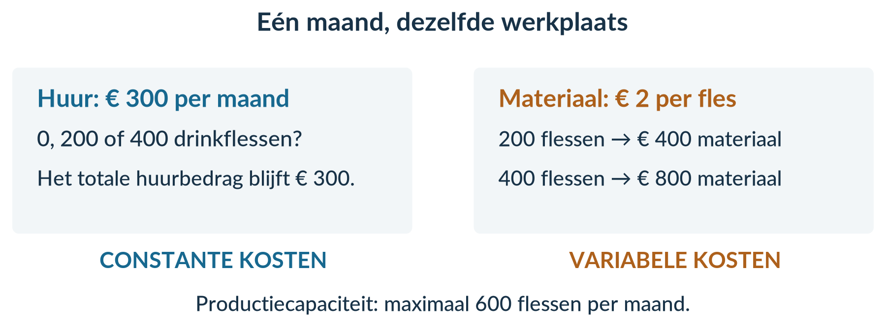
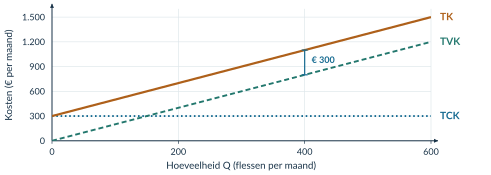
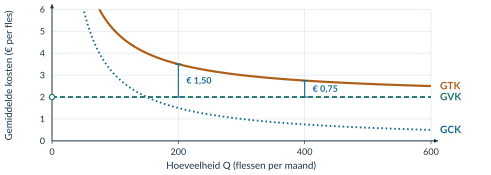
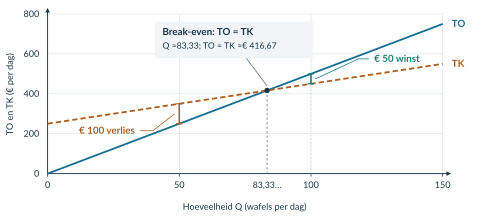
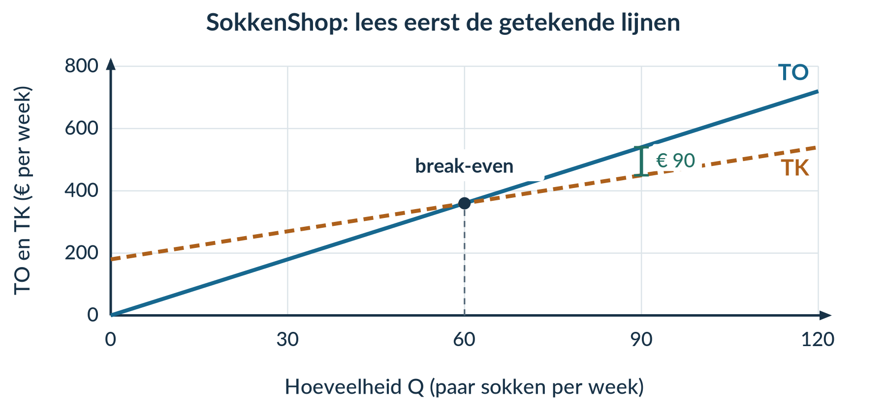
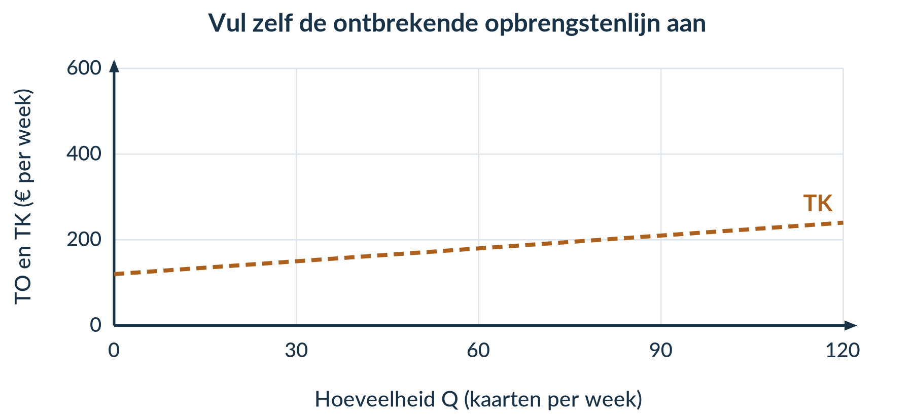
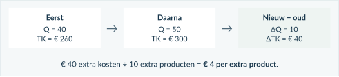
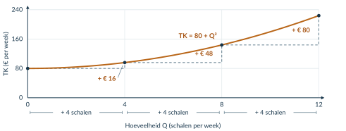

BOEK 2 · HOOFDSTUK 1 · ECONOMIE · 4 VWO

2.1 KOSTEN EN OPBRENGSTEN

Wat houd je eraan over?

Veel verkopen is niet hetzelfde als veel verdienen. In dit hoofdstuk ontdek je waar het geld van een onderneming blijft.

Een klas verkoopt lunchboxen op een festival. De kassa loopt vol. Toch is er nog geen reden om te juichen: de kraam, ingrediënten en verpakkingen moeten ook worden betaald. En wat gebeurt er als de klas honderd extra lunchboxen maakt?

Je leert dezelfde onderneming op drie manieren bekijken: **alles bij elkaar**, **per product** en **per extra product**. Woorden, berekeningen, tabellen en grafieken helpen je daarbij.

<a href="#s211"><b>2.1.1 Kostenstructuren 2</b>Constante, variabele, totale en gemiddelde kosten</a>
<a href="#s212"><b>2.1.2 Opbrengsten, winst en break-even 10</b>Van omzet naar resultaat; rekenen en tekenen</a>
<a href="#s213"><b>2.1.3 Marginale kosten en marginale opbrengsten 19</b>Wat kosten en leveren extra producten op?</a>
<a href="#s214"><b>2.1.4 Gemengde opgaven 29</b>Zelf gegevens kiezen, combineren en conclusies onderbouwen</a>

<b>Na dit hoofdstuk kun je</b> 
kosten indelen en kostenfuncties opstellen; totale en gemiddelde kosten, opbrengsten en winst berekenen; break-even bepalen en in een grafiek herkennen; extra kosten en opbrengsten per product berekenen; en een uitspraak controleren met gegevens.

<b>Zo werk je met dit boek</b> 
Lees de uitleg en het uitgewerkte voorbeeld. Begeleide inoefening is voor de meeste leerlingen een normaal onderdeel van leren. Volg na de startopgaven de begeleide en zelfstandige oefening naar de doeloefening. Heb je minder tussenstappen nodig en wil je extra uitdaging? Volg de uitdagende route met de bonus. Herhaling is extra bij beide routes.  
Werk in je schrift. Neem tabellen over als de invulruimte niet genoeg is. Gebruik een rekenmachine, liniaal en ruitjespapier. Bewaar tussenuitkomsten; rond geldbedragen aan het einde af op centen.

Alle ondernemingen en gegevens in de opgaven zijn lesvoorbeelden. Er wordt geen btw berekend. Bij opbrengstenopgaven wordt de genoemde productie ook verkocht, tenzij anders vermeld.

2.1.1 · KOSTENSTRUCTUREN

# Twee keer zoveel produceren, twee keer zoveel kosten?

Fles & Co bedrukt drinkflessen. De werkplaats kost € 300 huur per maand. Het materiaal kost € 2 per fles. Deze maand wil het bedrijf niet 200, maar 400 flessen maken. Verdubbelen de kosten dan ook?

<b>Lesdoelen</b> 
Je kunt kosten indelen als constant of variabel en je keuze uitleggen. Je kunt TCK, TVK en TK als functie van Q opschrijven. Je kunt gemiddelde kosten berekenen met de juiste eenheid. Je kunt uitleggen hoe totale en gemiddelde kosten veranderen bij meer productie.

### Kijk naar wat er met het totale bedrag gebeurt

<b>Constante kosten</b> veranderen niet als de productie verandert, zolang de productiecapaciteit gelijk blijft. We bekijken steeds één afgesproken periode, bijvoorbeeld een maand.

<b>Productiecapaciteit</b> is de maximale hoeveelheid die een onderneming in een bepaalde periode kan produceren met de beschikbare mensen en middelen.

Fles & Co kan maximaal **600 flessen per maand** maken. Tot en met die capaciteit blijft de maandhuur € 300. Ook als het bedrijf een maand niets produceert, moet het de huur betalen.

<b>Variabele kosten</b> veranderen wél met de hoeveelheid die een onderneming produceert. Denk aan materiaal dat voor ieder product nodig is.

<figure><figcaption>Figuur 1. De huur blijft gelijk; het totale materiaalbedrag groeit mee.</figcaption></figure>

<b>Een maandelijkse rekening is niet automatisch constant.</b> Een energierekening kan bestaan uit een vast abonnement én stroomverbruik dat met de productie verandert. Beoordeel de onderdelen afzonderlijk.

<!-- Native reconstruction of accepted physical page 5; see the revision provenance. -->
<article class="native-theory" data-accepted-page="5">
<svg aria-hidden="true" class="native-decoration" style="left:53.5pt;top:78.02pt;width:492.2756pt;height:2.15pt" viewbox="53.5 78.02 492.2756 2.15"><path d="M 54 50 H 545.2756 V 78.52 H 54 Z M 54 50 H 545.2756 V 79.67 H 54 Z" fill="#166b91" fill-rule="evenodd" stroke="none" stroke-width="0"></path></svg>
<svg aria-hidden="true" class="native-decoration" style="left:54.7pt;top:145.29pt;width:285.2439pt;height:40.892pt" viewbox="54.7 145.29 285.2439 40.892"><path d="M 55.2 145.79 H 339.4438 V 185.682 H 55.2 Z" fill="#eff5f8" fill-rule="nonzero" stroke="none" stroke-width="0"></path></svg>
<svg aria-hidden="true" class="native-decoration" style="left:338.9438pt;top:145.29pt;width:206.8317pt;height:40.892pt" viewbox="338.9438 145.29 206.8317 40.892"><path d="M 339.4438 145.79 H 545.2756 V 185.682 H 339.4438 Z" fill="#eff5f8" fill-rule="nonzero" stroke="none" stroke-width="0"></path></svg>
<svg aria-hidden="true" class="native-decoration" style="left:54.7pt;top:185.182pt;width:285.2439pt;height:42.392pt" viewbox="54.7 185.182 285.2439 42.392"><path d="M 55.2 185.682 H 339.4438 V 227.074 H 55.2 Z" fill="#f0f6f4" fill-rule="nonzero" stroke="none" stroke-width="0"></path></svg>
<svg aria-hidden="true" class="native-decoration" style="left:338.9438pt;top:185.182pt;width:206.8317pt;height:42.392pt" viewbox="338.9438 185.182 206.8317 42.392"><path d="M 339.4438 185.682 H 545.2756 V 227.074 H 339.4438 Z" fill="#f0f6f4" fill-rule="nonzero" stroke="none" stroke-width="0"></path></svg>
<svg aria-hidden="true" class="native-decoration" style="left:54.7pt;top:226.574pt;width:285.2439pt;height:48.98pt" viewbox="54.7 226.574 285.2439 48.98"><path d="M 55.2 227.074 H 339.4438 V 275.054 H 55.2 Z" fill="#faf3eb" fill-rule="nonzero" stroke="none" stroke-width="0"></path></svg>
<svg aria-hidden="true" class="native-decoration" style="left:338.9438pt;top:226.574pt;width:206.8317pt;height:48.98pt" viewbox="338.9438 226.574 206.8317 48.98"><path d="M 339.4438 227.074 H 545.2756 V 275.054 H 339.4438 Z" fill="#faf3eb" fill-rule="nonzero" stroke="none" stroke-width="0"></path></svg>
<svg aria-hidden="true" class="native-decoration" style="left:52.8pt;top:143.39pt;width:4.8pt;height:46.192pt" viewbox="52.8 143.39 4.8 46.192"><path d="M 55.2 145.79 L 55.2 187.182" fill="none" fill-rule="nonzero" stroke="#166b91" stroke-width="2.4000000953674316"></path></svg>
<svg aria-hidden="true" class="native-decoration" style="left:52.8pt;top:181.782pt;width:4.8pt;height:49.192pt" viewbox="52.8 181.782 4.8 49.192"><path d="M 55.2 184.182 L 55.2 228.574" fill="none" fill-rule="nonzero" stroke="#22776d" stroke-width="2.4000000953674316"></path></svg>
<svg aria-hidden="true" class="native-decoration" style="left:52.8pt;top:223.174pt;width:4.8pt;height:55.78pt" viewbox="52.8 223.174 4.8 55.78"><path d="M 55.2 225.574 L 55.2 276.554" fill="none" fill-rule="nonzero" stroke="#ae601a" stroke-width="2.4000000953674316"></path></svg>
<svg aria-hidden="true" class="native-decoration" style="left:51pt;top:182.682pt;width:291.4438pt;height:6pt" viewbox="51 182.682 291.4438 6"><path d="M 54 185.682 L 339.4438 185.682" fill="none" fill-rule="nonzero" stroke="#ffffff" stroke-width="3.0"></path></svg>
<svg aria-hidden="true" class="native-decoration" style="left:336.4438pt;top:182.682pt;width:211.8317pt;height:6pt" viewbox="336.4438 182.682 211.8317 6"><path d="M 339.4438 185.682 L 545.2756 185.682" fill="none" fill-rule="nonzero" stroke="#ffffff" stroke-width="3.0"></path></svg>
<svg aria-hidden="true" class="native-decoration" style="left:51pt;top:224.074pt;width:291.4438pt;height:6pt" viewbox="51 224.074 291.4438 6"><path d="M 54 227.074 L 339.4438 227.074" fill="none" fill-rule="nonzero" stroke="#ffffff" stroke-width="3.0"></path></svg>
<svg aria-hidden="true" class="native-decoration" style="left:336.4438pt;top:224.074pt;width:211.8317pt;height:6pt" viewbox="336.4438 224.074 211.8317 6"><path d="M 339.4438 227.074 L 545.2756 227.074" fill="none" fill-rule="nonzero" stroke="#ffffff" stroke-width="3.0"></path></svg>
<svg aria-hidden="true" class="native-decoration" style="left:51pt;top:272.054pt;width:291.4438pt;height:6pt" viewbox="51 272.054 291.4438 6"><path d="M 54 275.054 L 339.4438 275.054" fill="none" fill-rule="nonzero" stroke="#ffffff" stroke-width="3.0"></path></svg>
<svg aria-hidden="true" class="native-decoration" style="left:336.4438pt;top:272.054pt;width:211.8317pt;height:6pt" viewbox="336.4438 272.054 211.8317 6"><path d="M 339.4438 275.054 L 545.2756 275.054" fill="none" fill-rule="nonzero" stroke="#ffffff" stroke-width="3.0"></path></svg>
<svg aria-hidden="true" class="native-decoration" style="left:53.5pt;top:356.142pt;width:123.8189pt;height:31.32pt" viewbox="53.5 356.142 123.8189 31.32"><path d="M 54 356.642 H 176.8189 V 386.962 H 54 Z" fill="#eaf1f4" fill-rule="nonzero" stroke="none" stroke-width="0"></path></svg>
<svg aria-hidden="true" class="native-decoration" style="left:176.3189pt;top:356.142pt;width:123.8189pt;height:31.32pt" viewbox="176.3189 356.142 123.8189 31.32"><path d="M 176.8189 356.642 H 299.6378 V 386.962 H 176.8189 Z" fill="#eaf1f4" fill-rule="nonzero" stroke="none" stroke-width="0"></path></svg>
<svg aria-hidden="true" class="native-decoration" style="left:299.1378pt;top:356.142pt;width:123.8189pt;height:31.32pt" viewbox="299.1378 356.142 123.8189 31.32"><path d="M 299.6378 356.642 H 422.4567 V 386.962 H 299.6378 Z" fill="#eaf1f4" fill-rule="nonzero" stroke="none" stroke-width="0"></path></svg>
<svg aria-hidden="true" class="native-decoration" style="left:421.9567pt;top:356.142pt;width:123.8189pt;height:31.32pt" viewbox="421.9567 356.142 123.8189 31.32"><path d="M 422.4567 356.642 H 545.2756 V 386.962 H 422.4567 Z" fill="#eaf1f4" fill-rule="nonzero" stroke="none" stroke-width="0"></path></svg>
<svg aria-hidden="true" class="native-decoration" style="left:53.5pt;top:405.132pt;width:492.2756pt;height:19.62pt" viewbox="53.5 405.132 492.2756 19.62"><path d="M 54 405.632 H 545.2756 V 424.252 H 54 Z" fill="#eff5f8" fill-rule="nonzero" stroke="none" stroke-width="0"></path></svg>
<svg aria-hidden="true" class="native-decoration" style="left:53.5pt;top:442.372pt;width:492.2756pt;height:19.62pt" viewbox="53.5 442.372 492.2756 19.62"><path d="M 54 442.872 H 545.2756 V 461.492 H 54 Z" fill="#f6f8fa" fill-rule="nonzero" stroke="none" stroke-width="0"></path></svg>
<svg aria-hidden="true" class="native-decoration" style="left:53.5pt;top:405.132pt;width:123.8189pt;height:1pt" viewbox="53.5 405.132 123.8189 1"><path d="M 54 405.632 L 176.8189 405.632" fill="none" fill-rule="nonzero" stroke="#e0e7eb" stroke-width="0.5000002384185791"></path></svg>
<svg aria-hidden="true" class="native-decoration" style="left:176.3189pt;top:405.132pt;width:123.8189pt;height:1pt" viewbox="176.3189 405.132 123.8189 1"><path d="M 176.8189 405.632 L 299.6378 405.632" fill="none" fill-rule="nonzero" stroke="#e0e7eb" stroke-width="0.5000002384185791"></path></svg>
<svg aria-hidden="true" class="native-decoration" style="left:299.1378pt;top:405.132pt;width:123.8189pt;height:1pt" viewbox="299.1378 405.132 123.8189 1"><path d="M 299.6378 405.632 L 422.4567 405.632" fill="none" fill-rule="nonzero" stroke="#e0e7eb" stroke-width="0.5000002384185791"></path></svg>
<svg aria-hidden="true" class="native-decoration" style="left:421.9567pt;top:405.132pt;width:123.8189pt;height:1pt" viewbox="421.9567 405.132 123.8189 1"><path d="M 422.4567 405.632 L 545.2756 405.632" fill="none" fill-rule="nonzero" stroke="#e0e7eb" stroke-width="0.5000002384185791"></path></svg>
<svg aria-hidden="true" class="native-decoration" style="left:53.5pt;top:423.752pt;width:123.8189pt;height:1pt" viewbox="53.5 423.752 123.8189 1"><path d="M 54 424.252 L 176.8189 424.252" fill="none" fill-rule="nonzero" stroke="#e0e7eb" stroke-width="0.5000002384185791"></path></svg>
<svg aria-hidden="true" class="native-decoration" style="left:176.3189pt;top:423.752pt;width:123.8189pt;height:1pt" viewbox="176.3189 423.752 123.8189 1"><path d="M 176.8189 424.252 L 299.6378 424.252" fill="none" fill-rule="nonzero" stroke="#e0e7eb" stroke-width="0.5000002384185791"></path></svg>
<svg aria-hidden="true" class="native-decoration" style="left:299.1378pt;top:423.752pt;width:123.8189pt;height:1pt" viewbox="299.1378 423.752 123.8189 1"><path d="M 299.6378 424.252 L 422.4567 424.252" fill="none" fill-rule="nonzero" stroke="#e0e7eb" stroke-width="0.5000002384185791"></path></svg>
<svg aria-hidden="true" class="native-decoration" style="left:421.9567pt;top:423.752pt;width:123.8189pt;height:1pt" viewbox="421.9567 423.752 123.8189 1"><path d="M 422.4567 424.252 L 545.2756 424.252" fill="none" fill-rule="nonzero" stroke="#e0e7eb" stroke-width="0.5000002384185791"></path></svg>
<svg aria-hidden="true" class="native-decoration" style="left:53.5pt;top:442.372pt;width:123.8189pt;height:1pt" viewbox="53.5 442.372 123.8189 1"><path d="M 54 442.872 L 176.8189 442.872" fill="none" fill-rule="nonzero" stroke="#e0e7eb" stroke-width="0.5000002384185791"></path></svg>
<svg aria-hidden="true" class="native-decoration" style="left:176.3189pt;top:442.372pt;width:123.8189pt;height:1pt" viewbox="176.3189 442.372 123.8189 1"><path d="M 176.8189 442.872 L 299.6378 442.872" fill="none" fill-rule="nonzero" stroke="#e0e7eb" stroke-width="0.5000002384185791"></path></svg>
<svg aria-hidden="true" class="native-decoration" style="left:299.1378pt;top:442.372pt;width:123.8189pt;height:1pt" viewbox="299.1378 442.372 123.8189 1"><path d="M 299.6378 442.872 L 422.4567 442.872" fill="none" fill-rule="nonzero" stroke="#e0e7eb" stroke-width="0.5000002384185791"></path></svg>
<svg aria-hidden="true" class="native-decoration" style="left:421.9567pt;top:442.372pt;width:123.8189pt;height:1pt" viewbox="421.9567 442.372 123.8189 1"><path d="M 422.4567 442.872 L 545.2756 442.872" fill="none" fill-rule="nonzero" stroke="#e0e7eb" stroke-width="0.5000002384185791"></path></svg>
<svg aria-hidden="true" class="native-decoration" style="left:53.5pt;top:460.992pt;width:123.8189pt;height:1pt" viewbox="53.5 460.992 123.8189 1"><path d="M 54 461.492 L 176.8189 461.492" fill="none" fill-rule="nonzero" stroke="#e0e7eb" stroke-width="0.5000002384185791"></path></svg>
<svg aria-hidden="true" class="native-decoration" style="left:176.3189pt;top:460.992pt;width:123.8189pt;height:1pt" viewbox="176.3189 460.992 123.8189 1"><path d="M 176.8189 461.492 L 299.6378 461.492" fill="none" fill-rule="nonzero" stroke="#e0e7eb" stroke-width="0.5000002384185791"></path></svg>
<svg aria-hidden="true" class="native-decoration" style="left:299.1378pt;top:460.992pt;width:123.8189pt;height:1pt" viewbox="299.1378 460.992 123.8189 1"><path d="M 299.6378 461.492 L 422.4567 461.492" fill="none" fill-rule="nonzero" stroke="#e0e7eb" stroke-width="0.5000002384185791"></path></svg>
<svg aria-hidden="true" class="native-decoration" style="left:421.9567pt;top:460.992pt;width:123.8189pt;height:1pt" viewbox="421.9567 460.992 123.8189 1"><path d="M 422.4567 461.492 L 545.2756 461.492" fill="none" fill-rule="nonzero" stroke="#e0e7eb" stroke-width="0.5000002384185791"></path></svg>
<svg aria-hidden="true" class="native-decoration" style="left:53.4pt;top:386.362pt;width:124.0189pt;height:1.2pt" viewbox="53.4 386.362 124.0189 1.2"><path d="M 54 386.962 L 176.8189 386.962" fill="none" fill-rule="nonzero" stroke="#dce5ea" stroke-width="0.6000000238418579"></path></svg>
<svg aria-hidden="true" class="native-decoration" style="left:176.2189pt;top:386.362pt;width:124.0189pt;height:1.2pt" viewbox="176.2189 386.362 124.0189 1.2"><path d="M 176.8189 386.962 L 299.6378 386.962" fill="none" fill-rule="nonzero" stroke="#dce5ea" stroke-width="0.6000000238418579"></path></svg>
<svg aria-hidden="true" class="native-decoration" style="left:299.0378pt;top:386.362pt;width:124.0189pt;height:1.2pt" viewbox="299.0378 386.362 124.0189 1.2"><path d="M 299.6378 386.962 L 422.4567 386.962" fill="none" fill-rule="nonzero" stroke="#dce5ea" stroke-width="0.6000000238418579"></path></svg>
<svg aria-hidden="true" class="native-decoration" style="left:421.8567pt;top:386.362pt;width:124.0189pt;height:1.2pt" viewbox="421.8567 386.362 124.0189 1.2"><path d="M 422.4567 386.962 L 545.2756 386.962" fill="none" fill-rule="nonzero" stroke="#dce5ea" stroke-width="0.6000000238418579"></path></svg>
<svg aria-hidden="true" class="native-decoration" style="left:53.5pt;top:723.0847pt;width:492.2756pt;height:59.68pt" viewbox="53.5 723.0847 492.2756 59.68"><path d="M 54 723.5847 H 545.2756 V 782.2646 H 54 Z" fill="#f1f5f7" fill-rule="nonzero" stroke="none" stroke-width="0"></path></svg>
<svg aria-hidden="true" class="native-decoration" style="left:53.5pt;top:723.0847pt;width:3.5pt;height:59.68pt" viewbox="53.5 723.0847 3.5 59.68"><path d="M 56.5 723.5847 H 545.2756 V 782.2646 H 56.5 Z M 54 723.5847 H 545.2756 V 782.2646 H 54 Z" fill="#166b91" fill-rule="evenodd" stroke="none" stroke-width="0"></path></svg>
<h1 class="native-text" data-layout-height="24.6" data-layout-width="286.158" style="left:54pt;top:49.4601pt;line-height:21.6pt">2.1.1 · Totale kosten: alles bij elkaar</h1>
<h2 class="native-text" data-layout-height="17.9994" data-layout-width="252.9152" style="left:54pt;top:90.6703pt;line-height:14.9994pt">Wat kosten alle flessen samen in één maand?</h2>

Fles &amp; Co betaalt € 300 huur per maand en € 2 materiaal per fles. Dit zijn alle kosten. Q is het aantal geproduceerde flessen per maand. Het bedrijf kan maximaal 600 flessen per maand maken.

Totale constante kosten (TCK)

TCK = 300

De huur blijft in totaal € 300, ook bij Q = 0.

Totale variabele kosten (TVK)

<h2 class="native-text" data-layout-height="17.7595" data-layout-width="100.8307" style="left:348.4438pt;top:198.9983pt;line-height:14.7595pt">TVK = 2 × Q = 2Q</h2>

€ 2 materiaal per fles × het aantal flessen.

<h2 class="native-text" data-layout-height="17.7595" data-layout-width="92.3193" style="left:348.4438pt;top:234.1893pt;line-height:14.7595pt">TK = TCK + TVK</h2>

Totale kosten (TK)

Tel de constante en variabele kosten op.

<h2 class="native-text" data-layout-height="17.7595" data-layout-width="83.5129" style="left:348.4438pt;top:253.1793pt;line-height:14.7595pt">TK = 300 + 2Q</h2>

T = totaal. TCK, TVK en TK zijn hier bedragen in euro per maand.

<h2 class="native-text" data-layout-height="17.9994" data-layout-width="207.467" style="left:54pt;top:302.0742pt;line-height:14.9994pt">Voorbeeld: 200 flessen in één maand</h2>

Eerst het materiaal: TVK = 2 × 200 = € 400. Tel daarna de huur erbij: TK = 300 + 400 = € 700 per maand.

<table aria-label="Tabel bij Totale kosten: alles bij elkaar" class="native-table" style="left:54pt;top:356.64pt;width:491.2756pt;height:104.85pt"><tbody>
<tr>
<th scope="col" style="left:0pt;top:0pt;width:122.8189pt;height:30.32pt">

Q

flessen per maand

</th>
<th scope="col" style="left:122.8189pt;top:0pt;width:122.8189pt;height:30.32pt">

TCK

€ per maand

</th>
<th scope="col" style="left:245.6378pt;top:0pt;width:122.8189pt;height:30.32pt">

TVK

€ per maand

</th>
<th scope="col" style="left:368.4567pt;top:0pt;width:122.8189pt;height:30.32pt">

TK

€ per maand

</th>
</tr>
<tr>
<td style="left:0pt;top:30.32pt;width:122.8189pt;height:18.67pt">

0

</td>
<td style="left:122.8189pt;top:30.32pt;width:122.8189pt;height:18.67pt">

300

</td>
<td style="left:245.6378pt;top:30.32pt;width:122.8189pt;height:18.67pt">

0

</td>
<td style="left:368.4567pt;top:30.32pt;width:122.8189pt;height:18.67pt">

300

</td>
</tr>
<tr>
<td style="left:0pt;top:48.99pt;width:122.8189pt;height:18.62pt">

200

</td>
<td style="left:122.8189pt;top:48.99pt;width:122.8189pt;height:18.62pt">

300

</td>
<td style="left:245.6378pt;top:48.99pt;width:122.8189pt;height:18.62pt">

400

</td>
<td style="left:368.4567pt;top:48.99pt;width:122.8189pt;height:18.62pt">

700

</td>
</tr>
<tr>
<td style="left:0pt;top:67.61pt;width:122.8189pt;height:18.62pt">

400

</td>
<td style="left:122.8189pt;top:67.61pt;width:122.8189pt;height:18.62pt">

300

</td>
<td style="left:245.6378pt;top:67.61pt;width:122.8189pt;height:18.62pt">

800

</td>
<td style="left:368.4567pt;top:67.61pt;width:122.8189pt;height:18.62pt">

1.100

</td>
</tr>
<tr>
<td style="left:0pt;top:86.23pt;width:122.8189pt;height:18.62pt">

600

</td>
<td style="left:122.8189pt;top:86.23pt;width:122.8189pt;height:18.62pt">

300

</td>
<td style="left:245.6378pt;top:86.23pt;width:122.8189pt;height:18.62pt">

1.200

</td>
<td style="left:368.4567pt;top:86.23pt;width:122.8189pt;height:18.62pt">

1.500

</td>
</tr>
</tbody></table>
<h2 class="native-text" data-layout-height="17.9994" data-layout-width="113.4832" style="left:54pt;top:470.7423pt;line-height:14.9994pt">Zo lees je de grafiek</h2>

TCK is horizontaal. TVK begint bij 0; TK begint bij 300. TVK en TK stijgen even snel: voor iedere extra fles komt er € 2 materiaal bij.

<figure class="native-figure" style="left:54pt;top:526pt;width:491.2756pt;height:175.1927pt"><figcaption class="native-text" data-layout-height="14.1595" data-layout-width="329.1822" style="left:0pt;top:178.1927pt;line-height:11.1595pt">Figuur 2. Bij elke Q ligt TK precies € 300 boven TVK: de verticale afstand is TCK.</figcaption></figure>

Meer productie: niet alle kosten groeien mee

Van 200 naar 400 flessen verdubbelt TVK, maar TCK blijft € 300. Daarom stijgt TK van € 700 naar € 1.100: de totale kosten verdubbelen niet.

</article>

<!-- Native reconstruction of accepted physical page 6; see the revision provenance. -->
<article class="native-theory" data-accepted-page="6">
<svg aria-hidden="true" class="native-decoration" style="left:53.5pt;top:78.02pt;width:492.2756pt;height:2.15pt" viewbox="53.5 78.02 492.2756 2.15"><path d="M 54 50 H 545.2756 V 78.52 H 54 Z M 54 50 H 545.2756 V 79.67 H 54 Z" fill="#166b91" fill-rule="evenodd" stroke="none" stroke-width="0"></path></svg>
<svg aria-hidden="true" class="native-decoration" style="left:54.7pt;top:145.29pt;width:236.2363pt;height:42.04pt" viewbox="54.7 145.29 236.2363 42.04"><path d="M 55.2 145.79 H 290.4363 V 186.83 H 55.2 Z" fill="#eff5f8" fill-rule="nonzero" stroke="none" stroke-width="0"></path></svg>
<svg aria-hidden="true" class="native-decoration" style="left:289.9363pt;top:145.29pt;width:255.8393pt;height:42.04pt" viewbox="289.9363 145.29 255.8393 42.04"><path d="M 290.4363 145.79 H 545.2756 V 186.83 H 290.4363 Z" fill="#eff5f8" fill-rule="nonzero" stroke="none" stroke-width="0"></path></svg>
<svg aria-hidden="true" class="native-decoration" style="left:54.7pt;top:186.33pt;width:236.2363pt;height:43.54pt" viewbox="54.7 186.33 236.2363 43.54"><path d="M 55.2 186.83 H 290.4363 V 229.37 H 55.2 Z" fill="#f0f6f4" fill-rule="nonzero" stroke="none" stroke-width="0"></path></svg>
<svg aria-hidden="true" class="native-decoration" style="left:289.9363pt;top:186.33pt;width:255.8393pt;height:43.54pt" viewbox="289.9363 186.33 255.8393 43.54"><path d="M 290.4363 186.83 H 545.2756 V 229.37 H 290.4363 Z" fill="#f0f6f4" fill-rule="nonzero" stroke="none" stroke-width="0"></path></svg>
<svg aria-hidden="true" class="native-decoration" style="left:54.7pt;top:228.87pt;width:236.2363pt;height:43.54pt" viewbox="54.7 228.87 236.2363 43.54"><path d="M 55.2 229.37 H 290.4363 V 271.91 H 55.2 Z" fill="#faf3eb" fill-rule="nonzero" stroke="none" stroke-width="0"></path></svg>
<svg aria-hidden="true" class="native-decoration" style="left:289.9363pt;top:228.87pt;width:255.8393pt;height:43.54pt" viewbox="289.9363 228.87 255.8393 43.54"><path d="M 290.4363 229.37 H 545.2756 V 271.91 H 290.4363 Z" fill="#faf3eb" fill-rule="nonzero" stroke="none" stroke-width="0"></path></svg>
<svg aria-hidden="true" class="native-decoration" style="left:52.8pt;top:143.39pt;width:4.8pt;height:47.34pt" viewbox="52.8 143.39 4.8 47.34"><path d="M 55.2 145.79 L 55.2 188.33" fill="none" fill-rule="nonzero" stroke="#166b91" stroke-width="2.4000000953674316"></path></svg>
<svg aria-hidden="true" class="native-decoration" style="left:52.8pt;top:182.93pt;width:4.8pt;height:50.34pt" viewbox="52.8 182.93 4.8 50.34"><path d="M 55.2 185.33 L 55.2 230.87" fill="none" fill-rule="nonzero" stroke="#22776d" stroke-width="2.4000000953674316"></path></svg>
<svg aria-hidden="true" class="native-decoration" style="left:52.8pt;top:225.47pt;width:4.8pt;height:50.34pt" viewbox="52.8 225.47 4.8 50.34"><path d="M 55.2 227.87 L 55.2 273.41" fill="none" fill-rule="nonzero" stroke="#ae601a" stroke-width="2.4000000953674316"></path></svg>
<svg aria-hidden="true" class="native-decoration" style="left:51pt;top:183.83pt;width:242.4363pt;height:6pt" viewbox="51 183.83 242.4363 6"><path d="M 54 186.83 L 290.4363 186.83" fill="none" fill-rule="nonzero" stroke="#ffffff" stroke-width="3.0"></path></svg>
<svg aria-hidden="true" class="native-decoration" style="left:287.4363pt;top:183.83pt;width:260.8393pt;height:6pt" viewbox="287.4363 183.83 260.8393 6"><path d="M 290.4363 186.83 L 545.2756 186.83" fill="none" fill-rule="nonzero" stroke="#ffffff" stroke-width="3.0"></path></svg>
<svg aria-hidden="true" class="native-decoration" style="left:51pt;top:226.37pt;width:242.4363pt;height:6pt" viewbox="51 226.37 242.4363 6"><path d="M 54 229.37 L 290.4363 229.37" fill="none" fill-rule="nonzero" stroke="#ffffff" stroke-width="3.0"></path></svg>
<svg aria-hidden="true" class="native-decoration" style="left:287.4363pt;top:226.37pt;width:260.8393pt;height:6pt" viewbox="287.4363 226.37 260.8393 6"><path d="M 290.4363 229.37 L 545.2756 229.37" fill="none" fill-rule="nonzero" stroke="#ffffff" stroke-width="3.0"></path></svg>
<svg aria-hidden="true" class="native-decoration" style="left:51pt;top:268.91pt;width:242.4363pt;height:6pt" viewbox="51 268.91 242.4363 6"><path d="M 54 271.91 L 290.4363 271.91" fill="none" fill-rule="nonzero" stroke="#ffffff" stroke-width="3.0"></path></svg>
<svg aria-hidden="true" class="native-decoration" style="left:287.4363pt;top:268.91pt;width:260.8393pt;height:6pt" viewbox="287.4363 268.91 260.8393 6"><path d="M 290.4363 271.91 L 545.2756 271.91" fill="none" fill-rule="nonzero" stroke="#ffffff" stroke-width="3.0"></path></svg>
<svg aria-hidden="true" class="native-decoration" style="left:53.5pt;top:276.91pt;width:492.2756pt;height:24.44pt" viewbox="53.5 276.91 492.2756 24.44"><path d="M 54 277.41 H 545.2756 V 300.85 H 54 Z" fill="#f7f9fa" fill-rule="nonzero" stroke="none" stroke-width="0"></path></svg>
<svg aria-hidden="true" class="native-decoration" style="left:53.5pt;top:345.87pt;width:94.3424pt;height:31.32pt" viewbox="53.5 345.87 94.3424 31.32"><path d="M 54 346.37 H 147.3424 V 376.69 H 54 Z" fill="#eaf1f4" fill-rule="nonzero" stroke="none" stroke-width="0"></path></svg>
<svg aria-hidden="true" class="native-decoration" style="left:146.8424pt;top:345.87pt;width:133.6444pt;height:31.32pt" viewbox="146.8424 345.87 133.6444 31.32"><path d="M 147.3424 346.37 H 279.9868 V 376.69 H 147.3424 Z" fill="#eaf1f4" fill-rule="nonzero" stroke="none" stroke-width="0"></path></svg>
<svg aria-hidden="true" class="native-decoration" style="left:279.4868pt;top:345.87pt;width:133.6444pt;height:31.32pt" viewbox="279.4868 345.87 133.6444 31.32"><path d="M 279.9868 346.37 H 412.6312 V 376.69 H 279.9868 Z" fill="#eaf1f4" fill-rule="nonzero" stroke="none" stroke-width="0"></path></svg>
<svg aria-hidden="true" class="native-decoration" style="left:412.1312pt;top:345.87pt;width:133.6444pt;height:31.32pt" viewbox="412.1312 345.87 133.6444 31.32"><path d="M 412.6312 346.37 H 545.2756 V 376.69 H 412.6312 Z" fill="#eaf1f4" fill-rule="nonzero" stroke="none" stroke-width="0"></path></svg>
<svg aria-hidden="true" class="native-decoration" style="left:53.5pt;top:376.19pt;width:492.2756pt;height:25.67pt" viewbox="53.5 376.19 492.2756 25.67"><path d="M 54 376.69 H 545.2756 V 401.36 H 54 Z" fill="#eff5f8" fill-rule="nonzero" stroke="none" stroke-width="0"></path></svg>
<svg aria-hidden="true" class="native-decoration" style="left:53.5pt;top:400.86pt;width:492.2756pt;height:25.62pt" viewbox="53.5 400.86 492.2756 25.62"><path d="M 54 401.36 H 545.2756 V 425.98 H 54 Z" fill="#f6f8fa" fill-rule="nonzero" stroke="none" stroke-width="0"></path></svg>
<svg aria-hidden="true" class="native-decoration" style="left:53.5pt;top:400.86pt;width:94.3424pt;height:1pt" viewbox="53.5 400.86 94.3424 1"><path d="M 54 401.36 L 147.3424 401.36" fill="none" fill-rule="nonzero" stroke="#e0e7eb" stroke-width="0.5000002384185791"></path></svg>
<svg aria-hidden="true" class="native-decoration" style="left:146.8424pt;top:400.86pt;width:133.6444pt;height:1pt" viewbox="146.8424 400.86 133.6444 1"><path d="M 147.3424 401.36 L 279.9868 401.36" fill="none" fill-rule="nonzero" stroke="#e0e7eb" stroke-width="0.5000002384185791"></path></svg>
<svg aria-hidden="true" class="native-decoration" style="left:279.4868pt;top:400.86pt;width:133.6444pt;height:1pt" viewbox="279.4868 400.86 133.6444 1"><path d="M 279.9868 401.36 L 412.6312 401.36" fill="none" fill-rule="nonzero" stroke="#e0e7eb" stroke-width="0.5000002384185791"></path></svg>
<svg aria-hidden="true" class="native-decoration" style="left:412.1312pt;top:400.86pt;width:133.6444pt;height:1pt" viewbox="412.1312 400.86 133.6444 1"><path d="M 412.6312 401.36 L 545.2756 401.36" fill="none" fill-rule="nonzero" stroke="#e0e7eb" stroke-width="0.5000002384185791"></path></svg>
<svg aria-hidden="true" class="native-decoration" style="left:53.5pt;top:425.48pt;width:94.3424pt;height:1pt" viewbox="53.5 425.48 94.3424 1"><path d="M 54 425.98 L 147.3424 425.98" fill="none" fill-rule="nonzero" stroke="#e0e7eb" stroke-width="0.5000002384185791"></path></svg>
<svg aria-hidden="true" class="native-decoration" style="left:146.8424pt;top:425.48pt;width:133.6444pt;height:1pt" viewbox="146.8424 425.48 133.6444 1"><path d="M 147.3424 425.98 L 279.9868 425.98" fill="none" fill-rule="nonzero" stroke="#e0e7eb" stroke-width="0.5000002384185791"></path></svg>
<svg aria-hidden="true" class="native-decoration" style="left:279.4868pt;top:425.48pt;width:133.6444pt;height:1pt" viewbox="279.4868 425.48 133.6444 1"><path d="M 279.9868 425.98 L 412.6312 425.98" fill="none" fill-rule="nonzero" stroke="#e0e7eb" stroke-width="0.5000002384185791"></path></svg>
<svg aria-hidden="true" class="native-decoration" style="left:412.1312pt;top:425.48pt;width:133.6444pt;height:1pt" viewbox="412.1312 425.48 133.6444 1"><path d="M 412.6312 425.98 L 545.2756 425.98" fill="none" fill-rule="nonzero" stroke="#e0e7eb" stroke-width="0.5000002384185791"></path></svg>
<svg aria-hidden="true" class="native-decoration" style="left:53.4pt;top:376.09pt;width:94.5424pt;height:1.2pt" viewbox="53.4 376.09 94.5424 1.2"><path d="M 54 376.69 L 147.3424 376.69" fill="none" fill-rule="nonzero" stroke="#dce5ea" stroke-width="0.6000000238418579"></path></svg>
<svg aria-hidden="true" class="native-decoration" style="left:146.7424pt;top:376.09pt;width:133.8444pt;height:1.2pt" viewbox="146.7424 376.09 133.8444 1.2"><path d="M 147.3424 376.69 L 279.9868 376.69" fill="none" fill-rule="nonzero" stroke="#dce5ea" stroke-width="0.6000000238418579"></path></svg>
<svg aria-hidden="true" class="native-decoration" style="left:279.3868pt;top:376.09pt;width:133.8444pt;height:1.2pt" viewbox="279.3868 376.09 133.8444 1.2"><path d="M 279.9868 376.69 L 412.6312 376.69" fill="none" fill-rule="nonzero" stroke="#dce5ea" stroke-width="0.6000000238418579"></path></svg>
<svg aria-hidden="true" class="native-decoration" style="left:412.0312pt;top:376.09pt;width:133.8444pt;height:1.2pt" viewbox="412.0312 376.09 133.8444 1.2"><path d="M 412.6312 376.69 L 545.2756 376.69" fill="none" fill-rule="nonzero" stroke="#dce5ea" stroke-width="0.6000000238418579"></path></svg>
<svg aria-hidden="true" class="native-decoration" style="left:53.5pt;top:699.1977pt;width:492.2756pt;height:42.12pt" viewbox="53.5 699.1977 492.2756 42.12"><path d="M 54 699.6977 H 545.2756 V 740.8177 H 54 Z" fill="#f1f5f7" fill-rule="nonzero" stroke="none" stroke-width="0"></path></svg>
<svg aria-hidden="true" class="native-decoration" style="left:53.5pt;top:699.1977pt;width:3.5pt;height:42.12pt" viewbox="53.5 699.1977 3.5 42.12"><path d="M 56.5 699.6977 H 545.2756 V 740.8177 H 56.5 Z M 54 699.6977 H 545.2756 V 740.8177 H 54 Z" fill="#166b91" fill-rule="evenodd" stroke="none" stroke-width="0"></path></svg>
<svg aria-hidden="true" class="native-decoration" style="left:53.5pt;top:747.3176pt;width:492.2756pt;height:26.78pt" viewbox="53.5 747.3176 492.2756 26.78"><path d="M 54 747.8176 H 545.2756 V 773.5977 H 54 Z" fill="#fcf6ef" fill-rule="nonzero" stroke="none" stroke-width="0"></path></svg>
<svg aria-hidden="true" class="native-decoration" style="left:53.5pt;top:747.3176pt;width:3.5pt;height:26.78pt" viewbox="53.5 747.3176 3.5 26.78"><path d="M 56.5 747.8176 H 545.2756 V 773.5977 H 56.5 Z M 54 747.8176 H 545.2756 V 773.5977 H 54 Z" fill="#ae601a" fill-rule="evenodd" stroke="none" stroke-width="0"></path></svg>
<h1 class="native-text" data-layout-height="24.6" data-layout-width="315.1201" style="left:54pt;top:49.4601pt;line-height:21.6pt">2.1.1 · Gemiddelde kosten: per product</h1>
<h2 class="native-text" data-layout-height="17.9994" data-layout-width="244.5031" style="left:54pt;top:90.6703pt;line-height:14.9994pt">Gemiddeld betekent: deel het totaal door Q</h2>

Bij Fles &amp; Co: € 300 huur per maand en € 2 materiaal per fles. Deel de betreffende totale kosten door het aantal flessen van die maand (Q). Zo krijg je de kosten per fles.

TCKQ
300Q

Gemiddelde constante kosten (GCK)

GCK = 

 = 

Het aandeel huur per fles.

TVKQ
2QQ

Gemiddelde variabele kosten (GVK)

GVK = 

 = 

 = 2

Het materiaalbedrag per fles.

TKQ
300 + 2QQ

Gemiddelde totale kosten (GTK)

GTK = 

 = 

De volledige kosten per fles.

Dus: GTK = GCK + GVK = 300 / Q + 2

G = gemiddeld. Gebruik Q &gt; 0: delen door nul kan niet.

<h2 class="native-text" data-layout-height="17.9994" data-layout-width="283.0266" style="left:54pt;top:326.3703pt;line-height:14.9994pt">Voorbeeld: dezelfde huur, tweemaal zoveel flessen</h2>
<table aria-label="Tabel bij Gemiddelde kosten: per product" class="native-table" style="left:54pt;top:346.37pt;width:491.2756pt;height:79.61pt"><tbody>
<tr>
<th scope="col" style="left:0pt;top:0pt;width:93.3424pt;height:30.32pt">

Q

flessen per maand

</th>
<th scope="col" style="left:93.3424pt;top:0pt;width:132.6444pt;height:30.32pt">

GCK

€ per fles

</th>
<th scope="col" style="left:225.9868pt;top:0pt;width:132.6444pt;height:30.32pt">

GVK

€ per fles

</th>
<th scope="col" style="left:358.6312pt;top:0pt;width:132.6444pt;height:30.32pt">

GTK

€ per fles

</th>
</tr>
<tr>
<td style="left:0pt;top:30.32pt;width:93.3424pt;height:24.67pt">

200

</td>
<td style="left:93.3424pt;top:30.32pt;width:132.6444pt;height:24.67pt">

300 / 200 = 1,50

</td>
<td style="left:225.9868pt;top:30.32pt;width:132.6444pt;height:24.67pt">

400 / 200 = 2,00

</td>
<td style="left:358.6312pt;top:30.32pt;width:132.6444pt;height:24.67pt">

700 / 200 = 3,50

</td>
</tr>
<tr>
<td style="left:0pt;top:54.99pt;width:93.3424pt;height:24.62pt">

400

</td>
<td style="left:93.3424pt;top:54.99pt;width:132.6444pt;height:24.62pt">

300 / 400 = 0,75

</td>
<td style="left:225.9868pt;top:54.99pt;width:132.6444pt;height:24.62pt">

800 / 400 = 2,00

</td>
<td style="left:358.6312pt;top:54.99pt;width:132.6444pt;height:24.62pt">

1.100 / 400 = 2,75

</td>
</tr>
</tbody></table>
<h2 class="native-text" data-layout-height="17.9994" data-layout-width="218.8666" style="left:54pt;top:435.2302pt;line-height:14.9994pt">Waarom daalt GTK bij meer productie?</h2>

De huur blijft in totaal € 300, maar wordt over meer flessen verdeeld. Daarom halveert GCK van € 1,50 naar € 0,75. GVK blijft € 2. GTK daalt dus van € 3,50 naar € 2,75, maar halveert niet.

<figure class="native-figure" style="left:54pt;top:490pt;width:491.2756pt;height:175.6806pt"><figcaption class="native-text" data-layout-height="25.7845" data-layout-width="458.381" style="left:0pt;top:178.6806pt;line-height:11.625pt">Figuur 3. De afstand tussen GTK en GVK is GCK: het aandeel huur per fles wordt kleiner. Bij Q = 0 bestaan geen gemiddelde kosten.</figcaption></figure>

Totaal is niet hetzelfde als per product. Bij meer flessen stijgt hier TK, terwijl GTK daalt. Bij ‘constante kosten’ blijft het totaal gelijk, niet GCK.

GVK is niet altijd constant. Hier wel, omdat iedere fles € 2 aan materiaal kost.

</article>

## Uitgewerkt voorbeeld

**PlakLab** maakt stickers. Het bedrijf betaalt € 220 huur en € 80 abonnementskosten per maand. Folie kost € 0,80 per sticker; inkt kost € 0,20 per sticker. De capaciteit is 600 stickers per maand. Vergelijk een productie van 150 en 300 stickers in dezelfde maand.

### Stap 1 · Deel de kosten in en leg uit waarom

| Kostenpost | Soort kosten | Reden |
|---|---|---|
| Huur en abonnementen | Constant | Het totale maandbedrag blijft gelijk bij meer stickers. |
| Folie en inkt | Variabel | Het totale bedrag groeit met het aantal stickers. |

### Stap 2 · Stel de functies op

TCK = 220 + 80 = **300**. Per sticker is € 0,80 + € 0,20 = **€ 1** aan variabele kosten nodig. Dus **TVK = Q** en **TK = 300 + Q**. De uitkomsten zijn euro per maand.

### Stap 3 · Bereken totale en gemiddelde kosten

Bij Q = 150: TVK = 1 × 150 = € 150 en TK = 300 + 150 = € 450 per maand.

GCK = 300 / 150 = **€ 2 per sticker**. GVK = 150 / 150 = **€ 1 per sticker**. GTK = 450 / 150 = **€ 3 per sticker**.

| Q (stickers per maand) | TCK (€ per maand) | TVK (€ per maand) | TK (€ per maand) |
|---:|---:|---:|---:|
| 150 | 300 | 150 | 450 |
| 300 | 300 | 300 | 600 |

| Q (stickers per maand) | GCK (€ per sticker) | GVK (€ per sticker) | GTK (€ per sticker) |
|---:|---:|---:|---:|
| 150 | 2,00 | 1,00 | 3,00 |
| 300 | 300 / 300 = 1,00 | 300 / 300 = 1,00 | 600 / 300 = 2,00 |

### Stap 4 · Verbind de cijfers aan het verhaal

TCK blijft € 300. TVK verdubbelt, maar TK stijgt van € 450 naar € 600 en verdubbelt niet. GCK halveert: dezelfde € 300 wordt over tweemaal zoveel stickers verdeeld. GVK blijft € 1. Daarom daalt GTK van € 3 naar € 2, **niet naar € 1,50**. Beide hoeveelheden passen binnen de capaciteit.

<b>Onthoud</b> 
Constant of variabel? Kijk naar het totale bedrag bij een andere Q. 
TK = TCK + TVK. Gemiddeld betekent: deel door Q, met Q > 0. 
Totaal: € per periode. Gemiddeld: € per product. 
GCK daalt bij meer productie; GVK blijft alleen gelijk als de variabele kosten per product gelijk blijven. 
Hierna voeg je de opbrengsten toe om de winst te berekenen.

## Startopgaven

<b>Opgave 1 · Even ophalen</b>

Een vereniging gebruikt de formule R = 40 + 3N voor het bedrag van een uitstap. R is in euro; N is het aantal deelnemers.

a) Bereken R bij N = 20.

b) Verdeel dat bedrag gelijk over de 20 deelnemers. Hoeveel betaalt ieder?

<b>Opgave 2 · Begripscheck</b>

Een drukker betaalt € 600 huur per maand en € 0,20 inkt per poster. Hij kan maximaal 5.000 posters per maand drukken.

a) Hij drukt deze maand 1.000 in plaats van 500 posters. Welke kostenpost verandert in totaal? Welke niet?

b) Een leerling noemt € 600 de GCK. Leg uit wat er aan die uitspraak niet klopt.

<b>Normale route:</b> Startopgaven → Begeleide inoefening → Zelfstandige oefening → Doeloefening. <b>Uitdagende route (minder tussenstappen, extra uitdaging):</b> Startopgaven → Zelfstandige oefening → Doeloefening → Denkertje / Bonusopgave. Herhaling is extra bij beide routes.

## Begeleide inoefening

*Begeleide inoefening hoort bij leren: je oefent met denkstappen en doet steeds meer zelf.*

<b>Opgave 3 · TasDruk — met denkstappen</b>

TasDruk betaalt € 120 per maand voor een werkruimte. Stof kost € 0,40 en inkt € 0,10 per tas. De capaciteit is 500 tassen per maand.

a) De werkruimte is een constante kostenpost. Maak de verklaring af: ‘Het totale maandbedrag blijft … als het aantal tassen …’

b) Vul aan: TCK = …; variabele kosten per tas = 0,40 + … = …; TVK = … × Q; TK = … + … × Q.

c) Neem de tabel over en vul de lege cellen in. Gebruik eerst TK = TCK + TVK; deel daarna door Q.

| Q (tassen per maand) | TCK (€ per maand) | TVK (€ per maand) | TK (€ per maand) | GTK (€ per tas) |
|---:|---:|---:|---:|---:|
| 200 | 120 | 100 | … | … |
| 400 | … | … | … | … |

d) Bereken ook GCK en GVK bij beide hoeveelheden. Maak af: ‘GTK daalt, omdat … over meer tassen worden verdeeld. GVK blijft …, omdat …’

<b>Opgave 4 · SleutelStudio — minder hulp</b>

SleutelStudio betaalt per maand € 90 huur en € 30 voor een vast abonnement. Materiaal kost € 1,20 en een verpakking € 0,30 per sleutelhanger. De capaciteit is 300 sleutelhangers per maand.

a) Deel de vier kostenposten in. Geef bij elke soort kosten één verklaring.

b) Stel TCK, TVK en TK op.

c) Bereken GCK, GVK en GTK bij Q = 100 en Q = 200. Leg uit welk gemiddelde halveert en welk niet.

## Zelfstandige oefening

<b>Opgave 5 · Twee veranderingen bij TafelTint</b>

TafelTint maakt placemats. In april is de maandhuur € 200 en kost materiaal € 1 per placemat. In mei is de maandhuur € 240 en kost materiaal € 0,80 per placemat. In beide maanden maakt het bedrijf 200 placemats. De capaciteit blijft 600 per maand. Er zijn geen andere kosten.

a) Bereken TCK, TVK en TK voor april en mei.

b) Bekijk de huurverhoging en de lagere materiaalprijs afzonderlijk. Welke verandering raakt de constante kosten? Welke de variabele kosten?

c) Een leerling zegt: ‘De huur stijgt, dus TK stijgt ook.’ Beoordeel dit met je uitkomsten.

<b>Opgave 6 · FietsGlans</b>

FietsGlans maakt fietsen schoon. Per maand betaalt het bedrijf € 240 huur en € 60 verzekering. Reinigingsmiddel kost € 0,60 en een beschermhoes € 0,40 per fiets. De capaciteit is 600 fietsen per maand.

a) Classificeer de kosten en stel TCK, TVK en TK op.

b) Bereken GCK, GVK en GTK bij 200 en 400 fietsen per maand. Noteer de eenheden.

c) Bereken ook TK bij beide hoeveelheden. Leg uit waarom TK stijgt, terwijl GTK daalt.

## Doeloefening

<b>Opgave 7 · Bakkerij De Korenaar</b>

De Korenaar kan maximaal **1.000 broden per maand** bakken. Deze maand blijven de ruimte en ovens hetzelfde. Tot en met die capaciteit gelden de volgende kosten:

| Kostenpost | Bedrag |
|---|---:|
| Huur en verzekering samen | € 440 per maand |
| Netaansluiting en energieabonnement samen | € 60 per maand |
| Meel en verpakking samen | € 0,70 per brood |
| Elektriciteitsverbruik van de ovens | € 0,10 per brood |

Q is het aantal broden per maand.

a) Neem de classificatietabel over en vul **alle lege cellen** in. Geef telkens aan hoe het totale bedrag reageert op een verandering van Q.

| Kostenpost | Constant of variabel? | Reden |
|---|---|---|
| Huur en verzekering | … | … |
| Netaansluiting en abonnement | … | … |
| Meel en verpakking | … | … |
| Elektriciteitsverbruik ovens | … | … |

b) Stel de functies voor TCK, TVK en TK op.

c) Bereken bij Q = 500 de GCK, GVK en GTK. Noteer de volledige eenheden.

d) Bereken bij Q = 1.000 de GCK, GVK en GTK. Noteer de volledige eenheden.

e) Vergelijk eerst TCK, TVK en TK bij beide hoeveelheden. Leg daarna met je uitkomsten uit waarom GCK halveert, GVK gelijk blijft en GTK niet halveert als Q verdubbelt. Je vergelijkt dezelfde maand en dezelfde productiecapaciteit.

<b>Kijk na en herstel</b> 
Controleer niet alleen de getallen. Heb je bij de kostenindeling een reden gegeven? Staan de juiste eenheden bij de gemiddelden? Legt je laatste antwoord het verschil tussen totaal en gemiddeld uit?

## Denkertje / Bonusopgave

<b>Opgave 8 · Eén rekening vertelt niet alles</b>

Een bedrijf maakt 100 stoffen vlaggetjes. De totale kosten zijn € 300. Over de kostenopbouw weet je verder niets.

a) Bedenk twee verschillende kostenfuncties die allebei bij deze gegevens passen. Gebruik positieve constante kosten en constante variabele kosten per vlaggetje.

b) Laat zien dat de twee functies bij 200 vlaggetjes verschillende totale kosten kunnen geven. Neem aan dat de capaciteit daarvoor groot genoeg is.

c) Beoordeel de uitspraak: ‘Als je TK bij één hoeveelheid kent, weet je ook hoeveel een verdubbeling van Q kost.’

## Herhaling / Herhaling en interleaving

<b>Opgave 9 · Procenten</b> Herhaling §1.1.2

Een sportvereniging heeft eerst 540 leden en later 648 leden. Bereken de procentuele stijging. Laat zien welk aantal je als uitgangspunt gebruikt.

<b>Opgave 10 · Tabel lezen</b> Herhaling §1.1.3

Een boottocht heeft de volgende prijstabel voor groepen.

| Aantal deelnemers | 5 | 10 | 15 |
|---|---:|---:|---:|
| Totaal te betalen (€) | 20 | 30 | 40 |

a) Hoeveel betaalt een groep van 10 deelnemers samen? Hoeveel is dat per persoon?

b) Met hoeveel euro stijgt het totaalbedrag als er 5 deelnemers bijkomen? Hoeveel is dat per extra deelnemer?

<b>Terug naar de openingsvraag</b> 
Bij Fles & Co verdubbelt het totale materiaalbedrag als de productie verdubbelt. De huur blijft gelijk. Daarom verdubbelen de totale kosten niet. Het bedrijf maakt meer flessen, maar verdeelt dezelfde huur over meer producten.

<!-- Native reconstruction of accepted physical page 12; see the revision provenance. -->
<article class="native-theory" data-accepted-page="12">
<svg aria-hidden="true" class="native-decoration" style="left:53.5pt;top:77.2pt;width:492.2756pt;height:2pt" viewbox="53.5 77.2 492.2756 2"><path d="M 54 49 H 545.2756 V 77.7 H 54 Z M 54 49 H 545.2756 V 78.7 H 54 Z" fill="#176d92" fill-rule="evenodd" stroke="none" stroke-width="0"></path></svg>
<svg aria-hidden="true" class="native-decoration" style="left:53.5pt;top:101.649pt;width:492.2756pt;height:1.6pt" viewbox="53.5 101.649 492.2756 1.6"><path d="M 54 85.7 H 545.2756 V 102.149 H 54 Z M 54 85.7 H 545.2756 V 102.749 H 54 Z" fill="#dce5eb" fill-rule="evenodd" stroke="none" stroke-width="0"></path></svg>
<svg aria-hidden="true" class="native-decoration" style="left:53.5pt;top:147.629pt;width:492.2756pt;height:70.89pt" viewbox="53.5 147.629 492.2756 70.89"><path d="M 54 148.129 H 545.2756 V 218.019 H 54 Z" fill="#f1f5f7" fill-rule="nonzero" stroke="none" stroke-width="0"></path></svg>
<svg aria-hidden="true" class="native-decoration" style="left:53.5pt;top:147.629pt;width:3.2pt;height:70.89pt" viewbox="53.5 147.629 3.2 70.89"><path d="M 56.2 148.129 H 545.2756 V 218.019 H 56.2 Z M 54 148.129 H 545.2756 V 218.019 H 54 Z" fill="#176d92" fill-rule="evenodd" stroke="none" stroke-width="0"></path></svg>
<svg aria-hidden="true" class="native-decoration" style="left:53.5pt;top:285.109pt;width:492.2756pt;height:109.002pt" viewbox="53.5 285.109 492.2756 109.002"><path d="M 54 285.609 H 545.2756 V 393.611 H 54 Z" fill="#eef4f8" fill-rule="nonzero" stroke="none" stroke-width="0"></path></svg>
<svg aria-hidden="true" class="native-decoration" style="left:53.5pt;top:285.109pt;width:3.2pt;height:109.002pt" viewbox="53.5 285.109 3.2 109.002"><path d="M 56.2 285.609 H 545.2756 V 393.611 H 56.2 Z M 54 285.609 H 545.2756 V 393.611 H 54 Z" fill="#176d92" fill-rule="evenodd" stroke="none" stroke-width="0"></path></svg>
<svg aria-hidden="true" class="native-decoration" style="left:287.8024pt;top:352.495pt;width:1.6pt;height:28.09pt" viewbox="287.8024 352.495 1.6 28.09"><path d="M 288.9024 352.995 H 535.2756 V 380.085 H 288.9024 Z M 288.3024 352.995 H 535.2756 V 380.085 H 288.3024 Z" fill="#cad7df" fill-rule="evenodd" stroke="none" stroke-width="0"></path></svg>
<svg aria-hidden="true" class="native-decoration" style="left:53.5pt;top:400.111pt;width:492.2756pt;height:109.058pt" viewbox="53.5 400.111 492.2756 109.058"><path d="M 54 400.611 H 545.2756 V 508.669 H 54 Z" fill="#edf5f3" fill-rule="nonzero" stroke="none" stroke-width="0"></path></svg>
<svg aria-hidden="true" class="native-decoration" style="left:53.5pt;top:400.111pt;width:3.2pt;height:109.058pt" viewbox="53.5 400.111 3.2 109.058"><path d="M 56.2 400.611 H 545.2756 V 508.669 H 56.2 Z M 54 400.611 H 545.2756 V 508.669 H 54 Z" fill="#187e74" fill-rule="evenodd" stroke="none" stroke-width="0"></path></svg>
<svg aria-hidden="true" class="native-decoration" style="left:287.8024pt;top:460.43pt;width:1.6pt;height:28.09pt" viewbox="287.8024 460.43 1.6 28.09"><path d="M 288.9024 460.93 H 535.2756 V 488.02 H 288.9024 Z M 288.3024 460.93 H 535.2756 V 488.02 H 288.3024 Z" fill="#cad7df" fill-rule="evenodd" stroke="none" stroke-width="0"></path></svg>
<svg aria-hidden="true" class="native-decoration" style="left:53.5pt;top:641.174pt;width:492.2756pt;height:92.5541pt" viewbox="53.5 641.174 492.2756 92.5541"><path d="M 54 641.674 H 545.2756 V 733.228 H 54 Z" fill="#f5f7f8" fill-rule="nonzero" stroke="none" stroke-width="0"></path></svg>
<svg aria-hidden="true" class="native-decoration" style="left:63.5pt;top:704.938pt;width:472.2756pt;height:1.6pt" viewbox="63.5 704.938 472.2756 1.6"><path d="M 64 706.038 H 535.2756 V 725.228 H 64 Z M 64 705.438 H 535.2756 V 725.228 H 64 Z" fill="#dce5eb" fill-rule="evenodd" stroke="none" stroke-width="0"></path></svg>
<svg aria-hidden="true" class="native-decoration" style="left:130.8319pt;top:85.2pt;width:2pt;height:11.449pt" viewbox="130.8319 85.2 2 11.449"><path d="M 54 85.7 H 131.3319 V 96.149 H 54 Z M 54 85.7 H 132.3319 V 96.149 H 54 Z" fill="#dce5eb" fill-rule="evenodd" stroke="none" stroke-width="0"></path></svg>
<svg aria-hidden="true" class="native-decoration" style="left:195.711pt;top:85.2pt;width:2pt;height:11.449pt" viewbox="195.711 85.2 2 11.449"><path d="M 132.3319 85.7 H 196.211 V 96.149 H 132.3319 Z M 132.3319 85.7 H 197.211 V 96.149 H 132.3319 Z" fill="#dce5eb" fill-rule="evenodd" stroke="none" stroke-width="0"></path></svg>
<svg aria-hidden="true" class="native-decoration" style="left:280.0717pt;top:85.2pt;width:2pt;height:11.449pt" viewbox="280.0717 85.2 2 11.449"><path d="M 197.211 85.7 H 280.5717 V 96.149 H 197.211 Z M 197.211 85.7 H 281.5717 V 96.149 H 197.211 Z" fill="#dce5eb" fill-rule="evenodd" stroke="none" stroke-width="0"></path></svg>
<h1 class="native-text" data-layout-height="24.6" data-layout-width="340.0322" style="left:54pt;top:48.5501pt;line-height:21.6pt">2.1.2 · Opbrengsten: totaal en per product</h1>

Opbrengsten · 10

Winst · 11

Break-even · 11

Grafiek · 12

Een volle kassa: is dat winst? Een wafelverkoper ontvangt € 500 op één dag. Maar de ingrediënten en de kraam moeten ook worden betaald. De kassa toont de opbrengst; wat blijft er na alle kosten over?

Lesdoelen · opbrengsten, winst en break-even

Je kunt TO, GO en winst berekenen en uitleggen waarom bij een vaste prijs GO = P. Je kunt break-even algebraïsch bepalen en vertalen naar hele producten. Je kunt TK en TO tekenen en winst of verlies als verticale afstand aangeven.

<h2 class="native-text" data-layout-height="18.5997" data-layout-width="282.9238" style="left:54pt;top:229.8239pt;line-height:15.5997pt">Opbrengst is het bedrag dat de verkoop oplevert</h2>

P is de verkoopprijs per product. Q is de afzet: het aantal verkochte producten in de gekozen periode. Hieronder verkopen we 100 wafels per dag voor € 5 per stuk.

Totale opbrengst (TO) · alle verkopen samen

De totale opbrengst is het volledige verkoopbedrag. Een ander woord is omzet. Er zijn nog geen kosten afgetrokken.

TO = P × Q

TO = 5 × 100 TO = € 500 per dag

Hier: euro per dag.

Gemiddelde opbrengst (GO) · per verkocht product

Deel de totale opbrengst door het aantal verkochte producten.

TOQ

GO = 

(Q &gt; 0)

GO = 500 / 100 GO = € 5 per wafel

Hier: euro per wafel.

Bij een vaste prijs geldt GO = P: iedere verkochte wafel levert € 5 op. Meer verkopen verhoogt dan TO, maar niet GO. Bij Q = 0 kun je geen gemiddelde berekenen: delen door nul kan niet.

<figure class="native-figure" style="left:54pt;top:550pt;width:491.2756pt;height:67.5267pt"><figcaption class="native-text" data-layout-height="13.9195" data-layout-width="253.5942" style="left:0pt;top:70.5267pt;line-height:10.9195pt">Figuur 1. Opbrengst is nog geen winst: trek eerst alle kosten af.</figcaption></figure>

Ons voorbeeld op p. 11–12 · WafelWagen

Verkoopprijs: € 5 per wafel.

Ingrediënten en verpakking: € 2 per wafel.

Kraam: € 250 per dag.

Capaciteit: 150 wafels per dag.

TO = 5Q    en    TK = 250 + 2Q   (euro per dag)

Onze afspraak: alle gemaakte producten worden verkocht, tenzij anders vermeld. Daarom is Q hier zowel de productie als de afzet. Vergelijk steeds bedragen uit dezelfde periode.

</article>

<!-- Native reconstruction of accepted physical page 13; see the revision provenance. -->
<article class="native-theory" data-accepted-page="13">
<svg aria-hidden="true" class="native-decoration" style="left:53.5pt;top:77.2pt;width:492.2756pt;height:2pt" viewbox="53.5 77.2 492.2756 2"><path d="M 54 49 H 545.2756 V 77.7 H 54 Z M 54 49 H 545.2756 V 78.7 H 54 Z" fill="#176d92" fill-rule="evenodd" stroke="none" stroke-width="0"></path></svg>
<svg aria-hidden="true" class="native-decoration" style="left:53.5pt;top:101.568pt;width:492.2756pt;height:1.6pt" viewbox="53.5 101.568 492.2756 1.6"><path d="M 54 85.7 H 545.2756 V 102.068 H 54 Z M 54 85.7 H 545.2756 V 102.668 H 54 Z" fill="#dce5eb" fill-rule="evenodd" stroke="none" stroke-width="0"></path></svg>
<svg aria-hidden="true" class="native-decoration" style="left:53.5pt;top:133.768pt;width:492.2756pt;height:38.048pt" viewbox="53.5 133.768 492.2756 38.048"><path d="M 54 134.268 H 545.2756 V 171.316 H 54 Z" fill="#edf5f3" fill-rule="nonzero" stroke="none" stroke-width="0"></path></svg>
<svg aria-hidden="true" class="native-decoration" style="left:53.5pt;top:133.768pt;width:3.2pt;height:38.048pt" viewbox="53.5 133.768 3.2 38.048"><path d="M 56.2 134.268 H 545.2756 V 171.316 H 56.2 Z M 54 134.268 H 545.2756 V 171.316 H 54 Z" fill="#187e74" fill-rule="evenodd" stroke="none" stroke-width="0"></path></svg>
<svg aria-hidden="true" class="native-decoration" style="left:53.5pt;top:197.384pt;width:59.9531pt;height:35.434pt" viewbox="53.5 197.384 59.9531 35.434"><path d="M 54 197.884 H 112.9531 V 232.318 H 54 Z" fill="#e8f0f4" fill-rule="nonzero" stroke="none" stroke-width="0"></path></svg>
<svg aria-hidden="true" class="native-decoration" style="left:112.4531pt;top:197.384pt;width:123.8189pt;height:35.434pt" viewbox="112.4531 197.384 123.8189 35.434"><path d="M 112.9531 197.884 H 235.772 V 232.318 H 112.9531 Z" fill="#e8f0f4" fill-rule="nonzero" stroke="none" stroke-width="0"></path></svg>
<svg aria-hidden="true" class="native-decoration" style="left:235.272pt;top:197.384pt;width:172.9465pt;height:35.434pt" viewbox="235.272 197.384 172.9465 35.434"><path d="M 235.772 197.884 H 407.7184 V 232.318 H 235.772 Z" fill="#e8f0f4" fill-rule="nonzero" stroke="none" stroke-width="0"></path></svg>
<svg aria-hidden="true" class="native-decoration" style="left:407.2184pt;top:197.384pt;width:138.5571pt;height:35.434pt" viewbox="407.2184 197.384 138.5571 35.434"><path d="M 407.7184 197.884 H 545.2756 V 232.318 H 407.7184 Z" fill="#e8f0f4" fill-rule="nonzero" stroke="none" stroke-width="0"></path></svg>
<svg aria-hidden="true" class="native-decoration" style="left:53.5pt;top:231.818pt;width:59.9531pt;height:21.62pt" viewbox="53.5 231.818 59.9531 21.62"><path d="M 54 232.318 H 112.9531 V 252.938 H 54 Z" fill="#f6f8fa" fill-rule="nonzero" stroke="none" stroke-width="0"></path></svg>
<svg aria-hidden="true" class="native-decoration" style="left:112.4531pt;top:231.818pt;width:123.8189pt;height:21.62pt" viewbox="112.4531 231.818 123.8189 21.62"><path d="M 112.9531 232.318 H 235.772 V 252.938 H 112.9531 Z" fill="#f6f8fa" fill-rule="nonzero" stroke="none" stroke-width="0"></path></svg>
<svg aria-hidden="true" class="native-decoration" style="left:235.272pt;top:231.818pt;width:172.9465pt;height:21.62pt" viewbox="235.272 231.818 172.9465 21.62"><path d="M 235.772 232.318 H 407.7184 V 252.938 H 235.772 Z" fill="#f6f8fa" fill-rule="nonzero" stroke="none" stroke-width="0"></path></svg>
<svg aria-hidden="true" class="native-decoration" style="left:407.2184pt;top:231.818pt;width:138.5571pt;height:21.62pt" viewbox="407.2184 231.818 138.5571 21.62"><path d="M 407.7184 232.318 H 545.2756 V 252.938 H 407.7184 Z" fill="#f6f8fa" fill-rule="nonzero" stroke="none" stroke-width="0"></path></svg>
<svg aria-hidden="true" class="native-decoration" style="left:53.5pt;top:273.058pt;width:59.9531pt;height:21.62pt" viewbox="53.5 273.058 59.9531 21.62"><path d="M 54 273.558 H 112.9531 V 294.178 H 54 Z" fill="#eef4f8" fill-rule="nonzero" stroke="none" stroke-width="0"></path></svg>
<svg aria-hidden="true" class="native-decoration" style="left:112.4531pt;top:273.058pt;width:123.8189pt;height:21.62pt" viewbox="112.4531 273.058 123.8189 21.62"><path d="M 112.9531 273.558 H 235.772 V 294.178 H 112.9531 Z" fill="#eef4f8" fill-rule="nonzero" stroke="none" stroke-width="0"></path></svg>
<svg aria-hidden="true" class="native-decoration" style="left:235.272pt;top:273.058pt;width:172.9465pt;height:21.62pt" viewbox="235.272 273.058 172.9465 21.62"><path d="M 235.772 273.558 H 407.7184 V 294.178 H 235.772 Z" fill="#eef4f8" fill-rule="nonzero" stroke="none" stroke-width="0"></path></svg>
<svg aria-hidden="true" class="native-decoration" style="left:407.2184pt;top:273.058pt;width:138.5571pt;height:21.62pt" viewbox="407.2184 273.058 138.5571 21.62"><path d="M 407.7184 273.558 H 545.2756 V 294.178 H 407.7184 Z" fill="#eef4f8" fill-rule="nonzero" stroke="none" stroke-width="0"></path></svg>
<svg aria-hidden="true" class="native-decoration" style="left:53.5pt;top:231.818pt;width:59.9531pt;height:1pt" viewbox="53.5 231.818 59.9531 1"><path d="M 54 232.318 L 112.9531 232.318" fill="none" fill-rule="nonzero" stroke="#dbe5eb" stroke-width="0.5000002384185791"></path></svg>
<svg aria-hidden="true" class="native-decoration" style="left:112.4531pt;top:231.818pt;width:123.8189pt;height:1pt" viewbox="112.4531 231.818 123.8189 1"><path d="M 112.9531 232.318 L 235.772 232.318" fill="none" fill-rule="nonzero" stroke="#dbe5eb" stroke-width="0.5000002384185791"></path></svg>
<svg aria-hidden="true" class="native-decoration" style="left:235.272pt;top:231.818pt;width:172.9465pt;height:1pt" viewbox="235.272 231.818 172.9465 1"><path d="M 235.772 232.318 L 407.7184 232.318" fill="none" fill-rule="nonzero" stroke="#dbe5eb" stroke-width="0.5000002384185791"></path></svg>
<svg aria-hidden="true" class="native-decoration" style="left:407.2184pt;top:231.818pt;width:138.5571pt;height:1pt" viewbox="407.2184 231.818 138.5571 1"><path d="M 407.7184 232.318 L 545.2756 232.318" fill="none" fill-rule="nonzero" stroke="#dbe5eb" stroke-width="0.5000002384185791"></path></svg>
<svg aria-hidden="true" class="native-decoration" style="left:53.5pt;top:252.438pt;width:59.9531pt;height:1pt" viewbox="53.5 252.438 59.9531 1"><path d="M 54 252.938 L 112.9531 252.938" fill="none" fill-rule="nonzero" stroke="#dbe5eb" stroke-width="0.5000002384185791"></path></svg>
<svg aria-hidden="true" class="native-decoration" style="left:112.4531pt;top:252.438pt;width:123.8189pt;height:1pt" viewbox="112.4531 252.438 123.8189 1"><path d="M 112.9531 252.938 L 235.772 252.938" fill="none" fill-rule="nonzero" stroke="#dbe5eb" stroke-width="0.5000002384185791"></path></svg>
<svg aria-hidden="true" class="native-decoration" style="left:235.272pt;top:252.438pt;width:172.9465pt;height:1pt" viewbox="235.272 252.438 172.9465 1"><path d="M 235.772 252.938 L 407.7184 252.938" fill="none" fill-rule="nonzero" stroke="#dbe5eb" stroke-width="0.5000002384185791"></path></svg>
<svg aria-hidden="true" class="native-decoration" style="left:407.2184pt;top:252.438pt;width:138.5571pt;height:1pt" viewbox="407.2184 252.438 138.5571 1"><path d="M 407.7184 252.938 L 545.2756 252.938" fill="none" fill-rule="nonzero" stroke="#dbe5eb" stroke-width="0.5000002384185791"></path></svg>
<svg aria-hidden="true" class="native-decoration" style="left:53.5pt;top:273.058pt;width:59.9531pt;height:1pt" viewbox="53.5 273.058 59.9531 1"><path d="M 54 273.558 L 112.9531 273.558" fill="none" fill-rule="nonzero" stroke="#dbe5eb" stroke-width="0.5000002384185791"></path></svg>
<svg aria-hidden="true" class="native-decoration" style="left:112.4531pt;top:273.058pt;width:123.8189pt;height:1pt" viewbox="112.4531 273.058 123.8189 1"><path d="M 112.9531 273.558 L 235.772 273.558" fill="none" fill-rule="nonzero" stroke="#dbe5eb" stroke-width="0.5000002384185791"></path></svg>
<svg aria-hidden="true" class="native-decoration" style="left:235.272pt;top:273.058pt;width:172.9465pt;height:1pt" viewbox="235.272 273.058 172.9465 1"><path d="M 235.772 273.558 L 407.7184 273.558" fill="none" fill-rule="nonzero" stroke="#dbe5eb" stroke-width="0.5000002384185791"></path></svg>
<svg aria-hidden="true" class="native-decoration" style="left:407.2184pt;top:273.058pt;width:138.5571pt;height:1pt" viewbox="407.2184 273.058 138.5571 1"><path d="M 407.7184 273.558 L 545.2756 273.558" fill="none" fill-rule="nonzero" stroke="#dbe5eb" stroke-width="0.5000002384185791"></path></svg>
<svg aria-hidden="true" class="native-decoration" style="left:53.5pt;top:293.678pt;width:59.9531pt;height:1pt" viewbox="53.5 293.678 59.9531 1"><path d="M 54 294.178 L 112.9531 294.178" fill="none" fill-rule="nonzero" stroke="#dbe5eb" stroke-width="0.5000002384185791"></path></svg>
<svg aria-hidden="true" class="native-decoration" style="left:112.4531pt;top:293.678pt;width:123.8189pt;height:1pt" viewbox="112.4531 293.678 123.8189 1"><path d="M 112.9531 294.178 L 235.772 294.178" fill="none" fill-rule="nonzero" stroke="#dbe5eb" stroke-width="0.5000002384185791"></path></svg>
<svg aria-hidden="true" class="native-decoration" style="left:235.272pt;top:293.678pt;width:172.9465pt;height:1pt" viewbox="235.272 293.678 172.9465 1"><path d="M 235.772 294.178 L 407.7184 294.178" fill="none" fill-rule="nonzero" stroke="#dbe5eb" stroke-width="0.5000002384185791"></path></svg>
<svg aria-hidden="true" class="native-decoration" style="left:407.2184pt;top:293.678pt;width:138.5571pt;height:1pt" viewbox="407.2184 293.678 138.5571 1"><path d="M 407.7184 294.178 L 545.2756 294.178" fill="none" fill-rule="nonzero" stroke="#dbe5eb" stroke-width="0.5000002384185791"></path></svg>
<svg aria-hidden="true" class="native-decoration" style="left:53.5pt;top:339.064pt;width:492.2756pt;height:2.2pt" viewbox="53.5 339.064 492.2756 2.2"><path d="M 54 340.764 H 545.2756 V 367.364 H 54 Z M 54 339.564 H 545.2756 V 367.364 H 54 Z" fill="#a5bac8" fill-rule="evenodd" stroke="none" stroke-width="0"></path></svg>
<svg aria-hidden="true" class="native-decoration" style="left:53.5pt;top:407pt;width:492.2756pt;height:66.632pt" viewbox="53.5 407 492.2756 66.632"><path d="M 54 407.5 H 545.2756 V 473.132 H 54 Z" fill="#f1f5f7" fill-rule="nonzero" stroke="none" stroke-width="0"></path></svg>
<svg aria-hidden="true" class="native-decoration" style="left:53.5pt;top:407pt;width:3.2pt;height:66.632pt" viewbox="53.5 407 3.2 66.632"><path d="M 56.2 407.5 H 545.2756 V 473.132 H 56.2 Z M 54 407.5 H 545.2756 V 473.132 H 54 Z" fill="#176d92" fill-rule="evenodd" stroke="none" stroke-width="0"></path></svg>
<svg aria-hidden="true" class="native-decoration" style="left:300.2378pt;top:415pt;width:1.6pt;height:50.632pt" viewbox="300.2378 415 1.6 50.632"><path d="M 301.3378 415.5 H 535.2756 V 465.132 H 301.3378 Z M 300.7378 415.5 H 535.2756 V 465.132 H 300.7378 Z" fill="#c7d5df" fill-rule="evenodd" stroke="none" stroke-width="0"></path></svg>
<svg aria-hidden="true" class="native-decoration" style="left:53.5pt;top:530.032pt;width:240.8924pt;height:73.08pt" viewbox="53.5 530.032 240.8924 73.08"><path d="M 54 530.532 H 293.8924 V 602.612 H 54 Z" fill="#f1f5f7" fill-rule="nonzero" stroke="none" stroke-width="0"></path></svg>
<svg aria-hidden="true" class="native-decoration" style="left:53.5pt;top:663.048pt;width:123.8189pt;height:20.342pt" viewbox="53.5 663.048 123.8189 20.342"><path d="M 54 663.548 H 176.8189 V 682.89 H 54 Z" fill="#e8f0f4" fill-rule="nonzero" stroke="none" stroke-width="0"></path></svg>
<svg aria-hidden="true" class="native-decoration" style="left:176.3189pt;top:663.048pt;width:99.2551pt;height:20.342pt" viewbox="176.3189 663.048 99.2551 20.342"><path d="M 176.8189 663.548 H 275.074 V 682.89 H 176.8189 Z" fill="#e8f0f4" fill-rule="nonzero" stroke="none" stroke-width="0"></path></svg>
<svg aria-hidden="true" class="native-decoration" style="left:274.574pt;top:663.048pt;width:99.2551pt;height:20.342pt" viewbox="274.574 663.048 99.2551 20.342"><path d="M 275.074 663.548 H 373.3291 V 682.89 H 275.074 Z" fill="#e8f0f4" fill-rule="nonzero" stroke="none" stroke-width="0"></path></svg>
<svg aria-hidden="true" class="native-decoration" style="left:372.8291pt;top:663.048pt;width:172.9464pt;height:20.342pt" viewbox="372.8291 663.048 172.9464 20.342"><path d="M 373.3291 663.548 H 545.2756 V 682.89 H 373.3291 Z" fill="#e8f0f4" fill-rule="nonzero" stroke="none" stroke-width="0"></path></svg>
<svg aria-hidden="true" class="native-decoration" style="left:53.5pt;top:682.39pt;width:123.8189pt;height:21.5pt" viewbox="53.5 682.39 123.8189 21.5"><path d="M 54 682.89 H 176.8189 V 703.39 H 54 Z" fill="#f6f8fa" fill-rule="nonzero" stroke="none" stroke-width="0"></path></svg>
<svg aria-hidden="true" class="native-decoration" style="left:176.3189pt;top:682.39pt;width:99.2551pt;height:21.5pt" viewbox="176.3189 682.39 99.2551 21.5"><path d="M 176.8189 682.89 H 275.074 V 703.39 H 176.8189 Z" fill="#f6f8fa" fill-rule="nonzero" stroke="none" stroke-width="0"></path></svg>
<svg aria-hidden="true" class="native-decoration" style="left:274.574pt;top:682.39pt;width:99.2551pt;height:21.5pt" viewbox="274.574 682.39 99.2551 21.5"><path d="M 275.074 682.89 H 373.3291 V 703.39 H 275.074 Z" fill="#f6f8fa" fill-rule="nonzero" stroke="none" stroke-width="0"></path></svg>
<svg aria-hidden="true" class="native-decoration" style="left:372.8291pt;top:682.39pt;width:172.9464pt;height:21.5pt" viewbox="372.8291 682.39 172.9464 21.5"><path d="M 373.3291 682.89 H 545.2756 V 703.39 H 373.3291 Z" fill="#f6f8fa" fill-rule="nonzero" stroke="none" stroke-width="0"></path></svg>
<svg aria-hidden="true" class="native-decoration" style="left:53.5pt;top:682.39pt;width:123.8189pt;height:1pt" viewbox="53.5 682.39 123.8189 1"><path d="M 54 682.89 L 176.8189 682.89" fill="none" fill-rule="nonzero" stroke="#dbe5eb" stroke-width="0.5000002384185791"></path></svg>
<svg aria-hidden="true" class="native-decoration" style="left:176.3189pt;top:682.39pt;width:99.2551pt;height:1pt" viewbox="176.3189 682.39 99.2551 1"><path d="M 176.8189 682.89 L 275.074 682.89" fill="none" fill-rule="nonzero" stroke="#dbe5eb" stroke-width="0.5000002384185791"></path></svg>
<svg aria-hidden="true" class="native-decoration" style="left:274.574pt;top:682.39pt;width:99.2551pt;height:1pt" viewbox="274.574 682.39 99.2551 1"><path d="M 275.074 682.89 L 373.3291 682.89" fill="none" fill-rule="nonzero" stroke="#dbe5eb" stroke-width="0.5000002384185791"></path></svg>
<svg aria-hidden="true" class="native-decoration" style="left:372.8291pt;top:682.39pt;width:172.9464pt;height:1pt" viewbox="372.8291 682.39 172.9464 1"><path d="M 373.3291 682.89 L 545.2756 682.89" fill="none" fill-rule="nonzero" stroke="#dbe5eb" stroke-width="0.5000002384185791"></path></svg>
<svg aria-hidden="true" class="native-decoration" style="left:53.5pt;top:702.89pt;width:123.8189pt;height:1pt" viewbox="53.5 702.89 123.8189 1"><path d="M 54 703.39 L 176.8189 703.39" fill="none" fill-rule="nonzero" stroke="#dbe5eb" stroke-width="0.5000002384185791"></path></svg>
<svg aria-hidden="true" class="native-decoration" style="left:176.3189pt;top:702.89pt;width:99.2551pt;height:1pt" viewbox="176.3189 702.89 99.2551 1"><path d="M 176.8189 703.39 L 275.074 703.39" fill="none" fill-rule="nonzero" stroke="#dbe5eb" stroke-width="0.5000002384185791"></path></svg>
<svg aria-hidden="true" class="native-decoration" style="left:274.574pt;top:702.89pt;width:99.2551pt;height:1pt" viewbox="274.574 702.89 99.2551 1"><path d="M 275.074 703.39 L 373.3291 703.39" fill="none" fill-rule="nonzero" stroke="#dbe5eb" stroke-width="0.5000002384185791"></path></svg>
<svg aria-hidden="true" class="native-decoration" style="left:372.8291pt;top:702.89pt;width:172.9464pt;height:1pt" viewbox="372.8291 702.89 172.9464 1"><path d="M 373.3291 703.39 L 545.2756 703.39" fill="none" fill-rule="nonzero" stroke="#dbe5eb" stroke-width="0.5000002384185791"></path></svg>
<svg aria-hidden="true" class="native-decoration" style="left:53.5pt;top:723.39pt;width:123.8189pt;height:1pt" viewbox="53.5 723.39 123.8189 1"><path d="M 54 723.89 L 176.8189 723.89" fill="none" fill-rule="nonzero" stroke="#dbe5eb" stroke-width="0.5000002384185791"></path></svg>
<svg aria-hidden="true" class="native-decoration" style="left:176.3189pt;top:723.39pt;width:99.2551pt;height:1pt" viewbox="176.3189 723.39 99.2551 1"><path d="M 176.8189 723.89 L 275.074 723.89" fill="none" fill-rule="nonzero" stroke="#dbe5eb" stroke-width="0.5000002384185791"></path></svg>
<svg aria-hidden="true" class="native-decoration" style="left:274.574pt;top:723.39pt;width:99.2551pt;height:1pt" viewbox="274.574 723.39 99.2551 1"><path d="M 275.074 723.89 L 373.3291 723.89" fill="none" fill-rule="nonzero" stroke="#dbe5eb" stroke-width="0.5000002384185791"></path></svg>
<svg aria-hidden="true" class="native-decoration" style="left:372.8291pt;top:723.39pt;width:172.9464pt;height:1pt" viewbox="372.8291 723.39 172.9464 1"><path d="M 373.3291 723.89 L 545.2756 723.89" fill="none" fill-rule="nonzero" stroke="#dbe5eb" stroke-width="0.5000002384185791"></path></svg>
<svg aria-hidden="true" class="native-decoration" style="left:53.5pt;top:730.64pt;width:492.2756pt;height:40.4pt" viewbox="53.5 730.64 492.2756 40.4"><path d="M 54 731.14 H 545.2756 V 770.54 H 54 Z" fill="#fcf5ee" fill-rule="nonzero" stroke="none" stroke-width="0"></path></svg>
<svg aria-hidden="true" class="native-decoration" style="left:53.5pt;top:730.64pt;width:3.2pt;height:40.4pt" viewbox="53.5 730.64 3.2 40.4"><path d="M 56.2 731.14 H 545.2756 V 770.54 H 56.2 Z M 54 731.14 H 545.2756 V 770.54 H 54 Z" fill="#ad5e1f" fill-rule="evenodd" stroke="none" stroke-width="0"></path></svg>
<svg aria-hidden="true" class="native-decoration" style="left:130.1991pt;top:85.2pt;width:2pt;height:11.368pt" viewbox="130.1991 85.2 2 11.368"><path d="M 54 85.7 H 130.6991 V 96.068 H 54 Z M 54 85.7 H 131.6991 V 96.068 H 54 Z" fill="#dce5eb" fill-rule="evenodd" stroke="none" stroke-width="0"></path></svg>
<svg aria-hidden="true" class="native-decoration" style="left:195.4217pt;top:85.2pt;width:2pt;height:11.368pt" viewbox="195.4217 85.2 2 11.368"><path d="M 131.6991 85.7 H 195.9217 V 96.068 H 131.6991 Z M 131.6991 85.7 H 196.9217 V 96.068 H 131.6991 Z" fill="#dce5eb" fill-rule="evenodd" stroke="none" stroke-width="0"></path></svg>
<svg aria-hidden="true" class="native-decoration" style="left:280.5214pt;top:85.2pt;width:2pt;height:11.368pt" viewbox="280.5214 85.2 2 11.368"><path d="M 196.9217 85.7 H 281.0214 V 96.068 H 196.9217 Z M 196.9217 85.7 H 282.0214 V 96.068 H 196.9217 Z" fill="#dce5eb" fill-rule="evenodd" stroke="none" stroke-width="0"></path></svg>
<h1 class="native-text" data-layout-height="24.6" data-layout-width="223.986" style="left:54pt;top:48.5501pt;line-height:21.6pt">2.1.2 · Winst en break-even</h1>

Opbrengsten · 10

Winst · 11

Break-even · 11

Grafiek · 12

<h2 class="native-text" data-layout-height="22.1997" data-layout-width="212.7238" style="left:54pt;top:109.8681pt;line-height:19.1997pt">Winst Wat blijft er na alle kosten over?</h2>

Trek de totale kosten af van de totale opbrengst. Een negatieve winst noemen we verlies.

<h2 class="native-text" data-layout-height="21" data-layout-width="114.255" style="left:66.2pt;top:143.7922pt;line-height:18pt">Winst = TO − TK</h2>

WafelWagen: TO = 5Q en TK = 250 + 2Q. Alle totale bedragen zijn euro per dag.

<table aria-label="Tabel bij Van omzet naar winst" class="native-table" style="left:54pt;top:197.88pt;width:491.2756pt;height:96.3pt"><tbody>
<tr>
<th scope="col" style="left:0pt;top:0pt;width:58.9531pt;height:34.44pt">

Q

wafels/dag

</th>
<th scope="col" style="left:58.9531pt;top:0pt;width:122.8189pt;height:34.44pt">

TO

€ per dag

</th>
<th scope="col" style="left:181.772pt;top:0pt;width:171.9465pt;height:34.44pt">

TK

€ per dag

</th>
<th scope="col" style="left:353.7184pt;top:0pt;width:137.5571pt;height:34.44pt">

Winst = TO − TK

€ per dag

</th>
</tr>
<tr>
<td style="left:0pt;top:34.44pt;width:58.9531pt;height:20.62pt">

0

</td>
<td style="left:58.9531pt;top:34.44pt;width:122.8189pt;height:20.62pt">

0

</td>
<td style="left:181.772pt;top:34.44pt;width:171.9465pt;height:20.62pt">

250

</td>
<td style="left:353.7184pt;top:34.44pt;width:137.5571pt;height:20.62pt">

−250

</td>
</tr>
<tr>
<td style="left:0pt;top:55.06pt;width:58.9531pt;height:20.62pt">

50

</td>
<td style="left:58.9531pt;top:55.06pt;width:122.8189pt;height:20.62pt">

5 × 50 = 250

</td>
<td style="left:181.772pt;top:55.06pt;width:171.9465pt;height:20.62pt">

250 + 2 × 50 = 350

</td>
<td style="left:353.7184pt;top:55.06pt;width:137.5571pt;height:20.62pt">

250 − 350 = −100

</td>
</tr>
<tr>
<td style="left:0pt;top:75.68pt;width:58.9531pt;height:20.62pt">

100

</td>
<td style="left:58.9531pt;top:75.68pt;width:122.8189pt;height:20.62pt">

5 × 100 = 500

</td>
<td style="left:181.772pt;top:75.68pt;width:171.9465pt;height:20.62pt">

250 + 2 × 100 = 450

</td>
<td style="left:353.7184pt;top:75.68pt;width:137.5571pt;height:20.62pt">

500 − 450 = 50

</td>
</tr>
</tbody></table>

Bij 50 wafels is er € 100 verlies; bij 100 wafels € 50 winst. Trek óók de € 250 voor de kraam af, niet alleen de ingrediënten en verpakking. Zonder verkoop is er nog steeds € 250 aan kosten.

<h2 class="native-text" data-layout-height="22.1997" data-layout-width="213.4174" style="left:54pt;top:348.9641pt;line-height:19.1997pt">Break-even Geen winst, geen verlies</h2>

De opbrengst dekt precies alle kosten; de winst is nul. Dat betekent niet dat TO en TK nul zijn. Het bijbehorende verkochte aantal heet de break-even-afzet.

ALLE PRODUCTEN SAMEN

PER PRODUCT · BIJ Q &gt; 0

TO = TK

GO = GTK

Totale opbrengst = totale kosten.

Gemiddelde opbrengst = gemiddelde totale kosten.

Waarom ook per product? Deel beide totalen door dezelfde Q: TO / Q = TK / Q, dus GO = GTK. Omdat hier  GO = P, geldt bij break-even ook P = GTK.

Berekenen · stel TO en TK aan elkaar gelijk

5Q = 250 + 2Q 5Q − 2Q = 250 3Q = 250 Q = 250 / 3 = 83,333…

Vul de opbrengsten- en kostenfunctie in. Trek aan beide kanten 2Q af. Voeg de Q-termen samen. Deel door 3: de break-even-afzet.

De lijnen snijden elkaar bij Q ≈ 83,33 wafels per dag. Reken verder met de ongeronde Q. Een echte verkoper verkoopt alleen hele wafels.

Hele producten · controleer het aantal onder én boven het snijpunt

<table aria-label="Tabel bij Van omzet naar winst" class="native-table" style="left:54pt;top:663.55pt;width:491.2756pt;height:60.34pt"><tbody>
<tr>
<th scope="col" style="left:0pt;top:0pt;width:122.8189pt;height:19.34pt">

Q (wafels per dag)

</th>
<th scope="col" style="left:122.8189pt;top:0pt;width:98.2551pt;height:19.34pt">

TO (€ per dag)

</th>
<th scope="col" style="left:221.074pt;top:0pt;width:98.2551pt;height:19.34pt">

TK (€ per dag)

</th>
<th scope="col" style="left:319.3291pt;top:0pt;width:171.9465pt;height:19.34pt">

Winst (€ per dag)

</th>
</tr>
<tr>
<td style="left:0pt;top:19.34pt;width:122.8189pt;height:20.5pt">

83

</td>
<td style="left:122.8189pt;top:19.34pt;width:98.2551pt;height:20.5pt">

415

</td>
<td style="left:221.074pt;top:19.34pt;width:98.2551pt;height:20.5pt">

416

</td>
<td style="left:319.3291pt;top:19.34pt;width:171.9465pt;height:20.5pt">

415 − 416 = −1   → verlies

</td>
</tr>
<tr>
<td style="left:0pt;top:39.84pt;width:122.8189pt;height:20.5pt">

84

</td>
<td style="left:122.8189pt;top:39.84pt;width:98.2551pt;height:20.5pt">

420

</td>
<td style="left:221.074pt;top:39.84pt;width:98.2551pt;height:20.5pt">

418

</td>
<td style="left:319.3291pt;top:39.84pt;width:171.9465pt;height:20.5pt">

420 − 418 = 2   → winst

</td>
</tr>
</tbody></table>

Eerste gehele aantal zonder verlies: 84 wafels. Bij stijgende winst rond je een niet-gehele break-even-afzet  naar boven af. 84 past binnen de capaciteit van 150. Bij 84 wafels is er dus € 2 winst, niet precies nul.

</article>

<!-- Native reconstruction of accepted physical page 14; see the revision provenance. -->
<article class="native-theory" data-accepted-page="14">
<svg aria-hidden="true" class="native-decoration" style="left:53.5pt;top:77.2pt;width:492.2756pt;height:2pt" viewbox="53.5 77.2 492.2756 2"><path d="M 54 49 H 545.2756 V 77.7 H 54 Z M 54 49 H 545.2756 V 78.7 H 54 Z" fill="#176d92" fill-rule="evenodd" stroke="none" stroke-width="0"></path></svg>
<svg aria-hidden="true" class="native-decoration" style="left:53.5pt;top:101.649pt;width:492.2756pt;height:1.6pt" viewbox="53.5 101.649 492.2756 1.6"><path d="M 54 85.7 H 545.2756 V 102.149 H 54 Z M 54 85.7 H 545.2756 V 102.749 H 54 Z" fill="#dce5eb" fill-rule="evenodd" stroke="none" stroke-width="0"></path></svg>
<svg aria-hidden="true" class="native-decoration" style="left:53.5pt;top:187.029pt;width:99.2551pt;height:25.05pt" viewbox="53.5 187.029 99.2551 25.05"><path d="M 54 187.529 H 152.2551 V 211.579 H 54 Z" fill="#e8f0f4" fill-rule="nonzero" stroke="none" stroke-width="0"></path></svg>
<svg aria-hidden="true" class="native-decoration" style="left:151.7551pt;top:187.029pt;width:158.2082pt;height:25.05pt" viewbox="151.7551 187.029 158.2082 25.05"><path d="M 152.2551 187.529 H 309.4633 V 211.579 H 152.2551 Z" fill="#e8f0f4" fill-rule="nonzero" stroke="none" stroke-width="0"></path></svg>
<svg aria-hidden="true" class="native-decoration" style="left:308.9633pt;top:187.029pt;width:118.9061pt;height:25.05pt" viewbox="308.9633 187.029 118.9061 25.05"><path d="M 309.4633 187.529 H 427.3694 V 211.579 H 309.4633 Z" fill="#e8f0f4" fill-rule="nonzero" stroke="none" stroke-width="0"></path></svg>
<svg aria-hidden="true" class="native-decoration" style="left:426.8694pt;top:187.029pt;width:118.9061pt;height:25.05pt" viewbox="426.8694 187.029 118.9061 25.05"><path d="M 427.3694 187.529 H 545.2756 V 211.579 H 427.3694 Z" fill="#e8f0f4" fill-rule="nonzero" stroke="none" stroke-width="0"></path></svg>
<svg aria-hidden="true" class="native-decoration" style="left:53.5pt;top:211.079pt;width:99.2551pt;height:26.1pt" viewbox="53.5 211.079 99.2551 26.1"><path d="M 54 211.579 H 152.2551 V 236.679 H 54 Z" fill="#f6f8fa" fill-rule="nonzero" stroke="none" stroke-width="0"></path></svg>
<svg aria-hidden="true" class="native-decoration" style="left:151.7551pt;top:211.079pt;width:158.2082pt;height:26.1pt" viewbox="151.7551 211.079 158.2082 26.1"><path d="M 152.2551 211.579 H 309.4633 V 236.679 H 152.2551 Z" fill="#f6f8fa" fill-rule="nonzero" stroke="none" stroke-width="0"></path></svg>
<svg aria-hidden="true" class="native-decoration" style="left:308.9633pt;top:211.079pt;width:118.9061pt;height:26.1pt" viewbox="308.9633 211.079 118.9061 26.1"><path d="M 309.4633 211.579 H 427.3694 V 236.679 H 309.4633 Z" fill="#f6f8fa" fill-rule="nonzero" stroke="none" stroke-width="0"></path></svg>
<svg aria-hidden="true" class="native-decoration" style="left:426.8694pt;top:211.079pt;width:118.9061pt;height:26.1pt" viewbox="426.8694 211.079 118.9061 26.1"><path d="M 427.3694 211.579 H 545.2756 V 236.679 H 427.3694 Z" fill="#f6f8fa" fill-rule="nonzero" stroke="none" stroke-width="0"></path></svg>
<svg aria-hidden="true" class="native-decoration" style="left:53.5pt;top:211.079pt;width:99.2551pt;height:1pt" viewbox="53.5 211.079 99.2551 1"><path d="M 54 211.579 L 152.2551 211.579" fill="none" fill-rule="nonzero" stroke="#dbe5eb" stroke-width="0.5000002384185791"></path></svg>
<svg aria-hidden="true" class="native-decoration" style="left:151.7551pt;top:211.079pt;width:158.2082pt;height:1pt" viewbox="151.7551 211.079 158.2082 1"><path d="M 152.2551 211.579 L 309.4633 211.579" fill="none" fill-rule="nonzero" stroke="#dbe5eb" stroke-width="0.5000002384185791"></path></svg>
<svg aria-hidden="true" class="native-decoration" style="left:308.9633pt;top:211.079pt;width:118.9061pt;height:1pt" viewbox="308.9633 211.079 118.9061 1"><path d="M 309.4633 211.579 L 427.3694 211.579" fill="none" fill-rule="nonzero" stroke="#dbe5eb" stroke-width="0.5000002384185791"></path></svg>
<svg aria-hidden="true" class="native-decoration" style="left:426.8694pt;top:211.079pt;width:118.9061pt;height:1pt" viewbox="426.8694 211.079 118.9061 1"><path d="M 427.3694 211.579 L 545.2756 211.579" fill="none" fill-rule="nonzero" stroke="#dbe5eb" stroke-width="0.5000002384185791"></path></svg>
<svg aria-hidden="true" class="native-decoration" style="left:53.5pt;top:236.179pt;width:99.2551pt;height:1pt" viewbox="53.5 236.179 99.2551 1"><path d="M 54 236.679 L 152.2551 236.679" fill="none" fill-rule="nonzero" stroke="#dbe5eb" stroke-width="0.5000002384185791"></path></svg>
<svg aria-hidden="true" class="native-decoration" style="left:151.7551pt;top:236.179pt;width:158.2082pt;height:1pt" viewbox="151.7551 236.179 158.2082 1"><path d="M 152.2551 236.679 L 309.4633 236.679" fill="none" fill-rule="nonzero" stroke="#dbe5eb" stroke-width="0.5000002384185791"></path></svg>
<svg aria-hidden="true" class="native-decoration" style="left:308.9633pt;top:236.179pt;width:118.9061pt;height:1pt" viewbox="308.9633 236.179 118.9061 1"><path d="M 309.4633 236.679 L 427.3694 236.679" fill="none" fill-rule="nonzero" stroke="#dbe5eb" stroke-width="0.5000002384185791"></path></svg>
<svg aria-hidden="true" class="native-decoration" style="left:426.8694pt;top:236.179pt;width:118.9061pt;height:1pt" viewbox="426.8694 236.179 118.9061 1"><path d="M 427.3694 236.679 L 545.2756 236.679" fill="none" fill-rule="nonzero" stroke="#dbe5eb" stroke-width="0.5000002384185791"></path></svg>
<svg aria-hidden="true" class="native-decoration" style="left:53.5pt;top:261.279pt;width:99.2551pt;height:1pt" viewbox="53.5 261.279 99.2551 1"><path d="M 54 261.779 L 152.2551 261.779" fill="none" fill-rule="nonzero" stroke="#dbe5eb" stroke-width="0.5000002384185791"></path></svg>
<svg aria-hidden="true" class="native-decoration" style="left:151.7551pt;top:261.279pt;width:158.2082pt;height:1pt" viewbox="151.7551 261.279 158.2082 1"><path d="M 152.2551 261.779 L 309.4633 261.779" fill="none" fill-rule="nonzero" stroke="#dbe5eb" stroke-width="0.5000002384185791"></path></svg>
<svg aria-hidden="true" class="native-decoration" style="left:308.9633pt;top:261.279pt;width:118.9061pt;height:1pt" viewbox="308.9633 261.279 118.9061 1"><path d="M 309.4633 261.779 L 427.3694 261.779" fill="none" fill-rule="nonzero" stroke="#dbe5eb" stroke-width="0.5000002384185791"></path></svg>
<svg aria-hidden="true" class="native-decoration" style="left:426.8694pt;top:261.279pt;width:118.9061pt;height:1pt" viewbox="426.8694 261.279 118.9061 1"><path d="M 427.3694 261.779 L 545.2756 261.779" fill="none" fill-rule="nonzero" stroke="#dbe5eb" stroke-width="0.5000002384185791"></path></svg>
<svg aria-hidden="true" class="native-decoration" style="left:53.5pt;top:547.4453pt;width:160.0919pt;height:80.2501pt" viewbox="53.5 547.4453 160.0919 80.2501"><path d="M 54 547.9453 H 213.0919 V 627.1953 H 54 Z" fill="#fcf5ee" fill-rule="nonzero" stroke="none" stroke-width="0"></path></svg>
<svg aria-hidden="true" class="native-decoration" style="left:53.5pt;top:547.4453pt;width:160.0919pt;height:3.0001pt" viewbox="53.5 547.4453 160.0919 3.0001"><path d="M 54 549.9453 H 213.0919 V 627.1953 H 54 Z M 54 547.9453 H 213.0919 V 627.1953 H 54 Z" fill="#ad5e1f" fill-rule="evenodd" stroke="none" stroke-width="0"></path></svg>
<svg aria-hidden="true" class="native-decoration" style="left:219.5919pt;top:547.4453pt;width:160.0919pt;height:80.2501pt" viewbox="219.5919 547.4453 160.0919 80.2501"><path d="M 220.0919 547.9453 H 379.1837 V 627.1953 H 220.0919 Z" fill="#f1f5f7" fill-rule="nonzero" stroke="none" stroke-width="0"></path></svg>
<svg aria-hidden="true" class="native-decoration" style="left:219.5919pt;top:547.4453pt;width:160.0919pt;height:3.0001pt" viewbox="219.5919 547.4453 160.0919 3.0001"><path d="M 220.0919 549.9453 H 379.1837 V 627.1953 H 220.0919 Z M 220.0919 547.9453 H 379.1837 V 627.1953 H 220.0919 Z" fill="#a4b8c7" fill-rule="evenodd" stroke="none" stroke-width="0"></path></svg>
<svg aria-hidden="true" class="native-decoration" style="left:385.6837pt;top:547.4453pt;width:160.0919pt;height:80.2501pt" viewbox="385.6837 547.4453 160.0919 80.2501"><path d="M 386.1837 547.9453 H 545.2756 V 627.1953 H 386.1837 Z" fill="#edf5f3" fill-rule="nonzero" stroke="none" stroke-width="0"></path></svg>
<svg aria-hidden="true" class="native-decoration" style="left:385.6837pt;top:547.4453pt;width:160.0919pt;height:3.0001pt" viewbox="385.6837 547.4453 160.0919 3.0001"><path d="M 386.1837 549.9453 H 545.2756 V 627.1953 H 386.1837 Z M 386.1837 547.9453 H 545.2756 V 627.1953 H 386.1837 Z" fill="#187e74" fill-rule="evenodd" stroke="none" stroke-width="0"></path></svg>
<svg aria-hidden="true" class="native-decoration" style="left:53.5pt;top:693.2853pt;width:492.2756pt;height:62.5699pt" viewbox="53.5 693.2853 492.2756 62.5699"><path d="M 54 693.7853 H 545.2756 V 755.3552 H 54 Z" fill="#fcf5ee" fill-rule="nonzero" stroke="none" stroke-width="0"></path></svg>
<svg aria-hidden="true" class="native-decoration" style="left:53.5pt;top:693.2853pt;width:3.2pt;height:62.5699pt" viewbox="53.5 693.2853 3.2 62.5699"><path d="M 56.2 693.7853 H 545.2756 V 755.3552 H 56.2 Z M 54 693.7853 H 545.2756 V 755.3552 H 54 Z" fill="#ad5e1f" fill-rule="evenodd" stroke="none" stroke-width="0"></path></svg>
<svg aria-hidden="true" class="native-decoration" style="left:130.1991pt;top:85.2pt;width:2pt;height:11.449pt" viewbox="130.1991 85.2 2 11.449"><path d="M 54 85.7 H 130.6991 V 96.149 H 54 Z M 54 85.7 H 131.6991 V 96.149 H 54 Z" fill="#dce5eb" fill-rule="evenodd" stroke="none" stroke-width="0"></path></svg>
<svg aria-hidden="true" class="native-decoration" style="left:195.0782pt;top:85.2pt;width:2pt;height:11.449pt" viewbox="195.0782 85.2 2 11.449"><path d="M 131.6991 85.7 H 195.5782 V 96.149 H 131.6991 Z M 131.6991 85.7 H 196.5782 V 96.149 H 131.6991 Z" fill="#dce5eb" fill-rule="evenodd" stroke="none" stroke-width="0"></path></svg>
<svg aria-hidden="true" class="native-decoration" style="left:279.4389pt;top:85.2pt;width:2pt;height:11.449pt" viewbox="279.4389 85.2 2 11.449"><path d="M 196.5782 85.7 H 279.9389 V 96.149 H 196.5782 Z M 196.5782 85.7 H 280.9389 V 96.149 H 196.5782 Z" fill="#dce5eb" fill-rule="evenodd" stroke="none" stroke-width="0"></path></svg>
<h1 class="native-text" data-layout-height="24.6" data-layout-width="337.782" style="left:54pt;top:48.5501pt;line-height:21.6pt">2.1.2 · Opbrengsten en winst in de grafiek</h1>

Opbrengsten · 10

Winst · 11

Break-even · 11

Grafiek · 12

<h2 class="native-text" data-layout-height="18.5997" data-layout-width="220.0959" style="left:54pt;top:111.5539pt;line-height:15.5997pt">Teken eerst de assen, daarna de lijnen</h2>

Voor WafelWagen staat Q (wafels per dag) op de horizontale as. Op de verticale as staan TO en TK (euro per dag). Kies een schaal tot 150 wafels en € 800.

Voor elke rechte lijn zijn twee punten genoeg. Een punt noteer je als (Q; bedrag).

<table aria-label="Tabel bij Van een tabel naar een grafiek" class="native-table" style="left:54pt;top:187.53pt;width:491.2756pt;height:74.25pt"><tbody>
<tr>
<th scope="col" style="left:0pt;top:0pt;width:98.2551pt;height:24.05pt">

Lijn

</th>
<th scope="col" style="left:98.2551pt;top:0pt;width:157.2082pt;height:24.05pt">

Functie

</th>
<th scope="col" style="left:255.4633pt;top:0pt;width:117.9061pt;height:24.05pt">

Punt bij Q = 0

</th>
<th scope="col" style="left:373.3694pt;top:0pt;width:117.9061pt;height:24.05pt">

Punt bij Q = 100

</th>
</tr>
<tr>
<td style="left:0pt;top:24.05pt;width:98.2551pt;height:25.1pt">

Opbrengsten

</td>
<td style="left:98.2551pt;top:24.05pt;width:157.2082pt;height:25.1pt">

TO = 5Q

</td>
<td style="left:255.4633pt;top:24.05pt;width:117.9061pt;height:25.1pt">

(0; 0)

</td>
<td style="left:373.3694pt;top:24.05pt;width:117.9061pt;height:25.1pt">

(100; 500)

</td>
</tr>
<tr>
<td style="left:0pt;top:49.15pt;width:98.2551pt;height:25.1pt">

Kosten

</td>
<td style="left:98.2551pt;top:49.15pt;width:157.2082pt;height:25.1pt">

TK = 250 + 2Q

</td>
<td style="left:255.4633pt;top:49.15pt;width:117.9061pt;height:25.1pt">

(0; 250)

</td>
<td style="left:373.3694pt;top:49.15pt;width:117.9061pt;height:25.1pt">

(100; 450)

</td>
</tr>
</tbody></table>

Verbind de punten van dezelfde lijn, geef de lijn een naam en teken haar tot de capaciteit van 150 wafels. TO begint bij nul; TK begint bij € 250.

<figure class="native-figure" style="left:54pt;top:306pt;width:491.2756pt;height:217.7979pt"><figcaption class="native-text" data-layout-height="13.9195" data-layout-width="349.7861" style="left:0pt;top:220.7979pt;line-height:10.9195pt">Figuur 2. Lees TO en TK af bij dezelfde Q. Het verschil is de winst of het verlies per dag.</figcaption></figure>

Verlies

Break-even

Winst

TO &lt; TK

TO = TK

TO &gt; TK

TO ligt onder TK. Hier: links van het snijpunt.

De lijnen snijden elkaar. De winst is nul.

TO ligt boven TK. Hier: rechts van het snijpunt.

<h2 class="native-text" data-layout-height="18.5997" data-layout-width="285.7447" style="left:54pt;top:637.0002pt;line-height:15.5997pt">Winst en verlies aflezen · kijk bij één hoeveelheid</h2>

Bij Q = 100 lees je TO = € 500 en TK = € 450 af. Het verschil is € 50 winst per dag. Bij Q = 50 zijn de opbrengsten € 250 en de kosten € 350: € 100 verlies per dag.

Een verticale afstand, géén oppervlakte

Deze verticale as toont totale bedragen. Trek bij één Q de twee hoogten van elkaar af. Bereken hier geen driehoek of rechthoek: een oppervlakte tussen TO en TK is geen winstbedrag.

Het model is doorlopend; echte wafels zijn heel. Q ≈ 83,33 is het snijpunt. Het eerste gehele aantal zonder verlies is 84 wafels (controle op p. 11).

</article>

## Uitgewerkt voorbeeld

**WafelWagen** heeft TK = 250 + 2Q en verkoopt wafels voor een vaste prijs van € 5. De capaciteit is 150 wafels per dag. Bereken opbrengsten, winst en break-even. Geef de uitkomsten ook in een grafiek weer.

### Stap 1 · Stel TO op en verklaar GO

TO = P × Q = **5Q**. Bij Q > 0 geldt GO = TO / Q = 5Q / Q = **€ 5 per wafel**. Ieder verkocht exemplaar heeft dezelfde prijs.

### Stap 2 · Vul Q in en trek TK van TO af

| Q (wafels per dag) | TO (€ per dag) | TK (€ per dag) | Winst (€ per dag) |
|---:|---:|---:|---:|
| 50 | 5 × 50 = 250 | 250 + 2 × 50 = 350 | 250 − 350 = −100 |
| 100 | 5 × 100 = 500 | 250 + 2 × 100 = 450 | 500 − 450 = 50 |

Bij 50 wafels is er € 100 verlies; bij 100 wafels is er € 50 winst.

### Stap 3 · Los TO = TK op en duid de uitkomst

5Q = 250 + 2Q → 3Q = 250 → Q = **83,333… wafels per dag**.

Het snijpunt van de lijnen ligt bij Q ≈ **83,33**. De bijbehorende opbrengst is 5 × 83,333… ≈ **€ 416,67**. Gebruik hier de onafgeronde Q.

Het eerste gehele aantal zonder verlies is **84 wafels per dag**. Controle: TO = € 420 en TK = € 418, dus € 2 winst. Dit aantal past binnen de capaciteit van 150 wafels.

### Stap 4 · Teken en controleer

Gebruik figuur 2 op de vorige pagina als controle. De horizontale as toont wafels per dag; de verticale as toont euro per dag. TO begint bij nul; TK begint bij € 250. Beide lijnen hebben een naam.

Het snijpunt is gemarkeerd. Links geldt TO < TK; rechts geldt TO > TK. Bij Q = 100 is de winst een **verticale afstand van € 50**, geen oppervlakte.

<b>Onthoud</b> 
TO = P × Q. GO = TO / Q; bij een vaste prijs is GO = P. 
Winst = TO − TK. Een negatieve uitkomst is verlies. 
Break-even: stel TO gelijk aan TK en los Q op. 
Maak onderscheid tussen het snijpunt en het eerste gehele aantal zonder verlies. 
Hierna onderzoek je de kosten en opbrengsten van extra producten.

## Startopgaven

<b>Opgave 1 · Kosten ophalen</b>

Een borduuratelier heeft TK = 180 + 3Q. Q is het aantal badges per week. De capaciteit is 200 badges per week.

a) Bereken TK bij Q = 40. Bereken daarna GTK.

b) Hoeveel bedragen TCK en de variabele kosten per badge?

<b>Opgave 2 · Opbrengst is niet hetzelfde als winst</b>

Een vereniging verkoopt 80 entreekaarten voor een vaste prijs van € 4 per stuk. De totale kosten van de activiteit zijn € 250.

a) Bereken TO, GO en winst. Noteer telkens de juiste eenheid.

b) Een leerling zegt: ‘De vereniging maakt € 320 winst.’ Leg de fout uit.

<b>Normale route:</b> Startopgaven → Begeleide inoefening → Zelfstandige oefening → Doeloefening. <b>Uitdagende route (minder tussenstappen, extra uitdaging):</b> Startopgaven → Zelfstandige oefening → Doeloefening → Denkertje / Bonusopgave. Herhaling is extra bij beide routes.

## Begeleide inoefening

*Begeleide inoefening hoort bij leren: je oefent met denkstappen en doet steeds meer zelf.*

<b>Opgave 3 · SokkenShop — eerst herkennen</b>

SokkenShop heeft TK = 180 + 3Q en TO = 6Q. De capaciteit is 120 paar sokken per week. Bekijk de volledig getekende grafiek op de volgende pagina.

a) Lees het break-evenpunt af. Hoeveel paar sokken worden verkocht? Hoe hoog zijn TO en TK dan?

b) Lees bij Q = 90 de opbrengst, de kosten en de winst af. Verklaar waarom het getekende verticale lijnstuk winst weergeeft.

c) Vul aan: TO = … × Q, dus bij Q > 0 is GO = … per paar. Dit geldt omdat …

<b>Bij een grafiekantwoord</b> 
Noteer eerst de afgelezen waarden met eenheid. Schrijf daarna de berekening of conclusie op. Zo kan iemand anders volgen hoe je de grafiek gebruikt.

<figure><figcaption>Bij opgave 3. Beide lijnen en de winstafstand zijn al getekend.</figcaption></figure>

<b>Opgave 4 · KaartKunst — vul de grafiek aan</b>

KaartKunst heeft TK = 120 + Q en verkoopt iedere kaart voor € 4. Q is het aantal kaarten per week; de capaciteit is 120 kaarten.

a) Stel TO op. Bereken TO bij Q = 0 en Q = 120. Gebruik deze punten om TO in de basisgrafiek te tekenen.

b) Los 4Q = 120 + Q op. Markeer het snijpunt. Geef aan waar winst en waar verlies ontstaat.

c) Bereken bij Q = 90 de winst en teken die als verticale afstand.

<figure><figcaption>Bij opgave 4. De assen en TK staan klaar; jij vult de rest aan.</figcaption></figure>

<b>Opgave 5 · TheeTuin — zonder voorgedrukte grafiek</b>

TheeTuin heeft TK = 180 + Q en TO = 4Q. Q is het aantal theepakketten per week; de capaciteit is 120 pakketten.

a) Bereken de break-even-afzet. Leg in woorden uit welke lijn bij Q = 40 boven ligt en welke bij Q = 100 boven ligt.

b) Noteer voor iedere lijn twee punten waarmee je de grafiek zou kunnen tekenen. Bereken bij Q = 100 de verticale winstafstand.

## Zelfstandige oefening

<b>Opgave 6 · PetPret</b>

PetPret maakt naamplaatjes voor honden. De kostenfunctie is TK = 250 + 4Q. De vaste verkoopprijs is € 10 per naamplaatje. Q is het aantal naamplaatjes per maand. De capaciteit is 100 per maand.

a) Stel TO op. Bereken en verklaar GO bij Q = 60.

b) Bereken de winst bij Q = 30 en Q = 60.

c) Bepaal de break-even-afzet algebraïsch. Geef ook het eerste gehele aantal naamplaatjes zonder verlies.

d) Teken TK en TO in één assenstelsel. Benoem grootheden en eenheden. Markeer break-even, winst en verlies. Geef bij Q = 60 de winst weer als verticale afstand.

<b>Opgave 7 · Een indrukwekkend verkoopbedrag</b>

Een merchandiseverkoper heeft op een zaterdag € 2.000 omzet en € 2.020 totale kosten. Een vriend zegt: ‘Met zo’n hoge omzet zal je wel winst maken.’ Bereken het resultaat en beoordeel de uitspraak.

## Doeloefening

<b>Opgave 8 · Bakkerij De Korenaar</b>

De Korenaar heeft de kostenfunctie **TK = 500 + 0,80Q**. Ieder brood wordt verkocht voor een vaste prijs van **€ 1,50**. De capaciteit is **1.000 broden per maand**. Q is het aantal broden per maand. Totale bedragen zijn in euro per maand.

a) Stel de functie voor TO op. Leg voor Q > 0 uit waarom GO hier gelijk is aan de prijs.

b) Bereken de winst bij Q = 500 en bij Q = 1.000.

c) Los algebraïsch TO = TK op. Noteer zowel de break-even-afzet volgens de rechte lijnen als het eerste gehele aantal broden waarbij geen verlies ontstaat.

d) Teken TK en TO in één assenstelsel. Benoem beide assen met grootheid en eenheid. Markeer het break-evenpunt en geef aan waar winst en waar verlies ontstaat. Geef bij Q = 1.000 de winst van € 200 weer als verticale afstand. Kleur geen oppervlakte als winst.

<b>Controle van je tekening</b> 
Begin niet met mooi maken, maar met controleren. Passen je berekende waarden op de lijnen? Staan er getallen op de assen? Hebben beide lijnen een naam? Lees je bij Q = 1.000 dezelfde twee bedragen af als in je berekening?

<b>Let op je formulering bij c.</b> 
Het snijpunt kan bij een niet-geheel aantal broden liggen. Dat is iets anders dan het eerste verkoopbare aantal zonder verlies. Schrijf beide uitkomsten op en geef aan wat ze betekenen.

## Denkertje / Bonusopgave

<b>Opgave 9 · Uitverkocht, maar toch verlies</b>

Een klein theater heeft 80 zitplaatsen. Voor één voorstelling zijn de constante kosten € 500. Per bezoeker zijn de variabele kosten € 2. Een kaartje kost € 8.

De organisator zegt: ‘Als we alle plaatsen verkopen, maken we vanzelf winst.’

a) Beoordeel de uitspraak met een berekening. Verbind je antwoord aan de capaciteit én aan de break-even-afzet.

b) Bedenk twee verschillende veranderingen waarmee een uitverkochte voorstelling wél break-even kan zijn. Werk per verandering één passend getallenvoorbeeld uit. Je mag de 80 zitplaatsen niet uitbreiden.

## Herhaling / Herhaling en interleaving

<b>Opgave 10 · Totaal en gemiddeld</b> Herhaling §2.1.1

Een boekenbinder heeft TK = 400 + 6Q per maand. Bij Q = 100 zijn alle boeken binnen de capaciteit geproduceerd. Bereken TCK, TVK, TK, GCK, GVK en GTK met de juiste eenheden.

<b>Opgave 11 · Procenten blijven handig</b> Herhaling §1.1.2

De omzet van een schoolwinkel stijgt van € 1.250 in september naar € 1.400 in oktober.

a) Bereken de procentuele omzetstijging.

b) Kun je hiermee ook de procentuele winststijging bepalen? Leg uit.

<b>Terug naar de openingsvraag</b> 
Een volle kassa toont opbrengsten, geen winst. Pas na aftrek van álle kosten weet je wat overblijft. Ook uitverkocht zijn is op zichzelf geen bewijs van winst.

<!-- Native reconstruction of accepted physical page 21; see the revision provenance. -->
<article class="native-theory" data-accepted-page="21">
<svg aria-hidden="true" class="native-decoration" style="left:53.5pt;top:75.74pt;width:492.2756pt;height:2pt" viewbox="53.5 75.74 492.2756 2"><path d="M 54 48 H 545.2756 V 76.24 H 54 Z M 54 48 H 545.2756 V 77.24 H 54 Z" fill="#177394" fill-rule="evenodd" stroke="none" stroke-width="0"></path></svg>
<svg aria-hidden="true" class="native-decoration" style="left:53.5pt;top:100.7pt;width:492.2756pt;height:1.5pt" viewbox="53.5 100.7 492.2756 1.5"><path d="M 54 77.24 H 545.2756 V 101.2 H 54 Z M 54 77.24 H 545.2756 V 101.7 H 54 Z" fill="#d6e3e8" fill-rule="evenodd" stroke="none" stroke-width="0"></path></svg>
<svg aria-hidden="true" class="native-decoration" style="left:53.5pt;top:161.43pt;width:492.2756pt;height:58.781pt" viewbox="53.5 161.43 492.2756 58.781"><path d="M 54 161.93 H 545.2756 V 219.711 H 54 Z" fill="#f0f4f6" fill-rule="nonzero" stroke="none" stroke-width="0"></path></svg>
<svg aria-hidden="true" class="native-decoration" style="left:53.5pt;top:161.43pt;width:3pt;height:58.781pt" viewbox="53.5 161.43 3 58.781"><path d="M 56 161.93 H 545.2756 V 219.711 H 56 Z M 54 161.93 H 545.2756 V 219.711 H 54 Z" fill="#177394" fill-rule="evenodd" stroke="none" stroke-width="0"></path></svg>
<svg aria-hidden="true" class="native-decoration" style="left:53.5pt;top:268.017pt;width:241.6378pt;height:124.128pt" viewbox="53.5 268.017 241.6378 124.128"><path d="M 54 268.517 H 294.6378 V 391.645 H 54 Z" fill="#faf3e9" fill-rule="nonzero" stroke="none" stroke-width="0"></path></svg>
<svg aria-hidden="true" class="native-decoration" style="left:53.5pt;top:268.017pt;width:3pt;height:124.128pt" viewbox="53.5 268.017 3 124.128"><path d="M 56 268.517 H 294.6378 V 391.645 H 56 Z M 54 268.517 H 294.6378 V 391.645 H 54 Z" fill="#b96618" fill-rule="evenodd" stroke="none" stroke-width="0"></path></svg>
<svg aria-hidden="true" class="native-decoration" style="left:304.1378pt;top:268.017pt;width:241.6378pt;height:124.128pt" viewbox="304.1378 268.017 241.6378 124.128"><path d="M 304.6378 268.517 H 545.2756 V 391.645 H 304.6378 Z" fill="#ecf4f8" fill-rule="nonzero" stroke="none" stroke-width="0"></path></svg>
<svg aria-hidden="true" class="native-decoration" style="left:304.1378pt;top:268.017pt;width:3pt;height:124.128pt" viewbox="304.1378 268.017 3 124.128"><path d="M 306.6378 268.517 H 545.2756 V 391.645 H 306.6378 Z M 304.6378 268.517 H 545.2756 V 391.645 H 304.6378 Z" fill="#14769a" fill-rule="evenodd" stroke="none" stroke-width="0"></path></svg>
<svg aria-hidden="true" class="native-decoration" style="left:53.5pt;top:588.928pt;width:241.6378pt;height:136.7pt" viewbox="53.5 588.928 241.6378 136.7"><path d="M 54 589.428 H 294.6378 V 725.128 H 54 Z" fill="#edf5f3" fill-rule="nonzero" stroke="none" stroke-width="0"></path></svg>
<svg aria-hidden="true" class="native-decoration" style="left:53.5pt;top:588.928pt;width:3pt;height:136.7pt" viewbox="53.5 588.928 3 136.7"><path d="M 56 589.428 H 294.6378 V 725.128 H 56 Z M 54 589.428 H 294.6378 V 725.128 H 54 Z" fill="#16877b" fill-rule="evenodd" stroke="none" stroke-width="0"></path></svg>
<svg aria-hidden="true" class="native-decoration" style="left:304.1378pt;top:588.928pt;width:241.6378pt;height:136.7pt" viewbox="304.1378 588.928 241.6378 136.7"><path d="M 304.6378 589.428 H 545.2756 V 725.128 H 304.6378 Z" fill="#faf3e9" fill-rule="nonzero" stroke="none" stroke-width="0"></path></svg>
<svg aria-hidden="true" class="native-decoration" style="left:304.1378pt;top:588.928pt;width:3pt;height:136.7pt" viewbox="304.1378 588.928 3 136.7"><path d="M 306.6378 589.428 H 545.2756 V 725.128 H 306.6378 Z M 304.6378 589.428 H 545.2756 V 725.128 H 304.6378 Z" fill="#b96618" fill-rule="evenodd" stroke="none" stroke-width="0"></path></svg>
<svg aria-hidden="true" class="native-decoration" style="left:53.5pt;top:731.628pt;width:492.2756pt;height:42.6pt" viewbox="53.5 731.628 492.2756 42.6"><path d="M 54 732.128 H 545.2756 V 773.728 H 54 Z" fill="#faf3e9" fill-rule="nonzero" stroke="none" stroke-width="0"></path></svg>
<svg aria-hidden="true" class="native-decoration" style="left:53.5pt;top:731.628pt;width:3pt;height:42.6pt" viewbox="53.5 731.628 3 42.6"><path d="M 56 732.128 H 545.2756 V 773.728 H 56 Z M 54 732.128 H 545.2756 V 773.728 H 54 Z" fill="#b96618" fill-rule="evenodd" stroke="none" stroke-width="0"></path></svg>
<svg aria-hidden="true" class="native-decoration" style="left:119.4084pt;top:83.74pt;width:2pt;height:10.96pt" viewbox="119.4084 83.74 2 10.96"><path d="M 120.9084 84.24 H 199.8694 V 94.2 H 120.9084 Z M 119.9084 84.24 H 199.8694 V 94.2 H 119.9084 Z" fill="#d6e3e8" fill-rule="evenodd" stroke="none" stroke-width="0"></path></svg>
<svg aria-hidden="true" class="native-decoration" style="left:199.3694pt;top:83.74pt;width:2pt;height:10.96pt" viewbox="199.3694 83.74 2 10.96"><path d="M 200.8694 84.24 H 289.948 V 94.2 H 200.8694 Z M 199.8694 84.24 H 289.948 V 94.2 H 199.8694 Z" fill="#d6e3e8" fill-rule="evenodd" stroke="none" stroke-width="0"></path></svg>
<svg aria-hidden="true" class="native-decoration" style="left:289.448pt;top:83.74pt;width:2pt;height:10.96pt" viewbox="289.448 83.74 2 10.96"><path d="M 290.948 84.24 H 368.4316 V 94.2 H 290.948 Z M 289.948 84.24 H 368.4316 V 94.2 H 289.948 Z" fill="#d6e3e8" fill-rule="evenodd" stroke="none" stroke-width="0"></path></svg>
<h1 class="native-text" data-layout-height="24.6" data-layout-width="325.7761" style="left:54pt;top:47.8201pt;line-height:21.6pt">2.1.3 · Marginale kosten en opbrengsten</h1>

Begrippen · 19

Berekenen · 20

Stijgende MK · 21

Voorbeeld · 22

Wat kosten die tien extra producten? Bij 40 producten zijn de totale kosten € 260. Bij 50 producten zijn ze € 300. De tien extra producten kosten samen € 40. Dat is nog niet het bedrag per extra product.

Lesdoelen

Je kunt winst, MK en MO uit een tabel berekenen. Je kunt constante en stijgende MK vergelijken, een uitkomst per extra product uitleggen en gemiddeld van marginaal onderscheiden.

<h2 class="native-text" data-layout-height="17.7595" data-layout-width="157.4087" style="left:54pt;top:230.8343pt;line-height:14.7595pt">MK en MO: wat komt er bij?</h2>

Het teken Δ spreek je uit als ‘delta’. Het betekent verandering: nieuw − oud.

Marginale kosten (MK)

Marginale opbrengsten (MO)

De extra totale kosten per extra geproduceerd product.

De extra totale opbrengst per extra verkocht product.

ΔTKΔQ
ΔTOΔQ

MK = 

MO = 

Extra kosten ÷ extra producten.

Extra opbrengst ÷ extra producten.

Bij een stap van meerdere producten bereken je het gemiddelde over alleen die extra producten. Je vergelijkt steeds bedragen en hoeveelheden uit dezelfde periode.

<figure class="native-figure" style="left:54pt;top:432pt;width:491.2756pt;height:112.0162pt"><figcaption class="native-text" data-layout-height="13.3192" data-layout-width="312.7922" style="left:0pt;top:115.0162pt;line-height:10.3192pt">Figuur 1. Eerst de toename bepalen, daarna delen door het aantal extra producten.</figcaption></figure>
<h2 class="native-text" data-layout-height="17.7595" data-layout-width="284.8076" style="left:54pt;top:568.5454pt;line-height:14.7595pt">Gemiddeld of marginaal? Twee verschillende vragen</h2>

GTK · alle 50 producten

MK · de 10 extra producten

Wat kost één product gemiddeld?

Wat kost een extra product in de stap?

30050
300 − 26050 − 40

GTK = 

 = € 6

MK = 

 = € 4

per product.

per extra product in de stap 40 → 50.

Alle € 300 kosten worden verdeeld over alle 50 producten.

Alleen de € 40 extra kosten worden verdeeld over de 10 extra producten.

Let op wat je deelt. € 40 is de toename van de totale kosten (ΔTK), niet MK. Voor MK deel je hier door 10 extra producten, niet door de nieuwe hoeveelheid 50.

</article>

<!-- Native reconstruction of accepted physical page 22; see the revision provenance. -->
<article class="native-theory" data-accepted-page="22">
<svg aria-hidden="true" class="native-decoration" style="left:53.5pt;top:75.74pt;width:492.2756pt;height:2pt" viewbox="53.5 75.74 492.2756 2"><path d="M 54 48 H 545.2756 V 76.24 H 54 Z M 54 48 H 545.2756 V 77.24 H 54 Z" fill="#177394" fill-rule="evenodd" stroke="none" stroke-width="0"></path></svg>
<svg aria-hidden="true" class="native-decoration" style="left:53.5pt;top:100.7pt;width:492.2756pt;height:1.5pt" viewbox="53.5 100.7 492.2756 1.5"><path d="M 54 77.24 H 545.2756 V 101.2 H 54 Z M 54 77.24 H 545.2756 V 101.7 H 54 Z" fill="#d6e3e8" fill-rule="evenodd" stroke="none" stroke-width="0"></path></svg>
<svg aria-hidden="true" class="native-decoration" style="left:53.5pt;top:111.2pt;width:492.2756pt;height:48.18pt" viewbox="53.5 111.2 492.2756 48.18"><path d="M 54 111.7 H 545.2756 V 158.88 H 54 Z" fill="#f0f5f7" fill-rule="nonzero" stroke="none" stroke-width="0"></path></svg>
<svg aria-hidden="true" class="native-decoration" style="left:53.5pt;top:202.2pt;width:130.6245pt;height:36.034pt" viewbox="53.5 202.2 130.6245 36.034"><path d="M 54 202.7 H 183.6245 V 237.734 H 54 Z" fill="#e8f0f4" fill-rule="nonzero" stroke="none" stroke-width="0"></path></svg>
<svg aria-hidden="true" class="native-decoration" style="left:183.1245pt;top:202.2pt;width:80.3967pt;height:36.034pt" viewbox="183.1245 202.2 80.3967 36.034"><path d="M 183.6245 202.7 H 263.0212 V 237.734 H 183.6245 Z" fill="#e8f0f4" fill-rule="nonzero" stroke="none" stroke-width="0"></path></svg>
<svg aria-hidden="true" class="native-decoration" style="left:262.5212pt;top:202.2pt;width:80.3967pt;height:36.034pt" viewbox="262.5212 202.2 80.3967 36.034"><path d="M 263.0212 202.7 H 342.4179 V 237.734 H 263.0212 Z" fill="#e8f0f4" fill-rule="nonzero" stroke="none" stroke-width="0"></path></svg>
<svg aria-hidden="true" class="native-decoration" style="left:341.9179pt;top:202.2pt;width:203.8577pt;height:36.034pt" viewbox="341.9179 202.2 203.8577 36.034"><path d="M 342.4179 202.7 H 545.2756 V 237.734 H 342.4179 Z" fill="#e8f0f4" fill-rule="nonzero" stroke="none" stroke-width="0"></path></svg>
<svg aria-hidden="true" class="native-decoration" style="left:53.5pt;top:260.206pt;width:130.6245pt;height:23.872pt" viewbox="53.5 260.206 130.6245 23.872"><path d="M 54 260.706 H 183.6245 V 283.578 H 54 Z" fill="#eaf3f7" fill-rule="nonzero" stroke="none" stroke-width="0"></path></svg>
<svg aria-hidden="true" class="native-decoration" style="left:183.1245pt;top:260.206pt;width:80.3967pt;height:23.872pt" viewbox="183.1245 260.206 80.3967 23.872"><path d="M 183.6245 260.706 H 263.0212 V 283.578 H 183.6245 Z" fill="#eaf3f7" fill-rule="nonzero" stroke="none" stroke-width="0"></path></svg>
<svg aria-hidden="true" class="native-decoration" style="left:262.5212pt;top:260.206pt;width:80.3967pt;height:23.872pt" viewbox="262.5212 260.206 80.3967 23.872"><path d="M 263.0212 260.706 H 342.4179 V 283.578 H 263.0212 Z" fill="#eaf3f7" fill-rule="nonzero" stroke="none" stroke-width="0"></path></svg>
<svg aria-hidden="true" class="native-decoration" style="left:341.9179pt;top:260.206pt;width:203.8577pt;height:23.872pt" viewbox="341.9179 260.206 203.8577 23.872"><path d="M 342.4179 260.706 H 545.2756 V 283.578 H 342.4179 Z" fill="#eaf3f7" fill-rule="nonzero" stroke="none" stroke-width="0"></path></svg>
<svg aria-hidden="true" class="native-decoration" style="left:53.5pt;top:283.078pt;width:130.6245pt;height:24.122pt" viewbox="53.5 283.078 130.6245 24.122"><path d="M 54 283.578 H 183.6245 V 306.7 H 54 Z" fill="#eaf3f7" fill-rule="nonzero" stroke="none" stroke-width="0"></path></svg>
<svg aria-hidden="true" class="native-decoration" style="left:183.1245pt;top:283.078pt;width:80.3967pt;height:24.122pt" viewbox="183.1245 283.078 80.3967 24.122"><path d="M 183.6245 283.578 H 263.0212 V 306.7 H 183.6245 Z" fill="#eaf3f7" fill-rule="nonzero" stroke="none" stroke-width="0"></path></svg>
<svg aria-hidden="true" class="native-decoration" style="left:262.5212pt;top:283.078pt;width:80.3967pt;height:24.122pt" viewbox="262.5212 283.078 80.3967 24.122"><path d="M 263.0212 283.578 H 342.4179 V 306.7 H 263.0212 Z" fill="#eaf3f7" fill-rule="nonzero" stroke="none" stroke-width="0"></path></svg>
<svg aria-hidden="true" class="native-decoration" style="left:341.9179pt;top:283.078pt;width:203.8577pt;height:24.122pt" viewbox="341.9179 283.078 203.8577 24.122"><path d="M 342.4179 283.578 H 545.2756 V 306.7 H 342.4179 Z" fill="#eaf3f7" fill-rule="nonzero" stroke="none" stroke-width="0"></path></svg>
<svg aria-hidden="true" class="native-decoration" style="left:53.5pt;top:260.206pt;width:130.6245pt;height:1pt" viewbox="53.5 260.206 130.6245 1"><path d="M 54 260.706 L 183.6245 260.706" fill="none" fill-rule="nonzero" stroke="#d7e2e7" stroke-width="0.5000002384185791"></path></svg>
<svg aria-hidden="true" class="native-decoration" style="left:183.1245pt;top:260.206pt;width:80.3967pt;height:1pt" viewbox="183.1245 260.206 80.3967 1"><path d="M 183.6245 260.706 L 263.0212 260.706" fill="none" fill-rule="nonzero" stroke="#d7e2e7" stroke-width="0.5000002384185791"></path></svg>
<svg aria-hidden="true" class="native-decoration" style="left:262.5212pt;top:260.206pt;width:80.3967pt;height:1pt" viewbox="262.5212 260.206 80.3967 1"><path d="M 263.0212 260.706 L 342.4179 260.706" fill="none" fill-rule="nonzero" stroke="#d7e2e7" stroke-width="0.5000002384185791"></path></svg>
<svg aria-hidden="true" class="native-decoration" style="left:341.9179pt;top:260.206pt;width:203.8577pt;height:1pt" viewbox="341.9179 260.206 203.8577 1"><path d="M 342.4179 260.706 L 545.2756 260.706" fill="none" fill-rule="nonzero" stroke="#d7e2e7" stroke-width="0.5000002384185791"></path></svg>
<svg aria-hidden="true" class="native-decoration" style="left:53.5pt;top:283.078pt;width:130.6245pt;height:1pt" viewbox="53.5 283.078 130.6245 1"><path d="M 54 283.578 L 183.6245 283.578" fill="none" fill-rule="nonzero" stroke="#d7e2e7" stroke-width="0.5000002384185791"></path></svg>
<svg aria-hidden="true" class="native-decoration" style="left:183.1245pt;top:283.078pt;width:80.3967pt;height:1pt" viewbox="183.1245 283.078 80.3967 1"><path d="M 183.6245 283.578 L 263.0212 283.578" fill="none" fill-rule="nonzero" stroke="#d7e2e7" stroke-width="0.5000002384185791"></path></svg>
<svg aria-hidden="true" class="native-decoration" style="left:262.5212pt;top:283.078pt;width:80.3967pt;height:1pt" viewbox="262.5212 283.078 80.3967 1"><path d="M 263.0212 283.578 L 342.4179 283.578" fill="none" fill-rule="nonzero" stroke="#d7e2e7" stroke-width="0.5000002384185791"></path></svg>
<svg aria-hidden="true" class="native-decoration" style="left:341.9179pt;top:283.078pt;width:203.8577pt;height:1pt" viewbox="341.9179 283.078 203.8577 1"><path d="M 342.4179 283.578 L 545.2756 283.578" fill="none" fill-rule="nonzero" stroke="#d7e2e7" stroke-width="0.5000002384185791"></path></svg>
<svg aria-hidden="true" class="native-decoration" style="left:53.3pt;top:237.034pt;width:131.0245pt;height:1.4pt" viewbox="53.3 237.034 131.0245 1.4"><path d="M 54 237.734 L 183.6245 237.734" fill="none" fill-rule="nonzero" stroke="#d7e2e7" stroke-width="0.6999997496604919"></path></svg>
<svg aria-hidden="true" class="native-decoration" style="left:182.9245pt;top:237.034pt;width:80.7967pt;height:1.4pt" viewbox="182.9245 237.034 80.7967 1.4"><path d="M 183.6245 237.734 L 263.0212 237.734" fill="none" fill-rule="nonzero" stroke="#d7e2e7" stroke-width="0.6999997496604919"></path></svg>
<svg aria-hidden="true" class="native-decoration" style="left:262.3212pt;top:237.034pt;width:80.7967pt;height:1.4pt" viewbox="262.3212 237.034 80.7967 1.4"><path d="M 263.0212 237.734 L 342.4179 237.734" fill="none" fill-rule="nonzero" stroke="#d7e2e7" stroke-width="0.6999997496604919"></path></svg>
<svg aria-hidden="true" class="native-decoration" style="left:341.7179pt;top:237.034pt;width:204.2577pt;height:1.4pt" viewbox="341.7179 237.034 204.2577 1.4"><path d="M 342.4179 237.734 L 545.2756 237.734" fill="none" fill-rule="nonzero" stroke="#d7e2e7" stroke-width="0.6999997496604919"></path></svg>
<svg aria-hidden="true" class="native-decoration" style="left:53pt;top:305.7pt;width:131.6245pt;height:2pt" viewbox="53 305.7 131.6245 2"><path d="M 54 306.7 L 183.6245 306.7" fill="none" fill-rule="nonzero" stroke="#aac7d5" stroke-width="0.9999997615814209"></path></svg>
<svg aria-hidden="true" class="native-decoration" style="left:182.6245pt;top:305.7pt;width:81.3967pt;height:2pt" viewbox="182.6245 305.7 81.3967 2"><path d="M 183.6245 306.7 L 263.0212 306.7" fill="none" fill-rule="nonzero" stroke="#aac7d5" stroke-width="0.9999997615814209"></path></svg>
<svg aria-hidden="true" class="native-decoration" style="left:262.0212pt;top:305.7pt;width:81.3967pt;height:2pt" viewbox="262.0212 305.7 81.3967 2"><path d="M 263.0212 306.7 L 342.4179 306.7" fill="none" fill-rule="nonzero" stroke="#aac7d5" stroke-width="0.9999997615814209"></path></svg>
<svg aria-hidden="true" class="native-decoration" style="left:341.4179pt;top:305.7pt;width:204.8577pt;height:2pt" viewbox="341.4179 305.7 204.8577 2"><path d="M 342.4179 306.7 L 545.2756 306.7" fill="none" fill-rule="nonzero" stroke="#aac7d5" stroke-width="0.9999997615814209"></path></svg>
<svg aria-hidden="true" class="native-decoration" style="left:77.5pt;top:390.96pt;width:229.6378pt;height:106.984pt" viewbox="77.5 390.96 229.6378 106.984"><path d="M 78 391.46 H 306.6378 V 497.444 H 78 Z" fill="#faf3e9" fill-rule="nonzero" stroke="none" stroke-width="0"></path></svg>
<svg aria-hidden="true" class="native-decoration" style="left:77.5pt;top:390.96pt;width:3pt;height:106.984pt" viewbox="77.5 390.96 3 106.984"><path d="M 80 391.46 H 306.6378 V 497.444 H 80 Z M 78 391.46 H 306.6378 V 497.444 H 78 Z" fill="#b96618" fill-rule="evenodd" stroke="none" stroke-width="0"></path></svg>
<svg aria-hidden="true" class="native-decoration" style="left:316.1378pt;top:390.96pt;width:229.6378pt;height:106.984pt" viewbox="316.1378 390.96 229.6378 106.984"><path d="M 316.6378 391.46 H 545.2756 V 497.444 H 316.6378 Z" fill="#ecf4f8" fill-rule="nonzero" stroke="none" stroke-width="0"></path></svg>
<svg aria-hidden="true" class="native-decoration" style="left:316.1378pt;top:390.96pt;width:3pt;height:106.984pt" viewbox="316.1378 390.96 3 106.984"><path d="M 318.6378 391.46 H 545.2756 V 497.444 H 318.6378 Z M 316.6378 391.46 H 545.2756 V 497.444 H 316.6378 Z" fill="#14769a" fill-rule="evenodd" stroke="none" stroke-width="0"></path></svg>
<svg aria-hidden="true" class="native-decoration" style="left:53.5pt;top:616.09pt;width:114.9942pt;height:36.034pt" viewbox="53.5 616.09 114.9942 36.034"><path d="M 54 616.59 H 167.9942 V 651.624 H 54 Z" fill="#e8f0f4" fill-rule="nonzero" stroke="none" stroke-width="0"></path></svg>
<svg aria-hidden="true" class="native-decoration" style="left:167.4942pt;top:616.09pt;width:122.7544pt;height:36.034pt" viewbox="167.4942 616.09 122.7544 36.034"><path d="M 167.9942 616.59 H 289.7486 V 651.624 H 167.9942 Z" fill="#e8f0f4" fill-rule="nonzero" stroke="none" stroke-width="0"></path></svg>
<svg aria-hidden="true" class="native-decoration" style="left:289.2486pt;top:616.09pt;width:36.1501pt;height:36.034pt" viewbox="289.2486 616.09 36.1501 36.034"><path d="M 289.7486 616.59 H 324.8987 V 651.624 H 289.7486 Z" fill="#e8f0f4" fill-rule="nonzero" stroke="none" stroke-width="0"></path></svg>
<svg aria-hidden="true" class="native-decoration" style="left:324.3987pt;top:616.09pt;width:111.1884pt;height:36.034pt" viewbox="324.3987 616.09 111.1884 36.034"><path d="M 324.8987 616.59 H 435.0872 V 651.624 H 324.8987 Z" fill="#e8f0f4" fill-rule="nonzero" stroke="none" stroke-width="0"></path></svg>
<svg aria-hidden="true" class="native-decoration" style="left:434.5872pt;top:616.09pt;width:111.1884pt;height:36.034pt" viewbox="434.5872 616.09 111.1884 36.034"><path d="M 435.0872 616.59 H 545.2756 V 651.624 H 435.0872 Z" fill="#e8f0f4" fill-rule="nonzero" stroke="none" stroke-width="0"></path></svg>
<svg aria-hidden="true" class="native-decoration" style="left:53.5pt;top:672.496pt;width:114.9942pt;height:22.272pt" viewbox="53.5 672.496 114.9942 22.272"><path d="M 54 672.996 H 167.9942 V 694.268 H 54 Z" fill="#f5f8f9" fill-rule="nonzero" stroke="none" stroke-width="0"></path></svg>
<svg aria-hidden="true" class="native-decoration" style="left:167.4942pt;top:672.496pt;width:122.7544pt;height:22.272pt" viewbox="167.4942 672.496 122.7544 22.272"><path d="M 167.9942 672.996 H 289.7486 V 694.268 H 167.9942 Z" fill="#f5f8f9" fill-rule="nonzero" stroke="none" stroke-width="0"></path></svg>
<svg aria-hidden="true" class="native-decoration" style="left:289.2486pt;top:672.496pt;width:36.1501pt;height:22.272pt" viewbox="289.2486 672.496 36.1501 22.272"><path d="M 289.7486 672.996 H 324.8987 V 694.268 H 289.7486 Z" fill="#f5f8f9" fill-rule="nonzero" stroke="none" stroke-width="0"></path></svg>
<svg aria-hidden="true" class="native-decoration" style="left:324.3987pt;top:672.496pt;width:111.1884pt;height:22.272pt" viewbox="324.3987 672.496 111.1884 22.272"><path d="M 324.8987 672.996 H 435.0872 V 694.268 H 324.8987 Z" fill="#f5f8f9" fill-rule="nonzero" stroke="none" stroke-width="0"></path></svg>
<svg aria-hidden="true" class="native-decoration" style="left:434.5872pt;top:672.496pt;width:111.1884pt;height:22.272pt" viewbox="434.5872 672.496 111.1884 22.272"><path d="M 435.0872 672.996 H 545.2756 V 694.268 H 435.0872 Z" fill="#f5f8f9" fill-rule="nonzero" stroke="none" stroke-width="0"></path></svg>
<svg aria-hidden="true" class="native-decoration" style="left:53.5pt;top:693.768pt;width:114.9942pt;height:22.272pt" viewbox="53.5 693.768 114.9942 22.272"><path d="M 54 694.268 H 167.9942 V 715.54 H 54 Z" fill="#eaf3f7" fill-rule="nonzero" stroke="none" stroke-width="0"></path></svg>
<svg aria-hidden="true" class="native-decoration" style="left:167.4942pt;top:693.768pt;width:122.7544pt;height:22.272pt" viewbox="167.4942 693.768 122.7544 22.272"><path d="M 167.9942 694.268 H 289.7486 V 715.54 H 167.9942 Z" fill="#eaf3f7" fill-rule="nonzero" stroke="none" stroke-width="0"></path></svg>
<svg aria-hidden="true" class="native-decoration" style="left:289.2486pt;top:693.768pt;width:36.1501pt;height:22.272pt" viewbox="289.2486 693.768 36.1501 22.272"><path d="M 289.7486 694.268 H 324.8987 V 715.54 H 289.7486 Z" fill="#eaf3f7" fill-rule="nonzero" stroke="none" stroke-width="0"></path></svg>
<svg aria-hidden="true" class="native-decoration" style="left:324.3987pt;top:693.768pt;width:111.1884pt;height:22.272pt" viewbox="324.3987 693.768 111.1884 22.272"><path d="M 324.8987 694.268 H 435.0872 V 715.54 H 324.8987 Z" fill="#eaf3f7" fill-rule="nonzero" stroke="none" stroke-width="0"></path></svg>
<svg aria-hidden="true" class="native-decoration" style="left:434.5872pt;top:693.768pt;width:111.1884pt;height:22.272pt" viewbox="434.5872 693.768 111.1884 22.272"><path d="M 435.0872 694.268 H 545.2756 V 715.54 H 435.0872 Z" fill="#eaf3f7" fill-rule="nonzero" stroke="none" stroke-width="0"></path></svg>
<svg aria-hidden="true" class="native-decoration" style="left:53.5pt;top:672.496pt;width:114.9942pt;height:1pt" viewbox="53.5 672.496 114.9942 1"><path d="M 54 672.996 L 167.9942 672.996" fill="none" fill-rule="nonzero" stroke="#d7e2e7" stroke-width="0.5000002384185791"></path></svg>
<svg aria-hidden="true" class="native-decoration" style="left:167.4942pt;top:672.496pt;width:122.7544pt;height:1pt" viewbox="167.4942 672.496 122.7544 1"><path d="M 167.9942 672.996 L 289.7486 672.996" fill="none" fill-rule="nonzero" stroke="#d7e2e7" stroke-width="0.5000002384185791"></path></svg>
<svg aria-hidden="true" class="native-decoration" style="left:289.2486pt;top:672.496pt;width:36.1501pt;height:1pt" viewbox="289.2486 672.496 36.1501 1"><path d="M 289.7486 672.996 L 324.8987 672.996" fill="none" fill-rule="nonzero" stroke="#d7e2e7" stroke-width="0.5000002384185791"></path></svg>
<svg aria-hidden="true" class="native-decoration" style="left:324.3987pt;top:672.496pt;width:111.1884pt;height:1pt" viewbox="324.3987 672.496 111.1884 1"><path d="M 324.8987 672.996 L 435.0872 672.996" fill="none" fill-rule="nonzero" stroke="#d7e2e7" stroke-width="0.5000002384185791"></path></svg>
<svg aria-hidden="true" class="native-decoration" style="left:434.5872pt;top:672.496pt;width:111.1884pt;height:1pt" viewbox="434.5872 672.496 111.1884 1"><path d="M 435.0872 672.996 L 545.2756 672.996" fill="none" fill-rule="nonzero" stroke="#d7e2e7" stroke-width="0.5000002384185791"></path></svg>
<svg aria-hidden="true" class="native-decoration" style="left:53.5pt;top:693.768pt;width:114.9942pt;height:1pt" viewbox="53.5 693.768 114.9942 1"><path d="M 54 694.268 L 167.9942 694.268" fill="none" fill-rule="nonzero" stroke="#d7e2e7" stroke-width="0.5000002384185791"></path></svg>
<svg aria-hidden="true" class="native-decoration" style="left:167.4942pt;top:693.768pt;width:122.7544pt;height:1pt" viewbox="167.4942 693.768 122.7544 1"><path d="M 167.9942 694.268 L 289.7486 694.268" fill="none" fill-rule="nonzero" stroke="#d7e2e7" stroke-width="0.5000002384185791"></path></svg>
<svg aria-hidden="true" class="native-decoration" style="left:289.2486pt;top:693.768pt;width:36.1501pt;height:1pt" viewbox="289.2486 693.768 36.1501 1"><path d="M 289.7486 694.268 L 324.8987 694.268" fill="none" fill-rule="nonzero" stroke="#d7e2e7" stroke-width="0.5000002384185791"></path></svg>
<svg aria-hidden="true" class="native-decoration" style="left:324.3987pt;top:693.768pt;width:111.1884pt;height:1pt" viewbox="324.3987 693.768 111.1884 1"><path d="M 324.8987 694.268 L 435.0872 694.268" fill="none" fill-rule="nonzero" stroke="#d7e2e7" stroke-width="0.5000002384185791"></path></svg>
<svg aria-hidden="true" class="native-decoration" style="left:434.5872pt;top:693.768pt;width:111.1884pt;height:1pt" viewbox="434.5872 693.768 111.1884 1"><path d="M 435.0872 694.268 L 545.2756 694.268" fill="none" fill-rule="nonzero" stroke="#d7e2e7" stroke-width="0.5000002384185791"></path></svg>
<svg aria-hidden="true" class="native-decoration" style="left:53.5pt;top:715.04pt;width:114.9942pt;height:1pt" viewbox="53.5 715.04 114.9942 1"><path d="M 54 715.54 L 167.9942 715.54" fill="none" fill-rule="nonzero" stroke="#d7e2e7" stroke-width="0.5000002384185791"></path></svg>
<svg aria-hidden="true" class="native-decoration" style="left:167.4942pt;top:715.04pt;width:122.7544pt;height:1pt" viewbox="167.4942 715.04 122.7544 1"><path d="M 167.9942 715.54 L 289.7486 715.54" fill="none" fill-rule="nonzero" stroke="#d7e2e7" stroke-width="0.5000002384185791"></path></svg>
<svg aria-hidden="true" class="native-decoration" style="left:289.2486pt;top:715.04pt;width:36.1501pt;height:1pt" viewbox="289.2486 715.04 36.1501 1"><path d="M 289.7486 715.54 L 324.8987 715.54" fill="none" fill-rule="nonzero" stroke="#d7e2e7" stroke-width="0.5000002384185791"></path></svg>
<svg aria-hidden="true" class="native-decoration" style="left:324.3987pt;top:715.04pt;width:111.1884pt;height:1pt" viewbox="324.3987 715.04 111.1884 1"><path d="M 324.8987 715.54 L 435.0872 715.54" fill="none" fill-rule="nonzero" stroke="#d7e2e7" stroke-width="0.5000002384185791"></path></svg>
<svg aria-hidden="true" class="native-decoration" style="left:434.5872pt;top:715.04pt;width:111.1884pt;height:1pt" viewbox="434.5872 715.04 111.1884 1"><path d="M 435.0872 715.54 L 545.2756 715.54" fill="none" fill-rule="nonzero" stroke="#d7e2e7" stroke-width="0.5000002384185791"></path></svg>
<svg aria-hidden="true" class="native-decoration" style="left:53.3pt;top:650.924pt;width:115.3942pt;height:1.4pt" viewbox="53.3 650.924 115.3942 1.4"><path d="M 54 651.624 L 167.9942 651.624" fill="none" fill-rule="nonzero" stroke="#d7e2e7" stroke-width="0.6999997496604919"></path></svg>
<svg aria-hidden="true" class="native-decoration" style="left:167.2942pt;top:650.924pt;width:123.1544pt;height:1.4pt" viewbox="167.2942 650.924 123.1544 1.4"><path d="M 167.9942 651.624 L 289.7486 651.624" fill="none" fill-rule="nonzero" stroke="#d7e2e7" stroke-width="0.6999997496604919"></path></svg>
<svg aria-hidden="true" class="native-decoration" style="left:289.0486pt;top:650.924pt;width:36.5501pt;height:1.4pt" viewbox="289.0486 650.924 36.5501 1.4"><path d="M 289.7486 651.624 L 324.8987 651.624" fill="none" fill-rule="nonzero" stroke="#d7e2e7" stroke-width="0.6999997496604919"></path></svg>
<svg aria-hidden="true" class="native-decoration" style="left:324.1987pt;top:650.924pt;width:111.5884pt;height:1.4pt" viewbox="324.1987 650.924 111.5884 1.4"><path d="M 324.8987 651.624 L 435.0872 651.624" fill="none" fill-rule="nonzero" stroke="#d7e2e7" stroke-width="0.6999997496604919"></path></svg>
<svg aria-hidden="true" class="native-decoration" style="left:434.3872pt;top:650.924pt;width:111.5884pt;height:1.4pt" viewbox="434.3872 650.924 111.5884 1.4"><path d="M 435.0872 651.624 L 545.2756 651.624" fill="none" fill-rule="nonzero" stroke="#d7e2e7" stroke-width="0.6999997496604919"></path></svg>
<svg aria-hidden="true" class="native-decoration" style="left:53.5pt;top:741.99pt;width:492.2756pt;height:42.6pt" viewbox="53.5 741.99 492.2756 42.6"><path d="M 54 742.49 H 545.2756 V 784.09 H 54 Z" fill="#f0f4f6" fill-rule="nonzero" stroke="none" stroke-width="0"></path></svg>
<svg aria-hidden="true" class="native-decoration" style="left:53.5pt;top:741.99pt;width:3pt;height:42.6pt" viewbox="53.5 741.99 3 42.6"><path d="M 56 742.49 H 545.2756 V 784.09 H 56 Z M 54 742.49 H 545.2756 V 784.09 H 54 Z" fill="#177394" fill-rule="evenodd" stroke="none" stroke-width="0"></path></svg>
<svg aria-hidden="true" class="native-decoration" style="left:118.8687pt;top:83.74pt;width:2pt;height:10.96pt" viewbox="118.8687 83.74 2 10.96"><path d="M 120.3687 84.24 H 200.0027 V 94.2 H 120.3687 Z M 119.3687 84.24 H 200.0027 V 94.2 H 119.3687 Z" fill="#d6e3e8" fill-rule="evenodd" stroke="none" stroke-width="0"></path></svg>
<svg aria-hidden="true" class="native-decoration" style="left:199.5027pt;top:83.74pt;width:2pt;height:10.96pt" viewbox="199.5027 83.74 2 10.96"><path d="M 201.0027 84.24 H 290.0813 V 94.2 H 201.0027 Z M 200.0027 84.24 H 290.0813 V 94.2 H 200.0027 Z" fill="#d6e3e8" fill-rule="evenodd" stroke="none" stroke-width="0"></path></svg>
<svg aria-hidden="true" class="native-decoration" style="left:289.5813pt;top:83.74pt;width:2pt;height:10.96pt" viewbox="289.5813 83.74 2 10.96"><path d="M 291.0813 84.24 H 368.5649 V 94.2 H 291.0813 Z M 290.0813 84.24 H 368.5649 V 94.2 H 290.0813 Z" fill="#d6e3e8" fill-rule="evenodd" stroke="none" stroke-width="0"></path></svg>
<h1 class="native-text" data-layout-height="24.6" data-layout-width="364.4581" style="left:54pt;top:47.8201pt;line-height:21.6pt">2.1.3 · MK en MO: eerst aftrekken, dan delen</h1>

Begrippen · 19

Berekenen · 20

Stijgende MK · 21

Voorbeeld · 22

TK nieuw − TK oudQ nieuw − Q oud
TO nieuw − TO oudQ nieuw − Q oud

MK = 

MO = 

Een onderneming heeft TK = 100 + 3Q en TO = 8Q. Q is het aantal producten per week. De capaciteit is 40 producten per week; alle producten worden verkocht.

<table aria-label="Tabel bij Rekenen met stappen in een tabel" class="native-table" style="left:54pt;top:202.7pt;width:491.2756pt;height:104pt"><tbody>
<tr>
<th scope="col" style="left:0pt;top:0pt;width:129.6245pt;height:35.03pt">

Q 

producten per week

</th>
<th scope="col" style="left:129.6245pt;top:0pt;width:79.3967pt;height:35.03pt">

TK 

€ per week

</th>
<th scope="col" style="left:209.0212pt;top:0pt;width:79.3967pt;height:35.03pt">

TO 

€ per week

</th>
<th scope="col" style="left:288.4179pt;top:0pt;width:202.8577pt;height:35.03pt">

Gebruik bij de stap 10 → 30

</th>
</tr>
<tr>
<td style="left:0pt;top:35.03pt;width:129.6245pt;height:22.98pt">

0

</td>
<td style="left:129.6245pt;top:35.03pt;width:79.3967pt;height:22.98pt">

100

</td>
<td style="left:209.0212pt;top:35.03pt;width:79.3967pt;height:22.98pt">

0

</td>
<td style="left:288.4179pt;top:35.03pt;width:202.8577pt;height:22.98pt">
</td>
</tr>
<tr>
<td style="left:0pt;top:58.01pt;width:129.6245pt;height:22.87pt">

10

</td>
<td style="left:129.6245pt;top:58.01pt;width:79.3967pt;height:22.87pt">

130

</td>
<td style="left:209.0212pt;top:58.01pt;width:79.3967pt;height:22.87pt">

80

</td>
<td style="left:288.4179pt;top:58.01pt;width:202.8577pt;height:22.87pt">

Oude rij

</td>
</tr>
<tr>
<td style="left:0pt;top:80.88pt;width:129.6245pt;height:23.12pt">

30

</td>
<td style="left:129.6245pt;top:80.88pt;width:79.3967pt;height:23.12pt">

190

</td>
<td style="left:209.0212pt;top:80.88pt;width:79.3967pt;height:23.12pt">

240

</td>
<td style="left:288.4179pt;top:80.88pt;width:202.8577pt;height:23.12pt">

Nieuwe rij

</td>
</tr>
</tbody></table>

1

Kies de stap en bereken de extra hoeveelheid

Van Q = 10 naar Q = 30: ΔQ = 30 − 10 = 20 producten. Zo’n stap tussen twee hoeveelheden heet een interval.

2

Bereken de veranderingen en deel daarna door ΔQ

Kosten

Opbrengst

ΔTK = 190 − 130 = € 60

ΔTO = 240 − 80 = € 160

6020
16020

MK = 

 = € 3

MO = 

 = € 8

per extra product.

per extra verkocht product.

3

Leg uit wat de uitkomsten betekenen

De 20 extra producten kosten samen € 60 en leveren samen € 160 extra op. Per extra product is dat € 3 aan kosten en € 8 aan opbrengst.

<h2 class="native-text" data-layout-height="17.7595" data-layout-width="196.6812" style="left:54pt;top:565.1073pt;line-height:14.7595pt">Waar horen MK en MO in de tabel?</h2>

Zet de uitkomst bij de laatste rij van de stap. Bij Q = 30 gaat het hier dus over 10 → 30, niet automatisch over alleen het dertigste product.

<table aria-label="Tabel bij Rekenen met stappen in een tabel" class="native-table" style="left:54pt;top:616.59pt;width:491.2756pt;height:98.95pt"><tbody>
<tr>
<th scope="col" style="left:0pt;top:0pt;width:113.9942pt;height:35.03pt">

Q 

producten per week

</th>
<th scope="col" style="left:113.9942pt;top:0pt;width:121.7544pt;height:35.03pt">

Bijbehorende stap

</th>
<th scope="col" style="left:235.7486pt;top:0pt;width:35.1501pt;height:35.03pt">

ΔQ

</th>
<th scope="col" style="left:270.8987pt;top:0pt;width:110.1884pt;height:35.03pt">

MK 

€ per extra product

</th>
<th scope="col" style="left:381.0872pt;top:0pt;width:110.1884pt;height:35.03pt">

MO 

€ per extra product

</th>
</tr>
<tr>
<td style="left:0pt;top:35.03pt;width:113.9942pt;height:21.38pt">

0

</td>
<td style="left:113.9942pt;top:35.03pt;width:121.7544pt;height:21.38pt">

—

</td>
<td style="left:235.7486pt;top:35.03pt;width:35.1501pt;height:21.38pt">

—

</td>
<td style="left:270.8987pt;top:35.03pt;width:110.1884pt;height:21.38pt">

—

</td>
<td style="left:381.0872pt;top:35.03pt;width:110.1884pt;height:21.38pt">

—

</td>
</tr>
<tr>
<td style="left:0pt;top:56.41pt;width:113.9942pt;height:21.27pt">

10

</td>
<td style="left:113.9942pt;top:56.41pt;width:121.7544pt;height:21.27pt">

0 → 10

</td>
<td style="left:235.7486pt;top:56.41pt;width:35.1501pt;height:21.27pt">

10

</td>
<td style="left:270.8987pt;top:56.41pt;width:110.1884pt;height:21.27pt">

30 / 10 = 3

</td>
<td style="left:381.0872pt;top:56.41pt;width:110.1884pt;height:21.27pt">

80 / 10 = 8

</td>
</tr>
<tr>
<td style="left:0pt;top:77.68pt;width:113.9942pt;height:21.27pt">

30

</td>
<td style="left:113.9942pt;top:77.68pt;width:121.7544pt;height:21.27pt">

10 → 30

</td>
<td style="left:235.7486pt;top:77.68pt;width:35.1501pt;height:21.27pt">

20

</td>
<td style="left:270.8987pt;top:77.68pt;width:110.1884pt;height:21.27pt">

60 / 20 = 3

</td>
<td style="left:381.0872pt;top:77.68pt;width:110.1884pt;height:21.27pt">

160 / 20 = 8

</td>
</tr>
</tbody></table>

— betekent niet nul: bij de eerste rij ontbreekt een eerdere tabelrij om mee te vergelijken.

Een grotere stap is niet vanzelf een hogere MK. De tweede stap is twee keer zo groot, maar MK blijft € 3 per extra product. MO blijft € 8 door de vaste verkoopprijs: MO = P = € 8 per extra product.

</article>

<!-- Native reconstruction of accepted physical page 23; see the revision provenance. -->
<article class="native-theory" data-accepted-page="23">
<svg aria-hidden="true" class="native-decoration" style="left:53.5pt;top:75.74pt;width:492.2756pt;height:2pt" viewbox="53.5 75.74 492.2756 2"><path d="M 54 48 H 545.2756 V 76.24 H 54 Z M 54 48 H 545.2756 V 77.24 H 54 Z" fill="#177394" fill-rule="evenodd" stroke="none" stroke-width="0"></path></svg>
<svg aria-hidden="true" class="native-decoration" style="left:53.5pt;top:100.7pt;width:492.2756pt;height:1.5pt" viewbox="53.5 100.7 492.2756 1.5"><path d="M 54 77.24 H 545.2756 V 101.2 H 54 Z M 54 77.24 H 545.2756 V 101.7 H 54 Z" fill="#d6e3e8" fill-rule="evenodd" stroke="none" stroke-width="0"></path></svg>
<svg aria-hidden="true" class="native-decoration" style="left:53.5pt;top:147.02pt;width:492.2756pt;height:61.4pt" viewbox="53.5 147.02 492.2756 61.4"><path d="M 54 147.52 H 545.2756 V 207.92 H 54 Z" fill="#f0f4f6" fill-rule="nonzero" stroke="none" stroke-width="0"></path></svg>
<svg aria-hidden="true" class="native-decoration" style="left:53.5pt;top:147.02pt;width:3pt;height:61.4pt" viewbox="53.5 147.02 3 61.4"><path d="M 56 147.52 H 545.2756 V 207.92 H 56 Z M 54 147.52 H 545.2756 V 207.92 H 54 Z" fill="#177394" fill-rule="evenodd" stroke="none" stroke-width="0"></path></svg>
<svg aria-hidden="true" class="native-decoration" style="left:53.5pt;top:240.426pt;width:98.7034pt;height:35.414pt" viewbox="53.5 240.426 98.7034 35.414"><path d="M 54 240.926 H 151.7034 V 275.34 H 54 Z" fill="#e8f0f4" fill-rule="nonzero" stroke="none" stroke-width="0"></path></svg>
<svg aria-hidden="true" class="native-decoration" style="left:151.2034pt;top:240.426pt;width:69.1678pt;height:35.414pt" viewbox="151.2034 240.426 69.1678 35.414"><path d="M 151.7034 240.926 H 219.8712 V 275.34 H 151.7034 Z" fill="#e8f0f4" fill-rule="nonzero" stroke="none" stroke-width="0"></path></svg>
<svg aria-hidden="true" class="native-decoration" style="left:219.3712pt;top:240.426pt;width:141.2765pt;height:35.414pt" viewbox="219.3712 240.426 141.2765 35.414"><path d="M 219.8712 240.926 H 360.1476 V 275.34 H 219.8712 Z" fill="#e8f0f4" fill-rule="nonzero" stroke="none" stroke-width="0"></path></svg>
<svg aria-hidden="true" class="native-decoration" style="left:359.6476pt;top:240.426pt;width:79.3027pt;height:35.414pt" viewbox="359.6476 240.426 79.3027 35.414"><path d="M 360.1476 240.926 H 438.4503 V 275.34 H 360.1476 Z" fill="#e8f0f4" fill-rule="nonzero" stroke="none" stroke-width="0"></path></svg>
<svg aria-hidden="true" class="native-decoration" style="left:437.9503pt;top:240.426pt;width:107.8252pt;height:35.414pt" viewbox="437.9503 240.426 107.8252 35.414"><path d="M 438.4503 240.926 H 545.2756 V 275.34 H 438.4503 Z" fill="#e8f0f4" fill-rule="nonzero" stroke="none" stroke-width="0"></path></svg>
<svg aria-hidden="true" class="native-decoration" style="left:53.5pt;top:297.502pt;width:98.7034pt;height:23.562pt" viewbox="53.5 297.502 98.7034 23.562"><path d="M 54 298.002 H 151.7034 V 320.564 H 54 Z" fill="#f5f8f9" fill-rule="nonzero" stroke="none" stroke-width="0"></path></svg>
<svg aria-hidden="true" class="native-decoration" style="left:151.2034pt;top:297.502pt;width:69.1678pt;height:23.562pt" viewbox="151.2034 297.502 69.1678 23.562"><path d="M 151.7034 298.002 H 219.8712 V 320.564 H 151.7034 Z" fill="#f5f8f9" fill-rule="nonzero" stroke="none" stroke-width="0"></path></svg>
<svg aria-hidden="true" class="native-decoration" style="left:219.3712pt;top:297.502pt;width:141.2765pt;height:23.562pt" viewbox="219.3712 297.502 141.2765 23.562"><path d="M 219.8712 298.002 H 360.1476 V 320.564 H 219.8712 Z" fill="#f5f8f9" fill-rule="nonzero" stroke="none" stroke-width="0"></path></svg>
<svg aria-hidden="true" class="native-decoration" style="left:359.6476pt;top:297.502pt;width:79.3027pt;height:23.562pt" viewbox="359.6476 297.502 79.3027 23.562"><path d="M 360.1476 298.002 H 438.4503 V 320.564 H 360.1476 Z" fill="#f5f8f9" fill-rule="nonzero" stroke="none" stroke-width="0"></path></svg>
<svg aria-hidden="true" class="native-decoration" style="left:437.9503pt;top:297.502pt;width:107.8252pt;height:23.562pt" viewbox="437.9503 297.502 107.8252 23.562"><path d="M 438.4503 298.002 H 545.2756 V 320.564 H 438.4503 Z" fill="#f5f8f9" fill-rule="nonzero" stroke="none" stroke-width="0"></path></svg>
<svg aria-hidden="true" class="native-decoration" style="left:53.5pt;top:342.626pt;width:98.7034pt;height:23.562pt" viewbox="53.5 342.626 98.7034 23.562"><path d="M 54 343.126 H 151.7034 V 365.688 H 54 Z" fill="#f5f8f9" fill-rule="nonzero" stroke="none" stroke-width="0"></path></svg>
<svg aria-hidden="true" class="native-decoration" style="left:151.2034pt;top:342.626pt;width:69.1678pt;height:23.562pt" viewbox="151.2034 342.626 69.1678 23.562"><path d="M 151.7034 343.126 H 219.8712 V 365.688 H 151.7034 Z" fill="#f5f8f9" fill-rule="nonzero" stroke="none" stroke-width="0"></path></svg>
<svg aria-hidden="true" class="native-decoration" style="left:219.3712pt;top:342.626pt;width:141.2765pt;height:23.562pt" viewbox="219.3712 342.626 141.2765 23.562"><path d="M 219.8712 343.126 H 360.1476 V 365.688 H 219.8712 Z" fill="#f5f8f9" fill-rule="nonzero" stroke="none" stroke-width="0"></path></svg>
<svg aria-hidden="true" class="native-decoration" style="left:359.6476pt;top:342.626pt;width:79.3027pt;height:23.562pt" viewbox="359.6476 342.626 79.3027 23.562"><path d="M 360.1476 343.126 H 438.4503 V 365.688 H 360.1476 Z" fill="#f5f8f9" fill-rule="nonzero" stroke="none" stroke-width="0"></path></svg>
<svg aria-hidden="true" class="native-decoration" style="left:437.9503pt;top:342.626pt;width:107.8252pt;height:23.562pt" viewbox="437.9503 342.626 107.8252 23.562"><path d="M 438.4503 343.126 H 545.2756 V 365.688 H 438.4503 Z" fill="#f5f8f9" fill-rule="nonzero" stroke="none" stroke-width="0"></path></svg>
<svg aria-hidden="true" class="native-decoration" style="left:53.5pt;top:297.502pt;width:98.7034pt;height:1pt" viewbox="53.5 297.502 98.7034 1"><path d="M 54 298.002 L 151.7034 298.002" fill="none" fill-rule="nonzero" stroke="#d7e2e7" stroke-width="0.5000002384185791"></path></svg>
<svg aria-hidden="true" class="native-decoration" style="left:151.2034pt;top:297.502pt;width:69.1678pt;height:1pt" viewbox="151.2034 297.502 69.1678 1"><path d="M 151.7034 298.002 L 219.8712 298.002" fill="none" fill-rule="nonzero" stroke="#d7e2e7" stroke-width="0.5000002384185791"></path></svg>
<svg aria-hidden="true" class="native-decoration" style="left:219.3712pt;top:297.502pt;width:141.2765pt;height:1pt" viewbox="219.3712 297.502 141.2765 1"><path d="M 219.8712 298.002 L 360.1476 298.002" fill="none" fill-rule="nonzero" stroke="#d7e2e7" stroke-width="0.5000002384185791"></path></svg>
<svg aria-hidden="true" class="native-decoration" style="left:359.6476pt;top:297.502pt;width:79.3027pt;height:1pt" viewbox="359.6476 297.502 79.3027 1"><path d="M 360.1476 298.002 L 438.4503 298.002" fill="none" fill-rule="nonzero" stroke="#d7e2e7" stroke-width="0.5000002384185791"></path></svg>
<svg aria-hidden="true" class="native-decoration" style="left:437.9503pt;top:297.502pt;width:107.8252pt;height:1pt" viewbox="437.9503 297.502 107.8252 1"><path d="M 438.4503 298.002 L 545.2756 298.002" fill="none" fill-rule="nonzero" stroke="#d7e2e7" stroke-width="0.5000002384185791"></path></svg>
<svg aria-hidden="true" class="native-decoration" style="left:53.5pt;top:320.064pt;width:98.7034pt;height:1pt" viewbox="53.5 320.064 98.7034 1"><path d="M 54 320.564 L 151.7034 320.564" fill="none" fill-rule="nonzero" stroke="#d7e2e7" stroke-width="0.5000002384185791"></path></svg>
<svg aria-hidden="true" class="native-decoration" style="left:151.2034pt;top:320.064pt;width:69.1678pt;height:1pt" viewbox="151.2034 320.064 69.1678 1"><path d="M 151.7034 320.564 L 219.8712 320.564" fill="none" fill-rule="nonzero" stroke="#d7e2e7" stroke-width="0.5000002384185791"></path></svg>
<svg aria-hidden="true" class="native-decoration" style="left:219.3712pt;top:320.064pt;width:141.2765pt;height:1pt" viewbox="219.3712 320.064 141.2765 1"><path d="M 219.8712 320.564 L 360.1476 320.564" fill="none" fill-rule="nonzero" stroke="#d7e2e7" stroke-width="0.5000002384185791"></path></svg>
<svg aria-hidden="true" class="native-decoration" style="left:359.6476pt;top:320.064pt;width:79.3027pt;height:1pt" viewbox="359.6476 320.064 79.3027 1"><path d="M 360.1476 320.564 L 438.4503 320.564" fill="none" fill-rule="nonzero" stroke="#d7e2e7" stroke-width="0.5000002384185791"></path></svg>
<svg aria-hidden="true" class="native-decoration" style="left:437.9503pt;top:320.064pt;width:107.8252pt;height:1pt" viewbox="437.9503 320.064 107.8252 1"><path d="M 438.4503 320.564 L 545.2756 320.564" fill="none" fill-rule="nonzero" stroke="#d7e2e7" stroke-width="0.5000002384185791"></path></svg>
<svg aria-hidden="true" class="native-decoration" style="left:53.5pt;top:342.626pt;width:98.7034pt;height:1pt" viewbox="53.5 342.626 98.7034 1"><path d="M 54 343.126 L 151.7034 343.126" fill="none" fill-rule="nonzero" stroke="#d7e2e7" stroke-width="0.5000002384185791"></path></svg>
<svg aria-hidden="true" class="native-decoration" style="left:151.2034pt;top:342.626pt;width:69.1678pt;height:1pt" viewbox="151.2034 342.626 69.1678 1"><path d="M 151.7034 343.126 L 219.8712 343.126" fill="none" fill-rule="nonzero" stroke="#d7e2e7" stroke-width="0.5000002384185791"></path></svg>
<svg aria-hidden="true" class="native-decoration" style="left:219.3712pt;top:342.626pt;width:141.2765pt;height:1pt" viewbox="219.3712 342.626 141.2765 1"><path d="M 219.8712 343.126 L 360.1476 343.126" fill="none" fill-rule="nonzero" stroke="#d7e2e7" stroke-width="0.5000002384185791"></path></svg>
<svg aria-hidden="true" class="native-decoration" style="left:359.6476pt;top:342.626pt;width:79.3027pt;height:1pt" viewbox="359.6476 342.626 79.3027 1"><path d="M 360.1476 343.126 L 438.4503 343.126" fill="none" fill-rule="nonzero" stroke="#d7e2e7" stroke-width="0.5000002384185791"></path></svg>
<svg aria-hidden="true" class="native-decoration" style="left:437.9503pt;top:342.626pt;width:107.8252pt;height:1pt" viewbox="437.9503 342.626 107.8252 1"><path d="M 438.4503 343.126 L 545.2756 343.126" fill="none" fill-rule="nonzero" stroke="#d7e2e7" stroke-width="0.5000002384185791"></path></svg>
<svg aria-hidden="true" class="native-decoration" style="left:53.5pt;top:365.188pt;width:98.7034pt;height:1pt" viewbox="53.5 365.188 98.7034 1"><path d="M 54 365.688 L 151.7034 365.688" fill="none" fill-rule="nonzero" stroke="#d7e2e7" stroke-width="0.5000002384185791"></path></svg>
<svg aria-hidden="true" class="native-decoration" style="left:151.2034pt;top:365.188pt;width:69.1678pt;height:1pt" viewbox="151.2034 365.188 69.1678 1"><path d="M 151.7034 365.688 L 219.8712 365.688" fill="none" fill-rule="nonzero" stroke="#d7e2e7" stroke-width="0.5000002384185791"></path></svg>
<svg aria-hidden="true" class="native-decoration" style="left:219.3712pt;top:365.188pt;width:141.2765pt;height:1pt" viewbox="219.3712 365.188 141.2765 1"><path d="M 219.8712 365.688 L 360.1476 365.688" fill="none" fill-rule="nonzero" stroke="#d7e2e7" stroke-width="0.5000002384185791"></path></svg>
<svg aria-hidden="true" class="native-decoration" style="left:359.6476pt;top:365.188pt;width:79.3027pt;height:1pt" viewbox="359.6476 365.188 79.3027 1"><path d="M 360.1476 365.688 L 438.4503 365.688" fill="none" fill-rule="nonzero" stroke="#d7e2e7" stroke-width="0.5000002384185791"></path></svg>
<svg aria-hidden="true" class="native-decoration" style="left:437.9503pt;top:365.188pt;width:107.8252pt;height:1pt" viewbox="437.9503 365.188 107.8252 1"><path d="M 438.4503 365.688 L 545.2756 365.688" fill="none" fill-rule="nonzero" stroke="#d7e2e7" stroke-width="0.5000002384185791"></path></svg>
<svg aria-hidden="true" class="native-decoration" style="left:53.3pt;top:274.64pt;width:99.1034pt;height:1.4pt" viewbox="53.3 274.64 99.1034 1.4"><path d="M 54 275.34 L 151.7034 275.34" fill="none" fill-rule="nonzero" stroke="#d7e2e7" stroke-width="0.6999997496604919"></path></svg>
<svg aria-hidden="true" class="native-decoration" style="left:151.0034pt;top:274.64pt;width:69.5678pt;height:1.4pt" viewbox="151.0034 274.64 69.5678 1.4"><path d="M 151.7034 275.34 L 219.8712 275.34" fill="none" fill-rule="nonzero" stroke="#d7e2e7" stroke-width="0.6999997496604919"></path></svg>
<svg aria-hidden="true" class="native-decoration" style="left:219.1712pt;top:274.64pt;width:141.6765pt;height:1.4pt" viewbox="219.1712 274.64 141.6765 1.4"><path d="M 219.8712 275.34 L 360.1476 275.34" fill="none" fill-rule="nonzero" stroke="#d7e2e7" stroke-width="0.6999997496604919"></path></svg>
<svg aria-hidden="true" class="native-decoration" style="left:359.4476pt;top:274.64pt;width:79.7027pt;height:1.4pt" viewbox="359.4476 274.64 79.7027 1.4"><path d="M 360.1476 275.34 L 438.4503 275.34" fill="none" fill-rule="nonzero" stroke="#d7e2e7" stroke-width="0.6999997496604919"></path></svg>
<svg aria-hidden="true" class="native-decoration" style="left:437.7503pt;top:274.64pt;width:108.2252pt;height:1.4pt" viewbox="437.7503 274.64 108.2252 1.4"><path d="M 438.4503 275.34 L 545.2756 275.34" fill="none" fill-rule="nonzero" stroke="#d7e2e7" stroke-width="0.6999997496604919"></path></svg>
<svg aria-hidden="true" class="native-decoration" style="left:53.5pt;top:677.6644pt;width:241.6378pt;height:62.6pt" viewbox="53.5 677.6644 241.6378 62.6"><path d="M 54 678.1644 H 294.6378 V 739.7644 H 54 Z" fill="#f0f4f6" fill-rule="nonzero" stroke="none" stroke-width="0"></path></svg>
<svg aria-hidden="true" class="native-decoration" style="left:53.5pt;top:677.6644pt;width:3pt;height:62.6pt" viewbox="53.5 677.6644 3 62.6"><path d="M 56 678.1644 H 294.6378 V 739.7644 H 56 Z M 54 678.1644 H 294.6378 V 739.7644 H 54 Z" fill="#688896" fill-rule="evenodd" stroke="none" stroke-width="0"></path></svg>
<svg aria-hidden="true" class="native-decoration" style="left:304.1378pt;top:677.6644pt;width:241.6378pt;height:62.6pt" viewbox="304.1378 677.6644 241.6378 62.6"><path d="M 304.6378 678.1644 H 545.2756 V 739.7644 H 304.6378 Z" fill="#faf3e9" fill-rule="nonzero" stroke="none" stroke-width="0"></path></svg>
<svg aria-hidden="true" class="native-decoration" style="left:304.1378pt;top:677.6644pt;width:3pt;height:62.6pt" viewbox="304.1378 677.6644 3 62.6"><path d="M 306.6378 678.1644 H 545.2756 V 739.7644 H 306.6378 Z M 304.6378 678.1644 H 545.2756 V 739.7644 H 304.6378 Z" fill="#b96618" fill-rule="evenodd" stroke="none" stroke-width="0"></path></svg>
<svg aria-hidden="true" class="native-decoration" style="left:53.5pt;top:746.2644pt;width:492.2756pt;height:42.6pt" viewbox="53.5 746.2644 492.2756 42.6"><path d="M 54 746.7644 H 545.2756 V 788.3644 H 54 Z" fill="#faf3e9" fill-rule="nonzero" stroke="none" stroke-width="0"></path></svg>
<svg aria-hidden="true" class="native-decoration" style="left:53.5pt;top:746.2644pt;width:3pt;height:42.6pt" viewbox="53.5 746.2644 3 42.6"><path d="M 56 746.7644 H 545.2756 V 788.3644 H 56 Z M 54 746.7644 H 545.2756 V 788.3644 H 54 Z" fill="#b96618" fill-rule="evenodd" stroke="none" stroke-width="0"></path></svg>
<svg aria-hidden="true" class="native-decoration" style="left:118.8687pt;top:83.74pt;width:2pt;height:10.96pt" viewbox="118.8687 83.74 2 10.96"><path d="M 120.3687 84.24 H 199.3296 V 94.2 H 120.3687 Z M 119.3687 84.24 H 199.3296 V 94.2 H 119.3687 Z" fill="#d6e3e8" fill-rule="evenodd" stroke="none" stroke-width="0"></path></svg>
<svg aria-hidden="true" class="native-decoration" style="left:198.8296pt;top:83.74pt;width:2pt;height:10.96pt" viewbox="198.8296 83.74 2 10.96"><path d="M 200.3296 84.24 H 290.2021 V 94.2 H 200.3296 Z M 199.3296 84.24 H 290.2021 V 94.2 H 199.3296 Z" fill="#d6e3e8" fill-rule="evenodd" stroke="none" stroke-width="0"></path></svg>
<svg aria-hidden="true" class="native-decoration" style="left:289.7021pt;top:83.74pt;width:2pt;height:10.96pt" viewbox="289.7021 83.74 2 10.96"><path d="M 291.2021 84.24 H 368.6858 V 94.2 H 291.2021 Z M 290.2021 84.24 H 368.6858 V 94.2 H 290.2021 Z" fill="#d6e3e8" fill-rule="evenodd" stroke="none" stroke-width="0"></path></svg>
<h1 class="native-text" data-layout-height="24.6" data-layout-width="275.2141" style="left:54pt;top:47.8201pt;line-height:21.6pt">2.1.3 · Constante en stijgende MK</h1>

Begrippen · 19

Berekenen · 20

Stijgende MK · 21

Voorbeeld · 22

SchaalWerk maakt keramische schalen. Voor extra productie is steeds meer betaald werk per extra schaal nodig. De werkplaats blijft gelijk; de capaciteit is 12 schalen per week.

TK = 80 + Q²   (euro per week)

TCK = € 80 per week blijft gelijk. TVK = Q² verandert met de productie. Q² betekent Q × Q: bij Q = 4 is TVK € 16; bij Q = 8 is dat € 64.

<h2 class="native-text" data-layout-height="17.7595" data-layout-width="270.3925" style="left:54pt;top:219.0433pt;line-height:14.7595pt">Evenveel extra schalen, steeds méér extra kosten</h2>
<table aria-label="Tabel bij Als de extra producten steeds meer kosten" class="native-table" style="left:54pt;top:240.93pt;width:491.2756pt;height:124.76pt"><tbody>
<tr>
<th scope="col" style="left:0pt;top:0pt;width:97.7034pt;height:34.41pt">

Q 

schalen per week

</th>
<th scope="col" style="left:97.7034pt;top:0pt;width:68.1678pt;height:34.41pt">

TK 

€ per week

</th>
<th scope="col" style="left:165.8712pt;top:0pt;width:140.2765pt;height:34.41pt">

ΔTK 

t.o.v. vorige rij, € per week

</th>
<th scope="col" style="left:306.1476pt;top:0pt;width:78.3027pt;height:34.41pt">

ΔQ 

extra schalen

</th>
<th scope="col" style="left:384.4503pt;top:0pt;width:106.8252pt;height:34.41pt">

MK = ΔTK / ΔQ 

€ per extra schaal

</th>
</tr>
<tr>
<td style="left:0pt;top:34.41pt;width:97.7034pt;height:22.66pt">

0

</td>
<td style="left:97.7034pt;top:34.41pt;width:68.1678pt;height:22.66pt">

80

</td>
<td style="left:165.8712pt;top:34.41pt;width:140.2765pt;height:22.66pt">

—

</td>
<td style="left:306.1476pt;top:34.41pt;width:78.3027pt;height:22.66pt">

—

</td>
<td style="left:384.4503pt;top:34.41pt;width:106.8252pt;height:22.66pt">

—

</td>
</tr>
<tr>
<td style="left:0pt;top:57.07pt;width:97.7034pt;height:22.56pt">

4

</td>
<td style="left:97.7034pt;top:57.07pt;width:68.1678pt;height:22.56pt">

96

</td>
<td style="left:165.8712pt;top:57.07pt;width:140.2765pt;height:22.56pt">

96 − 80 = 16

</td>
<td style="left:306.1476pt;top:57.07pt;width:78.3027pt;height:22.56pt">

4

</td>
<td style="left:384.4503pt;top:57.07pt;width:106.8252pt;height:22.56pt">

16 / 4 = 4

</td>
</tr>
<tr>
<td style="left:0pt;top:79.63pt;width:97.7034pt;height:22.57pt">

8

</td>
<td style="left:97.7034pt;top:79.63pt;width:68.1678pt;height:22.57pt">

144

</td>
<td style="left:165.8712pt;top:79.63pt;width:140.2765pt;height:22.57pt">

144 − 96 = 48

</td>
<td style="left:306.1476pt;top:79.63pt;width:78.3027pt;height:22.57pt">

4

</td>
<td style="left:384.4503pt;top:79.63pt;width:106.8252pt;height:22.57pt">

48 / 4 = 12

</td>
</tr>
<tr>
<td style="left:0pt;top:102.2pt;width:97.7034pt;height:22.56pt">

12

</td>
<td style="left:97.7034pt;top:102.2pt;width:68.1678pt;height:22.56pt">

224

</td>
<td style="left:165.8712pt;top:102.2pt;width:140.2765pt;height:22.56pt">

224 − 144 = 80

</td>
<td style="left:306.1476pt;top:102.2pt;width:78.3027pt;height:22.56pt">

4

</td>
<td style="left:384.4503pt;top:102.2pt;width:106.8252pt;height:22.56pt">

80 / 4 = 20

</td>
</tr>
</tbody></table>

Elke stap bevat 4 extra schalen. Die kosten samen achtereenvolgens € 16, € 48 en € 80 extra. Daarom stijgt MK: € 4 → € 12 → € 20 per extra schaal.

<figure class="native-figure" style="left:54pt;top:412pt;width:491.2756pt;height:186.9326pt"><figcaption class="native-text" data-layout-height="13.3192" data-layout-width="414.3936" style="left:0pt;top:189.9325pt;line-height:10.3192pt">Figuur 2. TK is de kromme lijn. De gestreepte hulplijnen tonen de stijging van TK bij telkens vier extra schalen.</figcaption></figure>
<h2 class="native-text" data-layout-height="17.7595" data-layout-width="286.3081" style="left:54pt;top:623.4617pt;line-height:14.7595pt">Constante kosten zijn iets anders dan constante MK</h2>

De € 80 vaste kosten zit in beide totaalbedragen. Bij nieuw − oud valt datzelfde bedrag weg. De extra kosten komen hier uit het variabele deel Q², dat steeds sneller groeit.

Constante MK · vorige pagina

Stijgende MK · SchaalWerk

Bij TK = 100 + 3Q kost ieder extra product € 3. MK blijft gelijk.

Bij TK = 80 + Q² kosten latere groepen extra schalen gemiddeld méér per schaal.

Een interval is niet één afzonderlijk product. MK = € 12 bij de stap 4 → 8 betekent: deze vier extra schalen kosten gemiddeld € 12 extra per schaal. Niet: elk van die vier schalen kost afzonderlijk precies € 12 extra.

</article>

<!-- Native reconstruction of accepted physical page 24; see the revision provenance. -->
<article class="native-theory" data-accepted-page="24">
<svg aria-hidden="true" class="native-decoration" style="left:53.5pt;top:75.74pt;width:492.2756pt;height:2pt" viewbox="53.5 75.74 492.2756 2"><path d="M 54 48 H 545.2756 V 76.24 H 54 Z M 54 48 H 545.2756 V 77.24 H 54 Z" fill="#177394" fill-rule="evenodd" stroke="none" stroke-width="0"></path></svg>
<svg aria-hidden="true" class="native-decoration" style="left:53.5pt;top:100.7pt;width:492.2756pt;height:1.5pt" viewbox="53.5 100.7 492.2756 1.5"><path d="M 54 77.24 H 545.2756 V 101.2 H 54 Z M 54 77.24 H 545.2756 V 101.7 H 54 Z" fill="#d6e3e8" fill-rule="evenodd" stroke="none" stroke-width="0"></path></svg>
<svg aria-hidden="true" class="native-decoration" style="left:53.5pt;top:131.61pt;width:241.6378pt;height:65.658pt" viewbox="53.5 131.61 241.6378 65.658"><path d="M 54 132.11 H 294.6378 V 196.768 H 54 Z" fill="#f0f4f6" fill-rule="nonzero" stroke="none" stroke-width="0"></path></svg>
<svg aria-hidden="true" class="native-decoration" style="left:53.5pt;top:131.61pt;width:3pt;height:65.658pt" viewbox="53.5 131.61 3 65.658"><path d="M 56 132.11 H 294.6378 V 196.768 H 56 Z M 54 132.11 H 294.6378 V 196.768 H 54 Z" fill="#688896" fill-rule="evenodd" stroke="none" stroke-width="0"></path></svg>
<svg aria-hidden="true" class="native-decoration" style="left:304.1378pt;top:131.61pt;width:241.6378pt;height:65.658pt" viewbox="304.1378 131.61 241.6378 65.658"><path d="M 304.6378 132.11 H 545.2756 V 196.768 H 304.6378 Z" fill="#f0f4f6" fill-rule="nonzero" stroke="none" stroke-width="0"></path></svg>
<svg aria-hidden="true" class="native-decoration" style="left:304.1378pt;top:131.61pt;width:3pt;height:65.658pt" viewbox="304.1378 131.61 3 65.658"><path d="M 306.6378 132.11 H 545.2756 V 196.768 H 306.6378 Z M 304.6378 132.11 H 545.2756 V 196.768 H 304.6378 Z" fill="#688896" fill-rule="evenodd" stroke="none" stroke-width="0"></path></svg>
<svg aria-hidden="true" class="native-decoration" style="left:53.5pt;top:241.65pt;width:99.2551pt;height:33.104pt" viewbox="53.5 241.65 99.2551 33.104"><path d="M 54 242.15 H 152.2551 V 274.254 H 54 Z" fill="#e8f0f4" fill-rule="nonzero" stroke="none" stroke-width="0"></path></svg>
<svg aria-hidden="true" class="native-decoration" style="left:151.7551pt;top:241.65pt;width:59.9531pt;height:33.104pt" viewbox="151.7551 241.65 59.9531 33.104"><path d="M 152.2551 242.15 H 211.2082 V 274.254 H 152.2551 Z" fill="#e8f0f4" fill-rule="nonzero" stroke="none" stroke-width="0"></path></svg>
<svg aria-hidden="true" class="native-decoration" style="left:210.7082pt;top:241.65pt;width:59.9531pt;height:33.104pt" viewbox="210.7082 241.65 59.9531 33.104"><path d="M 211.2082 242.15 H 270.1613 V 274.254 H 211.2082 Z" fill="#e8f0f4" fill-rule="nonzero" stroke="none" stroke-width="0"></path></svg>
<svg aria-hidden="true" class="native-decoration" style="left:269.6613pt;top:241.65pt;width:69.7786pt;height:33.104pt" viewbox="269.6613 241.65 69.7786 33.104"><path d="M 270.1613 242.15 H 338.9398 V 274.254 H 270.1613 Z" fill="#e8f0f4" fill-rule="nonzero" stroke="none" stroke-width="0"></path></svg>
<svg aria-hidden="true" class="native-decoration" style="left:338.4398pt;top:241.65pt;width:104.1678pt;height:33.104pt" viewbox="338.4398 241.65 104.1678 33.104"><path d="M 338.9398 242.15 H 442.1077 V 274.254 H 338.9398 Z" fill="#e8f0f4" fill-rule="nonzero" stroke="none" stroke-width="0"></path></svg>
<svg aria-hidden="true" class="native-decoration" style="left:441.6077pt;top:241.65pt;width:104.1678pt;height:33.104pt" viewbox="441.6077 241.65 104.1678 33.104"><path d="M 442.1077 242.15 H 545.2755 V 274.254 H 442.1077 Z" fill="#e8f0f4" fill-rule="nonzero" stroke="none" stroke-width="0"></path></svg>
<svg aria-hidden="true" class="native-decoration" style="left:53.5pt;top:293.954pt;width:99.2551pt;height:21.1pt" viewbox="53.5 293.954 99.2551 21.1"><path d="M 54 294.454 H 152.2551 V 314.554 H 54 Z" fill="#eaf3f7" fill-rule="nonzero" stroke="none" stroke-width="0"></path></svg>
<svg aria-hidden="true" class="native-decoration" style="left:151.7551pt;top:293.954pt;width:59.9531pt;height:21.1pt" viewbox="151.7551 293.954 59.9531 21.1"><path d="M 152.2551 294.454 H 211.2082 V 314.554 H 152.2551 Z" fill="#eaf3f7" fill-rule="nonzero" stroke="none" stroke-width="0"></path></svg>
<svg aria-hidden="true" class="native-decoration" style="left:210.7082pt;top:293.954pt;width:59.9531pt;height:21.1pt" viewbox="210.7082 293.954 59.9531 21.1"><path d="M 211.2082 294.454 H 270.1613 V 314.554 H 211.2082 Z" fill="#eaf3f7" fill-rule="nonzero" stroke="none" stroke-width="0"></path></svg>
<svg aria-hidden="true" class="native-decoration" style="left:269.6613pt;top:293.954pt;width:69.7786pt;height:21.1pt" viewbox="269.6613 293.954 69.7786 21.1"><path d="M 270.1613 294.454 H 338.9398 V 314.554 H 270.1613 Z" fill="#eaf3f7" fill-rule="nonzero" stroke="none" stroke-width="0"></path></svg>
<svg aria-hidden="true" class="native-decoration" style="left:338.4398pt;top:293.954pt;width:104.1678pt;height:21.1pt" viewbox="338.4398 293.954 104.1678 21.1"><path d="M 338.9398 294.454 H 442.1077 V 314.554 H 338.9398 Z" fill="#eaf3f7" fill-rule="nonzero" stroke="none" stroke-width="0"></path></svg>
<svg aria-hidden="true" class="native-decoration" style="left:441.6077pt;top:293.954pt;width:104.1678pt;height:21.1pt" viewbox="441.6077 293.954 104.1678 21.1"><path d="M 442.1077 294.454 H 545.2755 V 314.554 H 442.1077 Z" fill="#eaf3f7" fill-rule="nonzero" stroke="none" stroke-width="0"></path></svg>
<svg aria-hidden="true" class="native-decoration" style="left:53.5pt;top:334.154pt;width:99.2551pt;height:21.1pt" viewbox="53.5 334.154 99.2551 21.1"><path d="M 54 334.654 H 152.2551 V 354.754 H 54 Z" fill="#f5f8f9" fill-rule="nonzero" stroke="none" stroke-width="0"></path></svg>
<svg aria-hidden="true" class="native-decoration" style="left:151.7551pt;top:334.154pt;width:59.9531pt;height:21.1pt" viewbox="151.7551 334.154 59.9531 21.1"><path d="M 152.2551 334.654 H 211.2082 V 354.754 H 152.2551 Z" fill="#f5f8f9" fill-rule="nonzero" stroke="none" stroke-width="0"></path></svg>
<svg aria-hidden="true" class="native-decoration" style="left:210.7082pt;top:334.154pt;width:59.9531pt;height:21.1pt" viewbox="210.7082 334.154 59.9531 21.1"><path d="M 211.2082 334.654 H 270.1613 V 354.754 H 211.2082 Z" fill="#f5f8f9" fill-rule="nonzero" stroke="none" stroke-width="0"></path></svg>
<svg aria-hidden="true" class="native-decoration" style="left:269.6613pt;top:334.154pt;width:69.7786pt;height:21.1pt" viewbox="269.6613 334.154 69.7786 21.1"><path d="M 270.1613 334.654 H 338.9398 V 354.754 H 270.1613 Z" fill="#f5f8f9" fill-rule="nonzero" stroke="none" stroke-width="0"></path></svg>
<svg aria-hidden="true" class="native-decoration" style="left:338.4398pt;top:334.154pt;width:104.1678pt;height:21.1pt" viewbox="338.4398 334.154 104.1678 21.1"><path d="M 338.9398 334.654 H 442.1077 V 354.754 H 338.9398 Z" fill="#f5f8f9" fill-rule="nonzero" stroke="none" stroke-width="0"></path></svg>
<svg aria-hidden="true" class="native-decoration" style="left:441.6077pt;top:334.154pt;width:104.1678pt;height:21.1pt" viewbox="441.6077 334.154 104.1678 21.1"><path d="M 442.1077 334.654 H 545.2755 V 354.754 H 442.1077 Z" fill="#f5f8f9" fill-rule="nonzero" stroke="none" stroke-width="0"></path></svg>
<svg aria-hidden="true" class="native-decoration" style="left:53.5pt;top:293.954pt;width:99.2551pt;height:1pt" viewbox="53.5 293.954 99.2551 1"><path d="M 54 294.454 L 152.2551 294.454" fill="none" fill-rule="nonzero" stroke="#d7e2e7" stroke-width="0.5000002384185791"></path></svg>
<svg aria-hidden="true" class="native-decoration" style="left:151.7551pt;top:293.954pt;width:59.9531pt;height:1pt" viewbox="151.7551 293.954 59.9531 1"><path d="M 152.2551 294.454 L 211.2082 294.454" fill="none" fill-rule="nonzero" stroke="#d7e2e7" stroke-width="0.5000002384185791"></path></svg>
<svg aria-hidden="true" class="native-decoration" style="left:210.7082pt;top:293.954pt;width:59.9531pt;height:1pt" viewbox="210.7082 293.954 59.9531 1"><path d="M 211.2082 294.454 L 270.1613 294.454" fill="none" fill-rule="nonzero" stroke="#d7e2e7" stroke-width="0.5000002384185791"></path></svg>
<svg aria-hidden="true" class="native-decoration" style="left:269.6613pt;top:293.954pt;width:69.7786pt;height:1pt" viewbox="269.6613 293.954 69.7786 1"><path d="M 270.1613 294.454 L 338.9398 294.454" fill="none" fill-rule="nonzero" stroke="#d7e2e7" stroke-width="0.5000002384185791"></path></svg>
<svg aria-hidden="true" class="native-decoration" style="left:338.4398pt;top:293.954pt;width:104.1678pt;height:1pt" viewbox="338.4398 293.954 104.1678 1"><path d="M 338.9398 294.454 L 442.1077 294.454" fill="none" fill-rule="nonzero" stroke="#d7e2e7" stroke-width="0.5000002384185791"></path></svg>
<svg aria-hidden="true" class="native-decoration" style="left:441.6077pt;top:293.954pt;width:104.1679pt;height:1pt" viewbox="441.6077 293.954 104.1679 1"><path d="M 442.1077 294.454 L 545.2756 294.454" fill="none" fill-rule="nonzero" stroke="#d7e2e7" stroke-width="0.5000002384185791"></path></svg>
<svg aria-hidden="true" class="native-decoration" style="left:53.5pt;top:314.054pt;width:99.2551pt;height:1pt" viewbox="53.5 314.054 99.2551 1"><path d="M 54 314.554 L 152.2551 314.554" fill="none" fill-rule="nonzero" stroke="#d7e2e7" stroke-width="0.5000002384185791"></path></svg>
<svg aria-hidden="true" class="native-decoration" style="left:151.7551pt;top:314.054pt;width:59.9531pt;height:1pt" viewbox="151.7551 314.054 59.9531 1"><path d="M 152.2551 314.554 L 211.2082 314.554" fill="none" fill-rule="nonzero" stroke="#d7e2e7" stroke-width="0.5000002384185791"></path></svg>
<svg aria-hidden="true" class="native-decoration" style="left:210.7082pt;top:314.054pt;width:59.9531pt;height:1pt" viewbox="210.7082 314.054 59.9531 1"><path d="M 211.2082 314.554 L 270.1613 314.554" fill="none" fill-rule="nonzero" stroke="#d7e2e7" stroke-width="0.5000002384185791"></path></svg>
<svg aria-hidden="true" class="native-decoration" style="left:269.6613pt;top:314.054pt;width:69.7786pt;height:1pt" viewbox="269.6613 314.054 69.7786 1"><path d="M 270.1613 314.554 L 338.9398 314.554" fill="none" fill-rule="nonzero" stroke="#d7e2e7" stroke-width="0.5000002384185791"></path></svg>
<svg aria-hidden="true" class="native-decoration" style="left:338.4398pt;top:314.054pt;width:104.1678pt;height:1pt" viewbox="338.4398 314.054 104.1678 1"><path d="M 338.9398 314.554 L 442.1077 314.554" fill="none" fill-rule="nonzero" stroke="#d7e2e7" stroke-width="0.5000002384185791"></path></svg>
<svg aria-hidden="true" class="native-decoration" style="left:441.6077pt;top:314.054pt;width:104.1679pt;height:1pt" viewbox="441.6077 314.054 104.1679 1"><path d="M 442.1077 314.554 L 545.2756 314.554" fill="none" fill-rule="nonzero" stroke="#d7e2e7" stroke-width="0.5000002384185791"></path></svg>
<svg aria-hidden="true" class="native-decoration" style="left:53.5pt;top:334.154pt;width:99.2551pt;height:1pt" viewbox="53.5 334.154 99.2551 1"><path d="M 54 334.654 L 152.2551 334.654" fill="none" fill-rule="nonzero" stroke="#d7e2e7" stroke-width="0.5000002384185791"></path></svg>
<svg aria-hidden="true" class="native-decoration" style="left:151.7551pt;top:334.154pt;width:59.9531pt;height:1pt" viewbox="151.7551 334.154 59.9531 1"><path d="M 152.2551 334.654 L 211.2082 334.654" fill="none" fill-rule="nonzero" stroke="#d7e2e7" stroke-width="0.5000002384185791"></path></svg>
<svg aria-hidden="true" class="native-decoration" style="left:210.7082pt;top:334.154pt;width:59.9531pt;height:1pt" viewbox="210.7082 334.154 59.9531 1"><path d="M 211.2082 334.654 L 270.1613 334.654" fill="none" fill-rule="nonzero" stroke="#d7e2e7" stroke-width="0.5000002384185791"></path></svg>
<svg aria-hidden="true" class="native-decoration" style="left:269.6613pt;top:334.154pt;width:69.7786pt;height:1pt" viewbox="269.6613 334.154 69.7786 1"><path d="M 270.1613 334.654 L 338.9398 334.654" fill="none" fill-rule="nonzero" stroke="#d7e2e7" stroke-width="0.5000002384185791"></path></svg>
<svg aria-hidden="true" class="native-decoration" style="left:338.4398pt;top:334.154pt;width:104.1678pt;height:1pt" viewbox="338.4398 334.154 104.1678 1"><path d="M 338.9398 334.654 L 442.1077 334.654" fill="none" fill-rule="nonzero" stroke="#d7e2e7" stroke-width="0.5000002384185791"></path></svg>
<svg aria-hidden="true" class="native-decoration" style="left:441.6077pt;top:334.154pt;width:104.1679pt;height:1pt" viewbox="441.6077 334.154 104.1679 1"><path d="M 442.1077 334.654 L 545.2756 334.654" fill="none" fill-rule="nonzero" stroke="#d7e2e7" stroke-width="0.5000002384185791"></path></svg>
<svg aria-hidden="true" class="native-decoration" style="left:53.5pt;top:354.254pt;width:99.2551pt;height:1pt" viewbox="53.5 354.254 99.2551 1"><path d="M 54 354.754 L 152.2551 354.754" fill="none" fill-rule="nonzero" stroke="#d7e2e7" stroke-width="0.5000002384185791"></path></svg>
<svg aria-hidden="true" class="native-decoration" style="left:151.7551pt;top:354.254pt;width:59.9531pt;height:1pt" viewbox="151.7551 354.254 59.9531 1"><path d="M 152.2551 354.754 L 211.2082 354.754" fill="none" fill-rule="nonzero" stroke="#d7e2e7" stroke-width="0.5000002384185791"></path></svg>
<svg aria-hidden="true" class="native-decoration" style="left:210.7082pt;top:354.254pt;width:59.9531pt;height:1pt" viewbox="210.7082 354.254 59.9531 1"><path d="M 211.2082 354.754 L 270.1613 354.754" fill="none" fill-rule="nonzero" stroke="#d7e2e7" stroke-width="0.5000002384185791"></path></svg>
<svg aria-hidden="true" class="native-decoration" style="left:269.6613pt;top:354.254pt;width:69.7786pt;height:1pt" viewbox="269.6613 354.254 69.7786 1"><path d="M 270.1613 354.754 L 338.9398 354.754" fill="none" fill-rule="nonzero" stroke="#d7e2e7" stroke-width="0.5000002384185791"></path></svg>
<svg aria-hidden="true" class="native-decoration" style="left:338.4398pt;top:354.254pt;width:104.1678pt;height:1pt" viewbox="338.4398 354.254 104.1678 1"><path d="M 338.9398 354.754 L 442.1077 354.754" fill="none" fill-rule="nonzero" stroke="#d7e2e7" stroke-width="0.5000002384185791"></path></svg>
<svg aria-hidden="true" class="native-decoration" style="left:441.6077pt;top:354.254pt;width:104.1679pt;height:1pt" viewbox="441.6077 354.254 104.1679 1"><path d="M 442.1077 354.754 L 545.2756 354.754" fill="none" fill-rule="nonzero" stroke="#d7e2e7" stroke-width="0.5000002384185791"></path></svg>
<svg aria-hidden="true" class="native-decoration" style="left:53.3pt;top:273.554pt;width:99.6551pt;height:1.4pt" viewbox="53.3 273.554 99.6551 1.4"><path d="M 54 274.254 L 152.2551 274.254" fill="none" fill-rule="nonzero" stroke="#d7e2e7" stroke-width="0.6999997496604919"></path></svg>
<svg aria-hidden="true" class="native-decoration" style="left:151.5551pt;top:273.554pt;width:60.3531pt;height:1.4pt" viewbox="151.5551 273.554 60.3531 1.4"><path d="M 152.2551 274.254 L 211.2082 274.254" fill="none" fill-rule="nonzero" stroke="#d7e2e7" stroke-width="0.6999997496604919"></path></svg>
<svg aria-hidden="true" class="native-decoration" style="left:210.5082pt;top:273.554pt;width:60.3531pt;height:1.4pt" viewbox="210.5082 273.554 60.3531 1.4"><path d="M 211.2082 274.254 L 270.1613 274.254" fill="none" fill-rule="nonzero" stroke="#d7e2e7" stroke-width="0.6999997496604919"></path></svg>
<svg aria-hidden="true" class="native-decoration" style="left:269.4613pt;top:273.554pt;width:70.1786pt;height:1.4pt" viewbox="269.4613 273.554 70.1786 1.4"><path d="M 270.1613 274.254 L 338.9398 274.254" fill="none" fill-rule="nonzero" stroke="#d7e2e7" stroke-width="0.6999997496604919"></path></svg>
<svg aria-hidden="true" class="native-decoration" style="left:338.2399pt;top:273.554pt;width:104.5678pt;height:1.4pt" viewbox="338.2399 273.554 104.5678 1.4"><path d="M 338.9398 274.254 L 442.1077 274.254" fill="none" fill-rule="nonzero" stroke="#d7e2e7" stroke-width="0.6999997496604919"></path></svg>
<svg aria-hidden="true" class="native-decoration" style="left:441.4077pt;top:273.554pt;width:104.5679pt;height:1.4pt" viewbox="441.4077 273.554 104.5679 1.4"><path d="M 442.1077 274.254 L 545.2756 274.254" fill="none" fill-rule="nonzero" stroke="#d7e2e7" stroke-width="0.6999997496604919"></path></svg>
<svg aria-hidden="true" class="native-decoration" style="left:53.5pt;top:450.3845pt;width:99.2551pt;height:33.104pt" viewbox="53.5 450.3845 99.2551 33.104"><path d="M 54 450.8845 H 152.2551 V 482.9885 H 54 Z" fill="#e8f0f4" fill-rule="nonzero" stroke="none" stroke-width="0"></path></svg>
<svg aria-hidden="true" class="native-decoration" style="left:151.7551pt;top:450.3845pt;width:59.9531pt;height:33.104pt" viewbox="151.7551 450.3845 59.9531 33.104"><path d="M 152.2551 450.8845 H 211.2082 V 482.9885 H 152.2551 Z" fill="#e8f0f4" fill-rule="nonzero" stroke="none" stroke-width="0"></path></svg>
<svg aria-hidden="true" class="native-decoration" style="left:210.7082pt;top:450.3845pt;width:59.9531pt;height:33.104pt" viewbox="210.7082 450.3845 59.9531 33.104"><path d="M 211.2082 450.8845 H 270.1613 V 482.9885 H 211.2082 Z" fill="#e8f0f4" fill-rule="nonzero" stroke="none" stroke-width="0"></path></svg>
<svg aria-hidden="true" class="native-decoration" style="left:269.6613pt;top:450.3845pt;width:69.7786pt;height:33.104pt" viewbox="269.6613 450.3845 69.7786 33.104"><path d="M 270.1613 450.8845 H 338.9398 V 482.9885 H 270.1613 Z" fill="#e8f0f4" fill-rule="nonzero" stroke="none" stroke-width="0"></path></svg>
<svg aria-hidden="true" class="native-decoration" style="left:338.4398pt;top:450.3845pt;width:104.1678pt;height:33.104pt" viewbox="338.4398 450.3845 104.1678 33.104"><path d="M 338.9398 450.8845 H 442.1077 V 482.9885 H 338.9398 Z" fill="#e8f0f4" fill-rule="nonzero" stroke="none" stroke-width="0"></path></svg>
<svg aria-hidden="true" class="native-decoration" style="left:441.6077pt;top:450.3845pt;width:104.1678pt;height:33.104pt" viewbox="441.6077 450.3845 104.1678 33.104"><path d="M 442.1077 450.8845 H 545.2755 V 482.9885 H 442.1077 Z" fill="#e8f0f4" fill-rule="nonzero" stroke="none" stroke-width="0"></path></svg>
<svg aria-hidden="true" class="native-decoration" style="left:53.5pt;top:502.6885pt;width:99.2551pt;height:21.1pt" viewbox="53.5 502.6885 99.2551 21.1"><path d="M 54 503.1885 H 152.2551 V 523.2885 H 54 Z" fill="#f5f8f9" fill-rule="nonzero" stroke="none" stroke-width="0"></path></svg>
<svg aria-hidden="true" class="native-decoration" style="left:151.7551pt;top:502.6885pt;width:59.9531pt;height:21.1pt" viewbox="151.7551 502.6885 59.9531 21.1"><path d="M 152.2551 503.1885 H 211.2082 V 523.2885 H 152.2551 Z" fill="#f5f8f9" fill-rule="nonzero" stroke="none" stroke-width="0"></path></svg>
<svg aria-hidden="true" class="native-decoration" style="left:210.7082pt;top:502.6885pt;width:59.9531pt;height:21.1pt" viewbox="210.7082 502.6885 59.9531 21.1"><path d="M 211.2082 503.1885 H 270.1613 V 523.2885 H 211.2082 Z" fill="#f5f8f9" fill-rule="nonzero" stroke="none" stroke-width="0"></path></svg>
<svg aria-hidden="true" class="native-decoration" style="left:269.6613pt;top:502.6885pt;width:69.7786pt;height:21.1pt" viewbox="269.6613 502.6885 69.7786 21.1"><path d="M 270.1613 503.1885 H 338.9398 V 523.2885 H 270.1613 Z" fill="#f5f8f9" fill-rule="nonzero" stroke="none" stroke-width="0"></path></svg>
<svg aria-hidden="true" class="native-decoration" style="left:338.4398pt;top:502.6885pt;width:104.1678pt;height:21.1pt" viewbox="338.4398 502.6885 104.1678 21.1"><path d="M 338.9398 503.1885 H 442.1077 V 523.2885 H 338.9398 Z" fill="#f5f8f9" fill-rule="nonzero" stroke="none" stroke-width="0"></path></svg>
<svg aria-hidden="true" class="native-decoration" style="left:441.6077pt;top:502.6885pt;width:104.1678pt;height:21.1pt" viewbox="441.6077 502.6885 104.1678 21.1"><path d="M 442.1077 503.1885 H 545.2755 V 523.2885 H 442.1077 Z" fill="#f5f8f9" fill-rule="nonzero" stroke="none" stroke-width="0"></path></svg>
<svg aria-hidden="true" class="native-decoration" style="left:53.5pt;top:542.8885pt;width:99.2551pt;height:21.1pt" viewbox="53.5 542.8885 99.2551 21.1"><path d="M 54 543.3885 H 152.2551 V 563.4885 H 54 Z" fill="#f5f8f9" fill-rule="nonzero" stroke="none" stroke-width="0"></path></svg>
<svg aria-hidden="true" class="native-decoration" style="left:151.7551pt;top:542.8885pt;width:59.9531pt;height:21.1pt" viewbox="151.7551 542.8885 59.9531 21.1"><path d="M 152.2551 543.3885 H 211.2082 V 563.4885 H 152.2551 Z" fill="#f5f8f9" fill-rule="nonzero" stroke="none" stroke-width="0"></path></svg>
<svg aria-hidden="true" class="native-decoration" style="left:210.7082pt;top:542.8885pt;width:59.9531pt;height:21.1pt" viewbox="210.7082 542.8885 59.9531 21.1"><path d="M 211.2082 543.3885 H 270.1613 V 563.4885 H 211.2082 Z" fill="#f5f8f9" fill-rule="nonzero" stroke="none" stroke-width="0"></path></svg>
<svg aria-hidden="true" class="native-decoration" style="left:269.6613pt;top:542.8885pt;width:69.7786pt;height:21.1pt" viewbox="269.6613 542.8885 69.7786 21.1"><path d="M 270.1613 543.3885 H 338.9398 V 563.4885 H 270.1613 Z" fill="#f5f8f9" fill-rule="nonzero" stroke="none" stroke-width="0"></path></svg>
<svg aria-hidden="true" class="native-decoration" style="left:338.4398pt;top:542.8885pt;width:104.1678pt;height:21.1pt" viewbox="338.4398 542.8885 104.1678 21.1"><path d="M 338.9398 543.3885 H 442.1077 V 563.4885 H 338.9398 Z" fill="#f5f8f9" fill-rule="nonzero" stroke="none" stroke-width="0"></path></svg>
<svg aria-hidden="true" class="native-decoration" style="left:441.6077pt;top:542.8885pt;width:104.1678pt;height:21.1pt" viewbox="441.6077 542.8885 104.1678 21.1"><path d="M 442.1077 543.3885 H 545.2755 V 563.4885 H 442.1077 Z" fill="#f5f8f9" fill-rule="nonzero" stroke="none" stroke-width="0"></path></svg>
<svg aria-hidden="true" class="native-decoration" style="left:53.5pt;top:502.6885pt;width:99.2551pt;height:1pt" viewbox="53.5 502.6885 99.2551 1"><path d="M 54 503.1885 L 152.2551 503.1885" fill="none" fill-rule="nonzero" stroke="#d7e2e7" stroke-width="0.5000002384185791"></path></svg>
<svg aria-hidden="true" class="native-decoration" style="left:151.7551pt;top:502.6885pt;width:59.9531pt;height:1pt" viewbox="151.7551 502.6885 59.9531 1"><path d="M 152.2551 503.1885 L 211.2082 503.1885" fill="none" fill-rule="nonzero" stroke="#d7e2e7" stroke-width="0.5000002384185791"></path></svg>
<svg aria-hidden="true" class="native-decoration" style="left:210.7082pt;top:502.6885pt;width:59.9531pt;height:1pt" viewbox="210.7082 502.6885 59.9531 1"><path d="M 211.2082 503.1885 L 270.1613 503.1885" fill="none" fill-rule="nonzero" stroke="#d7e2e7" stroke-width="0.5000002384185791"></path></svg>
<svg aria-hidden="true" class="native-decoration" style="left:269.6613pt;top:502.6885pt;width:69.7786pt;height:1pt" viewbox="269.6613 502.6885 69.7786 1"><path d="M 270.1613 503.1885 L 338.9398 503.1885" fill="none" fill-rule="nonzero" stroke="#d7e2e7" stroke-width="0.5000002384185791"></path></svg>
<svg aria-hidden="true" class="native-decoration" style="left:338.4398pt;top:502.6885pt;width:104.1678pt;height:1pt" viewbox="338.4398 502.6885 104.1678 1"><path d="M 338.9398 503.1885 L 442.1077 503.1885" fill="none" fill-rule="nonzero" stroke="#d7e2e7" stroke-width="0.5000002384185791"></path></svg>
<svg aria-hidden="true" class="native-decoration" style="left:441.6077pt;top:502.6885pt;width:104.1679pt;height:1pt" viewbox="441.6077 502.6885 104.1679 1"><path d="M 442.1077 503.1885 L 545.2756 503.1885" fill="none" fill-rule="nonzero" stroke="#d7e2e7" stroke-width="0.5000002384185791"></path></svg>
<svg aria-hidden="true" class="native-decoration" style="left:53.5pt;top:522.7885pt;width:99.2551pt;height:1pt" viewbox="53.5 522.7885 99.2551 1"><path d="M 54 523.2885 L 152.2551 523.2885" fill="none" fill-rule="nonzero" stroke="#d7e2e7" stroke-width="0.5000002384185791"></path></svg>
<svg aria-hidden="true" class="native-decoration" style="left:151.7551pt;top:522.7885pt;width:59.9531pt;height:1pt" viewbox="151.7551 522.7885 59.9531 1"><path d="M 152.2551 523.2885 L 211.2082 523.2885" fill="none" fill-rule="nonzero" stroke="#d7e2e7" stroke-width="0.5000002384185791"></path></svg>
<svg aria-hidden="true" class="native-decoration" style="left:210.7082pt;top:522.7885pt;width:59.9531pt;height:1pt" viewbox="210.7082 522.7885 59.9531 1"><path d="M 211.2082 523.2885 L 270.1613 523.2885" fill="none" fill-rule="nonzero" stroke="#d7e2e7" stroke-width="0.5000002384185791"></path></svg>
<svg aria-hidden="true" class="native-decoration" style="left:269.6613pt;top:522.7885pt;width:69.7786pt;height:1pt" viewbox="269.6613 522.7885 69.7786 1"><path d="M 270.1613 523.2885 L 338.9398 523.2885" fill="none" fill-rule="nonzero" stroke="#d7e2e7" stroke-width="0.5000002384185791"></path></svg>
<svg aria-hidden="true" class="native-decoration" style="left:338.4398pt;top:522.7885pt;width:104.1678pt;height:1pt" viewbox="338.4398 522.7885 104.1678 1"><path d="M 338.9398 523.2885 L 442.1077 523.2885" fill="none" fill-rule="nonzero" stroke="#d7e2e7" stroke-width="0.5000002384185791"></path></svg>
<svg aria-hidden="true" class="native-decoration" style="left:441.6077pt;top:522.7885pt;width:104.1679pt;height:1pt" viewbox="441.6077 522.7885 104.1679 1"><path d="M 442.1077 523.2885 L 545.2756 523.2885" fill="none" fill-rule="nonzero" stroke="#d7e2e7" stroke-width="0.5000002384185791"></path></svg>
<svg aria-hidden="true" class="native-decoration" style="left:53.5pt;top:542.8885pt;width:99.2551pt;height:1pt" viewbox="53.5 542.8885 99.2551 1"><path d="M 54 543.3885 L 152.2551 543.3885" fill="none" fill-rule="nonzero" stroke="#d7e2e7" stroke-width="0.5000002384185791"></path></svg>
<svg aria-hidden="true" class="native-decoration" style="left:151.7551pt;top:542.8885pt;width:59.9531pt;height:1pt" viewbox="151.7551 542.8885 59.9531 1"><path d="M 152.2551 543.3885 L 211.2082 543.3885" fill="none" fill-rule="nonzero" stroke="#d7e2e7" stroke-width="0.5000002384185791"></path></svg>
<svg aria-hidden="true" class="native-decoration" style="left:210.7082pt;top:542.8885pt;width:59.9531pt;height:1pt" viewbox="210.7082 542.8885 59.9531 1"><path d="M 211.2082 543.3885 L 270.1613 543.3885" fill="none" fill-rule="nonzero" stroke="#d7e2e7" stroke-width="0.5000002384185791"></path></svg>
<svg aria-hidden="true" class="native-decoration" style="left:269.6613pt;top:542.8885pt;width:69.7786pt;height:1pt" viewbox="269.6613 542.8885 69.7786 1"><path d="M 270.1613 543.3885 L 338.9398 543.3885" fill="none" fill-rule="nonzero" stroke="#d7e2e7" stroke-width="0.5000002384185791"></path></svg>
<svg aria-hidden="true" class="native-decoration" style="left:338.4398pt;top:542.8885pt;width:104.1678pt;height:1pt" viewbox="338.4398 542.8885 104.1678 1"><path d="M 338.9398 543.3885 L 442.1077 543.3885" fill="none" fill-rule="nonzero" stroke="#d7e2e7" stroke-width="0.5000002384185791"></path></svg>
<svg aria-hidden="true" class="native-decoration" style="left:441.6077pt;top:542.8885pt;width:104.1679pt;height:1pt" viewbox="441.6077 542.8885 104.1679 1"><path d="M 442.1077 543.3885 L 545.2756 543.3885" fill="none" fill-rule="nonzero" stroke="#d7e2e7" stroke-width="0.5000002384185791"></path></svg>
<svg aria-hidden="true" class="native-decoration" style="left:53.5pt;top:562.9885pt;width:99.2551pt;height:1pt" viewbox="53.5 562.9885 99.2551 1"><path d="M 54 563.4885 L 152.2551 563.4885" fill="none" fill-rule="nonzero" stroke="#d7e2e7" stroke-width="0.5000002384185791"></path></svg>
<svg aria-hidden="true" class="native-decoration" style="left:151.7551pt;top:562.9885pt;width:59.9531pt;height:1pt" viewbox="151.7551 562.9885 59.9531 1"><path d="M 152.2551 563.4885 L 211.2082 563.4885" fill="none" fill-rule="nonzero" stroke="#d7e2e7" stroke-width="0.5000002384185791"></path></svg>
<svg aria-hidden="true" class="native-decoration" style="left:210.7082pt;top:562.9885pt;width:59.9531pt;height:1pt" viewbox="210.7082 562.9885 59.9531 1"><path d="M 211.2082 563.4885 L 270.1613 563.4885" fill="none" fill-rule="nonzero" stroke="#d7e2e7" stroke-width="0.5000002384185791"></path></svg>
<svg aria-hidden="true" class="native-decoration" style="left:269.6613pt;top:562.9885pt;width:69.7786pt;height:1pt" viewbox="269.6613 562.9885 69.7786 1"><path d="M 270.1613 563.4885 L 338.9398 563.4885" fill="none" fill-rule="nonzero" stroke="#d7e2e7" stroke-width="0.5000002384185791"></path></svg>
<svg aria-hidden="true" class="native-decoration" style="left:338.4398pt;top:562.9885pt;width:104.1678pt;height:1pt" viewbox="338.4398 562.9885 104.1678 1"><path d="M 338.9398 563.4885 L 442.1077 563.4885" fill="none" fill-rule="nonzero" stroke="#d7e2e7" stroke-width="0.5000002384185791"></path></svg>
<svg aria-hidden="true" class="native-decoration" style="left:441.6077pt;top:562.9885pt;width:104.1679pt;height:1pt" viewbox="441.6077 562.9885 104.1679 1"><path d="M 442.1077 563.4885 L 545.2756 563.4885" fill="none" fill-rule="nonzero" stroke="#d7e2e7" stroke-width="0.5000002384185791"></path></svg>
<svg aria-hidden="true" class="native-decoration" style="left:53.3pt;top:482.2885pt;width:99.6551pt;height:1.4pt" viewbox="53.3 482.2885 99.6551 1.4"><path d="M 54 482.9885 L 152.2551 482.9885" fill="none" fill-rule="nonzero" stroke="#d7e2e7" stroke-width="0.6999997496604919"></path></svg>
<svg aria-hidden="true" class="native-decoration" style="left:151.5551pt;top:482.2885pt;width:60.3531pt;height:1.4pt" viewbox="151.5551 482.2885 60.3531 1.4"><path d="M 152.2551 482.9885 L 211.2082 482.9885" fill="none" fill-rule="nonzero" stroke="#d7e2e7" stroke-width="0.6999997496604919"></path></svg>
<svg aria-hidden="true" class="native-decoration" style="left:210.5082pt;top:482.2885pt;width:60.3531pt;height:1.4pt" viewbox="210.5082 482.2885 60.3531 1.4"><path d="M 211.2082 482.9885 L 270.1613 482.9885" fill="none" fill-rule="nonzero" stroke="#d7e2e7" stroke-width="0.6999997496604919"></path></svg>
<svg aria-hidden="true" class="native-decoration" style="left:269.4613pt;top:482.2885pt;width:70.1786pt;height:1.4pt" viewbox="269.4613 482.2885 70.1786 1.4"><path d="M 270.1613 482.9885 L 338.9398 482.9885" fill="none" fill-rule="nonzero" stroke="#d7e2e7" stroke-width="0.6999997496604919"></path></svg>
<svg aria-hidden="true" class="native-decoration" style="left:338.2399pt;top:482.2885pt;width:104.5678pt;height:1.4pt" viewbox="338.2399 482.2885 104.5678 1.4"><path d="M 338.9398 482.9885 L 442.1077 482.9885" fill="none" fill-rule="nonzero" stroke="#d7e2e7" stroke-width="0.6999997496604919"></path></svg>
<svg aria-hidden="true" class="native-decoration" style="left:441.4077pt;top:482.2885pt;width:104.5679pt;height:1.4pt" viewbox="441.4077 482.2885 104.5679 1.4"><path d="M 442.1077 482.9885 L 545.2756 482.9885" fill="none" fill-rule="nonzero" stroke="#d7e2e7" stroke-width="0.6999997496604919"></path></svg>
<svg aria-hidden="true" class="native-decoration" style="left:53.5pt;top:684.143pt;width:492.2756pt;height:42.6pt" viewbox="53.5 684.143 492.2756 42.6"><path d="M 54 684.643 H 545.2756 V 726.243 H 54 Z" fill="#faf3e9" fill-rule="nonzero" stroke="none" stroke-width="0"></path></svg>
<svg aria-hidden="true" class="native-decoration" style="left:53.5pt;top:684.143pt;width:3pt;height:42.6pt" viewbox="53.5 684.143 3 42.6"><path d="M 56 684.643 H 545.2756 V 726.243 H 56 Z M 54 684.643 H 545.2756 V 726.243 H 54 Z" fill="#b96618" fill-rule="evenodd" stroke="none" stroke-width="0"></path></svg>
<svg aria-hidden="true" class="native-decoration" style="left:53.5pt;top:732.743pt;width:492.2756pt;height:57.086pt" viewbox="53.5 732.743 492.2756 57.086"><path d="M 54 733.243 H 545.2756 V 789.329 H 54 Z" fill="#f0f4f6" fill-rule="nonzero" stroke="none" stroke-width="0"></path></svg>
<svg aria-hidden="true" class="native-decoration" style="left:53.5pt;top:732.743pt;width:3pt;height:57.086pt" viewbox="53.5 732.743 3 57.086"><path d="M 56 733.243 H 545.2756 V 789.329 H 56 Z M 54 733.243 H 545.2756 V 789.329 H 54 Z" fill="#177394" fill-rule="evenodd" stroke="none" stroke-width="0"></path></svg>
<svg aria-hidden="true" class="native-decoration" style="left:118.8687pt;top:83.74pt;width:2pt;height:10.96pt" viewbox="118.8687 83.74 2 10.96"><path d="M 120.3687 84.24 H 199.3296 V 94.2 H 120.3687 Z M 119.3687 84.24 H 199.3296 V 94.2 H 119.3687 Z" fill="#d6e3e8" fill-rule="evenodd" stroke="none" stroke-width="0"></path></svg>
<svg aria-hidden="true" class="native-decoration" style="left:198.8296pt;top:83.74pt;width:2pt;height:10.96pt" viewbox="198.8296 83.74 2 10.96"><path d="M 200.3296 84.24 H 289.4082 V 94.2 H 200.3296 Z M 199.3296 84.24 H 289.4082 V 94.2 H 199.3296 Z" fill="#d6e3e8" fill-rule="evenodd" stroke="none" stroke-width="0"></path></svg>
<svg aria-hidden="true" class="native-decoration" style="left:288.9082pt;top:83.74pt;width:2pt;height:10.96pt" viewbox="288.9082 83.74 2 10.96"><path d="M 290.4082 84.24 H 368.4324 V 94.2 H 290.4082 Z M 289.4082 84.24 H 368.4324 V 94.2 H 289.4082 Z" fill="#d6e3e8" fill-rule="evenodd" stroke="none" stroke-width="0"></path></svg>
<h1 class="native-text" data-layout-height="24.6" data-layout-width="232.7881" style="left:54pt;top:47.8201pt;line-height:21.6pt">2.1.3 · Uitgewerkt voorbeeld</h1>

Begrippen · 19

Berekenen · 20

Stijgende MK · 21

Voorbeeld · 22

Twee ondernemingen, dezelfde aanpak: winst per rij; MK en MO per stap.

<h2 class="native-text" data-layout-height="18.7192" data-layout-width="100.1842" style="left:65pt;top:144.979pt;line-height:15.7192pt">Winst = TO − TK</h2>
<h2 class="native-text" data-layout-height="18.7192" data-layout-width="202.8964" style="left:315.6378pt;top:144.979pt;line-height:15.7192pt">MK = ΔTK / ΔQ · MO = ΔTO / ΔQ</h2>

Binnen één rij: gebruik alle opbrengsten en alle kosten bij dezelfde Q.

Tussen twee rijen: gebruik alleen de veranderingen in die stap.

<h2 class="native-text" data-layout-height="17.7595" data-layout-width="126.1773" style="left:54pt;top:204.8914pt;line-height:14.7595pt">Linoprint Constante MK</h2>

TK = 120 + 2Q · TO = 6Q. Capaciteit: 20 prints per week.

<table aria-label="Tabel bij Twee ondernemingen vergelijken" class="native-table" style="left:54pt;top:242.15pt;width:491.2755pt;height:112.6pt"><tbody>
<tr>
<th scope="col" style="left:0pt;top:0pt;width:98.2551pt;height:32.1pt">

Q 

prints per week

</th>
<th scope="col" style="left:98.2551pt;top:0pt;width:58.9531pt;height:32.1pt">

TK 

€ per week

</th>
<th scope="col" style="left:157.2082pt;top:0pt;width:58.9531pt;height:32.1pt">

TO 

€ per week

</th>
<th scope="col" style="left:216.1613pt;top:0pt;width:68.7786pt;height:32.1pt">

Winst 

€ per week

</th>
<th scope="col" style="left:284.9398pt;top:0pt;width:103.1678pt;height:32.1pt">

MK 

€ per extra print

</th>
<th scope="col" style="left:388.1077pt;top:0pt;width:103.1678pt;height:32.1pt">

MO 

€ per extra print

</th>
</tr>
<tr>
<td style="left:0pt;top:32.1pt;width:98.2551pt;height:20.2pt">

0

</td>
<td style="left:98.2551pt;top:32.1pt;width:58.9531pt;height:20.2pt">

120

</td>
<td style="left:157.2082pt;top:32.1pt;width:58.9531pt;height:20.2pt">

0

</td>
<td style="left:216.1613pt;top:32.1pt;width:68.7786pt;height:20.2pt">

−120

</td>
<td style="left:284.9398pt;top:32.1pt;width:103.1678pt;height:20.2pt">

—

</td>
<td style="left:388.1077pt;top:32.1pt;width:103.1678pt;height:20.2pt">

—

</td>
</tr>
<tr>
<td style="left:0pt;top:52.3pt;width:98.2551pt;height:20.1pt">

5

</td>
<td style="left:98.2551pt;top:52.3pt;width:58.9531pt;height:20.1pt">

130

</td>
<td style="left:157.2082pt;top:52.3pt;width:58.9531pt;height:20.1pt">

30

</td>
<td style="left:216.1613pt;top:52.3pt;width:68.7786pt;height:20.1pt">

−100

</td>
<td style="left:284.9398pt;top:52.3pt;width:103.1678pt;height:20.1pt">

2

</td>
<td style="left:388.1077pt;top:52.3pt;width:103.1678pt;height:20.1pt">

6

</td>
</tr>
<tr>
<td style="left:0pt;top:72.4pt;width:98.2551pt;height:20.1pt">

10

</td>
<td style="left:98.2551pt;top:72.4pt;width:58.9531pt;height:20.1pt">

140

</td>
<td style="left:157.2082pt;top:72.4pt;width:58.9531pt;height:20.1pt">

60

</td>
<td style="left:216.1613pt;top:72.4pt;width:68.7786pt;height:20.1pt">

−80

</td>
<td style="left:284.9398pt;top:72.4pt;width:103.1678pt;height:20.1pt">

2

</td>
<td style="left:388.1077pt;top:72.4pt;width:103.1678pt;height:20.1pt">

6

</td>
</tr>
<tr>
<td style="left:0pt;top:92.5pt;width:98.2551pt;height:20.1pt">

15

</td>
<td style="left:98.2551pt;top:92.5pt;width:58.9531pt;height:20.1pt">

150

</td>
<td style="left:157.2082pt;top:92.5pt;width:58.9531pt;height:20.1pt">

90

</td>
<td style="left:216.1613pt;top:92.5pt;width:68.7786pt;height:20.1pt">

−60

</td>
<td style="left:284.9398pt;top:92.5pt;width:103.1678pt;height:20.1pt">

2

</td>
<td style="left:388.1077pt;top:92.5pt;width:103.1678pt;height:20.1pt">

6

</td>
</tr>
</tbody></table>

Winst bij Q = 5: 30 − 130 = −€ 100 per week.

Stap 0 → 5: MK = (130 − 120) / (5 − 0) = € 2 per extra print. MO = (30 − 0) / (5 − 0) = € 6 per extra print. De uitkomsten staan bij Q = 5.

<h2 class="native-text" data-layout-height="17.7595" data-layout-width="140.0092" style="left:54pt;top:413.6258pt;line-height:14.7595pt">Atelier Boog Stijgende MK</h2>

TK = 40 + Q² · TO = 12Q. Capaciteit: 8 kunstwerkjes per week.

<table aria-label="Tabel bij Twee ondernemingen vergelijken" class="native-table" style="left:54pt;top:450.88pt;width:491.2755pt;height:112.61pt"><tbody>
<tr>
<th scope="col" style="left:0pt;top:0pt;width:98.2551pt;height:32.11pt">

Q 

kunstwerkjes per week

</th>
<th scope="col" style="left:98.2551pt;top:0pt;width:58.9531pt;height:32.11pt">

TK 

€ per week

</th>
<th scope="col" style="left:157.2082pt;top:0pt;width:58.9531pt;height:32.11pt">

TO 

€ per week

</th>
<th scope="col" style="left:216.1613pt;top:0pt;width:68.7786pt;height:32.11pt">

Winst 

€ per week

</th>
<th scope="col" style="left:284.9398pt;top:0pt;width:103.1678pt;height:32.11pt">

MK 

€ per extra kunstwerkje

</th>
<th scope="col" style="left:388.1077pt;top:0pt;width:103.1678pt;height:32.11pt">

MO 

€ per extra kunstwerkje

</th>
</tr>
<tr>
<td style="left:0pt;top:32.11pt;width:98.2551pt;height:20.2pt">

0

</td>
<td style="left:98.2551pt;top:32.11pt;width:58.9531pt;height:20.2pt">

40

</td>
<td style="left:157.2082pt;top:32.11pt;width:58.9531pt;height:20.2pt">

0

</td>
<td style="left:216.1613pt;top:32.11pt;width:68.7786pt;height:20.2pt">

−40

</td>
<td style="left:284.9398pt;top:32.11pt;width:103.1678pt;height:20.2pt">

—

</td>
<td style="left:388.1077pt;top:32.11pt;width:103.1678pt;height:20.2pt">

—

</td>
</tr>
<tr>
<td style="left:0pt;top:52.31pt;width:98.2551pt;height:20.1pt">

2

</td>
<td style="left:98.2551pt;top:52.31pt;width:58.9531pt;height:20.1pt">

44

</td>
<td style="left:157.2082pt;top:52.31pt;width:58.9531pt;height:20.1pt">

24

</td>
<td style="left:216.1613pt;top:52.31pt;width:68.7786pt;height:20.1pt">

−20

</td>
<td style="left:284.9398pt;top:52.31pt;width:103.1678pt;height:20.1pt">

2

</td>
<td style="left:388.1077pt;top:52.31pt;width:103.1678pt;height:20.1pt">

12

</td>
</tr>
<tr>
<td style="left:0pt;top:72.41pt;width:98.2551pt;height:20.1pt">

4

</td>
<td style="left:98.2551pt;top:72.41pt;width:58.9531pt;height:20.1pt">

56

</td>
<td style="left:157.2082pt;top:72.41pt;width:58.9531pt;height:20.1pt">

48

</td>
<td style="left:216.1613pt;top:72.41pt;width:68.7786pt;height:20.1pt">

−8

</td>
<td style="left:284.9398pt;top:72.41pt;width:103.1678pt;height:20.1pt">

6

</td>
<td style="left:388.1077pt;top:72.41pt;width:103.1678pt;height:20.1pt">

12

</td>
</tr>
<tr>
<td style="left:0pt;top:92.51pt;width:98.2551pt;height:20.1pt">

6

</td>
<td style="left:98.2551pt;top:92.51pt;width:58.9531pt;height:20.1pt">

76

</td>
<td style="left:157.2082pt;top:92.51pt;width:58.9531pt;height:20.1pt">

72

</td>
<td style="left:216.1613pt;top:92.51pt;width:68.7786pt;height:20.1pt">

−4

</td>
<td style="left:284.9398pt;top:92.51pt;width:103.1678pt;height:20.1pt">

10

</td>
<td style="left:388.1077pt;top:92.51pt;width:103.1678pt;height:20.1pt">

12

</td>
</tr>
</tbody></table>

MK per stap: (44 − 40) / 2 = € 2; (56 − 44) / 2 = € 6; (76 − 56) / 2 = € 10 per extra kunstwerkje. MO over 0 → 2: (24 − 0) / 2 = € 12 per extra kunstwerkje.

<h2 class="native-text" data-layout-height="17.7595" data-layout-width="113.8806" style="left:54pt;top:620.3603pt;line-height:14.7595pt">Vergelijk en verklaar</h2>

Linoprint heeft constante MK; Atelier Boog heeft stijgende MK. Bij beide blijft MO constant door de vaste verkoopprijs: € 6 per print en € 12 per kunstwerkje. De uitkomst in een MK- of MO-kolom hoort steeds bij de stap vanaf de vorige rij.

MO is geen winst. Linoprint ontvangt € 6 per extra print. Toch is de totale winst bij Q = 15 nog −€ 60 per week. Voor winst moeten álle kosten van de totale opbrengst worden afgetrokken.

Onthoud: winst binnen één rij; MK en MO tussen twee rijen. Gemiddeld gaat over alle producten;  marginaal over de extra producten. Deel door de werkelijke ΔQ. Je rekent hier zonder afgeleiden en bepaalt nog geen winstmaximum.

</article>

## Startopgaven

<b>Opgave 1 · Kosten, opbrengst en winst ophalen</b>

Een spelmaker heeft TK = 60 + 2Q en TO = 5Q. Q is het aantal spellen per week; de capaciteit is 40 spellen. Neem de tabel over en vul de lege cellen in.

| Q (spellen per week) | TK (€ per week) | TO (€ per week) | Winst (€ per week) |
|---:|---:|---:|---:|
| 10 | … | … | … |
| 20 | … | … | … |

<b>Opgave 2 · Welk getal hoort onder de breuk?</b>

De productie stijgt van 20 naar 30 kaarsen. TK stijgt van € 100 naar € 140. Noor schrijft: ‘MK = € 40 per kaars.’ Leg uit welke stap ontbreekt en bereken MK.

<b>Normale route:</b> Startopgaven → Begeleide inoefening → Zelfstandige oefening → Doeloefening. <b>Uitdagende route (minder tussenstappen, extra uitdaging):</b> Startopgaven → Zelfstandige oefening → Doeloefening → Denkertje / Bonusopgave. Herhaling is extra bij beide routes.

## Begeleide inoefening

*Begeleide inoefening hoort bij leren: je oefent met denkstappen en doet steeds meer zelf.*

<b>Opgave 3 · HoesHandig — met denkstappen</b>

HoesHandig heeft TK = 100 + 3Q en TO = 8Q. Q is het aantal telefoonhoesjes per week; de capaciteit is 50. De totale bedragen in de tabel zijn euro per week.

| Q | TK (€) | TO (€) | Winst (€) | MK (€ per extra hoesje) | MO (€ per extra hoesje) |
|---:|---:|---:|---:|---:|---:|
| 0 | 100 | 0 | … | — | — |
| 10 | 130 | 80 | … | … | … |
| 20 | 160 | 160 | … | … | … |
| 30 | 190 | 240 | … | … | … |

a) Gebruik de eerste twee rijen. Vul aan: ΔQ = 10 − 0 = …; ΔTK = …; ΔTO = …

b) Bereken MK = ΔTK / ΔQ en MO = ΔTO / ΔQ. Zet beide uitkomsten bij Q = 10.

c) Vul de overige lege cellen in. Leg uit waarom MO steeds gelijk is.

<b>Opgave 4 · PotAtelier — minder hulp</b>

PotAtelier heeft TK = 50 + Q² en TO = 20Q. Q is het aantal potten per week; de capaciteit is 8 potten. De totale bedragen in de tabel zijn euro per week.

| Q | TK (€) | TO (€) | MK (€ per extra pot) | MO (€ per extra pot) |
|---:|---:|---:|---:|---:|
| 0 | 50 | 0 | — | — |
| 2 | 54 | 40 | … | … |
| 4 | 66 | 80 | … | … |
| 6 | 86 | 120 | … | … |

a) Vul de lege cellen in. Laat bij iedere MK-uitkomst de teller en noemer zien.

b) Leg uit wat de MK-uitkomst bij Q = 6 betekent. Noem de twee hoeveelheden waarbij die uitkomst hoort.

c) Beschrijf het verschil tussen het patroon van MK en dat van MO.

## Zelfstandige oefening

<b>Opgave 5 · Niet elke tabelstap is even groot</b>

SportLint produceert sportarmbanden. De capaciteit is 40 armbanden per dag. Alle totale bedragen zijn euro per dag.

| Q (armbanden per dag) | TK (€) | TO (€) |
|---:|---:|---:|
| 0 | 80 | 0 |
| 10 | 120 | 90 |
| 30 | 200 | 270 |

a) Bereken MK en MO over beide stappen. Noteer telkens op welke stap je antwoord betrekking heeft.

b) Een leerling ziet de kosten met € 40 en daarna € 80 stijgen. Hij concludeert dat MK verdubbelt. Beoordeel die conclusie.

<b>Dezelfde controle, steeds opnieuw</b> 
Na het nakijken: heb je de veranderingen gedeeld door ΔQ? Staat bij je antwoord ‘per extra product’? Hoort de uitkomst bij de juiste stap?

<b>Opgave 6 · StikSnel en Keramiek Nova</b>

**StikSnel** heeft TK = 90 + 2Q en TO = 7Q. Q is het aantal etuis per week. De capaciteit is 30 etuis per week.

| Q | TK (€ per week) | TO (€ per week) | Winst (€ per week) | MK (€ per extra etui) | MO (€ per extra etui) |
|---:|---:|---:|---:|---:|---:|
| 0 | 90 | 0 | … | — | — |
| 5 | 100 | 35 | … | … | … |
| 10 | 110 | 70 | … | … | … |
| 15 | 120 | 105 | … | … | … |

**Keramiek Nova** heeft TK = 60 + Q² en TO = 24Q. Q is het aantal mokken per week. De capaciteit is 12 mokken per week.

| Q | TK (€ per week) | TO (€ per week) | Winst (€ per week) | MK (€ per extra mok) | MO (€ per extra mok) |
|---:|---:|---:|---:|---:|---:|
| 0 | 60 | 0 | −60 | — | — |
| 3 | 69 | 72 | 3 | … | … |
| 6 | 96 | 144 | 48 | … | … |
| 9 | 141 | 216 | 75 | … | … |

a) Vul alle lege cellen in beide tabellen in. Zet MK en MO steeds bij de laatste rij van de betreffende stap.

b) Laat voor StikSnel één MK-berekening en één MO-berekening zien. Laat voor Keramiek Nova alle MK-berekeningen zien.

c) Vergelijk de MK-patronen. Verklaar voor beide ondernemingen waarom MO constant is.

d) Een klasgenoot zegt: ‘Bij Keramiek Nova kost iedere mok gemiddeld € 15, want dat staat bij Q = 9 in de MK-kolom.’ Leg uit waarom deze lezing onjuist is. Bereken ter controle GTK bij Q = 9.

## Doeloefening

<b>Opgave 7 · Linea en Curva</b>

**Linea** heeft TK = 200 + 3Q en TO = 8Q. **Curva** heeft TK = 100 + Q² en verkoopt ieder product voor € 30, dus TO = 30Q. Q is het aantal producten per week; totale bedragen zijn euro per week. De capaciteiten zijn 30 producten voor Linea en 15 voor Curva.

Bereken MK en MO per extra product over iedere tabelstap. Zet de uitkomst bij de laatste rij van die stap. Gebruik geen afgeleiden.

**Linea**

| Q | TK (€) | TO (€) | Winst (€) | MK (€ per extra product) | MO (€ per extra product) |
|---:|---:|---:|---:|---:|---:|
| 0 | 200 | 0 | … | — | — |
| 10 | 230 | 80 | … | … | … |
| 20 | 260 | 160 | … | … | … |
| 30 | 290 | 240 | … | … | … |

**Curva**

| Q | TK (€) | TO (€) | Winst (€) | MK (€ per extra product) | MO (€ per extra product) |
|---:|---:|---:|---:|---:|---:|
| 0 | 100 | 0 | −100 | — | — |
| 5 | 125 | 150 | 25 | … | … |
| 10 | 200 | 300 | 100 | … | … |
| 15 | 325 | 450 | 125 | … | … |

a) Vul bij Linea de winstkolom in.

b) Bereken voor Linea MK en MO over de eerste stap. Laat teller en noemer zien. Vul de MK- en MO-kolommen verder in bij Q = 10, 20 en 30.

c) Leg uit waarom MO bij Linea constant is.

d) Bereken voor Curva MK over de drie stappen en MO over de eerste stap. Vul alle lege MK- en MO-cellen in bij Q = 5, 10 en 15.

e) Vergelijk de MK-patronen. Leg uit wat MK en MO per extra product binnen een tabelstap betekenen. Trek geen conclusie over de hoeveelheid met maximale winst.

## Denkertje / Bonusopgave

<b>Opgave 8 · Een dalend gemiddelde en stijgende extra kosten</b>

Een werkplaats heeft de volgende kostentabel. De productiecapaciteit is 30 dienbladen per week.

| Q (dienbladen per week) | TK (€ per week) |
|---:|---:|
| 10 | 200 |
| 20 | 300 |
| 30 | 420 |

a) Laat zien dat GTK daalt, terwijl MK over de twee stappen stijgt.

b) Leg in woorden uit waarom dat niet tegenstrijdig is. Gebruik het verschil tussen ‘alle producten’ en ‘extra producten’.

c) Beoordeel de uitspraak: ‘Als GTK daalt, weet je zeker dat ook MK daalt.’

## Herhaling / Herhaling en interleaving

<b>Opgave 9 · Break-even blijven oefenen</b> Herhaling §2.1.2

Een puzzelverkoper heeft TK = 150 + 2Q en TO = 5Q. Q is het aantal puzzels per maand. De capaciteit is 100 puzzels. Bepaal de break-even-afzet en bereken de winst bij Q = 80.

<b>Opgave 10 · Procentuele verandering</b> Herhaling §1.1.2

Een sportclub verkoopt eerst 80 en later 100 trainingsshirts per maand. Bereken de procentuele stijging van het verkochte aantal.

<b>Terug naar de openingsvraag</b> 
De tien extra producten kostten samen € 40. Per extra product was dat € 4. Het woord ‘extra’ bepaalt welke kosten en welke hoeveelheid je in de breuk gebruikt.

<!-- Native reconstruction of accepted physical page 30; see the revision provenance. -->
<article class="native-theory" data-accepted-page="30">
<svg aria-hidden="true" class="native-decoration" style="left:53.3583pt;top:77.7636pt;width:488.5591pt;height:2.1pt" viewbox="53.3583 77.7636 488.5591 2.1"><path d="M 53.8583 51.0236 H 541.4174 V 78.2636 H 53.8583 Z M 53.8583 51.0236 H 541.4174 V 79.3636 H 53.8583 Z" fill="#007da2" fill-rule="evenodd" stroke="none" stroke-width="0"></path></svg>
<svg aria-hidden="true" class="native-decoration" style="left:53.3583pt;top:102.7036pt;width:488.5591pt;height:1.5pt" viewbox="53.3583 102.7036 488.5591 1.5"><path d="M 53.8583 85.3636 H 541.4174 V 103.2036 H 53.8583 Z M 53.8583 85.3636 H 541.4174 V 103.7036 H 53.8583 Z" fill="#cedfe6" fill-rule="evenodd" stroke="none" stroke-width="0"></path></svg>
<svg aria-hidden="true" class="native-decoration" style="left:53.3583pt;top:147.2376pt;width:160.1864pt;height:90.671pt" viewbox="53.3583 147.2376 160.1864 90.671"><path d="M 53.8583 147.7376 H 213.0446 V 237.4086 H 53.8583 Z" fill="#eaf4f8" fill-rule="nonzero" stroke="none" stroke-width="0"></path></svg>
<svg aria-hidden="true" class="native-decoration" style="left:217.5446pt;top:147.2376pt;width:160.1864pt;height:90.671pt" viewbox="217.5446 147.2376 160.1864 90.671"><path d="M 218.0446 147.7376 H 377.231 V 237.4086 H 218.0446 Z" fill="#edf5f2" fill-rule="nonzero" stroke="none" stroke-width="0"></path></svg>
<svg aria-hidden="true" class="native-decoration" style="left:381.731pt;top:147.2376pt;width:160.1864pt;height:90.671pt" viewbox="381.731 147.2376 160.1864 90.671"><path d="M 382.231 147.7376 H 541.4174 V 237.4086 H 382.231 Z" fill="#faf2e8" fill-rule="nonzero" stroke="none" stroke-width="0"></path></svg>
<svg aria-hidden="true" class="native-decoration" style="left:53.3583pt;top:147.2376pt;width:3pt;height:90.671pt" viewbox="53.3583 147.2376 3 90.671"><path d="M 55.8583 147.7376 H 213.0446 V 237.4086 H 55.8583 Z M 53.8583 147.7376 H 213.0446 V 237.4086 H 53.8583 Z" fill="#007da2" fill-rule="evenodd" stroke="none" stroke-width="0"></path></svg>
<svg aria-hidden="true" class="native-decoration" style="left:217.5446pt;top:147.2376pt;width:3pt;height:90.671pt" viewbox="217.5446 147.2376 3 90.671"><path d="M 220.0446 147.7376 H 377.231 V 237.4086 H 220.0446 Z M 218.0446 147.7376 H 377.231 V 237.4086 H 218.0446 Z" fill="#008779" fill-rule="evenodd" stroke="none" stroke-width="0"></path></svg>
<svg aria-hidden="true" class="native-decoration" style="left:381.731pt;top:147.2376pt;width:3pt;height:90.671pt" viewbox="381.731 147.2376 3 90.671"><path d="M 384.231 147.7376 H 541.4174 V 237.4086 H 384.231 Z M 382.231 147.7376 H 541.4174 V 237.4086 H 382.231 Z" fill="#b76518" fill-rule="evenodd" stroke="none" stroke-width="0"></path></svg>
<svg aria-hidden="true" class="native-decoration" style="left:53.3583pt;top:270.0376pt;width:108.263pt;height:24.951pt" viewbox="53.3583 270.0376 108.263 24.951"><path d="M 53.8583 270.5376 H 161.1212 V 294.4886 H 53.8583 Z" fill="#eaf1f4" fill-rule="nonzero" stroke="none" stroke-width="0"></path></svg>
<svg aria-hidden="true" class="native-decoration" style="left:160.6212pt;top:270.0376pt;width:215.526pt;height:24.951pt" viewbox="160.6212 270.0376 215.526 24.951"><path d="M 161.1212 270.5376 H 375.6472 V 294.4886 H 161.1212 Z" fill="#eaf1f4" fill-rule="nonzero" stroke="none" stroke-width="0"></path></svg>
<svg aria-hidden="true" class="native-decoration" style="left:375.1472pt;top:270.0376pt;width:166.7701pt;height:24.951pt" viewbox="375.1472 270.0376 166.7701 24.951"><path d="M 375.6472 270.5376 H 541.4174 V 294.4886 H 375.6472 Z" fill="#eaf1f4" fill-rule="nonzero" stroke="none" stroke-width="0"></path></svg>
<svg aria-hidden="true" class="native-decoration" style="left:53.3583pt;top:318.1646pt;width:108.263pt;height:48.403pt" viewbox="53.3583 318.1646 108.263 48.403"><path d="M 53.8583 318.6646 H 161.1212 V 366.0676 H 53.8583 Z" fill="#f6f9fa" fill-rule="nonzero" stroke="none" stroke-width="0"></path></svg>
<svg aria-hidden="true" class="native-decoration" style="left:160.6212pt;top:318.1646pt;width:215.526pt;height:48.403pt" viewbox="160.6212 318.1646 215.526 48.403"><path d="M 161.1212 318.6646 H 375.6472 V 366.0676 H 161.1212 Z" fill="#f6f9fa" fill-rule="nonzero" stroke="none" stroke-width="0"></path></svg>
<svg aria-hidden="true" class="native-decoration" style="left:375.1472pt;top:318.1646pt;width:166.7701pt;height:48.403pt" viewbox="375.1472 318.1646 166.7701 48.403"><path d="M 375.6472 318.6646 H 541.4174 V 366.0676 H 375.6472 Z" fill="#f6f9fa" fill-rule="nonzero" stroke="none" stroke-width="0"></path></svg>
<svg aria-hidden="true" class="native-decoration" style="left:53.3583pt;top:401.3196pt;width:108.263pt;height:25.101pt" viewbox="53.3583 401.3196 108.263 25.101"><path d="M 53.8583 401.8196 H 161.1212 V 425.9206 H 53.8583 Z" fill="#f6f9fa" fill-rule="nonzero" stroke="none" stroke-width="0"></path></svg>
<svg aria-hidden="true" class="native-decoration" style="left:160.6212pt;top:401.3196pt;width:215.526pt;height:25.101pt" viewbox="160.6212 401.3196 215.526 25.101"><path d="M 161.1212 401.8196 H 375.6472 V 425.9206 H 161.1212 Z" fill="#f6f9fa" fill-rule="nonzero" stroke="none" stroke-width="0"></path></svg>
<svg aria-hidden="true" class="native-decoration" style="left:375.1472pt;top:401.3196pt;width:166.7701pt;height:25.101pt" viewbox="375.1472 401.3196 166.7701 25.101"><path d="M 375.6472 401.8196 H 541.4174 V 425.9206 H 375.6472 Z" fill="#f6f9fa" fill-rule="nonzero" stroke="none" stroke-width="0"></path></svg>
<svg aria-hidden="true" class="native-decoration" style="left:53.3583pt;top:318.1646pt;width:108.263pt;height:1pt" viewbox="53.3583 318.1646 108.263 1"><path d="M 53.8583 318.6646 L 161.1212 318.6646" fill="none" fill-rule="nonzero" stroke="#dce5e9" stroke-width="0.45000001788139343"></path></svg>
<svg aria-hidden="true" class="native-decoration" style="left:160.6212pt;top:318.1646pt;width:215.526pt;height:1pt" viewbox="160.6212 318.1646 215.526 1"><path d="M 161.1212 318.6646 L 375.6472 318.6646" fill="none" fill-rule="nonzero" stroke="#dce5e9" stroke-width="0.45000001788139343"></path></svg>
<svg aria-hidden="true" class="native-decoration" style="left:375.1472pt;top:318.1646pt;width:166.7701pt;height:1pt" viewbox="375.1472 318.1646 166.7701 1"><path d="M 375.6472 318.6646 L 541.4174 318.6646" fill="none" fill-rule="nonzero" stroke="#dce5e9" stroke-width="0.45000001788139343"></path></svg>
<svg aria-hidden="true" class="native-decoration" style="left:53.3583pt;top:365.5676pt;width:108.263pt;height:1pt" viewbox="53.3583 365.5676 108.263 1"><path d="M 53.8583 366.0676 L 161.1212 366.0676" fill="none" fill-rule="nonzero" stroke="#dce5e9" stroke-width="0.45000001788139343"></path></svg>
<svg aria-hidden="true" class="native-decoration" style="left:160.6212pt;top:365.5676pt;width:215.526pt;height:1pt" viewbox="160.6212 365.5676 215.526 1"><path d="M 161.1212 366.0676 L 375.6472 366.0676" fill="none" fill-rule="nonzero" stroke="#dce5e9" stroke-width="0.45000001788139343"></path></svg>
<svg aria-hidden="true" class="native-decoration" style="left:375.1472pt;top:365.5676pt;width:166.7701pt;height:1pt" viewbox="375.1472 365.5676 166.7701 1"><path d="M 375.6472 366.0676 L 541.4174 366.0676" fill="none" fill-rule="nonzero" stroke="#dce5e9" stroke-width="0.45000001788139343"></path></svg>
<svg aria-hidden="true" class="native-decoration" style="left:53.3583pt;top:401.3196pt;width:108.263pt;height:1pt" viewbox="53.3583 401.3196 108.263 1"><path d="M 53.8583 401.8196 L 161.1212 401.8196" fill="none" fill-rule="nonzero" stroke="#dce5e9" stroke-width="0.45000001788139343"></path></svg>
<svg aria-hidden="true" class="native-decoration" style="left:160.6212pt;top:401.3196pt;width:215.526pt;height:1pt" viewbox="160.6212 401.3196 215.526 1"><path d="M 161.1212 401.8196 L 375.6472 401.8196" fill="none" fill-rule="nonzero" stroke="#dce5e9" stroke-width="0.45000001788139343"></path></svg>
<svg aria-hidden="true" class="native-decoration" style="left:375.1472pt;top:401.3196pt;width:166.7701pt;height:1pt" viewbox="375.1472 401.3196 166.7701 1"><path d="M 375.6472 401.8196 L 541.4174 401.8196" fill="none" fill-rule="nonzero" stroke="#dce5e9" stroke-width="0.45000001788139343"></path></svg>
<svg aria-hidden="true" class="native-decoration" style="left:53.3583pt;top:425.4206pt;width:108.263pt;height:1pt" viewbox="53.3583 425.4206 108.263 1"><path d="M 53.8583 425.9206 L 161.1212 425.9206" fill="none" fill-rule="nonzero" stroke="#dce5e9" stroke-width="0.45000001788139343"></path></svg>
<svg aria-hidden="true" class="native-decoration" style="left:160.6212pt;top:425.4206pt;width:215.526pt;height:1pt" viewbox="160.6212 425.4206 215.526 1"><path d="M 161.1212 425.9206 L 375.6472 425.9206" fill="none" fill-rule="nonzero" stroke="#dce5e9" stroke-width="0.45000001788139343"></path></svg>
<svg aria-hidden="true" class="native-decoration" style="left:375.1472pt;top:425.4206pt;width:166.7701pt;height:1pt" viewbox="375.1472 425.4206 166.7701 1"><path d="M 375.6472 425.9206 L 541.4174 425.9206" fill="none" fill-rule="nonzero" stroke="#dce5e9" stroke-width="0.45000001788139343"></path></svg>
<svg aria-hidden="true" class="native-decoration" style="left:53.2583pt;top:293.8886pt;width:108.463pt;height:1.2pt" viewbox="53.2583 293.8886 108.463 1.2"><path d="M 53.8583 294.4886 L 161.1212 294.4886" fill="none" fill-rule="nonzero" stroke="#cbdbe2" stroke-width="0.6000000238418579"></path></svg>
<svg aria-hidden="true" class="native-decoration" style="left:160.5212pt;top:293.8886pt;width:215.726pt;height:1.2pt" viewbox="160.5212 293.8886 215.726 1.2"><path d="M 161.1212 294.4886 L 375.6472 294.4886" fill="none" fill-rule="nonzero" stroke="#cbdbe2" stroke-width="0.6000000238418579"></path></svg>
<svg aria-hidden="true" class="native-decoration" style="left:375.0472pt;top:293.8886pt;width:166.9701pt;height:1.2pt" viewbox="375.0472 293.8886 166.9701 1.2"><path d="M 375.6472 294.4886 L 541.4174 294.4886" fill="none" fill-rule="nonzero" stroke="#cbdbe2" stroke-width="0.6000000238418579"></path></svg>
<svg aria-hidden="true" class="native-decoration" style="left:53.3583pt;top:433.6456pt;width:242.2795pt;height:101.688pt" viewbox="53.3583 433.6456 242.2795 101.688"><path d="M 53.8583 434.1456 H 295.1378 V 534.8336 H 53.8583 Z" fill="#eaf4f8" fill-rule="nonzero" stroke="none" stroke-width="0"></path></svg>
<svg aria-hidden="true" class="native-decoration" style="left:299.6378pt;top:433.6456pt;width:242.2796pt;height:101.688pt" viewbox="299.6378 433.6456 242.2796 101.688"><path d="M 300.1378 434.1456 H 541.4174 V 534.8336 H 300.1378 Z" fill="#faf2e8" fill-rule="nonzero" stroke="none" stroke-width="0"></path></svg>
<svg aria-hidden="true" class="native-decoration" style="left:53.3583pt;top:433.6456pt;width:3pt;height:101.688pt" viewbox="53.3583 433.6456 3 101.688"><path d="M 55.8583 434.1456 H 295.1378 V 534.8336 H 55.8583 Z M 53.8583 434.1456 H 295.1378 V 534.8336 H 53.8583 Z" fill="#007da2" fill-rule="evenodd" stroke="none" stroke-width="0"></path></svg>
<svg aria-hidden="true" class="native-decoration" style="left:299.6378pt;top:433.6456pt;width:3pt;height:101.688pt" viewbox="299.6378 433.6456 3 101.688"><path d="M 302.1378 434.1456 H 541.4174 V 534.8336 H 302.1378 Z M 300.1378 434.1456 H 541.4174 V 534.8336 H 300.1378 Z" fill="#b76518" fill-rule="evenodd" stroke="none" stroke-width="0"></path></svg>
<svg aria-hidden="true" class="native-decoration" style="left:53.3583pt;top:630.5146pt;width:488.5591pt;height:62.254pt" viewbox="53.3583 630.5146 488.5591 62.254"><path d="M 53.8583 631.0146 H 541.4174 V 692.2686 H 53.8583 Z" fill="#eef4f6" fill-rule="nonzero" stroke="none" stroke-width="0"></path></svg>
<svg aria-hidden="true" class="native-decoration" style="left:53.3583pt;top:630.5146pt;width:3pt;height:62.254pt" viewbox="53.3583 630.5146 3 62.254"><path d="M 55.8583 631.0146 H 541.4174 V 692.2686 H 55.8583 Z M 53.8583 631.0146 H 541.4174 V 692.2686 H 53.8583 Z" fill="#007da2" fill-rule="evenodd" stroke="none" stroke-width="0"></path></svg>
<svg aria-hidden="true" class="native-decoration" style="left:108.0995pt;top:85.8636pt;width:1.5pt;height:10.84pt" viewbox="108.0995 85.8636 1.5 10.84"><path d="M 53.8583 86.3636 H 108.5995 V 96.2036 H 53.8583 Z M 53.8583 86.3636 H 109.0995 V 96.2036 H 53.8583 Z" fill="#bed5df" fill-rule="evenodd" stroke="none" stroke-width="0"></path></svg>
<svg aria-hidden="true" class="native-decoration" style="left:236.1449pt;top:85.8636pt;width:1.5pt;height:10.84pt" viewbox="236.1449 85.8636 1.5 10.84"><path d="M 109.0995 86.3636 H 236.6449 V 96.2036 H 109.0995 Z M 109.0995 86.3636 H 237.1449 V 96.2036 H 109.0995 Z" fill="#bed5df" fill-rule="evenodd" stroke="none" stroke-width="0"></path></svg>
<h1 class="native-text" data-layout-height="24.1192" data-layout-width="363.523" style="left:53.8583pt;top:50.5842pt;line-height:21.1192pt">2.1 · Kosten en opbrengsten: snel terugvinden</h1>

Kosten · 2–5

Opbrengsten en winst · 10–13

Marginaal · 19–22

Kies eerst de vraag: gaat het om alles samen, één product gemiddeld of de extra producten? Pas daarna kies je de formule.

Totaal

Gemiddeld

Marginaal

Alle producten in de periode.

Het bedrag per product.

Alleen de extra producten.

TK en TO

GTK en GO

MK en MO

Eenheid: € per periode.

Eenheid: € per product.

Eenheid: € per extra product.

<h2 class="native-text" data-layout-height="17.7595" data-layout-width="294.8687" style="left:53.8583pt;top:248.5935pt;line-height:14.7595pt">Totaal en gemiddeld · gebruik dezelfde hoeveelheid Q</h2>
<table aria-label="Tabel bij Overzicht vóór de gemengde opgaven" class="native-table" style="left:53.8583pt;top:270.54pt;width:487.5591pt;height:155.38pt"><tbody>
<tr>
<th scope="col" style="left:0pt;top:0pt;width:107.263pt;height:23.95pt">

Je zoekt…

</th>
<th scope="col" style="left:107.263pt;top:0pt;width:214.526pt;height:23.95pt">

Formule

</th>
<th scope="col" style="left:321.7889pt;top:0pt;width:165.7701pt;height:23.95pt">

Waar kijk je naar?

</th>
</tr>
<tr>
<td style="left:0pt;top:23.95pt;width:107.263pt;height:24.17pt">

Totale kosten

</td>
<td style="left:107.263pt;top:23.95pt;width:214.526pt;height:24.17pt">

TK = TCK + TVK

</td>
<td style="left:321.7889pt;top:23.95pt;width:165.7701pt;height:24.17pt">

Constante én variabele kosten.

</td>
</tr>
<tr>
<td style="left:0pt;top:48.12pt;width:107.263pt;height:47.41pt">

Gemiddelde kosten

</td>
<td style="left:107.263pt;top:48.12pt;width:214.526pt;height:47.41pt">

GCK = TCK / Q

GVK = TVK / Q

GTK = TK / Q = GCK + GVK

</td>
<td style="left:321.7889pt;top:48.12pt;width:165.7701pt;height:47.41pt">

Verdeel het betreffende totaal over 

alle Q producten. Alleen bij Q &gt; 0.

</td>
</tr>
<tr>
<td style="left:0pt;top:95.53pt;width:107.263pt;height:35.75pt">

Opbrengsten

</td>
<td style="left:107.263pt;top:95.53pt;width:214.526pt;height:35.75pt">

TO = P × Q

GO = TO / Q

</td>
<td style="left:321.7889pt;top:95.53pt;width:165.7701pt;height:35.75pt">

Hier geldt één vaste prijs: GO = P. Q

is de verkochte hoeveelheid.

</td>
</tr>
<tr>
<td style="left:0pt;top:131.28pt;width:107.263pt;height:24.1pt">

Winst of verlies

</td>
<td style="left:107.263pt;top:131.28pt;width:214.526pt;height:24.1pt">

Winst = TO − TK

</td>
<td style="left:321.7889pt;top:131.28pt;width:165.7701pt;height:24.1pt">

Positief: winst. Negatief: verlies.

</td>
</tr>
</tbody></table>

Break-even · geen winst en geen verlies

Marginaal · vergelijk twee rijen

ΔTKΔQ
ΔTOΔQ

TO = TK

MK = 

   MO = 

Bij Q &gt; 0 ook: GO = GTK. Los Q op en controleer capaciteit en hele producten.

Δ betekent nieuw − oud. Deel door het  werkelijke aantal extra producten.

<h2 class="native-text" data-layout-height="17.7595" data-layout-width="232.8173" style="left:53.8583pt;top:546.0184pt;line-height:14.7595pt">Twee controles vóór je een conclusie trekt</h2>

De aanname. TCK blijft binnen dezelfde periode en capaciteit gelijk als Q verandert. GVK blijft alleen gelijk bij constante variabele kosten per product. MO blijft hier gelijk door de vaste verkoopprijs.

De grafiek. Bij TK en TO op de verticale as is winst een verticale afstand bij één Q. Break-even is het snijpunt. Een oppervlakte is in die grafiek geen winstbedrag.

Klaar om te combineren?

Herstel vóór de gemengde opgaven één berekening én de bijbehorende verklaring. Een volledig antwoord geeft de formule, ingevulde getallen, de juiste eenheid en de economische betekenis.

</article>

2.1.4 · GEMENGDE OPGAVEN

# Welke informatie heb je nodig?

Bij een gemengde opgave staat niet boven elke vraag welke formule je moet kiezen. Dat doe je zelf. Lees eerst wat er wordt gevraagd: een totaalbedrag, een bedrag per product, een verandering of een verklaring?

<b>Lesdoelen</b> 
Je kunt relevante gegevens uit bronnen kiezen. Je kunt kosten, opbrengsten, winst, break-even en marginale veranderingen combineren. Je kunt een tabel en een grafiek met elkaar verbinden. Je kunt een uitspraak met berekeningen beoordelen zonder meer te beweren dan de gegevens laten zien.

Deze paragraaf bevat **geen nieuwe theorie**. Je gebruikt wat je in de vorige drie paragrafen hebt geleerd. De doeloefening bestaat uit een bronblad en vragen; houd beide bij elkaar.

### Eerst zelfstandig combineren

<b>Zo oefen je</b> Gebruik bij de voorbereiding de uitleg en denkstappen uit dit hoofdstuk. Minder tussenstappen nodig en extra uitdaging gewenst? Kies ook de bonus. Herhaling is aanvullend.

<b>Opgave 1 · ShirtSprint op het schoolfeest</b>

ShirtSprint bedrukt T-shirts. Voor één schoolfeest kost de kraam € 480 en een vaste vergunning € 120. Een blanco shirt kost € 4; bedrukking en verpakking kosten samen € 1 per shirt. Ieder shirt wordt verkocht voor € 11. De capaciteit is 300 shirts op die dag. De school verwacht 600 bezoekers.

a) Kies de gegevens voor TCK, de variabele kosten per shirt en de verkoopprijs. Welk getal heb je niet nodig voor het opstellen van TK en TO?

b) Stel de functies voor TK en TO op.

c) Bereken bij Q = 150 de totale kosten, totale opbrengst, winst en GTK. Gebruik de juiste eenheden.

d) Bereken de break-even-afzet. Een leerling noemt dat het aantal shirts waarbij de kassa leeg is. Leg uit waarom dat niet klopt.

<b>Schrijf een controleerbaar antwoord</b> 
Gebruik bij een berekening: formule → invullen → uitkomst met eenheid. 
Gebruik bij een verklaring: uitkomst → economische betekenis → conclusie. 
Een conclusie als ‘meer’, ‘minder’ of ‘goedkoper’ heeft altijd een vergelijking nodig: meer dan wat, en per product of in totaal?

<b>Opgave 2 · FotoFun</b>

FotoFun verkoopt geprinte foto’s op een feest. Alle foto’s hebben dezelfde prijs. De capaciteit is 120 foto’s per feest. De grafiek toont alle totale kosten en opbrengsten.

<figure><figcaption>Bron bij opgave 2. De verticale as geeft totale bedragen per feest.</figcaption></figure>

a) Lees bij Q = 30 TO en TK af. Bereken het resultaat en schrijf op of er winst of verlies is.

b) Lees de break-even-afzet af. Hoe hoog zijn TO en TK bij dat aantal?

c) Bereken bij Q = 90 de winst. Markeer het bijbehorende verticale lijnstuk. Een klasgenoot wil een driehoek inkleuren en de oppervlakte berekenen. Leg uit waarom dat hier niet juist is.

d) Gebruik de punten bij Q = 60 en Q = 90. Bereken MK en MO over deze stap. Laat zien hoeveel de totale winst door die 30 extra foto’s verandert.

<b>Opgave 3 · Twee offertes voor clubsjaals</b>

Een sportclub verkoopt sjaals voor € 8 per stuk. Beide leveranciers kunnen maximaal 100 sjaals voor de club maken. Alle bestelde sjaals worden verkocht.

| Offerte | Vast bedrag per bestelling | Variabele kosten per sjaal |
|---|---:|---:|
| A | € 100 | € 4 |
| B | € 280 | € 1 |

a) Stel voor beide offertes TK op. Geef aan welk deel constant is en welk deel met Q verandert.

b) Bereken TK bij 30 en bij 80 sjaals voor beide offertes.

c) Welke offerte geeft bij 80 sjaals de hoogste winst? Bereken die winst.

d) Beoordeel de uitspraak: ‘Offerte A is altijd goedkoper, want het vaste bedrag is lager.’

<b>Opgave 4 · SkateService</b>

SkateService onderhoudt skateboards. De capaciteit is 30 onderhoudsbeurten per week. Neem de tabel over en vul eerst de lege winstcellen in.

| Q (beurten per week) | TK (€ per week) | TO (€ per week) | Winst (€ per week) |
|---:|---:|---:|---:|
| 10 | 260 | 400 | … |
| 20 | 320 | 800 | … |
| 30 | 410 | 1.200 | … |

a) Bereken MK en MO over beide stappen.

b) Vergelijk de extra winst van de eerste en de tweede groep van tien extra beurten. Laat je berekeningen zien.

c) Beoordeel: ‘Omdat elke groep tien extra beurten evenveel omzet oplevert, is ook de extra winst gelijk.’

## Doeloefening

**Opgave 5 · SmoothBox op het schoolfestival**

SmoothBox verkoopt lunchboxen op twee festivaldagen. De capaciteit is op beide dagen **1.000 lunchboxen per dag**. Alle gemaakte lunchboxen worden voor **€ 5 per stuk** verkocht. Gebruik het juiste dagmenu bij elke vraag op de volgende pagina.

<b>Bron A · Vrijdag: het gewone menu</b> 
De totale constante kosten zijn € 1.200 per dag. De variabele kosten zijn € 2 per lunchbox. Deze bedragen gelden tot en met de capaciteit. Er worden 4.000 festivalbezoekers verwacht.

<b>Bron B · Zaterdag: een ander menu</b> 
De constante kosten blijven € 1.200 per dag. Dit menu vraagt bij meer productie steeds meer betaald werk per extra lunchbox. De variabele kosten per lunchbox zijn daarom niet steeds gelijk. Gebruik voor zaterdag de onderstaande totale bedragen, niet de € 2 uit bron A.

| Q (lunchboxen per dag) | TK zaterdag (€ per dag) | TO zaterdag (€ per dag) |
|---:|---:|---:|
| 700 | 2.600 | 3.500 |
| 800 | 2.900 | 4.000 |
| 900 | 3.250 | 4.500 |
| 1.000 | 3.650 | 5.000 |

**Bron C · Basisgrafiek**

<figure><figcaption>Bron C. Voor zaterdag zijn alleen de punten uit bron B weergegeven. Break-even en de gevraagde markeringen moet je zelf toevoegen.</figcaption></figure>

<b>Opgave 5 · SmoothBox — vervolg</b>

Gebruik het bronblad op de vorige pagina. Q is het aantal lunchboxen per dag.

a) Selecteer uit bron A de constante kosten, de variabele kosten per lunchbox en de verkoopprijs. Leg uit welke totale kosten met Q veranderen en welke gelijk blijven. Noem ook het gegeven dat je niet nodig hebt voor TK en TO.

b) Stel voor vrijdag de functies voor TK en TO op. Bereken de break-even-afzet.

c) Bereken voor vrijdag bij Q = 700 de winst en GTK. Noteer de volledige eenheden.

d) Bereken met bron B voor elk van de drie stappen op zaterdag MK en MO per extra lunchbox. Laat bij iedere MK-berekening teller en noemer zien.

e) Markeer in bron C het break-evenpunt van vrijdag. Geef ook aan voor welke vrijdaghoeveelheden de verticale winstafstand positief is. Vergelijk de groei van die winstafstand per extra lunchbox op vrijdag met de drie zaterdagstappen. Op welke dag en bij welke hoeveelheden groeit de positieve winstafstand het snelst? Onderbouw met MK en MO.

f) Een leerling zegt: ‘Door de vaste verkoopprijs leveren alle extra groepen van honderd lunchboxen evenveel extra winst op.’ Beoordeel de uitspraak met de drie zaterdagstappen. Bereken daarbij de extra winst per groep.

<b>Voordat je gaat nakijken</b> 
Bij a–c gebruik je vrijdag. Bij d en f gebruik je zaterdag. Bij e vergelijk je beide dagen. Heb je een totaalbedrag nooit verwisseld met een bedrag per lunchbox? Is je grafiekmarkering in overeenstemming met je berekeningen?

<b>Houd je conclusie bij de gegevens.</b> 
Je vergelijkt hier de gegeven hoeveelheden en twee menu’s. Je hoeft niet te voorspellen hoeveel lunchboxen werkelijk worden verkocht, of bij welke hoeveelheid de winst maximaal zou zijn.

### Denkertje

<b>Opgave 6 · Meer productie zonder meer verkoop</b>

Een leerlingenbedrijf bakt 100 muffins. De constante kosten zijn € 60. Ingrediënten en verpakking kosten € 0,80 per gemaakte muffin. De verkoopprijs is € 2. Het bedrijf verkoopt maar 70 muffins. De 30 overgebleven muffins kunnen niet later worden verkocht en hebben geen opbrengst.

Sam rekent TO = 2 × 100 = € 200 en concludeert dat er € 60 winst is.

a) Welke afspraak uit dit hoofdstuk geldt hier niet? Bereken de werkelijke opbrengst, kosten en winst.

b) Leg uit waarom bij deze opgave niet één en dezelfde hoeveelheid in zowel de kostenfunctie als de opbrengstenfunctie kan worden gebruikt.

c) Beoordeel de uitspraak: ‘Meer produceren verlaagt soms GTK, maar garandeert geen hogere winst.’ Verbind je antwoord aan dit voorbeeld.

### Herhaling

<b>Opgave 7 · Drie verschillende vragen</b>

Een zeefdrukker heeft TK = 100 + 2Q en TO = 5Q per week. De capaciteit is 100 posters. Beantwoord iedere vraag met een berekening en de volledige eenheid.

a) Hoeveel zijn de totale kosten bij Q = 50?

b) Hoeveel zijn de gemiddelde totale kosten bij Q = 50?

c) Wat zijn MK en MO voor de stap van Q = 40 naar Q = 50?

d) Hoeveel winst maakt de drukker bij Q = 50?

<b>Een zin die laat zien dat je het begrijpt</b> 
Maak na het nakijken in je eigen woorden deze vergelijking: ‘Totale kosten gaan over …, gemiddelde kosten over …, en marginale kosten over …’ Gebruik bij elk deel een getal uit opgave 7.
