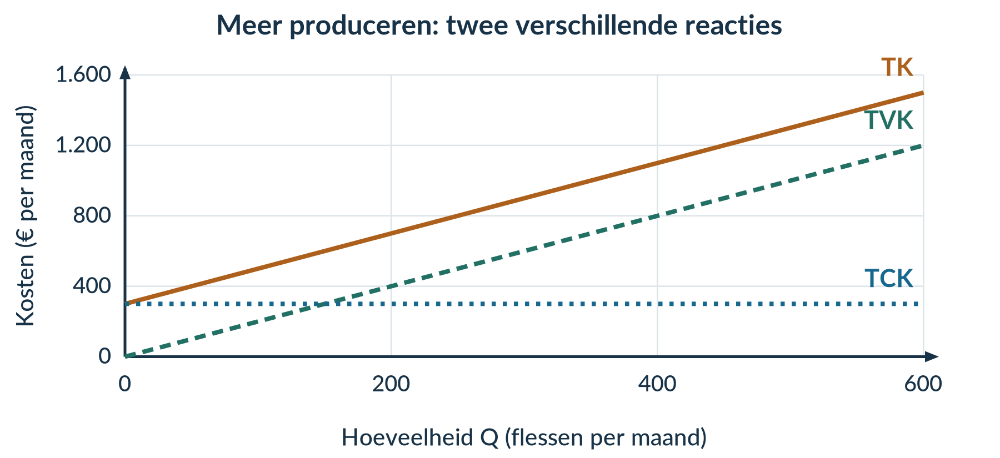
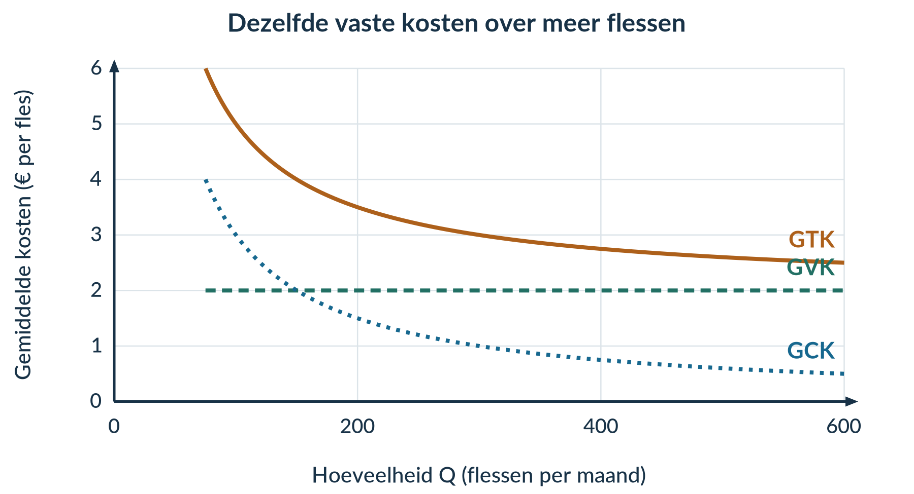

# 2.1.1 Kostenstructuren

2.1.1 · KOSTENSTRUCTUREN

# Twee keer zoveel produceren, twee keer zoveel kosten?

Fles & Co bedrukt drinkflessen. De werkplaats kost € 300 huur per maand. Het materiaal kost € 2 per fles. Deze maand wil het bedrijf niet 200, maar 400 flessen maken. Verdubbelen de kosten dan ook?

<b>Lesdoelen</b> 
Je kunt kosten indelen als constant of variabel en je keuze uitleggen. Je kunt TCK, TVK en TK als functie van Q opschrijven. Je kunt gemiddelde kosten berekenen met de juiste eenheid. Je kunt uitleggen hoe totale en gemiddelde kosten veranderen bij meer productie.

### Kijk naar wat er met het totale bedrag gebeurt

<b>Constante kosten</b> veranderen niet als de productie verandert, zolang de productiecapaciteit gelijk blijft. We bekijken steeds één afgesproken periode, bijvoorbeeld een maand.

<b>Productiecapaciteit</b> is de maximale hoeveelheid die een onderneming in een bepaalde periode kan produceren met de beschikbare mensen en middelen.

Fles & Co kan maximaal **600 flessen per maand** maken. Tot en met die capaciteit blijft de maandhuur € 300. Ook als het bedrijf een maand niets produceert, moet het de huur betalen.

<b>Variabele kosten</b> veranderen wél met de hoeveelheid die een onderneming produceert. Denk aan materiaal dat voor ieder product nodig is.

<figure><figcaption>Figuur 1. De huur blijft gelijk; het totale materiaalbedrag groeit mee.</figcaption></figure>

<b>Een maandelijkse rekening is niet automatisch constant.</b> Een energierekening kan bestaan uit een vast abonnement én stroomverbruik dat met de productie verandert. Beoordeel de onderdelen afzonderlijk.

### Van het verhaal naar een formule

We gebruiken **Q** voor het aantal geproduceerde flessen per maand. De huur van Fles & Co vormt hier alle constante kosten. Het materiaal vormt alle variabele kosten.

<b>TCK = 300</b> <b>TVK = 2Q</b> <b>TK = TCK + TVK = 300 + 2Q</b>

**TCK** zijn de totale constante kosten. **TVK** zijn de totale variabele kosten. **TK** zijn de totale kosten. Alle drie zijn bedragen in **euro per maand**. De 2 in TVK = 2Q betekent € 2 materiaal per fles.

Vul Q in, bereken TVK en tel TCK erbij op. Bij Q = 200: TK = 300 + 2 × 200 = **€ 700 per maand**.

| Q (flessen per maand) | TCK (€ per maand) | TVK (€ per maand) | TK (€ per maand) |
|---:|---:|---:|---:|
| 0 | 300 | 0 | 300 |
| 200 | 300 | 400 | 700 |
| 400 | 300 | 800 | 1.100 |
| 600 | 300 | 1.200 | 1.500 |

### Dezelfde informatie in een grafiek

Begin bij Q = 0: TCK en TK zijn € 300, maar TVK is € 0. De TCK-lijn loopt horizontaal. Voor elke extra fles komen er € 2 variabele kosten bij. Daarom stijgen TVK en TK even snel. **TK ligt steeds € 300 boven TVK.**

<figure><figcaption>Figuur 2. De verticale afstand tussen TK en TVK is steeds gelijk aan TCK.</figcaption></figure>

Van 200 naar 400 flessen verdubbelt TVK. **TK stijgt van € 700 naar € 1.100 en verdubbelt niet:** TCK blijft gelijk.

### Waarom kan meer produceren per fles goedkoper zijn?

De huur is € 300 per maand. Bij 200 flessen verdeel je die huur over 200 producten: € 1,50 per fles. Bij 400 flessen is dat € 0,75 per fles. Het totale huurbedrag daalt niet; **het bedrag per fles daalt**.

<b>Gemiddelde kosten</b> zijn de kosten per product. Je berekent ze door de betreffende totale kosten te delen door Q.

<b>GCK = TCK / Q</b> &nbsp; · &nbsp; <b>GVK = TVK / Q</b> <b>GTK = TK / Q = GCK + GVK</b>

GCK, GVK en GTK zijn de gemiddelde constante, variabele en totale kosten. Hier is de eenheid **euro per fles**. Deze formules gebruik je alleen bij **Q > 0**: delen door nul kan niet.

| Q (flessen per maand) | GCK (€ per fles) | GVK (€ per fles) | GTK (€ per fles) |
|---:|---:|---:|---:|
| 200 | 300 / 200 = 1,50 | 400 / 200 = 2,00 | 700 / 200 = 3,50 |
| 400 | 300 / 400 = 0,75 | 800 / 400 = 2,00 | 1.100 / 400 = 2,75 |

De materiaalkosten per fles blijven € 2. Daardoor blijft GVK hier gelijk. GTK daalt alleen doordat GCK daalt. GTK halveert dus niet als Q verdubbelt.

<figure><figcaption>Figuur 3. GTK bestaat uit GCK plus GVK. De getekende krommen beginnen bij Q = 75; bij Q = 0 bestaan geen gemiddelde kosten.</figcaption></figure>

<b>GVK is niet altijd constant.</b> Dat geldt hier omdat elke fles hetzelfde bedrag aan materiaal kost. Bij een andere productiewijze kunnen de variabele kosten per product veranderen. De formule GVK = TVK / Q blijft dan bruikbaar.

## Uitgewerkt voorbeeld

**PlakLab** maakt stickers. Het bedrijf betaalt € 220 huur en € 80 abonnementskosten per maand. Folie kost € 0,80 per sticker; inkt kost € 0,20 per sticker. De capaciteit is 600 stickers per maand. Vergelijk een productie van 150 en 300 stickers in dezelfde maand.

### Stap 1 · Deel de kosten in en leg uit waarom

| Kostenpost | Soort kosten | Reden |
|---|---|---|
| Huur en abonnementen | Constant | Het totale maandbedrag blijft gelijk bij meer stickers. |
| Folie en inkt | Variabel | Het totale bedrag groeit met het aantal stickers. |

### Stap 2 · Stel de functies op

TCK = 220 + 80 = **300**. Per sticker is € 0,80 + € 0,20 = **€ 1** aan variabele kosten nodig. Dus **TVK = Q** en **TK = 300 + Q**. De uitkomsten zijn euro per maand.

### Stap 3 · Bereken totale en gemiddelde kosten

Bij Q = 150: TVK = 1 × 150 = € 150 en TK = 300 + 150 = € 450 per maand.

GCK = 300 / 150 = **€ 2 per sticker**. GVK = 150 / 150 = **€ 1 per sticker**. GTK = 450 / 150 = **€ 3 per sticker**.

| Q (stickers per maand) | TCK (€ per maand) | TVK (€ per maand) | TK (€ per maand) |
|---:|---:|---:|---:|
| 150 | 300 | 150 | 450 |
| 300 | 300 | 300 | 600 |

| Q (stickers per maand) | GCK (€ per sticker) | GVK (€ per sticker) | GTK (€ per sticker) |
|---:|---:|---:|---:|
| 150 | 2,00 | 1,00 | 3,00 |
| 300 | 300 / 300 = 1,00 | 300 / 300 = 1,00 | 600 / 300 = 2,00 |

### Stap 4 · Verbind de cijfers aan het verhaal

TCK blijft € 300. TVK verdubbelt, maar TK stijgt van € 450 naar € 600 en verdubbelt niet. GCK halveert: dezelfde € 300 wordt over tweemaal zoveel stickers verdeeld. GVK blijft € 1. Daarom daalt GTK van € 3 naar € 2, **niet naar € 1,50**. Beide hoeveelheden passen binnen de capaciteit.

<b>Onthoud</b> 
Constant of variabel? Kijk naar het totale bedrag bij een andere Q. 
TK = TCK + TVK. Gemiddeld betekent: deel door Q, met Q > 0. 
Totaal: € per periode. Gemiddeld: € per product. 
GCK daalt bij meer productie; GVK blijft alleen gelijk als de variabele kosten per product gelijk blijven. 
Hierna voeg je de opbrengsten toe om de winst te berekenen.

## Startopgaven

<b>Opgave 1 · Even ophalen</b>

Een vereniging gebruikt de formule R = 40 + 3N voor het bedrag van een uitstap. R is in euro; N is het aantal deelnemers.

a) Bereken R bij N = 20.

b) Verdeel dat bedrag gelijk over de 20 deelnemers. Hoeveel betaalt ieder?

<b>Opgave 2 · Begripscheck</b>

Een drukker betaalt € 600 huur per maand en € 0,20 inkt per poster. Hij kan maximaal 5.000 posters per maand drukken.

a) Hij drukt deze maand 1.000 in plaats van 500 posters. Welke kostenpost verandert in totaal? Welke niet?

b) Een leerling noemt € 600 de GCK. Leg uit wat er aan die uitspraak niet klopt.

<b>Normale route:</b> Startopgaven → Begeleide inoefening → Zelfstandige oefening → Doeloefening. <b>Uitdagende route (minder tussenstappen, extra uitdaging):</b> Startopgaven → Zelfstandige oefening → Doeloefening → Denkertje / Bonusopgave. Herhaling is extra bij beide routes.

## Begeleide inoefening

*Begeleide inoefening hoort bij leren: je oefent met denkstappen en doet steeds meer zelf.*

<b>Opgave 3 · TasDruk — met denkstappen</b>

TasDruk betaalt € 120 per maand voor een werkruimte. Stof kost € 0,40 en inkt € 0,10 per tas. De capaciteit is 500 tassen per maand.

a) De werkruimte is een constante kostenpost. Maak de verklaring af: ‘Het totale maandbedrag blijft … als het aantal tassen …’

b) Vul aan: TCK = …; variabele kosten per tas = 0,40 + … = …; TVK = … × Q; TK = … + … × Q.

c) Neem de tabel over en vul de lege cellen in. Gebruik eerst TK = TCK + TVK; deel daarna door Q.

| Q (tassen per maand) | TCK (€ per maand) | TVK (€ per maand) | TK (€ per maand) | GTK (€ per tas) |
|---:|---:|---:|---:|---:|
| 200 | 120 | 100 | … | … |
| 400 | … | … | … | … |

d) Bereken ook GCK en GVK bij beide hoeveelheden. Maak af: ‘GTK daalt, omdat … over meer tassen worden verdeeld. GVK blijft …, omdat …’

<b>Opgave 4 · SleutelStudio — minder hulp</b>

SleutelStudio betaalt per maand € 90 huur en € 30 voor een vast abonnement. Materiaal kost € 1,20 en een verpakking € 0,30 per sleutelhanger. De capaciteit is 300 sleutelhangers per maand.

a) Deel de vier kostenposten in. Geef bij elke soort kosten één verklaring.

b) Stel TCK, TVK en TK op.

c) Bereken GCK, GVK en GTK bij Q = 100 en Q = 200. Leg uit welk gemiddelde halveert en welk niet.

## Zelfstandige oefening

<b>Opgave 5 · Twee veranderingen bij TafelTint</b>

TafelTint maakt placemats. In april is de maandhuur € 200 en kost materiaal € 1 per placemat. In mei is de maandhuur € 240 en kost materiaal € 0,80 per placemat. In beide maanden maakt het bedrijf 200 placemats. De capaciteit blijft 600 per maand. Er zijn geen andere kosten.

a) Bereken TCK, TVK en TK voor april en mei.

b) Bekijk de huurverhoging en de lagere materiaalprijs afzonderlijk. Welke verandering raakt de constante kosten? Welke de variabele kosten?

c) Een leerling zegt: ‘De huur stijgt, dus TK stijgt ook.’ Beoordeel dit met je uitkomsten.

<b>Opgave 6 · FietsGlans</b>

FietsGlans maakt fietsen schoon. Per maand betaalt het bedrijf € 240 huur en € 60 verzekering. Reinigingsmiddel kost € 0,60 en een beschermhoes € 0,40 per fiets. De capaciteit is 600 fietsen per maand.

a) Classificeer de kosten en stel TCK, TVK en TK op.

b) Bereken GCK, GVK en GTK bij 200 en 400 fietsen per maand. Noteer de eenheden.

c) Bereken ook TK bij beide hoeveelheden. Leg uit waarom TK stijgt, terwijl GTK daalt.

## Doeloefening

<b>Opgave 7 · Bakkerij De Korenaar</b>

De Korenaar kan maximaal **1.000 broden per maand** bakken. Deze maand blijven de ruimte en ovens hetzelfde. Tot en met die capaciteit gelden de volgende kosten:

| Kostenpost | Bedrag |
|---|---:|
| Huur en verzekering samen | € 440 per maand |
| Netaansluiting en energieabonnement samen | € 60 per maand |
| Meel en verpakking samen | € 0,70 per brood |
| Elektriciteitsverbruik van de ovens | € 0,10 per brood |

Q is het aantal broden per maand.

a) Neem de classificatietabel over en vul **alle lege cellen** in. Geef telkens aan hoe het totale bedrag reageert op een verandering van Q.

| Kostenpost | Constant of variabel? | Reden |
|---|---|---|
| Huur en verzekering | … | … |
| Netaansluiting en abonnement | … | … |
| Meel en verpakking | … | … |
| Elektriciteitsverbruik ovens | … | … |

b) Stel de functies voor TCK, TVK en TK op.

c) Bereken bij Q = 500 de GCK, GVK en GTK. Noteer de volledige eenheden.

d) Bereken bij Q = 1.000 de GCK, GVK en GTK. Noteer de volledige eenheden.

e) Vergelijk eerst TCK, TVK en TK bij beide hoeveelheden. Leg daarna met je uitkomsten uit waarom GCK halveert, GVK gelijk blijft en GTK niet halveert als Q verdubbelt. Je vergelijkt dezelfde maand en dezelfde productiecapaciteit.

<b>Kijk na en herstel</b> 
Controleer niet alleen de getallen. Heb je bij de kostenindeling een reden gegeven? Staan de juiste eenheden bij de gemiddelden? Legt je laatste antwoord het verschil tussen totaal en gemiddeld uit?

## Denkertje / Bonusopgave

<b>Opgave 8 · Eén rekening vertelt niet alles</b>

Een bedrijf maakt 100 stoffen vlaggetjes. De totale kosten zijn € 300. Over de kostenopbouw weet je verder niets.

a) Bedenk twee verschillende kostenfuncties die allebei bij deze gegevens passen. Gebruik positieve constante kosten en constante variabele kosten per vlaggetje.

b) Laat zien dat de twee functies bij 200 vlaggetjes verschillende totale kosten kunnen geven. Neem aan dat de capaciteit daarvoor groot genoeg is.

c) Beoordeel de uitspraak: ‘Als je TK bij één hoeveelheid kent, weet je ook hoeveel een verdubbeling van Q kost.’

## Herhaling / Herhaling en interleaving

<b>Opgave 9 · Procenten</b> Herhaling §1.1.2

Een sportvereniging heeft eerst 540 leden en later 648 leden. Bereken de procentuele stijging. Laat zien welk aantal je als uitgangspunt gebruikt.

<b>Opgave 10 · Tabel lezen</b> Herhaling §1.1.3

Een boottocht heeft de volgende prijstabel voor groepen.

| Aantal deelnemers | 5 | 10 | 15 |
|---|---:|---:|---:|
| Totaal te betalen (€) | 20 | 30 | 40 |

a) Hoeveel betaalt een groep van 10 deelnemers samen? Hoeveel is dat per persoon?

b) Met hoeveel euro stijgt het totaalbedrag als er 5 deelnemers bijkomen? Hoeveel is dat per extra deelnemer?

<b>Terug naar de openingsvraag</b> 
Bij Fles & Co verdubbelt het totale materiaalbedrag als de productie verdubbelt. De huur blijft gelijk. Daarom verdubbelen de totale kosten niet. Het bedrijf maakt meer flessen, maar verdeelt dezelfde huur over meer producten.
