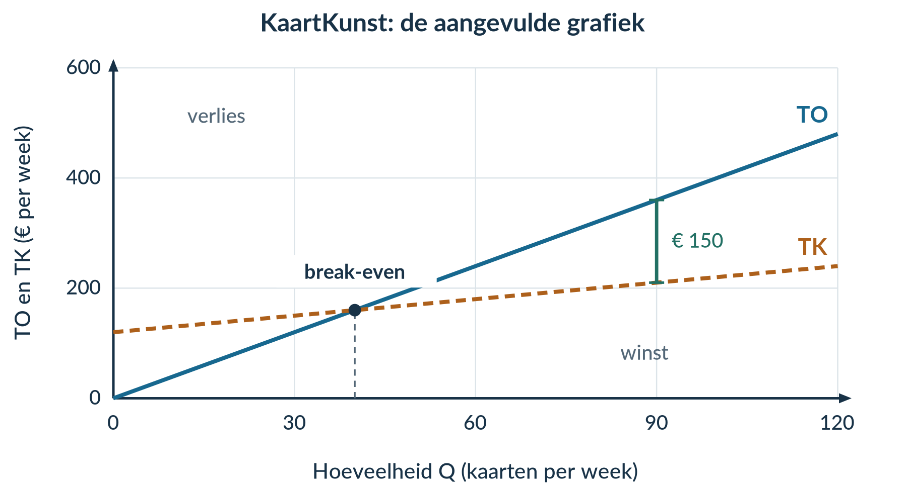
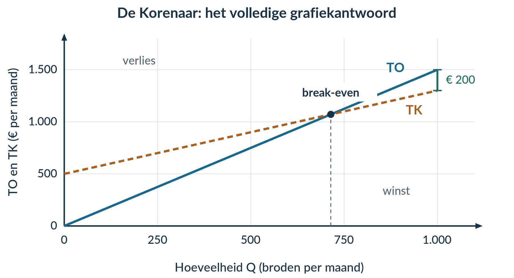

# 2.1.2 Opbrengsten, winst en break-even

## Opgave 1 · Kosten ophalen

**a)** TK = 180 + 3 × 40 = 180 + 120 = **€ 300 per week**. GTK = TK / Q = 300 / 40 = **€ 7,50 per badge**.

*Waarom:* eerst bereken je alle kosten; daarna verdeel je die over de 40 badges.

**b)** **TCK = € 180 per week**. De variabele kosten zijn **€ 3 per badge**.

*Waarom:* 180 staat los van Q; 3 wordt vermenigvuldigd met Q.

## Opgave 2 · Opbrengst is niet hetzelfde als winst

**a)** TO = P × Q = 4 × 80 = **€ 320 voor de activiteit**. GO = TO / Q = 320 / 80 = **€ 4 per entreekaart**. Winst = TO − TK = 320 − 250 = **€ 70 voor de activiteit**.

*Waarom:* opbrengst komt van klanten. Voor winst moeten alle kosten er nog af.

**b)** De leerling verwart **TO met winst**. De € 320 is omzet. Na aftrek van € 250 kosten blijft **€ 70 winst** over.

*Waarom:* een hoog verkoopbedrag is op zichzelf geen bewijs van winst.

## Opgave 3 · SokkenShop

**a)** Het snijpunt ligt bij **Q = 60 paar sokken per week**. Daar zijn TO en TK allebei **€ 360 per week**. Controle: 6 × 60 = 360 en 180 + 3 × 60 = 360.

*Waarom:* bij het snijpunt zijn opbrengsten en kosten gelijk.

**b)** Bij Q = 90: TO = 6 × 90 = **€ 540 per week**; TK = 180 + 3 × 90 = **€ 450 per week**; winst = 540 − 450 = **€ 90 per week**.

*Waarom:* het verticale lijnstuk verbindt TO en TK bij dezelfde Q. De lengte geeft hun verschil in euro per week weer. De volledig gemarkeerde grafiek staat bij de opgave in het hoofdstuk.

**c)** TO = **6 × Q**, dus GO = 6Q / Q = **€ 6 per paar** voor Q > 0.

*Waarom:* ieder paar wordt voor dezelfde prijs verkocht.

## Opgave 4 · KaartKunst

**a)** TO = P × Q = **4Q**. Bij Q = 0: TO = 4 × 0 = **€ 0 per week**. Bij Q = 120: TO = 4 × 120 = **€ 480 per week**. Trek TO door (0; 0) en (120; 480).

*Waarom:* een vaste prijs levert een rechte opbrengstenlijn door de oorsprong op.

**b)** 4Q = 120 + Q → 3Q = 120 → **Q = 40 kaarten per week**. TO = 4 × 40 = **€ 160 per week**. Het snijpunt is (40; 160). Onder 40 kaarten is er verlies; boven 40 tot en met de capaciteit is er winst.

*Waarom:* links van het snijpunt ligt TK boven TO; rechts ligt TO boven TK.

**c)** Bij Q = 90: TO = 4 × 90 = € 360; TK = 120 + 90 = € 210; winst = 360 − 210 = **€ 150 per week**.

*Waarom:* het gaat om een verticale afstand bij Q = 90, niet om een oppervlakte tussen de lijnen.

<figure><figcaption>Grafiekantwoord. Verlies bij Q &lt; 40; winst bij 40 &lt; Q ≤ 120.</figcaption></figure>

## Opgave 5 · TheeTuin

**a)** TO = TK → 4Q = 180 + Q → 3Q = 180 → **Q = 60 pakketten per week**.

Bij Q = 40: TO = 4 × 40 = € 160; TK = 180 + 40 = € 220. **TK ligt boven TO.** Bij Q = 100: TO = 4 × 100 = € 400; TK = 180 + 100 = € 280. **TO ligt boven TK.**

*Waarom:* onder de break-even-afzet is er verlies, erboven winst, zolang de gegeven functies gelden.

**b)** Mogelijke punten voor TO: **(0; 0)** en **(100; 400)**. Voor TK: **(0; 180)** en **(100; 280)**. De eerste coördinaat is pakketten per week; de tweede euro per week.

Bij Q = 100: verticale afstand = TO − TK = 400 − 280 = **€ 120 winst per week**.

*Waarom:* twee punten bepalen een rechte lijn. Het verschil tussen de twee lijnhoogten bij dezelfde Q geeft winst.

## Opgave 6 · PetPret

**a)** **TO = 10Q**. Bij Q = 60: TO = 10 × 60 = € 600; GO = 600 / 60 = **€ 10 per naamplaatje**.

*Waarom:* alle naamplaatjes hebben dezelfde verkoopprijs. Daarom geldt bij Q > 0: GO = P.

**b)** Bij Q = 30: TO = 10 × 30 = € 300; TK = 250 + 4 × 30 = € 370. Winst = 300 − 370 = **−€ 70 per maand**, dus € 70 verlies. Bij Q = 60: TO = € 600; TK = 250 + 4 × 60 = € 490. Winst = 600 − 490 = **€ 110 per maand**.

*Waarom:* pas na aftrek van zowel vaste als variabele kosten zie je het resultaat.

**c)** 10Q = 250 + 4Q → 6Q = 250 → Q = 250 / 6 = **41,67 naamplaatjes per maand volgens de rechte lijnen**. Het eerste gehele aantal zonder verlies is **42**. Controle: winst bij 41 = 410 − 414 = −€ 4; bij 42 = 420 − 418 = **€ 2**.

*Waarom:* je kunt geen deel van een naamplaatje verkopen. Naar 41 afronden zou nog verlies opleveren.

**d)** Horizontaal: naamplaatjes per maand; verticaal: TO en TK in euro per maand. TO gaat door (0; 0) en (100; 1.000). TK gaat door (0; 250) en (100; 650). Het snijpunt is ongeveer **(41,67; 416,67)**. Er is verlies links en winst rechts van het snijpunt, tot de capaciteit van 100.

*Waarom:* TO ligt rechts boven TK. Het lijnstuk bij Q = 60 loopt van € 490 tot € 600 en geeft € 110 winst weer.

<figure><figcaption>Grafiekantwoord. Geen oppervlakte inkleuren als winst.</figcaption></figure>

## Opgave 7 · Een indrukwekkend verkoopbedrag

Winst = TO − TK = 2.000 − 2.020 = **−€ 20 op zaterdag**, dus **€ 20 verlies**. De uitspraak is onjuist.

*Waarom:* de kosten zijn hoger dan de omzet. De hoogte van de omzet alleen zegt niet of er winst is.

## Opgave 8 · Doeloefening · Bakkerij De Korenaar

**a)** TO = P × Q = **1,50Q**, in euro per maand. Voor Q > 0: GO = TO / Q = 1,50Q / Q = **€ 1,50 per brood**.

*Waarom:* ieder brood brengt dezelfde prijs op. Het gemiddelde van die gelijke prijzen is weer € 1,50.

**b)** Bij Q = 500: TO = 1,50 × 500 = € 750; TK = 500 + 0,80 × 500 = € 900. Winst = 750 − 900 = **−€ 150 per maand**.

Bij Q = 1.000: TO = 1,50 × 1.000 = € 1.500; TK = 500 + 0,80 × 1.000 = € 1.300. Winst = 1.500 − 1.300 = **€ 200 per maand**.

*Waarom:* bij 500 broden is de opbrengst onvoldoende om alle kosten te dekken. Bij 1.000 broden is de opbrengst wel hoger dan de kosten.

**c)** Stel TO gelijk aan TK en los de vergelijking op:

1,50Q = 500 + 0,80Q 0,70Q = 500 Q = 500 / 0,70 = 714,285714…

Volgens de rechte lijnen is de break-even-afzet ongeveer **714,29 broden per maand**. De bijbehorende opbrengst is 1,50 × (500 / 0,70) ≈ **€ 1.071,43 per maand**.

Het eerste gehele aantal broden zonder verlies is **715**. Controle: bij 714 is winst = 0,70 × 714 − 500 = −€ 0,20; bij 715 is winst = 0,70 × 715 − 500 = **€ 0,50 per maand**.

*Waarom:* de lijnberekening mag tussen gehele aantallen uitkomen. Bij echte broden heb je het eerstvolgende gehele aantal nodig om geen verlies te maken. Dat is niet exact hetzelfde als winst nul.

**d)** Horizontaal: **Q, broden per maand**. Verticaal: **TO en TK, euro per maand**. TO gaat door (0; 0) en (1.000; 1.500). TK gaat door (0; 500) en (1.000; 1.300). Markeer het snijpunt **(714,29; 1.071,43)**. Links is er verlies; rechts is er winst, tot en met de capaciteit van 1.000 broden.

*Waarom:* de winst bij Q = 1.000 is de verticale afstand tussen € 1.300 en € 1.500: **€ 200 per maand**. Een oppervlakte is hier geen winstbedrag.

<figure><figcaption>Volledig grafiekantwoord. De as loopt iets verder door voor de labels; de kosten- en opbrengstenlijnen stoppen bij de capaciteit.</figcaption></figure>

## Opgave 9 · Denkertje · Uitverkocht, maar toch verlies

**Een mogelijk modelantwoord bij a–b**

Uitverkocht betekent Q = 80. TO = 8 × 80 = **€ 640 per voorstelling**. TK = 500 + 2 × 80 = **€ 660 per voorstelling**. Winst = 640 − 660 = **−€ 20 per voorstelling**.

Break-even: 8Q = 500 + 2Q → 6Q = 500 → Q = **83,33 bezoekers** volgens de rechte lijnen. Het eerste gehele aantal zonder verlies zou 84 zijn. Dat past niet in het theater. ‘Uitverkocht’ betekent dus niet automatisch ‘winst’.

**Verandering 1:** verlaag alleen TCK naar **€ 480 per voorstelling**. Bij 80 bezoekers worden TK = 480 + 2 × 80 = € 640 en TO = € 640. De voorstelling is dan precies break-even.

**Verandering 2:** houd de oorspronkelijke kosten en verhoog alleen de prijs naar **€ 8,25 per kaartje**. Als alle 80 kaarten worden verkocht, is TO = 8,25 × 80 = € 660 = TK. Ook dan is de voorstelling precies break-even. De berekening bewijst niet dat alle kaarten bij de hogere prijs werkelijk worden verkocht.

**Beoordelingscriteria:** juiste verlies- en break-evenberekening; expliciete vergelijking met 80 zitplaatsen; twee verschillende, kloppende wijzigingen zonder capaciteitsuitbreiding. Andere passende wijzigingen, zoals lagere variabele kosten, zijn ook goed.

## Opgave 10 · Herhaling · Totaal en gemiddeld

TCK = **€ 400 per maand**. TVK = 6 × 100 = **€ 600 per maand**. TK = 400 + 600 = **€ 1.000 per maand**.

GCK = 400 / 100 = **€ 4 per boek**. GVK = 600 / 100 = **€ 6 per boek**. GTK = 1.000 / 100 = **€ 10 per boek**.

*Waarom:* de eerste drie bedragen gaan over de hele productie. De laatste drie delen die bedragen door het aantal boeken. Controle: 4 + 6 = 10. Herhaal §2.1.1 bij verwarring tussen totaal en gemiddeld.

## Opgave 11 · Herhaling · Procenten blijven handig

**a)** Procentuele omzetstijging = ((1.400 − 1.250) / 1.250) × 100% = (150 / 1.250) × 100% = **12%**.

*Waarom:* de oude omzet vormt de basis. Herhaal §1.1.2 bij twijfel over de noemer.

**b)** **Nee.** Winst = TO − TK. De kosten van beide maanden ontbreken. Daardoor kun je de winstbedragen en hun procentuele verandering niet bepalen.

*Waarom:* omzetgroei kan samengaan met een andere kostenontwikkeling.

