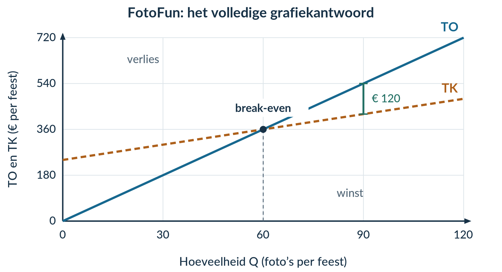
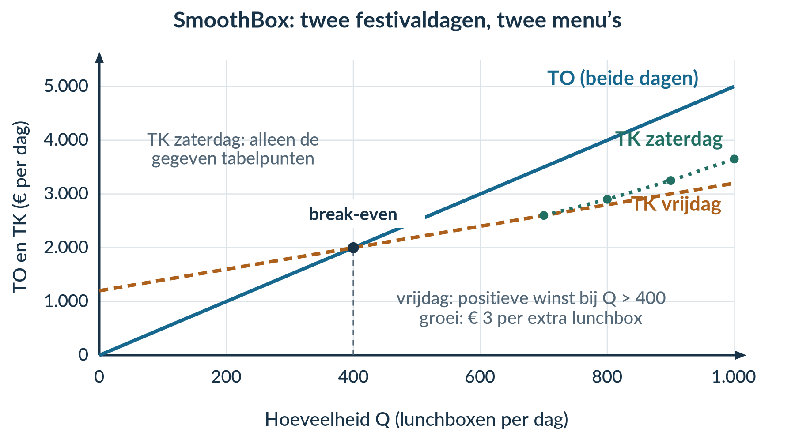

# 2.1.4 Gemengde opgaven

## Opgave 1 · ShirtSprint op het schoolfeest

**a)** TCK = 480 + 120 = **€ 600 voor het schoolfeest**. Variabele kosten per shirt = 4 + 1 = **€ 5 per shirt**. P = **€ 11 per shirt**. De **600 verwachte bezoekers** zijn niet nodig om TK en TO op te stellen.

*Waarom:* het vaste kraam- en vergunningbedrag verandert niet met Q. De totale shirt-, bedrukking- en verpakkingskosten wel. Het aantal bezoekers is niet automatisch het aantal kopers.

**b)** **TK = 600 + 5Q** en **TO = 11Q**, in euro voor het schoolfeest, tot en met 300 shirts.

*Waarom:* vermenigvuldig de bedragen per shirt met Q en voeg alleen bij TK het vaste bedrag toe.

**c)** Bij Q = 150: TK = 600 + 5 × 150 = **€ 1.350**; TO = 11 × 150 = **€ 1.650**; winst = 1.650 − 1.350 = **€ 300**, alle drie voor het schoolfeest. GTK = 1.350 / 150 = **€ 9 per shirt**.

*Waarom:* winst is een totaalverschil; GTK is een bedrag per shirt.

**d)** 11Q = 600 + 5Q → 6Q = 600 → **Q = 100 shirts**. Bij dat aantal: TO = 11 × 100 = € 1.100 en TK = 600 + 5 × 100 = € 1.100. Winst = **€ 0**.

*Waarom:* break-even betekent dat opbrengst en kosten gelijk zijn. Het betekent niet dat er niets in de kassa zit. Er is juist € 1.100 verkoopopbrengst.

## Opgave 2 · FotoFun

**a)** Bij Q = 30: TO = **€ 180 per feest**; TK = **€ 300 per feest**. Winst = 180 − 300 = **−€ 120 per feest**, dus € 120 verlies.

*Waarom:* bij Q = 30 ligt de kostenlijn boven de opbrengstenlijn.

**b)** Het snijpunt ligt bij **60 foto’s per feest**. TO en TK zijn daar beide **€ 360 per feest**.

*Waarom:* beide lijnen hebben bij die Q dezelfde hoogte; de winst is nul.

**c)** Bij Q = 90: TO = € 540; TK = € 420. Winst = 540 − 420 = **€ 120 per feest**. Markeer het verticale lijnstuk bij Q = 90 van € 420 tot € 540.

*Waarom:* de verticale as geeft totale eurobedragen weer. Hun verschil is winst. Een driehoeksoppervlakte vermenigvuldigt ook nog met een hoeveelheid en geeft hier niet de winst.

**d)** Stap 60 → 90: MK = (420 − 360) / (90 − 60) = 60 / 30 = **€ 2 per extra foto**. MO = (540 − 360) / (90 − 60) = 180 / 30 = **€ 6 per extra foto**. De winst stijgt met ΔTO − ΔTK = 180 − 60 = **€ 120 per feest**. Controle: (MO − MK) × ΔQ = (6 − 2) × 30 = € 120.

*Waarom:* die dertig extra foto’s brengen samen € 180 extra op en kosten € 60 extra.

<figure><figcaption>Grafiekantwoord bij b en c. Het lijnstuk geeft winst weer, geen oppervlakte.</figcaption></figure>

## Opgave 3 · Twee offertes voor clubsjaals

**a)** Offerte A: **TK = 100 + 4Q**. Het constante bedrag is € 100 per bestelling; de totale variabele kosten zijn 4Q. Offerte B: **TK = 280 + Q**. Het constante bedrag is € 280 per bestelling; de totale variabele kosten zijn Q. Alle totale bedragen zijn euro per bestelling.

*Waarom:* de vaste rekening staat los van het aantal sjaals, het variabele bedrag groeit mee met Q.

**b)**

| Q (sjaals) | TK offerte A (€ per bestelling) | TK offerte B (€ per bestelling) |
|---:|---:|---:|
| 30 | 100 + 4 × 30 = 220 | 280 + 30 = 310 |
| 80 | 100 + 4 × 80 = 420 | 280 + 80 = 360 |

*Waarom:* bij weinig sjaals weegt het lagere vaste bedrag van A zwaar. Bij meer sjaals wordt het lage bedrag per sjaal van B belangrijker.

**c)** TO bij 80 sjaals = 8 × 80 = **€ 640 per bestelling**. Winst met A = 640 − 420 = **€ 220**. Winst met B = 640 − 360 = **€ 280**. **B geeft de hoogste winst.**

*Waarom:* de opbrengst is gelijk, maar B heeft bij deze hoeveelheid de laagste totale kosten.

**d)** De uitspraak is **onjuist**. Bij 30 sjaals is A goedkoper, maar bij 80 sjaals is B goedkoper. Het verschil bij 80 is 420 − 360 = **€ 60 per bestelling**.

*Waarom:* alleen vaste bedragen vergelijken laat de variabele kosten buiten beschouwing.

## Opgave 4 · SkateService

**Eerst de winstkolom:** winst = TO − TK. Bij Q = 10: 400 − 260 = € 140. Bij Q = 20: 800 − 320 = € 480. Bij Q = 30: 1.200 − 410 = € 790.

| Q (beurten per week) | TK (€ per week) | TO (€ per week) | Winst (€ per week) |
|---:|---:|---:|---:|
| 10 | 260 | 400 | 140 |
| 20 | 320 | 800 | 480 |
| 30 | 410 | 1.200 | 790 |

*Waarom:* de winstcellen horen bij het totale aantal beurten in die rij.

**a)** Van 10 naar 20 beurten: MK = (320 − 260) / (20 − 10) = **€ 6 per extra beurt**; MO = (800 − 400) / 10 = **€ 40 per extra beurt**. Van 20 naar 30: MK = (410 − 320) / (30 − 20) = **€ 9 per extra beurt**; MO = (1.200 − 800) / 10 = **€ 40 per extra beurt**.

*Waarom:* beide stappen bevatten tien extra beurten. Het kostenverschil groeit; het opbrengstverschil niet.

**b)** Eerste extra groep (10 → 20): extra winst = 480 − 140 = **€ 340 per week**. Tweede extra groep (20 → 30): 790 − 480 = **€ 310 per week**.

*Waarom:* in de tweede groep zijn de extra kosten € 90 in plaats van € 60, terwijl beide groepen € 400 extra opbrengen.

**c)** De uitspraak is **onjuist**. Gelijke extra omzet betekent niet gelijke extra winst. De tweede groep levert **€ 30 minder extra winst** op.

*Waarom:* extra winst is extra opbrengst min extra kosten.

## Opgave 5 · Doeloefening · SmoothBox

**a)** Uit bron A: **TCK = € 1.200 per dag**, variabele kosten **€ 2 per lunchbox**, verkoopprijs **€ 5 per lunchbox**. De totale constante kosten blijven € 1.200 bij een andere Q. De totale variabele kosten veranderen met Q. Het aantal van **4.000 verwachte bezoekers** is niet nodig voor TK en TO.

*Waarom:* het bezoekcijfer is geen gegarandeerde afzet. De kosten- en opbrengstfuncties worden opgebouwd uit vaste bedragen en bedragen per lunchbox.

**b)** Voor vrijdag: **TK = 1.200 + 2Q**, **TO = 5Q**, in euro per dag, tot en met de capaciteit van 1.000 lunchboxen.

Break-even: 5Q = 1.200 + 2Q → 3Q = 1.200 → **Q = 400 lunchboxen per dag**. Daarbij is TO = 5 × 400 = **€ 2.000 per dag**.

*Waarom:* op vrijdag bedragen de opbrengsten bij 400 lunchboxen precies evenveel als alle kosten.

**c)** Bij Q = 700: TK = 1.200 + 2 × 700 = € 2.600; TO = 5 × 700 = € 3.500. Winst = 3.500 − 2.600 = **€ 900 per dag**. GTK = TK / Q = 2.600 / 700 ≈ **€ 3,71 per lunchbox**.

*Waarom:* de winst is het totale verschil. GTK verdeelt alle € 2.600 kosten over de 700 lunchboxen.

**d)** Gebruik voor zaterdag bron B, niet de vrijdagkostenfunctie.

| Stap op zaterdag | MK (€ per extra lunchbox) | MO (€ per extra lunchbox) |
|---|---|---|
| 700 → 800 | (2.900 − 2.600) / (800 − 700) = **3,00** | (4.000 − 3.500) / 100 = **5,00** |
| 800 → 900 | (3.250 − 2.900) / (900 − 800) = **3,50** | (4.500 − 4.000) / 100 = **5,00** |
| 900 → 1.000 | (3.650 − 3.250) / (1.000 − 900) = **4,00** | (5.000 − 4.500) / 100 = **5,00** |

*Waarom:* het zaterdagmenu heeft andere variabele kosten. De TCK zijn nog steeds € 1.200 per dag; ze veranderen niet doordat Q toeneemt. De prijs per lunchbox blijft € 5.

**e)** Markeer voor vrijdag het punt **(400; 2.000)** in bron C. De vrijdagwinst is positief bij **meer dan 400 tot en met 1.000 lunchboxen per dag**. Bij gehele aantallen zijn dat 401 tot en met 1.000 lunchboxen.

Op vrijdag: MO − MK = 5 − 2 = **€ 3 per extra lunchbox**. Op zaterdag achtereenvolgens: 5 − 3 = **€ 2**; 5 − 3,50 = **€ 1,50**; 5 − 4 = **€ 1 per extra lunchbox**.

De positieve verticale winstafstand groeit dus **op vrijdag bij meer dan 400 tot en met 1.000 lunchboxen het snelst**. Dit is een vergelijking met alle drie de gegeven zaterdagstappen.

*Waarom:* een winstafstand groeit met de extra opbrengst min de extra kosten. Vergelijk bedragen per extra lunchbox, niet alleen totale winstbedragen. Over niet-gegeven zaterdaghoeveelheden doet dit antwoord geen uitspraak.

<figure><figcaption>Grafiekantwoord bij e. Op zaterdag worden alleen de gegeven tabelpunten verbonden; de vrijdagfunctie vervangt de zaterdaggegevens niet.</figcaption></figure>

**f)** De uitspraak is **onjuist**. Extra winst van 700 naar 800 = (5 − 3) × 100 = **€ 200 per dag**. Van 800 naar 900 = (5 − 3,50) × 100 = **€ 150 per dag**. Van 900 naar 1.000 = (5 − 4) × 100 = **€ 100 per dag**.

*Waarom:* elke groep brengt € 500 extra op, maar kost achtereenvolgens € 300, € 350 en € 400 extra. Daarom daalt de extra winst per groep.

## Opgave 6 · Denkertje · Meer productie zonder meer verkoop

**Een mogelijk modelantwoord bij a–c**

De afspraak ‘alle geproduceerde producten worden verkocht’ geldt hier niet. Er zijn **100 gemaakte muffins**, maar slechts **70 verkochte muffins**.

Werkelijke TO = 2 × 70 = **€ 140**. TK = 60 + 0,80 × 100 = **€ 140**. Winst = 140 − 140 = **€ 0** voor het leerlingenbedrijf. Sam telt ten onrechte opbrengst van dertig onverkochte muffins mee.

De kosten hangen hier af van de **geproduceerde** hoeveelheid; de opbrengst van de **verkochte** hoeveelheid. Je mag die aantallen niet gelijkstellen.

De uitspraak bij c is juist. Met 100 gemaakte muffins zijn GTK = 140 / 100 = **€ 1,40 per gemaakte muffin**. Ter vergelijking: als het bedrijf alleen de 70 verkochte muffins had gemaakt, waren TK = 60 + 0,80 × 70 = **€ 116** en GTK = 116 / 70 ≈ **€ 1,66 per muffin**. Met dezelfde verkoopopbrengst van € 140 was de winst dan **€ 24** geweest. Meer produceren geeft hier lagere GTK, maar lagere winst.

**Beoordelingscriteria:** productie en afzet uit elkaar houden; € 140 opbrengst, € 140 kosten en € 0 winst correct berekenen; de vergelijking tussen GTK en winst uitleggen met de onverkochte voorraad. De extra vergelijking met 70 gemaakte muffins is een sterke uitwerking, geen vereiste extra formule.

## Opgave 7 · Drie verschillende vragen

**a)** TK = 100 + 2 × 50 = **€ 200 per week**.

*Waarom:* dit zijn de kosten van alle vijftig posters samen.

**b)** GTK = TK / Q = 200 / 50 = **€ 4 per poster**.

*Waarom:* je verdeelt alle kosten over alle vijftig posters.

**c)** Bij Q = 40: TK = 100 + 2 × 40 = € 180; TO = 5 × 40 = € 200. Bij Q = 50: TK = € 200; TO = 5 × 50 = € 250.

MK = (200 − 180) / (50 − 40) = **€ 2 per extra poster**. MO = (250 − 200) / (50 − 40) = **€ 5 per extra poster**.

*Waarom:* voor marginale bedragen neem je alleen de verschillen en deel je door tien extra posters.

**d)** Winst = TO − TK = 250 − 200 = **€ 50 per week**.

*Waarom:* het verschil tussen de totale verkoopopbrengst en alle kosten is wat overblijft.