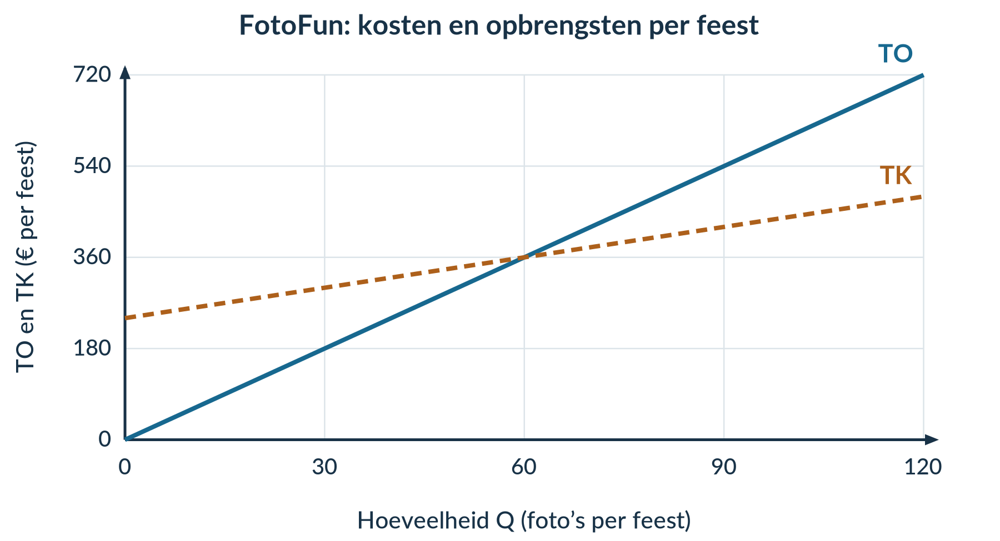
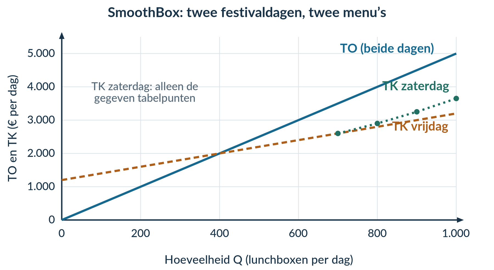

# 2.1.4 Gemengde opgaven

2.1.4 · GEMENGDE OPGAVEN

# Welke informatie heb je nodig?

Bij een gemengde opgave staat niet boven elke vraag welke formule je moet kiezen. Dat doe je zelf. Lees eerst wat er wordt gevraagd: een totaalbedrag, een bedrag per product, een verandering of een verklaring?

<b>Lesdoelen</b> 
Je kunt relevante gegevens uit bronnen kiezen. Je kunt kosten, opbrengsten, winst, break-even en marginale veranderingen combineren. Je kunt een tabel en een grafiek met elkaar verbinden. Je kunt een uitspraak met berekeningen beoordelen zonder meer te beweren dan de gegevens laten zien.

Deze paragraaf bevat **geen nieuwe theorie**. Je gebruikt wat je in de vorige drie paragrafen hebt geleerd. De doeloefening bestaat uit een bronblad en vragen; houd beide bij elkaar.

### Eerst zelfstandig combineren

<b>Opgave 1 · ShirtSprint op het schoolfeest</b>

ShirtSprint bedrukt T-shirts. Voor één schoolfeest kost de kraam € 480 en een vaste vergunning € 120. Een blanco shirt kost € 4; bedrukking en verpakking kosten samen € 1 per shirt. Ieder shirt wordt verkocht voor € 11. De capaciteit is 300 shirts op die dag. De school verwacht 600 bezoekers.

a) Kies de gegevens voor TCK, de variabele kosten per shirt en de verkoopprijs. Welk getal heb je niet nodig voor het opstellen van TK en TO?

b) Stel de functies voor TK en TO op.

c) Bereken bij Q = 150 de totale kosten, totale opbrengst, winst en GTK. Gebruik de juiste eenheden.

d) Bereken de break-even-afzet. Een leerling noemt dat het aantal shirts waarbij de kassa leeg is. Leg uit waarom dat niet klopt.

<b>Schrijf een controleerbaar antwoord</b> 
Gebruik bij een berekening: formule → invullen → uitkomst met eenheid. 
Gebruik bij een verklaring: uitkomst → economische betekenis → conclusie. 
Een conclusie als ‘meer’, ‘minder’ of ‘goedkoper’ heeft altijd een vergelijking nodig: meer dan wat, en per product of in totaal?

<b>Opgave 2 · FotoFun</b>

FotoFun verkoopt geprinte foto’s op een feest. Alle foto’s hebben dezelfde prijs. De capaciteit is 120 foto’s per feest. De grafiek toont alle totale kosten en opbrengsten.

<figure><figcaption>Bron bij opgave 2. De verticale as geeft totale bedragen per feest.</figcaption></figure>

a) Lees bij Q = 30 TO en TK af. Bereken het resultaat en schrijf op of er winst of verlies is.

b) Lees de break-even-afzet af. Hoe hoog zijn TO en TK bij dat aantal?

c) Bereken bij Q = 90 de winst. Markeer het bijbehorende verticale lijnstuk. Een klasgenoot wil een driehoek inkleuren en de oppervlakte berekenen. Leg uit waarom dat hier niet juist is.

d) Gebruik de punten bij Q = 60 en Q = 90. Bereken MK en MO over deze stap. Laat zien hoeveel de totale winst door die 30 extra foto’s verandert.

<b>Opgave 3 · Twee offertes voor clubsjaals</b>

Een sportclub verkoopt sjaals voor € 8 per stuk. Beide leveranciers kunnen maximaal 100 sjaals voor de club maken. Alle bestelde sjaals worden verkocht.

| Offerte | Vast bedrag per bestelling | Variabele kosten per sjaal |
|---|---:|---:|
| A | € 100 | € 4 |
| B | € 280 | € 1 |

a) Stel voor beide offertes TK op. Geef aan welk deel constant is en welk deel met Q verandert.

b) Bereken TK bij 30 en bij 80 sjaals voor beide offertes.

c) Welke offerte geeft bij 80 sjaals de hoogste winst? Bereken die winst.

d) Beoordeel de uitspraak: ‘Offerte A is altijd goedkoper, want het vaste bedrag is lager.’

<b>Opgave 4 · SkateService</b>

SkateService onderhoudt skateboards. De capaciteit is 30 onderhoudsbeurten per week. Neem de tabel over en vul eerst de lege winstcellen in.

| Q (beurten per week) | TK (€ per week) | TO (€ per week) | Winst (€ per week) |
|---:|---:|---:|---:|
| 10 | 260 | 400 | … |
| 20 | 320 | 800 | … |
| 30 | 410 | 1.200 | … |

a) Bereken MK en MO over beide stappen.

b) Vergelijk de extra winst van de eerste en de tweede groep van tien extra beurten. Laat je berekeningen zien.

c) Beoordeel: ‘Omdat elke groep tien extra beurten evenveel omzet oplevert, is ook de extra winst gelijk.’

## Doeloefening

**Opgave 5 · SmoothBox op het schoolfestival**

SmoothBox verkoopt lunchboxen op twee festivaldagen. De capaciteit is op beide dagen **1.000 lunchboxen per dag**. Alle gemaakte lunchboxen worden voor **€ 5 per stuk** verkocht. Gebruik het juiste dagmenu bij elke vraag op de volgende pagina.

<b>Bron A · Vrijdag: het gewone menu</b> 
De totale constante kosten zijn € 1.200 per dag. De variabele kosten zijn € 2 per lunchbox. Deze bedragen gelden tot en met de capaciteit. Er worden 4.000 festivalbezoekers verwacht.

<b>Bron B · Zaterdag: een ander menu</b> 
De constante kosten blijven € 1.200 per dag. Dit menu vraagt bij meer productie steeds meer betaald werk per extra lunchbox. De variabele kosten per lunchbox zijn daarom niet steeds gelijk. Gebruik voor zaterdag de onderstaande totale bedragen, niet de € 2 uit bron A.

| Q (lunchboxen per dag) | TK zaterdag (€ per dag) | TO zaterdag (€ per dag) |
|---:|---:|---:|
| 700 | 2.600 | 3.500 |
| 800 | 2.900 | 4.000 |
| 900 | 3.250 | 4.500 |
| 1.000 | 3.650 | 5.000 |

**Bron C · Basisgrafiek**

<figure><figcaption>Bron C. Voor zaterdag zijn alleen de punten uit bron B weergegeven. Break-even en de gevraagde markeringen moet je zelf toevoegen.</figcaption></figure>

<b>Opgave 5 · SmoothBox — vervolg</b>

Gebruik het bronblad op de vorige pagina. Q is het aantal lunchboxen per dag.

a) Selecteer uit bron A de constante kosten, de variabele kosten per lunchbox en de verkoopprijs. Leg uit welke totale kosten met Q veranderen en welke gelijk blijven. Noem ook het gegeven dat je niet nodig hebt voor TK en TO.

b) Stel voor vrijdag de functies voor TK en TO op. Bereken de break-even-afzet.

c) Bereken voor vrijdag bij Q = 700 de winst en GTK. Noteer de volledige eenheden.

d) Bereken met bron B voor elk van de drie stappen op zaterdag MK en MO per extra lunchbox. Laat bij iedere MK-berekening teller en noemer zien.

e) Markeer in bron C het break-evenpunt van vrijdag. Geef ook aan voor welke vrijdaghoeveelheden de verticale winstafstand positief is. Vergelijk de groei van die winstafstand per extra lunchbox op vrijdag met de drie zaterdagstappen. Op welke dag en bij welke hoeveelheden groeit de positieve winstafstand het snelst? Onderbouw met MK en MO.

f) Een leerling zegt: ‘Door de vaste verkoopprijs leveren alle extra groepen van honderd lunchboxen evenveel extra winst op.’ Beoordeel de uitspraak met de drie zaterdagstappen. Bereken daarbij de extra winst per groep.

<b>Voordat je gaat nakijken</b> 
Bij a–c gebruik je vrijdag. Bij d en f gebruik je zaterdag. Bij e vergelijk je beide dagen. Heb je een totaalbedrag nooit verwisseld met een bedrag per lunchbox? Is je grafiekmarkering in overeenstemming met je berekeningen?

<b>Houd je conclusie bij de gegevens.</b> 
Je vergelijkt hier de gegeven hoeveelheden en twee menu’s. Je hoeft niet te voorspellen hoeveel lunchboxen werkelijk worden verkocht, of bij welke hoeveelheid de winst maximaal zou zijn.

### Denkertje

<b>Opgave 6 · Meer productie zonder meer verkoop</b>

Een leerlingenbedrijf bakt 100 muffins. De constante kosten zijn € 60. Ingrediënten en verpakking kosten € 0,80 per gemaakte muffin. De verkoopprijs is € 2. Het bedrijf verkoopt maar 70 muffins. De 30 overgebleven muffins kunnen niet later worden verkocht en hebben geen opbrengst.

Sam rekent TO = 2 × 100 = € 200 en concludeert dat er € 60 winst is.

a) Welke afspraak uit dit hoofdstuk geldt hier niet? Bereken de werkelijke opbrengst, kosten en winst.

b) Leg uit waarom bij deze opgave niet één en dezelfde hoeveelheid in zowel de kostenfunctie als de opbrengstenfunctie kan worden gebruikt.

c) Beoordeel de uitspraak: ‘Meer produceren verlaagt soms GTK, maar garandeert geen hogere winst.’ Verbind je antwoord aan dit voorbeeld.

### Herhaling

<b>Opgave 7 · Drie verschillende vragen</b>

Een zeefdrukker heeft TK = 100 + 2Q en TO = 5Q per week. De capaciteit is 100 posters. Beantwoord iedere vraag met een berekening en de volledige eenheid.

a) Hoeveel zijn de totale kosten bij Q = 50?

b) Hoeveel zijn de gemiddelde totale kosten bij Q = 50?

c) Wat zijn MK en MO voor de stap van Q = 40 naar Q = 50?

d) Hoeveel winst maakt de drukker bij Q = 50?

<b>Een zin die laat zien dat je het begrijpt</b> 
Maak na het nakijken in je eigen woorden deze vergelijking: ‘Totale kosten gaan over …, gemiddelde kosten over …, en marginale kosten over …’ Gebruik bij elk deel een getal uit opgave 7.
