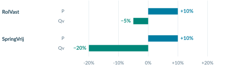
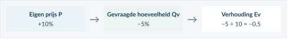
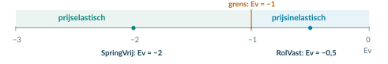
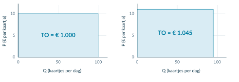
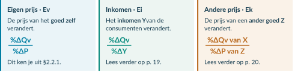
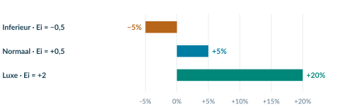
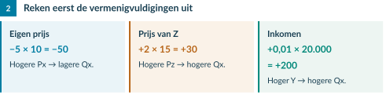

4VECO · ECONOMIE · 4 VWO · BOEK 2

Elasticiteit

Hoe sterk reageren klanten?

Een ondernemer verhoogt de prijs. Elk verkocht product levert nu meer op, maar sommige klanten haken af. Is dat verstandig? Het antwoord hangt af van **hoe sterk de gevraagde hoeveelheid reageert**.

In hoofdstuk 2.1 rekende je met kosten, opbrengsten en winst. Nu onderzoek je wat er met de vraag gebeurt als de prijs, het inkomen of de prijs van een ander product verandert.

<a href="#s221"><b>2.2.1 · Prijselasticiteit 36</b>Van procentuele veranderingen naar een maat voor prijsgevoeligheid.</a>
<a href="#s222"><b>2.2.2 · Elasticiteit en omzet 44</b>Begrijpen én narekenen wat een prijsverandering met de omzet doet.</a>
<a href="#s223"><b>2.2.3 · Inkomen en de prijs van andere goederen 52</b>Ei, Ek en vraagfuncties met meerdere variabelen.</a>
<a href="#s224"><b>2.2.4 · Gemengde opgaven 64</b>Gegevens kiezen, berekenen, vergelijken en een advies onderbouwen.</a>
<a href="#overzicht"><b>Hoofdstukoverzicht 70</b>De formules en beslisregels bij elkaar.</a>

<b>Na dit hoofdstuk kun je</b> 
procentuele veranderingen berekenen met de oude waarde als basis; Ev berekenen, uitleggen en gebruiken voor de indeling elastisch of inelastisch; omzet vóór en na vergelijken; Ei en Ek berekenen en goederen of relaties indelen; één variabele in een vraagfunctie veranderen; en met meerdere bronnen een voorzichtig omzetadvies geven.

<b>Zo werk je met dit hoofdstuk</b> 
Lees de uitleg en het uitgewerkte voorbeeld. Begeleide inoefening is voor de meeste leerlingen een normaal onderdeel van leren. Volg na de startopgaven de begeleide en zelfstandige oefening naar de doeloefening. Heb je minder tussenstappen nodig en wil je extra uitdaging? Volg de uitdagende route met de bonus. Herhaling is extra bij beide routes.

Werk in je schrift; neem tabellen over wanneer dat wordt gevraagd. Gebruik een rekenmachine. Reken tussendoor ongerond en rond einduitkomsten zo nodig af op twee decimalen. Alle bedrijven en getallen zijn oefensituaties. Bij een zuivere elasticiteitsberekening houden we de andere vraagfactoren gelijk, tenzij de opgave anders vermeldt.

<!-- Native reconstruction of accepted physical page 38; see the revision provenance. -->
<article class="native-theory" data-accepted-page="38">
<svg aria-hidden="true" class="native-decoration" style="left:53.3583pt;top:77.7636pt;width:488.5591pt;height:2.1pt" viewbox="53.3583 77.7636 488.5591 2.1"><path d="M 53.8583 51.0236 H 541.4174 V 78.2636 H 53.8583 Z M 53.8583 51.0236 H 541.4174 V 79.3636 H 53.8583 Z" fill="#007da2" fill-rule="evenodd" stroke="none" stroke-width="0"></path></svg>
<svg aria-hidden="true" class="native-decoration" style="left:53.3583pt;top:102.7036pt;width:488.5591pt;height:1.5pt" viewbox="53.3583 102.7036 488.5591 1.5"><path d="M 53.8583 85.3636 H 541.4174 V 103.2036 H 53.8583 Z M 53.8583 85.3636 H 541.4174 V 103.7036 H 53.8583 Z" fill="#cedfe6" fill-rule="evenodd" stroke="none" stroke-width="0"></path></svg>
<svg aria-hidden="true" class="native-decoration" style="left:53.3583pt;top:161.2546pt;width:488.5591pt;height:75.203pt" viewbox="53.3583 161.2546 488.5591 75.203"><path d="M 53.8583 161.7546 H 541.4174 V 235.9576 H 53.8583 Z" fill="#f1f5f7" fill-rule="nonzero" stroke="none" stroke-width="0"></path></svg>
<svg aria-hidden="true" class="native-decoration" style="left:53.3583pt;top:161.2546pt;width:3pt;height:75.203pt" viewbox="53.3583 161.2546 3 75.203"><path d="M 55.8583 161.7546 H 541.4174 V 235.9576 H 55.8583 Z M 53.8583 161.7546 H 541.4174 V 235.9576 H 53.8583 Z" fill="#8ba5b2" fill-rule="evenodd" stroke="none" stroke-width="0"></path></svg>
<svg aria-hidden="true" class="native-decoration" style="left:53.3583pt;top:241.4576pt;width:488.5591pt;height:126.641pt" viewbox="53.3583 241.4576 488.5591 126.641"><path d="M 53.8583 241.9576 H 541.4174 V 367.5986 H 53.8583 Z" fill="#eaf4f8" fill-rule="nonzero" stroke="none" stroke-width="0"></path></svg>
<svg aria-hidden="true" class="native-decoration" style="left:53.3583pt;top:241.4576pt;width:3pt;height:126.641pt" viewbox="53.3583 241.4576 3 126.641"><path d="M 55.8583 241.9576 H 541.4174 V 367.5986 H 55.8583 Z M 53.8583 241.9576 H 541.4174 V 367.5986 H 53.8583 Z" fill="#007da2" fill-rule="evenodd" stroke="none" stroke-width="0"></path></svg>
<svg aria-hidden="true" class="native-decoration" style="left:53.3583pt;top:615.9347pt;width:488.5591pt;height:42.22pt" viewbox="53.3583 615.9347 488.5591 42.22"><path d="M 53.8583 616.4347 H 541.4174 V 657.6547 H 53.8583 Z" fill="#faf2e8" fill-rule="nonzero" stroke="none" stroke-width="0"></path></svg>
<svg aria-hidden="true" class="native-decoration" style="left:114.6135pt;top:85.8636pt;width:1.5pt;height:10.84pt" viewbox="109.2838 85.8636 1.5 10.84"><path d="M 53.8583 86.3636 H 109.7838 V 96.2036 H 53.8583 Z M 53.8583 86.3636 H 110.2838 V 96.2036 H 53.8583 Z" fill="#bed5df" fill-rule="evenodd" stroke="none" stroke-width="0"></path></svg>
<svg aria-hidden="true" class="native-decoration" style="left:187.9856pt;top:85.8636pt;width:1.5pt;height:10.84pt" viewbox="177.3263 85.8636 1.5 10.84"><path d="M 110.2838 86.3636 H 177.8263 V 96.2036 H 110.2838 Z M 110.2838 86.3636 H 178.3263 V 96.2036 H 110.2838 Z" fill="#bed5df" fill-rule="evenodd" stroke="none" stroke-width="0"></path></svg>
<svg aria-hidden="true" class="native-decoration" style="left:249.472pt;top:85.8636pt;width:1.5pt;height:10.84pt" viewbox="233.483 85.8636 1.5 10.84"><path d="M 178.3263 86.3636 H 233.983 V 96.2036 H 178.3263 Z M 178.3263 86.3636 H 234.483 V 96.2036 H 178.3263 Z" fill="#bed5df" fill-rule="evenodd" stroke="none" stroke-width="0"></path></svg>
<h1 class="native-text" data-layout-height="24.1192" data-layout-width="361.5342" style="left:53.8583pt;top:50.5842pt;line-height:21.1192pt">2.2.1 · Prijselasticiteit: hoe sterk is de reactie?</h1>

Betekenis · 36

Berekenen · 37

Indelen · 38

Voorbeeld · 39

Dezelfde prijsstijging, een andere reactie. Skatehal RolVast en trampolinepark SpringVrij verhogen hun entreeprijs van € 10 naar € 11. Beide verkochten eerst 200 kaartjes per week. Daarna zijn dat er 190 bij RolVast en 160 bij SpringVrij.

Lesdoelen

Je kunt procentuele veranderingen en Ev berekenen, het teken uitleggen, prijsgevoeligheid vergelijken en de vraag indelen als prijselastisch of prijsinelastisch. Je kunt een mogelijke verklaring onderscheiden van een bewezen oorzaak.

Prijselasticiteit van de vraag (Ev)

Ev meet hoe sterk de gevraagde hoeveelheid procentueel reageert op een procentuele verandering van de eigen prijs.

%ΔQv%ΔP

Ev = 

Qv = gevraagde hoeveelheid. P = eigen prijs. De reactie staat boven de breuk; de prijsverandering eronder.

<h2 class="native-text" data-layout-height="17.7595" data-layout-width="242.6939" style="left:53.8583pt;top:378.7835pt;line-height:14.7595pt">Waarom procenten en geen losse aantallen?</h2>

Een prijsstijging van € 1 is groot bij € 2, maar klein bij € 100. Tien bezoekers minder weegt zwaarder bij een kleine zaal dan bij een groot stadion. Procenten houden rekening met de beginsituatie.

<figure class="native-figure" style="left:54pt;top:443pt;width:491.2756pt;height:152.1228pt"><figcaption class="native-text" data-layout-height="13.0195" data-layout-width="370.4412" style="left:-0.1417pt;top:155.1228pt;line-height:10.0195pt">Figuur 1. P stijgt bij beide met 10%. Qv daalt bij SpringVrij procentueel sterker: 20% in plaats van 5%.</figcaption></figure>

Ceteris paribus: andere vraagfactoren blijven gelijk. Zo onderzoek je de reactie op de eigen prijs. Veranderen ook inkomen of voorkeuren, dan kun je de vraagverandering niet zomaar alleen aan de prijs toeschrijven.

</article>

<!-- Native reconstruction of accepted physical page 39; see the revision provenance. -->
<article class="native-theory" data-accepted-page="39">
<svg aria-hidden="true" class="native-decoration" style="left:53.3583pt;top:77.7636pt;width:488.5591pt;height:2.1pt" viewbox="53.3583 77.7636 488.5591 2.1"><path d="M 53.8583 51.0236 H 541.4174 V 78.2636 H 53.8583 Z M 53.8583 51.0236 H 541.4174 V 79.3636 H 53.8583 Z" fill="#007da2" fill-rule="evenodd" stroke="none" stroke-width="0"></path></svg>
<svg aria-hidden="true" class="native-decoration" style="left:53.3583pt;top:102.7036pt;width:488.5591pt;height:1.5pt" viewbox="53.3583 102.7036 488.5591 1.5"><path d="M 53.8583 85.3636 H 541.4174 V 103.2036 H 53.8583 Z M 53.8583 85.3636 H 541.4174 V 103.7036 H 53.8583 Z" fill="#cedfe6" fill-rule="evenodd" stroke="none" stroke-width="0"></path></svg>
<svg aria-hidden="true" class="native-decoration" style="left:53.3583pt;top:147.2376pt;width:488.5591pt;height:80.094pt" viewbox="53.3583 147.2376 488.5591 80.094"><path d="M 53.8583 147.7376 H 541.4174 V 226.8316 H 53.8583 Z" fill="#eaf4f8" fill-rule="nonzero" stroke="none" stroke-width="0"></path></svg>
<svg aria-hidden="true" class="native-decoration" style="left:53.3583pt;top:147.2376pt;width:3pt;height:80.094pt" viewbox="53.3583 147.2376 3 80.094"><path d="M 55.8583 147.7376 H 541.4174 V 226.8316 H 55.8583 Z M 53.8583 147.7376 H 541.4174 V 226.8316 H 53.8583 Z" fill="#007da2" fill-rule="evenodd" stroke="none" stroke-width="0"></path></svg>
<svg aria-hidden="true" class="native-decoration" style="left:53.3583pt;top:232.3316pt;width:242.2795pt;height:128.705pt" viewbox="53.3583 232.3316 242.2795 128.705"><path d="M 53.8583 232.8316 H 295.1378 V 360.5366 H 53.8583 Z" fill="#eaf4f8" fill-rule="nonzero" stroke="none" stroke-width="0"></path></svg>
<svg aria-hidden="true" class="native-decoration" style="left:299.6378pt;top:232.3316pt;width:242.2796pt;height:128.705pt" viewbox="299.6378 232.3316 242.2796 128.705"><path d="M 300.1378 232.8316 H 541.4174 V 360.5366 H 300.1378 Z" fill="#edf5f2" fill-rule="nonzero" stroke="none" stroke-width="0"></path></svg>
<svg aria-hidden="true" class="native-decoration" style="left:53.3583pt;top:232.3316pt;width:3pt;height:128.705pt" viewbox="53.3583 232.3316 3 128.705"><path d="M 55.8583 232.8316 H 295.1378 V 360.5366 H 55.8583 Z M 53.8583 232.8316 H 295.1378 V 360.5366 H 53.8583 Z" fill="#007da2" fill-rule="evenodd" stroke="none" stroke-width="0"></path></svg>
<svg aria-hidden="true" class="native-decoration" style="left:299.6378pt;top:232.3316pt;width:3pt;height:128.705pt" viewbox="299.6378 232.3316 3 128.705"><path d="M 302.1378 232.8316 H 541.4174 V 360.5366 H 302.1378 Z M 300.1378 232.8316 H 541.4174 V 360.5366 H 300.1378 Z" fill="#008779" fill-rule="evenodd" stroke="none" stroke-width="0"></path></svg>
<svg aria-hidden="true" class="native-decoration" style="left:53.3583pt;top:370.0366pt;width:22pt;height:22pt" viewbox="53.3583 370.0366 22 22"><path d="M 53.8583 370.5366 H 74.8583 V 391.5366 H 53.8583 Z" fill="#007da2" fill-rule="nonzero" stroke="none" stroke-width="0"></path></svg>
<svg aria-hidden="true" class="native-decoration" style="left:53.3583pt;top:397.0366pt;width:488.5591pt;height:94.111pt" viewbox="53.3583 397.0366 488.5591 94.111"><path d="M 53.8583 397.5366 H 541.4174 V 490.6476 H 53.8583 Z" fill="#eaf4f8" fill-rule="nonzero" stroke="none" stroke-width="0"></path></svg>
<svg aria-hidden="true" class="native-decoration" style="left:53.3583pt;top:397.0366pt;width:3pt;height:94.111pt" viewbox="53.3583 397.0366 3 94.111"><path d="M 55.8583 397.5366 H 541.4174 V 490.6476 H 55.8583 Z M 53.8583 397.5366 H 541.4174 V 490.6476 H 53.8583 Z" fill="#007da2" fill-rule="evenodd" stroke="none" stroke-width="0"></path></svg>
<svg aria-hidden="true" class="native-decoration" style="left:53.3583pt;top:649.3071pt;width:488.5591pt;height:54.83pt" viewbox="53.3583 649.3071 488.5591 54.83"><path d="M 53.8583 649.8071 H 541.4174 V 703.6371 H 53.8583 Z" fill="#faf2e8" fill-rule="nonzero" stroke="none" stroke-width="0"></path></svg>
<svg aria-hidden="true" class="native-decoration" style="left:113.917pt;top:85.8636pt;width:1.5pt;height:10.84pt" viewbox="108.5873 85.8636 1.5 10.84"><path d="M 53.8583 86.3636 H 109.0873 V 96.2036 H 53.8583 Z M 53.8583 86.3636 H 109.5873 V 96.2036 H 53.8583 Z" fill="#bed5df" fill-rule="evenodd" stroke="none" stroke-width="0"></path></svg>
<svg aria-hidden="true" class="native-decoration" style="left:187.9519pt;top:85.8636pt;width:1.5pt;height:10.84pt" viewbox="177.2926 85.8636 1.5 10.84"><path d="M 109.5873 86.3636 H 177.7926 V 96.2036 H 109.5873 Z M 109.5873 86.3636 H 178.2926 V 96.2036 H 109.5873 Z" fill="#bed5df" fill-rule="evenodd" stroke="none" stroke-width="0"></path></svg>
<svg aria-hidden="true" class="native-decoration" style="left:249.4383pt;top:85.8636pt;width:1.5pt;height:10.84pt" viewbox="233.4493 85.8636 1.5 10.84"><path d="M 178.2926 86.3636 H 233.9493 V 96.2036 H 178.2926 Z M 178.2926 86.3636 H 234.4493 V 96.2036 H 178.2926 Z" fill="#bed5df" fill-rule="evenodd" stroke="none" stroke-width="0"></path></svg>
<h1 class="native-text" data-layout-height="24.1192" data-layout-width="380.1544" style="left:53.8583pt;top:50.5842pt;line-height:21.1192pt">2.2.1 · Ev berekenen: reactie delen door oorzaak</h1>

Betekenis · 36

Berekenen · 37

Indelen · 38

Voorbeeld · 39

Gebruik bij beide procentuele veranderingen de oude waarde als basis. Δ betekent verandering: nieuw − oud. Een stijging is positief; een daling negatief.

Dezelfde procentformule voor P en Qv

nieuw − oudoud

%Δ = 

 × 100%

1 · Prijs: € 10 → € 11

2 · Vraag: 200 → 190 kaartjes

De prijs stijgt met € 1. De oude prijs is € 10.

De hoeveelheid daalt met 10. De oude hoeveelheid is 200.

11 − 1010
190 − 200200

%ΔP = 

 × 100%

%ΔQv = 

 × 100%

= +10%

= −5%

<h2 class="native-text" data-layout-height="17.7595" data-layout-width="290.4162" style="left:83.8583pt;top:372.7215pt;line-height:14.7595pt">Deel de procentuele reactie door de prijsverandering</h2>

3

RolVast

%ΔQv%ΔP
−5%+10%

Ev = 

 = 

 = −0,5

De gevraagde hoeveelheid daalt procentueel half zo sterk als de prijs stijgt.

<figure class="native-figure" style="left:53.8583pt;top:498.6476pt;width:491.4173pt;height:70.6846pt"><figcaption class="native-text" data-layout-height="13.0195" data-layout-width="455.031" style="left:0pt;top:73.6847pt;line-height:10.0195pt">Figuur 2. Bereken eerst twee procentuele veranderingen. Deel daarna de hoeveelheidsverandering door de prijsverandering.</figcaption></figure>
<h2 class="native-text" data-layout-height="17.7595" data-layout-width="136.155" style="left:53.8583pt;top:593.829pt;line-height:14.7595pt">Van getal naar betekenis</h2>

In deze meting hoort bij elke 1% prijsstijging gemiddeld 0,5% hoeveelheidsdaling. Dit beschrijft de onderzochte verandering; het garandeert niet dezelfde reactie bij een volgende prijswijziging.

Ev is geen percentage. De procenttekens in teller en noemer vallen weg: schrijf −0,5, niet −0,5%. Gebruik positieve oude prijzen en hoeveelheden. Bij een prijsverandering van 0% kun je deze verhouding niet berekenen.

</article>

<!-- Native reconstruction of accepted physical page 40; see the revision provenance. -->
<article class="native-theory" data-accepted-page="40">
<svg aria-hidden="true" class="native-decoration" style="left:53.3583pt;top:77.7636pt;width:488.5591pt;height:2.1pt" viewbox="53.3583 77.7636 488.5591 2.1"><path d="M 53.8583 51.0236 H 541.4174 V 78.2636 H 53.8583 Z M 53.8583 51.0236 H 541.4174 V 79.3636 H 53.8583 Z" fill="#007da2" fill-rule="evenodd" stroke="none" stroke-width="0"></path></svg>
<svg aria-hidden="true" class="native-decoration" style="left:53.3583pt;top:102.7036pt;width:488.5591pt;height:1.5pt" viewbox="53.3583 102.7036 488.5591 1.5"><path d="M 53.8583 85.3636 H 541.4174 V 103.2036 H 53.8583 Z M 53.8583 85.3636 H 541.4174 V 103.7036 H 53.8583 Z" fill="#cedfe6" fill-rule="evenodd" stroke="none" stroke-width="0"></path></svg>
<svg aria-hidden="true" class="native-decoration" style="left:113.917pt;top:85.8636pt;width:1.5pt;height:10.84pt" viewbox="108.5873 85.8636 1.5 10.84"><path d="M 53.8583 86.3636 H 109.0873 V 96.2036 H 53.8583 Z M 53.8583 86.3636 H 109.5873 V 96.2036 H 53.8583 Z" fill="#bed5df" fill-rule="evenodd" stroke="none" stroke-width="0"></path></svg>
<svg aria-hidden="true" class="native-decoration" style="left:187.2891pt;top:85.8636pt;width:1.5pt;height:10.84pt" viewbox="176.6298 85.8636 1.5 10.84"><path d="M 109.5873 86.3636 H 177.1298 V 96.2036 H 109.5873 Z M 109.5873 86.3636 H 177.6297 V 96.2036 H 109.5873 Z" fill="#bed5df" fill-rule="evenodd" stroke="none" stroke-width="0"></path></svg>
<svg aria-hidden="true" class="native-decoration" style="left:249.1754pt;top:85.8636pt;width:1.5pt;height:10.84pt" viewbox="233.1864 85.8636 1.5 10.84"><path d="M 177.6298 86.3636 H 233.6864 V 96.2036 H 177.6298 Z M 177.6298 86.3636 H 234.1864 V 96.2036 H 177.6298 Z" fill="#bed5df" fill-rule="evenodd" stroke="none" stroke-width="0"></path></svg>
<svg aria-hidden="true" class="native-decoration" style="left:53.3583pt;top:113.5pt;width:240.7795pt;height:101pt" viewbox="53.3583 113.5 240.7795 101"><path d="M 53.8583 114 H 293.6378 V 214 H 53.8583 Z" fill="#e8f3f7" fill-rule="evenodd" stroke="none" stroke-width="0"></path></svg>
<svg aria-hidden="true" class="native-decoration" style="left:53.3583pt;top:113.5pt;width:3pt;height:101pt" viewbox="53.3583 113.5 3 101"><path d="M 53.8583 114 H 55.8583 V 214 H 53.8583 Z" fill="#007da2" fill-rule="evenodd" stroke="none" stroke-width="0"></path></svg>
<svg aria-hidden="true" class="native-decoration" style="left:301.1378pt;top:113.5pt;width:240.7795pt;height:101pt" viewbox="301.1378 113.5 240.7795 101"><path d="M 301.6378 114 H 541.4173 V 214 H 301.6378 Z" fill="#ecf4f2" fill-rule="evenodd" stroke="none" stroke-width="0"></path></svg>
<svg aria-hidden="true" class="native-decoration" style="left:301.1378pt;top:113.5pt;width:3pt;height:101pt" viewbox="301.1378 113.5 3 101"><path d="M 301.6378 114 H 303.6378 V 214 H 301.6378 Z" fill="#008779" fill-rule="evenodd" stroke="none" stroke-width="0"></path></svg>
<svg aria-hidden="true" class="native-decoration" style="left:53.3583pt;top:249.5pt;width:488.559pt;height:25pt" viewbox="53.3583 249.5 488.559 25"><path d="M 53.8583 250 H 541.4172 V 274 H 53.8583 Z" fill="#e7eff3" fill-rule="evenodd" stroke="none" stroke-width="0"></path></svg>
<svg aria-hidden="true" class="native-decoration" style="left:53.3583pt;top:298.5pt;width:488.559pt;height:1pt" viewbox="53.3583 298.5 488.559 1"><path d="M 53.8583 299 L 541.4173 299" fill="none" fill-rule="nonzero" stroke="#d7e6eb" stroke-width="0.44999998807907104"></path></svg>
<svg aria-hidden="true" class="native-decoration" style="left:53.3583pt;top:298.5pt;width:488.559pt;height:26pt" viewbox="53.3583 298.5 488.559 26"><path d="M 53.8583 299 H 541.4172 V 324 H 53.8583 Z" fill="#f4f8f9" fill-rule="evenodd" stroke="none" stroke-width="0"></path></svg>
<svg aria-hidden="true" class="native-decoration" style="left:53.3583pt;top:323.5pt;width:488.559pt;height:1pt" viewbox="53.3583 323.5 488.559 1"><path d="M 53.8583 324 L 541.4173 324" fill="none" fill-rule="nonzero" stroke="#d7e6eb" stroke-width="0.44999998807907104"></path></svg>
<svg aria-hidden="true" class="native-decoration" style="left:53.3583pt;top:348.5pt;width:488.559pt;height:1pt" viewbox="53.3583 348.5 488.559 1"><path d="M 53.8583 349 L 541.4173 349" fill="none" fill-rule="nonzero" stroke="#d7e6eb" stroke-width="0.44999998807907104"></path></svg>
<svg aria-hidden="true" class="native-decoration" style="left:53.3583pt;top:474.5pt;width:240.7795pt;height:100pt" viewbox="53.3583 474.5 240.7795 100"><path d="M 53.8583 475 H 293.6378 V 574 H 53.8583 Z" fill="#e8f3f7" fill-rule="evenodd" stroke="none" stroke-width="0"></path></svg>
<svg aria-hidden="true" class="native-decoration" style="left:53.3583pt;top:474.5pt;width:3pt;height:100pt" viewbox="53.3583 474.5 3 100"><path d="M 53.8583 475 H 55.8583 V 574 H 53.8583 Z" fill="#007da2" fill-rule="evenodd" stroke="none" stroke-width="0"></path></svg>
<svg aria-hidden="true" class="native-decoration" style="left:301.1378pt;top:474.5pt;width:240.7795pt;height:100pt" viewbox="301.1378 474.5 240.7795 100"><path d="M 301.6378 475 H 541.4173 V 574 H 301.6378 Z" fill="#ecf4f2" fill-rule="evenodd" stroke="none" stroke-width="0"></path></svg>
<svg aria-hidden="true" class="native-decoration" style="left:301.1378pt;top:474.5pt;width:3pt;height:100pt" viewbox="301.1378 474.5 3 100"><path d="M 301.6378 475 H 303.6378 V 574 H 301.6378 Z" fill="#008779" fill-rule="evenodd" stroke="none" stroke-width="0"></path></svg>
<svg aria-hidden="true" class="native-decoration" style="left:53.3583pt;top:698.5pt;width:488.559pt;height:46pt" viewbox="53.3583 698.5 488.559 46"><path d="M 53.8583 699 H 541.4172 V 744 H 53.8583 Z" fill="#f9f2e8" fill-rule="evenodd" stroke="none" stroke-width="0"></path></svg>
<h1 class="native-text" data-layout-height="24.1192" data-layout-width="371.8651" style="left:53.8583pt;top:50.5842pt;line-height:21.1192pt">2.2.1 · Het teken is niet hetzelfde als de sterkte</h1>

Betekenis · 36

Berekenen · 37

Indelen · 38

Voorbeeld · 39

Teken van Ev · welke richting?

Sterkte · vergelijk met −1

Hier bewegen P en Qv tegengesteld: P stijgt → Qv daalt. P daalt → Qv stijgt.

Bij Ev = −1 veranderen Qv en P procentueel even sterk.

Vergelijk je uitkomst mét het minteken met −1 en 0.

Ev is negatief

<h2 class="native-text" data-layout-height="17.5386" data-layout-width="95.1639" style="left:53.8583pt;top:227pt;line-height:14.76pt">De vraag indelen</h2>
<table aria-label="Tabel bij Teken, grootte en betekenis" class="native-table" style="left:53.8583pt;top:249pt;width:487.5591pt;height:100pt"><tbody>
<tr>
<th scope="col" style="left:0pt;top:0pt;width:103pt;height:25pt">

Waarde van Ev

</th>
<th scope="col" style="left:103pt;top:0pt;width:140pt;height:25pt">

Indeling

</th>
<th scope="col" style="left:243pt;top:0pt;width:244.5591pt;height:25pt">

Reactie van Qv ten opzichte van P

</th>
</tr>
<tr>
<td style="left:0pt;top:25pt;width:103pt;height:25pt">

−1 &lt; Ev &lt; 0

</td>
<td style="left:103pt;top:25pt;width:140pt;height:25pt">

Prijsinelastisch

</td>
<td style="left:243pt;top:25pt;width:244.5591pt;height:25pt">

Qv verandert procentueel minder sterk.

</td>
</tr>
<tr>
<td style="left:0pt;top:50pt;width:103pt;height:25pt">

Ev = −1

</td>
<td style="left:103pt;top:50pt;width:140pt;height:25pt">

Unitair elastisch

</td>
<td style="left:243pt;top:50pt;width:244.5591pt;height:25pt">

Beide veranderingen zijn procentueel even sterk.

</td>
</tr>
<tr>
<td style="left:0pt;top:75pt;width:103pt;height:25pt">

Ev &lt; −1

</td>
<td style="left:103pt;top:75pt;width:140pt;height:25pt">

Prijselastisch

</td>
<td style="left:243pt;top:75pt;width:244.5591pt;height:25pt">

Qv verandert procentueel sterker.

</td>
</tr>
</tbody></table>

Ev = 0: Qv verandert niet; de vraag is volkomen prijsinelastisch.

<figure class="native-figure" style="left:54pt;top:369pt;width:491.2756pt;height:82.5197pt"><figcaption class="native-text" data-layout-height="12.8697" data-layout-width="381.6726" style="left:-0.1417pt;top:84pt;line-height:10.02pt">Figuur 3. Bij een negatieve Ev betekent verder naar links: een sterkere procentuele reactie van Qv op P.</figcaption></figure>

RolVast

SpringVrij

−5%+10% 
−20%+10% 

Ev =

= −0,5

Ev =

= −2

−1 &lt; −0,5 &lt; 0: prijsinelastische vraag.

−2 &lt; −1: prijselastische vraag.

<h2 class="native-text" data-layout-height="17.5386" data-layout-width="167.2296" style="left:53.8583pt;top:589pt;line-height:14.76pt">Een sterkere reactie verklaren</h2>

Klanten reageren vaak sterker als zij makkelijk kunnen overstappen, de aankoop kunnen uitstellen of het product een groot deel van hun budget vraagt. Weinig alternatieven en een moeilijk te missen product passen bij een zwakkere reactie.

Een mogelijke verklaring: RolVast heeft vaste skaters, terwijl SpringVrij-bezoekers makkelijker een ander uitje kiezen. De cijfers bewijzen deze oorzaak niet.

Negatief betekent niet inelastisch. Bij Ev = −2 reageert Qv procentueel sterker dan bij Ev = −0,5. Een prijsinelastische vraag reageert wel, behalve in het grensgeval Ev = 0.

</article>

<!-- Native reconstruction of accepted physical page 41; see the revision provenance. -->
<article class="native-theory" data-accepted-page="41">
<svg aria-hidden="true" class="native-decoration" style="left:53.3583pt;top:77.7636pt;width:488.5591pt;height:2.1pt" viewbox="53.3583 77.7636 488.5591 2.1"><path d="M 53.8583 51.0236 H 541.4174 V 78.2636 H 53.8583 Z M 53.8583 51.0236 H 541.4174 V 79.3636 H 53.8583 Z" fill="#007da2" fill-rule="evenodd" stroke="none" stroke-width="0"></path></svg>
<svg aria-hidden="true" class="native-decoration" style="left:53.3583pt;top:102.7036pt;width:488.5591pt;height:1.5pt" viewbox="53.3583 102.7036 488.5591 1.5"><path d="M 53.8583 85.3636 H 541.4174 V 103.2036 H 53.8583 Z M 53.8583 85.3636 H 541.4174 V 103.7036 H 53.8583 Z" fill="#cedfe6" fill-rule="evenodd" stroke="none" stroke-width="0"></path></svg>
<svg aria-hidden="true" class="native-decoration" style="left:53.3583pt;top:165.2546pt;width:22pt;height:22pt" viewbox="53.3583 165.2546 22 22"><path d="M 53.8583 165.7546 H 74.8583 V 186.7546 H 53.8583 Z" fill="#007da2" fill-rule="nonzero" stroke="none" stroke-width="0"></path></svg>
<svg aria-hidden="true" class="native-decoration" style="left:53.3583pt;top:193.2546pt;width:98.5118pt;height:24.951pt" viewbox="53.3583 193.2546 98.5118 24.951"><path d="M 53.8583 193.7546 H 151.3701 V 217.7056 H 53.8583 Z" fill="#eaf1f4" fill-rule="nonzero" stroke="none" stroke-width="0"></path></svg>
<svg aria-hidden="true" class="native-decoration" style="left:150.8701pt;top:193.2546pt;width:122.8898pt;height:24.951pt" viewbox="150.8701 193.2546 122.8898 24.951"><path d="M 151.3701 193.7546 H 273.2598 V 217.7056 H 151.3701 Z" fill="#eaf1f4" fill-rule="nonzero" stroke="none" stroke-width="0"></path></svg>
<svg aria-hidden="true" class="native-decoration" style="left:272.7599pt;top:193.2546pt;width:196.0236pt;height:24.951pt" viewbox="272.7599 193.2546 196.0236 24.951"><path d="M 273.2599 193.7546 H 468.2834 V 217.7056 H 273.2599 Z" fill="#eaf1f4" fill-rule="nonzero" stroke="none" stroke-width="0"></path></svg>
<svg aria-hidden="true" class="native-decoration" style="left:467.7834pt;top:193.2546pt;width:74.1339pt;height:24.951pt" viewbox="467.7834 193.2546 74.1339 24.951"><path d="M 468.2834 193.7546 H 541.4174 V 217.7056 H 468.2834 Z" fill="#eaf1f4" fill-rule="nonzero" stroke="none" stroke-width="0"></path></svg>
<svg aria-hidden="true" class="native-decoration" style="left:53.3583pt;top:241.3816pt;width:98.5118pt;height:25.101pt" viewbox="53.3583 241.3816 98.5118 25.101"><path d="M 53.8583 241.8816 H 151.3701 V 265.9826 H 53.8583 Z" fill="#f6f9fa" fill-rule="nonzero" stroke="none" stroke-width="0"></path></svg>
<svg aria-hidden="true" class="native-decoration" style="left:150.8701pt;top:241.3816pt;width:122.8898pt;height:25.101pt" viewbox="150.8701 241.3816 122.8898 25.101"><path d="M 151.3701 241.8816 H 273.2598 V 265.9826 H 151.3701 Z" fill="#f6f9fa" fill-rule="nonzero" stroke="none" stroke-width="0"></path></svg>
<svg aria-hidden="true" class="native-decoration" style="left:272.7599pt;top:241.3816pt;width:196.0236pt;height:25.101pt" viewbox="272.7599 241.3816 196.0236 25.101"><path d="M 273.2599 241.8816 H 468.2834 V 265.9826 H 273.2599 Z" fill="#f6f9fa" fill-rule="nonzero" stroke="none" stroke-width="0"></path></svg>
<svg aria-hidden="true" class="native-decoration" style="left:467.7834pt;top:241.3816pt;width:74.1339pt;height:25.101pt" viewbox="467.7834 241.3816 74.1339 25.101"><path d="M 468.2834 241.8816 H 541.4174 V 265.9826 H 468.2834 Z" fill="#f6f9fa" fill-rule="nonzero" stroke="none" stroke-width="0"></path></svg>
<svg aria-hidden="true" class="native-decoration" style="left:53.3583pt;top:241.3816pt;width:98.5118pt;height:1pt" viewbox="53.3583 241.3816 98.5118 1"><path d="M 53.8583 241.8816 L 151.3701 241.8816" fill="none" fill-rule="nonzero" stroke="#dce5e9" stroke-width="0.45000001788139343"></path></svg>
<svg aria-hidden="true" class="native-decoration" style="left:150.8701pt;top:241.3816pt;width:122.8898pt;height:1pt" viewbox="150.8701 241.3816 122.8898 1"><path d="M 151.3701 241.8816 L 273.2599 241.8816" fill="none" fill-rule="nonzero" stroke="#dce5e9" stroke-width="0.45000001788139343"></path></svg>
<svg aria-hidden="true" class="native-decoration" style="left:272.7599pt;top:241.3816pt;width:196.0236pt;height:1pt" viewbox="272.7599 241.3816 196.0236 1"><path d="M 273.2599 241.8816 L 468.2834 241.8816" fill="none" fill-rule="nonzero" stroke="#dce5e9" stroke-width="0.45000001788139343"></path></svg>
<svg aria-hidden="true" class="native-decoration" style="left:467.7834pt;top:241.3816pt;width:74.1339pt;height:1pt" viewbox="467.7834 241.3816 74.1339 1"><path d="M 468.2834 241.8816 L 541.4174 241.8816" fill="none" fill-rule="nonzero" stroke="#dce5e9" stroke-width="0.45000001788139343"></path></svg>
<svg aria-hidden="true" class="native-decoration" style="left:53.3583pt;top:265.4826pt;width:98.5118pt;height:1pt" viewbox="53.3583 265.4826 98.5118 1"><path d="M 53.8583 265.9826 L 151.3701 265.9826" fill="none" fill-rule="nonzero" stroke="#dce5e9" stroke-width="0.45000001788139343"></path></svg>
<svg aria-hidden="true" class="native-decoration" style="left:150.8701pt;top:265.4826pt;width:122.8898pt;height:1pt" viewbox="150.8701 265.4826 122.8898 1"><path d="M 151.3701 265.9826 L 273.2599 265.9826" fill="none" fill-rule="nonzero" stroke="#dce5e9" stroke-width="0.45000001788139343"></path></svg>
<svg aria-hidden="true" class="native-decoration" style="left:272.7599pt;top:265.4826pt;width:196.0236pt;height:1pt" viewbox="272.7599 265.4826 196.0236 1"><path d="M 273.2599 265.9826 L 468.2834 265.9826" fill="none" fill-rule="nonzero" stroke="#dce5e9" stroke-width="0.45000001788139343"></path></svg>
<svg aria-hidden="true" class="native-decoration" style="left:467.7834pt;top:265.4826pt;width:74.1339pt;height:1pt" viewbox="467.7834 265.4826 74.1339 1"><path d="M 468.2834 265.9826 L 541.4174 265.9826" fill="none" fill-rule="nonzero" stroke="#dce5e9" stroke-width="0.45000001788139343"></path></svg>
<svg aria-hidden="true" class="native-decoration" style="left:53.2583pt;top:217.1056pt;width:98.7118pt;height:1.2pt" viewbox="53.2583 217.1056 98.7118 1.2"><path d="M 53.8583 217.7056 L 151.3701 217.7056" fill="none" fill-rule="nonzero" stroke="#cbdbe2" stroke-width="0.6000000238418579"></path></svg>
<svg aria-hidden="true" class="native-decoration" style="left:150.7701pt;top:217.1056pt;width:123.0898pt;height:1.2pt" viewbox="150.7701 217.1056 123.0898 1.2"><path d="M 151.3701 217.7056 L 273.2599 217.7056" fill="none" fill-rule="nonzero" stroke="#cbdbe2" stroke-width="0.6000000238418579"></path></svg>
<svg aria-hidden="true" class="native-decoration" style="left:272.6599pt;top:217.1056pt;width:196.2236pt;height:1.2pt" viewbox="272.6599 217.1056 196.2236 1.2"><path d="M 273.2599 217.7056 L 468.2834 217.7056" fill="none" fill-rule="nonzero" stroke="#cbdbe2" stroke-width="0.6000000238418579"></path></svg>
<svg aria-hidden="true" class="native-decoration" style="left:467.6834pt;top:217.1056pt;width:74.3339pt;height:1.2pt" viewbox="467.6834 217.1056 74.3339 1.2"><path d="M 468.2834 217.7056 L 541.4174 217.7056" fill="none" fill-rule="nonzero" stroke="#cbdbe2" stroke-width="0.6000000238418579"></path></svg>
<svg aria-hidden="true" class="native-decoration" style="left:53.3583pt;top:275.7076pt;width:22pt;height:22pt" viewbox="53.3583 275.7076 22 22"><path d="M 53.8583 276.2076 H 74.8583 V 297.2076 H 53.8583 Z" fill="#007da2" fill-rule="nonzero" stroke="none" stroke-width="0"></path></svg>
<svg aria-hidden="true" class="native-decoration" style="left:53.3583pt;top:302.7076pt;width:488.5591pt;height:108.128pt" viewbox="53.3583 302.7076 488.5591 108.128"><path d="M 53.8583 303.2076 H 541.4174 V 410.3356 H 53.8583 Z" fill="#eaf4f8" fill-rule="nonzero" stroke="none" stroke-width="0"></path></svg>
<svg aria-hidden="true" class="native-decoration" style="left:53.3583pt;top:302.7076pt;width:3pt;height:108.128pt" viewbox="53.3583 302.7076 3 108.128"><path d="M 55.8583 303.2076 H 541.4174 V 410.3356 H 55.8583 Z M 53.8583 303.2076 H 541.4174 V 410.3356 H 53.8583 Z" fill="#007da2" fill-rule="evenodd" stroke="none" stroke-width="0"></path></svg>
<svg aria-hidden="true" class="native-decoration" style="left:53.3583pt;top:419.8356pt;width:22pt;height:22pt" viewbox="53.3583 419.8356 22 22"><path d="M 53.8583 420.3356 H 74.8583 V 441.3356 H 53.8583 Z" fill="#007da2" fill-rule="nonzero" stroke="none" stroke-width="0"></path></svg>
<svg aria-hidden="true" class="native-decoration" style="left:53.3583pt;top:447.8356pt;width:147.2677pt;height:24.951pt" viewbox="53.3583 447.8356 147.2677 24.951"><path d="M 53.8583 448.3356 H 200.126 V 472.2866 H 53.8583 Z" fill="#eaf1f4" fill-rule="nonzero" stroke="none" stroke-width="0"></path></svg>
<svg aria-hidden="true" class="native-decoration" style="left:199.626pt;top:447.8356pt;width:74.1339pt;height:24.951pt" viewbox="199.626 447.8356 74.1339 24.951"><path d="M 200.126 448.3356 H 273.2599 V 472.2866 H 200.126 Z" fill="#eaf1f4" fill-rule="nonzero" stroke="none" stroke-width="0"></path></svg>
<svg aria-hidden="true" class="native-decoration" style="left:272.7599pt;top:447.8356pt;width:74.1339pt;height:24.951pt" viewbox="272.7599 447.8356 74.1339 24.951"><path d="M 273.2599 448.3356 H 346.3937 V 472.2866 H 273.2599 Z" fill="#eaf1f4" fill-rule="nonzero" stroke="none" stroke-width="0"></path></svg>
<svg aria-hidden="true" class="native-decoration" style="left:345.8937pt;top:447.8356pt;width:196.0237pt;height:24.951pt" viewbox="345.8937 447.8356 196.0237 24.951"><path d="M 346.3937 448.3356 H 541.4174 V 472.2866 H 346.3937 Z" fill="#eaf1f4" fill-rule="nonzero" stroke="none" stroke-width="0"></path></svg>
<svg aria-hidden="true" class="native-decoration" style="left:53.3583pt;top:495.9626pt;width:147.2677pt;height:25.101pt" viewbox="53.3583 495.9626 147.2677 25.101"><path d="M 53.8583 496.4626 H 200.126 V 520.5636 H 53.8583 Z" fill="#f6f9fa" fill-rule="nonzero" stroke="none" stroke-width="0"></path></svg>
<svg aria-hidden="true" class="native-decoration" style="left:199.626pt;top:495.9626pt;width:74.1339pt;height:25.101pt" viewbox="199.626 495.9626 74.1339 25.101"><path d="M 200.126 496.4626 H 273.2599 V 520.5636 H 200.126 Z" fill="#f6f9fa" fill-rule="nonzero" stroke="none" stroke-width="0"></path></svg>
<svg aria-hidden="true" class="native-decoration" style="left:272.7599pt;top:495.9626pt;width:74.1339pt;height:25.101pt" viewbox="272.7599 495.9626 74.1339 25.101"><path d="M 273.2599 496.4626 H 346.3937 V 520.5636 H 273.2599 Z" fill="#f6f9fa" fill-rule="nonzero" stroke="none" stroke-width="0"></path></svg>
<svg aria-hidden="true" class="native-decoration" style="left:345.8937pt;top:495.9626pt;width:196.0237pt;height:25.101pt" viewbox="345.8937 495.9626 196.0237 25.101"><path d="M 346.3937 496.4626 H 541.4174 V 520.5636 H 346.3937 Z" fill="#f6f9fa" fill-rule="nonzero" stroke="none" stroke-width="0"></path></svg>
<svg aria-hidden="true" class="native-decoration" style="left:53.3583pt;top:495.9626pt;width:147.2677pt;height:1pt" viewbox="53.3583 495.9626 147.2677 1"><path d="M 53.8583 496.4626 L 200.126 496.4626" fill="none" fill-rule="nonzero" stroke="#dce5e9" stroke-width="0.45000001788139343"></path></svg>
<svg aria-hidden="true" class="native-decoration" style="left:199.626pt;top:495.9626pt;width:74.1339pt;height:1pt" viewbox="199.626 495.9626 74.1339 1"><path d="M 200.126 496.4626 L 273.2599 496.4626" fill="none" fill-rule="nonzero" stroke="#dce5e9" stroke-width="0.45000001788139343"></path></svg>
<svg aria-hidden="true" class="native-decoration" style="left:272.7599pt;top:495.9626pt;width:74.1339pt;height:1pt" viewbox="272.7599 495.9626 74.1339 1"><path d="M 273.2599 496.4626 L 346.3937 496.4626" fill="none" fill-rule="nonzero" stroke="#dce5e9" stroke-width="0.45000001788139343"></path></svg>
<svg aria-hidden="true" class="native-decoration" style="left:345.8937pt;top:495.9626pt;width:196.0237pt;height:1pt" viewbox="345.8937 495.9626 196.0237 1"><path d="M 346.3937 496.4626 L 541.4174 496.4626" fill="none" fill-rule="nonzero" stroke="#dce5e9" stroke-width="0.45000001788139343"></path></svg>
<svg aria-hidden="true" class="native-decoration" style="left:53.3583pt;top:520.0636pt;width:147.2677pt;height:1pt" viewbox="53.3583 520.0636 147.2677 1"><path d="M 53.8583 520.5636 L 200.126 520.5636" fill="none" fill-rule="nonzero" stroke="#dce5e9" stroke-width="0.45000001788139343"></path></svg>
<svg aria-hidden="true" class="native-decoration" style="left:199.626pt;top:520.0636pt;width:74.1339pt;height:1pt" viewbox="199.626 520.0636 74.1339 1"><path d="M 200.126 520.5636 L 273.2599 520.5636" fill="none" fill-rule="nonzero" stroke="#dce5e9" stroke-width="0.45000001788139343"></path></svg>
<svg aria-hidden="true" class="native-decoration" style="left:272.7599pt;top:520.0636pt;width:74.1339pt;height:1pt" viewbox="272.7599 520.0636 74.1339 1"><path d="M 273.2599 520.5636 L 346.3937 520.5636" fill="none" fill-rule="nonzero" stroke="#dce5e9" stroke-width="0.45000001788139343"></path></svg>
<svg aria-hidden="true" class="native-decoration" style="left:345.8937pt;top:520.0636pt;width:196.0237pt;height:1pt" viewbox="345.8937 520.0636 196.0237 1"><path d="M 346.3937 520.5636 L 541.4174 520.5636" fill="none" fill-rule="nonzero" stroke="#dce5e9" stroke-width="0.45000001788139343"></path></svg>
<svg aria-hidden="true" class="native-decoration" style="left:53.2583pt;top:471.6866pt;width:147.4677pt;height:1.2pt" viewbox="53.2583 471.6866 147.4677 1.2"><path d="M 53.8583 472.2866 L 200.126 472.2866" fill="none" fill-rule="nonzero" stroke="#cbdbe2" stroke-width="0.6000000238418579"></path></svg>
<svg aria-hidden="true" class="native-decoration" style="left:199.526pt;top:471.6866pt;width:74.3339pt;height:1.2pt" viewbox="199.526 471.6866 74.3339 1.2"><path d="M 200.126 472.2866 L 273.2599 472.2866" fill="none" fill-rule="nonzero" stroke="#cbdbe2" stroke-width="0.6000000238418579"></path></svg>
<svg aria-hidden="true" class="native-decoration" style="left:272.6599pt;top:471.6866pt;width:74.3339pt;height:1.2pt" viewbox="272.6599 471.6866 74.3339 1.2"><path d="M 273.2599 472.2866 L 346.3937 472.2866" fill="none" fill-rule="nonzero" stroke="#cbdbe2" stroke-width="0.6000000238418579"></path></svg>
<svg aria-hidden="true" class="native-decoration" style="left:345.7937pt;top:471.6866pt;width:196.2237pt;height:1.2pt" viewbox="345.7937 471.6866 196.2237 1.2"><path d="M 346.3937 472.2866 L 541.4174 472.2866" fill="none" fill-rule="nonzero" stroke="#cbdbe2" stroke-width="0.6000000238418579"></path></svg>
<svg aria-hidden="true" class="native-decoration" style="left:53.3583pt;top:566.3226pt;width:22pt;height:22pt" viewbox="53.3583 566.3226 22 22"><path d="M 53.8583 566.8226 H 74.8583 V 587.8226 H 53.8583 Z" fill="#007da2" fill-rule="nonzero" stroke="none" stroke-width="0"></path></svg>
<svg aria-hidden="true" class="native-decoration" style="left:53.3583pt;top:643.3737pt;width:488.5591pt;height:62.254pt" viewbox="53.3583 643.3737 488.5591 62.254"><path d="M 53.8583 643.8737 H 541.4174 V 705.1276 H 53.8583 Z" fill="#eef4f6" fill-rule="nonzero" stroke="none" stroke-width="0"></path></svg>
<svg aria-hidden="true" class="native-decoration" style="left:53.3583pt;top:643.3737pt;width:3pt;height:62.254pt" viewbox="53.3583 643.3737 3 62.254"><path d="M 55.8583 643.8737 H 541.4174 V 705.1276 H 55.8583 Z M 53.8583 643.8737 H 541.4174 V 705.1276 H 53.8583 Z" fill="#007da2" fill-rule="evenodd" stroke="none" stroke-width="0"></path></svg>
<svg aria-hidden="true" class="native-decoration" style="left:113.917pt;top:85.8636pt;width:1.5pt;height:10.84pt" viewbox="108.5873 85.8636 1.5 10.84"><path d="M 53.8583 86.3636 H 109.0873 V 96.2036 H 53.8583 Z M 53.8583 86.3636 H 109.5873 V 96.2036 H 53.8583 Z" fill="#bed5df" fill-rule="evenodd" stroke="none" stroke-width="0"></path></svg>
<svg aria-hidden="true" class="native-decoration" style="left:187.2891pt;top:85.8636pt;width:1.5pt;height:10.84pt" viewbox="176.6298 85.8636 1.5 10.84"><path d="M 109.5873 86.3636 H 177.1298 V 96.2036 H 109.5873 Z M 109.5873 86.3636 H 177.6297 V 96.2036 H 109.5873 Z" fill="#bed5df" fill-rule="evenodd" stroke="none" stroke-width="0"></path></svg>
<svg aria-hidden="true" class="native-decoration" style="left:248.7755pt;top:85.8636pt;width:1.5pt;height:10.84pt" viewbox="232.7865 85.8636 1.5 10.84"><path d="M 177.6298 86.3636 H 233.2865 V 96.2036 H 177.6298 Z M 177.6298 86.3636 H 233.7865 V 96.2036 H 177.6298 Z" fill="#bed5df" fill-rule="evenodd" stroke="none" stroke-width="0"></path></svg>
<h1 class="native-text" data-layout-height="24.1192" data-layout-width="404.0544" style="left:53.8583pt;top:50.5842pt;line-height:21.1192pt">2.2.1 · Voorbeeld: berekenen, vergelijken, verklaren</h1>

Betekenis · 36

Berekenen · 37

Indelen · 38

Voorbeeld · 39

KlimStudio verhoogt de prijs van € 20 naar € 22 per bezoek. Qv daalt van 400 naar 380 bezoeken per week. Voor DansDrop is bij een andere prijsverhoging Ev = −1,5 gemeten. Vergelijk hun prijsgevoeligheid.

<h2 class="native-text" data-layout-height="17.7595" data-layout-width="231.2922" style="left:83.8583pt;top:167.9395pt;line-height:14.7595pt">Bereken beide procentuele veranderingen</h2>

1

<table aria-label="Tabel bij Van berekening naar verklaring" class="native-table" style="left:53.8583pt;top:193.75pt;width:487.5591pt;height:72.23pt"><tbody>
<tr>
<th scope="col" style="left:0pt;top:0pt;width:97.5118pt;height:23.96pt">

Grootheid

</th>
<th scope="col" style="left:97.5118pt;top:0pt;width:121.8897pt;height:23.96pt">

Oud → nieuw

</th>
<th scope="col" style="left:219.4016pt;top:0pt;width:195.0236pt;height:23.96pt">

Berekening

</th>
<th scope="col" style="left:414.4252pt;top:0pt;width:73.1339pt;height:23.96pt">

Uitkomst

</th>
</tr>
<tr>
<td style="left:0pt;top:23.96pt;width:97.5118pt;height:24.17pt">

Prijs P

</td>
<td style="left:97.5118pt;top:23.96pt;width:121.8897pt;height:24.17pt">

€ 20 → € 22

</td>
<td style="left:219.4016pt;top:23.96pt;width:195.0236pt;height:24.17pt">

(22 − 20) / 20 × 100%

</td>
<td style="left:414.4252pt;top:23.96pt;width:73.1339pt;height:24.17pt">

+10%

</td>
</tr>
<tr>
<td style="left:0pt;top:48.13pt;width:97.5118pt;height:24.1pt">

Hoeveelheid Qv

</td>
<td style="left:97.5118pt;top:48.13pt;width:121.8897pt;height:24.1pt">

400 → 380

</td>
<td style="left:219.4016pt;top:48.13pt;width:195.0236pt;height:24.1pt">

(380 − 400) / 400 × 100%

</td>
<td style="left:414.4252pt;top:48.13pt;width:73.1339pt;height:24.1pt">

−5%

</td>
</tr>
</tbody></table>
<h2 class="native-text" data-layout-height="17.7595" data-layout-width="254.6367" style="left:83.8583pt;top:278.3925pt;line-height:14.7595pt">Bereken Ev en geef de economische betekenis</h2>

2

KlimStudio

−5%+10%

Ev = 

 = −0,5

−1 &lt; −0,5 &lt; 0: dus prijsinelastische vraag. De procentuele hoeveelheidsdaling is half zo groot als de procentuele prijsstijging.

<h2 class="native-text" data-layout-height="17.5386" data-layout-width="163.9209" style="left:83.86pt;top:422.52pt;line-height:14.76pt">Vergelijk de prijsgevoeligheid</h2>

3

<table aria-label="Tabel bij Van berekening naar verklaring" class="native-table" style="left:53.8583pt;top:448.34pt;width:487.5591pt;height:72.22pt"><tbody>
<tr>
<th scope="col" style="left:0pt;top:0pt;width:117pt;height:23.95pt">

Aanbieder

</th>
<th scope="col" style="left:117pt;top:0pt;width:61pt;height:23.95pt">

Ev

</th>
<th scope="col" style="left:178pt;top:0pt;width:156pt;height:23.95pt">

Vergelijk met −1 en 0

</th>
<th scope="col" style="left:334pt;top:0pt;width:153.5591pt;height:23.95pt">

Indeling

</th>
</tr>
<tr>
<td style="left:0pt;top:23.95pt;width:117pt;height:24.17pt">

KlimStudio

</td>
<td style="left:117pt;top:23.95pt;width:61pt;height:24.17pt">

−0,5

</td>
<td style="left:178pt;top:23.95pt;width:156pt;height:24.17pt">

−1 &lt; −0,5 &lt; 0

</td>
<td style="left:334pt;top:23.95pt;width:153.5591pt;height:24.17pt">

Prijsinelastisch

</td>
</tr>
<tr>
<td style="left:0pt;top:48.12pt;width:117pt;height:24.1pt">

DansDrop

</td>
<td style="left:117pt;top:48.12pt;width:61pt;height:24.1pt">

−1,5

</td>
<td style="left:178pt;top:48.12pt;width:156pt;height:24.1pt">

−1,5 &lt; −1

</td>
<td style="left:334pt;top:48.12pt;width:153.5591pt;height:24.1pt">

Prijselastisch

</td>
</tr>
</tbody></table>

DansDrop is in deze metingen prijsgevoeliger: Qv reageert er procentueel sterker op P. Je weet niet of DansDrop ook meer bezoekers verliest; de beginhoeveelheden ontbreken.

<h2 class="native-text" data-layout-height="17.7595" data-layout-width="278.7439" style="left:83.8583pt;top:569.0075pt;line-height:14.7595pt">Geef een mogelijke verklaring, geen verzonnen feit</h2>

4

“DansDrop biedt losse workshops aan. Klanten kunnen misschien makkelijk een andere workshop kiezen of een week overslaan. KlimStudio heeft mogelijk meer vaste bezoekers. Dat kan het verschil in prijsgevoeligheid verklaren.”

Onthoud

Oude waarden → percentages → Ev mét teken → indeling en betekenis. Vergelijk met −1 en 0. Onderbouw de prijsgevoeligheid met cijfers. Houd een mogelijke verklaring en een bewezen oorzaak uit elkaar.

</article>

## Startopgaven

<b>Opgave 1 · Even ophalen</b>

Een museum verandert de entreeprijs van € 8 naar € 10. Het aantal bezoeken daalt van 120 naar 108 per dag.

a) Bereken de procentuele prijsverandering.

b) Bereken de procentuele verandering van het aantal bezoeken. Laat in beide berekeningen de oude waarde zien.

<b>Opgave 2 · Begripscheck</b>

a) Voor een product is Ev = −0,4. Is de vraag prijsinelastisch of prijselastisch? Leg je antwoord uit.

b) Een leerling zegt: ‘Ev = −2 is kleiner dan −0,4, dus de vraag reageert zwakker.’ Verbeter deze uitspraak.

<b>Normale route:</b> Startopgaven → Begeleide inoefening → Zelfstandige oefening → Doeloefening. <b>Uitdagende route (minder tussenstappen, extra uitdaging):</b> Startopgaven → Zelfstandige oefening → Doeloefening → Denkertje / Bonusopgave. Herhaling is extra bij beide routes.

## Begeleide inoefening

*Begeleide inoefening hoort bij leren: je oefent met denkstappen en doet steeds meer zelf.*

<b>Opgave 3 · EscapeLab — met denkstappen</b>

EscapeLab verhoogt de prijs van € 20 naar € 22 per deelnemer. Qv daalt van 1.000 naar 800 deelnemers per maand.

a) Vul aan: %ΔP = (22 − …) / … × 100% = …%.

b) Vul aan: %ΔQv = (800 − …) / … × 100% = …%.

c) Vul aan: Ev = …% / …% = … . Deel de vraag in en leg je antwoord uit.

d) SpeurPark heeft Ev = −0,5. Vul aan: ‘EscapeLab is … prijsgevoelig dan SpeurPark, omdat …’

e) EscapeLab-klanten kunnen volgens de bron kiezen uit veel vergelijkbare aanbieders. Leg uit waarom dat past bij een sterke prijsreactie.

<b>Opgave 4 · Twee prijswijzigingen — minder hulp</b>

In dezelfde week veranderen twee bedrijven hun prijs. Andere vraagfactoren blijven bij elk bedrijf gelijk.

| Bedrijf | Oude P | Nieuwe P | Oude Qv per week | Nieuwe Qv per week |
|---|---:|---:|---:|---:|
| BroodBus | € 2,00 | € 2,20 | 200 broden | 190 broden |
| StripRuil | € 10,00 | € 9,00 | 100 stripboeken | 120 stripboeken |

a) Bereken Ev voor BroodBus en deel de vraag in.

b) Bereken Ev voor StripRuil en deel de vraag in. Let op het teken van de prijsverandering.

c) Welk bedrijf heeft hier de sterkste relatieve prijsreactie? Licht je antwoord toe.

d) Een leerling zegt: ‘Bij StripRuil stijgt Qv, dus Ev is positief.’ Leg uit wat de leerling vergeet.

## Zelfstandige oefening

<b>Opgave 5 · StickerHub</b>

StickerHub verhoogt de prijs van een stickervel van € 5 naar € 6. Qv daalt van 400 naar 280 vellen per maand. Voor WaterTap is bij een prijswijziging Ev = −0,2 gemeten.

a) Bereken bij StickerHub %ΔP, %ΔQv en Ev.

b) Deel beide vragen in en vergelijk hun prijsgevoeligheid.

c) Geef één mogelijke verklaring voor het verschil. Maak duidelijk waarom je verklaring niet uit de cijfers alleen volgt.

<b>Opgave 6 · RetroGames</b>

RetroGames verlaagt de maandprijs van € 12 naar € 10,80. Qv stijgt van 200 naar 240 abonnementen per maand.

a) Bereken Ev, deel de vraag in en geef de betekenis van je uitkomst.

b) Kan Ev negatief zijn terwijl het aantal abonnementen stijgt? Leg uit.

## Doeloefening

<b>Opgave 7 · Bioscoop Nova en StreamNow</b>

Bioscoop Nova verhoogt de ticketprijs van €10 naar €12; de gevraagde hoeveelheid daalt van 500 naar 420 tickets per week. Bij StreamNow is voor een andere prijsverhoging Ev=−2 gemeten. Gebruik voor Nova de oude waarde als noemer en Ev=%ΔQv/%ΔP.

a) Bereken voor Bioscoop Nova de procentuele prijsverandering, de procentuele verandering van de gevraagde hoeveelheid en Ev. (3 punten)

b) Classificeer de vraag naar bioscoopkaartjes en leg in gewone taal uit wat Ev = −0,8 betekent. (2 punten)

c) Classificeer de vraag naar StreamNow met Ev=−2 en vergelijk de prijsgevoeligheid met die van Bioscoop Nova. (2 punten)

d) Geef één plausibele contextverklaring voor het verschil in prijsgevoeligheid. Baseer je verklaring niet op een andere elasticiteitssoort. (2 punten)

<b>Controleer nadat je klaar bent</b> 
Staat bij iedere procentuele verandering de oude waarde in de noemer? Heb je het minteken in Ev behouden? Heb je de prijsgevoeligheid met cijfers uitgelegd? Is je verklaring een mogelijke reden, of presenteer je haar onterecht als bewezen?

### Van getal naar economisch antwoord

Een volledig antwoord bevat niet alleen een uitkomst. Je laat ook zien **wat je hebt vergeleken** en **wat die verhouding betekent**. Gebruik in je schrift de woorden uit de vraag: prijs, gevraagde hoeveelheid en prijsgevoeligheid.

## Denkertje / Bonusopgave

<b>Opgave 8 · Verandert de elasticiteit door andere eenheden?</b>

De prijs van een potlodenpakket stijgt van € 2 naar € 2,20. De gevraagde hoeveelheid daalt van 1.000 naar 900 pakketten per week.

Een onderzoeker noteert de prijs niet in euro, maar in cent: 200 en 220. Zij noteert Qv in honderden pakketten: 10 en 9.

a) Volgens een leerling wordt Ev nu anders, omdat alle getallen veranderen. Beoordeel dit zonder vier lange berekeningen uit te schrijven.

b) Ontwerp zelf een andere manier om prijs of hoeveelheid in eenheden te noteren. Leg uit waarom die keuze de gemeten prijsgevoeligheid niet verandert.

## Herhaling / Herhaling en interleaving

<b>Opgave 9 · Percentages</b>

Een club groeit van 800 naar 880 leden en verliest daarna 80 leden.

a) Bereken de procentuele groei in de eerste stap.

b) Bereken de procentuele daling in de tweede stap. Waarom zijn de percentages niet gelijk?

<b>Opgave 10 · Vraagfactoren uit boek 1</b>

Je onderzoekt de vraag naar treinritten. Andere omstandigheden blijven gelijk.

a) De prijs van een treinrit daalt. Gaat het om een beweging langs de vraaglijn of een verschuiving van de vraaglijn?

b) De prijs van een busrit, een alternatief voor dezelfde reis, stijgt. Welk type verandering verwacht je nu bij de vraag naar treinritten? Benoem de vraagfactor.

Kijk bij een fout terug naar de bijbehorende uitleg. De herhaling gaat over procenten en vraagfactoren die je al eerder hebt gebruikt.

<!-- Native reconstruction of accepted physical page 46; see the revision provenance. -->
<article class="native-theory" data-accepted-page="46">
<svg aria-hidden="true" class="native-decoration" style="left:53.3583pt;top:77.7636pt;width:488.5591pt;height:2.1pt" viewbox="53.3583 77.7636 488.5591 2.1"><path d="M 53.8583 51.0236 H 541.4174 V 78.2636 H 53.8583 Z M 53.8583 51.0236 H 541.4174 V 79.3636 H 53.8583 Z" fill="#007da2" fill-rule="evenodd" stroke="none" stroke-width="0"></path></svg>
<svg aria-hidden="true" class="native-decoration" style="left:53.3583pt;top:102.7036pt;width:488.5591pt;height:1.5pt" viewbox="53.3583 102.7036 488.5591 1.5"><path d="M 53.8583 85.3636 H 541.4174 V 103.2036 H 53.8583 Z M 53.8583 85.3636 H 541.4174 V 103.7036 H 53.8583 Z" fill="#cedfe6" fill-rule="evenodd" stroke="none" stroke-width="0"></path></svg>
<svg aria-hidden="true" class="native-decoration" style="left:53.3583pt;top:147.2376pt;width:488.5591pt;height:62.69pt" viewbox="53.3583 147.2376 488.5591 62.69"><path d="M 53.8583 147.7376 H 541.4174 V 209.4276 H 53.8583 Z" fill="#f1f5f7" fill-rule="nonzero" stroke="none" stroke-width="0"></path></svg>
<svg aria-hidden="true" class="native-decoration" style="left:53.3583pt;top:147.2376pt;width:3pt;height:62.69pt" viewbox="53.3583 147.2376 3 62.69"><path d="M 55.8583 147.7376 H 541.4174 V 209.4276 H 55.8583 Z M 53.8583 147.7376 H 541.4174 V 209.4276 H 53.8583 Z" fill="#8ba5b2" fill-rule="evenodd" stroke="none" stroke-width="0"></path></svg>
<svg aria-hidden="true" class="native-decoration" style="left:53.3583pt;top:214.9276pt;width:488.5591pt;height:88.746pt" viewbox="53.3583 214.9276 488.5591 88.746"><path d="M 53.8583 215.4276 H 541.4174 V 303.1736 H 53.8583 Z" fill="#eaf4f8" fill-rule="nonzero" stroke="none" stroke-width="0"></path></svg>
<svg aria-hidden="true" class="native-decoration" style="left:53.3583pt;top:214.9276pt;width:3pt;height:88.746pt" viewbox="53.3583 214.9276 3 88.746"><path d="M 55.8583 215.4276 H 541.4174 V 303.1736 H 55.8583 Z M 53.8583 215.4276 H 541.4174 V 303.1736 H 53.8583 Z" fill="#007da2" fill-rule="evenodd" stroke="none" stroke-width="0"></path></svg>
<svg aria-hidden="true" class="native-decoration" style="left:53.3583pt;top:334.8026pt;width:242.2795pt;height:98.122pt" viewbox="53.3583 334.8026 242.2795 98.122"><path d="M 53.8583 335.3026 H 295.1378 V 432.4246 H 53.8583 Z" fill="#eaf4f8" fill-rule="nonzero" stroke="none" stroke-width="0"></path></svg>
<svg aria-hidden="true" class="native-decoration" style="left:299.6378pt;top:334.8026pt;width:242.2796pt;height:98.122pt" viewbox="299.6378 334.8026 242.2796 98.122"><path d="M 300.1378 335.3026 H 541.4174 V 432.4246 H 300.1378 Z" fill="#edf5f2" fill-rule="nonzero" stroke="none" stroke-width="0"></path></svg>
<svg aria-hidden="true" class="native-decoration" style="left:53.3583pt;top:334.8026pt;width:3pt;height:98.122pt" viewbox="53.3583 334.8026 3 98.122"><path d="M 55.8583 335.3026 H 295.1378 V 432.4246 H 55.8583 Z M 53.8583 335.3026 H 295.1378 V 432.4246 H 53.8583 Z" fill="#007da2" fill-rule="evenodd" stroke="none" stroke-width="0"></path></svg>
<svg aria-hidden="true" class="native-decoration" style="left:299.6378pt;top:334.8026pt;width:3pt;height:98.122pt" viewbox="299.6378 334.8026 3 98.122"><path d="M 302.1378 335.3026 H 541.4174 V 432.4246 H 302.1378 Z M 300.1378 335.3026 H 541.4174 V 432.4246 H 300.1378 Z" fill="#008779" fill-rule="evenodd" stroke="none" stroke-width="0"></path></svg>
<svg aria-hidden="true" class="native-decoration" style="left:53.3583pt;top:647.717pt;width:488.5591pt;height:54.83pt" viewbox="53.3583 647.717 488.5591 54.83"><path d="M 53.8583 648.217 H 541.4174 V 702.047 H 53.8583 Z" fill="#faf2e8" fill-rule="nonzero" stroke="none" stroke-width="0"></path></svg>
<svg aria-hidden="true" class="native-decoration" style="left:102.6092pt;top:85.8636pt;width:1.5pt;height:10.84pt" viewbox="102.6092 85.8636 1.5 10.84"><path d="M 53.8583 86.3636 H 103.1093 V 96.2036 H 53.8583 Z M 53.8583 86.3636 H 103.6092 V 96.2036 H 53.8583 Z" fill="#bed5df" fill-rule="evenodd" stroke="none" stroke-width="0"></path></svg>
<svg aria-hidden="true" class="native-decoration" style="left:178.6534pt;top:85.8636pt;width:1.5pt;height:10.84pt" viewbox="178.6534 85.8636 1.5 10.84"><path d="M 103.6092 86.3636 H 179.1534 V 96.2036 H 103.6092 Z M 103.6092 86.3636 H 179.6534 V 96.2036 H 103.6092 Z" fill="#bed5df" fill-rule="evenodd" stroke="none" stroke-width="0"></path></svg>
<h1 class="native-text" data-layout-height="24.1192" data-layout-width="367.4829" style="left:53.8583pt;top:50.5842pt;line-height:21.1192pt">2.2.2 · Omzet: prijs én hoeveelheid veranderen</h1>

Omzet · 44

Omzetregel · 45

Voorbeeld · 46–47

MuseumBos vraagt eerst € 10 per kaartje en verkoopt 100 kaartjes per dag. Na een prijsverhoging naar € 11 verkoopt het 95 kaartjes. Elk kaartje brengt meer op, maar er worden er minder verkocht.

Lesdoelen

Je kunt de omzet vóór en na een prijsverandering berekenen en vergelijken. Je kunt de lokale omzetregel met Ev uitleggen, de gemeten omzet controleren en omzet van winst onderscheiden.

Totale opbrengst (TO) = omzet

TO = P × Q

P: € per kaartje. Q: verkochte kaartjes per dag. TO: € per dag. We nemen aan dat alle gevraagde kaartjes worden verkocht: Q = Qv.

<h2 class="native-text" data-layout-height="17.7595" data-layout-width="181.7373" style="left:53.8583pt;top:314.3585pt;line-height:14.7595pt">Bereken twee complete situaties</h2>

Oud · vóór de prijsverhoging

Nieuw · na de prijsverhoging

P = € 10   en   Q = 100

P = € 11   en   Q = 95

TO = 10 × 100

TO = 11 × 95

= € 1.000 per dag

= € 1.045 per dag

Oud: P = € 10; Q = 100

Nieuw: P = € 11; Q = 95

<figure class="native-figure" style="left:54pt;top:456pt;width:491.2756pt;height:170.9051pt"><figcaption class="native-text" data-layout-height="13.0195" data-layout-width="440.4443" style="left:-0.1417pt;top:173.9051pt;line-height:10.0195pt">Figuur 1. De omzetrechthoek wordt hoger én smaller. De oppervlakte P × Q stijgt hier van € 1.000 naar € 1.045 per dag.</figcaption></figure>

Lees altijd de verticale as. In deze grafiek staat P: een bedrag per kaartje. De oppervlakte geeft daarom omzet: kaartjes × € per kaartje = €. In de TO/TK-grafiek van §2.1.2 staan juist totale bedragen; daar is winst een verticale afstand.

</article>

<!-- Native reconstruction of accepted physical page 47; see the revision provenance. -->
<article class="native-theory" data-accepted-page="47">
<svg aria-hidden="true" class="native-decoration" style="left:53.3583pt;top:77.7636pt;width:488.5591pt;height:2.1pt" viewbox="53.3583 77.7636 488.5591 2.1"><path d="M 53.8583 51.0236 H 541.4174 V 78.2636 H 53.8583 Z M 53.8583 51.0236 H 541.4174 V 79.3636 H 53.8583 Z" fill="#007da2" fill-rule="evenodd" stroke="none" stroke-width="0"></path></svg>
<svg aria-hidden="true" class="native-decoration" style="left:53.3583pt;top:102.7036pt;width:488.5591pt;height:1.5pt" viewbox="53.3583 102.7036 488.5591 1.5"><path d="M 53.8583 85.3636 H 541.4174 V 103.2036 H 53.8583 Z M 53.8583 85.3636 H 541.4174 V 103.7036 H 53.8583 Z" fill="#cedfe6" fill-rule="evenodd" stroke="none" stroke-width="0"></path></svg>
<svg aria-hidden="true" class="native-decoration" style="left:53.3583pt;top:168.3666pt;width:225.2772pt;height:21.951pt" viewbox="53.3583 168.3666 225.2772 21.951"><path d="M 53.8583 168.8666 H 278.1354 V 189.8176 H 53.8583 Z" fill="#eaf1f4" fill-rule="nonzero" stroke="none" stroke-width="0"></path></svg>
<svg aria-hidden="true" class="native-decoration" style="left:277.6354pt;top:168.3666pt;width:132.6409pt;height:21.951pt" viewbox="277.6354 168.3666 132.6409 21.951"><path d="M 278.1354 168.8666 H 409.7764 V 189.8176 H 278.1354 Z" fill="#eaf1f4" fill-rule="nonzero" stroke="none" stroke-width="0"></path></svg>
<svg aria-hidden="true" class="native-decoration" style="left:409.2764pt;top:168.3666pt;width:132.641pt;height:21.951pt" viewbox="409.2764 168.3666 132.641 21.951"><path d="M 409.7764 168.8666 H 541.4174 V 189.8176 H 409.7764 Z" fill="#eaf1f4" fill-rule="nonzero" stroke="none" stroke-width="0"></path></svg>
<svg aria-hidden="true" class="native-decoration" style="left:53.3583pt;top:210.4936pt;width:225.2772pt;height:22.101pt" viewbox="53.3583 210.4936 225.2772 22.101"><path d="M 53.8583 210.9936 H 278.1354 V 232.0946 H 53.8583 Z" fill="#f6f9fa" fill-rule="nonzero" stroke="none" stroke-width="0"></path></svg>
<svg aria-hidden="true" class="native-decoration" style="left:277.6354pt;top:210.4936pt;width:132.6409pt;height:22.101pt" viewbox="277.6354 210.4936 132.6409 22.101"><path d="M 278.1354 210.9936 H 409.7764 V 232.0946 H 278.1354 Z" fill="#f6f9fa" fill-rule="nonzero" stroke="none" stroke-width="0"></path></svg>
<svg aria-hidden="true" class="native-decoration" style="left:409.2764pt;top:210.4936pt;width:132.641pt;height:22.101pt" viewbox="409.2764 210.4936 132.641 22.101"><path d="M 409.7764 210.9936 H 541.4174 V 232.0946 H 409.7764 Z" fill="#f6f9fa" fill-rule="nonzero" stroke="none" stroke-width="0"></path></svg>
<svg aria-hidden="true" class="native-decoration" style="left:53.3583pt;top:210.4936pt;width:225.2772pt;height:1pt" viewbox="53.3583 210.4936 225.2772 1"><path d="M 53.8583 210.9936 L 278.1354 210.9936" fill="none" fill-rule="nonzero" stroke="#dce5e9" stroke-width="0.45000001788139343"></path></svg>
<svg aria-hidden="true" class="native-decoration" style="left:277.6354pt;top:210.4936pt;width:132.641pt;height:1pt" viewbox="277.6354 210.4936 132.641 1"><path d="M 278.1354 210.9936 L 409.7764 210.9936" fill="none" fill-rule="nonzero" stroke="#dce5e9" stroke-width="0.45000001788139343"></path></svg>
<svg aria-hidden="true" class="native-decoration" style="left:409.2764pt;top:210.4936pt;width:132.641pt;height:1pt" viewbox="409.2764 210.4936 132.641 1"><path d="M 409.7764 210.9936 L 541.4174 210.9936" fill="none" fill-rule="nonzero" stroke="#dce5e9" stroke-width="0.45000001788139343"></path></svg>
<svg aria-hidden="true" class="native-decoration" style="left:53.3583pt;top:231.5946pt;width:225.2772pt;height:1pt" viewbox="53.3583 231.5946 225.2772 1"><path d="M 53.8583 232.0946 L 278.1354 232.0946" fill="none" fill-rule="nonzero" stroke="#dce5e9" stroke-width="0.45000001788139343"></path></svg>
<svg aria-hidden="true" class="native-decoration" style="left:277.6354pt;top:231.5946pt;width:132.641pt;height:1pt" viewbox="277.6354 231.5946 132.641 1"><path d="M 278.1354 232.0946 L 409.7764 232.0946" fill="none" fill-rule="nonzero" stroke="#dce5e9" stroke-width="0.45000001788139343"></path></svg>
<svg aria-hidden="true" class="native-decoration" style="left:409.2764pt;top:231.5946pt;width:132.641pt;height:1pt" viewbox="409.2764 231.5946 132.641 1"><path d="M 409.7764 232.0946 L 541.4174 232.0946" fill="none" fill-rule="nonzero" stroke="#dce5e9" stroke-width="0.45000001788139343"></path></svg>
<svg aria-hidden="true" class="native-decoration" style="left:53.3583pt;top:264.3466pt;width:225.2772pt;height:1pt" viewbox="53.3583 264.3466 225.2772 1"><path d="M 53.8583 264.8466 L 278.1354 264.8466" fill="none" fill-rule="nonzero" stroke="#dce5e9" stroke-width="0.45000001788139343"></path></svg>
<svg aria-hidden="true" class="native-decoration" style="left:277.6354pt;top:264.3466pt;width:132.641pt;height:1pt" viewbox="277.6354 264.3466 132.641 1"><path d="M 278.1354 264.8466 L 409.7764 264.8466" fill="none" fill-rule="nonzero" stroke="#dce5e9" stroke-width="0.45000001788139343"></path></svg>
<svg aria-hidden="true" class="native-decoration" style="left:409.2764pt;top:264.3466pt;width:132.641pt;height:1pt" viewbox="409.2764 264.3466 132.641 1"><path d="M 409.7764 264.8466 L 541.4174 264.8466" fill="none" fill-rule="nonzero" stroke="#dce5e9" stroke-width="0.45000001788139343"></path></svg>
<svg aria-hidden="true" class="native-decoration" style="left:53.2583pt;top:189.2176pt;width:225.4772pt;height:1.2pt" viewbox="53.2583 189.2176 225.4772 1.2"><path d="M 53.8583 189.8176 L 278.1354 189.8176" fill="none" fill-rule="nonzero" stroke="#cbdbe2" stroke-width="0.6000000238418579"></path></svg>
<svg aria-hidden="true" class="native-decoration" style="left:277.5354pt;top:189.2176pt;width:132.841pt;height:1.2pt" viewbox="277.5354 189.2176 132.841 1.2"><path d="M 278.1354 189.8176 L 409.7764 189.8176" fill="none" fill-rule="nonzero" stroke="#cbdbe2" stroke-width="0.6000000238418579"></path></svg>
<svg aria-hidden="true" class="native-decoration" style="left:409.1764pt;top:189.2176pt;width:132.841pt;height:1.2pt" viewbox="409.1764 189.2176 132.841 1.2"><path d="M 409.7764 189.8176 L 541.4174 189.8176" fill="none" fill-rule="nonzero" stroke="#cbdbe2" stroke-width="0.6000000238418579"></path></svg>
<svg aria-hidden="true" class="native-decoration" style="left:53.3583pt;top:452.6501pt;width:122.8898pt;height:21.951pt" viewbox="53.3583 452.6501 122.8898 21.951"><path d="M 53.8583 453.1501 H 175.748 V 474.1011 H 53.8583 Z" fill="#eaf1f4" fill-rule="nonzero" stroke="none" stroke-width="0"></path></svg>
<svg aria-hidden="true" class="native-decoration" style="left:175.248pt;top:452.6501pt;width:98.5118pt;height:21.951pt" viewbox="175.248 452.6501 98.5118 21.951"><path d="M 175.748 453.1501 H 273.2598 V 474.1011 H 175.748 Z" fill="#eaf1f4" fill-rule="nonzero" stroke="none" stroke-width="0"></path></svg>
<svg aria-hidden="true" class="native-decoration" style="left:272.7599pt;top:452.6501pt;width:98.5118pt;height:21.951pt" viewbox="272.7599 452.6501 98.5118 21.951"><path d="M 273.2599 453.1501 H 370.7717 V 474.1011 H 273.2599 Z" fill="#eaf1f4" fill-rule="nonzero" stroke="none" stroke-width="0"></path></svg>
<svg aria-hidden="true" class="native-decoration" style="left:370.2717pt;top:452.6501pt;width:171.6457pt;height:21.951pt" viewbox="370.2717 452.6501 171.6457 21.951"><path d="M 370.7717 453.1501 H 541.4174 V 474.1011 H 370.7717 Z" fill="#eaf1f4" fill-rule="nonzero" stroke="none" stroke-width="0"></path></svg>
<svg aria-hidden="true" class="native-decoration" style="left:53.3583pt;top:494.7771pt;width:122.8898pt;height:22.101pt" viewbox="53.3583 494.7771 122.8898 22.101"><path d="M 53.8583 495.2771 H 175.748 V 516.3781 H 53.8583 Z" fill="#f6f9fa" fill-rule="nonzero" stroke="none" stroke-width="0"></path></svg>
<svg aria-hidden="true" class="native-decoration" style="left:175.248pt;top:494.7771pt;width:98.5118pt;height:22.101pt" viewbox="175.248 494.7771 98.5118 22.101"><path d="M 175.748 495.2771 H 273.2598 V 516.3781 H 175.748 Z" fill="#f6f9fa" fill-rule="nonzero" stroke="none" stroke-width="0"></path></svg>
<svg aria-hidden="true" class="native-decoration" style="left:272.7599pt;top:494.7771pt;width:98.5118pt;height:22.101pt" viewbox="272.7599 494.7771 98.5118 22.101"><path d="M 273.2599 495.2771 H 370.7717 V 516.3781 H 273.2599 Z" fill="#f6f9fa" fill-rule="nonzero" stroke="none" stroke-width="0"></path></svg>
<svg aria-hidden="true" class="native-decoration" style="left:370.2717pt;top:494.7771pt;width:171.6457pt;height:22.101pt" viewbox="370.2717 494.7771 171.6457 22.101"><path d="M 370.7717 495.2771 H 541.4174 V 516.3781 H 370.7717 Z" fill="#f6f9fa" fill-rule="nonzero" stroke="none" stroke-width="0"></path></svg>
<svg aria-hidden="true" class="native-decoration" style="left:53.3583pt;top:494.7771pt;width:122.8898pt;height:1pt" viewbox="53.3583 494.7771 122.8898 1"><path d="M 53.8583 495.2771 L 175.748 495.2771" fill="none" fill-rule="nonzero" stroke="#dce5e9" stroke-width="0.45000001788139343"></path></svg>
<svg aria-hidden="true" class="native-decoration" style="left:175.248pt;top:494.7771pt;width:98.5118pt;height:1pt" viewbox="175.248 494.7771 98.5118 1"><path d="M 175.748 495.2771 L 273.2599 495.2771" fill="none" fill-rule="nonzero" stroke="#dce5e9" stroke-width="0.45000001788139343"></path></svg>
<svg aria-hidden="true" class="native-decoration" style="left:272.7599pt;top:494.7771pt;width:98.5118pt;height:1pt" viewbox="272.7599 494.7771 98.5118 1"><path d="M 273.2599 495.2771 L 370.7717 495.2771" fill="none" fill-rule="nonzero" stroke="#dce5e9" stroke-width="0.45000001788139343"></path></svg>
<svg aria-hidden="true" class="native-decoration" style="left:370.2717pt;top:494.7771pt;width:171.6457pt;height:1pt" viewbox="370.2717 494.7771 171.6457 1"><path d="M 370.7717 495.2771 L 541.4174 495.2771" fill="none" fill-rule="nonzero" stroke="#dce5e9" stroke-width="0.45000001788139343"></path></svg>
<svg aria-hidden="true" class="native-decoration" style="left:53.3583pt;top:515.8781pt;width:122.8898pt;height:1pt" viewbox="53.3583 515.8781 122.8898 1"><path d="M 53.8583 516.3781 L 175.748 516.3781" fill="none" fill-rule="nonzero" stroke="#dce5e9" stroke-width="0.45000001788139343"></path></svg>
<svg aria-hidden="true" class="native-decoration" style="left:175.248pt;top:515.8781pt;width:98.5118pt;height:1pt" viewbox="175.248 515.8781 98.5118 1"><path d="M 175.748 516.3781 L 273.2599 516.3781" fill="none" fill-rule="nonzero" stroke="#dce5e9" stroke-width="0.45000001788139343"></path></svg>
<svg aria-hidden="true" class="native-decoration" style="left:272.7599pt;top:515.8781pt;width:98.5118pt;height:1pt" viewbox="272.7599 515.8781 98.5118 1"><path d="M 273.2599 516.3781 L 370.7717 516.3781" fill="none" fill-rule="nonzero" stroke="#dce5e9" stroke-width="0.45000001788139343"></path></svg>
<svg aria-hidden="true" class="native-decoration" style="left:370.2717pt;top:515.8781pt;width:171.6457pt;height:1pt" viewbox="370.2717 515.8781 171.6457 1"><path d="M 370.7717 516.3781 L 541.4174 516.3781" fill="none" fill-rule="nonzero" stroke="#dce5e9" stroke-width="0.45000001788139343"></path></svg>
<svg aria-hidden="true" class="native-decoration" style="left:53.2583pt;top:473.5011pt;width:123.0898pt;height:1.2pt" viewbox="53.2583 473.5011 123.0898 1.2"><path d="M 53.8583 474.1011 L 175.748 474.1011" fill="none" fill-rule="nonzero" stroke="#cbdbe2" stroke-width="0.6000000238418579"></path></svg>
<svg aria-hidden="true" class="native-decoration" style="left:175.148pt;top:473.5011pt;width:98.7118pt;height:1.2pt" viewbox="175.148 473.5011 98.7118 1.2"><path d="M 175.748 474.1011 L 273.2599 474.1011" fill="none" fill-rule="nonzero" stroke="#cbdbe2" stroke-width="0.6000000238418579"></path></svg>
<svg aria-hidden="true" class="native-decoration" style="left:272.6599pt;top:473.5011pt;width:98.7118pt;height:1.2pt" viewbox="272.6599 473.5011 98.7118 1.2"><path d="M 273.2599 474.1011 L 370.7717 474.1011" fill="none" fill-rule="nonzero" stroke="#cbdbe2" stroke-width="0.6000000238418579"></path></svg>
<svg aria-hidden="true" class="native-decoration" style="left:370.1717pt;top:473.5011pt;width:171.8457pt;height:1.2pt" viewbox="370.1717 473.5011 171.8457 1.2"><path d="M 370.7717 474.1011 L 541.4174 474.1011" fill="none" fill-rule="nonzero" stroke="#cbdbe2" stroke-width="0.6000000238418579"></path></svg>
<svg aria-hidden="true" class="native-decoration" style="left:53.3583pt;top:542.6161pt;width:488.5591pt;height:68.205pt" viewbox="53.3583 542.6161 488.5591 68.205"><path d="M 53.8583 543.1161 H 541.4174 V 610.3212 H 53.8583 Z" fill="#eaf4f8" fill-rule="nonzero" stroke="none" stroke-width="0"></path></svg>
<svg aria-hidden="true" class="native-decoration" style="left:53.3583pt;top:542.6161pt;width:3pt;height:68.205pt" viewbox="53.3583 542.6161 3 68.205"><path d="M 55.8583 543.1161 H 541.4174 V 610.3212 H 55.8583 Z M 53.8583 543.1161 H 541.4174 V 610.3212 H 53.8583 Z" fill="#007da2" fill-rule="evenodd" stroke="none" stroke-width="0"></path></svg>
<svg aria-hidden="true" class="native-decoration" style="left:53.3583pt;top:617.8211pt;width:488.5591pt;height:42.22pt" viewbox="53.3583 617.8211 488.5591 42.22"><path d="M 53.8583 618.3211 H 541.4174 V 659.5411 H 53.8583 Z" fill="#faf2e8" fill-rule="nonzero" stroke="none" stroke-width="0"></path></svg>
<svg aria-hidden="true" class="native-decoration" style="left:102.2943pt;top:85.8636pt;width:1.5pt;height:10.84pt" viewbox="102.2943 85.8636 1.5 10.84"><path d="M 53.8583 86.3636 H 102.7943 V 96.2036 H 53.8583 Z M 53.8583 86.3636 H 103.2943 V 96.2036 H 53.8583 Z" fill="#bed5df" fill-rule="evenodd" stroke="none" stroke-width="0"></path></svg>
<svg aria-hidden="true" class="native-decoration" style="left:179.035pt;top:85.8636pt;width:1.5pt;height:10.84pt" viewbox="179.035 85.8636 1.5 10.84"><path d="M 103.2943 86.3636 H 179.535 V 96.2036 H 103.2943 Z M 103.2943 86.3636 H 180.035 V 96.2036 H 103.2943 Z" fill="#bed5df" fill-rule="evenodd" stroke="none" stroke-width="0"></path></svg>
<h1 class="native-text" data-layout-height="24.1192" data-layout-width="375.0682" style="left:53.8583pt;top:50.5842pt;line-height:21.1192pt">2.2.2 · De omzetregel en de controleberekening</h1>

Omzet · 44

Omzetregel · 45

Voorbeeld · 46–47

<h2 class="native-text" data-layout-height="17.7595" data-layout-width="283.221" style="left:53.8583pt;top:113.8885pt;line-height:14.7595pt">Een lokale vuistregel voor kleine prijsveranderingen</h2>

Bij een prijsstijging werken twee effecten tegen elkaar in: meer opbrengst per product, maar minder verkochte producten. Ev helpt de relatieve sterkte van de hoeveelheidsreactie te beoordelen.

<table aria-label="Tabel bij Een vuistregel én een controle" class="native-table" style="left:53.8583pt;top:168.87pt;width:487.5591pt;height:95.98pt"><tbody>
<tr>
<th scope="col" style="left:0pt;top:0pt;width:224.2772pt;height:20.95pt">

Vraag rond de huidige situatie

</th>
<th scope="col" style="left:224.2772pt;top:0pt;width:131.6409pt;height:20.95pt">

Kleine prijsstijging

</th>
<th scope="col" style="left:355.9181pt;top:0pt;width:131.641pt;height:20.95pt">

Kleine prijsdaling

</th>
</tr>
<tr>
<td style="left:0pt;top:20.95pt;width:224.2772pt;height:21.17pt">

Prijsinelastisch · −1 &lt; Ev ≤ 0

</td>
<td style="left:224.2772pt;top:20.95pt;width:131.6409pt;height:21.17pt">

TO stijgt.

</td>
<td style="left:355.9181pt;top:20.95pt;width:131.641pt;height:21.17pt">

TO daalt.

</td>
</tr>
<tr>
<td style="left:0pt;top:42.12pt;width:224.2772pt;height:21.1pt">

Prijselastisch · Ev &lt; −1

</td>
<td style="left:224.2772pt;top:42.12pt;width:131.6409pt;height:21.1pt">

TO daalt.

</td>
<td style="left:355.9181pt;top:42.12pt;width:131.641pt;height:21.1pt">

TO stijgt.

</td>
</tr>
<tr>
<td style="left:0pt;top:63.22pt;width:224.2772pt;height:32.76pt">

Unitair elastisch · Ev = −1

</td>
<td style="left:224.2772pt;top:63.22pt;width:131.6409pt;height:32.76pt">

Effecten ongeveer in

evenwicht.

</td>
<td style="left:355.9181pt;top:63.22pt;width:131.641pt;height:32.76pt">

Effecten ongeveer in

evenwicht.

</td>
</tr>
</tbody></table>
<figure class="native-figure" style="left:53.8583pt;top:273.0716pt;width:491.4173pt;height:89.5866pt"><figcaption class="native-text" data-layout-height="13.0195" data-layout-width="407.5469" style="left:0pt;top:92.5866pt;line-height:10.0195pt">Figuur 2. De lokale omzetrichting hangt af van de prijswijziging én de prijsgevoeligheid rond de huidige situatie.</figcaption></figure>
<h2 class="native-text" data-layout-height="17.7595" data-layout-width="279.8509" style="left:53.8583pt;top:384.155pt;line-height:14.7595pt">Oude en nieuwe waarden gegeven? Reken altijd na</h2>

Een gemeten Ev tussen twee prijzen is niet automatisch de lokale elasticiteit bij elke tussenliggende prijs. Bij een grotere stap kan de vuistregel daarom anders uitpakken. De directe omzetberekening geeft de werkelijke verandering.

<table aria-label="Tabel bij Een vuistregel én een controle" class="native-table" style="left:53.8583pt;top:453.15pt;width:487.5591pt;height:63.23pt"><tbody>
<tr>
<th scope="col" style="left:0pt;top:0pt;width:121.8898pt;height:20.95pt">

Situatie

</th>
<th scope="col" style="left:121.8898pt;top:0pt;width:97.5118pt;height:20.95pt">

P

</th>
<th scope="col" style="left:219.4016pt;top:0pt;width:97.5118pt;height:20.95pt">

Q

</th>
<th scope="col" style="left:316.9134pt;top:0pt;width:170.6457pt;height:20.95pt">

TO = P × Q

</th>
</tr>
<tr>
<td style="left:0pt;top:20.95pt;width:121.8898pt;height:21.18pt">

Oud

</td>
<td style="left:121.8898pt;top:20.95pt;width:97.5118pt;height:21.18pt">

€ 10

</td>
<td style="left:219.4016pt;top:20.95pt;width:97.5118pt;height:21.18pt">

100

</td>
<td style="left:316.9134pt;top:20.95pt;width:170.6457pt;height:21.18pt">

€ 1.000

</td>
</tr>
<tr>
<td style="left:0pt;top:42.13pt;width:121.8898pt;height:21.1pt">

Nieuw

</td>
<td style="left:121.8898pt;top:42.13pt;width:97.5118pt;height:21.1pt">

€ 12

</td>
<td style="left:219.4016pt;top:42.13pt;width:97.5118pt;height:21.1pt">

82

</td>
<td style="left:316.9134pt;top:42.13pt;width:170.6457pt;height:21.1pt">

€ 984

</td>
</tr>
</tbody></table>

Ev = −18% / +20% = −0,9. Toch daalt TO. Prijs en hoeveelheid zijn namelijk twee factoren die je vermenigvuldigt:

Controle met groeifactoren

<h2 class="native-text" data-layout-height="18.8396" data-layout-width="116.9663" style="left:64.8583pt;top:569.3743pt;line-height:15.8396pt">1,20 × 0,82 = 0,984</h2>

De omzet wordt 98,4% van de oude omzet: −1,6%. Tel +20% en −18% niet simpelweg op.

Meer omzet is niet automatisch meer winst. Winst = TO − TK. Voor een winstconclusie zijn ook de oude en nieuwe kosten nodig.

</article>

<!-- Native reconstruction of accepted physical page 48; see the revision provenance. -->
<article class="native-theory" data-accepted-page="48">
<svg aria-hidden="true" class="native-decoration" style="left:53.3583pt;top:77.7636pt;width:488.5591pt;height:2.1pt" viewbox="53.3583 77.7636 488.5591 2.1"><path d="M 53.8583 51.0236 H 541.4174 V 78.2636 H 53.8583 Z M 53.8583 51.0236 H 541.4174 V 79.3636 H 53.8583 Z" fill="#007da2" fill-rule="evenodd" stroke="none" stroke-width="0"></path></svg>
<svg aria-hidden="true" class="native-decoration" style="left:53.3583pt;top:102.7036pt;width:488.5591pt;height:1.5pt" viewbox="53.3583 102.7036 488.5591 1.5"><path d="M 53.8583 85.3636 H 541.4174 V 103.2036 H 53.8583 Z M 53.8583 85.3636 H 541.4174 V 103.7036 H 53.8583 Z" fill="#cedfe6" fill-rule="evenodd" stroke="none" stroke-width="0"></path></svg>
<svg aria-hidden="true" class="native-decoration" style="left:53.3583pt;top:148.2376pt;width:122.8898pt;height:24.951pt" viewbox="53.3583 148.2376 122.8898 24.951"><path d="M 53.8583 148.7376 H 175.748 V 172.6886 H 53.8583 Z" fill="#eaf1f4" fill-rule="nonzero" stroke="none" stroke-width="0"></path></svg>
<svg aria-hidden="true" class="native-decoration" style="left:175.248pt;top:148.2376pt;width:127.7654pt;height:24.951pt" viewbox="175.248 148.2376 127.7654 24.951"><path d="M 175.748 148.7376 H 302.5134 V 172.6886 H 175.748 Z" fill="#eaf1f4" fill-rule="nonzero" stroke="none" stroke-width="0"></path></svg>
<svg aria-hidden="true" class="native-decoration" style="left:302.0134pt;top:148.2376pt;width:157.0189pt;height:24.951pt" viewbox="302.0134 148.2376 157.0189 24.951"><path d="M 302.5134 148.7376 H 458.5323 V 172.6886 H 302.5134 Z" fill="#eaf1f4" fill-rule="nonzero" stroke="none" stroke-width="0"></path></svg>
<svg aria-hidden="true" class="native-decoration" style="left:458.0323pt;top:148.2376pt;width:83.8851pt;height:24.951pt" viewbox="458.0323 148.2376 83.8851 24.951"><path d="M 458.5323 148.7376 H 541.4174 V 172.6886 H 458.5323 Z" fill="#eaf1f4" fill-rule="nonzero" stroke="none" stroke-width="0"></path></svg>
<svg aria-hidden="true" class="native-decoration" style="left:53.3583pt;top:196.3646pt;width:122.8898pt;height:25.101pt" viewbox="53.3583 196.3646 122.8898 25.101"><path d="M 53.8583 196.8646 H 175.748 V 220.9656 H 53.8583 Z" fill="#f6f9fa" fill-rule="nonzero" stroke="none" stroke-width="0"></path></svg>
<svg aria-hidden="true" class="native-decoration" style="left:175.248pt;top:196.3646pt;width:127.7654pt;height:25.101pt" viewbox="175.248 196.3646 127.7654 25.101"><path d="M 175.748 196.8646 H 302.5134 V 220.9656 H 175.748 Z" fill="#f6f9fa" fill-rule="nonzero" stroke="none" stroke-width="0"></path></svg>
<svg aria-hidden="true" class="native-decoration" style="left:302.0134pt;top:196.3646pt;width:157.0189pt;height:25.101pt" viewbox="302.0134 196.3646 157.0189 25.101"><path d="M 302.5134 196.8646 H 458.5323 V 220.9656 H 302.5134 Z" fill="#f6f9fa" fill-rule="nonzero" stroke="none" stroke-width="0"></path></svg>
<svg aria-hidden="true" class="native-decoration" style="left:458.0323pt;top:196.3646pt;width:83.8851pt;height:25.101pt" viewbox="458.0323 196.3646 83.8851 25.101"><path d="M 458.5323 196.8646 H 541.4174 V 220.9656 H 458.5323 Z" fill="#f6f9fa" fill-rule="nonzero" stroke="none" stroke-width="0"></path></svg>
<svg aria-hidden="true" class="native-decoration" style="left:53.3583pt;top:196.3646pt;width:122.8898pt;height:1pt" viewbox="53.3583 196.3646 122.8898 1"><path d="M 53.8583 196.8646 L 175.748 196.8646" fill="none" fill-rule="nonzero" stroke="#dce5e9" stroke-width="0.45000001788139343"></path></svg>
<svg aria-hidden="true" class="native-decoration" style="left:175.248pt;top:196.3646pt;width:127.7653pt;height:1pt" viewbox="175.248 196.3646 127.7653 1"><path d="M 175.748 196.8646 L 302.5134 196.8646" fill="none" fill-rule="nonzero" stroke="#dce5e9" stroke-width="0.45000001788139343"></path></svg>
<svg aria-hidden="true" class="native-decoration" style="left:302.0134pt;top:196.3646pt;width:157.0189pt;height:1pt" viewbox="302.0134 196.3646 157.0189 1"><path d="M 302.5134 196.8646 L 458.5323 196.8646" fill="none" fill-rule="nonzero" stroke="#dce5e9" stroke-width="0.45000001788139343"></path></svg>
<svg aria-hidden="true" class="native-decoration" style="left:458.0323pt;top:196.3646pt;width:83.8851pt;height:1pt" viewbox="458.0323 196.3646 83.8851 1"><path d="M 458.5323 196.8646 L 541.4174 196.8646" fill="none" fill-rule="nonzero" stroke="#dce5e9" stroke-width="0.45000001788139343"></path></svg>
<svg aria-hidden="true" class="native-decoration" style="left:53.3583pt;top:220.4656pt;width:122.8898pt;height:1pt" viewbox="53.3583 220.4656 122.8898 1"><path d="M 53.8583 220.9656 L 175.748 220.9656" fill="none" fill-rule="nonzero" stroke="#dce5e9" stroke-width="0.45000001788139343"></path></svg>
<svg aria-hidden="true" class="native-decoration" style="left:175.248pt;top:220.4656pt;width:127.7653pt;height:1pt" viewbox="175.248 220.4656 127.7653 1"><path d="M 175.748 220.9656 L 302.5134 220.9656" fill="none" fill-rule="nonzero" stroke="#dce5e9" stroke-width="0.45000001788139343"></path></svg>
<svg aria-hidden="true" class="native-decoration" style="left:302.0134pt;top:220.4656pt;width:157.0189pt;height:1pt" viewbox="302.0134 220.4656 157.0189 1"><path d="M 302.5134 220.9656 L 458.5323 220.9656" fill="none" fill-rule="nonzero" stroke="#dce5e9" stroke-width="0.45000001788139343"></path></svg>
<svg aria-hidden="true" class="native-decoration" style="left:458.0323pt;top:220.4656pt;width:83.8851pt;height:1pt" viewbox="458.0323 220.4656 83.8851 1"><path d="M 458.5323 220.9656 L 541.4174 220.9656" fill="none" fill-rule="nonzero" stroke="#dce5e9" stroke-width="0.45000001788139343"></path></svg>
<svg aria-hidden="true" class="native-decoration" style="left:53.2583pt;top:172.0886pt;width:123.0898pt;height:1.2pt" viewbox="53.2583 172.0886 123.0898 1.2"><path d="M 53.8583 172.6886 L 175.748 172.6886" fill="none" fill-rule="nonzero" stroke="#cbdbe2" stroke-width="0.6000000238418579"></path></svg>
<svg aria-hidden="true" class="native-decoration" style="left:175.148pt;top:172.0886pt;width:127.9653pt;height:1.2pt" viewbox="175.148 172.0886 127.9653 1.2"><path d="M 175.748 172.6886 L 302.5134 172.6886" fill="none" fill-rule="nonzero" stroke="#cbdbe2" stroke-width="0.6000000238418579"></path></svg>
<svg aria-hidden="true" class="native-decoration" style="left:301.9134pt;top:172.0886pt;width:157.2189pt;height:1.2pt" viewbox="301.9134 172.0886 157.2189 1.2"><path d="M 302.5134 172.6886 L 458.5323 172.6886" fill="none" fill-rule="nonzero" stroke="#cbdbe2" stroke-width="0.6000000238418579"></path></svg>
<svg aria-hidden="true" class="native-decoration" style="left:457.9323pt;top:172.0886pt;width:84.0851pt;height:1.2pt" viewbox="457.9323 172.0886 84.0851 1.2"><path d="M 458.5323 172.6886 L 541.4174 172.6886" fill="none" fill-rule="nonzero" stroke="#cbdbe2" stroke-width="0.6000000238418579"></path></svg>
<svg aria-hidden="true" class="native-decoration" style="left:53.3583pt;top:230.6906pt;width:22pt;height:22pt" viewbox="53.3583 230.6906 22 22"><path d="M 53.8583 231.1906 H 74.8583 V 252.1906 H 53.8583 Z" fill="#007da2" fill-rule="nonzero" stroke="none" stroke-width="0"></path></svg>
<svg aria-hidden="true" class="native-decoration" style="left:53.3583pt;top:257.6906pt;width:242.2795pt;height:84.467pt" viewbox="53.3583 257.6906 242.2795 84.467"><path d="M 53.8583 258.1906 H 295.1378 V 341.6576 H 53.8583 Z" fill="#eaf4f8" fill-rule="nonzero" stroke="none" stroke-width="0"></path></svg>
<svg aria-hidden="true" class="native-decoration" style="left:299.6378pt;top:257.6906pt;width:242.2796pt;height:84.467pt" viewbox="299.6378 257.6906 242.2796 84.467"><path d="M 300.1378 258.1906 H 541.4174 V 341.6576 H 300.1378 Z" fill="#edf5f2" fill-rule="nonzero" stroke="none" stroke-width="0"></path></svg>
<svg aria-hidden="true" class="native-decoration" style="left:53.3583pt;top:257.6906pt;width:3pt;height:84.467pt" viewbox="53.3583 257.6906 3 84.467"><path d="M 55.8583 258.1906 H 295.1378 V 341.6576 H 55.8583 Z M 53.8583 258.1906 H 295.1378 V 341.6576 H 53.8583 Z" fill="#007da2" fill-rule="evenodd" stroke="none" stroke-width="0"></path></svg>
<svg aria-hidden="true" class="native-decoration" style="left:299.6378pt;top:257.6906pt;width:3pt;height:84.467pt" viewbox="299.6378 257.6906 3 84.467"><path d="M 302.1378 258.1906 H 541.4174 V 341.6576 H 302.1378 Z M 300.1378 258.1906 H 541.4174 V 341.6576 H 300.1378 Z" fill="#008779" fill-rule="evenodd" stroke="none" stroke-width="0"></path></svg>
<svg aria-hidden="true" class="native-decoration" style="left:53.3583pt;top:371.1746pt;width:22pt;height:22pt" viewbox="53.3583 371.1746 22 22"><path d="M 53.8583 371.6746 H 74.8583 V 392.6746 H 53.8583 Z" fill="#007da2" fill-rule="nonzero" stroke="none" stroke-width="0"></path></svg>
<svg aria-hidden="true" class="native-decoration" style="left:53.3583pt;top:398.1746pt;width:488.5591pt;height:113.324pt" viewbox="53.3583 398.1746 488.5591 113.324"><path d="M 53.8583 398.6746 H 541.4174 V 510.9986 H 53.8583 Z" fill="#eaf4f8" fill-rule="nonzero" stroke="none" stroke-width="0"></path></svg>
<svg aria-hidden="true" class="native-decoration" style="left:53.3583pt;top:398.1746pt;width:3pt;height:113.324pt" viewbox="53.3583 398.1746 3 113.324"><path d="M 55.8583 398.6746 H 541.4174 V 510.9986 H 55.8583 Z M 53.8583 398.6746 H 541.4174 V 510.9986 H 53.8583 Z" fill="#007da2" fill-rule="evenodd" stroke="none" stroke-width="0"></path></svg>
<svg aria-hidden="true" class="native-decoration" style="left:53.3583pt;top:612.4951pt;width:22pt;height:22pt" viewbox="53.3583 612.4951 22 22"><path d="M 53.8583 612.9951 H 74.8583 V 633.9951 H 53.8583 Z" fill="#007da2" fill-rule="nonzero" stroke="none" stroke-width="0"></path></svg>
<svg aria-hidden="true" class="native-decoration" style="left:53.3583pt;top:674.5291pt;width:488.5591pt;height:42.22pt" viewbox="53.3583 674.5291 488.5591 42.22"><path d="M 53.8583 675.0291 H 541.4174 V 716.2491 H 53.8583 Z" fill="#faf2e8" fill-rule="nonzero" stroke="none" stroke-width="0"></path></svg>
<svg aria-hidden="true" class="native-decoration" style="left:102.2943pt;top:85.8636pt;width:1.5pt;height:10.84pt" viewbox="102.2943 85.8636 1.5 10.84"><path d="M 53.8583 86.3636 H 102.7943 V 96.2036 H 53.8583 Z M 53.8583 86.3636 H 103.2943 V 96.2036 H 53.8583 Z" fill="#bed5df" fill-rule="evenodd" stroke="none" stroke-width="0"></path></svg>
<svg aria-hidden="true" class="native-decoration" style="left:178.3385pt;top:85.8636pt;width:1.5pt;height:10.84pt" viewbox="178.3385 85.8636 1.5 10.84"><path d="M 103.2943 86.3636 H 178.8385 V 96.2036 H 103.2943 Z M 103.2943 86.3636 H 179.3385 V 96.2036 H 103.2943 Z" fill="#bed5df" fill-rule="evenodd" stroke="none" stroke-width="0"></path></svg>
<h1 class="native-text" data-layout-height="24.1192" data-layout-width="369.7532" style="left:53.8583pt;top:50.5842pt;line-height:21.1192pt">2.2.2 · Voorbeeld: omzet vóór en na vergelijken</h1>

Omzet · 44

Omzetregel · 45

Voorbeeld · 46–47

PuzzelClub verhuurt puzzelpakketten; FotoWorkshop verkoopt workshopplaatsen. Beide veranderen hun prijs. Alle gevraagde producten of plaatsen worden verkocht. De gegevens gelden per maand.

<table aria-label="Tabel bij Omzet vóór en na vergelijken" class="native-table" style="left:53.8583pt;top:148.74pt;width:487.5591pt;height:72.23pt"><tbody>
<tr>
<th scope="col" style="left:0pt;top:0pt;width:121.8898pt;height:23.95pt">

Aanbieder

</th>
<th scope="col" style="left:121.8898pt;top:0pt;width:126.7654pt;height:23.95pt">

P oud → nieuw

</th>
<th scope="col" style="left:248.6551pt;top:0pt;width:156.0189pt;height:23.95pt">

Q oud → nieuw

</th>
<th scope="col" style="left:404.674pt;top:0pt;width:82.8851pt;height:23.95pt">

Gemeten Ev

</th>
</tr>
<tr>
<td style="left:0pt;top:23.95pt;width:121.8898pt;height:24.17pt">

PuzzelClub

</td>
<td style="left:121.8898pt;top:23.95pt;width:126.7654pt;height:24.17pt">

€ 10 → € 11

</td>
<td style="left:248.6551pt;top:23.95pt;width:156.0189pt;height:24.17pt">

100 → 95 pakketten

</td>
<td style="left:404.674pt;top:23.95pt;width:82.8851pt;height:24.17pt">

−0,5

</td>
</tr>
<tr>
<td style="left:0pt;top:48.12pt;width:121.8898pt;height:24.11pt">

FotoWorkshop

</td>
<td style="left:121.8898pt;top:48.12pt;width:126.7654pt;height:24.11pt">

€ 20 → € 22

</td>
<td style="left:248.6551pt;top:48.12pt;width:156.0189pt;height:24.11pt">

50 → 40 plaatsen

</td>
<td style="left:404.674pt;top:48.12pt;width:82.8851pt;height:24.11pt">

−2

</td>
</tr>
</tbody></table>
<h2 class="native-text" data-layout-height="17.7595" data-layout-width="248.9667" style="left:83.8583pt;top:233.3755pt;line-height:14.7595pt">PuzzelClub: bereken de twee omzetbedragen</h2>

1

Oud

Nieuw

10 × 100 = € 1.000

11 × 95 = € 1.045

Prijs en hoeveelheid komen uit de oude situatie.

Prijs en hoeveelheid komen uit de nieuwe situatie.

De omzet stijgt met 1.045 − 1.000 = € 45 per maand.

<h2 class="native-text" data-layout-height="17.7595" data-layout-width="237.0975" style="left:83.8583pt;top:373.8595pt;line-height:14.7595pt">Zet de verandering af tegen de oude omzet</h2>

2

Procentuele omzetverandering

TO nieuw − TO oudTO oud

%ΔTO = 

 × 100%

1.045 − 1.0001.000

= 

 × 100% = +4,5%

<figure class="native-figure" style="left:53.8583pt;top:518.9987pt;width:491.4173pt;height:70.6846pt"><figcaption class="native-text" data-layout-height="13.0195" data-layout-width="393.1187" style="left:0pt;top:73.6846pt;line-height:10.0195pt">Figuur 3. De procentuele verandering vergelijkt de € 45 extra omzet met de oorspronkelijke € 1.000 omzet.</figcaption></figure>
<h2 class="native-text" data-layout-height="17.7595" data-layout-width="152.2552" style="left:83.8583pt;top:615.1799pt;line-height:14.7595pt">Verbind de uitkomst aan Ev</h2>

3

−1 &lt; −0,5 &lt; 0: prijsinelastische vraag. De prijs stijgt met 10% en Q daalt met 5%. De relatief zwakke hoeveelheidsdaling past in deze meting bij de berekende omzetstijging.

Welke oude waarde hoort onder de breuk? Je berekent een omzetverandering. Deel dus door de oude omzet, niet door de oude prijs of de oude hoeveelheid.

</article>

<!-- Native reconstruction of accepted physical page 49; see the revision provenance. -->
<article class="native-theory" data-accepted-page="49">
<svg aria-hidden="true" class="native-decoration" style="left:53.3583pt;top:77.7636pt;width:488.5591pt;height:2.1pt" viewbox="53.3583 77.7636 488.5591 2.1"><path d="M 53.8583 51.0236 H 541.4174 V 78.2636 H 53.8583 Z M 53.8583 51.0236 H 541.4174 V 79.3636 H 53.8583 Z" fill="#007da2" fill-rule="evenodd" stroke="none" stroke-width="0"></path></svg>
<svg aria-hidden="true" class="native-decoration" style="left:53.3583pt;top:102.7036pt;width:488.5591pt;height:1.5pt" viewbox="53.3583 102.7036 488.5591 1.5"><path d="M 53.8583 85.3636 H 541.4174 V 103.2036 H 53.8583 Z M 53.8583 85.3636 H 541.4174 V 103.7036 H 53.8583 Z" fill="#cedfe6" fill-rule="evenodd" stroke="none" stroke-width="0"></path></svg>
<svg aria-hidden="true" class="native-decoration" style="left:53.3583pt;top:113.2036pt;width:22pt;height:22pt" viewbox="53.3583 113.2036 22 22"><path d="M 53.8583 113.7036 H 74.8583 V 134.7036 H 53.8583 Z" fill="#007da2" fill-rule="nonzero" stroke="none" stroke-width="0"></path></svg>
<svg aria-hidden="true" class="native-decoration" style="left:53.3583pt;top:140.2036pt;width:242.2795pt;height:111.578pt" viewbox="53.3583 140.2036 242.2795 111.578"><path d="M 53.8583 140.7036 H 295.1378 V 251.2816 H 53.8583 Z" fill="#eaf4f8" fill-rule="nonzero" stroke="none" stroke-width="0"></path></svg>
<svg aria-hidden="true" class="native-decoration" style="left:299.6378pt;top:140.2036pt;width:242.2796pt;height:111.578pt" viewbox="299.6378 140.2036 242.2796 111.578"><path d="M 300.1378 140.7036 H 541.4174 V 251.2816 H 300.1378 Z" fill="#faf2e8" fill-rule="nonzero" stroke="none" stroke-width="0"></path></svg>
<svg aria-hidden="true" class="native-decoration" style="left:53.3583pt;top:140.2036pt;width:3pt;height:111.578pt" viewbox="53.3583 140.2036 3 111.578"><path d="M 55.8583 140.7036 H 295.1378 V 251.2816 H 55.8583 Z M 53.8583 140.7036 H 295.1378 V 251.2816 H 53.8583 Z" fill="#007da2" fill-rule="evenodd" stroke="none" stroke-width="0"></path></svg>
<svg aria-hidden="true" class="native-decoration" style="left:299.6378pt;top:140.2036pt;width:3pt;height:111.578pt" viewbox="299.6378 140.2036 3 111.578"><path d="M 302.1378 140.7036 H 541.4174 V 251.2816 H 302.1378 Z M 300.1378 140.7036 H 541.4174 V 251.2816 H 300.1378 Z" fill="#b76518" fill-rule="evenodd" stroke="none" stroke-width="0"></path></svg>
<svg aria-hidden="true" class="native-decoration" style="left:53.3583pt;top:291.8156pt;width:122.8898pt;height:24.951pt" viewbox="53.3583 291.8156 122.8898 24.951"><path d="M 53.8583 292.3156 H 175.748 V 316.2666 H 53.8583 Z" fill="#eaf1f4" fill-rule="nonzero" stroke="none" stroke-width="0"></path></svg>
<svg aria-hidden="true" class="native-decoration" style="left:175.248pt;top:291.8156pt;width:122.8898pt;height:24.951pt" viewbox="175.248 291.8156 122.8898 24.951"><path d="M 175.748 292.3156 H 297.6378 V 316.2666 H 175.748 Z" fill="#eaf1f4" fill-rule="nonzero" stroke="none" stroke-width="0"></path></svg>
<svg aria-hidden="true" class="native-decoration" style="left:297.1378pt;top:291.8156pt;width:79.0094pt;height:24.951pt" viewbox="297.1378 291.8156 79.0094 24.951"><path d="M 297.6378 292.3156 H 375.6472 V 316.2666 H 297.6378 Z" fill="#eaf1f4" fill-rule="nonzero" stroke="none" stroke-width="0"></path></svg>
<svg aria-hidden="true" class="native-decoration" style="left:375.1472pt;top:291.8156pt;width:83.885pt;height:24.951pt" viewbox="375.1472 291.8156 83.885 24.951"><path d="M 375.6472 292.3156 H 458.5323 V 316.2666 H 375.6472 Z" fill="#eaf1f4" fill-rule="nonzero" stroke="none" stroke-width="0"></path></svg>
<svg aria-hidden="true" class="native-decoration" style="left:458.0323pt;top:291.8156pt;width:83.8851pt;height:24.951pt" viewbox="458.0323 291.8156 83.8851 24.951"><path d="M 458.5323 292.3156 H 541.4174 V 316.2666 H 458.5323 Z" fill="#eaf1f4" fill-rule="nonzero" stroke="none" stroke-width="0"></path></svg>
<svg aria-hidden="true" class="native-decoration" style="left:53.3583pt;top:339.9426pt;width:122.8898pt;height:25.101pt" viewbox="53.3583 339.9426 122.8898 25.101"><path d="M 53.8583 340.4426 H 175.748 V 364.5436 H 53.8583 Z" fill="#f6f9fa" fill-rule="nonzero" stroke="none" stroke-width="0"></path></svg>
<svg aria-hidden="true" class="native-decoration" style="left:175.248pt;top:339.9426pt;width:122.8898pt;height:25.101pt" viewbox="175.248 339.9426 122.8898 25.101"><path d="M 175.748 340.4426 H 297.6378 V 364.5436 H 175.748 Z" fill="#f6f9fa" fill-rule="nonzero" stroke="none" stroke-width="0"></path></svg>
<svg aria-hidden="true" class="native-decoration" style="left:297.1378pt;top:339.9426pt;width:79.0094pt;height:25.101pt" viewbox="297.1378 339.9426 79.0094 25.101"><path d="M 297.6378 340.4426 H 375.6472 V 364.5436 H 297.6378 Z" fill="#f6f9fa" fill-rule="nonzero" stroke="none" stroke-width="0"></path></svg>
<svg aria-hidden="true" class="native-decoration" style="left:375.1472pt;top:339.9426pt;width:83.885pt;height:25.101pt" viewbox="375.1472 339.9426 83.885 25.101"><path d="M 375.6472 340.4426 H 458.5323 V 364.5436 H 375.6472 Z" fill="#f6f9fa" fill-rule="nonzero" stroke="none" stroke-width="0"></path></svg>
<svg aria-hidden="true" class="native-decoration" style="left:458.0323pt;top:339.9426pt;width:83.8851pt;height:25.101pt" viewbox="458.0323 339.9426 83.8851 25.101"><path d="M 458.5323 340.4426 H 541.4174 V 364.5436 H 458.5323 Z" fill="#f6f9fa" fill-rule="nonzero" stroke="none" stroke-width="0"></path></svg>
<svg aria-hidden="true" class="native-decoration" style="left:53.3583pt;top:339.9426pt;width:122.8898pt;height:1pt" viewbox="53.3583 339.9426 122.8898 1"><path d="M 53.8583 340.4426 L 175.748 340.4426" fill="none" fill-rule="nonzero" stroke="#dce5e9" stroke-width="0.45000001788139343"></path></svg>
<svg aria-hidden="true" class="native-decoration" style="left:175.248pt;top:339.9426pt;width:122.8898pt;height:1pt" viewbox="175.248 339.9426 122.8898 1"><path d="M 175.748 340.4426 L 297.6378 340.4426" fill="none" fill-rule="nonzero" stroke="#dce5e9" stroke-width="0.45000001788139343"></path></svg>
<svg aria-hidden="true" class="native-decoration" style="left:297.1378pt;top:339.9426pt;width:79.0094pt;height:1pt" viewbox="297.1378 339.9426 79.0094 1"><path d="M 297.6378 340.4426 L 375.6472 340.4426" fill="none" fill-rule="nonzero" stroke="#dce5e9" stroke-width="0.45000001788139343"></path></svg>
<svg aria-hidden="true" class="native-decoration" style="left:375.1472pt;top:339.9426pt;width:83.885pt;height:1pt" viewbox="375.1472 339.9426 83.885 1"><path d="M 375.6472 340.4426 L 458.5323 340.4426" fill="none" fill-rule="nonzero" stroke="#dce5e9" stroke-width="0.45000001788139343"></path></svg>
<svg aria-hidden="true" class="native-decoration" style="left:458.0323pt;top:339.9426pt;width:83.8851pt;height:1pt" viewbox="458.0323 339.9426 83.8851 1"><path d="M 458.5323 340.4426 L 541.4174 340.4426" fill="none" fill-rule="nonzero" stroke="#dce5e9" stroke-width="0.45000001788139343"></path></svg>
<svg aria-hidden="true" class="native-decoration" style="left:53.3583pt;top:364.0436pt;width:122.8898pt;height:1pt" viewbox="53.3583 364.0436 122.8898 1"><path d="M 53.8583 364.5436 L 175.748 364.5436" fill="none" fill-rule="nonzero" stroke="#dce5e9" stroke-width="0.45000001788139343"></path></svg>
<svg aria-hidden="true" class="native-decoration" style="left:175.248pt;top:364.0436pt;width:122.8898pt;height:1pt" viewbox="175.248 364.0436 122.8898 1"><path d="M 175.748 364.5436 L 297.6378 364.5436" fill="none" fill-rule="nonzero" stroke="#dce5e9" stroke-width="0.45000001788139343"></path></svg>
<svg aria-hidden="true" class="native-decoration" style="left:297.1378pt;top:364.0436pt;width:79.0094pt;height:1pt" viewbox="297.1378 364.0436 79.0094 1"><path d="M 297.6378 364.5436 L 375.6472 364.5436" fill="none" fill-rule="nonzero" stroke="#dce5e9" stroke-width="0.45000001788139343"></path></svg>
<svg aria-hidden="true" class="native-decoration" style="left:375.1472pt;top:364.0436pt;width:83.885pt;height:1pt" viewbox="375.1472 364.0436 83.885 1"><path d="M 375.6472 364.5436 L 458.5323 364.5436" fill="none" fill-rule="nonzero" stroke="#dce5e9" stroke-width="0.45000001788139343"></path></svg>
<svg aria-hidden="true" class="native-decoration" style="left:458.0323pt;top:364.0436pt;width:83.8851pt;height:1pt" viewbox="458.0323 364.0436 83.8851 1"><path d="M 458.5323 364.5436 L 541.4174 364.5436" fill="none" fill-rule="nonzero" stroke="#dce5e9" stroke-width="0.45000001788139343"></path></svg>
<svg aria-hidden="true" class="native-decoration" style="left:53.2583pt;top:315.6666pt;width:123.0898pt;height:1.2pt" viewbox="53.2583 315.6666 123.0898 1.2"><path d="M 53.8583 316.2666 L 175.748 316.2666" fill="none" fill-rule="nonzero" stroke="#cbdbe2" stroke-width="0.6000000238418579"></path></svg>
<svg aria-hidden="true" class="native-decoration" style="left:175.148pt;top:315.6666pt;width:123.0898pt;height:1.2pt" viewbox="175.148 315.6666 123.0898 1.2"><path d="M 175.748 316.2666 L 297.6378 316.2666" fill="none" fill-rule="nonzero" stroke="#cbdbe2" stroke-width="0.6000000238418579"></path></svg>
<svg aria-hidden="true" class="native-decoration" style="left:297.0378pt;top:315.6666pt;width:79.2094pt;height:1.2pt" viewbox="297.0378 315.6666 79.2094 1.2"><path d="M 297.6378 316.2666 L 375.6472 316.2666" fill="none" fill-rule="nonzero" stroke="#cbdbe2" stroke-width="0.6000000238418579"></path></svg>
<svg aria-hidden="true" class="native-decoration" style="left:375.0472pt;top:315.6666pt;width:84.085pt;height:1.2pt" viewbox="375.0472 315.6666 84.085 1.2"><path d="M 375.6472 316.2666 L 458.5323 316.2666" fill="none" fill-rule="nonzero" stroke="#cbdbe2" stroke-width="0.6000000238418579"></path></svg>
<svg aria-hidden="true" class="native-decoration" style="left:457.9323pt;top:315.6666pt;width:84.0851pt;height:1.2pt" viewbox="457.9323 315.6666 84.0851 1.2"><path d="M 458.5323 316.2666 L 541.4174 316.2666" fill="none" fill-rule="nonzero" stroke="#cbdbe2" stroke-width="0.6000000238418579"></path></svg>
<svg aria-hidden="true" class="native-decoration" style="left:53.3583pt;top:374.2686pt;width:22pt;height:22pt" viewbox="53.3583 374.2686 22 22"><path d="M 53.8583 374.7686 H 74.8583 V 395.7686 H 53.8583 Z" fill="#007da2" fill-rule="nonzero" stroke="none" stroke-width="0"></path></svg>
<svg aria-hidden="true" class="native-decoration" style="left:53.3583pt;top:434.3026pt;width:488.5591pt;height:83.299pt" viewbox="53.3583 434.3026 488.5591 83.299"><path d="M 53.8583 434.8026 H 541.4174 V 517.1016 H 53.8583 Z" fill="#eaf4f8" fill-rule="nonzero" stroke="none" stroke-width="0"></path></svg>
<svg aria-hidden="true" class="native-decoration" style="left:53.3583pt;top:434.3026pt;width:3pt;height:83.299pt" viewbox="53.3583 434.3026 3 83.299"><path d="M 55.8583 434.8026 H 541.4174 V 517.1016 H 55.8583 Z M 53.8583 434.8026 H 541.4174 V 517.1016 H 53.8583 Z" fill="#007da2" fill-rule="evenodd" stroke="none" stroke-width="0"></path></svg>
<svg aria-hidden="true" class="native-decoration" style="left:53.3583pt;top:526.6016pt;width:22pt;height:22pt" viewbox="53.3583 526.6016 22 22"><path d="M 53.8583 527.1016 H 74.8583 V 548.1016 H 53.8583 Z" fill="#007da2" fill-rule="nonzero" stroke="none" stroke-width="0"></path></svg>
<svg aria-hidden="true" class="native-decoration" style="left:53.3583pt;top:553.6016pt;width:242.2795pt;height:77.628pt" viewbox="53.3583 553.6016 242.2795 77.628"><path d="M 53.8583 554.1016 H 295.1378 V 630.7296 H 53.8583 Z" fill="#eaf4f8" fill-rule="nonzero" stroke="none" stroke-width="0"></path></svg>
<svg aria-hidden="true" class="native-decoration" style="left:299.6378pt;top:553.6016pt;width:242.2796pt;height:77.628pt" viewbox="299.6378 553.6016 242.2796 77.628"><path d="M 300.1378 554.1016 H 541.4174 V 630.7296 H 300.1378 Z" fill="#faf2e8" fill-rule="nonzero" stroke="none" stroke-width="0"></path></svg>
<svg aria-hidden="true" class="native-decoration" style="left:53.3583pt;top:553.6016pt;width:3pt;height:77.628pt" viewbox="53.3583 553.6016 3 77.628"><path d="M 55.8583 554.1016 H 295.1378 V 630.7296 H 55.8583 Z M 53.8583 554.1016 H 295.1378 V 630.7296 H 53.8583 Z" fill="#007da2" fill-rule="evenodd" stroke="none" stroke-width="0"></path></svg>
<svg aria-hidden="true" class="native-decoration" style="left:299.6378pt;top:553.6016pt;width:3pt;height:77.628pt" viewbox="299.6378 553.6016 3 77.628"><path d="M 302.1378 554.1016 H 541.4174 V 630.7296 H 302.1378 Z M 300.1378 554.1016 H 541.4174 V 630.7296 H 300.1378 Z" fill="#b76518" fill-rule="evenodd" stroke="none" stroke-width="0"></path></svg>
<svg aria-hidden="true" class="native-decoration" style="left:53.3583pt;top:639.2296pt;width:488.5591pt;height:62.254pt" viewbox="53.3583 639.2296 488.5591 62.254"><path d="M 53.8583 639.7296 H 541.4174 V 700.9836 H 53.8583 Z" fill="#eef4f6" fill-rule="nonzero" stroke="none" stroke-width="0"></path></svg>
<svg aria-hidden="true" class="native-decoration" style="left:53.3583pt;top:639.2296pt;width:3pt;height:62.254pt" viewbox="53.3583 639.2296 3 62.254"><path d="M 55.8583 639.7296 H 541.4174 V 700.9836 H 55.8583 Z M 53.8583 639.7296 H 541.4174 V 700.9836 H 53.8583 Z" fill="#007da2" fill-rule="evenodd" stroke="none" stroke-width="0"></path></svg>
<svg aria-hidden="true" class="native-decoration" style="left:102.2943pt;top:85.8636pt;width:1.5pt;height:10.84pt" viewbox="102.2943 85.8636 1.5 10.84"><path d="M 53.8583 86.3636 H 102.7943 V 96.2036 H 53.8583 Z M 53.8583 86.3636 H 103.2943 V 96.2036 H 53.8583 Z" fill="#bed5df" fill-rule="evenodd" stroke="none" stroke-width="0"></path></svg>
<svg aria-hidden="true" class="native-decoration" style="left:178.3385pt;top:85.8636pt;width:1.5pt;height:10.84pt" viewbox="178.3385 85.8636 1.5 10.84"><path d="M 103.2943 86.3636 H 178.8385 V 96.2036 H 103.2943 Z M 103.2943 86.3636 H 179.3385 V 96.2036 H 103.2943 Z" fill="#bed5df" fill-rule="evenodd" stroke="none" stroke-width="0"></path></svg>
<h1 class="native-text" data-layout-height="24.1192" data-layout-width="333.2344" style="left:53.8583pt;top:50.5842pt;line-height:21.1192pt">2.2.2 · Voorbeeld: omzet is nog geen winst</h1>

Omzet · 44

Omzetregel · 45

Voorbeeld · 46–47

<h2 class="native-text" data-layout-height="17.7595" data-layout-width="237.8109" style="left:83.8583pt;top:115.8885pt;line-height:14.7595pt">Herhaal de berekening voor FotoWorkshop</h2>

4

Omzet vóór en na

Procentuele verandering

880 − 1.0001.000

TO oud = 20 × 50 = € 1.000

%ΔTO = 

 × 100%

TO nieuw = 22 × 40 = € 880

= −12%

Verandering: −€ 120 per maand.

De oude omzet staat onder de breuk.

Ev = −2 &lt; −1: prijselastische vraag. De prijs stijgt met 10%, maar Q daalt met 20%. Deze sterke hoeveelheidsreactie past bij de gemeten omzetdaling.

<table aria-label="Tabel bij Van uitkomst naar een begrensde conclusie" class="native-table" style="left:53.8583pt;top:292.32pt;width:487.5591pt;height:72.22pt"><tbody>
<tr>
<th scope="col" style="left:0pt;top:0pt;width:121.8898pt;height:23.95pt">

Aanbieder

</th>
<th scope="col" style="left:121.8898pt;top:0pt;width:121.8898pt;height:23.95pt">

Indeling

</th>
<th scope="col" style="left:243.7795pt;top:0pt;width:78.0094pt;height:23.95pt">

TO oud

</th>
<th scope="col" style="left:321.789pt;top:0pt;width:82.885pt;height:23.95pt">

TO nieuw

</th>
<th scope="col" style="left:404.674pt;top:0pt;width:82.8851pt;height:23.95pt">

Verandering

</th>
</tr>
<tr>
<td style="left:0pt;top:23.95pt;width:121.8898pt;height:24.17pt">

PuzzelClub

</td>
<td style="left:121.8898pt;top:23.95pt;width:121.8898pt;height:24.17pt">

Prijsinelastisch

</td>
<td style="left:243.7795pt;top:23.95pt;width:78.0094pt;height:24.17pt">

€ 1.000

</td>
<td style="left:321.789pt;top:23.95pt;width:82.885pt;height:24.17pt">

€ 1.045

</td>
<td style="left:404.674pt;top:23.95pt;width:82.8851pt;height:24.17pt">

+4,5%

</td>
</tr>
<tr>
<td style="left:0pt;top:48.12pt;width:121.8898pt;height:24.1pt">

FotoWorkshop

</td>
<td style="left:121.8898pt;top:48.12pt;width:121.8898pt;height:24.1pt">

Prijselastisch

</td>
<td style="left:243.7795pt;top:48.12pt;width:78.0094pt;height:24.1pt">

€ 1.000

</td>
<td style="left:321.789pt;top:48.12pt;width:82.885pt;height:24.1pt">

€ 880

</td>
<td style="left:404.674pt;top:48.12pt;width:82.8851pt;height:24.1pt">

−12%

</td>
</tr>
</tbody></table>
<h2 class="native-text" data-layout-height="17.7595" data-layout-width="263.0988" style="left:83.8583pt;top:376.9535pt;line-height:14.7595pt">Maak onderscheid tussen de regel en de meting</h2>

5

“Bij een kleine prijsstijging stijgt TO bij prijsinelastische vraag en daalt TO bij prijselastische vraag. Bij gegeven oude en nieuwe waarden bereken ik de omzet rechtstreeks.”

Waarom niet −10% bij FotoWorkshop?

1,10 × 0,80 = 0,88

De omzet wordt 88% van de oude omzet, dus 12% lager. +10% en −20% optellen zou de vermenigvuldiging overslaan.

<h2 class="native-text" data-layout-height="17.7595" data-layout-width="175.4029" style="left:83.8583pt;top:529.2865pt;line-height:14.7595pt">Stop waar de gegevens stoppen</h2>

6

Wat je wél weet

Wat je nog niet weet

PuzzelClub heeft in deze meting meer omzet. FotoWorkshop heeft minder omzet.

Of de winst stijgt: de kosten ontbreken. Ook is niet bewezen dat een volgende prijswijziging dezelfde reactie oproept.

Onthoud

TO = P × Q. Bereken oud en nieuw apart. Deel de verandering door TO oud. Verklaar de gemeten omzetrichting met de prijs- en hoeveelheidsreactie. Trek geen winstconclusie zonder kosten.

</article>

## Startopgaven

<b>Opgave 1 · Opbrengst en procenten ophalen</b>

Een kraam verkoopt eerst 200 bekers voor € 4 per beker. Daarna verkoopt zij 180 bekers voor € 5 per beker.

a) Bereken de totale opbrengst in beide situaties.

b) Bereken de procentuele omzetverandering. De gegevens gelden voor één marktdag.

<b>Opgave 2 · Begripscheck</b>

a) Wat gebeurt er volgens de vuistregel met TO bij een kleine prijsstijging als Ev = −0,3? En als Ev = −1,8?

b) Welke extra gegevens heb je nodig om vervolgens iets over de winstverandering te zeggen?

<b>Normale route:</b> Startopgaven → Begeleide inoefening → Zelfstandige oefening → Doeloefening. <b>Uitdagende route (minder tussenstappen, extra uitdaging):</b> Startopgaven → Zelfstandige oefening → Doeloefening → Denkertje / Bonusopgave. Herhaling is extra bij beide routes.

## Begeleide inoefening

*Begeleide inoefening hoort bij leren: je oefent met denkstappen en doet steeds meer zelf.*

<b>Opgave 3 · LeesLounge — met denkstappen</b>

LeesLounge verhoogt de prijs van een leesavond van € 10 naar € 12. Q daalt van 100 naar 95 bezoeken per week. De gemeten Ev is −0,25.

a) Neem de tabel over en vul de lege cellen in.

| Situatie | P (€ per bezoek) | Q (bezoeken per week) | TO (€ per week) |
|---|---:|---:|---:|
| Oud | 10 | 100 | 10 × 100 = … |
| Nieuw | 12 | 95 | … × … = … |

b) Vul aan: %ΔTO = (… − …) / … × 100% = …%.

c) Leg uit waarom de relatief zwakke hoeveelheidsreactie past bij de gevonden omzetverandering.

d) Vul aan: ‘Over de winst kan ik nog niets concluderen, omdat …’

<b>Opgave 4 · SneakerSwap — minder hulp</b>

SneakerSwap verhoogt P van € 50 naar € 55 per paar. Q daalt van 100 naar 80 paar per maand. Ev = −2.

a) Bereken TO vóór en na. Bereken ook de procentuele omzetverandering.

b) Verklaar de richting met de prijsverandering en Ev.

c) Een leerling trekt dezelfde conclusie over de winst. Waarom is dat niet onderbouwd?

## Zelfstandige oefening

<b>Opgave 5 · BordspelBar en KaraokeKade</b>

De gegevens gelden voor bezoeken per maand. Alle gevraagde bezoeken worden verkocht.

| Bedrijf | Oude P | Nieuwe P | Oude Q | Nieuwe Q | Ev |
|---|---:|---:|---:|---:|---:|
| BordspelBar | € 8 | € 10 | 500 | 450 | −0,4 |
| KaraokeKade | € 10 | € 11 | 400 | 320 | −2 |

a) Bereken voor beide bedrijven TO vóór en na en de procentuele omzetverandering.

b) Verbind de gevonden richtingen aan Ev.

c) Leg uit waarom je de omzet bij een grote prijsstap rechtstreeks berekent, ook als Ev gegeven is.

<b>Opgave 6 · PlantenPop</b>

PlantenPop verlaagt P van € 20 naar € 19. Q stijgt van 100 naar 110 planten per week. Ev = −2.

a) Bereken TO vóór en na. Past de omzetrichting bij de vuistregel voor een prijsdaling?

b) Mag PlantenPop nu concluderen dat een volgende prijsdaling zeker meer winst oplevert? Geef twee redenen waarom niet.

## Doeloefening

<b>Opgave 7 · Bioscoop Nova en StreamNow</b>

Gebruik TO=P×Q. Bij Bioscoop Nova stijgt P van €10 naar €12 en daalt Q van 500 naar 420 per week; Ev=−0,8. Bij StreamNow stijgt P van €20 naar €22 en daalt Q van 1.000 naar 800 per maand; Ev=−2,0. Alle gegevens die je nodig hebt staan hier.

a) Bereken voor Bioscoop Nova TO vóór en na de prijsverhoging. (2 punten)

b) Bereken de procentuele verandering van TO bij Bioscoop Nova en verbind die uitkomst met Ev=−0,8. (2 punten)

c) Bereken voor StreamNow TO vóór en na de prijsverhoging. (2 punten)

d) Bereken de procentuele verandering van TO bij StreamNow en verbind die uitkomst met Ev=−2. (2 punten)

e) Formuleer de lokale omzetregel voor een kleine prijsstijging bij prijsinelastische en bij prijselastische vraag. Leg uit waarom je bij een grote, eindige verandering altijd TO vóór en na berekent. (2 punten)

f) Leg uit waarom uit deze omzetgegevens niet volgt dat de winst stijgt. (1 punt)

<b>Controleer nadat je klaar bent</b> 
Heb je bij Nova euro per week en bij StreamNow euro per maand gebruikt? Staat in de procentberekening de oude omzet onder de breuk? Gaat je conclusie over omzet, of ben je ongemerkt over winst gaan schrijven?

## Denkertje / Bonusopgave

<b>Opgave 8 · De percentages lijken elkaar op te heffen</b>

Een cursusaanbieder verhoogt P van € 40 naar € 50. Q daalt van 100 naar 80 plaatsen per maand. Een collega rekent Ev = −0,8 uit en zegt: ‘De vraag is inelastisch, dus de omzet móét zijn gestegen.’

a) Gebruik een zo kort mogelijke berekening om te controleren wat er werkelijk met de omzet gebeurt.

b) Leg uit waarom deze uitkomst niet betekent dat de regel over een heel kleine prijsverandering waardeloos is.

c) Formuleer één advieszin die de collega bij toekomstige prijswijzigingen wél veilig kan gebruiken.

## Herhaling / Herhaling en interleaving

<b>Opgave 9 · Prijselasticiteit</b>

De prijs van een tijdschrift stijgt van € 4 naar € 4,40. Qv daalt van 600 naar 570 exemplaren per week. Bereken Ev en deel de vraag in.

<b>Opgave 10 · Omzet tegenover winst</b>

Een onderneming heeft in één maand TO = € 8.000 en TK = € 6.200. De volgende maand zijn TO = € 8.600 en TK = € 7.100.

a) Bereken de winst in beide maanden.

b) Gebruik deze uitkomsten om te laten zien waarom ‘meer omzet’ niet hetzelfde betekent als ‘meer winst’.

<!-- Native reconstruction of accepted physical page 54; see the revision provenance. -->
<article class="native-theory" data-accepted-page="54">
<svg aria-hidden="true" class="native-decoration" style="left:53.3583pt;top:77.7636pt;width:488.5591pt;height:2.1pt" viewbox="53.3583 77.7636 488.5591 2.1"><path d="M 53.8583 51.0236 H 541.4174 V 78.2636 H 53.8583 Z M 53.8583 51.0236 H 541.4174 V 79.3636 H 53.8583 Z" fill="#007da2" fill-rule="evenodd" stroke="none" stroke-width="0"></path></svg>
<svg aria-hidden="true" class="native-decoration" style="left:53.3583pt;top:102.7036pt;width:488.5591pt;height:1.5pt" viewbox="53.3583 102.7036 488.5591 1.5"><path d="M 53.8583 85.3636 H 541.4174 V 103.2036 H 53.8583 Z M 53.8583 85.3636 H 541.4174 V 103.7036 H 53.8583 Z" fill="#cedfe6" fill-rule="evenodd" stroke="none" stroke-width="0"></path></svg>
<svg aria-hidden="true" class="native-decoration" style="left:53.3583pt;top:161.2546pt;width:488.5591pt;height:62.69pt" viewbox="53.3583 161.2546 488.5591 62.69"><path d="M 53.8583 161.7546 H 541.4174 V 223.4446 H 53.8583 Z" fill="#f1f5f7" fill-rule="nonzero" stroke="none" stroke-width="0"></path></svg>
<svg aria-hidden="true" class="native-decoration" style="left:53.3583pt;top:161.2546pt;width:3pt;height:62.69pt" viewbox="53.3583 161.2546 3 62.69"><path d="M 55.8583 161.7546 H 541.4174 V 223.4446 H 55.8583 Z M 53.8583 161.7546 H 541.4174 V 223.4446 H 53.8583 Z" fill="#8ba5b2" fill-rule="evenodd" stroke="none" stroke-width="0"></path></svg>
<svg aria-hidden="true" class="native-decoration" style="left:53.3583pt;top:458.0951pt;width:113.1386pt;height:24.951pt" viewbox="53.3583 458.0951 113.1386 24.951"><path d="M 53.8583 458.5951 H 165.9969 V 482.5461 H 53.8583 Z" fill="#eaf1f4" fill-rule="nonzero" stroke="none" stroke-width="0"></path></svg>
<svg aria-hidden="true" class="native-decoration" style="left:165.4969pt;top:458.0951pt;width:220.4016pt;height:24.951pt" viewbox="165.4969 458.0951 220.4016 24.951"><path d="M 165.9969 458.5951 H 385.3984 V 482.5461 H 165.9969 Z" fill="#eaf1f4" fill-rule="nonzero" stroke="none" stroke-width="0"></path></svg>
<svg aria-hidden="true" class="native-decoration" style="left:384.8984pt;top:458.0951pt;width:157.0189pt;height:24.951pt" viewbox="384.8984 458.0951 157.0189 24.951"><path d="M 385.3984 458.5951 H 541.4174 V 482.5461 H 385.3984 Z" fill="#eaf1f4" fill-rule="nonzero" stroke="none" stroke-width="0"></path></svg>
<svg aria-hidden="true" class="native-decoration" style="left:53.3583pt;top:506.2221pt;width:113.1386pt;height:36.752pt" viewbox="53.3583 506.2221 113.1386 36.752"><path d="M 53.8583 506.7221 H 165.9969 V 542.4741 H 53.8583 Z" fill="#f6f9fa" fill-rule="nonzero" stroke="none" stroke-width="0"></path></svg>
<svg aria-hidden="true" class="native-decoration" style="left:165.4969pt;top:506.2221pt;width:220.4016pt;height:36.752pt" viewbox="165.4969 506.2221 220.4016 36.752"><path d="M 165.9969 506.7221 H 385.3984 V 542.4741 H 165.9969 Z" fill="#f6f9fa" fill-rule="nonzero" stroke="none" stroke-width="0"></path></svg>
<svg aria-hidden="true" class="native-decoration" style="left:384.8984pt;top:506.2221pt;width:157.0189pt;height:36.752pt" viewbox="384.8984 506.2221 157.0189 36.752"><path d="M 385.3984 506.7221 H 541.4174 V 542.4741 H 385.3984 Z" fill="#f6f9fa" fill-rule="nonzero" stroke="none" stroke-width="0"></path></svg>
<svg aria-hidden="true" class="native-decoration" style="left:53.3583pt;top:506.2221pt;width:113.1386pt;height:1pt" viewbox="53.3583 506.2221 113.1386 1"><path d="M 53.8583 506.7221 L 165.9969 506.7221" fill="none" fill-rule="nonzero" stroke="#dce5e9" stroke-width="0.45000001788139343"></path></svg>
<svg aria-hidden="true" class="native-decoration" style="left:165.4969pt;top:506.2221pt;width:220.4016pt;height:1pt" viewbox="165.4969 506.2221 220.4016 1"><path d="M 165.9969 506.7221 L 385.3984 506.7221" fill="none" fill-rule="nonzero" stroke="#dce5e9" stroke-width="0.45000001788139343"></path></svg>
<svg aria-hidden="true" class="native-decoration" style="left:384.8984pt;top:506.2221pt;width:157.0189pt;height:1pt" viewbox="384.8984 506.2221 157.0189 1"><path d="M 385.3984 506.7221 L 541.4174 506.7221" fill="none" fill-rule="nonzero" stroke="#dce5e9" stroke-width="0.45000001788139343"></path></svg>
<svg aria-hidden="true" class="native-decoration" style="left:53.3583pt;top:541.9741pt;width:113.1386pt;height:1pt" viewbox="53.3583 541.9741 113.1386 1"><path d="M 53.8583 542.4741 L 165.9969 542.4741" fill="none" fill-rule="nonzero" stroke="#dce5e9" stroke-width="0.45000001788139343"></path></svg>
<svg aria-hidden="true" class="native-decoration" style="left:165.4969pt;top:541.9741pt;width:220.4016pt;height:1pt" viewbox="165.4969 541.9741 220.4016 1"><path d="M 165.9969 542.4741 L 385.3984 542.4741" fill="none" fill-rule="nonzero" stroke="#dce5e9" stroke-width="0.45000001788139343"></path></svg>
<svg aria-hidden="true" class="native-decoration" style="left:384.8984pt;top:541.9741pt;width:157.0189pt;height:1pt" viewbox="384.8984 541.9741 157.0189 1"><path d="M 385.3984 542.4741 L 541.4174 542.4741" fill="none" fill-rule="nonzero" stroke="#dce5e9" stroke-width="0.45000001788139343"></path></svg>
<svg aria-hidden="true" class="native-decoration" style="left:53.3583pt;top:577.7261pt;width:113.1386pt;height:1pt" viewbox="53.3583 577.7261 113.1386 1"><path d="M 53.8583 578.2261 L 165.9969 578.2261" fill="none" fill-rule="nonzero" stroke="#dce5e9" stroke-width="0.45000001788139343"></path></svg>
<svg aria-hidden="true" class="native-decoration" style="left:165.4969pt;top:577.7261pt;width:220.4016pt;height:1pt" viewbox="165.4969 577.7261 220.4016 1"><path d="M 165.9969 578.2261 L 385.3984 578.2261" fill="none" fill-rule="nonzero" stroke="#dce5e9" stroke-width="0.45000001788139343"></path></svg>
<svg aria-hidden="true" class="native-decoration" style="left:384.8984pt;top:577.7261pt;width:157.0189pt;height:1pt" viewbox="384.8984 577.7261 157.0189 1"><path d="M 385.3984 578.2261 L 541.4174 578.2261" fill="none" fill-rule="nonzero" stroke="#dce5e9" stroke-width="0.45000001788139343"></path></svg>
<svg aria-hidden="true" class="native-decoration" style="left:53.2583pt;top:481.9461pt;width:113.3386pt;height:1.2pt" viewbox="53.2583 481.9461 113.3386 1.2"><path d="M 53.8583 482.5461 L 165.9969 482.5461" fill="none" fill-rule="nonzero" stroke="#cbdbe2" stroke-width="0.6000000238418579"></path></svg>
<svg aria-hidden="true" class="native-decoration" style="left:165.3969pt;top:481.9461pt;width:220.6016pt;height:1.2pt" viewbox="165.3969 481.9461 220.6016 1.2"><path d="M 165.9969 482.5461 L 385.3984 482.5461" fill="none" fill-rule="nonzero" stroke="#cbdbe2" stroke-width="0.6000000238418579"></path></svg>
<svg aria-hidden="true" class="native-decoration" style="left:384.7984pt;top:481.9461pt;width:157.2189pt;height:1.2pt" viewbox="384.7984 481.9461 157.2189 1.2"><path d="M 385.3984 482.5461 L 541.4174 482.5461" fill="none" fill-rule="nonzero" stroke="#cbdbe2" stroke-width="0.6000000238418579"></path></svg>
<svg aria-hidden="true" class="native-decoration" style="left:53.3583pt;top:585.9511pt;width:488.5591pt;height:54.83pt" viewbox="53.3583 585.9511 488.5591 54.83"><path d="M 53.8583 586.4511 H 541.4174 V 640.2811 H 53.8583 Z" fill="#faf2e8" fill-rule="nonzero" stroke="none" stroke-width="0"></path></svg>
<svg aria-hidden="true" class="native-decoration" style="left:100.4969pt;top:85.8636pt;width:1.5pt;height:10.84pt" viewbox="100.4969 85.8636 1.5 10.84"><path d="M 53.8583 86.3636 H 100.9969 V 96.2036 H 53.8583 Z M 53.8583 86.3636 H 101.4969 V 96.2036 H 53.8583 Z" fill="#bed5df" fill-rule="evenodd" stroke="none" stroke-width="0"></path></svg>
<svg aria-hidden="true" class="native-decoration" style="left:141.5211pt;top:85.8636pt;width:1.5pt;height:10.84pt" viewbox="141.5211 85.8636 1.5 10.84"><path d="M 101.4969 86.3636 H 142.0211 V 96.2036 H 101.4969 Z M 101.4969 86.3636 H 142.5211 V 96.2036 H 101.4969 Z" fill="#bed5df" fill-rule="evenodd" stroke="none" stroke-width="0"></path></svg>
<svg aria-hidden="true" class="native-decoration" style="left:184.7264pt;top:85.8636pt;width:1.5pt;height:10.84pt" viewbox="184.7264 85.8636 1.5 10.84"><path d="M 142.5211 86.3636 H 185.2264 V 96.2036 H 142.5211 Z M 142.5211 86.3636 H 185.7264 V 96.2036 H 142.5211 Z" fill="#bed5df" fill-rule="evenodd" stroke="none" stroke-width="0"></path></svg>
<svg aria-hidden="true" class="native-decoration" style="left:260.1063pt;top:85.8636pt;width:1.5pt;height:10.84pt" viewbox="260.1063 85.8636 1.5 10.84"><path d="M 185.7264 86.3636 H 260.6063 V 96.2036 H 185.7264 Z M 185.7264 86.3636 H 261.1063 V 96.2036 H 185.7264 Z" fill="#bed5df" fill-rule="evenodd" stroke="none" stroke-width="0"></path></svg>
<h1 class="native-text" data-layout-height="24.1192" data-layout-width="315.9167" style="left:53.8583pt;top:50.5842pt;line-height:21.1192pt">2.2.3 · Welke factor verandert de vraag?</h1>

Keuze · 52

Ei · 53

Ek · 54

Functie · 55–56

Voorbeeld · 57–58

De eigen prijs blijft gelijk. Toch verandert de vraag. Bij meer inkomen bestel je misschien vaker een maaltijd. Wordt de bus duurder, dan kies je misschien vaker de trein. Je onderzoekt nu een andere oorzaak dan de eigen prijs.

Lesdoelen

Je kunt Ei en Ek berekenen en hun teken uitleggen. Je kunt goederen en relaties indelen, bij Ek beide goederen noemen en een vraagfunctie gebruiken waarin telkens één variabele verandert.

<h2 class="native-text" data-layout-height="17.7595" data-layout-width="230.3574" style="left:53.8583pt;top:234.6295pt;line-height:14.7595pt">De teller blijft gelijk; de noemer verandert</h2>

Boven de breuk staat steeds de procentuele reactie van de gevraagde hoeveelheid. Onder de breuk komt de factor waarvan je de invloed onderzoekt.

<figure class="native-figure" style="left:53.8583pt;top:288.6076pt;width:491.4173pt;height:123.5467pt"><figcaption class="native-text" data-layout-height="13.0195" data-layout-width="433.7478" style="left:0pt;top:126.5467pt;line-height:10.0195pt">Figuur 1. Vraag vóór het rekenen: welke factor verandert? Die factor bepaalt de noemer en de naam van de elasticiteit.</figcaption></figure>
<h2 class="native-text" data-layout-height="17.7595" data-layout-width="209.0915" style="left:53.8583pt;top:436.651pt;line-height:14.7595pt">Eén vraag, drie mogelijke verklaringen</h2>
<table aria-label="Tabel bij Inkomen en de prijs van andere goederen" class="native-table" style="left:53.8583pt;top:458.6pt;width:487.5591pt;height:119.63pt"><tbody>
<tr>
<th scope="col" style="left:0pt;top:0pt;width:112.1386pt;height:23.95pt">

Wat verandert?

</th>
<th scope="col" style="left:112.1386pt;top:0pt;width:219.4016pt;height:23.95pt">

Voorbeeld

</th>
<th scope="col" style="left:331.5402pt;top:0pt;width:156.0189pt;height:23.95pt">

Wat onderzoek je?

</th>
</tr>
<tr>
<td style="left:0pt;top:23.95pt;width:112.1386pt;height:24.17pt">

Het inkomen

</td>
<td style="left:112.1386pt;top:23.95pt;width:219.4016pt;height:24.17pt">

Meer inkomen; vaker een maaltijd bestellen.

</td>
<td style="left:331.5402pt;top:23.95pt;width:156.0189pt;height:24.17pt">

De reactie op inkomen: Ei.

</td>
</tr>
<tr>
<td style="left:0pt;top:48.12pt;width:112.1386pt;height:35.75pt">

De busprijs

</td>
<td style="left:112.1386pt;top:48.12pt;width:219.4016pt;height:35.75pt">

Duurdere bus; meer vraag naar treinritten.

</td>
<td style="left:331.5402pt;top:48.12pt;width:156.0189pt;height:35.75pt">

De relatie tussen twee goederen: 

Ek.

</td>
</tr>
<tr>
<td style="left:0pt;top:83.87pt;width:112.1386pt;height:35.76pt">

De printerprijs

</td>
<td style="left:112.1386pt;top:83.87pt;width:219.4016pt;height:35.76pt">

Duurdere printers; minder vraag naar

bijbehorende inkt.

</td>
<td style="left:331.5402pt;top:83.87pt;width:156.0189pt;height:35.76pt">

Ook dit is Ek, maar de richting is

anders.

</td>
</tr>
</tbody></table>

Ceteris paribus blijft nodig. Onderzoek je inkomen? Houd de prijzen gelijk. Onderzoek je de prijs van een ander goed? Houd de eigen prijs en het inkomen gelijk. In de vraagfunctie op p. 55–56 verander je daarom steeds één factor tegelijk.

</article>

<!-- Native reconstruction of accepted physical page 55; see the revision provenance. -->
<article class="native-theory" data-accepted-page="55">
<svg aria-hidden="true" class="native-decoration" style="left:53.3583pt;top:77.7636pt;width:488.5591pt;height:2.1pt" viewbox="53.3583 77.7636 488.5591 2.1"><path d="M 53.8583 51.0236 H 541.4174 V 78.2636 H 53.8583 Z M 53.8583 51.0236 H 541.4174 V 79.3636 H 53.8583 Z" fill="#007da2" fill-rule="evenodd" stroke="none" stroke-width="0"></path></svg>
<svg aria-hidden="true" class="native-decoration" style="left:53.3583pt;top:102.7036pt;width:488.5591pt;height:1.5pt" viewbox="53.3583 102.7036 488.5591 1.5"><path d="M 53.8583 85.3636 H 541.4174 V 103.2036 H 53.8583 Z M 53.8583 85.3636 H 541.4174 V 103.7036 H 53.8583 Z" fill="#cedfe6" fill-rule="evenodd" stroke="none" stroke-width="0"></path></svg>
<svg aria-hidden="true" class="native-decoration" style="left:53.3583pt;top:113.2036pt;width:488.5591pt;height:114.128pt" viewbox="53.3583 113.2036 488.5591 114.128"><path d="M 53.8583 113.7036 H 541.4174 V 226.8316 H 53.8583 Z" fill="#edf5f2" fill-rule="nonzero" stroke="none" stroke-width="0"></path></svg>
<svg aria-hidden="true" class="native-decoration" style="left:53.3583pt;top:113.2036pt;width:3pt;height:114.128pt" viewbox="53.3583 113.2036 3 114.128"><path d="M 55.8583 113.7036 H 541.4174 V 226.8316 H 55.8583 Z M 53.8583 113.7036 H 541.4174 V 226.8316 H 53.8583 Z" fill="#008779" fill-rule="evenodd" stroke="none" stroke-width="0"></path></svg>
<svg aria-hidden="true" class="native-decoration" style="left:53.3583pt;top:311.0076pt;width:118.0142pt;height:24.951pt" viewbox="53.3583 311.0076 118.0142 24.951"><path d="M 53.8583 311.5076 H 170.8724 V 335.4586 H 53.8583 Z" fill="#eaf1f4" fill-rule="nonzero" stroke="none" stroke-width="0"></path></svg>
<svg aria-hidden="true" class="native-decoration" style="left:170.3724pt;top:311.0076pt;width:142.3922pt;height:24.951pt" viewbox="170.3724 311.0076 142.3922 24.951"><path d="M 170.8724 311.5076 H 312.2646 V 335.4586 H 170.8724 Z" fill="#eaf1f4" fill-rule="nonzero" stroke="none" stroke-width="0"></path></svg>
<svg aria-hidden="true" class="native-decoration" style="left:311.7646pt;top:311.0076pt;width:230.1528pt;height:24.951pt" viewbox="311.7646 311.0076 230.1528 24.951"><path d="M 312.2646 311.5076 H 541.4174 V 335.4586 H 312.2646 Z" fill="#eaf1f4" fill-rule="nonzero" stroke="none" stroke-width="0"></path></svg>
<svg aria-hidden="true" class="native-decoration" style="left:53.3583pt;top:359.1346pt;width:118.0142pt;height:25.101pt" viewbox="53.3583 359.1346 118.0142 25.101"><path d="M 53.8583 359.6346 H 170.8724 V 383.7356 H 53.8583 Z" fill="#f6f9fa" fill-rule="nonzero" stroke="none" stroke-width="0"></path></svg>
<svg aria-hidden="true" class="native-decoration" style="left:170.3724pt;top:359.1346pt;width:142.3922pt;height:25.101pt" viewbox="170.3724 359.1346 142.3922 25.101"><path d="M 170.8724 359.6346 H 312.2646 V 383.7356 H 170.8724 Z" fill="#f6f9fa" fill-rule="nonzero" stroke="none" stroke-width="0"></path></svg>
<svg aria-hidden="true" class="native-decoration" style="left:311.7646pt;top:359.1346pt;width:230.1528pt;height:25.101pt" viewbox="311.7646 359.1346 230.1528 25.101"><path d="M 312.2646 359.6346 H 541.4174 V 383.7356 H 312.2646 Z" fill="#f6f9fa" fill-rule="nonzero" stroke="none" stroke-width="0"></path></svg>
<svg aria-hidden="true" class="native-decoration" style="left:53.3583pt;top:359.1346pt;width:118.0142pt;height:1pt" viewbox="53.3583 359.1346 118.0142 1"><path d="M 53.8583 359.6346 L 170.8724 359.6346" fill="none" fill-rule="nonzero" stroke="#dce5e9" stroke-width="0.45000001788139343"></path></svg>
<svg aria-hidden="true" class="native-decoration" style="left:170.3724pt;top:359.1346pt;width:142.3921pt;height:1pt" viewbox="170.3724 359.1346 142.3921 1"><path d="M 170.8724 359.6346 L 312.2646 359.6346" fill="none" fill-rule="nonzero" stroke="#dce5e9" stroke-width="0.45000001788139343"></path></svg>
<svg aria-hidden="true" class="native-decoration" style="left:311.7646pt;top:359.1346pt;width:230.1528pt;height:1pt" viewbox="311.7646 359.1346 230.1528 1"><path d="M 312.2646 359.6346 L 541.4174 359.6346" fill="none" fill-rule="nonzero" stroke="#dce5e9" stroke-width="0.45000001788139343"></path></svg>
<svg aria-hidden="true" class="native-decoration" style="left:53.3583pt;top:383.2356pt;width:118.0142pt;height:1pt" viewbox="53.3583 383.2356 118.0142 1"><path d="M 53.8583 383.7356 L 170.8724 383.7356" fill="none" fill-rule="nonzero" stroke="#dce5e9" stroke-width="0.45000001788139343"></path></svg>
<svg aria-hidden="true" class="native-decoration" style="left:170.3724pt;top:383.2356pt;width:142.3921pt;height:1pt" viewbox="170.3724 383.2356 142.3921 1"><path d="M 170.8724 383.7356 L 312.2646 383.7356" fill="none" fill-rule="nonzero" stroke="#dce5e9" stroke-width="0.45000001788139343"></path></svg>
<svg aria-hidden="true" class="native-decoration" style="left:311.7646pt;top:383.2356pt;width:230.1528pt;height:1pt" viewbox="311.7646 383.2356 230.1528 1"><path d="M 312.2646 383.7356 L 541.4174 383.7356" fill="none" fill-rule="nonzero" stroke="#dce5e9" stroke-width="0.45000001788139343"></path></svg>
<svg aria-hidden="true" class="native-decoration" style="left:53.3583pt;top:407.3366pt;width:118.0142pt;height:1pt" viewbox="53.3583 407.3366 118.0142 1"><path d="M 53.8583 407.8366 L 170.8724 407.8366" fill="none" fill-rule="nonzero" stroke="#dce5e9" stroke-width="0.45000001788139343"></path></svg>
<svg aria-hidden="true" class="native-decoration" style="left:170.3724pt;top:407.3366pt;width:142.3921pt;height:1pt" viewbox="170.3724 407.3366 142.3921 1"><path d="M 170.8724 407.8366 L 312.2646 407.8366" fill="none" fill-rule="nonzero" stroke="#dce5e9" stroke-width="0.45000001788139343"></path></svg>
<svg aria-hidden="true" class="native-decoration" style="left:311.7646pt;top:407.3366pt;width:230.1528pt;height:1pt" viewbox="311.7646 407.3366 230.1528 1"><path d="M 312.2646 407.8366 L 541.4174 407.8366" fill="none" fill-rule="nonzero" stroke="#dce5e9" stroke-width="0.45000001788139343"></path></svg>
<svg aria-hidden="true" class="native-decoration" style="left:53.2583pt;top:334.8586pt;width:118.2142pt;height:1.2pt" viewbox="53.2583 334.8586 118.2142 1.2"><path d="M 53.8583 335.4586 L 170.8724 335.4586" fill="none" fill-rule="nonzero" stroke="#cbdbe2" stroke-width="0.6000000238418579"></path></svg>
<svg aria-hidden="true" class="native-decoration" style="left:170.2724pt;top:334.8586pt;width:142.5921pt;height:1.2pt" viewbox="170.2724 334.8586 142.5921 1.2"><path d="M 170.8724 335.4586 L 312.2646 335.4586" fill="none" fill-rule="nonzero" stroke="#cbdbe2" stroke-width="0.6000000238418579"></path></svg>
<svg aria-hidden="true" class="native-decoration" style="left:311.6646pt;top:334.8586pt;width:230.3528pt;height:1.2pt" viewbox="311.6646 334.8586 230.3528 1.2"><path d="M 312.2646 335.4586 L 541.4174 335.4586" fill="none" fill-rule="nonzero" stroke="#cbdbe2" stroke-width="0.6000000238418579"></path></svg>
<svg aria-hidden="true" class="native-decoration" style="left:53.3583pt;top:610.3041pt;width:242.2795pt;height:50.7pt" viewbox="53.3583 610.3041 242.2795 50.7"><path d="M 53.8583 610.8041 H 295.1378 V 660.5042 H 53.8583 Z" fill="#f1f5f7" fill-rule="nonzero" stroke="none" stroke-width="0"></path></svg>
<svg aria-hidden="true" class="native-decoration" style="left:299.6378pt;top:610.3041pt;width:242.2796pt;height:50.7pt" viewbox="299.6378 610.3041 242.2796 50.7"><path d="M 300.1378 610.8041 H 541.4174 V 660.5042 H 300.1378 Z" fill="#f1f5f7" fill-rule="nonzero" stroke="none" stroke-width="0"></path></svg>
<svg aria-hidden="true" class="native-decoration" style="left:53.3583pt;top:610.3041pt;width:3pt;height:50.7pt" viewbox="53.3583 610.3041 3 50.7"><path d="M 55.8583 610.8041 H 295.1378 V 660.5042 H 55.8583 Z M 53.8583 610.8041 H 295.1378 V 660.5042 H 53.8583 Z" fill="#8ba5b2" fill-rule="evenodd" stroke="none" stroke-width="0"></path></svg>
<svg aria-hidden="true" class="native-decoration" style="left:299.6378pt;top:610.3041pt;width:3pt;height:50.7pt" viewbox="299.6378 610.3041 3 50.7"><path d="M 302.1378 610.8041 H 541.4174 V 660.5042 H 302.1378 Z M 300.1378 610.8041 H 541.4174 V 660.5042 H 300.1378 Z" fill="#8ba5b2" fill-rule="evenodd" stroke="none" stroke-width="0"></path></svg>
<svg aria-hidden="true" class="native-decoration" style="left:53.3583pt;top:686.5171pt;width:488.5591pt;height:54.83pt" viewbox="53.3583 686.5171 488.5591 54.83"><path d="M 53.8583 687.0171 H 541.4174 V 740.8471 H 53.8583 Z" fill="#faf2e8" fill-rule="nonzero" stroke="none" stroke-width="0"></path></svg>
<svg aria-hidden="true" class="native-decoration" style="left:100.1791pt;top:85.8636pt;width:1.5pt;height:10.84pt" viewbox="100.1791 85.8636 1.5 10.84"><path d="M 53.8583 86.3636 H 100.6791 V 96.2036 H 53.8583 Z M 53.8583 86.3636 H 101.1791 V 96.2036 H 53.8583 Z" fill="#bed5df" fill-rule="evenodd" stroke="none" stroke-width="0"></path></svg>
<svg aria-hidden="true" class="native-decoration" style="left:141.215pt;top:85.8636pt;width:1.5pt;height:10.84pt" viewbox="141.215 85.8636 1.5 10.84"><path d="M 101.1791 86.3636 H 141.715 V 96.2036 H 101.1791 Z M 101.1791 86.3636 H 142.215 V 96.2036 H 101.1791 Z" fill="#bed5df" fill-rule="evenodd" stroke="none" stroke-width="0"></path></svg>
<svg aria-hidden="true" class="native-decoration" style="left:184.4203pt;top:85.8636pt;width:1.5pt;height:10.84pt" viewbox="184.4203 85.8636 1.5 10.84"><path d="M 142.215 86.3636 H 184.9203 V 96.2036 H 142.215 Z M 142.215 86.3636 H 185.4203 V 96.2036 H 142.215 Z" fill="#bed5df" fill-rule="evenodd" stroke="none" stroke-width="0"></path></svg>
<svg aria-hidden="true" class="native-decoration" style="left:259.8002pt;top:85.8636pt;width:1.5pt;height:10.84pt" viewbox="259.8002 85.8636 1.5 10.84"><path d="M 185.4203 86.3636 H 260.3002 V 96.2036 H 185.4203 Z M 185.4203 86.3636 H 260.8002 V 96.2036 H 185.4203 Z" fill="#bed5df" fill-rule="evenodd" stroke="none" stroke-width="0"></path></svg>
<h1 class="native-text" data-layout-height="24.1192" data-layout-width="408.8238" style="left:53.8583pt;top:50.5842pt;line-height:21.1192pt">2.2.3 · Inkomenselasticiteit: van inkomen naar vraag</h1>

Keuze · 52

Ei · 53

Ek · 54

Functie · 55–56

Voorbeeld · 57–58

Inkomenselasticiteit van de vraag (Ei)

De procentuele reactie van Qv op een procentuele verandering van het inkomen Y. Andere vraagfactoren blijven gelijk.

%ΔQv%ΔY

Ei = 

Voorbeeld. Het inkomen stijgt 10%; Qv stijgt 5%. Ei = +5% / +10% = +0,5. De vraag groeit procentueel half zo sterk als het inkomen.

<h2 class="native-text" data-layout-height="17.7595" data-layout-width="188.5143" style="left:53.8583pt;top:272.0505pt;line-height:14.7595pt">Eerst het teken, daarna de grootte</h2>

Dit boek gebruikt onderstaande drie categorieën. Ze gelden voor de onderzochte consumentengroep en situatie.

<table aria-label="Tabel bij Wat doet een inkomensverandering?" class="native-table" style="left:53.8583pt;top:311.51pt;width:487.5591pt;height:96.33pt"><tbody>
<tr>
<th scope="col" style="left:0pt;top:0pt;width:117.0142pt;height:23.95pt">

Ei

</th>
<th scope="col" style="left:117.0142pt;top:0pt;width:141.3922pt;height:23.95pt">

Categorie in dit boek

</th>
<th scope="col" style="left:258.4063pt;top:0pt;width:229.1528pt;height:23.95pt">

Bij een hoger inkomen

</th>
</tr>
<tr>
<td style="left:0pt;top:23.95pt;width:117.0142pt;height:24.17pt">

Ei &lt; 0

</td>
<td style="left:117.0142pt;top:23.95pt;width:141.3922pt;height:24.17pt">

Inferieur goed

</td>
<td style="left:258.4063pt;top:23.95pt;width:229.1528pt;height:24.17pt">

Qv daalt.

</td>
</tr>
<tr>
<td style="left:0pt;top:48.12pt;width:117.0142pt;height:24.11pt">

0 &lt; Ei &lt; 1

</td>
<td style="left:117.0142pt;top:48.12pt;width:141.3922pt;height:24.11pt">

Normaal goed

</td>
<td style="left:258.4063pt;top:48.12pt;width:229.1528pt;height:24.11pt">

Qv stijgt procentueel minder sterk dan Y.

</td>
</tr>
<tr>
<td style="left:0pt;top:72.23pt;width:117.0142pt;height:24.1pt">

Ei &gt; 1

</td>
<td style="left:117.0142pt;top:72.23pt;width:141.3922pt;height:24.1pt">

Luxegoed

</td>
<td style="left:258.4063pt;top:72.23pt;width:229.1528pt;height:24.1pt">

Qv stijgt procentueel sterker dan Y.

</td>
</tr>
</tbody></table>
<h2 class="native-text" data-layout-height="17.7595" data-layout-width="196.4721" style="left:53.8583pt;top:419.2465pt;line-height:14.7595pt">Dezelfde inkomensstijging van 10%</h2>
<figure class="native-figure" style="left:54pt;top:431pt;width:491.2756pt;height:158.4922pt"><figcaption class="native-text" data-layout-height="13.0195" data-layout-width="400.6752" style="left:-0.1417pt;top:161.4923pt;line-height:10.0195pt">Figuur 2. Bij +10% inkomen geven Ei = −0,5, +0,5 en +2 respectievelijk −5%, +5% en +20% vraagverandering.</figcaption></figure>

Ei = 0 · grenswaarde

Ei = 1 · grenswaarde

In de meting verandert Qv niet.

Qv verandert procentueel even sterk als Y.

De grenswaarden 0 en 1 krijgen hier geen van de drie categorielabels.

Een economisch label is geen kwaliteitsoordeel. “Inferieur” betekent dat de vraag bij meer inkomen daalt, niet dat het product slecht is. “Luxe” gaat over de inkomensreactie, niet alleen over een hoge prijs. Een minteken bij Ei betekent dus iets anders dan bij Ev.

</article>

<!-- Native reconstruction of accepted physical page 56; see the revision provenance. -->
<article class="native-theory" data-accepted-page="56">
<svg aria-hidden="true" class="native-decoration" style="left:53.3583pt;top:77.7636pt;width:488.5591pt;height:2.1pt" viewbox="53.3583 77.7636 488.5591 2.1"><path d="M 53.8583 51.0236 H 541.4174 V 78.2636 H 53.8583 Z M 53.8583 51.0236 H 541.4174 V 79.3636 H 53.8583 Z" fill="#007da2" fill-rule="evenodd" stroke="none" stroke-width="0"></path></svg>
<svg aria-hidden="true" class="native-decoration" style="left:53.3583pt;top:102.7036pt;width:488.5591pt;height:1.5pt" viewbox="53.3583 102.7036 488.5591 1.5"><path d="M 53.8583 85.3636 H 541.4174 V 103.2036 H 53.8583 Z M 53.8583 85.3636 H 541.4174 V 103.7036 H 53.8583 Z" fill="#cedfe6" fill-rule="evenodd" stroke="none" stroke-width="0"></path></svg>
<svg aria-hidden="true" class="native-decoration" style="left:53.3583pt;top:113.2036pt;width:488.5591pt;height:126.641pt" viewbox="53.3583 113.2036 488.5591 126.641"><path d="M 53.8583 113.7036 H 541.4174 V 239.3446 H 53.8583 Z" fill="#faf2e8" fill-rule="nonzero" stroke="none" stroke-width="0"></path></svg>
<svg aria-hidden="true" class="native-decoration" style="left:53.3583pt;top:113.2036pt;width:3pt;height:126.641pt" viewbox="53.3583 113.2036 3 126.641"><path d="M 55.8583 113.7036 H 541.4174 V 239.3446 H 55.8583 Z M 53.8583 113.7036 H 541.4174 V 239.3446 H 53.8583 Z" fill="#b76518" fill-rule="evenodd" stroke="none" stroke-width="0"></path></svg>
<svg aria-hidden="true" class="native-decoration" style="left:53.3583pt;top:244.8446pt;width:242.2795pt;height:167.34pt" viewbox="53.3583 244.8446 242.2795 167.34"><path d="M 53.8583 245.3446 H 295.1378 V 411.6846 H 53.8583 Z" fill="#eaf4f8" fill-rule="nonzero" stroke="none" stroke-width="0"></path></svg>
<svg aria-hidden="true" class="native-decoration" style="left:299.6378pt;top:244.8446pt;width:242.2796pt;height:167.34pt" viewbox="299.6378 244.8446 242.2796 167.34"><path d="M 300.1378 245.3446 H 541.4174 V 411.6846 H 300.1378 Z" fill="#faf2e8" fill-rule="nonzero" stroke="none" stroke-width="0"></path></svg>
<svg aria-hidden="true" class="native-decoration" style="left:53.3583pt;top:244.8446pt;width:3pt;height:167.34pt" viewbox="53.3583 244.8446 3 167.34"><path d="M 55.8583 245.3446 H 295.1378 V 411.6846 H 55.8583 Z M 53.8583 245.3446 H 295.1378 V 411.6846 H 53.8583 Z" fill="#007da2" fill-rule="evenodd" stroke="none" stroke-width="0"></path></svg>
<svg aria-hidden="true" class="native-decoration" style="left:299.6378pt;top:244.8446pt;width:3pt;height:167.34pt" viewbox="299.6378 244.8446 3 167.34"><path d="M 302.1378 245.3446 H 541.4174 V 411.6846 H 302.1378 Z M 300.1378 245.3446 H 541.4174 V 411.6846 H 300.1378 Z" fill="#b76518" fill-rule="evenodd" stroke="none" stroke-width="0"></path></svg>
<svg aria-hidden="true" class="native-decoration" style="left:53.3583pt;top:570.3441pt;width:488.5591pt;height:54.83pt" viewbox="53.3583 570.3441 488.5591 54.83"><path d="M 53.8583 570.8441 H 541.4174 V 624.6741 H 53.8583 Z" fill="#faf2e8" fill-rule="nonzero" stroke="none" stroke-width="0"></path></svg>
<svg aria-hidden="true" class="native-decoration" style="left:100.1791pt;top:85.8636pt;width:1.5pt;height:10.84pt" viewbox="100.1791 85.8636 1.5 10.84"><path d="M 53.8583 86.3636 H 100.6791 V 96.2036 H 53.8583 Z M 53.8583 86.3636 H 101.1791 V 96.2036 H 53.8583 Z" fill="#bed5df" fill-rule="evenodd" stroke="none" stroke-width="0"></path></svg>
<svg aria-hidden="true" class="native-decoration" style="left:141.2032pt;top:85.8636pt;width:1.5pt;height:10.84pt" viewbox="141.2032 85.8636 1.5 10.84"><path d="M 101.1791 86.3636 H 141.7032 V 96.2036 H 101.1791 Z M 101.1791 86.3636 H 142.2032 V 96.2036 H 101.1791 Z" fill="#bed5df" fill-rule="evenodd" stroke="none" stroke-width="0"></path></svg>
<svg aria-hidden="true" class="native-decoration" style="left:184.5309pt;top:85.8636pt;width:1.5pt;height:10.84pt" viewbox="184.5309 85.8636 1.5 10.84"><path d="M 142.2032 86.3636 H 185.0309 V 96.2036 H 142.2032 Z M 142.2032 86.3636 H 185.5309 V 96.2036 H 142.2032 Z" fill="#bed5df" fill-rule="evenodd" stroke="none" stroke-width="0"></path></svg>
<svg aria-hidden="true" class="native-decoration" style="left:259.9108pt;top:85.8636pt;width:1.5pt;height:10.84pt" viewbox="259.9108 85.8636 1.5 10.84"><path d="M 185.5309 86.3636 H 260.4108 V 96.2036 H 185.5309 Z M 185.5309 86.3636 H 260.9108 V 96.2036 H 185.5309 Z" fill="#bed5df" fill-rule="evenodd" stroke="none" stroke-width="0"></path></svg>
<h1 class="native-text" data-layout-height="24.1192" data-layout-width="355.5857" style="left:53.8583pt;top:50.5842pt;line-height:21.1192pt">2.2.3 · Kruislingse elasticiteit: twee goederen</h1>

Keuze · 52

Ei · 53

Ek · 54

Functie · 55–56

Voorbeeld · 57–58

Kruislingse elasticiteit van de vraag (Ek)

De procentuele reactie van de vraag naar goed X op een procentuele verandering van de prijs van een ander goed Z.

%ΔQv van goed X%ΔP van goed Z

Ek = 

Noem beide goederen: vraaggoed X boven, prijsgoed Z onder.

Ek &gt; 0 · substituten

Ek &lt; 0 · complementen

Goederen die elkaar kunnen vervangen. De prijs van Z en de vraag naar X bewegen in dezelfde richting.

Goederen die samen worden gebruikt. De prijs van Z en de vraag naar X bewegen tegengesteld.

Printerprijs +10% → vraag naar inkt −4%.

Busprijs +10% → treinvraag +6%.

−4%+10%

Ek = 

 = −0,4

+6%+10%

Ek = 

 = +0,6

De inkt hoort hier bij de printers.

De trein is hier een alternatief voor de bus.

<figure class="native-figure" style="left:53.8583pt;top:419.6846pt;width:491.4173pt;height:70.6847pt"><figcaption class="native-text" data-layout-height="13.0195" data-layout-width="380.7697" style="left:0pt;top:73.6847pt;line-height:10.0195pt">Figuur 3. Lees het verband van de prijs van Z naar de vraag naar X. De richting bepaalt het teken van Ek.</figcaption></figure>
<h2 class="native-text" data-layout-height="17.7595" data-layout-width="286.0006" style="left:53.8583pt;top:514.8659pt;line-height:14.7595pt">Ook bij een prijsdaling blijft het verband herkenbaar</h2>

Daalt de printerprijs en stijgt de vraag naar inkt, dan blijft Ek negatief: een positieve hoeveelheidsverandering gedeeld door een negatieve prijsverandering is negatief.

Laat het teken staan. Ek &gt; 0 past bij substituten; Ek &lt; 0 bij complementen. Bij Ek = 0 zie je in deze meting geen reactie. Houd bij de vergelijking de eigen prijs en andere vraagfactoren gelijk.

</article>

<!-- Native reconstruction of accepted physical page 57; see the revision provenance. -->
<article class="native-theory" data-accepted-page="57">
<svg aria-hidden="true" class="native-decoration" style="left:53.3583pt;top:77.7636pt;width:488.5591pt;height:2.1pt" viewbox="53.3583 77.7636 488.5591 2.1"><path d="M 53.8583 51.0236 H 541.4174 V 78.2636 H 53.8583 Z M 53.8583 51.0236 H 541.4174 V 79.3636 H 53.8583 Z" fill="#007da2" fill-rule="evenodd" stroke="none" stroke-width="0"></path></svg>
<svg aria-hidden="true" class="native-decoration" style="left:53.3583pt;top:102.7036pt;width:488.5591pt;height:1.5pt" viewbox="53.3583 102.7036 488.5591 1.5"><path d="M 53.8583 85.3636 H 541.4174 V 103.2036 H 53.8583 Z M 53.8583 85.3636 H 541.4174 V 103.7036 H 53.8583 Z" fill="#cedfe6" fill-rule="evenodd" stroke="none" stroke-width="0"></path></svg>
<svg aria-hidden="true" class="native-decoration" style="left:53.3583pt;top:133.2206pt;width:488.5591pt;height:70.786pt" viewbox="53.3583 133.2206 488.5591 70.786"><path d="M 53.8583 133.7206 H 541.4174 V 203.5066 H 53.8583 Z" fill="#eaf4f8" fill-rule="nonzero" stroke="none" stroke-width="0"></path></svg>
<svg aria-hidden="true" class="native-decoration" style="left:53.3583pt;top:133.2206pt;width:3pt;height:70.786pt" viewbox="53.3583 133.2206 3 70.786"><path d="M 55.8583 133.7206 H 541.4174 V 203.5066 H 55.8583 Z M 53.8583 133.7206 H 541.4174 V 203.5066 H 53.8583 Z" fill="#007da2" fill-rule="evenodd" stroke="none" stroke-width="0"></path></svg>
<svg aria-hidden="true" class="native-decoration" style="left:53.3583pt;top:210.0066pt;width:69.2583pt;height:24.951pt" viewbox="53.3583 210.0066 69.2583 24.951"><path d="M 53.8583 210.5066 H 122.1165 V 234.4576 H 53.8583 Z" fill="#eaf1f4" fill-rule="nonzero" stroke="none" stroke-width="0"></path></svg>
<svg aria-hidden="true" class="native-decoration" style="left:121.6165pt;top:210.0066pt;width:332.5402pt;height:24.951pt" viewbox="121.6165 210.0066 332.5402 24.951"><path d="M 122.1165 210.5066 H 453.6567 V 234.4576 H 122.1165 Z" fill="#eaf1f4" fill-rule="nonzero" stroke="none" stroke-width="0"></path></svg>
<svg aria-hidden="true" class="native-decoration" style="left:453.1567pt;top:210.0066pt;width:88.7607pt;height:24.951pt" viewbox="453.1567 210.0066 88.7607 24.951"><path d="M 453.6567 210.5066 H 541.4174 V 234.4576 H 453.6567 Z" fill="#eaf1f4" fill-rule="nonzero" stroke="none" stroke-width="0"></path></svg>
<svg aria-hidden="true" class="native-decoration" style="left:53.3583pt;top:258.1336pt;width:69.2583pt;height:25.101pt" viewbox="53.3583 258.1336 69.2583 25.101"><path d="M 53.8583 258.6336 H 122.1165 V 282.7346 H 53.8583 Z" fill="#f6f9fa" fill-rule="nonzero" stroke="none" stroke-width="0"></path></svg>
<svg aria-hidden="true" class="native-decoration" style="left:121.6165pt;top:258.1336pt;width:332.5402pt;height:25.101pt" viewbox="121.6165 258.1336 332.5402 25.101"><path d="M 122.1165 258.6336 H 453.6567 V 282.7346 H 122.1165 Z" fill="#f6f9fa" fill-rule="nonzero" stroke="none" stroke-width="0"></path></svg>
<svg aria-hidden="true" class="native-decoration" style="left:453.1567pt;top:258.1336pt;width:88.7607pt;height:25.101pt" viewbox="453.1567 258.1336 88.7607 25.101"><path d="M 453.6567 258.6336 H 541.4174 V 282.7346 H 453.6567 Z" fill="#f6f9fa" fill-rule="nonzero" stroke="none" stroke-width="0"></path></svg>
<svg aria-hidden="true" class="native-decoration" style="left:53.3583pt;top:306.3356pt;width:69.2583pt;height:25.101pt" viewbox="53.3583 306.3356 69.2583 25.101"><path d="M 53.8583 306.8356 H 122.1165 V 330.9366 H 53.8583 Z" fill="#f6f9fa" fill-rule="nonzero" stroke="none" stroke-width="0"></path></svg>
<svg aria-hidden="true" class="native-decoration" style="left:121.6165pt;top:306.3356pt;width:332.5402pt;height:25.101pt" viewbox="121.6165 306.3356 332.5402 25.101"><path d="M 122.1165 306.8356 H 453.6567 V 330.9366 H 122.1165 Z" fill="#f6f9fa" fill-rule="nonzero" stroke="none" stroke-width="0"></path></svg>
<svg aria-hidden="true" class="native-decoration" style="left:453.1567pt;top:306.3356pt;width:88.7607pt;height:25.101pt" viewbox="453.1567 306.3356 88.7607 25.101"><path d="M 453.6567 306.8356 H 541.4174 V 330.9366 H 453.6567 Z" fill="#f6f9fa" fill-rule="nonzero" stroke="none" stroke-width="0"></path></svg>
<svg aria-hidden="true" class="native-decoration" style="left:53.3583pt;top:258.1336pt;width:69.2583pt;height:1pt" viewbox="53.3583 258.1336 69.2583 1"><path d="M 53.8583 258.6336 L 122.1165 258.6336" fill="none" fill-rule="nonzero" stroke="#dce5e9" stroke-width="0.45000001788139343"></path></svg>
<svg aria-hidden="true" class="native-decoration" style="left:121.6165pt;top:258.1336pt;width:332.5402pt;height:1pt" viewbox="121.6165 258.1336 332.5402 1"><path d="M 122.1165 258.6336 L 453.6567 258.6336" fill="none" fill-rule="nonzero" stroke="#dce5e9" stroke-width="0.45000001788139343"></path></svg>
<svg aria-hidden="true" class="native-decoration" style="left:453.1567pt;top:258.1336pt;width:88.7607pt;height:1pt" viewbox="453.1567 258.1336 88.7607 1"><path d="M 453.6567 258.6336 L 541.4174 258.6336" fill="none" fill-rule="nonzero" stroke="#dce5e9" stroke-width="0.45000001788139343"></path></svg>
<svg aria-hidden="true" class="native-decoration" style="left:53.3583pt;top:282.2346pt;width:69.2583pt;height:1pt" viewbox="53.3583 282.2346 69.2583 1"><path d="M 53.8583 282.7346 L 122.1165 282.7346" fill="none" fill-rule="nonzero" stroke="#dce5e9" stroke-width="0.45000001788139343"></path></svg>
<svg aria-hidden="true" class="native-decoration" style="left:121.6165pt;top:282.2346pt;width:332.5402pt;height:1pt" viewbox="121.6165 282.2346 332.5402 1"><path d="M 122.1165 282.7346 L 453.6567 282.7346" fill="none" fill-rule="nonzero" stroke="#dce5e9" stroke-width="0.45000001788139343"></path></svg>
<svg aria-hidden="true" class="native-decoration" style="left:453.1567pt;top:282.2346pt;width:88.7607pt;height:1pt" viewbox="453.1567 282.2346 88.7607 1"><path d="M 453.6567 282.7346 L 541.4174 282.7346" fill="none" fill-rule="nonzero" stroke="#dce5e9" stroke-width="0.45000001788139343"></path></svg>
<svg aria-hidden="true" class="native-decoration" style="left:53.3583pt;top:306.3356pt;width:69.2583pt;height:1pt" viewbox="53.3583 306.3356 69.2583 1"><path d="M 53.8583 306.8356 L 122.1165 306.8356" fill="none" fill-rule="nonzero" stroke="#dce5e9" stroke-width="0.45000001788139343"></path></svg>
<svg aria-hidden="true" class="native-decoration" style="left:121.6165pt;top:306.3356pt;width:332.5402pt;height:1pt" viewbox="121.6165 306.3356 332.5402 1"><path d="M 122.1165 306.8356 L 453.6567 306.8356" fill="none" fill-rule="nonzero" stroke="#dce5e9" stroke-width="0.45000001788139343"></path></svg>
<svg aria-hidden="true" class="native-decoration" style="left:453.1567pt;top:306.3356pt;width:88.7607pt;height:1pt" viewbox="453.1567 306.3356 88.7607 1"><path d="M 453.6567 306.8356 L 541.4174 306.8356" fill="none" fill-rule="nonzero" stroke="#dce5e9" stroke-width="0.45000001788139343"></path></svg>
<svg aria-hidden="true" class="native-decoration" style="left:53.3583pt;top:330.4366pt;width:69.2583pt;height:1pt" viewbox="53.3583 330.4366 69.2583 1"><path d="M 53.8583 330.9366 L 122.1165 330.9366" fill="none" fill-rule="nonzero" stroke="#dce5e9" stroke-width="0.45000001788139343"></path></svg>
<svg aria-hidden="true" class="native-decoration" style="left:121.6165pt;top:330.4366pt;width:332.5402pt;height:1pt" viewbox="121.6165 330.4366 332.5402 1"><path d="M 122.1165 330.9366 L 453.6567 330.9366" fill="none" fill-rule="nonzero" stroke="#dce5e9" stroke-width="0.45000001788139343"></path></svg>
<svg aria-hidden="true" class="native-decoration" style="left:453.1567pt;top:330.4366pt;width:88.7607pt;height:1pt" viewbox="453.1567 330.4366 88.7607 1"><path d="M 453.6567 330.9366 L 541.4174 330.9366" fill="none" fill-rule="nonzero" stroke="#dce5e9" stroke-width="0.45000001788139343"></path></svg>
<svg aria-hidden="true" class="native-decoration" style="left:53.2583pt;top:233.8576pt;width:69.4583pt;height:1.2pt" viewbox="53.2583 233.8576 69.4583 1.2"><path d="M 53.8583 234.4576 L 122.1165 234.4576" fill="none" fill-rule="nonzero" stroke="#cbdbe2" stroke-width="0.6000000238418579"></path></svg>
<svg aria-hidden="true" class="native-decoration" style="left:121.5165pt;top:233.8576pt;width:332.7402pt;height:1.2pt" viewbox="121.5165 233.8576 332.7402 1.2"><path d="M 122.1165 234.4576 L 453.6567 234.4576" fill="none" fill-rule="nonzero" stroke="#cbdbe2" stroke-width="0.6000000238418579"></path></svg>
<svg aria-hidden="true" class="native-decoration" style="left:453.0567pt;top:233.8576pt;width:88.9607pt;height:1.2pt" viewbox="453.0567 233.8576 88.9607 1.2"><path d="M 453.6567 234.4576 L 541.4174 234.4576" fill="none" fill-rule="nonzero" stroke="#cbdbe2" stroke-width="0.6000000238418579"></path></svg>
<svg aria-hidden="true" class="native-decoration" style="left:53.3583pt;top:340.6616pt;width:22pt;height:22pt" viewbox="53.3583 340.6616 22 22"><path d="M 53.8583 341.1616 H 74.8583 V 362.1616 H 53.8583 Z" fill="#007da2" fill-rule="nonzero" stroke="none" stroke-width="0"></path></svg>
<svg aria-hidden="true" class="native-decoration" style="left:53.3583pt;top:538.7931pt;width:22pt;height:22pt" viewbox="53.3583 538.7931 22 22"><path d="M 53.8583 539.2931 H 74.8583 V 560.2931 H 53.8583 Z" fill="#007da2" fill-rule="nonzero" stroke="none" stroke-width="0"></path></svg>
<svg aria-hidden="true" class="native-decoration" style="left:53.3583pt;top:565.7931pt;width:488.5591pt;height:72.29pt" viewbox="53.3583 565.7931 488.5591 72.29"><path d="M 53.8583 566.2931 H 541.4174 V 637.5831 H 53.8583 Z" fill="#eaf4f8" fill-rule="nonzero" stroke="none" stroke-width="0"></path></svg>
<svg aria-hidden="true" class="native-decoration" style="left:53.3583pt;top:565.7931pt;width:3pt;height:72.29pt" viewbox="53.3583 565.7931 3 72.29"><path d="M 55.8583 566.2931 H 541.4174 V 637.5831 H 55.8583 Z M 53.8583 566.2931 H 541.4174 V 637.5831 H 53.8583 Z" fill="#007da2" fill-rule="evenodd" stroke="none" stroke-width="0"></path></svg>
<svg aria-hidden="true" class="native-decoration" style="left:53.3583pt;top:645.0831pt;width:488.5591pt;height:54.83pt" viewbox="53.3583 645.0831 488.5591 54.83"><path d="M 53.8583 645.5831 H 541.4174 V 699.4131 H 53.8583 Z" fill="#faf2e8" fill-rule="nonzero" stroke="none" stroke-width="0"></path></svg>
<svg aria-hidden="true" class="native-decoration" style="left:100.1791pt;top:85.8636pt;width:1.5pt;height:10.84pt" viewbox="100.1791 85.8636 1.5 10.84"><path d="M 53.8583 86.3636 H 100.6791 V 96.2036 H 53.8583 Z M 53.8583 86.3636 H 101.1791 V 96.2036 H 53.8583 Z" fill="#bed5df" fill-rule="evenodd" stroke="none" stroke-width="0"></path></svg>
<svg aria-hidden="true" class="native-decoration" style="left:141.2032pt;top:85.8636pt;width:1.5pt;height:10.84pt" viewbox="141.2032 85.8636 1.5 10.84"><path d="M 101.1791 86.3636 H 141.7032 V 96.2036 H 101.1791 Z M 101.1791 86.3636 H 142.2032 V 96.2036 H 101.1791 Z" fill="#bed5df" fill-rule="evenodd" stroke="none" stroke-width="0"></path></svg>
<svg aria-hidden="true" class="native-decoration" style="left:184.4086pt;top:85.8636pt;width:1.5pt;height:10.84pt" viewbox="184.4086 85.8636 1.5 10.84"><path d="M 142.2032 86.3636 H 184.9086 V 96.2036 H 142.2032 Z M 142.2032 86.3636 H 185.4086 V 96.2036 H 142.2032 Z" fill="#bed5df" fill-rule="evenodd" stroke="none" stroke-width="0"></path></svg>
<svg aria-hidden="true" class="native-decoration" style="left:260.1312pt;top:85.8636pt;width:1.5pt;height:10.84pt" viewbox="260.1312 85.8636 1.5 10.84"><path d="M 185.4086 86.3636 H 260.6312 V 96.2036 H 185.4086 Z M 185.4086 86.3636 H 261.1312 V 96.2036 H 185.4086 Z" fill="#bed5df" fill-rule="evenodd" stroke="none" stroke-width="0"></path></svg>
<h1 class="native-text" data-layout-height="24.1192" data-layout-width="382.9527" style="left:53.8583pt;top:50.5842pt;line-height:21.1192pt">2.2.3 · Een vraagfunctie: elk gegeven op zijn plek</h1>

Keuze · 52

Ei · 53

Ek · 54

Functie · 55–56

Voorbeeld · 57–58

DeelFiets X beschrijft de maandelijkse vraag naar abonnementen met deze functie:

De vraagfunctie

Qx = 200 − 5Px + 2Pz + 0,01Y

De beginsituatie is Px = 10, Pz = 15 en Y = 20.000.

<table aria-label="Tabel bij Meerdere factoren in één vraagfunctie" class="native-table" style="left:53.8583pt;top:210.51pt;width:487.5591pt;height:120.43pt"><tbody>
<tr>
<th scope="col" style="left:0pt;top:0pt;width:68.2583pt;height:23.95pt">

Symbool

</th>
<th scope="col" style="left:68.2583pt;top:0pt;width:331.5402pt;height:23.95pt">

Betekenis en eenheid

</th>
<th scope="col" style="left:399.7984pt;top:0pt;width:87.7607pt;height:23.95pt">

Beginwaarde

</th>
</tr>
<tr>
<td style="left:0pt;top:23.95pt;width:68.2583pt;height:24.17pt">

Qx

</td>
<td style="left:68.2583pt;top:23.95pt;width:331.5402pt;height:24.17pt">

Gevraagde abonnementen van X per maand.

</td>
<td style="left:399.7984pt;top:23.95pt;width:87.7607pt;height:24.17pt">

Te berekenen

</td>
</tr>
<tr>
<td style="left:0pt;top:48.12pt;width:68.2583pt;height:24.1pt">

Px

</td>
<td style="left:68.2583pt;top:48.12pt;width:331.5402pt;height:24.1pt">

Maandprijs van DeelFiets X, in euro.

</td>
<td style="left:399.7984pt;top:48.12pt;width:87.7607pt;height:24.1pt">

10

</td>
</tr>
<tr>
<td style="left:0pt;top:72.22pt;width:68.2583pt;height:24.11pt">

Pz

</td>
<td style="left:68.2583pt;top:72.22pt;width:331.5402pt;height:24.11pt">

Maandprijs van andere vervoersdienst Z, in euro.

</td>
<td style="left:399.7984pt;top:72.22pt;width:87.7607pt;height:24.11pt">

15

</td>
</tr>
<tr>
<td style="left:0pt;top:96.33pt;width:68.2583pt;height:24.1pt">

Y

</td>
<td style="left:68.2583pt;top:96.33pt;width:331.5402pt;height:24.1pt">

Gemiddeld jaarinkomen van de groep, in euro.

</td>
<td style="left:399.7984pt;top:96.33pt;width:87.7607pt;height:24.1pt">

20.000

</td>
</tr>
</tbody></table>
<h2 class="native-text" data-layout-height="17.7595" data-layout-width="267.0469" style="left:83.8583pt;top:343.3465pt;line-height:14.7595pt">Vervang elk symbool door de juiste beginwaarde</h2>

1

Qx = 200 − 5 × 10 + 2 × 15 + 0,01 × 20.000

<figure class="native-figure" style="left:53.8583pt;top:394.7706pt;width:491.4173pt;height:121.2106pt"><figcaption class="native-text" data-layout-height="13.0195" data-layout-width="335.8154" style="left:0pt;top:124.2106pt;line-height:10.0195pt">Figuur 4. Elk gegeven krijgt een eigen plaats. Neem ook het teken van ieder onderdeel mee.</figcaption></figure>
<h2 class="native-text" data-layout-height="17.7595" data-layout-width="199.1657" style="left:83.8583pt;top:541.478pt;line-height:14.7595pt">Tel de onderdelen met hun teken op</h2>

3

Beginhoeveelheid

Qx = 200 − 50 + 30 + 200 = 380

380 abonnementen per maand.

Een coëfficiënt is geen elasticiteit. De −5 beschrijft een verandering in aantallen bij € 1 prijsverandering, niet een procentuele verhouding. En Y blijft hier jaarinkomen: deel € 20.000 niet door twaalf. De coëfficiënten horen bij de gegeven eenheden.

</article>

<!-- Native reconstruction of accepted physical page 58; see the revision provenance. -->
<article class="native-theory" data-accepted-page="58">
<svg aria-hidden="true" class="native-decoration" style="left:53.3583pt;top:77.7636pt;width:488.5591pt;height:2.1pt" viewbox="53.3583 77.7636 488.5591 2.1"><path d="M 53.8583 51.0236 H 541.4174 V 78.2636 H 53.8583 Z M 53.8583 51.0236 H 541.4174 V 79.3636 H 53.8583 Z" fill="#007da2" fill-rule="evenodd" stroke="none" stroke-width="0"></path></svg>
<svg aria-hidden="true" class="native-decoration" style="left:53.3583pt;top:102.7036pt;width:488.5591pt;height:1.5pt" viewbox="53.3583 102.7036 488.5591 1.5"><path d="M 53.8583 85.3636 H 541.4174 V 103.2036 H 53.8583 Z M 53.8583 85.3636 H 541.4174 V 103.7036 H 53.8583 Z" fill="#cedfe6" fill-rule="evenodd" stroke="none" stroke-width="0"></path></svg>
<svg aria-hidden="true" class="native-decoration" style="left:53.3583pt;top:192.3836pt;width:488.5591pt;height:139.642pt" viewbox="53.3583 192.3836 488.5591 139.642"><path d="M 53.8583 192.8836 H 541.4174 V 331.5256 H 53.8583 Z" fill="#edf5f2" fill-rule="nonzero" stroke="none" stroke-width="0"></path></svg>
<svg aria-hidden="true" class="native-decoration" style="left:53.3583pt;top:192.3836pt;width:3pt;height:139.642pt" viewbox="53.3583 192.3836 3 139.642"><path d="M 55.8583 192.8836 H 541.4174 V 331.5256 H 55.8583 Z M 53.8583 192.8836 H 541.4174 V 331.5256 H 53.8583 Z" fill="#008779" fill-rule="evenodd" stroke="none" stroke-width="0"></path></svg>
<svg aria-hidden="true" class="native-decoration" style="left:53.3583pt;top:382.1716pt;width:488.5591pt;height:83.299pt" viewbox="53.3583 382.1716 488.5591 83.299"><path d="M 53.8583 382.6716 H 541.4174 V 464.9706 H 53.8583 Z" fill="#faf2e8" fill-rule="nonzero" stroke="none" stroke-width="0"></path></svg>
<svg aria-hidden="true" class="native-decoration" style="left:53.3583pt;top:382.1716pt;width:3pt;height:83.299pt" viewbox="53.3583 382.1716 3 83.299"><path d="M 55.8583 382.6716 H 541.4174 V 464.9706 H 55.8583 Z M 53.8583 382.6716 H 541.4174 V 464.9706 H 53.8583 Z" fill="#b76518" fill-rule="evenodd" stroke="none" stroke-width="0"></path></svg>
<svg aria-hidden="true" class="native-decoration" style="left:53.3583pt;top:471.4706pt;width:210.6504pt;height:24.951pt" viewbox="53.3583 471.4706 210.6504 24.951"><path d="M 53.8583 471.9706 H 263.5087 V 495.9217 H 53.8583 Z" fill="#eaf1f4" fill-rule="nonzero" stroke="none" stroke-width="0"></path></svg>
<svg aria-hidden="true" class="native-decoration" style="left:263.0087pt;top:471.4706pt;width:44.8803pt;height:24.951pt" viewbox="263.0087 471.4706 44.8803 24.951"><path d="M 263.5087 471.9706 H 307.389 V 495.9217 H 263.5087 Z" fill="#eaf1f4" fill-rule="nonzero" stroke="none" stroke-width="0"></path></svg>
<svg aria-hidden="true" class="native-decoration" style="left:306.889pt;top:471.4706pt;width:44.8803pt;height:24.951pt" viewbox="306.889 471.4706 44.8803 24.951"><path d="M 307.389 471.9706 H 351.2693 V 495.9217 H 307.389 Z" fill="#eaf1f4" fill-rule="nonzero" stroke="none" stroke-width="0"></path></svg>
<svg aria-hidden="true" class="native-decoration" style="left:350.7693pt;top:471.4706pt;width:93.6362pt;height:24.951pt" viewbox="350.7693 471.4706 93.6362 24.951"><path d="M 351.2693 471.9706 H 443.9055 V 495.9217 H 351.2693 Z" fill="#eaf1f4" fill-rule="nonzero" stroke="none" stroke-width="0"></path></svg>
<svg aria-hidden="true" class="native-decoration" style="left:443.4055pt;top:471.4706pt;width:98.5118pt;height:24.951pt" viewbox="443.4055 471.4706 98.5118 24.951"><path d="M 443.9055 471.9706 H 541.4174 V 495.9217 H 443.9055 Z" fill="#eaf1f4" fill-rule="nonzero" stroke="none" stroke-width="0"></path></svg>
<svg aria-hidden="true" class="native-decoration" style="left:53.3583pt;top:519.5977pt;width:210.6504pt;height:25.101pt" viewbox="53.3583 519.5977 210.6504 25.101"><path d="M 53.8583 520.0977 H 263.5087 V 544.1986 H 53.8583 Z" fill="#f6f9fa" fill-rule="nonzero" stroke="none" stroke-width="0"></path></svg>
<svg aria-hidden="true" class="native-decoration" style="left:263.0087pt;top:519.5977pt;width:44.8803pt;height:25.101pt" viewbox="263.0087 519.5977 44.8803 25.101"><path d="M 263.5087 520.0977 H 307.389 V 544.1986 H 263.5087 Z" fill="#f6f9fa" fill-rule="nonzero" stroke="none" stroke-width="0"></path></svg>
<svg aria-hidden="true" class="native-decoration" style="left:306.889pt;top:519.5977pt;width:44.8803pt;height:25.101pt" viewbox="306.889 519.5977 44.8803 25.101"><path d="M 307.389 520.0977 H 351.2693 V 544.1986 H 307.389 Z" fill="#f6f9fa" fill-rule="nonzero" stroke="none" stroke-width="0"></path></svg>
<svg aria-hidden="true" class="native-decoration" style="left:350.7693pt;top:519.5977pt;width:93.6362pt;height:25.101pt" viewbox="350.7693 519.5977 93.6362 25.101"><path d="M 351.2693 520.0977 H 443.9055 V 544.1986 H 351.2693 Z" fill="#f6f9fa" fill-rule="nonzero" stroke="none" stroke-width="0"></path></svg>
<svg aria-hidden="true" class="native-decoration" style="left:443.4055pt;top:519.5977pt;width:98.5118pt;height:25.101pt" viewbox="443.4055 519.5977 98.5118 25.101"><path d="M 443.9055 520.0977 H 541.4174 V 544.1986 H 443.9055 Z" fill="#f6f9fa" fill-rule="nonzero" stroke="none" stroke-width="0"></path></svg>
<svg aria-hidden="true" class="native-decoration" style="left:53.3583pt;top:519.5977pt;width:210.6504pt;height:1pt" viewbox="53.3583 519.5977 210.6504 1"><path d="M 53.8583 520.0977 L 263.5087 520.0977" fill="none" fill-rule="nonzero" stroke="#dce5e9" stroke-width="0.45000001788139343"></path></svg>
<svg aria-hidden="true" class="native-decoration" style="left:263.0087pt;top:519.5977pt;width:44.8803pt;height:1pt" viewbox="263.0087 519.5977 44.8803 1"><path d="M 263.5087 520.0977 L 307.389 520.0977" fill="none" fill-rule="nonzero" stroke="#dce5e9" stroke-width="0.45000001788139343"></path></svg>
<svg aria-hidden="true" class="native-decoration" style="left:306.889pt;top:519.5977pt;width:44.8803pt;height:1pt" viewbox="306.889 519.5977 44.8803 1"><path d="M 307.389 520.0977 L 351.2693 520.0977" fill="none" fill-rule="nonzero" stroke="#dce5e9" stroke-width="0.45000001788139343"></path></svg>
<svg aria-hidden="true" class="native-decoration" style="left:350.7693pt;top:519.5977pt;width:93.6362pt;height:1pt" viewbox="350.7693 519.5977 93.6362 1"><path d="M 351.2693 520.0977 L 443.9055 520.0977" fill="none" fill-rule="nonzero" stroke="#dce5e9" stroke-width="0.45000001788139343"></path></svg>
<svg aria-hidden="true" class="native-decoration" style="left:443.4055pt;top:519.5977pt;width:98.5118pt;height:1pt" viewbox="443.4055 519.5977 98.5118 1"><path d="M 443.9055 520.0977 L 541.4174 520.0977" fill="none" fill-rule="nonzero" stroke="#dce5e9" stroke-width="0.45000001788139343"></path></svg>
<svg aria-hidden="true" class="native-decoration" style="left:53.3583pt;top:543.6986pt;width:210.6504pt;height:1pt" viewbox="53.3583 543.6986 210.6504 1"><path d="M 53.8583 544.1986 L 263.5087 544.1986" fill="none" fill-rule="nonzero" stroke="#dce5e9" stroke-width="0.45000001788139343"></path></svg>
<svg aria-hidden="true" class="native-decoration" style="left:263.0087pt;top:543.6986pt;width:44.8803pt;height:1pt" viewbox="263.0087 543.6986 44.8803 1"><path d="M 263.5087 544.1986 L 307.389 544.1986" fill="none" fill-rule="nonzero" stroke="#dce5e9" stroke-width="0.45000001788139343"></path></svg>
<svg aria-hidden="true" class="native-decoration" style="left:306.889pt;top:543.6986pt;width:44.8803pt;height:1pt" viewbox="306.889 543.6986 44.8803 1"><path d="M 307.389 544.1986 L 351.2693 544.1986" fill="none" fill-rule="nonzero" stroke="#dce5e9" stroke-width="0.45000001788139343"></path></svg>
<svg aria-hidden="true" class="native-decoration" style="left:350.7693pt;top:543.6986pt;width:93.6362pt;height:1pt" viewbox="350.7693 543.6986 93.6362 1"><path d="M 351.2693 544.1986 L 443.9055 544.1986" fill="none" fill-rule="nonzero" stroke="#dce5e9" stroke-width="0.45000001788139343"></path></svg>
<svg aria-hidden="true" class="native-decoration" style="left:443.4055pt;top:543.6986pt;width:98.5118pt;height:1pt" viewbox="443.4055 543.6986 98.5118 1"><path d="M 443.9055 544.1986 L 541.4174 544.1986" fill="none" fill-rule="nonzero" stroke="#dce5e9" stroke-width="0.45000001788139343"></path></svg>
<svg aria-hidden="true" class="native-decoration" style="left:53.3583pt;top:567.7996pt;width:210.6504pt;height:1pt" viewbox="53.3583 567.7996 210.6504 1"><path d="M 53.8583 568.2996 L 263.5087 568.2996" fill="none" fill-rule="nonzero" stroke="#dce5e9" stroke-width="0.45000001788139343"></path></svg>
<svg aria-hidden="true" class="native-decoration" style="left:263.0087pt;top:567.7996pt;width:44.8803pt;height:1pt" viewbox="263.0087 567.7996 44.8803 1"><path d="M 263.5087 568.2996 L 307.389 568.2996" fill="none" fill-rule="nonzero" stroke="#dce5e9" stroke-width="0.45000001788139343"></path></svg>
<svg aria-hidden="true" class="native-decoration" style="left:306.889pt;top:567.7996pt;width:44.8803pt;height:1pt" viewbox="306.889 567.7996 44.8803 1"><path d="M 307.389 568.2996 L 351.2693 568.2996" fill="none" fill-rule="nonzero" stroke="#dce5e9" stroke-width="0.45000001788139343"></path></svg>
<svg aria-hidden="true" class="native-decoration" style="left:350.7693pt;top:567.7996pt;width:93.6362pt;height:1pt" viewbox="350.7693 567.7996 93.6362 1"><path d="M 351.2693 568.2996 L 443.9055 568.2996" fill="none" fill-rule="nonzero" stroke="#dce5e9" stroke-width="0.45000001788139343"></path></svg>
<svg aria-hidden="true" class="native-decoration" style="left:443.4055pt;top:567.7996pt;width:98.5118pt;height:1pt" viewbox="443.4055 567.7996 98.5118 1"><path d="M 443.9055 568.2996 L 541.4174 568.2996" fill="none" fill-rule="nonzero" stroke="#dce5e9" stroke-width="0.45000001788139343"></path></svg>
<svg aria-hidden="true" class="native-decoration" style="left:53.2583pt;top:495.3216pt;width:210.8504pt;height:1.2pt" viewbox="53.2583 495.3216 210.8504 1.2"><path d="M 53.8583 495.9216 L 263.5087 495.9216" fill="none" fill-rule="nonzero" stroke="#cbdbe2" stroke-width="0.6000000238418579"></path></svg>
<svg aria-hidden="true" class="native-decoration" style="left:262.9087pt;top:495.3216pt;width:45.0803pt;height:1.2pt" viewbox="262.9087 495.3216 45.0803 1.2"><path d="M 263.5087 495.9216 L 307.389 495.9216" fill="none" fill-rule="nonzero" stroke="#cbdbe2" stroke-width="0.6000000238418579"></path></svg>
<svg aria-hidden="true" class="native-decoration" style="left:306.789pt;top:495.3216pt;width:45.0803pt;height:1.2pt" viewbox="306.789 495.3216 45.0803 1.2"><path d="M 307.389 495.9216 L 351.2693 495.9216" fill="none" fill-rule="nonzero" stroke="#cbdbe2" stroke-width="0.6000000238418579"></path></svg>
<svg aria-hidden="true" class="native-decoration" style="left:350.6693pt;top:495.3216pt;width:93.8362pt;height:1.2pt" viewbox="350.6693 495.3216 93.8362 1.2"><path d="M 351.2693 495.9216 L 443.9055 495.9216" fill="none" fill-rule="nonzero" stroke="#cbdbe2" stroke-width="0.6000000238418579"></path></svg>
<svg aria-hidden="true" class="native-decoration" style="left:443.3055pt;top:495.3216pt;width:98.7118pt;height:1.2pt" viewbox="443.3055 495.3216 98.7118 1.2"><path d="M 443.9055 495.9216 L 541.4174 495.9216" fill="none" fill-rule="nonzero" stroke="#cbdbe2" stroke-width="0.6000000238418579"></path></svg>
<svg aria-hidden="true" class="native-decoration" style="left:53.3583pt;top:594.6292pt;width:488.5591pt;height:42.22pt" viewbox="53.3583 594.6292 488.5591 42.22"><path d="M 53.8583 595.1292 H 541.4174 V 636.3491 H 53.8583 Z" fill="#faf2e8" fill-rule="nonzero" stroke="none" stroke-width="0"></path></svg>
<svg aria-hidden="true" class="native-decoration" style="left:100.1791pt;top:85.8636pt;width:1.5pt;height:10.84pt" viewbox="100.1791 85.8636 1.5 10.84"><path d="M 53.8583 86.3636 H 100.6791 V 96.2036 H 53.8583 Z M 53.8583 86.3636 H 101.1791 V 96.2036 H 53.8583 Z" fill="#bed5df" fill-rule="evenodd" stroke="none" stroke-width="0"></path></svg>
<svg aria-hidden="true" class="native-decoration" style="left:141.2032pt;top:85.8636pt;width:1.5pt;height:10.84pt" viewbox="141.2032 85.8636 1.5 10.84"><path d="M 101.1791 86.3636 H 141.7032 V 96.2036 H 101.1791 Z M 101.1791 86.3636 H 142.2032 V 96.2036 H 101.1791 Z" fill="#bed5df" fill-rule="evenodd" stroke="none" stroke-width="0"></path></svg>
<svg aria-hidden="true" class="native-decoration" style="left:184.4086pt;top:85.8636pt;width:1.5pt;height:10.84pt" viewbox="184.4086 85.8636 1.5 10.84"><path d="M 142.2032 86.3636 H 184.9086 V 96.2036 H 142.2032 Z M 142.2032 86.3636 H 185.4086 V 96.2036 H 142.2032 Z" fill="#bed5df" fill-rule="evenodd" stroke="none" stroke-width="0"></path></svg>
<svg aria-hidden="true" class="native-decoration" style="left:260.1312pt;top:85.8636pt;width:1.5pt;height:10.84pt" viewbox="260.1312 85.8636 1.5 10.84"><path d="M 185.4086 86.3636 H 260.6312 V 96.2036 H 185.4086 Z M 185.4086 86.3636 H 261.1312 V 96.2036 H 185.4086 Z" fill="#bed5df" fill-rule="evenodd" stroke="none" stroke-width="0"></path></svg>
<h1 class="native-text" data-layout-height="24.1192" data-layout-width="299.954" style="left:53.8583pt;top:50.5842pt;line-height:21.1192pt">2.2.3 · Eén verandering per onderzoek</h1>

Keuze · 52

Ei · 53

Ek · 54

Functie · 55–56

Voorbeeld · 57–58

DeelFiets X: Qx = 200 − 5Px + 2Pz + 0,01Y. Begin steeds met Px = 10, Pz = 15, Y = 20.000. Daarbij is Qx = 380 abonnementen per maand.

<h2 class="native-text" data-layout-height="17.7595" data-layout-width="219.1525" style="left:53.8583pt;top:152.9225pt;line-height:14.7595pt">Onderzoek 1 · Alleen het inkomen stijgt</h2>

Y: 20.000 → 22.000. Px blijft 10 en Pz blijft 15.

Nieuwe hoeveelheid en Ei

Qx nieuw = 200 − 50 + 30 + 220 = 400

%ΔQx = (400 − 380) / 380 × 100% ≈ +5,26%. %ΔY = (22.000 − 20.000) / 20.000 × 100% = +10%.

5,263157…%10%

Ei = 

 ≈ 0,53

0 &lt; Ei &lt; 1: in deze situatie een normaal goed volgens de indeling van dit boek. Reken tussendoor ongerond.

<h2 class="native-text" data-layout-height="17.7595" data-layout-width="279.6294" style="left:53.8583pt;top:342.7105pt;line-height:14.7595pt">Onderzoek 2 · Terug naar het begin; alleen Pz stijgt</h2>

Zet Y terug op 20.000. Pz stijgt van 15 naar 20. Px blijft 10.

Een afzonderlijke prijsverandering

Qx nieuw = 200 − 50 + 40 + 200 = 390

Qx stijgt van 380 naar 390 abonnementen per maand. Een hogere prijs van Z gaat hier samen met meer vraag naar X: een verband dat past bij substituten.

<table aria-label="Tabel bij Verander één factor en zet daarna terug" class="native-table" style="left:53.8583pt;top:471.97pt;width:487.5591pt;height:96.33pt"><tbody>
<tr>
<th scope="col" style="left:0pt;top:0pt;width:209.6504pt;height:23.95pt">

Afzonderlijk scenario

</th>
<th scope="col" style="left:209.6504pt;top:0pt;width:43.8803pt;height:23.95pt">

Px

</th>
<th scope="col" style="left:253.5307pt;top:0pt;width:43.8803pt;height:23.95pt">

Pz

</th>
<th scope="col" style="left:297.411pt;top:0pt;width:92.6362pt;height:23.95pt">

Y

</th>
<th scope="col" style="left:390.0472pt;top:0pt;width:97.5118pt;height:23.95pt">

Qx per maand

</th>
</tr>
<tr>
<td style="left:0pt;top:23.95pt;width:209.6504pt;height:24.18pt">

Begin

</td>
<td style="left:209.6504pt;top:23.95pt;width:43.8803pt;height:24.18pt">

10

</td>
<td style="left:253.5307pt;top:23.95pt;width:43.8803pt;height:24.18pt">

15

</td>
<td style="left:297.411pt;top:23.95pt;width:92.6362pt;height:24.18pt">

20.000

</td>
<td style="left:390.0472pt;top:23.95pt;width:97.5118pt;height:24.18pt">

380

</td>
</tr>
<tr>
<td style="left:0pt;top:48.13pt;width:209.6504pt;height:24.1pt">

Alleen hoger inkomen

</td>
<td style="left:209.6504pt;top:48.13pt;width:43.8803pt;height:24.1pt">

10

</td>
<td style="left:253.5307pt;top:48.13pt;width:43.8803pt;height:24.1pt">

15

</td>
<td style="left:297.411pt;top:48.13pt;width:92.6362pt;height:24.1pt">

22.000

</td>
<td style="left:390.0472pt;top:48.13pt;width:97.5118pt;height:24.1pt">

400

</td>
</tr>
<tr>
<td style="left:0pt;top:72.23pt;width:209.6504pt;height:24.1pt">

Opnieuw begin; alleen hogere Pz

</td>
<td style="left:209.6504pt;top:72.23pt;width:43.8803pt;height:24.1pt">

10

</td>
<td style="left:253.5307pt;top:72.23pt;width:43.8803pt;height:24.1pt">

20

</td>
<td style="left:297.411pt;top:72.23pt;width:92.6362pt;height:24.1pt">

20.000

</td>
<td style="left:390.0472pt;top:72.23pt;width:97.5118pt;height:24.1pt">

390

</td>
</tr>
</tbody></table>

Figuur 5. Beide onderzoeken vertrekken vanuit dezelfde beginrij. De tweede verandering bouwt niet voort op de eerste.

Niet ongemerkt twee veranderingen tegelijk. Met Y = 22.000 én Pz = 20 onderzoek je een ander scenario. Je kunt de uitkomst dan niet alleen aan de hogere Pz toeschrijven.

</article>

<!-- Native reconstruction of accepted physical page 59; see the revision provenance. -->
<article class="native-theory" data-accepted-page="59">
<svg aria-hidden="true" class="native-decoration" style="left:53.3583pt;top:77.7636pt;width:488.5591pt;height:2.1pt" viewbox="53.3583 77.7636 488.5591 2.1"><path d="M 53.8583 51.0236 H 541.4174 V 78.2636 H 53.8583 Z M 53.8583 51.0236 H 541.4174 V 79.3636 H 53.8583 Z" fill="#007da2" fill-rule="evenodd" stroke="none" stroke-width="0"></path></svg>
<svg aria-hidden="true" class="native-decoration" style="left:53.3583pt;top:102.7036pt;width:488.5591pt;height:1.5pt" viewbox="53.3583 102.7036 488.5591 1.5"><path d="M 53.8583 85.3636 H 541.4174 V 103.2036 H 53.8583 Z M 53.8583 85.3636 H 541.4174 V 103.7036 H 53.8583 Z" fill="#cedfe6" fill-rule="evenodd" stroke="none" stroke-width="0"></path></svg>
<svg aria-hidden="true" class="native-decoration" style="left:53.3583pt;top:151.2376pt;width:22pt;height:22pt" viewbox="53.3583 151.2376 22 22"><path d="M 53.8583 151.7376 H 74.8583 V 172.7376 H 53.8583 Z" fill="#008779" fill-rule="nonzero" stroke="none" stroke-width="0"></path></svg>
<svg aria-hidden="true" class="native-decoration" style="left:53.3583pt;top:178.2376pt;width:488.5591pt;height:62.69pt" viewbox="53.3583 178.2376 488.5591 62.69"><path d="M 53.8583 178.7376 H 541.4174 V 240.4276 H 53.8583 Z" fill="#edf5f2" fill-rule="nonzero" stroke="none" stroke-width="0"></path></svg>
<svg aria-hidden="true" class="native-decoration" style="left:53.3583pt;top:178.2376pt;width:3pt;height:62.69pt" viewbox="53.3583 178.2376 3 62.69"><path d="M 55.8583 178.7376 H 541.4174 V 240.4276 H 55.8583 Z M 53.8583 178.7376 H 541.4174 V 240.4276 H 53.8583 Z" fill="#008779" fill-rule="evenodd" stroke="none" stroke-width="0"></path></svg>
<svg aria-hidden="true" class="native-decoration" style="left:53.3583pt;top:246.9276pt;width:161.8945pt;height:24.951pt" viewbox="53.3583 246.9276 161.8945 24.951"><path d="M 53.8583 247.4276 H 214.7527 V 271.3786 H 53.8583 Z" fill="#eaf1f4" fill-rule="nonzero" stroke="none" stroke-width="0"></path></svg>
<svg aria-hidden="true" class="native-decoration" style="left:214.2527pt;top:246.9276pt;width:157.0189pt;height:24.951pt" viewbox="214.2527 246.9276 157.0189 24.951"><path d="M 214.7527 247.4276 H 370.7716 V 271.3786 H 214.7527 Z" fill="#eaf1f4" fill-rule="nonzero" stroke="none" stroke-width="0"></path></svg>
<svg aria-hidden="true" class="native-decoration" style="left:370.2717pt;top:246.9276pt;width:171.6457pt;height:24.951pt" viewbox="370.2717 246.9276 171.6457 24.951"><path d="M 370.7717 247.4276 H 541.4174 V 271.3786 H 370.7717 Z" fill="#eaf1f4" fill-rule="nonzero" stroke="none" stroke-width="0"></path></svg>
<svg aria-hidden="true" class="native-decoration" style="left:53.3583pt;top:295.0546pt;width:161.8945pt;height:25.101pt" viewbox="53.3583 295.0546 161.8945 25.101"><path d="M 53.8583 295.5546 H 214.7527 V 319.6556 H 53.8583 Z" fill="#f6f9fa" fill-rule="nonzero" stroke="none" stroke-width="0"></path></svg>
<svg aria-hidden="true" class="native-decoration" style="left:214.2527pt;top:295.0546pt;width:157.0189pt;height:25.101pt" viewbox="214.2527 295.0546 157.0189 25.101"><path d="M 214.7527 295.5546 H 370.7716 V 319.6556 H 214.7527 Z" fill="#f6f9fa" fill-rule="nonzero" stroke="none" stroke-width="0"></path></svg>
<svg aria-hidden="true" class="native-decoration" style="left:370.2717pt;top:295.0546pt;width:171.6457pt;height:25.101pt" viewbox="370.2717 295.0546 171.6457 25.101"><path d="M 370.7717 295.5546 H 541.4174 V 319.6556 H 370.7717 Z" fill="#f6f9fa" fill-rule="nonzero" stroke="none" stroke-width="0"></path></svg>
<svg aria-hidden="true" class="native-decoration" style="left:53.3583pt;top:295.0546pt;width:161.8945pt;height:1pt" viewbox="53.3583 295.0546 161.8945 1"><path d="M 53.8583 295.5546 L 214.7527 295.5546" fill="none" fill-rule="nonzero" stroke="#dce5e9" stroke-width="0.45000001788139343"></path></svg>
<svg aria-hidden="true" class="native-decoration" style="left:214.2527pt;top:295.0546pt;width:157.0189pt;height:1pt" viewbox="214.2527 295.0546 157.0189 1"><path d="M 214.7527 295.5546 L 370.7717 295.5546" fill="none" fill-rule="nonzero" stroke="#dce5e9" stroke-width="0.45000001788139343"></path></svg>
<svg aria-hidden="true" class="native-decoration" style="left:370.2717pt;top:295.0546pt;width:171.6457pt;height:1pt" viewbox="370.2717 295.0546 171.6457 1"><path d="M 370.7717 295.5546 L 541.4174 295.5546" fill="none" fill-rule="nonzero" stroke="#dce5e9" stroke-width="0.45000001788139343"></path></svg>
<svg aria-hidden="true" class="native-decoration" style="left:53.3583pt;top:319.1556pt;width:161.8945pt;height:1pt" viewbox="53.3583 319.1556 161.8945 1"><path d="M 53.8583 319.6556 L 214.7527 319.6556" fill="none" fill-rule="nonzero" stroke="#dce5e9" stroke-width="0.45000001788139343"></path></svg>
<svg aria-hidden="true" class="native-decoration" style="left:214.2527pt;top:319.1556pt;width:157.0189pt;height:1pt" viewbox="214.2527 319.1556 157.0189 1"><path d="M 214.7527 319.6556 L 370.7717 319.6556" fill="none" fill-rule="nonzero" stroke="#dce5e9" stroke-width="0.45000001788139343"></path></svg>
<svg aria-hidden="true" class="native-decoration" style="left:370.2717pt;top:319.1556pt;width:171.6457pt;height:1pt" viewbox="370.2717 319.1556 171.6457 1"><path d="M 370.7717 319.6556 L 541.4174 319.6556" fill="none" fill-rule="nonzero" stroke="#dce5e9" stroke-width="0.45000001788139343"></path></svg>
<svg aria-hidden="true" class="native-decoration" style="left:53.2583pt;top:270.7786pt;width:162.0945pt;height:1.2pt" viewbox="53.2583 270.7786 162.0945 1.2"><path d="M 53.8583 271.3786 L 214.7527 271.3786" fill="none" fill-rule="nonzero" stroke="#cbdbe2" stroke-width="0.6000000238418579"></path></svg>
<svg aria-hidden="true" class="native-decoration" style="left:214.1527pt;top:270.7786pt;width:157.2189pt;height:1.2pt" viewbox="214.1527 270.7786 157.2189 1.2"><path d="M 214.7527 271.3786 L 370.7717 271.3786" fill="none" fill-rule="nonzero" stroke="#cbdbe2" stroke-width="0.6000000238418579"></path></svg>
<svg aria-hidden="true" class="native-decoration" style="left:370.1717pt;top:270.7786pt;width:171.8457pt;height:1.2pt" viewbox="370.1717 270.7786 171.8457 1.2"><path d="M 370.7717 271.3786 L 541.4174 271.3786" fill="none" fill-rule="nonzero" stroke="#cbdbe2" stroke-width="0.6000000238418579"></path></svg>
<svg aria-hidden="true" class="native-decoration" style="left:53.3583pt;top:362.4066pt;width:22pt;height:22pt" viewbox="53.3583 362.4066 22 22"><path d="M 53.8583 362.9066 H 74.8583 V 383.9066 H 53.8583 Z" fill="#b76518" fill-rule="nonzero" stroke="none" stroke-width="0"></path></svg>
<svg aria-hidden="true" class="native-decoration" style="left:53.3583pt;top:389.4066pt;width:488.5591pt;height:62.69pt" viewbox="53.3583 389.4066 488.5591 62.69"><path d="M 53.8583 389.9066 H 541.4174 V 451.5966 H 53.8583 Z" fill="#faf2e8" fill-rule="nonzero" stroke="none" stroke-width="0"></path></svg>
<svg aria-hidden="true" class="native-decoration" style="left:53.3583pt;top:389.4066pt;width:3pt;height:62.69pt" viewbox="53.3583 389.4066 3 62.69"><path d="M 55.8583 389.9066 H 541.4174 V 451.5966 H 55.8583 Z M 53.8583 389.9066 H 541.4174 V 451.5966 H 53.8583 Z" fill="#b76518" fill-rule="evenodd" stroke="none" stroke-width="0"></path></svg>
<svg aria-hidden="true" class="native-decoration" style="left:53.3583pt;top:458.0966pt;width:161.8945pt;height:24.951pt" viewbox="53.3583 458.0966 161.8945 24.951"><path d="M 53.8583 458.5966 H 214.7527 V 482.5476 H 53.8583 Z" fill="#eaf1f4" fill-rule="nonzero" stroke="none" stroke-width="0"></path></svg>
<svg aria-hidden="true" class="native-decoration" style="left:214.2527pt;top:458.0966pt;width:142.3922pt;height:24.951pt" viewbox="214.2527 458.0966 142.3922 24.951"><path d="M 214.7527 458.5966 H 356.1449 V 482.5476 H 214.7527 Z" fill="#eaf1f4" fill-rule="nonzero" stroke="none" stroke-width="0"></path></svg>
<svg aria-hidden="true" class="native-decoration" style="left:355.6449pt;top:458.0966pt;width:186.2725pt;height:24.951pt" viewbox="355.6449 458.0966 186.2725 24.951"><path d="M 356.1449 458.5966 H 541.4174 V 482.5476 H 356.1449 Z" fill="#eaf1f4" fill-rule="nonzero" stroke="none" stroke-width="0"></path></svg>
<svg aria-hidden="true" class="native-decoration" style="left:53.3583pt;top:517.8746pt;width:161.8945pt;height:36.752pt" viewbox="53.3583 517.8746 161.8945 36.752"><path d="M 53.8583 518.3746 H 214.7527 V 554.1266 H 53.8583 Z" fill="#f6f9fa" fill-rule="nonzero" stroke="none" stroke-width="0"></path></svg>
<svg aria-hidden="true" class="native-decoration" style="left:214.2527pt;top:517.8746pt;width:142.3922pt;height:36.752pt" viewbox="214.2527 517.8746 142.3922 36.752"><path d="M 214.7527 518.3746 H 356.1449 V 554.1266 H 214.7527 Z" fill="#f6f9fa" fill-rule="nonzero" stroke="none" stroke-width="0"></path></svg>
<svg aria-hidden="true" class="native-decoration" style="left:355.6449pt;top:517.8746pt;width:186.2725pt;height:36.752pt" viewbox="355.6449 517.8746 186.2725 36.752"><path d="M 356.1449 518.3746 H 541.4174 V 554.1266 H 356.1449 Z" fill="#f6f9fa" fill-rule="nonzero" stroke="none" stroke-width="0"></path></svg>
<svg aria-hidden="true" class="native-decoration" style="left:53.3583pt;top:517.8746pt;width:161.8945pt;height:1pt" viewbox="53.3583 517.8746 161.8945 1"><path d="M 53.8583 518.3746 L 214.7527 518.3746" fill="none" fill-rule="nonzero" stroke="#dce5e9" stroke-width="0.45000001788139343"></path></svg>
<svg aria-hidden="true" class="native-decoration" style="left:214.2527pt;top:517.8746pt;width:142.3921pt;height:1pt" viewbox="214.2527 517.8746 142.3921 1"><path d="M 214.7527 518.3746 L 356.1449 518.3746" fill="none" fill-rule="nonzero" stroke="#dce5e9" stroke-width="0.45000001788139343"></path></svg>
<svg aria-hidden="true" class="native-decoration" style="left:355.6449pt;top:517.8746pt;width:186.2725pt;height:1pt" viewbox="355.6449 517.8746 186.2725 1"><path d="M 356.1449 518.3746 L 541.4174 518.3746" fill="none" fill-rule="nonzero" stroke="#dce5e9" stroke-width="0.45000001788139343"></path></svg>
<svg aria-hidden="true" class="native-decoration" style="left:53.3583pt;top:553.6266pt;width:161.8945pt;height:1pt" viewbox="53.3583 553.6266 161.8945 1"><path d="M 53.8583 554.1266 L 214.7527 554.1266" fill="none" fill-rule="nonzero" stroke="#dce5e9" stroke-width="0.45000001788139343"></path></svg>
<svg aria-hidden="true" class="native-decoration" style="left:214.2527pt;top:553.6266pt;width:142.3921pt;height:1pt" viewbox="214.2527 553.6266 142.3921 1"><path d="M 214.7527 554.1266 L 356.1449 554.1266" fill="none" fill-rule="nonzero" stroke="#dce5e9" stroke-width="0.45000001788139343"></path></svg>
<svg aria-hidden="true" class="native-decoration" style="left:355.6449pt;top:553.6266pt;width:186.2725pt;height:1pt" viewbox="355.6449 553.6266 186.2725 1"><path d="M 356.1449 554.1266 L 541.4174 554.1266" fill="none" fill-rule="nonzero" stroke="#dce5e9" stroke-width="0.45000001788139343"></path></svg>
<svg aria-hidden="true" class="native-decoration" style="left:53.2583pt;top:481.9476pt;width:162.0945pt;height:1.2pt" viewbox="53.2583 481.9476 162.0945 1.2"><path d="M 53.8583 482.5476 L 214.7527 482.5476" fill="none" fill-rule="nonzero" stroke="#cbdbe2" stroke-width="0.6000000238418579"></path></svg>
<svg aria-hidden="true" class="native-decoration" style="left:214.1527pt;top:481.9476pt;width:142.5921pt;height:1.2pt" viewbox="214.1527 481.9476 142.5921 1.2"><path d="M 214.7527 482.5476 L 356.1449 482.5476" fill="none" fill-rule="nonzero" stroke="#cbdbe2" stroke-width="0.6000000238418579"></path></svg>
<svg aria-hidden="true" class="native-decoration" style="left:355.5449pt;top:481.9476pt;width:186.4725pt;height:1.2pt" viewbox="355.5449 481.9476 186.4725 1.2"><path d="M 356.1449 482.5476 L 541.4174 482.5476" fill="none" fill-rule="nonzero" stroke="#cbdbe2" stroke-width="0.6000000238418579"></path></svg>
<svg aria-hidden="true" class="native-decoration" style="left:53.3583pt;top:585.9807pt;width:488.5591pt;height:83.299pt" viewbox="53.3583 585.9807 488.5591 83.299"><path d="M 53.8583 586.4807 H 541.4174 V 668.7797 H 53.8583 Z" fill="#eaf4f8" fill-rule="nonzero" stroke="none" stroke-width="0"></path></svg>
<svg aria-hidden="true" class="native-decoration" style="left:53.3583pt;top:585.9807pt;width:3pt;height:83.299pt" viewbox="53.3583 585.9807 3 83.299"><path d="M 55.8583 586.4807 H 541.4174 V 668.7797 H 55.8583 Z M 53.8583 586.4807 H 541.4174 V 668.7797 H 53.8583 Z" fill="#007da2" fill-rule="evenodd" stroke="none" stroke-width="0"></path></svg>
<svg aria-hidden="true" class="native-decoration" style="left:53.3583pt;top:676.2796pt;width:488.5591pt;height:42.22pt" viewbox="53.3583 676.2796 488.5591 42.22"><path d="M 53.8583 676.7796 H 541.4174 V 717.9996 H 53.8583 Z" fill="#faf2e8" fill-rule="nonzero" stroke="none" stroke-width="0"></path></svg>
<svg aria-hidden="true" class="native-decoration" style="left:100.1791pt;top:85.8636pt;width:1.5pt;height:10.84pt" viewbox="100.1791 85.8636 1.5 10.84"><path d="M 53.8583 86.3636 H 100.6791 V 96.2036 H 53.8583 Z M 53.8583 86.3636 H 101.1791 V 96.2036 H 53.8583 Z" fill="#bed5df" fill-rule="evenodd" stroke="none" stroke-width="0"></path></svg>
<svg aria-hidden="true" class="native-decoration" style="left:141.2032pt;top:85.8636pt;width:1.5pt;height:10.84pt" viewbox="141.2032 85.8636 1.5 10.84"><path d="M 101.1791 86.3636 H 141.7032 V 96.2036 H 101.1791 Z M 101.1791 86.3636 H 142.2032 V 96.2036 H 101.1791 Z" fill="#bed5df" fill-rule="evenodd" stroke="none" stroke-width="0"></path></svg>
<svg aria-hidden="true" class="native-decoration" style="left:184.4086pt;top:85.8636pt;width:1.5pt;height:10.84pt" viewbox="184.4086 85.8636 1.5 10.84"><path d="M 142.2032 86.3636 H 184.9086 V 96.2036 H 142.2032 Z M 142.2032 86.3636 H 185.4086 V 96.2036 H 142.2032 Z" fill="#bed5df" fill-rule="evenodd" stroke="none" stroke-width="0"></path></svg>
<svg aria-hidden="true" class="native-decoration" style="left:259.7885pt;top:85.8636pt;width:1.5pt;height:10.84pt" viewbox="259.7885 85.8636 1.5 10.84"><path d="M 185.4086 86.3636 H 260.2885 V 96.2036 H 185.4086 Z M 185.4086 86.3636 H 260.7885 V 96.2036 H 185.4086 Z" fill="#bed5df" fill-rule="evenodd" stroke="none" stroke-width="0"></path></svg>
<h1 class="native-text" data-layout-height="24.1192" data-layout-width="302.5412" style="left:53.8583pt;top:50.5842pt;line-height:21.1192pt">2.2.3 · Voorbeeld: Ei en Ek uit bronnen</h1>

Keuze · 52

Ei · 53

Ek · 54

Functie · 55–56

Voorbeeld · 57–58

We gebruiken drie bronnen. In elke vergelijking veranderen alleen de genoemde factoren. Let steeds op de oorzaak in de noemer.

<h2 class="native-text" data-layout-height="17.7595" data-layout-width="240.9596" style="left:83.8583pt;top:153.9225pt;line-height:14.7595pt">Inkomen: bereken Ei en deel de goederen in</h2>

1

Bron inkomen

Het inkomen stijgt 10%. De vraag naar premium huurscooters stijgt 20%. De vraag naar eenvoudige tweedehands scooters daalt 5%.

<table aria-label="Tabel bij Eerst Ei en Ek uit bronnen" class="native-table" style="left:53.8583pt;top:247.43pt;width:487.5591pt;height:72.23pt"><tbody>
<tr>
<th scope="col" style="left:0pt;top:0pt;width:160.8945pt;height:23.95pt">

Vraag naar…

</th>
<th scope="col" style="left:160.8945pt;top:0pt;width:156.0189pt;height:23.95pt">

Ei = %ΔQv / %ΔY

</th>
<th scope="col" style="left:316.9134pt;top:0pt;width:170.6457pt;height:23.95pt">

Indeling in deze situatie

</th>
</tr>
<tr>
<td style="left:0pt;top:23.95pt;width:160.8945pt;height:24.17pt">

Premium huurscooters

</td>
<td style="left:160.8945pt;top:23.95pt;width:156.0189pt;height:24.17pt">

+20% / +10% = +2

</td>
<td style="left:316.9134pt;top:23.95pt;width:170.6457pt;height:24.17pt">

Ei &gt; 1 → luxegoed.

</td>
</tr>
<tr>
<td style="left:0pt;top:48.12pt;width:160.8945pt;height:24.11pt">

Tweedehands scooters

</td>
<td style="left:160.8945pt;top:48.12pt;width:156.0189pt;height:24.11pt">

−5% / +10% = −0,5

</td>
<td style="left:316.9134pt;top:48.12pt;width:170.6457pt;height:24.11pt">

Ei &lt; 0 → inferieur goed.

</td>
</tr>
</tbody></table>

Het negatieve teken zegt iets over de inkomensreactie, niet over de technische kwaliteit van de tweedehands scooters.

<h2 class="native-text" data-layout-height="17.7595" data-layout-width="274.3037" style="left:83.8583pt;top:365.0915pt;line-height:14.7595pt">Andere prijs: bereken Ek en noem beide goederen</h2>

2

Bron trein

De treinprijs stijgt 10%. De vraag naar deelfietsritten stijgt 5%. De vraag naar aanvullende stoelreserveringen voor die treinritten daalt 8%.

<table aria-label="Tabel bij Eerst Ei en Ek uit bronnen" class="native-table" style="left:53.8583pt;top:458.6pt;width:487.5591pt;height:95.53pt"><tbody>
<tr>
<th scope="col" style="left:0pt;top:0pt;width:160.8945pt;height:23.95pt">

Teller: vraag naar X

</th>
<th scope="col" style="left:160.8945pt;top:0pt;width:141.3922pt;height:23.95pt">

Noemer: prijs van Z

</th>
<th scope="col" style="left:302.2866pt;top:0pt;width:185.2725pt;height:23.95pt">

Ek en relatie

</th>
</tr>
<tr>
<td style="left:0pt;top:23.95pt;width:160.8945pt;height:35.82pt">

Deelfietsritten

</td>
<td style="left:160.8945pt;top:23.95pt;width:141.3922pt;height:35.82pt">

Treinritten

</td>
<td style="left:302.2866pt;top:23.95pt;width:185.2725pt;height:35.82pt">

+5% / +10% = +0,5

Positief → substituten.

</td>
</tr>
<tr>
<td style="left:0pt;top:59.77pt;width:160.8945pt;height:35.76pt">

Aanvullende stoelreserveringen

</td>
<td style="left:160.8945pt;top:59.77pt;width:141.3922pt;height:35.76pt">

Treinritten

</td>
<td style="left:302.2866pt;top:59.77pt;width:185.2725pt;height:35.76pt">

−8% / +10% = −0,8

Negatief → complementen.

</td>
</tr>
</tbody></table>
<h2 class="native-text" data-layout-height="17.7595" data-layout-width="238.5489" style="left:53.8583pt;top:565.5365pt;line-height:14.7595pt">Bron functie · hiermee ga je verder op p. 58</h2>

StudioPas X

Qx = 200 − 2Px + Pz + 0,01Y

Begin: Px = 10, Pz = 20 en Y = 20.000. Qx is in abonnementen per maand. Px en Pz zijn maandprijzen in euro van X en een concurrerende creatieve dienst Z. Y is gemiddeld jaarinkomen in euro.

De uitkomst krijgt betekenis door de verhouding. Bij Ei vergelijk je vraag met inkomen. Bij Ek vergelijk je de vraag naar het ene goed met de prijs van het andere goed.

</article>

<!-- Native reconstruction of accepted physical page 60; see the revision provenance. -->
<article class="native-theory" data-accepted-page="60">
<svg aria-hidden="true" class="native-decoration" style="left:53.3583pt;top:77.7636pt;width:488.5591pt;height:2.1pt" viewbox="53.3583 77.7636 488.5591 2.1"><path d="M 53.8583 51.0236 H 541.4174 V 78.2636 H 53.8583 Z M 53.8583 51.0236 H 541.4174 V 79.3636 H 53.8583 Z" fill="#007da2" fill-rule="evenodd" stroke="none" stroke-width="0"></path></svg>
<svg aria-hidden="true" class="native-decoration" style="left:53.3583pt;top:102.7036pt;width:488.5591pt;height:1.5pt" viewbox="53.3583 102.7036 488.5591 1.5"><path d="M 53.8583 85.3636 H 541.4174 V 103.2036 H 53.8583 Z M 53.8583 85.3636 H 541.4174 V 103.7036 H 53.8583 Z" fill="#cedfe6" fill-rule="evenodd" stroke="none" stroke-width="0"></path></svg>
<svg aria-hidden="true" class="native-decoration" style="left:53.3583pt;top:151.2376pt;width:22pt;height:22pt" viewbox="53.3583 151.2376 22 22"><path d="M 53.8583 151.7376 H 74.8583 V 172.7376 H 53.8583 Z" fill="#007da2" fill-rule="nonzero" stroke="none" stroke-width="0"></path></svg>
<svg aria-hidden="true" class="native-decoration" style="left:53.3583pt;top:180.3666pt;width:488.5591pt;height:77.72pt" viewbox="53.3583 180.3666 488.5591 77.72"><path d="M 53.8583 180.8666 H 541.4174 V 257.5866 H 53.8583 Z" fill="#eaf4f8" fill-rule="nonzero" stroke="none" stroke-width="0"></path></svg>
<svg aria-hidden="true" class="native-decoration" style="left:53.3583pt;top:180.3666pt;width:3pt;height:77.72pt" viewbox="53.3583 180.3666 3 77.72"><path d="M 55.8583 180.8666 H 541.4174 V 257.5866 H 55.8583 Z M 53.8583 180.8666 H 541.4174 V 257.5866 H 53.8583 Z" fill="#007da2" fill-rule="evenodd" stroke="none" stroke-width="0"></path></svg>
<svg aria-hidden="true" class="native-decoration" style="left:53.3583pt;top:267.0866pt;width:22pt;height:22pt" viewbox="53.3583 267.0866 22 22"><path d="M 53.8583 267.5866 H 74.8583 V 288.5866 H 53.8583 Z" fill="#008779" fill-rule="nonzero" stroke="none" stroke-width="0"></path></svg>
<svg aria-hidden="true" class="native-decoration" style="left:53.3583pt;top:315.2326pt;width:488.5591pt;height:138.591pt" viewbox="53.3583 315.2326 488.5591 138.591"><path d="M 53.8583 315.7326 H 541.4174 V 453.3236 H 53.8583 Z" fill="#edf5f2" fill-rule="nonzero" stroke="none" stroke-width="0"></path></svg>
<svg aria-hidden="true" class="native-decoration" style="left:53.3583pt;top:315.2326pt;width:3pt;height:138.591pt" viewbox="53.3583 315.2326 3 138.591"><path d="M 55.8583 315.7326 H 541.4174 V 453.3236 H 55.8583 Z M 53.8583 315.7326 H 541.4174 V 453.3236 H 53.8583 Z" fill="#008779" fill-rule="evenodd" stroke="none" stroke-width="0"></path></svg>
<svg aria-hidden="true" class="native-decoration" style="left:53.3583pt;top:462.8236pt;width:22pt;height:22pt" viewbox="53.3583 462.8236 22 22"><path d="M 53.8583 463.3236 H 74.8583 V 484.3236 H 53.8583 Z" fill="#b76518" fill-rule="nonzero" stroke="none" stroke-width="0"></path></svg>
<svg aria-hidden="true" class="native-decoration" style="left:53.3583pt;top:568.0236pt;width:215.526pt;height:21.951pt" viewbox="53.3583 568.0236 215.526 21.951"><path d="M 53.8583 568.5236 H 268.3842 V 589.4746 H 53.8583 Z" fill="#eaf1f4" fill-rule="nonzero" stroke="none" stroke-width="0"></path></svg>
<svg aria-hidden="true" class="native-decoration" style="left:267.8842pt;top:568.0236pt;width:49.7559pt;height:21.951pt" viewbox="267.8842 568.0236 49.7559 21.951"><path d="M 268.3842 568.5236 H 317.1402 V 589.4746 H 268.3842 Z" fill="#eaf1f4" fill-rule="nonzero" stroke="none" stroke-width="0"></path></svg>
<svg aria-hidden="true" class="native-decoration" style="left:316.6402pt;top:568.0236pt;width:49.7559pt;height:21.951pt" viewbox="316.6402 568.0236 49.7559 21.951"><path d="M 317.1402 568.5236 H 365.8961 V 589.4746 H 317.1402 Z" fill="#eaf1f4" fill-rule="nonzero" stroke="none" stroke-width="0"></path></svg>
<svg aria-hidden="true" class="native-decoration" style="left:365.3961pt;top:568.0236pt;width:98.5118pt;height:21.951pt" viewbox="365.3961 568.0236 98.5118 21.951"><path d="M 365.8961 568.5236 H 463.4079 V 589.4746 H 365.8961 Z" fill="#eaf1f4" fill-rule="nonzero" stroke="none" stroke-width="0"></path></svg>
<svg aria-hidden="true" class="native-decoration" style="left:462.9078pt;top:568.0236pt;width:79.0095pt;height:21.951pt" viewbox="462.9078 568.0236 79.0095 21.951"><path d="M 463.4078 568.5236 H 541.4173 V 589.4746 H 463.4078 Z" fill="#eaf1f4" fill-rule="nonzero" stroke="none" stroke-width="0"></path></svg>
<svg aria-hidden="true" class="native-decoration" style="left:53.3583pt;top:610.1506pt;width:215.526pt;height:22.101pt" viewbox="53.3583 610.1506 215.526 22.101"><path d="M 53.8583 610.6506 H 268.3842 V 631.7516 H 53.8583 Z" fill="#f6f9fa" fill-rule="nonzero" stroke="none" stroke-width="0"></path></svg>
<svg aria-hidden="true" class="native-decoration" style="left:267.8842pt;top:610.1506pt;width:49.7559pt;height:22.101pt" viewbox="267.8842 610.1506 49.7559 22.101"><path d="M 268.3842 610.6506 H 317.1402 V 631.7516 H 268.3842 Z" fill="#f6f9fa" fill-rule="nonzero" stroke="none" stroke-width="0"></path></svg>
<svg aria-hidden="true" class="native-decoration" style="left:316.6402pt;top:610.1506pt;width:49.7559pt;height:22.101pt" viewbox="316.6402 610.1506 49.7559 22.101"><path d="M 317.1402 610.6506 H 365.8961 V 631.7516 H 317.1402 Z" fill="#f6f9fa" fill-rule="nonzero" stroke="none" stroke-width="0"></path></svg>
<svg aria-hidden="true" class="native-decoration" style="left:365.3961pt;top:610.1506pt;width:98.5118pt;height:22.101pt" viewbox="365.3961 610.1506 98.5118 22.101"><path d="M 365.8961 610.6506 H 463.4079 V 631.7516 H 365.8961 Z" fill="#f6f9fa" fill-rule="nonzero" stroke="none" stroke-width="0"></path></svg>
<svg aria-hidden="true" class="native-decoration" style="left:462.9078pt;top:610.1506pt;width:79.0095pt;height:22.101pt" viewbox="462.9078 610.1506 79.0095 22.101"><path d="M 463.4078 610.6506 H 541.4173 V 631.7516 H 463.4078 Z" fill="#f6f9fa" fill-rule="nonzero" stroke="none" stroke-width="0"></path></svg>
<svg aria-hidden="true" class="native-decoration" style="left:53.3583pt;top:610.1506pt;width:215.526pt;height:1pt" viewbox="53.3583 610.1506 215.526 1"><path d="M 53.8583 610.6506 L 268.3842 610.6506" fill="none" fill-rule="nonzero" stroke="#dce5e9" stroke-width="0.45000001788139343"></path></svg>
<svg aria-hidden="true" class="native-decoration" style="left:267.8842pt;top:610.1506pt;width:49.7559pt;height:1pt" viewbox="267.8842 610.1506 49.7559 1"><path d="M 268.3842 610.6506 L 317.1402 610.6506" fill="none" fill-rule="nonzero" stroke="#dce5e9" stroke-width="0.45000001788139343"></path></svg>
<svg aria-hidden="true" class="native-decoration" style="left:316.6402pt;top:610.1506pt;width:49.7559pt;height:1pt" viewbox="316.6402 610.1506 49.7559 1"><path d="M 317.1402 610.6506 L 365.8961 610.6506" fill="none" fill-rule="nonzero" stroke="#dce5e9" stroke-width="0.45000001788139343"></path></svg>
<svg aria-hidden="true" class="native-decoration" style="left:365.3961pt;top:610.1506pt;width:98.5118pt;height:1pt" viewbox="365.3961 610.1506 98.5118 1"><path d="M 365.8961 610.6506 L 463.4078 610.6506" fill="none" fill-rule="nonzero" stroke="#dce5e9" stroke-width="0.45000001788139343"></path></svg>
<svg aria-hidden="true" class="native-decoration" style="left:462.9078pt;top:610.1506pt;width:79.0095pt;height:1pt" viewbox="462.9078 610.1506 79.0095 1"><path d="M 463.4078 610.6506 L 541.4174 610.6506" fill="none" fill-rule="nonzero" stroke="#dce5e9" stroke-width="0.45000001788139343"></path></svg>
<svg aria-hidden="true" class="native-decoration" style="left:53.3583pt;top:631.2516pt;width:215.526pt;height:1pt" viewbox="53.3583 631.2516 215.526 1"><path d="M 53.8583 631.7516 L 268.3842 631.7516" fill="none" fill-rule="nonzero" stroke="#dce5e9" stroke-width="0.45000001788139343"></path></svg>
<svg aria-hidden="true" class="native-decoration" style="left:267.8842pt;top:631.2516pt;width:49.7559pt;height:1pt" viewbox="267.8842 631.2516 49.7559 1"><path d="M 268.3842 631.7516 L 317.1402 631.7516" fill="none" fill-rule="nonzero" stroke="#dce5e9" stroke-width="0.45000001788139343"></path></svg>
<svg aria-hidden="true" class="native-decoration" style="left:316.6402pt;top:631.2516pt;width:49.7559pt;height:1pt" viewbox="316.6402 631.2516 49.7559 1"><path d="M 317.1402 631.7516 L 365.8961 631.7516" fill="none" fill-rule="nonzero" stroke="#dce5e9" stroke-width="0.45000001788139343"></path></svg>
<svg aria-hidden="true" class="native-decoration" style="left:365.3961pt;top:631.2516pt;width:98.5118pt;height:1pt" viewbox="365.3961 631.2516 98.5118 1"><path d="M 365.8961 631.7516 L 463.4078 631.7516" fill="none" fill-rule="nonzero" stroke="#dce5e9" stroke-width="0.45000001788139343"></path></svg>
<svg aria-hidden="true" class="native-decoration" style="left:462.9078pt;top:631.2516pt;width:79.0095pt;height:1pt" viewbox="462.9078 631.2516 79.0095 1"><path d="M 463.4078 631.7516 L 541.4174 631.7516" fill="none" fill-rule="nonzero" stroke="#dce5e9" stroke-width="0.45000001788139343"></path></svg>
<svg aria-hidden="true" class="native-decoration" style="left:53.3583pt;top:652.3526pt;width:215.526pt;height:1pt" viewbox="53.3583 652.3526 215.526 1"><path d="M 53.8583 652.8526 L 268.3842 652.8526" fill="none" fill-rule="nonzero" stroke="#dce5e9" stroke-width="0.45000001788139343"></path></svg>
<svg aria-hidden="true" class="native-decoration" style="left:267.8842pt;top:652.3526pt;width:49.7559pt;height:1pt" viewbox="267.8842 652.3526 49.7559 1"><path d="M 268.3842 652.8526 L 317.1402 652.8526" fill="none" fill-rule="nonzero" stroke="#dce5e9" stroke-width="0.45000001788139343"></path></svg>
<svg aria-hidden="true" class="native-decoration" style="left:316.6402pt;top:652.3526pt;width:49.7559pt;height:1pt" viewbox="316.6402 652.3526 49.7559 1"><path d="M 317.1402 652.8526 L 365.8961 652.8526" fill="none" fill-rule="nonzero" stroke="#dce5e9" stroke-width="0.45000001788139343"></path></svg>
<svg aria-hidden="true" class="native-decoration" style="left:365.3961pt;top:652.3526pt;width:98.5118pt;height:1pt" viewbox="365.3961 652.3526 98.5118 1"><path d="M 365.8961 652.8526 L 463.4078 652.8526" fill="none" fill-rule="nonzero" stroke="#dce5e9" stroke-width="0.45000001788139343"></path></svg>
<svg aria-hidden="true" class="native-decoration" style="left:462.9078pt;top:652.3526pt;width:79.0095pt;height:1pt" viewbox="462.9078 652.3526 79.0095 1"><path d="M 463.4078 652.8526 L 541.4174 652.8526" fill="none" fill-rule="nonzero" stroke="#dce5e9" stroke-width="0.45000001788139343"></path></svg>
<svg aria-hidden="true" class="native-decoration" style="left:53.2583pt;top:588.8746pt;width:215.726pt;height:1.2pt" viewbox="53.2583 588.8746 215.726 1.2"><path d="M 53.8583 589.4746 L 268.3842 589.4746" fill="none" fill-rule="nonzero" stroke="#cbdbe2" stroke-width="0.6000000238418579"></path></svg>
<svg aria-hidden="true" class="native-decoration" style="left:267.7842pt;top:588.8746pt;width:49.9559pt;height:1.2pt" viewbox="267.7842 588.8746 49.9559 1.2"><path d="M 268.3842 589.4746 L 317.1402 589.4746" fill="none" fill-rule="nonzero" stroke="#cbdbe2" stroke-width="0.6000000238418579"></path></svg>
<svg aria-hidden="true" class="native-decoration" style="left:316.5402pt;top:588.8746pt;width:49.9559pt;height:1.2pt" viewbox="316.5402 588.8746 49.9559 1.2"><path d="M 317.1402 589.4746 L 365.8961 589.4746" fill="none" fill-rule="nonzero" stroke="#cbdbe2" stroke-width="0.6000000238418579"></path></svg>
<svg aria-hidden="true" class="native-decoration" style="left:365.2961pt;top:588.8746pt;width:98.7118pt;height:1.2pt" viewbox="365.2961 588.8746 98.7118 1.2"><path d="M 365.8961 589.4746 L 463.4078 589.4746" fill="none" fill-rule="nonzero" stroke="#cbdbe2" stroke-width="0.6000000238418579"></path></svg>
<svg aria-hidden="true" class="native-decoration" style="left:462.8078pt;top:588.8746pt;width:79.2095pt;height:1.2pt" viewbox="462.8078 588.8746 79.2095 1.2"><path d="M 463.4078 589.4746 L 541.4174 589.4746" fill="none" fill-rule="nonzero" stroke="#cbdbe2" stroke-width="0.6000000238418579"></path></svg>
<svg aria-hidden="true" class="native-decoration" style="left:53.3583pt;top:661.5776pt;width:488.5591pt;height:75.354pt" viewbox="53.3583 661.5776 488.5591 75.354"><path d="M 53.8583 662.0776 H 541.4174 V 736.4316 H 53.8583 Z" fill="#eef4f6" fill-rule="nonzero" stroke="none" stroke-width="0"></path></svg>
<svg aria-hidden="true" class="native-decoration" style="left:53.3583pt;top:661.5776pt;width:3pt;height:75.354pt" viewbox="53.3583 661.5776 3 75.354"><path d="M 55.8583 662.0776 H 541.4174 V 736.4316 H 55.8583 Z M 53.8583 662.0776 H 541.4174 V 736.4316 H 53.8583 Z" fill="#007da2" fill-rule="evenodd" stroke="none" stroke-width="0"></path></svg>
<svg aria-hidden="true" class="native-decoration" style="left:100.1791pt;top:85.8636pt;width:1.5pt;height:10.84pt" viewbox="100.1791 85.8636 1.5 10.84"><path d="M 53.8583 86.3636 H 100.6791 V 96.2036 H 53.8583 Z M 53.8583 86.3636 H 101.1791 V 96.2036 H 53.8583 Z" fill="#bed5df" fill-rule="evenodd" stroke="none" stroke-width="0"></path></svg>
<svg aria-hidden="true" class="native-decoration" style="left:141.2032pt;top:85.8636pt;width:1.5pt;height:10.84pt" viewbox="141.2032 85.8636 1.5 10.84"><path d="M 101.1791 86.3636 H 141.7032 V 96.2036 H 101.1791 Z M 101.1791 86.3636 H 142.2032 V 96.2036 H 101.1791 Z" fill="#bed5df" fill-rule="evenodd" stroke="none" stroke-width="0"></path></svg>
<svg aria-hidden="true" class="native-decoration" style="left:184.4086pt;top:85.8636pt;width:1.5pt;height:10.84pt" viewbox="184.4086 85.8636 1.5 10.84"><path d="M 142.2032 86.3636 H 184.9086 V 96.2036 H 142.2032 Z M 142.2032 86.3636 H 185.4086 V 96.2036 H 142.2032 Z" fill="#bed5df" fill-rule="evenodd" stroke="none" stroke-width="0"></path></svg>
<svg aria-hidden="true" class="native-decoration" style="left:259.7885pt;top:85.8636pt;width:1.5pt;height:10.84pt" viewbox="259.7885 85.8636 1.5 10.84"><path d="M 185.4086 86.3636 H 260.2885 V 96.2036 H 185.4086 Z M 185.4086 86.3636 H 260.7885 V 96.2036 H 185.4086 Z" fill="#bed5df" fill-rule="evenodd" stroke="none" stroke-width="0"></path></svg>
<h1 class="native-text" data-layout-height="24.1192" data-layout-width="349.7075" style="left:53.8583pt;top:50.5842pt;line-height:21.1192pt">2.2.3 · Voorbeeld: de vraagfunctie gebruiken</h1>

Keuze · 52

Ei · 53

Ek · 54

Functie · 55–56

Voorbeeld · 57–58

StudioPas X: Qx = 200 − 2Px + Pz + 0,01Y. Begin: Px = 10, Pz = 20, Y = 20.000. Qx is in abonnementen per maand; Y is jaarinkomen in euro.

3

<h2 class="native-text" data-layout-height="17.7595" data-layout-width="195.1561" style="left:83.8583pt;top:159.9225pt;line-height:14.7595pt">Bereken eerst de beginhoeveelheid</h2>

Begin

<h2 class="native-text" data-layout-height="18.8396" data-layout-width="259.2326" style="left:64.8583pt;top:207.1248pt;line-height:15.8396pt">Qx oud = 200 − 2 × 10 + 20 + 0,01 × 20.000</h2>
<h2 class="native-text" data-layout-height="18.8396" data-layout-width="193.5246" style="left:64.8583pt;top:229.1528pt;line-height:15.8396pt">= 400 abonnementen per maand</h2>

4

<h2 class="native-text" data-layout-height="17.7595" data-layout-width="198.6368" style="left:83.8583pt;top:275.7715pt;line-height:14.7595pt">Verhoog alleen Y; bereken daarna Ei</h2>

Y wordt 22.000. Px = 10 en Pz = 20 blijven gelijk.

Hoeveelheid → percentages → elasticiteit

<h2 class="native-text" data-layout-height="18.8396" data-layout-width="229.0845" style="left:64.8583pt;top:341.9908pt;line-height:15.8396pt">Qx nieuw = 200 − 20 + 20 + 220 = 420</h2>

%ΔQx = (420 − 400) / 400 × 100% = +5%. %ΔY = (22.000 − 20.000) / 20.000 × 100% = +10%.

+5%+10%

Ei = 

 = +0,5

0 &lt; Ei &lt; 1: een normaal goed in deze situatie. De vraag stijgt procentueel minder sterk dan het inkomen.

5

<h2 class="native-text" data-layout-height="17.7595" data-layout-width="182.6351" style="left:83.8583pt;top:471.5085pt;line-height:14.7595pt">Zet Y terug en verander alleen Pz</h2>

Opnieuw Y = 20.000. Pz stijgt van 20 naar 24; Px blijft 10.

<h2 class="native-text" data-layout-height="18.8396" data-layout-width="229.0845" style="left:53.8583pt;top:513.0638pt;line-height:15.8396pt">Qx nieuw = 200 − 20 + 24 + 200 = 404</h2>

De vraag stijgt van 400 naar 404 abonnementen per maand. Een hogere prijs van Z gaat hier samen met meer vraag naar X.

<table aria-label="Tabel bij Daarna de functie gebruiken" class="native-table" style="left:53.8583pt;top:568.52pt;width:487.559pt;height:84.33pt"><tbody>
<tr>
<th scope="col" style="left:0pt;top:0pt;width:214.526pt;height:20.95pt">

Scenario

</th>
<th scope="col" style="left:214.526pt;top:0pt;width:48.7559pt;height:20.95pt">

Px

</th>
<th scope="col" style="left:263.2819pt;top:0pt;width:48.7559pt;height:20.95pt">

Pz

</th>
<th scope="col" style="left:312.0378pt;top:0pt;width:97.5118pt;height:20.95pt">

Y

</th>
<th scope="col" style="left:409.5496pt;top:0pt;width:78.0094pt;height:20.95pt">

Qx

</th>
</tr>
<tr>
<td style="left:0pt;top:20.95pt;width:214.526pt;height:21.18pt">

Begin

</td>
<td style="left:214.526pt;top:20.95pt;width:48.7559pt;height:21.18pt">

10

</td>
<td style="left:263.2819pt;top:20.95pt;width:48.7559pt;height:21.18pt">

20

</td>
<td style="left:312.0378pt;top:20.95pt;width:97.5118pt;height:21.18pt">

20.000

</td>
<td style="left:409.5496pt;top:20.95pt;width:78.0094pt;height:21.18pt">

400

</td>
</tr>
<tr>
<td style="left:0pt;top:42.13pt;width:214.526pt;height:21.1pt">

Alleen hoger Y

</td>
<td style="left:214.526pt;top:42.13pt;width:48.7559pt;height:21.1pt">

10

</td>
<td style="left:263.2819pt;top:42.13pt;width:48.7559pt;height:21.1pt">

20

</td>
<td style="left:312.0378pt;top:42.13pt;width:97.5118pt;height:21.1pt">

22.000

</td>
<td style="left:409.5496pt;top:42.13pt;width:78.0094pt;height:21.1pt">

420

</td>
</tr>
<tr>
<td style="left:0pt;top:63.23pt;width:214.526pt;height:21.1pt">

Terug naar begin; alleen hoger Pz

</td>
<td style="left:214.526pt;top:63.23pt;width:48.7559pt;height:21.1pt">

10

</td>
<td style="left:263.2819pt;top:63.23pt;width:48.7559pt;height:21.1pt">

24

</td>
<td style="left:312.0378pt;top:63.23pt;width:97.5118pt;height:21.1pt">

20.000

</td>
<td style="left:409.5496pt;top:63.23pt;width:78.0094pt;height:21.1pt">

404

</td>
</tr>
</tbody></table>

Onthoud

Ei: vraag / inkomen. Ek: vraag naar X / prijs van Z. Gebruik procentuele veranderingen en behoud het teken. Vul functies met de gegeven eenheden in; verander één factor tegelijk en zet eerdere wijzigingen terug.

</article>

## Startopgaven

<b>Opgave 1 · Percentages en invullen ophalen</b>

a) Een jaarinkomen stijgt van € 20.000 naar € 22.000. Bereken de procentuele verandering.

b) Vul P = 10 in in Qv = 500 − 20P. Qv is het aantal gevraagde kaarten per week. Noteer de uitkomst met eenheid.

<b>Opgave 2 · Begripscheck</b>

a) Wat deel je door wat bij Ei? En bij Ek? Gebruik woorden, geen losse letters.

b) Je verandert Y in een vraagfunctie met Px, Pz en Y. Welke variabelen houd je gelijk?

<b>Normale route:</b> Startopgaven → Begeleide inoefening → Zelfstandige oefening → Doeloefening. <b>Uitdagende route (minder tussenstappen, extra uitdaging):</b> Startopgaven → Zelfstandige oefening → Doeloefening → Denkertje / Bonusopgave. Herhaling is extra bij beide routes.

## Begeleide inoefening

*Begeleide inoefening hoort bij leren: je oefent met denkstappen en doet steeds meer zelf.*

<b>Opgave 3 · BuurtBudget — met denkstappen</b>

Bij gelijkblijvende prijzen stijgt het inkomen van een groep met 4%.

a) Neem de tabel over en vul de lege cellen in. Kijk eerst naar het teken van Ei.

| Product | %ΔQv | Ei = %ΔQv / +4% | Categorie |
|---|---:|---:|---|
| Merksnacks | +2% | +2% / +4% = … | … |
| Budgetsoep | −2% | … | … |
| Hobbysets | +8% | … | … |

b) Leg uit waarom je bij budgetsoep niet eerst het minteken mag weglaten.

c) De prijs van skateboards daalt 10%. De vraag naar bijbehorende wieltjes stijgt 15%. Vul aan: Ek van de vraag naar … ten opzichte van de prijs van … = …% / …% = … . Welke relatie past hierbij?

<b>Opgave 4 · ZwemPas — minder hulp</b>

Qx = 200 − 3Px + Pz + 0,02Y. Qx is in abonnementen per maand; Px en Pz zijn maandprijzen in euro; Y is jaarinkomen in euro. Begin: Px = 10, Pz = 30, Y = 10.000.

a) Bereken Qx in de beginsituatie.

b) Verhoog alleen Y naar 11.000. Bereken Qx, daarna %ΔQx, %ΔY en Ei. Deel ZwemPas X in.

c) Zet Y terug op 10.000 en verhoog alleen Pz naar 36. Bereken Qx. Leg het verband tussen Pz en Qx uit en noem wat gelijk blijft.

<b>Opgave 5 · Fruitbar — twee veranderingen tegelijk</b>

Fruitbar heeft twee **afzonderlijke onderzoeken** naar de vraag naar vruchtensap. In elk onderzoek blijven andere vraagfactoren gelijk.

| Afzonderlijk onderzoek | Prijsverandering van een ander goed | Verandering van Qv vruchtensap |
|---|---:|---:|
| Frisdrank | +10% | +4% |
| Bijbehorende herbruikbare beker | +20% | −6% |

a) Bereken Ek van vruchtensap ten opzichte van de frisdrankprijs. Benoem de relatie.

b) Bereken Ek van vruchtensap ten opzichte van de bekerprijs. Benoem de relatie.

c) In een latere week worden frisdrank én de beker duurder. Werken de verwachte richtingen voor de sapvraag elkaar mee of tegen? Kun je zonder een model voor de gezamenlijke verandering de totale reactie zeker berekenen?

d) Een leerling zegt: ‘Beide prijzen stijgen, dus beide Ek's zijn positief.’ Leg uit waarom dit niet klopt. Noem wat in de teller staat.

## Zelfstandige oefening

<b>Opgave 6 · Vrije tijd en elektronica</b>

Een onderzoek geeft de volgende afzonderlijke veranderingen. Andere vraagfactoren blijven telkens gelijk.

**Inkomen:** Y stijgt 5%. De vraag naar luxe koptelefoons stijgt 10%, naar gewone oortjes 2% en naar eenvoudige tweedehands spelers daalt 5%.

**Prijs van spelconsoles:** deze daalt 10%. De vraag naar draagbare spelcomputers daalt 5%; de vraag naar controllers voor de consoles stijgt 15%.

a) Bereken de drie Ei's. Deel elk goed in volgens de drie categorieën van dit boek.

b) Bereken beide Ek's. Noem bij elke uitkomst het vraaggoed en het prijsgoed en benoem de relatie.

c) Leg uit waarom ‘Ei = −1’ en ‘Ek = −1’ niet hetzelfde betekenen, ook al is het getal gelijk.

<b>Opgave 7 · CreatiefPas</b>

Voor dienst X geldt **Qx = 120 − 2Px + 0,5Pz + 0,01Y**. Qx is het aantal gevraagde abonnementen per maand. Px en Pz zijn maandprijzen in euro van X en een andere creatieve dienst Z. Y is gemiddeld jaarinkomen in euro.

De beginsituatie is Px = 10, Pz = 20 en Y = 19.000.

a) Bereken Qx in de beginsituatie.

b) Alleen Y stijgt naar 20.900. Bereken Qx, de procentuele veranderingen van Qx en Y en vervolgens Ei. Deel X in. Noem welke variabelen gelijk blijven.

c) Ga terug naar de beginsituatie. Alleen Pz stijgt van 20 naar 24. Bereken Qx en beschrijf de richting van het verband. Welke variabelen blijven nu gelijk?

## Doeloefening

<b>Opgave 8 · Inkomen, koffie en fitness</b>

Gebruik steeds de oude waarde als noemer. Voor inkomenselasticiteit geldt Ei=%ΔQv/%ΔY. De drie gebruikte categorieën zijn: Ei<0 inferieur goed, 0<Ei<1 normaal goed en Ei>1 luxegoed; Ei=0 en Ei=1 zijn grenswaarden. Voor kruislingse elasticiteit geldt Ek=%ΔQv van goed X/%ΔP van een ander goed Z. Noem bij Ek altijd beide goederen.

**Bron inkomen.** Het gemiddelde inkomen stijgt 5%. De vraag naar maaltijdpakketten stijgt 8%; de vraag naar budgetnoedels daalt 3%.

**Bron koffie.** De koffieprijs stijgt 10%. De vraag naar thee stijgt 4%; de vraag naar koffiefilters daalt 6%.

**Bron functie.** Voor fitnessdienst X geldt Qx=100−2Px+0,5Pz+0,01Y. Qx is het aantal gevraagde abonnementen per maand, Px en Pz zijn maandprijzen in euro van fitnessdienst X en concurrerende sportdienst Z, en Y is het gemiddelde jaarinkomen in euro. Beginsituatie: Px=10, Pz=20 en Y=30.000.

a) Bereken met bron inkomen Ei voor maaltijdpakketten en budgetnoedels. (3 punten)

b) Classificeer beide goederen met de drie categorieën uit de context. (2 punten)

c) Bereken met bron koffie Ek voor de vraag naar thee ten opzichte van de koffieprijs en voor de vraag naar koffiefilters ten opzichte van de koffieprijs. Noem teller- en noemergoed en classificeer de relaties. (4 punten)

d) Bereken Qx in de beginsituatie en nadat alleen Y stijgt naar 33.000. Bereken daarna %ΔQx, Ei en classificeer fitnessdienst X. Leg uit wat met Qx gebeurt en welke variabelen gelijk blijven. (4 punten)

e) Zet Y terug op 30.000. Bereken Qx nadat alleen Pz stijgt van 20 naar 24. Leg uit welke richting het verband tussen Pz en Qx heeft en welke variabelen gelijk blijven. (3 punten)

## Denkertje / Bonusopgave

<b>Opgave 9 · Hetzelfde product, twee consumentengroepen</b>

Bij groep A stijgt het inkomen 10% en daalt de vraag naar kant-en-klaarmaaltijden 5%. Bij groep B stijgt het inkomen ook 10%, maar stijgt de vraag naar precies hetzelfde product 15%. De prijs blijft voor beide groepen gelijk.

a) Deel het product voor elke groep in.

b) Een reclamebureau wil schrijven: ‘Onderzoek bewijst dat dit een inferieur product van lage kwaliteit is.’ Beoordeel zowel het algemene label als de uitspraak over kwaliteit.

c) Geef één mogelijke verklaring waarom beide groepen anders reageren, zonder een onbewezen verklaring als feit te presenteren.

## Herhaling / Herhaling en interleaving

<b>Opgave 10 · Terug naar Ev en omzet</b>

De prijs van een notitieboek stijgt van € 5 naar € 5,50. Q daalt van 400 naar 360 boeken per week.

a) Bereken Ev en deel de vraag in.

b) Bereken TO vóór en na. Laat zien waarom je ook bij gelijke procentuele veranderingen de omzet rechtstreeks controleert.

<b>Opgave 11 · Kosten uit hoofdstuk 2.1</b>

Een maker heeft TK = 200 + 3Q en verkoopt elk product voor € 8. Q is het aantal producten per maand; de capaciteit is 500 producten per maand.

a) Bereken TK en GTK bij Q = 100.

b) Bereken TO en winst bij Q = 100. Noteer de juiste eenheden.

2.2.4 · GEMENGDE OPGAVEN

# Kies de gegevens. Onderbouw je conclusie.

Er komt geen nieuwe theorie bij. Je combineert prijselasticiteit, omzet, Ei, Ek en vraagfuncties. Niet ieder getal in een bron is nodig.

<b>Lesdoelen</b> 
Je kunt relevante gegevens kiezen, elasticiteiten berekenen en indelen, omzet vergelijken en één variabele in een vraagfunctie veranderen. Je kunt met meerdere bronnen een omzetadvies geven en aangeven wat de bronnen niet bewijzen.

<b>Zo oefen je</b> Gebruik bij de voorbereiding de uitleg en denkstappen uit dit hoofdstuk. Minder tussenstappen nodig en extra uitdaging gewenst? Kies ook de bonus. Hoofdstukcheck 7 is aanvullend.

<b>Opgave 1 · Welke verhouding heb je nodig?</b>

Noem telkens welke elasticiteit past. Schrijf in woorden wat in de teller en de noemer komt.

a) De prijs van een broodje verandert; je onderzoekt de vraag naar dat broodje.

b) Het inkomen verandert; je onderzoekt de vraag naar sportlessen.

c) De prijs van een camera verandert; je onderzoekt de vraag naar bijbehorende lenzen.

<b>Opgave 2 · LunchCampus en WorkshopApp</b>

Alle gegevens gelden per week. Andere vraagfactoren blijven gelijk. De gevraagde hoeveelheid wordt volledig verkocht.

| Aanbieder | Oude P | Nieuwe P | Oude Q | Nieuwe Q |
|---|---:|---:|---:|---:|
| LunchCampus | € 4 | € 4,40 | 1.000 lunches | 950 lunches |
| WorkshopApp | € 20 | € 22 | 200 plaatsen | 170 plaatsen |

a) Bereken voor beide aanbieders Ev en deel de vraag in.

b) Bereken voor beide aanbieders TO vóór en na. Verbind de verschillende omzetontwikkelingen met de prijsgevoeligheid.

c) LunchCampus krijgt in de app 4,8 van de 5 sterren. Is dit getal nodig voor de berekeningen? Leg uit waarom een hoge appscore ook geen bewijs is dat een volgende prijsverhoging dezelfde reactie oproept.

<b>Opgave 3 · Een onderzoek naar hobbyproducten</b>

**Bron A.** Bij 8% meer inkomen stijgt de vraag naar premium tekenpakketten 12%, naar gewone schetsboeken 4%, en daalt de vraag naar goedkope restpartijen papier 2%.

**Bron B.** De prijs van een fotocamera stijgt 10%. De vraag naar bijbehorende geheugenkaarten daalt 6%. Andere omstandigheden blijven gelijk.

**Bron C.** Voor abonnement X geldt Qx = 1.000 − 20Px + 0,02Y + 10Pz. Qx is per maand; Px en Pz zijn maandprijzen in euro; Y is jaarinkomen in euro. Begin: Px = 20, Pz = 10, Y = 20.000.

a) Bereken en classificeer de drie Ei's uit bron A.

b) Bereken Ek uit bron B. Noem beide goederen en de relatie.

c) Bereken Qx in bron C en bij alleen Y = 22.000. Noem wat gelijk blijft. Beschrijf wat je uit de verandering van Qx afleidt.

<b>Opgave 4 · SkillBox wil opnieuw de prijs verhogen</b>

**Bron A.** De maandprijs van SkillBox stijgt van € 16 naar € 18. Het aantal abonnees daalt van 250 naar 230. De gemeten Ev is −0,64.

**Bron B.** In een afzonderlijke meting stijgt de prijs van een concurrerende dienst van € 20 naar € 22. De vraag naar SkillBox stijgt dan 3%, terwijl de eigen prijs en andere vraagfactoren gelijk blijven.

a) Bereken met bron A de oude en nieuwe maandomzet. Noem de richting van de verandering.

b) Bereken met bron B Ek van de vraag naar SkillBox ten opzichte van de concurrentprijs. Wat zegt de uitkomst over de relatie?

c) Schrijf een voorzichtig omzetadvies van drie of vier zinnen. Gebruik beide bronnen. Noem één conclusie die wordt ondersteund en precies twee conclusies die de bronnen niet bewijzen.

## Doeloefening

<b>Opgave 5 · StreamPlus — bronnen</b>

StreamPlus onderzoekt één recente prijsverhoging en mogelijke vervolgstappen. Gebruik bij vragen 1 tot en met 5 telkens alleen de aangegeven bron. Combineer bij vraag 6 minstens twee bronnen. De gemeten Ev in bron A is gegeven; de opgave combineert eerder onderwezen handelingen en introduceert geen nieuwe formule.

### Bron A · Standaardabonnement

| Gegeven | Oud | Nieuw |
|---|---:|---:|
| Prijs Standaard | € 10 | € 12 |
| Abonnees | 50.000 | 43.000 |
| Appscore | 4,6/5 | 4,6/5 |

De gemeten **Ev is −0,7**. De prijzen zijn maandprijzen per abonnement; TO is hier de maandomzet.

### Bron B · Inkomen en gevraagde hoeveelheid

| Verandering | Premium | Budget |
|---|---:|---:|
| Inkomen | +8% | +8% |
| Gevraagde hoeveelheid | +15% | −4% |

### Bron C · Prijs van een concurrerend abonnement

| Gegeven | Oud | Nieuw |
|---|---:|---:|
| Prijs concurrerend abonnement | € 8 | € 9 |
| Vraag StreamPlus | Basis | +5% |

### Bron D · Regionale vraagfunctie

Regionale vraagfunctie <b>Q = 12.000 − 400P + 0,1Y + 300Pc</b>. Q is het aantal gevraagde abonnementen per maand, P en Pc zijn maandprijzen in euro en Y is het gemiddelde jaarinkomen in euro. Beginsituatie: P = 12, Pc = 10 en Y = 40.000.

Bron D is een regionaal model. Gebruik voor die berekening de gegevens uit D, niet het aantal uit A. De vragen staan op de tegenoverliggende pagina.

<b>Opgave 5 · StreamPlus — vragen</b>

Gebruik de bronnen op de tegenoverliggende pagina.

1) Selecteer uit bron A de gegevens voor een controleberekening van Ev en noem het gegeven dat daarvoor niet nodig is. (2 punten)

2) Classificeer met de gegeven Ev=−0,7 de vraag en leg in gewone taal uit hoe sterk Q procentueel reageert op een prijsverandering. (2 punten)

3) Bereken met bron A TO vóór en na de prijsverhoging. (2 punten)

4) Bereken en classificeer met bron B Ei voor Premium en Budget en met bron C Ek van de vraag naar StreamPlus ten opzichte van de prijs van het concurrerende abonnement. Noem bij Ek beide diensten. (4 punten)

5) Bereken met bron D Q in de beginsituatie en nadat alleen Y stijgt naar €42.000 per jaar. Noem welke variabelen gelijk blijven. (2 punten)

6) Geef op basis van minstens twee bronnen een voorzichtig omzetadvies. Noem één conclusie die de bronnen ondersteunen en precies twee conclusies die zij niet bewijzen. (2 punten)

<b>Controleer nadat je klaar bent</b> 
Noem je bij Ek twee diensten? Gaat je omzet over één maand? Gebruik je voor bron D uitsluitend de variabelen van dat model? Heb je bij het advies twee bronnen gebruikt en precies twee niet-bewezen conclusies genoemd?

De punten zijn bedoeld om de omvang van de antwoorden zichtbaar te maken. Vergelijk na afloop ook je berekeningen, eenheden en redenering met het antwoordenboek.

## Denkertje / Bonusopgave

<b>Opgave 6 · DataLab trekt een snelle conclusie</b>

Een aanbieder van online tekenlessen verhoogt de prijs met 10%. In dezelfde maand stijgt de gevraagde hoeveelheid met 20%. Maar er veranderen ook twee andere dingen: de aanbieder voert een grote reclamecampagne en de inkomens van de onderzochte klanten stijgen.

DataLab schrijft: ‘Ev = +20% / +10% = +2. Onze klanten kopen dus meer lessen dóór een hogere prijs.’

a) Klopt de deling? Is daarmee ook de economische conclusie bewezen?

b) Leg uit welke voorwaarde voor een zuivere prijselasticiteitsmeting hier ontbreekt.

c) Noem welke extra vergelijking je nodig zou hebben om de reactie op alleen de prijs beter te onderzoeken. Leg uit wat je dan gelijk wilt houden.

d) Schrijf een kop boven dit nieuwsbericht die de waarneming wel juist weergeeft, zonder een onbewezen oorzaak te noemen.

<figure><figcaption>Figuur 1. Prijs, hoeveelheid, inkomen en reclame veranderen in dezelfde maand.</figcaption></figure>

<b>Een goede conclusie heeft grenzen</b> 
Je kunt precies uitrekenen wat er tussen twee waarnemingen is veranderd. Dat bewijst nog niet waardoor het veranderde. Geef bij een economisch antwoord aan welke voorwaarden je gebruikt.

<b>Opgave 7 · StudioScene — alles bij elkaar</b>

Gebruik per onderdeel alleen de genoemde gegevens. Het gaat om afzonderlijke onderzoeken, steeds bij gelijkblijvende andere vraagfactoren.

**A · Prijswijziging.** StudioScene verhoogt P van € 20 naar € 22 per les. Q daalt van 300 naar 270 lessen per maand. De gevraagde lessen worden volledig verkocht.

**B · Inkomen.** Bij 10% meer inkomen stijgt de vraag naar lessen met 5%.

**C · Benodigd materiaal.** De prijs van een speciaal materiaalpakket dat bij de lessen wordt gebruikt stijgt met 5%. De vraag naar lessen daalt met 2%.

**D · Vraagfunctie.** Voor een andere regio geldt Qx = 500 − 10Px + 0,02Y + 2Pz. Qx is in lessen per maand. Px en Pz zijn prijzen in euro van een les bij X en een alternatief bij Z; Y is jaarinkomen in euro. Begin: Px = 20, Pz = 50, Y = 20.000.

a) Bereken met A Ev en classificeer. Bereken ook de omzet vóór en na. Wat valt op bij een elasticiteit van −1 en deze eindige verandering?

b) Bereken met B Ei en deel de lessen in volgens de categorieën van dit boek.

c) Bereken met C Ek van de vraag naar lessen ten opzichte van de materiaalprijs. Benoem beide producten en de relatie.

d) Bereken met D Qx in de beginsituatie en bij alleen Y = 22.000. Noem wat gelijk blijft.

e) Een adviseur wil op basis van A nogmaals de prijs verhogen ‘om de winst te vergroten’. Welke twee zaken zijn niet door A bewezen?

<b>Kijk na en kies één verbetering</b> 
Vergelijk je werk met het antwoordenboek. Noteer bij een fout wat je wilt verbeteren: de gekozen verhouding, de oude waarde, het teken, de functie-invulling, de eenheid of de uitleg. Verbeter daarna één volledige berekening of redenering.

Dit is een oefencheck, geen uitspraak dat je de stof voor altijd beheerst. Het overzicht op de volgende pagina helpt bij gericht terugkijken.

<!-- Native reconstruction of accepted physical page 72; see the revision provenance. -->
<article class="native-theory" data-accepted-page="72">
<svg aria-hidden="true" class="native-decoration" style="left:53.3583pt;top:77.7636pt;width:488.5591pt;height:2.1pt" viewbox="53.3583 77.7636 488.5591 2.1"><path d="M 53.8583 51.0236 H 541.4174 V 78.2636 H 53.8583 Z M 53.8583 51.0236 H 541.4174 V 79.3636 H 53.8583 Z" fill="#007da2" fill-rule="evenodd" stroke="none" stroke-width="0"></path></svg>
<svg aria-hidden="true" class="native-decoration" style="left:53.3583pt;top:102.7036pt;width:488.5591pt;height:1.5pt" viewbox="53.3583 102.7036 488.5591 1.5"><path d="M 53.8583 85.3636 H 541.4174 V 103.2036 H 53.8583 Z M 53.8583 85.3636 H 541.4174 V 103.7036 H 53.8583 Z" fill="#cedfe6" fill-rule="evenodd" stroke="none" stroke-width="0"></path></svg>
<svg aria-hidden="true" class="native-decoration" style="left:53.3583pt;top:147.2376pt;width:160.1864pt;height:100.626pt" viewbox="53.3583 147.2376 160.1864 100.626"><path d="M 53.8583 147.7376 H 213.0446 V 247.3636 H 53.8583 Z" fill="#eaf4f8" fill-rule="nonzero" stroke="none" stroke-width="0"></path></svg>
<svg aria-hidden="true" class="native-decoration" style="left:217.5446pt;top:147.2376pt;width:160.1864pt;height:100.626pt" viewbox="217.5446 147.2376 160.1864 100.626"><path d="M 218.0446 147.7376 H 377.231 V 247.3636 H 218.0446 Z" fill="#edf5f2" fill-rule="nonzero" stroke="none" stroke-width="0"></path></svg>
<svg aria-hidden="true" class="native-decoration" style="left:381.731pt;top:147.2376pt;width:160.1864pt;height:100.626pt" viewbox="381.731 147.2376 160.1864 100.626"><path d="M 382.231 147.7376 H 541.4174 V 247.3636 H 382.231 Z" fill="#faf2e8" fill-rule="nonzero" stroke="none" stroke-width="0"></path></svg>
<svg aria-hidden="true" class="native-decoration" style="left:53.3583pt;top:147.2376pt;width:3pt;height:100.626pt" viewbox="53.3583 147.2376 3 100.626"><path d="M 55.8583 147.7376 H 213.0446 V 247.3636 H 55.8583 Z M 53.8583 147.7376 H 213.0446 V 247.3636 H 53.8583 Z" fill="#007da2" fill-rule="evenodd" stroke="none" stroke-width="0"></path></svg>
<svg aria-hidden="true" class="native-decoration" style="left:217.5446pt;top:147.2376pt;width:3pt;height:100.626pt" viewbox="217.5446 147.2376 3 100.626"><path d="M 220.0446 147.7376 H 377.231 V 247.3636 H 220.0446 Z M 218.0446 147.7376 H 377.231 V 247.3636 H 218.0446 Z" fill="#008779" fill-rule="evenodd" stroke="none" stroke-width="0"></path></svg>
<svg aria-hidden="true" class="native-decoration" style="left:381.731pt;top:147.2376pt;width:3pt;height:100.626pt" viewbox="381.731 147.2376 3 100.626"><path d="M 384.231 147.7376 H 541.4174 V 247.3636 H 384.231 Z M 382.231 147.7376 H 541.4174 V 247.3636 H 382.231 Z" fill="#b76518" fill-rule="evenodd" stroke="none" stroke-width="0"></path></svg>
<svg aria-hidden="true" class="native-decoration" style="left:53.3583pt;top:253.8636pt;width:98.5118pt;height:21.951pt" viewbox="53.3583 253.8636 98.5118 21.951"><path d="M 53.8583 254.3636 H 151.3701 V 275.3146 H 53.8583 Z" fill="#eaf1f4" fill-rule="nonzero" stroke="none" stroke-width="0"></path></svg>
<svg aria-hidden="true" class="native-decoration" style="left:150.8701pt;top:253.8636pt;width:308.1622pt;height:21.951pt" viewbox="150.8701 253.8636 308.1622 21.951"><path d="M 151.3701 254.3636 H 458.5323 V 275.3146 H 151.3701 Z" fill="#eaf1f4" fill-rule="nonzero" stroke="none" stroke-width="0"></path></svg>
<svg aria-hidden="true" class="native-decoration" style="left:458.0323pt;top:253.8636pt;width:83.8851pt;height:21.951pt" viewbox="458.0323 253.8636 83.8851 21.951"><path d="M 458.5323 254.3636 H 541.4174 V 275.3146 H 458.5323 Z" fill="#eaf1f4" fill-rule="nonzero" stroke="none" stroke-width="0"></path></svg>
<svg aria-hidden="true" class="native-decoration" style="left:53.3583pt;top:319.2926pt;width:98.5118pt;height:33.752pt" viewbox="53.3583 319.2926 98.5118 33.752"><path d="M 53.8583 319.7926 H 151.3701 V 352.5446 H 53.8583 Z" fill="#f6f9fa" fill-rule="nonzero" stroke="none" stroke-width="0"></path></svg>
<svg aria-hidden="true" class="native-decoration" style="left:150.8701pt;top:319.2926pt;width:308.1622pt;height:33.752pt" viewbox="150.8701 319.2926 308.1622 33.752"><path d="M 151.3701 319.7926 H 458.5323 V 352.5446 H 151.3701 Z" fill="#f6f9fa" fill-rule="nonzero" stroke="none" stroke-width="0"></path></svg>
<svg aria-hidden="true" class="native-decoration" style="left:458.0323pt;top:319.2926pt;width:83.8851pt;height:33.752pt" viewbox="458.0323 319.2926 83.8851 33.752"><path d="M 458.5323 319.7926 H 541.4174 V 352.5446 H 458.5323 Z" fill="#f6f9fa" fill-rule="nonzero" stroke="none" stroke-width="0"></path></svg>
<svg aria-hidden="true" class="native-decoration" style="left:53.3583pt;top:319.2926pt;width:98.5118pt;height:1pt" viewbox="53.3583 319.2926 98.5118 1"><path d="M 53.8583 319.7926 L 151.3701 319.7926" fill="none" fill-rule="nonzero" stroke="#dce5e9" stroke-width="0.45000001788139343"></path></svg>
<svg aria-hidden="true" class="native-decoration" style="left:150.8701pt;top:319.2926pt;width:308.1622pt;height:1pt" viewbox="150.8701 319.2926 308.1622 1"><path d="M 151.3701 319.7926 L 458.5323 319.7926" fill="none" fill-rule="nonzero" stroke="#dce5e9" stroke-width="0.45000001788139343"></path></svg>
<svg aria-hidden="true" class="native-decoration" style="left:458.0323pt;top:319.2926pt;width:83.8851pt;height:1pt" viewbox="458.0323 319.2926 83.8851 1"><path d="M 458.5323 319.7926 L 541.4174 319.7926" fill="none" fill-rule="nonzero" stroke="#dce5e9" stroke-width="0.45000001788139343"></path></svg>
<svg aria-hidden="true" class="native-decoration" style="left:53.3583pt;top:352.0446pt;width:98.5118pt;height:1pt" viewbox="53.3583 352.0446 98.5118 1"><path d="M 53.8583 352.5446 L 151.3701 352.5446" fill="none" fill-rule="nonzero" stroke="#dce5e9" stroke-width="0.45000001788139343"></path></svg>
<svg aria-hidden="true" class="native-decoration" style="left:150.8701pt;top:352.0446pt;width:308.1622pt;height:1pt" viewbox="150.8701 352.0446 308.1622 1"><path d="M 151.3701 352.5446 L 458.5323 352.5446" fill="none" fill-rule="nonzero" stroke="#dce5e9" stroke-width="0.45000001788139343"></path></svg>
<svg aria-hidden="true" class="native-decoration" style="left:458.0323pt;top:352.0446pt;width:83.8851pt;height:1pt" viewbox="458.0323 352.0446 83.8851 1"><path d="M 458.5323 352.5446 L 541.4174 352.5446" fill="none" fill-rule="nonzero" stroke="#dce5e9" stroke-width="0.45000001788139343"></path></svg>
<svg aria-hidden="true" class="native-decoration" style="left:53.3583pt;top:396.4476pt;width:98.5118pt;height:1pt" viewbox="53.3583 396.4476 98.5118 1"><path d="M 53.8583 396.9476 L 151.3701 396.9476" fill="none" fill-rule="nonzero" stroke="#dce5e9" stroke-width="0.45000001788139343"></path></svg>
<svg aria-hidden="true" class="native-decoration" style="left:150.8701pt;top:396.4476pt;width:308.1622pt;height:1pt" viewbox="150.8701 396.4476 308.1622 1"><path d="M 151.3701 396.9476 L 458.5323 396.9476" fill="none" fill-rule="nonzero" stroke="#dce5e9" stroke-width="0.45000001788139343"></path></svg>
<svg aria-hidden="true" class="native-decoration" style="left:458.0323pt;top:396.4476pt;width:83.8851pt;height:1pt" viewbox="458.0323 396.4476 83.8851 1"><path d="M 458.5323 396.9476 L 541.4174 396.9476" fill="none" fill-rule="nonzero" stroke="#dce5e9" stroke-width="0.45000001788139343"></path></svg>
<svg aria-hidden="true" class="native-decoration" style="left:53.2583pt;top:274.7146pt;width:98.7118pt;height:1.2pt" viewbox="53.2583 274.7146 98.7118 1.2"><path d="M 53.8583 275.3146 L 151.3701 275.3146" fill="none" fill-rule="nonzero" stroke="#cbdbe2" stroke-width="0.6000000238418579"></path></svg>
<svg aria-hidden="true" class="native-decoration" style="left:150.7701pt;top:274.7146pt;width:308.3622pt;height:1.2pt" viewbox="150.7701 274.7146 308.3622 1.2"><path d="M 151.3701 275.3146 L 458.5323 275.3146" fill="none" fill-rule="nonzero" stroke="#cbdbe2" stroke-width="0.6000000238418579"></path></svg>
<svg aria-hidden="true" class="native-decoration" style="left:457.9323pt;top:274.7146pt;width:84.0851pt;height:1.2pt" viewbox="457.9323 274.7146 84.0851 1.2"><path d="M 458.5323 275.3146 L 541.4174 275.3146" fill="none" fill-rule="nonzero" stroke="#cbdbe2" stroke-width="0.6000000238418579"></path></svg>
<svg aria-hidden="true" class="native-decoration" style="left:53.3583pt;top:425.8016pt;width:242.2795pt;height:131.116pt" viewbox="53.3583 425.8016 242.2795 131.116"><path d="M 53.8583 426.3016 H 295.1378 V 556.4176 H 53.8583 Z" fill="#eaf4f8" fill-rule="nonzero" stroke="none" stroke-width="0"></path></svg>
<svg aria-hidden="true" class="native-decoration" style="left:299.6378pt;top:425.8016pt;width:242.2796pt;height:131.116pt" viewbox="299.6378 425.8016 242.2796 131.116"><path d="M 300.1378 426.3016 H 541.4174 V 556.4176 H 300.1378 Z" fill="#edf5f2" fill-rule="nonzero" stroke="none" stroke-width="0"></path></svg>
<svg aria-hidden="true" class="native-decoration" style="left:53.3583pt;top:425.8016pt;width:3pt;height:131.116pt" viewbox="53.3583 425.8016 3 131.116"><path d="M 55.8583 426.3016 H 295.1378 V 556.4176 H 55.8583 Z M 53.8583 426.3016 H 295.1378 V 556.4176 H 53.8583 Z" fill="#007da2" fill-rule="evenodd" stroke="none" stroke-width="0"></path></svg>
<svg aria-hidden="true" class="native-decoration" style="left:299.6378pt;top:425.8016pt;width:3pt;height:131.116pt" viewbox="299.6378 425.8016 3 131.116"><path d="M 302.1378 426.3016 H 541.4174 V 556.4176 H 302.1378 Z M 300.1378 426.3016 H 541.4174 V 556.4176 H 300.1378 Z" fill="#008779" fill-rule="evenodd" stroke="none" stroke-width="0"></path></svg>
<svg aria-hidden="true" class="native-decoration" style="left:53.3583pt;top:586.0466pt;width:113.1386pt;height:21.951pt" viewbox="53.3583 586.0466 113.1386 21.951"><path d="M 53.8583 586.5466 H 165.9969 V 607.4976 H 53.8583 Z" fill="#eaf1f4" fill-rule="nonzero" stroke="none" stroke-width="0"></path></svg>
<svg aria-hidden="true" class="native-decoration" style="left:165.4969pt;top:586.0466pt;width:376.4205pt;height:21.951pt" viewbox="165.4969 586.0466 376.4205 21.951"><path d="M 165.9969 586.5466 H 541.4174 V 607.4976 H 165.9969 Z" fill="#eaf1f4" fill-rule="nonzero" stroke="none" stroke-width="0"></path></svg>
<svg aria-hidden="true" class="native-decoration" style="left:53.3583pt;top:639.8246pt;width:113.1386pt;height:33.752pt" viewbox="53.3583 639.8246 113.1386 33.752"><path d="M 53.8583 640.3246 H 165.9969 V 673.0766 H 53.8583 Z" fill="#f6f9fa" fill-rule="nonzero" stroke="none" stroke-width="0"></path></svg>
<svg aria-hidden="true" class="native-decoration" style="left:165.4969pt;top:639.8246pt;width:376.4205pt;height:33.752pt" viewbox="165.4969 639.8246 376.4205 33.752"><path d="M 165.9969 640.3246 H 541.4174 V 673.0766 H 165.9969 Z" fill="#f6f9fa" fill-rule="nonzero" stroke="none" stroke-width="0"></path></svg>
<svg aria-hidden="true" class="native-decoration" style="left:53.3583pt;top:705.3286pt;width:113.1386pt;height:33.752pt" viewbox="53.3583 705.3286 113.1386 33.752"><path d="M 53.8583 705.8286 H 165.9969 V 738.5806 H 53.8583 Z" fill="#f6f9fa" fill-rule="nonzero" stroke="none" stroke-width="0"></path></svg>
<svg aria-hidden="true" class="native-decoration" style="left:165.4969pt;top:705.3286pt;width:376.4205pt;height:33.752pt" viewbox="165.4969 705.3286 376.4205 33.752"><path d="M 165.9969 705.8286 H 541.4174 V 738.5806 H 165.9969 Z" fill="#f6f9fa" fill-rule="nonzero" stroke="none" stroke-width="0"></path></svg>
<svg aria-hidden="true" class="native-decoration" style="left:53.3583pt;top:639.8246pt;width:113.1386pt;height:1pt" viewbox="53.3583 639.8246 113.1386 1"><path d="M 53.8583 640.3246 L 165.9969 640.3246" fill="none" fill-rule="nonzero" stroke="#dce5e9" stroke-width="0.45000001788139343"></path></svg>
<svg aria-hidden="true" class="native-decoration" style="left:165.4969pt;top:639.8246pt;width:376.4205pt;height:1pt" viewbox="165.4969 639.8246 376.4205 1"><path d="M 165.9969 640.3246 L 541.4174 640.3246" fill="none" fill-rule="nonzero" stroke="#dce5e9" stroke-width="0.45000001788139343"></path></svg>
<svg aria-hidden="true" class="native-decoration" style="left:53.3583pt;top:672.5766pt;width:113.1386pt;height:1pt" viewbox="53.3583 672.5766 113.1386 1"><path d="M 53.8583 673.0766 L 165.9969 673.0766" fill="none" fill-rule="nonzero" stroke="#dce5e9" stroke-width="0.45000001788139343"></path></svg>
<svg aria-hidden="true" class="native-decoration" style="left:165.4969pt;top:672.5766pt;width:376.4205pt;height:1pt" viewbox="165.4969 672.5766 376.4205 1"><path d="M 165.9969 673.0766 L 541.4174 673.0766" fill="none" fill-rule="nonzero" stroke="#dce5e9" stroke-width="0.45000001788139343"></path></svg>
<svg aria-hidden="true" class="native-decoration" style="left:53.3583pt;top:705.3286pt;width:113.1386pt;height:1pt" viewbox="53.3583 705.3286 113.1386 1"><path d="M 53.8583 705.8286 L 165.9969 705.8286" fill="none" fill-rule="nonzero" stroke="#dce5e9" stroke-width="0.45000001788139343"></path></svg>
<svg aria-hidden="true" class="native-decoration" style="left:165.4969pt;top:705.3286pt;width:376.4205pt;height:1pt" viewbox="165.4969 705.3286 376.4205 1"><path d="M 165.9969 705.8286 L 541.4174 705.8286" fill="none" fill-rule="nonzero" stroke="#dce5e9" stroke-width="0.45000001788139343"></path></svg>
<svg aria-hidden="true" class="native-decoration" style="left:53.3583pt;top:738.0806pt;width:113.1386pt;height:1pt" viewbox="53.3583 738.0806 113.1386 1"><path d="M 53.8583 738.5806 L 165.9969 738.5806" fill="none" fill-rule="nonzero" stroke="#dce5e9" stroke-width="0.45000001788139343"></path></svg>
<svg aria-hidden="true" class="native-decoration" style="left:165.4969pt;top:738.0806pt;width:376.4205pt;height:1pt" viewbox="165.4969 738.0806 376.4205 1"><path d="M 165.9969 738.5806 L 541.4174 738.5806" fill="none" fill-rule="nonzero" stroke="#dce5e9" stroke-width="0.45000001788139343"></path></svg>
<svg aria-hidden="true" class="native-decoration" style="left:53.2583pt;top:606.8976pt;width:113.3386pt;height:1.2pt" viewbox="53.2583 606.8976 113.3386 1.2"><path d="M 53.8583 607.4976 L 165.9969 607.4976" fill="none" fill-rule="nonzero" stroke="#cbdbe2" stroke-width="0.6000000238418579"></path></svg>
<svg aria-hidden="true" class="native-decoration" style="left:165.3969pt;top:606.8976pt;width:376.6205pt;height:1.2pt" viewbox="165.3969 606.8976 376.6205 1.2"><path d="M 165.9969 607.4976 L 541.4174 607.4976" fill="none" fill-rule="nonzero" stroke="#cbdbe2" stroke-width="0.6000000238418579"></path></svg>
<svg aria-hidden="true" class="native-decoration" style="left:145.9111pt;top:85.8636pt;width:1.5pt;height:10.84pt" viewbox="135.2518 85.8636 1.5 10.84"><path d="M 53.8583 86.3636 H 135.7518 V 96.2036 H 53.8583 Z M 53.8583 86.3636 H 136.2518 V 96.2036 H 53.8583 Z" fill="#bed5df" fill-rule="evenodd" stroke="none" stroke-width="0"></path></svg>
<svg aria-hidden="true" class="native-decoration" style="left:218.614pt;top:85.8636pt;width:1.5pt;height:10.84pt" viewbox="207.9547 85.8636 1.5 10.84"><path d="M 136.2518 86.3636 H 208.4547 V 96.2036 H 136.2518 Z M 136.2518 86.3636 H 208.9547 V 96.2036 H 136.2518 Z" fill="#bed5df" fill-rule="evenodd" stroke="none" stroke-width="0"></path></svg>
<h1 class="native-text" data-layout-height="24.1192" data-layout-width="328.1306" style="left:53.8583pt;top:50.5842pt;line-height:21.1192pt">2.2 · Elasticiteit: kies de juiste verhouding</h1>

Prijselasticiteit · 36–39

Omzet · 44–47

Ei, Ek en functies · 52–58

De teller is steeds de procentuele verandering van de gevraagde hoeveelheid. De oorzaak in de noemer bepaalt welke elasticiteit je berekent.

Ev · eigen prijs

Ei · inkomen

Ek · andere prijs

%ΔQv%ΔP
%ΔQv%ΔY
%ΔQv X%ΔP Z

Sterkte van de prijsreactie: vergelijk Ev met −1 en 0.

Inkomensreactie: kijk naar  teken én grootte.

Relatie: kijk naar het teken. Noem X én Z.

<table aria-label="Tabel bij Hoofdstukoverzicht" class="native-table" style="left:53.8583pt;top:254.36pt;width:487.5591pt;height:142.59pt"><tbody>
<tr>
<th scope="col" style="left:0pt;top:0pt;width:97.5118pt;height:20.95pt">

Je berekent…

</th>
<th scope="col" style="left:97.5118pt;top:0pt;width:307.1622pt;height:20.95pt">

Zo lees je de uitkomst

</th>
<th scope="col" style="left:404.674pt;top:0pt;width:82.8851pt;height:20.95pt">

Terugzoeken

</th>
</tr>
<tr>
<td style="left:0pt;top:20.95pt;width:97.5118pt;height:44.48pt">

Ev

</td>
<td style="left:97.5118pt;top:20.95pt;width:307.1622pt;height:44.48pt">

−1 &lt; Ev &lt; 0: prijsinelastisch; Ev = 0: geen reactie.

Ev = −1: unitair elastisch.

Ev &lt; −1: prijselastisch.

</td>
<td style="left:404.674pt;top:20.95pt;width:82.8851pt;height:44.48pt">

§2.2.1

p. 37–38

</td>
</tr>
<tr>
<td style="left:0pt;top:65.43pt;width:97.5118pt;height:32.75pt">

Ei

</td>
<td style="left:97.5118pt;top:65.43pt;width:307.1622pt;height:32.75pt">

In dit boek: Ei &lt; 0 inferieur; 0 &lt; Ei &lt; 1 normaal; Ei &gt; 1 luxe. Ei = 0 en Ei

= 1 zijn grenswaarden.

</td>
<td style="left:404.674pt;top:65.43pt;width:82.8851pt;height:32.75pt">

§2.2.3

p. 53

</td>
</tr>
<tr>
<td style="left:0pt;top:98.18pt;width:97.5118pt;height:44.41pt">

Ek

</td>
<td style="left:97.5118pt;top:98.18pt;width:307.1622pt;height:44.41pt">

Ek &gt; 0: substituten.

Ek &lt; 0: complementen.

Ek = 0: geen reactie in deze meting.

</td>
<td style="left:404.674pt;top:98.18pt;width:82.8851pt;height:44.41pt">

§2.2.3

p. 54

</td>
</tr>
</tbody></table>
<h2 class="native-text" data-layout-height="17.7595" data-layout-width="123.2159" style="left:53.8583pt;top:405.3575pt;line-height:14.7595pt">Percentages en omzet</h2>

Procentuele verandering

Omzet vóór en na

nieuw − oudoud

TO = P × Q

 × 100%

%ΔTO =

Gebruik de oude waarde van de grootheid die je onderzoekt. Elasticiteiten zelf hebben geen eenheid.

TO nieuw − TO oudTO oud

 × 100%

Prijs en hoeveelheid horen bij dezelfde situatie.

<h2 class="native-text" data-layout-height="17.7595" data-layout-width="231.2553" style="left:53.8583pt;top:564.6025pt;line-height:14.7595pt">Vier controles voor een volledig antwoord</h2>
<table aria-label="Tabel bij Hoofdstukoverzicht" class="native-table" style="left:53.8583pt;top:586.55pt;width:487.5591pt;height:152.03pt"><tbody>
<tr>
<th scope="col" style="left:0pt;top:0pt;width:112.1386pt;height:20.95pt">

Controle

</th>
<th scope="col" style="left:112.1386pt;top:0pt;width:375.4205pt;height:20.95pt">

Wat doe je?

</th>
</tr>
<tr>
<td style="left:0pt;top:20.95pt;width:112.1386pt;height:32.82pt">

Eenheden

</td>
<td style="left:112.1386pt;top:20.95pt;width:375.4205pt;height:32.82pt">

Maandomzet hoort bij verkochte aantallen per maand. In een functie blijft jaarinkomen

een jaarinkomen.

</td>
</tr>
<tr>
<td style="left:0pt;top:53.77pt;width:112.1386pt;height:32.76pt">

Teken

</td>
<td style="left:112.1386pt;top:53.77pt;width:375.4205pt;height:32.76pt">

Houd het teken in Ev, Ei en Ek. Vergelijk Ev met −1 en 0; bij Ei en Ek heeft het teken

een andere economische betekenis.

</td>
</tr>
<tr>
<td style="left:0pt;top:86.53pt;width:112.1386pt;height:32.75pt">

Eén factor

</td>
<td style="left:112.1386pt;top:86.53pt;width:375.4205pt;height:32.75pt">

Bereken de beginsituatie. Verander alleen de gevraagde factor. Zet eerdere wijzigingen

terug.

</td>
</tr>
<tr>
<td style="left:0pt;top:119.28pt;width:112.1386pt;height:32.75pt">

Conclusie

</td>
<td style="left:112.1386pt;top:119.28pt;width:375.4205pt;height:32.75pt">

De omzetregel is lokaal. Bereken TO oud en nieuw rechtstreeks. Meer omzet bewijst

geen hogere winst. Een volgende meting kan anders zijn.

</td>
</tr>
</tbody></table>
</article>