
4VECO · ECONOMIE · 4 VWO · BOEK 2

Elasticiteit

Hoe sterk reageren klanten?

Een ondernemer verhoogt de prijs. Elk verkocht product levert nu meer op, maar sommige klanten haken af. Is dat verstandig? Het antwoord hangt af van **hoe sterk de gevraagde hoeveelheid reageert**.

In hoofdstuk 2.1 rekende je met kosten, opbrengsten en winst. Nu onderzoek je wat er met de vraag gebeurt als de prijs, het inkomen of de prijs van een ander product verandert.

<a href="#s221"><b>2.2.1 · Prijselasticiteit 2</b>Van procentuele veranderingen naar een maat voor prijsgevoeligheid.</a>
<a href="#s222"><b>2.2.2 · Elasticiteit en omzet 10</b>Begrijpen én narekenen wat een prijsverandering met de omzet doet.</a>
<a href="#s223"><b>2.2.3 · Inkomen en de prijs van andere goederen 18</b>Ei, Ek en vraagfuncties met meerdere variabelen.</a>
<a href="#s224"><b>2.2.4 · Gemengde opgaven 30</b>Gegevens kiezen, berekenen, vergelijken en een advies onderbouwen.</a>
<a href="#overzicht"><b>Hoofdstukoverzicht 36</b>De formules en beslisregels bij elkaar.</a>

<b>Na dit hoofdstuk kun je</b> 
procentuele veranderingen berekenen met de oude waarde als basis; Ev berekenen, uitleggen en gebruiken voor de indeling elastisch of inelastisch; omzet vóór en na vergelijken; Ei en Ek berekenen en goederen of relaties indelen; één variabele in een vraagfunctie veranderen; en met meerdere bronnen een voorzichtig omzetadvies geven.

<b>Zo werk je met dit hoofdstuk</b> 
Lees de uitleg en het uitgewerkte voorbeeld. Begeleide inoefening is voor de meeste leerlingen een normaal onderdeel van leren. Volg na de startopgaven de begeleide en zelfstandige oefening naar de doeloefening. Heb je minder tussenstappen nodig en wil je extra uitdaging? Volg de uitdagende route met de bonus. Herhaling is extra bij beide routes.

Werk in je schrift; neem tabellen over wanneer dat wordt gevraagd. Gebruik een rekenmachine. Reken tussendoor ongerond en rond einduitkomsten zo nodig af op twee decimalen. Alle bedrijven en getallen zijn oefensituaties. Bij een zuivere elasticiteitsberekening houden we de andere vraagfactoren gelijk, tenzij de opgave anders vermeldt.

2.2.1 · PRIJSELASTICITEIT

# Dezelfde prijsstijging, een andere reactie

Skatehal **RolVast** en trampolinepark **SpringVrij** verhogen hun entreeprijs van € 10 naar € 11. Beide verkochten eerst 200 kaartjes per week. Daarna verkoopt RolVast 190 kaartjes en SpringVrij 160 kaartjes.

Bij beide stijgt de prijs met € 1. Toch verliezen ze niet evenveel bezoekers. Hoe maak je dat verschil vergelijkbaar?

<b>Lesdoelen</b> 
Je kunt procentuele prijs- en hoeveelheidsveranderingen berekenen met de oude waarde als basis. Je kunt Ev mét het teken berekenen. Je kunt de vraag indelen als prijselastisch of prijsinelastisch. Je kunt een verschil in prijsgevoeligheid verklaren zonder meer te beweren dan de gegevens laten zien.

### Vergelijk geen losse aantallen, maar procenten

Tien bezoekers minder betekent iets anders bij een kleine zaal dan bij een groot stadion. Ook een prijsstijging van € 1 is relatief groot bij € 2 en klein bij € 100. **Procenten houden rekening met het beginbedrag of beginaantal.**

<figure>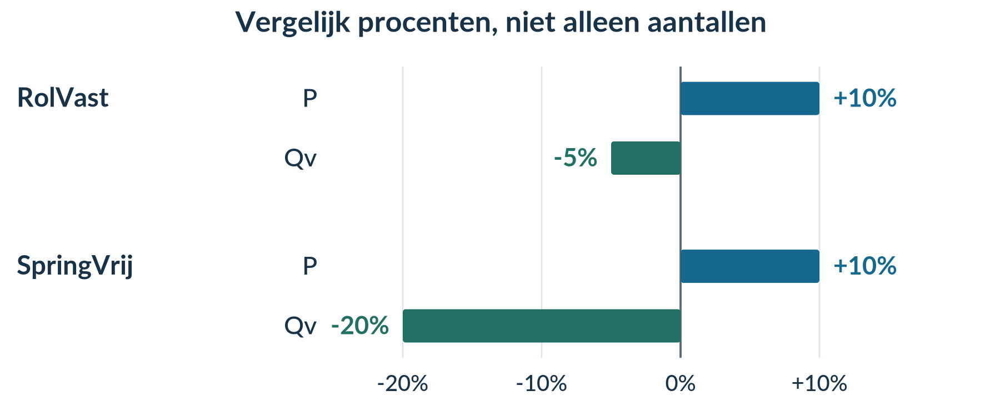<figcaption>Figuur 1. De prijs stijgt even sterk. De hoeveelheid reageert bij SpringVrij procentueel veel sterker.</figcaption></figure>

<b>Prijselasticiteit van de vraag (Ev)</b> meet hoe sterk de gevraagde hoeveelheid procentueel reageert op een procentuele verandering van de eigen prijs.

Met **P** bedoelen we de prijs en met **Qv** de gevraagde hoeveelheid. We bekijken de genoemde periode. Andere vraagfactoren, zoals inkomen en voorkeuren, houden we gelijk: **ceteris paribus**.

### Stap 1 · Bereken de procentuele prijsverandering

<b>procentuele verandering = (nieuw − oud) / oud × 100%</b>

Bij RolVast stijgt P van € 10 naar € 11:

**%ΔP = (11 − 10) / 10 × 100% = +10%.**

Het teken **Δ** lees je als ‘verandering’. **%ΔP** betekent dus: de procentuele verandering van de prijs. Een stijging krijgt een plusteken; een daling een minteken.

### Stap 2 · Bereken de procentuele hoeveelheidsverandering

Qv daalt van 200 naar 190 kaartjes per week:

**%ΔQv = (190 − 200) / 200 × 100% = −5%.**

De uitkomst is negatief, omdat het nieuwe aantal kleiner is dan het oude aantal.

### Stap 3 · Deel de reactie door de prijsverandering

<b>Ev = %ΔQv / %ΔP</b>

Bij RolVast: **Ev = −5% / +10% = −0,5**.

De gevraagde hoeveelheid daalt procentueel half zo sterk als de prijs stijgt. In deze meting hoort bij elke 1% prijsstijging gemiddeld 0,5% hoeveelheidsdaling. Dat is een beschrijving van de meting, geen garantie voor een volgende prijswijziging.

<figure>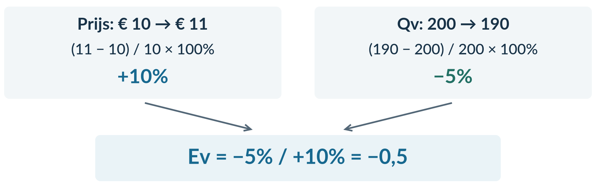<figcaption>Figuur 2. Eerst twee procentuele veranderingen; pas daarna de verhouding.</figcaption></figure>

<b>Ev is geen percentage.</b> De procenttekens in teller en noemer vallen tegen elkaar weg. Schrijf Ev = −0,5, niet −0,5%. Deel ook niet door de nieuwe waarde: die keuze zou een andere uitkomst geven.

Je gebruikt hier positieve oude prijzen en hoeveelheden. Is de prijsverandering 0%, dan kun je deze Ev niet berekenen: delen door nul kan niet.

### Het teken vertelt de richting

Bij de vraag die we hier onderzoeken, bewegen P en Qv in tegengestelde richting. Een hogere prijs gaat samen met een kleinere gevraagde hoeveelheid. Een lagere prijs gaat samen met een grotere gevraagde hoeveelheid. **Ev is daardoor negatief.**

### De grootte vertelt hoe sterk de reactie is

Voor de indeling kijk je naar de **absolute waarde**: de grootte van het getal zonder het minteken. We schrijven bijvoorbeeld **|−0,5| = 0,5**.

| Absolute waarde | Indeling | Betekenis |
|---|---|---|
| &#124;Ev&#124; < 1 | Prijsinelastische vraag | Qv verandert procentueel minder sterk dan P. |
| &#124;Ev&#124; > 1 | Prijselastische vraag | Qv verandert procentueel sterker dan P. |
| &#124;Ev&#124; = 1 | Unitair elastische vraag | Beide procentuele veranderingen zijn even groot. |

<figure>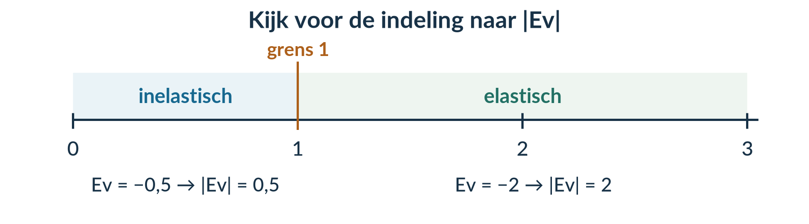<figcaption>Figuur 3. Het minteken blijft in Ev staan. Alleen voor de indeling kijk je naar |Ev|.</figcaption></figure>

Bij SpringVrij is **Ev = −20% / +10% = −2**. De vraag is prijselastisch. Bij RolVast is Ev = −0,5: prijsinelastisch. SpringVrij is in deze meting dus prijsgevoeliger.

### Waarom kan die reactie verschillen?

Klanten reageren vaak sterker als ze makkelijk kunnen **overstappen** of de aankoop kunnen **uitstellen**. Een groot aandeel in hun budget kan de reactie ook versterken. Wie een product moeilijk kan missen en weinig alternatieven heeft, reageert vaak minder sterk.

Een mogelijke verklaring is dat RolVast een vaste groep skaters heeft, terwijl bezoekers van SpringVrij makkelijker een ander uitje kiezen. **De getallen bewijzen die verklaring niet.** Schrijf daarom ‘een mogelijke verklaring is’, tenzij de bron de reden echt geeft.

<b>Negatief betekent niet inelastisch.</b> Ev = −2 heeft een grotere absolute waarde dan Ev = −0,5. Ook betekent prijsinelastisch niet dat er helemaal geen reactie is.

## Uitgewerkt voorbeeld

**KlimStudio** verhoogt de prijs van een bezoek van € 20 naar € 22. Het aantal gevraagde bezoeken daalt van 400 naar 380 per week. Voor **DansDrop** is bij een andere prijsverhoging Ev = −1,5 gemeten. Vergelijk beide reacties.

### Stap 1 · Bereken bij KlimStudio beide procentuele veranderingen

| Grootheid | Berekening | Uitkomst |
|---|---|---:|
| Prijs | (22 − 20) / 20 × 100% | +10% |
| Gevraagde hoeveelheid | (380 − 400) / 400 × 100% | −5% |

In beide berekeningen staat de oude waarde in de noemer. De hoeveelheid daalt, dus de tweede uitkomst heeft een minteken.

### Stap 2 · Bereken Ev en deel de vraag in

**Ev = %ΔQv / %ΔP = −5% / +10% = −0,5.**

**|Ev| = 0,5 < 1**, dus de vraag naar bezoeken aan KlimStudio is **prijsinelastisch**. De procentuele hoeveelheidsdaling is half zo groot als de procentuele prijsstijging.

### Stap 3 · Vergelijk met DansDrop

Bij DansDrop is **|Ev| = 1,5 > 1**. Die vraag is **prijselastisch**. De gevraagde hoeveelheid reageert daar procentueel sterker op de prijsverandering dan bij KlimStudio.

Je vergelijkt dus **0,5 met 1,5**. Je concludeert niet dat DansDrop meer bezoekers verliest: daarvoor ontbreken de beginhoeveelheden.

### Stap 4 · Geef een mogelijke contextverklaring

‘DansDrop biedt losse dansworkshops aan. Klanten kunnen misschien makkelijk een andere workshop kiezen of een week overslaan. KlimStudio heeft mogelijk meer vaste bezoekers. Dat kan het verschil in prijsgevoeligheid verklaren.’

Dit is een **plausibele verklaring**, geen bewezen oorzaak. Ook andere verklaringen zijn mogelijk als ze over prijsgevoeligheid gaan en bij de situatie passen.

<b>Onthoud</b> 
Bereken beide procentuele veranderingen met de oude waarde als basis. 
Ev = %ΔQv / %ΔP. Houd het teken; Ev heeft geen eenheid. 
&#124;Ev&#124; < 1: prijsinelastisch. &#124;Ev&#124; > 1: prijselastisch. 
Verbind de uitkomst aan de relatieve reactie van Qv op P. 
Een mogelijke reden is nog geen bewezen oorzaak. Hierna onderzoek je het gevolg voor de omzet.

## Startopgaven

<b>Opgave 1 · Even ophalen</b>

Een museum verandert de entreeprijs van € 8 naar € 10. Het aantal bezoeken daalt van 120 naar 108 per dag.

a) Bereken de procentuele prijsverandering.

b) Bereken de procentuele verandering van het aantal bezoeken. Laat in beide berekeningen de oude waarde zien.

<b>Opgave 2 · Begripscheck</b>

a) Voor een product is Ev = −0,4. Is de vraag prijsinelastisch of prijselastisch? Gebruik |Ev| in je uitleg.

b) Een leerling zegt: ‘Ev = −2 is kleiner dan −0,4, dus de vraag reageert zwakker.’ Verbeter deze uitspraak.

<b>Normale route:</b> Startopgaven → Begeleide inoefening → Zelfstandige oefening → Doeloefening. <b>Uitdagende route (minder tussenstappen, extra uitdaging):</b> Startopgaven → Zelfstandige oefening → Doeloefening → Denkertje / Bonusopgave. Herhaling is extra bij beide routes.

## Begeleide inoefening

*Begeleide inoefening hoort bij leren: je oefent met denkstappen en doet steeds meer zelf.*

<b>Opgave 3 · EscapeLab — met denkstappen</b>

EscapeLab verhoogt de prijs van € 20 naar € 22 per deelnemer. Qv daalt van 1.000 naar 800 deelnemers per maand.

a) Vul aan: %ΔP = (22 − …) / … × 100% = …%.

b) Vul aan: %ΔQv = (800 − …) / … × 100% = …%.

c) Vul aan: Ev = …% / …% = … . Noteer daarna |Ev| en deel de vraag in.

d) SpeurPark heeft Ev = −0,5. Vul aan: ‘EscapeLab is … prijsgevoelig dan SpeurPark, omdat …’

e) EscapeLab-klanten kunnen volgens de bron kiezen uit veel vergelijkbare aanbieders. Leg uit waarom dat past bij een sterke prijsreactie.

<b>Opgave 4 · Twee prijswijzigingen — minder hulp</b>

In dezelfde week veranderen twee bedrijven hun prijs. Andere vraagfactoren blijven bij elk bedrijf gelijk.

| Bedrijf | Oude P | Nieuwe P | Oude Qv per week | Nieuwe Qv per week |
|---|---:|---:|---:|---:|
| BroodBus | € 2,00 | € 2,20 | 200 broden | 190 broden |
| StripRuil | € 10,00 | € 9,00 | 100 stripboeken | 120 stripboeken |

a) Bereken Ev voor BroodBus en deel de vraag in.

b) Bereken Ev voor StripRuil en deel de vraag in. Let op het teken van de prijsverandering.

c) Welk bedrijf heeft hier de sterkste relatieve prijsreactie? Vergelijk de absolute waarden.

d) Een leerling zegt: ‘Bij StripRuil stijgt Qv, dus Ev is positief.’ Leg uit wat de leerling vergeet.

## Zelfstandige oefening

<b>Opgave 5 · StickerHub</b>

StickerHub verhoogt de prijs van een stickervel van € 5 naar € 6. Qv daalt van 400 naar 280 vellen per maand. Voor WaterTap is bij een prijswijziging Ev = −0,2 gemeten.

a) Bereken bij StickerHub %ΔP, %ΔQv en Ev.

b) Deel beide vragen in en vergelijk hun prijsgevoeligheid.

c) Geef één mogelijke verklaring voor het verschil. Maak duidelijk waarom je verklaring niet uit de cijfers alleen volgt.

<b>Opgave 6 · RetroGames</b>

RetroGames verlaagt de maandprijs van € 12 naar € 10,80. Qv stijgt van 200 naar 240 abonnementen per maand.

a) Bereken Ev, deel de vraag in en geef de betekenis van je uitkomst.

b) Kan Ev negatief zijn terwijl het aantal abonnementen stijgt? Leg uit.

## Doeloefening

<b>Opgave 7 · Bioscoop Nova en StreamNow</b>

Bioscoop Nova verhoogt de ticketprijs van €10 naar €12; de gevraagde hoeveelheid daalt van 500 naar 420 tickets per week. Bij StreamNow is voor een andere prijsverhoging Ev=−2 gemeten. Gebruik voor Nova de oude waarde als noemer en Ev=%ΔQv/%ΔP.

a) Bereken voor Bioscoop Nova de procentuele prijsverandering, de procentuele verandering van de gevraagde hoeveelheid en Ev. (3 punten)

b) Classificeer de vraag naar bioscoopkaartjes met |Ev| en leg in gewone taal uit wat Ev=−0,8 betekent. (2 punten)

c) Classificeer de vraag naar StreamNow met Ev=−2 en vergelijk de prijsgevoeligheid met die van Bioscoop Nova. (2 punten)

d) Geef één plausibele contextverklaring voor het verschil in prijsgevoeligheid. Baseer je verklaring niet op een andere elasticiteitssoort. (2 punten)

<b>Controleer nadat je klaar bent</b> 
Staat bij iedere procentuele verandering de oude waarde in de noemer? Heb je het minteken in Ev behouden? Heb je de sterkte met |Ev| vergeleken? Is je verklaring een mogelijke reden, of presenteer je haar onterecht als bewezen?

### Van getal naar economisch antwoord

Een volledig antwoord bevat niet alleen een uitkomst. Je laat ook zien **wat je hebt vergeleken** en **wat die verhouding betekent**. Gebruik in je schrift de woorden uit de vraag: prijs, gevraagde hoeveelheid en prijsgevoeligheid.

## Denkertje / Bonusopgave

<b>Opgave 8 · Verandert de elasticiteit door andere eenheden?</b>

De prijs van een potlodenpakket stijgt van € 2 naar € 2,20. De gevraagde hoeveelheid daalt van 1.000 naar 900 pakketten per week.

Een onderzoeker noteert de prijs niet in euro, maar in cent: 200 en 220. Zij noteert Qv in honderden pakketten: 10 en 9.

a) Volgens een leerling wordt Ev nu anders, omdat alle getallen veranderen. Beoordeel dit zonder vier lange berekeningen uit te schrijven.

b) Ontwerp zelf een andere manier om prijs of hoeveelheid in eenheden te noteren. Leg uit waarom die keuze de gemeten prijsgevoeligheid niet verandert.

## Herhaling / Herhaling en interleaving

<b>Opgave 9 · Percentages</b>

Een club groeit van 800 naar 880 leden en verliest daarna 80 leden.

a) Bereken de procentuele groei in de eerste stap.

b) Bereken de procentuele daling in de tweede stap. Waarom zijn de percentages niet gelijk?

<b>Opgave 10 · Vraagfactoren uit boek 1</b>

Je onderzoekt de vraag naar treinritten. Andere omstandigheden blijven gelijk.

a) De prijs van een treinrit daalt. Gaat het om een beweging langs de vraaglijn of een verschuiving van de vraaglijn?

b) De prijs van een busrit, een alternatief voor dezelfde reis, stijgt. Welk type verandering verwacht je nu bij de vraag naar treinritten? Benoem de vraagfactor.

Kijk bij een fout terug naar de bijbehorende uitleg. De herhaling gaat over procenten en vraagfactoren die je al eerder hebt gebruikt.

2.2.2 · ELASTICITEIT EN OMZET

# Een hogere prijs, maar ook meer omzet?

**MuseumBos** vraagt eerst € 10 per kaartje en verkoopt 100 kaartjes per dag. Na een prijsverhoging naar € 11 verkoopt het 95 kaartjes. Elk kaartje brengt meer op. Er worden er alleen minder verkocht. Wat gebeurt er met het totale bedrag?

<b>Lesdoelen</b> 
Je kunt de totale opbrengst vóór en na een prijsverandering berekenen. Je kunt de omzetrichting bij een kleine prijsverandering met Ev verklaren. Je kunt een gemeten omzeteffect controleren. Je kunt uitleggen waarom omzetgegevens zonder kostengegevens niet genoeg zijn voor een winstconclusie.

### Twee veranderingen werken tegelijk

Uit hoofdstuk 2.1 ken je **totale opbrengst (TO)**, ook wel **omzet**. De totale opbrengst is de verkoopprijs maal het aantal verkochte producten.

<b>TO = P × Q</b>

Hier is P in euro per kaartje en Q in kaartjes per dag. TO is dus een bedrag in **euro per dag**. We nemen aan dat alle gevraagde kaartjes worden verkocht: Q is dan gelijk aan Qv.

Oud: TO = 10 × 100 = **€ 1.000 per dag**. 
Nieuw: TO = 11 × 95 = **€ 1.045 per dag**.

<figure>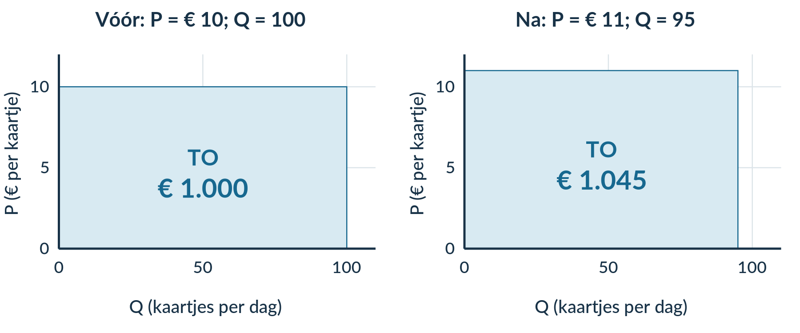<figcaption>Figuur 1. De rechthoek is na de prijsverhoging hoger en smaller. De oppervlakte P × Q is hier de omzet.</figcaption></figure>

<b>Let op de assen.</b> Hier staat P op de verticale as en Q op de horizontale as. Daarom stelt de oppervlakte omzet voor. In de TO/TK-grafiek uit hoofdstuk 2.1 is winst juist een verticale afstand.

### Gebruik Ev voor de richting bij een kleine prijsverandering

Bij een **prijsstijging** werken twee effecten elkaar tegen. De opbrengst per verkocht product stijgt. De gevraagde hoeveelheid daalt. Ev helpt je de relatieve sterkte van de hoeveelheidsreactie te beoordelen.

| Vraag rond de huidige situatie | Kleine prijsstijging | Kleine prijsdaling |
|---|---|---|
| Prijsinelastisch: absolute waarde van Ev < 1 | TO stijgt. | TO daalt. |
| Prijselastisch: absolute waarde van Ev > 1 | TO daalt. | TO stijgt. |

Bij prijsinelastische vraag is de hoeveelheidsreactie relatief zwak. Bij prijselastische vraag is die relatief sterk. Bij unitair elastische vraag houden de effecten elkaar bij een heel kleine verandering ongeveer in evenwicht.

<figure>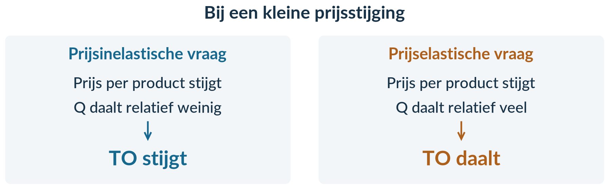<figcaption>Figuur 2. De richting hangt af van de prijswijziging én de relatieve reactie van Q.</figcaption></figure>

### Bij grotere stappen: reken de omzet altijd uit

De vuistregel geldt **rond de huidige situatie bij kleine veranderingen**. Een meting tussen twee verder uit elkaar liggende prijzen kan anders uitpakken. Gebruik bij gegeven oude en nieuwe waarden daarom altijd TO = P × Q.

Een voorbeeld: P stijgt van € 10 naar € 12 en Q daalt van 100 naar 82. Dan is Ev = −18% / +20% = **−0,9**. Toch daalt TO van € 1.000 naar **€ 984**.

Hoe kan dat? De nieuwe prijs is 1,20 maal de oude prijs. De nieuwe hoeveelheid is 0,82 maal de oude hoeveelheid. De nieuwe omzet is dus **1,20 × 0,82 = 0,984** maal de oude omzet: een daling van 1,6%. Je mag +20% en −18% niet simpelweg optellen.

<b>Omzet is geen winst.</b> Winst = TO − TK. Zonder de oude en nieuwe kosten weet je niet of een omzetstijging ook meer winst oplevert.

## Uitgewerkt voorbeeld

**PuzzelClub** verhuurt puzzelpakketten. **FotoWorkshop** verkoopt plaatsen voor workshops. Beide veranderen hun prijs. De gevraagde hoeveelheid wordt volledig verkocht. De gegevens gelden per maand.

| Bedrijf | Oude P | Nieuwe P | Oude Q | Nieuwe Q | Gemeten Ev |
|---|---:|---:|---:|---:|---:|
| PuzzelClub | € 10 | € 11 | 100 pakketten | 95 pakketten | −0,5 |
| FotoWorkshop | € 20 | € 22 | 50 plaatsen | 40 plaatsen | −2 |

Bereken voor beide bedrijven de omzetverandering. Verbind de uitkomsten met Ev. Leg daarna uit wat je wel en niet kunt concluderen.

### Stap 1 · Bereken TO oud en TO nieuw voor PuzzelClub

**TO oud = P oud × Q oud = 10 × 100 = € 1.000 per maand.**

**TO nieuw = P nieuw × Q nieuw = 11 × 95 = € 1.045 per maand.**

De omzet stijgt met € 1.045 − € 1.000 = **€ 45 per maand**.

### Stap 2 · Bereken de procentuele omzetverandering

%ΔTO = (TO nieuw − TO oud) / TO oud × 100% 
%ΔTO = (1.045 − 1.000) / 1.000 × 100% 
%ΔTO = <b>+4,5%</b>

Ook hier gebruik je de **oude waarde** als basis, dus de oude omzet. Je deelt niet door de oude prijs en ook niet door het oude aantal pakketten.

### Stap 3 · Verbind de uitkomst met Ev

Bij PuzzelClub is **|Ev| = 0,5 < 1**: prijsinelastische vraag. De prijs stijgt met 10% en Q daalt met 5%. De relatief zwakke hoeveelheidsdaling past hier bij de gemeten omzetstijging.

<figure>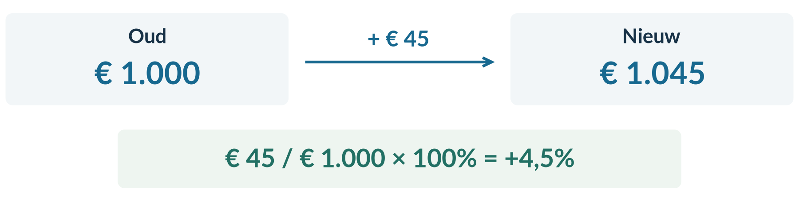<figcaption>Figuur 3. Een volledig antwoord noemt het oude bedrag, het nieuwe bedrag en de verandering ten opzichte van oud.</figcaption></figure>

### Stap 4 · Herhaal de berekening voor FotoWorkshop

**TO oud = 20 × 50 = € 1.000 per maand.**

**TO nieuw = 22 × 40 = € 880 per maand.**

De omzet daalt met € 120 per maand. Procentueel:

**%ΔTO = (880 − 1.000) / 1.000 × 100% = −12%.**

Hier is **|Ev| = 2 > 1**: prijselastische vraag. De prijs stijgt met 10%, maar Q daalt met 20%. De relatief sterke hoeveelheidsreactie past bij de gemeten omzetdaling.

| Bedrijf | Indeling | TO oud | TO nieuw | Omzetverandering |
|---|---|---:|---:|---:|
| PuzzelClub | Prijsinelastisch | € 1.000 | € 1.045 | +4,5% |
| FotoWorkshop | Prijselastisch | € 1.000 | € 880 | −12% |

### Stap 5 · Formuleer de regel en de beperking

‘Bij een **kleine prijsstijging** stijgt TO bij prijsinelastische vraag en daalt TO bij prijselastische vraag. Bij grotere veranderingen reken ik TO oud en TO nieuw uit, omdat beide factoren worden vermenigvuldigd.’

Dat laatste zie je ook bij FotoWorkshop: 1,10 × 0,80 = 0,88. De omzet daalt dus met 12%, niet met 10%.

### Stap 6 · Maak geen winstconclusie zonder kosten

‘PuzzelClub heeft in deze meting meer omzet. Of de winst ook stijgt, kan ik niet bepalen. Daarvoor moet ik de kosten vóór en na kennen.’

Ook een volgende prijsverhoging is niet automatisch verstandig. Klanten kunnen bij een andere prijs anders reageren. **Een waarneming is geen onbeperkte voorspelling.**

<b>Onthoud</b> 
TO = P × Q. Gebruik de juiste prijs en hoeveelheid uit dezelfde situatie. 
Bereken %ΔTO met TO oud in de noemer. 
Bij een kleine prijsstijging: inelastisch → TO stijgt; elastisch → TO daalt. Bij een kleine prijsdaling andersom. 
Bij gegeven oude en nieuwe waarden controleer je TO altijd rechtstreeks. 
Meer omzet bewijst niet meer winst. Hierna onderzoek je andere oorzaken van een vraagverandering.

## Startopgaven

<b>Opgave 1 · Opbrengst en procenten ophalen</b>

Een kraam verkoopt eerst 200 bekers voor € 4 per beker. Daarna verkoopt zij 180 bekers voor € 5 per beker.

a) Bereken de totale opbrengst in beide situaties.

b) Bereken de procentuele omzetverandering. De gegevens gelden voor één marktdag.

<b>Opgave 2 · Begripscheck</b>

a) Wat gebeurt er volgens de vuistregel met TO bij een kleine prijsstijging als Ev = −0,3? En als Ev = −1,8?

b) Welke extra gegevens heb je nodig om vervolgens iets over de winstverandering te zeggen?

<b>Normale route:</b> Startopgaven → Begeleide inoefening → Zelfstandige oefening → Doeloefening. <b>Uitdagende route (minder tussenstappen, extra uitdaging):</b> Startopgaven → Zelfstandige oefening → Doeloefening → Denkertje / Bonusopgave. Herhaling is extra bij beide routes.

## Begeleide inoefening

*Begeleide inoefening hoort bij leren: je oefent met denkstappen en doet steeds meer zelf.*

<b>Opgave 3 · LeesLounge — met denkstappen</b>

LeesLounge verhoogt de prijs van een leesavond van € 10 naar € 12. Q daalt van 100 naar 95 bezoeken per week. De gemeten Ev is −0,25.

a) Neem de tabel over en vul de lege cellen in.

| Situatie | P (€ per bezoek) | Q (bezoeken per week) | TO (€ per week) |
|---|---:|---:|---:|
| Oud | 10 | 100 | 10 × 100 = … |
| Nieuw | 12 | 95 | … × … = … |

b) Vul aan: %ΔTO = (… − …) / … × 100% = …%.

c) Leg uit waarom de relatief zwakke hoeveelheidsreactie past bij de gevonden omzetverandering.

d) Vul aan: ‘Over de winst kan ik nog niets concluderen, omdat …’

<b>Opgave 4 · SneakerSwap — minder hulp</b>

SneakerSwap verhoogt P van € 50 naar € 55 per paar. Q daalt van 100 naar 80 paar per maand. Ev = −2.

a) Bereken TO vóór en na. Bereken ook de procentuele omzetverandering.

b) Verklaar de richting met de prijsverandering en Ev.

c) Een leerling trekt dezelfde conclusie over de winst. Waarom is dat niet onderbouwd?

## Zelfstandige oefening

<b>Opgave 5 · BordspelBar en KaraokeKade</b>

De gegevens gelden voor bezoeken per maand. Alle gevraagde bezoeken worden verkocht.

| Bedrijf | Oude P | Nieuwe P | Oude Q | Nieuwe Q | Ev |
|---|---:|---:|---:|---:|---:|
| BordspelBar | € 8 | € 10 | 500 | 450 | −0,4 |
| KaraokeKade | € 10 | € 11 | 400 | 320 | −2 |

a) Bereken voor beide bedrijven TO vóór en na en de procentuele omzetverandering.

b) Verbind de gevonden richtingen aan Ev.

c) Leg uit waarom je de omzet bij een grote prijsstap rechtstreeks berekent, ook als Ev gegeven is.

<b>Opgave 6 · PlantenPop</b>

PlantenPop verlaagt P van € 20 naar € 19. Q stijgt van 100 naar 110 planten per week. Ev = −2.

a) Bereken TO vóór en na. Past de omzetrichting bij de vuistregel voor een prijsdaling?

b) Mag PlantenPop nu concluderen dat een volgende prijsdaling zeker meer winst oplevert? Geef twee redenen waarom niet.

## Doeloefening

<b>Opgave 7 · Bioscoop Nova en StreamNow</b>

Gebruik TO=P×Q. Bij Bioscoop Nova stijgt P van €10 naar €12 en daalt Q van 500 naar 420 per week; Ev=−0,8. Bij StreamNow stijgt P van €20 naar €22 en daalt Q van 1.000 naar 800 per maand; Ev=−2,0. Alle gegevens die je nodig hebt staan hier.

a) Bereken voor Bioscoop Nova TO vóór en na de prijsverhoging. (2 punten)

b) Bereken de procentuele verandering van TO bij Bioscoop Nova en verbind die uitkomst met Ev=−0,8. (2 punten)

c) Bereken voor StreamNow TO vóór en na de prijsverhoging. (2 punten)

d) Bereken de procentuele verandering van TO bij StreamNow en verbind die uitkomst met Ev=−2. (2 punten)

e) Formuleer de lokale omzetregel voor een kleine prijsstijging bij prijsinelastische en bij prijselastische vraag. Leg uit waarom je bij een grote, eindige verandering altijd TO vóór en na berekent. (2 punten)

f) Leg uit waarom uit deze omzetgegevens niet volgt dat de winst stijgt. (1 punt)

<b>Controleer nadat je klaar bent</b> 
Heb je bij Nova euro per week en bij StreamNow euro per maand gebruikt? Staat in de procentberekening de oude omzet onder de breuk? Gaat je conclusie over omzet, of ben je ongemerkt over winst gaan schrijven?

## Denkertje / Bonusopgave

<b>Opgave 8 · De percentages lijken elkaar op te heffen</b>

Een cursusaanbieder verhoogt P van € 40 naar € 50. Q daalt van 100 naar 80 plaatsen per maand. Een collega rekent Ev = −0,8 uit en zegt: ‘De vraag is inelastisch, dus de omzet móét zijn gestegen.’

a) Gebruik een zo kort mogelijke berekening om te controleren wat er werkelijk met de omzet gebeurt.

b) Leg uit waarom deze uitkomst niet betekent dat de regel over een heel kleine prijsverandering waardeloos is.

c) Formuleer één advieszin die de collega bij toekomstige prijswijzigingen wél veilig kan gebruiken.

## Herhaling / Herhaling en interleaving

<b>Opgave 9 · Prijselasticiteit</b>

De prijs van een tijdschrift stijgt van € 4 naar € 4,40. Qv daalt van 600 naar 570 exemplaren per week. Bereken Ev en deel de vraag in.

<b>Opgave 10 · Omzet tegenover winst</b>

Een onderneming heeft in één maand TO = € 8.000 en TK = € 6.200. De volgende maand zijn TO = € 8.600 en TK = € 7.100.

a) Bereken de winst in beide maanden.

b) Gebruik deze uitkomsten om te laten zien waarom ‘meer omzet’ niet hetzelfde betekent als ‘meer winst’.

2.2.3 · INKOMENSELASTICITEIT EN KRUISLINGSE ELASTICITEIT

# De prijs blijft gelijk. Waarom verandert de vraag toch?

Je krijgt meer inkomen. Misschien bestel je vaker een maaltijd, terwijl je minder vaak de goedkoopste instantnoedels koopt. De prijzen van die producten hoeven daarvoor niet te veranderen.

Ook de prijs van een **ander** product kan meespelen. Wordt een busreis duurder, dan kiezen sommige reizigers voor de trein. Worden printers duurder, dan kan de vraag naar bijbehorende inkt dalen.

<b>Lesdoelen</b> 
Je kunt Ei berekenen en goederen indelen als inferieur, normaal of luxe. Je kunt Ek berekenen, beide goederen noemen en substituten of complementen herkennen. Je kunt een vraagfunctie gebruiken waarin één variabele verandert. Je kunt uitleggen wat er met Q gebeurt en welke andere variabelen gelijk blijven.

### Dezelfde rekengedachte, een andere oorzaak

De teller blijft de **procentuele verandering van de gevraagde hoeveelheid**. In de noemer zet je de factor waarvan je de invloed onderzoekt.

<figure>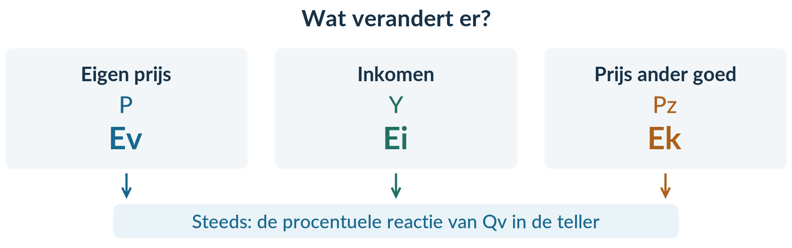<figcaption>Figuur 1. Vraag vóór het rekenen: welke factor verandert?</figcaption></figure>

<b>In drie stappen door deze paragraaf</b> 
Eerst onderzoek je inkomen met Ei. Daarna vergelijk je twee goederen met Ek. Ten slotte gebruik je een vraagfunctie waarin deze factoren samen staan. Je verandert daarin steeds maar één factor tegelijk.

**Ceteris paribus** blijft belangrijk. Om de reactie op inkomen te onderzoeken, houd je bijvoorbeeld de prijzen gelijk. Veranderen meerdere factoren tegelijk, dan kun je een waargenomen vraagverandering niet zomaar aan één factor toeschrijven.

<b>Inkomenselasticiteit van de vraag (Ei)</b> meet de procentuele reactie van Qv op een procentuele verandering van het inkomen Y.

<b>Ei = %ΔQv / %ΔY</b>

Stijgt het inkomen met 10% en de gevraagde hoeveelheid met 5%? Dan is **Ei = +5% / +10% = +0,5**. Qv groeit procentueel half zo sterk als het inkomen.

### Kijk eerst naar het teken, daarna naar de grootte

In dit boek gebruiken we de volgende **drie categorieën**. De indeling geldt voor de genoemde groep consumenten en de onderzochte situatie.

| Uitkomst | Categorie | Bij een hoger inkomen |
|---|---|---|
| Ei < 0 | Inferieur goed | Qv daalt. |
| 0 < Ei < 1 | Normaal goed | Qv stijgt procentueel minder sterk dan Y. |
| Ei > 1 | Luxegoed | Qv stijgt procentueel sterker dan Y. |

**Ei = 0 en Ei = 1 zijn grenswaarden.** Bij Ei = 0 verandert Qv niet in de meting. Bij Ei = 1 verandert Qv procentueel even sterk als Y. We geven deze grenswaarden hier geen van de drie labels.

<figure>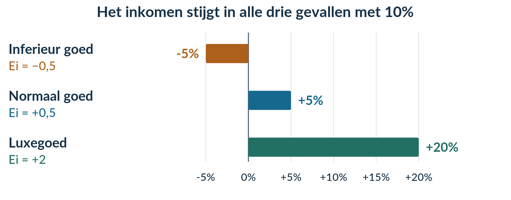<figcaption>Figuur 2. Dezelfde inkomensstijging kan samengaan met een daling, een zwakke stijging of een sterke stijging van Qv.</figcaption></figure>

<b>Inferieur betekent hier niet ‘slechte kwaliteit’.</b> Het betekent dat Qv bij een hoger inkomen daalt. En ‘luxe’ gaat hier over de procentuele inkomensreactie, niet alleen over een hoge prijs.

Een negatief teken in Ei heeft dus een **andere betekenis** dan een negatief teken in Ev. Je moet eerst weten welke verandering in de noemer staat.

<b>Kruislingse elasticiteit van de vraag (Ek)</b> meet de procentuele reactie van de vraag naar goed X op een procentuele prijsverandering van een ander goed Z.

<b>Ek = %ΔQv van goed X / %ΔP van goed Z</b>

Noem altijd **beide goederen**. De teller gaat over de vraag naar X. De noemer gaat over de prijs van Z. Het zijn dus niet twee veranderingen van hetzelfde product.

### Substituten: producten die elkaar kunnen vervangen

De busprijs stijgt met 10%. De vraag naar treinritten stijgt met 6%. De trein is voor deze reizigers een alternatief voor de bus.

**Ek van de treinvraag ten opzichte van de busprijs = +6% / +10% = +0,6.**

Ek is positief: prijs en vraag bewegen in dezelfde richting. Dat past bij **substituten**.

### Complementen: producten die samen worden gebruikt

De printerprijs stijgt met 10%. De vraag naar bijbehorende inkt daalt met 4%.

**Ek van de inktvraag ten opzichte van de printerprijs = −4% / +10% = −0,4.**

Ek is negatief: prijs en vraag bewegen in tegengestelde richting. Dat past bij **complementen**.

<figure>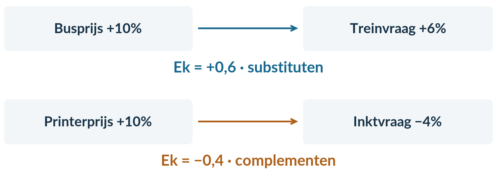<figcaption>Figuur 3. Lees de pijl van de prijs van Z naar de vraag naar X. Het teken van Ek geeft de richting van dat verband.</figcaption></figure>

Bij een prijsdaling werkt dezelfde logica. Als de printerprijs daalt en de inktvraag stijgt, blijft Ek negatief: positief gedeeld door negatief is negatief.

<b>Neem niet automatisch de absolute waarde.</b> Voor substituten of complementen heb je juist het teken van Ek nodig. Ek = 0 betekent alleen dat je in deze meting geen reactie ziet.

### Een vraagfunctie maakt de verbanden rekenbaar

**DeelFiets X** gebruikt dit model:

<b>Qx = 200 − 5Px + 2Pz + 0,01Y</b>

Qx is het aantal gevraagde abonnementen per maand. **Px** is de maandprijs van DeelFiets X. **Pz** is de maandprijs van een andere vervoersdienst Z. Beide prijzen zijn in euro. **Y** is het gemiddelde jaarinkomen van de onderzochte groep, ook in euro.

De beginsituatie is **Px = 10, Pz = 15 en Y = 20.000**.

### Vul eerst de hele beginsituatie in

Je vervangt elk symbool door het getal dat erbij hoort. Reken eerst de vermenigvuldigingen uit en tel de uitkomsten daarna met hun teken bij elkaar op.

Qx = 200 − 5 × 10 + 2 × 15 + 0,01 × 20.000 
Qx = 200 − 50 + 30 + 200 
Qx = <b>380 abonnementen per maand</b>

<figure>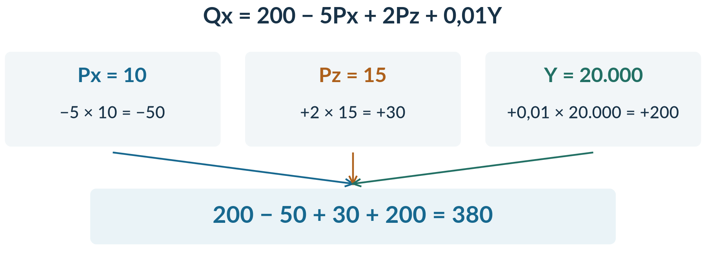<figcaption>Figuur 4. Elk gegeven heeft een eigen plaats in de functie. Een hogere Pz werkt hier anders dan een hogere Px.</figcaption></figure>

De coëfficiënt −5 laat zien dat een hogere eigen prijs in dit model samengaat met een kleinere Qx. De coëfficiënten +2 en +0,01 geven positieve verbanden met Pz en Y.

<b>Een coëfficiënt is niet automatisch een elasticiteit.</b> De −5 is geen Ev van −5. Elasticiteit vergelijkt procentuele veranderingen; een coëfficiënt in deze functie beschrijft een verandering in aantallen bij een verandering van één euro.

Gebruik de eenheden zoals de functie ze geeft. Y is hier jaarinkomen: je deelt 20.000 niet eerst door twaalf. De coëfficiënten horen bij deze afgesproken eenheden.

### Onderzoek 1 · Alleen het inkomen stijgt

Bij DeelFiets X stijgt Y van 20.000 naar 22.000. Px blijft 10 en Pz blijft 15.

**Qx nieuw = 200 − 5 × 10 + 2 × 15 + 0,01 × 22.000 = 400.**

Qx stijgt van 380 naar **400 abonnementen per maand**. Met deze twee uitkomsten kun je Ei berekenen:

**%ΔQx = (400 − 380) / 380 × 100% ≈ +5,26%.** 
**%ΔY = (22.000 − 20.000) / 20.000 × 100% = +10%.** 
**Ei ≈ 5,263157…% / 10% ≈ 0,53.**

Dus 0 < Ei < 1: DeelFiets X is in deze situatie een **normaal goed** volgens onze drie categorieën. Je rekent tussendoor met de ongeronde uitkomst.

### Onderzoek 2 · Terug naar het begin; alleen Pz stijgt

Zet Y terug op **20.000**. Laat nu alleen Pz stijgen van 15 naar 20. Px blijft 10.

**Qx nieuw = 200 − 5 × 10 + 2 × 20 + 0,01 × 20.000 = 390.**

Qx stijgt nu van 380 naar **390 abonnementen per maand**. Een hogere prijs van vervoersdienst Z hangt in dit model samen met meer vraag naar X. Dat positieve verband past bij substituten.

<figure>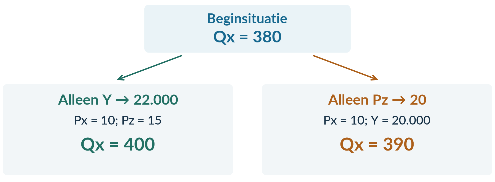<figcaption>Figuur 5. Beide onderzoeken beginnen bij dezelfde basis. De tweede verandering bouwt niet voort op de eerste.</figcaption></figure>

<b>Niet ongemerkt twee veranderingen tegelijk.</b> Als je Y op 22.000 laat staan én Pz op 20 zet, onderzoek je een ander scenario. Je kunt de uitkomst dan niet alleen aan Pz toeschrijven.

## Uitgewerkt voorbeeld

We combineren drie bronnen. In elke vergelijking veranderen alleen de genoemde factoren.

<b>Bron inkomen</b> 
Het inkomen stijgt met 10%. De vraag naar premium huurscooters stijgt met 20%; de vraag naar eenvoudige tweedehands scooters daalt met 5%.

<b>Bron trein</b> 
De treinprijs stijgt met 10%. De vraag naar deelfietsritten stijgt met 5%. De vraag naar aanvullende stoelreserveringen voor die treinritten daalt met 8%.

<b>Bron functie</b> 
Voor StudioPas X geldt Qx = 200 − 2Px + Pz + 0,01Y. Qx is in abonnementen per maand. Px en Pz zijn maandprijzen in euro van X en een concurrerende creatieve dienst Z. Y is gemiddeld jaarinkomen in euro. Begin: Px = 10, Pz = 20 en Y = 20.000.

### Stap 1 · Bereken Ei en deel de goederen in

Premium huurscooters: **Ei = +20% / +10% = +2**. Ei > 1, dus een **luxegoed**.

Tweedehands scooters: **Ei = −5% / +10% = −0,5**. Ei < 0, dus een **inferieur goed**. Dat zegt iets over de inkomensreactie, niet over de technische kwaliteit.

### Stap 2 · Bereken Ek en benoem beide goederen

Deelfietsritten ten opzichte van de treinprijs:

**Ek = +5% / +10% = +0,5.** De teller is de vraag naar deelfietsritten; de noemer is de treinprijs. Ek is positief: deze vervoersmogelijkheden zijn hier **substituten**.

Stoelreserveringen ten opzichte van de treinprijs:

**Ek = −8% / +10% = −0,8.** De teller is de vraag naar stoelreserveringen; de noemer is de treinprijs. Ek is negatief: treinritten en hun aanvullende reserveringen zijn **complementen**.

Je hebt nu de inkomens- en kruislingse elasticiteiten uit de bronpercentages berekend. Op de volgende pagina gebruik je dezelfde rekenregels bij uitkomsten van een vraagfunctie.

### Stap 3 · Bereken de beginhoeveelheid van StudioPas X

**Qx oud = 200 − 2 × 10 + 20 + 0,01 × 20.000 = 400 abonnementen per maand.**

### Stap 4 · Verhoog alleen Y en bereken Ei

Y stijgt van 20.000 naar 22.000. Px = 10 en Pz = 20 blijven gelijk.

**Qx nieuw = 200 − 2 × 10 + 20 + 0,01 × 22.000 = 420 abonnementen per maand.**

**%ΔQx = (420 − 400) / 400 × 100% = +5%.** 
**%ΔY = (22.000 − 20.000) / 20.000 × 100% = +10%.** 
**Ei = +5% / +10% = +0,5.**

Dus 0 < Ei < 1: StudioPas X is hier een **normaal goed**. De vraag stijgt procentueel minder sterk dan het inkomen.

### Stap 5 · Zet Y terug en verander alleen Pz

We beginnen opnieuw met Y = 20.000. Pz stijgt van 20 naar 24; Px blijft 10.

**Qx nieuw = 200 − 2 × 10 + 24 + 0,01 × 20.000 = 404 abonnementen per maand.**

Qx stijgt van 400 naar 404. De duurdere dienst Z hangt samen met meer vraag naar X. **Px en Y blijven gelijk.**

| Scenario | Px | Pz | Y | Qx per maand |
|---|---:|---:|---:|---:|
| Begin | 10 | 20 | 20.000 | 400 |
| Alleen hoger Y | 10 | 20 | 22.000 | 420 |
| Terug naar begin; alleen hoger Pz | 10 | 24 | 20.000 | 404 |

<b>Onthoud</b> 
Ei = %ΔQv / %ΔY. In dit boek: Ei < 0 inferieur; 0 < Ei < 1 normaal; Ei > 1 luxe. 
Ek = %ΔQv van X / %ΔP van Z. Positief: substituten; negatief: complementen. 
Noem bij Ek altijd het vraaggoed én het prijsgoed. 
Vul een vraagfunctie volledig in en verander één factor tegelijk. Zet eerdere wijzigingen terug. 
Bereken percentages uit de oude en nieuwe uitkomsten. Hierna combineer je alle elasticiteiten in gemengde bronnen.

## Startopgaven

<b>Opgave 1 · Percentages en invullen ophalen</b>

a) Een jaarinkomen stijgt van € 20.000 naar € 22.000. Bereken de procentuele verandering.

b) Vul P = 10 in in Qv = 500 − 20P. Qv is het aantal gevraagde kaarten per week. Noteer de uitkomst met eenheid.

<b>Opgave 2 · Begripscheck</b>

a) Wat deel je door wat bij Ei? En bij Ek? Gebruik woorden, geen losse letters.

b) Je verandert Y in een vraagfunctie met Px, Pz en Y. Welke variabelen houd je gelijk?

<b>Normale route:</b> Startopgaven → Begeleide inoefening → Zelfstandige oefening → Doeloefening. <b>Uitdagende route (minder tussenstappen, extra uitdaging):</b> Startopgaven → Zelfstandige oefening → Doeloefening → Denkertje / Bonusopgave. Herhaling is extra bij beide routes.

## Begeleide inoefening

*Begeleide inoefening hoort bij leren: je oefent met denkstappen en doet steeds meer zelf.*

<b>Opgave 3 · BuurtBudget — met denkstappen</b>

Bij gelijkblijvende prijzen stijgt het inkomen van een groep met 4%.

a) Neem de tabel over en vul de lege cellen in. Kijk eerst naar het teken van Ei.

| Product | %ΔQv | Ei = %ΔQv / +4% | Categorie |
|---|---:|---:|---|
| Merksnacks | +2% | +2% / +4% = … | … |
| Budgetsoep | −2% | … | … |
| Hobbysets | +8% | … | … |

b) Leg uit waarom je bij budgetsoep niet eerst het minteken mag weglaten.

c) De prijs van skateboards daalt 10%. De vraag naar bijbehorende wieltjes stijgt 15%. Vul aan: Ek van de vraag naar … ten opzichte van de prijs van … = …% / …% = … . Welke relatie past hierbij?

<b>Opgave 4 · ZwemPas — minder hulp</b>

Qx = 200 − 3Px + Pz + 0,02Y. Qx is in abonnementen per maand; Px en Pz zijn maandprijzen in euro; Y is jaarinkomen in euro. Begin: Px = 10, Pz = 30, Y = 10.000.

a) Bereken Qx in de beginsituatie.

b) Verhoog alleen Y naar 11.000. Bereken Qx, daarna %ΔQx, %ΔY en Ei. Deel ZwemPas X in.

c) Zet Y terug op 10.000 en verhoog alleen Pz naar 36. Bereken Qx. Leg het verband tussen Pz en Qx uit en noem wat gelijk blijft.

<b>Opgave 5 · Fruitbar — twee veranderingen tegelijk</b>

Fruitbar heeft twee **afzonderlijke onderzoeken** naar de vraag naar vruchtensap. In elk onderzoek blijven andere vraagfactoren gelijk.

| Afzonderlijk onderzoek | Prijsverandering van een ander goed | Verandering van Qv vruchtensap |
|---|---:|---:|
| Frisdrank | +10% | +4% |
| Bijbehorende herbruikbare beker | +20% | −6% |

a) Bereken Ek van vruchtensap ten opzichte van de frisdrankprijs. Benoem de relatie.

b) Bereken Ek van vruchtensap ten opzichte van de bekerprijs. Benoem de relatie.

c) In een latere week worden frisdrank én de beker duurder. Werken de verwachte richtingen voor de sapvraag elkaar mee of tegen? Kun je zonder een model voor de gezamenlijke verandering de totale reactie zeker berekenen?

d) Een leerling zegt: ‘Beide prijzen stijgen, dus beide Ek's zijn positief.’ Leg uit waarom dit niet klopt. Noem wat in de teller staat.

## Zelfstandige oefening

<b>Opgave 6 · Vrije tijd en elektronica</b>

Een onderzoek geeft de volgende afzonderlijke veranderingen. Andere vraagfactoren blijven telkens gelijk.

**Inkomen:** Y stijgt 5%. De vraag naar luxe koptelefoons stijgt 10%, naar gewone oortjes 2% en naar eenvoudige tweedehands spelers daalt 5%.

**Prijs van spelconsoles:** deze daalt 10%. De vraag naar draagbare spelcomputers daalt 5%; de vraag naar controllers voor de consoles stijgt 15%.

a) Bereken de drie Ei's. Deel elk goed in volgens de drie categorieën van dit boek.

b) Bereken beide Ek's. Noem bij elke uitkomst het vraaggoed en het prijsgoed en benoem de relatie.

c) Leg uit waarom ‘Ei = −1’ en ‘Ek = −1’ niet hetzelfde betekenen, ook al is het getal gelijk.

<b>Opgave 7 · CreatiefPas</b>

Voor dienst X geldt **Qx = 120 − 2Px + 0,5Pz + 0,01Y**. Qx is het aantal gevraagde abonnementen per maand. Px en Pz zijn maandprijzen in euro van X en een andere creatieve dienst Z. Y is gemiddeld jaarinkomen in euro.

De beginsituatie is Px = 10, Pz = 20 en Y = 19.000.

a) Bereken Qx in de beginsituatie.

b) Alleen Y stijgt naar 20.900. Bereken Qx, de procentuele veranderingen van Qx en Y en vervolgens Ei. Deel X in. Noem welke variabelen gelijk blijven.

c) Ga terug naar de beginsituatie. Alleen Pz stijgt van 20 naar 24. Bereken Qx en beschrijf de richting van het verband. Welke variabelen blijven nu gelijk?

## Doeloefening

<b>Opgave 8 · Inkomen, koffie en fitness</b>

Gebruik steeds de oude waarde als noemer. Voor inkomenselasticiteit geldt Ei=%ΔQv/%ΔY. De drie gebruikte categorieën zijn: Ei<0 inferieur goed, 0<Ei<1 normaal goed en Ei>1 luxegoed; Ei=0 en Ei=1 zijn grenswaarden. Voor kruislingse elasticiteit geldt Ek=%ΔQv van goed X/%ΔP van een ander goed Z. Noem bij Ek altijd beide goederen.

**Bron inkomen.** Het gemiddelde inkomen stijgt 5%. De vraag naar maaltijdpakketten stijgt 8%; de vraag naar budgetnoedels daalt 3%.

**Bron koffie.** De koffieprijs stijgt 10%. De vraag naar thee stijgt 4%; de vraag naar koffiefilters daalt 6%.

**Bron functie.** Voor fitnessdienst X geldt Qx=100−2Px+0,5Pz+0,01Y. Qx is het aantal gevraagde abonnementen per maand, Px en Pz zijn maandprijzen in euro van fitnessdienst X en concurrerende sportdienst Z, en Y is het gemiddelde jaarinkomen in euro. Beginsituatie: Px=10, Pz=20 en Y=30.000.

a) Bereken met bron inkomen Ei voor maaltijdpakketten en budgetnoedels. (3 punten)

b) Classificeer beide goederen met de drie categorieën uit de context. (2 punten)

c) Bereken met bron koffie Ek voor de vraag naar thee ten opzichte van de koffieprijs en voor de vraag naar koffiefilters ten opzichte van de koffieprijs. Noem teller- en noemergoed en classificeer de relaties. (4 punten)

d) Bereken Qx in de beginsituatie en nadat alleen Y stijgt naar 33.000. Bereken daarna %ΔQx, Ei en classificeer fitnessdienst X. Leg uit wat met Qx gebeurt en welke variabelen gelijk blijven. (4 punten)

e) Zet Y terug op 30.000. Bereken Qx nadat alleen Pz stijgt van 20 naar 24. Leg uit welke richting het verband tussen Pz en Qx heeft en welke variabelen gelijk blijven. (3 punten)

## Denkertje / Bonusopgave

<b>Opgave 9 · Hetzelfde product, twee consumentengroepen</b>

Bij groep A stijgt het inkomen 10% en daalt de vraag naar kant-en-klaarmaaltijden 5%. Bij groep B stijgt het inkomen ook 10%, maar stijgt de vraag naar precies hetzelfde product 15%. De prijs blijft voor beide groepen gelijk.

a) Deel het product voor elke groep in.

b) Een reclamebureau wil schrijven: ‘Onderzoek bewijst dat dit een inferieur product van lage kwaliteit is.’ Beoordeel zowel het algemene label als de uitspraak over kwaliteit.

c) Geef één mogelijke verklaring waarom beide groepen anders reageren, zonder een onbewezen verklaring als feit te presenteren.

## Herhaling / Herhaling en interleaving

<b>Opgave 10 · Terug naar Ev en omzet</b>

De prijs van een notitieboek stijgt van € 5 naar € 5,50. Q daalt van 400 naar 360 boeken per week.

a) Bereken Ev en deel de vraag in.

b) Bereken TO vóór en na. Laat zien waarom je ook bij gelijke procentuele veranderingen de omzet rechtstreeks controleert.

<b>Opgave 11 · Kosten uit hoofdstuk 2.1</b>

Een maker heeft TK = 200 + 3Q en verkoopt elk product voor € 8. Q is het aantal producten per maand; de capaciteit is 500 producten per maand.

a) Bereken TK en GTK bij Q = 100.

b) Bereken TO en winst bij Q = 100. Noteer de juiste eenheden.

2.2.4 · GEMENGDE OPGAVEN

# Kies de gegevens. Onderbouw je conclusie.

Er komt geen nieuwe theorie bij. Je combineert prijselasticiteit, omzet, Ei, Ek en vraagfuncties. Niet ieder getal in een bron is nodig.

<b>Lesdoelen</b> 
Je kunt relevante gegevens kiezen, elasticiteiten berekenen en indelen, omzet vergelijken en één variabele in een vraagfunctie veranderen. Je kunt met meerdere bronnen een omzetadvies geven en aangeven wat de bronnen niet bewijzen.

<b>Zo oefen je</b> Gebruik bij de voorbereiding de uitleg en denkstappen uit dit hoofdstuk. Minder tussenstappen nodig en extra uitdaging gewenst? Kies ook de bonus. Hoofdstukcheck 7 is aanvullend.

<b>Opgave 1 · Welke verhouding heb je nodig?</b>

Noem telkens welke elasticiteit past. Schrijf in woorden wat in de teller en de noemer komt.

a) De prijs van een broodje verandert; je onderzoekt de vraag naar dat broodje.

b) Het inkomen verandert; je onderzoekt de vraag naar sportlessen.

c) De prijs van een camera verandert; je onderzoekt de vraag naar bijbehorende lenzen.

<b>Opgave 2 · LunchCampus en WorkshopApp</b>

Alle gegevens gelden per week. Andere vraagfactoren blijven gelijk. De gevraagde hoeveelheid wordt volledig verkocht.

| Aanbieder | Oude P | Nieuwe P | Oude Q | Nieuwe Q |
|---|---:|---:|---:|---:|
| LunchCampus | € 4 | € 4,40 | 1.000 lunches | 950 lunches |
| WorkshopApp | € 20 | € 22 | 200 plaatsen | 170 plaatsen |

a) Bereken voor beide aanbieders Ev en deel de vraag in.

b) Bereken voor beide aanbieders TO vóór en na. Verbind de verschillende omzetontwikkelingen met de prijsgevoeligheid.

c) LunchCampus krijgt in de app 4,8 van de 5 sterren. Is dit getal nodig voor de berekeningen? Leg uit waarom een hoge appscore ook geen bewijs is dat een volgende prijsverhoging dezelfde reactie oproept.

<b>Opgave 3 · Een onderzoek naar hobbyproducten</b>

**Bron A.** Bij 8% meer inkomen stijgt de vraag naar premium tekenpakketten 12%, naar gewone schetsboeken 4%, en daalt de vraag naar goedkope restpartijen papier 2%.

**Bron B.** De prijs van een fotocamera stijgt 10%. De vraag naar bijbehorende geheugenkaarten daalt 6%. Andere omstandigheden blijven gelijk.

**Bron C.** Voor abonnement X geldt Qx = 1.000 − 20Px + 0,02Y + 10Pz. Qx is per maand; Px en Pz zijn maandprijzen in euro; Y is jaarinkomen in euro. Begin: Px = 20, Pz = 10, Y = 20.000.

a) Bereken en classificeer de drie Ei's uit bron A.

b) Bereken Ek uit bron B. Noem beide goederen en de relatie.

c) Bereken Qx in bron C en bij alleen Y = 22.000. Noem wat gelijk blijft. Beschrijf wat je uit de verandering van Qx afleidt.

<b>Opgave 4 · SkillBox wil opnieuw de prijs verhogen</b>

**Bron A.** De maandprijs van SkillBox stijgt van € 16 naar € 18. Het aantal abonnees daalt van 250 naar 230. De gemeten Ev is −0,64.

**Bron B.** In een afzonderlijke meting stijgt de prijs van een concurrerende dienst van € 20 naar € 22. De vraag naar SkillBox stijgt dan 3%, terwijl de eigen prijs en andere vraagfactoren gelijk blijven.

a) Bereken met bron A de oude en nieuwe maandomzet. Noem de richting van de verandering.

b) Bereken met bron B Ek van de vraag naar SkillBox ten opzichte van de concurrentprijs. Wat zegt de uitkomst over de relatie?

c) Schrijf een voorzichtig omzetadvies van drie of vier zinnen. Gebruik beide bronnen. Noem één conclusie die wordt ondersteund en precies twee conclusies die de bronnen niet bewijzen.

## Doeloefening

<b>Opgave 5 · StreamPlus — bronnen</b>

StreamPlus onderzoekt één recente prijsverhoging en mogelijke vervolgstappen. Gebruik bij vragen 1 tot en met 5 telkens alleen de aangegeven bron. Combineer bij vraag 6 minstens twee bronnen. De gemeten Ev in bron A is gegeven; de opgave combineert eerder onderwezen handelingen en introduceert geen nieuwe formule.

### Bron A · Standaardabonnement

| Gegeven | Oud | Nieuw |
|---|---:|---:|
| Prijs Standaard | € 10 | € 12 |
| Abonnees | 50.000 | 43.000 |
| Appscore | 4,6/5 | 4,6/5 |

De gemeten **Ev is −0,7**. De prijzen zijn maandprijzen per abonnement; TO is hier de maandomzet.

### Bron B · Inkomen en gevraagde hoeveelheid

| Verandering | Premium | Budget |
|---|---:|---:|
| Inkomen | +8% | +8% |
| Gevraagde hoeveelheid | +15% | −4% |

### Bron C · Prijs van een concurrerend abonnement

| Gegeven | Oud | Nieuw |
|---|---:|---:|
| Prijs concurrerend abonnement | € 8 | € 9 |
| Vraag StreamPlus | Basis | +5% |

### Bron D · Regionale vraagfunctie

Regionale vraagfunctie <b>Q = 12.000 − 400P + 0,1Y + 300Pc</b>. Q is het aantal gevraagde abonnementen per maand, P en Pc zijn maandprijzen in euro en Y is het gemiddelde jaarinkomen in euro. Beginsituatie: P = 12, Pc = 10 en Y = 40.000.

Bron D is een regionaal model. Gebruik voor die berekening de gegevens uit D, niet het aantal uit A. De vragen staan op de tegenoverliggende pagina.

<b>Opgave 5 · StreamPlus — vragen</b>

Gebruik de bronnen op de tegenoverliggende pagina.

1) Selecteer uit bron A de gegevens voor een controleberekening van Ev en noem het gegeven dat daarvoor niet nodig is. (2 punten)

2) Classificeer met de gegeven Ev=−0,7 de vraag en leg in gewone taal uit hoe sterk Q procentueel reageert op een prijsverandering. (2 punten)

3) Bereken met bron A TO vóór en na de prijsverhoging. (2 punten)

4) Bereken en classificeer met bron B Ei voor Premium en Budget en met bron C Ek van de vraag naar StreamPlus ten opzichte van de prijs van het concurrerende abonnement. Noem bij Ek beide diensten. (4 punten)

5) Bereken met bron D Q in de beginsituatie en nadat alleen Y stijgt naar €42.000 per jaar. Noem welke variabelen gelijk blijven. (2 punten)

6) Geef op basis van minstens twee bronnen een voorzichtig omzetadvies. Noem één conclusie die de bronnen ondersteunen en precies twee conclusies die zij niet bewijzen. (2 punten)

<b>Controleer nadat je klaar bent</b> 
Noem je bij Ek twee diensten? Gaat je omzet over één maand? Gebruik je voor bron D uitsluitend de variabelen van dat model? Heb je bij het advies twee bronnen gebruikt en precies twee niet-bewezen conclusies genoemd?

De punten zijn bedoeld om de omvang van de antwoorden zichtbaar te maken. Vergelijk na afloop ook je berekeningen, eenheden en redenering met het antwoordenboek.

## Denkertje / Bonusopgave

<b>Opgave 6 · DataLab trekt een snelle conclusie</b>

Een aanbieder van online tekenlessen verhoogt de prijs met 10%. In dezelfde maand stijgt de gevraagde hoeveelheid met 20%. Maar er veranderen ook twee andere dingen: de aanbieder voert een grote reclamecampagne en de inkomens van de onderzochte klanten stijgen.

DataLab schrijft: ‘Ev = +20% / +10% = +2. Onze klanten kopen dus meer lessen dóór een hogere prijs.’

a) Klopt de deling? Is daarmee ook de economische conclusie bewezen?

b) Leg uit welke voorwaarde voor een zuivere prijselasticiteitsmeting hier ontbreekt.

c) Noem welke extra vergelijking je nodig zou hebben om de reactie op alleen de prijs beter te onderzoeken. Leg uit wat je dan gelijk wilt houden.

d) Schrijf een kop boven dit nieuwsbericht die de waarneming wel juist weergeeft, zonder een onbewezen oorzaak te noemen.

<figure>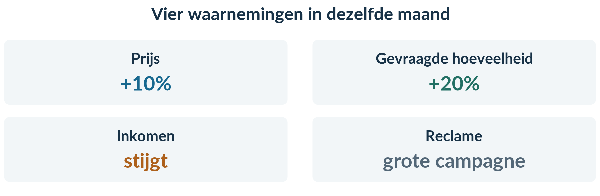<figcaption>Figuur 1. Prijs, hoeveelheid, inkomen en reclame veranderen in dezelfde maand.</figcaption></figure>

<b>Een goede conclusie heeft grenzen</b> 
Je kunt precies uitrekenen wat er tussen twee waarnemingen is veranderd. Dat bewijst nog niet waardoor het veranderde. Geef bij een economisch antwoord aan welke voorwaarden je gebruikt.

<b>Opgave 7 · StudioScene — alles bij elkaar</b>

Gebruik per onderdeel alleen de genoemde gegevens. Het gaat om afzonderlijke onderzoeken, steeds bij gelijkblijvende andere vraagfactoren.

**A · Prijswijziging.** StudioScene verhoogt P van € 20 naar € 22 per les. Q daalt van 300 naar 270 lessen per maand. De gevraagde lessen worden volledig verkocht.

**B · Inkomen.** Bij 10% meer inkomen stijgt de vraag naar lessen met 5%.

**C · Benodigd materiaal.** De prijs van een speciaal materiaalpakket dat bij de lessen wordt gebruikt stijgt met 5%. De vraag naar lessen daalt met 2%.

**D · Vraagfunctie.** Voor een andere regio geldt Qx = 500 − 10Px + 0,02Y + 2Pz. Qx is in lessen per maand. Px en Pz zijn prijzen in euro van een les bij X en een alternatief bij Z; Y is jaarinkomen in euro. Begin: Px = 20, Pz = 50, Y = 20.000.

a) Bereken met A Ev en classificeer. Bereken ook de omzet vóór en na. Wat valt op bij een elasticiteit van −1 en deze eindige verandering?

b) Bereken met B Ei en deel de lessen in volgens de categorieën van dit boek.

c) Bereken met C Ek van de vraag naar lessen ten opzichte van de materiaalprijs. Benoem beide producten en de relatie.

d) Bereken met D Qx in de beginsituatie en bij alleen Y = 22.000. Noem wat gelijk blijft.

e) Een adviseur wil op basis van A nogmaals de prijs verhogen ‘om de winst te vergroten’. Welke twee zaken zijn niet door A bewezen?

<b>Kijk na en kies één verbetering</b> 
Vergelijk je werk met het antwoordenboek. Noteer bij een fout wat je wilt verbeteren: de gekozen verhouding, de oude waarde, het teken, de functie-invulling, de eenheid of de uitleg. Verbeter daarna één volledige berekening of redenering.

Dit is een oefencheck, geen uitspraak dat je de stof voor altijd beheerst. Het overzicht op de volgende pagina helpt bij gericht terugkijken.

# Dezelfde rekenvorm, drie verschillende vragen

<figure>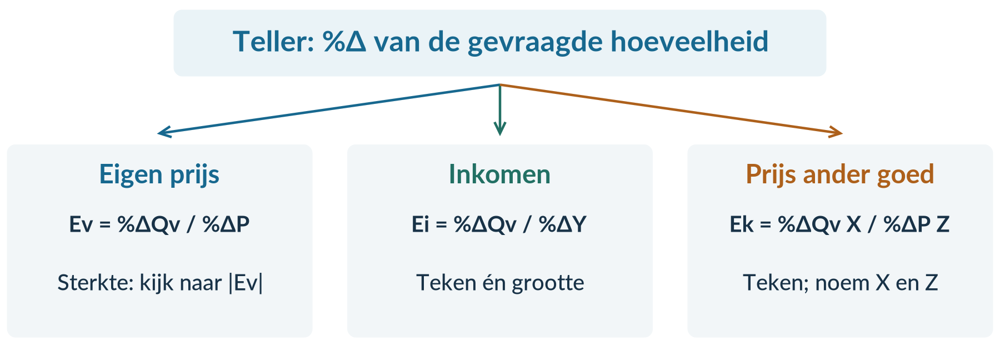<figcaption>Overzicht. De oorzaak in de noemer bepaalt welke elasticiteit je berekent.</figcaption></figure>

| Je onderzoekt… | Je berekent… | Je gebruikt de uitkomst voor… |
|---|---|---|
| Eigen prijs en Qv | Ev = %ΔQv / %ΔP | Sterkte met de absolute waarde: onder 1 inelastisch, boven 1 elastisch; bij 1 unitair. |
| Inkomen en Qv | Ei = %ΔQv / %ΔY | In dit boek: onder 0 inferieur; tussen 0 en 1 normaal; boven 1 luxe. |
| Prijs van Z en vraag naar X | Ek = %ΔQv X / %ΔP Z | Positief: substituten. Negatief: complementen. Noem X én Z. |

<b>%Δ = (nieuw − oud) / oud × 100%</b> 
<b>TO = P × Q</b> 
<b>%ΔTO = (TO nieuw − TO oud) / TO oud × 100%</b>

### Vier controles die veel fouten voorkomen

**1 · Lees de grootheden en eenheden.** Een prijs per maand hoort bij een maandomzet. Een jaarinkomen blijft een jaarinkomen als de functie dat voorschrijft. Elasticiteiten hebben zelf geen eenheid.

**2 · Houd het teken.** Gebruik alleen bij de indeling van Ev de absolute waarde. Bij Ei en Ek bepaalt het teken mede de betekenis. Ei = 0 en Ei = 1 blijven grenswaarden.

**3 · Verander één factor tegelijk.** Bereken eerst de beginsituatie van een vraagfunctie. Verander daarna alleen de gevraagde variabele. Zet eerdere veranderingen terug.

**4 · Begrens je conclusie.** Gebruik bij kleine prijsveranderingen de omzetregel. Reken bij gegeven oude en nieuwe waarden de omzet rechtstreeks uit. Meer omzet bewijst niet meer winst, en een gemeten reactie is geen garantie voor een volgende wijziging.