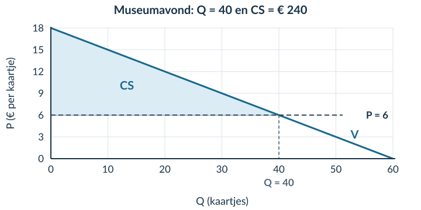
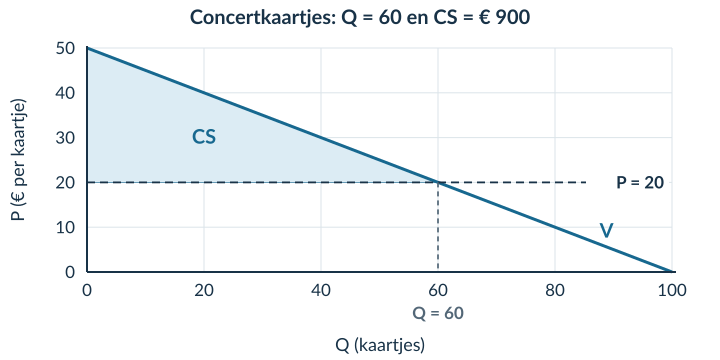
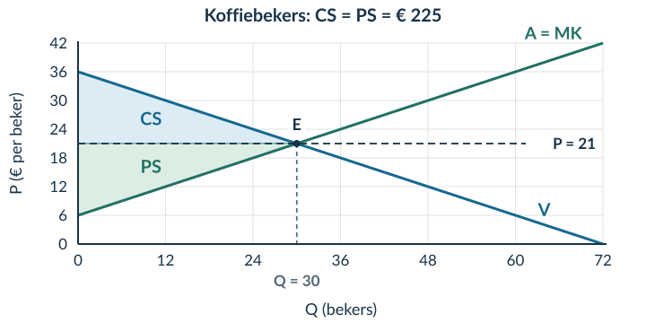
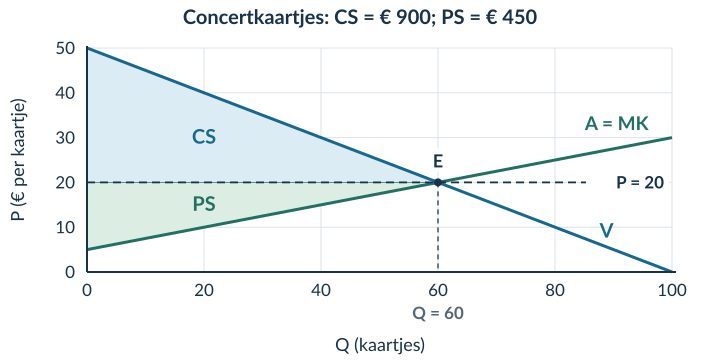
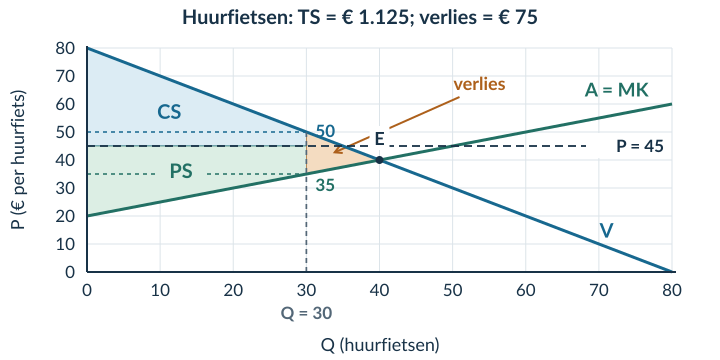

# 2.3.1 Consumentensurplus

## Opgave 1

a) Vul de prijs in: 6 = 16 − 0,2Q → 0,2Q = 10 → **Q = 50**. Bij Q = 0 is P = 16. Bij P = 0 geldt Q = 16 / 0,2 = 80. De assensnijpunten zijn **(0; 16)** en **(80; 0)**.

*Waarom:* je gebruikt de horizontale as voor Q en de verticale as voor P. Een punt noteer je dus als (Q; P).

b) Oppervlakte = ½ × basis × hoogte = **½ × 50 × 10 = 250 oppervlakte-eenheden**.

*Waarom:* een driehoek beslaat de helft van een rechthoek met dezelfde basis en hoogte. Hier is nog geen economische eenheid gegeven.

## Opgave 2

a) CS = betalingsbereidheid − prijs = **18 − 12 = € 6**.

*Waarom:* Iris heeft € 6 meer over voor het toegangsbewijs dan zij betaalt.

b) De € 12 is de betaalde prijs. Het consumentensurplus is het verschil met de betalingsbereidheid: **€ 6**. Het is geen terugbetaald geldbedrag.

## Opgave 3

a) De verticale hulplijn geeft **Q = 40 kaartjes**. Controle: 8 = 24 − 0,4Q → 0,4Q = 16 → Q = 40.

*Waarom:* het snijpunt van de prijs en de vraaglijn geeft de gevraagde hoeveelheid bij € 8.

b) Basis = 40 kaartjes; hoogte = 24 − 8 = € 16 per kaartje. **CS = ½ × 40 × 16 = € 320**.

*Waarom:* het gebied telt het voordeel van alle kopers van de 40 kaartjes op.

c) De rechthoek onder P = 8 is **P × Q**, het betaalde bedrag of de omzet: 8 × 40 = € 320. Het CS ligt erboven. Dat beide hier toevallig € 320 zijn, maakt ze niet hetzelfde begrip.

## Opgave 4

a) 6 = 18 − 0,3Q → 0,3Q = 12 → **Q = 40 kaartjes**.

b) De vraaglijn gaat door **(0; 18)** en **(60; 0)**. De prijslijn is horizontaal op P = 6. Het snijpunt is **(40; 6)**.

c) Arceer boven P = 6, onder V, tot Q = 40. Basis = 40 kaartjes; hoogte = 18 − 6 = € 12 per kaartje. **CS = ½ × 40 × 12 = € 240**.

<figure><figcaption>Opgave 4b–c · De volledige tekening. Een andere passende schaal is ook goed.</figcaption></figure>

d) De kopers hebben samen **€ 240 meer voor de 40 kaartjes over dan zij betalen**. Je beschrijft het gezamenlijke voordeel, niet een gemiddelde per koper.

## Opgave 5

a) Basis = 30 prints; hoogte = 17 − 5 = € 12 per print. **CS = ½ × 30 × 12 = € 180**.

*Waarom:* de rechte vraaglijn en de prijs begrenzen een driehoek.

b) De hoogte loopt van de prijslijn P = 5 tot de vraaglijn bij Q = 0, dus van € 5 tot € 17. Dat verschil is **€ 12 per print**. Alleen de prijs van € 5 gebruiken zou het verkeerde gebied meten.

## Opgave 6

a) 8 = 18 − 0,2Q → 0,2Q = 10 → **Q = 50 kaartjes**.

b) Horizontaal: Q (kaartjes). Verticaal: P (€ per kaartje). De vraaglijn loopt door **(0; 18)** en **(90; 0)**. De prijslijn is P = 8. Het snijpunt is **(50; 8)**.

c) Het CS is de driehoek boven P = 8 en onder de vraaglijn tot Q = 50. Benoem het gebied als CS.

<figure><figcaption>Opgave 6b–c · De vraaglijn raakt beide assen op de uitgerekende punten.</figcaption></figure>

d) Basis = 50 kaartjes; hoogte = 18 − 8 = € 10 per kaartje. **CS = ½ × 50 × 10 = € 250**.

*Waarom:* kaartjes × euro per kaartje geeft euro.

e) De kopers hebben samen **€ 250 voordeel**: hun gezamenlijke betalingsbereidheid voor de verkochte kaartjes is € 250 hoger dan het bedrag dat zij betalen.

## Opgave 7

a) 6 = 16 − 0,1Q → 0,1Q = 10 → **Q = 100 toegangsbewijzen**. Basis = 100; hoogte = 16 − 6 = 10. **CS = ½ × 100 × 10 = € 500**.

b) De uitspraak is onjuist. De omzet is 6 × 100 = **€ 600**; het CS is **€ 500**. De omzet is het werkelijk betaalde bedrag. CS is het extra bedrag dat kopers daar samen nog bovenop over hadden voor hun aankoop.

c) Nee. Je gebruikt alleen de vraagfunctie en een gegeven prijs. Zonder aanbodfunctie heb je geen marktevenwicht berekend, maar een hoeveelheid bij een gegeven prijs.

## Opgave 8 · Doeloefening

a) 20 = 50 − 0,5Q → 0,5Q = 30 → **Q = 60 kaartjes**. Dit is de gevraagde en in deze opgave ook verkochte hoeveelheid, niet een berekend marktevenwicht.

b) Benoem de assen als **Q (kaartjes)** en **P (€ per kaartje)**. Bij Q = 0 is P = 50. Bij P = 0: 0 = 50 − 0,5Q → Q = 100. De vraaglijn loopt door **(0; 50)** en **(100; 0)**. De prijslijn P = 20 snijdt de vraaglijn bij **(60; 20)**.

c) Arceer de driehoek met hoekpunten **(0; 20), (0; 50) en (60; 20)**. Schrijf CS in het gebied.

<figure><figcaption>Opgave 8b–c · Er staat bewust geen aanbodlijn in deze grafiek.</figcaption></figure>

d) Basis = 60 kaartjes; hoogte = 50 − 20 = € 30 per kaartje. **CS = ½ × 60 × 30 = € 900**.

e) Het bedrag van € 900 is het gezamenlijke verschil tussen betalingsbereidheid en werkelijk betaalde prijs voor de **60 verkochte kaartjes**. Het is geen omzet en geen terugbetaald bedrag.

## Opgave 9 · Denkertje

**Modelantwoord.** Neem P = 20 − 0,25Q, maar nu een prijs van € 5. Alle gevraagde tickets worden verkocht. Dan geldt 5 = 20 − 0,25Q → Q = 60. Het juiste CS is **½ × 60 × (20 − 5) = € 450**. De verkeerde formule geeft ½ × 60 × 5 = € 150.

In het uitgewerkte voorbeeld was de prijs € 10 en de hoogte van het CS-gebied ook € 10. Daarom kwam de verkeerde formule toevallig goed uit.

**Beoordelingscriteria:** een geldige rechte vraaglijn met een passende prijs; een juiste Q en CS; een andere uitkomst met de onjuiste formule; uitleg dat de hoogte het verschil met de maximale betalingsbereidheid is.

## Opgave 10

Procentuele stijging = (nieuw − oud) / oud × 100% = **(460 − 400) / 400 × 100% = 15%**.

*Waarom:* je vergelijkt de 60 extra bezoekers met de oude 400. Gaat dit mis? Herhaal §1.1.2.

## Opgave 11

TK = 200 + 3 × 100 = **€ 500**. GTK = TK / Q = 500 / 100 = **€ 5 per product**.

*Waarom:* TK hoort bij de hele productie; GTK is hetzelfde bedrag verdeeld over 100 producten. Herhaal zo nodig §2.1.1.

# 2.3.2 Producentensurplus en totaal surplus

## Opgave 1

Stel vraag en aanbod gelijk: 18 − Q = 6 + 0,5Q → 12 = 1,5Q → **Qe = 8 producten**. Vul in: Pe = 18 − 8 = **€ 10 per product**.

*Waarom:* bij deze combinatie geven beide functies dezelfde prijs en hoeveelheid. Een fout bij het oplossen is reden om §1.3.2 te herhalen.

## Opgave 2

a) Koper: CS = 12 − 9 = **€ 3**. Verkoper: PS = 9 − 5 = **€ 4** bij deze transactie.

*Waarom:* je vergelijkt de prijs aan de ene kant met de betalingsbereidheid en aan de andere kant met MK.

b) Gezamenlijk voordeel = 3 + 4 = **€ 7**. Dat is ook 12 − 5 = € 7.

*Waarom:* de prijs is een betaling van de koper aan de verkoper. Bij het optellen van hun voordelen valt deze betaling weg: (12 − 9) + (9 − 5) = 12 − 5.

## Opgave 3

a) 30 − Q = 6 + 0,5Q → 24 = **1,5Q** → **Qe = 16 bossen**. Pe = 30 − 16 = **€ 14 per bos**.

b) Basis = 16 bossen. Hoogte CS = 30 − 14 = € 16 per bos; hoogte PS = 14 − 6 = € 8 per bos.

**CS = ½ × 16 × 16 = € 128. PS = ½ × 16 × 8 = € 64. TS = 128 + 64 = € 192.**

*Waarom:* beide gebieden stoppen bij Q = 16. Het grotere CS volgt hier uit de grotere hoogte.

c) Bij Q = 10: 20 − 11 = **€ 9 positief voordeel**; extra handel verhoogt TS. Bij Q = 20: 10 − 16 = **−€ 6**; extra handel verlaagt TS.

*Waarom:* je vergelijkt betalingsbereidheid met MK, niet de marktprijs met de oude prijs.

d) Vóór Q = 16 ligt V boven A = MK. Daar is handel gezamenlijk voordelig. Na Q = 16 ligt V onder MK. De volgende eenheden kosten dan meer dan zij de koper waard zijn. TS is daarom bij Q = 16 maximaal binnen dit model.

## Opgave 4

a) 32 − 0,5Q = 8 + 0,5Q → **Qe = 24 handdoeken**. Pe = 32 − 0,5 × 24 = **€ 20 per handdoek**. Markeer E bij (24; 20); CS ligt erboven onder V en PS eronder boven A, steeds tot Q = 24.

b) Basis = 24 handdoeken. Beide hoogten zijn € 12 per handdoek: 32 − 20 en 20 − 8.

**CS = ½ × 24 × 12 = € 144. PS = € 144. TS = € 288.**

<figure><figcaption>Opgave 4a–b · Markeringen en berekeningen horen bij dezelfde hoeveelheid en prijs.</figcaption></figure>

c) Bij Q = 16: betalingsbereidheid = 32 − 0,5 × 16 = **€ 24**; MK = 8 + 0,5 × 16 = **€ 16**. Extra handel geeft € 8 gezamenlijk voordeel. Bij Q = 32 zijn de bedragen € 16 en € 24: extra handel geeft € 8 gezamenlijk nadeel. De grens ligt bij het evenwicht Q = 24.

## Opgave 5

a) Oud kopersvoordeel: 14 − 10 = € 4. Bij alleen de hogere betalingsbereidheid: 16 − 10 = € 6. Het neemt **€ 2 toe**.

b) Oud verkopersvoordeel: 10 − 6 = € 4. Bij alleen lagere MK: 10 − 5 = € 5. Het neemt **€ 1 toe**.

c) Gezamenlijk voordeel oud = 14 − 6 = € 8. Nieuw = 16 − 5 = € 11. De stijging is **€ 3**.

*Waarom:* de koper waardeert hetzelfde product meer én het kost minder om te leveren.

d) Onjuist. Een hogere betalingsbereidheid vergroot het voordeel; lagere MK doen dat ook. De effecten versterken elkaar. Dat één ingevoerd bedrag stijgt en het andere daalt, zegt niet dat het voordeel in tegengestelde richtingen verandert.

## Opgave 6

a) 36 − 0,5Q = 6 + 0,5Q → **Qe = 30 bekers**. Pe = 36 − 0,5 × 30 = **€ 21 per beker**. Markeer E bij (30; 21), CS boven de prijs en PS eronder.

b) Basis = 30 bekers. Hoogte CS = 36 − 21 = € 15 per beker; hoogte PS = 21 − 6 = € 15 per beker.

**CS = ½ × 30 × 15 = € 225. PS = € 225. TS = € 450.**

<figure><figcaption>Opgave 6a–b · De twee even grote driehoeken liggen aan verschillende kanten van de prijs.</figcaption></figure>

c) Bij Q = 20: betalingsbereidheid = **€ 26**; MK = **€ 16**. Een extra transactie verhoogt TS met het positieve verschil van € 10 bij deze marginale vergelijking. Bij Q = 40 zijn de bedragen **€ 16** en **€ 26**: extra handel verlaagt TS.

d) Tot Q = 30 is de betalingsbereidheid minstens MK; daarna niet meer. TS is daarom bij het evenwicht maximaal. Dat zegt niet hoe de voordelen binnen groepen of tussen personen zijn verdeeld. Er staat ook geen norm voor eerlijkheid in deze functies.

## Opgave 7

a) Nee. Vaste kosten moeten ook worden betaald. Zonder die kostengegevens mag je het **PS van € 80 niet gelijkstellen aan de winst**.

b) **TS = 300 + 100 = € 400**. Een ongelijk CS en PS bewijst geen inefficiëntie. Voor efficiëntie moet je weten of er nog haalbare, voordelige transacties ontbreken; niet of CS en PS even groot zijn.

## Opgave 8 · Doeloefening

a) 50 − 0,5Q = 5 + 0,25Q → 45 = 0,75Q → **Qe = 60 kaartjes**. Pe = 50 − 0,5 × 60 = **€ 20 per kaartje**.

b) Markeer E bij **(60; 20)**. CS is de driehoek boven P = 20 en onder V. PS ligt onder P = 20 en boven A = MK. Beide gebieden eindigen bij Q = 60.

<figure><figcaption>Opgave 8b · De vraag- en aanbodlijn hoefden niet opnieuw te worden getekend.</figcaption></figure>

c) Basis = 60 kaartjes. Hoogte CS = 50 − 20 = € 30 per kaartje. Hoogte PS = 20 − 5 = € 15 per kaartje.

**CS = ½ × 60 × 30 = € 900. PS = ½ × 60 × 15 = € 450. TS = 900 + 450 = € 1.350.**

d) Bij Q = 50: 25 − 17,50 = **€ 7,50** positief voordeel van een extra transactie. Bij Q = 70: 15 − 22,50 = **−€ 7,50**; extra handel verlaagt TS.

*Waarom:* de aanbodlijn geeft in deze opgave ook de MK aan van eenheden die in het vrije evenwicht niet worden verkocht.

e) Tot Q = 60 is de betalingsbereidheid minstens zo hoog als MK. Daarna zijn de MK hoger. Daardoor is TS binnen het model maximaal bij Q = 60. Het berekende TS bevat geen norm voor een eerlijke verdeling en geen volledig oordeel over alle maatschappelijke gevolgen.

## Opgave 9 · Denkertje

**Modelantwoord.** Bij P = 15 krijgt de koper CS = 30 − 15 = € 15; de verkoper krijgt PS = 15 − 10 = € 5. Samen: **€ 20**. Bij P = 25 krijgt de koper € 5 en de verkoper € 15. Samen opnieuw **€ 20**.

De prijs verandert wie welk voordeel ontvangt, maar niet de betalingsbereidheid, MK of de transactie. Daarom verandert het gezamenlijke voordeel hier niet.

**Beoordelingscriteria:** beide verdelingen correct; hetzelfde totaal van € 20; uitleg dat dezelfde transactie met dezelfde waardering en kosten doorgaat. Alleen ‘de prijs is anders’ bewijst geen kleiner TS.

## Opgave 10

MK over het interval = ΔTK / ΔQ = **(280 − 240) / (50 − 40) = 40 / 10 = € 4 per extra product**.

*Waarom:* de extra € 40 hoort bij tien extra producten. Niet delen door 10 verwart de extra totale kosten met de kosten per extra product. Herhaal zo nodig §2.1.3.

## Opgave 11

**Ev = −5% / +10% = −0,5**. De absolute waarde 0,5 is kleiner dan 1: de vraag is **prijsinelastisch**.

*Waarom:* de hoeveelheid reageert procentueel minder sterk dan de prijs. Ev heeft geen eenheid. Herhaal zo nodig §2.2.1.

# 2.3.3 Pareto-efficiëntie en welvaartsverlies

## Opgave 1

CS = ½ × 20 × (25 − 15) = **€ 100**. PS = ½ × 20 × (15 − 5) = **€ 100**. TS = 100 + 100 = **€ 200**.

*Waarom:* de basis is 20 producten en de hoogte telkens € 10 per product. Herhaal bij verwarring over de twee gebieden §2.3.2.

## Opgave 2

Nee. A gaat € 8 vooruit, maar B gaat **€ 3 achteruit**. Het gezamenlijke voordeel stijgt wel met € 5, maar dat is niet genoeg voor een Paretoverbetering.

*Waarom:* voor Pareto moet niemand slechter af zijn. Het criterium gaat niet alleen over de som.

## Opgave 3

a) Vraag: 14 = 24 − 0,5Qd → **Qd = 20 plaatsen**. Aanbod: 14 = 4 + 0,5Qs → **Qs = 20 plaatsen**. De boekingsgrens is 12. Er vinden daarom **12 transacties** plaats, tussen de hoogste betalingsbereidheden en laagste MK.

b) Gebruik de hoogten bij Q = 12: betalingsbereidheid = € 18 en MK = € 10.

**CS = 12 × (18 − 14) + ½ × 12 × (24 − 18) = 48 + 36 = € 84.**

**PS = 12 × (14 − 10) + ½ × 12 × (10 − 4) = 48 + 36 = € 84.**

**TS = 84 + 84 = € 168. Welvaartsverlies = 200 − 168 = € 32.**

*Waarom:* de grens stopt de verkoop terwijl bij de laatste plaats nog zowel kopers- als verkopersvoordeel bestaat. Daarom telt ieder surplus een rechthoek én een driehoek.

## Opgave 4

a) Vraag: 20 = 30 − 0,5Qd → **Qd = 20 verhuurbeurten**. Aanbod: 20 = 6 + 0,5Qs → **Qs = 28 verhuurbeurten**. De grens van 16 ligt onder beide aantallen. De 16 hoogste betalingsbereidheden handelen met de 16 laagste MK.

b) CS = 16 × (22 − 20) + ½ × 16 × (30 − 22) = 32 + 64 = **€ 96**.

PS = 16 × (20 − 14) + ½ × 16 × (14 − 6) = 96 + 64 = **€ 160**.

TS = 96 + 160 = **€ 256**. Verlies = 288 − 256 = **€ 32**. Controle: ½ × (24 − 16) × (22 − 14) = ½ × 8 × 8 = € 32.

Arceer de driehoek tussen V en A = MK van **Q = 16 tot Q = 24**. De basis is 8 verhuurbeurten, de hoogte € 8 per verhuurbeurt.

<figure><figcaption>Opgave 4b · CS = € 96, PS = € 160. Het verlies ligt rechts van de grens, niet onder de prijslijn.</figcaption></figure>

c) Bij de 17e transactie: koper wint 21,50 − 20 = **€ 1,50**; verhuurder wint 20 − 14,50 = **€ 5,50**. De extra transactie is technisch mogelijk na kosteloze verruiming. Bestaande transacties blijven gelijk. Er is dus een haalbare Paretoverbetering: de situatie met 16 boekingen is **niet Pareto-efficiënt**.

d) Vrij: CS = ½ × 24 × (30 − 18) = **€ 144**; PS = ½ × 24 × (18 − 6) = **€ 144**. Bij de regel stijgt PS naar € 160, maar CS daalt naar € 96. De uitspraak is onjuist: de kopers als groep verliezen **€ 48** surplus, terwijl verkopers € 16 winnen.

## Opgave 5

a) Een situatie is Pareto-efficiënt als geen haalbare verandering iemand beter af kan maken zonder iemand anders slechter af te maken.

b) 26 = 40 − Qd → **Qd = 14 plaatsen**. 26 = 10 + Qs → **Qs = 16 plaatsen**. De grens van 10 bindt. Er handelen **10** kopers met de hoogste betalingsbereidheid en aanbieders met de laagste MK.

c) Bij Q = 10: betalingsbereidheid = 40 − 10 = **€ 30**; MK = 10 + 10 = **€ 20**.

CS = 10 × (30 − 26) + ½ × 10 × (40 − 30) = 40 + 50 = **€ 90**.

PS = 10 × (26 − 20) + ½ × 10 × (20 − 10) = 60 + 50 = **€ 110**.

TS = 90 + 110 = **€ 200**.

*Waarom:* beide gebieden stoppen bij 10, niet bij Qd = 14 of Qs = 16.

d) Verlies = 225 − 200 = **€ 25**. De verliesdriehoek loopt van Q = 10 tot Q = 15, tussen vraag en aanbod. Basis = 5 plaatsen; hoogte = 30 − 20 = € 10 per plaats. Controle: **½ × 5 × 10 = € 25**.

<figure><figcaption>Opgave 5c–d · Het vrije evenwicht ligt bij Q = 15; de werkelijke handel stopt bij Q = 10.</figcaption></figure>

e) Bij de 11e transactie: betalingsbereidheid = 40 − 11 = **€ 29**; MK = 10 + 11 = **€ 21**. Bij P = 26 hebben koper en verkoper € 3 en € 5 voordeel. Het systeem kan deze transactie verwerken; verruiming kost niets en bestaande transacties blijven gelijk. Er bestaat dus een Paretoverbetering. De beperking tot 10 plaatsen is **niet Pareto-efficiënt**.

f) TS is de som van de voordelen. De som geeft niet aan welke verdeling je eerlijk vindt. Daarvoor is een apart waardeoordeel nodig.

## Opgave 6 · Doeloefening

a) Pareto-efficiënt betekent hier dat er **geen haalbare extra transactie of herverdeling** is die iemand beter af kan maken zonder minstens één ander slechter af te maken, gegeven de modelaannames.

b) Vraag: 25 = 50 − 0,5Qd → 0,5Qd = 25 → **Qd = 50 kaartjes**. Aanbod: 25 = 5 + 0,25Qs → 0,25Qs = 20 → **Qs = 80 kaartjes**.

De grens van 40 ligt onder 50 en 80. Daarom vinden precies **40 transacties** plaats. De kopers hebben de hoogste betalingsbereidheid; de verkopers de laagste MK. Niet alle vragers of aanbieders handelen.

c) Bij Q = 40: betalingsbereidheid = 50 − 0,5 × 40 = **€ 30**. MK = 5 + 0,25 × 40 = **€ 15**.

CS bestaat uit een rechthoek met basis 40 kaartjes en hoogte 30 − 25 = € 5 per kaartje, plus een driehoek met hoogte 50 − 30 = € 20 per kaartje.

**CS = 40 × (30 − 25) + ½ × 40 × (50 − 30) = 200 + 400 = € 600.**

PS bestaat uit een rechthoek met hoogte 25 − 15 = € 10 per kaartje en een driehoek met hoogte 15 − 5 = € 10 per kaartje.

**PS = 40 × (25 − 15) + ½ × 40 × (15 − 5) = 400 + 200 = € 600.**

d) **TS = 600 + 600 = € 1.200. Welvaartsverlies = 1.350 − 1.200 = € 150.**

De driehoek heeft hoekpunten **(40; 30), (60; 20) en (40; 15)**. Basis = 60 − 40 = 20 kaartjes; hoogte = 30 − 15 = € 15 per kaartje. Controle: **½ × 20 × 15 = € 150**.

<figure><figcaption>Opgave 6c–d · Arceer het verloren voordeel tussen vraag en MK. Het verschil tussen € 25 en € 20 is niet de hoogte van de verliesdriehoek.</figcaption></figure>

e) Bij Q = 41: betalingsbereidheid = 50 − 0,5 × 41 = **€ 29,50**; MK = 5 + 0,25 × 41 = **€ 15,25**. Bij P = 25 heeft de nieuwe koper € 4,50 voordeel en de nieuwe verkoper € 9,75. De transactie is technisch haalbaar na kosteloze verruiming. Prijs en bestaande transacties blijven ongewijzigd. Daarom is er een Paretoverbetering en is de grens van 40 **niet Pareto-efficiënt**.

*Waarom:* je bewijst één haalbare verandering zonder verliezers. Je hoeft niet te beweren dat de hele overgang naar het vrije evenwicht iedereen helpt.

f) TS en Pareto-efficiëntie beschrijven gezamenlijk voordeel en onbenutte mogelijkheden. Zij leveren geen norm voor wie welk voordeel zou moeten krijgen. Een efficiëntie-uitkomst kan daarom toch als oneerlijk worden beoordeeld.

## Opgave 7 · Denkertje

**Modelantwoord.** Nee. De derde persoon betaalt € 8 zonder vergoeding en gaat er dus op achteruit. Dat koper en verkoper voordeel hebben, is niet voldoende. Ook een stijging van het gezamenlijke totaal zou de verandering nog niet tot een Paretoverbetering maken.

**Beoordelingscriteria:** de benadeelde derde herkennen; het criterium ‘niemand slechter af’ toepassen; geen conclusie trekken uit alleen de winst van twee partijen. Compensatie is niet gegeven en mag je dus niet stilzwijgend aannemen.

## Opgave 8

Winst = TO − TK = **900 − 760 = € 140**.

*Waarom:* bij winst gaan alle kosten van de opbrengst af. Herhaal zo nodig §2.1.2.

## Opgave 9

Surplus = ½ × basis × hoogte = **½ × 80 × 12 = € 480**.

*Waarom:* kaartjes × euro per kaartje geeft euro, niet euro per kaartje. Herhaal zo nodig §2.3.1.

# 2.3.4 Gemengde opgaven

## Opgave 1

a) Nodig zijn de vraagfunctie **P = 60 − Q** en aanbodfunctie **P = 12 + Q**. Het aantal volgers is niet nodig voor de evenwichtsberekening.

b) 60 − Q = 12 + Q → 48 = 2Q → **Qe = 24 lesplaatsen**. Pe = 60 − 24 = **€ 36 per lesplaats**.

c) Basis = 24 lesplaatsen. Hoogte CS = 60 − 36 = € 24 per lesplaats; hoogte PS = 36 − 12 = € 24 per lesplaats.

**CS = ½ × 24 × 24 = € 288. PS = € 288. TS = € 576.**

d) Bij Q = 30: betalingsbereidheid = 60 − 30 = **€ 30**; MK = 12 + 30 = **€ 42**. Het verschil is −€ 12. Extra handel bij deze marginale vergelijking verlaagt TS.

*Waarom:* de extra plaats kost meer dan zij de koper waard is.

e) Onjuist. Maximaal TS betekent niet dat alle kopers dezelfde betalingsbereidheid of hetzelfde voordeel hebben. Bij dezelfde prijs hebben kopers met een hogere betalingsbereidheid meer voordeel.

## Opgave 2

a) 48 − Q = 12 + 0,5Q → 36 = 1,5Q → **Qe = 24 planten**. Pe = 48 − 24 = **€ 24 per plant**. Markeer E bij (24; 24).

CS = ½ × 24 × (48 − 24) = **€ 288**. PS = ½ × 24 × (24 − 12) = **€ 144**. TS = 288 + 144 = **€ 432**.

b) 26 = 48 − Qd → **Qd = 22 planten**. 26 = 12 + 0,5Qs → **Qs = 28 planten**. De bindende grens laat maar **16 transacties** toe. De hoogste betalingsbereidheden en laagste MK bepalen welke partijen handelen.

c) Bij Q = 16 zijn betalingsbereidheid en MK € 32 en € 20.

CS = 16 × (32 − 26) + ½ × 16 × (48 − 32) = 96 + 128 = **€ 224**.

PS = 16 × (26 − 20) + ½ × 16 × (20 − 12) = 96 + 64 = **€ 160**.

TS = 224 + 160 = **€ 384**.

*Waarom:* de werkelijke 16 transacties vormen de basis van de rechthoeken en driehoeken.

d) Via TS: **432 − 384 = € 48**. Via de driehoek: basis = 24 − 16 = 8 planten; hoogte = 32 − 20 = € 12 per plant. **½ × 8 × 12 = € 48**. Arceer tussen V en A van Q = 16 tot Q = 24.

<figure><figcaption>Opgave 2c–d · Beide rekenmethoden leveren hetzelfde verloren voordeel op.</figcaption></figure>

e) De uitspraak is onjuist. PS stijgt van **€ 144 naar € 160**, maar TS daalt van **€ 432 naar € 384**. Bij de 17e transactie is de betalingsbereidheid € 31 en MK € 20,50. Bij de prijs van € 26 hebben de nieuwe koper en aanbieder beide voordeel. Verruiming is kosteloos en technisch mogelijk, terwijl prijs en bestaande transacties gelijk blijven. De uitkomst met 16 transacties is dus niet Pareto-efficiënt.

f) Nee. De berekening beschrijft de verdeling van surplus en de efficiëntie. De mening dat de verdeling oneerlijk is, vraagt daarnaast een norm of waardeoordeel.

## Opgave 3 · Doeloefening

1) Nodig zijn **P = 80 − Q** en **P = 20 + 0,5Q**. De kleur blauw is niet nodig voor de berekening.

80 − Q = 20 + 0,5Q → 60 = 1,5Q → **Qe = 40 huurfietsen**. Pe = 80 − 40 = **€ 40 per huurfiets**.

2) Basis = 40 huurfietsen. Hoogte CS = 80 − 40 = € 40 per huurfiets. Hoogte PS = 40 − 20 = € 20 per huurfiets.

**CS = ½ × 40 × 40 = € 800. PS = ½ × 40 × 20 = € 400. TS = € 1.200.**

3) Bij P = 45 geven de hulpcijfers Qd = 35 en Qs = 50. De grens van 30 bindt. Gebruik de 30 hoogste betalingsbereidheden en 30 laagste MK. Bij Q = 30 zijn deze € 50 en € 35.

**CS = 30 × (50 − 45) + ½ × 30 × (80 − 50) = 150 + 450 = € 600.**

**PS = 30 × (45 − 35) + ½ × 30 × (35 − 20) = 300 + 225 = € 525.**

**TS = 600 + 525 = € 1.125.**

*Waarom:* het gebied stopt bij 30, niet bij de 35 vragers of 50 aanbieders. De laatste handelende koper en verhuurder hebben nog voordeel, dus de gebieden zijn geen zuivere driehoeken.

4) **Welvaartsverlies = 1.200 − 1.125 = € 75.** De verliesdriehoek heeft hoekpunten **(30; 50), (40; 40) en (30; 35)**. Basis = 40 − 30 = 10 huurfietsen. Hoogte = 50 − 35 = € 15 per huurfiets. Controle: **½ × 10 × 15 = € 75**.

<figure><figcaption>Opgave 3.3–3.4 · Het producentensurplus stijgt, maar het totaal surplus daalt.</figcaption></figure>

5) De uitspraak is onjuist. PS stijgt van **€ 400 naar € 525**, maar TS daalt van **€ 1.200 naar € 1.125**. Voor de 31e transactie zijn de betalingsbereidheid en MK **€ 49** en **€ 35,50**. Bij de prijs van € 45 heeft de nieuwe huurder € 4 voordeel en de nieuwe verhuurder € 9,50.

Verruiming kost niets; er is technisch ruimte en bestaande transacties blijven ongewijzigd. Deze transactie is dus een haalbare Paretoverbetering. De uitkomst met 30 boekingen is **niet Pareto-efficiënt**.

6) De efficiëntievergelijking laat zien hoeveel voordeel wordt gerealiseerd en of er nog voordelige handel mogelijk is. Zij geeft geen norm voor de verdeling tussen personen of groepen. Daarom bepaalt zij niet welke uitkomst eerlijker is.

## Opgave 4 · Denkertje

**Modelantwoord.** De gezamenlijke betalingsbereidheid van de twee kopers is 30 + 24 = **€ 54**. Zij betalen samen 2 × 22 = € 44 en hebben dus € 10 CS.

Bij de goedkoopste aanbieders zijn de kosten 5 + 11 = € 16. PS = 44 − 16 = € 28. **TS = 10 + 28 = € 38**.

Bij de andere selectie zijn de kosten 5 + 20 = € 25. PS = 44 − 25 = € 19. **TS = 10 + 19 = € 29**.

De tweede selectie levert € 9 minder TS op. Hoeveelheid en prijs zijn gelijk, maar er wordt duurder geproduceerd. Daarom is de afspraak over welke aanbieders handelen belangrijk.

**Beoordelingscriteria:** beide totalen juist; het verschil van € 9 verbinden met de kosten; uitleg dat dezelfde prijs en hoeveelheid zonder dezelfde toewijzing geen gelijk TS garanderen.

## Opgave 5

a) %ΔP = (12 − 10) / 10 × 100% = **+20%**. %ΔQ = (90 − 100) / 100 × 100% = **−10%**. Ev = −10% / +20% = **−0,5**.

TO oud = 10 × 100 = **€ 1.000**. TO nieuw = 12 × 90 = **€ 1.080**.

*Waarom:* bereken bij deze eindige prijsverandering de omzet rechtstreeks. De vraag is hier prijsinelastisch en de waargenomen omzet stijgt.

b) Nee. Voor CS ontbreekt de betalingsbereidheid van de verkochte eenheden of een voldoende gespecificeerde vraaglijn. Voor PS ontbreken de marginale kosten. De twee waarnemingen leggen niet zonder extra modelaannamen de volledige surplusgebieden vast.

## Opgave 6

a) TK = TVK + TCK = 600 + 250 = € 850. Winst = TO − TK = **1.000 − 850 = € 150**.

b) Van het gegeven PS van € 400 moeten hier nog € 250 constante kosten worden betaald. Dat laat € 150 winst over. **PS en winst verschillen door de constante kosten.**

*Waarom:* in de winstberekening worden alle kosten meegenomen, niet alleen de kosten die met extra productie samenhangen.

## Opgave 7

a) A: TS = 500 + 300 = € 800, dus verlies = 800 − 800 = **€ 0**. B: TS = 350 + 430 = € 780, dus verlies = 800 − 780 = **€ 20**.

b) Dat is een **waardeoordeel**. De berekening toont dat de twee groepsbedragen in B dichter bij elkaar liggen, maar bewijst niet dat dit eerlijker is. Bovendien vertelt zij nog niets over de verdeling binnen de groepen kopers en verkopers.
