
4VECO · ECONOMIE · 4 VWO · BOEK 2

Surplus en welvaart

Wie heeft voordeel van een transactie?

Je koopt een kaartje voor € 20, terwijl je er € 30 voor over had. De verkoper ontvangt meer dan het aanbieden van die extra plaats kost. **Jullie kunnen allebei voordeel hebben van dezelfde transactie.**

In dit hoofdstuk maak je dat voordeel zichtbaar. Je berekent het voor kopers, voor verkopers en voor de markt als geheel. Daarna onderzoek je wat er verloren gaat als voordelige transacties niet doorgaan.

<a href="#s231"><b><em class="toc-page">2</em>2.3.1 · Consumentensurplus</b>Van betalingsbereidheid naar het voordeel van alle kopers.</a>
<a href="#s232"><b><em class="toc-page">10</em>2.3.2 · Producentensurplus en totaal surplus</b>Het voordeel van verkopers en het gezamenlijke voordeel.</a>
<a href="#s233"><b><em class="toc-page">20</em>2.3.3 · Pareto-efficiëntie en welvaartsverlies</b>Werkelijke transacties, gemiste voordelen en eerlijke verdeling.</a>
<a href="#s234"><b><em class="toc-page">31</em>2.3.4 · Gemengde opgaven</b>Bronnen selecteren, gebieden berekenen en uitspraken beoordelen.</a>
<a href="#overzicht"><b><em class="toc-page">37</em>Hoofdstukoverzicht en begrippen</b>De rekenroute, formules en belangrijkste verschillen bij elkaar.</a>

<b>Na dit hoofdstuk kun je</b> hoeveelheden en een evenwicht berekenen; consumentensurplus, producentensurplus en totaal surplus herkennen en berekenen; de aanbodlijn als marginale-kostenlijn lezen; bij een boekingsgrens de werkelijke transacties bepalen; welvaartsverlies berekenen en arceren; en efficiëntie onderscheiden van eerlijkheid.

<b>Zo gebruik je dit hoofdstuk</b> Lees de uitleg en het uitgewerkte voorbeeld. Begeleide inoefening is voor de meeste leerlingen een normaal onderdeel van leren. Volg na de startopgaven de begeleide en zelfstandige oefening naar de doeloefening. Heb je minder tussenstappen nodig en wil je extra uitdaging? Volg de uitdagende route met de bonus. Herhaling is extra bij beide routes.

Werk in je schrift; teken of arceer in de geleverde grafiek wanneer dat wordt gevraagd. Neem tabellen over om ze in te vullen. Opgavenummers beginnen per paragraaf opnieuw. Reken tussendoor ongerond en rond geldbedragen zo nodig af op twee decimalen. De markten en getallen zijn oefensituaties.

<!-- Native reconstruction of accepted physical page 74; see the revision provenance. -->
<article class="native-theory" data-accepted-page="74">
<svg aria-hidden="true" class="native-decoration" style="left:53.3583pt;top:77.7636pt;width:488.5591pt;height:2.1pt" viewbox="53.3583 77.7636 488.5591 2.1"><path d="M 53.8583 51.0236 H 541.4174 V 78.2636 H 53.8583 Z M 53.8583 51.0236 H 541.4174 V 79.3636 H 53.8583 Z" fill="#007da2" fill-rule="evenodd" stroke="none" stroke-width="0"></path></svg>
<svg aria-hidden="true" class="native-decoration" style="left:53.3583pt;top:102.7036pt;width:488.5591pt;height:1.5pt" viewbox="53.3583 102.7036 488.5591 1.5"><path d="M 53.8583 85.3636 H 541.4174 V 103.2036 H 53.8583 Z M 53.8583 85.3636 H 541.4174 V 103.7036 H 53.8583 Z" fill="#cedfe6" fill-rule="evenodd" stroke="none" stroke-width="0"></path></svg>
<svg aria-hidden="true" class="native-decoration" style="left:53.3583pt;top:147.2376pt;width:488.5591pt;height:62.69pt" viewbox="53.3583 147.2376 488.5591 62.69"><path d="M 53.8583 147.7376 H 541.4174 V 209.4276 H 53.8583 Z" fill="#f1f5f7" fill-rule="nonzero" stroke="none" stroke-width="0"></path></svg>
<svg aria-hidden="true" class="native-decoration" style="left:53.3583pt;top:147.2376pt;width:3pt;height:62.69pt" viewbox="53.3583 147.2376 3 62.69"><path d="M 55.8583 147.7376 H 541.4174 V 209.4276 H 55.8583 Z M 53.8583 147.7376 H 541.4174 V 209.4276 H 53.8583 Z" fill="#8ba5b2" fill-rule="evenodd" stroke="none" stroke-width="0"></path></svg>
<svg aria-hidden="true" class="native-decoration" style="left:53.3583pt;top:214.9276pt;width:242.2795pt;height:90.875pt" viewbox="53.3583 214.9276 242.2795 90.875"><path d="M 53.8583 215.4276 H 295.1378 V 305.3026 H 53.8583 Z" fill="#eaf4f8" fill-rule="nonzero" stroke="none" stroke-width="0"></path></svg>
<svg aria-hidden="true" class="native-decoration" style="left:299.6378pt;top:214.9276pt;width:242.2796pt;height:90.875pt" viewbox="299.6378 214.9276 242.2796 90.875"><path d="M 300.1378 215.4276 H 541.4174 V 305.3026 H 300.1378 Z" fill="#f1f5f7" fill-rule="nonzero" stroke="none" stroke-width="0"></path></svg>
<svg aria-hidden="true" class="native-decoration" style="left:53.3583pt;top:214.9276pt;width:3pt;height:90.875pt" viewbox="53.3583 214.9276 3 90.875"><path d="M 55.8583 215.4276 H 295.1378 V 305.3026 H 55.8583 Z M 53.8583 215.4276 H 295.1378 V 305.3026 H 53.8583 Z" fill="#007da2" fill-rule="evenodd" stroke="none" stroke-width="0"></path></svg>
<svg aria-hidden="true" class="native-decoration" style="left:299.6378pt;top:214.9276pt;width:3pt;height:90.875pt" viewbox="299.6378 214.9276 3 90.875"><path d="M 302.1378 215.4276 H 541.4174 V 305.3026 H 302.1378 Z M 300.1378 215.4276 H 541.4174 V 305.3026 H 300.1378 Z" fill="#8ba5b2" fill-rule="evenodd" stroke="none" stroke-width="0"></path></svg>
<svg aria-hidden="true" class="native-decoration" style="left:53.3583pt;top:310.8026pt;width:488.5591pt;height:90.803pt" viewbox="53.3583 310.8026 488.5591 90.803"><path d="M 53.8583 311.3026 H 541.4174 V 401.1056 H 53.8583 Z" fill="#eaf4f8" fill-rule="nonzero" stroke="none" stroke-width="0"></path></svg>
<svg aria-hidden="true" class="native-decoration" style="left:53.3583pt;top:310.8026pt;width:3pt;height:90.803pt" viewbox="53.3583 310.8026 3 90.803"><path d="M 55.8583 311.3026 H 541.4174 V 401.1056 H 55.8583 Z M 53.8583 311.3026 H 541.4174 V 401.1056 H 53.8583 Z" fill="#007da2" fill-rule="evenodd" stroke="none" stroke-width="0"></path></svg>
<svg aria-hidden="true" class="native-decoration" style="left:53.3583pt;top:613.8322pt;width:488.5591pt;height:42.22pt" viewbox="53.3583 613.8322 488.5591 42.22"><path d="M 53.8583 614.3322 H 541.4174 V 655.5522 H 53.8583 Z" fill="#faf2e8" fill-rule="nonzero" stroke="none" stroke-width="0"></path></svg>
<svg aria-hidden="true" class="native-decoration" style="left:109.2838pt;top:85.8636pt;width:1.5pt;height:10.84pt" viewbox="109.2838 85.8636 1.5 10.84"><path d="M 53.8583 86.3636 H 109.7838 V 96.2036 H 53.8583 Z M 53.8583 86.3636 H 110.2838 V 96.2036 H 53.8583 Z" fill="#bed5df" fill-rule="evenodd" stroke="none" stroke-width="0"></path></svg>
<svg aria-hidden="true" class="native-decoration" style="left:178.7194pt;top:85.8636pt;width:1.5pt;height:10.84pt" viewbox="178.7194 85.8636 1.5 10.84"><path d="M 110.2838 86.3636 H 179.2194 V 96.2036 H 110.2838 Z M 110.2838 86.3636 H 179.7193 V 96.2036 H 110.2838 Z" fill="#bed5df" fill-rule="evenodd" stroke="none" stroke-width="0"></path></svg>
<svg aria-hidden="true" class="native-decoration" style="left:246.7618pt;top:85.8636pt;width:1.5pt;height:10.84pt" viewbox="246.7618 85.8636 1.5 10.84"><path d="M 179.7194 86.3636 H 247.2618 V 96.2036 H 179.7194 Z M 179.7194 86.3636 H 247.7618 V 96.2036 H 179.7194 Z" fill="#bed5df" fill-rule="evenodd" stroke="none" stroke-width="0"></path></svg>
<h1 class="native-text" data-layout-height="24.1192" data-layout-width="396.0113" style="left:53.8583pt;top:50.5842pt;line-height:21.1192pt">2.3.1 · Consumentensurplus: voordeel voor kopers</h1>

Betekenis · 2

Alle kopers · 3

Berekenen · 4

Voorbeeld · 5

Je hebt maximaal € 30 over voor een kaartje voor een gamebeurs. Aan de kassa betaal je € 20. Je krijgt geen geld terug, maar het bezoek is voor jou € 10 meer waard dan je betaalt.

Lesdoelen

Je kunt de gevraagde hoeveelheid bij een gegeven prijs berekenen, vraaglijn en prijslijn tekenen, consumentensurplus arceren en berekenen, en het bedrag voor de kopers uitleggen.

Betalingsbereidheid

Werkelijk betaalde prijs

Wat de koper maximaal wil betalen voor het product.

Wat de koper bij de aankoop daadwerkelijk betaalt.

Hier: € 30

Hier: € 20

Consumentensurplus (CS)

De betalingsbereidheid min de betaalde prijs, opgeteld over de gekochte producten.

Bij één kaartje: CS = 30 − 20 = € 10

Dit is het voordeel boven op wat de koper betaalt; niet een bedrag dat de verkoper teruggeeft.

Eén kaartje

<figure class="native-figure" style="left:54pt;top:434.0955pt;width:491.2756pt;height:85.7448pt">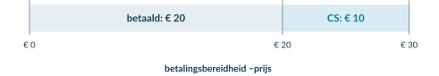<figcaption class="native-text" data-layout-height="13.0195" data-layout-width="382.1056" style="left:-0.1417pt;top:88.7449pt;line-height:10.0195pt">Figuur 1. De betalingsbereidheid bestaat hier uit € 20 die de koper betaalt en € 10 consumentensurplus.</figcaption></figure>
<h2 class="native-text" data-layout-height="17.7595" data-layout-width="255.301" style="left:53.8583pt;top:544.337pt;line-height:14.7595pt">Dezelfde prijs kan verschillend voordeel geven</h2>

Niet iedereen heeft dezelfde betalingsbereidheid. Een grote fan kan meer voor het kaartje over hebben dan iemand die alleen voor de gezelligheid meegaat. Bij dezelfde prijs kan het consumentensurplus dus verschillen.

Consumentensurplus is geen korting. Je vergelijkt de prijs met de maximale betalingsbereidheid van de koper, niet met een oude winkelprijs. De € 20 die de koper betaalt, is evenmin zijn surplus.

</article>

<!-- Native reconstruction of accepted physical page 75; see the revision provenance. -->
<article class="native-theory" data-accepted-page="75">
<svg aria-hidden="true" class="native-decoration" style="left:53.3583pt;top:77.7636pt;width:488.5591pt;height:2.1pt" viewbox="53.3583 77.7636 488.5591 2.1"><path d="M 53.8583 51.0236 H 541.4174 V 78.2636 H 53.8583 Z M 53.8583 51.0236 H 541.4174 V 79.3636 H 53.8583 Z" fill="#007da2" fill-rule="evenodd" stroke="none" stroke-width="0"></path></svg>
<svg aria-hidden="true" class="native-decoration" style="left:53.3583pt;top:102.7036pt;width:488.5591pt;height:1.5pt" viewbox="53.3583 102.7036 488.5591 1.5"><path d="M 53.8583 85.3636 H 541.4174 V 103.2036 H 53.8583 Z M 53.8583 85.3636 H 541.4174 V 103.7036 H 53.8583 Z" fill="#cedfe6" fill-rule="evenodd" stroke="none" stroke-width="0"></path></svg>
<svg aria-hidden="true" class="native-decoration" style="left:53.3583pt;top:169.3666pt;width:59.5071pt;height:24.951pt" viewbox="53.3583 169.3666 59.5071 24.951"><path d="M 53.8583 169.8666 H 112.3653 V 193.8176 H 53.8583 Z" fill="#eaf1f4" fill-rule="nonzero" stroke="none" stroke-width="0"></path></svg>
<svg aria-hidden="true" class="native-decoration" style="left:111.8653pt;top:169.3666pt;width:142.3921pt;height:24.951pt" viewbox="111.8653 169.3666 142.3921 24.951"><path d="M 112.3653 169.8666 H 253.7575 V 193.8176 H 112.3653 Z" fill="#eaf1f4" fill-rule="nonzero" stroke="none" stroke-width="0"></path></svg>
<svg aria-hidden="true" class="native-decoration" style="left:253.2575pt;top:169.3666pt;width:127.7654pt;height:24.951pt" viewbox="253.2575 169.3666 127.7654 24.951"><path d="M 253.7575 169.8666 H 380.5228 V 193.8176 H 253.7575 Z" fill="#eaf1f4" fill-rule="nonzero" stroke="none" stroke-width="0"></path></svg>
<svg aria-hidden="true" class="native-decoration" style="left:380.0228pt;top:169.3666pt;width:161.8945pt;height:24.951pt" viewbox="380.0228 169.3666 161.8945 24.951"><path d="M 380.5228 169.8666 H 541.4174 V 193.8176 H 380.5228 Z" fill="#eaf1f4" fill-rule="nonzero" stroke="none" stroke-width="0"></path></svg>
<svg aria-hidden="true" class="native-decoration" style="left:53.3583pt;top:217.4936pt;width:59.5071pt;height:25.101pt" viewbox="53.3583 217.4936 59.5071 25.101"><path d="M 53.8583 217.9936 H 112.3653 V 242.0946 H 53.8583 Z" fill="#f6f9fa" fill-rule="nonzero" stroke="none" stroke-width="0"></path></svg>
<svg aria-hidden="true" class="native-decoration" style="left:111.8653pt;top:217.4936pt;width:142.3921pt;height:25.101pt" viewbox="111.8653 217.4936 142.3921 25.101"><path d="M 112.3653 217.9936 H 253.7575 V 242.0946 H 112.3653 Z" fill="#f6f9fa" fill-rule="nonzero" stroke="none" stroke-width="0"></path></svg>
<svg aria-hidden="true" class="native-decoration" style="left:253.2575pt;top:217.4936pt;width:127.7654pt;height:25.101pt" viewbox="253.2575 217.4936 127.7654 25.101"><path d="M 253.7575 217.9936 H 380.5228 V 242.0946 H 253.7575 Z" fill="#f6f9fa" fill-rule="nonzero" stroke="none" stroke-width="0"></path></svg>
<svg aria-hidden="true" class="native-decoration" style="left:380.0228pt;top:217.4936pt;width:161.8945pt;height:25.101pt" viewbox="380.0228 217.4936 161.8945 25.101"><path d="M 380.5228 217.9936 H 541.4174 V 242.0946 H 380.5228 Z" fill="#f6f9fa" fill-rule="nonzero" stroke="none" stroke-width="0"></path></svg>
<svg aria-hidden="true" class="native-decoration" style="left:53.3583pt;top:265.6956pt;width:59.5071pt;height:25.101pt" viewbox="53.3583 265.6956 59.5071 25.101"><path d="M 53.8583 266.1956 H 112.3653 V 290.2966 H 53.8583 Z" fill="#edf5f2" fill-rule="nonzero" stroke="none" stroke-width="0"></path></svg>
<svg aria-hidden="true" class="native-decoration" style="left:111.8653pt;top:265.6956pt;width:142.3921pt;height:25.101pt" viewbox="111.8653 265.6956 142.3921 25.101"><path d="M 112.3653 266.1956 H 253.7575 V 290.2966 H 112.3653 Z" fill="#edf5f2" fill-rule="nonzero" stroke="none" stroke-width="0"></path></svg>
<svg aria-hidden="true" class="native-decoration" style="left:253.2575pt;top:265.6956pt;width:127.7654pt;height:25.101pt" viewbox="253.2575 265.6956 127.7654 25.101"><path d="M 253.7575 266.1956 H 380.5228 V 290.2966 H 253.7575 Z" fill="#edf5f2" fill-rule="nonzero" stroke="none" stroke-width="0"></path></svg>
<svg aria-hidden="true" class="native-decoration" style="left:380.0228pt;top:265.6956pt;width:161.8945pt;height:25.101pt" viewbox="380.0228 265.6956 161.8945 25.101"><path d="M 380.5228 266.1956 H 541.4174 V 290.2966 H 380.5228 Z" fill="#edf5f2" fill-rule="nonzero" stroke="none" stroke-width="0"></path></svg>
<svg aria-hidden="true" class="native-decoration" style="left:53.3583pt;top:217.4936pt;width:59.5071pt;height:1pt" viewbox="53.3583 217.4936 59.5071 1"><path d="M 53.8583 217.9936 L 112.3653 217.9936" fill="none" fill-rule="nonzero" stroke="#dce5e9" stroke-width="0.45000001788139343"></path></svg>
<svg aria-hidden="true" class="native-decoration" style="left:111.8653pt;top:217.4936pt;width:142.3921pt;height:1pt" viewbox="111.8653 217.4936 142.3921 1"><path d="M 112.3653 217.9936 L 253.7575 217.9936" fill="none" fill-rule="nonzero" stroke="#dce5e9" stroke-width="0.45000001788139343"></path></svg>
<svg aria-hidden="true" class="native-decoration" style="left:253.2575pt;top:217.4936pt;width:127.7654pt;height:1pt" viewbox="253.2575 217.4936 127.7654 1"><path d="M 253.7575 217.9936 L 380.5228 217.9936" fill="none" fill-rule="nonzero" stroke="#dce5e9" stroke-width="0.45000001788139343"></path></svg>
<svg aria-hidden="true" class="native-decoration" style="left:380.0228pt;top:217.4936pt;width:161.8945pt;height:1pt" viewbox="380.0228 217.4936 161.8945 1"><path d="M 380.5228 217.9936 L 541.4174 217.9936" fill="none" fill-rule="nonzero" stroke="#dce5e9" stroke-width="0.45000001788139343"></path></svg>
<svg aria-hidden="true" class="native-decoration" style="left:53.3583pt;top:241.5946pt;width:59.5071pt;height:1pt" viewbox="53.3583 241.5946 59.5071 1"><path d="M 53.8583 242.0946 L 112.3653 242.0946" fill="none" fill-rule="nonzero" stroke="#dce5e9" stroke-width="0.45000001788139343"></path></svg>
<svg aria-hidden="true" class="native-decoration" style="left:111.8653pt;top:241.5946pt;width:142.3921pt;height:1pt" viewbox="111.8653 241.5946 142.3921 1"><path d="M 112.3653 242.0946 L 253.7575 242.0946" fill="none" fill-rule="nonzero" stroke="#dce5e9" stroke-width="0.45000001788139343"></path></svg>
<svg aria-hidden="true" class="native-decoration" style="left:253.2575pt;top:241.5946pt;width:127.7654pt;height:1pt" viewbox="253.2575 241.5946 127.7654 1"><path d="M 253.7575 242.0946 L 380.5228 242.0946" fill="none" fill-rule="nonzero" stroke="#dce5e9" stroke-width="0.45000001788139343"></path></svg>
<svg aria-hidden="true" class="native-decoration" style="left:380.0228pt;top:241.5946pt;width:161.8945pt;height:1pt" viewbox="380.0228 241.5946 161.8945 1"><path d="M 380.5228 242.0946 L 541.4174 242.0946" fill="none" fill-rule="nonzero" stroke="#dce5e9" stroke-width="0.45000001788139343"></path></svg>
<svg aria-hidden="true" class="native-decoration" style="left:53.3583pt;top:265.6956pt;width:59.5071pt;height:1pt" viewbox="53.3583 265.6956 59.5071 1"><path d="M 53.8583 266.1956 L 112.3653 266.1956" fill="none" fill-rule="nonzero" stroke="#dce5e9" stroke-width="0.45000001788139343"></path></svg>
<svg aria-hidden="true" class="native-decoration" style="left:111.8653pt;top:265.6956pt;width:142.3921pt;height:1pt" viewbox="111.8653 265.6956 142.3921 1"><path d="M 112.3653 266.1956 L 253.7575 266.1956" fill="none" fill-rule="nonzero" stroke="#dce5e9" stroke-width="0.45000001788139343"></path></svg>
<svg aria-hidden="true" class="native-decoration" style="left:253.2575pt;top:265.6956pt;width:127.7654pt;height:1pt" viewbox="253.2575 265.6956 127.7654 1"><path d="M 253.7575 266.1956 L 380.5228 266.1956" fill="none" fill-rule="nonzero" stroke="#dce5e9" stroke-width="0.45000001788139343"></path></svg>
<svg aria-hidden="true" class="native-decoration" style="left:380.0228pt;top:265.6956pt;width:161.8945pt;height:1pt" viewbox="380.0228 265.6956 161.8945 1"><path d="M 380.5228 266.1956 L 541.4174 266.1956" fill="none" fill-rule="nonzero" stroke="#dce5e9" stroke-width="0.45000001788139343"></path></svg>
<svg aria-hidden="true" class="native-decoration" style="left:53.3583pt;top:289.7966pt;width:59.5071pt;height:1pt" viewbox="53.3583 289.7966 59.5071 1"><path d="M 53.8583 290.2966 L 112.3653 290.2966" fill="none" fill-rule="nonzero" stroke="#dce5e9" stroke-width="0.45000001788139343"></path></svg>
<svg aria-hidden="true" class="native-decoration" style="left:111.8653pt;top:289.7966pt;width:142.3921pt;height:1pt" viewbox="111.8653 289.7966 142.3921 1"><path d="M 112.3653 290.2966 L 253.7575 290.2966" fill="none" fill-rule="nonzero" stroke="#dce5e9" stroke-width="0.45000001788139343"></path></svg>
<svg aria-hidden="true" class="native-decoration" style="left:253.2575pt;top:289.7966pt;width:127.7654pt;height:1pt" viewbox="253.2575 289.7966 127.7654 1"><path d="M 253.7575 290.2966 L 380.5228 290.2966" fill="none" fill-rule="nonzero" stroke="#dce5e9" stroke-width="0.45000001788139343"></path></svg>
<svg aria-hidden="true" class="native-decoration" style="left:380.0228pt;top:289.7966pt;width:161.8945pt;height:1pt" viewbox="380.0228 289.7966 161.8945 1"><path d="M 380.5228 290.2966 L 541.4174 290.2966" fill="none" fill-rule="nonzero" stroke="#dce5e9" stroke-width="0.45000001788139343"></path></svg>
<svg aria-hidden="true" class="native-decoration" style="left:53.2583pt;top:193.2176pt;width:59.7071pt;height:1.2pt" viewbox="53.2583 193.2176 59.7071 1.2"><path d="M 53.8583 193.8176 L 112.3653 193.8176" fill="none" fill-rule="nonzero" stroke="#cbdbe2" stroke-width="0.6000000238418579"></path></svg>
<svg aria-hidden="true" class="native-decoration" style="left:111.7653pt;top:193.2176pt;width:142.5921pt;height:1.2pt" viewbox="111.7653 193.2176 142.5921 1.2"><path d="M 112.3653 193.8176 L 253.7575 193.8176" fill="none" fill-rule="nonzero" stroke="#cbdbe2" stroke-width="0.6000000238418579"></path></svg>
<svg aria-hidden="true" class="native-decoration" style="left:253.1575pt;top:193.2176pt;width:127.9654pt;height:1.2pt" viewbox="253.1575 193.2176 127.9654 1.2"><path d="M 253.7575 193.8176 L 380.5228 193.8176" fill="none" fill-rule="nonzero" stroke="#cbdbe2" stroke-width="0.6000000238418579"></path></svg>
<svg aria-hidden="true" class="native-decoration" style="left:379.9228pt;top:193.2176pt;width:162.0945pt;height:1.2pt" viewbox="379.9228 193.2176 162.0945 1.2"><path d="M 380.5228 193.8176 L 541.4174 193.8176" fill="none" fill-rule="nonzero" stroke="#cbdbe2" stroke-width="0.6000000238418579"></path></svg>
<svg aria-hidden="true" class="native-decoration" style="left:53.3583pt;top:626.8209pt;width:488.5591pt;height:54.83pt" viewbox="53.3583 626.8209 488.5591 54.83"><path d="M 53.8583 627.3209 H 541.4174 V 681.1509 H 53.8583 Z" fill="#faf2e8" fill-rule="nonzero" stroke="none" stroke-width="0"></path></svg>
<svg aria-hidden="true" class="native-decoration" style="left:108.5873pt;top:85.8636pt;width:1.5pt;height:10.84pt" viewbox="108.5873 85.8636 1.5 10.84"><path d="M 53.8583 86.3636 H 109.0873 V 96.2036 H 53.8583 Z M 53.8583 86.3636 H 109.5873 V 96.2036 H 53.8583 Z" fill="#bed5df" fill-rule="evenodd" stroke="none" stroke-width="0"></path></svg>
<svg aria-hidden="true" class="native-decoration" style="left:178.7765pt;top:85.8636pt;width:1.5pt;height:10.84pt" viewbox="178.7765 85.8636 1.5 10.84"><path d="M 109.5873 86.3636 H 179.2765 V 96.2036 H 109.5873 Z M 109.5873 86.3636 H 179.7765 V 96.2036 H 109.5873 Z" fill="#bed5df" fill-rule="evenodd" stroke="none" stroke-width="0"></path></svg>
<svg aria-hidden="true" class="native-decoration" style="left:246.819pt;top:85.8636pt;width:1.5pt;height:10.84pt" viewbox="246.819 85.8636 1.5 10.84"><path d="M 179.7765 86.3636 H 247.319 V 96.2036 H 179.7765 Z M 179.7765 86.3636 H 247.819 V 96.2036 H 179.7765 Z" fill="#bed5df" fill-rule="evenodd" stroke="none" stroke-width="0"></path></svg>
<h1 class="native-text" data-layout-height="24.1192" data-layout-width="294.4454" style="left:53.8583pt;top:50.5842pt;line-height:21.1192pt">2.3.1 · Van één koper naar alle kopers</h1>

Betekenis · 2

Alle kopers · 3

Berekenen · 4

Voorbeeld · 5

<h2 class="native-text" data-layout-height="17.7595" data-layout-width="243.5794" style="left:53.8583pt;top:114.8885pt;line-height:14.7595pt">Losse kopers: tel de werkelijke voordelen op</h2>

Drie leerlingen willen ieder één kaartje. Hun betalingsbereidheid is € 30, € 25 en € 15. De prijs is € 20. Alleen de eerste twee kopen.

<table aria-label="Tabel bij Van één koper naar alle kopers" class="native-table" style="left:53.8583pt;top:169.87pt;width:487.5591pt;height:120.43pt"><tbody>
<tr>
<th scope="col" style="left:0pt;top:0pt;width:58.5071pt;height:23.95pt">

Koper

</th>
<th scope="col" style="left:58.5071pt;top:0pt;width:141.3921pt;height:23.95pt">

Betalingsbereidheid

</th>
<th scope="col" style="left:199.8992pt;top:0pt;width:126.7653pt;height:23.95pt">

Koopt bij € 20?

</th>
<th scope="col" style="left:326.6646pt;top:0pt;width:160.8945pt;height:23.95pt">

CS

</th>
</tr>
<tr>
<td style="left:0pt;top:23.95pt;width:58.5071pt;height:24.17pt">

1

</td>
<td style="left:58.5071pt;top:23.95pt;width:141.3921pt;height:24.17pt">

€ 30

</td>
<td style="left:199.8992pt;top:23.95pt;width:126.7653pt;height:24.17pt">

Ja

</td>
<td style="left:326.6646pt;top:23.95pt;width:160.8945pt;height:24.17pt">

30 − 20 = € 10

</td>
</tr>
<tr>
<td style="left:0pt;top:48.12pt;width:58.5071pt;height:24.1pt">

2

</td>
<td style="left:58.5071pt;top:48.12pt;width:141.3921pt;height:24.1pt">

€ 25

</td>
<td style="left:199.8992pt;top:48.12pt;width:126.7653pt;height:24.1pt">

Ja

</td>
<td style="left:326.6646pt;top:48.12pt;width:160.8945pt;height:24.1pt">

25 − 20 = € 5

</td>
</tr>
<tr>
<td style="left:0pt;top:72.22pt;width:58.5071pt;height:24.11pt">

3

</td>
<td style="left:58.5071pt;top:72.22pt;width:141.3921pt;height:24.11pt">

€ 15

</td>
<td style="left:199.8992pt;top:72.22pt;width:126.7653pt;height:24.11pt">

Nee

</td>
<td style="left:326.6646pt;top:72.22pt;width:160.8945pt;height:24.11pt">

€ 0: geen aankoop

</td>
</tr>
<tr>
<td style="left:0pt;top:96.33pt;width:58.5071pt;height:24.1pt">

Samen

</td>
<td style="left:58.5071pt;top:96.33pt;width:141.3921pt;height:24.1pt">
</td>
<td style="left:199.8992pt;top:96.33pt;width:126.7653pt;height:24.1pt">

2 gekochte kaartjes

</td>
<td style="left:326.6646pt;top:96.33pt;width:160.8945pt;height:24.1pt">

CS = € 15

</td>
</tr>
</tbody></table>

Je telt alleen het voordeel van gekochte kaartjes. De derde leerling krijgt geen negatief surplus: hij koopt het kaartje niet.

<h2 class="native-text" data-layout-height="17.7595" data-layout-width="256.1742" style="left:53.8583pt;top:334.7325pt;line-height:14.7595pt">Een doorlopende vraaglijn: bereken het gebied</h2>

Bij een grotere markt gebruiken we een doorlopende vraaglijn. Van links naar rechts neemt de betalingsbereidheid af. Voor skatehalkaartjes geldt P = 30 − 0,5Q. De prijs is € 10; alle bij die prijs gevraagde kaartjes worden verkocht aan de vragers met de hoogste betalingsbereidheid.

<figure class="native-figure" style="left:54pt;top:396pt;width:491.2756pt;height:210.009pt">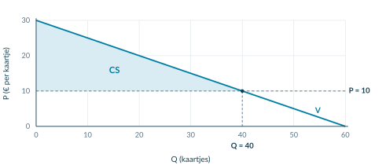<figcaption class="native-text" data-layout-height="13.0195" data-layout-width="347.2794" style="left:-0.1417pt;top:213.0091pt;line-height:10.0195pt">Figuur 2. V is de vraaglijn. CS ligt boven de prijs, onder V en alleen bij de 40 verkochte kaartjes.</figcaption></figure>

Een tabel en een doorlopende lijn zijn verschillende modellen. Bij losse kopers tel je hun voordelen op. Bij een rechte, doorlopende vraaglijn bereken je de oppervlakte. Het gebied is hier een driehoek; het betaalde bedrag onder P = 10 hoort niet bij CS.

</article>

<!-- Native reconstruction of accepted physical page 76; see the revision provenance. -->
<article class="native-theory" data-accepted-page="76">
<svg aria-hidden="true" class="native-decoration" style="left:53.3583pt;top:77.7636pt;width:488.5591pt;height:2.1pt" viewbox="53.3583 77.7636 488.5591 2.1"><path d="M 53.8583 51.0236 H 541.4174 V 78.2636 H 53.8583 Z M 53.8583 51.0236 H 541.4174 V 79.3636 H 53.8583 Z" fill="#007da2" fill-rule="evenodd" stroke="none" stroke-width="0"></path></svg>
<svg aria-hidden="true" class="native-decoration" style="left:53.3583pt;top:102.7036pt;width:488.5591pt;height:1.5pt" viewbox="53.3583 102.7036 488.5591 1.5"><path d="M 53.8583 85.3636 H 541.4174 V 103.2036 H 53.8583 Z M 53.8583 85.3636 H 541.4174 V 103.7036 H 53.8583 Z" fill="#cedfe6" fill-rule="evenodd" stroke="none" stroke-width="0"></path></svg>
<svg aria-hidden="true" class="native-decoration" style="left:53.3583pt;top:137.2206pt;width:22pt;height:22pt" viewbox="53.3583 137.2206 22 22"><path d="M 53.8583 137.7206 H 74.8583 V 158.7206 H 53.8583 Z" fill="#007da2" fill-rule="nonzero" stroke="none" stroke-width="0"></path></svg>
<svg aria-hidden="true" class="native-decoration" style="left:53.3583pt;top:165.2206pt;width:108.263pt;height:24.951pt" viewbox="53.3583 165.2206 108.263 24.951"><path d="M 53.8583 165.7206 H 161.1212 V 189.6716 H 53.8583 Z" fill="#eaf1f4" fill-rule="nonzero" stroke="none" stroke-width="0"></path></svg>
<svg aria-hidden="true" class="native-decoration" style="left:160.6212pt;top:165.2206pt;width:259.4063pt;height:24.951pt" viewbox="160.6212 165.2206 259.4063 24.951"><path d="M 161.1212 165.7206 H 419.5275 V 189.6716 H 161.1212 Z" fill="#eaf1f4" fill-rule="nonzero" stroke="none" stroke-width="0"></path></svg>
<svg aria-hidden="true" class="native-decoration" style="left:419.0275pt;top:165.2206pt;width:122.8898pt;height:24.951pt" viewbox="419.0275 165.2206 122.8898 24.951"><path d="M 419.5275 165.7206 H 541.4174 V 189.6716 H 419.5275 Z" fill="#eaf1f4" fill-rule="nonzero" stroke="none" stroke-width="0"></path></svg>
<svg aria-hidden="true" class="native-decoration" style="left:53.3583pt;top:213.3476pt;width:108.263pt;height:25.101pt" viewbox="53.3583 213.3476 108.263 25.101"><path d="M 53.8583 213.8476 H 161.1212 V 237.9486 H 53.8583 Z" fill="#f6f9fa" fill-rule="nonzero" stroke="none" stroke-width="0"></path></svg>
<svg aria-hidden="true" class="native-decoration" style="left:160.6212pt;top:213.3476pt;width:259.4063pt;height:25.101pt" viewbox="160.6212 213.3476 259.4063 25.101"><path d="M 161.1212 213.8476 H 419.5275 V 237.9486 H 161.1212 Z" fill="#f6f9fa" fill-rule="nonzero" stroke="none" stroke-width="0"></path></svg>
<svg aria-hidden="true" class="native-decoration" style="left:419.0275pt;top:213.3476pt;width:122.8898pt;height:25.101pt" viewbox="419.0275 213.3476 122.8898 25.101"><path d="M 419.5275 213.8476 H 541.4174 V 237.9486 H 419.5275 Z" fill="#f6f9fa" fill-rule="nonzero" stroke="none" stroke-width="0"></path></svg>
<svg aria-hidden="true" class="native-decoration" style="left:53.3583pt;top:213.3476pt;width:108.263pt;height:1pt" viewbox="53.3583 213.3476 108.263 1"><path d="M 53.8583 213.8476 L 161.1212 213.8476" fill="none" fill-rule="nonzero" stroke="#dce5e9" stroke-width="0.45000001788139343"></path></svg>
<svg aria-hidden="true" class="native-decoration" style="left:160.6212pt;top:213.3476pt;width:259.4063pt;height:1pt" viewbox="160.6212 213.3476 259.4063 1"><path d="M 161.1212 213.8476 L 419.5275 213.8476" fill="none" fill-rule="nonzero" stroke="#dce5e9" stroke-width="0.45000001788139343"></path></svg>
<svg aria-hidden="true" class="native-decoration" style="left:419.0275pt;top:213.3476pt;width:122.8898pt;height:1pt" viewbox="419.0275 213.3476 122.8898 1"><path d="M 419.5275 213.8476 L 541.4174 213.8476" fill="none" fill-rule="nonzero" stroke="#dce5e9" stroke-width="0.45000001788139343"></path></svg>
<svg aria-hidden="true" class="native-decoration" style="left:53.3583pt;top:237.4486pt;width:108.263pt;height:1pt" viewbox="53.3583 237.4486 108.263 1"><path d="M 53.8583 237.9486 L 161.1212 237.9486" fill="none" fill-rule="nonzero" stroke="#dce5e9" stroke-width="0.45000001788139343"></path></svg>
<svg aria-hidden="true" class="native-decoration" style="left:160.6212pt;top:237.4486pt;width:259.4063pt;height:1pt" viewbox="160.6212 237.4486 259.4063 1"><path d="M 161.1212 237.9486 L 419.5275 237.9486" fill="none" fill-rule="nonzero" stroke="#dce5e9" stroke-width="0.45000001788139343"></path></svg>
<svg aria-hidden="true" class="native-decoration" style="left:419.0275pt;top:237.4486pt;width:122.8898pt;height:1pt" viewbox="419.0275 237.4486 122.8898 1"><path d="M 419.5275 237.9486 L 541.4174 237.9486" fill="none" fill-rule="nonzero" stroke="#dce5e9" stroke-width="0.45000001788139343"></path></svg>
<svg aria-hidden="true" class="native-decoration" style="left:53.2583pt;top:189.0716pt;width:108.463pt;height:1.2pt" viewbox="53.2583 189.0716 108.463 1.2"><path d="M 53.8583 189.6716 L 161.1212 189.6716" fill="none" fill-rule="nonzero" stroke="#cbdbe2" stroke-width="0.6000000238418579"></path></svg>
<svg aria-hidden="true" class="native-decoration" style="left:160.5212pt;top:189.0716pt;width:259.6063pt;height:1.2pt" viewbox="160.5212 189.0716 259.6063 1.2"><path d="M 161.1212 189.6716 L 419.5275 189.6716" fill="none" fill-rule="nonzero" stroke="#cbdbe2" stroke-width="0.6000000238418579"></path></svg>
<svg aria-hidden="true" class="native-decoration" style="left:418.9275pt;top:189.0716pt;width:123.0898pt;height:1.2pt" viewbox="418.9275 189.0716 123.0898 1.2"><path d="M 419.5275 189.6716 L 541.4174 189.6716" fill="none" fill-rule="nonzero" stroke="#cbdbe2" stroke-width="0.6000000238418579"></path></svg>
<svg aria-hidden="true" class="native-decoration" style="left:53.3583pt;top:247.6736pt;width:22pt;height:22pt" viewbox="53.3583 247.6736 22 22"><path d="M 53.8583 248.1736 H 74.8583 V 269.1736 H 53.8583 Z" fill="#007da2" fill-rule="nonzero" stroke="none" stroke-width="0"></path></svg>
<svg aria-hidden="true" class="native-decoration" style="left:53.3583pt;top:274.6736pt;width:488.5591pt;height:70.786pt" viewbox="53.3583 274.6736 488.5591 70.786"><path d="M 53.8583 275.1736 H 541.4174 V 344.9596 H 53.8583 Z" fill="#eaf4f8" fill-rule="nonzero" stroke="none" stroke-width="0"></path></svg>
<svg aria-hidden="true" class="native-decoration" style="left:53.3583pt;top:274.6736pt;width:3pt;height:70.786pt" viewbox="53.3583 274.6736 3 70.786"><path d="M 55.8583 275.1736 H 541.4174 V 344.9596 H 55.8583 Z M 53.8583 275.1736 H 541.4174 V 344.9596 H 53.8583 Z" fill="#007da2" fill-rule="evenodd" stroke="none" stroke-width="0"></path></svg>
<svg aria-hidden="true" class="native-decoration" style="left:53.3583pt;top:570.9584pt;width:22pt;height:22pt" viewbox="53.3583 570.9584 22 22"><path d="M 53.8583 571.4584 H 74.8583 V 592.4584 H 53.8583 Z" fill="#007da2" fill-rule="nonzero" stroke="none" stroke-width="0"></path></svg>
<svg aria-hidden="true" class="native-decoration" style="left:53.3583pt;top:597.9584pt;width:488.5591pt;height:78.882pt" viewbox="53.3583 597.9584 488.5591 78.882"><path d="M 53.8583 598.4584 H 541.4174 V 676.3404 H 53.8583 Z" fill="#eaf4f8" fill-rule="nonzero" stroke="none" stroke-width="0"></path></svg>
<svg aria-hidden="true" class="native-decoration" style="left:53.3583pt;top:597.9584pt;width:3pt;height:78.882pt" viewbox="53.3583 597.9584 3 78.882"><path d="M 55.8583 598.4584 H 541.4174 V 676.3404 H 55.8583 Z M 53.8583 598.4584 H 541.4174 V 676.3404 H 53.8583 Z" fill="#007da2" fill-rule="evenodd" stroke="none" stroke-width="0"></path></svg>
<svg aria-hidden="true" class="native-decoration" style="left:53.3583pt;top:683.8404pt;width:488.5591pt;height:42.22pt" viewbox="53.3583 683.8404 488.5591 42.22"><path d="M 53.8583 684.3404 H 541.4174 V 725.5604 H 53.8583 Z" fill="#faf2e8" fill-rule="nonzero" stroke="none" stroke-width="0"></path></svg>
<svg aria-hidden="true" class="native-decoration" style="left:108.5873pt;top:85.8636pt;width:1.5pt;height:10.84pt" viewbox="108.5873 85.8636 1.5 10.84"><path d="M 53.8583 86.3636 H 109.0873 V 96.2036 H 53.8583 Z M 53.8583 86.3636 H 109.5873 V 96.2036 H 53.8583 Z" fill="#bed5df" fill-rule="evenodd" stroke="none" stroke-width="0"></path></svg>
<svg aria-hidden="true" class="native-decoration" style="left:178.0228pt;top:85.8636pt;width:1.5pt;height:10.84pt" viewbox="178.0228 85.8636 1.5 10.84"><path d="M 109.5873 86.3636 H 178.5228 V 96.2036 H 109.5873 Z M 109.5873 86.3636 H 179.0228 V 96.2036 H 109.5873 Z" fill="#bed5df" fill-rule="evenodd" stroke="none" stroke-width="0"></path></svg>
<svg aria-hidden="true" class="native-decoration" style="left:246.7281pt;top:85.8636pt;width:1.5pt;height:10.84pt" viewbox="246.7281 85.8636 1.5 10.84"><path d="M 179.0228 86.3636 H 247.2281 V 96.2036 H 179.0228 Z M 179.0228 86.3636 H 247.7281 V 96.2036 H 179.0228 Z" fill="#bed5df" fill-rule="evenodd" stroke="none" stroke-width="0"></path></svg>
<h1 class="native-text" data-layout-height="24.1192" data-layout-width="400.7632" style="left:53.8583pt;top:50.5842pt;line-height:21.1192pt">2.3.1 · Consumentensurplus tekenen en berekenen</h1>

Betekenis · 2

Alle kopers · 3

Berekenen · 4

Voorbeeld · 5

Gebruik P = 30 − 0,5Q en de gegeven prijs P = € 10. Alle gevraagde kaartjes worden verkocht.

<h2 class="native-text" data-layout-height="17.7595" data-layout-width="246.4821" style="left:83.8583pt;top:139.9055pt;line-height:14.7595pt">Teken de vraaglijn met twee assensnijpunten</h2>

1

<table aria-label="Tabel bij Zo teken en bereken je het gebied" class="native-table" style="left:53.8583pt;top:165.72pt;width:487.5591pt;height:72.23pt"><tbody>
<tr>
<th scope="col" style="left:0pt;top:0pt;width:107.263pt;height:23.95pt">

Kies…

</th>
<th scope="col" style="left:107.263pt;top:0pt;width:258.4063pt;height:23.95pt">

Bereken…

</th>
<th scope="col" style="left:365.6693pt;top:0pt;width:121.8898pt;height:23.95pt">

Punt (Q; P)

</th>
</tr>
<tr>
<td style="left:0pt;top:23.95pt;width:107.263pt;height:24.18pt">

Q = 0

</td>
<td style="left:107.263pt;top:23.95pt;width:258.4063pt;height:24.18pt">

P = 30 − 0,5 × 0 = 30

</td>
<td style="left:365.6693pt;top:23.95pt;width:121.8898pt;height:24.18pt">

(0; 30)

</td>
</tr>
<tr>
<td style="left:0pt;top:48.13pt;width:107.263pt;height:24.1pt">

P = 0

</td>
<td style="left:107.263pt;top:48.13pt;width:258.4063pt;height:24.1pt">

0 = 30 − 0,5Q → Q = 60

</td>
<td style="left:365.6693pt;top:48.13pt;width:121.8898pt;height:24.1pt">

(60; 0)

</td>
</tr>
</tbody></table>
<h2 class="native-text" data-layout-height="17.7595" data-layout-width="187.5672" style="left:83.8583pt;top:250.3584pt;line-height:14.7595pt">Voeg de prijslijn toe en bereken Q</h2>

2

Vul P = 10 in

10 = 30 − 0,5Q → 0,5Q = 20 → Q = 40

Teken de horizontale lijn P = 10. Het snijpunt met V is (40; 10).

<figure class="native-figure" style="left:54pt;top:365pt;width:491.2756pt;height:183.1465pt">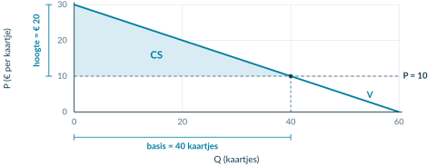<figcaption class="native-text" data-layout-height="13.0195" data-layout-width="392.9268" style="left:-0.1417pt;top:186.1465pt;line-height:10.0195pt">Figuur 3. Lees bij de prijs eerst Q af. De basis van CS is 40 kaartjes; de hoogte is 30 − 10 = € 20 per kaartje.</figcaption></figure>
<h2 class="native-text" data-layout-height="17.7595" data-layout-width="244.1206" style="left:83.8583pt;top:573.6432pt;line-height:14.7595pt">Kies de juiste basis én het juiste prijsverschil</h2>

3

Driehoek boven de prijs en onder de vraaglijn

CS = ½ × basis × hoogte

CS = ½ × 40 × (30 − 10) = € 400

Eenheid en naam. Kaartjes × € per kaartje geeft euro, dus niet euro per kaartje. Q = 40 is de gevraagde én verkochte hoeveelheid bij een gegeven prijs. Zonder aanbodfunctie heb je geen marktevenwicht berekend.

</article>

<!-- Native reconstruction of accepted physical page 77; see the revision provenance. -->
<article class="native-theory" data-accepted-page="77">
<svg aria-hidden="true" class="native-decoration" style="left:53.3583pt;top:77.7636pt;width:488.5591pt;height:2.1pt" viewbox="53.3583 77.7636 488.5591 2.1"><path d="M 53.8583 51.0236 H 541.4174 V 78.2636 H 53.8583 Z M 53.8583 51.0236 H 541.4174 V 79.3636 H 53.8583 Z" fill="#007da2" fill-rule="evenodd" stroke="none" stroke-width="0"></path></svg>
<svg aria-hidden="true" class="native-decoration" style="left:53.3583pt;top:102.7036pt;width:488.5591pt;height:1.5pt" viewbox="53.3583 102.7036 488.5591 1.5"><path d="M 53.8583 85.3636 H 541.4174 V 103.2036 H 53.8583 Z M 53.8583 85.3636 H 541.4174 V 103.7036 H 53.8583 Z" fill="#cedfe6" fill-rule="evenodd" stroke="none" stroke-width="0"></path></svg>
<svg aria-hidden="true" class="native-decoration" style="left:53.3583pt;top:165.2546pt;width:22pt;height:22pt" viewbox="53.3583 165.2546 22 22"><path d="M 53.8583 165.7546 H 74.8583 V 186.7546 H 53.8583 Z" fill="#007da2" fill-rule="nonzero" stroke="none" stroke-width="0"></path></svg>
<svg aria-hidden="true" class="native-decoration" style="left:53.3583pt;top:218.8636pt;width:22pt;height:22pt" viewbox="53.3583 218.8636 22 22"><path d="M 53.8583 219.3636 H 74.8583 V 240.3636 H 53.8583 Z" fill="#007da2" fill-rule="nonzero" stroke="none" stroke-width="0"></path></svg>
<svg aria-hidden="true" class="native-decoration" style="left:53.3583pt;top:505.0948pt;width:22pt;height:22pt" viewbox="53.3583 505.0948 22 22"><path d="M 53.8583 505.5948 H 74.8583 V 526.5948 H 53.8583 Z" fill="#007da2" fill-rule="nonzero" stroke="none" stroke-width="0"></path></svg>
<svg aria-hidden="true" class="native-decoration" style="left:53.3583pt;top:532.0948pt;width:242.2795pt;height:96.582pt" viewbox="53.3583 532.0948 242.2795 96.582"><path d="M 53.8583 532.5948 H 295.1378 V 628.1768 H 53.8583 Z" fill="#f1f5f7" fill-rule="nonzero" stroke="none" stroke-width="0"></path></svg>
<svg aria-hidden="true" class="native-decoration" style="left:299.6378pt;top:532.0948pt;width:242.2796pt;height:96.582pt" viewbox="299.6378 532.0948 242.2796 96.582"><path d="M 300.1378 532.5948 H 541.4174 V 628.1768 H 300.1378 Z" fill="#eaf4f8" fill-rule="nonzero" stroke="none" stroke-width="0"></path></svg>
<svg aria-hidden="true" class="native-decoration" style="left:53.3583pt;top:532.0948pt;width:3pt;height:96.582pt" viewbox="53.3583 532.0948 3 96.582"><path d="M 55.8583 532.5948 H 295.1378 V 628.1768 H 55.8583 Z M 53.8583 532.5948 H 295.1378 V 628.1768 H 53.8583 Z" fill="#8ba5b2" fill-rule="evenodd" stroke="none" stroke-width="0"></path></svg>
<svg aria-hidden="true" class="native-decoration" style="left:299.6378pt;top:532.0948pt;width:3pt;height:96.582pt" viewbox="299.6378 532.0948 3 96.582"><path d="M 302.1378 532.5948 H 541.4174 V 628.1768 H 302.1378 Z M 300.1378 532.5948 H 541.4174 V 628.1768 H 300.1378 Z" fill="#007da2" fill-rule="evenodd" stroke="none" stroke-width="0"></path></svg>
<svg aria-hidden="true" class="native-decoration" style="left:53.3583pt;top:637.6768pt;width:22pt;height:22pt" viewbox="53.3583 637.6768 22 22"><path d="M 53.8583 638.1768 H 74.8583 V 659.1768 H 53.8583 Z" fill="#007da2" fill-rule="nonzero" stroke="none" stroke-width="0"></path></svg>
<svg aria-hidden="true" class="native-decoration" style="left:53.3583pt;top:700.7108pt;width:488.5591pt;height:62.254pt" viewbox="53.3583 700.7108 488.5591 62.254"><path d="M 53.8583 701.2108 H 541.4174 V 762.4648 H 53.8583 Z" fill="#eef4f6" fill-rule="nonzero" stroke="none" stroke-width="0"></path></svg>
<svg aria-hidden="true" class="native-decoration" style="left:53.3583pt;top:700.7108pt;width:3pt;height:62.254pt" viewbox="53.3583 700.7108 3 62.254"><path d="M 55.8583 701.2108 H 541.4174 V 762.4648 H 55.8583 Z M 53.8583 701.2108 H 541.4174 V 762.4648 H 53.8583 Z" fill="#007da2" fill-rule="evenodd" stroke="none" stroke-width="0"></path></svg>
<svg aria-hidden="true" class="native-decoration" style="left:108.5873pt;top:85.8636pt;width:1.5pt;height:10.84pt" viewbox="108.5873 85.8636 1.5 10.84"><path d="M 53.8583 86.3636 H 109.0873 V 96.2036 H 53.8583 Z M 53.8583 86.3636 H 109.5873 V 96.2036 H 53.8583 Z" fill="#bed5df" fill-rule="evenodd" stroke="none" stroke-width="0"></path></svg>
<svg aria-hidden="true" class="native-decoration" style="left:178.0228pt;top:85.8636pt;width:1.5pt;height:10.84pt" viewbox="178.0228 85.8636 1.5 10.84"><path d="M 109.5873 86.3636 H 178.5228 V 96.2036 H 109.5873 Z M 109.5873 86.3636 H 179.0228 V 96.2036 H 109.5873 Z" fill="#bed5df" fill-rule="evenodd" stroke="none" stroke-width="0"></path></svg>
<svg aria-hidden="true" class="native-decoration" style="left:246.0653pt;top:85.8636pt;width:1.5pt;height:10.84pt" viewbox="246.0653 85.8636 1.5 10.84"><path d="M 179.0228 86.3636 H 246.5653 V 96.2036 H 179.0228 Z M 179.0228 86.3636 H 247.0653 V 96.2036 H 179.0228 Z" fill="#bed5df" fill-rule="evenodd" stroke="none" stroke-width="0"></path></svg>
<h1 class="native-text" data-layout-height="24.1192" data-layout-width="339.2887" style="left:53.8583pt;top:50.5842pt;line-height:21.1192pt">2.3.1 · Voorbeeld: van vraagfunctie naar CS</h1>

Betekenis · 2

Alle kopers · 3

Berekenen · 4

Voorbeeld · 5

Een escaperoom verkoopt tickets. P = 20 − 0,25Q; P is in euro per ticket en Q in tickets. De prijs is € 10. Er zijn genoeg plaatsen: alle gevraagde tickets worden verkocht aan de vragers met de hoogste betalingsbereidheid.

<h2 class="native-text" data-layout-height="17.7595" data-layout-width="191.7491" style="left:83.8583pt;top:167.9395pt;line-height:14.7595pt">Bereken de verkochte hoeveelheid</h2>

1

10 = 20 − 0,25Q → 0,25Q = 10 → Q = 40

<h2 class="native-text" data-layout-height="17.7595" data-layout-width="159.7702" style="left:83.8583pt;top:221.5485pt;line-height:14.7595pt">Teken en markeer de situatie</h2>

2

De assensnijpunten zijn (0; 20) en (80; 0). Teken V door die punten. Voeg de horizontale prijslijn P = 10 toe. Het snijpunt met V is (40; 10).

<figure class="native-figure" style="left:54pt;top:283pt;width:491.2756pt;height:199.2829pt"><figcaption class="native-text" data-layout-height="13.0195" data-layout-width="383.7255" style="left:-0.1417pt;top:202.2829pt;line-height:10.0195pt">Figuur 4. Arceer boven P = 10 en onder V, tot Q = 40. Voor deze CS-berekening is geen aanbodlijn nodig.</figcaption></figure>
<h2 class="native-text" data-layout-height="17.7595" data-layout-width="133.5353" style="left:83.8583pt;top:507.7796pt;line-height:14.7595pt">Bereken de oppervlakte</h2>

3

Basis en hoogte

Consumentensurplus

CS = ½ × 40 × (20 − 10)

Basis: 40 tickets. Hoogte: 20 − 10 = € 10 per ticket.

CS = € 200

De hoogte is niet automatisch gelijk aan de marktprijs.

<h2 class="native-text" data-layout-height="17.7595" data-layout-width="176.6206" style="left:83.8583pt;top:640.3617pt;line-height:14.7595pt">Leg uit wat het bedrag betekent</h2>

4

De kopers hebben samen € 200 meer voor de gekochte tickets over dan zij werkelijk betalen. Dat gezamenlijke voordeel is niet de omzet van de escaperoom.

Onthoud

Hoeveelheid → grafiek → gebied → berekening → betekenis. CS ligt boven de prijs en onder de vraaglijn. Gebruik bij een driehoek ½ × basis × hoogte en sluit af met euro én het voordeel voor de kopers.

</article>

## Startopgaven

**Opgave 1 · Ophalen uit boek 1 en wiskunde**

Voor een product geldt P = 16 − 0,2Q.

a) Bereken Q bij P = 6. Noteer ook beide assensnijpunten.

b) Bereken de oppervlakte van een driehoek met basis 50 en hoogte 10.

**Opgave 2 · Begripscheck**

Iris heeft € 18 over voor een toegangsbewijs. Zij betaalt € 12.

a) Bereken haar consumentensurplus.

b) Een klasgenoot noemt de betaalde € 12 haar consumentensurplus. Verbeter deze uitleg.

<b>Normale route:</b> Startopgaven → Begeleide inoefening → Zelfstandige oefening → Doeloefening. <b>Uitdagende route (minder tussenstappen, extra uitdaging):</b> Startopgaven → Zelfstandige oefening → Doeloefening → Denkertje / Bonusopgave. Herhaling is extra bij beide routes.

## Begeleide inoefening

*Begeleide inoefening hoort bij leren: je oefent met denkstappen en doet steeds meer zelf.*

**Opgave 3 · Eerst herkennen**

De klimhal gebruikt P = 24 − 0,4Q. P is in euro per kaartje; alle bij P = 8 gevraagde kaartjes worden verkocht.

<figure>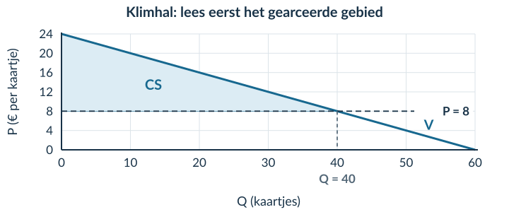<figcaption>Figuur 5 · Lees eerst af; controleer daarna met de functie.</figcaption></figure>

a) Lees Q af. Vul in: 8 = 24 − 0,4Q → Q = … kaartjes.

b) Noteer basis en hoogte van het blauwe gebied. Bereken CS.

c) Leg uit waarom je de rechthoek onder P = 8 niet meetelt bij CS.

**Opgave 4 · Zelf lijnen en een gebied toevoegen**

Voor een museumavond geldt **P = 18 − 0,3Q**. P is in euro per kaartje. De prijs is € 6. Alle gevraagde kaartjes worden verkocht aan de vragers met de hoogste betalingsbereidheid.

a) Bereken de gevraagde hoeveelheid. Begin met 6 = 18 − 0,3Q.

b) Teken in het assenstelsel de vraaglijn en P = 6. Gebruik de twee assensnijpunten om de vraaglijn te tekenen.

<figure><figcaption>Figuur 6 · De assen en schaal zijn gegeven. De lijnen, snijpunten en arcering maak je zelf.</figcaption></figure>

c) Arceer en benoem CS. Bereken het met basis, hoogte en eenheid.

d) Leg uit wat het berekende bedrag voor alle kopers samen betekent.

**Opgave 5 · Zonder tekenhulp**

Een rechte vraaglijn voor fotoprints snijdt de verticale as bij € 17. Bij een prijs van € 5 worden 30 prints gevraagd en verkocht. Er is genoeg aanbod.

a) Bereken CS zonder eerst een volledige grafiek te tekenen.

b) Leg uit waarom de hoogte van het gebied € 12 per print is en niet € 5 per print.

## Zelfstandige oefening

**Opgave 6 · Zwemkaartjes**

Voor zwemkaartjes geldt **P = 18 − 0,2Q**. P is in euro per kaartje, Q is in kaartjes. Bij de gegeven prijs van € 8 worden alle gevraagde kaartjes verkocht aan de vragers met de hoogste betalingsbereidheid.

a) Bereken de gevraagde hoeveelheid.

b) Teken de vraaglijn en de prijslijn in je schrift. Benoem de assen met grootheid en eenheid. Noteer beide assensnijpunten en het snijpunt met de prijslijn.

c) Arceer en benoem het consumentensurplus.

d) Bereken het consumentensurplus met basis, hoogte en eenheid.

e) Leg de uitkomst uit voor de kopers als groep.

**Opgave 7 · Een boekenbeurs**

Voor toegangsbewijzen geldt **P = 16 − 0,1Q**. P is in euro per toegangsbewijs. De gegeven prijs is € 6. Alle gevraagde toegangsbewijzen worden verkocht.

a) Bereken Q en CS.

b) De organisatie berekent een omzet van € 600. Een leerling zegt: ‘Dan is het voordeel voor de kopers samen ook € 600.’ Beoordeel deze uitspraak met je berekening.

c) Kun je Q in deze opgave een berekende evenwichtshoeveelheid noemen? Licht toe.

<b>Controleer vóór je verdergaat</b> Staan Q en P op de juiste assen? Begint je CS-gebied bij de prijslijn, niet bij nul? Heb je het bedrag voor alle kopers uitgelegd in plaats van alleen een formule opgeschreven?

## Doeloefening

**Opgave 8 · Concertkaartjes**

Voor concertkaartjes geldt de vraagfunctie P=50−0,5Q. P is de prijs in euro per kaartje en Q het aantal gevraagde kaartjes. De gegeven marktprijs is €20. Er zijn voldoende kaartjes beschikbaar; alle bij deze prijs gevraagde kaartjes worden verkocht aan de vragers met de hoogste betalingsbereidheid. Er is in deze opgave geen aanbodfunctie.

a) Bereken de gevraagde hoeveelheid bij P=€20. Noem dit niet de evenwichtshoeveelheid.

b) Teken de vraaglijn en de horizontale prijslijn in één assenstelsel. Benoem de horizontale as als Q (kaartjes) en de verticale as als P (€ per kaartje). Noteer de snijpunten van de vraaglijn en het snijpunt met de prijslijn.

c) Arceer en benoem in je grafiek het consumentensurplus.

d) Bereken het consumentensurplus als oppervlakte van een driehoek en noteer de eenheid.

e) Leg uit wat het berekende consumentensurplus voor de kopers als groep betekent.

## Denkertje / Bonusopgave

**Opgave 9 · Een formule die toevallig klopt**

Bij het uitgewerkte voorbeeld geeft ½ × Q × P dezelfde uitkomst als de juiste CS-berekening. Een leerling denkt daarom dat dit altijd de formule is. Bedenk een tegenvoorbeeld met een rechte vraaglijn. Leg uit waarom de goede uitkomst in het voorbeeld toeval is.

## Herhaling / Herhaling en interleaving

**Opgave 10 · Procenten (§1.1.2)**

Het bezoek stijgt van 400 naar 460. Bereken de procentuele stijging.

**Opgave 11 · Kosten per product (§2.1.1)**

TK = 200 + 3Q. Bereken bij Q = 100 de totale kosten en gemiddelde totale kosten. Noteer de eenheden: Q is in producten en TK in euro.

<!-- Native reconstruction of accepted physical page 82; see the revision provenance. -->
<article class="native-theory" data-accepted-page="82">
<svg aria-hidden="true" class="native-decoration" style="left:53.3583pt;top:77.7636pt;width:488.5591pt;height:2.1pt" viewbox="53.3583 77.7636 488.5591 2.1"><path d="M 53.8583 51.0236 H 541.4174 V 78.2636 H 53.8583 Z M 53.8583 51.0236 H 541.4174 V 79.3636 H 53.8583 Z" fill="#007da2" fill-rule="evenodd" stroke="none" stroke-width="0"></path></svg>
<svg aria-hidden="true" class="native-decoration" style="left:53.3583pt;top:102.7036pt;width:488.5591pt;height:1.5pt" viewbox="53.3583 102.7036 488.5591 1.5"><path d="M 53.8583 85.3636 H 541.4174 V 103.2036 H 53.8583 Z M 53.8583 85.3636 H 541.4174 V 103.7036 H 53.8583 Z" fill="#cedfe6" fill-rule="evenodd" stroke="none" stroke-width="0"></path></svg>
<svg aria-hidden="true" class="native-decoration" style="left:53.3583pt;top:147.2376pt;width:488.5591pt;height:75.203pt" viewbox="53.3583 147.2376 488.5591 75.203"><path d="M 53.8583 147.7376 H 541.4174 V 221.9406 H 53.8583 Z" fill="#f1f5f7" fill-rule="nonzero" stroke="none" stroke-width="0"></path></svg>
<svg aria-hidden="true" class="native-decoration" style="left:53.3583pt;top:147.2376pt;width:3pt;height:75.203pt" viewbox="53.3583 147.2376 3 75.203"><path d="M 55.8583 147.7376 H 541.4174 V 221.9406 H 55.8583 Z M 53.8583 147.7376 H 541.4174 V 221.9406 H 53.8583 Z" fill="#8ba5b2" fill-rule="evenodd" stroke="none" stroke-width="0"></path></svg>
<svg aria-hidden="true" class="native-decoration" style="left:53.3583pt;top:227.4406pt;width:488.5591pt;height:90.803pt" viewbox="53.3583 227.4406 488.5591 90.803"><path d="M 53.8583 227.9406 H 541.4174 V 317.7436 H 53.8583 Z" fill="#edf5f2" fill-rule="nonzero" stroke="none" stroke-width="0"></path></svg>
<svg aria-hidden="true" class="native-decoration" style="left:53.3583pt;top:227.4406pt;width:3pt;height:90.803pt" viewbox="53.3583 227.4406 3 90.803"><path d="M 55.8583 227.9406 H 541.4174 V 317.7436 H 55.8583 Z M 53.8583 227.9406 H 541.4174 V 317.7436 H 53.8583 Z" fill="#008779" fill-rule="evenodd" stroke="none" stroke-width="0"></path></svg>
<svg aria-hidden="true" class="native-decoration" style="left:53.3583pt;top:323.2436pt;width:242.2795pt;height:71.309pt" viewbox="53.3583 323.2436 242.2795 71.309"><path d="M 53.8583 323.7436 H 295.1378 V 394.0526 H 53.8583 Z" fill="#eaf4f8" fill-rule="nonzero" stroke="none" stroke-width="0"></path></svg>
<svg aria-hidden="true" class="native-decoration" style="left:299.6378pt;top:323.2436pt;width:242.2796pt;height:71.309pt" viewbox="299.6378 323.2436 242.2796 71.309"><path d="M 300.1378 323.7436 H 541.4174 V 394.0526 H 300.1378 Z" fill="#edf5f2" fill-rule="nonzero" stroke="none" stroke-width="0"></path></svg>
<svg aria-hidden="true" class="native-decoration" style="left:53.3583pt;top:323.2436pt;width:3pt;height:71.309pt" viewbox="53.3583 323.2436 3 71.309"><path d="M 55.8583 323.7436 H 295.1378 V 394.0526 H 55.8583 Z M 53.8583 323.7436 H 295.1378 V 394.0526 H 53.8583 Z" fill="#007da2" fill-rule="evenodd" stroke="none" stroke-width="0"></path></svg>
<svg aria-hidden="true" class="native-decoration" style="left:299.6378pt;top:323.2436pt;width:3pt;height:71.309pt" viewbox="299.6378 323.2436 3 71.309"><path d="M 302.1378 323.7436 H 541.4174 V 394.0526 H 302.1378 Z M 300.1378 323.7436 H 541.4174 V 394.0526 H 300.1378 Z" fill="#008779" fill-rule="evenodd" stroke="none" stroke-width="0"></path></svg>
<svg aria-hidden="true" class="native-decoration" style="left:53.3583pt;top:592.7622pt;width:488.5591pt;height:42.22pt" viewbox="53.3583 592.7622 488.5591 42.22"><path d="M 53.8583 593.2622 H 541.4174 V 634.4822 H 53.8583 Z" fill="#faf2e8" fill-rule="nonzero" stroke="none" stroke-width="0"></path></svg>
<svg aria-hidden="true" class="native-decoration" style="left:101.9442pt;top:85.8636pt;width:1.5pt;height:10.84pt" viewbox="101.9442 85.8636 1.5 10.84"><path d="M 53.8583 86.3636 H 102.4442 V 96.2036 H 53.8583 Z M 53.8583 86.3636 H 102.9442 V 96.2036 H 53.8583 Z" fill="#bed5df" fill-rule="evenodd" stroke="none" stroke-width="0"></path></svg>
<svg aria-hidden="true" class="native-decoration" style="left:185.5844pt;top:85.8636pt;width:1.5pt;height:10.84pt" viewbox="185.5844 85.8636 1.5 10.84"><path d="M 102.9442 86.3636 H 186.0844 V 96.2036 H 102.9442 Z M 102.9442 86.3636 H 186.5843 V 96.2036 H 102.9442 Z" fill="#bed5df" fill-rule="evenodd" stroke="none" stroke-width="0"></path></svg>
<h1 class="native-text" data-layout-height="24.1192" data-layout-width="412.5196" style="left:53.8583pt;top:50.5842pt;line-height:21.1192pt">2.3.2 · Producentensurplus: voordeel voor verkopers</h1>

PS · 10–11

Totaal surplus · 12

Voorbeeld · 13–14

Een koper heeft € 50 over voor een drinkfles en betaalt € 35. De marginale kosten van de fles zijn € 20. De koper heeft voordeel, maar de verkoper ook.

Lesdoelen

Je kunt het marktevenwicht en CS, PS en TS berekenen en markeren. Je kunt de aanbodlijn binnen het gegeven model als MK-lijn lezen en uitleggen waarom TS bij het evenwicht maximaal is, zonder daaruit eerlijkheid af te leiden.

Producentensurplus (PS)

De ontvangen prijs min de marginale kosten, opgeteld over de verkochte producten.

Bij deze fles: PS = 35 − 20 = € 15

MK zijn de extra kosten van het extra product. Voor deze fles ontvangt de verkoper € 15 meer dan die kosten.

Voordeel voor de koper

Voordeel voor de verkoper

CS = 50 − 35 = € 15

PS = 35 − 20 = € 15

Betalingsbereidheid min betaalde prijs.

Ontvangen prijs min marginale kosten.

Eén drinkfles

<figure class="native-figure" style="left:54pt;top:427.0425pt;width:491.2756pt;height:85.7448pt">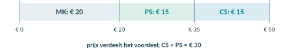<figcaption class="native-text" data-layout-height="13.0195" data-layout-width="396.6172" style="left:-0.1417pt;top:88.7448pt;line-height:10.0195pt">Figuur 1. De prijs verdeelt het voordeel tussen koper en verkoper. Samen is het voordeel € 50 − € 20 = € 30.</figcaption></figure>
<h2 class="native-text" data-layout-height="17.7595" data-layout-width="264.1197" style="left:53.8583pt;top:537.284pt;line-height:14.7595pt">Waarom is producentensurplus nog geen winst?</h2>

Bij PS vergelijk je de opbrengst met de kosten van de extra productie. De vaste kosten moeten óók nog worden betaald. Daarom mag je PS niet zonder meer winst noemen.

Drie verschillende begrippen. Omzet is wat de verkoop oplevert. PS is het voordeel boven de marginale productiekosten. Voor winst trek je alle kosten af, inclusief de constante kosten.

</article>

<!-- Native reconstruction of accepted physical page 83; see the revision provenance. -->
<article class="native-theory" data-accepted-page="83">
<svg aria-hidden="true" class="native-decoration" style="left:53.3583pt;top:77.7636pt;width:488.5591pt;height:2.1pt" viewbox="53.3583 77.7636 488.5591 2.1"><path d="M 53.8583 51.0236 H 541.4174 V 78.2636 H 53.8583 Z M 53.8583 51.0236 H 541.4174 V 79.3636 H 53.8583 Z" fill="#007da2" fill-rule="evenodd" stroke="none" stroke-width="0"></path></svg>
<svg aria-hidden="true" class="native-decoration" style="left:53.3583pt;top:102.7036pt;width:488.5591pt;height:1.5pt" viewbox="53.3583 102.7036 488.5591 1.5"><path d="M 53.8583 85.3636 H 541.4174 V 103.2036 H 53.8583 Z M 53.8583 85.3636 H 541.4174 V 103.7036 H 53.8583 Z" fill="#cedfe6" fill-rule="evenodd" stroke="none" stroke-width="0"></path></svg>
<svg aria-hidden="true" class="native-decoration" style="left:53.3583pt;top:147.2376pt;width:488.5591pt;height:93.716pt" viewbox="53.3583 147.2376 488.5591 93.716"><path d="M 53.8583 147.7376 H 541.4174 V 240.4536 H 53.8583 Z" fill="#edf5f2" fill-rule="nonzero" stroke="none" stroke-width="0"></path></svg>
<svg aria-hidden="true" class="native-decoration" style="left:53.3583pt;top:147.2376pt;width:3pt;height:93.716pt" viewbox="53.3583 147.2376 3 93.716"><path d="M 55.8583 147.7376 H 541.4174 V 240.4536 H 55.8583 Z M 53.8583 147.7376 H 541.4174 V 240.4536 H 53.8583 Z" fill="#008779" fill-rule="evenodd" stroke="none" stroke-width="0"></path></svg>
<svg aria-hidden="true" class="native-decoration" style="left:53.3583pt;top:538.4163pt;width:242.2795pt;height:99.369pt" viewbox="53.3583 538.4163 242.2795 99.369"><path d="M 53.8583 538.9163 H 295.1378 V 637.2853 H 53.8583 Z" fill="#f1f5f7" fill-rule="nonzero" stroke="none" stroke-width="0"></path></svg>
<svg aria-hidden="true" class="native-decoration" style="left:299.6378pt;top:538.4163pt;width:242.2796pt;height:99.369pt" viewbox="299.6378 538.4163 242.2796 99.369"><path d="M 300.1378 538.9163 H 541.4174 V 637.2853 H 300.1378 Z" fill="#edf5f2" fill-rule="nonzero" stroke="none" stroke-width="0"></path></svg>
<svg aria-hidden="true" class="native-decoration" style="left:53.3583pt;top:538.4163pt;width:3pt;height:99.369pt" viewbox="53.3583 538.4163 3 99.369"><path d="M 55.8583 538.9163 H 295.1378 V 637.2853 H 55.8583 Z M 53.8583 538.9163 H 295.1378 V 637.2853 H 53.8583 Z" fill="#8ba5b2" fill-rule="evenodd" stroke="none" stroke-width="0"></path></svg>
<svg aria-hidden="true" class="native-decoration" style="left:299.6378pt;top:538.4163pt;width:3pt;height:99.369pt" viewbox="299.6378 538.4163 3 99.369"><path d="M 302.1378 538.9163 H 541.4174 V 637.2853 H 302.1378 Z M 300.1378 538.9163 H 541.4174 V 637.2853 H 300.1378 Z" fill="#008779" fill-rule="evenodd" stroke="none" stroke-width="0"></path></svg>
<svg aria-hidden="true" class="native-decoration" style="left:53.3583pt;top:644.7853pt;width:488.5591pt;height:42.22pt" viewbox="53.3583 644.7853 488.5591 42.22"><path d="M 53.8583 645.2853 H 541.4174 V 686.5053 H 53.8583 Z" fill="#faf2e8" fill-rule="nonzero" stroke="none" stroke-width="0"></path></svg>
<svg aria-hidden="true" class="native-decoration" style="left:101.9442pt;top:85.8636pt;width:1.5pt;height:10.84pt" viewbox="101.9442 85.8636 1.5 10.84"><path d="M 53.8583 86.3636 H 102.4442 V 96.2036 H 53.8583 Z M 53.8583 86.3636 H 102.9442 V 96.2036 H 53.8583 Z" fill="#bed5df" fill-rule="evenodd" stroke="none" stroke-width="0"></path></svg>
<svg aria-hidden="true" class="native-decoration" style="left:185.5844pt;top:85.8636pt;width:1.5pt;height:10.84pt" viewbox="185.5844 85.8636 1.5 10.84"><path d="M 102.9442 86.3636 H 186.0844 V 96.2036 H 102.9442 Z M 102.9442 86.3636 H 186.5843 V 96.2036 H 102.9442 Z" fill="#bed5df" fill-rule="evenodd" stroke="none" stroke-width="0"></path></svg>
<h1 class="native-text" data-layout-height="24.1192" data-layout-width="332.2138" style="left:53.8583pt;top:50.5842pt;line-height:21.1192pt">2.3.2 · PS in de grafiek: tussen prijs en MK</h1>

PS · 10–11

Totaal surplus · 12

Voorbeeld · 13–14

Op de postermarkt geldt vraag P = 40 − Q en aanbod P = 10 + 0,5Q. P is in euro per poster; Q is in posters. In dit model geeft de aanbodlijn voor Q van 0 tot 40 ook de marginale kosten weer.

De aanbodlijn als MK-lijn lezen

Het model rangschikt eenheden van lage naar hoge marginale kosten. Verder naar rechts is een extra poster duurder te leveren.

Bij Q = 10: MK = 10 + 0,5 × 10 = € 15 per poster. Bij Q = 20: MK = 10 + 0,5 × 20 = € 20 per poster.

<h2 class="native-text" data-layout-height="17.7595" data-layout-width="268.0187" style="left:53.8583pt;top:251.6385pt;line-height:14.7595pt">Het surplus hoort alleen bij de verkochte posters</h2>

Bij P = € 20 worden 20 posters aangeboden. Deze worden ook verkocht, door de aanbieders met de laagste MK. Het PS ligt onder de prijs en boven A = MK, tot Q = 20.

<figure class="native-figure" style="left:54pt;top:319pt;width:491.2756pt;height:198.6044pt">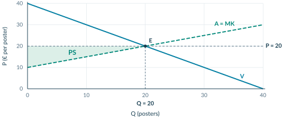<figcaption class="native-text" data-layout-height="13.0195" data-layout-width="402.8543" style="left:-0.1417pt;top:201.6044pt;line-height:10.0195pt">Figuur 2. Het groene gebied is PS. De hele rechthoek P × Q is omzet; die mag je niet volledig als PS meetellen.</figcaption></figure>

Kies basis en hoogte

Bereken PS

Basis: 20 posters. Hoogte: prijs min het beginpunt van de MK-lijn = 20 − 10 = € 10 per poster.

PS = ½ × basis × hoogte

= ½ × 20 × (20 − 10)

= € 100

Let op de modelaanname. Hier geldt A = MK. Het gebied onder de MK-lijn hoort bij de variabele productiekosten, niet bij PS. De constante kosten zijn daarmee nog niet afgetrokken.

</article>

<!-- Native reconstruction of accepted physical page 84; see the revision provenance. -->
<article class="native-theory" data-accepted-page="84">
<svg aria-hidden="true" class="native-decoration" style="left:53.3583pt;top:77.7636pt;width:488.5591pt;height:2.1pt" viewbox="53.3583 77.7636 488.5591 2.1"><path d="M 53.8583 51.0236 H 541.4174 V 78.2636 H 53.8583 Z M 53.8583 51.0236 H 541.4174 V 79.3636 H 53.8583 Z" fill="#007da2" fill-rule="evenodd" stroke="none" stroke-width="0"></path></svg>
<svg aria-hidden="true" class="native-decoration" style="left:53.3583pt;top:102.7036pt;width:488.5591pt;height:1.5pt" viewbox="53.3583 102.7036 488.5591 1.5"><path d="M 53.8583 85.3636 H 541.4174 V 103.2036 H 53.8583 Z M 53.8583 85.3636 H 541.4174 V 103.7036 H 53.8583 Z" fill="#cedfe6" fill-rule="evenodd" stroke="none" stroke-width="0"></path></svg>
<svg aria-hidden="true" class="native-decoration" style="left:53.3583pt;top:113.2036pt;width:22pt;height:22pt" viewbox="53.3583 113.2036 22 22"><path d="M 53.8583 113.7036 H 74.8583 V 134.7036 H 53.8583 Z" fill="#007da2" fill-rule="nonzero" stroke="none" stroke-width="0"></path></svg>
<svg aria-hidden="true" class="native-decoration" style="left:53.3583pt;top:410.3298pt;width:242.2795pt;height:77.598pt" viewbox="53.3583 410.3298 242.2795 77.598"><path d="M 53.8583 410.8298 H 295.1378 V 487.4278 H 53.8583 Z" fill="#eaf4f8" fill-rule="nonzero" stroke="none" stroke-width="0"></path></svg>
<svg aria-hidden="true" class="native-decoration" style="left:299.6378pt;top:410.3298pt;width:242.2796pt;height:77.598pt" viewbox="299.6378 410.3298 242.2796 77.598"><path d="M 300.1378 410.8298 H 541.4174 V 487.4278 H 300.1378 Z" fill="#edf5f2" fill-rule="nonzero" stroke="none" stroke-width="0"></path></svg>
<svg aria-hidden="true" class="native-decoration" style="left:53.3583pt;top:410.3298pt;width:3pt;height:77.598pt" viewbox="53.3583 410.3298 3 77.598"><path d="M 55.8583 410.8298 H 295.1378 V 487.4278 H 55.8583 Z M 53.8583 410.8298 H 295.1378 V 487.4278 H 53.8583 Z" fill="#007da2" fill-rule="evenodd" stroke="none" stroke-width="0"></path></svg>
<svg aria-hidden="true" class="native-decoration" style="left:299.6378pt;top:410.3298pt;width:3pt;height:77.598pt" viewbox="299.6378 410.3298 3 77.598"><path d="M 302.1378 410.8298 H 541.4174 V 487.4278 H 302.1378 Z M 300.1378 410.8298 H 541.4174 V 487.4278 H 300.1378 Z" fill="#008779" fill-rule="evenodd" stroke="none" stroke-width="0"></path></svg>
<svg aria-hidden="true" class="native-decoration" style="left:53.3583pt;top:492.9278pt;width:488.5591pt;height:68.205pt" viewbox="53.3583 492.9278 488.5591 68.205"><path d="M 53.8583 493.4278 H 541.4174 V 560.6328 H 53.8583 Z" fill="#eaf4f8" fill-rule="nonzero" stroke="none" stroke-width="0"></path></svg>
<svg aria-hidden="true" class="native-decoration" style="left:53.3583pt;top:492.9278pt;width:3pt;height:68.205pt" viewbox="53.3583 492.9278 3 68.205"><path d="M 55.8583 493.4278 H 541.4174 V 560.6328 H 55.8583 Z M 53.8583 493.4278 H 541.4174 V 560.6328 H 53.8583 Z" fill="#007da2" fill-rule="evenodd" stroke="none" stroke-width="0"></path></svg>
<svg aria-hidden="true" class="native-decoration" style="left:53.3583pt;top:590.2618pt;width:49.7559pt;height:21.951pt" viewbox="53.3583 590.2618 49.7559 21.951"><path d="M 53.8583 590.7618 H 102.6142 V 611.7128 H 53.8583 Z" fill="#eaf1f4" fill-rule="nonzero" stroke="none" stroke-width="0"></path></svg>
<svg aria-hidden="true" class="native-decoration" style="left:102.1142pt;top:590.2618pt;width:147.2677pt;height:21.951pt" viewbox="102.1142 590.2618 147.2677 21.951"><path d="M 102.6142 590.7618 H 248.8819 V 611.7128 H 102.6142 Z" fill="#eaf1f4" fill-rule="nonzero" stroke="none" stroke-width="0"></path></svg>
<svg aria-hidden="true" class="native-decoration" style="left:248.3819pt;top:590.2618pt;width:79.0095pt;height:21.951pt" viewbox="248.3819 590.2618 79.0095 21.951"><path d="M 248.8819 590.7618 H 326.8914 V 611.7128 H 248.8819 Z" fill="#eaf1f4" fill-rule="nonzero" stroke="none" stroke-width="0"></path></svg>
<svg aria-hidden="true" class="native-decoration" style="left:326.3914pt;top:590.2618pt;width:215.526pt;height:21.951pt" viewbox="326.3914 590.2618 215.526 21.951"><path d="M 326.8914 590.7618 H 541.4174 V 611.7128 H 326.8914 Z" fill="#eaf1f4" fill-rule="nonzero" stroke="none" stroke-width="0"></path></svg>
<svg aria-hidden="true" class="native-decoration" style="left:53.3583pt;top:632.3888pt;width:49.7559pt;height:22.101pt" viewbox="53.3583 632.3888 49.7559 22.101"><path d="M 53.8583 632.8888 H 102.6142 V 653.9897 H 53.8583 Z" fill="#f6f9fa" fill-rule="nonzero" stroke="none" stroke-width="0"></path></svg>
<svg aria-hidden="true" class="native-decoration" style="left:102.1142pt;top:632.3888pt;width:147.2677pt;height:22.101pt" viewbox="102.1142 632.3888 147.2677 22.101"><path d="M 102.6142 632.8888 H 248.8819 V 653.9897 H 102.6142 Z" fill="#f6f9fa" fill-rule="nonzero" stroke="none" stroke-width="0"></path></svg>
<svg aria-hidden="true" class="native-decoration" style="left:248.3819pt;top:632.3888pt;width:79.0095pt;height:22.101pt" viewbox="248.3819 632.3888 79.0095 22.101"><path d="M 248.8819 632.8888 H 326.8914 V 653.9897 H 248.8819 Z" fill="#f6f9fa" fill-rule="nonzero" stroke="none" stroke-width="0"></path></svg>
<svg aria-hidden="true" class="native-decoration" style="left:326.3914pt;top:632.3888pt;width:215.526pt;height:22.101pt" viewbox="326.3914 632.3888 215.526 22.101"><path d="M 326.8914 632.8888 H 541.4174 V 653.9897 H 326.8914 Z" fill="#f6f9fa" fill-rule="nonzero" stroke="none" stroke-width="0"></path></svg>
<svg aria-hidden="true" class="native-decoration" style="left:53.3583pt;top:632.3888pt;width:49.7559pt;height:1pt" viewbox="53.3583 632.3888 49.7559 1"><path d="M 53.8583 632.8888 L 102.6142 632.8888" fill="none" fill-rule="nonzero" stroke="#dce5e9" stroke-width="0.45000001788139343"></path></svg>
<svg aria-hidden="true" class="native-decoration" style="left:102.1142pt;top:632.3888pt;width:147.2677pt;height:1pt" viewbox="102.1142 632.3888 147.2677 1"><path d="M 102.6142 632.8888 L 248.8819 632.8888" fill="none" fill-rule="nonzero" stroke="#dce5e9" stroke-width="0.45000001788139343"></path></svg>
<svg aria-hidden="true" class="native-decoration" style="left:248.3819pt;top:632.3888pt;width:79.0095pt;height:1pt" viewbox="248.3819 632.3888 79.0095 1"><path d="M 248.8819 632.8888 L 326.8914 632.8888" fill="none" fill-rule="nonzero" stroke="#dce5e9" stroke-width="0.45000001788139343"></path></svg>
<svg aria-hidden="true" class="native-decoration" style="left:326.3914pt;top:632.3888pt;width:215.526pt;height:1pt" viewbox="326.3914 632.3888 215.526 1"><path d="M 326.8914 632.8888 L 541.4174 632.8888" fill="none" fill-rule="nonzero" stroke="#dce5e9" stroke-width="0.45000001788139343"></path></svg>
<svg aria-hidden="true" class="native-decoration" style="left:53.3583pt;top:653.4897pt;width:49.7559pt;height:1pt" viewbox="53.3583 653.4897 49.7559 1"><path d="M 53.8583 653.9897 L 102.6142 653.9897" fill="none" fill-rule="nonzero" stroke="#dce5e9" stroke-width="0.45000001788139343"></path></svg>
<svg aria-hidden="true" class="native-decoration" style="left:102.1142pt;top:653.4897pt;width:147.2677pt;height:1pt" viewbox="102.1142 653.4897 147.2677 1"><path d="M 102.6142 653.9897 L 248.8819 653.9897" fill="none" fill-rule="nonzero" stroke="#dce5e9" stroke-width="0.45000001788139343"></path></svg>
<svg aria-hidden="true" class="native-decoration" style="left:248.3819pt;top:653.4897pt;width:79.0095pt;height:1pt" viewbox="248.3819 653.4897 79.0095 1"><path d="M 248.8819 653.9897 L 326.8914 653.9897" fill="none" fill-rule="nonzero" stroke="#dce5e9" stroke-width="0.45000001788139343"></path></svg>
<svg aria-hidden="true" class="native-decoration" style="left:326.3914pt;top:653.4897pt;width:215.526pt;height:1pt" viewbox="326.3914 653.4897 215.526 1"><path d="M 326.8914 653.9897 L 541.4174 653.9897" fill="none" fill-rule="nonzero" stroke="#dce5e9" stroke-width="0.45000001788139343"></path></svg>
<svg aria-hidden="true" class="native-decoration" style="left:53.3583pt;top:674.5908pt;width:49.7559pt;height:1pt" viewbox="53.3583 674.5908 49.7559 1"><path d="M 53.8583 675.0908 L 102.6142 675.0908" fill="none" fill-rule="nonzero" stroke="#dce5e9" stroke-width="0.45000001788139343"></path></svg>
<svg aria-hidden="true" class="native-decoration" style="left:102.1142pt;top:674.5908pt;width:147.2677pt;height:1pt" viewbox="102.1142 674.5908 147.2677 1"><path d="M 102.6142 675.0908 L 248.8819 675.0908" fill="none" fill-rule="nonzero" stroke="#dce5e9" stroke-width="0.45000001788139343"></path></svg>
<svg aria-hidden="true" class="native-decoration" style="left:248.3819pt;top:674.5908pt;width:79.0095pt;height:1pt" viewbox="248.3819 674.5908 79.0095 1"><path d="M 248.8819 675.0908 L 326.8914 675.0908" fill="none" fill-rule="nonzero" stroke="#dce5e9" stroke-width="0.45000001788139343"></path></svg>
<svg aria-hidden="true" class="native-decoration" style="left:326.3914pt;top:674.5908pt;width:215.526pt;height:1pt" viewbox="326.3914 674.5908 215.526 1"><path d="M 326.8914 675.0908 L 541.4174 675.0908" fill="none" fill-rule="nonzero" stroke="#dce5e9" stroke-width="0.45000001788139343"></path></svg>
<svg aria-hidden="true" class="native-decoration" style="left:53.2583pt;top:611.1128pt;width:49.9559pt;height:1.2pt" viewbox="53.2583 611.1128 49.9559 1.2"><path d="M 53.8583 611.7128 L 102.6142 611.7128" fill="none" fill-rule="nonzero" stroke="#cbdbe2" stroke-width="0.6000000238418579"></path></svg>
<svg aria-hidden="true" class="native-decoration" style="left:102.0142pt;top:611.1128pt;width:147.4677pt;height:1.2pt" viewbox="102.0142 611.1128 147.4677 1.2"><path d="M 102.6142 611.7128 L 248.8819 611.7128" fill="none" fill-rule="nonzero" stroke="#cbdbe2" stroke-width="0.6000000238418579"></path></svg>
<svg aria-hidden="true" class="native-decoration" style="left:248.2819pt;top:611.1128pt;width:79.2095pt;height:1.2pt" viewbox="248.2819 611.1128 79.2095 1.2"><path d="M 248.8819 611.7128 L 326.8914 611.7128" fill="none" fill-rule="nonzero" stroke="#cbdbe2" stroke-width="0.6000000238418579"></path></svg>
<svg aria-hidden="true" class="native-decoration" style="left:326.2914pt;top:611.1128pt;width:215.726pt;height:1.2pt" viewbox="326.2914 611.1128 215.726 1.2"><path d="M 326.8914 611.7128 L 541.4174 611.7128" fill="none" fill-rule="nonzero" stroke="#cbdbe2" stroke-width="0.6000000238418579"></path></svg>
<svg aria-hidden="true" class="native-decoration" style="left:53.3583pt;top:715.8418pt;width:488.5591pt;height:42.22pt" viewbox="53.3583 715.8418 488.5591 42.22"><path d="M 53.8583 716.3418 H 541.4174 V 757.5618 H 53.8583 Z" fill="#faf2e8" fill-rule="nonzero" stroke="none" stroke-width="0"></path></svg>
<svg aria-hidden="true" class="native-decoration" style="left:101.8387pt;top:85.8636pt;width:1.5pt;height:10.84pt" viewbox="101.8387 85.8636 1.5 10.84"><path d="M 53.8583 86.3636 H 102.3387 V 96.2036 H 53.8583 Z M 53.8583 86.3636 H 102.8387 V 96.2036 H 53.8583 Z" fill="#bed5df" fill-rule="evenodd" stroke="none" stroke-width="0"></path></svg>
<svg aria-hidden="true" class="native-decoration" style="left:186.2574pt;top:85.8636pt;width:1.5pt;height:10.84pt" viewbox="186.2574 85.8636 1.5 10.84"><path d="M 102.8387 86.3636 H 186.7574 V 96.2036 H 102.8387 Z M 102.8387 86.3636 H 187.2574 V 96.2036 H 102.8387 Z" fill="#bed5df" fill-rule="evenodd" stroke="none" stroke-width="0"></path></svg>
<h1 class="native-text" data-layout-height="24.1192" data-layout-width="338.3735" style="left:53.8583pt;top:50.5842pt;line-height:21.1192pt">2.3.2 · Totaal surplus: gezamenlijk voordeel</h1>

PS · 10–11

Totaal surplus · 12

Voorbeeld · 13–14

1

<h2 class="native-text" data-layout-height="17.7595" data-layout-width="191.7491" style="left:83.8583pt;top:121.8885pt;line-height:14.7595pt">Bereken eerst het marktevenwicht</h2>

Posters: vraag P = 40 − Q; aanbod/MK P = 10 + 0,5Q.

<h2 class="native-text" data-layout-height="18.8396" data-layout-width="182.2124" style="left:53.8583pt;top:163.4438pt;line-height:15.8396pt">40 − Q = 10 + 0,5Q → Qe = 20</h2>

Pe = 40 − 20 = € 20 per poster. In het vrije evenwicht worden 20 posters verhandeld.

<figure class="native-figure" style="left:54pt;top:219pt;width:491.2756pt;height:170.5179pt">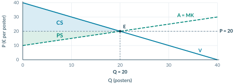<figcaption class="native-text" data-layout-height="13.0195" data-layout-width="418.9106" style="left:-0.1417pt;top:173.5179pt;line-height:10.0195pt">Figuur 3. CS ligt boven de prijs, PS eronder. Samen vormen ze het gebied tussen de vraaglijn en de MK-lijn, tot Qe.</figcaption></figure>

Consumentensurplus

Producentensurplus

<h2 class="native-text" data-layout-height="18.8396" data-layout-width="138.1122" style="left:64.8583pt;top:436.9659pt;line-height:15.8396pt">CS = ½ × 20 × (40 − 20)</h2>
<h2 class="native-text" data-layout-height="18.8396" data-layout-width="137.5578" style="left:311.1378pt;top:436.9659pt;line-height:15.8396pt">PS = ½ × 20 × (20 − 10)</h2>

= € 200

= € 100

Totaal surplus (TS)

<h2 class="native-text" data-layout-height="18.8396" data-layout-width="199.6228" style="left:64.8583pt;top:519.6859pt;line-height:15.8396pt">TS = CS + PS = 200 + 100 = € 300</h2>

Het gezamenlijke voordeel van kopers én verkopers.

<h2 class="native-text" data-layout-height="17.7595" data-layout-width="258.8801" style="left:53.8583pt;top:568.8176pt;line-height:14.7595pt">Waarom is TS hier maximaal bij het evenwicht?</h2>
<table aria-label="Tabel bij Hoe groot is het gezamenlijke voordeel?" class="native-table" style="left:53.8583pt;top:590.76pt;width:487.5591pt;height:84.33pt"><tbody>
<tr>
<th scope="col" style="left:0pt;top:0pt;width:48.7559pt;height:20.95pt">

Q

</th>
<th scope="col" style="left:48.7559pt;top:0pt;width:146.2677pt;height:20.95pt">

Betalingsbereidheid

</th>
<th scope="col" style="left:195.0236pt;top:0pt;width:78.0095pt;height:20.95pt">

MK

</th>
<th scope="col" style="left:273.0331pt;top:0pt;width:214.526pt;height:20.95pt">

Bijdrage van extra handel

</th>
</tr>
<tr>
<td style="left:0pt;top:20.95pt;width:48.7559pt;height:21.18pt">

10

</td>
<td style="left:48.7559pt;top:20.95pt;width:146.2677pt;height:21.18pt">

€ 30

</td>
<td style="left:195.0236pt;top:20.95pt;width:78.0095pt;height:21.18pt">

€ 15

</td>
<td style="left:273.0331pt;top:20.95pt;width:214.526pt;height:21.18pt">

+€ 15: voordelig.

</td>
</tr>
<tr>
<td style="left:0pt;top:42.13pt;width:48.7559pt;height:21.1pt">

20

</td>
<td style="left:48.7559pt;top:42.13pt;width:146.2677pt;height:21.1pt">

€ 20

</td>
<td style="left:195.0236pt;top:42.13pt;width:78.0095pt;height:21.1pt">

€ 20

</td>
<td style="left:273.0331pt;top:42.13pt;width:214.526pt;height:21.1pt">

€ 0: op de grens.

</td>
</tr>
<tr>
<td style="left:0pt;top:63.23pt;width:48.7559pt;height:21.1pt">

30

</td>
<td style="left:48.7559pt;top:63.23pt;width:146.2677pt;height:21.1pt">

€ 10

</td>
<td style="left:195.0236pt;top:63.23pt;width:78.0095pt;height:21.1pt">

€ 25

</td>
<td style="left:273.0331pt;top:63.23pt;width:214.526pt;height:21.1pt">

−€ 15: nadelig.

</td>
</tr>
</tbody></table>

Links van Qe levert extra handel gezamenlijk voordeel op: betalingsbereidheid &gt; MK. Rechts ervan zijn de MK hoger. Daarom is TS maximaal bij Q = 20.

Binnen dit model. Extra handelskosten en gevolgen voor anderen blijven buiten beeld. Maximaal TS is geen bewijs van een eerlijke verdeling.

</article>

<!-- Native reconstruction of accepted physical page 85; see the revision provenance. -->
<article class="native-theory" data-accepted-page="85">
<svg aria-hidden="true" class="native-decoration" style="left:53.3583pt;top:77.7636pt;width:488.5591pt;height:2.1pt" viewbox="53.3583 77.7636 488.5591 2.1"><path d="M 53.8583 51.0236 H 541.4174 V 78.2636 H 53.8583 Z M 53.8583 51.0236 H 541.4174 V 79.3636 H 53.8583 Z" fill="#007da2" fill-rule="evenodd" stroke="none" stroke-width="0"></path></svg>
<svg aria-hidden="true" class="native-decoration" style="left:53.3583pt;top:102.7036pt;width:488.5591pt;height:1.5pt" viewbox="53.3583 102.7036 488.5591 1.5"><path d="M 53.8583 85.3636 H 541.4174 V 103.2036 H 53.8583 Z M 53.8583 85.3636 H 541.4174 V 103.7036 H 53.8583 Z" fill="#cedfe6" fill-rule="evenodd" stroke="none" stroke-width="0"></path></svg>
<svg aria-hidden="true" class="native-decoration" style="left:53.3583pt;top:165.2546pt;width:22pt;height:22pt" viewbox="53.3583 165.2546 22 22"><path d="M 53.8583 165.7546 H 74.8583 V 186.7546 H 53.8583 Z" fill="#007da2" fill-rule="nonzero" stroke="none" stroke-width="0"></path></svg>
<svg aria-hidden="true" class="native-decoration" style="left:53.3583pt;top:192.2546pt;width:488.5591pt;height:91.395pt" viewbox="53.3583 192.2546 488.5591 91.395"><path d="M 53.8583 192.7546 H 541.4174 V 283.1496 H 53.8583 Z" fill="#eaf4f8" fill-rule="nonzero" stroke="none" stroke-width="0"></path></svg>
<svg aria-hidden="true" class="native-decoration" style="left:53.3583pt;top:192.2546pt;width:3pt;height:91.395pt" viewbox="53.3583 192.2546 3 91.395"><path d="M 55.8583 192.7546 H 541.4174 V 283.1496 H 55.8583 Z M 53.8583 192.7546 H 541.4174 V 283.1496 H 53.8583 Z" fill="#007da2" fill-rule="evenodd" stroke="none" stroke-width="0"></path></svg>
<svg aria-hidden="true" class="native-decoration" style="left:53.3583pt;top:292.6496pt;width:22pt;height:22pt" viewbox="53.3583 292.6496 22 22"><path d="M 53.8583 293.1496 H 74.8583 V 314.1496 H 53.8583 Z" fill="#007da2" fill-rule="nonzero" stroke="none" stroke-width="0"></path></svg>
<svg aria-hidden="true" class="native-decoration" style="left:53.3583pt;top:584.9753pt;width:22pt;height:22pt" viewbox="53.3583 584.9753 22 22"><path d="M 53.8583 585.4753 H 74.8583 V 606.4753 H 53.8583 Z" fill="#007da2" fill-rule="nonzero" stroke="none" stroke-width="0"></path></svg>
<svg aria-hidden="true" class="native-decoration" style="left:53.3583pt;top:612.9753pt;width:59.5071pt;height:24.951pt" viewbox="53.3583 612.9753 59.5071 24.951"><path d="M 53.8583 613.4753 H 112.3653 V 637.4263 H 53.8583 Z" fill="#eaf1f4" fill-rule="nonzero" stroke="none" stroke-width="0"></path></svg>
<svg aria-hidden="true" class="native-decoration" style="left:111.8653pt;top:612.9753pt;width:69.2583pt;height:24.951pt" viewbox="111.8653 612.9753 69.2583 24.951"><path d="M 112.3653 613.4753 H 180.6236 V 637.4263 H 112.3653 Z" fill="#eaf1f4" fill-rule="nonzero" stroke="none" stroke-width="0"></path></svg>
<svg aria-hidden="true" class="native-decoration" style="left:180.1236pt;top:612.9753pt;width:147.2677pt;height:24.951pt" viewbox="180.1236 612.9753 147.2677 24.951"><path d="M 180.6236 613.4753 H 326.8913 V 637.4263 H 180.6236 Z" fill="#eaf1f4" fill-rule="nonzero" stroke="none" stroke-width="0"></path></svg>
<svg aria-hidden="true" class="native-decoration" style="left:326.3914pt;top:612.9753pt;width:215.526pt;height:24.951pt" viewbox="326.3914 612.9753 215.526 24.951"><path d="M 326.8914 613.4753 H 541.4174 V 637.4263 H 326.8914 Z" fill="#eaf1f4" fill-rule="nonzero" stroke="none" stroke-width="0"></path></svg>
<svg aria-hidden="true" class="native-decoration" style="left:53.3583pt;top:661.1023pt;width:59.5071pt;height:25.101pt" viewbox="53.3583 661.1023 59.5071 25.101"><path d="M 53.8583 661.6023 H 112.3653 V 685.7032 H 53.8583 Z" fill="#f6f9fa" fill-rule="nonzero" stroke="none" stroke-width="0"></path></svg>
<svg aria-hidden="true" class="native-decoration" style="left:111.8653pt;top:661.1023pt;width:69.2583pt;height:25.101pt" viewbox="111.8653 661.1023 69.2583 25.101"><path d="M 112.3653 661.6023 H 180.6236 V 685.7032 H 112.3653 Z" fill="#f6f9fa" fill-rule="nonzero" stroke="none" stroke-width="0"></path></svg>
<svg aria-hidden="true" class="native-decoration" style="left:180.1236pt;top:661.1023pt;width:147.2677pt;height:25.101pt" viewbox="180.1236 661.1023 147.2677 25.101"><path d="M 180.6236 661.6023 H 326.8913 V 685.7032 H 180.6236 Z" fill="#f6f9fa" fill-rule="nonzero" stroke="none" stroke-width="0"></path></svg>
<svg aria-hidden="true" class="native-decoration" style="left:326.3914pt;top:661.1023pt;width:215.526pt;height:25.101pt" viewbox="326.3914 661.1023 215.526 25.101"><path d="M 326.8914 661.6023 H 541.4174 V 685.7032 H 326.8914 Z" fill="#f6f9fa" fill-rule="nonzero" stroke="none" stroke-width="0"></path></svg>
<svg aria-hidden="true" class="native-decoration" style="left:53.3583pt;top:685.2033pt;width:59.5071pt;height:25.101pt" viewbox="53.3583 685.2033 59.5071 25.101"><path d="M 53.8583 685.7033 H 112.3653 V 709.8043 H 53.8583 Z" fill="#edf5f2" fill-rule="nonzero" stroke="none" stroke-width="0"></path></svg>
<svg aria-hidden="true" class="native-decoration" style="left:111.8653pt;top:685.2033pt;width:69.2583pt;height:25.101pt" viewbox="111.8653 685.2033 69.2583 25.101"><path d="M 112.3653 685.7033 H 180.6236 V 709.8043 H 112.3653 Z" fill="#edf5f2" fill-rule="nonzero" stroke="none" stroke-width="0"></path></svg>
<svg aria-hidden="true" class="native-decoration" style="left:180.1236pt;top:685.2033pt;width:147.2677pt;height:25.101pt" viewbox="180.1236 685.2033 147.2677 25.101"><path d="M 180.6236 685.7033 H 326.8913 V 709.8043 H 180.6236 Z" fill="#edf5f2" fill-rule="nonzero" stroke="none" stroke-width="0"></path></svg>
<svg aria-hidden="true" class="native-decoration" style="left:326.3914pt;top:685.2033pt;width:215.526pt;height:25.101pt" viewbox="326.3914 685.2033 215.526 25.101"><path d="M 326.8914 685.7033 H 541.4174 V 709.8043 H 326.8914 Z" fill="#edf5f2" fill-rule="nonzero" stroke="none" stroke-width="0"></path></svg>
<svg aria-hidden="true" class="native-decoration" style="left:53.3583pt;top:661.1023pt;width:59.5071pt;height:1pt" viewbox="53.3583 661.1023 59.5071 1"><path d="M 53.8583 661.6023 L 112.3653 661.6023" fill="none" fill-rule="nonzero" stroke="#dce5e9" stroke-width="0.45000001788139343"></path></svg>
<svg aria-hidden="true" class="native-decoration" style="left:111.8653pt;top:661.1023pt;width:69.2583pt;height:1pt" viewbox="111.8653 661.1023 69.2583 1"><path d="M 112.3653 661.6023 L 180.6236 661.6023" fill="none" fill-rule="nonzero" stroke="#dce5e9" stroke-width="0.45000001788139343"></path></svg>
<svg aria-hidden="true" class="native-decoration" style="left:180.1236pt;top:661.1023pt;width:147.2677pt;height:1pt" viewbox="180.1236 661.1023 147.2677 1"><path d="M 180.6236 661.6023 L 326.8914 661.6023" fill="none" fill-rule="nonzero" stroke="#dce5e9" stroke-width="0.45000001788139343"></path></svg>
<svg aria-hidden="true" class="native-decoration" style="left:326.3914pt;top:661.1023pt;width:215.526pt;height:1pt" viewbox="326.3914 661.1023 215.526 1"><path d="M 326.8914 661.6023 L 541.4174 661.6023" fill="none" fill-rule="nonzero" stroke="#dce5e9" stroke-width="0.45000001788139343"></path></svg>
<svg aria-hidden="true" class="native-decoration" style="left:53.3583pt;top:685.2033pt;width:59.5071pt;height:1pt" viewbox="53.3583 685.2033 59.5071 1"><path d="M 53.8583 685.7033 L 112.3653 685.7033" fill="none" fill-rule="nonzero" stroke="#dce5e9" stroke-width="0.45000001788139343"></path></svg>
<svg aria-hidden="true" class="native-decoration" style="left:111.8653pt;top:685.2033pt;width:69.2583pt;height:1pt" viewbox="111.8653 685.2033 69.2583 1"><path d="M 112.3653 685.7033 L 180.6236 685.7033" fill="none" fill-rule="nonzero" stroke="#dce5e9" stroke-width="0.45000001788139343"></path></svg>
<svg aria-hidden="true" class="native-decoration" style="left:180.1236pt;top:685.2033pt;width:147.2677pt;height:1pt" viewbox="180.1236 685.2033 147.2677 1"><path d="M 180.6236 685.7033 L 326.8914 685.7033" fill="none" fill-rule="nonzero" stroke="#dce5e9" stroke-width="0.45000001788139343"></path></svg>
<svg aria-hidden="true" class="native-decoration" style="left:326.3914pt;top:685.2033pt;width:215.526pt;height:1pt" viewbox="326.3914 685.2033 215.526 1"><path d="M 326.8914 685.7033 L 541.4174 685.7033" fill="none" fill-rule="nonzero" stroke="#dce5e9" stroke-width="0.45000001788139343"></path></svg>
<svg aria-hidden="true" class="native-decoration" style="left:53.3583pt;top:709.3043pt;width:59.5071pt;height:1pt" viewbox="53.3583 709.3043 59.5071 1"><path d="M 53.8583 709.8043 L 112.3653 709.8043" fill="none" fill-rule="nonzero" stroke="#dce5e9" stroke-width="0.45000001788139343"></path></svg>
<svg aria-hidden="true" class="native-decoration" style="left:111.8653pt;top:709.3043pt;width:69.2583pt;height:1pt" viewbox="111.8653 709.3043 69.2583 1"><path d="M 112.3653 709.8043 L 180.6236 709.8043" fill="none" fill-rule="nonzero" stroke="#dce5e9" stroke-width="0.45000001788139343"></path></svg>
<svg aria-hidden="true" class="native-decoration" style="left:180.1236pt;top:709.3043pt;width:147.2677pt;height:1pt" viewbox="180.1236 709.3043 147.2677 1"><path d="M 180.6236 709.8043 L 326.8914 709.8043" fill="none" fill-rule="nonzero" stroke="#dce5e9" stroke-width="0.45000001788139343"></path></svg>
<svg aria-hidden="true" class="native-decoration" style="left:326.3914pt;top:709.3043pt;width:215.526pt;height:1pt" viewbox="326.3914 709.3043 215.526 1"><path d="M 326.8914 709.8043 L 541.4174 709.8043" fill="none" fill-rule="nonzero" stroke="#dce5e9" stroke-width="0.45000001788139343"></path></svg>
<svg aria-hidden="true" class="native-decoration" style="left:53.2583pt;top:636.8263pt;width:59.7071pt;height:1.2pt" viewbox="53.2583 636.8263 59.7071 1.2"><path d="M 53.8583 637.4263 L 112.3653 637.4263" fill="none" fill-rule="nonzero" stroke="#cbdbe2" stroke-width="0.6000000238418579"></path></svg>
<svg aria-hidden="true" class="native-decoration" style="left:111.7653pt;top:636.8263pt;width:69.4583pt;height:1.2pt" viewbox="111.7653 636.8263 69.4583 1.2"><path d="M 112.3653 637.4263 L 180.6236 637.4263" fill="none" fill-rule="nonzero" stroke="#cbdbe2" stroke-width="0.6000000238418579"></path></svg>
<svg aria-hidden="true" class="native-decoration" style="left:180.0236pt;top:636.8263pt;width:147.4677pt;height:1.2pt" viewbox="180.0236 636.8263 147.4677 1.2"><path d="M 180.6236 637.4263 L 326.8914 637.4263" fill="none" fill-rule="nonzero" stroke="#cbdbe2" stroke-width="0.6000000238418579"></path></svg>
<svg aria-hidden="true" class="native-decoration" style="left:326.2914pt;top:636.8263pt;width:215.726pt;height:1.2pt" viewbox="326.2914 636.8263 215.726 1.2"><path d="M 326.8914 637.4263 L 541.4174 637.4263" fill="none" fill-rule="nonzero" stroke="#cbdbe2" stroke-width="0.6000000238418579"></path></svg>
<svg aria-hidden="true" class="native-decoration" style="left:53.3583pt;top:717.5293pt;width:488.5591pt;height:42.22pt" viewbox="53.3583 717.5293 488.5591 42.22"><path d="M 53.8583 718.0293 H 541.4174 V 759.2493 H 53.8583 Z" fill="#faf2e8" fill-rule="nonzero" stroke="none" stroke-width="0"></path></svg>
<svg aria-hidden="true" class="native-decoration" style="left:101.8387pt;top:85.8636pt;width:1.5pt;height:10.84pt" viewbox="101.8387 85.8636 1.5 10.84"><path d="M 53.8583 86.3636 H 102.3387 V 96.2036 H 53.8583 Z M 53.8583 86.3636 H 102.8387 V 96.2036 H 53.8583 Z" fill="#bed5df" fill-rule="evenodd" stroke="none" stroke-width="0"></path></svg>
<svg aria-hidden="true" class="native-decoration" style="left:185.4789pt;top:85.8636pt;width:1.5pt;height:10.84pt" viewbox="185.4789 85.8636 1.5 10.84"><path d="M 102.8387 86.3636 H 185.9789 V 96.2036 H 102.8387 Z M 102.8387 86.3636 H 186.4789 V 96.2036 H 102.8387 Z" fill="#bed5df" fill-rule="evenodd" stroke="none" stroke-width="0"></path></svg>
<h1 class="native-text" data-layout-height="24.1192" data-layout-width="332.5657" style="left:53.8583pt;top:50.5842pt;line-height:21.1192pt">2.3.2 · Voorbeeld: evenwicht, CS, PS en TS</h1>

PS · 10–11

Totaal surplus · 12

Voorbeeld · 13–14

Op een makersmarkt worden notitieboeken verkocht. Vraag: P = 24 − 0,5Q. Aanbod: P = 4 + 0,5Q. P is in euro per notitieboek; Q in notitieboeken. De aanbodlijn geeft MK weer voor Q van 0 tot 40. We gebruiken het vrije evenwicht.

<h2 class="native-text" data-layout-height="17.7595" data-layout-width="148.0856" style="left:83.8583pt;top:167.9395pt;line-height:14.7595pt">Stel vraag en aanbod gelijk</h2>

1

Evenwicht

24 − 0,5Q = 4 + 0,5Q → Qe = 20

Pe = 24 − 0,5 × 20 = € 14

20 notitieboeken tegen € 14 per notitieboek.

<h2 class="native-text" data-layout-height="17.7595" data-layout-width="215.6348" style="left:83.8583pt;top:295.3345pt;line-height:14.7595pt">Markeer het evenwicht en de gebieden</h2>

2

E ligt bij (20; 14). Arceer CS boven P = 14 en onder V. Arceer PS onder P = 14 en boven A = MK. Stop beide gebieden bij Q = 20.

<figure class="native-figure" style="left:54pt;top:357pt;width:491.2756pt;height:205.1634pt">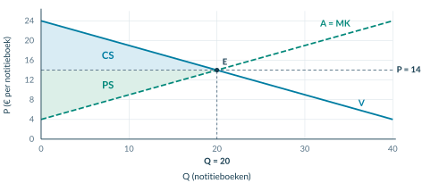<figcaption class="native-text" data-layout-height="13.0195" data-layout-width="412.0139" style="left:-0.1417pt;top:208.1634pt;line-height:10.0195pt">Figuur 4. De twee gebieden hebben hier toevallig dezelfde oppervlakte; dat hoeft niet op iedere markt zo te zijn.</figcaption></figure>
<h2 class="native-text" data-layout-height="17.7595" data-layout-width="210.5059" style="left:83.8583pt;top:587.6601pt;line-height:14.7595pt">Bereken met basis, hoogte en eenheid</h2>

3

<table aria-label="Tabel bij Evenwicht en twee surplusgebieden" class="native-table" style="left:53.8583pt;top:613.48pt;width:487.5591pt;height:96.32pt"><tbody>
<tr>
<th scope="col" style="left:0pt;top:0pt;width:58.5071pt;height:23.95pt">

Gebied

</th>
<th scope="col" style="left:58.5071pt;top:0pt;width:68.2583pt;height:23.95pt">

Basis

</th>
<th scope="col" style="left:126.7653pt;top:0pt;width:146.2677pt;height:23.95pt">

Hoogte

</th>
<th scope="col" style="left:273.0331pt;top:0pt;width:214.526pt;height:23.95pt">

Berekening

</th>
</tr>
<tr>
<td style="left:0pt;top:23.95pt;width:58.5071pt;height:24.17pt">

CS

</td>
<td style="left:58.5071pt;top:23.95pt;width:68.2583pt;height:24.17pt">

20

</td>
<td style="left:126.7653pt;top:23.95pt;width:146.2677pt;height:24.17pt">

24 − 14 = 10

</td>
<td style="left:273.0331pt;top:23.95pt;width:214.526pt;height:24.17pt">

½ × 20 × 10 = € 100

</td>
</tr>
<tr>
<td style="left:0pt;top:48.12pt;width:58.5071pt;height:24.1pt">

PS

</td>
<td style="left:58.5071pt;top:48.12pt;width:68.2583pt;height:24.1pt">

20

</td>
<td style="left:126.7653pt;top:48.12pt;width:146.2677pt;height:24.1pt">

14 − 4 = 10

</td>
<td style="left:273.0331pt;top:48.12pt;width:214.526pt;height:24.1pt">

½ × 20 × 10 = € 100

</td>
</tr>
<tr>
<td style="left:0pt;top:72.22pt;width:58.5071pt;height:24.1pt">

TS

</td>
<td style="left:58.5071pt;top:72.22pt;width:68.2583pt;height:24.1pt">

—

</td>
<td style="left:126.7653pt;top:72.22pt;width:146.2677pt;height:24.1pt">

—

</td>
<td style="left:273.0331pt;top:72.22pt;width:214.526pt;height:24.1pt">

100 + 100 = € 200

</td>
</tr>
</tbody></table>

Eenhedencontrole. De basis is in notitieboeken; de hoogte in euro per notitieboek. De oppervlakte geeft dus  euro. Op p. 14 verklaar je waarom het gezamenlijke voordeel hier maximaal is.

</article>

<!-- Native reconstruction of accepted physical page 86; see the revision provenance. -->
<article class="native-theory" data-accepted-page="86">
<svg aria-hidden="true" class="native-decoration" style="left:53.3583pt;top:77.7636pt;width:488.5591pt;height:2.1pt" viewbox="53.3583 77.7636 488.5591 2.1"><path d="M 53.8583 51.0236 H 541.4174 V 78.2636 H 53.8583 Z M 53.8583 51.0236 H 541.4174 V 79.3636 H 53.8583 Z" fill="#007da2" fill-rule="evenodd" stroke="none" stroke-width="0"></path></svg>
<svg aria-hidden="true" class="native-decoration" style="left:53.3583pt;top:126.5056pt;width:49.7559pt;height:21.951pt" viewbox="53.3583 126.5056 49.7559 21.951"><path d="M 53.8583 127.0056 H 102.6142 V 147.9566 H 53.8583 Z" fill="#eaf1f4" fill-rule="nonzero" stroke="none" stroke-width="0"></path></svg>
<svg aria-hidden="true" class="native-decoration" style="left:102.1142pt;top:126.5056pt;width:152.1433pt;height:21.951pt" viewbox="102.1142 126.5056 152.1433 21.951"><path d="M 102.6142 127.0056 H 253.7575 V 147.9566 H 102.6142 Z" fill="#eaf1f4" fill-rule="nonzero" stroke="none" stroke-width="0"></path></svg>
<svg aria-hidden="true" class="native-decoration" style="left:253.2575pt;top:126.5056pt;width:83.885pt;height:21.951pt" viewbox="253.2575 126.5056 83.885 21.951"><path d="M 253.7575 127.0056 H 336.6425 V 147.9566 H 253.7575 Z" fill="#eaf1f4" fill-rule="nonzero" stroke="none" stroke-width="0"></path></svg>
<svg aria-hidden="true" class="native-decoration" style="left:336.1425pt;top:126.5056pt;width:205.7748pt;height:21.951pt" viewbox="336.1425 126.5056 205.7748 21.951"><path d="M 336.6425 127.0056 H 541.4174 V 147.9566 H 336.6425 Z" fill="#eaf1f4" fill-rule="nonzero" stroke="none" stroke-width="0"></path></svg>
<svg aria-hidden="true" class="native-decoration" style="left:53.3583pt;top:168.6326pt;width:49.7559pt;height:22.101pt" viewbox="53.3583 168.6326 49.7559 22.101"><path d="M 53.8583 169.1326 H 102.6142 V 190.2336 H 53.8583 Z" fill="#f6f9fa" fill-rule="nonzero" stroke="none" stroke-width="0"></path></svg>
<svg aria-hidden="true" class="native-decoration" style="left:102.1142pt;top:168.6326pt;width:152.1433pt;height:22.101pt" viewbox="102.1142 168.6326 152.1433 22.101"><path d="M 102.6142 169.1326 H 253.7575 V 190.2336 H 102.6142 Z" fill="#f6f9fa" fill-rule="nonzero" stroke="none" stroke-width="0"></path></svg>
<svg aria-hidden="true" class="native-decoration" style="left:253.2575pt;top:168.6326pt;width:83.885pt;height:22.101pt" viewbox="253.2575 168.6326 83.885 22.101"><path d="M 253.7575 169.1326 H 336.6425 V 190.2336 H 253.7575 Z" fill="#f6f9fa" fill-rule="nonzero" stroke="none" stroke-width="0"></path></svg>
<svg aria-hidden="true" class="native-decoration" style="left:336.1425pt;top:168.6326pt;width:205.7748pt;height:22.101pt" viewbox="336.1425 168.6326 205.7748 22.101"><path d="M 336.6425 169.1326 H 541.4174 V 190.2336 H 336.6425 Z" fill="#f6f9fa" fill-rule="nonzero" stroke="none" stroke-width="0"></path></svg>
<svg aria-hidden="true" class="native-decoration" style="left:53.3583pt;top:168.6326pt;width:49.7559pt;height:1pt" viewbox="53.3583 168.6326 49.7559 1"><path d="M 53.8583 169.1326 L 102.6142 169.1326" fill="none" fill-rule="nonzero" stroke="#dce5e9" stroke-width="0.45000001788139343"></path></svg>
<svg aria-hidden="true" class="native-decoration" style="left:102.1142pt;top:168.6326pt;width:152.1433pt;height:1pt" viewbox="102.1142 168.6326 152.1433 1"><path d="M 102.6142 169.1326 L 253.7575 169.1326" fill="none" fill-rule="nonzero" stroke="#dce5e9" stroke-width="0.45000001788139343"></path></svg>
<svg aria-hidden="true" class="native-decoration" style="left:253.2575pt;top:168.6326pt;width:83.885pt;height:1pt" viewbox="253.2575 168.6326 83.885 1"><path d="M 253.7575 169.1326 L 336.6425 169.1326" fill="none" fill-rule="nonzero" stroke="#dce5e9" stroke-width="0.45000001788139343"></path></svg>
<svg aria-hidden="true" class="native-decoration" style="left:336.1425pt;top:168.6326pt;width:205.7748pt;height:1pt" viewbox="336.1425 168.6326 205.7748 1"><path d="M 336.6425 169.1326 L 541.4174 169.1326" fill="none" fill-rule="nonzero" stroke="#dce5e9" stroke-width="0.45000001788139343"></path></svg>
<svg aria-hidden="true" class="native-decoration" style="left:53.3583pt;top:189.7336pt;width:49.7559pt;height:1pt" viewbox="53.3583 189.7336 49.7559 1"><path d="M 53.8583 190.2336 L 102.6142 190.2336" fill="none" fill-rule="nonzero" stroke="#dce5e9" stroke-width="0.45000001788139343"></path></svg>
<svg aria-hidden="true" class="native-decoration" style="left:102.1142pt;top:189.7336pt;width:152.1433pt;height:1pt" viewbox="102.1142 189.7336 152.1433 1"><path d="M 102.6142 190.2336 L 253.7575 190.2336" fill="none" fill-rule="nonzero" stroke="#dce5e9" stroke-width="0.45000001788139343"></path></svg>
<svg aria-hidden="true" class="native-decoration" style="left:253.2575pt;top:189.7336pt;width:83.885pt;height:1pt" viewbox="253.2575 189.7336 83.885 1"><path d="M 253.7575 190.2336 L 336.6425 190.2336" fill="none" fill-rule="nonzero" stroke="#dce5e9" stroke-width="0.45000001788139343"></path></svg>
<svg aria-hidden="true" class="native-decoration" style="left:336.1425pt;top:189.7336pt;width:205.7748pt;height:1pt" viewbox="336.1425 189.7336 205.7748 1"><path d="M 336.6425 190.2336 L 541.4174 190.2336" fill="none" fill-rule="nonzero" stroke="#dce5e9" stroke-width="0.45000001788139343"></path></svg>
<svg aria-hidden="true" class="native-decoration" style="left:53.2583pt;top:147.3566pt;width:49.9559pt;height:1.2pt" viewbox="53.2583 147.3566 49.9559 1.2"><path d="M 53.8583 147.9566 L 102.6142 147.9566" fill="none" fill-rule="nonzero" stroke="#cbdbe2" stroke-width="0.6000000238418579"></path></svg>
<svg aria-hidden="true" class="native-decoration" style="left:102.0142pt;top:147.3566pt;width:152.3433pt;height:1.2pt" viewbox="102.0142 147.3566 152.3433 1.2"><path d="M 102.6142 147.9566 L 253.7575 147.9566" fill="none" fill-rule="nonzero" stroke="#cbdbe2" stroke-width="0.6000000238418579"></path></svg>
<svg aria-hidden="true" class="native-decoration" style="left:253.1575pt;top:147.3566pt;width:84.085pt;height:1.2pt" viewbox="253.1575 147.3566 84.085 1.2"><path d="M 253.7575 147.9566 L 336.6425 147.9566" fill="none" fill-rule="nonzero" stroke="#cbdbe2" stroke-width="0.6000000238418579"></path></svg>
<svg aria-hidden="true" class="native-decoration" style="left:336.0425pt;top:147.3566pt;width:205.9748pt;height:1.2pt" viewbox="336.0425 147.3566 205.9748 1.2"><path d="M 336.6425 147.9566 L 541.4174 147.9566" fill="none" fill-rule="nonzero" stroke="#cbdbe2" stroke-width="0.6000000238418579"></path></svg>
<svg aria-hidden="true" class="native-decoration" style="left:53.3583pt;top:282.1396pt;width:488.5591pt;height:61.08pt" viewbox="53.3583 282.1396 488.5591 61.08"><path d="M 53.8583 282.6396 H 541.4174 V 342.7196 H 53.8583 Z" fill="#eef4f6" fill-rule="nonzero" stroke="none" stroke-width="0"></path></svg>
<svg aria-hidden="true" class="native-decoration" style="left:53.3583pt;top:282.1396pt;width:3pt;height:61.08pt" viewbox="53.3583 282.1396 3 61.08"><path d="M 55.8583 282.6396 H 541.4174 V 342.7196 H 55.8583 Z M 53.8583 282.6396 H 541.4174 V 342.7196 H 53.8583 Z" fill="#007da2" fill-rule="evenodd" stroke="none" stroke-width="0"></path></svg>
<h1 class="native-text" data-layout-height="24.1192" data-layout-width="334.8184" style="left:53.8583pt;top:50.5842pt;line-height:21.1192pt">2.3.2 · Voorbeeld: de uitkomsten uitleggen</h1>
<h2 class="native-text" data-layout-height="17.7595" data-layout-width="216.6188" style="left:53.8583pt;top:87.5485pt;line-height:14.7595pt">4 · Vergelijk betalingsbereidheid en MK</h2>

Notitieboeken: vraag P = 24 − 0,5Q; aanbod/MK P = 4 + 0,5Q.

<table aria-label="Tabel bij De uitkomsten economisch uitleggen" class="native-table" style="left:53.8583pt;top:127.01pt;width:487.5591pt;height:63.22pt"><tbody>
<tr>
<th scope="col" style="left:0pt;top:0pt;width:48.7559pt;height:20.95pt">

Q

</th>
<th scope="col" style="left:48.7559pt;top:0pt;width:151.1433pt;height:20.95pt">

Betalingsbereidheid

</th>
<th scope="col" style="left:199.8992pt;top:0pt;width:82.885pt;height:20.95pt">

MK

</th>
<th scope="col" style="left:282.7842pt;top:0pt;width:204.7748pt;height:20.95pt">

Extra handel en TS

</th>
</tr>
<tr>
<td style="left:0pt;top:20.95pt;width:48.7559pt;height:21.17pt">

10

</td>
<td style="left:48.7559pt;top:20.95pt;width:151.1433pt;height:21.17pt">

€ 19

</td>
<td style="left:199.8992pt;top:20.95pt;width:82.885pt;height:21.17pt">

€ 9

</td>
<td style="left:282.7842pt;top:20.95pt;width:204.7748pt;height:21.17pt">

+€ 10: verhoogt TS.

</td>
</tr>
<tr>
<td style="left:0pt;top:42.12pt;width:48.7559pt;height:21.1pt">

30

</td>
<td style="left:48.7559pt;top:42.12pt;width:151.1433pt;height:21.1pt">

€ 9

</td>
<td style="left:199.8992pt;top:42.12pt;width:82.885pt;height:21.1pt">

€ 19

</td>
<td style="left:282.7842pt;top:42.12pt;width:204.7748pt;height:21.1pt">

−€ 10: verlaagt TS.

</td>
</tr>
</tbody></table>
<h2 class="native-text" data-layout-height="17.7595" data-layout-width="236.2243" style="left:53.8583pt;top:198.6435pt;line-height:14.7595pt">5 · Leg uit wat de uitkomst wel en niet zegt</h2>

Bij Q = 20 zijn betalingsbereidheid en MK gelijk. Alle eenheden met een positief gezamenlijk voordeel kunnen worden verhandeld. Verder uitbreiden geeft in dit model geen hoger TS.

CS = PS = € 100 bewijst geen eerlijkheid. De grafiek laat bijvoorbeeld niet zien hoe het voordeel binnen de groep kopers is verdeeld.

Terugblik

Evenwicht → gebieden → berekenen → betekenis. CS ligt boven de prijs; PS eronder. TS = CS + PS. Maximaal TS is een efficiëntie-uitkomst, geen eerlijkheidsoordeel.

</article>

## Startopgaven

**Opgave 1 · Evenwicht ophalen (§1.3.2)**

Vraag: P = 18 − Q. Aanbod: P = 6 + 0,5Q. P is in euro per product, Q in producten. Bereken Qe en Pe.

**Opgave 2 · Van MK naar voordeel**

Een beker wordt verkocht voor € 9. De koper heeft er € 12 voor over; de marginale kosten zijn € 5.

a) Bereken het voordeel van de koper en van de verkoper bij deze transactie.

b) Bereken hun gezamenlijke voordeel. Leg uit waarom je de prijs daarvoor niet bij de betalingsbereidheid optelt.

<b>Normale route:</b> Startopgaven → Begeleide inoefening → Zelfstandige oefening → Doeloefening. <b>Uitdagende route (minder tussenstappen, extra uitdaging):</b> Startopgaven → Zelfstandige oefening → Doeloefening → Denkertje / Bonusopgave. Herhaling is extra bij beide routes.

## Begeleide inoefening

*Begeleide inoefening hoort bij leren: je oefent met denkstappen en doet steeds meer zelf.*

**Opgave 3 · Bloemenbossen**

Vraag: **P = 30 − Q**. Aanbod: **P = 6 + 0,5Q**. P is in euro per bos bloemen, Q in bossen. Binnen deze grafiek stelt de aanbodlijn de MK voor. Alle transacties in het vrije evenwicht vinden plaats.

<figure>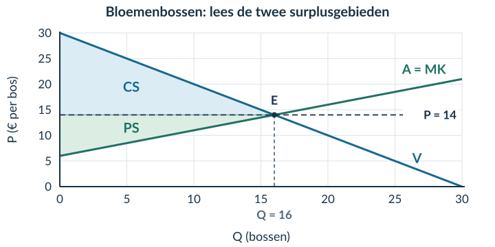<figcaption>Figuur 5 · Het evenwicht en de arceringen zijn al gegeven. Controleer de getallen voordat je gebieden berekent.</figcaption></figure>

a) Vul de evenwichtsberekening aan: 30 − Q = 6 + 0,5Q → 24 = …Q → Qe = … en Pe = … .

b) Vul in en bereken: CS = ½ × 16 × (… − 14). PS = ½ × 16 × (14 − …). Bereken ook TS.

c) Bij Q = 10 is de betalingsbereidheid € 20 en MK € 11. Bij Q = 20 zijn deze bedragen € 10 en € 16. Geef per hoeveelheid aan of een extra transactie TS verhoogt of verlaagt. Noteer het verschil.

d) Leg met de lijnen uit waarom verder handelen tot Q = 16 gezamenlijk voordeel oplevert, maar handelen voorbij Q = 16 niet.

**Opgave 4 · Sporthanddoeken**

Vraag: **P = 32 − 0,5Q**. Aanbod: **P = 8 + 0,5Q**. P is in euro per handdoek, Q in handdoeken. De aanbodlijn geeft de MK weer.

<figure><figcaption>Figuur 6 · De lijnen zijn gegeven. Je voegt zelf het evenwicht, de prijs en de twee surplusgebieden toe.</figcaption></figure>

a) Bereken Qe en Pe. Markeer het evenwicht en arceer CS en PS.

b) Bereken CS, PS en TS met de juiste eenheden.

c) Vergelijk betalingsbereidheid en MK bij Q = 16 en bij Q = 32. Leg uit waarom het evenwicht het grootste TS geeft.

**Opgave 5 · Twee veranderingen bij één transactie**

Een mok kost € 10. De koper heeft er eerst € 14 voor over; de MK zijn € 6. Daarna stijgt de betalingsbereidheid naar € 16 en dalen de MK naar € 5. De prijs blijft € 10; dezelfde transactie gaat door.

a) Bekijk alleen de hogere betalingsbereidheid. Hoe verandert het kopersvoordeel?

b) Bekijk alleen de lagere MK. Hoe verandert het verkopersvoordeel?

c) Hoeveel neemt het gezamenlijke voordeel toe als beide veranderingen plaatsvinden?

d) ‘De twee effecten heffen elkaar op, want één bedrag stijgt en het andere daalt.’ Leg uit waarom dat onjuist is.

## Zelfstandige oefening

**Opgave 6 · Herbruikbare koffiebekers**

Vraag: **P = 36 − 0,5Q**. Aanbod: **P = 6 + 0,5Q**. P is in euro per beker, Q in bekers. De aanbodlijn is in dit model de MK-lijn. Gebruik de gegeven grafiek.

<figure><figcaption>Figuur 7 · Je hoeft de lijnen niet opnieuw te tekenen.</figcaption></figure>

a) Bereken en markeer Qe en Pe. Arceer en benoem CS en PS.

b) Bereken CS, PS en TS met basis, hoogte en eenheid.

c) Vergelijk de betalingsbereidheid met MK bij Q = 20 en Q = 40. Geef aan wat een extra transactie met TS doet.

d) Verklaar waarom TS maximaal is bij het evenwicht. Leg ook uit waarom dat geen bewijs van een eerlijke verdeling is.

**Opgave 7 · Twee begrippen, twee uitspraken**

Een verkoper heeft € 80 producentensurplus. Zijn vaste kosten zijn niet gegeven.

a) Mag je zijn winst gelijkstellen aan € 80? Leg uit.

b) Op een markt is CS € 300 en PS € 100. Bereken TS. Bewijst dit verschil dat de markt niet efficiënt is? Licht toe.

## Doeloefening

**Opgave 8 · Concertkaartjes — gegevens**

Voor concertkaartjes geldt vraag P=50−0,5Q en aanbod P=5+0,25Q. P is in euro per kaartje en Q in kaartjes. Binnen dit marktmodel stelt de inverse aanbodlijn voor 0≤Q≤100 de marginale kosten van iedere opeenvolgende eenheid voor, ook als die eenheid in het evenwicht niet wordt verkocht.

<figure><figcaption>Figuur 8 · Basisgrafiek bij opgave 8. Vraag en aanbod zijn al getekend. De vragen staan op de volgende pagina.</figcaption></figure>

**Bron · Marginale vergelijking**

| Q | Betalingsbereidheid volgens vraaglijn | Marginale kosten volgens aanbodlijn |
|---|---:|---:|
| 50 | € 25 | € 17,50 |
| 70 | € 15 | € 22,50 |

De waarden zijn met de gegeven vraag- en aanbodfunctie berekend.

<b>Notatie</b> De inverse aanbodlijn geeft de prijs bij een aangeboden hoeveelheid. In deze opgave lees je die prijs ook als de marginale kosten. Je gebruikt dezelfde Q voor de vergelijking met de vraaglijn.

**Opgave 8 · Concertkaartjes — vragen**

Gebruik de bronnen op de vorige pagina.

a) Bereken de evenwichtsprijs en -hoeveelheid.

b) Markeer het evenwicht in de basisgrafiek en arceer en benoem CS en PS. Teken de lijnen niet opnieuw.

c) Bereken CS, PS en TS met basis, hoogte en eenheid.

d) Vergelijk met de tabel bij Q=50 en Q=70 de betalingsbereidheid met de marginale kosten en geef per hoeveelheid aan of één extra transactie TS verhoogt of verlaagt.

e) Leg uit waarom TS in dit model maximaal is bij Q=60 en waarom dit geen oordeel over een eerlijke verdeling oplevert.

## Denkertje / Bonusopgave

**Opgave 9 · Dezelfde handel, een andere prijs**

Voor één transactie zijn de betalingsbereidheid € 30 en de MK € 10. Vergelijk een prijs van € 15 met een prijs van € 25. De transactie gaat in beide gevallen door.

Beredeneer wat er verandert voor de koper, de verkoper en hun gezamenlijke voordeel. Leg uit waarom je uit alleen een andere prijs niet automatisch een kleiner TS kunt afleiden.

## Herhaling / Herhaling en interleaving

**Opgave 10 · Marginale kosten (§2.1.3)**

TK stijgt van € 240 bij Q = 40 naar € 280 bij Q = 50. Bereken de marginale kosten per extra product over dit interval.

**Opgave 11 · Prijselasticiteit (§2.2.1)**

De prijs stijgt met 10%; de gevraagde hoeveelheid daalt met 5%. Bereken Ev en benoem of de vraag prijselastisch of prijsinelastisch is.

<!-- Native reconstruction of accepted physical page 92; see the revision provenance. -->
<article class="native-theory" data-accepted-page="92">
<svg aria-hidden="true" class="native-decoration" style="left:53.3583pt;top:77.7636pt;width:488.5591pt;height:2.1pt" viewbox="53.3583 77.7636 488.5591 2.1"><path d="M 53.8583 51.0236 H 541.4174 V 78.2636 H 53.8583 Z M 53.8583 51.0236 H 541.4174 V 79.3636 H 53.8583 Z" fill="#007da2" fill-rule="evenodd" stroke="none" stroke-width="0"></path></svg>
<svg aria-hidden="true" class="native-decoration" style="left:53.3583pt;top:102.7036pt;width:488.5591pt;height:1.5pt" viewbox="53.3583 102.7036 488.5591 1.5"><path d="M 53.8583 85.3636 H 541.4174 V 103.2036 H 53.8583 Z M 53.8583 85.3636 H 541.4174 V 103.7036 H 53.8583 Z" fill="#cedfe6" fill-rule="evenodd" stroke="none" stroke-width="0"></path></svg>
<svg aria-hidden="true" class="native-decoration" style="left:53.3583pt;top:161.2546pt;width:488.5591pt;height:58.69pt" viewbox="53.3583 161.2546 488.5591 58.69"><path d="M 53.8583 161.7546 H 541.4174 V 219.4446 H 53.8583 Z" fill="#f1f5f7" fill-rule="nonzero" stroke="none" stroke-width="0"></path></svg>
<svg aria-hidden="true" class="native-decoration" style="left:53.3583pt;top:161.2546pt;width:3pt;height:58.69pt" viewbox="53.3583 161.2546 3 58.69"><path d="M 55.8583 161.7546 H 541.4174 V 219.4446 H 55.8583 Z M 53.8583 161.7546 H 541.4174 V 219.4446 H 53.8583 Z" fill="#8ba5b2" fill-rule="evenodd" stroke="none" stroke-width="0"></path></svg>
<svg aria-hidden="true" class="native-decoration" style="left:53.3583pt;top:266.5866pt;width:142.3921pt;height:21.951pt" viewbox="53.3583 266.5866 142.3921 21.951"><path d="M 53.8583 267.0866 H 195.2504 V 288.0376 H 53.8583 Z" fill="#eaf1f4" fill-rule="nonzero" stroke="none" stroke-width="0"></path></svg>
<svg aria-hidden="true" class="native-decoration" style="left:194.7504pt;top:266.5866pt;width:239.9039pt;height:21.951pt" viewbox="194.7504 266.5866 239.9039 21.951"><path d="M 195.2504 267.0866 H 434.1543 V 288.0376 H 195.2504 Z" fill="#eaf1f4" fill-rule="nonzero" stroke="none" stroke-width="0"></path></svg>
<svg aria-hidden="true" class="native-decoration" style="left:433.6543pt;top:266.5866pt;width:108.263pt;height:21.951pt" viewbox="433.6543 266.5866 108.263 21.951"><path d="M 434.1543 267.0866 H 541.4174 V 288.0376 H 434.1543 Z" fill="#eaf1f4" fill-rule="nonzero" stroke="none" stroke-width="0"></path></svg>
<svg aria-hidden="true" class="native-decoration" style="left:53.3583pt;top:308.7136pt;width:142.3921pt;height:22.101pt" viewbox="53.3583 308.7136 142.3921 22.101"><path d="M 53.8583 309.2136 H 195.2504 V 330.3146 H 53.8583 Z" fill="#f6f9fa" fill-rule="nonzero" stroke="none" stroke-width="0"></path></svg>
<svg aria-hidden="true" class="native-decoration" style="left:194.7504pt;top:308.7136pt;width:239.9039pt;height:22.101pt" viewbox="194.7504 308.7136 239.9039 22.101"><path d="M 195.2504 309.2136 H 434.1543 V 330.3146 H 195.2504 Z" fill="#f6f9fa" fill-rule="nonzero" stroke="none" stroke-width="0"></path></svg>
<svg aria-hidden="true" class="native-decoration" style="left:433.6543pt;top:308.7136pt;width:108.263pt;height:22.101pt" viewbox="433.6543 308.7136 108.263 22.101"><path d="M 434.1543 309.2136 H 541.4174 V 330.3146 H 434.1543 Z" fill="#f6f9fa" fill-rule="nonzero" stroke="none" stroke-width="0"></path></svg>
<svg aria-hidden="true" class="native-decoration" style="left:53.3583pt;top:350.9156pt;width:142.3921pt;height:22.101pt" viewbox="53.3583 350.9156 142.3921 22.101"><path d="M 53.8583 351.4156 H 195.2504 V 372.5166 H 53.8583 Z" fill="#edf5f2" fill-rule="nonzero" stroke="none" stroke-width="0"></path></svg>
<svg aria-hidden="true" class="native-decoration" style="left:194.7504pt;top:350.9156pt;width:239.9039pt;height:22.101pt" viewbox="194.7504 350.9156 239.9039 22.101"><path d="M 195.2504 351.4156 H 434.1543 V 372.5166 H 195.2504 Z" fill="#edf5f2" fill-rule="nonzero" stroke="none" stroke-width="0"></path></svg>
<svg aria-hidden="true" class="native-decoration" style="left:433.6543pt;top:350.9156pt;width:108.263pt;height:22.101pt" viewbox="433.6543 350.9156 108.263 22.101"><path d="M 434.1543 351.4156 H 541.4174 V 372.5166 H 434.1543 Z" fill="#edf5f2" fill-rule="nonzero" stroke="none" stroke-width="0"></path></svg>
<svg aria-hidden="true" class="native-decoration" style="left:53.3583pt;top:308.7136pt;width:142.3921pt;height:1pt" viewbox="53.3583 308.7136 142.3921 1"><path d="M 53.8583 309.2136 L 195.2504 309.2136" fill="none" fill-rule="nonzero" stroke="#dce5e9" stroke-width="0.45000001788139343"></path></svg>
<svg aria-hidden="true" class="native-decoration" style="left:194.7504pt;top:308.7136pt;width:239.9039pt;height:1pt" viewbox="194.7504 308.7136 239.9039 1"><path d="M 195.2504 309.2136 L 434.1543 309.2136" fill="none" fill-rule="nonzero" stroke="#dce5e9" stroke-width="0.45000001788139343"></path></svg>
<svg aria-hidden="true" class="native-decoration" style="left:433.6543pt;top:308.7136pt;width:108.263pt;height:1pt" viewbox="433.6543 308.7136 108.263 1"><path d="M 434.1543 309.2136 L 541.4174 309.2136" fill="none" fill-rule="nonzero" stroke="#dce5e9" stroke-width="0.45000001788139343"></path></svg>
<svg aria-hidden="true" class="native-decoration" style="left:53.3583pt;top:329.8146pt;width:142.3921pt;height:1pt" viewbox="53.3583 329.8146 142.3921 1"><path d="M 53.8583 330.3146 L 195.2504 330.3146" fill="none" fill-rule="nonzero" stroke="#dce5e9" stroke-width="0.45000001788139343"></path></svg>
<svg aria-hidden="true" class="native-decoration" style="left:194.7504pt;top:329.8146pt;width:239.9039pt;height:1pt" viewbox="194.7504 329.8146 239.9039 1"><path d="M 195.2504 330.3146 L 434.1543 330.3146" fill="none" fill-rule="nonzero" stroke="#dce5e9" stroke-width="0.45000001788139343"></path></svg>
<svg aria-hidden="true" class="native-decoration" style="left:433.6543pt;top:329.8146pt;width:108.263pt;height:1pt" viewbox="433.6543 329.8146 108.263 1"><path d="M 434.1543 330.3146 L 541.4174 330.3146" fill="none" fill-rule="nonzero" stroke="#dce5e9" stroke-width="0.45000001788139343"></path></svg>
<svg aria-hidden="true" class="native-decoration" style="left:53.3583pt;top:350.9156pt;width:142.3921pt;height:1pt" viewbox="53.3583 350.9156 142.3921 1"><path d="M 53.8583 351.4156 L 195.2504 351.4156" fill="none" fill-rule="nonzero" stroke="#dce5e9" stroke-width="0.45000001788139343"></path></svg>
<svg aria-hidden="true" class="native-decoration" style="left:194.7504pt;top:350.9156pt;width:239.9039pt;height:1pt" viewbox="194.7504 350.9156 239.9039 1"><path d="M 195.2504 351.4156 L 434.1543 351.4156" fill="none" fill-rule="nonzero" stroke="#dce5e9" stroke-width="0.45000001788139343"></path></svg>
<svg aria-hidden="true" class="native-decoration" style="left:433.6543pt;top:350.9156pt;width:108.263pt;height:1pt" viewbox="433.6543 350.9156 108.263 1"><path d="M 434.1543 351.4156 L 541.4174 351.4156" fill="none" fill-rule="nonzero" stroke="#dce5e9" stroke-width="0.45000001788139343"></path></svg>
<svg aria-hidden="true" class="native-decoration" style="left:53.3583pt;top:372.0166pt;width:142.3921pt;height:1pt" viewbox="53.3583 372.0166 142.3921 1"><path d="M 53.8583 372.5166 L 195.2504 372.5166" fill="none" fill-rule="nonzero" stroke="#dce5e9" stroke-width="0.45000001788139343"></path></svg>
<svg aria-hidden="true" class="native-decoration" style="left:194.7504pt;top:372.0166pt;width:239.9039pt;height:1pt" viewbox="194.7504 372.0166 239.9039 1"><path d="M 195.2504 372.5166 L 434.1543 372.5166" fill="none" fill-rule="nonzero" stroke="#dce5e9" stroke-width="0.45000001788139343"></path></svg>
<svg aria-hidden="true" class="native-decoration" style="left:433.6543pt;top:372.0166pt;width:108.263pt;height:1pt" viewbox="433.6543 372.0166 108.263 1"><path d="M 434.1543 372.5166 L 541.4174 372.5166" fill="none" fill-rule="nonzero" stroke="#dce5e9" stroke-width="0.45000001788139343"></path></svg>
<svg aria-hidden="true" class="native-decoration" style="left:53.2583pt;top:287.4376pt;width:142.5921pt;height:1.2pt" viewbox="53.2583 287.4376 142.5921 1.2"><path d="M 53.8583 288.0376 L 195.2504 288.0376" fill="none" fill-rule="nonzero" stroke="#cbdbe2" stroke-width="0.6000000238418579"></path></svg>
<svg aria-hidden="true" class="native-decoration" style="left:194.6504pt;top:287.4376pt;width:240.1039pt;height:1.2pt" viewbox="194.6504 287.4376 240.1039 1.2"><path d="M 195.2504 288.0376 L 434.1543 288.0376" fill="none" fill-rule="nonzero" stroke="#cbdbe2" stroke-width="0.6000000238418579"></path></svg>
<svg aria-hidden="true" class="native-decoration" style="left:433.5543pt;top:287.4376pt;width:108.463pt;height:1.2pt" viewbox="433.5543 287.4376 108.463 1.2"><path d="M 434.1543 288.0376 L 541.4174 288.0376" fill="none" fill-rule="nonzero" stroke="#cbdbe2" stroke-width="0.6000000238418579"></path></svg>
<svg aria-hidden="true" class="native-decoration" style="left:53.3583pt;top:586.5514pt;width:488.5591pt;height:54.83pt" viewbox="53.3583 586.5514 488.5591 54.83"><path d="M 53.8583 587.0514 H 541.4174 V 640.8814 H 53.8583 Z" fill="#faf2e8" fill-rule="nonzero" stroke="none" stroke-width="0"></path></svg>
<svg aria-hidden="true" class="native-decoration" style="left:104.17pt;top:85.8636pt;width:1.5pt;height:10.84pt" viewbox="104.17 85.8636 1.5 10.84"><path d="M 53.8583 86.3636 H 104.67 V 96.2036 H 53.8583 Z M 53.8583 86.3636 H 105.17 V 96.2036 H 53.8583 Z" fill="#bed5df" fill-rule="evenodd" stroke="none" stroke-width="0"></path></svg>
<svg aria-hidden="true" class="native-decoration" style="left:161.5148pt;top:85.8636pt;width:1.5pt;height:10.84pt" viewbox="161.5148 85.8636 1.5 10.84"><path d="M 105.17 86.3636 H 162.0148 V 96.2036 H 105.17 Z M 105.17 86.3636 H 162.5148 V 96.2036 H 105.17 Z" fill="#bed5df" fill-rule="evenodd" stroke="none" stroke-width="0"></path></svg>
<svg aria-hidden="true" class="native-decoration" style="left:219.8885pt;top:85.8636pt;width:1.5pt;height:10.84pt" viewbox="219.8885 85.8636 1.5 10.84"><path d="M 162.5148 86.3636 H 220.3885 V 96.2036 H 162.5148 Z M 162.5148 86.3636 H 220.8885 V 96.2036 H 162.5148 Z" fill="#bed5df" fill-rule="evenodd" stroke="none" stroke-width="0"></path></svg>
<svg aria-hidden="true" class="native-decoration" style="left:277.7841pt;top:85.8636pt;width:1.5pt;height:10.84pt" viewbox="277.7841 85.8636 1.5 10.84"><path d="M 220.8885 86.3636 H 278.2841 V 96.2036 H 220.8885 Z M 220.8885 86.3636 H 278.7841 V 96.2036 H 220.8885 Z" fill="#bed5df" fill-rule="evenodd" stroke="none" stroke-width="0"></path></svg>
<h1 class="native-text" data-layout-height="24.1192" data-layout-width="385.8389" style="left:53.8583pt;top:50.5842pt;line-height:21.1192pt">2.3.3 · Werkelijke handel: vraag, aanbod en grens</h1>

Handel · 20

CS/PS · 21

Verlies · 22

Pareto · 23

Voorbeeld · 24–25

Op de postermarkt zijn vrij 20 transacties tegen € 20 mogelijk. Een reserveringssysteem laat nu maar 12 boekingen tegen € 22 toe. Het kan technisch minstens 20 transacties verwerken; de grens kan zonder kosten worden verruimd.

Lesdoelen

Je kunt werkelijke transacties bepalen, CS, PS, TS en welvaartsverlies berekenen, Pareto-efficiëntie toepassen en efficiëntie van eerlijkheid onderscheiden.

<h2 class="native-text" data-layout-height="17.7595" data-layout-width="295.2007" style="left:53.8583pt;top:227.6295pt;line-height:14.7595pt">Gevraagd, aangeboden en verkocht zijn niet hetzelfde</h2>

Vraag: P = 40 − Q. Aanbod/MK: P = 10 + 0,5Q. Bereken bij P = € 22 eerst de twee gewenste hoeveelheden.

<table aria-label="Tabel bij Niet elke voordelige transactie gaat door" class="native-table" style="left:53.8583pt;top:267.09pt;width:487.5591pt;height:105.43pt"><tbody>
<tr>
<th scope="col" style="left:0pt;top:0pt;width:141.3921pt;height:20.95pt">

Grootheid

</th>
<th scope="col" style="left:141.3921pt;top:0pt;width:238.9039pt;height:20.95pt">

Berekening of gegeven

</th>
<th scope="col" style="left:380.2961pt;top:0pt;width:107.263pt;height:20.95pt">

Hoeveelheid

</th>
</tr>
<tr>
<td style="left:0pt;top:20.95pt;width:141.3921pt;height:21.17pt">

Gevraagd: Qd

</td>
<td style="left:141.3921pt;top:20.95pt;width:238.9039pt;height:21.17pt">

22 = 40 − Qd

</td>
<td style="left:380.2961pt;top:20.95pt;width:107.263pt;height:21.17pt">

18 posters

</td>
</tr>
<tr>
<td style="left:0pt;top:42.12pt;width:141.3921pt;height:21.1pt">

Aangeboden: Qs

</td>
<td style="left:141.3921pt;top:42.12pt;width:238.9039pt;height:21.1pt">

22 = 10 + 0,5Qs

</td>
<td style="left:380.2961pt;top:42.12pt;width:107.263pt;height:21.1pt">

24 posters

</td>
</tr>
<tr>
<td style="left:0pt;top:63.22pt;width:141.3921pt;height:21.11pt">

Boekingsgrens

</td>
<td style="left:141.3921pt;top:63.22pt;width:238.9039pt;height:21.11pt">

Er mogen maximaal 12 boekingen zijn.

</td>
<td style="left:380.2961pt;top:63.22pt;width:107.263pt;height:21.11pt">

12 posters

</td>
</tr>
<tr>
<td style="left:0pt;top:84.33pt;width:141.3921pt;height:21.1pt">

Werkelijk verkocht

</td>
<td style="left:141.3921pt;top:84.33pt;width:238.9039pt;height:21.1pt">

De grens ligt onder Qd én Qs.

</td>
<td style="left:380.2961pt;top:84.33pt;width:107.263pt;height:21.1pt">

12 posters

</td>
</tr>
</tbody></table>
<figure class="native-figure" style="left:54pt;top:397.2838pt;width:491.2756pt;height:168.4557pt"><figcaption class="native-text" data-layout-height="13.0195" data-layout-width="381.613" style="left:-0.1417pt;top:171.4557pt;line-height:10.0195pt">Figuur 1. E is het vrije evenwicht. De boekingsgrens stopt de werkelijke handel bij Q = 12, vóór Qe = 20.</figcaption></figure>

Wie handelt er? De 12 hoogste betalingsbereidheden worden gekoppeld aan de 12 laagste MK. Deze toewijzing bepaalt de surplusgebieden. De grens is bindend: zij houdt mogelijke transacties tegen. Qd en Qs betekenen hetzelfde als Qv en Qa in boek 1.

</article>

<!-- Native reconstruction of accepted physical page 93; see the revision provenance. -->
<article class="native-theory" data-accepted-page="93">
<svg aria-hidden="true" class="native-decoration" style="left:53.3583pt;top:77.7636pt;width:488.5591pt;height:2.1pt" viewbox="53.3583 77.7636 488.5591 2.1"><path d="M 53.8583 51.0236 H 541.4174 V 78.2636 H 53.8583 Z M 53.8583 51.0236 H 541.4174 V 79.3636 H 53.8583 Z" fill="#007da2" fill-rule="evenodd" stroke="none" stroke-width="0"></path></svg>
<svg aria-hidden="true" class="native-decoration" style="left:53.3583pt;top:102.7036pt;width:488.5591pt;height:1.5pt" viewbox="53.3583 102.7036 488.5591 1.5"><path d="M 53.8583 85.3636 H 541.4174 V 103.2036 H 53.8583 Z M 53.8583 85.3636 H 541.4174 V 103.7036 H 53.8583 Z" fill="#cedfe6" fill-rule="evenodd" stroke="none" stroke-width="0"></path></svg>
<svg aria-hidden="true" class="native-decoration" style="left:53.3583pt;top:392.8831pt;width:242.2795pt;height:164.001pt" viewbox="53.3583 392.8831 242.2795 164.001"><path d="M 53.8583 393.3831 H 295.1378 V 556.384 H 53.8583 Z" fill="#eaf4f8" fill-rule="nonzero" stroke="none" stroke-width="0"></path></svg>
<svg aria-hidden="true" class="native-decoration" style="left:299.6378pt;top:392.8831pt;width:242.2796pt;height:164.001pt" viewbox="299.6378 392.8831 242.2796 164.001"><path d="M 300.1378 393.3831 H 541.4174 V 556.384 H 300.1378 Z" fill="#edf5f2" fill-rule="nonzero" stroke="none" stroke-width="0"></path></svg>
<svg aria-hidden="true" class="native-decoration" style="left:53.3583pt;top:392.8831pt;width:3pt;height:164.001pt" viewbox="53.3583 392.8831 3 164.001"><path d="M 55.8583 393.3831 H 295.1378 V 556.384 H 55.8583 Z M 53.8583 393.3831 H 295.1378 V 556.384 H 53.8583 Z" fill="#007da2" fill-rule="evenodd" stroke="none" stroke-width="0"></path></svg>
<svg aria-hidden="true" class="native-decoration" style="left:299.6378pt;top:392.8831pt;width:3pt;height:164.001pt" viewbox="299.6378 392.8831 3 164.001"><path d="M 302.1378 393.3831 H 541.4174 V 556.384 H 302.1378 Z M 300.1378 393.3831 H 541.4174 V 556.384 H 300.1378 Z" fill="#008779" fill-rule="evenodd" stroke="none" stroke-width="0"></path></svg>
<svg aria-hidden="true" class="native-decoration" style="left:53.3583pt;top:623.0471pt;width:488.5591pt;height:42.22pt" viewbox="53.3583 623.0471 488.5591 42.22"><path d="M 53.8583 623.5471 H 541.4174 V 664.7671 H 53.8583 Z" fill="#faf2e8" fill-rule="nonzero" stroke="none" stroke-width="0"></path></svg>
<svg aria-hidden="true" class="native-decoration" style="left:103.8434pt;top:85.8636pt;width:1.5pt;height:10.84pt" viewbox="103.8434 85.8636 1.5 10.84"><path d="M 53.8583 86.3636 H 104.3434 V 96.2036 H 53.8583 Z M 53.8583 86.3636 H 104.8434 V 96.2036 H 53.8583 Z" fill="#bed5df" fill-rule="evenodd" stroke="none" stroke-width="0"></path></svg>
<svg aria-hidden="true" class="native-decoration" style="left:161.4042pt;top:85.8636pt;width:1.5pt;height:10.84pt" viewbox="161.4042 85.8636 1.5 10.84"><path d="M 104.8434 86.3636 H 161.9042 V 96.2036 H 104.8434 Z M 104.8434 86.3636 H 162.4042 V 96.2036 H 104.8434 Z" fill="#bed5df" fill-rule="evenodd" stroke="none" stroke-width="0"></path></svg>
<svg aria-hidden="true" class="native-decoration" style="left:219.7779pt;top:85.8636pt;width:1.5pt;height:10.84pt" viewbox="219.7779 85.8636 1.5 10.84"><path d="M 162.4042 86.3636 H 220.2779 V 96.2036 H 162.4042 Z M 162.4042 86.3636 H 220.778 V 96.2036 H 162.4042 Z" fill="#bed5df" fill-rule="evenodd" stroke="none" stroke-width="0"></path></svg>
<svg aria-hidden="true" class="native-decoration" style="left:277.6735pt;top:85.8636pt;width:1.5pt;height:10.84pt" viewbox="277.6735 85.8636 1.5 10.84"><path d="M 220.778 86.3636 H 278.1735 V 96.2036 H 220.778 Z M 220.778 86.3636 H 278.6735 V 96.2036 H 220.778 Z" fill="#bed5df" fill-rule="evenodd" stroke="none" stroke-width="0"></path></svg>
<h1 class="native-text" data-layout-height="24.1192" data-layout-width="315.3887" style="left:53.8583pt;top:50.5842pt;line-height:21.1192pt">2.3.3 · CS en PS: niet altijd een driehoek</h1>

Handel · 20

CS/PS · 21

Verlies · 22

Pareto · 23

Voorbeeld · 24–25

Er worden 12 posters tegen € 22 verkocht. Bij Q = 12 is de betalingsbereidheid 40 − 12 = € 28 en zijn de MK 10 + 0,5 × 12 = € 16. De laatste koper én verkoper hebben nog voordeel.

<figure class="native-figure" style="left:54pt;top:164.2798pt;width:491.2756pt;height:197.1869pt"><figcaption class="native-text" data-layout-height="23.624" data-layout-width="485.9827" style="left:-0.1417pt;top:200.1869pt;line-height:10.6045pt">Figuur 2. Beide gebieden stoppen bij 12 werkelijke transacties. De hulplijnen op € 28 en € 16 splitsen elk gebied in een rechthoek en een driehoek.</figcaption></figure>

CS · boven de betaalde prijs

PS · onder de ontvangen prijs

Rechthoek: alle 12 kopers hebben minstens € 28 − € 22 = € 6 voordeel.

Rechthoek: alle 12 verkopers ontvangen minstens € 22 − € 16 = € 6 boven hun MK.

12 × (28 − 22) = € 72

12 × (22 − 16) = € 72

Driehoek: daarboven ligt het extra voordeel van kopers die meer dan € 28 willen betalen.

Driehoek: daaronder ligt het extra voordeel van verkopers met MK lager dan € 16.

½ × 12 × (40 − 28) = € 72

½ × 12 × (16 − 10) = € 36

CS = 72 + 72 = € 144

PS = 72 + 36 = € 108

<h2 class="native-text" data-layout-height="17.7595" data-layout-width="238.5981" style="left:53.8583pt;top:567.5689pt;line-height:14.7595pt">Waarom is alleen ½ × Q × hoogte hier fout?</h2>

Het surplus eindigt bij Q = 12 niet in een punt op de prijslijn. Ook bij de laatste transactie blijft voordeel over. Alleen een driehoek berekenen slaat daarom een deel van het gebied over.

De vaste rekenroute. Bepaal eerst de werkelijke Q. Lees op die Q de betalingsbereidheid en MK af. Teken de hulplijnen, bereken de twee delen en tel ze op. De oppervlakten zijn bedragen in euro.

</article>

<!-- Native reconstruction of accepted physical page 94; see the revision provenance. -->
<article class="native-theory" data-accepted-page="94">
<svg aria-hidden="true" class="native-decoration" style="left:53.3583pt;top:77.7636pt;width:488.5591pt;height:2.1pt" viewbox="53.3583 77.7636 488.5591 2.1"><path d="M 53.8583 51.0236 H 541.4174 V 78.2636 H 53.8583 Z M 53.8583 51.0236 H 541.4174 V 79.3636 H 53.8583 Z" fill="#007da2" fill-rule="evenodd" stroke="none" stroke-width="0"></path></svg>
<svg aria-hidden="true" class="native-decoration" style="left:53.3583pt;top:102.7036pt;width:488.5591pt;height:1.5pt" viewbox="53.3583 102.7036 488.5591 1.5"><path d="M 53.8583 85.3636 H 541.4174 V 103.2036 H 53.8583 Z M 53.8583 85.3636 H 541.4174 V 103.7036 H 53.8583 Z" fill="#cedfe6" fill-rule="evenodd" stroke="none" stroke-width="0"></path></svg>
<svg aria-hidden="true" class="native-decoration" style="left:53.3583pt;top:113.2036pt;width:488.5591pt;height:92.307pt" viewbox="53.3583 113.2036 488.5591 92.307"><path d="M 53.8583 113.7036 H 541.4174 V 205.0106 H 53.8583 Z" fill="#faf2e8" fill-rule="nonzero" stroke="none" stroke-width="0"></path></svg>
<svg aria-hidden="true" class="native-decoration" style="left:53.3583pt;top:113.2036pt;width:3pt;height:92.307pt" viewbox="53.3583 113.2036 3 92.307"><path d="M 55.8583 113.7036 H 541.4174 V 205.0106 H 55.8583 Z M 53.8583 113.7036 H 541.4174 V 205.0106 H 53.8583 Z" fill="#b76518" fill-rule="evenodd" stroke="none" stroke-width="0"></path></svg>
<svg aria-hidden="true" class="native-decoration" style="left:53.3583pt;top:211.5106pt;width:210.6504pt;height:22.351pt" viewbox="53.3583 211.5106 210.6504 22.351"><path d="M 53.8583 212.0106 H 263.5087 V 233.3616 H 53.8583 Z" fill="#eaf1f4" fill-rule="nonzero" stroke="none" stroke-width="0"></path></svg>
<svg aria-hidden="true" class="native-decoration" style="left:263.0087pt;top:211.5106pt;width:83.885pt;height:22.351pt" viewbox="263.0087 211.5106 83.885 22.351"><path d="M 263.5087 212.0106 H 346.3937 V 233.3616 H 263.5087 Z" fill="#eaf1f4" fill-rule="nonzero" stroke="none" stroke-width="0"></path></svg>
<svg aria-hidden="true" class="native-decoration" style="left:345.8937pt;top:211.5106pt;width:83.885pt;height:22.351pt" viewbox="345.8937 211.5106 83.885 22.351"><path d="M 346.3937 212.0106 H 429.2787 V 233.3616 H 346.3937 Z" fill="#eaf1f4" fill-rule="nonzero" stroke="none" stroke-width="0"></path></svg>
<svg aria-hidden="true" class="native-decoration" style="left:428.7787pt;top:211.5106pt;width:113.1386pt;height:22.351pt" viewbox="428.7787 211.5106 113.1386 22.351"><path d="M 429.2787 212.0106 H 541.4174 V 233.3616 H 429.2787 Z" fill="#eaf1f4" fill-rule="nonzero" stroke="none" stroke-width="0"></path></svg>
<svg aria-hidden="true" class="native-decoration" style="left:53.3583pt;top:254.4376pt;width:210.6504pt;height:22.501pt" viewbox="53.3583 254.4376 210.6504 22.501"><path d="M 53.8583 254.9376 H 263.5087 V 276.4386 H 53.8583 Z" fill="#f6f9fa" fill-rule="nonzero" stroke="none" stroke-width="0"></path></svg>
<svg aria-hidden="true" class="native-decoration" style="left:263.0087pt;top:254.4376pt;width:83.885pt;height:22.501pt" viewbox="263.0087 254.4376 83.885 22.501"><path d="M 263.5087 254.9376 H 346.3937 V 276.4386 H 263.5087 Z" fill="#f6f9fa" fill-rule="nonzero" stroke="none" stroke-width="0"></path></svg>
<svg aria-hidden="true" class="native-decoration" style="left:345.8937pt;top:254.4376pt;width:83.885pt;height:22.501pt" viewbox="345.8937 254.4376 83.885 22.501"><path d="M 346.3937 254.9376 H 429.2787 V 276.4386 H 346.3937 Z" fill="#f6f9fa" fill-rule="nonzero" stroke="none" stroke-width="0"></path></svg>
<svg aria-hidden="true" class="native-decoration" style="left:428.7787pt;top:254.4376pt;width:113.1386pt;height:22.501pt" viewbox="428.7787 254.4376 113.1386 22.501"><path d="M 429.2787 254.9376 H 541.4174 V 276.4386 H 429.2787 Z" fill="#f6f9fa" fill-rule="nonzero" stroke="none" stroke-width="0"></path></svg>
<svg aria-hidden="true" class="native-decoration" style="left:53.3583pt;top:254.4376pt;width:210.6504pt;height:1pt" viewbox="53.3583 254.4376 210.6504 1"><path d="M 53.8583 254.9376 L 263.5087 254.9376" fill="none" fill-rule="nonzero" stroke="#dce5e9" stroke-width="0.45000001788139343"></path></svg>
<svg aria-hidden="true" class="native-decoration" style="left:263.0087pt;top:254.4376pt;width:83.885pt;height:1pt" viewbox="263.0087 254.4376 83.885 1"><path d="M 263.5087 254.9376 L 346.3937 254.9376" fill="none" fill-rule="nonzero" stroke="#dce5e9" stroke-width="0.45000001788139343"></path></svg>
<svg aria-hidden="true" class="native-decoration" style="left:345.8937pt;top:254.4376pt;width:83.885pt;height:1pt" viewbox="345.8937 254.4376 83.885 1"><path d="M 346.3937 254.9376 L 429.2787 254.9376" fill="none" fill-rule="nonzero" stroke="#dce5e9" stroke-width="0.45000001788139343"></path></svg>
<svg aria-hidden="true" class="native-decoration" style="left:428.7787pt;top:254.4376pt;width:113.1386pt;height:1pt" viewbox="428.7787 254.4376 113.1386 1"><path d="M 429.2787 254.9376 L 541.4174 254.9376" fill="none" fill-rule="nonzero" stroke="#dce5e9" stroke-width="0.45000001788139343"></path></svg>
<svg aria-hidden="true" class="native-decoration" style="left:53.3583pt;top:275.9386pt;width:210.6504pt;height:1pt" viewbox="53.3583 275.9386 210.6504 1"><path d="M 53.8583 276.4386 L 263.5087 276.4386" fill="none" fill-rule="nonzero" stroke="#dce5e9" stroke-width="0.45000001788139343"></path></svg>
<svg aria-hidden="true" class="native-decoration" style="left:263.0087pt;top:275.9386pt;width:83.885pt;height:1pt" viewbox="263.0087 275.9386 83.885 1"><path d="M 263.5087 276.4386 L 346.3937 276.4386" fill="none" fill-rule="nonzero" stroke="#dce5e9" stroke-width="0.45000001788139343"></path></svg>
<svg aria-hidden="true" class="native-decoration" style="left:345.8937pt;top:275.9386pt;width:83.885pt;height:1pt" viewbox="345.8937 275.9386 83.885 1"><path d="M 346.3937 276.4386 L 429.2787 276.4386" fill="none" fill-rule="nonzero" stroke="#dce5e9" stroke-width="0.45000001788139343"></path></svg>
<svg aria-hidden="true" class="native-decoration" style="left:428.7787pt;top:275.9386pt;width:113.1386pt;height:1pt" viewbox="428.7787 275.9386 113.1386 1"><path d="M 429.2787 276.4386 L 541.4174 276.4386" fill="none" fill-rule="nonzero" stroke="#dce5e9" stroke-width="0.45000001788139343"></path></svg>
<svg aria-hidden="true" class="native-decoration" style="left:53.2583pt;top:232.7616pt;width:210.8504pt;height:1.2pt" viewbox="53.2583 232.7616 210.8504 1.2"><path d="M 53.8583 233.3616 L 263.5087 233.3616" fill="none" fill-rule="nonzero" stroke="#cbdbe2" stroke-width="0.6000000238418579"></path></svg>
<svg aria-hidden="true" class="native-decoration" style="left:262.9087pt;top:232.7616pt;width:84.085pt;height:1.2pt" viewbox="262.9087 232.7616 84.085 1.2"><path d="M 263.5087 233.3616 L 346.3937 233.3616" fill="none" fill-rule="nonzero" stroke="#cbdbe2" stroke-width="0.6000000238418579"></path></svg>
<svg aria-hidden="true" class="native-decoration" style="left:345.7937pt;top:232.7616pt;width:84.085pt;height:1.2pt" viewbox="345.7937 232.7616 84.085 1.2"><path d="M 346.3937 233.3616 L 429.2787 233.3616" fill="none" fill-rule="nonzero" stroke="#cbdbe2" stroke-width="0.6000000238418579"></path></svg>
<svg aria-hidden="true" class="native-decoration" style="left:428.6787pt;top:232.7616pt;width:113.3386pt;height:1.2pt" viewbox="428.6787 232.7616 113.3386 1.2"><path d="M 429.2787 233.3616 L 541.4174 233.3616" fill="none" fill-rule="nonzero" stroke="#cbdbe2" stroke-width="0.6000000238418579"></path></svg>
<svg aria-hidden="true" class="native-decoration" style="left:53.3583pt;top:538.2504pt;width:242.2795pt;height:91.918pt" viewbox="53.3583 538.2504 242.2795 91.918"><path d="M 53.8583 538.7504 H 295.1378 V 629.6685 H 53.8583 Z" fill="#faf2e8" fill-rule="nonzero" stroke="none" stroke-width="0"></path></svg>
<svg aria-hidden="true" class="native-decoration" style="left:299.6378pt;top:538.2504pt;width:242.2796pt;height:91.918pt" viewbox="299.6378 538.2504 242.2796 91.918"><path d="M 300.1378 538.7504 H 541.4174 V 629.6685 H 300.1378 Z" fill="#faf2e8" fill-rule="nonzero" stroke="none" stroke-width="0"></path></svg>
<svg aria-hidden="true" class="native-decoration" style="left:53.3583pt;top:538.2504pt;width:3pt;height:91.918pt" viewbox="53.3583 538.2504 3 91.918"><path d="M 55.8583 538.7504 H 295.1378 V 629.6685 H 55.8583 Z M 53.8583 538.7504 H 295.1378 V 629.6685 H 53.8583 Z" fill="#b76518" fill-rule="evenodd" stroke="none" stroke-width="0"></path></svg>
<svg aria-hidden="true" class="native-decoration" style="left:299.6378pt;top:538.2504pt;width:3pt;height:91.918pt" viewbox="299.6378 538.2504 3 91.918"><path d="M 302.1378 538.7504 H 541.4174 V 629.6685 H 302.1378 Z M 300.1378 538.7504 H 541.4174 V 629.6685 H 300.1378 Z" fill="#b76518" fill-rule="evenodd" stroke="none" stroke-width="0"></path></svg>
<svg aria-hidden="true" class="native-decoration" style="left:53.3583pt;top:710.3484pt;width:488.5591pt;height:42.22pt" viewbox="53.3583 710.3484 488.5591 42.22"><path d="M 53.8583 710.8484 H 541.4174 V 752.0685 H 53.8583 Z" fill="#faf2e8" fill-rule="nonzero" stroke="none" stroke-width="0"></path></svg>
<svg aria-hidden="true" class="native-decoration" style="left:103.8434pt;top:85.8636pt;width:1.5pt;height:10.84pt" viewbox="103.8434 85.8636 1.5 10.84"><path d="M 53.8583 86.3636 H 104.3434 V 96.2036 H 53.8583 Z M 53.8583 86.3636 H 104.8434 V 96.2036 H 53.8583 Z" fill="#bed5df" fill-rule="evenodd" stroke="none" stroke-width="0"></path></svg>
<svg aria-hidden="true" class="native-decoration" style="left:161.1881pt;top:85.8636pt;width:1.5pt;height:10.84pt" viewbox="161.1881 85.8636 1.5 10.84"><path d="M 104.8434 86.3636 H 161.6881 V 96.2036 H 104.8434 Z M 104.8434 86.3636 H 162.1881 V 96.2036 H 104.8434 Z" fill="#bed5df" fill-rule="evenodd" stroke="none" stroke-width="0"></path></svg>
<svg aria-hidden="true" class="native-decoration" style="left:220.0167pt;top:85.8636pt;width:1.5pt;height:10.84pt" viewbox="220.0167 85.8636 1.5 10.84"><path d="M 162.1881 86.3636 H 220.5167 V 96.2036 H 162.1881 Z M 162.1881 86.3636 H 221.0167 V 96.2036 H 162.1881 Z" fill="#bed5df" fill-rule="evenodd" stroke="none" stroke-width="0"></path></svg>
<svg aria-hidden="true" class="native-decoration" style="left:277.9122pt;top:85.8636pt;width:1.5pt;height:10.84pt" viewbox="277.9122 85.8636 1.5 10.84"><path d="M 221.0167 86.3636 H 278.4122 V 96.2036 H 221.0167 Z M 221.0167 86.3636 H 278.9122 V 96.2036 H 221.0167 Z" fill="#bed5df" fill-rule="evenodd" stroke="none" stroke-width="0"></path></svg>
<h1 class="native-text" data-layout-height="24.1192" data-layout-width="411.2701" style="left:53.8583pt;top:50.5842pt;line-height:21.1192pt">2.3.3 · Welvaartsverlies: voordeel dat niemand krijgt</h1>

Handel · 20

CS/PS · 21

Verlies · 22

Pareto · 23

Voorbeeld · 24–25

Welvaartsverlies

Het verschil tussen het maximaal haalbare totaal surplus en het werkelijk gerealiseerde totaal surplus, binnen het gegeven model.

Welvaartsverlies = maximaal TS − werkelijk TS

<table aria-label="Tabel bij Voordeel dat niemand ontvangt" class="native-table" style="left:53.8583pt;top:212.01pt;width:487.5591pt;height:85.93pt"><tbody>
<tr>
<th scope="col" style="left:0pt;top:0pt;width:209.6504pt;height:21.35pt">

Postermarkt

</th>
<th scope="col" style="left:209.6504pt;top:0pt;width:82.885pt;height:21.35pt">

CS

</th>
<th scope="col" style="left:292.5354pt;top:0pt;width:82.885pt;height:21.35pt">

PS

</th>
<th scope="col" style="left:375.4205pt;top:0pt;width:112.1386pt;height:21.35pt">

TS = CS + PS

</th>
</tr>
<tr>
<td style="left:0pt;top:21.35pt;width:209.6504pt;height:21.58pt">

Vrij evenwicht: 20 posters

</td>
<td style="left:209.6504pt;top:21.35pt;width:82.885pt;height:21.58pt">

€ 200

</td>
<td style="left:292.5354pt;top:21.35pt;width:82.885pt;height:21.58pt">

€ 100

</td>
<td style="left:375.4205pt;top:21.35pt;width:112.1386pt;height:21.58pt">

€ 300

</td>
</tr>
<tr>
<td style="left:0pt;top:42.93pt;width:209.6504pt;height:21.5pt">

Boekingsgrens: 12 posters

</td>
<td style="left:209.6504pt;top:42.93pt;width:82.885pt;height:21.5pt">

€ 144

</td>
<td style="left:292.5354pt;top:42.93pt;width:82.885pt;height:21.5pt">

€ 108

</td>
<td style="left:375.4205pt;top:42.93pt;width:112.1386pt;height:21.5pt">

€ 252

</td>
</tr>
<tr>
<td style="left:0pt;top:64.43pt;width:209.6504pt;height:21.5pt">

Verandering

</td>
<td style="left:209.6504pt;top:64.43pt;width:82.885pt;height:21.5pt">

−€ 56

</td>
<td style="left:292.5354pt;top:64.43pt;width:82.885pt;height:21.5pt">

+€ 8

</td>
<td style="left:375.4205pt;top:64.43pt;width:112.1386pt;height:21.5pt">

−€ 48

</td>
</tr>
</tbody></table>
<figure class="native-figure" style="left:53.8583pt;top:292pt;width:491.4173pt;height:214.8341pt"><figcaption class="native-text" data-layout-height="23.624" data-layout-width="481.0735" style="left:0pt;top:217.8341pt;line-height:10.6045pt">Figuur 3. Tussen Q = 12 en Q = 20 ligt betalingsbereidheid boven MK. Het voordeel van deze niet-doorgegane transacties ontvangt niemand.</figcaption></figure>

Manier 1 · vergelijk de totalen

Manier 2 · de verliesdriehoek

300 − 252 = € 48

½ × (20 − 12) × (28 − 16)

Vergelijk CS + PS vóór en na.

= ½ × 8 × 12 = € 48

8 gemiste posters × € 12 per poster × ½.

<h2 class="native-text" data-layout-height="17.7595" data-layout-width="295.7296" style="left:53.8583pt;top:640.8533pt;line-height:14.7595pt">Een verschuiving van voordeel is geen nieuw voordeel</h2>

PS stijgt hier van € 100 naar € 108, terwijl TS daalt. Een deel van het kopersvoordeel verschuift naar verkopers; een ander deel gaat door minder handel verloren. Meer PS bewijst dus niet dat de markt als geheel erop vooruitgaat.

Hoogte van de verliesdriehoek: betalingsbereidheid min MK bij de boekingsgrens, dus 28 − 16 = € 12. Niet de marktprijs en niet het verschil tussen de oude en nieuwe prijs.

</article>

<!-- Native reconstruction of accepted physical page 95; see the revision provenance. -->
<article class="native-theory" data-accepted-page="95">
<svg aria-hidden="true" class="native-decoration" style="left:53.3583pt;top:77.7636pt;width:488.5591pt;height:2.1pt" viewbox="53.3583 77.7636 488.5591 2.1"><path d="M 53.8583 51.0236 H 541.4174 V 78.2636 H 53.8583 Z M 53.8583 51.0236 H 541.4174 V 79.3636 H 53.8583 Z" fill="#007da2" fill-rule="evenodd" stroke="none" stroke-width="0"></path></svg>
<svg aria-hidden="true" class="native-decoration" style="left:53.3583pt;top:102.7036pt;width:488.5591pt;height:1.5pt" viewbox="53.3583 102.7036 488.5591 1.5"><path d="M 53.8583 85.3636 H 541.4174 V 103.2036 H 53.8583 Z M 53.8583 85.3636 H 541.4174 V 103.7036 H 53.8583 Z" fill="#cedfe6" fill-rule="evenodd" stroke="none" stroke-width="0"></path></svg>
<svg aria-hidden="true" class="native-decoration" style="left:53.3583pt;top:113.2036pt;width:242.2795pt;height:90.99pt" viewbox="53.3583 113.2036 242.2795 90.99"><path d="M 53.8583 113.7036 H 295.1378 V 203.6936 H 53.8583 Z" fill="#eaf4f8" fill-rule="nonzero" stroke="none" stroke-width="0"></path></svg>
<svg aria-hidden="true" class="native-decoration" style="left:299.6378pt;top:113.2036pt;width:242.2796pt;height:90.99pt" viewbox="299.6378 113.2036 242.2796 90.99"><path d="M 300.1378 113.7036 H 541.4174 V 203.6936 H 300.1378 Z" fill="#edf5f2" fill-rule="nonzero" stroke="none" stroke-width="0"></path></svg>
<svg aria-hidden="true" class="native-decoration" style="left:53.3583pt;top:113.2036pt;width:3pt;height:90.99pt" viewbox="53.3583 113.2036 3 90.99"><path d="M 55.8583 113.7036 H 295.1378 V 203.6936 H 55.8583 Z M 53.8583 113.7036 H 295.1378 V 203.6936 H 53.8583 Z" fill="#007da2" fill-rule="evenodd" stroke="none" stroke-width="0"></path></svg>
<svg aria-hidden="true" class="native-decoration" style="left:299.6378pt;top:113.2036pt;width:3pt;height:90.99pt" viewbox="299.6378 113.2036 3 90.99"><path d="M 302.1378 113.7036 H 541.4174 V 203.6936 H 302.1378 Z M 300.1378 113.7036 H 541.4174 V 203.6936 H 300.1378 Z" fill="#008779" fill-rule="evenodd" stroke="none" stroke-width="0"></path></svg>
<svg aria-hidden="true" class="native-decoration" style="left:53.3583pt;top:415.5741pt;width:166.7701pt;height:24.951pt" viewbox="53.3583 415.5741 166.7701 24.951"><path d="M 53.8583 416.0741 H 219.6284 V 440.0251 H 53.8583 Z" fill="#eaf1f4" fill-rule="nonzero" stroke="none" stroke-width="0"></path></svg>
<svg aria-hidden="true" class="native-decoration" style="left:219.1284pt;top:415.5741pt;width:322.789pt;height:24.951pt" viewbox="219.1284 415.5741 322.789 24.951"><path d="M 219.6284 416.0741 H 541.4174 V 440.0251 H 219.6284 Z" fill="#eaf1f4" fill-rule="nonzero" stroke="none" stroke-width="0"></path></svg>
<svg aria-hidden="true" class="native-decoration" style="left:53.3583pt;top:463.7011pt;width:166.7701pt;height:25.101pt" viewbox="53.3583 463.7011 166.7701 25.101"><path d="M 53.8583 464.2011 H 219.6284 V 488.3021 H 53.8583 Z" fill="#f6f9fa" fill-rule="nonzero" stroke="none" stroke-width="0"></path></svg>
<svg aria-hidden="true" class="native-decoration" style="left:219.1284pt;top:463.7011pt;width:322.789pt;height:25.101pt" viewbox="219.1284 463.7011 322.789 25.101"><path d="M 219.6284 464.2011 H 541.4174 V 488.3021 H 219.6284 Z" fill="#f6f9fa" fill-rule="nonzero" stroke="none" stroke-width="0"></path></svg>
<svg aria-hidden="true" class="native-decoration" style="left:53.3583pt;top:463.7011pt;width:166.7701pt;height:1pt" viewbox="53.3583 463.7011 166.7701 1"><path d="M 53.8583 464.2011 L 219.6284 464.2011" fill="none" fill-rule="nonzero" stroke="#dce5e9" stroke-width="0.45000001788139343"></path></svg>
<svg aria-hidden="true" class="native-decoration" style="left:219.1284pt;top:463.7011pt;width:322.789pt;height:1pt" viewbox="219.1284 463.7011 322.789 1"><path d="M 219.6284 464.2011 L 541.4174 464.2011" fill="none" fill-rule="nonzero" stroke="#dce5e9" stroke-width="0.45000001788139343"></path></svg>
<svg aria-hidden="true" class="native-decoration" style="left:53.3583pt;top:487.8021pt;width:166.7701pt;height:1pt" viewbox="53.3583 487.8021 166.7701 1"><path d="M 53.8583 488.3021 L 219.6284 488.3021" fill="none" fill-rule="nonzero" stroke="#dce5e9" stroke-width="0.45000001788139343"></path></svg>
<svg aria-hidden="true" class="native-decoration" style="left:219.1284pt;top:487.8021pt;width:322.789pt;height:1pt" viewbox="219.1284 487.8021 322.789 1"><path d="M 219.6284 488.3021 L 541.4174 488.3021" fill="none" fill-rule="nonzero" stroke="#dce5e9" stroke-width="0.45000001788139343"></path></svg>
<svg aria-hidden="true" class="native-decoration" style="left:53.3583pt;top:523.5541pt;width:166.7701pt;height:1pt" viewbox="53.3583 523.5541 166.7701 1"><path d="M 53.8583 524.0541 L 219.6284 524.0541" fill="none" fill-rule="nonzero" stroke="#dce5e9" stroke-width="0.45000001788139343"></path></svg>
<svg aria-hidden="true" class="native-decoration" style="left:219.1284pt;top:523.5541pt;width:322.789pt;height:1pt" viewbox="219.1284 523.5541 322.789 1"><path d="M 219.6284 524.0541 L 541.4174 524.0541" fill="none" fill-rule="nonzero" stroke="#dce5e9" stroke-width="0.45000001788139343"></path></svg>
<svg aria-hidden="true" class="native-decoration" style="left:53.2583pt;top:439.4251pt;width:166.9701pt;height:1.2pt" viewbox="53.2583 439.4251 166.9701 1.2"><path d="M 53.8583 440.0251 L 219.6284 440.0251" fill="none" fill-rule="nonzero" stroke="#cbdbe2" stroke-width="0.6000000238418579"></path></svg>
<svg aria-hidden="true" class="native-decoration" style="left:219.0284pt;top:439.4251pt;width:322.989pt;height:1.2pt" viewbox="219.0284 439.4251 322.989 1.2"><path d="M 219.6284 440.0251 L 541.4174 440.0251" fill="none" fill-rule="nonzero" stroke="#cbdbe2" stroke-width="0.6000000238418579"></path></svg>
<svg aria-hidden="true" class="native-decoration" style="left:53.3583pt;top:531.7791pt;width:488.5591pt;height:50.177pt" viewbox="53.3583 531.7791 488.5591 50.177"><path d="M 53.8583 532.2791 H 541.4174 V 581.4561 H 53.8583 Z" fill="#edf5f2" fill-rule="nonzero" stroke="none" stroke-width="0"></path></svg>
<svg aria-hidden="true" class="native-decoration" style="left:53.3583pt;top:531.7791pt;width:3pt;height:50.177pt" viewbox="53.3583 531.7791 3 50.177"><path d="M 55.8583 532.2791 H 541.4174 V 581.4561 H 55.8583 Z M 53.8583 532.2791 H 541.4174 V 581.4561 H 53.8583 Z" fill="#008779" fill-rule="evenodd" stroke="none" stroke-width="0"></path></svg>
<svg aria-hidden="true" class="native-decoration" style="left:53.3583pt;top:657.6241pt;width:488.5591pt;height:42.22pt" viewbox="53.3583 657.6241 488.5591 42.22"><path d="M 53.8583 658.1241 H 541.4174 V 699.3441 H 53.8583 Z" fill="#faf2e8" fill-rule="nonzero" stroke="none" stroke-width="0"></path></svg>
<svg aria-hidden="true" class="native-decoration" style="left:103.8434pt;top:85.8636pt;width:1.5pt;height:10.84pt" viewbox="103.8434 85.8636 1.5 10.84"><path d="M 53.8583 86.3636 H 104.3434 V 96.2036 H 53.8583 Z M 53.8583 86.3636 H 104.8434 V 96.2036 H 53.8583 Z" fill="#bed5df" fill-rule="evenodd" stroke="none" stroke-width="0"></path></svg>
<svg aria-hidden="true" class="native-decoration" style="left:161.1881pt;top:85.8636pt;width:1.5pt;height:10.84pt" viewbox="161.1881 85.8636 1.5 10.84"><path d="M 104.8434 86.3636 H 161.6881 V 96.2036 H 104.8434 Z M 104.8434 86.3636 H 162.1881 V 96.2036 H 104.8434 Z" fill="#bed5df" fill-rule="evenodd" stroke="none" stroke-width="0"></path></svg>
<svg aria-hidden="true" class="native-decoration" style="left:219.5619pt;top:85.8636pt;width:1.5pt;height:10.84pt" viewbox="219.5619 85.8636 1.5 10.84"><path d="M 162.1881 86.3636 H 220.0619 V 96.2036 H 162.1881 Z M 162.1881 86.3636 H 220.5619 V 96.2036 H 162.1881 Z" fill="#bed5df" fill-rule="evenodd" stroke="none" stroke-width="0"></path></svg>
<svg aria-hidden="true" class="native-decoration" style="left:277.9232pt;top:85.8636pt;width:1.5pt;height:10.84pt" viewbox="277.9232 85.8636 1.5 10.84"><path d="M 220.5619 86.3636 H 278.4232 V 96.2036 H 220.5619 Z M 220.5619 86.3636 H 278.9232 V 96.2036 H 220.5619 Z" fill="#bed5df" fill-rule="evenodd" stroke="none" stroke-width="0"></path></svg>
<h1 class="native-text" data-layout-height="24.1192" data-layout-width="386.983" style="left:53.8583pt;top:50.5842pt;line-height:21.1192pt">2.3.3 · Pareto: iemand vooruit, niemand achteruit</h1>

Handel · 20

CS/PS · 21

Verlies · 22

Pareto · 23

Voorbeeld · 24–25

Paretoverbetering

Pareto-efficiëntie

Een haalbare verandering waarbij minstens één persoon erop vooruitgaat en niemand erop achteruitgaat.

Een situatie waarin geen haalbare Paretoverbetering meer mogelijk is. Je kunt dan niemand beter af maken zonder iemand anders te benadelen.

<h2 class="native-text" data-layout-height="17.7595" data-layout-width="184.8244" style="left:53.8583pt;top:214.8785pt;line-height:14.7595pt">De boekingsgrens van 12 toetsen</h2>

De grens kan kosteloos worden verruimd. De 13e poster kan tegen dezelfde € 22 worden geboekt. De eerste 12 transacties blijven ongewijzigd; anderen ondervinden geen gevolgen. Bij Q = 13 is de betalingsbereidheid € 27 en MK € 16,50.

<figure class="native-figure" style="left:53.8583pt;top:274pt;width:491.4173pt;height:95.6333pt"><figcaption class="native-text" data-layout-height="13.0195" data-layout-width="464.1905" style="left:0pt;top:98.6333pt;line-height:10.0195pt">Figuur 4. Beide nieuwe partijen hebben voordeel. De bestaande transacties blijven gelijk en anderen ondervinden geen nadeel.</figcaption></figure>
<h2 class="native-text" data-layout-height="17.7595" data-layout-width="215.6471" style="left:53.8583pt;top:394.13pt;line-height:14.7595pt">Drie onderdelen van een Pareto-bewijs</h2>
<table aria-label="Tabel bij Kan iemand erop vooruit zonder nadeel voor anderen?" class="native-table" style="left:53.8583pt;top:416.07pt;width:487.5591pt;height:107.98pt"><tbody>
<tr>
<th scope="col" style="left:0pt;top:0pt;width:165.7701pt;height:23.96pt">

Controle

</th>
<th scope="col" style="left:165.7701pt;top:0pt;width:321.789pt;height:23.96pt">

Toepassing op de 13e poster

</th>
</tr>
<tr>
<td style="left:0pt;top:23.96pt;width:165.7701pt;height:24.17pt">

1 · Iemand beter af?

</td>
<td style="left:165.7701pt;top:23.96pt;width:321.789pt;height:24.17pt">

Ja: de nieuwe koper én verkoper hebben voordeel.

</td>
</tr>
<tr>
<td style="left:0pt;top:48.13pt;width:165.7701pt;height:24.1pt">

2 · Haalbaar?

</td>
<td style="left:165.7701pt;top:48.13pt;width:321.789pt;height:24.1pt">

Ja: er is technische ruimte en verruiming kost niets.

</td>
</tr>
<tr>
<td style="left:0pt;top:72.23pt;width:165.7701pt;height:35.75pt">

3 · Niemand slechter af?

</td>
<td style="left:165.7701pt;top:72.23pt;width:321.789pt;height:35.75pt">

Ja: bestaande transacties en de prijs blijven gelijk; anderen ondervinden

geen gevolgen.

</td>
</tr>
</tbody></table>

Conclusie

Er bestaat een haalbare Paretoverbetering. De situatie met 12 boekingen is dus niet Pareto-efficiënt.

<h2 class="native-text" data-layout-height="17.7595" data-layout-width="307.6233" style="left:53.8583pt;top:592.641pt;line-height:14.7595pt">Een groter TS is niet automatisch een Paretoverbetering</h2>

Teruggaan naar het vrije evenwicht vergroot TS, maar verandert ook de prijs. PS daalt dan van € 108 naar € 100. Die hele overgang is dus niet automatisch een Paretoverbetering. De ene extra transactie tegen dezelfde prijs was al genoeg voor het bewijs.

Efficiënt is niet hetzelfde als eerlijk. Ook zonder mogelijke Paretoverbetering kan voordeel heel ongelijk verdeeld zijn. Wat eerlijk is, vraagt een afzonderlijk waardeoordeel.

</article>

<!-- Native reconstruction of accepted physical page 96; see the revision provenance. -->
<article class="native-theory" data-accepted-page="96">
<svg aria-hidden="true" class="native-decoration" style="left:53.3583pt;top:77.7636pt;width:488.5591pt;height:2.1pt" viewbox="53.3583 77.7636 488.5591 2.1"><path d="M 53.8583 51.0236 H 541.4174 V 78.2636 H 53.8583 Z M 53.8583 51.0236 H 541.4174 V 79.3636 H 53.8583 Z" fill="#007da2" fill-rule="evenodd" stroke="none" stroke-width="0"></path></svg>
<svg aria-hidden="true" class="native-decoration" style="left:53.3583pt;top:102.7036pt;width:488.5591pt;height:1.5pt" viewbox="53.3583 102.7036 488.5591 1.5"><path d="M 53.8583 85.3636 H 541.4174 V 103.2036 H 53.8583 Z M 53.8583 85.3636 H 541.4174 V 103.7036 H 53.8583 Z" fill="#cedfe6" fill-rule="evenodd" stroke="none" stroke-width="0"></path></svg>
<svg aria-hidden="true" class="native-decoration" style="left:53.3583pt;top:147.2376pt;width:488.5591pt;height:58.69pt" viewbox="53.3583 147.2376 488.5591 58.69"><path d="M 53.8583 147.7376 H 541.4174 V 205.4276 H 53.8583 Z" fill="#f1f5f7" fill-rule="nonzero" stroke="none" stroke-width="0"></path></svg>
<svg aria-hidden="true" class="native-decoration" style="left:53.3583pt;top:147.2376pt;width:3pt;height:58.69pt" viewbox="53.3583 147.2376 3 58.69"><path d="M 55.8583 147.7376 H 541.4174 V 205.4276 H 55.8583 Z M 53.8583 147.7376 H 541.4174 V 205.4276 H 53.8583 Z" fill="#8ba5b2" fill-rule="evenodd" stroke="none" stroke-width="0"></path></svg>
<svg aria-hidden="true" class="native-decoration" style="left:53.3583pt;top:214.9276pt;width:22pt;height:22pt" viewbox="53.3583 214.9276 22 22"><path d="M 53.8583 215.4276 H 74.8583 V 236.4276 H 53.8583 Z" fill="#007da2" fill-rule="nonzero" stroke="none" stroke-width="0"></path></svg>
<svg aria-hidden="true" class="native-decoration" style="left:53.3583pt;top:278.0826pt;width:22pt;height:22pt" viewbox="53.3583 278.0826 22 22"><path d="M 53.8583 278.5826 H 74.8583 V 299.5826 H 53.8583 Z" fill="#007da2" fill-rule="nonzero" stroke="none" stroke-width="0"></path></svg>
<svg aria-hidden="true" class="native-decoration" style="left:53.3583pt;top:555.9951pt;width:22pt;height:22pt" viewbox="53.3583 555.9951 22 22"><path d="M 53.8583 556.4951 H 74.8583 V 577.4951 H 53.8583 Z" fill="#007da2" fill-rule="nonzero" stroke="none" stroke-width="0"></path></svg>
<svg aria-hidden="true" class="native-decoration" style="left:53.3583pt;top:585.1241pt;width:242.2795pt;height:99.626pt" viewbox="53.3583 585.1241 242.2795 99.626"><path d="M 53.8583 585.6241 H 295.1378 V 684.2501 H 53.8583 Z" fill="#eaf4f8" fill-rule="nonzero" stroke="none" stroke-width="0"></path></svg>
<svg aria-hidden="true" class="native-decoration" style="left:299.6378pt;top:585.1241pt;width:242.2796pt;height:99.626pt" viewbox="299.6378 585.1241 242.2796 99.626"><path d="M 300.1378 585.6241 H 541.4174 V 684.2501 H 300.1378 Z" fill="#edf5f2" fill-rule="nonzero" stroke="none" stroke-width="0"></path></svg>
<svg aria-hidden="true" class="native-decoration" style="left:53.3583pt;top:585.1241pt;width:3pt;height:99.626pt" viewbox="53.3583 585.1241 3 99.626"><path d="M 55.8583 585.6241 H 295.1378 V 684.2501 H 55.8583 Z M 53.8583 585.6241 H 295.1378 V 684.2501 H 53.8583 Z" fill="#007da2" fill-rule="evenodd" stroke="none" stroke-width="0"></path></svg>
<svg aria-hidden="true" class="native-decoration" style="left:299.6378pt;top:585.1241pt;width:3pt;height:99.626pt" viewbox="299.6378 585.1241 3 99.626"><path d="M 302.1378 585.6241 H 541.4174 V 684.2501 H 302.1378 Z M 300.1378 585.6241 H 541.4174 V 684.2501 H 300.1378 Z" fill="#008779" fill-rule="evenodd" stroke="none" stroke-width="0"></path></svg>
<svg aria-hidden="true" class="native-decoration" style="left:53.3583pt;top:691.7501pt;width:488.5591pt;height:42.22pt" viewbox="53.3583 691.7501 488.5591 42.22"><path d="M 53.8583 692.2501 H 541.4174 V 733.4701 H 53.8583 Z" fill="#faf2e8" fill-rule="nonzero" stroke="none" stroke-width="0"></path></svg>
<svg aria-hidden="true" class="native-decoration" style="left:103.8434pt;top:85.8636pt;width:1.5pt;height:10.84pt" viewbox="103.8434 85.8636 1.5 10.84"><path d="M 53.8583 86.3636 H 104.3434 V 96.2036 H 53.8583 Z M 53.8583 86.3636 H 104.8434 V 96.2036 H 53.8583 Z" fill="#bed5df" fill-rule="evenodd" stroke="none" stroke-width="0"></path></svg>
<svg aria-hidden="true" class="native-decoration" style="left:161.1881pt;top:85.8636pt;width:1.5pt;height:10.84pt" viewbox="161.1881 85.8636 1.5 10.84"><path d="M 104.8434 86.3636 H 161.6881 V 96.2036 H 104.8434 Z M 104.8434 86.3636 H 162.1881 V 96.2036 H 104.8434 Z" fill="#bed5df" fill-rule="evenodd" stroke="none" stroke-width="0"></path></svg>
<svg aria-hidden="true" class="native-decoration" style="left:219.5619pt;top:85.8636pt;width:1.5pt;height:10.84pt" viewbox="219.5619 85.8636 1.5 10.84"><path d="M 162.1881 86.3636 H 220.0619 V 96.2036 H 162.1881 Z M 162.1881 86.3636 H 220.5619 V 96.2036 H 162.1881 Z" fill="#bed5df" fill-rule="evenodd" stroke="none" stroke-width="0"></path></svg>
<svg aria-hidden="true" class="native-decoration" style="left:277.4574pt;top:85.8636pt;width:1.5pt;height:10.84pt" viewbox="277.4574 85.8636 1.5 10.84"><path d="M 220.5619 86.3636 H 277.9574 V 96.2036 H 220.5619 Z M 220.5619 86.3636 H 278.4574 V 96.2036 H 220.5619 Z" fill="#bed5df" fill-rule="evenodd" stroke="none" stroke-width="0"></path></svg>
<h1 class="native-text" data-layout-height="24.1192" data-layout-width="396.7506" style="left:53.8583pt;top:50.5842pt;line-height:21.1192pt">2.3.3 · Voorbeeld: een boekingsgrens doorrekenen</h1>

Handel · 20

CS/PS · 21

Verlies · 22

Pareto · 23

Voorbeeld · 24–25

Workshopplaatsen: vraag P = 30 − Q; aanbod/MK P = 6 + Q. P is in euro per plaats. Vrij evenwicht: Qe = 12, Pe = € 18; CS = PS = € 72 en TS = € 144.

De boekingsregel

Maximaal 8 plaatsen tegen € 20. Technisch zijn minstens 12 plaatsen mogelijk. Verruiming kost niets; prijs en bestaande transacties blijven gelijk. De hoogste betalingsbereidheden en laagste MK bepalen wie handelt.

1

<h2 class="native-text" data-layout-height="17.7595" data-layout-width="196.6443" style="left:83.8583pt;top:223.6125pt;line-height:14.7595pt">Houd de Pareto-vraag in gedachten</h2>

Kan een haalbare verandering iemand beter maken zonder iemand anders slechter te maken? Eerst bereken je wat er onder de regel gebeurt.

2

<h2 class="native-text" data-layout-height="17.7595" data-layout-width="218.7097" style="left:83.8583pt;top:286.7675pt;line-height:14.7595pt">Bepaal het werkelijke aantal transacties</h2>

Bij P = 20: Qd = 30 − 20 = 10. Uit 20 = 6 + Qs volgt Qs = 14. De grens van 8 ligt onder beide: 8 werkelijke transacties.

<figure class="native-figure" style="left:54pt;top:344pt;width:491.2756pt;height:189.1832pt">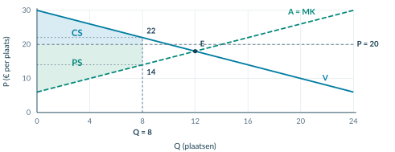<figcaption class="native-text" data-layout-height="13.0195" data-layout-width="417.2657" style="left:-0.1417pt;top:192.1833pt;line-height:10.0195pt">Figuur 5. Bij Q = 8 is de betalingsbereidheid € 22 en MK € 14. De hulplijnen laten zien waar je de gebieden splitst.</figcaption></figure>

3

<h2 class="native-text" data-layout-height="17.7595" data-layout-width="262.7544" style="left:83.8583pt;top:564.68pt;line-height:14.7595pt">Bereken elk surplus als rechthoek plus driehoek</h2>

Consumentensurplus

Producentensurplus

<h2 class="native-text" data-layout-height="18.8396" data-layout-width="106.6837" style="left:64.8583pt;top:611.7602pt;line-height:15.8396pt">CS = 8 × (22 − 20)</h2>
<h2 class="native-text" data-layout-height="18.8396" data-layout-width="106.1293" style="left:311.1378pt;top:611.7602pt;line-height:15.8396pt">PS = 8 × (20 − 14)</h2>
<h2 class="native-text" data-layout-height="18.8396" data-layout-width="111.2904" style="left:64.8583pt;top:633.7882pt;line-height:15.8396pt">+ ½ × 8 × (30 − 22)</h2>
<h2 class="native-text" data-layout-height="18.8396" data-layout-width="103.6346" style="left:311.1378pt;top:633.7882pt;line-height:15.8396pt">+ ½ × 8 × (14 − 6)</h2>
<h2 class="native-text" data-layout-height="18.8396" data-layout-width="98.8035" style="left:64.8583pt;top:655.8162pt;line-height:15.8396pt">= 16 + 32 = € 48</h2>
<h2 class="native-text" data-layout-height="18.8396" data-layout-width="98.8034" style="left:311.1378pt;top:655.8162pt;line-height:15.8396pt">= 48 + 32 = € 80</h2>

Stop bij Q = 8. Je rekent met de werkelijke transacties en de gegeven toewijzing, niet met alle 10 gevraagde of 14 aangeboden plaatsen. Op p. 25 bereken je het verlies en toets je Pareto-efficiëntie.

</article>

<!-- Native reconstruction of accepted physical page 97; see the revision provenance. -->
<article class="native-theory" data-accepted-page="97">
<svg aria-hidden="true" class="native-decoration" style="left:53.3583pt;top:77.7636pt;width:488.5591pt;height:2.1pt" viewbox="53.3583 77.7636 488.5591 2.1"><path d="M 53.8583 51.0236 H 541.4174 V 78.2636 H 53.8583 Z M 53.8583 51.0236 H 541.4174 V 79.3636 H 53.8583 Z" fill="#007da2" fill-rule="evenodd" stroke="none" stroke-width="0"></path></svg>
<svg aria-hidden="true" class="native-decoration" style="left:53.3583pt;top:102.7036pt;width:488.5591pt;height:1.5pt" viewbox="53.3583 102.7036 488.5591 1.5"><path d="M 53.8583 85.3636 H 541.4174 V 103.2036 H 53.8583 Z M 53.8583 85.3636 H 541.4174 V 103.7036 H 53.8583 Z" fill="#cedfe6" fill-rule="evenodd" stroke="none" stroke-width="0"></path></svg>
<svg aria-hidden="true" class="native-decoration" style="left:53.3583pt;top:113.2036pt;width:22pt;height:22pt" viewbox="53.3583 113.2036 22 22"><path d="M 53.8583 113.7036 H 74.8583 V 134.7036 H 53.8583 Z" fill="#007da2" fill-rule="nonzero" stroke="none" stroke-width="0"></path></svg>
<svg aria-hidden="true" class="native-decoration" style="left:53.3583pt;top:390.3828pt;width:488.5591pt;height:68.205pt" viewbox="53.3583 390.3828 488.5591 68.205"><path d="M 53.8583 390.8828 H 541.4174 V 458.0879 H 53.8583 Z" fill="#faf2e8" fill-rule="nonzero" stroke="none" stroke-width="0"></path></svg>
<svg aria-hidden="true" class="native-decoration" style="left:53.3583pt;top:390.3828pt;width:3pt;height:68.205pt" viewbox="53.3583 390.3828 3 68.205"><path d="M 55.8583 390.8828 H 541.4174 V 458.0879 H 55.8583 Z M 53.8583 390.8828 H 541.4174 V 458.0879 H 53.8583 Z" fill="#b76518" fill-rule="evenodd" stroke="none" stroke-width="0"></path></svg>
<svg aria-hidden="true" class="native-decoration" style="left:53.3583pt;top:467.5878pt;width:22pt;height:22pt" viewbox="53.3583 467.5878 22 22"><path d="M 53.8583 468.0878 H 74.8583 V 489.0878 H 53.8583 Z" fill="#007da2" fill-rule="nonzero" stroke="none" stroke-width="0"></path></svg>
<svg aria-hidden="true" class="native-decoration" style="left:53.3583pt;top:496.7168pt;width:242.2795pt;height:87.294pt" viewbox="53.3583 496.7168 242.2795 87.294"><path d="M 53.8583 497.2168 H 295.1378 V 583.5108 H 53.8583 Z" fill="#eaf4f8" fill-rule="nonzero" stroke="none" stroke-width="0"></path></svg>
<svg aria-hidden="true" class="native-decoration" style="left:299.6378pt;top:496.7168pt;width:242.2796pt;height:87.294pt" viewbox="299.6378 496.7168 242.2796 87.294"><path d="M 300.1378 497.2168 H 541.4174 V 583.5108 H 300.1378 Z" fill="#edf5f2" fill-rule="nonzero" stroke="none" stroke-width="0"></path></svg>
<svg aria-hidden="true" class="native-decoration" style="left:53.3583pt;top:496.7168pt;width:3pt;height:87.294pt" viewbox="53.3583 496.7168 3 87.294"><path d="M 55.8583 497.2168 H 295.1378 V 583.5108 H 55.8583 Z M 53.8583 497.2168 H 295.1378 V 583.5108 H 53.8583 Z" fill="#007da2" fill-rule="evenodd" stroke="none" stroke-width="0"></path></svg>
<svg aria-hidden="true" class="native-decoration" style="left:299.6378pt;top:496.7168pt;width:3pt;height:87.294pt" viewbox="299.6378 496.7168 3 87.294"><path d="M 302.1378 497.2168 H 541.4174 V 583.5108 H 302.1378 Z M 300.1378 497.2168 H 541.4174 V 583.5108 H 300.1378 Z" fill="#008779" fill-rule="evenodd" stroke="none" stroke-width="0"></path></svg>
<svg aria-hidden="true" class="native-decoration" style="left:53.3583pt;top:624.0368pt;width:22pt;height:22pt" viewbox="53.3583 624.0368 22 22"><path d="M 53.8583 624.5368 H 74.8583 V 645.5368 H 53.8583 Z" fill="#007da2" fill-rule="nonzero" stroke="none" stroke-width="0"></path></svg>
<svg aria-hidden="true" class="native-decoration" style="left:53.3583pt;top:686.1918pt;width:488.5591pt;height:62.254pt" viewbox="53.3583 686.1918 488.5591 62.254"><path d="M 53.8583 686.6918 H 541.4174 V 747.9458 H 53.8583 Z" fill="#eef4f6" fill-rule="nonzero" stroke="none" stroke-width="0"></path></svg>
<svg aria-hidden="true" class="native-decoration" style="left:53.3583pt;top:686.1918pt;width:3pt;height:62.254pt" viewbox="53.3583 686.1918 3 62.254"><path d="M 55.8583 686.6918 H 541.4174 V 747.9458 H 55.8583 Z M 53.8583 686.6918 H 541.4174 V 747.9458 H 53.8583 Z" fill="#007da2" fill-rule="evenodd" stroke="none" stroke-width="0"></path></svg>
<svg aria-hidden="true" class="native-decoration" style="left:103.8434pt;top:85.8636pt;width:1.5pt;height:10.84pt" viewbox="103.8434 85.8636 1.5 10.84"><path d="M 53.8583 86.3636 H 104.3434 V 96.2036 H 53.8583 Z M 53.8583 86.3636 H 104.8434 V 96.2036 H 53.8583 Z" fill="#bed5df" fill-rule="evenodd" stroke="none" stroke-width="0"></path></svg>
<svg aria-hidden="true" class="native-decoration" style="left:161.1881pt;top:85.8636pt;width:1.5pt;height:10.84pt" viewbox="161.1881 85.8636 1.5 10.84"><path d="M 104.8434 86.3636 H 161.6881 V 96.2036 H 104.8434 Z M 104.8434 86.3636 H 162.1881 V 96.2036 H 104.8434 Z" fill="#bed5df" fill-rule="evenodd" stroke="none" stroke-width="0"></path></svg>
<svg aria-hidden="true" class="native-decoration" style="left:219.5619pt;top:85.8636pt;width:1.5pt;height:10.84pt" viewbox="219.5619 85.8636 1.5 10.84"><path d="M 162.1881 86.3636 H 220.0619 V 96.2036 H 162.1881 Z M 162.1881 86.3636 H 220.5619 V 96.2036 H 162.1881 Z" fill="#bed5df" fill-rule="evenodd" stroke="none" stroke-width="0"></path></svg>
<svg aria-hidden="true" class="native-decoration" style="left:277.4574pt;top:85.8636pt;width:1.5pt;height:10.84pt" viewbox="277.4574 85.8636 1.5 10.84"><path d="M 220.5619 86.3636 H 277.9574 V 96.2036 H 220.5619 Z M 220.5619 86.3636 H 278.4574 V 96.2036 H 220.5619 Z" fill="#bed5df" fill-rule="evenodd" stroke="none" stroke-width="0"></path></svg>
<h1 class="native-text" data-layout-height="24.1192" data-layout-width="371.5307" style="left:53.8583pt;top:50.5842pt;line-height:21.1192pt">2.3.3 · Voorbeeld: verlies en Pareto controleren</h1>

Handel · 20

CS/PS · 21

Verlies · 22

Pareto · 23

Voorbeeld · 24–25

4

<h2 class="native-text" data-layout-height="17.7595" data-layout-width="193.631" style="left:83.8583pt;top:121.8885pt;line-height:14.7595pt">Bereken TS en het welvaartsverlies</h2>

Bij 8 workshopplaatsen: TS = 48 + 80 = € 128. Het maximaal haalbare TS is € 144. Het welvaartsverlies is 144 − 128 = € 16.

<figure class="native-figure" style="left:54pt;top:168pt;width:491.2756pt;height:201.571pt">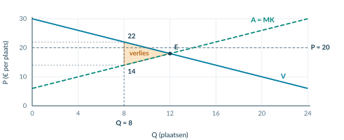<figcaption class="native-text" data-layout-height="13.0195" data-layout-width="485.7826" style="left:-0.1417pt;top:204.5709pt;line-height:10.0195pt">Figuur 6. Arceer het gemiste voordeel tussen V en A = MK, van Q = 8 tot Q = 12. De prijs van € 20 is niet de hoogte van de driehoek.</figcaption></figure>

Controle via de verliesdriehoek

<h2 class="native-text" data-layout-height="18.8396" data-layout-width="244.515" style="left:64.8583pt;top:417.141pt;line-height:15.8396pt">½ × (12 − 8) × (22 − 14) = ½ × 4 × 8 = € 16</h2>

De twee berekeningen geven hetzelfde bedrag.

5

<h2 class="native-text" data-layout-height="17.7595" data-layout-width="184.9351" style="left:83.8583pt;top:476.2727pt;line-height:14.7595pt">Toets een mogelijke 9e transactie</h2>

Koper

Verkoper

Betalingsbereidheid: € 21. Prijs: € 20.

Prijs: € 20. Marginale kosten: € 15.

<h2 class="native-text" data-layout-height="18.8396" data-layout-width="139.815" style="left:64.8583pt;top:555.077pt;line-height:15.8396pt">Voordeel: 21 − 20 = € 1</h2>
<h2 class="native-text" data-layout-height="18.8396" data-layout-width="139.815" style="left:311.1378pt;top:555.077pt;line-height:15.8396pt">Voordeel: 20 − 15 = € 5</h2>

Verruiming is kosteloos en technisch mogelijk. Bestaande transacties blijven gelijk en niemand wordt benadeeld. De extra transactie is een Paretoverbetering. De situatie met 8 transacties is dus niet Pareto-efficiënt.

6

<h2 class="native-text" data-layout-height="17.7595" data-layout-width="232.7189" style="left:83.8583pt;top:632.7217pt;line-height:14.7595pt">Beoordeel het totaal en de verdeling apart</h2>

PS stijgt van € 72 naar € 80, maar TS daalt van € 144 naar € 128. Hoger PS bewijst geen efficiëntie. Ook het hogere TS van het vrije evenwicht bewijst niet dat de verdeling eerlijker is.

Onthoud

Werkelijke Q → juiste gebieden → CS + PS → verlies → Pareto-bewijs. Voor Pareto tellen niet alleen extra voordelen, maar ook haalbaarheid en het ontbreken van nadeel voor anderen.

</article>

## Startopgaven

**Opgave 1 · Gebieden ophalen (§2.3.2)**

In een vrij evenwicht is Q = 20 en P = 15. De rechte vraaglijn snijdt de P-as bij 25 en de rechte MK-lijn bij 5. Bereken CS, PS en TS. P is in euro per product.

**Opgave 2 · Pareto of alleen een hoger totaal?**

Een verandering geeft koper A € 8 extra voordeel, maar verkoper B € 3 minder. Anderen merken niets. Is dit een Paretoverbetering? Licht toe.

<b>Normale route:</b> Startopgaven → Begeleide inoefening → Zelfstandige oefening → Doeloefening. <b>Uitdagende route (minder tussenstappen, extra uitdaging):</b> Startopgaven → Zelfstandige oefening → Doeloefening → Denkertje / Bonusopgave. Herhaling is extra bij beide routes.

## Begeleide inoefening

*Begeleide inoefening hoort bij leren: je oefent met denkstappen en doet steeds meer zelf.*

**Opgave 3 · Zaalplaatsen**

Vraag P = 24 − 0,5Q; aanbod/MK P = 4 + 0,5Q. P is in euro per plaats. Vrij: Qe = 20, Pe = 14, TS = € 200. Een kosteloos verruimbare grens staat 12 boekingen toe tegen P = 14. De hoogste betalingsbereidheden en laagste MK worden gekozen; uitbreiding kan zonder anderen te schaden.

<figure>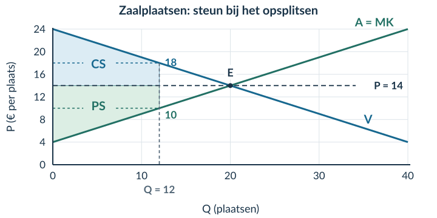<figcaption>Figuur 7 · De gebieden en horizontale hulplijnen zijn gegeven.</figcaption></figure>

a) Bereken Qd en Qs. Leg uit waarom toch maar 12 transacties plaatsvinden.

b) Vul in: CS = 12 × (18 − 14) + ½ × 12 × (24 − 18). Bereken ook PS, TS en het verlies.

**Opgave 4 · Kajakverhuur**

Vraag: **P = 30 − 0,5Q**. Aanbod/MK: **P = 6 + 0,5Q**. P is in euro per verhuurbeurt; Q in verhuurbeurten. Vrij: Qe = 24 en Pe = 18; TS = € 288.

Een kosteloos verruimbare boekingsgrens beperkt het aantal tot 16, tegen P = 20. Er is technisch ruimte voor minstens 24 transacties. De huurders met de hoogste betalingsbereidheid handelen met de verhuurders met de laagste MK. Bij verruiming blijven prijs en bestaande transacties gelijk.

<figure>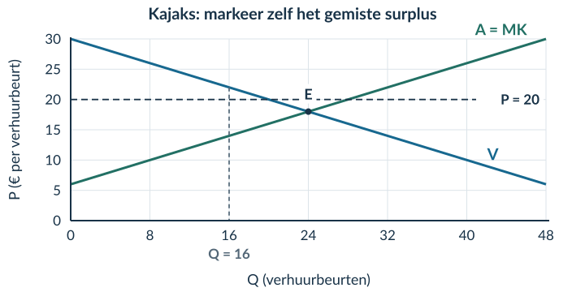<figcaption>Figuur 8 · Splits zelf de gebieden. De lijnen en de boekingsgrens zijn al aangegeven.</figcaption></figure>

a) Bereken Qd en Qs bij P = 20 en verklaar de 16 werkelijke transacties.

b) Bij Q = 16 is de betalingsbereidheid € 22 en MK € 14. Bereken CS, PS, TS en het welvaartsverlies. Arceer het verlies.

c) Bij een mogelijke 17e transactie zijn de betalingsbereidheid € 21,50 en MK € 14,50. Leg uit waarom de situatie met 16 transacties niet Pareto-efficiënt is. Noem ook haalbaarheid en het gevolg voor bestaande partijen.

d) ‘PS stijgt ten opzichte van het vrije evenwicht. Dus niemand gaat erop achteruit.’ Beoordeel dit met CS en PS vóór en na.

## Zelfstandige oefening

**Opgave 5 · Schilderworkshop**

Vraag: **P = 40 − Q**. Aanbod/MK: **P = 10 + Q**. P is in euro per plaats; Q in plaatsen. Vrij: Qe = 15, Pe = 25 en TS = € 225.

Een boekingsregel staat 10 plaatsen toe tegen P = 26. Er zijn technisch minstens 15 plaatsen. Verruiming is kosteloos. De hoogste betalingsbereidheden en laagste MK bepalen wie handelt; prijs en bestaande transacties blijven bij verruiming gelijk.

<figure>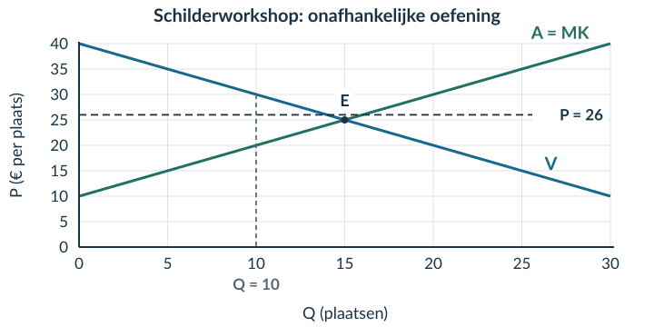<figcaption>Figuur 9 · Gebruik de geleverde grafiek; teken de twee lijnen niet opnieuw.</figcaption></figure>

a) Omschrijf Pareto-efficiëntie.

b) Bereken Qd en Qs. Verklaar het werkelijke aantal transacties en wie er handelen.

c) Bereken CS, PS en TS met de juiste gebieden en eenheden.

d) Bereken en arceer het welvaartsverlies. Benoem basis en hoogte.

e) Gebruik de betalingsbereidheid en MK van de mogelijke 11e transactie om de Pareto-efficiëntie te beoordelen.

f) Leg uit waarom een hoger TS niet bewijst dat een verdeling eerlijker is.

## Doeloefening

**Opgave 6 · Concertkaartjes — gegevens**

Gebruik opnieuw vraag P=50−0,5Q en aanbod P=5+0,25Q. Het vrije evenwicht is Q=60 en P=€20, met CS=€900, PS=€450 en TS=€1.350. Een kosteloos verruimbare reserveringsregel zet de prijs op €25 en beperkt boekingen tot 40 kaartjes, hoewel het platform technisch minstens 60 transacties kan verwerken. De 40 kaartjes gaan naar de vragers met de hoogste betalingsbereidheid en worden geleverd door de aanbieders met de laagste marginale kosten. Daardoor vinden precies 40 transacties plaats. Bij verruiming blijven de prijs en alle bestaande transacties ongewijzigd.

<figure><figcaption>Figuur 10 · Basisgrafiek bij opgave 6. Het vrije evenwicht E, P = 25 en Q = 40 zijn aangegeven. De vragen staan op de volgende pagina.</figcaption></figure>

<b>Dezelfde markt, een andere uitkomst</b> Vergelijk de werkelijke handel onder de reserveringsregel met het gegeven vrije evenwicht. Gebruik bij de gebieden uitsluitend de transacties die onder de regel plaatsvinden.

**Opgave 6 · Concertkaartjes — vragen**

a) Omschrijf Pareto-efficiëntie binnen dit marktmodel: wanneer kan geen haalbare extra transactie of herverdeling iemand beter maken zonder iemand anders slechter te maken?

b) Bereken bij P=€25 de gevraagde hoeveelheid (Qd) en aangeboden hoeveelheid (Qs). Leg met de reserveringsregel uit waarom het werkelijke aantal transacties 40 is en welke vragers en aanbieders handelen.

c) Bereken bij 40 transacties en P=€25 het CS en PS. Splits elk oppervlak zo nodig in een rechthoek en een driehoek; gebruik de allocatieregel.

d) Bereken TS en het welvaartsverlies ten opzichte van het vrije evenwicht. Arceer het welvaartsverlies tussen Q=40 en Q=60 in de basisgrafiek en benoem basis en hoogte.

e) Pas je definitie uit vraag a toe op de 41e transactie. Leg met betalingsbereidheid, marginale kosten en de kosteloze verruiming uit waarom 40 transacties niet Pareto-efficiënt zijn.

f) Leg uit waarom een hoger TS of Pareto-efficiëntie niet automatisch betekent dat de verdeling eerlijk is.

## Denkertje / Bonusopgave

**Opgave 7 · De verborgen voorwaarde**

Een extra transactie helpt koper en verkoper. Om haar mogelijk te maken moet iemand anders echter € 8 betalen, zonder vergoeding. Is het extra handelsvoordeel genoeg om een Paretoverbetering te bewijzen? Leg uit.

## Herhaling / Herhaling en interleaving

**Opgave 8 · Omzet en winst (§2.1.2)**

Een verkoper ontvangt € 900 omzet en maakt € 760 totale kosten. Bereken de winst.

**Opgave 9 · Eenheden (§2.3.1)**

Een surplusdriehoek heeft basis 80 kaartjes en hoogte € 12 per kaartje. Bereken het surplus met de juiste eenheid.

# 2.3.4 Gemengde opgaven

In deze paragraaf combineer je de stof uit het hoofdstuk. Je kiest zelf welke gegevens, gebieden en berekeningen nodig zijn. Er komt geen nieuwe theorie bij.

<b>Lesdoelen</b> Je kunt uit bronnen een evenwicht en surplussen berekenen; bij een boekingsregel de juiste gebieden kiezen; welvaartsverlies berekenen en arceren; en een efficiëntieclaim beoordelen zonder efficiëntie met eerlijkheid te verwarren.

<b>Zo oefen je</b> Gebruik bij de voorbereiding de uitleg en denkstappen uit dit hoofdstuk. Minder tussenstappen nodig en extra uitdaging gewenst? Kies ook de bonus. Herhaling is aanvullend.

**Opgave 1 · Lesplaatsen bij een surfschool**

Een markt voor lesplaatsen heeft vraag **P = 60 − Q** en aanbod **P = 12 + Q**. P is in euro per lesplaats, Q in lesplaatsen. Binnen het model geeft de aanbodlijn de marginale kosten weer. Er zijn geen extra handelskosten of gevolgen voor anderen.

Een informatiekaart vermeldt ook dat een van de scholen 5.000 volgers heeft. De markt is in het vrije evenwicht.

a) Selecteer de gegevens die nodig zijn om het evenwicht te berekenen. Noem het gegeven dat je niet nodig hebt.

b) Bereken Qe en Pe.

c) Bereken CS, PS en TS met basis, hoogte en eenheid.

d) Vergelijk bij Q = 30 de betalingsbereidheid en MK. Leg uit wat een extra transactie daar met TS doet.

e) Een leerling zegt: ‘Een maximaal TS betekent dat alle kopers evenveel voordeel hebben.’ Beoordeel deze uitspraak.

<b>Een volledig antwoord</b> Een berekening bevat een passende formule, ingevulde getallen, een uitkomst en een eenheid. Bij een uitleg verbind je een getal of grafiekkenmerk met de economische conclusie.

**Opgave 2 · Plantenmarkt — gegevens**

Vraag: **P = 48 − Q**. Aanbod: **P = 12 + 0,5Q**. P is in euro per plant, Q in planten. Binnen dit model is de aanbodlijn de MK-lijn. In het vrije evenwicht handelen de marktpartijen zonder boekingsgrens.

Een reserveringsregel zet de prijs op **€ 26** en laat maximaal **16 boekingen** toe. Het systeem kan technisch minstens 24 transacties verwerken. Verruiming kost niets. De 16 planten gaan naar de kopers met de hoogste betalingsbereidheid en komen van de aanbieders met de laagste MK. Bij verruiming blijven prijs en bestaande transacties ongewijzigd.

<figure>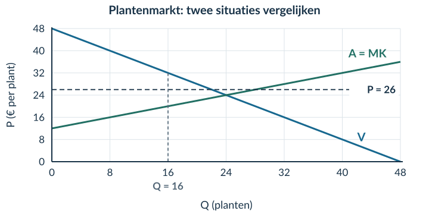<figcaption>Figuur 1 · Basisgrafiek bij opgave 2. De vragen staan op de volgende pagina.</figcaption></figure>

**Bron · Gegevens bij de boekingsgrens**

| Hoeveelheid | Betalingsbereidheid | Marginale kosten |
|---|---:|---:|
| Q = 16 | € 32 per plant | € 20 per plant |
| Mogelijke 17e transactie | € 31 | € 20,50 |

Een lokale krant meldt dat planten in gele potten populair zijn. Dit gegeven verandert de hierboven gegeven functies niet.

**Opgave 2 · Plantenmarkt — vragen**

Gebruik de bronnen op de vorige pagina.

a) Bereken het vrije evenwicht en markeer het in de grafiek. Bereken CS, PS en TS in dat evenwicht.

b) Bereken Qd en Qs bij P = € 26. Leg uit waarom het werkelijke aantal transacties 16 is. Noem welke kopers en verkopers handelen.

c) Bereken CS, PS en TS onder de reserveringsregel. Gebruik rechthoeken en driehoeken en noteer de eenheden.

d) Bereken het welvaartsverlies op twee manieren: via het verschil in TS en via een driehoek. Arceer en benoem het gebied in de grafiek.

e) Een aanbieder zegt: ‘Ons gezamenlijke PS is hoger dan in het vrije evenwicht. De reserveringsregel is dus efficiënt.’ Beoordeel deze uitspraak met de berekende totalen én de mogelijke 17e transactie.

f) Een koper vindt de reserveringsregel oneerlijk. Bewijst jouw berekening dat oordeel? Licht toe.

<b>Controleer de samenhang</b> Zijn de gebieden gebaseerd op 16 werkelijke transacties, niet op alle gevraagde of aangeboden planten? Geven beide manieren hetzelfde welvaartsverlies? Noemt je Pareto-uitleg zowel voordeel als haalbaarheid en het ontbreken van nadeel voor anderen?

### Voor je naar de doeloefening gaat

Kijk bij een fout niet alleen naar het eindgetal. Zoek de eerste stap waar het misging. Was dat de hoeveelheid, het gebied, de hoogte, de eenheid of de economische conclusie?

<b>Twee uitspraken die niet hetzelfde betekenen</b> ‘De verkopers ontvangen meer surplus’ beschrijft een groepsvoordeel. ‘Het totaal surplus is groter’ beschrijft een gezamenlijke uitkomst. ‘Niemand gaat erop achteruit’ is nog een andere, sterkere uitspraak.

## Doeloefening

**Opgave 3 · Huurfietsen op een eiland — gegevens**

Op een eiland worden huurfietsen verhandeld. Gebruik vraag P=80−Q en aanbod P=20+0,5Q. Zonder beperking ontstaat een marktevenwicht. In het hoogseizoen zet een kosteloos verruimbare boekingsregel de transactieprijs op €45 en het aantal boekingen op maximaal 30, hoewel het platform technisch minstens 40 transacties kan verwerken. De 30 fietsen gaan naar de huurders met de hoogste betalingsbereidheid en worden aangeboden door de verhuurders met de laagste marginale kosten. Bij verruiming blijven de prijs en bestaande transacties ongewijzigd. Een bron vermeldt ook dat de meeste fietsen blauw zijn; dat gegeven is economisch niet relevant.

<figure>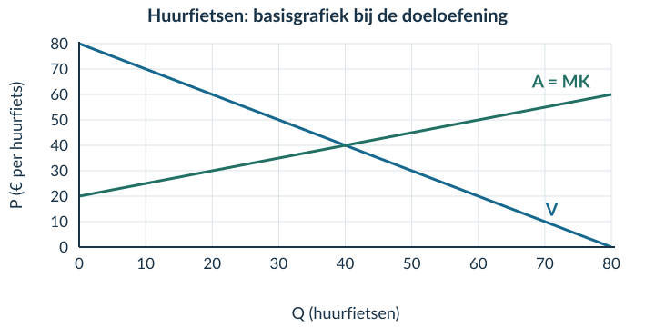<figcaption>Figuur 2 · Basisgrafiek bij de doeloefening. De vragen staan op de volgende pagina.</figcaption></figure>

**Bron · Hulpcijfers bij de boekingsregel**

<table class="source-table"><thead><tr><th>Toestand</th><th>Qd</th><th>Qs</th><th>Betalingsbereidheid</th><th>Marginale kosten</th></tr></thead><tbody><tr><td>P = € 45 en Q = 30</td><td>35</td><td>50</td><td>€ 50 bij Q = 30</td><td>€ 35 bij Q = 30</td></tr><tr><td>Mogelijke 31e transactie</td><td>—</td><td>—</td><td>€ 49</td><td>€ 35,50</td></tr></tbody></table>

Omdat Qd = 35 en Qs = 50, is de boekingsgrens van 30 bindend. P is in euro per huurfiets en Q in huurfietsen. Binnen deze opgave lees je de aanbodlijn als MK.

**Opgave 3 · Huurfietsen op een eiland — vragen**

Gebruik de bronnen op de vorige pagina.

1) Selecteer de gegevens die nodig zijn om het vrije evenwicht te berekenen, noem het irrelevante gegeven en bereken Pe en Qe.

2) Bereken bij het vrije evenwicht CS, PS en TS.

3) Bereken bij 30 transacties en P=€45 met de gegeven allocatieregel CS, PS en TS. Gebruik de hulpcijfers en alleen rechthoeken en driehoeken.

4) Bereken het welvaartsverlies en arceer dit in de basisgrafiek. Benoem basis en hoogte; teken de vraag- en aanbodlijn niet opnieuw.

5) Een verhuurder zegt: ‘PS is bij de beperking hoger, dus de uitkomst is Pareto-efficiënt.’ Beoordeel deze uitspraak met beide TS-waarden en de gegeven betalingsbereidheid en marginale kosten van de 31e transactie.

6) Leg uit waarom de efficiëntievergelijking niet bepaalt welke uitkomst eerlijker is.

<b>Loop je antwoord eenmaal na</b> Je hebt twee situaties doorgerekend. Staat bij elke uitkomst duidelijk bij welke situatie zij hoort? Je hebt één efficiëntieclaim beoordeeld. Is het verschil tussen een groter PS, een groter TS en een Paretoverbetering zichtbaar in je uitleg?

### De kern in je eigen woorden

Je hoeft niet opnieuw alle getallen op te schrijven. Lees je antwoord op vraag 5 hardop na. Is voor iemand die de grafiek nog niet begrijpt duidelijk **waarom extra handel in deze situatie mogelijk is zonder anderen te schaden**?

Een correcte berekening en een passende economische verklaring horen bij elkaar. Het eindbedrag alleen vertelt nog niet wie voordeel mist en waarom.

## Denkertje / Bonusopgave

**Opgave 4 · Wie mag er verkopen?**

Twee kopers hebben € 30 en € 24 over voor elk één product. Drie aanbieders kunnen elk één product leveren; hun MK zijn € 5, € 11 en € 20. Er worden twee producten verkocht tegen € 22 per stuk.

Vergelijk verkoop door de aanbieders met MK € 5 en € 11 met verkoop door die met MK € 5 en € 20. Bereken het gezamenlijke voordeel in beide gevallen. Leg uit waarom hetzelfde aantal transacties tegen dezelfde prijs niet altijd hetzelfde TS oplevert.

### Eerder geleerde stof combineren

**Opgave 5 · Elasticiteit en omzet (§2.2)**

P stijgt van € 10 naar € 12; Q daalt van 100 naar 90. Andere vraagfactoren blijven gelijk.

a) Bereken Ev en de omzet vóór en na de verandering.

b) Kun je met alleen deze gegevens ook CS en PS berekenen? Leg uit wat er ontbreekt.

**Opgave 6 · Producentensurplus en winst (§2.1 en §2.3.2)**

Een bedrijf heeft € 1.000 omzet, € 600 totale variabele kosten en € 250 totale constante kosten. Het gegeven producentensurplus is € 400.

a) Bereken de winst.

b) Leg uit waarom het PS en de winst hier niet gelijk zijn.

**Opgave 7 · Twee uitkomsten naast elkaar**

Maximaal TS is € 800. In situatie A geldt CS = € 500 en PS = € 300. In situatie B geldt CS = € 350 en PS = € 430.

a) Bereken het welvaartsverlies in beide situaties.

b) ‘B is eerlijker, want het voordeel is daar gelijkmatiger verdeeld.’ Is dit een uitkomst van de berekening of een waardeoordeel? Leg uit.

<!-- Native reconstruction of accepted physical page 109; see the revision provenance. -->
<article class="native-theory" data-accepted-page="109">
<svg aria-hidden="true" class="native-decoration" style="left:53.3583pt;top:77.7636pt;width:488.5591pt;height:2.1pt" viewbox="53.3583 77.7636 488.5591 2.1"><path d="M 53.8583 51.0236 H 541.4174 V 78.2636 H 53.8583 Z M 53.8583 51.0236 H 541.4174 V 79.3636 H 53.8583 Z" fill="#007da2" fill-rule="evenodd" stroke="none" stroke-width="0"></path></svg>
<svg aria-hidden="true" class="native-decoration" style="left:53.3583pt;top:218.0111pt;width:142.3921pt;height:21.951pt" viewbox="53.3583 218.0111 142.3921 21.951"><path d="M 53.8583 218.5111 H 195.2504 V 239.4621 H 53.8583 Z" fill="#eaf1f4" fill-rule="nonzero" stroke="none" stroke-width="0"></path></svg>
<svg aria-hidden="true" class="native-decoration" style="left:194.7504pt;top:218.0111pt;width:347.167pt;height:21.951pt" viewbox="194.7504 218.0111 347.167 21.951"><path d="M 195.2504 218.5111 H 541.4174 V 239.4621 H 195.2504 Z" fill="#eaf1f4" fill-rule="nonzero" stroke="none" stroke-width="0"></path></svg>
<svg aria-hidden="true" class="native-decoration" style="left:53.3583pt;top:271.7891pt;width:142.3921pt;height:22.101pt" viewbox="53.3583 271.7891 142.3921 22.101"><path d="M 53.8583 272.2891 H 195.2504 V 293.3901 H 53.8583 Z" fill="#f6f9fa" fill-rule="nonzero" stroke="none" stroke-width="0"></path></svg>
<svg aria-hidden="true" class="native-decoration" style="left:194.7504pt;top:271.7891pt;width:347.167pt;height:22.101pt" viewbox="194.7504 271.7891 347.167 22.101"><path d="M 195.2504 272.2891 H 541.4174 V 293.3901 H 195.2504 Z" fill="#f6f9fa" fill-rule="nonzero" stroke="none" stroke-width="0"></path></svg>
<svg aria-hidden="true" class="native-decoration" style="left:53.3583pt;top:271.7891pt;width:142.3921pt;height:1pt" viewbox="53.3583 271.7891 142.3921 1"><path d="M 53.8583 272.2891 L 195.2504 272.2891" fill="none" fill-rule="nonzero" stroke="#dce5e9" stroke-width="0.45000001788139343"></path></svg>
<svg aria-hidden="true" class="native-decoration" style="left:194.7504pt;top:271.7891pt;width:347.167pt;height:1pt" viewbox="194.7504 271.7891 347.167 1"><path d="M 195.2504 272.2891 L 541.4174 272.2891" fill="none" fill-rule="nonzero" stroke="#dce5e9" stroke-width="0.45000001788139343"></path></svg>
<svg aria-hidden="true" class="native-decoration" style="left:53.3583pt;top:292.8901pt;width:142.3921pt;height:1pt" viewbox="53.3583 292.8901 142.3921 1"><path d="M 53.8583 293.3901 L 195.2504 293.3901" fill="none" fill-rule="nonzero" stroke="#dce5e9" stroke-width="0.45000001788139343"></path></svg>
<svg aria-hidden="true" class="native-decoration" style="left:194.7504pt;top:292.8901pt;width:347.167pt;height:1pt" viewbox="194.7504 292.8901 347.167 1"><path d="M 195.2504 293.3901 L 541.4174 293.3901" fill="none" fill-rule="nonzero" stroke="#dce5e9" stroke-width="0.45000001788139343"></path></svg>
<svg aria-hidden="true" class="native-decoration" style="left:53.3583pt;top:325.6421pt;width:142.3921pt;height:1pt" viewbox="53.3583 325.6421 142.3921 1"><path d="M 53.8583 326.1421 L 195.2504 326.1421" fill="none" fill-rule="nonzero" stroke="#dce5e9" stroke-width="0.45000001788139343"></path></svg>
<svg aria-hidden="true" class="native-decoration" style="left:194.7504pt;top:325.6421pt;width:347.167pt;height:1pt" viewbox="194.7504 325.6421 347.167 1"><path d="M 195.2504 326.1421 L 541.4174 326.1421" fill="none" fill-rule="nonzero" stroke="#dce5e9" stroke-width="0.45000001788139343"></path></svg>
<svg aria-hidden="true" class="native-decoration" style="left:53.2583pt;top:238.8621pt;width:142.5921pt;height:1.2pt" viewbox="53.2583 238.8621 142.5921 1.2"><path d="M 53.8583 239.4621 L 195.2504 239.4621" fill="none" fill-rule="nonzero" stroke="#cbdbe2" stroke-width="0.6000000238418579"></path></svg>
<svg aria-hidden="true" class="native-decoration" style="left:194.6504pt;top:238.8621pt;width:347.367pt;height:1.2pt" viewbox="194.6504 238.8621 347.367 1.2"><path d="M 195.2504 239.4621 L 541.4174 239.4621" fill="none" fill-rule="nonzero" stroke="#cbdbe2" stroke-width="0.6000000238418579"></path></svg>
<svg aria-hidden="true" class="native-decoration" style="left:53.3583pt;top:354.9961pt;width:242.2795pt;height:46.7pt" viewbox="53.3583 354.9961 242.2795 46.7"><path d="M 53.8583 355.4961 H 295.1378 V 401.1961 H 53.8583 Z" fill="#eaf4f8" fill-rule="nonzero" stroke="none" stroke-width="0"></path></svg>
<svg aria-hidden="true" class="native-decoration" style="left:299.6378pt;top:354.9961pt;width:242.2796pt;height:46.7pt" viewbox="299.6378 354.9961 242.2796 46.7"><path d="M 300.1378 355.4961 H 541.4174 V 401.1961 H 300.1378 Z" fill="#edf5f2" fill-rule="nonzero" stroke="none" stroke-width="0"></path></svg>
<svg aria-hidden="true" class="native-decoration" style="left:53.3583pt;top:354.9961pt;width:3pt;height:46.7pt" viewbox="53.3583 354.9961 3 46.7"><path d="M 55.8583 355.4961 H 295.1378 V 401.1961 H 55.8583 Z M 53.8583 355.4961 H 295.1378 V 401.1961 H 53.8583 Z" fill="#007da2" fill-rule="evenodd" stroke="none" stroke-width="0"></path></svg>
<svg aria-hidden="true" class="native-decoration" style="left:299.6378pt;top:354.9961pt;width:3pt;height:46.7pt" viewbox="299.6378 354.9961 3 46.7"><path d="M 302.1378 355.4961 H 541.4174 V 401.1961 H 302.1378 Z M 300.1378 355.4961 H 541.4174 V 401.1961 H 300.1378 Z" fill="#008779" fill-rule="evenodd" stroke="none" stroke-width="0"></path></svg>
<svg aria-hidden="true" class="native-decoration" style="left:53.3583pt;top:460.8511pt;width:242.2795pt;height:100.044pt" viewbox="53.3583 460.8511 242.2795 100.044"><path d="M 53.8583 461.3511 H 295.1378 V 560.3951 H 53.8583 Z" fill="#eaf4f8" fill-rule="nonzero" stroke="none" stroke-width="0"></path></svg>
<svg aria-hidden="true" class="native-decoration" style="left:299.6378pt;top:460.8511pt;width:242.2796pt;height:100.044pt" viewbox="299.6378 460.8511 242.2796 100.044"><path d="M 300.1378 461.3511 H 541.4174 V 560.3951 H 300.1378 Z" fill="#faf2e8" fill-rule="nonzero" stroke="none" stroke-width="0"></path></svg>
<svg aria-hidden="true" class="native-decoration" style="left:53.3583pt;top:460.8511pt;width:3pt;height:100.044pt" viewbox="53.3583 460.8511 3 100.044"><path d="M 55.8583 461.3511 H 295.1378 V 560.3951 H 55.8583 Z M 53.8583 461.3511 H 295.1378 V 560.3951 H 53.8583 Z" fill="#007da2" fill-rule="evenodd" stroke="none" stroke-width="0"></path></svg>
<svg aria-hidden="true" class="native-decoration" style="left:299.6378pt;top:460.8511pt;width:3pt;height:100.044pt" viewbox="299.6378 460.8511 3 100.044"><path d="M 302.1378 461.3511 H 541.4174 V 560.3951 H 302.1378 Z M 300.1378 461.3511 H 541.4174 V 560.3951 H 300.1378 Z" fill="#b76518" fill-rule="evenodd" stroke="none" stroke-width="0"></path></svg>
<svg aria-hidden="true" class="native-decoration" style="left:53.3583pt;top:652.0761pt;width:488.5591pt;height:42.22pt" viewbox="53.3583 652.0761 488.5591 42.22"><path d="M 53.8583 652.5761 H 541.4174 V 693.7961 H 53.8583 Z" fill="#faf2e8" fill-rule="nonzero" stroke="none" stroke-width="0"></path></svg>
<h1 class="native-text" data-layout-height="24.1192" data-layout-width="360.4784" style="left:53.8583pt;top:50.5842pt;line-height:21.1192pt">2.3 · Surplus en welvaart: de vaste rekenroute</h1>
<figure class="native-figure" style="left:53.8583pt;top:87pt;width:491.4173pt;height:88.0703pt"><figcaption class="native-text" data-layout-height="13.0195" data-layout-width="292.4309" style="left:0pt;top:91.0702pt;line-height:10.0195pt">Figuur 3. Begin met de werkelijke transacties, niet met een oppervlakteformule.</figcaption></figure>
<h2 class="native-text" data-layout-height="17.7595" data-layout-width="238.5613" style="left:53.8583pt;top:196.567pt;line-height:14.7595pt">1 · Welke hoeveelheid hoort bij de situatie?</h2>
<table aria-label="Tabel bij De hele rekenroute op één pagina" class="native-table" style="left:53.8583pt;top:218.51pt;width:487.5591pt;height:107.63pt"><tbody>
<tr>
<th scope="col" style="left:0pt;top:0pt;width:141.3921pt;height:20.95pt">

Situatie

</th>
<th scope="col" style="left:141.3921pt;top:0pt;width:346.167pt;height:20.95pt">

Werkwijze

</th>
</tr>
<tr>
<td style="left:0pt;top:20.95pt;width:141.3921pt;height:32.83pt">

Gegeven prijs

</td>
<td style="left:141.3921pt;top:20.95pt;width:346.167pt;height:32.83pt">

Vul P in de vraagfunctie in. Controleer of alle gevraagde producten ook worden

verkocht.

</td>
</tr>
<tr>
<td style="left:0pt;top:53.78pt;width:141.3921pt;height:21.1pt">

Vrij evenwicht

</td>
<td style="left:141.3921pt;top:53.78pt;width:346.167pt;height:21.1pt">

Stel vraag en aanbod gelijk. Bereken Qe en vul die hoeveelheid in voor Pe.

</td>
</tr>
<tr>
<td style="left:0pt;top:74.88pt;width:141.3921pt;height:32.75pt">

Boekingsgrens

</td>
<td style="left:141.3921pt;top:74.88pt;width:346.167pt;height:32.75pt">

Bereken Qd en Qs. Gebruik de grens voor de werkelijke transacties. Controleer 

wie de producten koopt en levert.

</td>
</tr>
</tbody></table>
<h2 class="native-text" data-layout-height="17.7595" data-layout-width="276.7268" style="left:53.8583pt;top:334.552pt;line-height:14.7595pt">2 · Kies de gebieden bij die werkelijke hoeveelheid</h2>

Consumentensurplus

Producentensurplus

Boven de prijs en onder de vraaglijn.

Onder de prijs en boven de MK-lijn.

Beide gebieden stoppen bij de werkelijk verhandelde Q. Eindigt het gebied in een punt op de prijs? Dan kan het een driehoek zijn. Blijft bij de laatste transactie voordeel over? Splits het in een rechthoek plus driehoek.

<h2 class="native-text" data-layout-height="17.7595" data-layout-width="253.4929" style="left:53.8583pt;top:440.407pt;line-height:14.7595pt">3 · Bereken de delen en controleer de eenheid</h2>

Oppervlakten

Totalen

<h2 class="native-text" data-layout-height="18.8396" data-layout-width="179.8761" style="left:64.8583pt;top:487.4873pt;line-height:15.8396pt">Driehoek = ½ × basis × hoogte</h2>

TS = CS + PS

Welvaartsverlies = maximaal TS − werkelijk TS.

<h2 class="native-text" data-layout-height="18.8396" data-layout-width="164.5776" style="left:64.8583pt;top:509.5153pt;line-height:15.8396pt">Rechthoek = basis × hoogte</h2>

Hoeveelheid × € per product = euro.

Controle: bereken ook het gemiste gebied.

Verliesdriehoek: basis = gemiste transacties; hoogte = betalingsbereidheid − MK bij de grens. Niet de marktprijs of de prijsverandering.

<h2 class="native-text" data-layout-height="17.7595" data-layout-width="202.4866" style="left:53.8583pt;top:599.6059pt;line-height:14.7595pt">4 · Leg uit wat de berekening bewijst</h2>

Betalingsbereidheid &gt; MK betekent gezamenlijk voordeel van extra handel. Een Paretoverbetering vraagt méér: de verandering moet haalbaar zijn en niemand schaden. Een hoger TS bewijst geen eerlijkere verdeling.

Terugzoeken: CS §2.3.1 p. 2–5; PS en TS §2.3.2 p. 10–14; boekingsgrens p. 20–21; welvaartsverlies p. 22; Pareto p. 23.

</article>

<!-- Native reconstruction of accepted physical page 110; see the revision provenance. -->
<article class="native-theory" data-accepted-page="110">
<svg aria-hidden="true" class="native-decoration" style="left:53.3583pt;top:77.7636pt;width:488.5591pt;height:2.1pt" viewbox="53.3583 77.7636 488.5591 2.1"><path d="M 53.8583 51.0236 H 541.4174 V 78.2636 H 53.8583 Z M 53.8583 51.0236 H 541.4174 V 79.3636 H 53.8583 Z" fill="#007da2" fill-rule="evenodd" stroke="none" stroke-width="0"></path></svg>
<svg aria-hidden="true" class="native-decoration" style="left:53.3583pt;top:85.8636pt;width:161.8945pt;height:21.951pt" viewbox="53.3583 85.8636 161.8945 21.951"><path d="M 53.8583 86.3636 H 214.7527 V 107.3146 H 53.8583 Z" fill="#eaf1f4" fill-rule="nonzero" stroke="none" stroke-width="0"></path></svg>
<svg aria-hidden="true" class="native-decoration" style="left:214.2527pt;top:85.8636pt;width:283.7843pt;height:21.951pt" viewbox="214.2527 85.8636 283.7843 21.951"><path d="M 214.7527 86.3636 H 497.537 V 107.3146 H 214.7527 Z" fill="#eaf1f4" fill-rule="nonzero" stroke="none" stroke-width="0"></path></svg>
<svg aria-hidden="true" class="native-decoration" style="left:497.037pt;top:85.8636pt;width:44.8803pt;height:21.951pt" viewbox="497.037 85.8636 44.8803 21.951"><path d="M 497.537 86.3636 H 541.4174 V 107.3146 H 497.537 Z" fill="#eaf1f4" fill-rule="nonzero" stroke="none" stroke-width="0"></path></svg>
<svg aria-hidden="true" class="native-decoration" style="left:53.3583pt;top:127.9906pt;width:161.8945pt;height:33.752pt" viewbox="53.3583 127.9906 161.8945 33.752"><path d="M 53.8583 128.4906 H 214.7527 V 161.2426 H 53.8583 Z" fill="#f6f9fa" fill-rule="nonzero" stroke="none" stroke-width="0"></path></svg>
<svg aria-hidden="true" class="native-decoration" style="left:214.2527pt;top:127.9906pt;width:283.7843pt;height:33.752pt" viewbox="214.2527 127.9906 283.7843 33.752"><path d="M 214.7527 128.4906 H 497.537 V 161.2426 H 214.7527 Z" fill="#f6f9fa" fill-rule="nonzero" stroke="none" stroke-width="0"></path></svg>
<svg aria-hidden="true" class="native-decoration" style="left:497.037pt;top:127.9906pt;width:44.8803pt;height:33.752pt" viewbox="497.037 127.9906 44.8803 33.752"><path d="M 497.537 128.4906 H 541.4174 V 161.2426 H 497.537 Z" fill="#f6f9fa" fill-rule="nonzero" stroke="none" stroke-width="0"></path></svg>
<svg aria-hidden="true" class="native-decoration" style="left:53.3583pt;top:193.4946pt;width:161.8945pt;height:22.101pt" viewbox="53.3583 193.4946 161.8945 22.101"><path d="M 53.8583 193.9946 H 214.7527 V 215.0956 H 53.8583 Z" fill="#f6f9fa" fill-rule="nonzero" stroke="none" stroke-width="0"></path></svg>
<svg aria-hidden="true" class="native-decoration" style="left:214.2527pt;top:193.4946pt;width:283.7843pt;height:22.101pt" viewbox="214.2527 193.4946 283.7843 22.101"><path d="M 214.7527 193.9946 H 497.537 V 215.0956 H 214.7527 Z" fill="#f6f9fa" fill-rule="nonzero" stroke="none" stroke-width="0"></path></svg>
<svg aria-hidden="true" class="native-decoration" style="left:497.037pt;top:193.4946pt;width:44.8803pt;height:22.101pt" viewbox="497.037 193.4946 44.8803 22.101"><path d="M 497.537 193.9946 H 541.4174 V 215.0956 H 497.537 Z" fill="#f6f9fa" fill-rule="nonzero" stroke="none" stroke-width="0"></path></svg>
<svg aria-hidden="true" class="native-decoration" style="left:53.3583pt;top:235.6966pt;width:161.8945pt;height:33.752pt" viewbox="53.3583 235.6966 161.8945 33.752"><path d="M 53.8583 236.1966 H 214.7527 V 268.9486 H 53.8583 Z" fill="#f6f9fa" fill-rule="nonzero" stroke="none" stroke-width="0"></path></svg>
<svg aria-hidden="true" class="native-decoration" style="left:214.2527pt;top:235.6966pt;width:283.7843pt;height:33.752pt" viewbox="214.2527 235.6966 283.7843 33.752"><path d="M 214.7527 236.1966 H 497.537 V 268.9486 H 214.7527 Z" fill="#f6f9fa" fill-rule="nonzero" stroke="none" stroke-width="0"></path></svg>
<svg aria-hidden="true" class="native-decoration" style="left:497.037pt;top:235.6966pt;width:44.8803pt;height:33.752pt" viewbox="497.037 235.6966 44.8803 33.752"><path d="M 497.537 236.1966 H 541.4174 V 268.9486 H 497.537 Z" fill="#f6f9fa" fill-rule="nonzero" stroke="none" stroke-width="0"></path></svg>
<svg aria-hidden="true" class="native-decoration" style="left:53.3583pt;top:301.2006pt;width:161.8945pt;height:33.752pt" viewbox="53.3583 301.2006 161.8945 33.752"><path d="M 53.8583 301.7006 H 214.7527 V 334.4526 H 53.8583 Z" fill="#f6f9fa" fill-rule="nonzero" stroke="none" stroke-width="0"></path></svg>
<svg aria-hidden="true" class="native-decoration" style="left:214.2527pt;top:301.2006pt;width:283.7843pt;height:33.752pt" viewbox="214.2527 301.2006 283.7843 33.752"><path d="M 214.7527 301.7006 H 497.537 V 334.4526 H 214.7527 Z" fill="#f6f9fa" fill-rule="nonzero" stroke="none" stroke-width="0"></path></svg>
<svg aria-hidden="true" class="native-decoration" style="left:497.037pt;top:301.2006pt;width:44.8803pt;height:33.752pt" viewbox="497.037 301.2006 44.8803 33.752"><path d="M 497.537 301.7006 H 541.4174 V 334.4526 H 497.537 Z" fill="#f6f9fa" fill-rule="nonzero" stroke="none" stroke-width="0"></path></svg>
<svg aria-hidden="true" class="native-decoration" style="left:53.3583pt;top:355.0536pt;width:161.8945pt;height:33.752pt" viewbox="53.3583 355.0536 161.8945 33.752"><path d="M 53.8583 355.5536 H 214.7527 V 388.3056 H 53.8583 Z" fill="#f6f9fa" fill-rule="nonzero" stroke="none" stroke-width="0"></path></svg>
<svg aria-hidden="true" class="native-decoration" style="left:214.2527pt;top:355.0536pt;width:283.7843pt;height:33.752pt" viewbox="214.2527 355.0536 283.7843 33.752"><path d="M 214.7527 355.5536 H 497.537 V 388.3056 H 214.7527 Z" fill="#f6f9fa" fill-rule="nonzero" stroke="none" stroke-width="0"></path></svg>
<svg aria-hidden="true" class="native-decoration" style="left:497.037pt;top:355.0536pt;width:44.8803pt;height:33.752pt" viewbox="497.037 355.0536 44.8803 33.752"><path d="M 497.537 355.5536 H 541.4174 V 388.3056 H 497.537 Z" fill="#f6f9fa" fill-rule="nonzero" stroke="none" stroke-width="0"></path></svg>
<svg aria-hidden="true" class="native-decoration" style="left:53.3583pt;top:408.9066pt;width:161.8945pt;height:33.752pt" viewbox="53.3583 408.9066 161.8945 33.752"><path d="M 53.8583 409.4066 H 214.7527 V 442.1586 H 53.8583 Z" fill="#f6f9fa" fill-rule="nonzero" stroke="none" stroke-width="0"></path></svg>
<svg aria-hidden="true" class="native-decoration" style="left:214.2527pt;top:408.9066pt;width:283.7843pt;height:33.752pt" viewbox="214.2527 408.9066 283.7843 33.752"><path d="M 214.7527 409.4066 H 497.537 V 442.1586 H 214.7527 Z" fill="#f6f9fa" fill-rule="nonzero" stroke="none" stroke-width="0"></path></svg>
<svg aria-hidden="true" class="native-decoration" style="left:497.037pt;top:408.9066pt;width:44.8803pt;height:33.752pt" viewbox="497.037 408.9066 44.8803 33.752"><path d="M 497.537 409.4066 H 541.4174 V 442.1586 H 497.537 Z" fill="#f6f9fa" fill-rule="nonzero" stroke="none" stroke-width="0"></path></svg>
<svg aria-hidden="true" class="native-decoration" style="left:53.3583pt;top:127.9906pt;width:161.8945pt;height:1pt" viewbox="53.3583 127.9906 161.8945 1"><path d="M 53.8583 128.4906 L 214.7527 128.4906" fill="none" fill-rule="nonzero" stroke="#dce5e9" stroke-width="0.45000001788139343"></path></svg>
<svg aria-hidden="true" class="native-decoration" style="left:214.2527pt;top:127.9906pt;width:283.7843pt;height:1pt" viewbox="214.2527 127.9906 283.7843 1"><path d="M 214.7527 128.4906 L 497.537 128.4906" fill="none" fill-rule="nonzero" stroke="#dce5e9" stroke-width="0.45000001788139343"></path></svg>
<svg aria-hidden="true" class="native-decoration" style="left:497.037pt;top:127.9906pt;width:44.8803pt;height:1pt" viewbox="497.037 127.9906 44.8803 1"><path d="M 497.537 128.4906 L 541.4174 128.4906" fill="none" fill-rule="nonzero" stroke="#dce5e9" stroke-width="0.45000001788139343"></path></svg>
<svg aria-hidden="true" class="native-decoration" style="left:53.3583pt;top:160.7426pt;width:161.8945pt;height:1pt" viewbox="53.3583 160.7426 161.8945 1"><path d="M 53.8583 161.2426 L 214.7527 161.2426" fill="none" fill-rule="nonzero" stroke="#dce5e9" stroke-width="0.45000001788139343"></path></svg>
<svg aria-hidden="true" class="native-decoration" style="left:214.2527pt;top:160.7426pt;width:283.7843pt;height:1pt" viewbox="214.2527 160.7426 283.7843 1"><path d="M 214.7527 161.2426 L 497.537 161.2426" fill="none" fill-rule="nonzero" stroke="#dce5e9" stroke-width="0.45000001788139343"></path></svg>
<svg aria-hidden="true" class="native-decoration" style="left:497.037pt;top:160.7426pt;width:44.8803pt;height:1pt" viewbox="497.037 160.7426 44.8803 1"><path d="M 497.537 161.2426 L 541.4174 161.2426" fill="none" fill-rule="nonzero" stroke="#dce5e9" stroke-width="0.45000001788139343"></path></svg>
<svg aria-hidden="true" class="native-decoration" style="left:53.3583pt;top:193.4946pt;width:161.8945pt;height:1pt" viewbox="53.3583 193.4946 161.8945 1"><path d="M 53.8583 193.9946 L 214.7527 193.9946" fill="none" fill-rule="nonzero" stroke="#dce5e9" stroke-width="0.45000001788139343"></path></svg>
<svg aria-hidden="true" class="native-decoration" style="left:214.2527pt;top:193.4946pt;width:283.7843pt;height:1pt" viewbox="214.2527 193.4946 283.7843 1"><path d="M 214.7527 193.9946 L 497.537 193.9946" fill="none" fill-rule="nonzero" stroke="#dce5e9" stroke-width="0.45000001788139343"></path></svg>
<svg aria-hidden="true" class="native-decoration" style="left:497.037pt;top:193.4946pt;width:44.8803pt;height:1pt" viewbox="497.037 193.4946 44.8803 1"><path d="M 497.537 193.9946 L 541.4174 193.9946" fill="none" fill-rule="nonzero" stroke="#dce5e9" stroke-width="0.45000001788139343"></path></svg>
<svg aria-hidden="true" class="native-decoration" style="left:53.3583pt;top:214.5956pt;width:161.8945pt;height:1pt" viewbox="53.3583 214.5956 161.8945 1"><path d="M 53.8583 215.0956 L 214.7527 215.0956" fill="none" fill-rule="nonzero" stroke="#dce5e9" stroke-width="0.45000001788139343"></path></svg>
<svg aria-hidden="true" class="native-decoration" style="left:214.2527pt;top:214.5956pt;width:283.7843pt;height:1pt" viewbox="214.2527 214.5956 283.7843 1"><path d="M 214.7527 215.0956 L 497.537 215.0956" fill="none" fill-rule="nonzero" stroke="#dce5e9" stroke-width="0.45000001788139343"></path></svg>
<svg aria-hidden="true" class="native-decoration" style="left:497.037pt;top:214.5956pt;width:44.8803pt;height:1pt" viewbox="497.037 214.5956 44.8803 1"><path d="M 497.537 215.0956 L 541.4174 215.0956" fill="none" fill-rule="nonzero" stroke="#dce5e9" stroke-width="0.45000001788139343"></path></svg>
<svg aria-hidden="true" class="native-decoration" style="left:53.3583pt;top:235.6966pt;width:161.8945pt;height:1pt" viewbox="53.3583 235.6966 161.8945 1"><path d="M 53.8583 236.1966 L 214.7527 236.1966" fill="none" fill-rule="nonzero" stroke="#dce5e9" stroke-width="0.45000001788139343"></path></svg>
<svg aria-hidden="true" class="native-decoration" style="left:214.2527pt;top:235.6966pt;width:283.7843pt;height:1pt" viewbox="214.2527 235.6966 283.7843 1"><path d="M 214.7527 236.1966 L 497.537 236.1966" fill="none" fill-rule="nonzero" stroke="#dce5e9" stroke-width="0.45000001788139343"></path></svg>
<svg aria-hidden="true" class="native-decoration" style="left:497.037pt;top:235.6966pt;width:44.8803pt;height:1pt" viewbox="497.037 235.6966 44.8803 1"><path d="M 497.537 236.1966 L 541.4174 236.1966" fill="none" fill-rule="nonzero" stroke="#dce5e9" stroke-width="0.45000001788139343"></path></svg>
<svg aria-hidden="true" class="native-decoration" style="left:53.3583pt;top:268.4486pt;width:161.8945pt;height:1pt" viewbox="53.3583 268.4486 161.8945 1"><path d="M 53.8583 268.9486 L 214.7527 268.9486" fill="none" fill-rule="nonzero" stroke="#dce5e9" stroke-width="0.45000001788139343"></path></svg>
<svg aria-hidden="true" class="native-decoration" style="left:214.2527pt;top:268.4486pt;width:283.7843pt;height:1pt" viewbox="214.2527 268.4486 283.7843 1"><path d="M 214.7527 268.9486 L 497.537 268.9486" fill="none" fill-rule="nonzero" stroke="#dce5e9" stroke-width="0.45000001788139343"></path></svg>
<svg aria-hidden="true" class="native-decoration" style="left:497.037pt;top:268.4486pt;width:44.8803pt;height:1pt" viewbox="497.037 268.4486 44.8803 1"><path d="M 497.537 268.9486 L 541.4174 268.9486" fill="none" fill-rule="nonzero" stroke="#dce5e9" stroke-width="0.45000001788139343"></path></svg>
<svg aria-hidden="true" class="native-decoration" style="left:53.3583pt;top:301.2006pt;width:161.8945pt;height:1pt" viewbox="53.3583 301.2006 161.8945 1"><path d="M 53.8583 301.7006 L 214.7527 301.7006" fill="none" fill-rule="nonzero" stroke="#dce5e9" stroke-width="0.45000001788139343"></path></svg>
<svg aria-hidden="true" class="native-decoration" style="left:214.2527pt;top:301.2006pt;width:283.7843pt;height:1pt" viewbox="214.2527 301.2006 283.7843 1"><path d="M 214.7527 301.7006 L 497.537 301.7006" fill="none" fill-rule="nonzero" stroke="#dce5e9" stroke-width="0.45000001788139343"></path></svg>
<svg aria-hidden="true" class="native-decoration" style="left:497.037pt;top:301.2006pt;width:44.8803pt;height:1pt" viewbox="497.037 301.2006 44.8803 1"><path d="M 497.537 301.7006 L 541.4174 301.7006" fill="none" fill-rule="nonzero" stroke="#dce5e9" stroke-width="0.45000001788139343"></path></svg>
<svg aria-hidden="true" class="native-decoration" style="left:53.3583pt;top:333.9526pt;width:161.8945pt;height:1pt" viewbox="53.3583 333.9526 161.8945 1"><path d="M 53.8583 334.4526 L 214.7527 334.4526" fill="none" fill-rule="nonzero" stroke="#dce5e9" stroke-width="0.45000001788139343"></path></svg>
<svg aria-hidden="true" class="native-decoration" style="left:214.2527pt;top:333.9526pt;width:283.7843pt;height:1pt" viewbox="214.2527 333.9526 283.7843 1"><path d="M 214.7527 334.4526 L 497.537 334.4526" fill="none" fill-rule="nonzero" stroke="#dce5e9" stroke-width="0.45000001788139343"></path></svg>
<svg aria-hidden="true" class="native-decoration" style="left:497.037pt;top:333.9526pt;width:44.8803pt;height:1pt" viewbox="497.037 333.9526 44.8803 1"><path d="M 497.537 334.4526 L 541.4174 334.4526" fill="none" fill-rule="nonzero" stroke="#dce5e9" stroke-width="0.45000001788139343"></path></svg>
<svg aria-hidden="true" class="native-decoration" style="left:53.3583pt;top:355.0536pt;width:161.8945pt;height:1pt" viewbox="53.3583 355.0536 161.8945 1"><path d="M 53.8583 355.5536 L 214.7527 355.5536" fill="none" fill-rule="nonzero" stroke="#dce5e9" stroke-width="0.45000001788139343"></path></svg>
<svg aria-hidden="true" class="native-decoration" style="left:214.2527pt;top:355.0536pt;width:283.7843pt;height:1pt" viewbox="214.2527 355.0536 283.7843 1"><path d="M 214.7527 355.5536 L 497.537 355.5536" fill="none" fill-rule="nonzero" stroke="#dce5e9" stroke-width="0.45000001788139343"></path></svg>
<svg aria-hidden="true" class="native-decoration" style="left:497.037pt;top:355.0536pt;width:44.8803pt;height:1pt" viewbox="497.037 355.0536 44.8803 1"><path d="M 497.537 355.5536 L 541.4174 355.5536" fill="none" fill-rule="nonzero" stroke="#dce5e9" stroke-width="0.45000001788139343"></path></svg>
<svg aria-hidden="true" class="native-decoration" style="left:53.3583pt;top:387.8056pt;width:161.8945pt;height:1pt" viewbox="53.3583 387.8056 161.8945 1"><path d="M 53.8583 388.3056 L 214.7527 388.3056" fill="none" fill-rule="nonzero" stroke="#dce5e9" stroke-width="0.45000001788139343"></path></svg>
<svg aria-hidden="true" class="native-decoration" style="left:214.2527pt;top:387.8056pt;width:283.7843pt;height:1pt" viewbox="214.2527 387.8056 283.7843 1"><path d="M 214.7527 388.3056 L 497.537 388.3056" fill="none" fill-rule="nonzero" stroke="#dce5e9" stroke-width="0.45000001788139343"></path></svg>
<svg aria-hidden="true" class="native-decoration" style="left:497.037pt;top:387.8056pt;width:44.8803pt;height:1pt" viewbox="497.037 387.8056 44.8803 1"><path d="M 497.537 388.3056 L 541.4174 388.3056" fill="none" fill-rule="nonzero" stroke="#dce5e9" stroke-width="0.45000001788139343"></path></svg>
<svg aria-hidden="true" class="native-decoration" style="left:53.3583pt;top:408.9066pt;width:161.8945pt;height:1pt" viewbox="53.3583 408.9066 161.8945 1"><path d="M 53.8583 409.4066 L 214.7527 409.4066" fill="none" fill-rule="nonzero" stroke="#dce5e9" stroke-width="0.45000001788139343"></path></svg>
<svg aria-hidden="true" class="native-decoration" style="left:214.2527pt;top:408.9066pt;width:283.7843pt;height:1pt" viewbox="214.2527 408.9066 283.7843 1"><path d="M 214.7527 409.4066 L 497.537 409.4066" fill="none" fill-rule="nonzero" stroke="#dce5e9" stroke-width="0.45000001788139343"></path></svg>
<svg aria-hidden="true" class="native-decoration" style="left:497.037pt;top:408.9066pt;width:44.8803pt;height:1pt" viewbox="497.037 408.9066 44.8803 1"><path d="M 497.537 409.4066 L 541.4174 409.4066" fill="none" fill-rule="nonzero" stroke="#dce5e9" stroke-width="0.45000001788139343"></path></svg>
<svg aria-hidden="true" class="native-decoration" style="left:53.3583pt;top:441.6586pt;width:161.8945pt;height:1pt" viewbox="53.3583 441.6586 161.8945 1"><path d="M 53.8583 442.1586 L 214.7527 442.1586" fill="none" fill-rule="nonzero" stroke="#dce5e9" stroke-width="0.45000001788139343"></path></svg>
<svg aria-hidden="true" class="native-decoration" style="left:214.2527pt;top:441.6586pt;width:283.7843pt;height:1pt" viewbox="214.2527 441.6586 283.7843 1"><path d="M 214.7527 442.1586 L 497.537 442.1586" fill="none" fill-rule="nonzero" stroke="#dce5e9" stroke-width="0.45000001788139343"></path></svg>
<svg aria-hidden="true" class="native-decoration" style="left:497.037pt;top:441.6586pt;width:44.8803pt;height:1pt" viewbox="497.037 441.6586 44.8803 1"><path d="M 497.537 442.1586 L 541.4174 442.1586" fill="none" fill-rule="nonzero" stroke="#dce5e9" stroke-width="0.45000001788139343"></path></svg>
<svg aria-hidden="true" class="native-decoration" style="left:53.2583pt;top:106.7146pt;width:162.0945pt;height:1.2pt" viewbox="53.2583 106.7146 162.0945 1.2"><path d="M 53.8583 107.3146 L 214.7527 107.3146" fill="none" fill-rule="nonzero" stroke="#cbdbe2" stroke-width="0.6000000238418579"></path></svg>
<svg aria-hidden="true" class="native-decoration" style="left:214.1527pt;top:106.7146pt;width:283.9843pt;height:1.2pt" viewbox="214.1527 106.7146 283.9843 1.2"><path d="M 214.7527 107.3146 L 497.537 107.3146" fill="none" fill-rule="nonzero" stroke="#cbdbe2" stroke-width="0.6000000238418579"></path></svg>
<svg aria-hidden="true" class="native-decoration" style="left:496.937pt;top:106.7146pt;width:45.0803pt;height:1.2pt" viewbox="496.937 106.7146 45.0803 1.2"><path d="M 497.537 107.3146 L 541.4174 107.3146" fill="none" fill-rule="nonzero" stroke="#cbdbe2" stroke-width="0.6000000238418579"></path></svg>
<svg aria-hidden="true" class="native-decoration" style="left:53.3583pt;top:471.0126pt;width:488.5591pt;height:46.177pt" viewbox="53.3583 471.0126 488.5591 46.177"><path d="M 53.8583 471.5126 H 541.4174 V 516.6896 H 53.8583 Z" fill="#eaf4f8" fill-rule="nonzero" stroke="none" stroke-width="0"></path></svg>
<svg aria-hidden="true" class="native-decoration" style="left:53.3583pt;top:471.0126pt;width:3pt;height:46.177pt" viewbox="53.3583 471.0126 3 46.177"><path d="M 55.8583 471.5126 H 541.4174 V 516.6896 H 55.8583 Z M 53.8583 471.5126 H 541.4174 V 516.6896 H 53.8583 Z" fill="#007da2" fill-rule="evenodd" stroke="none" stroke-width="0"></path></svg>
<svg aria-hidden="true" class="native-decoration" style="left:53.3583pt;top:522.1896pt;width:488.5591pt;height:58.69pt" viewbox="53.3583 522.1896 488.5591 58.69"><path d="M 53.8583 522.6896 H 541.4174 V 580.3796 H 53.8583 Z" fill="#edf5f2" fill-rule="nonzero" stroke="none" stroke-width="0"></path></svg>
<svg aria-hidden="true" class="native-decoration" style="left:53.3583pt;top:522.1896pt;width:3pt;height:58.69pt" viewbox="53.3583 522.1896 3 58.69"><path d="M 55.8583 522.6896 H 541.4174 V 580.3796 H 55.8583 Z M 53.8583 522.6896 H 541.4174 V 580.3796 H 53.8583 Z" fill="#008779" fill-rule="evenodd" stroke="none" stroke-width="0"></path></svg>
<svg aria-hidden="true" class="native-decoration" style="left:53.3583pt;top:585.8796pt;width:488.5591pt;height:58.6899pt" viewbox="53.3583 585.8796 488.5591 58.6899"><path d="M 53.8583 586.3796 H 541.4174 V 644.0696 H 53.8583 Z" fill="#faf2e8" fill-rule="nonzero" stroke="none" stroke-width="0"></path></svg>
<svg aria-hidden="true" class="native-decoration" style="left:53.3583pt;top:585.8796pt;width:3pt;height:58.6899pt" viewbox="53.3583 585.8796 3 58.6899"><path d="M 55.8583 586.3796 H 541.4174 V 644.0696 H 55.8583 Z M 53.8583 586.3796 H 541.4174 V 644.0696 H 53.8583 Z" fill="#b76518" fill-rule="evenodd" stroke="none" stroke-width="0"></path></svg>
<h1 class="native-text" data-layout-height="24.1192" data-layout-width="309.4753" style="left:53.8583pt;top:50.5842pt;line-height:21.1192pt">2.3 · Begrippen en verschillen bij elkaar</h1>
<table aria-label="Tabel bij Begrippen en veelgemaakte verwisselingen" class="native-table" style="left:53.8583pt;top:86.29pt;width:487.5591pt;height:355.87pt"><tbody>
<tr>
<th scope="col" style="left:0pt;top:0pt;width:160.8945pt;height:21.1pt">

Begrip

</th>
<th scope="col" style="left:160.8945pt;top:0pt;width:282.7843pt;height:21.1pt">

Betekenis in dit hoofdstuk

</th>
<th scope="col" style="left:443.6787pt;top:0pt;width:43.8803pt;height:21.1pt">

Zie p.

</th>
</tr>
<tr>
<td style="left:0pt;top:21.1pt;width:160.8945pt;height:21.1pt">

Betalingsbereidheid

</td>
<td style="left:160.8945pt;top:21.1pt;width:282.7843pt;height:21.1pt">

Wat een koper maximaal voor een product wil betalen.

</td>
<td style="left:443.6787pt;top:21.1pt;width:43.8803pt;height:21.1pt">

2

</td>
</tr>
<tr>
<td style="left:0pt;top:42.2pt;width:160.8945pt;height:32.75pt">

Consumentensurplus (CS)

</td>
<td style="left:160.8945pt;top:42.2pt;width:282.7843pt;height:32.75pt">

Betalingsbereidheid min betaalde prijs, opgeteld over de

gekochte producten.

</td>
<td style="left:443.6787pt;top:42.2pt;width:43.8803pt;height:32.75pt">

2–5

</td>
</tr>
<tr>
<td style="left:0pt;top:74.95pt;width:160.8945pt;height:32.75pt">

Marginale kosten (MK)

</td>
<td style="left:160.8945pt;top:74.95pt;width:282.7843pt;height:32.75pt">

Extra kosten per extra product. In de gegeven marktmodellen af

te lezen op de aanbodlijn.

</td>
<td style="left:443.6787pt;top:74.95pt;width:43.8803pt;height:32.75pt">

10–11

</td>
</tr>
<tr>
<td style="left:0pt;top:107.7pt;width:160.8945pt;height:21.11pt">

Producentensurplus (PS)

</td>
<td style="left:160.8945pt;top:107.7pt;width:282.7843pt;height:21.11pt">

Ontvangen prijs min MK, opgeteld over de verkochte producten.

</td>
<td style="left:443.6787pt;top:107.7pt;width:43.8803pt;height:21.11pt">

10–11

</td>
</tr>
<tr>
<td style="left:0pt;top:128.81pt;width:160.8945pt;height:21.1pt">

Totaal surplus (TS)

</td>
<td style="left:160.8945pt;top:128.81pt;width:282.7843pt;height:21.1pt">

Het gezamenlijke voordeel van kopers en verkopers: CS + PS.

</td>
<td style="left:443.6787pt;top:128.81pt;width:43.8803pt;height:21.1pt">

12

</td>
</tr>
<tr>
<td style="left:0pt;top:149.91pt;width:160.8945pt;height:32.75pt">

Vrij marktevenwicht

</td>
<td style="left:160.8945pt;top:149.91pt;width:282.7843pt;height:32.75pt">

Prijs en hoeveelheid waarbij vraag en aanbod gelijk zijn, zonder

de besproken boekingsgrens.

</td>
<td style="left:443.6787pt;top:149.91pt;width:43.8803pt;height:32.75pt">

12–13

</td>
</tr>
<tr>
<td style="left:0pt;top:182.66pt;width:160.8945pt;height:32.75pt">

Bindende boekingsgrens

</td>
<td style="left:160.8945pt;top:182.66pt;width:282.7843pt;height:32.75pt">

Een regel die minder transacties toestaat dan bij de gegeven prijs

mogelijk zijn.

</td>
<td style="left:443.6787pt;top:182.66pt;width:43.8803pt;height:32.75pt">

20

</td>
</tr>
<tr>
<td style="left:0pt;top:215.41pt;width:160.8945pt;height:32.75pt">

Toewijzingsregel

(allocatieregel)

</td>
<td style="left:160.8945pt;top:215.41pt;width:282.7843pt;height:32.75pt">

De afspraak over welke kopers en verkopers de toegestane

transacties uitvoeren.

</td>
<td style="left:443.6787pt;top:215.41pt;width:43.8803pt;height:32.75pt">

20

</td>
</tr>
<tr>
<td style="left:0pt;top:248.16pt;width:160.8945pt;height:21.1pt">

Welvaartsverlies

</td>
<td style="left:160.8945pt;top:248.16pt;width:282.7843pt;height:21.1pt">

Maximaal TS min werkelijk TS, binnen het gegeven model.

</td>
<td style="left:443.6787pt;top:248.16pt;width:43.8803pt;height:21.1pt">

22

</td>
</tr>
<tr>
<td style="left:0pt;top:269.26pt;width:160.8945pt;height:32.76pt">

Paretoverbetering

</td>
<td style="left:160.8945pt;top:269.26pt;width:282.7843pt;height:32.76pt">

Een haalbare verandering die minstens één persoon helpt en

niemand schaadt.

</td>
<td style="left:443.6787pt;top:269.26pt;width:43.8803pt;height:32.76pt">

23

</td>
</tr>
<tr>
<td style="left:0pt;top:302.02pt;width:160.8945pt;height:21.1pt">

Pareto-efficiëntie

</td>
<td style="left:160.8945pt;top:302.02pt;width:282.7843pt;height:21.1pt">

Er is geen haalbare Paretoverbetering meer mogelijk.

</td>
<td style="left:443.6787pt;top:302.02pt;width:43.8803pt;height:21.1pt">

23

</td>
</tr>
<tr>
<td style="left:0pt;top:323.12pt;width:160.8945pt;height:32.75pt">

Eerlijke verdeling

</td>
<td style="left:160.8945pt;top:323.12pt;width:282.7843pt;height:32.75pt">

Een oordeel over wie welk voordeel zou moeten krijgen. Dit volgt

niet alleen uit TS.

</td>
<td style="left:443.6787pt;top:323.12pt;width:43.8803pt;height:32.75pt">

23

</td>
</tr>
</tbody></table>
<h2 class="native-text" data-layout-height="17.7595" data-layout-width="185.0212" style="left:53.8583pt;top:450.5685pt;line-height:14.7595pt">Drie verschillen om te onthouden</h2>

Prijs ≠ betalingsbereidheid

Een koper kan meer over hebben voor een product dan hij betaalt. Het verschil vormt zijn surplus.

Omzet ≠ producentensurplus ≠ winst

Omzet is P × Q. Bij PS vergelijk je met de marginale productiekosten. Voor winst trek je alle kosten af, ook de constante kosten.

Groter totaal ≠ niemand benadelen

TS kan groeien terwijl een groep verliest. Bij Pareto kijk je naar de gevolgen voor alle betrokkenen, niet alleen naar de som.

In boek 3 gebruik je deze gebieden opnieuw. De basis blijft: werkelijke transacties → gebieden → berekening → economische uitleg.

</article>