
4VECO · ECONOMIE · 4 VWO · BOEK 2

Surplus en welvaart

Wie heeft voordeel van een transactie?

Je koopt een kaartje voor € 20, terwijl je er € 30 voor over had. De verkoper ontvangt meer dan het aanbieden van die extra plaats kost. **Jullie kunnen allebei voordeel hebben van dezelfde transactie.**

In dit hoofdstuk maak je dat voordeel zichtbaar. Je berekent het voor kopers, voor verkopers en voor de markt als geheel. Daarna onderzoek je wat er verloren gaat als voordelige transacties niet doorgaan.

<a href="#s231"><b><em class="toc-page">2</em>2.3.1 · Consumentensurplus</b>Van betalingsbereidheid naar het voordeel van alle kopers.</a>
<a href="#s232"><b><em class="toc-page">10</em>2.3.2 · Producentensurplus en totaal surplus</b>Het voordeel van verkopers en het gezamenlijke voordeel.</a>
<a href="#s233"><b><em class="toc-page">20</em>2.3.3 · Pareto-efficiëntie en welvaartsverlies</b>Werkelijke transacties, gemiste voordelen en eerlijke verdeling.</a>
<a href="#s234"><b><em class="toc-page">31</em>2.3.4 · Gemengde opgaven</b>Bronnen selecteren, gebieden berekenen en uitspraken beoordelen.</a>
<a href="#overzicht"><b><em class="toc-page">37</em>Hoofdstukoverzicht en begrippen</b>De rekenroute, formules en belangrijkste verschillen bij elkaar.</a>

<b>Na dit hoofdstuk kun je</b> hoeveelheden en een evenwicht berekenen; consumentensurplus, producentensurplus en totaal surplus herkennen en berekenen; de aanbodlijn als marginale-kostenlijn lezen; bij een boekingsgrens de werkelijke transacties bepalen; welvaartsverlies berekenen en arceren; en efficiëntie onderscheiden van eerlijkheid.

<b>Zo gebruik je dit hoofdstuk</b> Lees de uitleg en het uitgewerkte voorbeeld. Begeleide inoefening is voor de meeste leerlingen een normaal onderdeel van leren. Volg na de startopgaven de begeleide en zelfstandige oefening naar de doeloefening. Heb je minder tussenstappen nodig en wil je extra uitdaging? Volg de uitdagende route met de bonus. Herhaling is extra bij beide routes.

Werk in je schrift; teken of arceer in de geleverde grafiek wanneer dat wordt gevraagd. Neem tabellen over om ze in te vullen. Opgavenummers beginnen per paragraaf opnieuw. Reken tussendoor ongerond en rond geldbedragen zo nodig af op twee decimalen. De markten en getallen zijn oefensituaties.

# 2.3.1 Consumentensurplus

Je wilt naar een gamebeurs. Je hebt maximaal € 30 voor een kaartje over. Aan de kassa betaal je € 20. Je krijgt geen € 10 cadeau. Toch voelt de aankoop gunstig: het bezoek is voor jou meer waard dan je betaalt.

<b>Lesdoelen</b> Je kunt bij een gegeven prijs de gevraagde hoeveelheid berekenen; de vraaglijn en prijslijn tekenen; het consumentensurplus arceren en berekenen; en uitleggen wat dit voordeel voor de kopers betekent.

### Van betalingsbereidheid naar voordeel

Je **betalingsbereidheid** is het bedrag dat je maximaal voor een product wilt betalen. Dat begrip ken je uit boek 1. De werkelijke prijs kan lager zijn.

<b>Consumentensurplus (CS)</b> Het verschil tussen de betalingsbereidheid en de werkelijk betaalde prijs, opgeteld over de gekochte producten.

<figure>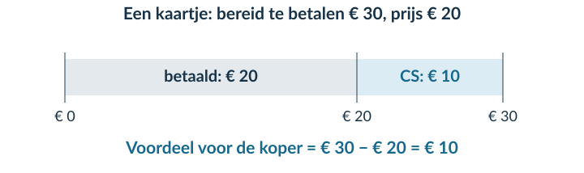<figcaption>Figuur 1 · Voor deze koper is het voordeel € 30 − € 20 = € 10. Dat is geen geldbedrag dat de verkoper terugbetaalt.</figcaption></figure>

Niet iedereen heeft dezelfde betalingsbereidheid. Een grote fan kan meer voor een kaartje over hebben dan iemand die alleen meegaat voor de gezelligheid. Bij dezelfde prijs kan hun voordeel dus verschillen.

<b>Voordeel is niet hetzelfde als korting</b> Je vergelijkt de prijs met wat de koper maximaal over heeft voor het product. Een oude winkelprijs speelt hierbij geen rol.

### Eerst een klein aantal kopers

Drie leerlingen willen ieder één kaartje. Hun betalingsbereidheid is € 30, € 25 en € 15. De prijs is € 20. De eerste twee kopen; de derde koopt niet.

| Koper | Betalingsbereidheid | Koopt bij € 20? | Consumentensurplus |
|---|---:|---|---:|
| Koper 1 | € 30 | Ja | € 10 |
| Koper 2 | € 25 | Ja | € 5 |
| Koper 3 | € 15 | Nee | € 0 |

Samen hebben de kopers **€ 15 consumentensurplus**. Je telt alleen het voordeel van werkelijk gekochte kaartjes op.

### Een grotere markt in een grafiek

Voor een grotere groep gebruiken we een doorlopende vraaglijn. Die laat zien hoeveel kaartjes worden gevraagd bij elke prijs, terwijl andere vraagfactoren gelijk blijven. Van links naar rechts neemt de betalingsbereidheid af.

Voor skatehalkaartjes geldt **P = 30 − 0,5Q**. De prijs is € 10. Alle gevraagde kaartjes worden verkocht. De vragers met de hoogste betalingsbereidheid kopen ze.

<figure>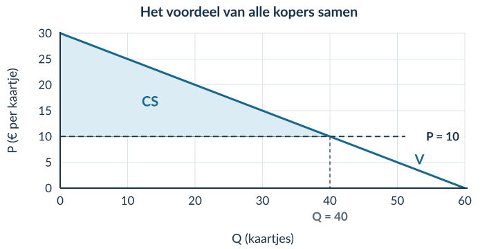<figcaption>Figuur 2 · V is de vraaglijn. De hoogte boven de prijslijn geeft het voordeel aan. Samen vormen die voordelen het blauwe gebied.</figcaption></figure>

<b>Een tabel en een doorlopende lijn zijn verschillende modellen</b> Bij enkele losse kopers tel je de voordelen op. Bij een doorlopende rechte vraaglijn bereken je het gebied als een driehoek. Je telt dan niet zelf een aantal losse kopers langs de lijn.

### Stap 1 · Vind de twee snijpunten van de vraaglijn

We gebruiken opnieuw **P = 30 − 0,5Q**. Bij Q = 0 is P = 30. Bij P = 0 geldt 0 = 30 − 0,5Q, dus Q = 60. De vraaglijn loopt door **(0; 30)** en **(60; 0)**.

### Stap 2 · Voeg de prijs en de hoeveelheid toe

Teken de horizontale prijslijn P = 10. Vul die prijs in de vraagfunctie in:

10 = 30 − 0,5Q 0,5Q = 20 Q = 40 kaartjes

<figure>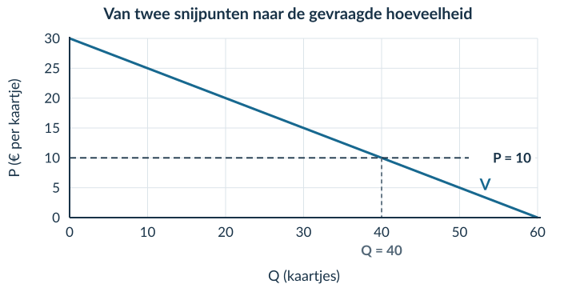<figcaption>Figuur 3 · Ga vanaf het snijpunt van de vraaglijn en de prijslijn recht naar beneden: zo lees je de gevraagde hoeveelheid af.</figcaption></figure>

### Stap 3 · Kies basis en hoogte

Het CS is de driehoek **boven de prijs en onder de vraaglijn**, tot Q = 40. De basis is 40 kaartjes. De hoogte is 30 − 10 = € 20 per kaartje.

CS = ½ × basis × hoogte CS = ½ × 40 × (30 − 10) = € 400

<b>Let op de naam en de eenheid</b> Q = 40 is hier de gevraagde én verkochte hoeveelheid bij een gegeven prijs. Zonder aanbodfunctie bereken je geen marktevenwicht. Kaartjes × euro per kaartje levert euro op: CS is hier € 400, niet € 400 per kaartje.

## Uitgewerkt voorbeeld

Een escaperoom verkoopt tickets. **P = 20 − 0,25Q**; P is in euro per ticket en Q in tickets. De prijs is € 10. Er zijn genoeg plaatsen: alle gevraagde tickets worden verkocht aan de vragers met de hoogste betalingsbereidheid.

**Gevraagd:** bepaal Q, teken de situatie, arceer en bereken CS en leg uit wat het bedrag betekent.

**1 · Hoeveelheid.** 10 = 20 − 0,25Q → 0,25Q = 10 → **Q = 40 tickets**.

**2 · Grafiek.** Bij Q = 0 is P = 20. Bij P = 0 is Q = 80. Verbind (0; 20) en (80; 0). Voeg P = 10 toe. Het snijpunt met de prijslijn is (40; 10).

<figure>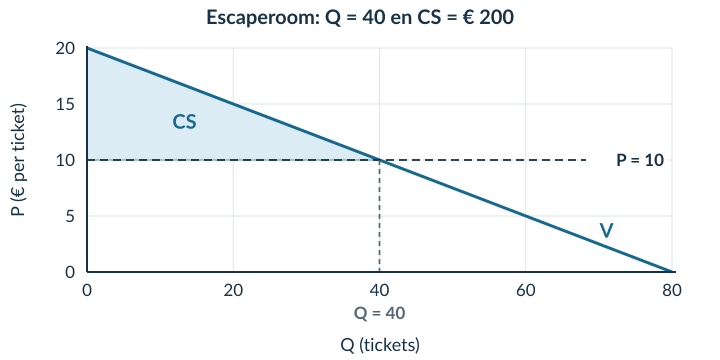<figcaption>Figuur 4 · Het gearceerde gebied hoort bij de 40 verkochte tickets. Er is geen aanbodlijn nodig voor deze CS-berekening.</figcaption></figure>

**3 · Gebied en berekening.** Arceer boven P = 10 en onder V, tot Q = 40. Basis = 40 tickets; hoogte = 20 − 10 = € 10 per ticket.

**CS = ½ × 40 × 10 = € 200.**

**4 · Betekenis.** De kopers hebben samen € 200 meer voor deze tickets over dan zij werkelijk betalen. Dat gezamenlijke voordeel is niet de omzet van de escaperoom.

<b>Samenvatting</b> Bereken eerst de verkochte hoeveelheid. Teken en benoem de assen en lijnen. CS ligt boven de prijs en onder de vraaglijn. Bij een driehoek: ½ × basis × hoogte. Eindig met euro én de betekenis voor de kopers.

## Startopgaven

**Opgave 1 · Ophalen uit boek 1 en wiskunde**

Voor een product geldt P = 16 − 0,2Q.

a) Bereken Q bij P = 6. Noteer ook beide assensnijpunten.

b) Bereken de oppervlakte van een driehoek met basis 50 en hoogte 10.

**Opgave 2 · Begripscheck**

Iris heeft € 18 over voor een toegangsbewijs. Zij betaalt € 12.

a) Bereken haar consumentensurplus.

b) Een klasgenoot noemt de betaalde € 12 haar consumentensurplus. Verbeter deze uitleg.

<b>Normale route:</b> Startopgaven → Begeleide inoefening → Zelfstandige oefening → Doeloefening. <b>Uitdagende route (minder tussenstappen, extra uitdaging):</b> Startopgaven → Zelfstandige oefening → Doeloefening → Denkertje / Bonusopgave. Herhaling is extra bij beide routes.

## Begeleide inoefening

*Begeleide inoefening hoort bij leren: je oefent met denkstappen en doet steeds meer zelf.*

**Opgave 3 · Eerst herkennen**

De klimhal gebruikt P = 24 − 0,4Q. P is in euro per kaartje; alle bij P = 8 gevraagde kaartjes worden verkocht.

<figure><figcaption>Figuur 5 · Lees eerst af; controleer daarna met de functie.</figcaption></figure>

a) Lees Q af. Vul in: 8 = 24 − 0,4Q → Q = … kaartjes.

b) Noteer basis en hoogte van het blauwe gebied. Bereken CS.

c) Leg uit waarom je de rechthoek onder P = 8 niet meetelt bij CS.

**Opgave 4 · Zelf lijnen en een gebied toevoegen**

Voor een museumavond geldt **P = 18 − 0,3Q**. P is in euro per kaartje. De prijs is € 6. Alle gevraagde kaartjes worden verkocht aan de vragers met de hoogste betalingsbereidheid.

a) Bereken de gevraagde hoeveelheid. Begin met 6 = 18 − 0,3Q.

b) Teken in het assenstelsel de vraaglijn en P = 6. Gebruik de twee assensnijpunten om de vraaglijn te tekenen.

<figure><figcaption>Figuur 6 · De assen en schaal zijn gegeven. De lijnen, snijpunten en arcering maak je zelf.</figcaption></figure>

c) Arceer en benoem CS. Bereken het met basis, hoogte en eenheid.

d) Leg uit wat het berekende bedrag voor alle kopers samen betekent.

**Opgave 5 · Zonder tekenhulp**

Een rechte vraaglijn voor fotoprints snijdt de verticale as bij € 17. Bij een prijs van € 5 worden 30 prints gevraagd en verkocht. Er is genoeg aanbod.

a) Bereken CS zonder eerst een volledige grafiek te tekenen.

b) Leg uit waarom de hoogte van het gebied € 12 per print is en niet € 5 per print.

## Zelfstandige oefening

**Opgave 6 · Zwemkaartjes**

Voor zwemkaartjes geldt **P = 18 − 0,2Q**. P is in euro per kaartje, Q is in kaartjes. Bij de gegeven prijs van € 8 worden alle gevraagde kaartjes verkocht aan de vragers met de hoogste betalingsbereidheid.

a) Bereken de gevraagde hoeveelheid.

b) Teken de vraaglijn en de prijslijn in je schrift. Benoem de assen met grootheid en eenheid. Noteer beide assensnijpunten en het snijpunt met de prijslijn.

c) Arceer en benoem het consumentensurplus.

d) Bereken het consumentensurplus met basis, hoogte en eenheid.

e) Leg de uitkomst uit voor de kopers als groep.

**Opgave 7 · Een boekenbeurs**

Voor toegangsbewijzen geldt **P = 16 − 0,1Q**. P is in euro per toegangsbewijs. De gegeven prijs is € 6. Alle gevraagde toegangsbewijzen worden verkocht.

a) Bereken Q en CS.

b) De organisatie berekent een omzet van € 600. Een leerling zegt: ‘Dan is het voordeel voor de kopers samen ook € 600.’ Beoordeel deze uitspraak met je berekening.

c) Kun je Q in deze opgave een berekende evenwichtshoeveelheid noemen? Licht toe.

<b>Controleer vóór je verdergaat</b> Staan Q en P op de juiste assen? Begint je CS-gebied bij de prijslijn, niet bij nul? Heb je het bedrag voor alle kopers uitgelegd in plaats van alleen een formule opgeschreven?

## Doeloefening

**Opgave 8 · Concertkaartjes**

Voor concertkaartjes geldt de vraagfunctie P=50−0,5Q. P is de prijs in euro per kaartje en Q het aantal gevraagde kaartjes. De gegeven marktprijs is €20. Er zijn voldoende kaartjes beschikbaar; alle bij deze prijs gevraagde kaartjes worden verkocht aan de vragers met de hoogste betalingsbereidheid. Er is in deze opgave geen aanbodfunctie.

a) Bereken de gevraagde hoeveelheid bij P=€20. Noem dit niet de evenwichtshoeveelheid.

b) Teken de vraaglijn en de horizontale prijslijn in één assenstelsel. Benoem de horizontale as als Q (kaartjes) en de verticale as als P (€ per kaartje). Noteer de snijpunten van de vraaglijn en het snijpunt met de prijslijn.

c) Arceer en benoem in je grafiek het consumentensurplus.

d) Bereken het consumentensurplus als oppervlakte van een driehoek en noteer de eenheid.

e) Leg uit wat het berekende consumentensurplus voor de kopers als groep betekent.

## Denkertje / Bonusopgave

**Opgave 9 · Een formule die toevallig klopt**

Bij het uitgewerkte voorbeeld geeft ½ × Q × P dezelfde uitkomst als de juiste CS-berekening. Een leerling denkt daarom dat dit altijd de formule is. Bedenk een tegenvoorbeeld met een rechte vraaglijn. Leg uit waarom de goede uitkomst in het voorbeeld toeval is.

## Herhaling / Herhaling en interleaving

**Opgave 10 · Procenten (§1.1.2)**

Het bezoek stijgt van 400 naar 460. Bereken de procentuele stijging.

**Opgave 11 · Kosten per product (§2.1.1)**

TK = 200 + 3Q. Bereken bij Q = 100 de totale kosten en gemiddelde totale kosten. Noteer de eenheden: Q is in producten en TK in euro.

# 2.3.2 Producentensurplus en totaal surplus

Een koper heeft € 50 over voor een drinkfles en betaalt € 35. De extra kosten om die fles te produceren zijn € 20. De koper heeft € 15 voordeel. Maar ook de verkoper ontvangt € 15 meer dan de extra kosten.

<b>Lesdoelen</b> Je kunt het marktevenwicht berekenen en CS en PS in een grafiek markeren; CS, PS en TS berekenen; de aanbodlijn binnen het gegeven model als marginale-kostenlijn lezen; en verklaren waarom TS bij het evenwicht maximaal is, zonder dit eerlijk te noemen.

### De extra kosten van een product

In §2.1.3 leerde je **marginale kosten (MK)** kennen: de extra kosten per extra product. Bij deze fles zijn die € 20. De prijs is € 35. Het verschil is een voordeel voor de verkoper.

<b>Producentensurplus (PS)</b> Het verschil tussen de ontvangen prijs en de marginale kosten, opgeteld over de verkochte producten.

<figure>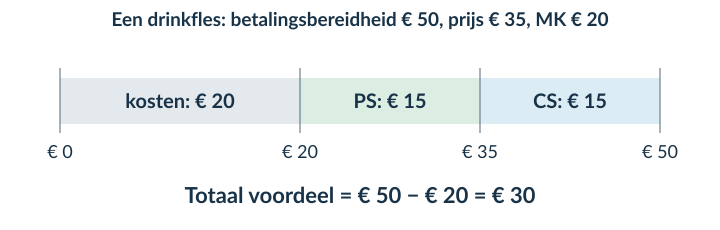<figcaption>Figuur 1 · De prijs verdeelt het voordeel tussen koper en verkoper. Samen is hun voordeel € 50 − € 20 = € 30.</figcaption></figure>

<b>Producentensurplus is niet hetzelfde als winst</b> Bij het PS vergelijk je de opbrengst met de marginale kosten van de verkochte producten. Vaste kosten moeten ook nog worden betaald. Je mag het PS daarom niet zonder meer de winst noemen.

### Een markt voor posters

Voor posters gebruiken we vraag **P = 40 − Q** en aanbod **P = 10 + 0,5Q**. P is in euro per poster, Q in posters. In dit marktmodel geeft de aanbodlijn ook de marginale kosten aan, voor alle hoeveelheden van 0 tot 40.

Een laag punt op de aanbodlijn hoort bij een goedkoop te leveren poster. Verder naar rechts liggen de marginale kosten hoger. Het model rangschikt de eenheden dus van lage naar hoge marginale kosten.

<b>Lees de aanbodlijn als MK</b> Bij Q = 10: MK = 10 + 0,5 × 10 = € 15 per poster. Bij Q = 20: MK = 10 + 0,5 × 20 = € 20 per poster. Deze marginale-kostenbetekenis is een aanname van dit marktmodel.

Bij een prijs van € 20 worden 20 posters aangeboden. Stel dat deze ook worden verkocht, door de aanbieders met de laagste marginale kosten.

<figure>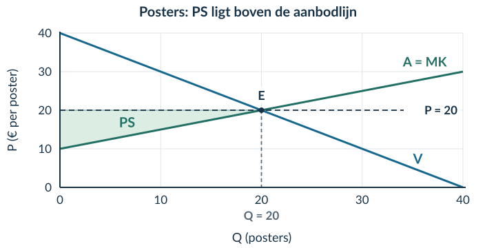<figcaption>Figuur 2 · Het groene gebied is PS: onder de prijslijn, boven A = MK, en alleen bij de verkochte 20 posters.</figcaption></figure>

De basis van de PS-driehoek is 20 posters. De hoogte is 20 − 10 = € 10 per poster. Dus **PS = ½ × 20 × 10 = € 100**.

<b>Niet de hele rechthoek onder de prijs</b> De rechthoek P × Q is de omzet. Het gebied onder de MK-lijn hoort bij de kosten van die productie, niet bij het producentensurplus.

### Eerst het evenwicht, dan de gebieden

Stel vraag en aanbod gelijk: **40 − Q = 10 + 0,5Q → Qe = 20**.
Vul Q = 20 in: **Pe = 40 − 20 = € 20 per poster**.

<figure>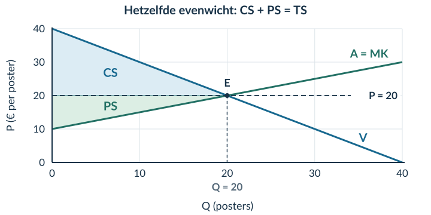<figcaption>Figuur 3 · CS = ½ × 20 × (40 − 20) = € 200. PS = € 100. De twee gebieden vormen samen het totaal surplus.</figcaption></figure>

<b>Totaal surplus (TS)</b> Het gezamenlijke voordeel van kopers en verkopers: TS = CS + PS. Op deze postermarkt is TS = € 200 + € 100 = € 300.

### Waarom ligt het grootste TS bij het evenwicht?

Vergelijk voor een extra eenheid wat de koper ervoor over heeft met de marginale kosten. Het verschil is de bijdrage aan TS.

| Plaats op de lijnen | Betalingsbereidheid | MK | Bijdrage van extra handel |
|---|---:|---:|---|
| Q = 10 | € 30 | € 15 | Positief: € 15 voordeel |
| Q = 20 | € 20 | € 20 | Op de grens: € 0 |
| Q = 30 | € 10 | € 25 | Negatief: € 15 nadeel |

Links van Q = 20 is extra handel voordelig: de betalingsbereidheid ligt boven MK. Rechts ervan zijn de MK hoger. Daarom is **TS maximaal bij Q = 20**.

<b>Maximaal binnen dit model</b> We tellen de voordelen en kosten van de betrokken kopers en verkopers. Extra handelskosten en gevolgen voor anderen blijven buiten beeld. Een hoog TS zegt bovendien niet dat het voordeel eerlijk is verdeeld.

## Uitgewerkt voorbeeld

Op een makersmarkt worden notitieboeken verkocht. Vraag: **P = 24 − 0,5Q**. Aanbod: **P = 4 + 0,5Q**. P is in euro per notitieboek; Q in notitieboeken. De aanbodlijn geeft de MK weer voor Q van 0 tot 40. We gebruiken het vrije evenwicht.

**Gevraagd:** bereken het evenwicht en CS, PS en TS; markeer de gebieden; vergelijk betalingsbereidheid en MK; beoordeel efficiëntie en verdeling.

**1 · Evenwicht.** 24 − 0,5Q = 4 + 0,5Q → **Qe = 20**.

**Pe = 24 − 0,5 × 20 = € 14 per notitieboek.**

**2 · Gebieden.** Markeer E bij (20; 14). Arceer CS boven P = 14 en onder V. Arceer PS onder P = 14 en boven A. Stop beide gebieden bij Q = 20.

<figure>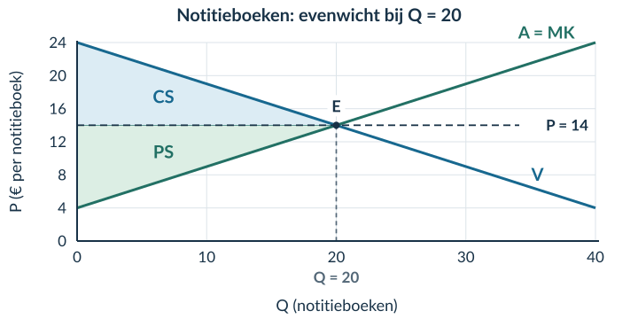<figcaption>Figuur 4 · Je voegt markeringen toe aan de gegeven lijnen. CS en PS hebben hier toevallig dezelfde oppervlakte.</figcaption></figure>

**3 · Berekenen.** De basis is telkens 20 notitieboeken.

CS = ½ × 20 × (24 − 14) = € 100 PS = ½ × 20 × (14 − 4) = € 100 TS = 100 + 100 = € 200

De prijsverschillen hebben de eenheid euro per notitieboek. Vermenigvuldiging met het aantal notitieboeken geeft euro.

### Vervolg uitgewerkt voorbeeld

**4 · Marginale vergelijking.** Vul Q in beide functies in.

| Q | Betalingsbereidheid: 24 − 0,5Q | MK: 4 + 0,5Q | Effect van extra handel op TS |
|---|---:|---:|---|
| 10 | € 19 | € 9 | Verhoogt TS: verschil € 10 |
| 30 | € 9 | € 19 | Verlaagt TS: verschil −€ 10 |

**5 · Begrensde conclusie.** Bij Q = 20 komen betalingsbereidheid en MK samen. Alle eenheden met een positief gezamenlijk voordeel kunnen dan worden verhandeld. Verder uitbreiden levert in dit model geen hoger TS op.

CS en PS zijn hier even groot. Dat is een uitkomst van de getallen, geen bewijs van eerlijkheid. De grafiek vertelt bijvoorbeeld niet hoe het voordeel binnen de groep kopers is verdeeld.

<b>Samenvatting</b> Bereken eerst Qe en Pe. CS ligt boven de prijs; PS eronder. Beide liggen tussen de betreffende lijn en de prijs. TS = CS + PS. Vergelijk voor extra handel betalingsbereidheid met MK. Maximaal TS is een efficiëntie-uitkomst, geen eerlijkheidsoordeel.

## Startopgaven

**Opgave 1 · Evenwicht ophalen (§1.3.2)**

Vraag: P = 18 − Q. Aanbod: P = 6 + 0,5Q. P is in euro per product, Q in producten. Bereken Qe en Pe.

**Opgave 2 · Van MK naar voordeel**

Een beker wordt verkocht voor € 9. De koper heeft er € 12 voor over; de marginale kosten zijn € 5.

a) Bereken het voordeel van de koper en van de verkoper bij deze transactie.

b) Bereken hun gezamenlijke voordeel. Leg uit waarom je de prijs daarvoor niet bij de betalingsbereidheid optelt.

<b>Normale route:</b> Startopgaven → Begeleide inoefening → Zelfstandige oefening → Doeloefening. <b>Uitdagende route (minder tussenstappen, extra uitdaging):</b> Startopgaven → Zelfstandige oefening → Doeloefening → Denkertje / Bonusopgave. Herhaling is extra bij beide routes.

## Begeleide inoefening

*Begeleide inoefening hoort bij leren: je oefent met denkstappen en doet steeds meer zelf.*

**Opgave 3 · Bloemenbossen**

Vraag: **P = 30 − Q**. Aanbod: **P = 6 + 0,5Q**. P is in euro per bos bloemen, Q in bossen. Binnen deze grafiek stelt de aanbodlijn de MK voor. Alle transacties in het vrije evenwicht vinden plaats.

<figure><figcaption>Figuur 5 · Het evenwicht en de arceringen zijn al gegeven. Controleer de getallen voordat je gebieden berekent.</figcaption></figure>

a) Vul de evenwichtsberekening aan: 30 − Q = 6 + 0,5Q → 24 = …Q → Qe = … en Pe = … .

b) Vul in en bereken: CS = ½ × 16 × (… − 14). PS = ½ × 16 × (14 − …). Bereken ook TS.

c) Bij Q = 10 is de betalingsbereidheid € 20 en MK € 11. Bij Q = 20 zijn deze bedragen € 10 en € 16. Geef per hoeveelheid aan of een extra transactie TS verhoogt of verlaagt. Noteer het verschil.

d) Leg met de lijnen uit waarom verder handelen tot Q = 16 gezamenlijk voordeel oplevert, maar handelen voorbij Q = 16 niet.

**Opgave 4 · Sporthanddoeken**

Vraag: **P = 32 − 0,5Q**. Aanbod: **P = 8 + 0,5Q**. P is in euro per handdoek, Q in handdoeken. De aanbodlijn geeft de MK weer.

<figure><figcaption>Figuur 6 · De lijnen zijn gegeven. Je voegt zelf het evenwicht, de prijs en de twee surplusgebieden toe.</figcaption></figure>

a) Bereken Qe en Pe. Markeer het evenwicht en arceer CS en PS.

b) Bereken CS, PS en TS met de juiste eenheden.

c) Vergelijk betalingsbereidheid en MK bij Q = 16 en bij Q = 32. Leg uit waarom het evenwicht het grootste TS geeft.

**Opgave 5 · Twee veranderingen bij één transactie**

Een mok kost € 10. De koper heeft er eerst € 14 voor over; de MK zijn € 6. Daarna stijgt de betalingsbereidheid naar € 16 en dalen de MK naar € 5. De prijs blijft € 10; dezelfde transactie gaat door.

a) Bekijk alleen de hogere betalingsbereidheid. Hoe verandert het kopersvoordeel?

b) Bekijk alleen de lagere MK. Hoe verandert het verkopersvoordeel?

c) Hoeveel neemt het gezamenlijke voordeel toe als beide veranderingen plaatsvinden?

d) ‘De twee effecten heffen elkaar op, want één bedrag stijgt en het andere daalt.’ Leg uit waarom dat onjuist is.

## Zelfstandige oefening

**Opgave 6 · Herbruikbare koffiebekers**

Vraag: **P = 36 − 0,5Q**. Aanbod: **P = 6 + 0,5Q**. P is in euro per beker, Q in bekers. De aanbodlijn is in dit model de MK-lijn. Gebruik de gegeven grafiek.

<figure><figcaption>Figuur 7 · Je hoeft de lijnen niet opnieuw te tekenen.</figcaption></figure>

a) Bereken en markeer Qe en Pe. Arceer en benoem CS en PS.

b) Bereken CS, PS en TS met basis, hoogte en eenheid.

c) Vergelijk de betalingsbereidheid met MK bij Q = 20 en Q = 40. Geef aan wat een extra transactie met TS doet.

d) Verklaar waarom TS maximaal is bij het evenwicht. Leg ook uit waarom dat geen bewijs van een eerlijke verdeling is.

**Opgave 7 · Twee begrippen, twee uitspraken**

Een verkoper heeft € 80 producentensurplus. Zijn vaste kosten zijn niet gegeven.

a) Mag je zijn winst gelijkstellen aan € 80? Leg uit.

b) Op een markt is CS € 300 en PS € 100. Bereken TS. Bewijst dit verschil dat de markt niet efficiënt is? Licht toe.

## Doeloefening

**Opgave 8 · Concertkaartjes — gegevens**

Voor concertkaartjes geldt vraag P=50−0,5Q en aanbod P=5+0,25Q. P is in euro per kaartje en Q in kaartjes. Binnen dit marktmodel stelt de inverse aanbodlijn voor 0≤Q≤100 de marginale kosten van iedere opeenvolgende eenheid voor, ook als die eenheid in het evenwicht niet wordt verkocht.

<figure><figcaption>Figuur 8 · Basisgrafiek bij opgave 8. Vraag en aanbod zijn al getekend. De vragen staan op de volgende pagina.</figcaption></figure>

**Bron · Marginale vergelijking**

| Q | Betalingsbereidheid volgens vraaglijn | Marginale kosten volgens aanbodlijn |
|---|---:|---:|
| 50 | € 25 | € 17,50 |
| 70 | € 15 | € 22,50 |

De waarden zijn met de gegeven vraag- en aanbodfunctie berekend.

<b>Notatie</b> De inverse aanbodlijn geeft de prijs bij een aangeboden hoeveelheid. In deze opgave lees je die prijs ook als de marginale kosten. Je gebruikt dezelfde Q voor de vergelijking met de vraaglijn.

**Opgave 8 · Concertkaartjes — vragen**

Gebruik de bronnen op de vorige pagina.

a) Bereken de evenwichtsprijs en -hoeveelheid.

b) Markeer het evenwicht in de basisgrafiek en arceer en benoem CS en PS. Teken de lijnen niet opnieuw.

c) Bereken CS, PS en TS met basis, hoogte en eenheid.

d) Vergelijk met de tabel bij Q=50 en Q=70 de betalingsbereidheid met de marginale kosten en geef per hoeveelheid aan of één extra transactie TS verhoogt of verlaagt.

e) Leg uit waarom TS in dit model maximaal is bij Q=60 en waarom dit geen oordeel over een eerlijke verdeling oplevert.

## Denkertje / Bonusopgave

**Opgave 9 · Dezelfde handel, een andere prijs**

Voor één transactie zijn de betalingsbereidheid € 30 en de MK € 10. Vergelijk een prijs van € 15 met een prijs van € 25. De transactie gaat in beide gevallen door.

Beredeneer wat er verandert voor de koper, de verkoper en hun gezamenlijke voordeel. Leg uit waarom je uit alleen een andere prijs niet automatisch een kleiner TS kunt afleiden.

## Herhaling / Herhaling en interleaving

**Opgave 10 · Marginale kosten (§2.1.3)**

TK stijgt van € 240 bij Q = 40 naar € 280 bij Q = 50. Bereken de marginale kosten per extra product over dit interval.

**Opgave 11 · Prijselasticiteit (§2.2.1)**

De prijs stijgt met 10%; de gevraagde hoeveelheid daalt met 5%. Bereken Ev en benoem of de vraag prijselastisch of prijsinelastisch is.

# 2.3.3 Pareto-efficiëntie en welvaartsverlies

Op de postermarkt uit §2.3.2 zijn bij vrij handelen 20 transacties mogelijk tegen € 20. Een reserveringssysteem laat nu maar **12 boekingen** toe, tegen **€ 22**. Het systeem kan technisch minstens 20 transacties verwerken. De boekingsgrens kan zonder kosten worden verruimd.

<b>Lesdoelen</b> Je kunt Pareto-efficiëntie uitleggen en toepassen; vraag, aanbod en werkelijke transacties onderscheiden; CS, PS en TS bij een boekingsgrens berekenen; welvaartsverlies berekenen en arceren; en efficiëntie onderscheiden van eerlijkheid.

### Eerst vaststellen wie echt handelt

Vraag: **P = 40 − Q**. Aanbod: **P = 10 + 0,5Q**. De aanbodlijn is de MK-lijn. Bij P = 22 is de gevraagde hoeveelheid 18 en de aangeboden hoeveelheid 24.

Vraag: 22 = 40 − Qd → Qd = 18 Aanbod: 22 = 10 + 0,5Qs → Qs = 24 Boekingsgrens: 12 → werkelijk verkocht: 12 posters

<figure>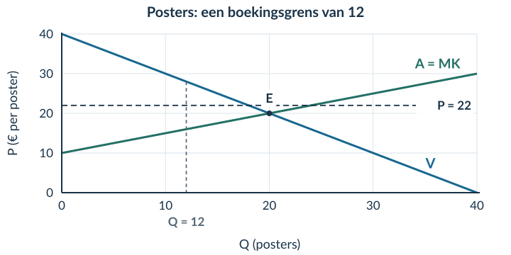<figcaption>Figuur 1 · E is het vrije evenwicht. De stippellijn bij Q = 12 stopt de handel vóór dat punt.</figcaption></figure>

De **12 vragers met de hoogste betalingsbereidheid** kopen bij de **aanbieders met de laagste MK**. Die afspraak is nodig om de surplusgebieden te bepalen.

Qd is de gevraagde hoeveelheid en Qs de aangeboden hoeveelheid. Dat zijn dezelfde begrippen als Qv en Qa in boek 1. De grens is bindend: zij ligt onder zowel Qd als Qs en houdt daardoor mogelijke transacties tegen.

### Stop bij het werkelijk verkochte aantal

Bij Q = 12 is de betalingsbereidheid **40 − 12 = € 28**. De MK zijn **10 + 0,5 × 12 = € 16**. De prijs is € 22. Ook de laatste koper en verkoper hebben nog voordeel.

<figure>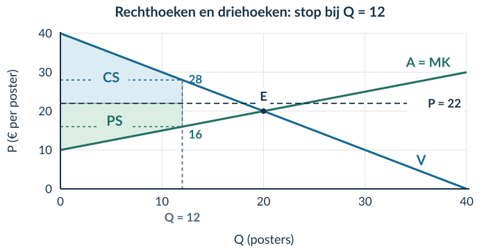<figcaption>Figuur 2 · De horizontale hulplijnen door € 28 en € 16 splitsen de gebieden. Beide oppervlakken stoppen bij Q = 12.</figcaption></figure>

### Consumentensurplus: rechthoek plus driehoek

De eerste 12 kopers hebben allemaal minstens 28 − 22 = € 6 voordeel. Dat vormt een rechthoek. Daarboven ligt een driehoek: sommige kopers hebben meer dan € 28 over voor de poster.

Rechthoek: 12 × (28 − 22) = € 72 Driehoek: ½ × 12 × (40 − 28) = € 72 CS = 72 + 72 = € 144

### Producentensurplus: dezelfde aanpak, andere grenzen

De MK lopen van € 10 tot € 16. Alle verkopers krijgen € 22. Splits daarom bij de hulplijn op € 16.

Rechthoek: 12 × (22 − 16) = € 72 Driehoek: ½ × 12 × (16 − 10) = € 36 PS = 72 + 36 = € 108

<b>Niet automatisch ½ × Q × het grootste prijsverschil</b> Bij de boekingsgrens hebben de laatste kopers en verkopers nog voordeel. Het gebied eindigt daarom niet in een punt op de prijslijn. Alleen een driehoek berekenen zou een deel overslaan.

### Vergelijk de twee totale surplussen

Zonder beperking was CS = € 200 en PS = € 100, samen **€ 300**. Bij de boekingsgrens zijn de bedragen € 144 en € 108, samen **€ 252**. Er is € 48 minder gezamenlijk voordeel.

<b>Welvaartsverlies</b> Het verschil tussen het maximaal haalbare totaal surplus en het werkelijk gerealiseerde totaal surplus binnen het gegeven model.

<figure>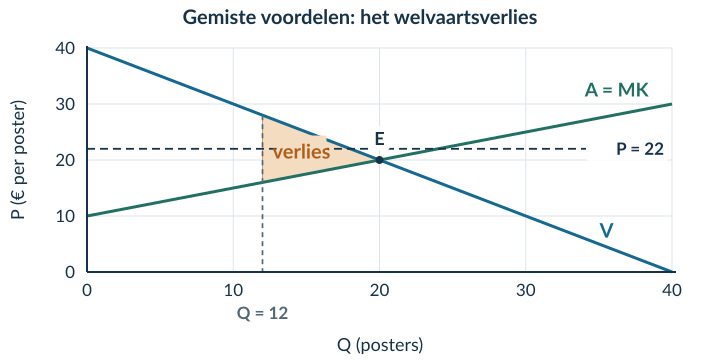<figcaption>Figuur 3 · Tussen Q = 12 en Q = 20 ligt de betalingsbereidheid boven MK. Het voordeel van die niet-doorgegane transacties ontvangt niemand.</figcaption></figure>

Er zijn twee manieren om hetzelfde verlies te berekenen.

Via de totalen: verlies = 300 − 252 = € 48 Via het gebied: verlies = ½ × (20 − 12) × (28 − 16) verlies = ½ × 8 × 12 = € 48

De basis is het aantal gemiste transacties: 8 posters. De hoogte is het verschil tussen betalingsbereidheid en MK bij de grens: € 12 per poster. Niet het verschil tussen de oude en de nieuwe prijs.

### Een verschuiving van voordeel is iets anders

PS stijgt van € 100 naar € 108. Toch daalt TS. Een deel van het kopersvoordeel verschuift naar verkopers, terwijl een ander deel door minder handel verloren gaat.

<b>Voor de één meer, samen toch minder</b> Een stijging van PS bewijst niet dat de markt als geheel erop vooruitgaat. Vergelijk altijd CS + PS vóór en na.

<b>Paretoverbetering</b> Een haalbare verandering waarbij minstens één persoon erop vooruitgaat en niemand erop achteruitgaat.

<b>Pareto-efficiëntie</b> Een situatie is Pareto-efficiënt als er geen haalbare verandering meer is die iemand beter af maakt zonder iemand anders slechter af te maken.

### Toepassen op de postermarkt

Na kosteloze verruiming kan de 13e poster worden geboekt tegen € 22. De eerste 12 transacties blijven ongewijzigd; anderen ondervinden geen gevolgen.

Bij Q = 13 is de betalingsbereidheid **€ 27** en MK **€ 16,50**. Beide nieuwe partijen hebben voordeel:

<figure>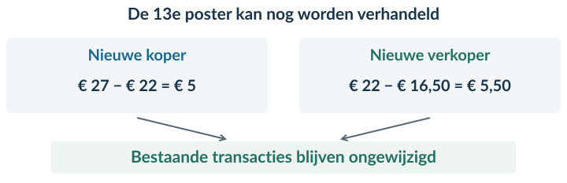<figcaption>Figuur 4 · Er bestaat een haalbare extra transactie die beide nieuwe partijen helpt en niemand schaadt. De grens van 12 is dus niet Pareto-efficiënt.</figcaption></figure>

<b>Bewijs het in drie stappen</b> 1. Laat zien dat de koper én verkoper voordeel kunnen hebben. 2. Benoem waarom de extra transactie haalbaar is. 3. Benoem waarom bestaande partijen niet slechter af zijn.

### Een hoger TS is niet automatisch een Paretoverbetering

De overgang naar het vrije evenwicht vergroot TS, maar verandert ook de prijs. PS daalt dan van € 108 naar € 100. Die hele overgang is dus niet automatisch een Paretoverbetering.

De **ene extra transactie tegen dezelfde prijs** bewijst al dat de situatie met 12 boekingen niet Pareto-efficiënt is.

<b>Efficiënt is niet hetzelfde als eerlijk</b> Zelfs als geen Paretoverbetering meer mogelijk is, kan het voordeel heel ongelijk verdeeld zijn. Wat eerlijk is, vraagt een afzonderlijk waardeoordeel.

## Uitgewerkt voorbeeld

Voor workshopplaatsen gelden **P = 30 − Q** en **P = 6 + Q**. P is in euro per plaats, Q in plaatsen. Aanbod geeft MK weer. Het vrije evenwicht is **Qe = 12, Pe = € 18**. CS en PS zijn dan elk € 72; TS is € 144.

Een regel beperkt boekingen tot **8 plaatsen tegen € 20**, terwijl er technisch minstens 12 plaatsen zijn. De 8 hoogste betalingsbereidheden en de 8 laagste MK bepalen wie handelt. Verruiming kost niets; prijs en bestaande transacties blijven gelijk.

**1 · Definitie.** Pareto-efficiënt betekent dat geen haalbare verandering iemand beter kan maken zonder iemand anders slechter te maken.

**2 · Werkelijke transacties.** Bij P = 20: Qd = 30 − 20 = **10**. Uit 20 = 6 + Qs volgt Qs = **14**. De grens van 8 ligt onder beide hoeveelheden. Er handelen dus **8** vragers en aanbieders volgens de genoemde toewijzing.

<figure>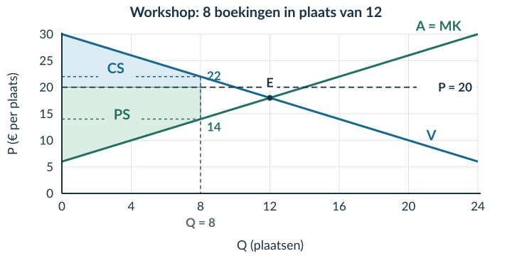<figcaption>Figuur 5 · Bij Q = 8 lees je € 22 op de vraaglijn en € 14 op de MK-lijn af. Gebruik die hoogten om de gebieden te splitsen.</figcaption></figure>

**3 · Surplussen.** Elk gebied bestaat uit twee delen.

CS = 8 × (22 − 20) + ½ × 8 × (30 − 22) CS = 16 + 32 = € 48 PS = 8 × (20 − 14) + ½ × 8 × (14 − 6) PS = 48 + 32 = € 80

### Vervolg uitgewerkt voorbeeld

**4 · Totaal en verlies.** TS = 48 + 80 = **€ 128**. Het verschil met het vrije evenwicht is 144 − 128 = **€ 16**.

<figure>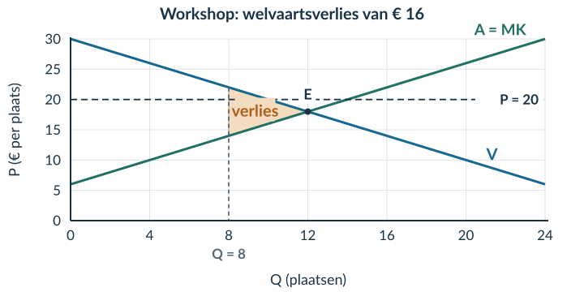<figcaption>Figuur 6 · Arceer tussen de vraaglijn en de MK-lijn, van 8 tot 12 plaatsen. De prijs van € 20 is niet de hoogte van deze driehoek.</figcaption></figure>

Controle via basis en hoogte: **½ × (12 − 8) × (22 − 14) = ½ × 4 × 8 = € 16.**

**5 · Pareto toepassen.** Voor een mogelijke 9e transactie geeft de vraaglijn € 21 betalingsbereidheid en de aanbodlijn € 15 MK. Bij P = 20 hebben de nieuwe koper en verkoper allebei voordeel. Verruiming is kosteloos en technisch mogelijk; bestaande transacties blijven gelijk. Daarom zijn 8 transacties hier **niet Pareto-efficiënt**.

**6 · Verdeling.** PS stijgt van € 72 naar € 80, maar TS daalt van € 144 naar € 128. Een hoger PS is dus geen bewijs van efficiëntie. Ook het hogere TS van het vrije evenwicht bewijst niet dat die verdeling eerlijker is.

<b>Samenvatting</b> Bepaal Qd, Qs én de werkelijke transacties. Gebruik de toewijzingsregel. Splits CS en PS zo nodig in een rechthoek en driehoek. Vergelijk TS of bereken de gemiste driehoek. Voor een Paretoverbetering moeten haalbaarheid én geen nadeel voor anderen vaststaan.

## Startopgaven

**Opgave 1 · Gebieden ophalen (§2.3.2)**

In een vrij evenwicht is Q = 20 en P = 15. De rechte vraaglijn snijdt de P-as bij 25 en de rechte MK-lijn bij 5. Bereken CS, PS en TS. P is in euro per product.

**Opgave 2 · Pareto of alleen een hoger totaal?**

Een verandering geeft koper A € 8 extra voordeel, maar verkoper B € 3 minder. Anderen merken niets. Is dit een Paretoverbetering? Licht toe.

<b>Normale route:</b> Startopgaven → Begeleide inoefening → Zelfstandige oefening → Doeloefening. <b>Uitdagende route (minder tussenstappen, extra uitdaging):</b> Startopgaven → Zelfstandige oefening → Doeloefening → Denkertje / Bonusopgave. Herhaling is extra bij beide routes.

## Begeleide inoefening

*Begeleide inoefening hoort bij leren: je oefent met denkstappen en doet steeds meer zelf.*

**Opgave 3 · Zaalplaatsen**

Vraag P = 24 − 0,5Q; aanbod/MK P = 4 + 0,5Q. P is in euro per plaats. Vrij: Qe = 20, Pe = 14, TS = € 200. Een kosteloos verruimbare grens staat 12 boekingen toe tegen P = 14. De hoogste betalingsbereidheden en laagste MK worden gekozen; uitbreiding kan zonder anderen te schaden.

<figure><figcaption>Figuur 7 · De gebieden en horizontale hulplijnen zijn gegeven.</figcaption></figure>

a) Bereken Qd en Qs. Leg uit waarom toch maar 12 transacties plaatsvinden.

b) Vul in: CS = 12 × (18 − 14) + ½ × 12 × (24 − 18). Bereken ook PS, TS en het verlies.

**Opgave 4 · Kajakverhuur**

Vraag: **P = 30 − 0,5Q**. Aanbod/MK: **P = 6 + 0,5Q**. P is in euro per verhuurbeurt; Q in verhuurbeurten. Vrij: Qe = 24 en Pe = 18; TS = € 288.

Een kosteloos verruimbare boekingsgrens beperkt het aantal tot 16, tegen P = 20. Er is technisch ruimte voor minstens 24 transacties. De huurders met de hoogste betalingsbereidheid handelen met de verhuurders met de laagste MK. Bij verruiming blijven prijs en bestaande transacties gelijk.

<figure><figcaption>Figuur 8 · Splits zelf de gebieden. De lijnen en de boekingsgrens zijn al aangegeven.</figcaption></figure>

a) Bereken Qd en Qs bij P = 20 en verklaar de 16 werkelijke transacties.

b) Bij Q = 16 is de betalingsbereidheid € 22 en MK € 14. Bereken CS, PS, TS en het welvaartsverlies. Arceer het verlies.

c) Bij een mogelijke 17e transactie zijn de betalingsbereidheid € 21,50 en MK € 14,50. Leg uit waarom de situatie met 16 transacties niet Pareto-efficiënt is. Noem ook haalbaarheid en het gevolg voor bestaande partijen.

d) ‘PS stijgt ten opzichte van het vrije evenwicht. Dus niemand gaat erop achteruit.’ Beoordeel dit met CS en PS vóór en na.

## Zelfstandige oefening

**Opgave 5 · Schilderworkshop**

Vraag: **P = 40 − Q**. Aanbod/MK: **P = 10 + Q**. P is in euro per plaats; Q in plaatsen. Vrij: Qe = 15, Pe = 25 en TS = € 225.

Een boekingsregel staat 10 plaatsen toe tegen P = 26. Er zijn technisch minstens 15 plaatsen. Verruiming is kosteloos. De hoogste betalingsbereidheden en laagste MK bepalen wie handelt; prijs en bestaande transacties blijven bij verruiming gelijk.

<figure><figcaption>Figuur 9 · Gebruik de geleverde grafiek; teken de twee lijnen niet opnieuw.</figcaption></figure>

a) Omschrijf Pareto-efficiëntie.

b) Bereken Qd en Qs. Verklaar het werkelijke aantal transacties en wie er handelen.

c) Bereken CS, PS en TS met de juiste gebieden en eenheden.

d) Bereken en arceer het welvaartsverlies. Benoem basis en hoogte.

e) Gebruik de betalingsbereidheid en MK van de mogelijke 11e transactie om de Pareto-efficiëntie te beoordelen.

f) Leg uit waarom een hoger TS niet bewijst dat een verdeling eerlijker is.

## Doeloefening

**Opgave 6 · Concertkaartjes — gegevens**

Gebruik opnieuw vraag P=50−0,5Q en aanbod P=5+0,25Q. Het vrije evenwicht is Q=60 en P=€20, met CS=€900, PS=€450 en TS=€1.350. Een kosteloos verruimbare reserveringsregel zet de prijs op €25 en beperkt boekingen tot 40 kaartjes, hoewel het platform technisch minstens 60 transacties kan verwerken. De 40 kaartjes gaan naar de vragers met de hoogste betalingsbereidheid en worden geleverd door de aanbieders met de laagste marginale kosten. Daardoor vinden precies 40 transacties plaats. Bij verruiming blijven de prijs en alle bestaande transacties ongewijzigd.

<figure><figcaption>Figuur 10 · Basisgrafiek bij opgave 6. Het vrije evenwicht E, P = 25 en Q = 40 zijn aangegeven. De vragen staan op de volgende pagina.</figcaption></figure>

<b>Dezelfde markt, een andere uitkomst</b> Vergelijk de werkelijke handel onder de reserveringsregel met het gegeven vrije evenwicht. Gebruik bij de gebieden uitsluitend de transacties die onder de regel plaatsvinden.

**Opgave 6 · Concertkaartjes — vragen**

a) Omschrijf Pareto-efficiëntie binnen dit marktmodel: wanneer kan geen haalbare extra transactie of herverdeling iemand beter maken zonder iemand anders slechter te maken?

b) Bereken bij P=€25 de gevraagde hoeveelheid (Qd) en aangeboden hoeveelheid (Qs). Leg met de reserveringsregel uit waarom het werkelijke aantal transacties 40 is en welke vragers en aanbieders handelen.

c) Bereken bij 40 transacties en P=€25 het CS en PS. Splits elk oppervlak zo nodig in een rechthoek en een driehoek; gebruik de allocatieregel.

d) Bereken TS en het welvaartsverlies ten opzichte van het vrije evenwicht. Arceer het welvaartsverlies tussen Q=40 en Q=60 in de basisgrafiek en benoem basis en hoogte.

e) Pas je definitie uit vraag a toe op de 41e transactie. Leg met betalingsbereidheid, marginale kosten en de kosteloze verruiming uit waarom 40 transacties niet Pareto-efficiënt zijn.

f) Leg uit waarom een hoger TS of Pareto-efficiëntie niet automatisch betekent dat de verdeling eerlijk is.

## Denkertje / Bonusopgave

**Opgave 7 · De verborgen voorwaarde**

Een extra transactie helpt koper en verkoper. Om haar mogelijk te maken moet iemand anders echter € 8 betalen, zonder vergoeding. Is het extra handelsvoordeel genoeg om een Paretoverbetering te bewijzen? Leg uit.

## Herhaling / Herhaling en interleaving

**Opgave 8 · Omzet en winst (§2.1.2)**

Een verkoper ontvangt € 900 omzet en maakt € 760 totale kosten. Bereken de winst.

**Opgave 9 · Eenheden (§2.3.1)**

Een surplusdriehoek heeft basis 80 kaartjes en hoogte € 12 per kaartje. Bereken het surplus met de juiste eenheid.

# 2.3.4 Gemengde opgaven

In deze paragraaf combineer je de stof uit het hoofdstuk. Je kiest zelf welke gegevens, gebieden en berekeningen nodig zijn. Er komt geen nieuwe theorie bij.

<b>Lesdoelen</b> Je kunt uit bronnen een evenwicht en surplussen berekenen; bij een boekingsregel de juiste gebieden kiezen; welvaartsverlies berekenen en arceren; en een efficiëntieclaim beoordelen zonder efficiëntie met eerlijkheid te verwarren.

<b>Zo oefen je</b> Gebruik bij de voorbereiding de uitleg en denkstappen uit dit hoofdstuk. Minder tussenstappen nodig en extra uitdaging gewenst? Kies ook de bonus. Herhaling is aanvullend.

**Opgave 1 · Lesplaatsen bij een surfschool**

Een markt voor lesplaatsen heeft vraag **P = 60 − Q** en aanbod **P = 12 + Q**. P is in euro per lesplaats, Q in lesplaatsen. Binnen het model geeft de aanbodlijn de marginale kosten weer. Er zijn geen extra handelskosten of gevolgen voor anderen.

Een informatiekaart vermeldt ook dat een van de scholen 5.000 volgers heeft. De markt is in het vrije evenwicht.

a) Selecteer de gegevens die nodig zijn om het evenwicht te berekenen. Noem het gegeven dat je niet nodig hebt.

b) Bereken Qe en Pe.

c) Bereken CS, PS en TS met basis, hoogte en eenheid.

d) Vergelijk bij Q = 30 de betalingsbereidheid en MK. Leg uit wat een extra transactie daar met TS doet.

e) Een leerling zegt: ‘Een maximaal TS betekent dat alle kopers evenveel voordeel hebben.’ Beoordeel deze uitspraak.

<b>Een volledig antwoord</b> Een berekening bevat een passende formule, ingevulde getallen, een uitkomst en een eenheid. Bij een uitleg verbind je een getal of grafiekkenmerk met de economische conclusie.

**Opgave 2 · Plantenmarkt — gegevens**

Vraag: **P = 48 − Q**. Aanbod: **P = 12 + 0,5Q**. P is in euro per plant, Q in planten. Binnen dit model is de aanbodlijn de MK-lijn. In het vrije evenwicht handelen de marktpartijen zonder boekingsgrens.

Een reserveringsregel zet de prijs op **€ 26** en laat maximaal **16 boekingen** toe. Het systeem kan technisch minstens 24 transacties verwerken. Verruiming kost niets. De 16 planten gaan naar de kopers met de hoogste betalingsbereidheid en komen van de aanbieders met de laagste MK. Bij verruiming blijven prijs en bestaande transacties ongewijzigd.

<figure><figcaption>Figuur 1 · Basisgrafiek bij opgave 2. De vragen staan op de volgende pagina.</figcaption></figure>

**Bron · Gegevens bij de boekingsgrens**

| Hoeveelheid | Betalingsbereidheid | Marginale kosten |
|---|---:|---:|
| Q = 16 | € 32 per plant | € 20 per plant |
| Mogelijke 17e transactie | € 31 | € 20,50 |

Een lokale krant meldt dat planten in gele potten populair zijn. Dit gegeven verandert de hierboven gegeven functies niet.

**Opgave 2 · Plantenmarkt — vragen**

Gebruik de bronnen op de vorige pagina.

a) Bereken het vrije evenwicht en markeer het in de grafiek. Bereken CS, PS en TS in dat evenwicht.

b) Bereken Qd en Qs bij P = € 26. Leg uit waarom het werkelijke aantal transacties 16 is. Noem welke kopers en verkopers handelen.

c) Bereken CS, PS en TS onder de reserveringsregel. Gebruik rechthoeken en driehoeken en noteer de eenheden.

d) Bereken het welvaartsverlies op twee manieren: via het verschil in TS en via een driehoek. Arceer en benoem het gebied in de grafiek.

e) Een aanbieder zegt: ‘Ons gezamenlijke PS is hoger dan in het vrije evenwicht. De reserveringsregel is dus efficiënt.’ Beoordeel deze uitspraak met de berekende totalen én de mogelijke 17e transactie.

f) Een koper vindt de reserveringsregel oneerlijk. Bewijst jouw berekening dat oordeel? Licht toe.

<b>Controleer de samenhang</b> Zijn de gebieden gebaseerd op 16 werkelijke transacties, niet op alle gevraagde of aangeboden planten? Geven beide manieren hetzelfde welvaartsverlies? Noemt je Pareto-uitleg zowel voordeel als haalbaarheid en het ontbreken van nadeel voor anderen?

### Voor je naar de doeloefening gaat

Kijk bij een fout niet alleen naar het eindgetal. Zoek de eerste stap waar het misging. Was dat de hoeveelheid, het gebied, de hoogte, de eenheid of de economische conclusie?

<b>Twee uitspraken die niet hetzelfde betekenen</b> ‘De verkopers ontvangen meer surplus’ beschrijft een groepsvoordeel. ‘Het totaal surplus is groter’ beschrijft een gezamenlijke uitkomst. ‘Niemand gaat erop achteruit’ is nog een andere, sterkere uitspraak.

## Doeloefening

**Opgave 3 · Huurfietsen op een eiland — gegevens**

Op een eiland worden huurfietsen verhandeld. Gebruik vraag P=80−Q en aanbod P=20+0,5Q. Zonder beperking ontstaat een marktevenwicht. In het hoogseizoen zet een kosteloos verruimbare boekingsregel de transactieprijs op €45 en het aantal boekingen op maximaal 30, hoewel het platform technisch minstens 40 transacties kan verwerken. De 30 fietsen gaan naar de huurders met de hoogste betalingsbereidheid en worden aangeboden door de verhuurders met de laagste marginale kosten. Bij verruiming blijven de prijs en bestaande transacties ongewijzigd. Een bron vermeldt ook dat de meeste fietsen blauw zijn; dat gegeven is economisch niet relevant.

<figure><figcaption>Figuur 2 · Basisgrafiek bij de doeloefening. De vragen staan op de volgende pagina.</figcaption></figure>

**Bron · Hulpcijfers bij de boekingsregel**

<table class="source-table"><thead><tr><th>Toestand</th><th>Qd</th><th>Qs</th><th>Betalingsbereidheid</th><th>Marginale kosten</th></tr></thead><tbody><tr><td>P = € 45 en Q = 30</td><td>35</td><td>50</td><td>€ 50 bij Q = 30</td><td>€ 35 bij Q = 30</td></tr><tr><td>Mogelijke 31e transactie</td><td>—</td><td>—</td><td>€ 49</td><td>€ 35,50</td></tr></tbody></table>

Omdat Qd = 35 en Qs = 50, is de boekingsgrens van 30 bindend. P is in euro per huurfiets en Q in huurfietsen. Binnen deze opgave lees je de aanbodlijn als MK.

**Opgave 3 · Huurfietsen op een eiland — vragen**

Gebruik de bronnen op de vorige pagina.

1) Selecteer de gegevens die nodig zijn om het vrije evenwicht te berekenen, noem het irrelevante gegeven en bereken Pe en Qe.

2) Bereken bij het vrije evenwicht CS, PS en TS.

3) Bereken bij 30 transacties en P=€45 met de gegeven allocatieregel CS, PS en TS. Gebruik de hulpcijfers en alleen rechthoeken en driehoeken.

4) Bereken het welvaartsverlies en arceer dit in de basisgrafiek. Benoem basis en hoogte; teken de vraag- en aanbodlijn niet opnieuw.

5) Een verhuurder zegt: ‘PS is bij de beperking hoger, dus de uitkomst is Pareto-efficiënt.’ Beoordeel deze uitspraak met beide TS-waarden en de gegeven betalingsbereidheid en marginale kosten van de 31e transactie.

6) Leg uit waarom de efficiëntievergelijking niet bepaalt welke uitkomst eerlijker is.

<b>Loop je antwoord eenmaal na</b> Je hebt twee situaties doorgerekend. Staat bij elke uitkomst duidelijk bij welke situatie zij hoort? Je hebt één efficiëntieclaim beoordeeld. Is het verschil tussen een groter PS, een groter TS en een Paretoverbetering zichtbaar in je uitleg?

### De kern in je eigen woorden

Je hoeft niet opnieuw alle getallen op te schrijven. Lees je antwoord op vraag 5 hardop na. Is voor iemand die de grafiek nog niet begrijpt duidelijk **waarom extra handel in deze situatie mogelijk is zonder anderen te schaden**?

Een correcte berekening en een passende economische verklaring horen bij elkaar. Het eindbedrag alleen vertelt nog niet wie voordeel mist en waarom.

## Denkertje / Bonusopgave

**Opgave 4 · Wie mag er verkopen?**

Twee kopers hebben € 30 en € 24 over voor elk één product. Drie aanbieders kunnen elk één product leveren; hun MK zijn € 5, € 11 en € 20. Er worden twee producten verkocht tegen € 22 per stuk.

Vergelijk verkoop door de aanbieders met MK € 5 en € 11 met verkoop door die met MK € 5 en € 20. Bereken het gezamenlijke voordeel in beide gevallen. Leg uit waarom hetzelfde aantal transacties tegen dezelfde prijs niet altijd hetzelfde TS oplevert.

### Eerder geleerde stof combineren

**Opgave 5 · Elasticiteit en omzet (§2.2)**

P stijgt van € 10 naar € 12; Q daalt van 100 naar 90. Andere vraagfactoren blijven gelijk.

a) Bereken Ev en de omzet vóór en na de verandering.

b) Kun je met alleen deze gegevens ook CS en PS berekenen? Leg uit wat er ontbreekt.

**Opgave 6 · Producentensurplus en winst (§2.1 en §2.3.2)**

Een bedrijf heeft € 1.000 omzet, € 600 totale variabele kosten en € 250 totale constante kosten. Het gegeven producentensurplus is € 400.

a) Bereken de winst.

b) Leg uit waarom het PS en de winst hier niet gelijk zijn.

**Opgave 7 · Twee uitkomsten naast elkaar**

Maximaal TS is € 800. In situatie A geldt CS = € 500 en PS = € 300. In situatie B geldt CS = € 350 en PS = € 430.

a) Bereken het welvaartsverlies in beide situaties.

b) ‘B is eerlijker, want het voordeel is daar gelijkmatiger verdeeld.’ Is dit een uitkomst van de berekening of een waardeoordeel? Leg uit.

# Hoofdstukoverzicht

<figure>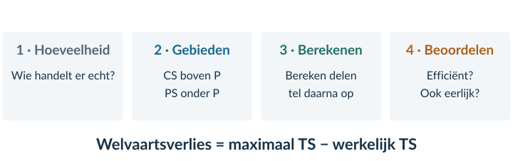<figcaption>Figuur 3 · Begin niet met een oppervlakteformule. Begin met de vraag welke producten daadwerkelijk worden verhandeld.</figcaption></figure>

### 1 · Welke hoeveelheid hoort bij de situatie?

**Gegeven prijs:** vul P in de vraagfunctie in. Kijk of alle gevraagde producten ook worden verkocht.

**Vrij evenwicht:** stel vraag- en aanbodfunctie gelijk. Bereken Qe en daarna Pe.

**Boekingsgrens:** bereken zo nodig Qd en Qs. Gebruik de regel om de werkelijke transacties te bepalen. Controleer de toewijzing aan kopers en verkopers.

### 2 · Welke oppervlakken horen erbij?

CS: boven de prijs, onder de vraaglijn PS: onder de prijs, boven de MK-lijn TS = CS + PS

Stop beide gebieden bij de werkelijk verhandelde hoeveelheid. Een driehoek eindigt in een punt. Blijft er bij de laatste transactie nog voordeel over? Splits het gebied dan in een rechthoek en een driehoek.

### 3 · Berekenen en controleren

Driehoek = ½ × basis × hoogte Rechthoek = basis × hoogte Welvaartsverlies = maximaal TS − werkelijk TS

De hoogte van een verliesdriehoek is het verschil tussen betalingsbereidheid en MK bij de grens. Controleer het antwoord door ook het verschil in TS te berekenen. Hoeveelheid × euro per product geeft euro.

### 4 · Wat mag je concluderen?

Een positieve kloof tussen betalingsbereidheid en MK wijst op gezamenlijk voordeel van extra handel. Voor een Paretoverbetering moet die handel ook haalbaar zijn en niemand schaden. Een hoger TS is geen bewijs van een eerlijke verdeling.

# Begrippen bij elkaar

| Begrip | Betekenis in dit hoofdstuk |
|---|---|
| Betalingsbereidheid | Wat een koper maximaal voor een product wil betalen. |
| Consumentensurplus (CS) | Betalingsbereidheid min betaalde prijs, opgeteld over de gekochte producten. |
| Marginale kosten (MK) | De extra kosten per extra product. In de gegeven marktmodellen af te lezen op de aanbodlijn. |
| Producentensurplus (PS) | Ontvangen prijs min MK, opgeteld over de verkochte producten. |
| Totaal surplus (TS) | Het gezamenlijke voordeel van kopers en verkopers: CS + PS. |
| Vrij marktevenwicht | Prijs en hoeveelheid waarbij vraag en aanbod gelijk zijn, zonder de besproken boekingsgrens. |
| Bindende boekingsgrens | Een regel die minder transacties toestaat dan bij de gegeven prijs mogelijk zijn. |
| Toewijzingsregel (allocatieregel) | De afspraak over welke kopers en verkopers de toegestane transacties uitvoeren. |
| Welvaartsverlies | Maximaal TS min werkelijk TS, binnen het gegeven model. |
| Paretoverbetering | Een haalbare verandering die minstens één persoon helpt en niemand schaadt. |
| Pareto-efficiëntie | Een situatie waarin geen haalbare Paretoverbetering meer mogelijk is. |
| Eerlijke verdeling | Een oordeel over wie welk voordeel zou moeten krijgen; dit volgt niet alleen uit TS. |

### Houd deze drie verschillen scherp

<b>Prijs is geen betalingsbereidheid</b> Een koper kan veel meer voor iets over hebben dan de prijs die hij betaalt. Dat verschil vormt zijn surplus.

<b>Omzet, producentensurplus en winst zijn verschillend</b> Omzet is P × Q. Voor PS kijk je naar de marginale productiekosten. Voor winst tellen alle kosten mee, ook de constante kosten.

<b>Een groter totaal is niet hetzelfde als niemand benadelen</b> TS kan groeien terwijl een groep verliest. Voor Pareto kijk je naar de gevolgen voor alle betrokkenen, niet alleen naar de som.

In boek 3 gebruik je deze gebieden en redeneringen opnieuw bij marktinterventies. De basis blijft: eerst werkelijke transacties, dan gebieden, dan de berekening en pas daarna het oordeel.
