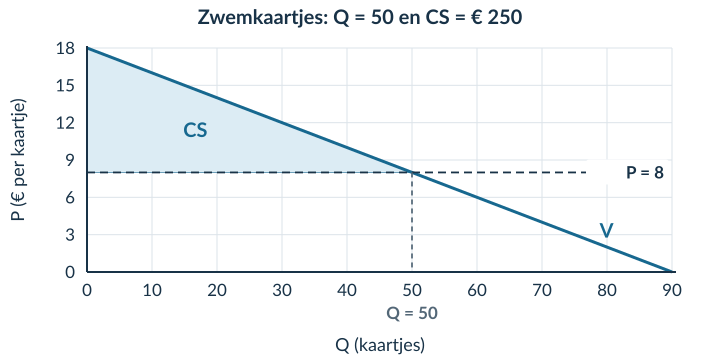

# 2.3.1 Consumentensurplus

## Opgave 1

a) Vul de prijs in: 6 = 16 − 0,2Q → 0,2Q = 10 → **Q = 50**. Bij Q = 0 is P = 16. Bij P = 0 geldt Q = 16 / 0,2 = 80. De assensnijpunten zijn **(0; 16)** en **(80; 0)**.

*Waarom:* je gebruikt de horizontale as voor Q en de verticale as voor P. Een punt noteer je dus als (Q; P).

b) Oppervlakte = ½ × basis × hoogte = **½ × 50 × 10 = 250 oppervlakte-eenheden**.

*Waarom:* een driehoek beslaat de helft van een rechthoek met dezelfde basis en hoogte. Hier is nog geen economische eenheid gegeven.

## Opgave 2

a) CS = betalingsbereidheid − prijs = **18 − 12 = € 6**.

*Waarom:* Iris heeft € 6 meer over voor het toegangsbewijs dan zij betaalt.

b) De € 12 is de betaalde prijs. Het consumentensurplus is het verschil met de betalingsbereidheid: **€ 6**. Het is geen terugbetaald geldbedrag.

## Opgave 3

a) De verticale hulplijn geeft **Q = 40 kaartjes**. Controle: 8 = 24 − 0,4Q → 0,4Q = 16 → Q = 40.

*Waarom:* het snijpunt van de prijs en de vraaglijn geeft de gevraagde hoeveelheid bij € 8.

b) Basis = 40 kaartjes; hoogte = 24 − 8 = € 16 per kaartje. **CS = ½ × 40 × 16 = € 320**.

*Waarom:* het gebied telt het voordeel van alle kopers van de 40 kaartjes op.

c) De rechthoek onder P = 8 is **P × Q**, het betaalde bedrag of de omzet: 8 × 40 = € 320. Het CS ligt erboven. Dat beide hier toevallig € 320 zijn, maakt ze niet hetzelfde begrip.

## Opgave 4

a) 6 = 18 − 0,3Q → 0,3Q = 12 → **Q = 40 kaartjes**.

b) De vraaglijn gaat door **(0; 18)** en **(60; 0)**. De prijslijn is horizontaal op P = 6. Het snijpunt is **(40; 6)**.

c) Arceer boven P = 6, onder V, tot Q = 40. Basis = 40 kaartjes; hoogte = 18 − 6 = € 12 per kaartje. **CS = ½ × 40 × 12 = € 240**.

<figure><figcaption>Opgave 4b–c · De volledige tekening. Een andere passende schaal is ook goed.</figcaption></figure>

d) De kopers hebben samen **€ 240 meer voor de 40 kaartjes over dan zij betalen**. Je beschrijft het gezamenlijke voordeel, niet een gemiddelde per koper.

## Opgave 5

a) Basis = 30 prints; hoogte = 17 − 5 = € 12 per print. **CS = ½ × 30 × 12 = € 180**.

*Waarom:* de rechte vraaglijn en de prijs begrenzen een driehoek.

b) De hoogte loopt van de prijslijn P = 5 tot de vraaglijn bij Q = 0, dus van € 5 tot € 17. Dat verschil is **€ 12 per print**. Alleen de prijs van € 5 gebruiken zou het verkeerde gebied meten.

## Opgave 6

a) 8 = 18 − 0,2Q → 0,2Q = 10 → **Q = 50 kaartjes**.

b) Horizontaal: Q (kaartjes). Verticaal: P (€ per kaartje). De vraaglijn loopt door **(0; 18)** en **(90; 0)**. De prijslijn is P = 8. Het snijpunt is **(50; 8)**.

c) Het CS is de driehoek boven P = 8 en onder de vraaglijn tot Q = 50. Benoem het gebied als CS.

<figure><figcaption>Opgave 6b–c · De vraaglijn raakt beide assen op de uitgerekende punten.</figcaption></figure>

d) Basis = 50 kaartjes; hoogte = 18 − 8 = € 10 per kaartje. **CS = ½ × 50 × 10 = € 250**.

*Waarom:* kaartjes × euro per kaartje geeft euro.

e) De kopers hebben samen **€ 250 voordeel**: hun gezamenlijke betalingsbereidheid voor de verkochte kaartjes is € 250 hoger dan het bedrag dat zij betalen.

## Opgave 7

a) 6 = 16 − 0,1Q → 0,1Q = 10 → **Q = 100 toegangsbewijzen**. Basis = 100; hoogte = 16 − 6 = 10. **CS = ½ × 100 × 10 = € 500**.

b) De uitspraak is onjuist. De omzet is 6 × 100 = **€ 600**; het CS is **€ 500**. De omzet is het werkelijk betaalde bedrag. CS is het extra bedrag dat kopers daar samen nog bovenop over hadden voor hun aankoop.

c) Nee. Je gebruikt alleen de vraagfunctie en een gegeven prijs. Zonder aanbodfunctie heb je geen marktevenwicht berekend, maar een hoeveelheid bij een gegeven prijs.

## Opgave 8 · Doeloefening

a) 20 = 50 − 0,5Q → 0,5Q = 30 → **Q = 60 kaartjes**. Dit is de gevraagde en in deze opgave ook verkochte hoeveelheid, niet een berekend marktevenwicht.

b) Benoem de assen als **Q (kaartjes)** en **P (€ per kaartje)**. Bij Q = 0 is P = 50. Bij P = 0: 0 = 50 − 0,5Q → Q = 100. De vraaglijn loopt door **(0; 50)** en **(100; 0)**. De prijslijn P = 20 snijdt de vraaglijn bij **(60; 20)**.

c) Arceer de driehoek met hoekpunten **(0; 20), (0; 50) en (60; 20)**. Schrijf CS in het gebied.

<figure><figcaption>Opgave 8b–c · Er staat bewust geen aanbodlijn in deze grafiek.</figcaption></figure>

d) Basis = 60 kaartjes; hoogte = 50 − 20 = € 30 per kaartje. **CS = ½ × 60 × 30 = € 900**.

e) Het bedrag van € 900 is het gezamenlijke verschil tussen betalingsbereidheid en werkelijk betaalde prijs voor de **60 verkochte kaartjes**. Het is geen omzet en geen terugbetaald bedrag.

## Opgave 9 · Denkertje

**Modelantwoord.** Neem P = 20 − 0,25Q, maar nu een prijs van € 5. Alle gevraagde tickets worden verkocht. Dan geldt 5 = 20 − 0,25Q → Q = 60. Het juiste CS is **½ × 60 × (20 − 5) = € 450**. De verkeerde formule geeft ½ × 60 × 5 = € 150.

In het uitgewerkte voorbeeld was de prijs € 10 en de hoogte van het CS-gebied ook € 10. Daarom kwam de verkeerde formule toevallig goed uit.

**Beoordelingscriteria:** een geldige rechte vraaglijn met een passende prijs; een juiste Q en CS; een andere uitkomst met de onjuiste formule; uitleg dat de hoogte het verschil met de maximale betalingsbereidheid is.

## Opgave 10

Procentuele stijging = (nieuw − oud) / oud × 100% = **(460 − 400) / 400 × 100% = 15%**.

*Waarom:* je vergelijkt de 60 extra bezoekers met de oude 400. Gaat dit mis? Herhaal §1.1.2.

## Opgave 11

TK = 200 + 3 × 100 = **€ 500**. GTK = TK / Q = 500 / 100 = **€ 5 per product**.

*Waarom:* TK hoort bij de hele productie; GTK is hetzelfde bedrag verdeeld over 100 producten. Herhaal zo nodig §2.1.1.
