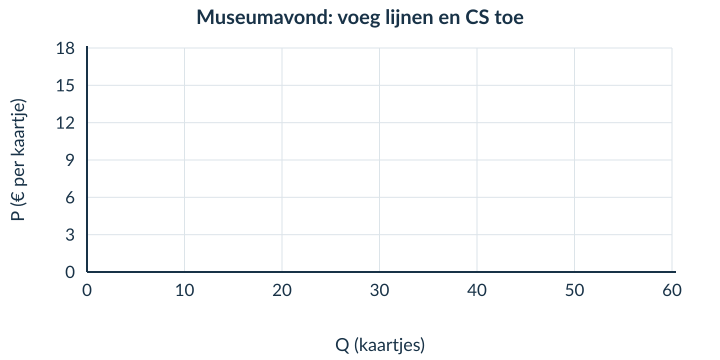

# Opgaven 2.3.1 · Consumentensurplus

## Uitgewerkt voorbeeld

Een escaperoom verkoopt tickets. **P = 20 − 0,25Q**; P is in euro per ticket en Q in tickets. De prijs is € 10. Er zijn genoeg plaatsen: alle gevraagde tickets worden verkocht aan de vragers met de hoogste betalingsbereidheid.

**Gevraagd:** bepaal Q, teken de situatie, arceer en bereken CS en leg uit wat het bedrag betekent.

**1 · Hoeveelheid.** 10 = 20 − 0,25Q → 0,25Q = 10 → **Q = 40 tickets**.

**2 · Grafiek.** Bij Q = 0 is P = 20. Bij P = 0 is Q = 80. Verbind (0; 20) en (80; 0). Voeg P = 10 toe. Het snijpunt met de prijslijn is (40; 10).

<figure><figcaption>Figuur 4 · Het gearceerde gebied hoort bij de 40 verkochte tickets. Er is geen aanbodlijn nodig voor deze CS-berekening.</figcaption></figure>

**3 · Gebied en berekening.** Arceer boven P = 10 en onder V, tot Q = 40. Basis = 40 tickets; hoogte = 20 − 10 = € 10 per ticket.

**CS = ½ × 40 × 10 = € 200.**

**4 · Betekenis.** De kopers hebben samen € 200 meer voor deze tickets over dan zij werkelijk betalen. Dat gezamenlijke voordeel is niet de omzet van de escaperoom.

<b>Samenvatting</b> Bereken eerst de verkochte hoeveelheid. Teken en benoem de assen en lijnen. CS ligt boven de prijs en onder de vraaglijn. Bij een driehoek: ½ × basis × hoogte. Eindig met euro én de betekenis voor de kopers.

<!-- PAGE {"section":"2.3.1","title":"Ophalen en oefenen met steun"} -->
## Startopgaven

**Opgave 1 · Ophalen uit boek 1 en wiskunde**

Voor een product geldt P = 16 − 0,2Q.

a) Bereken Q bij P = 6. Noteer ook beide assensnijpunten.

b) Bereken de oppervlakte van een driehoek met basis 50 en hoogte 10.

**Opgave 2 · Begripscheck**

Iris heeft € 18 over voor een toegangsbewijs. Zij betaalt € 12.

a) Bereken haar consumentensurplus.

b) Een klasgenoot noemt de betaalde € 12 haar consumentensurplus. Verbeter deze uitleg.

<b>Normale route:</b> Startopgaven → Begeleide inoefening → Zelfstandige oefening → Doeloefening. <b>Uitdagende route (minder tussenstappen, extra uitdaging):</b> Startopgaven → Zelfstandige oefening → Doeloefening → Denkertje / Bonusopgave. Herhaling is extra bij beide routes.

## Begeleide inoefening

*Begeleide inoefening hoort bij leren: je oefent met denkstappen en doet steeds meer zelf.*

**Opgave 3 · Eerst herkennen**

De klimhal gebruikt P = 24 − 0,4Q. P is in euro per kaartje; alle bij P = 8 gevraagde kaartjes worden verkocht.

<figure><figcaption>Figuur 5 · Lees eerst af; controleer daarna met de functie.</figcaption></figure>

a) Lees Q af. Vul in: 8 = 24 − 0,4Q → Q = … kaartjes.

b) Noteer basis en hoogte van het blauwe gebied. Bereken CS.

c) Leg uit waarom je de rechthoek onder P = 8 niet meetelt bij CS.

<!-- PAGE {"section":"2.3.1","title":"Steeds minder tekenhulp"} -->

**Opgave 4 · Zelf lijnen en een gebied toevoegen**

Voor een museumavond geldt **P = 18 − 0,3Q**. P is in euro per kaartje. De prijs is € 6. Alle gevraagde kaartjes worden verkocht aan de vragers met de hoogste betalingsbereidheid.

a) Bereken de gevraagde hoeveelheid. Begin met 6 = 18 − 0,3Q.

b) Teken in het assenstelsel de vraaglijn en P = 6. Gebruik de twee assensnijpunten om de vraaglijn te tekenen.

<figure><figcaption>Figuur 6 · De assen en schaal zijn gegeven. De lijnen, snijpunten en arcering maak je zelf.</figcaption></figure>

c) Arceer en benoem CS. Bereken het met basis, hoogte en eenheid.

d) Leg uit wat het berekende bedrag voor alle kopers samen betekent.

**Opgave 5 · Zonder tekenhulp**

Een rechte vraaglijn voor fotoprints snijdt de verticale as bij € 17. Bij een prijs van € 5 worden 30 prints gevraagd en verkocht. Er is genoeg aanbod.

a) Bereken CS zonder eerst een volledige grafiek te tekenen.

b) Leg uit waarom de hoogte van het gebied € 12 per print is en niet € 5 per print.

<!-- PAGE {"section":"2.3.1","title":"Zelf de volledige route uitvoeren"} -->
## Zelfstandige oefening

**Opgave 6 · Zwemkaartjes**

Voor zwemkaartjes geldt **P = 18 − 0,2Q**. P is in euro per kaartje, Q is in kaartjes. Bij de gegeven prijs van € 8 worden alle gevraagde kaartjes verkocht aan de vragers met de hoogste betalingsbereidheid.

a) Bereken de gevraagde hoeveelheid.

b) Teken de vraaglijn en de prijslijn in je schrift. Benoem de assen met grootheid en eenheid. Noteer beide assensnijpunten en het snijpunt met de prijslijn.

c) Arceer en benoem het consumentensurplus.

d) Bereken het consumentensurplus met basis, hoogte en eenheid.

e) Leg de uitkomst uit voor de kopers als groep.

**Opgave 7 · Een boekenbeurs**

Voor toegangsbewijzen geldt **P = 16 − 0,1Q**. P is in euro per toegangsbewijs. De gegeven prijs is € 6. Alle gevraagde toegangsbewijzen worden verkocht.

a) Bereken Q en CS.

b) De organisatie berekent een omzet van € 600. Een leerling zegt: ‘Dan is het voordeel voor de kopers samen ook € 600.’ Beoordeel deze uitspraak met je berekening.

c) Kun je Q in deze opgave een berekende evenwichtshoeveelheid noemen? Licht toe.

<b>Controleer vóór je verdergaat</b> Staan Q en P op de juiste assen? Begint je CS-gebied bij de prijslijn, niet bij nul? Heb je het bedrag voor alle kopers uitgelegd in plaats van alleen een formule opgeschreven?

<!-- PAGE {"section":"2.3.1","title":"Doeloefening en terugblik"} -->
## Doeloefening

**Opgave 8 · Concertkaartjes**

Voor concertkaartjes geldt de vraagfunctie P=50−0,5Q. P is de prijs in euro per kaartje en Q het aantal gevraagde kaartjes. De gegeven marktprijs is €20. Er zijn voldoende kaartjes beschikbaar; alle bij deze prijs gevraagde kaartjes worden verkocht aan de vragers met de hoogste betalingsbereidheid. Er is in deze opgave geen aanbodfunctie.

a) Bereken de gevraagde hoeveelheid bij P=€20. Noem dit niet de evenwichtshoeveelheid.

b) Teken de vraaglijn en de horizontale prijslijn in één assenstelsel. Benoem de horizontale as als Q (kaartjes) en de verticale as als P (€ per kaartje). Noteer de snijpunten van de vraaglijn en het snijpunt met de prijslijn.

c) Arceer en benoem in je grafiek het consumentensurplus.

d) Bereken het consumentensurplus als oppervlakte van een driehoek en noteer de eenheid.

e) Leg uit wat het berekende consumentensurplus voor de kopers als groep betekent.

## Denkertje / Bonusopgave

**Opgave 9 · Een formule die toevallig klopt**

Bij het uitgewerkte voorbeeld geeft ½ × Q × P dezelfde uitkomst als de juiste CS-berekening. Een leerling denkt daarom dat dit altijd de formule is. Bedenk een tegenvoorbeeld met een rechte vraaglijn. Leg uit waarom de goede uitkomst in het voorbeeld toeval is.

## Herhaling / Herhaling en interleaving

**Opgave 10 · Procenten (§1.1.2)**

Het bezoek stijgt van 400 naar 460. Bereken de procentuele stijging.

**Opgave 11 · Kosten per product (§2.1.1)**

TK = 200 + 3Q. Bereken bij Q = 100 de totale kosten en gemiddelde totale kosten. Noteer de eenheden: Q is in producten en TK in euro.

