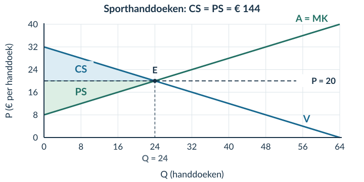

# 2.3.2 Producentensurplus en totaal surplus

## Opgave 1

Stel vraag en aanbod gelijk: 18 − Q = 6 + 0,5Q → 12 = 1,5Q → **Qe = 8 producten**. Vul in: Pe = 18 − 8 = **€ 10 per product**.

*Waarom:* bij deze combinatie geven beide functies dezelfde prijs en hoeveelheid. Een fout bij het oplossen is reden om §1.3.2 te herhalen.

## Opgave 2

a) Koper: CS = 12 − 9 = **€ 3**. Verkoper: PS = 9 − 5 = **€ 4** bij deze transactie.

*Waarom:* je vergelijkt de prijs aan de ene kant met de betalingsbereidheid en aan de andere kant met MK.

b) Gezamenlijk voordeel = 3 + 4 = **€ 7**. Dat is ook 12 − 5 = € 7.

*Waarom:* de prijs is een betaling van de koper aan de verkoper. Bij het optellen van hun voordelen valt deze betaling weg: (12 − 9) + (9 − 5) = 12 − 5.

## Opgave 3

a) 30 − Q = 6 + 0,5Q → 24 = **1,5Q** → **Qe = 16 bossen**. Pe = 30 − 16 = **€ 14 per bos**.

b) Basis = 16 bossen. Hoogte CS = 30 − 14 = € 16 per bos; hoogte PS = 14 − 6 = € 8 per bos.

**CS = ½ × 16 × 16 = € 128. PS = ½ × 16 × 8 = € 64. TS = 128 + 64 = € 192.**

*Waarom:* beide gebieden stoppen bij Q = 16. Het grotere CS volgt hier uit de grotere hoogte.

c) Bij Q = 10: 20 − 11 = **€ 9 positief voordeel**; extra handel verhoogt TS. Bij Q = 20: 10 − 16 = **−€ 6**; extra handel verlaagt TS.

*Waarom:* je vergelijkt betalingsbereidheid met MK, niet de marktprijs met de oude prijs.

d) Vóór Q = 16 ligt V boven A = MK. Daar is handel gezamenlijk voordelig. Na Q = 16 ligt V onder MK. De volgende eenheden kosten dan meer dan zij de koper waard zijn. TS is daarom bij Q = 16 maximaal binnen dit model.

## Opgave 4

a) 32 − 0,5Q = 8 + 0,5Q → **Qe = 24 handdoeken**. Pe = 32 − 0,5 × 24 = **€ 20 per handdoek**. Markeer E bij (24; 20); CS ligt erboven onder V en PS eronder boven A, steeds tot Q = 24.

b) Basis = 24 handdoeken. Beide hoogten zijn € 12 per handdoek: 32 − 20 en 20 − 8.

**CS = ½ × 24 × 12 = € 144. PS = € 144. TS = € 288.**

<figure><figcaption>Opgave 4a–b · Markeringen en berekeningen horen bij dezelfde hoeveelheid en prijs.</figcaption></figure>

c) Bij Q = 16: betalingsbereidheid = 32 − 0,5 × 16 = **€ 24**; MK = 8 + 0,5 × 16 = **€ 16**. Extra handel geeft € 8 gezamenlijk voordeel. Bij Q = 32 zijn de bedragen € 16 en € 24: extra handel geeft € 8 gezamenlijk nadeel. De grens ligt bij het evenwicht Q = 24.

## Opgave 5

a) Oud kopersvoordeel: 14 − 10 = € 4. Bij alleen de hogere betalingsbereidheid: 16 − 10 = € 6. Het neemt **€ 2 toe**.

b) Oud verkopersvoordeel: 10 − 6 = € 4. Bij alleen lagere MK: 10 − 5 = € 5. Het neemt **€ 1 toe**.

c) Gezamenlijk voordeel oud = 14 − 6 = € 8. Nieuw = 16 − 5 = € 11. De stijging is **€ 3**.

*Waarom:* de koper waardeert hetzelfde product meer én het kost minder om te leveren.

d) Onjuist. Een hogere betalingsbereidheid vergroot het voordeel; lagere MK doen dat ook. De effecten versterken elkaar. Dat één ingevoerd bedrag stijgt en het andere daalt, zegt niet dat het voordeel in tegengestelde richtingen verandert.

## Opgave 6

a) 36 − 0,5Q = 6 + 0,5Q → **Qe = 30 bekers**. Pe = 36 − 0,5 × 30 = **€ 21 per beker**. Markeer E bij (30; 21), CS boven de prijs en PS eronder.

b) Basis = 30 bekers. Hoogte CS = 36 − 21 = € 15 per beker; hoogte PS = 21 − 6 = € 15 per beker.

**CS = ½ × 30 × 15 = € 225. PS = € 225. TS = € 450.**

<figure><figcaption>Opgave 6a–b · De twee even grote driehoeken liggen aan verschillende kanten van de prijs.</figcaption></figure>

c) Bij Q = 20: betalingsbereidheid = **€ 26**; MK = **€ 16**. Een extra transactie verhoogt TS met het positieve verschil van € 10 bij deze marginale vergelijking. Bij Q = 40 zijn de bedragen **€ 16** en **€ 26**: extra handel verlaagt TS.

d) Tot Q = 30 is de betalingsbereidheid minstens MK; daarna niet meer. TS is daarom bij het evenwicht maximaal. Dat zegt niet hoe de voordelen binnen groepen of tussen personen zijn verdeeld. Er staat ook geen norm voor eerlijkheid in deze functies.

## Opgave 7

a) Nee. Vaste kosten moeten ook worden betaald. Zonder die kostengegevens mag je het **PS van € 80 niet gelijkstellen aan de winst**.

b) **TS = 300 + 100 = € 400**. Een ongelijk CS en PS bewijst geen inefficiëntie. Voor efficiëntie moet je weten of er nog haalbare, voordelige transacties ontbreken; niet of CS en PS even groot zijn.

## Opgave 8 · Doeloefening

a) 50 − 0,5Q = 5 + 0,25Q → 45 = 0,75Q → **Qe = 60 kaartjes**. Pe = 50 − 0,5 × 60 = **€ 20 per kaartje**.

b) Markeer E bij **(60; 20)**. CS is de driehoek boven P = 20 en onder V. PS ligt onder P = 20 en boven A = MK. Beide gebieden eindigen bij Q = 60.

<figure><figcaption>Opgave 8b · De vraag- en aanbodlijn hoefden niet opnieuw te worden getekend.</figcaption></figure>

c) Basis = 60 kaartjes. Hoogte CS = 50 − 20 = € 30 per kaartje. Hoogte PS = 20 − 5 = € 15 per kaartje.

**CS = ½ × 60 × 30 = € 900. PS = ½ × 60 × 15 = € 450. TS = 900 + 450 = € 1.350.**

d) Bij Q = 50: 25 − 17,50 = **€ 7,50** positief voordeel van een extra transactie. Bij Q = 70: 15 − 22,50 = **−€ 7,50**; extra handel verlaagt TS.

*Waarom:* de aanbodlijn geeft in deze opgave ook de MK aan van eenheden die in het vrije evenwicht niet worden verkocht.

e) Tot Q = 60 is de betalingsbereidheid minstens zo hoog als MK. Daarna zijn de MK hoger. Daardoor is TS binnen het model maximaal bij Q = 60. Het berekende TS bevat geen norm voor een eerlijke verdeling en geen volledig oordeel over alle maatschappelijke gevolgen.

## Opgave 9 · Denkertje

**Modelantwoord.** Bij P = 15 krijgt de koper CS = 30 − 15 = € 15; de verkoper krijgt PS = 15 − 10 = € 5. Samen: **€ 20**. Bij P = 25 krijgt de koper € 5 en de verkoper € 15. Samen opnieuw **€ 20**.

De prijs verandert wie welk voordeel ontvangt, maar niet de betalingsbereidheid, MK of de transactie. Daarom verandert het gezamenlijke voordeel hier niet.

**Beoordelingscriteria:** beide verdelingen correct; hetzelfde totaal van € 20; uitleg dat dezelfde transactie met dezelfde waardering en kosten doorgaat. Alleen ‘de prijs is anders’ bewijst geen kleiner TS.

## Opgave 10

MK over het interval = ΔTK / ΔQ = **(280 − 240) / (50 − 40) = 40 / 10 = € 4 per extra product**.

*Waarom:* de extra € 40 hoort bij tien extra producten. Niet delen door 10 verwart de extra totale kosten met de kosten per extra product. Herhaal zo nodig §2.1.3.

## Opgave 11

**Ev = −5% / +10% = −0,5**. De absolute waarde 0,5 is kleiner dan 1: de vraag is **prijsinelastisch**.

*Waarom:* de hoeveelheid reageert procentueel minder sterk dan de prijs. Ev heeft geen eenheid. Herhaal zo nodig §2.2.1.
