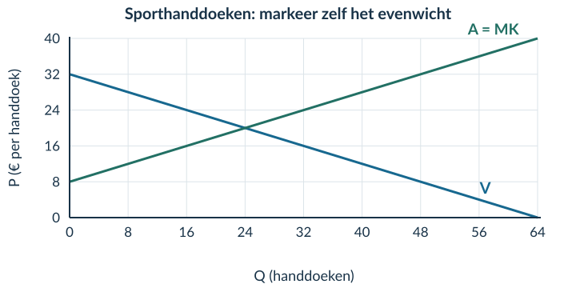
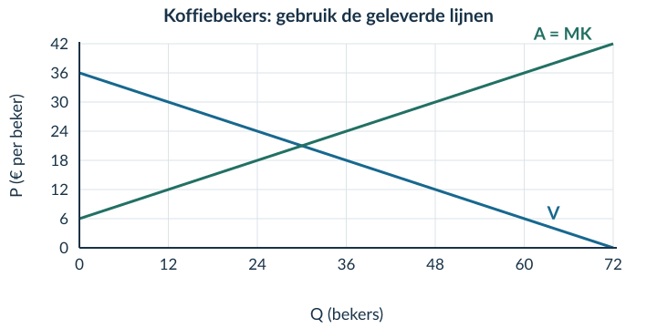
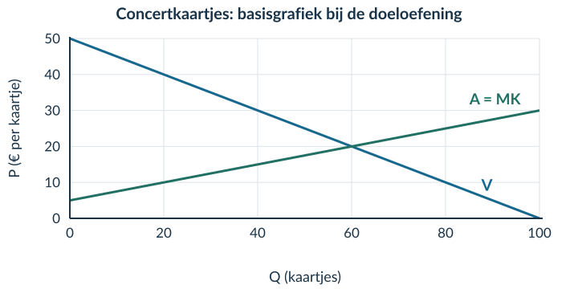

# Opgaven 2.3.2 · Producentensurplus en totaal surplus

## Uitgewerkt voorbeeld

Op een makersmarkt worden notitieboeken verkocht. Vraag: **P = 24 − 0,5Q**. Aanbod: **P = 4 + 0,5Q**. P is in euro per notitieboek; Q in notitieboeken. De aanbodlijn geeft de MK weer voor Q van 0 tot 40. We gebruiken het vrije evenwicht.

**Gevraagd:** bereken het evenwicht en CS, PS en TS; markeer de gebieden; vergelijk betalingsbereidheid en MK; beoordeel efficiëntie en verdeling.

**1 · Evenwicht.** 24 − 0,5Q = 4 + 0,5Q → **Qe = 20**.

**Pe = 24 − 0,5 × 20 = € 14 per notitieboek.**

**2 · Gebieden.** Markeer E bij (20; 14). Arceer CS boven P = 14 en onder V. Arceer PS onder P = 14 en boven A. Stop beide gebieden bij Q = 20.

<figure><figcaption>Figuur 4 · Je voegt markeringen toe aan de gegeven lijnen. CS en PS hebben hier toevallig dezelfde oppervlakte.</figcaption></figure>

**3 · Berekenen.** De basis is telkens 20 notitieboeken.

CS = ½ × 20 × (24 − 14) = € 100 PS = ½ × 20 × (14 − 4) = € 100 TS = 100 + 100 = € 200

De prijsverschillen hebben de eenheid euro per notitieboek. Vermenigvuldiging met het aantal notitieboeken geeft euro.

<!-- PAGE {"section":"2.3.2","title":"De uitkomsten economisch uitleggen"} -->
### Vervolg uitgewerkt voorbeeld

**4 · Marginale vergelijking.** Vul Q in beide functies in.

| Q | Betalingsbereidheid: 24 − 0,5Q | MK: 4 + 0,5Q | Effect van extra handel op TS |
|---|---:|---:|---|
| 10 | € 19 | € 9 | Verhoogt TS: verschil € 10 |
| 30 | € 9 | € 19 | Verlaagt TS: verschil −€ 10 |

**5 · Begrensde conclusie.** Bij Q = 20 komen betalingsbereidheid en MK samen. Alle eenheden met een positief gezamenlijk voordeel kunnen dan worden verhandeld. Verder uitbreiden levert in dit model geen hoger TS op.

CS en PS zijn hier even groot. Dat is een uitkomst van de getallen, geen bewijs van eerlijkheid. De grafiek vertelt bijvoorbeeld niet hoe het voordeel binnen de groep kopers is verdeeld.

<b>Samenvatting</b> Bereken eerst Qe en Pe. CS ligt boven de prijs; PS eronder. Beide liggen tussen de betreffende lijn en de prijs. TS = CS + PS. Vergelijk voor extra handel betalingsbereidheid met MK. Maximaal TS is een efficiëntie-uitkomst, geen eerlijkheidsoordeel.

## Startopgaven

**Opgave 1 · Evenwicht ophalen (§1.3.2)**

Vraag: P = 18 − Q. Aanbod: P = 6 + 0,5Q. P is in euro per product, Q in producten. Bereken Qe en Pe.

**Opgave 2 · Van MK naar voordeel**

Een beker wordt verkocht voor € 9. De koper heeft er € 12 voor over; de marginale kosten zijn € 5.

a) Bereken het voordeel van de koper en van de verkoper bij deze transactie.

b) Bereken hun gezamenlijke voordeel. Leg uit waarom je de prijs daarvoor niet bij de betalingsbereidheid optelt.

Korte route: Startopgaven → Zelfstandige oefening → Doeloefening. Extra hulp nodig? Maak eerst Begeleide inoefening.

<!-- PAGE {"section":"2.3.2","title":"Gebieden lezen met volledige steun"} -->
## Begeleide inoefening

*Heb je deze hulp niet nodig? Ga dan verder met Zelfstandige oefening.*

**Opgave 3 · Bloemenbossen**

Vraag: **P = 30 − Q**. Aanbod: **P = 6 + 0,5Q**. P is in euro per bos bloemen, Q in bossen. Binnen deze grafiek stelt de aanbodlijn de MK voor. Alle transacties in het vrije evenwicht vinden plaats.

<figure><figcaption>Figuur 5 · Het evenwicht en de arceringen zijn al gegeven. Controleer de getallen voordat je gebieden berekent.</figcaption></figure>

a) Vul de evenwichtsberekening aan: 30 − Q = 6 + 0,5Q → 24 = …Q → Qe = … en Pe = … .

b) Vul in en bereken: CS = ½ × 16 × (… − 14). PS = ½ × 16 × (14 − …). Bereken ook TS.

c) Bij Q = 10 is de betalingsbereidheid € 20 en MK € 11. Bij Q = 20 zijn deze bedragen € 10 en € 16. Geef per hoeveelheid aan of een extra transactie TS verhoogt of verlaagt. Noteer het verschil.

d) Leg met de lijnen uit waarom verder handelen tot Q = 16 gezamenlijk voordeel oplevert, maar handelen voorbij Q = 16 niet.

<!-- PAGE {"section":"2.3.2","title":"Markeringen toevoegen; twee effecten scheiden"} -->

**Opgave 4 · Sporthanddoeken**

Vraag: **P = 32 − 0,5Q**. Aanbod: **P = 8 + 0,5Q**. P is in euro per handdoek, Q in handdoeken. De aanbodlijn geeft de MK weer.

<figure><figcaption>Figuur 6 · De lijnen zijn gegeven. Je voegt zelf het evenwicht, de prijs en de twee surplusgebieden toe.</figcaption></figure>

a) Bereken Qe en Pe. Markeer het evenwicht en arceer CS en PS.

b) Bereken CS, PS en TS met de juiste eenheden.

c) Vergelijk betalingsbereidheid en MK bij Q = 16 en bij Q = 32. Leg uit waarom het evenwicht het grootste TS geeft.

**Opgave 5 · Twee veranderingen bij één transactie**

Een mok kost € 10. De koper heeft er eerst € 14 voor over; de MK zijn € 6. Daarna stijgt de betalingsbereidheid naar € 16 en dalen de MK naar € 5. De prijs blijft € 10; dezelfde transactie gaat door.

a) Bekijk alleen de hogere betalingsbereidheid. Hoe verandert het kopersvoordeel?

b) Bekijk alleen de lagere MK. Hoe verandert het verkopersvoordeel?

c) Hoeveel neemt het gezamenlijke voordeel toe als beide veranderingen plaatsvinden?

d) ‘De twee effecten heffen elkaar op, want één bedrag stijgt en het andere daalt.’ Leg uit waarom dat onjuist is.

<!-- PAGE {"section":"2.3.2","title":"Zelf evenwicht, gebieden en betekenis verbinden"} -->
## Zelfstandige oefening

**Opgave 6 · Herbruikbare koffiebekers**

Vraag: **P = 36 − 0,5Q**. Aanbod: **P = 6 + 0,5Q**. P is in euro per beker, Q in bekers. De aanbodlijn is in dit model de MK-lijn. Gebruik de gegeven grafiek.

<figure><figcaption>Figuur 7 · Je hoeft de lijnen niet opnieuw te tekenen.</figcaption></figure>

a) Bereken en markeer Qe en Pe. Arceer en benoem CS en PS.

b) Bereken CS, PS en TS met basis, hoogte en eenheid.

c) Vergelijk de betalingsbereidheid met MK bij Q = 20 en Q = 40. Geef aan wat een extra transactie met TS doet.

d) Verklaar waarom TS maximaal is bij het evenwicht. Leg ook uit waarom dat geen bewijs van een eerlijke verdeling is.

**Opgave 7 · Twee begrippen, twee uitspraken**

Een verkoper heeft € 80 producentensurplus. Zijn vaste kosten zijn niet gegeven.

a) Mag je zijn winst gelijkstellen aan € 80? Leg uit.

b) Op een markt is CS € 300 en PS € 100. Bereken TS. Bewijst dit verschil dat de markt niet efficiënt is? Licht toe.

<!-- PAGE {"section":"2.3.2","title":"Doeloefening · bronnen"} -->
## Doeloefening

**Opgave 8 · Concertkaartjes — gegevens**

Voor concertkaartjes geldt vraag P=50−0,5Q en aanbod P=5+0,25Q. P is in euro per kaartje en Q in kaartjes. Binnen dit marktmodel stelt de inverse aanbodlijn voor 0≤Q≤100 de marginale kosten van iedere opeenvolgende eenheid voor, ook als die eenheid in het evenwicht niet wordt verkocht.

<figure><figcaption>Figuur 8 · Basisgrafiek bij opgave 8. Vraag en aanbod zijn al getekend. De vragen staan op de volgende pagina.</figcaption></figure>

**Bron · Marginale vergelijking**

| Q | Betalingsbereidheid volgens vraaglijn | Marginale kosten volgens aanbodlijn |
|---|---:|---:|
| 50 | € 25 | € 17,50 |
| 70 | € 15 | € 22,50 |

De waarden zijn met de gegeven vraag- en aanbodfunctie berekend.

<b>Notatie</b> De inverse aanbodlijn geeft de prijs bij een aangeboden hoeveelheid. In deze opgave lees je die prijs ook als de marginale kosten. Je gebruikt dezelfde Q voor de vergelijking met de vraaglijn.

<!-- PAGE {"section":"2.3.2","title":"Doeloefening · vragen en terugblik"} -->

**Opgave 8 · Concertkaartjes — vragen**

Gebruik de bronnen op de vorige pagina.

a) Bereken de evenwichtsprijs en -hoeveelheid.

b) Markeer het evenwicht in de basisgrafiek en arceer en benoem CS en PS. Teken de lijnen niet opnieuw.

c) Bereken CS, PS en TS met basis, hoogte en eenheid.

d) Vergelijk met de tabel bij Q=50 en Q=70 de betalingsbereidheid met de marginale kosten en geef per hoeveelheid aan of één extra transactie TS verhoogt of verlaagt.

e) Leg uit waarom TS in dit model maximaal is bij Q=60 en waarom dit geen oordeel over een eerlijke verdeling oplevert.

## Denkertje / Bonusopgave

**Opgave 9 · Dezelfde handel, een andere prijs**

Voor één transactie zijn de betalingsbereidheid € 30 en de MK € 10. Vergelijk een prijs van € 15 met een prijs van € 25. De transactie gaat in beide gevallen door.

Beredeneer wat er verandert voor de koper, de verkoper en hun gezamenlijke voordeel. Leg uit waarom je uit alleen een andere prijs niet automatisch een kleiner TS kunt afleiden.

## Herhaling / Herhaling en interleaving

**Opgave 10 · Marginale kosten (§2.1.3)**

TK stijgt van € 240 bij Q = 40 naar € 280 bij Q = 50. Bereken de marginale kosten per extra product over dit interval.

**Opgave 11 · Prijselasticiteit (§2.2.1)**

De prijs stijgt met 10%; de gevraagde hoeveelheid daalt met 5%. Bereken Ev en benoem of de vraag prijselastisch of prijsinelastisch is.

