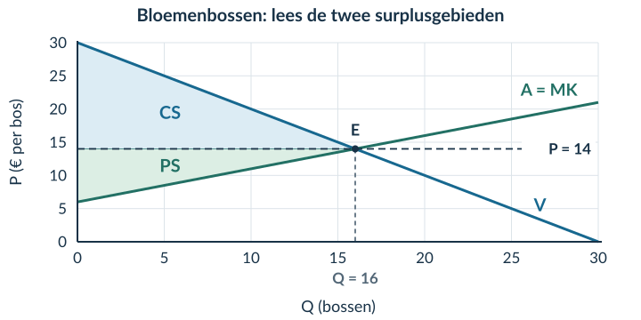
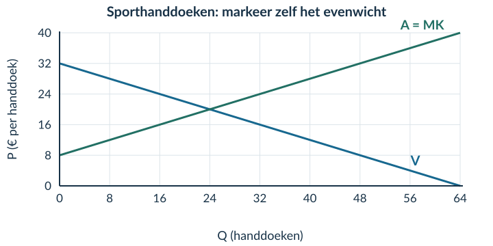
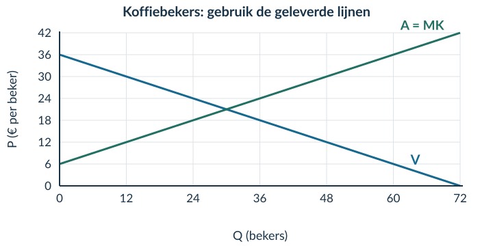
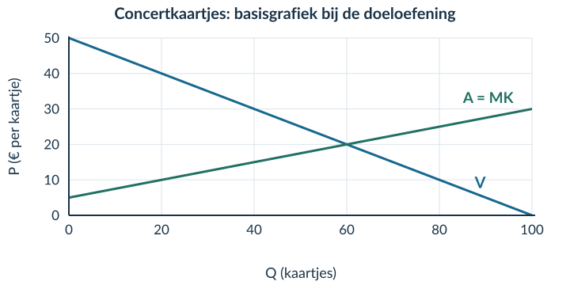

# 2.3.2 Producentensurplus en totaal surplus

<!-- Native reconstruction of accepted physical page 86; see the revision provenance. -->
<article class="native-theory" data-accepted-page="86">
<svg aria-hidden="true" class="native-decoration" style="left:53.3583pt;top:77.7636pt;width:488.5591pt;height:2.1pt" viewbox="53.3583 77.7636 488.5591 2.1"><path d="M 53.8583 51.0236 H 541.4174 V 78.2636 H 53.8583 Z M 53.8583 51.0236 H 541.4174 V 79.3636 H 53.8583 Z" fill="#007da2" fill-rule="evenodd" stroke="none" stroke-width="0"></path></svg>
<svg aria-hidden="true" class="native-decoration" style="left:53.3583pt;top:126.5056pt;width:49.7559pt;height:21.951pt" viewbox="53.3583 126.5056 49.7559 21.951"><path d="M 53.8583 127.0056 H 102.6142 V 147.9566 H 53.8583 Z" fill="#eaf1f4" fill-rule="nonzero" stroke="none" stroke-width="0"></path></svg>
<svg aria-hidden="true" class="native-decoration" style="left:102.1142pt;top:126.5056pt;width:152.1433pt;height:21.951pt" viewbox="102.1142 126.5056 152.1433 21.951"><path d="M 102.6142 127.0056 H 253.7575 V 147.9566 H 102.6142 Z" fill="#eaf1f4" fill-rule="nonzero" stroke="none" stroke-width="0"></path></svg>
<svg aria-hidden="true" class="native-decoration" style="left:253.2575pt;top:126.5056pt;width:83.885pt;height:21.951pt" viewbox="253.2575 126.5056 83.885 21.951"><path d="M 253.7575 127.0056 H 336.6425 V 147.9566 H 253.7575 Z" fill="#eaf1f4" fill-rule="nonzero" stroke="none" stroke-width="0"></path></svg>
<svg aria-hidden="true" class="native-decoration" style="left:336.1425pt;top:126.5056pt;width:205.7748pt;height:21.951pt" viewbox="336.1425 126.5056 205.7748 21.951"><path d="M 336.6425 127.0056 H 541.4174 V 147.9566 H 336.6425 Z" fill="#eaf1f4" fill-rule="nonzero" stroke="none" stroke-width="0"></path></svg>
<svg aria-hidden="true" class="native-decoration" style="left:53.3583pt;top:168.6326pt;width:49.7559pt;height:22.101pt" viewbox="53.3583 168.6326 49.7559 22.101"><path d="M 53.8583 169.1326 H 102.6142 V 190.2336 H 53.8583 Z" fill="#f6f9fa" fill-rule="nonzero" stroke="none" stroke-width="0"></path></svg>
<svg aria-hidden="true" class="native-decoration" style="left:102.1142pt;top:168.6326pt;width:152.1433pt;height:22.101pt" viewbox="102.1142 168.6326 152.1433 22.101"><path d="M 102.6142 169.1326 H 253.7575 V 190.2336 H 102.6142 Z" fill="#f6f9fa" fill-rule="nonzero" stroke="none" stroke-width="0"></path></svg>
<svg aria-hidden="true" class="native-decoration" style="left:253.2575pt;top:168.6326pt;width:83.885pt;height:22.101pt" viewbox="253.2575 168.6326 83.885 22.101"><path d="M 253.7575 169.1326 H 336.6425 V 190.2336 H 253.7575 Z" fill="#f6f9fa" fill-rule="nonzero" stroke="none" stroke-width="0"></path></svg>
<svg aria-hidden="true" class="native-decoration" style="left:336.1425pt;top:168.6326pt;width:205.7748pt;height:22.101pt" viewbox="336.1425 168.6326 205.7748 22.101"><path d="M 336.6425 169.1326 H 541.4174 V 190.2336 H 336.6425 Z" fill="#f6f9fa" fill-rule="nonzero" stroke="none" stroke-width="0"></path></svg>
<svg aria-hidden="true" class="native-decoration" style="left:53.3583pt;top:168.6326pt;width:49.7559pt;height:1pt" viewbox="53.3583 168.6326 49.7559 1"><path d="M 53.8583 169.1326 L 102.6142 169.1326" fill="none" fill-rule="nonzero" stroke="#dce5e9" stroke-width="0.45000001788139343"></path></svg>
<svg aria-hidden="true" class="native-decoration" style="left:102.1142pt;top:168.6326pt;width:152.1433pt;height:1pt" viewbox="102.1142 168.6326 152.1433 1"><path d="M 102.6142 169.1326 L 253.7575 169.1326" fill="none" fill-rule="nonzero" stroke="#dce5e9" stroke-width="0.45000001788139343"></path></svg>
<svg aria-hidden="true" class="native-decoration" style="left:253.2575pt;top:168.6326pt;width:83.885pt;height:1pt" viewbox="253.2575 168.6326 83.885 1"><path d="M 253.7575 169.1326 L 336.6425 169.1326" fill="none" fill-rule="nonzero" stroke="#dce5e9" stroke-width="0.45000001788139343"></path></svg>
<svg aria-hidden="true" class="native-decoration" style="left:336.1425pt;top:168.6326pt;width:205.7748pt;height:1pt" viewbox="336.1425 168.6326 205.7748 1"><path d="M 336.6425 169.1326 L 541.4174 169.1326" fill="none" fill-rule="nonzero" stroke="#dce5e9" stroke-width="0.45000001788139343"></path></svg>
<svg aria-hidden="true" class="native-decoration" style="left:53.3583pt;top:189.7336pt;width:49.7559pt;height:1pt" viewbox="53.3583 189.7336 49.7559 1"><path d="M 53.8583 190.2336 L 102.6142 190.2336" fill="none" fill-rule="nonzero" stroke="#dce5e9" stroke-width="0.45000001788139343"></path></svg>
<svg aria-hidden="true" class="native-decoration" style="left:102.1142pt;top:189.7336pt;width:152.1433pt;height:1pt" viewbox="102.1142 189.7336 152.1433 1"><path d="M 102.6142 190.2336 L 253.7575 190.2336" fill="none" fill-rule="nonzero" stroke="#dce5e9" stroke-width="0.45000001788139343"></path></svg>
<svg aria-hidden="true" class="native-decoration" style="left:253.2575pt;top:189.7336pt;width:83.885pt;height:1pt" viewbox="253.2575 189.7336 83.885 1"><path d="M 253.7575 190.2336 L 336.6425 190.2336" fill="none" fill-rule="nonzero" stroke="#dce5e9" stroke-width="0.45000001788139343"></path></svg>
<svg aria-hidden="true" class="native-decoration" style="left:336.1425pt;top:189.7336pt;width:205.7748pt;height:1pt" viewbox="336.1425 189.7336 205.7748 1"><path d="M 336.6425 190.2336 L 541.4174 190.2336" fill="none" fill-rule="nonzero" stroke="#dce5e9" stroke-width="0.45000001788139343"></path></svg>
<svg aria-hidden="true" class="native-decoration" style="left:53.2583pt;top:147.3566pt;width:49.9559pt;height:1.2pt" viewbox="53.2583 147.3566 49.9559 1.2"><path d="M 53.8583 147.9566 L 102.6142 147.9566" fill="none" fill-rule="nonzero" stroke="#cbdbe2" stroke-width="0.6000000238418579"></path></svg>
<svg aria-hidden="true" class="native-decoration" style="left:102.0142pt;top:147.3566pt;width:152.3433pt;height:1.2pt" viewbox="102.0142 147.3566 152.3433 1.2"><path d="M 102.6142 147.9566 L 253.7575 147.9566" fill="none" fill-rule="nonzero" stroke="#cbdbe2" stroke-width="0.6000000238418579"></path></svg>
<svg aria-hidden="true" class="native-decoration" style="left:253.1575pt;top:147.3566pt;width:84.085pt;height:1.2pt" viewbox="253.1575 147.3566 84.085 1.2"><path d="M 253.7575 147.9566 L 336.6425 147.9566" fill="none" fill-rule="nonzero" stroke="#cbdbe2" stroke-width="0.6000000238418579"></path></svg>
<svg aria-hidden="true" class="native-decoration" style="left:336.0425pt;top:147.3566pt;width:205.9748pt;height:1.2pt" viewbox="336.0425 147.3566 205.9748 1.2"><path d="M 336.6425 147.9566 L 541.4174 147.9566" fill="none" fill-rule="nonzero" stroke="#cbdbe2" stroke-width="0.6000000238418579"></path></svg>
<svg aria-hidden="true" class="native-decoration" style="left:53.3583pt;top:282.1396pt;width:488.5591pt;height:61.08pt" viewbox="53.3583 282.1396 488.5591 61.08"><path d="M 53.8583 282.6396 H 541.4174 V 342.7196 H 53.8583 Z" fill="#eef4f6" fill-rule="nonzero" stroke="none" stroke-width="0"></path></svg>
<svg aria-hidden="true" class="native-decoration" style="left:53.3583pt;top:282.1396pt;width:3pt;height:61.08pt" viewbox="53.3583 282.1396 3 61.08"><path d="M 55.8583 282.6396 H 541.4174 V 342.7196 H 55.8583 Z M 53.8583 282.6396 H 541.4174 V 342.7196 H 53.8583 Z" fill="#007da2" fill-rule="evenodd" stroke="none" stroke-width="0"></path></svg>
<h1 class="native-text" data-layout-height="24.1192" data-layout-width="334.8184" style="left:53.8583pt;top:50.5842pt;line-height:21.1192pt">2.3.2 · Voorbeeld: de uitkomsten uitleggen</h1>
<h2 class="native-text" data-layout-height="17.7595" data-layout-width="216.6188" style="left:53.8583pt;top:87.5485pt;line-height:14.7595pt">4 · Vergelijk betalingsbereidheid en MK</h2>

Notitieboeken: vraag P = 24 − 0,5Q; aanbod/MK P = 4 + 0,5Q.

<table aria-label="Tabel bij De uitkomsten economisch uitleggen" class="native-table" style="left:53.8583pt;top:127.01pt;width:487.5591pt;height:63.22pt"><tbody>
<tr>
<th scope="col" style="left:0pt;top:0pt;width:48.7559pt;height:20.95pt">

Q

</th>
<th scope="col" style="left:48.7559pt;top:0pt;width:151.1433pt;height:20.95pt">

Betalingsbereidheid

</th>
<th scope="col" style="left:199.8992pt;top:0pt;width:82.885pt;height:20.95pt">

MK

</th>
<th scope="col" style="left:282.7842pt;top:0pt;width:204.7748pt;height:20.95pt">

Extra handel en TS

</th>
</tr>
<tr>
<td style="left:0pt;top:20.95pt;width:48.7559pt;height:21.17pt">

10

</td>
<td style="left:48.7559pt;top:20.95pt;width:151.1433pt;height:21.17pt">

€ 19

</td>
<td style="left:199.8992pt;top:20.95pt;width:82.885pt;height:21.17pt">

€ 9

</td>
<td style="left:282.7842pt;top:20.95pt;width:204.7748pt;height:21.17pt">

+€ 10: verhoogt TS.

</td>
</tr>
<tr>
<td style="left:0pt;top:42.12pt;width:48.7559pt;height:21.1pt">

30

</td>
<td style="left:48.7559pt;top:42.12pt;width:151.1433pt;height:21.1pt">

€ 9

</td>
<td style="left:199.8992pt;top:42.12pt;width:82.885pt;height:21.1pt">

€ 19

</td>
<td style="left:282.7842pt;top:42.12pt;width:204.7748pt;height:21.1pt">

−€ 10: verlaagt TS.

</td>
</tr>
</tbody></table>
<h2 class="native-text" data-layout-height="17.7595" data-layout-width="236.2243" style="left:53.8583pt;top:198.6435pt;line-height:14.7595pt">5 · Leg uit wat de uitkomst wel en niet zegt</h2>

Bij Q = 20 zijn betalingsbereidheid en MK gelijk. Alle eenheden met een positief gezamenlijk voordeel kunnen worden verhandeld. Verder uitbreiden geeft in dit model geen hoger TS.

CS = PS = € 100 bewijst geen eerlijkheid. De grafiek laat bijvoorbeeld niet zien hoe het voordeel binnen de groep kopers is verdeeld.

Terugblik

Evenwicht → gebieden → berekenen → betekenis. CS ligt boven de prijs; PS eronder. TS = CS + PS. Maximaal TS is een efficiëntie-uitkomst, geen eerlijkheidsoordeel.

</article>

## Startopgaven

**Opgave 1 · Evenwicht ophalen (§1.3.2)**

Vraag: P = 18 − Q; Aanbod: P = 6 + 0,5Q. P is in euro per product, Q in producten. Bereken Qe en Pe.

**Opgave 2 · Van MK naar voordeel**

Een beker wordt verkocht voor € 9. De koper heeft er € 12 voor over; de marginale kosten zijn € 5.

a) Bereken het voordeel van de koper en van de verkoper bij deze transactie.

b) Bereken hun gezamenlijke voordeel. Leg uit waarom je de prijs daarvoor niet bij de betalingsbereidheid optelt.

<b>Normale route:</b> Startopgaven → Begeleide inoefening → Zelfstandige oefening → Doeloefening. <b>Uitdagende route (minder tussenstappen, extra uitdaging):</b> Startopgaven → Zelfstandige oefening → Doeloefening → Denkertje / Bonusopgave. Herhaling is extra bij beide routes.

## Begeleide inoefening

*Begeleide inoefening hoort bij leren: je oefent met denkstappen en doet steeds meer zelf.*

**Opgave 3 · Bloemenbossen**

Vraag: **P = 30 − Q** 
Aanbod: **P = 6 + 0,5Q**. 
P is in euro per bos bloemen, Q in bossen. Binnen deze grafiek stelt de aanbodlijn de MK voor. Alle transacties in het vrije evenwicht vinden plaats.

<figure><figcaption>Figuur 5 · Het evenwicht en de arceringen zijn al gegeven. Controleer de getallen voordat je gebieden berekent.</figcaption></figure>

a) Vul de evenwichtsberekening aan: 30 − Q = 6 + 0,5Q → 24 = …Q → Qe = … en Pe = … .

b) Vul de twee formules aan en bereken beide surplussen: 
CS = ½ × 16 × (… − 14) 
PS = ½ × 16 × (14 − …) 
Bereken ook TS.

c) Bij Q = 10 is de betalingsbereidheid € 20 en MK € 11. Bij Q = 20 zijn deze bedragen € 10 en € 16. Geef per hoeveelheid aan of een extra transactie TS verhoogt of verlaagt. Noteer het verschil.

d) Leg met de lijnen uit waarom verder handelen tot Q = 16 gezamenlijk voordeel oplevert, maar handelen voorbij Q = 16 niet.

**Opgave 4 · Sporthanddoeken**

Vraag: **P = 32 − 0,5Q** 
Aanbod: **P = 8 + 0,5Q**. 
P is in euro per handdoek, Q in handdoeken. De aanbodlijn geeft de MK weer.

<figure><figcaption>Figuur 6 · De lijnen zijn gegeven. Je voegt zelf het evenwicht, de prijs en de twee surplusgebieden toe.</figcaption></figure>

a) Bereken Qe en Pe. Markeer het evenwicht en arceer CS en PS.

b) Bereken CS, PS en TS met de juiste eenheden.

c) Vergelijk betalingsbereidheid en MK bij Q = 16 en bij Q = 32. Leg uit waarom het evenwicht het grootste TS geeft.

**Opgave 5 · Twee veranderingen bij één transactie**

Een mok kost € 10. De koper heeft er eerst € 14 voor over; de MK zijn € 6. Daarna stijgt de betalingsbereidheid naar € 16 en dalen de MK naar € 5. De prijs blijft € 10; dezelfde transactie gaat door.

a) Bekijk alleen de hogere betalingsbereidheid. Hoe verandert het kopersvoordeel?

b) Bekijk alleen de lagere MK. Hoe verandert het verkopersvoordeel?

c) Hoeveel neemt het gezamenlijke voordeel toe als beide veranderingen plaatsvinden?

d) ‘De twee effecten heffen elkaar op, want één bedrag stijgt en het andere daalt.’ Leg uit waarom dat onjuist is.

## Zelfstandige oefening

**Opgave 6 · Herbruikbare koffiebekers**

Vraag: **P = 36 − 0,5Q** 
Aanbod: **P = 6 + 0,5Q**. 
P is in euro per beker, Q in bekers. De aanbodlijn is in dit model de MK-lijn. Gebruik de gegeven grafiek.

<figure><figcaption>Figuur 7 · Je hoeft de lijnen niet opnieuw te tekenen.</figcaption></figure>

a) Bereken en markeer Qe en Pe. Arceer en benoem CS en PS.

b) Bereken CS, PS en TS met basis, hoogte en eenheid.

c) Vergelijk de betalingsbereidheid met MK bij Q = 20 en Q = 40. Geef aan wat een extra transactie met TS doet.

d) Verklaar waarom TS maximaal is bij het evenwicht. Leg ook uit waarom dat geen bewijs van een eerlijke verdeling is.

**Opgave 7 · Twee begrippen, twee uitspraken**

Een verkoper heeft € 80 producentensurplus. Zijn vaste kosten zijn niet gegeven.

a) Mag je zijn winst gelijkstellen aan € 80? Leg uit.

b) Op een markt is CS € 300 en PS € 100. Bereken TS. Bewijst dit verschil dat de markt niet efficiënt is? Licht toe.

## Doeloefening

**Opgave 8 · Concertkaartjes — gegevens**

Voor concertkaartjes geldt vraag P=50−0,5Q en aanbod P=5+0,25Q. P is in euro per kaartje en Q in kaartjes. Binnen dit marktmodel stelt de inverse aanbodlijn voor 0≤Q≤100 de marginale kosten van iedere opeenvolgende eenheid voor, ook als die eenheid in het evenwicht niet wordt verkocht.

<figure><figcaption>Figuur 8 · Basisgrafiek bij opgave 8. Vraag en aanbod zijn al getekend. De vragen staan op de volgende pagina.</figcaption></figure>

**Bron · Marginale vergelijking**

| Q | Betalingsbereidheid volgens vraaglijn | Marginale kosten volgens aanbodlijn |
|---|---:|---:|
| 50 | € 25 | € 17,50 |
| 70 | € 15 | € 22,50 |

De waarden zijn met de gegeven vraag- en aanbodfunctie berekend.

<b>Notatie</b> De inverse aanbodlijn geeft de prijs bij een aangeboden hoeveelheid. In deze opgave lees je die prijs ook als de marginale kosten. Je gebruikt dezelfde Q voor de vergelijking met de vraaglijn.

**Opgave 8 · Concertkaartjes — vragen**

Gebruik de bronnen op de vorige pagina.

a) Bereken de evenwichtsprijs en -hoeveelheid.

b) Markeer het evenwicht in de basisgrafiek en arceer en benoem CS en PS. Teken de lijnen niet opnieuw.

c) Bereken CS, PS en TS met basis, hoogte en eenheid.

d) Vergelijk met de tabel bij Q=50 en Q=70 de betalingsbereidheid met de marginale kosten en geef per hoeveelheid aan of één extra transactie TS verhoogt of verlaagt.

e) Leg uit waarom TS in dit model maximaal is bij Q=60 en waarom dit geen oordeel over een eerlijke verdeling oplevert.

## Denkertje / Bonusopgave

**Opgave 9 · Dezelfde handel, een andere prijs**

Voor één transactie zijn de betalingsbereidheid € 30 en de MK € 10. Vergelijk een prijs van € 15 met een prijs van € 25. De transactie gaat in beide gevallen door.

Beredeneer wat er verandert voor de koper, de verkoper en hun gezamenlijke voordeel. Leg uit waarom je uit alleen een andere prijs niet automatisch een kleiner TS kunt afleiden.

## Herhaling en combineren

**Opgave 10 · Marginale kosten (§2.1.3)**

TK stijgt van € 240 bij Q = 40 naar € 280 bij Q = 50. Bereken de marginale kosten per extra product over dit interval.

**Opgave 11 · Prijselasticiteit (§2.2.1)**

De prijs stijgt met 10%; de gevraagde hoeveelheid daalt met 5%. Bereken Ev en benoem of de vraag prijselastisch of prijsinelastisch is.

