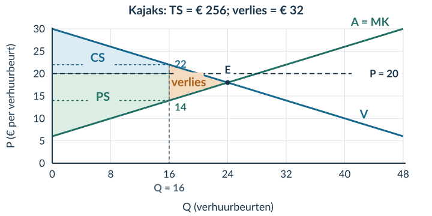
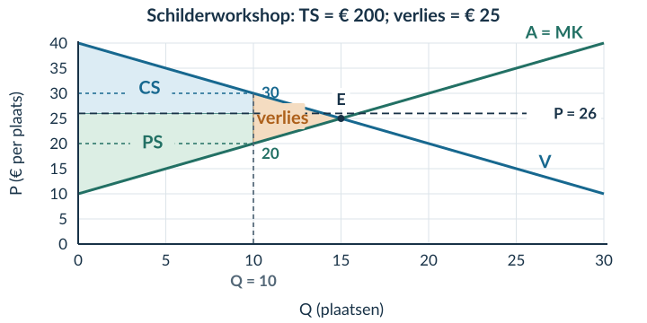
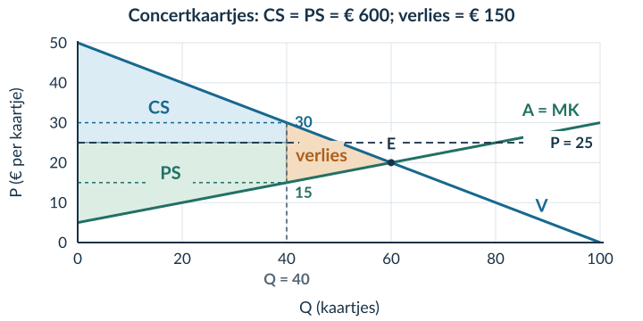

# 2.3.3 Pareto-efficiëntie en welvaartsverlies

## Opgave 1

CS = ½ × 20 × (25 − 15) = **€ 100**. PS = ½ × 20 × (15 − 5) = **€ 100**. TS = 100 + 100 = **€ 200**.

*Waarom:* de basis is 20 producten en de hoogte telkens € 10 per product. Herhaal bij verwarring over de twee gebieden §2.3.2.

## Opgave 2

Nee. A gaat € 8 vooruit, maar B gaat **€ 3 achteruit**. Het gezamenlijke voordeel stijgt wel met € 5, maar dat is niet genoeg voor een Paretoverbetering.

*Waarom:* voor Pareto moet niemand slechter af zijn. Het criterium gaat niet alleen over de som.

## Opgave 3

a) Vraag: 14 = 24 − 0,5Qd → **Qd = 20 plaatsen**. Aanbod: 14 = 4 + 0,5Qs → **Qs = 20 plaatsen**. De boekingsgrens is 12. Er vinden daarom **12 transacties** plaats, tussen de hoogste betalingsbereidheden en laagste MK.

b) Gebruik de hoogten bij Q = 12: betalingsbereidheid = € 18 en MK = € 10.

**CS = 12 × (18 − 14) + ½ × 12 × (24 − 18) = 48 + 36 = € 84.**

**PS = 12 × (14 − 10) + ½ × 12 × (10 − 4) = 48 + 36 = € 84.**

**TS = 84 + 84 = € 168. Welvaartsverlies = 200 − 168 = € 32.**

*Waarom:* de grens stopt de verkoop terwijl bij de laatste plaats nog zowel kopers- als verkopersvoordeel bestaat. Daarom telt ieder surplus een rechthoek én een driehoek.

## Opgave 4

a) Vraag: 20 = 30 − 0,5Qd → **Qd = 20 verhuurbeurten**. Aanbod: 20 = 6 + 0,5Qs → **Qs = 28 verhuurbeurten**. De grens van 16 ligt onder beide aantallen. De 16 hoogste betalingsbereidheden handelen met de 16 laagste MK.

b) CS = 16 × (22 − 20) + ½ × 16 × (30 − 22) = 32 + 64 = **€ 96**.

PS = 16 × (20 − 14) + ½ × 16 × (14 − 6) = 96 + 64 = **€ 160**.

TS = 96 + 160 = **€ 256**. Verlies = 288 − 256 = **€ 32**. Controle: ½ × (24 − 16) × (22 − 14) = ½ × 8 × 8 = € 32.

Arceer de driehoek tussen V en A = MK van **Q = 16 tot Q = 24**. De basis is 8 verhuurbeurten, de hoogte € 8 per verhuurbeurt.

<figure><figcaption>Opgave 4b · CS = € 96, PS = € 160. Het verlies ligt rechts van de grens, niet onder de prijslijn.</figcaption></figure>

c) Bij de 17e transactie: koper wint 21,50 − 20 = **€ 1,50**; verhuurder wint 20 − 14,50 = **€ 5,50**. De extra transactie is technisch mogelijk na kosteloze verruiming. Bestaande transacties blijven gelijk. Er is dus een haalbare Paretoverbetering: de situatie met 16 boekingen is **niet Pareto-efficiënt**.

d) Vrij: CS = ½ × 24 × (30 − 18) = **€ 144**; PS = ½ × 24 × (18 − 6) = **€ 144**. Bij de regel stijgt PS naar € 160, maar CS daalt naar € 96. De uitspraak is onjuist: de kopers als groep verliezen **€ 48** surplus, terwijl verkopers € 16 winnen.

## Opgave 5

a) Een situatie is Pareto-efficiënt als geen haalbare verandering iemand beter af kan maken zonder iemand anders slechter af te maken.

b) 26 = 40 − Qd → **Qd = 14 plaatsen**. 26 = 10 + Qs → **Qs = 16 plaatsen**. De grens van 10 bindt. Er handelen **10** kopers met de hoogste betalingsbereidheid en aanbieders met de laagste MK.

c) Bij Q = 10: betalingsbereidheid = 40 − 10 = **€ 30**; MK = 10 + 10 = **€ 20**.

CS = 10 × (30 − 26) + ½ × 10 × (40 − 30) = 40 + 50 = **€ 90**.

PS = 10 × (26 − 20) + ½ × 10 × (20 − 10) = 60 + 50 = **€ 110**.

TS = 90 + 110 = **€ 200**.

*Waarom:* beide gebieden stoppen bij 10, niet bij Qd = 14 of Qs = 16.

d) Verlies = 225 − 200 = **€ 25**. De verliesdriehoek loopt van Q = 10 tot Q = 15, tussen vraag en aanbod. Basis = 5 plaatsen; hoogte = 30 − 20 = € 10 per plaats. Controle: **½ × 5 × 10 = € 25**.

<figure><figcaption>Opgave 5c–d · Het vrije evenwicht ligt bij Q = 15; de werkelijke handel stopt bij Q = 10.</figcaption></figure>

e) Bij de 11e transactie: betalingsbereidheid = 40 − 11 = **€ 29**; MK = 10 + 11 = **€ 21**. Bij P = 26 hebben koper en verkoper € 3 en € 5 voordeel. Het systeem kan deze transactie verwerken; verruiming kost niets en bestaande transacties blijven gelijk. Er bestaat dus een Paretoverbetering. De beperking tot 10 plaatsen is **niet Pareto-efficiënt**.

f) TS is de som van de voordelen. De som geeft niet aan welke verdeling je eerlijk vindt. Daarvoor is een apart waardeoordeel nodig.

## Opgave 6 · Doeloefening

a) Pareto-efficiënt betekent hier dat er **geen haalbare extra transactie of herverdeling** is die iemand beter af kan maken zonder minstens één ander slechter af te maken, gegeven de modelaannames.

b) Vraag: 25 = 50 − 0,5Qd → 0,5Qd = 25 → **Qd = 50 kaartjes**. Aanbod: 25 = 5 + 0,25Qs → 0,25Qs = 20 → **Qs = 80 kaartjes**.

De grens van 40 ligt onder 50 en 80. Daarom vinden precies **40 transacties** plaats. De kopers hebben de hoogste betalingsbereidheid; de verkopers de laagste MK. Niet alle vragers of aanbieders handelen.

c) Bij Q = 40: betalingsbereidheid = 50 − 0,5 × 40 = **€ 30**. MK = 5 + 0,25 × 40 = **€ 15**.

CS bestaat uit een rechthoek met basis 40 kaartjes en hoogte 30 − 25 = € 5 per kaartje, plus een driehoek met hoogte 50 − 30 = € 20 per kaartje.

**CS = 40 × (30 − 25) + ½ × 40 × (50 − 30) = 200 + 400 = € 600.**

PS bestaat uit een rechthoek met hoogte 25 − 15 = € 10 per kaartje en een driehoek met hoogte 15 − 5 = € 10 per kaartje.

**PS = 40 × (25 − 15) + ½ × 40 × (15 − 5) = 400 + 200 = € 600.**

d) **TS = 600 + 600 = € 1.200. Welvaartsverlies = 1.350 − 1.200 = € 150.**

De driehoek heeft hoekpunten **(40; 30), (60; 20) en (40; 15)**. Basis = 60 − 40 = 20 kaartjes; hoogte = 30 − 15 = € 15 per kaartje. Controle: **½ × 20 × 15 = € 150**.

<figure><figcaption>Opgave 6c–d · Arceer het verloren voordeel tussen vraag en MK. Het verschil tussen € 25 en € 20 is niet de hoogte van de verliesdriehoek.</figcaption></figure>

e) Bij Q = 41: betalingsbereidheid = 50 − 0,5 × 41 = **€ 29,50**; MK = 5 + 0,25 × 41 = **€ 15,25**. Bij P = 25 heeft de nieuwe koper € 4,50 voordeel en de nieuwe verkoper € 9,75. De transactie is technisch haalbaar na kosteloze verruiming. Prijs en bestaande transacties blijven ongewijzigd. Daarom is er een Paretoverbetering en is de grens van 40 **niet Pareto-efficiënt**.

*Waarom:* je bewijst één haalbare verandering zonder verliezers. Je hoeft niet te beweren dat de hele overgang naar het vrije evenwicht iedereen helpt.

f) TS en Pareto-efficiëntie beschrijven gezamenlijk voordeel en onbenutte mogelijkheden. Zij leveren geen norm voor wie welk voordeel zou moeten krijgen. Een efficiëntie-uitkomst kan daarom toch als oneerlijk worden beoordeeld.

## Opgave 7 · Denkertje

**Modelantwoord.** Nee. De derde persoon betaalt € 8 zonder vergoeding en gaat er dus op achteruit. Dat koper en verkoper voordeel hebben, is niet voldoende. Ook een stijging van het gezamenlijke totaal zou de verandering nog niet tot een Paretoverbetering maken.

**Beoordelingscriteria:** de benadeelde derde herkennen; het criterium ‘niemand slechter af’ toepassen; geen conclusie trekken uit alleen de winst van twee partijen. Compensatie is niet gegeven en mag je dus niet stilzwijgend aannemen.

## Opgave 8

Winst = TO − TK = **900 − 760 = € 140**.

*Waarom:* bij winst gaan alle kosten van de opbrengst af. Herhaal zo nodig §2.1.2.

## Opgave 9

Surplus = ½ × basis × hoogte = **½ × 80 × 12 = € 480**.

*Waarom:* kaartjes × euro per kaartje geeft euro, niet euro per kaartje. Herhaal zo nodig §2.3.1.
