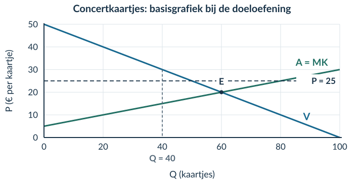

# 2.3.3 Pareto-efficiëntie en welvaartsverlies

<!-- Native reconstruction of accepted physical page 96; see the revision provenance. -->
<article class="native-theory" data-accepted-page="96">
<svg aria-hidden="true" class="native-decoration" style="left:53.3583pt;top:77.7636pt;width:488.5591pt;height:2.1pt" viewbox="53.3583 77.7636 488.5591 2.1"><path d="M 53.8583 51.0236 H 541.4174 V 78.2636 H 53.8583 Z M 53.8583 51.0236 H 541.4174 V 79.3636 H 53.8583 Z" fill="#007da2" fill-rule="evenodd" stroke="none" stroke-width="0"></path></svg>
<svg aria-hidden="true" class="native-decoration" style="left:53.3583pt;top:102.7036pt;width:488.5591pt;height:1.5pt" viewbox="53.3583 102.7036 488.5591 1.5"><path d="M 53.8583 85.3636 H 541.4174 V 103.2036 H 53.8583 Z M 53.8583 85.3636 H 541.4174 V 103.7036 H 53.8583 Z" fill="#cedfe6" fill-rule="evenodd" stroke="none" stroke-width="0"></path></svg>
<svg aria-hidden="true" class="native-decoration" style="left:53.3583pt;top:147.2376pt;width:488.5591pt;height:58.69pt" viewbox="53.3583 147.2376 488.5591 58.69"><path d="M 53.8583 147.7376 H 541.4174 V 205.4276 H 53.8583 Z" fill="#f1f5f7" fill-rule="nonzero" stroke="none" stroke-width="0"></path></svg>
<svg aria-hidden="true" class="native-decoration" style="left:53.3583pt;top:147.2376pt;width:3pt;height:58.69pt" viewbox="53.3583 147.2376 3 58.69"><path d="M 55.8583 147.7376 H 541.4174 V 205.4276 H 55.8583 Z M 53.8583 147.7376 H 541.4174 V 205.4276 H 53.8583 Z" fill="#8ba5b2" fill-rule="evenodd" stroke="none" stroke-width="0"></path></svg>
<svg aria-hidden="true" class="native-decoration" style="left:53.3583pt;top:214.9276pt;width:22pt;height:22pt" viewbox="53.3583 214.9276 22 22"><path d="M 53.8583 215.4276 H 74.8583 V 236.4276 H 53.8583 Z" fill="#007da2" fill-rule="nonzero" stroke="none" stroke-width="0"></path></svg>
<svg aria-hidden="true" class="native-decoration" style="left:53.3583pt;top:278.0826pt;width:22pt;height:22pt" viewbox="53.3583 278.0826 22 22"><path d="M 53.8583 278.5826 H 74.8583 V 299.5826 H 53.8583 Z" fill="#007da2" fill-rule="nonzero" stroke="none" stroke-width="0"></path></svg>
<svg aria-hidden="true" class="native-decoration" style="left:53.3583pt;top:555.9951pt;width:22pt;height:22pt" viewbox="53.3583 555.9951 22 22"><path d="M 53.8583 556.4951 H 74.8583 V 577.4951 H 53.8583 Z" fill="#007da2" fill-rule="nonzero" stroke="none" stroke-width="0"></path></svg>
<svg aria-hidden="true" class="native-decoration" style="left:53.3583pt;top:585.1241pt;width:242.2795pt;height:99.626pt" viewbox="53.3583 585.1241 242.2795 99.626"><path d="M 53.8583 585.6241 H 295.1378 V 684.2501 H 53.8583 Z" fill="#eaf4f8" fill-rule="nonzero" stroke="none" stroke-width="0"></path></svg>
<svg aria-hidden="true" class="native-decoration" style="left:299.6378pt;top:585.1241pt;width:242.2796pt;height:99.626pt" viewbox="299.6378 585.1241 242.2796 99.626"><path d="M 300.1378 585.6241 H 541.4174 V 684.2501 H 300.1378 Z" fill="#edf5f2" fill-rule="nonzero" stroke="none" stroke-width="0"></path></svg>
<svg aria-hidden="true" class="native-decoration" style="left:53.3583pt;top:585.1241pt;width:3pt;height:99.626pt" viewbox="53.3583 585.1241 3 99.626"><path d="M 55.8583 585.6241 H 295.1378 V 684.2501 H 55.8583 Z M 53.8583 585.6241 H 295.1378 V 684.2501 H 53.8583 Z" fill="#007da2" fill-rule="evenodd" stroke="none" stroke-width="0"></path></svg>
<svg aria-hidden="true" class="native-decoration" style="left:299.6378pt;top:585.1241pt;width:3pt;height:99.626pt" viewbox="299.6378 585.1241 3 99.626"><path d="M 302.1378 585.6241 H 541.4174 V 684.2501 H 302.1378 Z M 300.1378 585.6241 H 541.4174 V 684.2501 H 300.1378 Z" fill="#008779" fill-rule="evenodd" stroke="none" stroke-width="0"></path></svg>
<svg aria-hidden="true" class="native-decoration" style="left:53.3583pt;top:691.7501pt;width:488.5591pt;height:42.22pt" viewbox="53.3583 691.7501 488.5591 42.22"><path d="M 53.8583 692.2501 H 541.4174 V 733.4701 H 53.8583 Z" fill="#faf2e8" fill-rule="nonzero" stroke="none" stroke-width="0"></path></svg>
<svg aria-hidden="true" class="native-decoration" style="left:103.8434pt;top:85.8636pt;width:1.5pt;height:10.84pt" viewbox="103.8434 85.8636 1.5 10.84"><path d="M 53.8583 86.3636 H 104.3434 V 96.2036 H 53.8583 Z M 53.8583 86.3636 H 104.8434 V 96.2036 H 53.8583 Z" fill="#bed5df" fill-rule="evenodd" stroke="none" stroke-width="0"></path></svg>
<svg aria-hidden="true" class="native-decoration" style="left:161.1881pt;top:85.8636pt;width:1.5pt;height:10.84pt" viewbox="161.1881 85.8636 1.5 10.84"><path d="M 104.8434 86.3636 H 161.6881 V 96.2036 H 104.8434 Z M 104.8434 86.3636 H 162.1881 V 96.2036 H 104.8434 Z" fill="#bed5df" fill-rule="evenodd" stroke="none" stroke-width="0"></path></svg>
<svg aria-hidden="true" class="native-decoration" style="left:219.5619pt;top:85.8636pt;width:1.5pt;height:10.84pt" viewbox="219.5619 85.8636 1.5 10.84"><path d="M 162.1881 86.3636 H 220.0619 V 96.2036 H 162.1881 Z M 162.1881 86.3636 H 220.5619 V 96.2036 H 162.1881 Z" fill="#bed5df" fill-rule="evenodd" stroke="none" stroke-width="0"></path></svg>
<svg aria-hidden="true" class="native-decoration" style="left:277.4574pt;top:85.8636pt;width:1.5pt;height:10.84pt" viewbox="277.4574 85.8636 1.5 10.84"><path d="M 220.5619 86.3636 H 277.9574 V 96.2036 H 220.5619 Z M 220.5619 86.3636 H 278.4574 V 96.2036 H 220.5619 Z" fill="#bed5df" fill-rule="evenodd" stroke="none" stroke-width="0"></path></svg>
<h1 class="native-text" data-layout-height="24.1192" data-layout-width="396.7506" style="left:53.8583pt;top:50.5842pt;line-height:21.1192pt">2.3.3 · Voorbeeld: een boekingsgrens doorrekenen</h1>

Handel · 90

CS/PS · 91

Verlies · 92

Pareto · 93

Voorbeeld · 94–95

Workshopplaatsen: vraag P = 30 − Q; aanbod/MK P = 6 + Q. P is in euro per plaats. Vrij evenwicht: Qe = 12, Pe = € 18; CS = PS = € 72 en TS = € 144.

De boekingsregel

Maximaal 8 plaatsen tegen € 20. Technisch zijn minstens 12 plaatsen mogelijk. Verruiming kost niets; prijs en bestaande transacties blijven gelijk. De hoogste betalingsbereidheden en laagste MK bepalen wie handelt.

1

<h2 class="native-text" data-layout-height="17.7595" data-layout-width="196.6443" style="left:83.8583pt;top:223.6125pt;line-height:14.7595pt">Houd de Pareto-vraag in gedachten</h2>

Kan een haalbare verandering iemand beter maken zonder iemand anders slechter te maken? Eerst bereken je wat er onder de regel gebeurt.

2

<h2 class="native-text" data-layout-height="17.7595" data-layout-width="218.7097" style="left:83.8583pt;top:286.7675pt;line-height:14.7595pt">Bepaal het werkelijke aantal transacties</h2>

Bij P = 20: Qd = 30 − 20 = 10. Uit 20 = 6 + Qs volgt Qs = 14. De grens van 8 ligt onder beide: 8 werkelijke transacties.

<figure class="native-figure" style="left:54pt;top:344pt;width:491.2756pt;height:189.1832pt"><figcaption class="native-text" data-layout-height="13.0195" data-layout-width="417.2657" style="left:-0.1417pt;top:192.1833pt;line-height:10.0195pt">Figuur 5. Bij Q = 8 is de betalingsbereidheid € 22 en MK € 14. De hulplijnen laten zien waar je de gebieden splitst.</figcaption></figure>

3

<h2 class="native-text" data-layout-height="17.7595" data-layout-width="262.7544" style="left:83.8583pt;top:564.68pt;line-height:14.7595pt">Bereken elk surplus als rechthoek plus driehoek</h2>

Consumentensurplus

Producentensurplus

<h2 class="native-text" data-layout-height="18.8396" data-layout-width="106.6837" style="left:64.8583pt;top:611.7602pt;line-height:15.8396pt">CS = 8 × (22 − 20)</h2>
<h2 class="native-text" data-layout-height="18.8396" data-layout-width="106.1293" style="left:311.1378pt;top:611.7602pt;line-height:15.8396pt">PS = 8 × (20 − 14)</h2>
<h2 class="native-text" data-layout-height="18.8396" data-layout-width="111.2904" style="left:64.8583pt;top:633.7882pt;line-height:15.8396pt">+ ½ × 8 × (30 − 22)</h2>
<h2 class="native-text" data-layout-height="18.8396" data-layout-width="103.6346" style="left:311.1378pt;top:633.7882pt;line-height:15.8396pt">+ ½ × 8 × (14 − 6)</h2>
<h2 class="native-text" data-layout-height="18.8396" data-layout-width="98.8035" style="left:64.8583pt;top:655.8162pt;line-height:15.8396pt">= 16 + 32 = € 48</h2>
<h2 class="native-text" data-layout-height="18.8396" data-layout-width="98.8034" style="left:311.1378pt;top:655.8162pt;line-height:15.8396pt">= 48 + 32 = € 80</h2>

Stop bij Q = 8. Je rekent met de werkelijke transacties en de gegeven toewijzing, niet met alle 10 gevraagde of 14 aangeboden plaatsen. Op p. 95 bereken je het verlies en toets je Pareto-efficiëntie.

</article>

<!-- Native reconstruction of accepted physical page 97; see the revision provenance. -->
<article class="native-theory" data-accepted-page="97">
<svg aria-hidden="true" class="native-decoration" style="left:53.3583pt;top:77.7636pt;width:488.5591pt;height:2.1pt" viewbox="53.3583 77.7636 488.5591 2.1"><path d="M 53.8583 51.0236 H 541.4174 V 78.2636 H 53.8583 Z M 53.8583 51.0236 H 541.4174 V 79.3636 H 53.8583 Z" fill="#007da2" fill-rule="evenodd" stroke="none" stroke-width="0"></path></svg>
<svg aria-hidden="true" class="native-decoration" style="left:53.3583pt;top:102.7036pt;width:488.5591pt;height:1.5pt" viewbox="53.3583 102.7036 488.5591 1.5"><path d="M 53.8583 85.3636 H 541.4174 V 103.2036 H 53.8583 Z M 53.8583 85.3636 H 541.4174 V 103.7036 H 53.8583 Z" fill="#cedfe6" fill-rule="evenodd" stroke="none" stroke-width="0"></path></svg>
<svg aria-hidden="true" class="native-decoration" style="left:53.3583pt;top:113.2036pt;width:22pt;height:22pt" viewbox="53.3583 113.2036 22 22"><path d="M 53.8583 113.7036 H 74.8583 V 134.7036 H 53.8583 Z" fill="#007da2" fill-rule="nonzero" stroke="none" stroke-width="0"></path></svg>
<svg aria-hidden="true" class="native-decoration" style="left:53.3583pt;top:390.3828pt;width:488.5591pt;height:68.205pt" viewbox="53.3583 390.3828 488.5591 68.205"><path d="M 53.8583 390.8828 H 541.4174 V 458.0879 H 53.8583 Z" fill="#faf2e8" fill-rule="nonzero" stroke="none" stroke-width="0"></path></svg>
<svg aria-hidden="true" class="native-decoration" style="left:53.3583pt;top:390.3828pt;width:3pt;height:68.205pt" viewbox="53.3583 390.3828 3 68.205"><path d="M 55.8583 390.8828 H 541.4174 V 458.0879 H 55.8583 Z M 53.8583 390.8828 H 541.4174 V 458.0879 H 53.8583 Z" fill="#b76518" fill-rule="evenodd" stroke="none" stroke-width="0"></path></svg>
<svg aria-hidden="true" class="native-decoration" style="left:53.3583pt;top:467.5878pt;width:22pt;height:22pt" viewbox="53.3583 467.5878 22 22"><path d="M 53.8583 468.0878 H 74.8583 V 489.0878 H 53.8583 Z" fill="#007da2" fill-rule="nonzero" stroke="none" stroke-width="0"></path></svg>
<svg aria-hidden="true" class="native-decoration" style="left:53.3583pt;top:496.7168pt;width:242.2795pt;height:87.294pt" viewbox="53.3583 496.7168 242.2795 87.294"><path d="M 53.8583 497.2168 H 295.1378 V 583.5108 H 53.8583 Z" fill="#eaf4f8" fill-rule="nonzero" stroke="none" stroke-width="0"></path></svg>
<svg aria-hidden="true" class="native-decoration" style="left:299.6378pt;top:496.7168pt;width:242.2796pt;height:87.294pt" viewbox="299.6378 496.7168 242.2796 87.294"><path d="M 300.1378 497.2168 H 541.4174 V 583.5108 H 300.1378 Z" fill="#edf5f2" fill-rule="nonzero" stroke="none" stroke-width="0"></path></svg>
<svg aria-hidden="true" class="native-decoration" style="left:53.3583pt;top:496.7168pt;width:3pt;height:87.294pt" viewbox="53.3583 496.7168 3 87.294"><path d="M 55.8583 497.2168 H 295.1378 V 583.5108 H 55.8583 Z M 53.8583 497.2168 H 295.1378 V 583.5108 H 53.8583 Z" fill="#007da2" fill-rule="evenodd" stroke="none" stroke-width="0"></path></svg>
<svg aria-hidden="true" class="native-decoration" style="left:299.6378pt;top:496.7168pt;width:3pt;height:87.294pt" viewbox="299.6378 496.7168 3 87.294"><path d="M 302.1378 497.2168 H 541.4174 V 583.5108 H 302.1378 Z M 300.1378 497.2168 H 541.4174 V 583.5108 H 300.1378 Z" fill="#008779" fill-rule="evenodd" stroke="none" stroke-width="0"></path></svg>
<svg aria-hidden="true" class="native-decoration" style="left:53.3583pt;top:624.0368pt;width:22pt;height:22pt" viewbox="53.3583 624.0368 22 22"><path d="M 53.8583 624.5368 H 74.8583 V 645.5368 H 53.8583 Z" fill="#007da2" fill-rule="nonzero" stroke="none" stroke-width="0"></path></svg>
<svg aria-hidden="true" class="native-decoration" style="left:53.3583pt;top:686.1918pt;width:488.5591pt;height:62.254pt" viewbox="53.3583 686.1918 488.5591 62.254"><path d="M 53.8583 686.6918 H 541.4174 V 747.9458 H 53.8583 Z" fill="#eef4f6" fill-rule="nonzero" stroke="none" stroke-width="0"></path></svg>
<svg aria-hidden="true" class="native-decoration" style="left:53.3583pt;top:686.1918pt;width:3pt;height:62.254pt" viewbox="53.3583 686.1918 3 62.254"><path d="M 55.8583 686.6918 H 541.4174 V 747.9458 H 55.8583 Z M 53.8583 686.6918 H 541.4174 V 747.9458 H 53.8583 Z" fill="#007da2" fill-rule="evenodd" stroke="none" stroke-width="0"></path></svg>
<svg aria-hidden="true" class="native-decoration" style="left:103.8434pt;top:85.8636pt;width:1.5pt;height:10.84pt" viewbox="103.8434 85.8636 1.5 10.84"><path d="M 53.8583 86.3636 H 104.3434 V 96.2036 H 53.8583 Z M 53.8583 86.3636 H 104.8434 V 96.2036 H 53.8583 Z" fill="#bed5df" fill-rule="evenodd" stroke="none" stroke-width="0"></path></svg>
<svg aria-hidden="true" class="native-decoration" style="left:161.1881pt;top:85.8636pt;width:1.5pt;height:10.84pt" viewbox="161.1881 85.8636 1.5 10.84"><path d="M 104.8434 86.3636 H 161.6881 V 96.2036 H 104.8434 Z M 104.8434 86.3636 H 162.1881 V 96.2036 H 104.8434 Z" fill="#bed5df" fill-rule="evenodd" stroke="none" stroke-width="0"></path></svg>
<svg aria-hidden="true" class="native-decoration" style="left:219.5619pt;top:85.8636pt;width:1.5pt;height:10.84pt" viewbox="219.5619 85.8636 1.5 10.84"><path d="M 162.1881 86.3636 H 220.0619 V 96.2036 H 162.1881 Z M 162.1881 86.3636 H 220.5619 V 96.2036 H 162.1881 Z" fill="#bed5df" fill-rule="evenodd" stroke="none" stroke-width="0"></path></svg>
<svg aria-hidden="true" class="native-decoration" style="left:277.4574pt;top:85.8636pt;width:1.5pt;height:10.84pt" viewbox="277.4574 85.8636 1.5 10.84"><path d="M 220.5619 86.3636 H 277.9574 V 96.2036 H 220.5619 Z M 220.5619 86.3636 H 278.4574 V 96.2036 H 220.5619 Z" fill="#bed5df" fill-rule="evenodd" stroke="none" stroke-width="0"></path></svg>
<h1 class="native-text" data-layout-height="24.1192" data-layout-width="371.5307" style="left:53.8583pt;top:50.5842pt;line-height:21.1192pt">2.3.3 · Voorbeeld: verlies en Pareto controleren</h1>

Handel · 90

CS/PS · 91

Verlies · 92

Pareto · 93

Voorbeeld · 94–95

4

<h2 class="native-text" data-layout-height="17.7595" data-layout-width="193.631" style="left:83.8583pt;top:121.8885pt;line-height:14.7595pt">Bereken TS en het welvaartsverlies</h2>

Bij 8 workshopplaatsen: TS = 48 + 80 = € 128. Het maximaal haalbare TS is € 144. Het welvaartsverlies is 144 − 128 = € 16.

<figure class="native-figure" style="left:54pt;top:168pt;width:491.2756pt;height:201.571pt"><figcaption class="native-text" data-layout-height="13.0195" data-layout-width="485.7826" style="left:-0.1417pt;top:204.5709pt;line-height:10.0195pt">Figuur 6. Arceer het gemiste voordeel tussen V en A = MK, van Q = 8 tot Q = 12. De prijs van € 20 is niet de hoogte van de driehoek.</figcaption></figure>

Controle via de verliesdriehoek

<h2 class="native-text" data-layout-height="18.8396" data-layout-width="244.515" style="left:64.8583pt;top:417.141pt;line-height:15.8396pt">½ × (12 − 8) × (22 − 14) = ½ × 4 × 8 = € 16</h2>

De twee berekeningen geven hetzelfde bedrag.

5

<h2 class="native-text" data-layout-height="17.7595" data-layout-width="184.9351" style="left:83.8583pt;top:476.2727pt;line-height:14.7595pt">Toets een mogelijke 9e transactie</h2>

Koper

Verkoper

Betalingsbereidheid: € 21. Prijs: € 20.

Prijs: € 20. Marginale kosten: € 15.

<h2 class="native-text" data-layout-height="18.8396" data-layout-width="139.815" style="left:64.8583pt;top:555.077pt;line-height:15.8396pt">Voordeel: 21 − 20 = € 1</h2>
<h2 class="native-text" data-layout-height="18.8396" data-layout-width="139.815" style="left:311.1378pt;top:555.077pt;line-height:15.8396pt">Voordeel: 20 − 15 = € 5</h2>

Verruiming is kosteloos en technisch mogelijk. Bestaande transacties blijven gelijk en niemand wordt benadeeld. De extra transactie is een Paretoverbetering. De situatie met 8 transacties is dus niet Pareto-efficiënt.

6

<h2 class="native-text" data-layout-height="17.7595" data-layout-width="232.7189" style="left:83.8583pt;top:632.7217pt;line-height:14.7595pt">Beoordeel het totaal en de verdeling apart</h2>

PS stijgt van € 72 naar € 80, maar TS daalt van € 144 naar € 128. Hoger PS bewijst geen efficiëntie. Ook het hogere TS van het vrije evenwicht bewijst niet dat de verdeling eerlijker is.

Onthoud

Werkelijke Q → juiste gebieden → CS + PS → verlies → Pareto-bewijs. Voor Pareto tellen niet alleen extra voordelen, maar ook haalbaarheid en het ontbreken van nadeel voor anderen.

</article>

## Startopgaven

**Opgave 1 · Gebieden ophalen (§2.3.2)**

In een vrij evenwicht is Q = 20 en P = 15. De rechte vraaglijn snijdt de P-as bij 25 en de rechte MK-lijn bij 5. Bereken CS, PS en TS. P is in euro per product.

**Opgave 2 · Pareto of alleen een hoger totaal?**

Een verandering geeft koper A € 8 extra voordeel, maar verkoper B € 3 minder. Anderen merken niets. Is dit een Paretoverbetering? Licht toe.

<b>Normale route:</b> Startopgaven → Begeleide inoefening → Zelfstandige oefening → Doeloefening. <b>Uitdagende route (minder tussenstappen, extra uitdaging):</b> Startopgaven → Zelfstandige oefening → Doeloefening → Denkertje / Bonusopgave. Herhaling is extra bij beide routes.

## Begeleide inoefening

*Begeleide inoefening hoort bij leren: je oefent met denkstappen en doet steeds meer zelf.*

**Opgave 3 · Zaalplaatsen**

Vraag P = 24 − 0,5Q; aanbod/MK P = 4 + 0,5Q. P is in euro per plaats. Vrij: Qe = 20, Pe = 14, TS = € 200. Een kosteloos verruimbare grens staat 12 boekingen toe tegen P = 14. De hoogste betalingsbereidheden en laagste MK worden gekozen; uitbreiding kan zonder anderen te schaden.

<figure><figcaption>Figuur 7 · De gebieden en horizontale hulplijnen zijn gegeven.</figcaption></figure>

a) Bereken Qd en Qs. Leg uit waarom toch maar 12 transacties plaatsvinden.

b) Vul in: CS = 12 × (18 − 14) + ½ × 12 × (24 − 18). Bereken ook PS, TS en het verlies.

**Opgave 4 · Kajakverhuur**

Vraag: **P = 30 − 0,5Q**. Aanbod/MK: **P = 6 + 0,5Q**. P is in euro per verhuurbeurt; Q in verhuurbeurten. Vrij: Qe = 24 en Pe = 18; TS = € 288.

Een kosteloos verruimbare boekingsgrens beperkt het aantal tot 16, tegen P = 20. Er is technisch ruimte voor minstens 24 transacties. De huurders met de hoogste betalingsbereidheid handelen met de verhuurders met de laagste MK. Bij verruiming blijven prijs en bestaande transacties gelijk.

<figure><figcaption>Figuur 8 · Splits zelf de gebieden. De lijnen en de boekingsgrens zijn al aangegeven.</figcaption></figure>

a) Bereken Qd en Qs bij P = 20 en verklaar de 16 werkelijke transacties.

b) Bij Q = 16 is de betalingsbereidheid € 22 en MK € 14. Bereken CS, PS, TS en het welvaartsverlies. Arceer het verlies.

c) Bij een mogelijke 17e transactie zijn de betalingsbereidheid € 21,50 en MK € 14,50. Leg uit waarom de situatie met 16 transacties niet Pareto-efficiënt is. Noem ook haalbaarheid en het gevolg voor bestaande partijen.

d) ‘PS stijgt ten opzichte van het vrije evenwicht. Dus niemand gaat erop achteruit.’ Beoordeel dit met CS en PS vóór en na.

## Zelfstandige oefening

**Opgave 5 · Schilderworkshop**

Vraag: **P = 40 − Q**. Aanbod/MK: **P = 10 + Q**. P is in euro per plaats; Q in plaatsen. Vrij: Qe = 15, Pe = 25 en TS = € 225.

Een boekingsregel staat 10 plaatsen toe tegen P = 26. Er zijn technisch minstens 15 plaatsen. Verruiming is kosteloos. De hoogste betalingsbereidheden en laagste MK bepalen wie handelt; prijs en bestaande transacties blijven bij verruiming gelijk.

<figure><figcaption>Figuur 9 · Gebruik de geleverde grafiek; teken de twee lijnen niet opnieuw.</figcaption></figure>

a) Omschrijf Pareto-efficiëntie.

b) Bereken Qd en Qs. Verklaar het werkelijke aantal transacties en wie er handelen.

c) Bereken CS, PS en TS met de juiste gebieden en eenheden.

d) Bereken en arceer het welvaartsverlies. Benoem basis en hoogte.

e) Gebruik de betalingsbereidheid en MK van de mogelijke 11e transactie om de Pareto-efficiëntie te beoordelen.

f) Leg uit waarom een hoger TS niet bewijst dat een verdeling eerlijker is.

## Doeloefening

**Opgave 6 · Concertkaartjes — gegevens**

Gebruik opnieuw vraag P=50−0,5Q en aanbod P=5+0,25Q. Het vrije evenwicht is Q=60 en P=€20, met CS=€900, PS=€450 en TS=€1.350. Een kosteloos verruimbare reserveringsregel zet de prijs op €25 en beperkt boekingen tot 40 kaartjes, hoewel het platform technisch minstens 60 transacties kan verwerken. De 40 kaartjes gaan naar de vragers met de hoogste betalingsbereidheid en worden geleverd door de aanbieders met de laagste marginale kosten. Daardoor vinden precies 40 transacties plaats. Bij verruiming blijven de prijs en alle bestaande transacties ongewijzigd.

<figure><figcaption>Figuur 10 · Basisgrafiek bij opgave 6. Het vrije evenwicht E, P = 25 en Q = 40 zijn aangegeven. De vragen staan op de volgende pagina.</figcaption></figure>

<b>Dezelfde markt, een andere uitkomst</b> Vergelijk de werkelijke handel onder de reserveringsregel met het gegeven vrije evenwicht. Gebruik bij de gebieden uitsluitend de transacties die onder de regel plaatsvinden.

**Opgave 6 · Concertkaartjes — vragen**

a) Omschrijf Pareto-efficiëntie binnen dit marktmodel: wanneer kan geen haalbare extra transactie of herverdeling iemand beter maken zonder iemand anders slechter te maken?

b) Bereken bij P=€25 de gevraagde hoeveelheid (Qd) en aangeboden hoeveelheid (Qs). Leg met de reserveringsregel uit waarom het werkelijke aantal transacties 40 is en welke vragers en aanbieders handelen.

c) Bereken bij 40 transacties en P=€25 het CS en PS. Splits elk oppervlak zo nodig in een rechthoek en een driehoek; gebruik de allocatieregel.

d) Bereken TS en het welvaartsverlies ten opzichte van het vrije evenwicht. Arceer het welvaartsverlies tussen Q=40 en Q=60 in de basisgrafiek en benoem basis en hoogte.

e) Pas je definitie uit vraag a toe op de 41e transactie. Leg met betalingsbereidheid, marginale kosten en de kosteloze verruiming uit waarom 40 transacties niet Pareto-efficiënt zijn.

f) Leg uit waarom een hoger TS of Pareto-efficiëntie niet automatisch betekent dat de verdeling eerlijk is.

## Denkertje / Bonusopgave

**Opgave 7 · De verborgen voorwaarde**

Een extra transactie helpt koper en verkoper. Om haar mogelijk te maken moet iemand anders echter € 8 betalen, zonder vergoeding. Is het extra handelsvoordeel genoeg om een Paretoverbetering te bewijzen? Leg uit.

## Herhaling / Herhaling en interleaving

**Opgave 8 · Omzet en winst (§2.1.2)**

Een verkoper ontvangt € 900 omzet en maakt € 760 totale kosten. Bereken de winst.

**Opgave 9 · Eenheden (§2.3.1)**

Een surplusdriehoek heeft basis 80 kaartjes en hoogte € 12 per kaartje. Bereken het surplus met de juiste eenheid.

