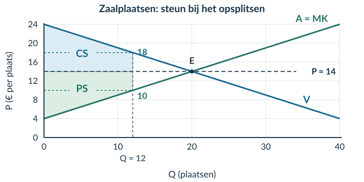
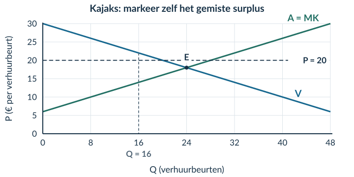
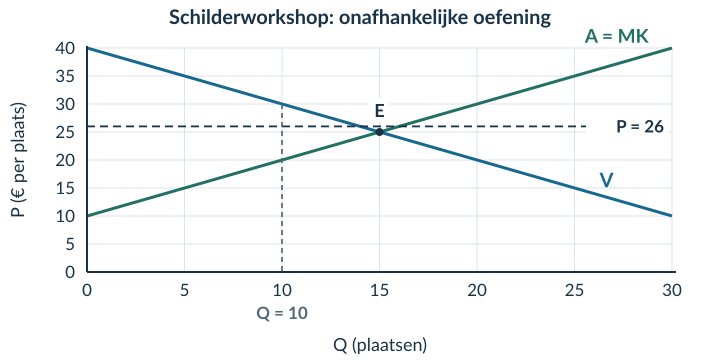
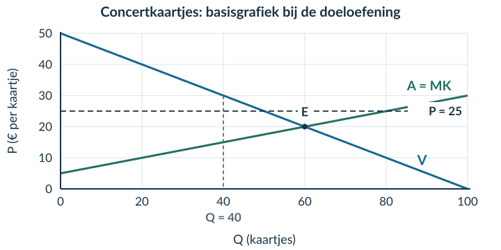

# 2.3.3 Pareto-efficiëntie en welvaartsverlies

## Startopgaven

**Opgave 1 · Gebieden ophalen (§2.3.2)**

In een vrij evenwicht is Q = 20 en P = 15. De rechte vraaglijn snijdt de P-as bij 25 en de rechte MK-lijn bij 5. Bereken CS, PS en TS. P is in euro per product.

**Opgave 2 · Pareto of alleen een hoger totaal?**

Een verandering geeft koper A € 8 extra voordeel, maar verkoper B € 3 minder. Anderen merken niets. Is dit een Paretoverbetering? Licht toe.

Normale route: Startopgaven → Begeleide inoefening → Zelfstandige oefening → Doeloefening. Uitdagende route (minder tussenstappen, extra uitdaging): Startopgaven → Zelfstandige oefening → Doeloefening → Denkertje / Bonusopgave. Herhaling is extra bij beide routes.

## Begeleide inoefening

*Begeleide inoefening hoort bij leren: je oefent met denkstappen en doet steeds meer zelf.*

**Opgave 3 · Zaalplaatsen**

Vraag P = 24 − 0,5Q 
aanbod/MK P = 4 + 0,5Q. 
P is in euro per plaats. Vrij: Qe = 20, Pe = 14, TS = € 200. Een kosteloos verruimbare grens staat 12 boekingen toe tegen P = 14. De hoogste betalingsbereidheden en laagste MK worden gekozen; uitbreiding kan zonder anderen te schaden.

<figure><figcaption>Figuur 7 · De gebieden en horizontale hulplijnen zijn gegeven.</figcaption></figure>

a) Bereken Qv en Qa. Leg uit waarom toch maar 12 transacties plaatsvinden.

b) Vul in: CS = 12 × (18 − 14) + ½ × 12 × (24 − 18). Bereken ook PS, TS en het verlies.

**Opgave 4 · Kajakverhuur**

Vraag: **P = 30 − 0,5Q** 
Aanbod/MK: **P = 6 + 0,5Q**. 
P is in euro per verhuurbeurt; Q in verhuurbeurten. Vrij: Qe = 24 en Pe = 18; TS = € 288.

Een kosteloos verruimbare boekingsgrens beperkt het aantal tot 16, tegen P = 20. Er is technisch ruimte voor minstens 24 transacties. De huurders met de hoogste betalingsbereidheid handelen met de verhuurders met de laagste MK. Bij verruiming blijven prijs en bestaande transacties gelijk.

<figure><figcaption>Figuur 8 · Splits zelf de gebieden. De lijnen en de boekingsgrens zijn al aangegeven.</figcaption></figure>

a) Bereken Qv en Qa bij P = 20 en verklaar de 16 werkelijke transacties.

b) Bij Q = 16 is de betalingsbereidheid € 22 en MK € 14. Bereken CS, PS, TS en het welvaartsverlies. Arceer het verlies.

c) Bij een mogelijke 17e transactie zijn de betalingsbereidheid € 21,50 en MK € 14,50. Leg uit waarom de situatie met 16 transacties niet Pareto-efficiënt is. Noem ook haalbaarheid en het gevolg voor bestaande partijen.

d) ‘PS stijgt ten opzichte van het vrije evenwicht. Dus niemand gaat erop achteruit.’ Beoordeel dit met CS en PS vóór en na.

## Zelfstandige oefening

**Opgave 5 · Schilderworkshop**

Vraag: **P = 40 − Q** 
Aanbod/MK: **P = 10 + Q**. 
P is in euro per plaats; Q in plaatsen. Vrij: Qe = 15, Pe = 25 en TS = € 225.

Een boekingsregel staat 10 plaatsen toe tegen P = 26. Er zijn technisch minstens 15 plaatsen. Verruiming is kosteloos. De hoogste betalingsbereidheden en laagste MK bepalen wie handelt; prijs en bestaande transacties blijven bij verruiming gelijk.

<figure><figcaption>Figuur 9 · Gebruik de geleverde grafiek; teken de twee lijnen niet opnieuw.</figcaption></figure>

a) Omschrijf Pareto-efficiëntie.

b) Bereken Qv en Qa. Verklaar het werkelijke aantal transacties en wie er handelen.

c) Bereken CS, PS en TS met de juiste gebieden en eenheden.

d) Bereken en arceer het welvaartsverlies. Benoem basis en hoogte.

e) Gebruik de betalingsbereidheid en MK van de mogelijke 11e transactie om de Pareto-efficiëntie te beoordelen.

f) Leg uit waarom een hoger TS niet bewijst dat een verdeling eerlijker is.

## Doeloefening

**Opgave 6 · Concertkaartjes — gegevens**

Gebruik opnieuw vraag P=50−0,5Q en aanbod P=5+0,25Q. Het vrije evenwicht is Q=60 en P=€20, met CS=€900, PS=€450 en TS=€1.350. Een kosteloos verruimbare reserveringsregel zet de prijs op €25 en beperkt boekingen tot 40 kaartjes, hoewel het platform technisch minstens 60 transacties kan verwerken. De 40 kaartjes gaan naar de vragers met de hoogste betalingsbereidheid en worden geleverd door de aanbieders met de laagste marginale kosten. Daardoor vinden precies 40 transacties plaats. Bij verruiming blijven de prijs en alle bestaande transacties ongewijzigd.

<figure><figcaption>Figuur 10 · Basisgrafiek bij opgave 6. Het vrije evenwicht E, P = 25 en Q = 40 zijn aangegeven. De vragen staan op de volgende pagina.</figcaption></figure>

<b>Dezelfde markt, een andere uitkomst</b> Vergelijk de werkelijke handel onder de reserveringsregel met het gegeven vrije evenwicht. Gebruik bij de gebieden uitsluitend de transacties die onder de regel plaatsvinden.

**Opgave 6 · Concertkaartjes — vragen**

a) Omschrijf Pareto-efficiëntie binnen dit marktmodel: wanneer kan geen haalbare extra transactie of herverdeling iemand beter maken zonder iemand anders slechter te maken?

b) Bereken bij P=€25 de gevraagde hoeveelheid (Qv) en aangeboden hoeveelheid (Qa). Leg met de reserveringsregel uit waarom het werkelijke aantal transacties 40 is en welke vragers en aanbieders handelen.

c) Bereken bij 40 transacties en P=€25 het CS en PS. Splits elk oppervlak zo nodig in een rechthoek en een driehoek; gebruik de allocatieregel.

d) Bereken TS en het welvaartsverlies ten opzichte van het vrije evenwicht. Arceer het welvaartsverlies tussen Q=40 en Q=60 in de basisgrafiek en benoem basis en hoogte.

e) Pas je definitie uit vraag a toe op de 41e transactie. Leg met betalingsbereidheid, marginale kosten en de kosteloze verruiming uit waarom 40 transacties niet Pareto-efficiënt zijn.

f) Leg uit waarom een hoger TS of Pareto-efficiëntie niet automatisch betekent dat de verdeling eerlijk is.

## Denkertje / Bonusopgave

**Opgave 7 · De verborgen voorwaarde**

Een extra transactie helpt koper en verkoper. Om haar mogelijk te maken moet iemand anders echter € 8 betalen, zonder vergoeding. Is het extra handelsvoordeel genoeg om een Paretoverbetering te bewijzen? Leg uit.

## Herhaling en combineren

**Opgave 8 · Omzet en winst (§2.1.2)**

Een verkoper ontvangt € 900 omzet en maakt € 760 totale kosten. Bereken de winst.

**Opgave 9 · Eenheden (§2.3.1)**

Een surplusdriehoek heeft basis 80 kaartjes en hoogte € 12 per kaartje. Bereken het surplus met de juiste eenheid.

