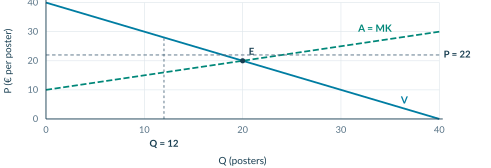
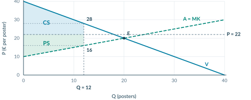
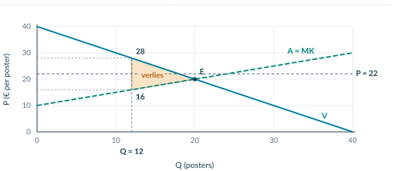
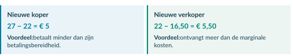

# 2.3.3 Pareto-efficiëntie en welvaartsverlies

<!-- Native reconstruction of accepted physical page 92; see the revision provenance. -->
<article class="native-theory" data-accepted-page="92">
<svg aria-hidden="true" class="native-decoration" style="left:53.3583pt;top:77.7636pt;width:488.5591pt;height:2.1pt" viewbox="53.3583 77.7636 488.5591 2.1"><path d="M 53.8583 51.0236 H 541.4174 V 78.2636 H 53.8583 Z M 53.8583 51.0236 H 541.4174 V 79.3636 H 53.8583 Z" fill="#007da2" fill-rule="evenodd" stroke="none" stroke-width="0"></path></svg>
<svg aria-hidden="true" class="native-decoration" style="left:53.3583pt;top:102.7036pt;width:488.5591pt;height:1.5pt" viewbox="53.3583 102.7036 488.5591 1.5"><path d="M 53.8583 85.3636 H 541.4174 V 103.2036 H 53.8583 Z M 53.8583 85.3636 H 541.4174 V 103.7036 H 53.8583 Z" fill="#cedfe6" fill-rule="evenodd" stroke="none" stroke-width="0"></path></svg>
<svg aria-hidden="true" class="native-decoration" style="left:53.3583pt;top:161.2546pt;width:488.5591pt;height:58.69pt" viewbox="53.3583 161.2546 488.5591 58.69"><path d="M 53.8583 161.7546 H 541.4174 V 219.4446 H 53.8583 Z" fill="#f1f5f7" fill-rule="nonzero" stroke="none" stroke-width="0"></path></svg>
<svg aria-hidden="true" class="native-decoration" style="left:53.3583pt;top:161.2546pt;width:3pt;height:58.69pt" viewbox="53.3583 161.2546 3 58.69"><path d="M 55.8583 161.7546 H 541.4174 V 219.4446 H 55.8583 Z M 53.8583 161.7546 H 541.4174 V 219.4446 H 53.8583 Z" fill="#8ba5b2" fill-rule="evenodd" stroke="none" stroke-width="0"></path></svg>
<svg aria-hidden="true" class="native-decoration" style="left:53.3583pt;top:266.5866pt;width:142.3921pt;height:21.951pt" viewbox="53.3583 266.5866 142.3921 21.951"><path d="M 53.8583 267.0866 H 195.2504 V 288.0376 H 53.8583 Z" fill="#eaf1f4" fill-rule="nonzero" stroke="none" stroke-width="0"></path></svg>
<svg aria-hidden="true" class="native-decoration" style="left:194.7504pt;top:266.5866pt;width:239.9039pt;height:21.951pt" viewbox="194.7504 266.5866 239.9039 21.951"><path d="M 195.2504 267.0866 H 434.1543 V 288.0376 H 195.2504 Z" fill="#eaf1f4" fill-rule="nonzero" stroke="none" stroke-width="0"></path></svg>
<svg aria-hidden="true" class="native-decoration" style="left:433.6543pt;top:266.5866pt;width:108.263pt;height:21.951pt" viewbox="433.6543 266.5866 108.263 21.951"><path d="M 434.1543 267.0866 H 541.4174 V 288.0376 H 434.1543 Z" fill="#eaf1f4" fill-rule="nonzero" stroke="none" stroke-width="0"></path></svg>
<svg aria-hidden="true" class="native-decoration" style="left:53.3583pt;top:308.7136pt;width:142.3921pt;height:22.101pt" viewbox="53.3583 308.7136 142.3921 22.101"><path d="M 53.8583 309.2136 H 195.2504 V 330.3146 H 53.8583 Z" fill="#f6f9fa" fill-rule="nonzero" stroke="none" stroke-width="0"></path></svg>
<svg aria-hidden="true" class="native-decoration" style="left:194.7504pt;top:308.7136pt;width:239.9039pt;height:22.101pt" viewbox="194.7504 308.7136 239.9039 22.101"><path d="M 195.2504 309.2136 H 434.1543 V 330.3146 H 195.2504 Z" fill="#f6f9fa" fill-rule="nonzero" stroke="none" stroke-width="0"></path></svg>
<svg aria-hidden="true" class="native-decoration" style="left:433.6543pt;top:308.7136pt;width:108.263pt;height:22.101pt" viewbox="433.6543 308.7136 108.263 22.101"><path d="M 434.1543 309.2136 H 541.4174 V 330.3146 H 434.1543 Z" fill="#f6f9fa" fill-rule="nonzero" stroke="none" stroke-width="0"></path></svg>
<svg aria-hidden="true" class="native-decoration" style="left:53.3583pt;top:350.9156pt;width:142.3921pt;height:22.101pt" viewbox="53.3583 350.9156 142.3921 22.101"><path d="M 53.8583 351.4156 H 195.2504 V 372.5166 H 53.8583 Z" fill="#edf5f2" fill-rule="nonzero" stroke="none" stroke-width="0"></path></svg>
<svg aria-hidden="true" class="native-decoration" style="left:194.7504pt;top:350.9156pt;width:239.9039pt;height:22.101pt" viewbox="194.7504 350.9156 239.9039 22.101"><path d="M 195.2504 351.4156 H 434.1543 V 372.5166 H 195.2504 Z" fill="#edf5f2" fill-rule="nonzero" stroke="none" stroke-width="0"></path></svg>
<svg aria-hidden="true" class="native-decoration" style="left:433.6543pt;top:350.9156pt;width:108.263pt;height:22.101pt" viewbox="433.6543 350.9156 108.263 22.101"><path d="M 434.1543 351.4156 H 541.4174 V 372.5166 H 434.1543 Z" fill="#edf5f2" fill-rule="nonzero" stroke="none" stroke-width="0"></path></svg>
<svg aria-hidden="true" class="native-decoration" style="left:53.3583pt;top:308.7136pt;width:142.3921pt;height:1pt" viewbox="53.3583 308.7136 142.3921 1"><path d="M 53.8583 309.2136 L 195.2504 309.2136" fill="none" fill-rule="nonzero" stroke="#dce5e9" stroke-width="0.45000001788139343"></path></svg>
<svg aria-hidden="true" class="native-decoration" style="left:194.7504pt;top:308.7136pt;width:239.9039pt;height:1pt" viewbox="194.7504 308.7136 239.9039 1"><path d="M 195.2504 309.2136 L 434.1543 309.2136" fill="none" fill-rule="nonzero" stroke="#dce5e9" stroke-width="0.45000001788139343"></path></svg>
<svg aria-hidden="true" class="native-decoration" style="left:433.6543pt;top:308.7136pt;width:108.263pt;height:1pt" viewbox="433.6543 308.7136 108.263 1"><path d="M 434.1543 309.2136 L 541.4174 309.2136" fill="none" fill-rule="nonzero" stroke="#dce5e9" stroke-width="0.45000001788139343"></path></svg>
<svg aria-hidden="true" class="native-decoration" style="left:53.3583pt;top:329.8146pt;width:142.3921pt;height:1pt" viewbox="53.3583 329.8146 142.3921 1"><path d="M 53.8583 330.3146 L 195.2504 330.3146" fill="none" fill-rule="nonzero" stroke="#dce5e9" stroke-width="0.45000001788139343"></path></svg>
<svg aria-hidden="true" class="native-decoration" style="left:194.7504pt;top:329.8146pt;width:239.9039pt;height:1pt" viewbox="194.7504 329.8146 239.9039 1"><path d="M 195.2504 330.3146 L 434.1543 330.3146" fill="none" fill-rule="nonzero" stroke="#dce5e9" stroke-width="0.45000001788139343"></path></svg>
<svg aria-hidden="true" class="native-decoration" style="left:433.6543pt;top:329.8146pt;width:108.263pt;height:1pt" viewbox="433.6543 329.8146 108.263 1"><path d="M 434.1543 330.3146 L 541.4174 330.3146" fill="none" fill-rule="nonzero" stroke="#dce5e9" stroke-width="0.45000001788139343"></path></svg>
<svg aria-hidden="true" class="native-decoration" style="left:53.3583pt;top:350.9156pt;width:142.3921pt;height:1pt" viewbox="53.3583 350.9156 142.3921 1"><path d="M 53.8583 351.4156 L 195.2504 351.4156" fill="none" fill-rule="nonzero" stroke="#dce5e9" stroke-width="0.45000001788139343"></path></svg>
<svg aria-hidden="true" class="native-decoration" style="left:194.7504pt;top:350.9156pt;width:239.9039pt;height:1pt" viewbox="194.7504 350.9156 239.9039 1"><path d="M 195.2504 351.4156 L 434.1543 351.4156" fill="none" fill-rule="nonzero" stroke="#dce5e9" stroke-width="0.45000001788139343"></path></svg>
<svg aria-hidden="true" class="native-decoration" style="left:433.6543pt;top:350.9156pt;width:108.263pt;height:1pt" viewbox="433.6543 350.9156 108.263 1"><path d="M 434.1543 351.4156 L 541.4174 351.4156" fill="none" fill-rule="nonzero" stroke="#dce5e9" stroke-width="0.45000001788139343"></path></svg>
<svg aria-hidden="true" class="native-decoration" style="left:53.3583pt;top:372.0166pt;width:142.3921pt;height:1pt" viewbox="53.3583 372.0166 142.3921 1"><path d="M 53.8583 372.5166 L 195.2504 372.5166" fill="none" fill-rule="nonzero" stroke="#dce5e9" stroke-width="0.45000001788139343"></path></svg>
<svg aria-hidden="true" class="native-decoration" style="left:194.7504pt;top:372.0166pt;width:239.9039pt;height:1pt" viewbox="194.7504 372.0166 239.9039 1"><path d="M 195.2504 372.5166 L 434.1543 372.5166" fill="none" fill-rule="nonzero" stroke="#dce5e9" stroke-width="0.45000001788139343"></path></svg>
<svg aria-hidden="true" class="native-decoration" style="left:433.6543pt;top:372.0166pt;width:108.263pt;height:1pt" viewbox="433.6543 372.0166 108.263 1"><path d="M 434.1543 372.5166 L 541.4174 372.5166" fill="none" fill-rule="nonzero" stroke="#dce5e9" stroke-width="0.45000001788139343"></path></svg>
<svg aria-hidden="true" class="native-decoration" style="left:53.2583pt;top:287.4376pt;width:142.5921pt;height:1.2pt" viewbox="53.2583 287.4376 142.5921 1.2"><path d="M 53.8583 288.0376 L 195.2504 288.0376" fill="none" fill-rule="nonzero" stroke="#cbdbe2" stroke-width="0.6000000238418579"></path></svg>
<svg aria-hidden="true" class="native-decoration" style="left:194.6504pt;top:287.4376pt;width:240.1039pt;height:1.2pt" viewbox="194.6504 287.4376 240.1039 1.2"><path d="M 195.2504 288.0376 L 434.1543 288.0376" fill="none" fill-rule="nonzero" stroke="#cbdbe2" stroke-width="0.6000000238418579"></path></svg>
<svg aria-hidden="true" class="native-decoration" style="left:433.5543pt;top:287.4376pt;width:108.463pt;height:1.2pt" viewbox="433.5543 287.4376 108.463 1.2"><path d="M 434.1543 288.0376 L 541.4174 288.0376" fill="none" fill-rule="nonzero" stroke="#cbdbe2" stroke-width="0.6000000238418579"></path></svg>
<svg aria-hidden="true" class="native-decoration" style="left:53.3583pt;top:586.5514pt;width:488.5591pt;height:54.83pt" viewbox="53.3583 586.5514 488.5591 54.83"><path d="M 53.8583 587.0514 H 541.4174 V 640.8814 H 53.8583 Z" fill="#faf2e8" fill-rule="nonzero" stroke="none" stroke-width="0"></path></svg>
<svg aria-hidden="true" class="native-decoration" style="left:104.17pt;top:85.8636pt;width:1.5pt;height:10.84pt" viewbox="104.17 85.8636 1.5 10.84"><path d="M 53.8583 86.3636 H 104.67 V 96.2036 H 53.8583 Z M 53.8583 86.3636 H 105.17 V 96.2036 H 53.8583 Z" fill="#bed5df" fill-rule="evenodd" stroke="none" stroke-width="0"></path></svg>
<svg aria-hidden="true" class="native-decoration" style="left:161.5148pt;top:85.8636pt;width:1.5pt;height:10.84pt" viewbox="161.5148 85.8636 1.5 10.84"><path d="M 105.17 86.3636 H 162.0148 V 96.2036 H 105.17 Z M 105.17 86.3636 H 162.5148 V 96.2036 H 105.17 Z" fill="#bed5df" fill-rule="evenodd" stroke="none" stroke-width="0"></path></svg>
<svg aria-hidden="true" class="native-decoration" style="left:219.8885pt;top:85.8636pt;width:1.5pt;height:10.84pt" viewbox="219.8885 85.8636 1.5 10.84"><path d="M 162.5148 86.3636 H 220.3885 V 96.2036 H 162.5148 Z M 162.5148 86.3636 H 220.8885 V 96.2036 H 162.5148 Z" fill="#bed5df" fill-rule="evenodd" stroke="none" stroke-width="0"></path></svg>
<svg aria-hidden="true" class="native-decoration" style="left:277.7841pt;top:85.8636pt;width:1.5pt;height:10.84pt" viewbox="277.7841 85.8636 1.5 10.84"><path d="M 220.8885 86.3636 H 278.2841 V 96.2036 H 220.8885 Z M 220.8885 86.3636 H 278.7841 V 96.2036 H 220.8885 Z" fill="#bed5df" fill-rule="evenodd" stroke="none" stroke-width="0"></path></svg>
<h1 class="native-text" data-layout-height="24.1192" data-layout-width="385.8389" style="left:53.8583pt;top:50.5842pt;line-height:21.1192pt">2.3.3 · Werkelijke handel: vraag, aanbod en grens</h1>

Handel · 20

CS/PS · 21

Verlies · 22

Pareto · 23

Voorbeeld · 24–25

Op de postermarkt zijn vrij 20 transacties tegen € 20 mogelijk. Een reserveringssysteem laat nu maar 12 boekingen tegen € 22 toe. Het kan technisch minstens 20 transacties verwerken; de grens kan zonder kosten worden verruimd.

Lesdoelen

Je kunt werkelijke transacties bepalen, CS, PS, TS en welvaartsverlies berekenen, Pareto-efficiëntie toepassen en efficiëntie van eerlijkheid onderscheiden.

<h2 class="native-text" data-layout-height="17.7595" data-layout-width="295.2007" style="left:53.8583pt;top:227.6295pt;line-height:14.7595pt">Gevraagd, aangeboden en verkocht zijn niet hetzelfde</h2>

Vraag: P = 40 − Q. Aanbod/MK: P = 10 + 0,5Q. Bereken bij P = € 22 eerst de twee gewenste hoeveelheden.

<table aria-label="Tabel bij Niet elke voordelige transactie gaat door" class="native-table" style="left:53.8583pt;top:267.09pt;width:487.5591pt;height:105.43pt"><tbody>
<tr>
<th scope="col" style="left:0pt;top:0pt;width:141.3921pt;height:20.95pt">

Grootheid

</th>
<th scope="col" style="left:141.3921pt;top:0pt;width:238.9039pt;height:20.95pt">

Berekening of gegeven

</th>
<th scope="col" style="left:380.2961pt;top:0pt;width:107.263pt;height:20.95pt">

Hoeveelheid

</th>
</tr>
<tr>
<td style="left:0pt;top:20.95pt;width:141.3921pt;height:21.17pt">

Gevraagd: Qd

</td>
<td style="left:141.3921pt;top:20.95pt;width:238.9039pt;height:21.17pt">

22 = 40 − Qd

</td>
<td style="left:380.2961pt;top:20.95pt;width:107.263pt;height:21.17pt">

18 posters

</td>
</tr>
<tr>
<td style="left:0pt;top:42.12pt;width:141.3921pt;height:21.1pt">

Aangeboden: Qs

</td>
<td style="left:141.3921pt;top:42.12pt;width:238.9039pt;height:21.1pt">

22 = 10 + 0,5Qs

</td>
<td style="left:380.2961pt;top:42.12pt;width:107.263pt;height:21.1pt">

24 posters

</td>
</tr>
<tr>
<td style="left:0pt;top:63.22pt;width:141.3921pt;height:21.11pt">

Boekingsgrens

</td>
<td style="left:141.3921pt;top:63.22pt;width:238.9039pt;height:21.11pt">

Er mogen maximaal 12 boekingen zijn.

</td>
<td style="left:380.2961pt;top:63.22pt;width:107.263pt;height:21.11pt">

12 posters

</td>
</tr>
<tr>
<td style="left:0pt;top:84.33pt;width:141.3921pt;height:21.1pt">

Werkelijk verkocht

</td>
<td style="left:141.3921pt;top:84.33pt;width:238.9039pt;height:21.1pt">

De grens ligt onder Qd én Qs.

</td>
<td style="left:380.2961pt;top:84.33pt;width:107.263pt;height:21.1pt">

12 posters

</td>
</tr>
</tbody></table>
<figure class="native-figure" style="left:54pt;top:397.2838pt;width:491.2756pt;height:168.4557pt"><figcaption class="native-text" data-layout-height="13.0195" data-layout-width="381.613" style="left:-0.1417pt;top:171.4557pt;line-height:10.0195pt">Figuur 1. E is het vrije evenwicht. De boekingsgrens stopt de werkelijke handel bij Q = 12, vóór Qe = 20.</figcaption></figure>

Wie handelt er? De 12 hoogste betalingsbereidheden worden gekoppeld aan de 12 laagste MK. Deze toewijzing bepaalt de surplusgebieden. De grens is bindend: zij houdt mogelijke transacties tegen. Qd en Qs betekenen hetzelfde als Qv en Qa in boek 1.

</article>

<!-- Native reconstruction of accepted physical page 93; see the revision provenance. -->
<article class="native-theory" data-accepted-page="93">
<svg aria-hidden="true" class="native-decoration" style="left:53.3583pt;top:77.7636pt;width:488.5591pt;height:2.1pt" viewbox="53.3583 77.7636 488.5591 2.1"><path d="M 53.8583 51.0236 H 541.4174 V 78.2636 H 53.8583 Z M 53.8583 51.0236 H 541.4174 V 79.3636 H 53.8583 Z" fill="#007da2" fill-rule="evenodd" stroke="none" stroke-width="0"></path></svg>
<svg aria-hidden="true" class="native-decoration" style="left:53.3583pt;top:102.7036pt;width:488.5591pt;height:1.5pt" viewbox="53.3583 102.7036 488.5591 1.5"><path d="M 53.8583 85.3636 H 541.4174 V 103.2036 H 53.8583 Z M 53.8583 85.3636 H 541.4174 V 103.7036 H 53.8583 Z" fill="#cedfe6" fill-rule="evenodd" stroke="none" stroke-width="0"></path></svg>
<svg aria-hidden="true" class="native-decoration" style="left:53.3583pt;top:392.8831pt;width:242.2795pt;height:164.001pt" viewbox="53.3583 392.8831 242.2795 164.001"><path d="M 53.8583 393.3831 H 295.1378 V 556.384 H 53.8583 Z" fill="#eaf4f8" fill-rule="nonzero" stroke="none" stroke-width="0"></path></svg>
<svg aria-hidden="true" class="native-decoration" style="left:299.6378pt;top:392.8831pt;width:242.2796pt;height:164.001pt" viewbox="299.6378 392.8831 242.2796 164.001"><path d="M 300.1378 393.3831 H 541.4174 V 556.384 H 300.1378 Z" fill="#edf5f2" fill-rule="nonzero" stroke="none" stroke-width="0"></path></svg>
<svg aria-hidden="true" class="native-decoration" style="left:53.3583pt;top:392.8831pt;width:3pt;height:164.001pt" viewbox="53.3583 392.8831 3 164.001"><path d="M 55.8583 393.3831 H 295.1378 V 556.384 H 55.8583 Z M 53.8583 393.3831 H 295.1378 V 556.384 H 53.8583 Z" fill="#007da2" fill-rule="evenodd" stroke="none" stroke-width="0"></path></svg>
<svg aria-hidden="true" class="native-decoration" style="left:299.6378pt;top:392.8831pt;width:3pt;height:164.001pt" viewbox="299.6378 392.8831 3 164.001"><path d="M 302.1378 393.3831 H 541.4174 V 556.384 H 302.1378 Z M 300.1378 393.3831 H 541.4174 V 556.384 H 300.1378 Z" fill="#008779" fill-rule="evenodd" stroke="none" stroke-width="0"></path></svg>
<svg aria-hidden="true" class="native-decoration" style="left:53.3583pt;top:623.0471pt;width:488.5591pt;height:42.22pt" viewbox="53.3583 623.0471 488.5591 42.22"><path d="M 53.8583 623.5471 H 541.4174 V 664.7671 H 53.8583 Z" fill="#faf2e8" fill-rule="nonzero" stroke="none" stroke-width="0"></path></svg>
<svg aria-hidden="true" class="native-decoration" style="left:103.8434pt;top:85.8636pt;width:1.5pt;height:10.84pt" viewbox="103.8434 85.8636 1.5 10.84"><path d="M 53.8583 86.3636 H 104.3434 V 96.2036 H 53.8583 Z M 53.8583 86.3636 H 104.8434 V 96.2036 H 53.8583 Z" fill="#bed5df" fill-rule="evenodd" stroke="none" stroke-width="0"></path></svg>
<svg aria-hidden="true" class="native-decoration" style="left:161.4042pt;top:85.8636pt;width:1.5pt;height:10.84pt" viewbox="161.4042 85.8636 1.5 10.84"><path d="M 104.8434 86.3636 H 161.9042 V 96.2036 H 104.8434 Z M 104.8434 86.3636 H 162.4042 V 96.2036 H 104.8434 Z" fill="#bed5df" fill-rule="evenodd" stroke="none" stroke-width="0"></path></svg>
<svg aria-hidden="true" class="native-decoration" style="left:219.7779pt;top:85.8636pt;width:1.5pt;height:10.84pt" viewbox="219.7779 85.8636 1.5 10.84"><path d="M 162.4042 86.3636 H 220.2779 V 96.2036 H 162.4042 Z M 162.4042 86.3636 H 220.778 V 96.2036 H 162.4042 Z" fill="#bed5df" fill-rule="evenodd" stroke="none" stroke-width="0"></path></svg>
<svg aria-hidden="true" class="native-decoration" style="left:277.6735pt;top:85.8636pt;width:1.5pt;height:10.84pt" viewbox="277.6735 85.8636 1.5 10.84"><path d="M 220.778 86.3636 H 278.1735 V 96.2036 H 220.778 Z M 220.778 86.3636 H 278.6735 V 96.2036 H 220.778 Z" fill="#bed5df" fill-rule="evenodd" stroke="none" stroke-width="0"></path></svg>
<h1 class="native-text" data-layout-height="24.1192" data-layout-width="315.3887" style="left:53.8583pt;top:50.5842pt;line-height:21.1192pt">2.3.3 · CS en PS: niet altijd een driehoek</h1>

Handel · 20

CS/PS · 21

Verlies · 22

Pareto · 23

Voorbeeld · 24–25

Er worden 12 posters tegen € 22 verkocht. Bij Q = 12 is de betalingsbereidheid 40 − 12 = € 28 en zijn de MK 10 + 0,5 × 12 = € 16. De laatste koper én verkoper hebben nog voordeel.

<figure class="native-figure" style="left:54pt;top:164.2798pt;width:491.2756pt;height:197.1869pt"><figcaption class="native-text" data-layout-height="23.624" data-layout-width="485.9827" style="left:-0.1417pt;top:200.1869pt;line-height:10.6045pt">Figuur 2. Beide gebieden stoppen bij 12 werkelijke transacties. De hulplijnen op € 28 en € 16 splitsen elk gebied in een rechthoek en een driehoek.</figcaption></figure>

CS · boven de betaalde prijs

PS · onder de ontvangen prijs

Rechthoek: alle 12 kopers hebben minstens € 28 − € 22 = € 6 voordeel.

Rechthoek: alle 12 verkopers ontvangen minstens € 22 − € 16 = € 6 boven hun MK.

12 × (28 − 22) = € 72

12 × (22 − 16) = € 72

Driehoek: daarboven ligt het extra voordeel van kopers die meer dan € 28 willen betalen.

Driehoek: daaronder ligt het extra voordeel van verkopers met MK lager dan € 16.

½ × 12 × (40 − 28) = € 72

½ × 12 × (16 − 10) = € 36

CS = 72 + 72 = € 144

PS = 72 + 36 = € 108

<h2 class="native-text" data-layout-height="17.7595" data-layout-width="238.5981" style="left:53.8583pt;top:567.5689pt;line-height:14.7595pt">Waarom is alleen ½ × Q × hoogte hier fout?</h2>

Het surplus eindigt bij Q = 12 niet in een punt op de prijslijn. Ook bij de laatste transactie blijft voordeel over. Alleen een driehoek berekenen slaat daarom een deel van het gebied over.

De vaste rekenroute. Bepaal eerst de werkelijke Q. Lees op die Q de betalingsbereidheid en MK af. Teken de hulplijnen, bereken de twee delen en tel ze op. De oppervlakten zijn bedragen in euro.

</article>

<!-- Native reconstruction of accepted physical page 94; see the revision provenance. -->
<article class="native-theory" data-accepted-page="94">
<svg aria-hidden="true" class="native-decoration" style="left:53.3583pt;top:77.7636pt;width:488.5591pt;height:2.1pt" viewbox="53.3583 77.7636 488.5591 2.1"><path d="M 53.8583 51.0236 H 541.4174 V 78.2636 H 53.8583 Z M 53.8583 51.0236 H 541.4174 V 79.3636 H 53.8583 Z" fill="#007da2" fill-rule="evenodd" stroke="none" stroke-width="0"></path></svg>
<svg aria-hidden="true" class="native-decoration" style="left:53.3583pt;top:102.7036pt;width:488.5591pt;height:1.5pt" viewbox="53.3583 102.7036 488.5591 1.5"><path d="M 53.8583 85.3636 H 541.4174 V 103.2036 H 53.8583 Z M 53.8583 85.3636 H 541.4174 V 103.7036 H 53.8583 Z" fill="#cedfe6" fill-rule="evenodd" stroke="none" stroke-width="0"></path></svg>
<svg aria-hidden="true" class="native-decoration" style="left:53.3583pt;top:113.2036pt;width:488.5591pt;height:92.307pt" viewbox="53.3583 113.2036 488.5591 92.307"><path d="M 53.8583 113.7036 H 541.4174 V 205.0106 H 53.8583 Z" fill="#faf2e8" fill-rule="nonzero" stroke="none" stroke-width="0"></path></svg>
<svg aria-hidden="true" class="native-decoration" style="left:53.3583pt;top:113.2036pt;width:3pt;height:92.307pt" viewbox="53.3583 113.2036 3 92.307"><path d="M 55.8583 113.7036 H 541.4174 V 205.0106 H 55.8583 Z M 53.8583 113.7036 H 541.4174 V 205.0106 H 53.8583 Z" fill="#b76518" fill-rule="evenodd" stroke="none" stroke-width="0"></path></svg>
<svg aria-hidden="true" class="native-decoration" style="left:53.3583pt;top:211.5106pt;width:210.6504pt;height:22.351pt" viewbox="53.3583 211.5106 210.6504 22.351"><path d="M 53.8583 212.0106 H 263.5087 V 233.3616 H 53.8583 Z" fill="#eaf1f4" fill-rule="nonzero" stroke="none" stroke-width="0"></path></svg>
<svg aria-hidden="true" class="native-decoration" style="left:263.0087pt;top:211.5106pt;width:83.885pt;height:22.351pt" viewbox="263.0087 211.5106 83.885 22.351"><path d="M 263.5087 212.0106 H 346.3937 V 233.3616 H 263.5087 Z" fill="#eaf1f4" fill-rule="nonzero" stroke="none" stroke-width="0"></path></svg>
<svg aria-hidden="true" class="native-decoration" style="left:345.8937pt;top:211.5106pt;width:83.885pt;height:22.351pt" viewbox="345.8937 211.5106 83.885 22.351"><path d="M 346.3937 212.0106 H 429.2787 V 233.3616 H 346.3937 Z" fill="#eaf1f4" fill-rule="nonzero" stroke="none" stroke-width="0"></path></svg>
<svg aria-hidden="true" class="native-decoration" style="left:428.7787pt;top:211.5106pt;width:113.1386pt;height:22.351pt" viewbox="428.7787 211.5106 113.1386 22.351"><path d="M 429.2787 212.0106 H 541.4174 V 233.3616 H 429.2787 Z" fill="#eaf1f4" fill-rule="nonzero" stroke="none" stroke-width="0"></path></svg>
<svg aria-hidden="true" class="native-decoration" style="left:53.3583pt;top:254.4376pt;width:210.6504pt;height:22.501pt" viewbox="53.3583 254.4376 210.6504 22.501"><path d="M 53.8583 254.9376 H 263.5087 V 276.4386 H 53.8583 Z" fill="#f6f9fa" fill-rule="nonzero" stroke="none" stroke-width="0"></path></svg>
<svg aria-hidden="true" class="native-decoration" style="left:263.0087pt;top:254.4376pt;width:83.885pt;height:22.501pt" viewbox="263.0087 254.4376 83.885 22.501"><path d="M 263.5087 254.9376 H 346.3937 V 276.4386 H 263.5087 Z" fill="#f6f9fa" fill-rule="nonzero" stroke="none" stroke-width="0"></path></svg>
<svg aria-hidden="true" class="native-decoration" style="left:345.8937pt;top:254.4376pt;width:83.885pt;height:22.501pt" viewbox="345.8937 254.4376 83.885 22.501"><path d="M 346.3937 254.9376 H 429.2787 V 276.4386 H 346.3937 Z" fill="#f6f9fa" fill-rule="nonzero" stroke="none" stroke-width="0"></path></svg>
<svg aria-hidden="true" class="native-decoration" style="left:428.7787pt;top:254.4376pt;width:113.1386pt;height:22.501pt" viewbox="428.7787 254.4376 113.1386 22.501"><path d="M 429.2787 254.9376 H 541.4174 V 276.4386 H 429.2787 Z" fill="#f6f9fa" fill-rule="nonzero" stroke="none" stroke-width="0"></path></svg>
<svg aria-hidden="true" class="native-decoration" style="left:53.3583pt;top:254.4376pt;width:210.6504pt;height:1pt" viewbox="53.3583 254.4376 210.6504 1"><path d="M 53.8583 254.9376 L 263.5087 254.9376" fill="none" fill-rule="nonzero" stroke="#dce5e9" stroke-width="0.45000001788139343"></path></svg>
<svg aria-hidden="true" class="native-decoration" style="left:263.0087pt;top:254.4376pt;width:83.885pt;height:1pt" viewbox="263.0087 254.4376 83.885 1"><path d="M 263.5087 254.9376 L 346.3937 254.9376" fill="none" fill-rule="nonzero" stroke="#dce5e9" stroke-width="0.45000001788139343"></path></svg>
<svg aria-hidden="true" class="native-decoration" style="left:345.8937pt;top:254.4376pt;width:83.885pt;height:1pt" viewbox="345.8937 254.4376 83.885 1"><path d="M 346.3937 254.9376 L 429.2787 254.9376" fill="none" fill-rule="nonzero" stroke="#dce5e9" stroke-width="0.45000001788139343"></path></svg>
<svg aria-hidden="true" class="native-decoration" style="left:428.7787pt;top:254.4376pt;width:113.1386pt;height:1pt" viewbox="428.7787 254.4376 113.1386 1"><path d="M 429.2787 254.9376 L 541.4174 254.9376" fill="none" fill-rule="nonzero" stroke="#dce5e9" stroke-width="0.45000001788139343"></path></svg>
<svg aria-hidden="true" class="native-decoration" style="left:53.3583pt;top:275.9386pt;width:210.6504pt;height:1pt" viewbox="53.3583 275.9386 210.6504 1"><path d="M 53.8583 276.4386 L 263.5087 276.4386" fill="none" fill-rule="nonzero" stroke="#dce5e9" stroke-width="0.45000001788139343"></path></svg>
<svg aria-hidden="true" class="native-decoration" style="left:263.0087pt;top:275.9386pt;width:83.885pt;height:1pt" viewbox="263.0087 275.9386 83.885 1"><path d="M 263.5087 276.4386 L 346.3937 276.4386" fill="none" fill-rule="nonzero" stroke="#dce5e9" stroke-width="0.45000001788139343"></path></svg>
<svg aria-hidden="true" class="native-decoration" style="left:345.8937pt;top:275.9386pt;width:83.885pt;height:1pt" viewbox="345.8937 275.9386 83.885 1"><path d="M 346.3937 276.4386 L 429.2787 276.4386" fill="none" fill-rule="nonzero" stroke="#dce5e9" stroke-width="0.45000001788139343"></path></svg>
<svg aria-hidden="true" class="native-decoration" style="left:428.7787pt;top:275.9386pt;width:113.1386pt;height:1pt" viewbox="428.7787 275.9386 113.1386 1"><path d="M 429.2787 276.4386 L 541.4174 276.4386" fill="none" fill-rule="nonzero" stroke="#dce5e9" stroke-width="0.45000001788139343"></path></svg>
<svg aria-hidden="true" class="native-decoration" style="left:53.2583pt;top:232.7616pt;width:210.8504pt;height:1.2pt" viewbox="53.2583 232.7616 210.8504 1.2"><path d="M 53.8583 233.3616 L 263.5087 233.3616" fill="none" fill-rule="nonzero" stroke="#cbdbe2" stroke-width="0.6000000238418579"></path></svg>
<svg aria-hidden="true" class="native-decoration" style="left:262.9087pt;top:232.7616pt;width:84.085pt;height:1.2pt" viewbox="262.9087 232.7616 84.085 1.2"><path d="M 263.5087 233.3616 L 346.3937 233.3616" fill="none" fill-rule="nonzero" stroke="#cbdbe2" stroke-width="0.6000000238418579"></path></svg>
<svg aria-hidden="true" class="native-decoration" style="left:345.7937pt;top:232.7616pt;width:84.085pt;height:1.2pt" viewbox="345.7937 232.7616 84.085 1.2"><path d="M 346.3937 233.3616 L 429.2787 233.3616" fill="none" fill-rule="nonzero" stroke="#cbdbe2" stroke-width="0.6000000238418579"></path></svg>
<svg aria-hidden="true" class="native-decoration" style="left:428.6787pt;top:232.7616pt;width:113.3386pt;height:1.2pt" viewbox="428.6787 232.7616 113.3386 1.2"><path d="M 429.2787 233.3616 L 541.4174 233.3616" fill="none" fill-rule="nonzero" stroke="#cbdbe2" stroke-width="0.6000000238418579"></path></svg>
<svg aria-hidden="true" class="native-decoration" style="left:53.3583pt;top:538.2504pt;width:242.2795pt;height:91.918pt" viewbox="53.3583 538.2504 242.2795 91.918"><path d="M 53.8583 538.7504 H 295.1378 V 629.6685 H 53.8583 Z" fill="#faf2e8" fill-rule="nonzero" stroke="none" stroke-width="0"></path></svg>
<svg aria-hidden="true" class="native-decoration" style="left:299.6378pt;top:538.2504pt;width:242.2796pt;height:91.918pt" viewbox="299.6378 538.2504 242.2796 91.918"><path d="M 300.1378 538.7504 H 541.4174 V 629.6685 H 300.1378 Z" fill="#faf2e8" fill-rule="nonzero" stroke="none" stroke-width="0"></path></svg>
<svg aria-hidden="true" class="native-decoration" style="left:53.3583pt;top:538.2504pt;width:3pt;height:91.918pt" viewbox="53.3583 538.2504 3 91.918"><path d="M 55.8583 538.7504 H 295.1378 V 629.6685 H 55.8583 Z M 53.8583 538.7504 H 295.1378 V 629.6685 H 53.8583 Z" fill="#b76518" fill-rule="evenodd" stroke="none" stroke-width="0"></path></svg>
<svg aria-hidden="true" class="native-decoration" style="left:299.6378pt;top:538.2504pt;width:3pt;height:91.918pt" viewbox="299.6378 538.2504 3 91.918"><path d="M 302.1378 538.7504 H 541.4174 V 629.6685 H 302.1378 Z M 300.1378 538.7504 H 541.4174 V 629.6685 H 300.1378 Z" fill="#b76518" fill-rule="evenodd" stroke="none" stroke-width="0"></path></svg>
<svg aria-hidden="true" class="native-decoration" style="left:53.3583pt;top:710.3484pt;width:488.5591pt;height:42.22pt" viewbox="53.3583 710.3484 488.5591 42.22"><path d="M 53.8583 710.8484 H 541.4174 V 752.0685 H 53.8583 Z" fill="#faf2e8" fill-rule="nonzero" stroke="none" stroke-width="0"></path></svg>
<svg aria-hidden="true" class="native-decoration" style="left:103.8434pt;top:85.8636pt;width:1.5pt;height:10.84pt" viewbox="103.8434 85.8636 1.5 10.84"><path d="M 53.8583 86.3636 H 104.3434 V 96.2036 H 53.8583 Z M 53.8583 86.3636 H 104.8434 V 96.2036 H 53.8583 Z" fill="#bed5df" fill-rule="evenodd" stroke="none" stroke-width="0"></path></svg>
<svg aria-hidden="true" class="native-decoration" style="left:161.1881pt;top:85.8636pt;width:1.5pt;height:10.84pt" viewbox="161.1881 85.8636 1.5 10.84"><path d="M 104.8434 86.3636 H 161.6881 V 96.2036 H 104.8434 Z M 104.8434 86.3636 H 162.1881 V 96.2036 H 104.8434 Z" fill="#bed5df" fill-rule="evenodd" stroke="none" stroke-width="0"></path></svg>
<svg aria-hidden="true" class="native-decoration" style="left:220.0167pt;top:85.8636pt;width:1.5pt;height:10.84pt" viewbox="220.0167 85.8636 1.5 10.84"><path d="M 162.1881 86.3636 H 220.5167 V 96.2036 H 162.1881 Z M 162.1881 86.3636 H 221.0167 V 96.2036 H 162.1881 Z" fill="#bed5df" fill-rule="evenodd" stroke="none" stroke-width="0"></path></svg>
<svg aria-hidden="true" class="native-decoration" style="left:277.9122pt;top:85.8636pt;width:1.5pt;height:10.84pt" viewbox="277.9122 85.8636 1.5 10.84"><path d="M 221.0167 86.3636 H 278.4122 V 96.2036 H 221.0167 Z M 221.0167 86.3636 H 278.9122 V 96.2036 H 221.0167 Z" fill="#bed5df" fill-rule="evenodd" stroke="none" stroke-width="0"></path></svg>
<h1 class="native-text" data-layout-height="24.1192" data-layout-width="411.2701" style="left:53.8583pt;top:50.5842pt;line-height:21.1192pt">2.3.3 · Welvaartsverlies: voordeel dat niemand krijgt</h1>

Handel · 20

CS/PS · 21

Verlies · 22

Pareto · 23

Voorbeeld · 24–25

Welvaartsverlies

Het verschil tussen het maximaal haalbare totaal surplus en het werkelijk gerealiseerde totaal surplus, binnen het gegeven model.

Welvaartsverlies = maximaal TS − werkelijk TS

<table aria-label="Tabel bij Voordeel dat niemand ontvangt" class="native-table" style="left:53.8583pt;top:212.01pt;width:487.5591pt;height:85.93pt"><tbody>
<tr>
<th scope="col" style="left:0pt;top:0pt;width:209.6504pt;height:21.35pt">

Postermarkt

</th>
<th scope="col" style="left:209.6504pt;top:0pt;width:82.885pt;height:21.35pt">

CS

</th>
<th scope="col" style="left:292.5354pt;top:0pt;width:82.885pt;height:21.35pt">

PS

</th>
<th scope="col" style="left:375.4205pt;top:0pt;width:112.1386pt;height:21.35pt">

TS = CS + PS

</th>
</tr>
<tr>
<td style="left:0pt;top:21.35pt;width:209.6504pt;height:21.58pt">

Vrij evenwicht: 20 posters

</td>
<td style="left:209.6504pt;top:21.35pt;width:82.885pt;height:21.58pt">

€ 200

</td>
<td style="left:292.5354pt;top:21.35pt;width:82.885pt;height:21.58pt">

€ 100

</td>
<td style="left:375.4205pt;top:21.35pt;width:112.1386pt;height:21.58pt">

€ 300

</td>
</tr>
<tr>
<td style="left:0pt;top:42.93pt;width:209.6504pt;height:21.5pt">

Boekingsgrens: 12 posters

</td>
<td style="left:209.6504pt;top:42.93pt;width:82.885pt;height:21.5pt">

€ 144

</td>
<td style="left:292.5354pt;top:42.93pt;width:82.885pt;height:21.5pt">

€ 108

</td>
<td style="left:375.4205pt;top:42.93pt;width:112.1386pt;height:21.5pt">

€ 252

</td>
</tr>
<tr>
<td style="left:0pt;top:64.43pt;width:209.6504pt;height:21.5pt">

Verandering

</td>
<td style="left:209.6504pt;top:64.43pt;width:82.885pt;height:21.5pt">

−€ 56

</td>
<td style="left:292.5354pt;top:64.43pt;width:82.885pt;height:21.5pt">

+€ 8

</td>
<td style="left:375.4205pt;top:64.43pt;width:112.1386pt;height:21.5pt">

−€ 48

</td>
</tr>
</tbody></table>
<figure class="native-figure" style="left:53.8583pt;top:292pt;width:491.4173pt;height:214.8341pt"><figcaption class="native-text" data-layout-height="23.624" data-layout-width="481.0735" style="left:0pt;top:217.8341pt;line-height:10.6045pt">Figuur 3. Tussen Q = 12 en Q = 20 ligt betalingsbereidheid boven MK. Het voordeel van deze niet-doorgegane transacties ontvangt niemand.</figcaption></figure>

Manier 1 · vergelijk de totalen

Manier 2 · de verliesdriehoek

300 − 252 = € 48

½ × (20 − 12) × (28 − 16)

Vergelijk CS + PS vóór en na.

= ½ × 8 × 12 = € 48

8 gemiste posters × € 12 per poster × ½.

<h2 class="native-text" data-layout-height="17.7595" data-layout-width="295.7296" style="left:53.8583pt;top:640.8533pt;line-height:14.7595pt">Een verschuiving van voordeel is geen nieuw voordeel</h2>

PS stijgt hier van € 100 naar € 108, terwijl TS daalt. Een deel van het kopersvoordeel verschuift naar verkopers; een ander deel gaat door minder handel verloren. Meer PS bewijst dus niet dat de markt als geheel erop vooruitgaat.

Hoogte van de verliesdriehoek: betalingsbereidheid min MK bij de boekingsgrens, dus 28 − 16 = € 12. Niet de marktprijs en niet het verschil tussen de oude en nieuwe prijs.

</article>

<!-- Native reconstruction of accepted physical page 95; see the revision provenance. -->
<article class="native-theory" data-accepted-page="95">
<svg aria-hidden="true" class="native-decoration" style="left:53.3583pt;top:77.7636pt;width:488.5591pt;height:2.1pt" viewbox="53.3583 77.7636 488.5591 2.1"><path d="M 53.8583 51.0236 H 541.4174 V 78.2636 H 53.8583 Z M 53.8583 51.0236 H 541.4174 V 79.3636 H 53.8583 Z" fill="#007da2" fill-rule="evenodd" stroke="none" stroke-width="0"></path></svg>
<svg aria-hidden="true" class="native-decoration" style="left:53.3583pt;top:102.7036pt;width:488.5591pt;height:1.5pt" viewbox="53.3583 102.7036 488.5591 1.5"><path d="M 53.8583 85.3636 H 541.4174 V 103.2036 H 53.8583 Z M 53.8583 85.3636 H 541.4174 V 103.7036 H 53.8583 Z" fill="#cedfe6" fill-rule="evenodd" stroke="none" stroke-width="0"></path></svg>
<svg aria-hidden="true" class="native-decoration" style="left:53.3583pt;top:113.2036pt;width:242.2795pt;height:90.99pt" viewbox="53.3583 113.2036 242.2795 90.99"><path d="M 53.8583 113.7036 H 295.1378 V 203.6936 H 53.8583 Z" fill="#eaf4f8" fill-rule="nonzero" stroke="none" stroke-width="0"></path></svg>
<svg aria-hidden="true" class="native-decoration" style="left:299.6378pt;top:113.2036pt;width:242.2796pt;height:90.99pt" viewbox="299.6378 113.2036 242.2796 90.99"><path d="M 300.1378 113.7036 H 541.4174 V 203.6936 H 300.1378 Z" fill="#edf5f2" fill-rule="nonzero" stroke="none" stroke-width="0"></path></svg>
<svg aria-hidden="true" class="native-decoration" style="left:53.3583pt;top:113.2036pt;width:3pt;height:90.99pt" viewbox="53.3583 113.2036 3 90.99"><path d="M 55.8583 113.7036 H 295.1378 V 203.6936 H 55.8583 Z M 53.8583 113.7036 H 295.1378 V 203.6936 H 53.8583 Z" fill="#007da2" fill-rule="evenodd" stroke="none" stroke-width="0"></path></svg>
<svg aria-hidden="true" class="native-decoration" style="left:299.6378pt;top:113.2036pt;width:3pt;height:90.99pt" viewbox="299.6378 113.2036 3 90.99"><path d="M 302.1378 113.7036 H 541.4174 V 203.6936 H 302.1378 Z M 300.1378 113.7036 H 541.4174 V 203.6936 H 300.1378 Z" fill="#008779" fill-rule="evenodd" stroke="none" stroke-width="0"></path></svg>
<svg aria-hidden="true" class="native-decoration" style="left:53.3583pt;top:415.5741pt;width:166.7701pt;height:24.951pt" viewbox="53.3583 415.5741 166.7701 24.951"><path d="M 53.8583 416.0741 H 219.6284 V 440.0251 H 53.8583 Z" fill="#eaf1f4" fill-rule="nonzero" stroke="none" stroke-width="0"></path></svg>
<svg aria-hidden="true" class="native-decoration" style="left:219.1284pt;top:415.5741pt;width:322.789pt;height:24.951pt" viewbox="219.1284 415.5741 322.789 24.951"><path d="M 219.6284 416.0741 H 541.4174 V 440.0251 H 219.6284 Z" fill="#eaf1f4" fill-rule="nonzero" stroke="none" stroke-width="0"></path></svg>
<svg aria-hidden="true" class="native-decoration" style="left:53.3583pt;top:463.7011pt;width:166.7701pt;height:25.101pt" viewbox="53.3583 463.7011 166.7701 25.101"><path d="M 53.8583 464.2011 H 219.6284 V 488.3021 H 53.8583 Z" fill="#f6f9fa" fill-rule="nonzero" stroke="none" stroke-width="0"></path></svg>
<svg aria-hidden="true" class="native-decoration" style="left:219.1284pt;top:463.7011pt;width:322.789pt;height:25.101pt" viewbox="219.1284 463.7011 322.789 25.101"><path d="M 219.6284 464.2011 H 541.4174 V 488.3021 H 219.6284 Z" fill="#f6f9fa" fill-rule="nonzero" stroke="none" stroke-width="0"></path></svg>
<svg aria-hidden="true" class="native-decoration" style="left:53.3583pt;top:463.7011pt;width:166.7701pt;height:1pt" viewbox="53.3583 463.7011 166.7701 1"><path d="M 53.8583 464.2011 L 219.6284 464.2011" fill="none" fill-rule="nonzero" stroke="#dce5e9" stroke-width="0.45000001788139343"></path></svg>
<svg aria-hidden="true" class="native-decoration" style="left:219.1284pt;top:463.7011pt;width:322.789pt;height:1pt" viewbox="219.1284 463.7011 322.789 1"><path d="M 219.6284 464.2011 L 541.4174 464.2011" fill="none" fill-rule="nonzero" stroke="#dce5e9" stroke-width="0.45000001788139343"></path></svg>
<svg aria-hidden="true" class="native-decoration" style="left:53.3583pt;top:487.8021pt;width:166.7701pt;height:1pt" viewbox="53.3583 487.8021 166.7701 1"><path d="M 53.8583 488.3021 L 219.6284 488.3021" fill="none" fill-rule="nonzero" stroke="#dce5e9" stroke-width="0.45000001788139343"></path></svg>
<svg aria-hidden="true" class="native-decoration" style="left:219.1284pt;top:487.8021pt;width:322.789pt;height:1pt" viewbox="219.1284 487.8021 322.789 1"><path d="M 219.6284 488.3021 L 541.4174 488.3021" fill="none" fill-rule="nonzero" stroke="#dce5e9" stroke-width="0.45000001788139343"></path></svg>
<svg aria-hidden="true" class="native-decoration" style="left:53.3583pt;top:523.5541pt;width:166.7701pt;height:1pt" viewbox="53.3583 523.5541 166.7701 1"><path d="M 53.8583 524.0541 L 219.6284 524.0541" fill="none" fill-rule="nonzero" stroke="#dce5e9" stroke-width="0.45000001788139343"></path></svg>
<svg aria-hidden="true" class="native-decoration" style="left:219.1284pt;top:523.5541pt;width:322.789pt;height:1pt" viewbox="219.1284 523.5541 322.789 1"><path d="M 219.6284 524.0541 L 541.4174 524.0541" fill="none" fill-rule="nonzero" stroke="#dce5e9" stroke-width="0.45000001788139343"></path></svg>
<svg aria-hidden="true" class="native-decoration" style="left:53.2583pt;top:439.4251pt;width:166.9701pt;height:1.2pt" viewbox="53.2583 439.4251 166.9701 1.2"><path d="M 53.8583 440.0251 L 219.6284 440.0251" fill="none" fill-rule="nonzero" stroke="#cbdbe2" stroke-width="0.6000000238418579"></path></svg>
<svg aria-hidden="true" class="native-decoration" style="left:219.0284pt;top:439.4251pt;width:322.989pt;height:1.2pt" viewbox="219.0284 439.4251 322.989 1.2"><path d="M 219.6284 440.0251 L 541.4174 440.0251" fill="none" fill-rule="nonzero" stroke="#cbdbe2" stroke-width="0.6000000238418579"></path></svg>
<svg aria-hidden="true" class="native-decoration" style="left:53.3583pt;top:531.7791pt;width:488.5591pt;height:50.177pt" viewbox="53.3583 531.7791 488.5591 50.177"><path d="M 53.8583 532.2791 H 541.4174 V 581.4561 H 53.8583 Z" fill="#edf5f2" fill-rule="nonzero" stroke="none" stroke-width="0"></path></svg>
<svg aria-hidden="true" class="native-decoration" style="left:53.3583pt;top:531.7791pt;width:3pt;height:50.177pt" viewbox="53.3583 531.7791 3 50.177"><path d="M 55.8583 532.2791 H 541.4174 V 581.4561 H 55.8583 Z M 53.8583 532.2791 H 541.4174 V 581.4561 H 53.8583 Z" fill="#008779" fill-rule="evenodd" stroke="none" stroke-width="0"></path></svg>
<svg aria-hidden="true" class="native-decoration" style="left:53.3583pt;top:657.6241pt;width:488.5591pt;height:42.22pt" viewbox="53.3583 657.6241 488.5591 42.22"><path d="M 53.8583 658.1241 H 541.4174 V 699.3441 H 53.8583 Z" fill="#faf2e8" fill-rule="nonzero" stroke="none" stroke-width="0"></path></svg>
<svg aria-hidden="true" class="native-decoration" style="left:103.8434pt;top:85.8636pt;width:1.5pt;height:10.84pt" viewbox="103.8434 85.8636 1.5 10.84"><path d="M 53.8583 86.3636 H 104.3434 V 96.2036 H 53.8583 Z M 53.8583 86.3636 H 104.8434 V 96.2036 H 53.8583 Z" fill="#bed5df" fill-rule="evenodd" stroke="none" stroke-width="0"></path></svg>
<svg aria-hidden="true" class="native-decoration" style="left:161.1881pt;top:85.8636pt;width:1.5pt;height:10.84pt" viewbox="161.1881 85.8636 1.5 10.84"><path d="M 104.8434 86.3636 H 161.6881 V 96.2036 H 104.8434 Z M 104.8434 86.3636 H 162.1881 V 96.2036 H 104.8434 Z" fill="#bed5df" fill-rule="evenodd" stroke="none" stroke-width="0"></path></svg>
<svg aria-hidden="true" class="native-decoration" style="left:219.5619pt;top:85.8636pt;width:1.5pt;height:10.84pt" viewbox="219.5619 85.8636 1.5 10.84"><path d="M 162.1881 86.3636 H 220.0619 V 96.2036 H 162.1881 Z M 162.1881 86.3636 H 220.5619 V 96.2036 H 162.1881 Z" fill="#bed5df" fill-rule="evenodd" stroke="none" stroke-width="0"></path></svg>
<svg aria-hidden="true" class="native-decoration" style="left:277.9232pt;top:85.8636pt;width:1.5pt;height:10.84pt" viewbox="277.9232 85.8636 1.5 10.84"><path d="M 220.5619 86.3636 H 278.4232 V 96.2036 H 220.5619 Z M 220.5619 86.3636 H 278.9232 V 96.2036 H 220.5619 Z" fill="#bed5df" fill-rule="evenodd" stroke="none" stroke-width="0"></path></svg>
<h1 class="native-text" data-layout-height="24.1192" data-layout-width="386.983" style="left:53.8583pt;top:50.5842pt;line-height:21.1192pt">2.3.3 · Pareto: iemand vooruit, niemand achteruit</h1>

Handel · 20

CS/PS · 21

Verlies · 22

Pareto · 23

Voorbeeld · 24–25

Paretoverbetering

Pareto-efficiëntie

Een haalbare verandering waarbij minstens één persoon erop vooruitgaat en niemand erop achteruitgaat.

Een situatie waarin geen haalbare Paretoverbetering meer mogelijk is. Je kunt dan niemand beter af maken zonder iemand anders te benadelen.

<h2 class="native-text" data-layout-height="17.7595" data-layout-width="184.8244" style="left:53.8583pt;top:214.8785pt;line-height:14.7595pt">De boekingsgrens van 12 toetsen</h2>

De grens kan kosteloos worden verruimd. De 13e poster kan tegen dezelfde € 22 worden geboekt. De eerste 12 transacties blijven ongewijzigd; anderen ondervinden geen gevolgen. Bij Q = 13 is de betalingsbereidheid € 27 en MK € 16,50.

<figure class="native-figure" style="left:53.8583pt;top:274pt;width:491.4173pt;height:95.6333pt"><figcaption class="native-text" data-layout-height="13.0195" data-layout-width="464.1905" style="left:0pt;top:98.6333pt;line-height:10.0195pt">Figuur 4. Beide nieuwe partijen hebben voordeel. De bestaande transacties blijven gelijk en anderen ondervinden geen nadeel.</figcaption></figure>
<h2 class="native-text" data-layout-height="17.7595" data-layout-width="215.6471" style="left:53.8583pt;top:394.13pt;line-height:14.7595pt">Drie onderdelen van een Pareto-bewijs</h2>
<table aria-label="Tabel bij Kan iemand erop vooruit zonder nadeel voor anderen?" class="native-table" style="left:53.8583pt;top:416.07pt;width:487.5591pt;height:107.98pt"><tbody>
<tr>
<th scope="col" style="left:0pt;top:0pt;width:165.7701pt;height:23.96pt">

Controle

</th>
<th scope="col" style="left:165.7701pt;top:0pt;width:321.789pt;height:23.96pt">

Toepassing op de 13e poster

</th>
</tr>
<tr>
<td style="left:0pt;top:23.96pt;width:165.7701pt;height:24.17pt">

1 · Iemand beter af?

</td>
<td style="left:165.7701pt;top:23.96pt;width:321.789pt;height:24.17pt">

Ja: de nieuwe koper én verkoper hebben voordeel.

</td>
</tr>
<tr>
<td style="left:0pt;top:48.13pt;width:165.7701pt;height:24.1pt">

2 · Haalbaar?

</td>
<td style="left:165.7701pt;top:48.13pt;width:321.789pt;height:24.1pt">

Ja: er is technische ruimte en verruiming kost niets.

</td>
</tr>
<tr>
<td style="left:0pt;top:72.23pt;width:165.7701pt;height:35.75pt">

3 · Niemand slechter af?

</td>
<td style="left:165.7701pt;top:72.23pt;width:321.789pt;height:35.75pt">

Ja: bestaande transacties en de prijs blijven gelijk; anderen ondervinden

geen gevolgen.

</td>
</tr>
</tbody></table>

Conclusie

Er bestaat een haalbare Paretoverbetering. De situatie met 12 boekingen is dus niet Pareto-efficiënt.

<h2 class="native-text" data-layout-height="17.7595" data-layout-width="307.6233" style="left:53.8583pt;top:592.641pt;line-height:14.7595pt">Een groter TS is niet automatisch een Paretoverbetering</h2>

Teruggaan naar het vrije evenwicht vergroot TS, maar verandert ook de prijs. PS daalt dan van € 108 naar € 100. Die hele overgang is dus niet automatisch een Paretoverbetering. De ene extra transactie tegen dezelfde prijs was al genoeg voor het bewijs.

Efficiënt is niet hetzelfde als eerlijk. Ook zonder mogelijke Paretoverbetering kan voordeel heel ongelijk verdeeld zijn. Wat eerlijk is, vraagt een afzonderlijk waardeoordeel.

</article>

<!-- Native reconstruction of accepted physical page 96; see the revision provenance. -->
<article class="native-theory" data-accepted-page="96">
<svg aria-hidden="true" class="native-decoration" style="left:53.3583pt;top:77.7636pt;width:488.5591pt;height:2.1pt" viewbox="53.3583 77.7636 488.5591 2.1"><path d="M 53.8583 51.0236 H 541.4174 V 78.2636 H 53.8583 Z M 53.8583 51.0236 H 541.4174 V 79.3636 H 53.8583 Z" fill="#007da2" fill-rule="evenodd" stroke="none" stroke-width="0"></path></svg>
<svg aria-hidden="true" class="native-decoration" style="left:53.3583pt;top:102.7036pt;width:488.5591pt;height:1.5pt" viewbox="53.3583 102.7036 488.5591 1.5"><path d="M 53.8583 85.3636 H 541.4174 V 103.2036 H 53.8583 Z M 53.8583 85.3636 H 541.4174 V 103.7036 H 53.8583 Z" fill="#cedfe6" fill-rule="evenodd" stroke="none" stroke-width="0"></path></svg>
<svg aria-hidden="true" class="native-decoration" style="left:53.3583pt;top:147.2376pt;width:488.5591pt;height:58.69pt" viewbox="53.3583 147.2376 488.5591 58.69"><path d="M 53.8583 147.7376 H 541.4174 V 205.4276 H 53.8583 Z" fill="#f1f5f7" fill-rule="nonzero" stroke="none" stroke-width="0"></path></svg>
<svg aria-hidden="true" class="native-decoration" style="left:53.3583pt;top:147.2376pt;width:3pt;height:58.69pt" viewbox="53.3583 147.2376 3 58.69"><path d="M 55.8583 147.7376 H 541.4174 V 205.4276 H 55.8583 Z M 53.8583 147.7376 H 541.4174 V 205.4276 H 53.8583 Z" fill="#8ba5b2" fill-rule="evenodd" stroke="none" stroke-width="0"></path></svg>
<svg aria-hidden="true" class="native-decoration" style="left:53.3583pt;top:214.9276pt;width:22pt;height:22pt" viewbox="53.3583 214.9276 22 22"><path d="M 53.8583 215.4276 H 74.8583 V 236.4276 H 53.8583 Z" fill="#007da2" fill-rule="nonzero" stroke="none" stroke-width="0"></path></svg>
<svg aria-hidden="true" class="native-decoration" style="left:53.3583pt;top:278.0826pt;width:22pt;height:22pt" viewbox="53.3583 278.0826 22 22"><path d="M 53.8583 278.5826 H 74.8583 V 299.5826 H 53.8583 Z" fill="#007da2" fill-rule="nonzero" stroke="none" stroke-width="0"></path></svg>
<svg aria-hidden="true" class="native-decoration" style="left:53.3583pt;top:555.9951pt;width:22pt;height:22pt" viewbox="53.3583 555.9951 22 22"><path d="M 53.8583 556.4951 H 74.8583 V 577.4951 H 53.8583 Z" fill="#007da2" fill-rule="nonzero" stroke="none" stroke-width="0"></path></svg>
<svg aria-hidden="true" class="native-decoration" style="left:53.3583pt;top:585.1241pt;width:242.2795pt;height:99.626pt" viewbox="53.3583 585.1241 242.2795 99.626"><path d="M 53.8583 585.6241 H 295.1378 V 684.2501 H 53.8583 Z" fill="#eaf4f8" fill-rule="nonzero" stroke="none" stroke-width="0"></path></svg>
<svg aria-hidden="true" class="native-decoration" style="left:299.6378pt;top:585.1241pt;width:242.2796pt;height:99.626pt" viewbox="299.6378 585.1241 242.2796 99.626"><path d="M 300.1378 585.6241 H 541.4174 V 684.2501 H 300.1378 Z" fill="#edf5f2" fill-rule="nonzero" stroke="none" stroke-width="0"></path></svg>
<svg aria-hidden="true" class="native-decoration" style="left:53.3583pt;top:585.1241pt;width:3pt;height:99.626pt" viewbox="53.3583 585.1241 3 99.626"><path d="M 55.8583 585.6241 H 295.1378 V 684.2501 H 55.8583 Z M 53.8583 585.6241 H 295.1378 V 684.2501 H 53.8583 Z" fill="#007da2" fill-rule="evenodd" stroke="none" stroke-width="0"></path></svg>
<svg aria-hidden="true" class="native-decoration" style="left:299.6378pt;top:585.1241pt;width:3pt;height:99.626pt" viewbox="299.6378 585.1241 3 99.626"><path d="M 302.1378 585.6241 H 541.4174 V 684.2501 H 302.1378 Z M 300.1378 585.6241 H 541.4174 V 684.2501 H 300.1378 Z" fill="#008779" fill-rule="evenodd" stroke="none" stroke-width="0"></path></svg>
<svg aria-hidden="true" class="native-decoration" style="left:53.3583pt;top:691.7501pt;width:488.5591pt;height:42.22pt" viewbox="53.3583 691.7501 488.5591 42.22"><path d="M 53.8583 692.2501 H 541.4174 V 733.4701 H 53.8583 Z" fill="#faf2e8" fill-rule="nonzero" stroke="none" stroke-width="0"></path></svg>
<svg aria-hidden="true" class="native-decoration" style="left:103.8434pt;top:85.8636pt;width:1.5pt;height:10.84pt" viewbox="103.8434 85.8636 1.5 10.84"><path d="M 53.8583 86.3636 H 104.3434 V 96.2036 H 53.8583 Z M 53.8583 86.3636 H 104.8434 V 96.2036 H 53.8583 Z" fill="#bed5df" fill-rule="evenodd" stroke="none" stroke-width="0"></path></svg>
<svg aria-hidden="true" class="native-decoration" style="left:161.1881pt;top:85.8636pt;width:1.5pt;height:10.84pt" viewbox="161.1881 85.8636 1.5 10.84"><path d="M 104.8434 86.3636 H 161.6881 V 96.2036 H 104.8434 Z M 104.8434 86.3636 H 162.1881 V 96.2036 H 104.8434 Z" fill="#bed5df" fill-rule="evenodd" stroke="none" stroke-width="0"></path></svg>
<svg aria-hidden="true" class="native-decoration" style="left:219.5619pt;top:85.8636pt;width:1.5pt;height:10.84pt" viewbox="219.5619 85.8636 1.5 10.84"><path d="M 162.1881 86.3636 H 220.0619 V 96.2036 H 162.1881 Z M 162.1881 86.3636 H 220.5619 V 96.2036 H 162.1881 Z" fill="#bed5df" fill-rule="evenodd" stroke="none" stroke-width="0"></path></svg>
<svg aria-hidden="true" class="native-decoration" style="left:277.4574pt;top:85.8636pt;width:1.5pt;height:10.84pt" viewbox="277.4574 85.8636 1.5 10.84"><path d="M 220.5619 86.3636 H 277.9574 V 96.2036 H 220.5619 Z M 220.5619 86.3636 H 278.4574 V 96.2036 H 220.5619 Z" fill="#bed5df" fill-rule="evenodd" stroke="none" stroke-width="0"></path></svg>
<h1 class="native-text" data-layout-height="24.1192" data-layout-width="396.7506" style="left:53.8583pt;top:50.5842pt;line-height:21.1192pt">2.3.3 · Voorbeeld: een boekingsgrens doorrekenen</h1>

Handel · 20

CS/PS · 21

Verlies · 22

Pareto · 23

Voorbeeld · 24–25

Workshopplaatsen: vraag P = 30 − Q; aanbod/MK P = 6 + Q. P is in euro per plaats. Vrij evenwicht: Qe = 12, Pe = € 18; CS = PS = € 72 en TS = € 144.

De boekingsregel

Maximaal 8 plaatsen tegen € 20. Technisch zijn minstens 12 plaatsen mogelijk. Verruiming kost niets; prijs en bestaande transacties blijven gelijk. De hoogste betalingsbereidheden en laagste MK bepalen wie handelt.

1

<h2 class="native-text" data-layout-height="17.7595" data-layout-width="196.6443" style="left:83.8583pt;top:223.6125pt;line-height:14.7595pt">Houd de Pareto-vraag in gedachten</h2>

Kan een haalbare verandering iemand beter maken zonder iemand anders slechter te maken? Eerst bereken je wat er onder de regel gebeurt.

2

<h2 class="native-text" data-layout-height="17.7595" data-layout-width="218.7097" style="left:83.8583pt;top:286.7675pt;line-height:14.7595pt">Bepaal het werkelijke aantal transacties</h2>

Bij P = 20: Qd = 30 − 20 = 10. Uit 20 = 6 + Qs volgt Qs = 14. De grens van 8 ligt onder beide: 8 werkelijke transacties.

<figure class="native-figure" style="left:54pt;top:344pt;width:491.2756pt;height:189.1832pt"><figcaption class="native-text" data-layout-height="13.0195" data-layout-width="417.2657" style="left:-0.1417pt;top:192.1833pt;line-height:10.0195pt">Figuur 5. Bij Q = 8 is de betalingsbereidheid € 22 en MK € 14. De hulplijnen laten zien waar je de gebieden splitst.</figcaption></figure>

3

<h2 class="native-text" data-layout-height="17.7595" data-layout-width="262.7544" style="left:83.8583pt;top:564.68pt;line-height:14.7595pt">Bereken elk surplus als rechthoek plus driehoek</h2>

Consumentensurplus

Producentensurplus

<h2 class="native-text" data-layout-height="18.8396" data-layout-width="106.6837" style="left:64.8583pt;top:611.7602pt;line-height:15.8396pt">CS = 8 × (22 − 20)</h2>
<h2 class="native-text" data-layout-height="18.8396" data-layout-width="106.1293" style="left:311.1378pt;top:611.7602pt;line-height:15.8396pt">PS = 8 × (20 − 14)</h2>
<h2 class="native-text" data-layout-height="18.8396" data-layout-width="111.2904" style="left:64.8583pt;top:633.7882pt;line-height:15.8396pt">+ ½ × 8 × (30 − 22)</h2>
<h2 class="native-text" data-layout-height="18.8396" data-layout-width="103.6346" style="left:311.1378pt;top:633.7882pt;line-height:15.8396pt">+ ½ × 8 × (14 − 6)</h2>
<h2 class="native-text" data-layout-height="18.8396" data-layout-width="98.8035" style="left:64.8583pt;top:655.8162pt;line-height:15.8396pt">= 16 + 32 = € 48</h2>
<h2 class="native-text" data-layout-height="18.8396" data-layout-width="98.8034" style="left:311.1378pt;top:655.8162pt;line-height:15.8396pt">= 48 + 32 = € 80</h2>

Stop bij Q = 8. Je rekent met de werkelijke transacties en de gegeven toewijzing, niet met alle 10 gevraagde of 14 aangeboden plaatsen. Op p. 25 bereken je het verlies en toets je Pareto-efficiëntie.

</article>

<!-- Native reconstruction of accepted physical page 97; see the revision provenance. -->
<article class="native-theory" data-accepted-page="97">
<svg aria-hidden="true" class="native-decoration" style="left:53.3583pt;top:77.7636pt;width:488.5591pt;height:2.1pt" viewbox="53.3583 77.7636 488.5591 2.1"><path d="M 53.8583 51.0236 H 541.4174 V 78.2636 H 53.8583 Z M 53.8583 51.0236 H 541.4174 V 79.3636 H 53.8583 Z" fill="#007da2" fill-rule="evenodd" stroke="none" stroke-width="0"></path></svg>
<svg aria-hidden="true" class="native-decoration" style="left:53.3583pt;top:102.7036pt;width:488.5591pt;height:1.5pt" viewbox="53.3583 102.7036 488.5591 1.5"><path d="M 53.8583 85.3636 H 541.4174 V 103.2036 H 53.8583 Z M 53.8583 85.3636 H 541.4174 V 103.7036 H 53.8583 Z" fill="#cedfe6" fill-rule="evenodd" stroke="none" stroke-width="0"></path></svg>
<svg aria-hidden="true" class="native-decoration" style="left:53.3583pt;top:113.2036pt;width:22pt;height:22pt" viewbox="53.3583 113.2036 22 22"><path d="M 53.8583 113.7036 H 74.8583 V 134.7036 H 53.8583 Z" fill="#007da2" fill-rule="nonzero" stroke="none" stroke-width="0"></path></svg>
<svg aria-hidden="true" class="native-decoration" style="left:53.3583pt;top:390.3828pt;width:488.5591pt;height:68.205pt" viewbox="53.3583 390.3828 488.5591 68.205"><path d="M 53.8583 390.8828 H 541.4174 V 458.0879 H 53.8583 Z" fill="#faf2e8" fill-rule="nonzero" stroke="none" stroke-width="0"></path></svg>
<svg aria-hidden="true" class="native-decoration" style="left:53.3583pt;top:390.3828pt;width:3pt;height:68.205pt" viewbox="53.3583 390.3828 3 68.205"><path d="M 55.8583 390.8828 H 541.4174 V 458.0879 H 55.8583 Z M 53.8583 390.8828 H 541.4174 V 458.0879 H 53.8583 Z" fill="#b76518" fill-rule="evenodd" stroke="none" stroke-width="0"></path></svg>
<svg aria-hidden="true" class="native-decoration" style="left:53.3583pt;top:467.5878pt;width:22pt;height:22pt" viewbox="53.3583 467.5878 22 22"><path d="M 53.8583 468.0878 H 74.8583 V 489.0878 H 53.8583 Z" fill="#007da2" fill-rule="nonzero" stroke="none" stroke-width="0"></path></svg>
<svg aria-hidden="true" class="native-decoration" style="left:53.3583pt;top:496.7168pt;width:242.2795pt;height:87.294pt" viewbox="53.3583 496.7168 242.2795 87.294"><path d="M 53.8583 497.2168 H 295.1378 V 583.5108 H 53.8583 Z" fill="#eaf4f8" fill-rule="nonzero" stroke="none" stroke-width="0"></path></svg>
<svg aria-hidden="true" class="native-decoration" style="left:299.6378pt;top:496.7168pt;width:242.2796pt;height:87.294pt" viewbox="299.6378 496.7168 242.2796 87.294"><path d="M 300.1378 497.2168 H 541.4174 V 583.5108 H 300.1378 Z" fill="#edf5f2" fill-rule="nonzero" stroke="none" stroke-width="0"></path></svg>
<svg aria-hidden="true" class="native-decoration" style="left:53.3583pt;top:496.7168pt;width:3pt;height:87.294pt" viewbox="53.3583 496.7168 3 87.294"><path d="M 55.8583 497.2168 H 295.1378 V 583.5108 H 55.8583 Z M 53.8583 497.2168 H 295.1378 V 583.5108 H 53.8583 Z" fill="#007da2" fill-rule="evenodd" stroke="none" stroke-width="0"></path></svg>
<svg aria-hidden="true" class="native-decoration" style="left:299.6378pt;top:496.7168pt;width:3pt;height:87.294pt" viewbox="299.6378 496.7168 3 87.294"><path d="M 302.1378 497.2168 H 541.4174 V 583.5108 H 302.1378 Z M 300.1378 497.2168 H 541.4174 V 583.5108 H 300.1378 Z" fill="#008779" fill-rule="evenodd" stroke="none" stroke-width="0"></path></svg>
<svg aria-hidden="true" class="native-decoration" style="left:53.3583pt;top:624.0368pt;width:22pt;height:22pt" viewbox="53.3583 624.0368 22 22"><path d="M 53.8583 624.5368 H 74.8583 V 645.5368 H 53.8583 Z" fill="#007da2" fill-rule="nonzero" stroke="none" stroke-width="0"></path></svg>
<svg aria-hidden="true" class="native-decoration" style="left:53.3583pt;top:686.1918pt;width:488.5591pt;height:62.254pt" viewbox="53.3583 686.1918 488.5591 62.254"><path d="M 53.8583 686.6918 H 541.4174 V 747.9458 H 53.8583 Z" fill="#eef4f6" fill-rule="nonzero" stroke="none" stroke-width="0"></path></svg>
<svg aria-hidden="true" class="native-decoration" style="left:53.3583pt;top:686.1918pt;width:3pt;height:62.254pt" viewbox="53.3583 686.1918 3 62.254"><path d="M 55.8583 686.6918 H 541.4174 V 747.9458 H 55.8583 Z M 53.8583 686.6918 H 541.4174 V 747.9458 H 53.8583 Z" fill="#007da2" fill-rule="evenodd" stroke="none" stroke-width="0"></path></svg>
<svg aria-hidden="true" class="native-decoration" style="left:103.8434pt;top:85.8636pt;width:1.5pt;height:10.84pt" viewbox="103.8434 85.8636 1.5 10.84"><path d="M 53.8583 86.3636 H 104.3434 V 96.2036 H 53.8583 Z M 53.8583 86.3636 H 104.8434 V 96.2036 H 53.8583 Z" fill="#bed5df" fill-rule="evenodd" stroke="none" stroke-width="0"></path></svg>
<svg aria-hidden="true" class="native-decoration" style="left:161.1881pt;top:85.8636pt;width:1.5pt;height:10.84pt" viewbox="161.1881 85.8636 1.5 10.84"><path d="M 104.8434 86.3636 H 161.6881 V 96.2036 H 104.8434 Z M 104.8434 86.3636 H 162.1881 V 96.2036 H 104.8434 Z" fill="#bed5df" fill-rule="evenodd" stroke="none" stroke-width="0"></path></svg>
<svg aria-hidden="true" class="native-decoration" style="left:219.5619pt;top:85.8636pt;width:1.5pt;height:10.84pt" viewbox="219.5619 85.8636 1.5 10.84"><path d="M 162.1881 86.3636 H 220.0619 V 96.2036 H 162.1881 Z M 162.1881 86.3636 H 220.5619 V 96.2036 H 162.1881 Z" fill="#bed5df" fill-rule="evenodd" stroke="none" stroke-width="0"></path></svg>
<svg aria-hidden="true" class="native-decoration" style="left:277.4574pt;top:85.8636pt;width:1.5pt;height:10.84pt" viewbox="277.4574 85.8636 1.5 10.84"><path d="M 220.5619 86.3636 H 277.9574 V 96.2036 H 220.5619 Z M 220.5619 86.3636 H 278.4574 V 96.2036 H 220.5619 Z" fill="#bed5df" fill-rule="evenodd" stroke="none" stroke-width="0"></path></svg>
<h1 class="native-text" data-layout-height="24.1192" data-layout-width="371.5307" style="left:53.8583pt;top:50.5842pt;line-height:21.1192pt">2.3.3 · Voorbeeld: verlies en Pareto controleren</h1>

Handel · 20

CS/PS · 21

Verlies · 22

Pareto · 23

Voorbeeld · 24–25

4

<h2 class="native-text" data-layout-height="17.7595" data-layout-width="193.631" style="left:83.8583pt;top:121.8885pt;line-height:14.7595pt">Bereken TS en het welvaartsverlies</h2>

Bij 8 workshopplaatsen: TS = 48 + 80 = € 128. Het maximaal haalbare TS is € 144. Het welvaartsverlies is 144 − 128 = € 16.

<figure class="native-figure" style="left:54pt;top:168pt;width:491.2756pt;height:201.571pt"><figcaption class="native-text" data-layout-height="13.0195" data-layout-width="485.7826" style="left:-0.1417pt;top:204.5709pt;line-height:10.0195pt">Figuur 6. Arceer het gemiste voordeel tussen V en A = MK, van Q = 8 tot Q = 12. De prijs van € 20 is niet de hoogte van de driehoek.</figcaption></figure>

Controle via de verliesdriehoek

<h2 class="native-text" data-layout-height="18.8396" data-layout-width="244.515" style="left:64.8583pt;top:417.141pt;line-height:15.8396pt">½ × (12 − 8) × (22 − 14) = ½ × 4 × 8 = € 16</h2>

De twee berekeningen geven hetzelfde bedrag.

5

<h2 class="native-text" data-layout-height="17.7595" data-layout-width="184.9351" style="left:83.8583pt;top:476.2727pt;line-height:14.7595pt">Toets een mogelijke 9e transactie</h2>

Koper

Verkoper

Betalingsbereidheid: € 21. Prijs: € 20.

Prijs: € 20. Marginale kosten: € 15.

<h2 class="native-text" data-layout-height="18.8396" data-layout-width="139.815" style="left:64.8583pt;top:555.077pt;line-height:15.8396pt">Voordeel: 21 − 20 = € 1</h2>
<h2 class="native-text" data-layout-height="18.8396" data-layout-width="139.815" style="left:311.1378pt;top:555.077pt;line-height:15.8396pt">Voordeel: 20 − 15 = € 5</h2>

Verruiming is kosteloos en technisch mogelijk. Bestaande transacties blijven gelijk en niemand wordt benadeeld. De extra transactie is een Paretoverbetering. De situatie met 8 transacties is dus niet Pareto-efficiënt.

6

<h2 class="native-text" data-layout-height="17.7595" data-layout-width="232.7189" style="left:83.8583pt;top:632.7217pt;line-height:14.7595pt">Beoordeel het totaal en de verdeling apart</h2>

PS stijgt van € 72 naar € 80, maar TS daalt van € 144 naar € 128. Hoger PS bewijst geen efficiëntie. Ook het hogere TS van het vrije evenwicht bewijst niet dat de verdeling eerlijker is.

Onthoud

Werkelijke Q → juiste gebieden → CS + PS → verlies → Pareto-bewijs. Voor Pareto tellen niet alleen extra voordelen, maar ook haalbaarheid en het ontbreken van nadeel voor anderen.

</article>

## Startopgaven

**Opgave 1 · Gebieden ophalen (§2.3.2)**

In een vrij evenwicht is Q = 20 en P = 15. De rechte vraaglijn snijdt de P-as bij 25 en de rechte MK-lijn bij 5. Bereken CS, PS en TS. P is in euro per product.

**Opgave 2 · Pareto of alleen een hoger totaal?**

Een verandering geeft koper A € 8 extra voordeel, maar verkoper B € 3 minder. Anderen merken niets. Is dit een Paretoverbetering? Licht toe.

<b>Normale route:</b> Startopgaven → Begeleide inoefening → Zelfstandige oefening → Doeloefening. <b>Uitdagende route (minder tussenstappen, extra uitdaging):</b> Startopgaven → Zelfstandige oefening → Doeloefening → Denkertje / Bonusopgave. Herhaling is extra bij beide routes.

## Begeleide inoefening

*Begeleide inoefening hoort bij leren: je oefent met denkstappen en doet steeds meer zelf.*

**Opgave 3 · Zaalplaatsen**

Vraag P = 24 − 0,5Q; aanbod/MK P = 4 + 0,5Q. P is in euro per plaats. Vrij: Qe = 20, Pe = 14, TS = € 200. Een kosteloos verruimbare grens staat 12 boekingen toe tegen P = 14. De hoogste betalingsbereidheden en laagste MK worden gekozen; uitbreiding kan zonder anderen te schaden.

<figure><figcaption>Figuur 7 · De gebieden en horizontale hulplijnen zijn gegeven.</figcaption></figure>

a) Bereken Qd en Qs. Leg uit waarom toch maar 12 transacties plaatsvinden.

b) Vul in: CS = 12 × (18 − 14) + ½ × 12 × (24 − 18). Bereken ook PS, TS en het verlies.

**Opgave 4 · Kajakverhuur**

Vraag: **P = 30 − 0,5Q**. Aanbod/MK: **P = 6 + 0,5Q**. P is in euro per verhuurbeurt; Q in verhuurbeurten. Vrij: Qe = 24 en Pe = 18; TS = € 288.

Een kosteloos verruimbare boekingsgrens beperkt het aantal tot 16, tegen P = 20. Er is technisch ruimte voor minstens 24 transacties. De huurders met de hoogste betalingsbereidheid handelen met de verhuurders met de laagste MK. Bij verruiming blijven prijs en bestaande transacties gelijk.

<figure><figcaption>Figuur 8 · Splits zelf de gebieden. De lijnen en de boekingsgrens zijn al aangegeven.</figcaption></figure>

a) Bereken Qd en Qs bij P = 20 en verklaar de 16 werkelijke transacties.

b) Bij Q = 16 is de betalingsbereidheid € 22 en MK € 14. Bereken CS, PS, TS en het welvaartsverlies. Arceer het verlies.

c) Bij een mogelijke 17e transactie zijn de betalingsbereidheid € 21,50 en MK € 14,50. Leg uit waarom de situatie met 16 transacties niet Pareto-efficiënt is. Noem ook haalbaarheid en het gevolg voor bestaande partijen.

d) ‘PS stijgt ten opzichte van het vrije evenwicht. Dus niemand gaat erop achteruit.’ Beoordeel dit met CS en PS vóór en na.

## Zelfstandige oefening

**Opgave 5 · Schilderworkshop**

Vraag: **P = 40 − Q**. Aanbod/MK: **P = 10 + Q**. P is in euro per plaats; Q in plaatsen. Vrij: Qe = 15, Pe = 25 en TS = € 225.

Een boekingsregel staat 10 plaatsen toe tegen P = 26. Er zijn technisch minstens 15 plaatsen. Verruiming is kosteloos. De hoogste betalingsbereidheden en laagste MK bepalen wie handelt; prijs en bestaande transacties blijven bij verruiming gelijk.

<figure><figcaption>Figuur 9 · Gebruik de geleverde grafiek; teken de twee lijnen niet opnieuw.</figcaption></figure>

a) Omschrijf Pareto-efficiëntie.

b) Bereken Qd en Qs. Verklaar het werkelijke aantal transacties en wie er handelen.

c) Bereken CS, PS en TS met de juiste gebieden en eenheden.

d) Bereken en arceer het welvaartsverlies. Benoem basis en hoogte.

e) Gebruik de betalingsbereidheid en MK van de mogelijke 11e transactie om de Pareto-efficiëntie te beoordelen.

f) Leg uit waarom een hoger TS niet bewijst dat een verdeling eerlijker is.

## Doeloefening

**Opgave 6 · Concertkaartjes — gegevens**

Gebruik opnieuw vraag P=50−0,5Q en aanbod P=5+0,25Q. Het vrije evenwicht is Q=60 en P=€20, met CS=€900, PS=€450 en TS=€1.350. Een kosteloos verruimbare reserveringsregel zet de prijs op €25 en beperkt boekingen tot 40 kaartjes, hoewel het platform technisch minstens 60 transacties kan verwerken. De 40 kaartjes gaan naar de vragers met de hoogste betalingsbereidheid en worden geleverd door de aanbieders met de laagste marginale kosten. Daardoor vinden precies 40 transacties plaats. Bij verruiming blijven de prijs en alle bestaande transacties ongewijzigd.

<figure><figcaption>Figuur 10 · Basisgrafiek bij opgave 6. Het vrije evenwicht E, P = 25 en Q = 40 zijn aangegeven. De vragen staan op de volgende pagina.</figcaption></figure>

<b>Dezelfde markt, een andere uitkomst</b> Vergelijk de werkelijke handel onder de reserveringsregel met het gegeven vrije evenwicht. Gebruik bij de gebieden uitsluitend de transacties die onder de regel plaatsvinden.

**Opgave 6 · Concertkaartjes — vragen**

a) Omschrijf Pareto-efficiëntie binnen dit marktmodel: wanneer kan geen haalbare extra transactie of herverdeling iemand beter maken zonder iemand anders slechter te maken?

b) Bereken bij P=€25 de gevraagde hoeveelheid (Qd) en aangeboden hoeveelheid (Qs). Leg met de reserveringsregel uit waarom het werkelijke aantal transacties 40 is en welke vragers en aanbieders handelen.

c) Bereken bij 40 transacties en P=€25 het CS en PS. Splits elk oppervlak zo nodig in een rechthoek en een driehoek; gebruik de allocatieregel.

d) Bereken TS en het welvaartsverlies ten opzichte van het vrije evenwicht. Arceer het welvaartsverlies tussen Q=40 en Q=60 in de basisgrafiek en benoem basis en hoogte.

e) Pas je definitie uit vraag a toe op de 41e transactie. Leg met betalingsbereidheid, marginale kosten en de kosteloze verruiming uit waarom 40 transacties niet Pareto-efficiënt zijn.

f) Leg uit waarom een hoger TS of Pareto-efficiëntie niet automatisch betekent dat de verdeling eerlijk is.

## Denkertje / Bonusopgave

**Opgave 7 · De verborgen voorwaarde**

Een extra transactie helpt koper en verkoper. Om haar mogelijk te maken moet iemand anders echter € 8 betalen, zonder vergoeding. Is het extra handelsvoordeel genoeg om een Paretoverbetering te bewijzen? Leg uit.

## Herhaling / Herhaling en interleaving

**Opgave 8 · Omzet en winst (§2.1.2)**

Een verkoper ontvangt € 900 omzet en maakt € 760 totale kosten. Bereken de winst.

**Opgave 9 · Eenheden (§2.3.1)**

Een surplusdriehoek heeft basis 80 kaartjes en hoogte € 12 per kaartje. Bereken het surplus met de juiste eenheid.

