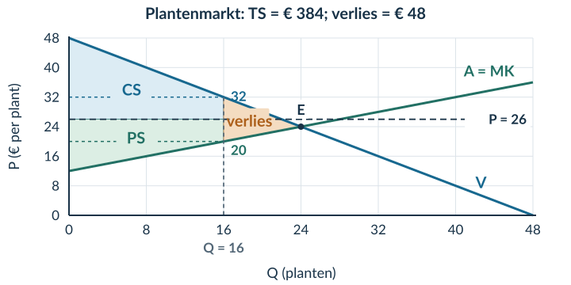

# 2.3.4 Gemengde opgaven

## Opgave 1

a) Nodig zijn de vraagfunctie **P = 60 − Q** en aanbodfunctie **P = 12 + Q**. Het aantal volgers is niet nodig voor de evenwichtsberekening.

b) 60 − Q = 12 + Q → 48 = 2Q → **Qe = 24 lesplaatsen**. Pe = 60 − 24 = **€ 36 per lesplaats**.

c) Basis = 24 lesplaatsen. Hoogte CS = 60 − 36 = € 24 per lesplaats; hoogte PS = 36 − 12 = € 24 per lesplaats.

**CS = ½ × 24 × 24 = € 288. PS = € 288. TS = € 576.**

d) Bij Q = 30: betalingsbereidheid = 60 − 30 = **€ 30**; MK = 12 + 30 = **€ 42**. Het verschil is −€ 12. Extra handel bij deze marginale vergelijking verlaagt TS.

*Waarom:* de extra plaats kost meer dan zij de koper waard is.

e) Onjuist. Maximaal TS betekent niet dat alle kopers dezelfde betalingsbereidheid of hetzelfde voordeel hebben. Bij dezelfde prijs hebben kopers met een hogere betalingsbereidheid meer voordeel.

## Opgave 2

a) 48 − Q = 12 + 0,5Q → 36 = 1,5Q → **Qe = 24 planten**. Pe = 48 − 24 = **€ 24 per plant**. Markeer E bij (24; 24).

CS = ½ × 24 × (48 − 24) = **€ 288**. PS = ½ × 24 × (24 − 12) = **€ 144**. TS = 288 + 144 = **€ 432**.

b) 26 = 48 − Qd → **Qd = 22 planten**. 26 = 12 + 0,5Qs → **Qs = 28 planten**. De bindende grens laat maar **16 transacties** toe. De hoogste betalingsbereidheden en laagste MK bepalen welke partijen handelen.

c) Bij Q = 16 zijn betalingsbereidheid en MK € 32 en € 20.

CS = 16 × (32 − 26) + ½ × 16 × (48 − 32) = 96 + 128 = **€ 224**.

PS = 16 × (26 − 20) + ½ × 16 × (20 − 12) = 96 + 64 = **€ 160**.

TS = 224 + 160 = **€ 384**.

*Waarom:* de werkelijke 16 transacties vormen de basis van de rechthoeken en driehoeken.

d) Via TS: **432 − 384 = € 48**. Via de driehoek: basis = 24 − 16 = 8 planten; hoogte = 32 − 20 = € 12 per plant. **½ × 8 × 12 = € 48**. Arceer tussen V en A van Q = 16 tot Q = 24.

<figure><figcaption>Opgave 2c–d · Beide rekenmethoden leveren hetzelfde verloren voordeel op.</figcaption></figure>

e) De uitspraak is onjuist. PS stijgt van **€ 144 naar € 160**, maar TS daalt van **€ 432 naar € 384**. Bij de 17e transactie is de betalingsbereidheid € 31 en MK € 20,50. Bij de prijs van € 26 hebben de nieuwe koper en aanbieder beide voordeel. Verruiming is kosteloos en technisch mogelijk, terwijl prijs en bestaande transacties gelijk blijven. De uitkomst met 16 transacties is dus niet Pareto-efficiënt.

f) Nee. De berekening beschrijft de verdeling van surplus en de efficiëntie. De mening dat de verdeling oneerlijk is, vraagt daarnaast een norm of waardeoordeel.

## Opgave 3 · Doeloefening

1) Nodig zijn **P = 80 − Q** en **P = 20 + 0,5Q**. De kleur blauw is niet nodig voor de berekening.

80 − Q = 20 + 0,5Q → 60 = 1,5Q → **Qe = 40 huurfietsen**. Pe = 80 − 40 = **€ 40 per huurfiets**.

2) Basis = 40 huurfietsen. Hoogte CS = 80 − 40 = € 40 per huurfiets. Hoogte PS = 40 − 20 = € 20 per huurfiets.

**CS = ½ × 40 × 40 = € 800. PS = ½ × 40 × 20 = € 400. TS = € 1.200.**

3) Bij P = 45 geven de hulpcijfers Qd = 35 en Qs = 50. De grens van 30 bindt. Gebruik de 30 hoogste betalingsbereidheden en 30 laagste MK. Bij Q = 30 zijn deze € 50 en € 35.

**CS = 30 × (50 − 45) + ½ × 30 × (80 − 50) = 150 + 450 = € 600.**

**PS = 30 × (45 − 35) + ½ × 30 × (35 − 20) = 300 + 225 = € 525.**

**TS = 600 + 525 = € 1.125.**

*Waarom:* het gebied stopt bij 30, niet bij de 35 vragers of 50 aanbieders. De laatste handelende koper en verhuurder hebben nog voordeel, dus de gebieden zijn geen zuivere driehoeken.

4) **Welvaartsverlies = 1.200 − 1.125 = € 75.** De verliesdriehoek heeft hoekpunten **(30; 50), (40; 40) en (30; 35)**. Basis = 40 − 30 = 10 huurfietsen. Hoogte = 50 − 35 = € 15 per huurfiets. Controle: **½ × 10 × 15 = € 75**.

<figure><figcaption>Opgave 3.3–3.4 · Het producentensurplus stijgt, maar het totaal surplus daalt.</figcaption></figure>

5) De uitspraak is onjuist. PS stijgt van **€ 400 naar € 525**, maar TS daalt van **€ 1.200 naar € 1.125**. Voor de 31e transactie zijn de betalingsbereidheid en MK **€ 49** en **€ 35,50**. Bij de prijs van € 45 heeft de nieuwe huurder € 4 voordeel en de nieuwe verhuurder € 9,50.

Verruiming kost niets; er is technisch ruimte en bestaande transacties blijven ongewijzigd. Deze transactie is dus een haalbare Paretoverbetering. De uitkomst met 30 boekingen is **niet Pareto-efficiënt**.

6) De efficiëntievergelijking laat zien hoeveel voordeel wordt gerealiseerd en of er nog voordelige handel mogelijk is. Zij geeft geen norm voor de verdeling tussen personen of groepen. Daarom bepaalt zij niet welke uitkomst eerlijker is.

## Opgave 4 · Denkertje

**Modelantwoord.** De gezamenlijke betalingsbereidheid van de twee kopers is 30 + 24 = **€ 54**. Zij betalen samen 2 × 22 = € 44 en hebben dus € 10 CS.

Bij de goedkoopste aanbieders zijn de kosten 5 + 11 = € 16. PS = 44 − 16 = € 28. **TS = 10 + 28 = € 38**.

Bij de andere selectie zijn de kosten 5 + 20 = € 25. PS = 44 − 25 = € 19. **TS = 10 + 19 = € 29**.

De tweede selectie levert € 9 minder TS op. Hoeveelheid en prijs zijn gelijk, maar er wordt duurder geproduceerd. Daarom is de afspraak over welke aanbieders handelen belangrijk.

**Beoordelingscriteria:** beide totalen juist; het verschil van € 9 verbinden met de kosten; uitleg dat dezelfde prijs en hoeveelheid zonder dezelfde toewijzing geen gelijk TS garanderen.

## Opgave 5

a) %ΔP = (12 − 10) / 10 × 100% = **+20%**. %ΔQ = (90 − 100) / 100 × 100% = **−10%**. Ev = −10% / +20% = **−0,5**.

TO oud = 10 × 100 = **€ 1.000**. TO nieuw = 12 × 90 = **€ 1.080**.

*Waarom:* bereken bij deze eindige prijsverandering de omzet rechtstreeks. De vraag is hier prijsinelastisch en de waargenomen omzet stijgt.

b) Nee. Voor CS ontbreekt de betalingsbereidheid van de verkochte eenheden of een voldoende gespecificeerde vraaglijn. Voor PS ontbreken de marginale kosten. De twee waarnemingen leggen niet zonder extra modelaannamen de volledige surplusgebieden vast.

## Opgave 6

a) TK = TVK + TCK = 600 + 250 = € 850. Winst = TO − TK = **1.000 − 850 = € 150**.

b) Van het gegeven PS van € 400 moeten hier nog € 250 constante kosten worden betaald. Dat laat € 150 winst over. **PS en winst verschillen door de constante kosten.**

*Waarom:* in de winstberekening worden alle kosten meegenomen, niet alleen de kosten die met extra productie samenhangen.

## Opgave 7

a) A: TS = 500 + 300 = € 800, dus verlies = 800 − 800 = **€ 0**. B: TS = 350 + 430 = € 780, dus verlies = 800 − 780 = **€ 20**.

b) Dat is een **waardeoordeel**. De berekening toont dat de twee groepsbedragen in B dichter bij elkaar liggen, maar bewijst niet dat dit eerlijker is. Bovendien vertelt zij nog niets over de verdeling binnen de groepen kopers en verkopers.
