<!-- PAGE {"section": "3.1", "title": "Overheidsingrijpen"} -->

4VECO · ECONOMIE · 4 VWO · BOEK 3

Overheidsingrijpen

Wie betaalt, wie profiteert en wat verandert er?

Een belasting maakt een product duurder. Een subsidie maakt het goedkoper. Een maximumprijs lijkt aantrekkelijk voor kopers. Maar wie krijgt het product nog? En wie betaalt de rekening?

Je gebruikt de gereedschappen uit Boek 1 en 2 opnieuw: vraag en aanbod, evenwicht, procenten en surplus. Nieuw is **de manier waarop een maatregel de markt verandert**.

<a href="#s311"><b>3.1.1 · Belastingen: wig en nieuw evenwicht 2</b>De koper betaalt iets anders dan de verkoper overhoudt.</a>
<a href="#s312"><b>3.1.2 · Belastingdruk en welvaartsverlies 10</b>Verdeel de last en onderscheid belastingopbrengst van verlies.</a>
<a href="#s313"><b>3.1.3 · Subsidies 19</b>Dezelfde methode, met de geldstroom omgekeerd.</a>
<a href="#s314"><b>3.1.4 · Maximumprijs 28</b>Een lage toegestane prijs is nog geen aankoopgarantie.</a>
<a href="#s315"><b>3.1.5 · Minimumprijs en quota 35</b>Een prijsgrens en een hoeveelheidsgrens werken anders.</a>
<a href="#s316"><b>3.1.6 · Gemengde opgaven 44</b>Kies zelf de methode en onderbouw een beleidsconclusie.</a>
<a href="#overzicht"><b>Hoofdstukoverzicht 48</b>De belangrijkste begrippen en controles bij elkaar.</a>

<b>Werkwijze</b> Lees de uitleg en het uitgewerkte voorbeeld. De startopgaven halen benodigde voorkennis op. Begeleide inoefening is extra steun, geen extra verplicht einddoel. Zelfstandige oefening bereidt je voor op de doeloefening. Bonus en herhaling kunnen buiten de les.

Werk in je schrift; gebruik de afgedrukte grafieken waar dat wordt gevraagd. Reken tussendoor ongerond; rond eurobedragen en percentages zo nodig af op twee decimalen. Alle markten, beleidsbronnen en bedragen zijn fictieve oefensituaties, geen actuele belastingregels.

Herziene editie: extra uitleg en oefensteun bij belasting, subsidie en quota. Opgaven 22A, 40A en 47A zijn toegevoegd; de bestaande opgavenummers blijven behouden.

<!-- PAGE {"section": "3.1.1", "title": "Eén product, twee prijzen"} -->

3.1.1 · BELASTINGEN: WIG EN NIEUW EVENWICHT

# Eén product, twee prijzen

Op een kleine markt verkopen verschillende kramen fruitbekers. De overheid voert in deze oefensituatie een belasting van € 4 per verkochte beker in. De verkoper moet die € 4 afdragen.

Betekent dit dat de koper precies € 4 meer gaat betalen? Niet noodzakelijk. De marktprijs kan veranderen en de verkoper kan zelf een deel van de last dragen.

<b>Lesdoelen</b> Je kunt het vrije evenwicht berekenen. Je kunt bij een belasting de kopersprijs, verkopersontvangst en nieuwe hoeveelheid berekenen. Je kunt de belastingwig in een marktgrafiek markeren en uitleggen waarom afdragen niet hetzelfde is als de last dragen.

### Geef de prijzen een eigen naam

**Pc** is de prijs die de consument betaalt. **Pp** is het bedrag dat de producent per verkocht product overhoudt na afdracht van de belasting, maar **vóór aftrek van zijn productiekosten**. **t** is de belasting per product.

<figure>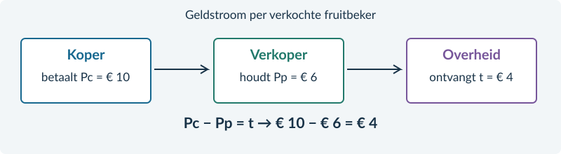<figcaption>Figuur 1. Van de € 10 die de koper betaalt, houdt de verkoper € 6 over. De overige € 4 gaat naar de overheid.</figcaption></figure>

Belastingwig: Pc − Pp = t Dus: Pc = Pp + t

De bedragen in de geldstroom zijn de nieuwe marktuitkomst die we hierna berekenen. Pp is dus géén winst per product.

<!-- PAGE {"section": "3.1.1", "title": "De markt rekent met beide prijzen"} -->

### Wat blijft hetzelfde?

Kopers reageren op **hun betaalde prijs Pc**. Verkopers reageren op **hun ontvangst Pp**. Bij het nieuwe evenwicht wordt nog steeds evenveel gevraagd als aangeboden. Alleen gebruik je niet meer voor iedereen dezelfde prijs.

Voor fruitbekers geldt:

Vraag: Pc = 14 − 0,10Q Aanbod: Pp = 2 + 0,10Q

Q is het aantal fruitbekers per dag. Pc en Pp zijn euro per beker. Zonder belasting is Pc = Pp. Met t = € 4 wordt de aanbodlijn, uitgedrukt in de **kopersprijs**:

Pc = Pp + 4 = 6 + 0,10Q

### Lees de grafiek in drie stappen

Eerst staan V en A er: het vertrouwde vrije evenwicht. Daarna schuift de aanbodlijn in kopersprijzen € 4 omhoog naar **A + t**. Het snijpunt met V geeft de nieuwe hoeveelheid en Pc. Lees bij **dezelfde Q** op de oorspronkelijke A af wat verkopers ontvangen.

<figure>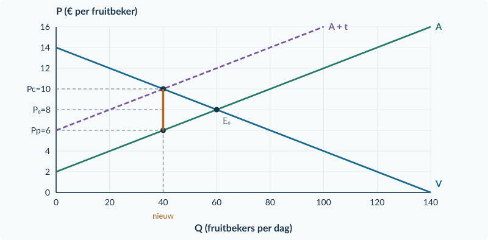<figcaption>Figuur 2. Zonder belasting: 60 bekers voor € 8. Met belasting: 40 bekers, Pc = € 10 en Pp = € 6. De verticale afstand bij Q = 40 is € 4.</figcaption></figure>

<b>Ons marktmodel</b> We rekenen met veel kopers en verkopers die de marktprijs als gegeven nemen. Er is één product, er zijn geen andere gelijktijdige veranderingen en alle gevraagde en aangeboden eenheden bij het nieuwe evenwicht worden verhandeld. Kosten of baten voor buitenstaanders blijven in dit hoofdstuk buiten beeld.

<!-- PAGE {"section": "3.1.1", "title": "Waarom wordt de aanbodlijn hoger?"} -->

### Vergelijk twee prijzen bij dezelfde hoeveelheid

De fruitbekermarkt heeft vraag Pc = 14 − 0,10Q en aanbod Pp = 2 + 0,10Q. Een verkoper draagt **€ 4 per verkochte beker** af. De oorspronkelijke A vertelt nog steeds welk bedrag verkopers willen ontvangen, vóór aftrek van productiekosten.

| Q (bekers per dag) | Bedrag op V: Pc (€ per beker) | Bedrag op A: Pp (€ per beker) | Verschil Pc − Pp (€ per beker) |
|---|---:|---:|---:|
| 20 | 12 | 4 | 8 |
| **40** | **10** | **6** | **4** |
| 60 | 8 | 8 | 0 |

Bij **40 bekers** passen beide kanten én de belasting bij elkaar: kopers betalen € 10, verkopers ontvangen € 6 en de overheid krijgt € 4. Daarom horen beide prijzen bij hetzelfde aantal verkochte bekers.

### Van gewenste ontvangst naar benodigde kopersprijs

Voor 40 bekers geeft A een ontvangst van € 6. De verkoper kan daarvan niet ook nog € 4 afdragen. Hij moet dan € 10 van de koper ontvangen. Deze omzetting geldt bij iedere hoeveelheid:

Oorspronkelijk aanbod: Pp = 2 + 0,10Q Tel de belasting op: Pc = (2 + 0,10Q) + 4 Aanbod in kopersprijzen: Pc = 6 + 0,10Q

De productiekosten veranderen hier niet. A + t geeft dezelfde aanbodbeslissing weer, maar nu in de prijs die kopers moeten betalen. Het snijpunt van **V en A + t** bepaalt de nieuwe hoeveelheid.

<b>Niet: oude prijs + hele belasting</b> Pc = € 8 + € 4 = € 12 zou Pp = € 8 geven. Bij die twee prijzen worden 20 bekers gevraagd en 60 aangeboden. Dat is geen evenwicht. Laat vraag en aanbod dus eerst samen de nieuwe hoeveelheid bepalen.

<!-- PAGE {"section": "3.1.1", "title": "Van formule naar belastingwig"} -->

## Uitgewerkt voorbeeld

**Fruitbekers.** Pc = 14 − 0,10Q en Pp = 2 + 0,10Q. Verkopers dragen € 4 per beker af. Q is bekers per dag.

**1 · Vrij evenwicht.** Zonder belasting zijn beide prijzen gelijk.

14 − 0,10Q = 2 + 0,10Q → Q₀ = 60 P₀ = 14 − 0,10 × 60 = € 8

**2 · Nieuw aanbod in kopersprijzen.** De koper betaalt de gewenste ontvangst plus de belasting: Pc = Pp + 4 = 6 + 0,10Q.

**3 · Nieuwe hoeveelheid en beide prijzen.**

14 − 0,10Q = 6 + 0,10Q → Qt = 40 Pc = 14 − 0,10 × 40 = € 10 Pp = 2 + 0,10 × 40 = € 6

**4 · Controle en uitleg.** 10 − 6 = € 4: de wig klopt. Markeer bij Q = 40 beide prijzen in figuur 2. Kopers betalen € 2 meer dan eerst; verkopers houden € 2 minder over. Afdragen en de last dragen zijn dus verschillend.

<b>Onthouden</b> Gebruik V voor Pc en de oorspronkelijke A voor Pp, beide bij dezelfde nieuwe hoeveelheid. Controleer Pc − Pp = t.

## Startopgaven

<b>Korte route:</b> Startopgaven → Zelfstandige oefening → Doeloefening. Extra hulp nodig? Maak eerst Begeleide inoefening.

<b>Opgave 1 · Evenwicht terughalen</b>

Voor sleutelhangers geldt vraag P = 12 − 0,10Q en aanbod P = 4 + 0,10Q. Q is stuks per dag; P is euro per stuk.

<b>a.</b> Bereken de evenwichtshoeveelheid en de evenwichtsprijs.

<b>b.</b> Bereken met de aanbodfunctie welk bedrag bij Q = 30 hoort.

<b>Opgave 2 · Wie draagt af?</b>

Na een belasting betaalt een koper € 9. De verkoper houdt na afdracht € 6 over.

<b>a.</b> Hoe groot is de belasting per product?

<b>b.</b> Kun je zonder de oude prijs berekenen wie de grootste last draagt? Licht je antwoord toe.

<!-- PAGE {"section": "3.1.1", "title": "Oefenen met minder steun"} -->

## Begeleide inoefening

Heb je deze hulp niet nodig? Ga dan verder met Zelfstandige oefening.

<b>Opgave 3 · Lees de geldstroom</b>

Gebruik de volledig uitgewerkte fruitbekermarkt in figuur 2 op pagina 3.

<b>a.</b> Lees Q₀, P₀, Qt, Pc en Pp af. Welke twee prijzen horen bij dezelfde hoeveelheid?

<b>b.</b> Leg uit waarom je Pp niet afleest op A + t.

<b>c.</b> Een leerling telt € 4 op bij de oude prijs van € 8 en krijgt Pc = € 12. Wijs met de berekende hoeveelheid aan waarom die aanpak hier niet klopt.

<b>Opgave 4 · Posters</b>

Vraag Pc = 16 − 0,10Q; aanbod Pp = 4 + 0,10Q. Q is posters per week. De verkoper draagt € 4 per verkochte poster af.

<b>a.</b> Vul eerst in: Pc = Pp + … = … + 0,10Q.

<b>b.</b> Los 16 − 0,10Q = … + 0,10Q op. Bereken daarna Pc en Pp.

<b>c.</b> Teken in de basisgrafiek A + t. Markeer bij de nieuwe hoeveelheid beide prijzen en verbind ze met een verticale lijn.

<b>d.</b> Controleer de wig en leg in één zin uit waarom er minder posters worden verkocht.

<figure><figcaption>Figuur 3. Basisgrafiek bij opgave 4. V en A zijn gegeven; de belastinglijn en de nieuwe uitkomst teken je zelf.</figcaption></figure>

<!-- PAGE {"section": "3.1.1", "title": "Zelf de belasting verwerken"} -->

## Zelfstandige oefening

<b>Opgave 5 · Mokken</b>

Op de markt voor mokken geldt Pc = 18 − 0,20Q en Pp = 6 + 0,10Q. Q is mokken per dag. Verkopers dragen € 3 per verkochte mok af.

<b>a.</b> Bereken het vrije evenwicht.

<b>b.</b> Stel het aanbod in kopersprijzen na de belasting op. Bereken Qt, Pc en Pp.

<b>c.</b> Teken A + t in de basisgrafiek. Markeer de nieuwe hoeveelheid, beide prijzen en de belastingwig.

<b>d.</b> Leg uit waarom de verkopersontvangst lager kan zijn terwijl de kopersprijs hoger is.

<figure>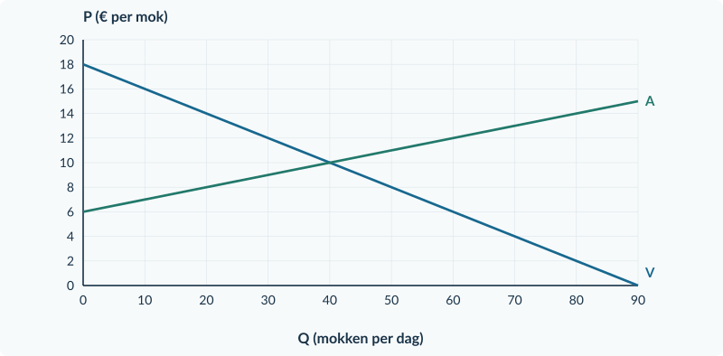<figcaption>Figuur 4. Basisgrafiek bij opgave 5. De assen gebruiken aantallen per dag en euro per mok.</figcaption></figure>

<b>Opgave 6 · Twee bedragen veranderen</b>

Een marktonderzoek meldt na een belasting: de prijs voor kopers stijgt van € 7 naar € 9. De ontvangst van verkopers daalt van € 7 naar € 6.

<b>a.</b> Bereken afzonderlijk de prijsverandering voor kopers en voor verkopers. Bereken daarna de belasting per product.

<b>b.</b> Beoordeel: “De belasting is € 2, want dat is wat de koper extra betaalt.”

<!-- PAGE {"section": "3.1.1", "title": "Laat zien wat je kunt"} -->

## Doeloefening

<b>Opgave 7 · Bedrukte tassen</b>

Verschillende aanbieders verkopen dezelfde soort bedrukte tas. Vraag: Pc = 20 − 0,20Q. Aanbod: Pp = 2 + 0,10Q. Q is tassen per dag; prijzen zijn euro per tas. De overheid heft € 3 per verkochte tas. De verkopers dragen de belasting af. De andere marktomstandigheden blijven gelijk.

<b>a.</b> Bereken de vrije evenwichtsprijs en -hoeveelheid.

<b>b.</b> Stel na invoering van de belasting het aanbod in kopersprijzen op. Bereken de nieuwe hoeveelheid.

<b>c.</b> Bereken de prijs die kopers betalen en het bedrag dat verkopers na afdracht ontvangen.

<b>d.</b> Teken de nieuwe aanbodlijn in de basisgrafiek. Markeer de nieuwe hoeveelheid, beide prijzen en de belastingwig.

<b>e.</b> Een verkoper zegt: “Wij dragen alles af; dus wij dragen ook de hele economische last.” Beoordeel met de oude en nieuwe prijzen.

<figure><figcaption>Figuur 5. Basisgrafiek bij de doeloefening. Gebruik V voor de kopersprijs en de oorspronkelijke A voor de verkopersontvangst.</figcaption></figure>

<b>Controle vóór je inlevert</b> Staan beide prijzen bij dezelfde Q? Is hun verschil precies € 3? Heeft de hoeveelheid de juiste eenheid?

<!-- PAGE {"section": "3.1.1", "title": "Een andere betalingsroute"} -->

## Denkertje / Bonusopgave

<b>Opgave 8 · De koper draagt af</b>

Op een markt geldt Pc = 16 − 0,10Q en Pp = 4 + 0,10Q. De belasting is € 4 per verkocht product. Tot nu toe droeg de verkoper die af. Een nieuw voorstel laat de koper € 4 rechtstreeks aan de overheid betalen, boven op het bedrag voor de verkoper. Het product, de belasting per transactie en het gedrag van kopers en verkopers blijven verder gelijk.

<b>a.</b> Voorspel of de nieuwe hoeveelheid, Pc en Pp veranderen. Onderbouw zonder alleen te zeggen wie het geld overmaakt.

<b>b.</b> Teken een geldstroomschema met koper, verkoper en overheid. Laat zien dat dezelfde wig blijft bestaan.

<b>Denk aan het onderscheid</b> Een betalingsroute vertelt wie het geld overmaakt. Een economische last volgt uit de verandering ten opzichte van de situatie zonder belasting.

## Herhaling / Herhaling en interleaving

<b>Opgave 9 · Prijs en gevraagde hoeveelheid</b>

Een prijs stijgt van € 10 naar € 12. De gevraagde hoeveelheid daalt van 200 naar 180 producten per week. Gebruik de oude waarden als basis.

<b>a.</b> Bereken de procentuele prijsverandering en de procentuele hoeveelheidsverandering.

<b>b.</b> Bereken Ev en bepaal of de vraag prijsinelastisch of prijselastisch is.

### Maak je antwoord controleerbaar

Een berekening is pas af als duidelijk is **wat** je hebt berekend. Schrijf bijvoorbeeld “Pc = € 10 per tas” in plaats van alleen “10”. Bij een uitleg verbind je een feit aan een gevolg: “De verkoper ontvangt minder per tas en biedt daarom, bij dezelfde aanbodfunctie, minder tassen aan.”

<b>Verder in de volgende paragraaf</b> Je kunt nu de nieuwe marktuitkomst bepalen. In §3.1.2 onderzoek je wie welk deel van de last draagt, hoeveel de overheid ontvangt en welke voordelen van handel verdwijnen.

<!-- PAGE {"section": "3.1.2", "title": "Waar blijft de belasting?"} -->

3.1.2 · BELASTINGDRUK EN WELVAARTSVERLIES

# Waar blijft de belasting?

Bij de fruitbekers steeg de kopersprijs van € 8 naar € 10. Verkopers hielden nog € 6 over. Er werden 40 in plaats van 60 bekers verkocht. De overheid ontving € 4 per verkochte beker.

De kopers en verkopers verliezen voordeel. Maar verdwijnt al dat voordeel? Een deel komt bij de overheid terecht. Een ander deel ontstaat helemaal niet meer, doordat transacties wegvallen.

<b>Lesdoelen</b> Je kunt de belastingdruk per product over kopers en verkopers verdelen, ook in procenten. Je kunt belastingopbrengst, CS, PS en welvaartsverlies berekenen en markeren. Je kunt uitleggen waarom de minder prijsgevoelige kant relatief meer last draagt.

Last koper per stuk = Pc − P₀ Last verkoper per stuk = P₀ − Pp Aandeel koper = (Pc − P₀) / t × 100%

Het aandeel van de koper heet ook het **afwentelingspercentage**: welk deel van de belasting komt via een hogere prijs bij kopers terecht? In het fruitbekervoorbeeld is dat € 2 / € 4 × 100% = 50%.

<b>Belastingopbrengst O</b> De overheid ontvangt alleen belasting over werkelijk verkochte producten. <b>O = t × Qt</b>. Hier: € 4 per beker × 40 bekers per dag = € 160 per dag.

### Geen verdwenen geld

De € 160 is een overdracht aan de overheid. Het is geen € 160 aan verdwenen welvaart. Voor onze vergelijking tellen we overheidsontvangsten mee naast het consumenten- en producentensurplus.

<b>Onze welvaartsmaat</b> Zonder belasting: CS + PS. Met belasting: CS + PS + O. We rekenen zonder effecten voor buitenstaanders en zonder uitvoeringskosten. Wat de overheid later met het geld doet, is hier niet gegeven.

<!-- PAGE {"section": "3.1.2", "title": "Rechthoek, driehoek en prijsgevoeligheid"} -->

### De gebieden vertellen elk iets anders

De vraaglijn geeft de betalingsbereidheid. De oorspronkelijke aanbodlijn stelt in dit model de marginale kosten voor. CS ligt boven **Pc**; PS ligt onder **Pp**. De belastingopbrengst ligt tussen die twee prijzen, over de verkochte hoeveelheid.

<figure><figcaption>Figuur 1. O is de belastingrechthoek: 40 × € 4. W is de driehoek van gemiste transacties tussen Q = 40 en Q = 60.</figcaption></figure>

De extra transacties tussen 40 en 60 zouden meer opleveren aan betalingsbereidheid dan ze kosten. Door de wig komen ze niet tot stand. Hun gezamenlijke gemiste voordeel heet **welvaartsverlies W**.

W = oude welvaartsmaat − nieuwe welvaartsmaat Bij deze rechte lijnen ook: W = ½ × (Q₀ − Qt) × t

De breedte van O telt **verkochte producten**. De breedte van W telt juist **transacties die wegvallen**. Bekijk op de volgende pagina hoe dit verschil terugkomt in de bedragen.

<!-- PAGE {"section": "3.1.2", "title": "Wat verdwijnt en wat verhuist?"} -->

### Houd drie bedragen uit elkaar

In de fruitbekermarkt daalt CS van € 180 naar € 80 per dag. PS daalt evenveel. De overheid krijgt € 160. Het verschil tussen het oude en het nieuwe totaal is € 40.

<figure><figcaption>Figuur 2. Van € 360 aan oud surplus blijft € 320 in de nieuwe welvaartsmaat over. De € 160 belastingopbrengst telt mee; de € 40 verloren voordeel niet.</figcaption></figure>

De gezamenlijke afname van CS en PS is **€ 200**. Dat bedrag bestaat uit twee delen:

Verlies van CS en PS: 100 + 100 = € 200 Daarvan bij de overheid: € 160 Verdwenen voordeel van handel: 200 − 160 = € 40

### Waarom ontstaat dat verloren voordeel?

Bekijk een extra beker rond Q = 50. Op V staat € 9 betalingsbereidheid; op A staat € 7 marginale kosten. Zonder belasting kan die transactie voordeel opleveren. Maar de ruimte van € 2 is niet genoeg om ook de belasting van € 4 te overbruggen. De transactie valt weg.

Alle verdwenen voordelen tussen Qt = 40 en Q₀ = 60 vormen samen driehoek W. Daarom is de basis **20 bekers per dag**, niet 40 verkochte bekers. De hoogte bij Q = 40 is **€ 4 per beker**. De oppervlakte is ½ × 20 × 4 = € 40 per dag.

<b>Last per verkocht product is niet het hele surplusverlies</b> Kopers betalen € 2 extra op 40 verkochte bekers: € 80. Hun CS daalt echter € 100. De overige € 20 is het voordeel op aankopen die wegvallen. Hetzelfde onderscheid geldt voor verkopers.

<!-- PAGE {"section": "3.1.2", "title": "Wie kan makkelijker op de prijs reageren?"} -->

### Verander maar één kenmerk

Twee markten beginnen bij **P₀ = € 8 en Q₀ = 60 producten per dag**. Het aanbod is in beide Pp = 2 + 0,10Q. Ook de belasting van € 3 per product is gelijk. Alleen de reactie van de kopers verschilt.

| Vergelijking | Markt A | Markt B |
|---|---:|---:|
| Vraagfunctie | Pc = 14 − 0,10Q | Pc = 20 − 0,20Q |
| Qv bij Pc = € 8 | 60 | 60 |
| Qv bij Pc = € 9 | 50 | 55 |
| Daling door dezelfde prijsstijging | 10 producten | 5 producten |

**B reageert minder sterk.** Kopers blijven bij dezelfde prijsstijging relatief vaker kopen. Verkopers kunnen daardoor een groter deel van de belasting via de prijs doorberekenen. De nieuwe uitkomsten zijn A: Qt = 45, Pc = € 9,50, Pp = € 6,50; B: Qt = 50, Pc = € 10, Pp = € 7.

<figure><figcaption>Figuur 3. Van dezelfde € 3 belasting draagt de koper in A € 1,50 en in B € 2. De minder prijsgevoelige kopers in B dragen hier het grotere aandeel.</figcaption></figure>

In A is het kopersaandeel 1,50 / 3 × 100% = **50%**. In B is het 2 / 3 × 100% = **66,67%**. Wie het geld aan de overheid overmaakt, is voor deze vergelijking niet de verklaring.

<b>De redenering werkt aan beide kanten</b> De kant die minder makkelijk op een prijsverandering kan reageren, draagt relatief meer last. Zijn juist verkopers weinig prijsgevoelig ten opzichte van kopers, dan komt meer last bij verkopers terecht. Vergelijk wel dezelfde uitgangssituatie; een steiler getekende lijn alléén is geen bewijs.

<!-- PAGE {"section": "3.1.2", "title": "Reken de welvaartsverandering na"} -->

## Uitgewerkt voorbeeld

**Fruitbekers, vervolg.** Vraag Pc = 14 − 0,10Q; aanbod Pp = 2 + 0,10Q. Zonder belasting: Q₀ = 60 en P₀ = € 8. Bij t = € 4: Qt = 40, Pc = € 10 en Pp = € 6.

**1 · Verdeel de last.** Koper: 10 − 8 = € 2. Verkoper: 8 − 6 = € 2. De koper draagt 2 / 4 × 100% = **50%**.

**2 · Bereken de gebieden.** De basis van elke surplusdriehoek is de verkochte hoeveelheid; de hoogte is een prijsverschil.

| Grootheid | Zonder belasting (€ per dag) | Met belasting (€ per dag) |
|---|---|---|
| CS | ½ × 60 × (14 − 8) = 180 | ½ × 40 × (14 − 10) = 80 |
| PS | ½ × 60 × (8 − 2) = 180 | ½ × 40 × (6 − 2) = 80 |
| O | 0 | 4 × 40 = 160 |
| CS + PS + O | 360 | 320 |

**3 · Bereken en controleer W.** W = 360 − 320 = **€ 40 per dag**. Met de driehoek: ½ × (60 − 40) × 4 = € 40. Beide routes geven hetzelfde.

**4 · Trek een conclusie.** Kopers en verkopers verliezen samen € 200 surplus. Daarvan ontvangt de overheid € 160. Alleen de overige € 40 is in dit model welvaartsverlies. Bij een minder prijsgevoelige vraag en gelijk aanbod zou een groter deel van de belasting bij kopers terechtkomen.

<b>Onthouden</b> Last per stuk ≠ belastingopbrengst ≠ welvaartsverlies. O is een rechthoek over verkochte producten. W is de driehoek van gemiste voordelige transacties. De minder prijsgevoelige kant draagt relatief meer last.

## Startopgaven

<b>Korte route:</b> Startopgaven → Zelfstandige oefening → Doeloefening. Extra hulp nodig? Maak eerst Begeleide inoefening.

<b>Opgave 10 · Surplus terughalen</b>

Een markt heeft Q₀ = 40 en P₀ = € 10. De vraaglijn snijdt de prijsas bij € 18; de aanbodlijn bij € 6. Beide lijnen zijn recht.

<b>a.</b> Bereken CS en PS met basis, hoogte en eenheid.

<b>Opgave 11 · Geld of gemiste handel?</b>

Een belasting levert de overheid € 120 op. De welvaartsmaat daalt van € 500 naar € 470.

<b>a.</b> Hoe groot is het welvaartsverlies? Leg uit waarom dit niet € 120 is.

<!-- PAGE {"section": "3.1.2", "title": "Alle onderdelen zichtbaar"} -->

## Begeleide inoefening

Heb je deze hulp niet nodig? Ga dan verder met Zelfstandige oefening.

<b>Opgave 12 · Lees het belastingplaatje</b>

Gebruik de volledig ingekleurde fruitbekermarkt in figuur 1 op pagina 11.

<b>a.</b> Wijs CS, PS, O en W aan. Welke prijs vormt de ondergrens van CS? Welke prijs vormt de bovengrens van PS?

<b>b.</b> Bereken eerst alleen de oppervlakte O. Gebruik daarna Q₀ − Qt als basis van W.

<b>c.</b> Leg uit waarom de hele oppervlakte tussen Pc en Pp niet hetzelfde is als W.

<b>Opgave 13 · Kaartensets</b>

Voor kaartensets is het vrije evenwicht Q₀ = 60 en P₀ = € 10. Een belasting van € 4 geeft Qt = 40, Pc = € 12 en Pp = € 8. De rechte vraaglijn begint op de prijsas bij € 16 en de rechte aanbodlijn bij € 4. Q is sets per dag.

<b>a.</b> Vul eerst de tabel hieronder volledig in. Noteer eenheden en laat voor CS en PS telkens basis en hoogte zien.

<b>b.</b> Bereken O en W. Controleer W met de driehoek.

<b>c.</b> Beoordeel: “Omdat kopers en verkopers elk € 2 per set dragen, ontvangt de overheid maar € 2 per set.”

| Grootheid | Zonder belasting | Met belasting |
|---|---|---|
| CS (€ per dag) | … | … |
| PS (€ per dag) | … | … |
| O (€ per dag) | 0 | … |
| CS + PS + O (€ per dag) | … | … |

<b>Laat de hulp los</b> Schrijf bij de volgende opgaven zelf op welke prijs, hoeveelheid en oppervlakte je nodig hebt. Een uitkomst zonder economische betekenis is nog geen conclusie.

<!-- PAGE {"section": "3.1.2", "title": "Last en verlies zelf berekenen"} -->

## Zelfstandige oefening

<b>Opgave 14 · Stickerpakketten</b>

Vraag Pc = 16 − 0,10Q; aanbod Pp = 4 + 0,10Q. Zonder belasting: Q₀ = 60 en P₀ = € 10. Verkopers dragen € 4 per verkocht pakket af. Na invoering: Qt = 40, Pc = € 12 en Pp = € 8. Q is pakketten per week.

<b>a.</b> Bereken de last per pakket voor kopers en verkopers en het afwentelingspercentage.

<b>b.</b> Bereken CS en PS voor en na de belasting, O en W.

<b>c.</b> Markeer in de basisgrafiek Pc, Pp en Qt. Arceer O en W verschillend en benoem beide gebieden.

<figure><figcaption>Figuur 4. Basisgrafiek bij opgave 14. De oorspronkelijke A blijft de marginale-kostenlijn.</figcaption></figure>

<b>Opgave 15 · Niet even prijsgevoelig</b>

Twee markten hebben dezelfde beginprijs en beginhoeveelheid, hetzelfde aanbod en dezelfde belasting. In markt X kunnen kopers makkelijk een ander product kiezen; in markt Y veel minder.

<b>a.</b> In welke markt verwacht je een groter aandeel van de belasting bij de koper? Leg uit via de mogelijkheid om op de prijs te reageren.

<b>b.</b> Waarom is “de verkoper draagt af” geen bewijs voor jouw antwoord?

<!-- PAGE {"section": "3.1.2", "title": "De hele belastingrekening"} -->

## Doeloefening

<b>Opgave 16 · Bedrukte tassen: wie betaalt?</b>

Dit is de markt uit §3.1.1, met alle gegevens opnieuw gegeven. Vraag Pc = 20 − 0,20Q; aanbod Pp = 2 + 0,10Q. Q is tassen per dag. Eerst: Q₀ = 60 en P₀ = € 8. Met t = € 3: Qt = 50, Pc = € 10 en Pp = € 7. De belasting heeft geen effecten voor buitenstaanders en geen uitvoeringskosten.

<b>a.</b> Bereken de last per tas voor beide kanten en het afwentelingspercentage.

<b>b.</b> Bereken de belastingopbrengst per dag.

<b>c.</b> Bereken CS en PS zonder en met belasting. Bereken daarna de welvaartsmaat met overheid en het welvaartsverlies.

<b>d.</b> Markeer Qt, Pc en Pp in de basisgrafiek. Arceer de belastingopbrengst en het welvaartsverlies verschillend. Noteer basis en hoogte van W.

<b>e.</b> Een koper zegt: “Als de vraag nog minder prijsgevoelig was, zouden wij minder belasting dragen.” Beoordeel, bij gelijk aanbod en dezelfde belasting.

<figure><figcaption>Figuur 5. Basisgrafiek bij de doeloefening. Gebruik de twee werkelijk ontvangen en betaalde prijzen, niet één middenprijs.</figcaption></figure>

<!-- PAGE {"section": "3.1.2", "title": "Vergelijk eerlijk"} -->

## Denkertje / Bonusopgave

<b>Opgave 17 · Kan de schaal de belastingdruk veranderen?</b>

De twee grafieken hieronder tonen precies dezelfde vraagfunctie: P = 14 − 0,10Q. Q is producten per week; P is euro per product. Alleen de schaal van de verticale as verschilt. Het aanbod en de belasting blijven buiten deze twee afbeeldingen.

<b>a.</b> Een leerling noemt de vraag in de linker grafiek minder prijsgevoelig omdat de lijn daar steiler lijkt. Bereken in beide grafieken Q bij P = € 8 en bij P = € 9. Beoordeel de uitspraak.

<b>b.</b> Kun je uit alleen deze twee vraaggrafieken afleiden welk aandeel van een belasting kopers dragen? Leg uit welke aanvullende informatie je nodig hebt. Leg ook uit waarom het aanpassen van de asschaal op zichzelf geen andere economische uitkomst veroorzaakt.

<figure>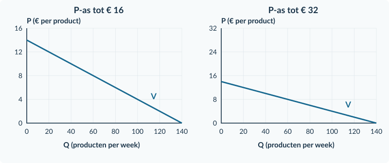<figcaption>Figuur 6. Dezelfde vraag, twee asschalen. De punten geven in beide grafieken dezelfde combinaties van prijs en hoeveelheid.</figcaption></figure>

## Herhaling / Herhaling en interleaving

<b>Opgave 18 · Een bedrag per product</b>

Een producent verkoopt 100 producten voor € 9 per stuk. TK = 300 + 4Q, met kosten in euro per dag en Q in producten per dag.

<b>a.</b> Bereken TO, TK en de winst per dag.

<b>b.</b> Leg uit waarom een ontvangst van € 9 per product geen winst van € 9 per product is.

<b>Verder in de volgende paragraaf</b> Bij een subsidie legt de overheid geld bij. De wig draait om. Maar voor welvaart moet je de overheidsuitgaven juist aftrekken.

<!-- PAGE {"section": "3.1.3", "title": "De overheid legt geld bij"} -->

3.1.3 · SUBSIDIES

# De overheid legt geld bij

Een gemeente wil meer workshopbezoek. In deze oefensituatie krijgt de aanbieder € 4 subsidie voor iedere werkelijk verkochte workshopplaats. De koper betaalt aan de aanbieder; de gemeente betaalt het subsidiebedrag erbij.

De aanbieder ontvangt nu meer dan de koper betaalt. Je gebruikt dezelfde twee prijzen als bij belasting, maar **de wig wijst de andere kant op**.

<b>Lesdoelen</b> Je kunt bij een subsidie per verkocht product Pc, Pp en de hoeveelheid berekenen. Je kunt de overheidsuitgaven bepalen en de voordelen voor kopers en verkopers vergelijken. Je kunt een welvaartsclaim beoordelen door de uitgaven mee te rekenen.

<figure>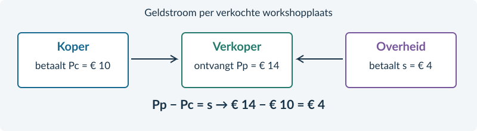<figcaption>Figuur 1. De koper betaalt € 10. De gemeente legt € 4 bij. De aanbieder ontvangt samen € 14 per verkochte workshopplaats.</figcaption></figure>

Subsidiewig: Pp − Pc = s Dus: Pp = Pc + s en Pc = Pp − s

**s** is de subsidie per verkocht product. **Pp** is hier de totale ontvangst van de producent: het bedrag van de koper plus de subsidie. Daar moeten de productiekosten nog af.

<b>Vergelijk met belasting</b> Belasting: Pc is hoger dan Pp. Subsidie: Pp is hoger dan Pc. In beide gevallen lees je Pc op de vraaglijn en Pp op de oorspronkelijke aanbodlijn bij dezelfde nieuwe Q.

<!-- PAGE {"section": "3.1.3", "title": "Meer handel is niet gratis"} -->

### De aanbodlijn in kopersprijzen

Voor workshopplaatsen geldt Pc = 18 − 0,10Q en Pp = 6 + 0,10Q. Q is plaatsen per week; prijzen zijn euro per plaats. Door de subsidie van € 4 hoeft de koper € 4 minder te betalen dan de aanbieder totaal wil ontvangen.

Pc = Pp − 4 = 2 + 0,10Q

<figure>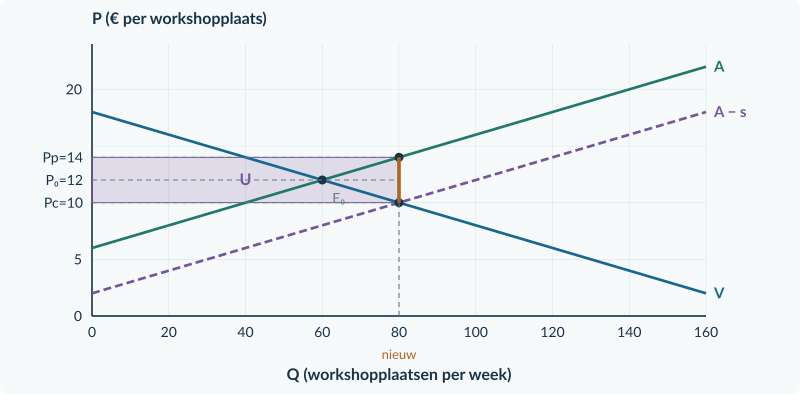<figcaption>Figuur 2. A − s ligt € 4 onder A. Bij Q = 80 zijn Pc = € 10 en Pp = € 14. U is de uitgavenrechthoek over alle 80 plaatsen.</figcaption></figure>

### Een rekening voor de overheid

De subsidie geldt hier voor **elke verkochte plaats**, niet alleen voor de extra plaatsen. De overheidsuitgaven zijn dus **U = s × Qsub**: de rechthoek U in de figuur. Qsub is het aantal verkochte plaatsen mét subsidie; Qa blijft de aangeboden hoeveelheid.

### Kijk verder dan CS en PS

Kopers betalen minder en aanbieders ontvangen meer. CS en PS kunnen dus allebei stijgen. Maar de overheid betaalt ervoor. De relevante welvaartsmaat is hier **CS + PS − U**.

De extra transacties voorbij het vrije evenwicht kosten in dit model meer dan de kopers ervoor overhebben. Zonder baten voor buitenstaanders kan de subsidie daardoor welvaartsverlies veroorzaken. We veronderstellen ook hier geen uitvoeringskosten.

<b>Geen dubbele telling</b> Tel U niet bij het voordeel van kopers en verkopers op. De subsidie zit al in de grotere gebieden CS en PS. Voor de welvaartsvergelijking trek je de overheidsuitgaven af.

<!-- PAGE {"section": "3.1.3", "title": "Waarom kan extra handel toch voordeel kosten?"} -->

### Volg de drie rekeningen

Bij de workshopplaatsen stijgt Q van 60 naar 80. Kopers betalen € 10 en aanbieders ontvangen in totaal € 14. De overheid legt op **alle 80 plaatsen** € 4 bij: U = € 320 per week.

| Rekening | Zonder subsidie (€ per week) | Met subsidie (€ per week) | Verandering |
|---|---:|---:|---:|
| Consumentensurplus | 180 | 320 | +140 |
| Producentensurplus | 180 | 320 | +140 |
| Overheidsuitgaven | 0 | 320 | +320 uitgaven |
| **CS + PS − U** | **360** | **320** | **−40** |

Kopers en aanbieders krijgen samen **€ 280 meer surplus**. Daar staat een overheidsbetaling van € 320 tegenover. Het verschil van € 40 is in dit model verloren voordeel. De subsidie-uitgaven zélf zijn niet het welvaartsverlies.

<figure>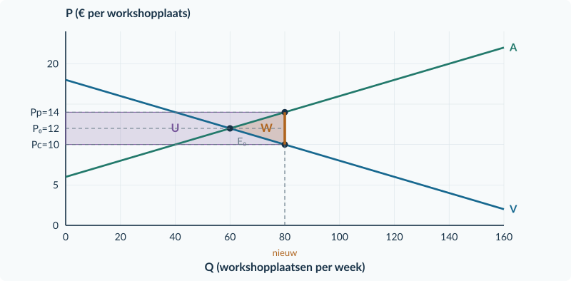<figcaption>Figuur 3. U betreft alle gesubsidieerde plaatsen. W betreft alleen de extra transacties voorbij Q₀ = 60: basis 20 plaatsen, hoogte € 4 per plaats.</figcaption></figure>

### Kijk naar één extra plaats

Rond Q = 70 is de betalingsbereidheid 18 − 0,10 × 70 = **€ 11**. De marginale kosten zijn 6 + 0,10 × 70 = **€ 13**. Zo’n extra plaats kost € 2 meer dan het voordeel dat de koper eraan toekent. De subsidie maakt verkoop wel aantrekkelijk voor koper en aanbieder, maar neemt dat verschil niet weg.

<b>Wat telt ons model mee?</b> We nemen geen extra baten voor buitenstaanders aan. Daarom maakt “meer activiteiten” de uitkomst niet automatisch beter. In Boek 4 onderzoeken we opnieuw subsidies, maar dan mét zulke extra baten.

<!-- PAGE {"section": "3.1.3", "title": "Dezelfde stappen, een andere wig"} -->

## Uitgewerkt voorbeeld

**Workshopplaatsen.** Pc = 18 − 0,10Q; Pp = 6 + 0,10Q; s = € 4 per verkochte plaats. Zonder subsidie: Q₀ = 60, P₀ = € 12, CS = € 180 en PS = € 180 per week.

**1 · Pas de kopersprijs van het aanbod aan.** Pc = Pp − 4 = 2 + 0,10Q.

**2 · Bereken de nieuwe hoeveelheid en prijzen.**

18 − 0,10Q = 2 + 0,10Q → Qsub = 80 Pc = 18 − 0,10 × 80 = € 10 Pp = 6 + 0,10 × 80 = € 14

Controle: 14 − 10 = € 4. Kopers betalen € 2 minder; aanbieders ontvangen € 2 meer per plaats. De aanbieder krijgt de subsidie uitbetaald, maar is niet de enige die profiteert.

**3 · Bereken uitgaven en surplus.**

| Grootheid | Berekening na subsidie | Uitkomst per week |
|---|---|---|
| U | 4 × 80 | € 320 |
| CS | ½ × 80 × (18 − 10) | € 320 |
| PS | ½ × 80 × (14 − 6) | € 320 |
| CS + PS − U | 320 + 320 − 320 | € 320 |

**4 · Vergelijk.** Eerst was de welvaartsmaat € 360. Nu is zij € 320: **€ 40 welvaartsverlies**. Controle met rechte lijnen: ½ × (80 − 60) × 4 = € 40.

<b>Onthouden</b> Subsidie: Pp − Pc = s. Bereken U over alle gesubsidieerde verkopen. Vergelijk niet alleen CS en PS, maar CS + PS − U. Zonder externe baten is méér productie niet automatisch beter.

## Startopgaven

<b>Korte route:</b> Startopgaven → Zelfstandige oefening → Doeloefening. Extra hulp nodig? Maak eerst Begeleide inoefening.

<b>Opgave 19 · De wig terughalen</b>

Bij een belasting van € 3 betaalt de koper € 11. Bij een andere markt met € 3 subsidie betaalt de koper ook € 11.

<b>a.</b> Bereken in beide gevallen Pp. Geef aan wanneer je € 3 aftrekt en wanneer je € 3 optelt.

<b>Opgave 20 · Voor alle verkochte plaatsen</b>

Een subsidie van € 2 vergroot de verkoop van 50 naar 60 plaatsen per week.

<b>a.</b> Bereken de uitgaven als iedere verkochte plaats recht op subsidie geeft. Waarom gebruik je niet alleen de 10 extra plaatsen?

<!-- PAGE {"section": "3.1.3", "title": "Herken de omgekeerde route"} -->

## Begeleide inoefening

Heb je deze hulp niet nodig? Ga dan verder met Zelfstandige oefening.

<b>Opgave 21 · Lees de subsidie-uitkomst</b>

Gebruik de workshopgrafiek op pagina 20. De vraag- en aanbodlijn zijn niet van betekenis veranderd.

<b>a.</b> Lees bij Q = 80 beide prijzen af. Welke partij ontvangt samen € 14?

<b>b.</b> Leg uit waarom de aanbodlijn in kopersprijzen naar beneden schuift en niet de vraaglijn.

<b>c.</b> Bereken het voordeel per plaats voor de koper én voor de aanbieder, vergeleken met € 12.

Extra steun voor de surplusrekening bij 22c vind je in opgave 22A. Die kun je zo nodig eerst maken.

<b>Opgave 22 · Muzieklesplaatsen</b>

Vraag Pc = 22 − 0,10Q; aanbod Pp = 10 + 0,10Q. Zonder subsidie: Q₀ = 60 en P₀ = € 16. De aanbieder krijgt € 4 per verkochte lesplaats. Q is lesplaatsen per week.

<b>a.</b> Vul eerst in: Pc = Pp − … = … + 0,10Q. Bereken vervolgens de nieuwe hoeveelheid en beide prijzen.

<b>b.</b> Teken A − s in de basisgrafiek en markeer Pc, Pp en Qsub.

<b>c.</b> Bereken U. Bereken daarna CS en PS met de nieuwe hoeveelheid; vergelijk CS + PS − U met de oude € 360.

<figure>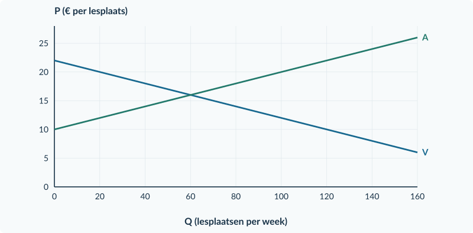<figcaption>Figuur 4. Basisgrafiek bij opgave 22. A beschrijft de totale ontvangst die aanbieders bij elke hoeveelheid nodig hebben.</figcaption></figure>

<!-- PAGE {"section": "3.1.3", "title": "Oefenen met de welvaartsrekening"} -->

### Begeleide inoefening · vervolg

Deze oefening geeft extra steun bij het kiezen van prijzen, hoeveelheden en oppervlakten. Heb je die steun niet nodig? Ga dan door naar Zelfstandige oefening.

<b>Opgave 22A · Eerst de drie rekeningen</b>

Op een oefenmarkt voor keramieklesplaatsen krijgt de aanbieder € 4 subsidie per verkochte plaats. Er zijn geen baten voor buitenstaanders en geen uitvoeringskosten. De nieuwe hoeveelheid en prijzen zijn al berekend; oefen hier alleen de surplus- en begrotingsrekening. Q is plaatsen per week; prijzen zijn euro per plaats.

<b>a.</b> Vul eerst de tabel onder de bron volledig in. Gebruik voor iedere surplusdriehoek de juiste basis en hoogte. De rij zonder subsidie is als voorbeeld ingevuld.

<b>b.</b> Bereken hoeveel CS en PS ieder toenemen. Vergelijk hun gezamenlijke toename met de subsidie-uitgaven.

<b>c.</b> Bereken het welvaartsverlies op twee manieren: met de oude en nieuwe welvaartsmaat en met de driehoek van extra transacties.

<b>d.</b> Een leerling schrijft: “U = 4 × (70 − 60) = € 40.” Leg uit welke gesubsidieerde verkopen in deze berekening ontbreken.

<b>Brongegevens</b> Vraag: Pc = 30 − 0,20Q. Aanbod: Pp = 6 + 0,20Q. Zonder subsidie: Q₀ = 60; P₀ = € 18. Met subsidie: Qsub = 70; Pc = € 16; Pp = € 20.

| Rekening (€ per week) | Zonder subsidie: voorgedaan | Met subsidie: vul zelf in |
|---|---|---|
| CS | ½ × 60 × (30 − 18) = 360 | ½ × … × (… − …) = … |
| PS | ½ × 60 × (18 − 6) = 360 | ½ × … × (… − …) = … |
| U | 0 | … × … = … |
| CS + PS − U | 360 + 360 − 0 = 720 | … + … − … = … |

<b>Hulp die je straks weglaat</b> CS gebruikt de kopersprijs. PS gebruikt de totale verkopersontvangst. Beide gebruiken de werkelijk verkochte hoeveelheid. Stel bij U apart de vraag: voor welke verkopen betaalt de overheid?

<!-- PAGE {"section": "3.1.3", "title": "Reken mét de overheidsrekening"} -->

## Zelfstandige oefening

<b>Opgave 23 · Sportplaatsen</b>

Vraag Pc = 24 − 0,20Q; aanbod Pp = 6 + 0,10Q. Eerst zijn Q₀ = 60 en P₀ = € 12. Aanbieders krijgen € 3 per verkochte sportplaats. Q is plaatsen per week. De oude welvaartsmaat is € 540 per week.

<b>a.</b> Bereken de nieuwe hoeveelheid, Pc en Pp. Teken A − s en markeer de drie uitkomsten.

<b>b.</b> Bereken de subsidie-uitgaven, CS en PS.

<b>c.</b> Bereken CS + PS − U en het welvaartsverlies. Noem de veronderstelling over baten voor anderen.

<figure>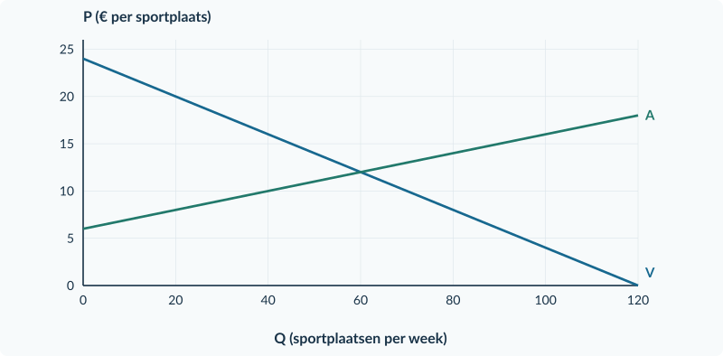<figcaption>Figuur 5. Basisgrafiek bij opgave 23. Controleer na het rekenen de richting én de grootte van de wig.</figcaption></figure>

<b>Opgave 24 · Meer voordeel, toch een rekening</b>

Na een subsidie betalen kopers per product € 2 minder en ontvangen verkopers per product € 1 meer dan voorheen.

<b>a.</b> Hoe hoog is de subsidie per product?

<b>b.</b> Beoordeel: “Iedereen profiteert, want kopers én verkopers zijn beter af.” Noem welke partij en welk bedrag per transactie in deze uitspraak ontbreken.

<!-- PAGE {"section": "3.1.3", "title": "Wie krijgt het subsidievoordeel?"} -->

## Doeloefening

<b>Opgave 25 · Cursusplaatsen</b>

Vraag Pc = 26 − 0,20Q; aanbod Pp = 8 + 0,10Q. Q is cursusplaatsen per week. Eerst: Q₀ = 60, P₀ = € 14, CS = € 360 en PS = € 180 per week. Aanbieders ontvangen € 3 subsidie per werkelijk verkochte plaats. Er zijn geen baten voor buitenstaanders en geen uitvoeringskosten.

<b>a.</b> Stel het aanbod in kopersprijzen mét subsidie op. Bereken Qsub, Pc en Pp.

<b>b.</b> Bereken de overheidsuitgaven per week.

<b>c.</b> Bereken het voordeel per plaats voor kopers en aanbieders. Leg uit waarom uitbetaling aan aanbieders niet betekent dat zij het hele voordeel krijgen.

<b>d.</b> Bereken CS en PS na subsidie. Bepaal CS + PS − U en het welvaartsverlies ten opzichte van de oude situatie.

<b>e.</b> Markeer Qsub, Pc en Pp in de basisgrafiek. Arceer de rechthoek van de overheidsuitgaven. Beoordeel: “De subsidie verhoogt in dit model automatisch de welvaart.”

<figure><figcaption>Figuur 6. Basisgrafiek bij de doeloefening. De uitgavenrechthoek ligt tussen Pc en Pp, van Q = 0 tot de nieuwe hoeveelheid.</figcaption></figure>

<!-- PAGE {"section": "3.1.3", "title": "De vorm van steun doet ertoe"} -->

## Denkertje / Bonusopgave

<b>Opgave 26 · Per verkoop of een vast bedrag?</b>

Regeling A geeft aanbieders € 3 per verkochte cursusplaats. In de markt van opgave 25 ontstaan dan 70 verkopen. Regeling B vervangt A door samen € 210 vaste steun aan de bestaande aanbieders, ongeacht hoeveel zij verkopen. Volgens de bron veranderen bij B de vraag, de marginale kosten en de marktdeelname niet; het vrije evenwicht blijft dus 60 plaatsen voor € 14.

<b>a.</b> Vergelijk de uitgaven onder A en B. Welke regeling verandert in deze bron de prikkel om extra plaatsen aan te bieden?

<b>b.</b> Leg uit waarom je bij B niet automatisch A met € 3 omlaag mag verschuiven. Gebruik het verschil tussen een vast bedrag en een bedrag per verkoop.

### Twee vragen bij iedere subsidieregeling

**Waarvoor wordt betaald?** Een bedrag per verkoop verandert de opbrengst van een extra verkochte eenheid. Een vast bedrag doet dat in de beschreven situatie niet.

**Welke rekening hoort erbij?** Neem de overheidsuitgaven mee voordat je een welvaartsconclusie trekt. Hetzelfde totaalbedrag kan bij verschillende regelingen andere productieprikkels geven.

## Herhaling / Herhaling en interleaving

<b>Opgave 27 · Totaal en per eenheid</b>

Een zaal heeft € 600 constante kosten per week. De zaal verhuurt eerst 100 en later 150 stoelen per week, binnen dezelfde productiecapaciteit.

<b>a.</b> Bereken de gemiddelde constante kosten bij beide aantallen.

<b>b.</b> Leg uit waarom de totale constante kosten niet dalen als de gemiddelde constante kosten dalen.

Volgende stap: een maximumprijs begrenst de prijs, niet het bedrag per verkoop.

<!-- PAGE {"section": "3.1.4", "title": "Goedkoper, maar ook verkrijgbaar?"} -->

3.1.4 · MAXIMUMPRIJS

# Goedkoper, maar ook verkrijgbaar?

Op een markt voor puzzels is de vrije prijs € 8. Een regeling verbiedt prijzen boven € 6. Dat klinkt gunstig voor kopers. Toch kan niet iedereen die bij € 6 wil kopen een puzzel krijgen.

Een prijsregel verandert niet wat consumenten graag willen of wat productie kost. Hij kan wel verhinderen dat de prijs vraag en aanbod bij elkaar brengt.

<b>Lesdoelen</b> Je kunt bepalen of een maximumprijs bindt. Je kunt bij die prijs vraag, aanbod, werkelijke verkopen en het tekort berekenen. Je kunt de drie hoeveelheden in een grafiek onderscheiden en uitleggen welke kopers geen product krijgen.

<b>Maximumprijs</b> De hoogste toegestane verkoopprijs. Een maximumprijs <b>onder de vrije evenwichtsprijs</b> is in ons model bindend: hij verandert de marktuitkomst.

<figure><figcaption>Figuur 1. Bij Pmax = € 6 willen kopers 80 puzzels, maar verkopers bieden er 40 aan. Er worden 40 verkocht; het tekort is 40.</figcaption></figure>

Qv is wat kopers **willen kopen**. Qa is wat verkopers **willen verkopen**. Het werkelijke aantal transacties is weer iets anders. Zonder extra aanvoer kunnen niet meer producten worden verkocht dan er worden aangeboden.

<b>Geen wig</b> Hier is geen belasting of subsidie per verkoop. Bij een verkoop betaalt de koper hetzelfde bedrag als de verkoper ontvangt. Het probleem is een verschil tussen hoeveelheden, niet tussen twee prijzen.

<!-- PAGE {"section": "3.1.4", "title": "Eerst binding, dan hoeveelheden"} -->

### Een maximum is geen verplicht prijskaartje

Bij een vrije evenwichtsprijs van € 8 laat een maximum van € 10 de marktprijs van € 8 toe. Verkopers hoeven niet € 10 te vragen. De regeling is dan **niet bindend**.

| Maximumprijs | Bindend bij vrij evenwicht € 8? | Marktuitkomst in dit model |
|---|---|---|
| € 6 | Ja | Bereken Qv en Qa bij € 6. |
| € 10 | Nee | P blijft € 8; Q blijft 60. |

### De korte kant bepaalt wat er kan worden verkocht

In de puzzelmarkt zijn 40 producten beschikbaar en willen kopers er 80. Neem aan dat die 40 daadwerkelijk worden verkocht. Dan geldt:

Werkelijke verkopen = Qa = 40 Tekort = Qv − Qa = 80 − 40 = 40

Je kunt deze regel niet gebruiken zonder de context te lezen. Een bron kan bijvoorbeeld voorraden of extra aanvoer noemen. In onze oefeningen zijn die er niet, tenzij de tekst dat uitdrukkelijk zegt.

### Wie ontvangt het product?

Voor het totale aantal verkopen is “40 aangeboden” genoeg. Voor de verdeling van het voordeel is ook nodig **welke kopers** de 40 producten krijgen. Een wachtrij, loting en toewijzing op betalingsbereidheid kunnen andere kopers selecteren.

Krijgen de hoogste betalingsbereidheden voorrang, dan blijven andere geïnteresseerde kopers zonder product. Een lagere prijs is dus niet automatisch beter voor iedere koper.

<b>Surplus vraagt om een toewijzingsregel</b> Bij een tekort gebruik je niet zomaar de hele driehoek tot Qv. Alleen werkelijk verkochte producten leveren surplus op. Wie ze ontvangt, bepaalt het CS. In dit onderdeel staan binding, hoeveelheden en de verdeling van toegang centraal; het denkertje laat de toewijzing zien.

### Zelfde rekenen, andere interpretatie

In Boek 1 vulde je een prijs in om Qv en Qa te bepalen. Die techniek blijft gelijk. Nieuw is dat de opgelegde prijs niet vrij kan stijgen om het tekort op te lossen. Markeer daarom vraag, aanbod **en** werkelijke verkopen afzonderlijk.

<!-- PAGE {"section": "3.1.4", "title": "Een lage prijs analyseren"} -->

## Uitgewerkt voorbeeld

**Puzzels.** Vraag P = 14 − 0,10Q; aanbod P = 2 + 0,10Q. Q is puzzels per week. Er komen geen voorraden of extra producten bij. Alle aangeboden puzzels worden verkocht aan de kopers met de hoogste betalingsbereidheid.

**1 · Bereken het vrije evenwicht.**

14 − 0,10Q = 2 + 0,10Q → Q₀ = 60 P₀ = 14 − 0,10 × 60 = € 8

**2 · Controleer de maximumprijs.** € 6 is lager dan € 8, dus de regeling bindt.

**3 · Bereken beide gewenste hoeveelheden.** Gebruik nu dezelfde prijs van € 6 in beide oorspronkelijke functies.

Vraag: 6 = 14 − 0,10Qv → Qv = 80 Aanbod: 6 = 2 + 0,10Qa → Qa = 40 Verkopen = 40; tekort = 80 − 40 = 40

**4 · Markeer en verklaar.** Figuur 1 laat bij P = € 6 twee snijpunten zien. Markeer Qa = 40 als werkelijk verkocht. De 40 hoogste betalingsbereidheden krijgen een puzzel. Van de overige kopers die voor € 6 willen kopen, krijgen er 40 geen.

Bij een maximum van € 10 zou de oude prijs van € 8 toegestaan blijven. Dan blijven prijs en hoeveelheid € 8 en 60; je vult dus niet automatisch € 10 in.

<b>Onthouden</b> Vergelijk eerst Pmax met P₀. Alleen bij een bindende maximumprijs bereken je de nieuwe hoeveelheden bij Pmax. Zonder extra aanvoer: verkopen = Qa en tekort = Qv − Qa. Een lage prijs is geen aankoopgarantie.

## Startopgaven

<b>Korte route:</b> Startopgaven → Zelfstandige oefening → Doeloefening. Extra hulp nodig? Maak eerst Begeleide inoefening.

<b>Opgave 28 · Hoeveelheid bij een prijs</b>

Vraag P = 18 − 0,20Q; aanbod P = 6 + 0,10Q. Q is producten per dag.

<b>a.</b> Bereken het vrije evenwicht.

<b>b.</b> Bereken bij P = € 8 afzonderlijk Qv en Qa.

<b>Opgave 29 · Mag de oude prijs nog?</b>

De vrije marktprijs is € 12. Er komt een maximumprijs van € 15.

<b>a.</b> Verandert de marktprijs in ons model? Leg uit waarom wel of niet.

<!-- PAGE {"section": "3.1.4", "title": "Van aflezen naar invullen"} -->

## Begeleide inoefening

Heb je deze hulp niet nodig? Ga dan verder met Zelfstandige oefening.

<b>Opgave 30 · Bekijk eerst het tekort</b>

Gebruik de volledig gemarkeerde puzzelmarkt op pagina 28.

<b>a.</b> Lees Qv en Qa bij de maximumprijs af. Benoem welk aantal werkelijk wordt verkocht.

<b>b.</b> Wijs het tekort aan als een horizontaal verschil tussen hoeveelheden. Waarom is het geen verticale afstand tussen prijzen?

<b>c.</b> Beoordeel: “Alle 80 geïnteresseerde kopers betalen nu minder en zijn dus beter af.”

<b>Opgave 31 · Schilderpakketten</b>

Vraag P = 16 − 0,10Q; aanbod P = 4 + 0,10Q. Q is pakketten per week. Het vrije evenwicht is Q₀ = 60, P₀ = € 10. De maximumprijs wordt € 8. Er is geen extra aanvoer; alle aangeboden pakketten worden verkocht.

<b>a.</b> Leg uit waarom het maximum bindt.

<b>b.</b> Vul eerst in: 8 = 16 − 0,10Qv → Qv = …; 8 = 4 + 0,10Qa → Qa = … . Noteer vervolgens verkopen en tekort.

<b>c.</b> Teken Pmax en markeer Qv, Qa en het tekort in de basisgrafiek.

<b>d.</b> Welke uitkomst blijft gelden als het maximum niet € 8 maar € 12 wordt?

<figure><figcaption>Figuur 2. Basisgrafiek bij opgave 31. De kopers en verkopers reageren op dezelfde toegestane prijs.</figcaption></figure>

<!-- PAGE {"section": "3.1.4", "title": "De regel zelfstandig toepassen"} -->

## Zelfstandige oefening

<b>Opgave 32 · Bordspellen</b>

Vraag P = 20 − 0,20Q; aanbod P = 2 + 0,10Q. Q is spellen per week. De overheid zet de maximumprijs op € 6. Er zijn geen voorraden of andere aanvoer; alle aangeboden spellen worden verkocht.

<b>a.</b> Bereken het vrije evenwicht en bepaal of de maximumprijs bindt.

<b>b.</b> Bereken Qv, Qa, de verkopen en het tekort.

<b>c.</b> Teken Pmax in de basisgrafiek. Markeer de hoeveelheden en het tekort.

<b>d.</b> Leg uit waarom je zonder toewijzingsregel niet weet welke geïnteresseerde kopers een spel krijgen.

<figure>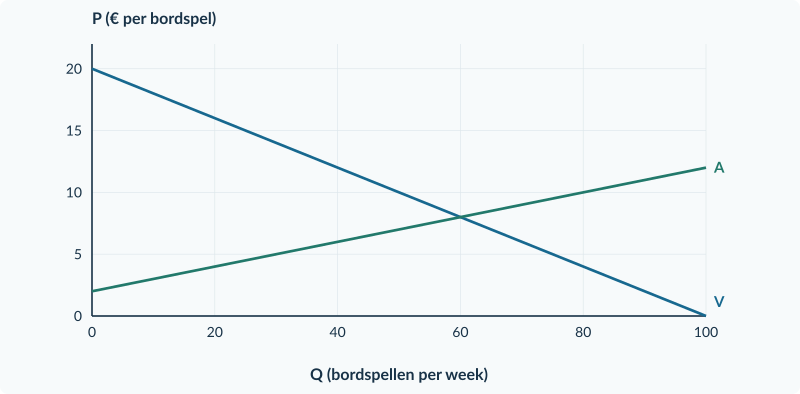<figcaption>Figuur 3. Basisgrafiek bij opgave 32. Noteer bij de hoeveelheden ook wat elk getal betekent.</figcaption></figure>

<b>Opgave 33 · De markt verandert</b>

Eerst is de vrije evenwichtsprijs € 8 en geldt een maximum van € 10. Later neemt de vraag toe: zonder prijsregel zou het nieuwe evenwicht € 12 zijn. Tegelijk verlaagt de overheid het maximum tot € 9.

<b>a.</b> Bepaal eerst alleen het effect van het lagere maximum bij de oude markt. Bindt € 9 dan?

<b>b.</b> Bepaal daarna of € 9 bij de nieuwe markt bindt. Beoordeel: “Of een maximum bindt, hangt alleen van het bedrag in de regeling af.”

<!-- PAGE {"section": "3.1.4", "title": "Een maximum bij tentverhuur"} -->

## Doeloefening

<b>Opgave 34 · Tenten voor een weekend</b>

Verschillende bedrijven verhuren dezelfde soort tent. Vraag P = 18 − 0,10Q; aanbod P = 6 + 0,10Q. P is de huur in euro per tent voor één weekend; Q is tenten per weekend. Er komt een maximumprijs van € 10. Er is geen extra aanvoer. Alle aangeboden tenten worden verhuurd, aan de vragers met de hoogste betalingsbereidheid.

<b>a.</b> Bereken de vrije evenwichtsprijs en -hoeveelheid. Leg uit of de maximumprijs bindt.

<b>b.</b> Bereken de gevraagde en aangeboden hoeveelheid, het werkelijke aantal verhuurde tenten en het tekort.

<b>c.</b> Teken de maximumprijs in de basisgrafiek. Markeer Qv, Qa en het werkelijke aantal verhuringen. Geef het tekort aan.

<b>d.</b> Een huurder zegt: “De lagere huur is goed voor iedereen die voor € 10 een tent wil huren.” Beoordeel met de uitkomsten en de toewijzingsregel.

<b>e.</b> Stel dat de maximumprijs € 14 is in plaats van € 10. Geef dan de werkelijke huur en het aantal verhuringen. Licht toe.

<figure><figcaption>Figuur 4. Basisgrafiek bij de doeloefening. Er is hier geen belasting- of subsidiewig.</figcaption></figure>

<!-- PAGE {"section": "3.1.4", "title": "Dezelfde prijs, andere kopers"} -->

## Denkertje / Bonusopgave

<b>Opgave 35 · Wie krijgt de twee producten?</b>

Vier kopers willen elk één product kopen. Er zijn twee producten beschikbaar. De maximumprijs én werkelijke verkoopprijs is € 6. In situatie A kopen Noor en Bo. In situatie B krijgen via loting Sam en Imre een product. De onderstaande tabel geeft alle betalingsbereidheden.

<b>a.</b> Bereken het gezamenlijke consumentensurplus in situatie A en in situatie B.

<b>b.</b> Leg uit waarom prijs en aantal verkopen alleen niet genoeg zijn om CS te bepalen.

<b>c.</b> Betekent het grootste berekende CS automatisch dat die toewijzing het eerlijkst is? Licht toe.

| Koper | Betalingsbereidheid per product | Koopt in A? | Koopt in B? |
|---|---:|---|---|
| Noor | € 12 | Ja | Nee |
| Bo | € 10 | Ja | Nee |
| Sam | € 8 | Nee | Ja |
| Imre | € 7 | Nee | Ja |

<b>Verwar een norm niet met een berekening</b> Surplus meet een voordeel volgens betalingsbereidheid. Het zegt niet vanzelf welke verdeling rechtvaardig is. Dat onderscheid ken je uit Boek 2.

## Herhaling / Herhaling en interleaving

<b>Opgave 36 · Een markt zonder beperking</b>

Vraag P = 30 − 0,50Q; aanbod P = 6 + 0,25Q. Q is kaartjes; P is euro per kaartje.

<b>a.</b> Bereken de vrije evenwichtsprijs en -hoeveelheid.

<b>b.</b> Bereken CS en PS in het vrije evenwicht.

<b>Verder</b> Een minimumprijs legt juist een ondergrens vast. Dan kunnen aanbieders meer willen verkopen dan kopers willen kopen. De bron moet zeggen wat er met het overschot gebeurt.

<!-- PAGE {"section": "3.1.5", "title": "Een prijs beschermen"} -->

3.1.5 · MINIMUMPRIJS EN QUOTA

# Een prijs beschermen

Appeltelers ontvangen in een oefenmarkt € 8 per krat. Een regeling verbiedt verkopen onder € 10. De hogere toegestane opbrengst lokt meer aanbod uit, terwijl kopers juist minder willen kopen.

Wie neemt het overschot af? Dat volgt niet uit het woord “minimumprijs”. De bron moet zeggen of de overheid producten opkoopt.

<b>Lesdoelen</b> Je kunt binding, vraag, aanbod en aanbodoverschot bij een minimumprijs bepalen. Je kunt bij een expliciete aankoopgarantie de overheidsaankopen en uitgaven berekenen. Je kunt deze regeling onderscheiden van een productiequotum.

<b>Minimumprijs</b> De laagste toegestane verkoopprijs. Een minimumprijs <b>boven de vrije evenwichtsprijs</b> is in ons model bindend. Een lagere minimumprijs laat het vrije evenwicht toe.

<figure><figcaption>Figuur 1. Bij Pmin = € 10 zijn Qv = 40 en Qa = 80. In de getekende aankoopregeling koopt de overheid 40 kratten; U = 40 × € 10.</figcaption></figure>

De oorspronkelijke vraaglijn beschrijft hier de **particuliere kopers**. Hun aankopen zijn dus niet hetzelfde als alle verkopen wanneer de overheid ook koopt.

<b>Aanbod is nog geen verkoop</b> Zonder aankoopgarantie zijn 80 aangeboden kratten niet automatisch 80 verkochte kratten. Met een garantie kan de overheid het verschil tussen Qa en Qv afnemen.

<!-- PAGE {"section": "3.1.5", "title": "Dezelfde minimumprijs, een andere aankoopregel"} -->

### Begin zonder aankoopgarantie

In de appelmarkt is Pmin = € 10. Er worden **40 kratten gevraagd** en **80 aangeboden**. Zonder andere afnemers worden alleen de 40 kratten verkocht die particuliere kopers willen hebben.

<figure>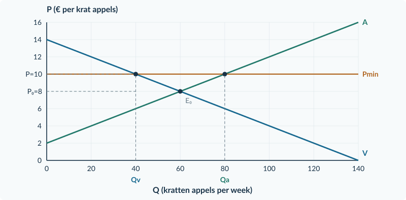<figcaption>Figuur 2. Zonder opkoop: Qv = 40 is de werkelijke verkoop; Qa = 80 is het gewenste aanbod bij € 10. Het aanbodoverschot is 40 kratten, geen overheidsaankoop.</figcaption></figure>

De aanbodlijn vertelt wat telers **willen aanbieden bij een prijs**. Ze bewijst niet dat alle 80 kratten daadwerkelijk worden gemaakt en verkocht. Neem ook niet aan dat de overheid de ontbrekende koper is.

### Voeg nu alleen de opkoopbelofte toe

De overheid belooft elk aangeboden krat dat particulieren niet kopen, tegen € 10 over te nemen. Nu vinden alle aangeboden kratten een afnemer: 40 bij particuliere kopers en 40 bij de overheid.

| Uitkomst per week | Zonder opkoop | Met volledige opkoop |
|---|---:|---:|
| Werkelijke particuliere aankopen | 40 kratten | 40 kratten |
| Overheidsaankopen | 0 kratten | 40 kratten |
| Totale verkopen | 40 kratten | 80 kratten |
| Overheidsuitgaven | € 0 | 40 × € 10 = € 400 |

<b>Lees het extra zinnetje in de bron</b> De prijs en functies blijven gelijk, maar de overheid wordt een extra koper. De uitgavenrechthoek hoort bij de opkoopbelofte, niet bij elke minimumprijs.

<!-- PAGE {"section": "3.1.5", "title": "Een prijsgrens is geen quotum"} -->

### Een quotum begrenst de hoeveelheid

Een **productiequotum** is een maximaal toegestane productie. Stel dat de prijsregeling vervalt en telers samen maximaal 40 kratten mogen produceren. Alle 40 worden geproduceerd en verkocht; de productierechten zijn gratis verdeeld. Er zijn geen overheidsaankopen.

<figure><figcaption>Figuur 3. Het quotum beperkt de productie tot 40. Lees de marktprijs bij deze hoeveelheid op V af: € 10. De overheid koopt hier niets.</figcaption></figure>

Bij deze hoeveelheid willen kopers € 10 betalen. Dat is hoger dan de oorspronkelijke vrije prijs. Een quotum zet dus niet rechtstreeks een minimumprijs vast, maar beperkt het aanbod. Het kan zo wél de marktprijs verhogen.

<b>Controleer ook het quotum</b> Een quotum van 80 kratten zou hier niet binden: het vrije evenwicht is maar 60. Je produceert dan niet automatisch 80 en leest de prijs dus niet klakkeloos bij 80 af.

### Waarom lees je de prijs op de vraaglijn?

De productiegrens bepaalt hier dat er 40 kratten worden verkocht. De vraaglijn vertelt welke prijs particuliere kopers voor dat aantal willen betalen. Bij € 10 vragen zij precies 40 kratten.

Op A staat bij Q = 40 juist € 6. Dat is de marginale kost van die hoeveelheid in dit model, niet de verkoopprijs. Het quotum voorkomt dat de productie door kan groeien tot het vrije evenwicht.

<b>Niet dezelfde regel</b> Een minimumprijs verbiedt lage prijzen. Een quotum verbiedt te veel productie. Dat beide in dit voorbeeld tot een prijs van € 10 leiden, maakt de mechanismen niet hetzelfde.

<!-- PAGE {"section": "3.1.5", "title": "Twee maatregelen vergelijken"} -->

## Uitgewerkt voorbeeld

**Appelkratten.** Vraag P = 14 − 0,10Q; aanbod P = 2 + 0,10Q. Q is kratten per week. Vrij evenwicht: 14 − 0,10Q = 2 + 0,10Q → Q₀ = 60 en P₀ = € 8.

**1 · Minimumprijs controleren.** Pmin = € 10 ligt boven € 8 en bindt.

**2 · Gewenste hoeveelheden berekenen.**

10 = 14 − 0,10Qv → Qv = 40 10 = 2 + 0,10Qa → Qa = 80 Aanbodoverschot = 80 − 40 = 40 kratten

**3 · De aankoopregel toepassen.** Zonder opkoop zijn er 40 particuliere verkopen. Bij volledige opkoop tegen € 10 koopt de overheid 40 kratten. U = 10 × 40 = **€ 400 per week**. Telers verkopen dan alle 80 kratten.

**4 · Vervang de prijsregeling door een quotum.** Een productiequotum van 40 ligt onder het vrije aantal 60 en bindt. Alle 40 toegestane kratten worden verkocht. De prijs volgt uit de vraag: P = 14 − 0,10 × 40 = **€ 10**. Er is geen aankoopgarantie en U = € 0.

| Uitkomst per week | Minimum + volledige opkoop | Alleen quotum 40 |
|---|---:|---:|
| Particuliere aankopen | 40 kratten | 40 kratten |
| Totale productie en verkoop | 80 kratten | 40 kratten |
| Overheidsaankopen | 40 kratten | 0 kratten |
| Overheidsuitgaven | € 400 | € 0 |

<b>Onthouden</b> Minimumprijs: eerst binding, dan Qv en Qa, dan de aankoopregel. Quotum: eerst binding, dan de toegestane verkochte hoeveelheid en de prijs op V. Veronderstel nooit automatisch opkoop of overheidsinkomsten.

## Startopgaven

<b>Korte route:</b> Startopgaven → Zelfstandige oefening → Doeloefening. Extra hulp nodig? Maak eerst Begeleide inoefening.

<b>Opgave 37 · Vraag en aanbod terughalen</b>

Qv = 100 − 5P en Qa = 5P − 20. Q is kratten per week; P is euro per krat.

<b>a.</b> Bereken het vrije evenwicht en bepaal bij P = € 14 het aanbodoverschot.

<b>Opgave 38 · Een toegestane prijs</b>

De vrije marktprijs is € 12. De minimumprijs wordt € 9.

<b>a.</b> Welke marktprijs blijft gelden? Leg uit waarom.

<!-- PAGE {"section": "3.1.5", "title": "Lees wat de overheid belooft"} -->

## Begeleide inoefening

Heb je deze hulp niet nodig? Ga dan verder met Zelfstandige oefening.

<b>Opgave 39 · Het overschot afnemen</b>

Gebruik de appelgrafiek op pagina 35. De overheid garandeert daar volledige opkoop van het aanbodoverschot.

<b>a.</b> Lees het aantal particuliere aankopen, de aangeboden hoeveelheid en het aantal overheidsaankopen af.

<b>b.</b> Bereken de oppervlakte U. Waarom is de basis niet de totale hoeveelheid 80?

<b>c.</b> Welke hoeveelheid blijft zeker niet automatisch verkocht als de opkoopgarantie vervalt?

Extra steun voor de quotumvraag 40c vind je in opgave 40A. Die kun je zo nodig eerst maken.

<b>Opgave 40 · Perenkratten</b>

Vraag P = 18 − 0,10Q; aanbod P = 6 + 0,10Q. Het vrije evenwicht is Q₀ = 60, P₀ = € 12. De minimumprijs is € 14. De overheid koopt elk aangeboden krat dat particulieren niet afnemen, tegen € 14. Q is kratten per week.

<b>a.</b> Vul eerst in: 14 = 18 − 0,10Qv → …; 14 = 6 + 0,10Qa → … . Bepaal het aanbodoverschot.

<b>b.</b> Teken Pmin en markeer Qv en Qa. Arceer de uitgavenrechthoek en bereken U.

<b>c.</b> Vervang de hele regeling door alleen een quotum van 40. Alle 40 kratten worden verkocht en er is geen opkoop. Bepaal prijs, particuliere verkopen en U.

<figure><figcaption>Figuur 4. Basisgrafiek bij opgave 40. Particuliere vraag en overheidsaankopen zijn verschillende dingen.</figcaption></figure>

<!-- PAGE {"section": "3.1.5", "title": "De quotumroute apart oefenen"} -->

### Begeleide inoefening · vervolg

Bij opgave 40 vergeleek je twee regelingen. Oefen hier desgewenst eerst de quotumroute afzonderlijk, voordat je de combinatie zelfstandig maakt.

<b>Opgave 40A · Eerst alleen een quotum</b>

Verschillende aanbieders verkopen paprikakratten. Vraag: P = 26 − 0,20Q. Aanbod: P = 8 + 0,10Q. P is euro per krat; Q is kratten per week. Het vrije evenwicht is Q₀ = 60 en P₀ = € 14. Er komt uitsluitend een productiequotum van 40 kratten. De rechten zijn gratis verdeeld. Alle 40 toegestane kratten worden geproduceerd en verkocht; er is geen overheidsopkoop.

<b>a.</b> Vergelijk het quotum met Q₀. Waarom bindt de maatregel? Welke hoeveelheid wordt werkelijk verkocht?

<b>b.</b> Vul in: P = 26 − 0,20 × … = … . Teken de quotumgrens in de basisgrafiek en markeer de verkoopprijs op de vraaglijn. Bereken ook het bedrag op A bij Q = 40. Waarom is dat niet de verkoopprijs?

<b>c.</b> Nu vervangt een quotum van 80 kratten de grens van 40. De rest blijft gelijk. Bepaal de werkelijke hoeveelheid, de marktprijs en de overheidsuitgaven. Beoordeel: “Een quotum van 80 betekent dat er 80 worden geproduceerd.”

<figure><figcaption>Figuur 5. Basisgrafiek bij opgave 40A. Teken zelf de productiegrens en zoek daarna de prijs waarbij kopers die hoeveelheid afnemen.</figcaption></figure>

<b>Drie controlevragen</b> Beperkt het quotum de vrije hoeveelheid? Wordt de toegestane hoeveelheid volgens de bron helemaal verkocht? Welke lijn vertelt wat kopers daarvoor betalen? Een quotum is een maximum, geen productieplicht.

<!-- PAGE {"section": "3.1.5", "title": "Aankopen en quota uit elkaar houden"} -->

## Zelfstandige oefening

<b>Opgave 41 · Pruimenkratten</b>

Vraag P = 22 − 0,10Q; aanbod P = 10 + 0,10Q. Q is kratten per week. De minimumprijs is € 18. De overheid koopt het volledige aanbodoverschot tegen deze prijs.

<b>a.</b> Bereken het vrije evenwicht. Bereken bij de minimumprijs Qv, Qa en het aanbodoverschot.

<b>b.</b> Bereken de totale verkoop door telers, de overheidsaankopen en U. Teken de uitgavenrechthoek in de basisgrafiek.

<b>c.</b> Vervang de minimumprijs én opkoop door alleen een bindend quotum van 40. Alle 40 kratten worden verkocht. Bereken de marktprijs en vergelijk de productie met de opkoopregeling.

<figure><figcaption>Figuur 6. Basisgrafiek bij opgave 41. Begin voor de quotumvergelijking opnieuw, zonder de minimumprijsregeling.</figcaption></figure>

<b>Opgave 42 · Geen opkoop afgesproken</b>

Een bron noemt een minimumprijs waarbij Qv = 30 en Qa = 70. Een tweede bron noemt gratis verdeelde productiequota. Geen van beide bronnen noemt betalingen door of aan de overheid.

<b>a.</b> Hoeveel producten worden in de eerste bron zonder opkoop of andere afnemers verkocht? Hoe groot is het aanbodoverschot?

<b>b.</b> Waarom mag je bij geen van beide bronnen automatisch een bedrag aan overheidsuitgaven of inkomsten berekenen?

<!-- PAGE {"section": "3.1.5", "title": "Een garantie voor paddenstoelentelers"} -->

## Doeloefening

<b>Opgave 43 · Paddenstoelen in kratten</b>

Vraag P = 20 − 0,10Q; aanbod P = 8 + 0,10Q. Q is kratten per week; P is euro per krat. Regeling A voert een minimumprijs van € 16 in. De overheid koopt elk aangeboden krat dat particulieren niet kopen, tegen € 16. De telers leveren samen de aangeboden hoeveelheid.

<b>a.</b> Bereken het vrije evenwicht en leg uit of de minimumprijs bindt.

<b>b.</b> Bereken bij € 16 de particuliere vraag, het aanbod, het aanbodoverschot en de totale verkoop door telers.

<b>c.</b> Bereken de overheidsaankopen en de overheidsuitgaven per week. Markeer in de grafiek Pmin, Qv, Qa en de uitgavenrechthoek.

<b>d.</b> Regeling B vervangt A volledig: een productiequotum van 40 kratten. Alle 40 worden verkocht; de rechten zijn gratis verdeeld en de overheid koopt niets. Bereken de marktprijs, totale productie en overheidsuitgaven.

<b>e.</b> Een teler zegt: “Omdat beide regelingen dezelfde prijs geven, zijn ze economisch hetzelfde.” Beoordeel met twee berekende verschillen.

<figure><figcaption>Figuur 7. Basisgrafiek bij de doeloefening. Scheid de berekeningen van regeling A en regeling B.</figcaption></figure>

<!-- PAGE {"section": "3.1.5", "title": "Een begrotingsbedrag is nog geen oordeel"} -->

## Denkertje / Bonusopgave

<b>Opgave 44 · Is de hele rekening verlies?</b>

Bij opgave 43 koopt de overheid 40 kratten voor € 16 per krat. Een bestuurder zegt: “Dat kost € 640; dus het welvaartsverlies is precies € 640.” Er staat niets over het gebruik van de kratten, de waarde daarvan voor ontvangers of eventuele opslagkosten.

<b>a.</b> Leg uit waarom een overheidsuitgave niet zonder verdere informatie hetzelfde is als welvaartsverlies.

<b>b.</b> Noem twee soorten informatie die je nodig hebt voor een zorgvuldig welvaartsoordeel over deze aankopen. Je hoeft geen nieuwe welvaartsformule te gebruiken.

<b>Bronnen begrenzen je conclusie</b> Je kunt de betaling van € 640 precies berekenen. Je kunt zonder extra gegevens niet precies bepalen wat er met de goederen gebeurt en wat de maatschappelijke waarde daarvan is. Houd die twee uitspraken uit elkaar.

## Herhaling / Herhaling en interleaving

<b>Opgave 45 · Een prijsreactie meten</b>

De prijs van een product stijgt van € 8 naar € 10. De gevraagde hoeveelheid daalt van 80 naar 70 per week. Andere vraagfactoren blijven gelijk.

<b>a.</b> Bereken Ev met de oude waarden als basis. Classificeer de vraag.

<b>b.</b> Bereken de omzet vóór en na de prijsstijging. Leg uit waarom een omzetstijging geen bewijs van een hogere winst is.

### Kies het juiste onderscheid

Bij een **prijsgrens** vergelijk je eerst met de vrije prijs. Bij een **quotum** vergelijk je eerst met de vrije hoeveelheid. Daarna pas onderzoek je de feitelijke transacties en de geldstromen.

<b>Klaar voor combineren</b> Je kent nu belasting, subsidie, maximumprijs, minimumprijs en quotum. In de gemengde opgaven staat niet bij elke berekening welk model je moet gebruiken. Lees daarom eerst wat de maatregel werkelijk doet.

<!-- PAGE {"section": "3.1.6", "title": "Kies eerst de methode"} -->

3.1.6 · GEMENGDE OPGAVEN: OVERHEIDSINGRIJPEN

# Kies eerst de methode

Hier komt geen nieuwe theorie bij. Gebruik de vraag- en aanbodtechnieken uit Boek 1, de surplus- en elasticiteitskennis uit Boek 2 en de maatregelen uit dit hoofdstuk.

<b>Doel van deze paragraaf</b> Je kiest op basis van de bron de juiste maatregel en rekentechniek. Je verbindt een berekening met een gelabelde grafiek en trekt een conclusie die niet verder gaat dan de gegevens.

<b>Opgave 46 · Vier korte berichten</b>

Lees elk bericht afzonderlijk. De vrije marktuitkomst is telkens gegeven of verandert niet door iets anders.

<b>a.</b> Aanbieders maken per verkocht product € 2 over aan de overheid. Welke maatregel is dit? Welke prijs is dan hoger: Pc of Pp?

<b>b.</b> Aanbieders krijgen € 3 voor elke werkelijk verkochte plaats. Welke maatregel is dit? Over welke hoeveelheid bereken je U?

<b>c.</b> De vrije prijs is € 9, maar verkopen boven € 7 worden verboden. Benoem de maatregel, geef de bindingscontrole en noem welke hoeveelheden je moet berekenen.

<b>d.</b> Producenten mogen samen niet meer dan 50 producten maken; de vrije hoeveelheid zou 70 zijn. Noem de maatregel en waar je de prijs van de 50 verkochte producten afleest.

<b>Opgave 47 · De ontbrekende aankoopbelofte</b>

Een minimumprijs van € 12 ligt boven de vrije evenwichtsprijs van € 9. Bij € 12 zijn Qv = 30 en Qa = 70. Er is geen overheidsopkoop, geen voorraadverkoop en geen andere afnemer.

<b>a.</b> Bepaal de werkelijke verkoop, het aanbodoverschot en de overheidsuitgaven.

<b>b.</b> Een voorstel voegt volledige opkoop van het overschot tegen € 12 toe. Bereken de extra overheidsaankopen en U.

<b>c.</b> Waarom veranderen de antwoorden terwijl de minimumprijs zelf gelijk blijft?

<b>Aanpak van de doeloefening</b> Werk de twee plannen afzonderlijk uit. De bronnen staan op pagina 46 en de vragen op pagina 47. Opgave 47A is extra gemengde oefening voor de keuze van de juiste hoeveelheid en overheidsrekening. Gebruik voor het tekenen de geleverde marktgrafiek.

<!-- PAGE {"section": "3.1.6", "title": "Controleer de aanpak, niet alleen het rekenen"} -->

### Extra gemengde oefening

Een berekening kan netjes zijn uitgevoerd en toch de verkeerde economische grootheid gebruiken. Oefen hieronder het kiezen van de juiste hoeveelheid en rekening. Je docent kan deze opgave als extra oefening of als huiswerk gebruiken.

<b>Opgave 47A · Drie berekeningen die overtuigend lijken</b>

Lees de drie berichten hieronder als afzonderlijke markten. Alle bedragen hebben betrekking op één week. Er zijn geen kosten of baten voor buitenstaanders en geen uitvoeringskosten. Noem bij ieder antwoord de juiste grootheid, berekening en reden.

<b>a.</b> Bericht A. Aanbieders maken € 3 per verkocht product over aan de overheid. De verkoop daalt van 60 naar 45. Een leerling berekent overheidsontvangsten als 3 × (60 − 45) = € 45. Verbeter de berekening en benoem de hoeveelheid waarover de belasting wordt ontvangen.

<b>b.</b> Bericht B. Aanbieders krijgen € 2 voor elk verkocht product. De verkoop stijgt van 60 naar 70. CS neemt met € 65 toe en PS ook met € 65. Een leerling noemt de toename van € 130 een welvaartswinst. Bereken de overheidsuitgaven en de verandering van de welvaartsmaat. Beoordeel de conclusie.

<b>c.</b> Bericht C. Bij een bindende minimumprijs van € 12 zijn Qv = 30 en Qa = 70. Er zijn geen andere kopers, voorraden of overheidsaankopen. Een leerling schrijft: “Er worden 70 verkocht; de overheid betaalt 12 × 40 = € 480.” Verbeter beide uitkomsten. Welke extra afspraak zou de berekende € 480 wél rechtvaardigen?

### Zo onderbouw je een correctie

Schrijf niet alleen “fout”. Benoem **welke afspraak uit de bron** bepaalt wat je telt. Maak daarna de berekening en geef aan wat het bedrag betekent. Bij een welvaartsconclusie kijk je naar alle partijen die in de gebruikte welvaartsmaat meetellen.

<b>Geen nieuwe maatregel</b> Je gebruikt uitsluitend bekende belasting-, subsidie- en minimumprijsregels. Daarna pas combineer je in de doeloefening een berekening, grafiek en beleidsconclusie.

<!-- PAGE {"section": "3.1.6", "title": "Bronnen bij de doeloefening"} -->

## Doeloefening

<b>Opgave 48 · Twee plannen voor festivalbandjes</b> 
Een gemeente onderzoekt de markt voor eenvoudige festivalbandjes. Verschillende aanbieders verkopen hetzelfde product. Alle bedragen en voorstellen zijn fictief.

### Bron 1 · De markt zonder maatregel

Vraag: **Pc = 24 − 0,20Q**. Aanbod: **Pp = 6 + 0,10Q**. Q is bandjes per dag; Pc en Pp zijn euro per bandje. Zonder maatregel is Pc = Pp. Het CS in het vrije evenwicht is € 360 per dag; het PS is € 180 per dag.

### Bron 2 · Twee alternatieven, niet tegelijk

**Plan A.** De aanbieder draagt € 3 af per verkocht bandje. Er zijn geen andere geldstromen of effecten voor buitenstaanders. Ook uitvoeringskosten blijven buiten beschouwing.

**Plan B.** Een verkoopprijs boven € 10 is verboden. Er is geen extra aanvoer. Alle aangeboden bandjes worden verkocht aan de vragers met de hoogste betalingsbereidheid. Er is geen belasting, subsidie of overheidsopkoop.

### Bron 3 · De beleidsclaim

“Plan B maakt een bandje bereikbaar voor iedereen die er bij € 10 een wil. Plan A levert de overheid geld op; dat geld is volledig verdwenen welvaart.”

<figure>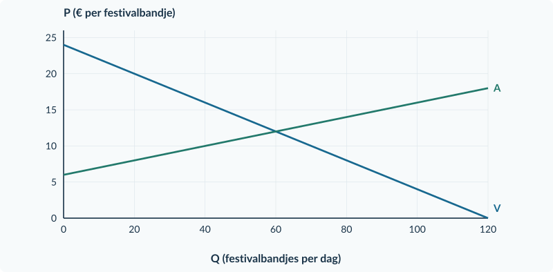<figcaption>Figuur 1. Basisgrafiek bij opgave 48. Gebruik deze voor plan A. De plannen zijn alternatieven: pas ze niet tegelijk toe.</figcaption></figure>

De vragen staan op de tegenoverliggende pagina. Voor plan B volstaan berekeningen en een conclusie; je hoeft geen tweede grafiek te tekenen.

<!-- PAGE {"section": "3.1.6", "title": "Vragen bij de doeloefening"} -->

<b>Opgave 48 · Vragen</b>

Gebruik de bronnen en de grafiek op pagina 46. Noteer berekening, eenheid en conclusie.

<b>a.</b> Benoem de maatregelen van plan A en B. Bereken met bron 1 het vrije evenwicht.

<b>b.</b> Bereken voor plan A het nieuwe aanbod in kopersprijzen, de verkochte hoeveelheid, Pc en Pp. Noteer de economische last per bandje voor kopers en verkopers.

<b>c.</b> Bereken bij plan A de overheidsontvangsten, CS, PS en het welvaartsverlies. Gebruik de oorspronkelijke vraag- en aanbodlijn voor de surplusgebieden.

<b>d.</b> Markeer in de basisgrafiek de twee prijzen en de nieuwe hoeveelheid van plan A. Arceer de overheidsontvangsten en het welvaartsverlies verschillend. Benoem beide gebieden.

<b>e.</b> Bereken voor plan B Qv, Qa, werkelijke verkopen en tekort. Controleer eerst of de prijsregel bindt.

<b>f.</b> Beoordeel beide delen van de beleidsclaim uit bron 3. Gebruik minstens één berekening per deel. Geef daarna één verschil tussen de plannen dat voor kopers van belang is; trek geen niet-berekende algemene welvaartsconclusie over plan B.

### Kijk na je berekeningen terug

| Controle | Wat je in je antwoord moet kunnen aanwijzen |
|---|---|
| Modelkeuze | Plan A heeft twee prijzen; plan B één begrensde prijs. |
| Transacties | Geen berekening van budget of surplus over onverkochte bandjes. |
| Geldstroom | Overheidsontvangsten zijn niet volledig welvaartsverlies. |
| Bronconclusie | Een tekort beperkt toegang; een lage prijs garandeert geen aankoop. |

<b>Een onderbouwde conclusie</b> Een bruikbaar antwoord combineert een brongegeven, een berekening en een gevolg. Bijvoorbeeld: “Omdat er maar … bandjes worden aangeboden, kunnen niet alle … vragers kopen.” Vul de getallen zelf in.

<!-- PAGE {"section": "3.1", "title": "Hoofdstukoverzicht"} -->

# Overzicht: één markt, vijf instrumenten

| Instrument | Controle en prijsrelatie | Hoeveelheid en overheid |
|---|---|---|
| Belasting per product | Pc − Pp = t | Nieuw evenwicht; O = t × Qt |
| Subsidie per product | Pp − Pc = s | Nieuw evenwicht; U = s × Qsub |
| Maximumprijs | Bindt als Pmax lager is dan P₀ | Zonder extra aanvoer: verkopen = Qa; tekort = Qv − Qa |
| Minimumprijs | Bindt als Pmin hoger is dan P₀ | Zonder opkoop: verkopen = Qv; overschot = Qa − Qv |
| Productiequotum | Bindt als toegestane Q lager is dan Q₀ | Bij volledige verkoop: prijs op V; budget alleen volgens de bron |

### Vijf begrippenparen die je uit elkaar houdt

**Afdragen en dragen.** Wie belasting overmaakt, draagt niet automatisch de hele last. Gebruik Pc − P₀ en P₀ − Pp.

**Gewenst en werkelijk.** Qv en Qa zijn gewenste hoeveelheden bij een prijs. Lees welke producten daadwerkelijk worden verhandeld.

**Rechthoek en driehoek.** Een bedrag per verkocht product maal de verkochte hoeveelheid geeft een budgetrechthoek. Gemiste voordelen van handel vormen in onze lineaire belastingvoorbeelden een driehoek.

**Geldstroom en welvaartsverlies.** Vergelijk zonder maatregel CS + PS, bij belasting CS + PS + O en bij subsidie CS + PS − U. Dezelfde euro niet dubbel tellen.

**Efficiëntie en verdeling.** Een grotere welvaartsmaat betekent niet dat iedere groep erop vooruitgaat. Een lagere prijs betekent niet dat iedere koper toegang heeft.

Vrije markt: stel vraag = aanbod Belasting: aanbod in Pc = oorspronkelijk aanbod + t Subsidie: aanbod in Pc = oorspronkelijk aanbod − s

<b>Voor je antwoord af is</b> Heb je het juiste plan gekozen? Staan er eenheden bij alle aantallen en bedragen? Klopt de wig? Is de prijs- of hoeveelheidsgrens echt bindend? Is de aankoop- of toewijzingsregel gebruikt? Volgt je conclusie uit de bron?

Grenzen van dit hoofdstuk: geen internationale handel of arbeidsmarktmodel; geen effecten voor buitenstaanders. Belastingen en subsidies worden in Boek 4 opnieuw gebruikt met andere welvaartsveronderstellingen. Een quotum is een regel; productiecapaciteit is wat technisch mogelijk is.

