<!-- PAGE {"section": "3.2", "title": "Volkomen concurrentie"} -->

4VECO · ECONOMIE · 4 VWO · BOEK 3

Volkomen concurrentie

De markt bepaalt de prijs. Wat kiest de onderneming?

Een teler ziet op de veiling één marktprijs voor zijn product. Hij kan die prijs niet zelf verhogen. Toch moet hij beslissen hoeveel hij produceert. En als veel telers winst maken, kunnen er nieuwe aanbieders bijkomen.

Dit hoofdstuk verbindt **de hele markt** met **één onderneming**. Je gebruikt bekende kosten- en opbrengstberekeningen. Nieuw is hoe je daarmee de beste productieomvang bepaalt.

<a href="#s321"><b>3.2.1 · Volkomen concurrentie: kenmerken 2</b>Van marktprijs naar P = GO = MO</a>
<a href="#s322"><b>3.2.2 · Winstmaximalisatie 10</b>Marginaal vergelijken, differentiëren en winst berekenen</a>
<a href="#s323"><b>3.2.3 · Langetermijnevenwicht 22</b>Toetreding, uittreding en de normale beloning</a>
<a href="#s324"><b>3.2.4 · Gemengde opgaven 31</b>Marktverandering en ondernemingsbeslissing combineren</a>
<a href="#overzicht"><b>Overzicht en begrippen 37</b></a>

<b>Zo werk je</b> Maak berekeningen en tekeningen in je schrift of in de gegeven grafiek. Noteer steeds de eenheid. De doeloefeningen laten zien welke handelingen je aan het einde zelfstandig moet kunnen uitvoeren.

Alle markten en bedragen zijn oefenmodellen. Een herkenbaar product betekent niet dat de echte markt precies aan alle modelaannames voldoet. q is één onderneming; Q is de hele markt.

<!-- PAGE {"section": "3.2.1", "title": "Een prijs voor iedereen"} -->

3.2.1 · VOLKOMEN CONCURRENTIE: KENMERKEN

# Een prijs voor iedereen
Een aardappelteler levert dezelfde kwaliteit als veel andere telers. Kopers kunnen de prijzen direct vergelijken. Vraagt hij meer, dan kopen zij elders. Wat heeft de teler dan nog zelf te kiezen?

<b>Lesdoelen</b> Je kunt de kenmerken van volkomen concurrentie uitleggen. Je kunt een marktprijs aflezen en overnemen in een ondernemingsgrafiek. Je kunt TO, GO en MO bij die prijs berekenen en een prijskeuze beoordelen.

### Vier kenmerken vormen samen het model
| Kenmerk | Betekenis voor de onderneming |
|---|---|
| Veel kleine aanbieders en vragers | Eén deelnemer heeft nauwelijks invloed op de marktprijs. |
| Homogeen product | Kopers zien de producten als gelijkwaardig. |
| Doorzichtige markt | Kopers en verkopers kennen de relevante prijzen en kwaliteit. |
| Vrije toetreding en uittreding | Ondernemingen kunnen beginnen of stoppen zonder bijzondere toetredingsbarrières. |
<figure><figcaption>Figuur 1. Door deze combinatie van aannames is één onderneming prijsnemer.</figcaption></figure>

<b>Prijsnemer</b> Een onderneming die de marktprijs als gegeven neemt. Zij kiest haar productie, niet zelfstandig een hogere marktprijs.

<!-- PAGE {"section": "3.2.1", "title": "Twee grafieken, één prijs"} -->

### Eerst de markt, dan de onderneming
Links snijden de vraaglijn V en aanbodlijn A elkaar. Bij deze prijs willen alle kopers samen evenveel kopen als alle verkopers samen aanbieden. Je kent deze evenwichtsmethode uit Boek 1.

Rechts bekijken we **maar één teler**. Zijn aanbod is klein ten opzichte van de markt. In dit model kan hij bij de marktprijs zijn productie verkopen, tot zijn eigen productiecapaciteit.
<figure><figcaption>Figuur 2. De marktprijs is € 2 per kg. Neem alleen deze prijs over naar rechts, niet de markthoeveelheid van 4.000 kg.</figcaption></figure>

### Lees de assen voordat je rekent
**Q** is de totale hoeveelheid op de markt. Links betekent 4 dus **4.000 kg per dag**. **q** is de afzet van één onderneming, hier maximaal 150 kg per dag.

De horizontale lijn rechts zegt: elke kg brengt bij deze marktprijs € 2 op. Als één teler wat meer verkoopt, blijft zijn prijs in het model gelijk.

<b>Niet verwisselen</b> De horizontale lijn hoort bij één prijsnemende onderneming. De vraaglijn van de <b>hele markt</b> blijft dalend.

<!-- PAGE {"section": "3.2.1", "title": "De prijs bepaalt de opbrengst"} -->

## Uitgewerkt voorbeeld
**Aardappelteler Noor.** Gebruik figuur 2 op pagina 3. Alle telers leveren dezelfde kwaliteit; kopers kennen de prijzen. Noor kan maximaal 150 kg per dag leveren.

**1 · Lees de markt.** V en A snijden bij Q = 4.000 kg en P = € 2 per kg. Noor neemt P = € 2 over in haar eigen grafiek.

**2 · Totale opbrengst.** Bij q = 100 kg verkoopt zij 100 keer een kg voor € 2.

TO = P × q = 2 × 100 = € 200 per dag

**3 · Gemiddelde en marginale opbrengst.** Gemiddeld ontvangt zij € 2 per kg. Nog 20 kg verkopen geeft € 40 extra opbrengst.

GO = TO / q = 200 / 100 = € 2 per kg MO = ΔTO / Δq = (240 − 200) / (120 − 100) MO = 40 / 20 = € 2 per kg

**4 · Teken en leg uit.** De horizontale lijn in haar grafiek heet **P = GO = MO**. Een prijs van € 2,10 verliest kopers aan dezelfde aardappelen van anderen. Een prijs van € 1,90 is niet nodig om haar 100 kg te verkopen: die kan zij al voor € 2 afzetten.

Bij q = 100 geeft € 1,90 maar € 190 opbrengst. Haar kosten veranderen bij dezelfde productie niet. Deze prijsverlaging verlaagt daarom ook haar winst.

<b>Onthouden</b> Bij één vaste marktprijs: TO = P × q en P = GO = MO. TO is een totaalbedrag per periode; GO en MO zijn bedragen per product. GO bereken je alleen bij q &gt; 0.

<!-- PAGE {"section": "3.2.1", "title": "Ophalen en herkennen"} -->

## Startopgaven

<b>Korte route:</b> Startopgaven → Zelfstandige oefening → Doeloefening. Extra hulp nodig? Maak eerst Begeleide inoefening.

<b>Opgave 1 · Opbrengst terughalen</b>

Een producent verkoopt 80 kg meel per dag voor € 4 per kg.

<b>a.</b> Bereken TO en GO. Noteer bij beide de juiste eenheid.

<b>b.</b> De afzet stijgt naar 100 kg bij dezelfde prijs. Bereken de extra opbrengst en MO over deze toename.

<b>Opgave 2 · Welke lijn is horizontaal?</b>

Een leerling ziet figuur 2 en zegt: “Bij volkomen concurrentie verandert de totale vraag niet als de prijs verandert.”

<b>a.</b> Welk verschil tussen de marktgrafiek en de ondernemingsgrafiek ziet de leerling over het hoofd?

<b>b.</b> Noem twee modelkenmerken die verklaren waarom één teler de prijs als gegeven neemt.

## Begeleide inoefening

Heb je deze hulp niet nodig? Ga dan verder met Zelfstandige oefening.

<b>Opgave 3 · Volg de prijs</b>

Gebruik het uitgewerkte voorbeeld en figuur 2.

<b>a.</b> Wijs eerst het marktevenwicht aan. Welk getal neem je naar de ondernemingsgrafiek over?

<b>b.</b> Leg met q = 100 en q = 120 uit waarom MO niet gelijk is aan de extra totale opbrengst van € 40.

<b>c.</b> Een teler verdubbelt zijn eigen kleine productie. Waarom betekent dit niet dat de totale markthoeveelheid verdubbelt?

<!-- PAGE {"section": "3.2.1", "title": "Zelf de prijs overnemen"} -->

Begeleide inoefening · vervolg

<b>Opgave 4 · De rijstmarkt</b>

Op deze oefenmarkt leveren veel kleine ondernemingen dezelfde kwaliteit rijst. Prijzen zijn bekend. Toetreding is vrij. Eén onderneming kan maximaal 120 kg per dag leveren.

<b>a.</b> Lees links de evenwichtsprijs en de markthoeveelheid af. Let op × 1.000 op de horizontale as.

<b>b.</b> Neem rechts alleen de prijs over. Teken één horizontale lijn en zet erbij: P = GO = MO.

<b>c.</b> Bereken TO bij q = 80. Bereken vervolgens de extra opbrengst bij 20 kg extra afzet en MO.

<b>d.</b> Leg uit waarom deze onderneming bij dezelfde afzet geen hogere winst behaalt door € 0,20 onder de marktprijs te verkopen.

<figure>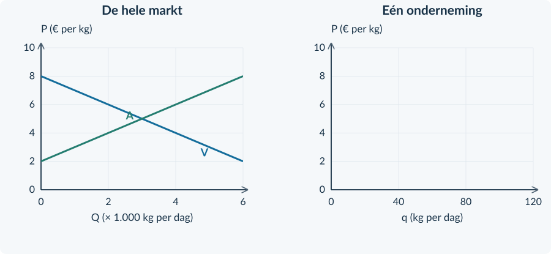<figcaption>Figuur 3. De markt is al getekend. Vul de ondernemingsgrafiek aan.</figcaption></figure>

<b>Van lezen naar uitleggen</b> Zeg niet alleen “de onderneming is prijsnemer”. Leg uit wat een koper kan doen en waarom een lagere prijs bij dezelfde afzet niet helpt.

<!-- PAGE {"section": "3.2.1", "title": "Dezelfde methode, andere bronnen"} -->

## Zelfstandige oefening

<b>Opgave 5 · Standaard potgrond</b>

Veel kleine aanbieders leveren in dit model dezelfde potgrond. Eén aanbieder verkoopt maximaal 120 kg per dag.

<b>a.</b> Lees het marktevenwicht af en vul rechts de lijn P = GO = MO in.

<b>b.</b> Bereken TO en GO bij q = 90. Bereken MO als de afzet daarna naar 110 kg stijgt.

<b>c.</b> Een aanbieder vraagt € 0,50 boven de marktprijs. Leg met de modelaannames uit waarom dit geen bruikbare manier is om zijn winst te vergroten.

<figure>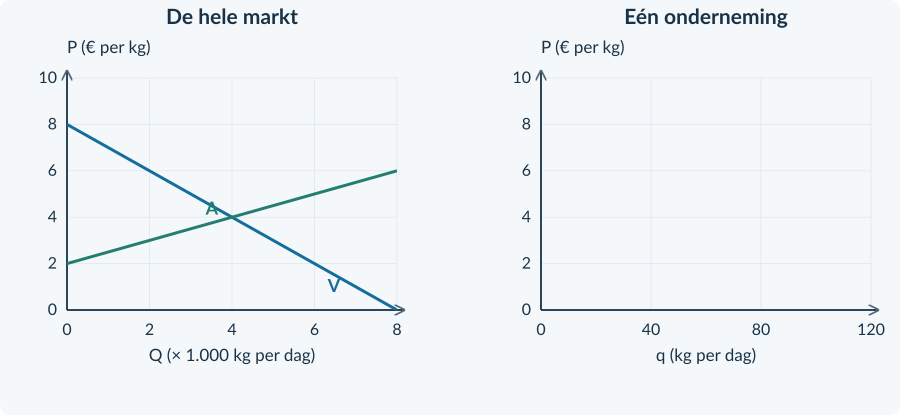<figcaption>Figuur 4. Eén marktprijs, maar twee verschillende hoeveelheidsassen.</figcaption></figure>

<b>Opgave 6 · Een eigen merk</b>

Een andere aanbieder verkoopt potgrond met een eigen merk. Een groep klanten wil juist dit merk en betaalt er extra voor.

<b>a.</b> Welk kenmerk van volkomen concurrentie gaat in deze beschrijving niet meer op?

<b>b.</b> Waarom mag je voor deze aanbieder niet zonder meer dezelfde horizontale opbrengstlijn gebruiken?

<!-- PAGE {"section": "3.2.1", "title": "Laat zien wat je kunt"} -->

## Doeloefening

<b>Opgave 7 · Wortelveiling</b>

Veel kleine telers bieden wortelen van dezelfde kwaliteit aan. Kopers kennen alle prijzen. Beginnen of stoppen is vrij. Teler Mila kan tot 160 kg per dag leveren en bij de marktprijs verkopen.

<b>a.</b> (2p) Lees de marktprijs en de markthoeveelheid af. Noem één kenmerk uit de bron dat prijsnemerschap ondersteunt.

<b>b.</b> (2p) Teken rechts de opbrengstlijn van Mila. Label die als P = GO = MO.

<b>c.</b> (3p) Bereken bij q = 120 kg de TO en GO. Bereken MO wanneer Mila van 120 naar 140 kg gaat.

<b>d.</b> (2p) Mila overweegt € 3,20 te vragen. Leg uit waarom zij in dit model daardoor haar kopers verliest.

<b>e.</b> (2p) Een klasgenoot zegt: “De markt verkoopt 4.000 kg, dus de lijn van Mila moet bij q = 4.000 eindigen.” Leg de fout uit.

<figure>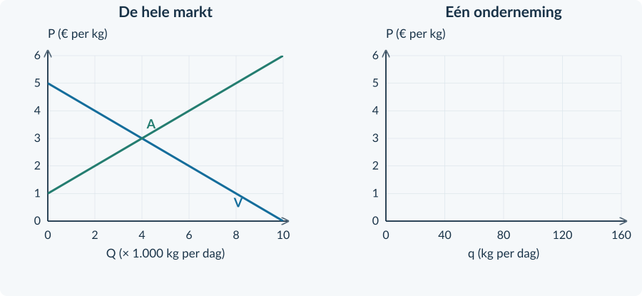<figcaption>Figuur 5. Vul alleen de ontbrekende lijn en labels in de ondernemingsgrafiek aan.</figcaption></figure>

<!-- PAGE {"section": "3.2.1", "title": "Een model herkennen"} -->

## Denkertje / Bonusopgave

<b>Opgave 8 · Onbeperkt verkopen?</b>

“Een horizontale opbrengstlijn betekent dat één bedrijf oneindig veel kan verkopen zonder dat de prijs verandert.”

<b>a.</b> Beoordeel de uitspraak. Gebruik de begrippen productiecapaciteit en klein marktaandeel.

<b>b.</b> Leg uit wat er aan het model zou veranderen als dit ene bedrijf een groot deel van de markt gaat bedienen.

## Herhaling / Herhaling en interleaving

<b>Opgave 9 · Evenwicht uit formules</b>

Vraag: P = 18 − 0,20Q. Aanbod: P = 6 + 0,10Q. P is euro per product; Q is producten per week.

<b>a.</b> Bereken de evenwichtsprijs en -hoeveelheid.

<b>b.</b> Er komen meer aanbieders bij, bij ongewijzigde vraag. Welke kant verschuift de aanbodlijn? Wat verwacht je van de prijs?

<b>Opgave 10 · Totaal en gemiddeld</b>

Voor een onderneming geldt TK = 150 + 3q. q is kg per week; TK is euro per week.

<b>a.</b> Bereken TK en GTK bij q = 50.

<b>b.</b> Bereken GTK bij q = 100. Leg uit waarom GTK daalt, terwijl TK stijgt.

<b>Neem mee naar de volgende paragraaf</b> De onderneming kan de prijs niet bepalen. Zij kan wél beslissen hoeveel zij bij die prijs produceert. Daarvoor heeft zij ook haar kosten nodig.

<!-- PAGE {"section": "3.2.2", "title": "Meer produceren is niet altijd beter"} -->

3.2.2 · WINSTMAXIMALISATIE BIJ VOLKOMEN CONCURRENTIE

# Nog wat meer produceren?
Een leverancier van kruidenzaden ontvangt € 8 per kg. Elke extra kg geeft extra opbrengst, maar kost ook iets. Wanneer stopt hij met uitbreiden?

<b>Lesdoelen</b> Je kunt een eenvoudige kwadratische TK-functie differentiëren naar MK. Je kunt de winstmaximale haalbare productie vinden en onderbouwen. Je kunt totale winst berekenen en als rechthoek in een ondernemingsgrafiek weergeven.

Voor deze oefenonderneming geldt **TK = 0,05q² + 2q + 80**. q is kg per week; TK is euro per week. De productiecapaciteit is 100 kg per week. Alle productie wordt verkocht.

| q (kg per week) | TO (€ per week) | TK (€ per week) | Winst (€ per week) |
|---:|---:|---:|---:|
| 0 | 0 | 80 | −80 |
| 20 | 160 | 140 | 20 |
| 40 | 320 | 240 | 80 |
| 60 | 480 | 380 | 100 |
| 80 | 640 | 560 | 80 |
| 100 | 800 | 780 | 20 |

Van 40 naar 60 kg stijgt TO met € 160 en TK met € 140. De winst neemt toe. Van 60 naar 80 kg stijgt TK met € 180. Dat is méér dan de extra opbrengst: de winst daalt.

<b>Nieuwe stap</b> Je kende marginale bedragen al uit Boek 2. Nieuw is de <b>keuze</b>: vergelijk extra opbrengsten en extra kosten om de productie te bepalen.

<!-- PAGE {"section": "3.2.2", "title": "Een tabelstap is niet één punt"} -->

### Van een grote stap naar een kleine verandering
Met een tabel bereken je de gemiddelde extra kosten over een aangegeven productiestap. Tussen 40 en 60 kg geldt:

MK over 40–60 = (380 − 240) / (60 − 40) MK over 40–60 = € 7 per extra kg

Dit betekent niet dat iedere kg in die stap exact € 7 extra kost. In het model stijgen de extra kosten geleidelijk.

Om ook tussen de tabelwaarden een beste productie te vinden, gebruiken we een doorlopende kostenfunctie. Kilogrammen kunnen we in dit model ook in delen produceren.

<b>De afgeleide</b> De afgeleide van TK geeft aan hoe snel TK op één punt verandert. In ons doorlopende model noemen we dat de marginale kosten MK, in euro per kg.

Bij de kruidenzaden is de afgeleide **MK = 0,10q + 2**. Op de volgende pagina leer je hoe je die formule maakt.

| Plaats of stap | Wat meet je? | Uitkomst |
|---|---|---:|
| Van 40 naar 60 kg | Gemiddelde extra kosten over 20 kg | € 7 per kg |
| Op het punt q = 60 | MK bij een heel kleine uitbreiding | € 8 per kg |
| Van 60 naar 61 kg | Exact verschil in totale kosten | € 8,05 voor die kg |

De uitkomsten spreken elkaar niet tegen: ze gaan over verschillende veranderingen.

<b>Welke methode gebruik je?</b> Vraagt de opgave om een tabelstap? Gebruik ΔTK / Δq. Krijg je een doorlopende TK-functie en zoek je het optimum? Gebruik de afgeleide. Voor een hele extra kg kan de afgeleide een kleine benadering zijn.

<!-- PAGE {"section": "3.2.2", "title": "Van TK naar MK"} -->

### Een beperkte rekenregel
Voor dit hoofdstuk hoef je geen algemene cursus differentiëren te kennen. We gebruiken alleen functies met **q²**, **q** en een constant getal.

TK = a × q² + b × q + c MK = 2a × q + b

<figure>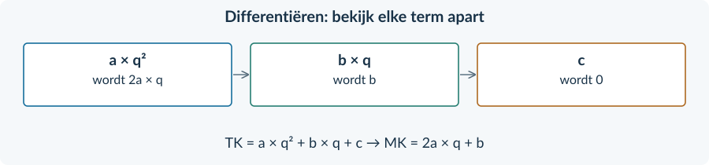<figcaption>Figuur 1. Differentieer elke term. Tel daarna de overgebleven termen op.</figcaption></figure>

### Doe het één term tegelijk
Bij **TK = 0,05q² + 2q + 80**:

| Term in TK | Wat doe je? | Bijdrage aan MK |
|---|---|---|
| 0,05q² | Vermenigvuldig 0,05 met 2; q² wordt q. | 0,10q |
| 2q | De bijdrage per extra kg is 2. | 2 |
| 80 | Dit bedrag verandert niet bij meer productie. | 0 |

MK = 0,10q + 2

Nog een voorbeeld: **TK = 0,20q² + 3q + 50** geeft **MK = 0,40q + 3**.

De constante kosten verdwijnen uit MK, maar niet uit TK of uit de winstberekening. Zij blijven in de onderzochte periode gelijk, tot de productiecapaciteit.

<b>Controle</b> Vul na het differentiëren een q in. Bij q = 60 geeft MK = 0,10 × 60 + 2 = € 8 per kg. Dat is geen totaalbedrag.

<!-- PAGE {"section": "3.2.2", "title": "Waarom MO = MK hier een maximum geeft"} -->

### Vergelijk links én rechts van het snijpunt
Bij de kruidenzaden is **MO = P = 8** en **MK = 0,10q + 2**.

8 = 0,10q + 2 → 6 = 0,10q → q = 60

Bij q = 40 is MK = € 6: een kleine uitbreiding levert meer op dan zij kost. Bij q = 80 is MK = € 10: iets minder produceren bespaart meer dan aan opbrengst verloren gaat.
<figure>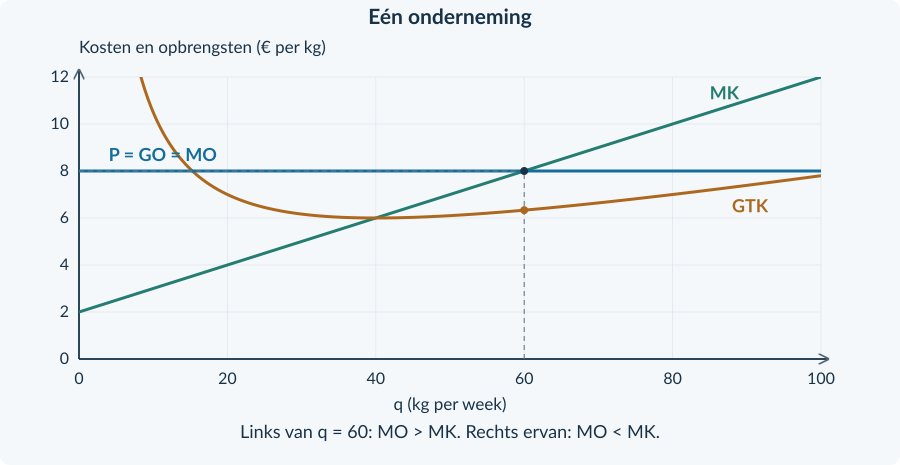<figcaption>Figuur 2. MK stijgt door de horizontale MO-lijn. De winst stijgt vóór q = 60 en daalt erna.</figcaption></figure>

<b>Controleer ook de haalbaarheid</b> q = 60 past binnen de capaciteit van 100 kg. Zou de capaciteit maar 50 kg zijn, dan kiest de onderneming 50 kg: tot die grens blijft MO groter dan MK. Het theoretische snijpunt is dan onhaalbaar.

We vergelijken ook met niet produceren. Bij q = 0 zijn de onvermijdbare constante kosten € 80 en is de winst −€ 80. Bij q = 60 is de winst € 100. Produceren is hier dus beter.

**MO = MK is een kandidaat, geen los bewijs.** Controleer het verloop van MK, de capaciteit en zo nodig de grens q = 0. In onze rekenmodellen stijgt MK.

<!-- PAGE {"section": "3.2.2", "title": "De winst is een rechthoek"} -->

### Eerst winst per kg, dan totale winst
Bij q = 60 zijn TK = € 380 en TO = € 480. De winst is € 100 per week. De gemiddelde totale kosten zijn 380 / 60 ≈ € 6,33 per kg.

Winst = TO − TK Winst = (P − GTK) × q

<figure>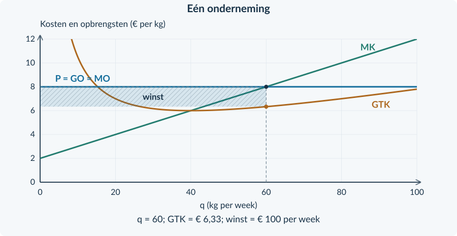<figcaption>Figuur 3. Breedte: 60 kg per week. Hoogte: € 8 − € 6,33… per kg. De oppervlakte is € 100 per week.</figcaption></figure>

**Zo lees je de rechthoek.** Neem eerst de gekozen q. Lees bij diezelfde q de GTK af. Het verschil tussen P en GTK is de winst per kg. Vermenigvuldig dat verschil met q.

De GTK-lijn daalt eerst: dezelfde constante kosten worden over meer kg verdeeld. Bij grotere q gaan de stijgende variabele kosten per kg overheersen. Zo ontstaat het lage punt in GTK.

Reken met ongeronde GTK, of gebruik TO − TK. Zo voorkom je afrondingsverschillen.

<b>Waarom hier wél een oppervlakte?</b> In Boek 2 stonden TO en TK als <b>totaalbedragen</b> op de verticale as. Winst was daar een verticale afstand. Hier staan bedragen <b>per kg</b> op de as. Hoogte × breedte geeft nu het totaal.

Het kleinste GTK is niet automatisch de winstmaximale q. De gekozen q volgt eerst uit MO en MK; daarna gebruik je GTK om het winstbedrag te berekenen.

<!-- PAGE {"section": "3.2.2", "title": "Eén volledige berekening"} -->

## Uitgewerkt voorbeeld
**Theeverpakker Linde.** P = € 10 per kg. TK = 0,10q² + 2q + 40. q is kg per week; TK is euro per week. De capaciteit is 50 kg. De € 40 is deze week onvermijdbaar, ook bij q = 0.

**1 · Marginale kosten.** MK = 0,20q + 2.

**2 · Kies en controleer q.** 10 = 0,20q + 2 → q = 40. Bij q = 35 is MK = 9; bij q = 45 is MK = 11. De winst stijgt vóór 40 en daalt erna. 40 past binnen de capaciteit.

**3 · Bereken totale winst en GTK.**

TO = 10 × 40 = € 400 per week TK = 0,10 × 40² + 2 × 40 + 40 = € 280 Winst = 400 − 280 = € 120 per week GTK = 280 / 40 = € 7 per kg

<figure>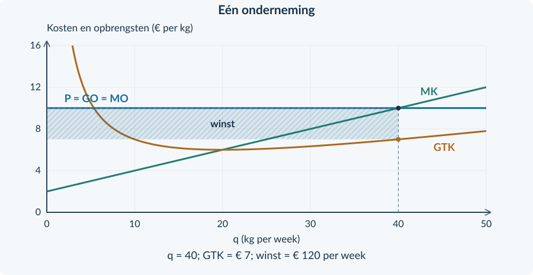<figcaption>Figuur 4. De winstrechthoek heeft breedte 40 en hoogte 10 − 7 = 3.</figcaption></figure>

**4 · Controleer een grens.** Bij q = 0 is de winst −€ 40. Bij een lagere capaciteit van 30 kg zou q = 40 niet haalbaar zijn. Dan kiest Linde q = 30, omdat MO tot die grens groter blijft dan MK.

<b>Onthouden</b> P → MO; TK → MK; vergelijk MO en MK; controleer capaciteit; bereken TO − TK; teken de winst met P en GTK bij de gekozen q.

<!-- PAGE {"section": "3.2.2", "title": "Opbrengst en kosten weer bij elkaar"} -->

## Startopgaven

<b>Korte route:</b> Startopgaven → Zelfstandige oefening → Doeloefening. Extra hulp nodig? Maak eerst Begeleide inoefening.

<b>Opgave 11 · De bekende bouwstenen</b>

Een producent ontvangt € 9 per kg. Bij q = 40 zijn TK = € 280. Bij q = 50 zijn TK = € 350. Totale bedragen zijn per week.

<b>a.</b> Bereken TO, GTK en winst bij q = 40.

<b>b.</b> Bereken MK over de tabelstap van 40 naar 50 kg en vergelijk dit met MO.

<b>Opgave 12 · Een maximum herkennen</b>

Een onderneming heeft MO = 12. Bij q = 60 is MK = 10 en bij q = 100 is MK = 14. Tussen deze punten stijgt MK.

<b>a.</b> Is een kleine uitbreiding rond q = 60 gunstig voor de winst? En rond q = 100?

<b>b.</b> Waarom zoek je het winstmaximum tussen deze hoeveelheden, als de capaciteit groot genoeg is?

## Begeleide inoefening

Heb je deze hulp niet nodig? Ga dan verder met Zelfstandige oefening.

<b>Opgave 13 · Term voor term</b>

Een zadenhandel heeft TK = 0,05q² + 3q + 60. q is kg per week.

<b>a.</b> Vul aan: de afgeleide van 0,05q² is …; van 3q is …; van 60 is … . Schrijf MK op.

<b>b.</b> P = € 9 per kg. Vul aan: 9 = …q + … . Bereken de kandidaat-q.

<b>c.</b> De capaciteit is 80 kg. Controleer de haalbaarheid en leg met stijgende MK uit waarom je een maximum vindt.

<!-- PAGE {"section": "3.2.2", "title": "Berekenen, tekenen en verklaren"} -->

Begeleide inoefening · vervolg

<b>Opgave 14 · Gedroogde kruiden</b>

Voor één kleine leverancier geldt TK = 0,05q² + 4q + 180. P = € 12 per kg. q is kg per week; de capaciteit is 120 kg.

<b>a.</b> Stel MK op en los MO = MK op. Controleer of q haalbaar is.

<b>b.</b> Bereken TO, TK en winst. Gebruik eerst q² en vermenigvuldig daarna met 0,05.

<b>c.</b> Bereken GTK. Markeer q in de grafiek en arceer de winstrechthoek. Noteer de breedte en hoogte.

<figure>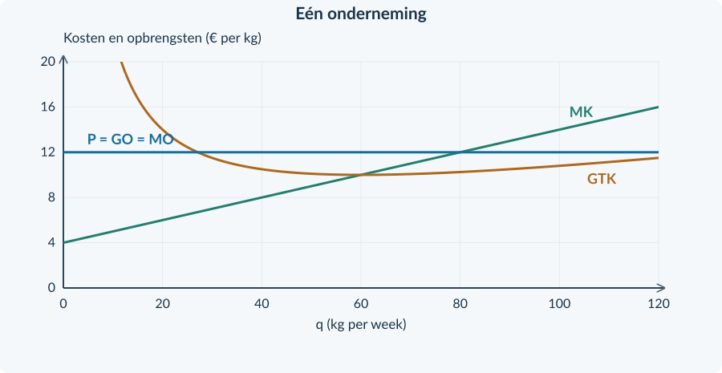<figcaption>Figuur 5. Gebruik GTK bij de gekozen q, niet automatisch het laagste punt van GTK.</figcaption></figure>

<b>Opgave 15 · Twee veranderingen tegelijk</b>

Bij dezelfde leverancier stijgt de marktprijs van € 12 naar € 14. Ook stijgen de constante kosten van € 180 naar € 260. Capaciteit en variabele kosten blijven gelijk.

<b>a.</b> Bekijk eerst alleen de prijsstijging. Welke nieuwe q volgt uit MO = MK?

<b>b.</b> Bekijk alleen de hogere constante kosten. Verandert MK? En de winst bij dezelfde q?

<b>c.</b> Welke q kiest de leverancier als beide veranderingen plaatsvinden?

<b>d.</b> Een leerling zegt: “Alle kosten zijn hoger, dus je moet minder produceren.” Leg uit welke kosten hij door elkaar haalt.

<!-- PAGE {"section": "3.2.2", "title": "Nu zonder tussenstappen"} -->

## Zelfstandige oefening

<b>Opgave 16 · Meel van één kwaliteitsklasse</b>

Een kleine molen is prijsnemer. P = € 12 per kg en TK = 0,02q² + 4q + 100. q is kg per week, bedragen zijn euro per week. Capaciteit: 250 kg.

<b>a.</b> Stel MK op. Bepaal de winstmaximale q en onderbouw je keuze met het verloop van MO en MK en de capaciteit.

<b>b.</b> Bereken TO, TK, winst en GTK bij de gekozen q.

<b>c.</b> Markeer q en arceer de winstrechthoek. Benoem breedte, hoogte en de eenheid van de oppervlakte.

<b>d.</b> Waarom is het snijpunt van MO en MK niet zelf het winstbedrag?

<figure>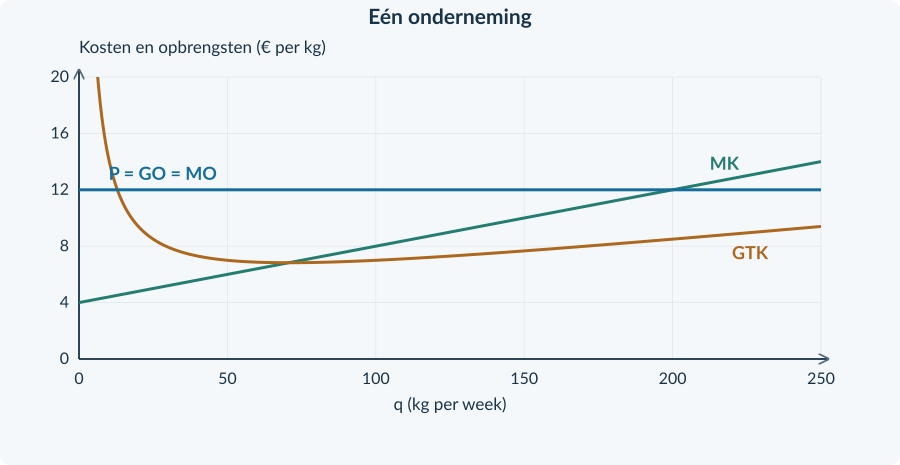<figcaption>Figuur 6. De kosten- en opbrengstlijnen zijn gegeven; de keuze en winstmarkering nog niet.</figcaption></figure>

<b>Controle in je antwoord</b> Een goede oplossing bevat een berekening én een economische reden. Alleen “MO = MK” opschrijven is niet genoeg.

<!-- PAGE {"section": "3.2.2", "title": "Als het snijpunt niet haalbaar is"} -->

Zelfstandige oefening · vervolg

<b>Opgave 17 · Een machine met beperkte capaciteit</b>

Een leverancier van een gestandaardiseerde grondstof ontvangt € 18 per kg. TK = 0,10q² + 2q + 40. q is kg per week. De machine kan maximaal 60 kg per week verwerken. De € 40 is deze week onvermijdbaar.

<b>a.</b> Bereken welke q je krijgt bij MO = MK. Leg uit waarom de onderneming deze q niet kan kiezen.

<b>b.</b> Bepaal de beste haalbare q. Bereken MK bij de capaciteit en gebruik de vergelijking met MO.

<b>c.</b> Bereken de winst bij je gekozen q. Vergelijk met de winst bij q = 0.

<b>d.</b> Beoordeel: “Als MO nergens binnen de capaciteit gelijk is aan MK, bestaat er geen winstmaximum.”

<b>Welke vraag stel je eerst?</b> Niet: “Waar kruisen twee lijnen?” Wel: “Welke productie is haalbaar, en bij welke productie kan ik de winst niet meer verhogen?”

<figure>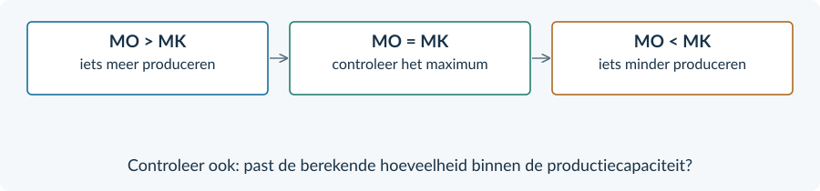<figcaption>Figuur 7. De vergelijking helpt bij de keuze; een onhaalbare productie valt af.</figcaption></figure>

### Check je werkwijze
Vergelijk je q met de **productiecapaciteit** voordat je TO en TK uitrekent. Een juiste berekening bij een onhaalbare q is nog geen bruikbaar antwoord.

Controleer bij een capaciteitsgrens of meer produceren tot die grens nog gunstig is. Een grens is niet altijd automatisch het beste punt: de marginale vergelijking blijft nodig.

<!-- PAGE {"section": "3.2.2", "title": "Een productieadvies onderbouwen"} -->

## Doeloefening

<b>Opgave 18 · Korrels voor kwekerijen</b>

Een prijsnemende producent verkoopt één standaardkwaliteit korrels. P = € 16 per kg. TK = 0,04q² + 4q + 400. q is kg per week, TK is euro per week. Capaciteit: 200 kg. De € 400 is deze week onvermijdbaar.

<b>a.</b> (2p) Stel de functie voor MK op.

<b>b.</b> (3p) Bepaal de winstmaximale haalbare q. Onderbouw het maximum met MK links en rechts van je uitkomst.

<b>c.</b> (3p) Bereken TO, TK en totale winst bij de gekozen q.

<b>d.</b> (3p) Bereken GTK en geef in de grafiek q en de winstrechthoek aan. Benoem breedte en hoogte.

<b>e.</b> (1p) Vergelijk de winst met niet produceren (q = 0).

<b>f.</b> (2p) Door een storing wordt de capaciteit 120 kg. Kostenfunctie en prijs blijven gelijk. Welke q kies je nu? Licht toe; een nieuwe winstberekening is niet nodig.

<figure><figcaption>Figuur 8. Alle verticale bedragen zijn per kg. De horizontale as geeft de productie per week.</figcaption></figure>

<!-- PAGE {"section": "3.2.2", "title": "Wat vertellen constante kosten?"} -->

## Denkertje / Bonusopgave

<b>Opgave 19 · Dezelfde MK, andere winst</b>

Twee kleine ondernemingen krijgen P = € 8 per kg. A heeft TK = 0,10q² + 2q + 40. B heeft TK = 0,10q² + 2q + 160. Beide hebben capaciteit 50 kg; hun constante kosten zijn deze week onvermijdbaar.

<b>a.</b> Beoordeel: “B heeft hogere kosten en moet dus een kleinere q kiezen.” Onderbouw je oordeel met een berekening.

<b>b.</b> Kunnen beide ondernemingen bij dezelfde q toch een verschillende winst hebben? Laat dit zien en beperk je conclusie tot deze week.

## Herhaling / Herhaling en interleaving

<b>Opgave 20 · Procenten en prijsgevoeligheid</b>

De prijs van een abonnement stijgt van € 8 naar € 10. De gevraagde hoeveelheid daalt met 10%.

<b>a.</b> Bereken de procentuele prijsstijging en de prijselasticiteit Ev.

<b>b.</b> Is de vraag prijsinelastisch of prijselastisch? Gebruik de absolute waarde.

<b>Opgave 21 · Belastingwig</b>

Na een belasting betalen kopers € 11. Verkopers ontvangen na afdracht € 8. Er worden 200 producten per week verhandeld.

<b>a.</b> Bereken de belasting per product en de belastingopbrengst per week.

<b>b.</b> Waarom is die belastingopbrengst niet hetzelfde als welvaartsverlies?

<!-- PAGE {"section": "3.2.3", "title": "Winst trekt aanbieders aan"} -->

3.2.3 · LANGETERMIJNEVENWICHT

# Hoe lang blijft de winst?
Een onderneming kan deze week winst maken. Wat gebeurt er als anderen dezelfde productiemethode kunnen gebruiken en ook op deze markt mogen beginnen?

<b>Lesdoelen</b> Je kunt de keten winst → toetreding → aanbod → prijs → winst uitleggen, en de omgekeerde keten bij verlies. Je kunt de verschuiving tekenen en de langetermijnuitkomst voor één onderneming berekenen. Je kunt uitleggen wat nul economische winst wél en niet betekent.

### Eerst één afspraak over het woord winst
Ook de inzet van de ondernemer heeft een prijs. Denk aan een normale vergoeding voor zijn werk en het gebruik van eigen geld.

In de modellen van deze paragraaf zijn zulke **normale beloningen al opgenomen in TK**. Wat na aftrek van alle kosten overblijft, noemen we **economische winst**. Een positieve uitkomst is extra winst boven die normale beloning: ook wel overwinst.

Economische winst = TO − TK Hier bevat TK ook de normale beloning.

<figure><figcaption>Figuur 1. Vrije toetreding maakt een winstgevende markt aantrekkelijk voor nieuwe aanbieders.</figcaption></figure>

De **korte termijn** is hier de periode vóór bedrijven kunnen toe- of uittreden. Op de **lange termijn** kan het aantal bedrijven zich aanpassen. Het gaat dus om mogelijkheden, niet om een vast aantal maanden.

<!-- PAGE {"section": "3.2.3", "title": "Meer aanbod, minder winst per bedrijf"} -->

### Volg de verandering van links naar rechts
We keren terug naar de kruidenzaden uit §3.2.2. TK = 0,05q² + 2q + 80. Eerst is P = € 8 en kiest één bedrijf q = 60. De winst is € 100 per week.

Nieuwe bedrijven treden toe. Bij elke prijs wordt nu méér aangeboden: de marktaanbodlijn verschuift naar rechts. De marktvraag blijft gelijk. Daardoor daalt de prijs.
<figure><figcaption>Figuur 2. De stippellijnen horen bij de oude situatie. Door toetreding groeit Q, terwijl de productie q van één bedrijf daalt.</figcaption></figure>

### De markt en één onderneming bewegen niet hetzelfde
De totale afzet stijgt van 6.000 naar 9.000 kg per week. Eén onderneming verlaagt haar afzet van 60 naar 40 kg. Er zijn immers méér ondernemingen die de markt bedienen.

Bij P = 6 en q = 40 zijn TO = 6 × 40 = € 240 en TK = 0,05 × 40² + 2 × 40 + 80 = € 240. De economische winst is nul.

<b>Aannames bij deze uitkomst</b> Vrije toetreding, dezelfde kosten voor bestaande en nieuwe bedrijven, ongewijzigde vraag en geen stijgende inputprijzen door toetreding. De kostenfuncties van actieve ondernemingen blijven gelijk.

<!-- PAGE {"section": "3.2.3", "title": "Verlies kan tot uittreding leiden"} -->

### De omgekeerde aanpassing
Op een andere oefenmarkt heeft elke actieve onderneming TK = 0,10q² + 2q + 40. Capaciteit: 50 kg per week. Bij P = € 5 is de beste productie q = 15 kg.

TO = € 75 en TK = € 92,50. De onderneming maakt € 17,50 economisch verlies. Als dit aanhoudt, worden sommige bedrijven beëindigd. Bij elke prijs neemt het totale aanbod af: A verschuift naar links.
<figure><figcaption>Figuur 3. Na uittreding stijgt de prijs. Een overblijvend bedrijf gaat van 15 naar 20 kg per week.</figcaption></figure>

Bij P = € 6 is q = 20, TO = € 120 en TK = € 120. Het verlies verdwijnt. Dit is dezelfde nulwinstuitkomst als bij toetreding, maar vanuit de andere richting.

<b>Verlies betekent niet: vandaag direct stoppen</b> De lange termijn gaat over blijven of verdwijnen uit de markt. Deze week kunnen kosten nog onvermijdbaar zijn. Trek uit een verlies dus niet zonder extra gegevens een conclusie over onmiddellijk stilleggen.

Ook hier gelden vrije uittreding, gelijkblijvende vraag en dezelfde onveranderde kosten voor actieve bedrijven. Niet ieder bedrijf hoeft te verdwijnen.

<!-- PAGE {"section": "3.2.3", "title": "Het eindpunt van de aanpassing"} -->

## Uitgewerkt voorbeeld
**Blanco karton.** Alle ondernemingen gebruiken dezelfde kostenfunctie: TK = 0,10q² + 2q + 40. Capaciteit: 50 kg per week. In TK zit de normale beloning. De beginprijs is € 8. Toetreding is vrij; vraag en kosten veranderen niet.

**1 · Beginuitkomst.** MK = 0,20q + 2. Bij MO = 8 volgt q = 30. TO = 240 en TK = 90 + 60 + 40 = 190. Winst = € 50 per week.

**2 · Leg de aanpassing uit.** Overwinst trekt bedrijven aan → A verschuift rechts → de prijs daalt → de winst van één bedrijf daalt.

**3 · Lees het eindpunt.** Het minimum van GTK is € 6 bij q = 20. Bij P = 6 vallen MO, MK en GTK daar samen.
<figure><figcaption>Figuur 4. Bij de onderste prijs is de winstrechthoek verdwenen: de hoogte is nul.</figcaption></figure>

**4 · Controleer en interpreteer.** TO = 6 × 20 = 120. TK = 0,10 × 20² + 2 × 20 + 40 = 120. Winst = 0. Er is geen extra beloning om toetreding aan te trekken. De normale beloning wordt nog steeds betaald.

<b>Onthouden</b> Onder onze aannames eindigt de aanpassing bij P = MO = MK = minimum GTK. TO = TK, maar TO is niet nul. Nul economische winst betekent niet dat de ondernemer gratis werkt.

<!-- PAGE {"section": "3.2.3", "title": "Haal de oorzaak en het gevolg terug"} -->

## Startopgaven

<b>Korte route:</b> Startopgaven → Zelfstandige oefening → Doeloefening. Extra hulp nodig? Maak eerst Begeleide inoefening.

<b>Opgave 22 · Nog één productieadvies</b>

P = € 8. TK = 0,10q² + 2q + 40. q is kg per week; capaciteit is 50 kg.

<b>a.</b> Stel MK op en bepaal de winstmaximale q.

<b>b.</b> Bereken TO, TK en winst. Wat is GTK bij die q?

<b>Opgave 23 · Een nul met betekenis</b>

De totale opbrengst van een onderneming is € 1.000 per week. Haar totale kosten zijn ook € 1.000. Daarin zit € 180 normale vergoeding voor de ondernemer.

<b>a.</b> Hoe groot is de economische winst?

<b>b.</b> Waarom klopt “de ondernemer krijgt niets” niet?

## Begeleide inoefening

Heb je deze hulp niet nodig? Ga dan verder met Zelfstandige oefening.

<b>Opgave 24 · Bouw de keten</b>

Bekijk figuur 2 op pagina 23. Vraag en kosten van één onderneming blijven gelijk.

<b>a.</b> Vul in: overwinst → meer bedrijven → marktaanbod naar … → P … → winst per bedrijf … .

<b>b.</b> Lees de oude en nieuwe Q af. Lees daarna de oude en nieuwe q af. Leg uit waarom de richtingen verschillen.

<b>c.</b> Gebruik de uitkomsten P = 6 en q = 40 om de nulwinst te controleren met TK = 0,05q² + 2q + 80.

<!-- PAGE {"section": "3.2.3", "title": "De richting zelf tekenen"} -->

Begeleide inoefening · vervolg

<b>Opgave 25 · Een markt met verlies</b>

Gebruik de markt op pagina 24, nu zonder de nieuwe lijnen. Alle bedrijven hebben TK = 0,10q² + 2q + 40. Vraag en kosten blijven gelijk. Vrije uittreding is mogelijk.

<b>a.</b> Bij P = 5 en q = 15 is er verlies. Vul de eerste stap in: een deel van de bedrijven zal op langere termijn … .

<b>b.</b> Teken A₁ aan de juiste kant van A. Laat het nieuwe evenwicht bij P = 6 liggen. Label A₁ en E₁.

<b>c.</b> Teken rechts de nieuwe horizontale lijn P = GO = MO. Lees de bijbehorende q af en controleer TO = TK.

<b>d.</b> Leg uit waarom de GTK-lijn van de overblijvende onderneming niet verschuift.

<figure><figcaption>Figuur 5. Verander de marktaanbodlijn en de prijs. De kosten van één actief bedrijf blijven gelijk.</figcaption></figure>

<b>Dezelfde woorden, andere grootheden</b> “Minder bedrijven” gaat over de markt. “Meer productie bij een overblijvend bedrijf” gaat over q. Een goede uitleg maakt dat verschil zichtbaar.

<!-- PAGE {"section": "3.2.3", "title": "Een nieuwe markt analyseren"} -->

## Zelfstandige oefening

<b>Opgave 26 · Rijstmeel</b>

Veel kleine ondernemingen hebben TK = 0,10q² + 2q + 40, inclusief normale beloning. Capaciteit: 50 kg per week. De beginprijs is € 8. Het minimum GTK is € 6 bij q = 20. Vraag en kosten blijven gelijk; toetreding is vrij.

<b>a.</b> Bereken de beginproductie en economische winst van één onderneming.

<b>b.</b> Leg de langetermijnaanpassing uit. Teken een passende nieuwe aanbodlijn en de nieuwe prijslijn in de grafieken.

<b>c.</b> Bereken de totale opbrengst en winst van één onderneming in het langetermijnevenwicht.

<figure><figcaption>Figuur 6. Gebruik links de marktvraag; gebruik rechts de kosten van één onderneming.</figcaption></figure>

<b>Opgave 27 · Sommige bedrijven verdwijnen</b>

Op een andere markt geldt TK = 0,05q² + 2q + 80 en P = € 5. q is kg per week. De beste haalbare q is 30. Kosten zijn inclusief normale beloning. Vrije uittreding is mogelijk.

<b>a.</b> Bereken de economische winst. Verwacht je bij aanhoudende omstandigheden toetreding of uittreding?

<b>b.</b> Beschrijf de richting van het marktaanbod en de prijs. Noem één aanname die je voor deze redenering nodig hebt.

<!-- PAGE {"section": "3.2.3", "title": "Van winst naar langetermijnevenwicht"} -->

## Doeloefening

<b>Opgave 28 · Standaard koffiebonen</b>

In deze oefenmarkt gebruiken alle bedrijven TK = 0,02q² + 4q + 200. q is kg per week; capaciteit is 250 kg. TK bevat alle kosten, inclusief € 120 normale ondernemersbeloning per week. Toetreding is vrij. Marktvraag, technologie en inputprijzen blijven gelijk. Het minimum GTK is € 8 bij q = 100.

<b>a.</b> (3p) Lees de beginprijs af. Stel MK op, bepaal q en bereken de economische winst van één bedrijf.

<b>b.</b> (2p) Leg uit waarom er bedrijven toetreden en hoe dit de prijs beïnvloedt.

<b>c.</b> (2p) Teken in de marktgrafiek een passende A₁ voor de langetermijnprijs. Teken rechts de bijbehorende P = GO = MO-lijn. Laat de kostencurven staan.

<b>d.</b> (3p) Bepaal de langetermijnprijs en q. Bereken TO en TK en controleer de economische winst.

<b>e.</b> (2p) Een leerling zegt: “Met nul winst verdient de ondernemer niets en is de omzet verdwenen.” Weerleg beide delen met de gegevens.

<figure><figcaption>Figuur 7. Geef de langetermijnaanpassing aan, onder de aannames van de bron.</figcaption></figure>

<!-- PAGE {"section": "3.2.3", "title": "De grens van de conclusie"} -->

## Denkertje / Bonusopgave

<b>Opgave 29 · Niet iedereen heeft dezelfde kosten</b>

In een markt is het minimum GTK van een bestaand bedrijf € 10. Een nieuw bedrijf gebruikt een goedkopere methode en heeft minimum GTK = € 8.

<b>a.</b> Welke aanname uit onze langetermijnmodellen is nu niet geldig?

<b>b.</b> Waarom kun je zonder meer informatie niet zeggen dat beide bedrijven bij dezelfde prijs precies nul economische winst maken? Je hoeft geen nieuw langetermijnevenwicht te berekenen.

## Herhaling / Herhaling en interleaving

<b>Opgave 30 · De eenheid van de oppervlakte</b>

In een ondernemingsgrafiek is P = € 12 per kg en GTK = € 9 per kg bij q = 200 kg per week.

<b>a.</b> Bereken de winst met de rechthoek en benoem de eenheden van breedte en hoogte.

<b>b.</b> Is het resultaat producentensurplus? Leg uit waarom de gebruikte berekening totale winst geeft.

<b>Opgave 31 · Een minimumprijs</b>

Vraag: P = 14 − 0,10Q. Aanbod: P = 2 + 0,10Q. P is euro per product; Q is producten per week. Er komt een minimumprijs van € 10; de overheid koopt niets op.

<b>a.</b> Bereken Qv, Qa en het aanbodoverschot bij de minimumprijs.

<b>b.</b> Hoeveel producten worden daadwerkelijk verkocht? Leg uit waarom dit niet Qa is.

<!-- PAGE {"section": "3.2.4", "title": "Markt en onderneming combineren"} -->

3.2.4 · GEMENGDE OPGAVEN: VOLKOMEN CONCURRENTIE

# Welke stap heb je nodig?
Je combineert nu de technieken uit het hoofdstuk. Er komen geen nieuwe begrippen of rekenregels bij. Let vooral op **voor welk bedrijf of welke markt**, en **op welk tijdstip**, de gegevens gelden.

<b>Doel</b> Je kunt vanuit een marktverandering de nieuwe ondernemingsbeslissing berekenen. Daarna kun je onder de gegeven aannames de langetermijnaanpassing uitleggen.

<b>Opgave 32 · Twee bronnen over meel</b>

<b>Bron A.</b> De vraag op een markt is Qv = 12.000 − 1.000P. Het aanbod is Qa = 2.000P. Q is kg per week; P is euro per kg. <b>Bron B.</b> Een kleine molen verkoopt dezelfde kwaliteit als de andere molens. Hij kan maximaal 150 kg per week leveren. Kopers kennen alle prijzen.

<b>a.</b> Bereken de marktprijs en de markthoeveelheid.

<b>b.</b> Bereken TO bij q = 100 en geef GO en MO. Leg uit waarom Q en q hier verschillen.

<b>c.</b> De molen plakt een prijs van € 4,50 op hetzelfde product. Leg uit waarom dat in dit model niet werkt.

<b>Werkwijze</b> Gebruik een bron waar die iets over zegt. Een marktvergelijking geeft nog geen productieadvies voor één onderneming; daarvoor heb je ook de kosten van die onderneming nodig.

<!-- PAGE {"section": "3.2.4", "title": "Rekenen met de juiste gegevens"} -->

### Oefenen met een ondernemingsbron

<b>Opgave 33 · Vezels voor verpakkingen</b>

Een prijsnemer ontvangt € 14 per kg. Voor zijn kosten geldt TK = 0,05q² + 4q + 200. q is kg per week; capaciteit: 140 kg. Alle productie kan tegen deze prijs worden verkocht. Constante kosten zijn deze week onvermijdbaar.

<b>a.</b> Stel MK op. Bepaal de beste haalbare q en controleer of de winst vóór en na die q stijgt of daalt.

<b>b.</b> Bereken TO, TK, winst en GTK bij deze q.

<b>c.</b> Beschrijf precies welke rechthoek de winst in een ondernemingsgrafiek zou weergeven. Je hoeft de grafiek niet opnieuw te tekenen.

<b>d.</b> Een leerling kiest de q met het laagste GTK. Leg uit waarom die methode bij deze marktprijs niet automatisch de hoogste totale winst geeft.

### Controleer je antwoord als één geheel
Je gevonden hoeveelheid, je kostenberekening en je omschrijving van de rechthoek moeten bij **dezelfde q** horen.

Een berekening kan op zichzelf juist zijn en toch niet bij de opgave passen. Bijvoorbeeld doordat je een markthoeveelheid in een ondernemingsfunctie invult, of GTK bij een andere q afleest.

<b>Drie controles</b> Is q haalbaar? Is de winst een totaalbedrag per week? En hoort de hoogte van de rechthoek bij GTK op precies deze q?

<!-- PAGE {"section": "3.2.4", "title": "Een claim toetsen"} -->

### Kies zelf de juiste onderbouwing

<b>Opgave 34 · De ruimte is de grens</b>

Een onderneming heeft MK = 0,20q + 4 en P = € 20 per kg. Zij kan maximaal 60 kg per week produceren. Haar constante kosten zijn deze week onvermijdbaar.

<b>a.</b> Bereken het snijpunt van MO en MK en bepaal de beste haalbare q.

<b>b.</b> Leg uit waarom verder zoeken naar een snijpunt binnen de capaciteit niet nodig is.

<b>c.</b> Welke extra kostengegevens heb je nodig om het totale winstbedrag te berekenen?

<b>Opgave 35 · Het aantal bedrijven verandert</b>

Ondernemingen produceren hetzelfde product met dezelfde onveranderde kosten. Het minimum GTK is € 8 per kg. Bij de huidige prijs van € 10 maken zij overwinst. Vraag blijft gelijk; toe- en uittreding zijn vrij.

<b>a.</b> Beschrijf de verwachte keten van toetreding tot de uiteindelijke prijs.

<b>b.</b> Noem de relatie tussen P, MO, MK en GTK in het langetermijnevenwicht.

<b>c.</b> Beoordeel: “Als er steeds meer bedrijven komen, wordt de uiteindelijke economische winst van ieder actief bedrijf negatief.”

<b>Voor de doeloefening</b> Daarna volgt één markt met drie momenten: vóór een vraagverandering, direct erna en na toetreding. De bronnen staan links; de vragen staan rechts.

<!-- PAGE {"section": "3.2.4", "title": "Bronnen bij de doeloefening"} -->

## Doeloefening
### Opgave 36 · Kweekkorrels op drie momenten

<b>Bron A · De markt</b> Veel kleine bedrijven verkopen dezelfde kwaliteit kweekkorrels. Kopers kennen de prijzen. In de beginsituatie geldt: <b>Qv₀ = 30.000 − 2.500P</b> en <b>Qa₀ = 2.500P − 10.000</b>. Door een nieuwe toepassing neemt de vraag toe tot <b>Qv₁ = 50.000 − 2.500P</b>. Direct daarna zijn er nog geen bedrijven toegetreden: Qa₀ blijft gelden. Q is kg per week; P is euro per kg.

<b>Bron B · Eén onderneming</b> Voor iedere onderneming geldt <b>TK = 0,02q² + 4q + 200</b>. q is kg per week; capaciteit is 250 kg. De kosten zijn inclusief normale beloning. Alle productie wordt verkocht. Het minimum GTK is € 8 per kg bij q = 100.

<b>Bron C · Later</b> Na verloop van tijd kunnen bedrijven vrij toetreden of uittreden. Nieuwe bedrijven hebben dezelfde kosten. Vraag blijft Qv₁. Technologie en inputprijzen blijven gelijk. Bestaande bedrijven houden dezelfde productiecapaciteit.

<figure><figcaption>Figuur 1. Gebruik deze basisgrafieken. Markt: V₀, V₁ en A₀. Onderneming: MK en GTK.</figcaption></figure>

De vragen staan op de rechterpagina. Gebruik eerst de beginsituatie, daarna de situatie vóór toetreding en ten slotte de lange termijn. Laat tussenresultaten staan.

<!-- PAGE {"section": "3.2.4", "title": "Vragen bij de doeloefening"} -->

<b>Opgave 36 · Kweekkorrels: van markt naar bedrijf</b>

Gebruik bronnen A, B en C en figuur 1 op de linkerpagina.

<b>a.</b> (3p) Bereken in de beginsituatie P₀ en Q₀. Eén onderneming kiest dan q = 100. Controleer met TO en TK dat haar economische winst nul is.

<b>b.</b> (2p) Bereken direct na de vraagstijging, vóór toetreding, P₁ en Q₁. Markeer het nieuwe evenwicht E₁ in de marktgrafiek.

<b>c.</b> (3p) Stel MK op. Bepaal bij P₁ de winstmaximale q van één onderneming. Controleer de capaciteit en het verloop van MO en MK.

<b>d.</b> (3p) Bereken de economische winst en GTK bij die q. Teken rechts de nieuwe P = GO = MO-lijn en arceer de winstrechthoek.

<b>e.</b> (3p) Leg met bron C de langetermijnaanpassing uit. Bepaal de uiteindelijke prijs, de totale markthoeveelheid en q van één onderneming.

<b>f.</b> (2p) Beoordeel: “De markt wordt groter, dus elk oorspronkelijk bedrijf blijft op lange termijn meer produceren dan vóór de vraagstijging.” Vergelijk de drie q-uitkomsten en onderscheid die van Q.

<b>Afronden</b> Bereken met ongeronde tussenuitkomsten. Schrijf bij iedere hoeveelheid of deze bij de markt of één onderneming hoort. De ruimte hieronder kun je gebruiken voor je redenering.

<!-- PAGE {"section": "3.2.4", "title": "De aanname achter het eindpunt"} -->

## Denkertje / Bonusopgave

<b>Opgave 37 · Toetreding wordt duurder</b>

In opgave 36 bleven inputprijzen gelijk. Stel nu dat toetreding grond schaarser maakt. Daardoor stijgen de kosten van álle ondernemingen. Nieuwe minimum-GTK-waarden zijn niet gegeven.

<b>a.</b> Welk onderdeel van het oude langetermijnantwoord mag je niet zonder meer overnemen?

<b>b.</b> Geef aan wat je nog wél kunt uitleggen en voor welk getal je aanvullende informatie nodig hebt. Je hoeft geen nieuwe kostenfunctie te bedenken.

## Herhaling / Herhaling en interleaving

<b>Opgave 38 · Een laatste vergelijking</b>

Een ondernemer ontvangt P = € 12 per kg. Bij q = 100 zijn TO = € 1.200 en TK = € 1.000. Als q stijgt naar 110, neemt TO toe met € 120 en TK met € 150. Alle totale bedragen zijn per week.

<b>a.</b> Bereken GTK en winst bij q = 100.

<b>b.</b> Bereken MO en MK over de toename van 100 naar 110 kg. Neemt de winst over deze stap toe of af?

<b>c.</b> Waarom betekent een positieve totale winst bij q = 100 niet automatisch dat méér productie nog beter is?

<b>Je antwoord is af als…</b> Je niet alleen een uitkomst hebt, maar ook kunt aanwijzen welk marktmechanisme of welke marginale vergelijking erbij hoort.

<!-- PAGE {"section": "3.2", "title": "Het hoofdstuk in één overzicht"} -->

# Het hoofdstuk in één overzicht
<figure>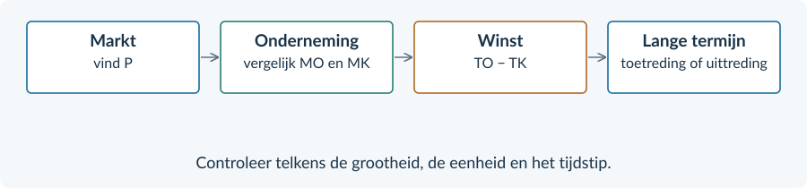<figcaption>Van marktprijs naar productie, winst en aanpassing. De stappen horen bij verschillende vragen.</figcaption></figure>

| De vraag | Jouw aanpak | Belangrijkste controle |
|---|---|---|
| Welke prijs krijgt het bedrijf? | Lees of bereken het marktevenwicht. Neem P over. | Q van de markt is niet q van het bedrijf. |
| Wat zijn GO en MO? | Bij één vaste prijs: P = GO = MO. | TO is niet constant: TO = P × q. |
| Welke q geeft de hoogste winst? | Maak MK. Vergelijk MO en MK. | Controleer stijgen/dalen, q ≥ 0 en capaciteit. |
| Hoe groot is de winst? | TO − TK of (P − GTK) × q. | Lees GTK bij de gekozen q; rond pas op het einde. |
| Wat gebeurt er op lange termijn? | Overwinst trekt toetreders; aanhoudend verlies leidt tot uittreding. | Vraag, kosten en toegang moeten aan de aannames voldoen. |

### De beperkte afgeleidenregel

TK = a × q² + b × q + c → MK = 2a × q + b

### Het langetermijnevenwicht in dit hoofdstuk

P = GO = MO = MK = minimum GTK TO = TK → economische winst = 0

Die laatste uitkomst geldt onder de genoemde aannames. De normale beloning zit al in TK. Nul economische winst is dus iets anders dan nul inkomen of nul omzet.

<!-- PAGE {"section": "3.2", "title": "Begrippen en terugzoeken"} -->

# Begrippen en terugzoeken
| Begrip | Betekenis | Pagina |
|---|---|---:|
| Volkomen concurrentie | Marktmodel met veel kleine deelnemers, een homogeen product, informatie en vrije toe- en uittreding. | 2 |
| Prijsnemer | Onderneming die de marktprijs als gegeven neemt. | 2 |
| Q en q | Q: totale markthoeveelheid. q: afzet of productie van één onderneming. | 3 |
| TO | Totale opbrengst: P × q, in euro per periode. | 4 |
| GO | Gemiddelde opbrengst: TO / q, in euro per product. | 4 |
| MO | Extra opbrengst per extra product; bij een vaste prijs gelijk aan P. | 4 |
| MK | Extra kosten per extra product; in het doorlopende model de afgeleide van TK. | 11 |
| Differentiëren | Hier: uit aq² + bq + c de afgeleide 2aq + b maken. | 12 |
| Productiecapaciteit | Grootste hoeveelheid die een bedrijf in de gegeven periode kan produceren. | 13 |
| Winstmaximalisatie | De beste haalbare productie kiezen met een marginale vergelijking en grenscontrole. | 13 |
| GTK | Gemiddelde totale kosten: TK / q. Gebruik de gekozen q. | 14 |
| Economische winst | TO min alle economische kosten, inclusief normale beloning. | 22 |
| Toetreding / uittreding | Bedrijven komen op de markt / verdwijnen uit de markt. | 22–24 |
| Langetermijnevenwicht | Onder onze aannames: geen prikkel meer tot toe- of uittreding en nul economische winst. | 25 |

### Voor je verdergaat
Kun je aanwijzen welk getal van de markt naar het bedrijf gaat? Kun je uitleggen waarom de hoogste omzet niet altijd de hoogste winst geeft? En kun je nul economische winst uitleggen zonder te zeggen dat de ondernemer niets ontvangt?

Het volgende hoofdstuk gaat over **internationale handel**. Het prijsnemerschap helpt daar bij het lezen van een wereldmarktprijs. De onderneming met marktmacht komt pas terug in Boek 4.