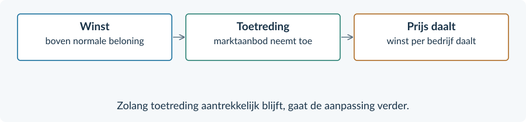
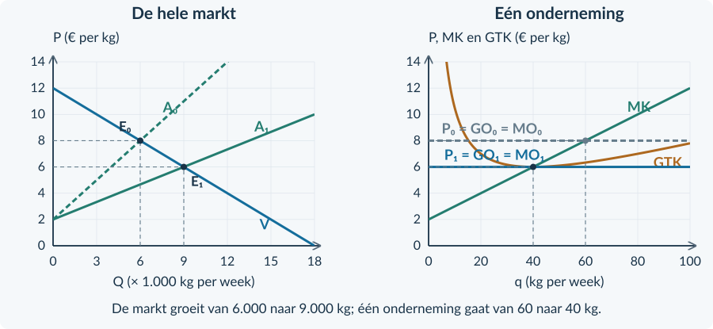
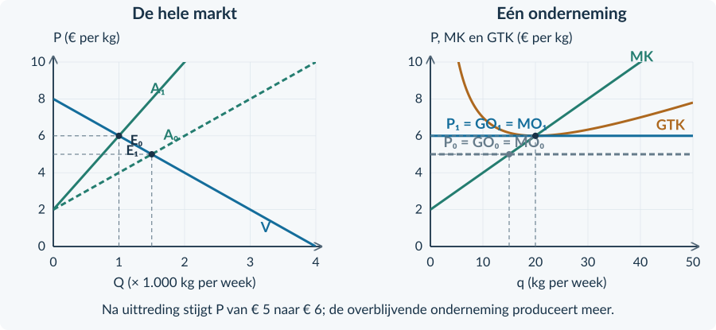
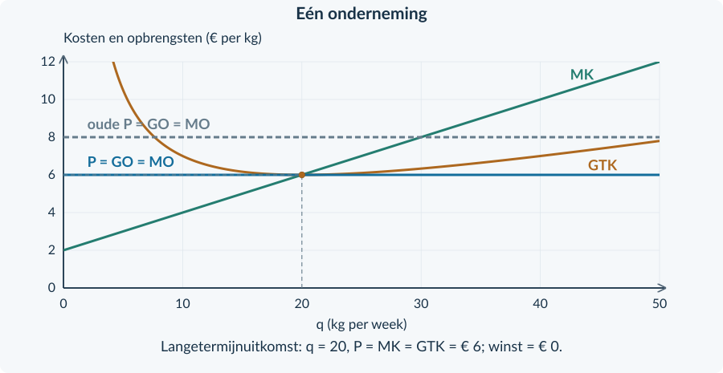
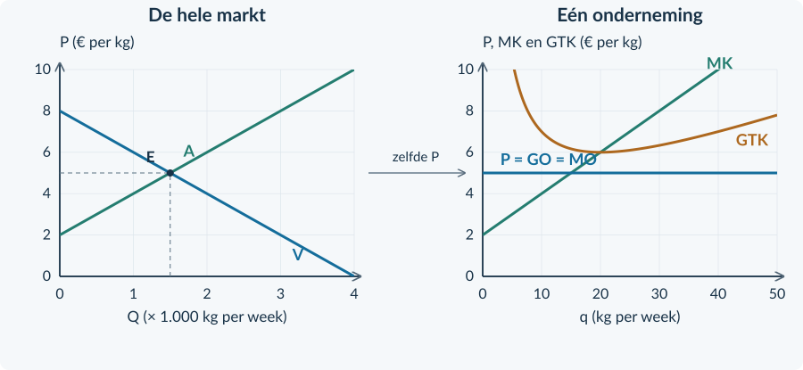
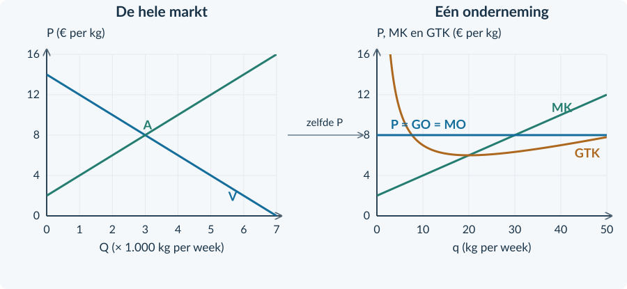
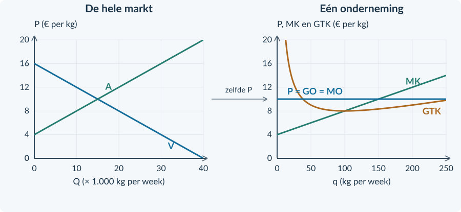

<!-- PAGE {"section": "3.2.3", "title": "Winst trekt aanbieders aan"} -->

3.2.3 · LANGETERMIJNEVENWICHT

# Hoe lang blijft de winst?
Een onderneming kan deze week winst maken. Wat gebeurt er als anderen dezelfde productiemethode kunnen gebruiken en ook op deze markt mogen beginnen?

<b>Lesdoelen</b> Je kunt de keten winst → toetreding → aanbod → prijs → winst uitleggen, en de omgekeerde keten bij verlies. Je kunt de verschuiving tekenen en de langetermijnuitkomst voor één onderneming berekenen. Je kunt uitleggen wat nul economische winst wél en niet betekent.

### Eerst één afspraak over het woord winst
Ook de inzet van de ondernemer heeft een prijs. Denk aan een normale vergoeding voor zijn werk en het gebruik van eigen geld.

In de modellen van deze paragraaf zijn zulke **normale beloningen al opgenomen in TK**. Wat na aftrek van alle kosten overblijft, noemen we **economische winst**. Een positieve uitkomst is extra winst boven die normale beloning: ook wel overwinst.

Economische winst = TO − TK Hier bevat TK ook de normale beloning.

<figure><figcaption>Figuur 1. Vrije toetreding maakt een winstgevende markt aantrekkelijk voor nieuwe aanbieders.</figcaption></figure>

De **korte termijn** is hier de periode vóór bedrijven kunnen toe- of uittreden. Op de **lange termijn** kan het aantal bedrijven zich aanpassen. Het gaat dus om mogelijkheden, niet om een vast aantal maanden.

<!-- PAGE {"section": "3.2.3", "title": "Meer aanbod, minder winst per bedrijf"} -->

### Volg de verandering van links naar rechts
We keren terug naar de kruidenzaden uit §3.2.2. TK = 0,05q² + 2q + 80. Eerst is P = € 8 en kiest één bedrijf q = 60. De winst is € 100 per week.

Nieuwe bedrijven treden toe. Bij elke prijs wordt nu méér aangeboden: de marktaanbodlijn verschuift naar rechts. De marktvraag blijft gelijk. Daardoor daalt de prijs.
<figure><figcaption>Figuur 2. De stippellijnen horen bij de oude situatie. Door toetreding groeit Q, terwijl de productie q van één bedrijf daalt.</figcaption></figure>

### De markt en één onderneming bewegen niet hetzelfde
De totale afzet stijgt van 6.000 naar 9.000 kg per week. Eén onderneming verlaagt haar afzet van 60 naar 40 kg. Er zijn immers méér ondernemingen die de markt bedienen.

Bij P = 6 en q = 40 zijn TO = 6 × 40 = € 240 en TK = 0,05 × 40² + 2 × 40 + 80 = € 240. De economische winst is nul.

<b>Aannames bij deze uitkomst</b> Vrije toetreding, dezelfde kosten voor bestaande en nieuwe bedrijven, ongewijzigde vraag en geen stijgende inputprijzen door toetreding. De kostenfuncties van actieve ondernemingen blijven gelijk.

<!-- PAGE {"section": "3.2.3", "title": "Verlies kan tot uittreding leiden"} -->

### De omgekeerde aanpassing
Op een andere oefenmarkt heeft elke actieve onderneming TK = 0,10q² + 2q + 40. Capaciteit: 50 kg per week. Bij P = € 5 is de beste productie q = 15 kg.

TO = € 75 en TK = € 92,50. De onderneming maakt € 17,50 economisch verlies. Als dit aanhoudt, worden sommige bedrijven beëindigd. Bij elke prijs neemt het totale aanbod af: A verschuift naar links.
<figure><figcaption>Figuur 3. Na uittreding stijgt de prijs. Een overblijvend bedrijf gaat van 15 naar 20 kg per week.</figcaption></figure>

Bij P = € 6 is q = 20, TO = € 120 en TK = € 120. Het verlies verdwijnt. Dit is dezelfde nulwinstuitkomst als bij toetreding, maar vanuit de andere richting.

<b>Verlies betekent niet: vandaag direct stoppen</b> De lange termijn gaat over blijven of verdwijnen uit de markt. Deze week kunnen kosten nog onvermijdbaar zijn. Trek uit een verlies dus niet zonder extra gegevens een conclusie over onmiddellijk stilleggen.

Ook hier gelden vrije uittreding, gelijkblijvende vraag en dezelfde onveranderde kosten voor actieve bedrijven. Niet ieder bedrijf hoeft te verdwijnen.

<!-- PAGE {"section": "3.2.3", "title": "Het eindpunt van de aanpassing"} -->

## Uitgewerkt voorbeeld
**Blanco karton.** Alle ondernemingen gebruiken dezelfde kostenfunctie: TK = 0,10q² + 2q + 40. Capaciteit: 50 kg per week. In TK zit de normale beloning. De beginprijs is € 8. Toetreding is vrij; vraag en kosten veranderen niet.

**1 · Beginuitkomst.** MK = 0,20q + 2. Bij MO = 8 volgt q = 30. TO = 240 en TK = 90 + 60 + 40 = 190. Winst = € 50 per week.

**2 · Leg de aanpassing uit.** Overwinst trekt bedrijven aan → A verschuift rechts → de prijs daalt → de winst van één bedrijf daalt.

**3 · Lees het eindpunt.** Het minimum van GTK is € 6 bij q = 20. Bij P = 6 vallen MO, MK en GTK daar samen.
<figure><figcaption>Figuur 4. Bij de onderste prijs is de winstrechthoek verdwenen: de hoogte is nul.</figcaption></figure>

**4 · Controleer en interpreteer.** TO = 6 × 20 = 120. TK = 0,10 × 20² + 2 × 20 + 40 = 120. Winst = 0. Er is geen extra beloning om toetreding aan te trekken. De normale beloning wordt nog steeds betaald.

<b>Onthouden</b> Onder onze aannames eindigt de aanpassing bij P = MO = MK = minimum GTK. TO = TK, maar TO is niet nul. Nul economische winst betekent niet dat de ondernemer gratis werkt.

<!-- PAGE {"section": "3.2.3", "title": "Haal de oorzaak en het gevolg terug"} -->

## Startopgaven

<b>Korte route:</b> Startopgaven → Zelfstandige oefening → Doeloefening. Extra hulp nodig? Maak eerst Begeleide inoefening.

<b>Opgave 22 · Nog één productieadvies</b>

P = € 8. TK = 0,10q² + 2q + 40. q is kg per week; capaciteit is 50 kg.

<b>a.</b> Stel MK op en bepaal de winstmaximale q.

<b>b.</b> Bereken TO, TK en winst. Wat is GTK bij die q?

<b>Opgave 23 · Een nul met betekenis</b>

De totale opbrengst van een onderneming is € 1.000 per week. Haar totale kosten zijn ook € 1.000. Daarin zit € 180 normale vergoeding voor de ondernemer.

<b>a.</b> Hoe groot is de economische winst?

<b>b.</b> Waarom klopt “de ondernemer krijgt niets” niet?

## Begeleide inoefening

Heb je deze hulp niet nodig? Ga dan verder met Zelfstandige oefening.

<b>Opgave 24 · Bouw de keten</b>

Bekijk figuur 2 op pagina 23. Vraag en kosten van één onderneming blijven gelijk.

<b>a.</b> Vul in: overwinst → meer bedrijven → marktaanbod naar … → P … → winst per bedrijf … .

<b>b.</b> Lees de oude en nieuwe Q af. Lees daarna de oude en nieuwe q af. Leg uit waarom de richtingen verschillen.

<b>c.</b> Gebruik de uitkomsten P = 6 en q = 40 om de nulwinst te controleren met TK = 0,05q² + 2q + 80.

<!-- PAGE {"section": "3.2.3", "title": "De richting zelf tekenen"} -->

Begeleide inoefening · vervolg

<b>Opgave 25 · Een markt met verlies</b>

Gebruik de markt op pagina 24, nu zonder de nieuwe lijnen. Alle bedrijven hebben TK = 0,10q² + 2q + 40. Vraag en kosten blijven gelijk. Vrije uittreding is mogelijk.

<b>a.</b> Bij P = 5 en q = 15 is er verlies. Vul de eerste stap in: een deel van de bedrijven zal op langere termijn … .

<b>b.</b> Teken A₁ aan de juiste kant van A. Laat het nieuwe evenwicht bij P = 6 liggen. Label A₁ en E₁.

<b>c.</b> Teken rechts de nieuwe horizontale lijn P = GO = MO. Lees de bijbehorende q af en controleer TO = TK.

<b>d.</b> Leg uit waarom de GTK-lijn van de overblijvende onderneming niet verschuift.

<figure><figcaption>Figuur 5. Verander de marktaanbodlijn en de prijs. De kosten van één actief bedrijf blijven gelijk.</figcaption></figure>

<b>Dezelfde woorden, andere grootheden</b> “Minder bedrijven” gaat over de markt. “Meer productie bij een overblijvend bedrijf” gaat over q. Een goede uitleg maakt dat verschil zichtbaar.

<!-- PAGE {"section": "3.2.3", "title": "Een nieuwe markt analyseren"} -->

## Zelfstandige oefening

<b>Opgave 26 · Rijstmeel</b>

Veel kleine ondernemingen hebben TK = 0,10q² + 2q + 40, inclusief normale beloning. Capaciteit: 50 kg per week. De beginprijs is € 8. Het minimum GTK is € 6 bij q = 20. Vraag en kosten blijven gelijk; toetreding is vrij.

<b>a.</b> Bereken de beginproductie en economische winst van één onderneming.

<b>b.</b> Leg de langetermijnaanpassing uit. Teken een passende nieuwe aanbodlijn en de nieuwe prijslijn in de grafieken.

<b>c.</b> Bereken de totale opbrengst en winst van één onderneming in het langetermijnevenwicht.

<figure><figcaption>Figuur 6. Gebruik links de marktvraag; gebruik rechts de kosten van één onderneming.</figcaption></figure>

<b>Opgave 27 · Sommige bedrijven verdwijnen</b>

Op een andere markt geldt TK = 0,05q² + 2q + 80 en P = € 5. q is kg per week. De beste haalbare q is 30. Kosten zijn inclusief normale beloning. Vrije uittreding is mogelijk.

<b>a.</b> Bereken de economische winst. Verwacht je bij aanhoudende omstandigheden toetreding of uittreding?

<b>b.</b> Beschrijf de richting van het marktaanbod en de prijs. Noem één aanname die je voor deze redenering nodig hebt.

<!-- PAGE {"section": "3.2.3", "title": "Van winst naar langetermijnevenwicht"} -->

## Doeloefening

<b>Opgave 28 · Standaard koffiebonen</b>

In deze oefenmarkt gebruiken alle bedrijven TK = 0,02q² + 4q + 200. q is kg per week; capaciteit is 250 kg. TK bevat alle kosten, inclusief € 120 normale ondernemersbeloning per week. Toetreding is vrij. Marktvraag, technologie en inputprijzen blijven gelijk. Het minimum GTK is € 8 bij q = 100.

<b>a.</b> (3p) Lees de beginprijs af. Stel MK op, bepaal q en bereken de economische winst van één bedrijf.

<b>b.</b> (2p) Leg uit waarom er bedrijven toetreden en hoe dit de prijs beïnvloedt.

<b>c.</b> (2p) Teken in de marktgrafiek een passende A₁ voor de langetermijnprijs. Teken rechts de bijbehorende P = GO = MO-lijn. Laat de kostencurven staan.

<b>d.</b> (3p) Bepaal de langetermijnprijs en q. Bereken TO en TK en controleer de economische winst.

<b>e.</b> (2p) Een leerling zegt: “Met nul winst verdient de ondernemer niets en is de omzet verdwenen.” Weerleg beide delen met de gegevens.

<figure><figcaption>Figuur 7. Geef de langetermijnaanpassing aan, onder de aannames van de bron.</figcaption></figure>

<!-- PAGE {"section": "3.2.3", "title": "De grens van de conclusie"} -->

## Denkertje / Bonusopgave

<b>Opgave 29 · Niet iedereen heeft dezelfde kosten</b>

In een markt is het minimum GTK van een bestaand bedrijf € 10. Een nieuw bedrijf gebruikt een goedkopere methode en heeft minimum GTK = € 8.

<b>a.</b> Welke aanname uit onze langetermijnmodellen is nu niet geldig?

<b>b.</b> Waarom kun je zonder meer informatie niet zeggen dat beide bedrijven bij dezelfde prijs precies nul economische winst maken? Je hoeft geen nieuw langetermijnevenwicht te berekenen.

## Herhaling / Herhaling en interleaving

<b>Opgave 30 · De eenheid van de oppervlakte</b>

In een ondernemingsgrafiek is P = € 12 per kg en GTK = € 9 per kg bij q = 200 kg per week.

<b>a.</b> Bereken de winst met de rechthoek en benoem de eenheden van breedte en hoogte.

<b>b.</b> Is het resultaat producentensurplus? Leg uit waarom de gebruikte berekening totale winst geeft.

<b>Opgave 31 · Een minimumprijs</b>

Vraag: P = 14 − 0,10Q. Aanbod: P = 2 + 0,10Q. P is euro per product; Q is producten per week. Er komt een minimumprijs van € 10; de overheid koopt niets op.

<b>a.</b> Bereken Qv, Qa en het aanbodoverschot bij de minimumprijs.

<b>b.</b> Hoeveel producten worden daadwerkelijk verkocht? Leg uit waarom dit niet Qa is.

