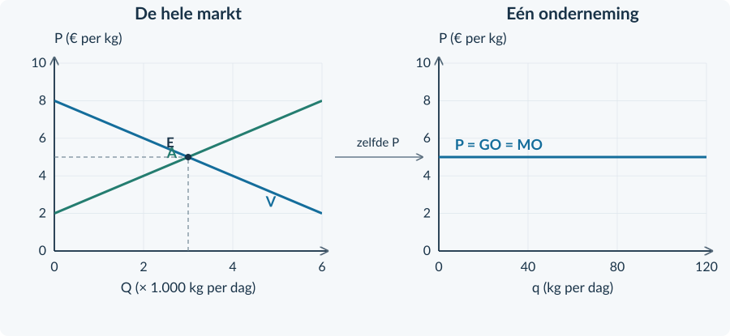
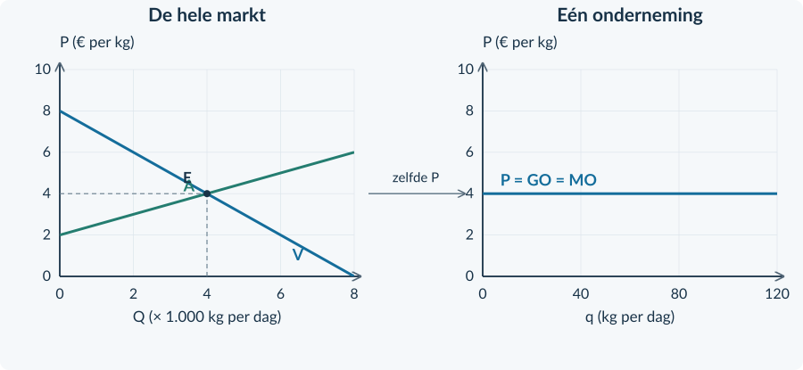
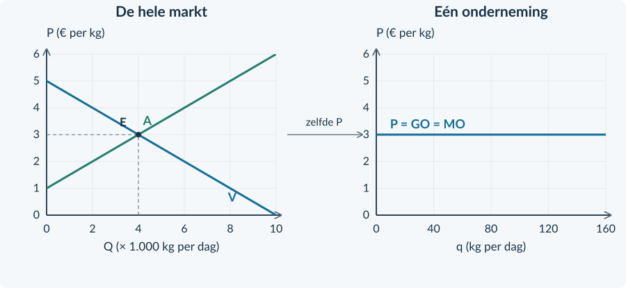

# Antwoorden 3.2.1 — Volkomen concurrentie

4VECO · BOEK 3 · HOOFDSTUK 3.2

# Antwoorden Volkomen concurrentie

<b>Gebruik</b> Rond geldbedragen per product af op twee decimalen als dat nodig is. Reken met ongeronde tussenwaarden. Totale bedragen zijn per genoemde periode. Een denkertje heeft een modelantwoord: een anders verwoord, goed onderbouwd antwoord kan ook juist zijn.

<h3>Opgave 1 · Opbrengst terughalen</h3>

<b>a.</b> TO = P × q = 4 × 80 = <b>€ 320 per dag</b>. GO = TO / q = 320 / 80 = <b>€ 4 per kg</b>.

<b>Waarom:</b> TO telt alle verkochte kg; GO is de opbrengst van gemiddeld één kg.

<b>b.</b> TO nieuw = 4 × 100 = € 400 per dag. ΔTO = 400 − 320 = <b>€ 80 per dag</b>. MO = 80 / (100 − 80) = <b>€ 4 per kg</b>.

<b>Waarom:</b> De extra opbrengst wordt verdeeld over 20 extra kg, niet over de totale productie.

<h3>Opgave 2 · Welke lijn is horizontaal?</h3>

<b>a.</b> De markt heeft een dalende vraaglijn. Alleen de opbrengstlijn van <b>één kleine onderneming</b> is bij een gegeven marktprijs horizontaal.

<b>Waarom:</b> Een verandering van de hele marktprijs is iets anders dan een kleine afzetverandering van één teler.

<b>b.</b> Bijvoorbeeld: veel kleine aanbieders én een homogeen product. Ook doorzichtige prijzen ondersteunen de redenering: kopers kunnen dezelfde kwaliteit elders kopen.

<b>Waarom:</b> Eén aanbieder kan niet zelfstandig een hogere prijs afdwingen.

<h3>Opgave 3 · Volg de prijs</h3>

<b>a.</b> Links: Q = <b>4.000 kg per dag</b> en P = <b>€ 2 per kg</b>. Je neemt alleen P = 2 over naar rechts.

<b>Waarom:</b> q is de productie van één teler, niet de som van de productie van alle telers.

<b>b.</b> ΔTO = € 240 − € 200 = € 40. MO = 40 / (120 − 100) = <b>€ 2 per kg</b>.

<b>Waarom:</b> € 40 is de extra totale opbrengst; MO is die extra opbrengst per extra kg.

<b>c.</b> Als één kleine teler meer produceert, verandert alleen zijn bijdrage aan de totale productie. Alle andere bedrijven verdubbelen hun productie niet automatisch.

<b>Waarom:</b> Q is de som van de productie van alle ondernemingen.

<h3>Opgave 4 · De rijstmarkt</h3>

<b>a.</b> Afgelezen: P = <b>€ 5 per kg</b> en Q = <b>3.000 kg per dag</b>.

<b>Waarom:</b> De horizontale schaal is × 1.000 kg; het snijpunt ligt halverwege 2 en 4.

<b>b.</b> Teken rechts een horizontale lijn op P = 5, tot q = 120. Label <b>P = GO = MO</b>. Zie de oplossing hieronder.

<b>Waarom:</b> Elke verkochte kg levert binnen de capaciteit dezelfde prijs op.

<b>c.</b> TO bij q = 80: 5 × 80 = <b>€ 400 per dag</b>. Bij q = 100: TO = € 500. ΔTO = € 100; MO = 100 / 20 = <b>€ 5 per kg</b>.

<b>Waarom:</b> De prijs blijft gelijk wanneer één kleine onderneming 20 kg meer verkoopt.

<b>d.</b> Bij q = 80 wordt TO = 4,80 × 80 = € 384 in plaats van € 400. De kosten bij dezelfde q blijven gelijk. De winst is <b>€ 16 lager per dag</b>.

<b>Waarom:</b> De producent kon de 80 kg al voor € 5 verkopen; de prijsverlaging geeft hier geen voordeel.

<figure><figcaption>Oplossing opgave 4. Neem P = € 5 per kg over naar de onderneming.</figcaption></figure>

<h3>Opgave 5 · Standaard potgrond</h3>

<b>a.</b> Marktevenwicht: P = <b>€ 4 per kg</b>, Q = <b>4.000 kg per dag</b>. Rechts komt de horizontale lijn P = GO = MO = 4.

<b>Waarom:</b> De evenwichtsprijs wordt overgenomen, de totale hoeveelheid niet.

<b>b.</b> TO = 4 × 90 = <b>€ 360 per dag</b>. GO = 360 / 90 = <b>€ 4 per kg</b>. Nieuw TO = 4 × 110 = € 440. MO = (440 − 360) / (110 − 90) = <b>€ 4 per kg</b>.

<b>Waarom:</b> Bij een vaste prijs zijn gemiddelde en marginale opbrengst gelijk aan die prijs.

<b>c.</b> Bij € 4,50 wijken kopers uit naar dezelfde potgrond van andere aanbieders voor € 4. De kleine aanbieder verliest in het model zijn afzet.

<b>Waarom:</b> Veel aanbieders, gelijke kwaliteit en bekende prijzen voorkomen een eigen hogere prijs.

<figure><figcaption>Oplossing opgave 5. P = GO = MO = € 4 per kg.</figcaption></figure><h3>Opgave 6 · Een eigen merk</h3>

<b>a.</b> Het product is voor deze klanten niet langer <b>homogeen</b>: zij zien het merk als anders en willen er extra voor betalen.

<b>Waarom:</b> De bron geeft een verschil in ervaren waarde, niet alleen een andere verpakking.

<b>b.</b> Het bedrijf kan voor een groep klanten mogelijk een eigen prijs vragen. De aanname dat iedere afwijking boven de marktprijs alle afzet wegneemt, gaat dan niet zomaar op.

<b>Waarom:</b> De horizontale lijn volgt uit de prijsnemersaannames; die zijn hier niet volledig aanwezig. Een nieuw marktmodel hoef je nog niet te tekenen.

<h3>Opgave 7 · Wortelveiling</h3>

<b>a.</b> P = <b>€ 3 per kg</b> en Q = <b>4.000 kg per dag</b>. Bijvoorbeeld: veel kleine telers, gelijke kwaliteit of bekende prijzen ondersteunt prijsnemerschap.

<b>Waarom:</b> Het snijpunt hoort bij de hele markt. De kenmerken maken een eigen hogere prijs voor Mila onaantrekkelijk.

<b>b.</b> Teken rechts een horizontale lijn op 3, over de getekende q-schaal tot 160. Zet <b>P = GO = MO</b> erbij.

<b>Waarom:</b> De lijn geeft opbrengst per kg, niet totale opbrengst.

<b>c.</b> TO = 3 × 120 = <b>€ 360 per dag</b>. GO = 360 / 120 = <b>€ 3 per kg</b>. Nieuw TO = 3 × 140 = 420. MO = (420 − 360) / (140 − 120) = <b>€ 3 per kg</b>.

<b>Waarom:</b> De extra € 60 ontstaat door 20 extra kg; iedere kg geeft € 3 opbrengst.

<b>d.</b> Voor € 3,20 kopen klanten elders dezelfde wortelen voor € 3. Mila kan als kleine aanbieder de marktprijs niet verhogen.

<b>Waarom:</b> Kopers kennen de prijzen en kunnen uitwijken naar andere telers.

<b>e.</b> 4.000 kg is Q van alle telers samen. Mila heeft een eigen q en capaciteit van 160 kg per dag. Haar grafiek mag dus niet op q = 4.000 eindigen.

<b>Waarom:</b> Twee hoeveelheidsassen beschrijven verschillende economische objecten.

<figure><figcaption>Oplossing doeloefening 7. Links Q = 4.000; rechts een prijslijn tot q = 160.</figcaption></figure>

<h3>Opgave 8 · Onbeperkt verkopen?</h3>

<b>a.</b> Onjuist. De horizontale lijn is een model voor een kleine aanbieder, binnen zijn productiecapaciteit. Een machine, grond of tijd begrenst zijn afzet.

<b>Waarom:</b> De modeluitspraak geldt niet voor een onbeperkte vergroting van hetzelfde bedrijf.

<b>b.</b> Een grote aanbieder kan de totale markthoeveelheid merkbaar veranderen. Dan moet je opnieuw onderzoeken of hij de prijs als gegeven kan nemen.

<b>Waarom:</b> De aanname van een verwaarloosbaar klein marktaandeel kan verdwijnen.

<b>Beoordelingscriteria bij het denkertje</b> Het antwoord noemt zowel capaciteit als marktaandeel, onderscheidt q van Q en claimt niet dat een horizontale lijn letterlijk oneindige verkoop bewijst.
<h3>Opgave 9 · Evenwicht uit formules</h3>

<b>a.</b> 18 − 0,20Q = 6 + 0,10Q → 12 = 0,30Q → <b>Q = 40 producten per week</b>. P = 6 + 0,10 × 40 = <b>€ 10 per product</b>.

<b>Waarom:</b> In evenwicht hoort bij dezelfde hoeveelheid dezelfde kopers- en verkopersprijs.

<b>b.</b> Het aanbod verschuift <b>naar rechts</b>. Bij ongewijzigde vraag daalt de evenwichtsprijs.

<b>Waarom:</b> Bij iedere prijs zijn er meer producten beschikbaar. Herhaal §1.3.3 als dit lastig is.

<h3>Opgave 10 · Totaal en gemiddeld</h3>

<b>a.</b> TK = 150 + 3 × 50 = <b>€ 300 per week</b>. GTK = 300 / 50 = <b>€ 6 per kg</b>.

<b>Waarom:</b> GTK verdeelt de totale kosten over de productie.

<b>b.</b> Bij q = 100: TK = 150 + 300 = € 450; GTK = 450 / 100 = <b>€ 4,50 per kg</b>. Dezelfde € 150 constante kosten worden over meer kg verdeeld.

<b>Waarom:</b> Totale kosten stijgen, maar de constante kosten per kg dalen. Herhaal §2.1.1 voor totaal versus gemiddeld.

