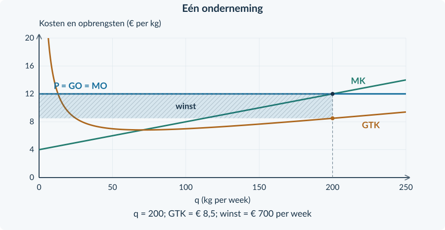

# Antwoorden 3.2.2 — Winstmaximalisatie

<h3>Opgave 11 · De bekende bouwstenen</h3>

<b>a.</b> TO = 9 × 40 = <b>€ 360 per week</b>. GTK = 280 / 40 = <b>€ 7 per kg</b>. Winst = 360 − 280 = <b>€ 80 per week</b>.

<b>Waarom:</b> Opbrengst en kosten moeten bij dezelfde q horen.

<b>b.</b> MK over 40–50 = (350 − 280) / (50 − 40) = <b>€ 7 per kg</b>. MO = <b>€ 9 per kg</b>, dus MO is € 2 hoger dan de gemiddelde MK over deze stap.

<b>Waarom:</b> De uitbreiding geeft over 10 kg € 20 extra winst.

<h3>Opgave 12 · Een maximum herkennen</h3>

<b>a.</b> Rond q = 60 is MO − MK = 12 − 10 = <b>€ 2 per kg</b>: een kleine uitbreiding is gunstig. Rond q = 100 is het verschil −€ 2 per kg: uitbreiding is ongunstig.

<b>Waarom:</b> Vergelijk de extra opbrengst en de extra kosten, niet de totale winst.

<b>b.</b> Bij stijgende MK verandert het verschil MO − MK van positief naar negatief. Het snijpunt ligt tussen de twee genoemde hoeveelheden.

<b>Waarom:</b> Vóór dat punt stijgt de winst; erna daalt zij, mits het punt haalbaar is.

<b>Van deze antwoorden naar de nieuwe procedure</b> Met de tabel bereken je een intervalwaarde. Bij een doorlopende kostenfunctie gebruik je daarna de afgeleide. Geef een verschil in die uitkomsten niet automatisch als fout aan: controleer eerst welke verandering wordt gemeten.

<h3>Opgave 13 · Term voor term</h3>

<b>a.</b> 0,05q² → 0,10q; 3q → 3; 60 → 0. Dus <b>MK = 0,10q + 3</b>.

<b>Waarom:</b> De constante € 60 verandert niet bij een kleine productietoename.

<b>b.</b> 9 = 0,10q + 3 → 6 = 0,10q → <b>q = 60 kg per week</b>.

<b>Waarom:</b> Bij een prijsnemer is MO gelijk aan P = 9.

<b>c.</b> 60 ≤ 80, dus de q is haalbaar. Bij q &lt; 60 is MK &lt; 9; bij q &gt; 60 is MK &gt; 9.

<b>Waarom:</b> MK stijgt door MO heen: de winst gaat van stijgen naar dalen. Bij q = 0 is het resultaat −€ 60; bij q = 60 is de winst € 120.

<h3>Opgave 14 · Gedroogde kruiden</h3>

<b>a.</b> MK = <b>0,10q + 4</b>. 12 = 0,10q + 4 → q = <b>80 kg per week</b>. 80 past binnen de capaciteit van 120. MK is onder 80 lager dan MO en boven 80 hoger.

<b>Waarom:</b> De stijgende MK-lijn bevestigt het maximum.

<b>b.</b> TO = 12 × 80 = <b>€ 960</b>. TK = 0,05 × 80² + 4 × 80 + 180 = 320 + 320 + 180 = <b>€ 820</b>. Winst = 960 − 820 = <b>€ 140 per week</b>.

<b>Waarom:</b> Ook de constante kosten blijven onderdeel van TK.

<b>c.</b> GTK = 820 / 80 = <b>€ 10,25 per kg</b>. De rechthoek loopt van q = 0 tot 80 en van 10,25 tot 12. Breedte = 80 kg/week, hoogte = € 1,75/kg. Oppervlakte = <b>€ 140/week</b>.

<b>Waarom:</b> De GTK wordt bij q = 80 afgelezen; het minimum van GTK is niet de gevraagde hoogte.

<figure><figcaption>Oplossing opgave 14. q = 80; winst = 80 × (12 − 10,25) = € 140 per week.</figcaption></figure>

<h3>Opgave 15 · Twee veranderingen tegelijk</h3>

<b>a.</b> Met alleen de prijsstijging: 14 = 0,10q + 4 → <b>q = 100 kg per week</b>.

<b>Waarom:</b> Een hogere MO maakt extra productie langer gunstig.

<b>b.</b> MK blijft <b>0,10q + 4</b>. Bij dezelfde q daalt de winst met 260 − 180 = <b>€ 80 per week</b>.

<b>Waarom:</b> Constante kosten veranderen het totale winstbedrag, niet de marginale kosten.

<b>c.</b> Beide veranderingen samen: <b>q = 100 kg per week</b>. Dat past binnen 120. De nieuwe constante kosten veranderen de vergelijking 14 = 0,10q + 4 niet.

<b>Waarom:</b> De prijsverandering verschuift MO; de vaste-kostenverandering niet.

<b>d.</b> De leerling verwart totale kosten met marginale kosten. Alleen de constante kosten nemen hier toe; de variabele kosten en MK blijven gelijk.

<b>Waarom:</b> Een hoger totaal kostenniveau betekent niet automatisch dat elke extra kg duurder wordt.

<b>Didactische controle</b> Een leerling die de productie verlaagt omdat TCK stijgt, moet het onderscheid TK–MK opnieuw maken. Een leerling die TCK uit de winstberekening weglaat, gebruikt de afgeleide alsof deze de totale kosten vervangt.

<h3>Opgave 16 · Meel van één kwaliteitsklasse</h3>

<b>a.</b> MK = <b>0,04q + 4</b>. 12 = 0,04q + 4 → q = <b>200 kg per week</b>. Bij q = 150 is MK = 10; bij q = 250 is MK = 14. Dus MO &gt; MK vóór 200 en MO &lt; MK erna. 200 ≤ 250.

<b>Waarom:</b> Het marginale verloop en de capaciteit ondersteunen dezelfde keuze.

<b>b.</b> TO = 12 × 200 = <b>€ 2.400</b>. TK = 0,02 × 200² + 4 × 200 + 100 = 800 + 800 + 100 = <b>€ 1.700</b>. Winst = <b>€ 700 per week</b>. GTK = 1.700 / 200 = <b>€ 8,50 per kg</b>.

<b>Waarom:</b> Totalen en gemiddelde worden bij q = 200 berekend.

<b>c.</b> Rechthoek: breedte <b>200 kg/week</b>, hoogte <b>€ 3,50/kg</b> (12 − 8,50). De oppervlakte is <b>€ 700/week</b>. Zie de grafiek.

<b>Waarom:</b> Bedrag per kg maal kg per week geeft het totale weekbedrag.

<b>d.</b> Het snijpunt geeft q = 200 en een marginale opbrengst/kost van € 12 per kg. Voor totale winst heb je daarnaast de totale kosten of GTK nodig.

<b>Waarom:</b> MO = MK zegt iets over de beste hoeveelheid, niet rechtstreeks over de grootte van de winst.

<figure><figcaption>Oplossing opgave 16. De winst is een rechthoek met hoogte € 3,50 per kg.</figcaption></figure>

<h3>Opgave 17 · Een machine met beperkte capaciteit</h3>

<b>a.</b> MK = 0,20q + 2. 18 = 0,20q + 2 → <b>q = 80 kg per week</b>. Dit is groter dan de capaciteit van 60.

<b>Waarom:</b> Een wiskundig snijpunt kan buiten de haalbare productie liggen.

<b>b.</b> Kies <b>q = 60 kg per week</b>. Daar is MK = 0,20 × 60 + 2 = <b>€ 14 per kg</b>, lager dan MO = 18. Tot de capaciteit blijft extra productie gunstig.

<b>Waarom:</b> Binnen het haalbare gebied stijgt de winst nog steeds.

<b>c.</b> TO = 18 × 60 = € 1.080. TK = 0,10 × 60² + 2 × 60 + 40 = 360 + 120 + 40 = € 520. Winst = <b>€ 560 per week</b>. Bij q = 0: 0 − 40 = <b>−€ 40 per week</b>.

<b>Waarom:</b> De capaciteit benutten is hier gunstiger dan niet produceren.

<b>d.</b> Onjuist. Het maximum ligt hier op de capaciteitsgrens. Binnen de toegestane hoeveelheden bestaat geen betere keuze.

<b>Waarom:</b> Een maximum kan op een grens liggen; MO = MK is niet altijd noodzakelijk voor een grensmaximum.

<b>Controle van de logica</b> Een onhaalbaar snijpunt is geen reden om de opgave zonder advies af te sluiten. De grens q = 60 is juist de best haalbare keuze, omdat de winst op alle lagere hoeveelheden nog stijgt.

<h3>Opgave 18 · Korrels voor kwekerijen</h3>

<b>a.</b> 0,04q² → 0,08q; 4q → 4; 400 → 0. Dus <b>MK = 0,08q + 4</b>.

<b>Waarom:</b> De afgeleide beschrijft de kostenstijging per extra kg in het doorlopende model.

<b>b.</b> MO = 16. 16 = 0,08q + 4 → 12 = 0,08q → <b>q = 150 kg per week</b>. Bij q = 125 is MK = 14; bij 175 is MK = 18. MK stijgt van onder naar boven MO. 150 ≤ 200.

<b>Waarom:</b> De winst stijgt vóór 150 en daalt erna; de kandidaat is haalbaar.

<b>c.</b> TO = 16 × 150 = <b>€ 2.400</b>. TK = 0,04 × 150² + 4 × 150 + 400 = 900 + 600 + 400 = <b>€ 1.900</b>. Winst = <b>€ 500 per week</b>.

<b>Waarom:</b> Trek alle kosten af van de opbrengst, inclusief de € 400 constante kosten.

<b>d.</b> GTK = 1.900 / 150 = <b>€ 12,666… per kg</b>, afgerond € 12,67. Breedte = 150 kg/week; hoogte = 16 − 12,666… = € 3,333…/kg. Winstoppervlakte = <b>€ 500/week</b>.

<b>Waarom:</b> Rond GTK niet af vóór de oppervlakteberekening. Gebruik anders rechtstreeks TO − TK.

<figure><figcaption>Oplossing doeloefening 18d. De hoogte is € 3,333… per kg, niet € 16 per kg.</figcaption></figure>

<h3>Opgave 18 · Korrels voor kwekerijen · vervolg</h3>

<b>e.</b> Bij q = 0: TO = 0, TK = 400 en winst = <b>−€ 400 per week</b>. € 500 is hoger dan −€ 400.

<b>Waarom:</b> De constante kosten zijn deze week ook bij niet produceren onvermijdbaar.

<b>f.</b> Kies <b>q = 120 kg per week</b>. Het snijpunt bij 150 is onhaalbaar. Bij 120 is MK = 0,08 × 120 + 4 = € 13,60 per kg, nog steeds lager dan MO = 16.

<b>Waarom:</b> De winst stijgt tot de nieuwe grens; daarom wordt de capaciteit benut.

<h3>Opgave 19 · Dezelfde MK, andere winst</h3>

<b>a.</b> Beide hebben MK = 0,20q + 2. Bij P = 8 ligt het snijpunt op q = 30 kg/week, binnen de capaciteit van 50. Beide kiezen in dit model <b>dezelfde q</b>.

<b>Waarom:</b> De hogere constante kosten van B veranderen MK niet.

<b>b.</b> TO is voor beide 8 × 30 = € 240. TK van A = 90 + 60 + 40 = € 190: winst <b>€ 50/week</b>. TK van B = 90 + 60 + 160 = € 310: winst <b>−€ 70/week</b>. Bij q = 0 verliest B € 160, dus q = 30 blijft deze week beter.

<b>Waarom:</b> Dezelfde marginale keuze kan samengaan met een ander totaal resultaat. Het oordeel gaat niet automatisch over blijven op langere termijn.

<b>Beoordelingscriteria bij het denkertje</b> Het antwoord gebruikt gelijke MK, vergelijkt dezelfde q en laat verschillende winstbedragen zien. Het maakt van een kortetermijnverlies geen ongefundeerd onmiddellijk stopadvies.

<h3>Opgave 20 · Procenten en prijsgevoeligheid</h3>

<b>a.</b> %ΔP = (10 − 8) / 8 × 100% = <b>25%</b>. Ev = −10% / 25% = <b>−0,4</b>.

<b>Waarom:</b> De oude prijs is de basis; de hoeveelheid daalt, dus het teken is negatief.

<b>b.</b> |Ev| = 0,4 &lt; 1, dus de vraag is <b>prijsinelastisch</b>.

<b>Waarom:</b> De hoeveelheid reageert procentueel minder sterk dan de prijs. Herhaal §2.2.1 als teken en classificatie door elkaar lopen.

<h3>Opgave 21 · Belastingwig</h3>

<b>a.</b> t = Pc − Pp = 11 − 8 = <b>€ 3 per product</b>. Belastingopbrengst = 3 × 200 = <b>€ 600 per week</b>.

<b>Waarom:</b> De overheid ontvangt de belasting over de werkelijk verhandelde producten.

<b>b.</b> De belastingopbrengst gaat naar de overheid: het is een overdracht. Welvaartsverlies betreft verloren voordelen van transacties die door de belasting niet meer plaatsvinden, onder het eerder gebruikte model zonder externe effecten.

<b>Waarom:</b> Een budgetbedrag is niet automatisch verloren surplus. Zie §3.1.2.

<b>Waarom deze herhaling?</b> De omvang en de eenheid van een verandering keren telkens terug. Bij elasticiteit vergelijk je percentages; bij marginale bedragen deel je een totaalverschil door extra hoeveelheid; bij de belastingopbrengst vermenigvuldig je belasting per product met werkelijk verhandelde producten.

