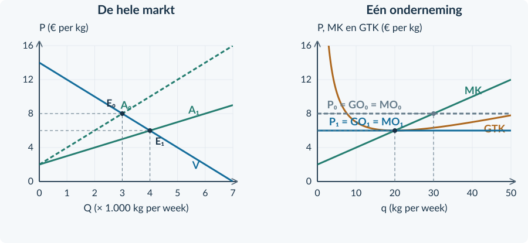

# Antwoorden 3.2.3 — Langetermijnevenwicht

<h3>Opgave 22 · Nog één productieadvies</h3>

<b>a.</b> MK = 0,20q + 2. 8 = 0,20q + 2 → <b>q = 30 kg per week</b>. Dit past binnen 50; MK stijgt door MO heen.

<b>Waarom:</b> De productie volgt uit de marginale vergelijking.

<b>b.</b> TO = 8 × 30 = <b>€ 240</b>. TK = 0,10 × 30² + 2 × 30 + 40 = <b>€ 190</b>. Winst = <b>€ 50/week</b>. GTK = 190 / 30 = <b>€ 6,333…/kg</b>.

<b>Waarom:</b> Een prijs boven GTK geeft bij deze productie positieve economische winst.

<h3>Opgave 23 · Een nul met betekenis</h3>

<b>a.</b> Economische winst = 1.000 − 1.000 = <b>€ 0 per week</b>.

<b>Waarom:</b> Ook de normale beloning telt mee bij de totale kosten.

<b>b.</b> De ondernemer ontvangt al <b>€ 180 normale vergoeding per week</b>. Er blijft alleen geen extra economische winst over.

<b>Waarom:</b> Nul economische winst is niet hetzelfde als nul beloning of nul omzet.

<h3>Opgave 24 · Bouw de keten</h3>

<b>a.</b> Overwinst → meer bedrijven → marktaanbod naar <b>rechts</b> → P <b>daalt</b> → winst per bedrijf <b>daalt</b>.

<b>Waarom:</b> Het marktaanbod verandert doordat het aantal aanbieders toeneemt.

<b>b.</b> Markt Q: <b>6.000 → 9.000 kg/week</b>. Eén bedrijf q: <b>60 → 40 kg/week</b>. De lagere prijs geeft een kleinere beste productie per bedrijf, maar er zijn meer bedrijven.

<b>Waarom:</b> Meer bedrijven kunnen samen meer leveren, terwijl elk bedrijf afzonderlijk minder levert.

<b>c.</b> TO = 6 × 40 = <b>€ 240</b>. TK = 0,05 × 40² + 2 × 40 + 80 = 80 + 80 + 80 = <b>€ 240</b>. Winst = <b>€ 0/week</b>.

<b>Waarom:</b> Bij het minimum GTK dekt de prijs precies alle kosten.

<h3>Opgave 25 · Een markt met verlies</h3>

<b>a.</b> Een deel van de bedrijven zal <b>uittreden</b>.

<b>Waarom:</b> Aanhoudend economisch verlies maakt actief blijven onaantrekkelijk.

<b>b.</b> Teken A₁ links van A, bijvoorbeeld zoals in de oplossing. Het nieuwe snijpunt ligt bij <b>P = 6 en Q = 1.000 kg/week</b>.

<b>Waarom:</b> Minder aanbieders verlagen bij elke prijs de totale aangeboden hoeveelheid.

<b>c.</b> Rechts: P = GO = MO = <b>€ 6 per kg</b>. De gekozen q is <b>20 kg/week</b>. TO = 6 × 20 = 120. TK = 0,10 × 20² + 2 × 20 + 40 = 120. Winst = 0.

<b>Waarom:</b> De hogere prijs herstelt de kostendekking bij het overblijvende bedrijf.

<b>d.</b> De bron laat de kostenfunctie van actieve bedrijven gelijk. Alleen het aantal bedrijven verandert.

<b>Waarom:</b> Uittreding verschuift het totale marktaanbod, niet automatisch de GTK-lijn van één bedrijf.

<figure><figcaption>Oplossing opgave 25. A₁ ligt links van A₀; in de onderneming stijgt de prijs naar € 6.</figcaption></figure>

<h3>Opgave 26 · Rijstmeel</h3>

<b>a.</b> MK = 0,20q + 2. Bij MO = 8 is q = <b>30 kg/week</b>. TO = 240; TK = 90 + 60 + 40 = 190; winst = <b>€ 50/week</b>.

<b>Waarom:</b> P ligt boven GTK bij deze q.

<b>b.</b> Overwinst → toetreding → A naar rechts → lagere P. De aanpassing eindigt onder de gegeven aannames bij P = <b>€ 6 per kg</b>. Teken de lijnen zoals hieronder.

<b>Waarom:</b> Toetreding stopt als dezelfde productiemethode geen extra economische winst meer oplevert.

<b>c.</b> Langetermijn-q = <b>20 kg/week</b>. TO = 6 × 20 = <b>€ 120/week</b>. TK = 40 + 40 + 40 = € 120/week. Winst = <b>€ 0/week</b>.

<b>Waarom:</b> De normale beloning zit al in de kosten en wordt nog betaald.

<figure><figcaption>Oplossing opgave 26. Toetreding brengt P naar € 6 en q naar 20 kg per week.</figcaption></figure><h3>Opgave 27 · Sommige bedrijven verdwijnen</h3>

<b>a.</b> TO = 5 × 30 = € 150. TK = 0,05 × 30² + 2 × 30 + 80 = 45 + 60 + 80 = € 185. Winst = <b>−€ 35/week</b>. Verwacht bij aanhoudende omstandigheden <b>uittreding</b>.

<b>Waarom:</b> Er is een economisch verlies bij de beste gegeven productie.

<b>b.</b> Marktaanbod naar links; prijs omhoog. Bijvoorbeeld: de marktvraag blijft gelijk, uittreding is vrij of de kosten van actieve bedrijven veranderen niet.

<b>Waarom:</b> Zonder deze aannames kan de prijs ook door een andere oorzaak veranderen.

<h3>Opgave 28 · Standaard koffiebonen</h3>

<b>a.</b> Afgelezen beginprijs: <b>€ 10 per kg</b>. MK = 0,04q + 4. 10 = 0,04q + 4 → q = <b>150 kg/week</b>, haalbaar binnen 250. TO = 10 × 150 = € 1.500. TK = 0,02 × 150² + 4 × 150 + 200 = 450 + 600 + 200 = € 1.250. Economische winst = <b>€ 250/week</b>.

<b>Waarom:</b> De prijs ligt boven GTK bij de gekozen q.

<b>b.</b> Die overwinst trekt aanbieders aan. Bij elke prijs neemt het marktaanbod toe. Bij gelijkblijvende vraag daalt daardoor de marktprijs.

<b>Waarom:</b> Nieuwe bedrijven kunnen dezelfde kostentechniek gebruiken.

<b>c.</b> Teken A₁ rechts van A en laat die V snijden bij P = 8. Rechts komt P = GO = MO = 8. MK en GTK blijven staan.

<b>Waarom:</b> Het aantal aanbieders en de prijs veranderen; de kostenfuncties zijn volgens de bron ongewijzigd.

<b>d.</b> P = <b>€ 8 per kg</b> en q = <b>100 kg/week</b>. TO = 8 × 100 = <b>€ 800/week</b>. TK = 0,02 × 100² + 4 × 100 + 200 = 200 + 400 + 200 = <b>€ 800/week</b>. Winst = <b>€ 0/week</b>.

<b>Waarom:</b> Bij minimum GTK is de prijs precies voldoende voor alle economische kosten.

<b>e.</b> De omzet is nog <b>€ 800/week</b>, niet nul. In TK zit nog <b>€ 120 normale ondernemersbeloning/week</b>. Alleen de extra economische winst is verdwenen.

<b>Waarom:</b> Nul economische winst is een verschil tussen twee gelijke positieve totaalbedragen.

<figure><figcaption>Oplossing doeloefening 28. Meer totale afzet, maar minder afzet van één bedrijf.</figcaption></figure>

<h3>Opgave 29 · Niet iedereen heeft dezelfde kosten</h3>

<b>a.</b> De aanname dat bestaande en nieuwe bedrijven dezelfde kosten hebben, is ongeldig.

<b>Waarom:</b> De bron noemt verschillende minimum-GTK-niveaus.

<b>b.</b> Nul economische winst vraagt P = GTK bij de gekozen q. Met verschillende minima kan éénzelfde prijs voor het ene bedrijf precies kostendekkend zijn en voor het andere niet. De bron is onvoldoende voor een volledig nieuw evenwicht.

<b>Waarom:</b> Het bekende nulwinstresultaat mag niet zonder zijn kostenvoorwaarden worden toegepast.

<b>Beoordelingscriteria bij het denkertje</b> Een goed antwoord noemt de doorbroken kostenaanname, verbindt nulwinst aan kostendekking en berekent geen ongefundeerd nieuw evenwicht.
<h3>Opgave 30 · De eenheid van de oppervlakte</h3>

<b>a.</b> Breedte: <b>200 kg per week</b>. Hoogte: 12 − 9 = <b>€ 3 per kg</b>. Winst = 200 × 3 = <b>€ 600 per week</b>.

<b>Waarom:</b> De twee eenheden vermenigvuldigen tot euro per week.

<b>b.</b> Niet zonder meer. Je trekt via GTK alle totale kosten van de opbrengst af; dat geeft <b>winst</b>. Producentensurplus trekt in het bekende model de variabele kosten af, niet ook de constante kosten.

<b>Waarom:</b> Zonder gegevens over constante kosten mag je beide bedragen niet gelijkstellen. Zie §2.3.2.

<h3>Opgave 31 · Een minimumprijs</h3>

<b>a.</b> Bij P = 10: 10 = 14 − 0,10Qv → <b>Qv = 40</b>. 10 = 2 + 0,10Qa → <b>Qa = 80</b>. Aanbodoverschot = 80 − 40 = <b>40 producten per week</b>.

<b>Waarom:</b> Gevraagde en aangeboden hoeveelheid kunnen bij een opgelegde prijs verschillen.

<b>b.</b> Er worden <b>40 producten per week</b> verkocht. Kopers willen niet meer kopen en de overheid koopt de overige producten niet op.

<b>Waarom:</b> Aanbieden is niet hetzelfde als daadwerkelijk verkopen. Herhaal §3.1.5.

