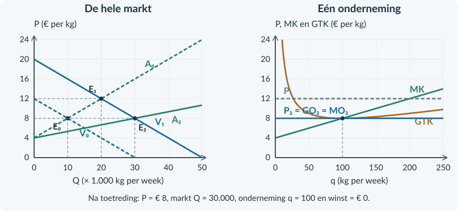

# Antwoorden 3.2.4 — Gemengde opgaven

<h3>Opgave 32 · Twee bronnen over meel</h3>

<b>a.</b> 12.000 − 1.000P = 2.000P → 12.000 = 3.000P → <b>P = € 4 per kg</b>. Q = 2.000 × 4 = <b>8.000 kg per week</b>.

<b>Waarom:</b> Bij de evenwichtsprijs is Qv = Qa.

<b>b.</b> TO = 4 × 100 = <b>€ 400 per week</b>. GO = MO = <b>€ 4 per kg</b>. Q omvat alle molens, q alleen deze molen.

<b>Waarom:</b> De prijs wordt gedeeld door het marktmodel, niet de hoeveelheid van één bedrijf.

<b>c.</b> Kopers kunnen bij andere molens dezelfde kwaliteit voor € 4 krijgen. De eigen prijs van € 4,50 verliest daardoor afzet.

<b>Waarom:</b> Het bedrijf is een kleine prijsnemer; de bron ondersteunt geen marktmacht.

<h3>Opgave 33 · Vezels voor verpakkingen</h3>

<b>a.</b> MK = 0,10q + 4. 14 = 0,10q + 4 → <b>q = 100 kg/week</b>. Dit past binnen 140. Bij q = 80 is MK = 12 &lt; MO; bij q = 120 is MK = 16 &gt; MO.

<b>Waarom:</b> De winst stijgt vóór de gekozen q en daalt erna.

<b>b.</b> TO = 14 × 100 = <b>€ 1.400</b>. TK = 0,05 × 100² + 4 × 100 + 200 = 500 + 400 + 200 = <b>€ 1.100</b>. Winst = <b>€ 300/week</b>. GTK = 1.100 / 100 = <b>€ 11/kg</b>.

<b>Waarom:</b> Alle bedragen horen bij q = 100.

<b>c.</b> Van q = 0 tot 100 en van € 11 tot € 14 per kg. Breedte = 100 kg/week; hoogte = € 3/kg; oppervlakte = € 300/week.

<b>Waarom:</b> Gebruik GTK bij de winstmaximale q, niet een minimum bij een andere q.

<b>d.</b> De laagste gemiddelde kosten zijn niet hetzelfde als de hoogste totale winst. Zolang MO &gt; MK levert extra productie nog extra winst, ook als GTK alweer stijgt.

<b>Waarom:</b> De marginale vergelijking bepaalt de beste hoeveelheid; GTK helpt het winstbedrag berekenen.

<h3>Opgave 34 · De ruimte is de grens</h3>

<b>a.</b> 20 = 0,20q + 4 → q = <b>80 kg/week</b>, maar dit is niet haalbaar. Kies <b>q = 60 kg/week</b>.

<b>Waarom:</b> Het theoretische snijpunt ligt boven de capaciteit.

<b>b.</b> Bij q = 60 is MK = 0,20 × 60 + 4 = € 16/kg, lager dan MO = 20. MK is ook voor alle lagere q onder MO.

<b>Waarom:</b> De winst stijgt binnen de hele toegestane productie; de bovengrens is daarom het maximum.

<b>c.</b> Je hebt de <b>totale kosten bij q = 60</b> nodig, bijvoorbeeld via een volledige TK-functie of de constante kosten naast de gegeven marginale relatie.

<b>Waarom:</b> MK vertelt niet hoeveel constante kosten er zijn. Zonder dat gegeven is totale winst niet vastgelegd.

<h3>Opgave 35 · Het aantal bedrijven verandert</h3>

<b>a.</b> Overwinst → toetreding → meer aanbod bij elke prijs → lagere prijs → minder overwinst. Onder de gegeven aannames eindigt dit bij <b>P = € 8 per kg</b>.

<b>Waarom:</b> Het minimum GTK is voor bestaande en nieuwe bedrijven gelijk.

<b>b.</b> <b>P = GO = MO = MK = minimum GTK = € 8 per kg.</b>

<b>Waarom:</b> Bij dit punt is de productie marginaal optimaal én volledig kostendekkend.

<b>c.</b> Onjuist als beschrijving van het evenwicht. Zodra overwinst is verdwenen, stopt de prikkel tot verdere toetreding. Het model eindigt met nul, niet met blijvend negatieve economische winst.

<b>Waarom:</b> Voortdurende verliesgevende toetreding past niet bij de gegeven langetermijnaanpassing.

<h3>Opgave 36 · Kweekkorrels: van markt naar bedrijf</h3>

<b>a.</b> 30.000 − 2.500P = 2.500P − 10.000 → 40.000 = 5.000P → <b>P₀ = € 8/kg</b>. Q₀ = 2.500 × 8 − 10.000 = <b>10.000 kg/week</b>. Bij q = 100: TO = 8 × 100 = € 800; TK = 0,02 × 100² + 4 × 100 + 200 = € 800. Winst = <b>€ 0/week</b>.

<b>Waarom:</b> De beginsituatie is voor de onderneming economisch kostendekkend.

<b>b.</b> 50.000 − 2.500P = 2.500P − 10.000 → 60.000 = 5.000P → <b>P₁ = € 12/kg</b>. Q₁ = 2.500 × 12 − 10.000 = <b>20.000 kg/week</b>. E₁ ligt op (20.000; 12).

<b>Waarom:</b> Direct na de vraagstijging geldt nog hetzelfde aanbod: er is nog geen toetreding.

<b>c.</b> MK = <b>0,04q + 4</b>. 12 = 0,04q + 4 → <b>q = 200 kg/week</b>. 200 ≤ 250. Bij q = 150 is MK = 10; bij q = 250 is MK = 14.

<b>Waarom:</b> De winst stijgt vóór 200 en daalt erna; de gekozen q is haalbaar.

<b>d.</b> TO = 12 × 200 = € 2.400. TK = 0,02 × 200² + 4 × 200 + 200 = 800 + 800 + 200 = € 1.800. Winst = <b>€ 600/week</b>. GTK = 1.800 / 200 = <b>€ 9/kg</b>. Rechthoek: breedte 200, hoogte 12 − 9 = 3.

<b>Waarom:</b> De opbrengstlijn in de ondernemingsgrafiek ligt op P = 12; de winst is een oppervlak, geen snijpunt.

<figure><figcaption>Doeloefening 36b–d. De nieuwe vraag verhoogt eerst P en de productie van de bestaande ondernemingen.</figcaption></figure>

<h3>Opgave 36 · Kweekkorrels: van markt naar bedrijf · vervolg</h3>

<b>e.</b> Overwinst trekt bedrijven aan → marktaanbod naar rechts → prijs daalt. Door gelijke, onveranderde kosten eindigt P bij minimum GTK: <b>€ 8/kg</b>. Markt Q = 50.000 − 2.500 × 8 = <b>30.000 kg/week</b>. Eén bedrijf: 8 = 0,04q + 4 → <b>q = 100 kg/week</b>. TO = TK = € 800 en winst = 0.

<b>Waarom:</b> De toegenomen vraag wordt op lange termijn door méér bedrijven bediend.

<b>f.</b> Onjuist. Voor één oorspronkelijk bedrijf is q achtereenvolgens <b>100 → 200 → 100 kg/week</b>. Voor de markt is Q <b>10.000 → 20.000 → 30.000 kg/week</b>.

<b>Waarom:</b> Een grotere totale markt vereist niet dat elk bedrijf blijvend meer produceert. Na toetreding daalt de prijs weer tot het oorspronkelijke kostenniveau.

<figure><figcaption>Doeloefening 36e–f. Toetreding verhoogt de totale afzet; de prijs en q van één bedrijf keren terug.</figcaption></figure><table><thead><tr><th>Toestand</th><th>P (€ per kg)</th><th>Q (kg/week)</th><th>q (kg/week)</th><th>Winst (€ /week)</th></tr></thead><tbody><tr><td>Begin</td><td>8</td><td>10.000</td><td>100</td><td>0</td></tr><tr><td>Vraag omhoog, nog geen toetreding</td><td>12</td><td>20.000</td><td>200</td><td>600</td></tr><tr><td>Na toetreding</td><td>8</td><td>30.000</td><td>100</td><td>0</td></tr></tbody></table>

<h3>Opgave 37 · Toetreding wordt duurder</h3>

<b>a.</b> De eerdere eindprijs <b>€ 8 per kg</b> en de daarbij berekende q en Q kun je niet zonder meer handhaven. De kosten en het minimum GTK zijn nu veranderd.

<b>Waarom:</b> Het oude eindpunt berustte op gelijkblijvende inputprijzen en kosten.

<b>b.</b> Je kunt nog uitleggen dat winst toetreding aantrekt en dat toetreding het marktaanbod beïnvloedt. Voor de precieze uiteindelijke prijs en hoeveelheden zijn de nieuwe kosten en het verdere aanbod nodig.

<b>Waarom:</b> De richting van één mechanisme geeft nog geen volledig nieuw evenwicht.

<b>Beoordelingscriteria bij het denkertje</b> Een goed antwoord noemt de veranderde kostenaanname, maakt richting en exact bedrag van elkaar los en verzint geen nieuwe eindprijs.
<h3>Opgave 38 · Een laatste vergelijking</h3>

<b>a.</b> GTK = 1.000 / 100 = <b>€ 10/kg</b>. Winst = 1.200 − 1.000 = <b>€ 200/week</b>.

<b>Waarom:</b> Het gemiddelde en de totale winst horen bij q = 100.

<b>b.</b> Δq = 10. MO = 120 / 10 = <b>€ 12/kg</b>. MK = 150 / 10 = <b>€ 15/kg</b>. Δwinst = 120 − 150 = <b>−€ 30/week</b>.

<b>Waarom:</b> De extra productie kost meer dan zij oplevert.

<b>c.</b> Positieve totale winst zegt dat de eerdere opbrengsten samen groter zijn dan de kosten. Of de volgende uitbreiding gunstig is, hangt af van extra opbrengst en extra kosten.

<b>Waarom:</b> Totaal en marginaal beantwoorden verschillende vragen.

