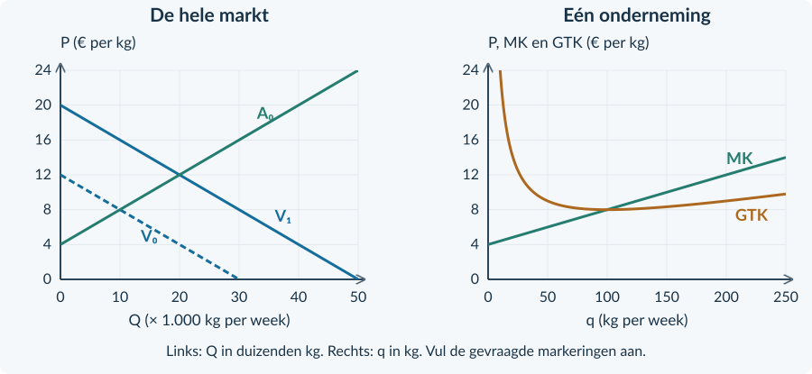

# Opgaven 3.2.4 — Gemengde opgaven

3.2.4 · GEMENGDE OPGAVEN: VOLKOMEN CONCURRENTIE

# Welke stap heb je nodig?
Je combineert nu de technieken uit het hoofdstuk. Er komen geen nieuwe begrippen of rekenregels bij. Let vooral op **voor welk bedrijf of welke markt**, en **op welk tijdstip**, de gegevens gelden.

<b>Doel</b> Je kunt vanuit een marktverandering de nieuwe ondernemingsbeslissing berekenen. Daarna kun je onder de gegeven aannames de langetermijnaanpassing uitleggen.

<b>Opgave 32 · Twee bronnen over meel</b>

<b>Bron A.</b> De vraag op een markt is Qv = 12.000 − 1.000P. Het aanbod is Qa = 2.000P. Q is kg per week; P is euro per kg. <b>Bron B.</b> Een kleine molen verkoopt dezelfde kwaliteit als de andere molens. Hij kan maximaal 150 kg per week leveren. Kopers kennen alle prijzen.

<b>a.</b> Bereken de marktprijs en de markthoeveelheid.

<b>b.</b> Bereken TO bij q = 100 en geef GO en MO. Leg uit waarom Q en q hier verschillen.

<b>c.</b> De molen plakt een prijs van € 4,50 op hetzelfde product. Leg uit waarom dat in dit model niet werkt.

<b>Werkwijze</b> Gebruik een bron waar die iets over zegt. Een marktvergelijking geeft nog geen productieadvies voor één onderneming; daarvoor heb je ook de kosten van die onderneming nodig.

### Oefenen met een ondernemingsbron

<b>Opgave 33 · Vezels voor verpakkingen</b>

Een prijsnemer ontvangt € 14 per kg. Voor zijn kosten geldt TK = 0,05q² + 4q + 200. q is kg per week; capaciteit: 140 kg. Alle productie kan tegen deze prijs worden verkocht. Constante kosten zijn deze week onvermijdbaar.

<b>a.</b> Stel MK op. Bepaal de beste haalbare q en controleer of de winst vóór en na die q stijgt of daalt.

<b>b.</b> Bereken TO, TK, winst en GTK bij deze q.

<b>c.</b> Beschrijf precies welke rechthoek de winst in een ondernemingsgrafiek zou weergeven. Je hoeft de grafiek niet opnieuw te tekenen.

<b>d.</b> Een leerling kiest de q met het laagste GTK. Leg uit waarom die methode bij deze marktprijs niet automatisch de hoogste totale winst geeft.

### Controleer je antwoord als één geheel
Je gevonden hoeveelheid, je kostenberekening en je omschrijving van de rechthoek moeten bij **dezelfde q** horen.

Een berekening kan op zichzelf juist zijn en toch niet bij de opgave passen. Bijvoorbeeld doordat je een markthoeveelheid in een ondernemingsfunctie invult, of GTK bij een andere q afleest.

<b>Drie controles</b> Is q haalbaar? Is de winst een totaalbedrag per week? En hoort de hoogte van de rechthoek bij GTK op precies deze q?

### Kies zelf de juiste onderbouwing

<b>Opgave 34 · De ruimte is de grens</b>

Een onderneming heeft MK = 0,20q + 4 en P = € 20 per kg. Zij kan maximaal 60 kg per week produceren. Haar constante kosten zijn deze week onvermijdbaar.

<b>a.</b> Bereken het snijpunt van MO en MK en bepaal de beste haalbare q.

<b>b.</b> Leg uit waarom verder zoeken naar een snijpunt binnen de capaciteit niet nodig is.

<b>c.</b> Welke extra kostengegevens heb je nodig om het totale winstbedrag te berekenen?

<b>Opgave 35 · Het aantal bedrijven verandert</b>

Ondernemingen produceren hetzelfde product met dezelfde onveranderde kosten. Het minimum GTK is € 8 per kg. Bij de huidige prijs van € 10 maken zij overwinst. Vraag blijft gelijk; toe- en uittreding zijn vrij.

<b>a.</b> Beschrijf de verwachte keten van toetreding tot de uiteindelijke prijs.

<b>b.</b> Noem de relatie tussen P, MO, MK en GTK in het langetermijnevenwicht.

<b>c.</b> Beoordeel: “Als er steeds meer bedrijven komen, wordt de uiteindelijke economische winst van ieder actief bedrijf negatief.”

<b>Voor de doeloefening</b> Daarna volgt één markt met drie momenten: vóór een vraagverandering, direct erna en na toetreding. De bronnen staan links; de vragen staan rechts.

## Doeloefening
### Opgave 36 · Kweekkorrels op drie momenten

<b>Bron A · De markt</b> Veel kleine bedrijven verkopen dezelfde kwaliteit kweekkorrels. Kopers kennen de prijzen. In de beginsituatie geldt: <b>Qv₀ = 30.000 − 2.500P</b> en <b>Qa₀ = 2.500P − 10.000</b>. Door een nieuwe toepassing neemt de vraag toe tot <b>Qv₁ = 50.000 − 2.500P</b>. Direct daarna zijn er nog geen bedrijven toegetreden: Qa₀ blijft gelden. Q is kg per week; P is euro per kg.

<b>Bron B · Eén onderneming</b> Voor iedere onderneming geldt <b>TK = 0,02q² + 4q + 200</b>. q is kg per week; capaciteit is 250 kg. De kosten zijn inclusief normale beloning. Alle productie wordt verkocht. Het minimum GTK is € 8 per kg bij q = 100.

<b>Bron C · Later</b> Na verloop van tijd kunnen bedrijven vrij toetreden of uittreden. Nieuwe bedrijven hebben dezelfde kosten. Vraag blijft Qv₁. Technologie en inputprijzen blijven gelijk. Bestaande bedrijven houden dezelfde productiecapaciteit.

<figure><figcaption>Figuur 1. Gebruik deze basisgrafieken. Markt: V₀, V₁ en A₀. Onderneming: MK en GTK.</figcaption></figure>

De vragen staan op de rechterpagina. Gebruik eerst de beginsituatie, daarna de situatie vóór toetreding en ten slotte de lange termijn. Laat tussenresultaten staan.

<b>Opgave 36 · Kweekkorrels: van markt naar bedrijf</b>

Gebruik bronnen A, B en C en figuur 1 op de linkerpagina.

<b>a.</b> (3p) Bereken in de beginsituatie P₀ en Q₀. Eén onderneming kiest dan q = 100. Controleer met TO en TK dat haar economische winst nul is.

<b>b.</b> (2p) Bereken direct na de vraagstijging, vóór toetreding, P₁ en Q₁. Markeer het nieuwe evenwicht E₁ in de marktgrafiek.

<b>c.</b> (3p) Stel MK op. Bepaal bij P₁ de winstmaximale q van één onderneming. Controleer de capaciteit en het verloop van MO en MK.

<b>d.</b> (3p) Bereken de economische winst en GTK bij die q. Teken rechts de nieuwe P = GO = MO-lijn en arceer de winstrechthoek.

<b>e.</b> (3p) Leg met bron C de langetermijnaanpassing uit. Bepaal de uiteindelijke prijs, de totale markthoeveelheid en q van één onderneming.

<b>f.</b> (2p) Beoordeel: “De markt wordt groter, dus elk oorspronkelijk bedrijf blijft op lange termijn meer produceren dan vóór de vraagstijging.” Vergelijk de drie q-uitkomsten en onderscheid die van Q.

<b>Afronden</b> Bereken met ongeronde tussenuitkomsten. Schrijf bij iedere hoeveelheid of deze bij de markt of één onderneming hoort. De ruimte hieronder kun je gebruiken voor je redenering.

## Denkertje / Bonusopgave

<b>Opgave 37 · Toetreding wordt duurder</b>

In opgave 36 bleven inputprijzen gelijk. Stel nu dat toetreding grond schaarser maakt. Daardoor stijgen de kosten van álle ondernemingen. Nieuwe minimum-GTK-waarden zijn niet gegeven.

<b>a.</b> Welk onderdeel van het oude langetermijnantwoord mag je niet zonder meer overnemen?

<b>b.</b> Geef aan wat je nog wél kunt uitleggen en voor welk getal je aanvullende informatie nodig hebt. Je hoeft geen nieuwe kostenfunctie te bedenken.

## Herhaling / Herhaling en interleaving

<b>Opgave 38 · Een laatste vergelijking</b>

Een ondernemer ontvangt P = € 12 per kg. Bij q = 100 zijn TO = € 1.200 en TK = € 1.000. Als q stijgt naar 110, neemt TO toe met € 120 en TK met € 150. Alle totale bedragen zijn per week.

<b>a.</b> Bereken GTK en winst bij q = 100.

<b>b.</b> Bereken MO en MK over de toename van 100 naar 110 kg. Neemt de winst over deze stap toe of af?

<b>c.</b> Waarom betekent een positieve totale winst bij q = 100 niet automatisch dat méér productie nog beter is?

<b>Je antwoord is af als…</b> Je niet alleen een uitkomst hebt, maar ook kunt aanwijzen welk marktmechanisme of welke marginale vergelijking erbij hoort.

