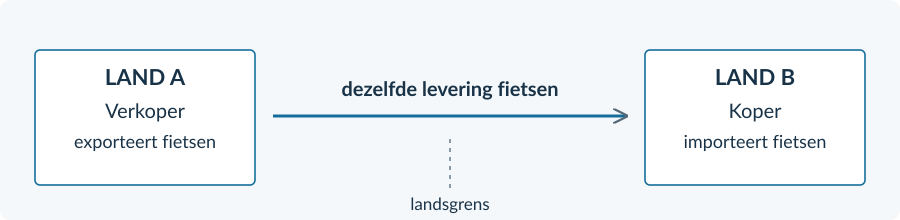
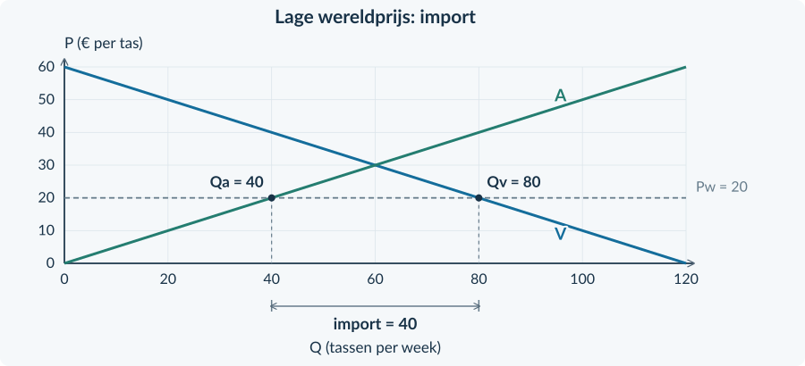
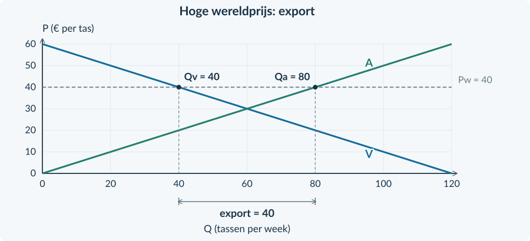
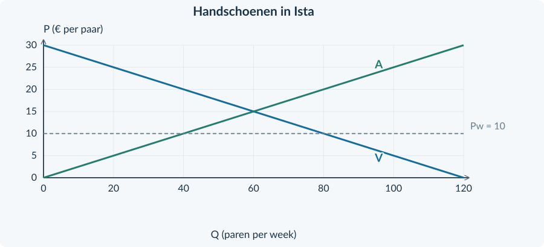
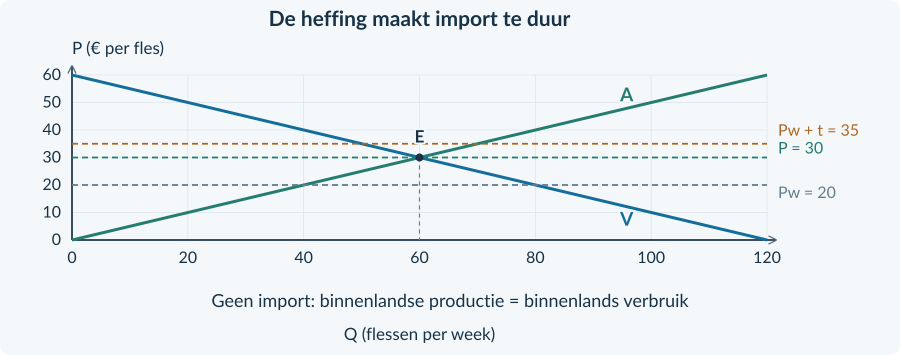

<!-- PAGE {"section": "3.3", "title": "Internationale handel"} -->

BOEK 3 · HOOFDSTUK 3 · ECONOMIE · 4 VWO

Internationale handel

Waarom handelen landen? En wie merkt daar de gevolgen van?

Een shirt, een fiets en een zak rijst kunnen een grens passeren voordat jij ze koopt. Handel verbindt de keuzes van kopers, producenten en overheden. Een voordeel voor de ene groep is niet automatisch een voordeel voor iedereen.
<figure><figcaption>Drie vragen verbinden dit hoofdstuk: waarom handelen, wat gebeurt er op de markt en wat verandert bescherming?</figcaption></figure>

<a href="#s331"><b>3.3.1 · Waarom landen handelen 2</b>Specialisatie, comparatief voordeel en concurrentiepositie</a>
<a href="#s332"><b>3.3.2 · Wereldmarktprijs, import, export en welvaart 11</b>Productie en verbruik uit elkaar houden</a>
<a href="#s333"><b>3.3.3 · Protectionisme: invoerheffingen en importquota 21</b>Een maatregel beoordelen vanuit verschillende belangen</a>
<a href="#s334"><b>3.3.4 · Gemengde opgaven: internationale handel 31</b>Bronnen, grafieken en berekeningen verbinden</a>
<a href="#overzicht"><b>Hoofdstukoverzicht en begrippen 38</b></a>

Werk in je schrift, tenzij een vraag om een markering in de gegeven figuur vraagt. Alle landen, ondernemingen, beleidsbronnen en cijfers zijn fictieve lesvoorbeelden. De grafieken zijn vereenvoudigde marktmodellen, geen actuele marktgegevens.

<!-- PAGE {"section": "3.3.1", "title": "Wat gaat de grens over?"} -->

3.3.1 · WAAROM LANDEN HANDELEN: SPECIALISATIE EN CONCURRENTIEPOSITIE

# Wat gaat de grens over?
Een fietsenmaker koopt onderdelen in het buitenland en verkoopt fietsen aan buitenlandse klanten. Is dit bedrijf nu een importeur of een exporteur? Het kan allebei zijn. Je kijkt steeds naar de richting van een bepaalde handelsstroom.

<b>Lesdoelen</b> Je kunt import, export en specialisatie uitleggen. Je kunt absoluut en comparatief voordeel onderscheiden zonder een productietabel uit te rekenen. Je kunt met brongegevens een concurrentiepositie verklaren en een uitspraak over handelsvoordelen beoordelen.

### Eén grens, twee gezichtspunten

<b>Import — invoer</b> Goederen en diensten kopen uit het buitenland.

<b>Export — uitvoer</b> Goederen en diensten verkopen aan het buitenland.
<figure><figcaption>Figuur 1. Dezelfde levering is export voor de verkoper in land A en import voor de koper in land B. De pijlen laten goederenstromen zien, geen geldstromen.</figcaption></figure>
De grens van het land bepaalt het gezichtspunt. Een levering van A aan B is dus niet voor beide landen export. Geld gaat bij betaling in de andere richting; dat werken we hier niet verder uit.
### Waarom niet alles zelf maken?
Productiemiddelen zijn schaars. Wie ze voor het ene product gebruikt, kan ze niet tegelijk voor iets anders gebruiken. Door zich meer op bepaalde activiteiten te richten en te ruilen, kunnen landen hun mogelijkheden beter benutten.

<!-- PAGE {"section": "3.3.1", "title": "Sterk zijn is niet hetzelfde als relatief sterk zijn"} -->

### Eerst het absolute voordeel
Stel: werkplaatsen in Linde maken met dezelfde hoeveelheid productiemiddelen meer machines én meer tassen dan werkplaatsen in Maris. De producten zijn van dezelfde kwaliteit. Linde heeft dan in beide activiteiten een <b>absoluut voordeel</b>.

<b>Absoluut voordeel</b> Een product met minder productiemiddelen kunnen maken dan een ander land, bij dezelfde kwaliteit.

Dat betekent nog niet dat Linde ook alles zelf moet maken. De productiemiddelen die het voor tassen gebruikt, kunnen niet tegelijk machines maken.
### Dan de vergelijking tussen activiteiten
In dit voorbeeld is Lindes voorsprong bij machines groot en bij tassen klein. Een extra tas kost Linde relatief veel opgegeven machineproductie. Maris geeft voor een extra tas minder machineproductie op.
<figure><figcaption>Figuur 2. De bron geeft een kwalitatieve vergelijking. Linde is in beide activiteiten absoluut sterker, maar de relatieve voorsprong verschilt. Er staan geen te berekenen productieverhoudingen.</figcaption></figure>
<b>Comparatief voordeel</b> Een product maken met lagere alternatieve kosten dan een ander land. Je geeft er relatief minder andere productie voor op.

Linde heeft hier een comparatief voordeel bij machines. Maris heeft dat bij tassen, ook al is Maris bij beide activiteiten absoluut minder productief.

<b>Niet verwisselen</b> <b>Absoluut:</b> wie gebruikt voor hetzelfde product minder middelen? <b>Comparatief:</b> wie offert relatief minder andere productie op?

<!-- PAGE {"section": "3.3.1", "title": "Van specialisatie naar mogelijke winst"} -->

### Meer van wat relatief gunstig is

<b>Specialisatie</b> Je sterker toeleggen op bepaalde activiteiten of producten. Dat hoeft niet te betekenen dat je nog maar één product maakt.

Linde kan meer machines maken en Maris meer tassen. Daarna kunnen zij een deel van die productie verhandelen. Zo hoeven zij minder van de andere productie op te geven dan wanneer ieder land alles zelf blijft maken.
<figure><figcaption>Figuur 3. Relatief minder opofferen maakt wederzijds voordeel mogelijk. De afspraken over de ruil moeten voor beide partijen aantrekkelijk zijn.</figcaption></figure>
### Concurrentiepositie: een andere vraag
Een buitenlandse klant vergelijkt niet alleen productiemiddelen. Ook de verkoopprijs, kwaliteit en betrouwbaarheid van levering kunnen de keuze bepalen.

<b>Concurrentiepositie</b> De mogelijkheden van producenten om te concurreren met andere aanbieders, bijvoorbeeld door prijs, kwaliteit en betrouwbare levering.

Een lesbron kan melden dat een producent weinig defecte producten levert of snel kan bezorgen. Dat ondersteunt een verklaring van zijn concurrentiepositie. Het bewijst niet meteen een comparatief voordeel: daarvoor moet je de alternatieve kosten van activiteiten vergelijken.
### Voordeel voor een land is niet voordeel voor iedereen
Kopers kunnen goedkopere producten vinden. Exporteurs kunnen meer afzetten. Maar een binnenlandse producent die met import concurreert, kan klanten verliezen. Werknemers kunnen daardoor ander werk moeten zoeken.

<b>Een zorgvuldige conclusie</b> Handel kan gezamenlijk voordeel opleveren. Uit dat gezamenlijke voordeel volgt niet dat elke producent, koper of werknemer erop vooruitgaat.

<!-- PAGE {"section": "3.3.1", "title": "Een redenering in vier stappen"} -->

## Uitgewerkt voorbeeld

<b>Lesbron · Sol en Terra</b> In beide landen kunnen productiemiddelen worden ingezet voor muziekinstrumenten of kleding van dezelfde kwaliteit. Sol heeft voor beide producten minder middelen nodig dan Terra. Sols voorsprong is groot bij instrumenten en klein bij kleding. Voor extra kleding offert Sol relatief veel instrumenten op; Terra offert daarvoor minder instrumenten op. Instrumenten uit Sol zijn bovendien bekend om betrouwbare levering. Kledingbedrijven in Sol vrezen klanten te verliezen aan import.

**Vraag.** Leg uit welke specialisatie past, hoe handel beide landen kan helpen en waarom niet iedereen hoeft te winnen.

**1 · Lees wat absoluut is.** Sol heeft voor beide producten minder middelen nodig. Het heeft dus bij beide een absoluut voordeel.

**2 · Zoek de alternatieve kosten.** Terra offert relatief minder instrumenten op als het extra kleding maakt. Terra heeft daarom een comparatief voordeel bij kleding; Sol bij instrumenten.

**3 · Verbind specialisatie aan handel.** Sol richt zich meer op instrumenten en Terra meer op kleding. Bij voor beide gunstige ruilafspraken kunnen beide landen profiteren. Kleding van Terra naar Sol is export van Terra en import van Sol.

**4 · Beoordeel de claim per groep.** Betrouwbare levering ondersteunt Sols concurrentiepositie bij instrumenten. Maar kledingbedrijven in Sol kunnen klanten verliezen. “Sol maakt efficiënter, dus iedereen wint” gaat verder dan de bron ondersteunt.

<b>Onthouden</b> Import komt binnen; export gaat naar buiten. Absoluut voordeel gaat over benodigde middelen. Comparatief voordeel gaat over opgegeven andere productie. Specialisatie kan beide landen helpen, maar niet automatisch alle groepen. In §3.3.2 bekijken we de marktprijs.

<!-- PAGE {"section": "3.3.1", "title": "Ophalen en herkennen"} -->

## Startopgaven

<b>Korte route:</b> Startopgaven → Zelfstandige oefening → Doeloefening. Extra hulp nodig? Maak eerst Begeleide inoefening.

<b>Opgave 1 · Wat geef je op?</b>

Een school heeft één lokaal vrij. Het kan worden gebruikt voor een oefenband of voor een tekenclub. Beide activiteiten kunnen er niet tegelijk plaatsvinden.

<b>a.</b> Wat zijn de alternatieve kosten als de school voor de oefenband kiest? Noem de opgegeven mogelijkheid, niet een verzonnen geldbedrag.

<b>b.</b> Leg uit waarom dezelfde vraag relevant is als een land productiemiddelen voor extra tassen gebruikt.

<b>Opgave 2 · Richting en betekenis</b>

Een bedrijf in Nera koopt hout uit Osta. Het verkoopt afgewerkte meubels terug aan Osta.

<b>a.</b> Noem vanuit Nera één importstroom en één exportstroom.

<b>b.</b> Een leerling noemt een lage winkelprijs bewijs voor een comparatief voordeel. Welke informatie mist nog?

## Begeleide inoefening

Heb je deze hulp niet nodig? Ga dan verder met Zelfstandige oefening.

<b>Opgave 3 · Lees eerst de vergelijking</b>

Gebruik de lesbron over Sol en Terra in het uitgewerkte voorbeeld.

<b>a.</b> Onderstreep het brongegeven over benodigde productiemiddelen. Welk soort voordeel toont dat?

<b>b.</b> Omcirkel het brongegeven over opgegeven andere productie. Bij welk product heeft Terra een comparatief voordeel?

<b>c.</b> Maak af: “Terra kan zich meer richten op …, omdat het daarvoor relatief minder … opgeeft.”

<!-- PAGE {"section": "3.3.1", "title": "Een bron ordenen"} -->

Begeleide inoefening · vervolg

<b>Lesbron · Twee veranderingen bij een producent</b> Een producent in Canto maakt rugzakken. Hij gebruikt voortaan minder materiaal voor dezelfde kwaliteit. Tegelijk worden zijn leveringen minder betrouwbaar. Een inkoper betaalt graag minder, maar wil de rugzakken wel op tijd ontvangen. De bron geeft geen informatie over Canto’s andere productieactiviteiten.

<b>Opgave 4 · Goedkoper én minder betrouwbaar</b>

Beoordeel de twee veranderingen eerst apart. Gebruik daarna de tabel als steun.

<b>a.</b> Leg uit hoe minder materiaalgebruik de concurrentiepositie kan verbeteren, als het de kosten verlaagt.

<b>b.</b> Leg uit hoe de minder betrouwbare levering de concurrentiepositie kan verzwakken.

<b>c.</b> Is de concurrentiepositie per saldo zeker verbeterd? Geef aan welke informatie over de inkoper je nodig hebt.

<b>d.</b> Een leerling zegt: “Minder materiaalgebruik bewijst een comparatief voordeel.” Leg uit waarom deze bron daarvoor onvoldoende is.

| Bronfeit | Mogelijk gevolg | Wat volgt er niet zeker uit? |
|---|---|---|
| Minder materiaal, dezelfde kwaliteit | Lagere kosten mogelijk | Dat de verkoopprijs werkelijk daalt |
| Minder betrouwbare levering | Inkoper kan afhaken | Dat alle klanten afhaken |
| Geen vergelijking met andere activiteiten | — | Een bewezen comparatief voordeel |

### Van bronfeit naar conclusie
Een sterk antwoord benoemt het bronfeit, legt het economische verband uit en begrenst de conclusie. Schrijf bijvoorbeeld niet alleen “slechter”, maar noem **voor wie** en **waardoor**.
<figure><figcaption>Figuur 4. Drie onderdelen van een onderbouwd antwoord. Bij zelfstandige opgaven kies je deze onderdelen zelf.</figcaption></figure>

<!-- PAGE {"section": "3.3.1", "title": "Zelf een conclusie onderbouwen"} -->

## Zelfstandige oefening

<b>Lesbron · Riva en Sora</b> Riva kan gereedschap en servies met minder productiemiddelen maken dan Sora. De kwaliteitsverschillen zijn verwaarloosbaar. De voorsprong is vooral groot bij gereedschap. Voor extra servies moet Riva relatief veel gereedschap opgeven; Sora geeft voor extra servies minder gereedschap op. Beide landen willen beide producten gebruiken.

<b>Opgave 5 · Ook de minder sterke producent kan meedoen</b>

Gebruik de lesbron.

<b>a.</b> Welk land heeft in beide activiteiten een absoluut voordeel? Onderbouw met het juiste brongegeven.

<b>b.</b> Welke richting van specialisatie past bij de comparatieve voordelen? Leg uit met alternatieve kosten.

<b>c.</b> Beschrijf één mogelijke goederenstroom en benoem die vanuit beide landen.

<b>d.</b> Leg uit waarom de uitspraak “Sora kan beter nergens aan beginnen” onjuist is. Welke voorwaarde is nodig voor wederzijds voordeel door ruil?

<b>Lesbron · Een exportorder</b> Een producent van tentdoek krijgt een exportorder. De buitenlandse koper kiest hem vanwege dezelfde lage prijs als concurrenten, maar minder defecten. Andere binnenlandse producenten verliezen deze order. Over de werkgelegenheid in andere bedrijfstakken bevat de bron geen cijfers.

<b>Opgave 6 · Concurrentie is meer dan prijs</b>

Gebruik de lesbron.

<b>a.</b> Welk bronfeit verklaart de gewonnen order? Verbind dat feit aan concurrentiepositie.

<b>b.</b> Beoordeel: “De exportorder bewijst dat alle binnenlandse ondernemingen en werknemers beter af zijn.”

<!-- PAGE {"section": "3.3.1", "title": "Laat zien wat je kunt"} -->

## Doeloefening

<b>Lesbron · Aster en Brin</b> Werkplaatsen in Aster en Brin maken pompen en jassen van dezelfde kwaliteit. Dezelfde productiemiddelen kunnen voor beide activiteiten worden ingezet. Aster heeft voor beide producten minder middelen nodig dan Brin. Zijn voorsprong is groot bij pompen en klein bij jassen. Voor een extra jas offert Aster relatief veel pompen op. Brin offert daarvoor minder pompen op.  Beide landen willen pompen én jassen. Zij kunnen zonder hoge transportkosten handelen. Asters pompen worden op tijd geleverd; buitenlandse kopers waarderen dat. Jassenmakers in Aster verwachten klanten te verliezen aan jassen uit Brin.

<b>Opgave 7 · Handelen ondanks twee absolute voordelen</b>

Gebruik alleen de lesbron. Reken geen productieverhoudingen uit.

<b>a.</b> (2p) Welk land heeft een absoluut voordeel bij beide producten? Noem het brongegeven waarop je dat baseert.

<b>b.</b> (3p) Leg uit bij welk product elk land een comparatief voordeel heeft. Gebruik het begrip alternatieve kosten.

<b>c.</b> (2p) Beschrijf een passende richting van specialisatie en een bijbehorende handelsstroom. Benoem import en export vanuit de twee landen.

<b>d.</b> (2p) Leg uit onder welke voorwaarde de ruil beide landen voordeel kan opleveren. Gebruik daarnaast één bronfeit om Asters concurrentiepositie bij pompen te verklaren.

<b>e.</b> (2p) Een adviseur zegt: “Aster produceert beide goederen efficiënter, dus handel maakt alle inwoners van Aster beter af.” Beoordeel de uitspraak met een concrete groep uit de bron.

<b>Controleer je antwoord</b> Heb je middelen en alternatieve kosten onderscheiden? Heb je bij de conclusie een concrete groep genoemd?

<!-- PAGE {"section": "3.3.1", "title": "Verder denken en terughalen"} -->

## Denkertje / Bonusopgave

<b>Opgave 8 · Twee woorden, twee vragen</b>

Een advertentie zegt: “Onze koekjes zijn de goedkoopste. Daarom heeft ons land een comparatief voordeel bij koekjes.”

<b>a.</b> Schrijf een korte reactie die uitlegt wat de advertentie wél zegt en wat zij niet bewijst.

<b>b.</b> Ontwerp twee korte, kwalitatieve bronzinnen die een comparatief-voordeelredenering mogelijk maken. Gebruik koekjes en één ander product, maar geen productiegetallen.

## Herhaling / Herhaling en interleaving

<b>Opgave 9 · De oude basis telt</b>

Een winkelprijs stijgt van € 20 naar € 25.

<b>a.</b> Bereken de procentuele prijsstijging.

<b>b.</b> De prijs gaat daarna terug naar € 20. Is de procentuele daling even groot? Onderbouw met een berekening.

<b>Opgave 10 · Het verschil tussen opbrengst en voordeel</b>

Een koper wil voor een tas maximaal € 35 betalen. De verkoopprijs is € 25. Een winkel verkoopt 40 tassen voor die prijs.

<b>a.</b> Bereken het consumentensurplus van deze ene koper.

<b>b.</b> Bereken de totale opbrengst van de winkel. Leg uit waarom dit niet het consumentensurplus van alle kopers is.

<b>Neem mee</b> Een land is geen enkele koper of producent. In de volgende paragraaf houd je binnenlandse kopers, binnenlandse producenten en buitenlandse handel uit elkaar.

<!-- PAGE {"section": "3.3.2", "title": "Eén prijs, twee hoeveelheden"} -->

3.3.2 · WERELDMARKTPRIJS, IMPORT, EXPORT EN WELVAART

# Eén prijs, twee hoeveelheden
Zonder buitenlandse handel kosten tassen in een oefenland € 30. Buitenlandse aanbieders willen dezelfde tassen leveren voor € 20. Waarom zouden binnenlandse kopers dan nog € 30 betalen?

<b>Lesdoelen</b> Je kunt een wereldmarktprijs vergelijken met de prijs zonder handel. Je kunt binnenlandse productie, binnenlands verbruik en import of export bepalen. Je kunt met prijs en hoeveelheid uitleggen wat binnenlandse kopers en producenten merken.

<b>Wereldmarktprijs</b> De gegeven prijs waartegen het land op de wereldmarkt kan kopen of verkopen. We noteren die prijs als Pw.

### Het model dat we gebruiken
Het land is **klein en prijsnemend**: zijn handel verandert de wereldmarktprijs niet. Er zijn veel concurrerende kopers en verkopers. Binnenlandse en buitenlandse producten zijn gelijkwaardig. Er is voldoende buitenlands aanbod én voldoende buitenlandse vraag tegen Pw.

We rekenen in euro’s, zonder veranderende wisselkoers. Er zijn geen transportkosten, heffingen of andere handelsbelemmeringen. We laten effecten op derden buiten de welvaartsvergelijking.
<figure><figcaption>Figuur 1. Dezelfde marktvaardigheid krijgt drie betekenissen: Qa is binnenlandse productie, Qv is binnenlands verbruik en het verschil gaat over de grens.</figcaption></figure>
### Niet opnieuw oplossen, maar anders lezen
Zonder handel vind je de prijs bij Qv = Qa. Met handel is de prijs gegeven. Lees bij die prijs **twee** hoeveelheden af. Die hoeven niet gelijk te zijn: het buitenland kan het verschil kopen of leveren.

<!-- PAGE {"section": "3.3.2", "title": "Een lage wereldprijs: import"} -->

### Volg de prijslijn van links naar rechts
De tassenmarkt heeft Qv = 120 − 2P en Qa = 2P. P is euro per tas; Q is tassen per week. Zonder handel ligt het evenwicht bij P = € 30 en Q = 60.

Bij Pw = € 20 willen binnenlandse producenten 40 tassen leveren. Binnenlandse kopers willen er 80 gebruiken. De resterende 40 tassen komen uit het buitenland.
<figure><figcaption>Figuur 2. Import is het horizontale verschil tussen binnenlands verbruik en binnenlandse productie bij dezelfde wereldmarktprijs.</figcaption></figure>
<b>Bij import</b> Import = Qv − Qa 80 − 40 = 40 tassen per week

### Wat verandert er ten opzichte van geen handel?
De prijs daalt van € 30 naar € 20. Binnenlandse producenten produceren minder: van 60 naar 40. Kopers nemen juist meer af: van 60 naar 80. Zij kopen zowel binnenlandse als ingevoerde tassen.

<b>Veelgemaakte fout</b> “Het land verbruikt 80 tassen, dus het produceert 80 tassen.” Nee: het produceert er 40 en importeert er 40. Tel productie en import op om het binnenlandse verbruik te controleren.

<!-- PAGE {"section": "3.3.2", "title": "Een hoge wereldprijs: export"} -->

### De richting keert om
Neem dezelfde tassenmarkt, maar nu is de wereldmarktprijs € 40. Buitenlandse kopers kunnen voldoende tassen afnemen. Binnenlandse producenten hoeven daarom niet voor € 30 aan binnenlandse kopers te verkopen.

Bij € 40 willen producenten 80 tassen leveren. Binnenlandse kopers willen er 40 gebruiken. De overige 40 tassen worden uitgevoerd.
<figure><figcaption>Figuur 3. Bij export ligt binnenlandse productie rechts van binnenlands verbruik. Het verschil wordt verkocht aan buitenlandse kopers.</figcaption></figure>
<b>Bij export</b> Export = Qa − Qv 80 − 40 = 40 tassen per week

| Vergeleken met geen handel | Import bij lage Pw | Export bij hoge Pw |
|---|---|---|
| Binnenlandse prijs | Daalt | Stijgt |
| Binnenlandse productie | Daalt | Stijgt |
| Binnenlands verbruik | Stijgt | Daalt |
| Handel vult aan bij… | Het binnenlandse aanbod | De binnenlandse vraag |

De aanbodlijn en vraaglijn zijn niet verschoven. Een **andere gegeven prijs** leidt tot andere hoeveelheden langs dezelfde lijnen.

<!-- PAGE {"section": "3.3.2", "title": "Wie profiteert van de nieuwe prijs?"} -->

### Een bekend surplus, een nieuwe verdeling
Uit Boek 2 ken je consumentensurplus: het verschil tussen betalingsbereidheid en betaalde prijs. Producentensurplus ligt boven de aanbodlijn en onder de prijs, voor de eenheden die binnenlandse producenten leveren.
<figure><figcaption>Figuur 4. Bij import groeit CS en krimpt PS. Let op de verschillende rechtergrenzen: CS hoort bij binnenlands verbruik; PS bij binnenlandse productie. Beide panelen hebben dezelfde asschalen.</figcaption></figure>
### Het gezamenlijke resultaat en de afzonderlijke groepen
In dit model is het voordeel voor kopers bij import groter dan het nadeel voor binnenlandse producenten. Het binnenlandse totale surplus, CS + PS, stijgt. Maar het nadeel voor producenten verdwijnt niet door deze optelling.

Bij export draait de verdeling om. Binnenlandse producenten ontvangen een hogere prijs en leveren meer. Binnenlandse kopers betalen meer en kopen minder. Onder dezelfde modelaannames stijgt ook hier het binnenlandse totale surplus.

<b>Wél concluderen, niet overdrijven</b> <b>Wél:</b> de markt biedt in dit model een gezamenlijk handelsvoordeel. <b>Niet:</b> alle inwoners winnen, alle banen blijven bestaan of iedere verdeling is eerlijk.

We bekijken het surplus van **binnenlandse** kopers en producenten. We rekenen niet het hele welzijn van de samenleving uit. De figuren helpen hier de richting uit te leggen; een volledige oppervlakterekening is niet nodig.

<!-- PAGE {"section": "3.3.2", "title": "Van grafiek naar handelsstroom"} -->

## Uitgewerkt voorbeeld

<b>Lesbron · Sporthelmen in Elva</b> Elva is een klein prijsnemend land met concurrerende aanbieders. Het model op pagina 11 geldt. Zonder handel is de prijs € 40. De wereldmarktprijs is € 30. De gegeven lijnen zijn Qv = 140 − 2P en Qa = 2P − 20. Q is sporthelmen per week; P is euro per helm.
<figure><figcaption>Figuur 5. Lees bij € 30 eerst het aanbod en daarna de vraag. Het verschil is de import van sporthelmen.</figcaption></figure>
**1 · Vergelijk de prijzen.** € 30 is lager dan € 40. Elva importeert.

**2 · Bepaal productie en verbruik.**

Qa = 2 × 30 − 20 = 40 helmen per week Qv = 140 − 2 × 30 = 80 helmen per week

**3 · Bereken het verschil.** Import = 80 − 40 = **40 helmen per week**. Controle: 40 binnenlandse helmen + 40 import = 80 verbruik.

**4 · Leg het gevolg uit.** Kopers betalen minder en gebruiken meer helmen; hun CS stijgt. Binnenlandse producenten ontvangen minder en leveren minder; hun PS daalt. Een hoger totaal surplus betekent niet dat deze producenten ook winnen.

<b>Onthouden</b> Lees bij één prijs twee hoeveelheden. Import = Qv − Qa; export = Qa − Qv. Benoem productie, verbruik en handelsstroom met de juiste eenheid. In §3.3.3 veranderen we de toegang tot buitenlandse producten.

<!-- PAGE {"section": "3.3.2", "title": "De bekende techniek terughalen"} -->

## Startopgaven

<b>Korte route:</b> Startopgaven → Zelfstandige oefening → Doeloefening. Extra hulp nodig? Maak eerst Begeleide inoefening.

<b>Opgave 11 · Invullen bij een prijs</b>

Op een markt geldt Qv = 100 − 2P en Qa = 2P − 20. P is euro per product; Q is producten per week.

<b>a.</b> Bereken Qv en Qa bij P = € 20.

<b>b.</b> Welke hoeveelheid hoort bij kopers en welke bij binnenlandse producenten?

<b>Opgave 12 · Welk getal is import?</b>

Een klein land produceert 30 kratten en verbruikt 70 kratten per week. De wereldmarkt levert het verschil.

<b>a.</b> Hoeveel kratten worden geïmporteerd?

<b>b.</b> Een leerling noemt 70 kratten “de import”. Leg de verwarring uit.

## Begeleide inoefening

Heb je deze hulp niet nodig? Ga dan verder met Zelfstandige oefening.

<b>Opgave 13 · Lees de drie labels</b>

Gebruik de volledig ingevulde importgrafiek van tassen in figuur 2 op pagina 12.

<b>a.</b> Wijs de wereldprijslijn aan. Welk punt op de aanbodlijn bepaalt de binnenlandse productie?

<b>b.</b> Welk punt op de vraaglijn bepaalt het binnenlandse verbruik? Leg daarna de importpijl in woorden uit.

<b>c.</b> Leg met de prijsverandering uit waarom kopers en binnenlandse producenten hier niet hetzelfde belang hebben.

<!-- PAGE {"section": "3.3.2", "title": "Minder labels, dezelfde werkwijze"} -->

Begeleide inoefening · vervolg

<b>Lesbron · Handschoenen in Ista</b> Ista is klein en prijsnemend. Het model op pagina 11 geldt. De prijs zonder handel is € 15 per paar. De wereldmarktprijs is € 10. Onderstaande grafiek is gegeven; Q is paren handschoenen per week.
<figure><figcaption>Figuur 6. Vraag, aanbod en de wereldprijslijn zijn gegeven. Benoem zelf de twee binnenlandse hoeveelheden en de handelsstroom.</figcaption></figure>

<b>Opgave 14 · Waar komt het verschil vandaan?</b>

Gebruik figuur 6. Je hoeft de lijnen niet opnieuw te tekenen.

<b>a.</b> Lees bij € 10 de binnenlandse productie en het binnenlandse verbruik af. Schrijf “productie” en “verbruik” bij de juiste hoeveelheden.

<b>b.</b> Markeer het horizontale verschil, benoem import of export en bereken de hoeveelheid.

<b>c.</b> Beschrijf het effect op binnenlandse kopers en producenten ten opzichte van de prijs zonder handel. Gebruik CS en PS.

<b>Eenheid eerst</b> De horizontale as meet paren per week. Een uitkomst van 40 is dus geen geldbedrag en ook niet het aantal producenten.

<!-- PAGE {"section": "3.3.2", "title": "Zelfstandig lezen en uitleggen"} -->

## Zelfstandige oefening

<b>Lesbron · Opbergboxen in Kora</b> Kora is klein en prijsnemend. Het model op pagina 11 geldt. Zonder handel is de prijs € 20 per box. De wereldmarktprijs is € 15. De tabel geeft hoeveelheden per week.

| Prijs per box | Binnenlandse vraag Qv | Binnenlands aanbod Qa |
|---|---:|---:|
| € 15 | 90 | 30 |
| € 20 | 60 | 60 |
| € 25 | 30 | 90 |

<b>Opgave 15 · Drie hoeveelheden</b>

Gebruik de lesbron en tabel.

<b>a.</b> Bepaal productie en verbruik met handel en bereken import of export.

<b>b.</b> Leg met een prijsgegeven én een hoeveelheidsgegeven uit welk gevolg binnenlandse producenten ondervinden.

<b>c.</b> Wat gebeurt er met het consumentensurplus? Betekent een hoger totaal surplus dat niemand verliest?

<b>Lesbron · Kaas in Vela</b> Op een andere oefenmarkt geldt dezelfde prijsnemende aanname. De prijs zonder handel is € 6 per kg. Door vrije handel wordt de prijs € 8. Bij € 8 produceren binnenlandse producenten 90 kg en verbruiken binnenlandse kopers 50 kg per week.

<b>Opgave 16 · De andere handelsrichting</b>

Gebruik alleen de lesbron over Vela.

<b>a.</b> Bereken de export per week.

<b>b.</b> Leg uit waarom export hier binnenlandse producenten helpt, maar binnenlandse kopers benadeelt.

<b>c.</b> Waarom bepaalt Vela met deze export niet zelf de wereldmarktprijs?

<!-- PAGE {"section": "3.3.2", "title": "Laat zien wat je kunt"} -->

## Doeloefening

<b>Lesbron · Kampeermatten in Noro</b> Noro is een klein land met concurrerende aanbieders. Binnenlandse en buitenlandse matten zijn gelijkwaardig. Buitenlandse aanbieders leveren voldoende tegen € 30 per mat; Noro beïnvloedt die prijs niet. Er zijn geen transportkosten, handelsbelemmeringen of effecten op derden. Alle prijzen zijn in euro. Zonder handel kosten de matten € 40.
<figure><figcaption>Figuur 7. De binnenlandse markt voor kampeermatten. Q is matten per week. Gebruik de gegeven prijslijn en asschalen.</figcaption></figure>

<b>Opgave 17 · Import en binnenlandse belangen</b>

Gebruik de lesbron en figuur 7.

<b>a.</b> (3p) Lees bij de wereldmarktprijs de binnenlandse productie en het binnenlandse verbruik af. Bereken de import per week.

<b>b.</b> (2p) Leg uit wat binnenlandse producenten merken ten opzichte van de situatie zonder handel. Gebruik prijs én productie.

<b>c.</b> (2p) Leg uit wat er met het consumentensurplus van binnenlandse kopers gebeurt.

<b>d.</b> (2p) Een leerling zegt: “Het totale surplus stijgt, dus alle groepen gaan erop vooruit.” Beoordeel met een concrete groep.

<b>e.</b> (1p) Waarom verandert de wereldmarktprijs in dit model niet als Noro meer importeert?

<!-- PAGE {"section": "3.3.2", "title": "Een prijs is niet altijd voor iedereen bereikbaar"} -->

## Denkertje / Bonusopgave

<b>Opgave 18 · Een verborgen transportprobleem</b>

Een land kan graan voor een lage wereldmarktprijs kopen. Een afgelegen dorp heeft echter geen bruikbare vervoersverbinding met de haven.

<b>a.</b> Welke aanname uit het marktmodel gaat voor dit dorp niet op?

<b>b.</b> Beoordeel: “Omdat de wereldprijs laag is, betalen alle inwoners automatisch die lage prijs.” Leg uit welke informatie nodig is om de dorpsprijs te beoordelen.

## Herhaling / Herhaling en interleaving

<b>Opgave 19 · Relatief minder opofferen</b>

Pavo heeft een groot absoluut voordeel bij meetapparatuur en een klein absoluut voordeel bij schoenen. Voor extra schoenen offert het relatief veel meetapparatuur op. Runo offert voor schoenen minder meetapparatuur op.

<b>a.</b> Welk comparatief voordeel heeft Runo? Leg uit zonder een verhouding uit te rekenen.

<b>b.</b> Waarom verhindert Pavo’s absolute voordeel niet dat Runo kan exporteren?

<b>Opgave 20 · Een prijsnemende onderneming</b>

Een kleine onderneming verkoopt 80 producten per week voor een gegeven prijs van € 5. Zij kan haar hele productie bij die prijs verkopen.

<b>a.</b> Bereken TO en GO.

<b>b.</b> Wat is MO wanneer zij bij dezelfde prijs nog 10 producten verkoopt? Laat de extra opbrengst en de extra hoeveelheid zien.

<b>Neem mee</b> Bij vrije handel komt de binnenlandse prijs overeen met de wereldprijs onder de genoemde aannames. Een invoerheffing kan een verschil maken tussen die twee prijzen.

<!-- PAGE {"section": "3.3.3", "title": "Beschermen: voor wie?"} -->

3.3.3 · PROTECTIONISME: INVOERHEFFINGEN EN IMPORTQUOTA

# Beschermen: voor wie?
Een producent verliest klanten aan goedkopere import. Hij vraagt de regering om bescherming. Een winkelier protesteert: zijn klanten willen juist goedkoop kunnen kopen. Beiden kijken naar dezelfde markt, maar niet vanuit hetzelfde belang.

<b>Lesdoelen</b> Je kunt het doel en de gevolgen van protectionisme onderscheiden. Je kunt resterende import en heffingsopbrengst berekenen. Je kunt een invoerheffing vergelijken met een importquotum en herkennen wanneer import verdwijnt.

<b>Protectionisme</b> Maatregelen die binnenlandse producenten beschermen tegen buitenlandse concurrentie door handel te beperken.

### Een doel is nog geen uitkomst
Een overheid kan minder afhankelijk willen zijn van buitenlandse levering of binnenlandse productie willen behouden. Een bron moet duidelijk maken welk doel hier speelt. Daarna onderzoek je of de maatregel bij dat doel past en wie de gevolgen ondervindt.

| Mogelijk doel uit een bron | Vraag bij de beoordeling |
|---|---|
| Binnenlandse productie behouden | Stijgt de binnenlandse productie? Wie betaalt meer? |
| Minder afhankelijk worden | Blijft voldoende binnenlandse levering mogelijk? |
| Tijdelijk ruimte geven voor aanpassing | Is duidelijk hoe en wanneer de bescherming eindigt? |

### Twee instrumenten
Een **invoerheffing** maakt ingevoerde producten duurder. Een **importquotum** begrenst hoeveel er mogen worden ingevoerd. Beide kunnen import verminderen, maar ze werken niet op dezelfde manier.
<figure><figcaption>Figuur 1. Vraag steeds naar het doel, het mechanisme en de gevolgen voor afzonderlijke groepen. De bron bepaalt welke afweging je kunt maken.</figcaption></figure>
<b>We veranderen één aanname</b> Het kleine prijsnemende land en de concurrerende markt blijven. Nu vervalt de aanname van vrije invoer. We voegen niet tegelijk veranderende wisselkoersen of effecten op derden toe.

<!-- PAGE {"section": "3.3.3", "title": "Een heffing op ingevoerde producten"} -->

### Eerst de prijs, dan de hoeveelheden
Op de markt voor drinkflessen is de wereldprijs € 20 per fles. De overheid heft € 5 per ingevoerde fles. De importeur draagt de heffing af. Zolang import blijft plaatsvinden, komt een buitenlandse fles daarmee voor € 25 beschikbaar.

<b>Invoerheffing per eenheid</b> Een bedrag dat bij invoer per product aan de overheid moet worden betaald. De heffing geldt hier alleen voor ingevoerde producten.
<figure><figcaption>Figuur 2. De binnenlandse prijs stijgt van € 20 naar € 25. De binnenlandse productie neemt toe van 40 naar 50; het verbruik daalt van 80 naar 70. De import wordt kleiner.</figcaption></figure>
In het model concurreren identieke binnenlandse en ingevoerde flessen met elkaar. Binnenlandse producenten kunnen daardoor ook € 25 ontvangen. Zij dragen deze **invoer**heffing niet af over hun eigen binnenlandse productie.

<b>Zolang er import is</b> Binnenlandse prijs = wereldmarktprijs + heffing € 20 + € 5 = € 25 per fles

De binnenlandse aanbodlijn blijft staan; producenten bewegen langs die lijn. De wereldprijs blijft € 20: dit kleine land verandert die niet. De stijging van de binnenlandse prijs is dus niet hetzelfde als een hogere ontvangst voor de buitenlandse producent.

<b>Het is geen belasting op alle verkoop</b> Bij een algemene productbelasting kan elke verkochte eenheid belast zijn. Hier gaat het uitsluitend om de eenheden die de grens binnenkomen.

<!-- PAGE {"section": "3.3.3", "title": "De overheid ontvangt over de import"} -->

### De juiste breedte van de rechthoek
Na de heffing gebruiken binnenlandse kopers 70 flessen. Binnenlandse producenten leveren er 50. Er worden dus nog maar 20 flessen ingevoerd.
<figure><figcaption>Figuur 3. De hoogte is € 5 per geïmporteerde fles. De breedte is 20 geïmporteerde flessen per week, niet 70 verkochte flessen.</figcaption></figure>
<b>Heffingsopbrengst</b> Import na de heffing = Qv − Qa = 70 − 50 = 20 Opbrengst = heffing per eenheid × import Opbrengst = 5 × 20 = € 100 per week

### Drie groepen, drie gevolgen
**Binnenlandse kopers** betalen meer en kopen minder. Hun consumentensurplus daalt. **Binnenlandse producenten** krijgen een hogere prijs en produceren meer. Hun producentensurplus stijgt. **De overheid** ontvangt de heffing over de resterende import.

Belastingontvangsten zijn niet hetzelfde als verloren welvaart. In dit model van een klein land zonder externe effecten weegt de winst van producenten en overheid niet volledig op tegen het verlies van kopers. Het binnenlandse totale surplus, inclusief de heffingsopbrengst, daalt ten opzichte van vrije handel.

Dat oordeel volgt uit de genoemde aannames. Een beleidsdoel zoals leveringszekerheid is niet automatisch in deze surplusmaat verwerkt. Een hogere opbrengst voor één groep bewijst dus geen voordeel voor iedereen.

<!-- PAGE {"section": "3.3.3", "title": "Een grens aan de hoeveelheid en aan de prijsregel"} -->

### Een importquotum is geen geldbedrag

<b>Importquotum</b> Een maximum aan de hoeveelheid van een product die in een bepaalde periode mag worden ingevoerd.

Een quotum van 20 flessen per week kan in de drinkflessenmarkt tot dezelfde hoeveelheid import leiden als de heffing. Toch volgt daar niet dezelfde overheidsopbrengst uit. Bij gratis vergunningen zonder invoerheffing ontvangt de overheid niets per ingevoerde fles. Verkoop van vergunningen is een andere regeling; je moet die apart in de bron terugvinden.

Een **productiequotum** begrenst binnenlandse productie. Een **importquotum** begrenst de invoer. Verwissel deze hoeveelheden niet.
### Wat als er helemaal geen import overblijft?
Zonder handel ontstaat op de flessenmarkt een prijs van € 30. De wereldprijs is € 20. Bij een heffing van € 15 zou een importfles € 35 kosten. Binnenlandse producenten en kopers kunnen echter al bij € 30 een evenwicht bereiken.
<figure><figcaption>Figuur 4. De mogelijke invoerprijs van € 35 is niet de binnenlandse marktprijs. Bij € 30 voorziet de binnenlandse markt zelf in 60 flessen; import en heffingsopbrengst zijn nul.</figcaption></figure>
<b>Controle vóór gebruik</b> Gebruik Pw + heffing niet mechanisch als import verdwijnt. Kijk dan naar de binnenlandse markt zonder import.

<!-- PAGE {"section": "3.3.3", "title": "Van een beleidsbron naar een begrensde conclusie"} -->

## Uitgewerkt voorbeeld

<b>Lesbron · Sportballen in Orel</b> Orel is een klein prijsnemend land met concurrerende aanbieders en gelijkwaardige producten. Er zijn geen transportkosten of effecten op derden. De wereldprijs is € 12. Een heffing van € 4 per ingevoerde bal moet binnenlandse productie behouden. Importeurs dragen de heffing af. Er blijft import. Een alternatief is een importquotum met gratis vergunningen, zonder invoerheffing.

| Situatie | Binnenlandse prijs | Verbruik Qv | Productie Qa |
|---|---:|---:|---:|
| Vrije invoer | € 12 | 120 | 40 |
| Met heffing | € 16 | 100 | 60 |

Hoeveelheden in sportballen per week.

**1 · Lees de maatregel.** De heffing geldt per ingevoerde bal, niet voor alle 100 binnenlands verkochte ballen.

**2 · Bereken de import na de heffing.** 100 − 60 = **40 ballen per week**.

**3 · Bereken de overheidsopbrengst.** € 4 × 40 = **€ 160 per week**. In een grafiek loopt de rechthoek van Qa = 60 tot Qv = 100 en van P = € 12 tot P = € 16.

**4 · Leg uit per groep.** Binnenlandse producenten leveren 60 in plaats van 40 ballen en ontvangen meer per bal. Kopers betalen € 16 in plaats van € 12 en gebruiken minder. Het productiedoel wordt in dit model ondersteund; “iedereen wint” niet.

**5 · Vergelijk het quotum.** Gratis vergunningen zonder heffing leveren niet automatisch overheidsinkomsten op. Minder import en belastingopbrengst zijn verschillende uitkomsten.

<b>Onthouden</b> Controleer of import blijft. Bereken Qv − Qa na de heffing. Vermenigvuldig alleen die import met het bedrag per eenheid. Geef een conclusie per groep. Een quotum levert niet vanzelf dezelfde ontvangsten op.

<!-- PAGE {"section": "3.3.3", "title": "Het juiste aantal belasten"} -->

## Startopgaven

<b>Korte route:</b> Startopgaven → Zelfstandige oefening → Doeloefening. Extra hulp nodig? Maak eerst Begeleide inoefening.

<b>Opgave 21 · Van aantal naar overheidsbedrag</b>

Bij een al eerder geleerde productbelasting wordt € 3 per belaste eenheid afgedragen. Er zijn 40 belaste eenheden per week.

<b>a.</b> Bereken de belastingopbrengst per week.

<b>b.</b> Waarom moet je weten welke eenheden belast zijn voordat je deze vermenigvuldiging uitvoert?

<b>Opgave 22 · Niet alle verkoop is import</b>

Een land verbruikt 90 houten borden en produceert er zelf 60 per week. De invoerheffing bedraagt € 2 per ingevoerd bord.

<b>a.</b> Over hoeveel borden ontvangt de overheid de heffing?

<b>b.</b> Een leerling gebruikt 90 als breedte van de opbrengstrechthoek. Leg de fout uit.

## Begeleide inoefening

Heb je deze hulp niet nodig? Ga dan verder met Zelfstandige oefening.

<b>Opgave 23 · Lees de ingevulde rechthoek</b>

Gebruik figuur 3 op pagina 23.

<b>a.</b> Noem eerst de twee grenzen van de rechthoek op de hoeveelheidsas. Welk verschil geven zij aan?

<b>b.</b> Noem de twee grenzen op de prijsas. Waarom is het verschil de heffing per fles?

<b>c.</b> Bereken de oppervlakte. Leg uit waarom dit geld geen ontvangst voor de binnenlandse flessenproducenten is.

<!-- PAGE {"section": "3.3.3", "title": "Twee veranderingen apart bekijken"} -->

Begeleide inoefening · vervolg

<b>Lesbron · De markt voor notitieboeken</b> Een klein prijsnemend land importeert notitieboeken. De wereldprijs is € 10 en de heffing € 2 per ingevoerd boek. Er vinden twee veranderingen plaats: de wereldprijs daalt naar € 8 en de heffing stijgt naar € 4. De binnenlandse vraag- en aanbodlijn blijven gelijk. Bij elk van de hieronder onderzochte situaties blijft import bestaan.

<b>Opgave 24 · Een hogere heffing, toch geen hogere winkelprijs?</b>

Behandel de twee veranderingen eerst afzonderlijk. Gebruik de tabel om je uitkomsten te ordenen.

<b>a.</b> Vul alle lege cellen in de tabel. Bereken steeds de binnenlandse prijs.

<b>b.</b> Leg uit wat met de import gebeurt als alleen de wereldprijs daalt.

<b>c.</b> Leg uit wat met de import gebeurt als beide veranderingen plaatsvinden.

<b>d.</b> Een leerling zegt: “De heffing stijgt, dus de binnenlandse prijs stijgt zeker.” Waarom klopt dat niet in de uiteindelijke situatie?

| Situatie | Wereldprijs | Heffing per boek | Binnenlandse prijs |
|---|---:|---:|---:|
| Begin | € 10 | € 2 | … |
| Alleen wereldprijs omlaag | € 8 | € 2 | … |
| Alleen heffing omhoog | € 10 | € 4 | … |
| Beide veranderingen | € 8 | € 4 | … |

### Verklaar met de juiste vergelijking
Vergelijk elke afzonderlijke verandering met het begin. Bij de laatste rij vergelijk je het eindresultaat met het begin. De heffing en de wereldprijs kunnen in tegengestelde richtingen werken.

<b>Zelf verder</b> Bij de volgende opgaven ontbreekt deze invultabel. Kies dan zelf eerst de relevante prijs en de belaste hoeveelheid.

<!-- PAGE {"section": "3.3.3", "title": "Zelfstandig een maatregel beoordelen"} -->

## Zelfstandige oefening

<b>Lesbron · Paraplu’s in Luma</b> Luma is klein en prijsnemend; de aannames van pagina 11 gelden, behalve vrije invoer. De wereldprijs is € 10. Luma voert een heffing van € 2 per geïmporteerde paraplu in. Importeurs dragen af. Er blijft import. De maatregel moet binnenlandse producenten meer afzet geven.
<figure><figcaption>Figuur 5. Vul bij deze gegeven paraplumarkt de opbrengstrechthoek aan.</figcaption></figure>

<b>Opgave 25 · Wie wordt beschermd?</b>

Gebruik de lesbron en figuur 5.

<b>a.</b> Bereken de import na de heffing en de heffingsopbrengst per week.

<b>b.</b> Arceer de heffingsopbrengst in figuur 5 en benoem de breedte en hoogte.

<b>c.</b> Leg uit of het genoemde productiedoel door de grafiek wordt ondersteund. Benoem ook een nadeel voor binnenlandse kopers.

<b>d.</b> Een alternatief quotum krijgt gratis vergunningen, zonder invoerheffing. Mag je dan dezelfde overheidsopbrengst invullen? Leg uit.

<b>Lesbron · Geen invoer meer</b> Een andere kleine, concurrerende markt bereikt zonder import evenwicht bij € 18. De wereldprijs is € 12. Een invoerheffing van € 9 per product verandert deze wereldprijs niet.

<b>Opgave 26 · Welke prijs geldt?</b>

Gebruik de tweede lesbron.

<b>a.</b> Waarom wordt de binnenlandse prijs in dit model niet automatisch € 21?

<b>b.</b> Wat betekent de uitkomst voor import en heffingsopbrengst?

<!-- PAGE {"section": "3.3.3", "title": "Laat zien wat je kunt"} -->

## Doeloefening

<b>Lesbron · Schoolrugzakken in Daro</b> Daro is klein en prijsnemend. Er zijn veel concurrerende aanbieders van gelijkwaardige rugzakken. Transportkosten en effecten op derden ontbreken. De wereldprijs is € 20. Daro heft € 10 per ingevoerde rugzak, afgedragen door importeurs. Er blijft import. De minister wil meer binnenlandse productie. Winkeliers vrezen hogere prijzen voor scholieren. Een alternatief is een quotum met gratis vergunningen, zonder heffing.

| Situatie | Prijs | Verbruik per week | Productie per week |
|---|---:|---:|---:|
| Vrije invoer | € 20 | 120 | 40 |
| Met heffing | € 30 | 100 | 60 |
<figure><figcaption>Figuur 6. De lijnen en prijzen zijn gegeven. Teken alleen de gevraagde opbrengstrechthoek; niet opnieuw de markt.</figcaption></figure>

<b>Opgave 27 · Doel, berekening en verdeling</b>

Gebruik de lesbron, tabel en figuur 6.

<b>a.</b> (3p) Bereken de import na de heffing en de heffingsopbrengst per week.

<b>b.</b> (2p) Arceer in figuur 6 de heffingsopbrengst. Benoem de breedte en hoogte met eenheid.

<b>c.</b> (2p) Leg met gegevens uit waarom binnenlandse producenten en kopers verschillend worden geraakt.

<b>d.</b> (2p) Beoordeel: “Het productiedoel wordt bereikt, dus de maatregel is voor iedereen gunstig.”

<b>e.</b> (2p) Waarom levert het beschreven alternatieve quotum niet dezelfde overheidsopbrengst op?

<!-- PAGE {"section": "3.3.3", "title": "Wat bewijst een beleidsargument?"} -->

## Denkertje / Bonusopgave

<b>Opgave 28 · Banen behouden is niet hetzelfde als iedereen helpen</b>

Een beleidsbrief zegt: “De heffing beschermt onze producenten. Daarom worden in het hele land meer banen gecreëerd.” De brief bevat alleen de binnenlandse prijs en de productie in deze ene bedrijfstak.

<b>a.</b> Leg uit welk deel van de redenering door zulke cijfers ondersteund kan worden en welke sprong niet bewezen is.

<b>b.</b> Noem twee soorten aanvullende informatie die je zou vragen om de bredere werkgelegenheidsclaim te beoordelen. Je hoeft geen arbeidsmarktformules te gebruiken.

## Herhaling / Herhaling en interleaving

<b>Opgave 29 · Verschillende belastinggrondslagen</b>

In een eerder geleerde algemene productbelasting zijn alle 100 verkochte producten belast met € 2. In een andere situatie belast een invoerheffing alleen 30 ingevoerde producten met € 2.

<b>a.</b> Bereken in beide situaties de overheidsopbrengst.

<b>b.</b> Leg uit waarom dezelfde heffing per eenheid niet automatisch dezelfde totale opbrengst geeft.

<b>Opgave 30 · Een prijsstijging en de reactie</b>

Een prijs stijgt van € 10 naar € 12. De gevraagde hoeveelheid daalt van 100 naar 90.

<b>a.</b> Bereken de prijselasticiteit van de vraag met de oude waarden als basis.

<b>b.</b> Is de vraag prijselastisch of prijsinelastisch? Gebruik de absolute waarde van Ev.

<b>Neem mee</b> Een bron kan een doel ondersteunen zonder alle voordelen en nadelen te bewijzen. In de gemengde opgaven combineer je de berekening met een begrensde conclusie.

<!-- PAGE {"section": "3.3.4", "title": "Het hele verhaal verbinden"} -->

3.3.4 · GEMENGDE OPGAVEN: INTERNATIONALE HANDEL

# Het hele verhaal verbinden
Je kiest nu zelf de passende begrippen en berekeningen. Een grafiek vertelt hoeveel wordt gekocht en gemaakt. Een bron helpt je verklaren waarom een groep voor of tegen een maatregel is.

<b>Lesdoelen</b> Je kunt relevante brongegevens kiezen, comparatief voordeel in woorden uitleggen en import of heffingsopbrengst berekenen. Je kunt een conclusie onderbouwen die onderscheid maakt tussen een gezamenlijk resultaat en de gevolgen voor groepen.
<figure><figcaption>Figuur 1. Bekende onderdelen, één antwoord: lees de situatie, gebruik de passende methode en begrens je conclusie.</figcaption></figure>
### Gemengde opgaven

<b>Opgave 31 · Kies het passende begrip</b>

Koppel elke vraag aan het passende begrip. Licht één keuze toe.

<b>a.</b> “Wie geeft voor extra textiel relatief minder machineproductie op?” Kies: absoluut voordeel, comparatief voordeel of totale opbrengst.

<b>b.</b> “Hoeveel koopt het land bij van het buitenland?” Kies: binnenlands verbruik, binnenlandse productie of import.

<b>Opgave 32 · Een hogere wereldprijs</b>

Een klein prijsnemend land kan appels uitvoeren. Zonder handel was de prijs € 2 per kg. Met handel is die € 3. Bij € 3 is het binnenlandse aanbod 100 kg en de binnenlandse vraag 60 kg per week. Overige modelaannames blijven gelijk.

<b>a.</b> Bereken de export per week.

<b>b.</b> Leg uit waarom een appelteler en een binnenlandse appelkoper verschillend kunnen oordelen over deze handelsmogelijkheid.

<!-- PAGE {"section": "3.3.4", "title": "Waarom een land inkoopt wat het zelf kan maken"} -->

<b>Lesbron · Havens en werkplaatsen</b> Toren en Vale maken scheepsonderdelen en verpakkingen van dezelfde kwaliteit. Toren heeft voor beide producten minder productiemiddelen nodig. De voorsprong bij scheepsonderdelen is groot; bij verpakkingen is zij klein. Voor extra verpakkingen geeft Toren relatief veel scheepsonderdelen op. Vale geeft daarvoor minder scheepsonderdelen op.  Een bedrijf in Toren koopt verpakkingen uit Vale. Die komen op tijd aan. Een lokale verpakkingsproducent in Toren verliest daardoor een klant.

<b>Opgave 33 · Een verstandig besluit?</b>

Beoordeel de situatie uitsluitend met de lesbron.

<b>a.</b> Leg uit waarom import van verpakkingen door Toren kan passen bij comparatief voordeel, hoewel Toren beide producten met minder middelen kan maken.

<b>b.</b> Beschrijf de levering van verpakkingen vanuit het gezichtspunt van beide landen.

<b>c.</b> Welke broninformatie ondersteunt een concurrentievoordeel van Vale’s leverancier naast de productiemiddelenvergelijking?

<b>d.</b> Een woordvoerder zegt: “Alle bedrijven in Toren profiteren van de import.” Beoordeel deze uitspraak.

### Een bruikbaar antwoord blijft precies
In deze bron zijn drie verschillende vergelijkingen mogelijk. Je kunt benodigde middelen vergelijken, opgegeven andere productie vergelijken of de kwaliteit van de levering bekijken. Dat zijn niet drie namen voor hetzelfde begrip.

<b>Controle na het schrijven</b> Lees je antwoord terug. Is bij elke conclusie duidelijk welk bronfeit haar ondersteunt? Heb je geen cijfers of gevolgen verzonnen die niet in de bron staan?

<!-- PAGE {"section": "3.3.4", "title": "Eén tabel, tegengestelde belangen"} -->

<b>Lesbron · Keukendoeken in Ferra</b> Ferra is een klein prijsnemend land met gelijkwaardige producten en concurrentie. Er zijn geen transportkosten of effecten op derden. Een invoerheffing van € 3 per doek moet lokale productie behouden. De wereldprijs blijft € 9 en import blijft bestaan.

| Situatie | Prijs per doek | Verbruik per week | Productie per week |
|---|---:|---:|---:|
| Vrije invoer | € 9 | 110 | 50 |
| Met heffing | € 12 | 90 | 70 |

<b>Opgave 34 · Een heffing verdedigen of afwijzen</b>

Gebruik de lesbron en tabel.

<b>a.</b> Bereken de resterende import en de heffingsopbrengst per week.

<b>b.</b> Geef met de tabel een argument vóór de maatregel vanuit een binnenlandse producent.

<b>c.</b> Geef met de tabel een argument tegen de maatregel vanuit een binnenlandse koper.

<b>d.</b> Formuleer een conclusie waarin je het productiedoel beoordeelt, maar niet beweert dat alle inwoners erop vooruitgaan.

<figure><figcaption>Figuur 2. Dezelfde maatregel kan voor verschillende groepen tegengestelde gevolgen hebben. Een beleidsconclusie benoemt het gekozen doel en het nadeel voor een andere groep.</figcaption></figure>
<b>Klaar voor de doeloefening</b> Op de volgende twee pagina’s staan de bronnen en vragen bij elkaar. Gebruik de gegeven grafiek; volledige nieuwe grafiekconstructie is niet nodig.

<!-- PAGE {"section": "3.3.4", "title": "Bronnen bij de doeloefening"} -->

## Doeloefening

OPGAVE 35 · REGENJASSEN IN NERIN · BRONNEN

<b>Bron A · Productie en specialisatie</b> Nerin en Pelta maken machines en regenjassen van dezelfde kwaliteit. Nerin gebruikt voor beide minder middelen. Het voordeel bij machines is groot; bij jassen klein. Voor extra jassen geeft Nerin relatief veel machineproductie op. Pelta geeft daarvoor minder machines op. Beide landen kunnen hun productiemiddelen voor beide activiteiten gebruiken.

<b>Bron B · Markt en maatregel</b> Nerin is klein en prijsnemend. De markt kent concurrentie, voldoende buitenlandse levering, geen transportkosten en geen effecten op derden. Alle prijzen zijn in euro. De wereldprijs is € 10. Nerin heft € 5 per ingevoerde jas, afgedragen door importeurs. Er blijft import. De minister wil binnenlandse productie behouden. Een winkelier wijst op duurdere regenkleding voor gezinnen.

| Situatie | Prijs per jas | Binnenlands verbruik | Binnenlandse productie |
|---|---:|---:|---:|
| Vrije invoer | € 10 | 120 | 40 |
| Met heffing | € 15 | 100 | 60 |

Alle hoeveelheden zijn regenjassen per week.

<figure><figcaption>Figuur 3. De binnenlandse regenjassenmarkt. De twee prijslijnen zijn gegeven; de heffingsopbrengst is nog niet aangegeven.</figcaption></figure>
<b>Bron C · Een alternatief</b> Een voorstel wil de invoer begrenzen met een importquotum. De overheid geeft de invoervergunningen gratis weg en heft geen invoerheffing.

De vragen staan op de tegenoverliggende pagina.

<!-- PAGE {"section": "3.3.4", "title": "Vragen bij de doeloefening"} -->

Doeloefening · vervolg

<b>Opgave 35 · Regenjassen in Nerin</b>

Gebruik de drie bronnen, de tabel en figuur 3 op pagina 34. Noteer bij berekeningen de eenheden en bij uitleg het gebruikte brongegeven.

<b>a.</b> (3p) Leg met bron A uit waarom Pelta een comparatief voordeel kan hebben bij regenjassen, terwijl Nerin bij beide activiteiten een absoluut voordeel heeft.

<b>b.</b> (3p) Bereken met bron B de import na de heffing en de heffingsopbrengst per week.

<b>c.</b> (3p) Leg met prijs én hoeveelheid uit wat de maatregel betekent voor binnenlandse jassenmakers en binnenlandse kopers.

<b>d.</b> (2p) Arceer de heffingsopbrengst in figuur 3. Benoem de breedte en hoogte met hun eenheden.

<b>e.</b> (2p) Waarom mag de overheid bij het quotum uit bron C niet zonder meer dezelfde ontvangsten verwachten?

<b>f.</b> (3p) De minister zegt: “De binnenlandse productie stijgt, dus de heffing is voor alle inwoners gunstig.” Geef een oordeel met twee concrete gegevens uit de bronnen of tabel. Maak duidelijk welke conclusie wél wordt ondersteund.

### Controle vóór het inleveren
Je hebt niet opnieuw alle surplusgebieden hoeven uitrekenen. Je moet wel uitleggen welke groepen een hogere prijs ontvangen of juist betalen.

Controleer je eigen werk: heb je alleen de <b>ingevoerde</b> jassen belast? En heb je bij het comparatieve voordeel uitgelegd wat Pelta relatief minder opgeeft?

<b>Een goede eindzin</b> Een sterke conclusie kan een beleidseffect erkennen én een te brede uitspraak afwijzen. Dat is geen tegenspraak.

<!-- PAGE {"section": "3.3.4", "title": "Het model gebruiken zonder het te overdrijven"} -->

### Denkertje / Bonusopgave

<b>Lesbron · Hetzelfde prijskaartje, ander product</b> Twee winkels verkopen jassen voor dezelfde prijs. De ene jas gaat volgens de bron langer mee; de andere kan sneller worden geleverd. Een onderzoeker gebruikt toch één marktmodel waarin alle jassen volledig gelijkwaardig zijn. Hij schrijft: “Het prijskaartje is gelijk, dus voor de koper maakt de keuze niet uit.”

<b>Opgave 36 · Past deze aanname?</b>

Je hoeft geen nieuwe grafiek of prijsberekening te maken.

<b>a.</b> Welke aanname botst met de informatie in de bron?

<b>b.</b> Leg uit waarom kopers met verschillende wensen toch verschillende keuzes kunnen maken.

<b>c.</b> Formuleer een betere conclusie die onderscheid maakt tussen de uitkomst van het vereenvoudigde model en de beschreven praktijk.

### Drie grenzen aan een economische conclusie
**De bron bepaalt wat bekend is.** Een naam of een product zegt niet vanzelf iets over alle kosten, alle banen of alle consumenten.

**Het model bepaalt wat je gelijk houdt.** In dit hoofdstuk werkt één kleine markt tegen een gegeven wereldprijs. Gebruik die aanname bewust, niet als uitspraak over elk land in de werkelijkheid.

**Het criterium bepaalt wat je beoordeelt.** “Meer binnenlandse productie” en “gunstig voor alle kopers” zijn verschillende doelen. Zeg welke vraag je beantwoordt.

<b>Zelfcontrole</b> Kun je een bronfeit, een modelaanname en een waardeoordeel van elkaar onderscheiden in je antwoord op opgave 35?

<!-- PAGE {"section": "3.3.4", "title": "Wat blijft er hangen?"} -->

### Herhaling / Herhaling en interleaving

<b>Opgave 37 · Een bekende heffing, geen invoerheffing</b>

Op een binnenlandse markt betaalt de koper na een algemene productbelasting € 12. De verkoper houdt € 9 per product over. Er worden 40 belaste producten per week verkocht.

<b>a.</b> Bereken de belasting per product en de belastingopbrengst per week.

<b>b.</b> Leg uit waarom je hier wél alle 40 verkochte producten gebruikt en bij een invoerheffing niet automatisch alle binnenlandse verkoop.

<b>Opgave 38 · Een producent onder concurrentie</b>

Een prijsnemende producent verkoopt 100 producten per week voor € 8. Zijn totale kosten zijn € 650 per week. Andere ondernemingen kunnen vrij toetreden met dezelfde kostenmogelijkheden.

<b>a.</b> Bereken zijn totale opbrengst en winst per week.

<b>b.</b> Leg uit welke richting van aanpassing je op lange termijn verwacht voor het marktaanbod en de prijs, zolang de overige omstandigheden gelijk blijven.

### Hoofdstukcheck
Beschrijf zonder formulekaart hoe je deze drie situaties aanpakt:

**Een land is bij beide activiteiten absoluut sterker.** Welke vergelijking heb je nog nodig voordat je een richting van specialisatie noemt?

**Een wereldprijs is gegeven.** Welke twee binnenlandse hoeveelheden lees je af en welke derde hoeveelheid leid je daaruit af?

**Een overheid heft bij invoer.** Welke hoeveelheid bepaalt de opbrengst en wanneer kun je de regel Pw + heffing niet meer mechanisch gebruiken?

<b>Verder in Boek 4</b> Het volgende boek begint met monopolie. Daar heeft één onderneming juist invloed op haar eigen verkoopprijs. De betekenis van kosten, opbrengst en vraag neem je mee; het prijsnemerschap niet.

<!-- PAGE {"section": "3.3", "title": "Hoofdstukoverzicht en begrippen"} -->

# Hoofdstukoverzicht
### Drie vragen, drie routes
<figure><figcaption>Een samenhangend antwoord koppelt specialisatie, de markt en de gevolgen voor afzonderlijke groepen.</figcaption></figure>
| Begrip | Betekenis in dit hoofdstuk |
|---|---|
| Import / export | Kopen uit / verkopen aan het buitenland. |
| Specialisatie | Je sterker toeleggen op bepaalde activiteiten. |
| Absoluut voordeel | Minder productiemiddelen nodig hebben voor hetzelfde product en dezelfde kwaliteit. |
| Comparatief voordeel | Relatief minder andere productie opofferen: lagere alternatieve kosten. |
| Concurrentiepositie | Kunnen concurreren door bijvoorbeeld prijs, kwaliteit en betrouwbare levering. |
| Wereldmarktprijs Pw | De gegeven prijs waartegen een klein land kan handelen. |
| Binnenlandse productie Qa | Wat de binnenlandse aanbieders bij de gegeven prijs leveren. |
| Binnenlands verbruik Qv | Wat de binnenlandse kopers bij de gegeven prijs gebruiken. |
| Protectionisme | Binnenlandse producenten beschermen door handel te beperken. |
| Invoerheffing | Een bedrag per ingevoerd product. |
| Importquotum | Een maximum aan de import in een periode. |

Import = Qv − Qa, als Qv &gt; Qa Export = Qa − Qv, als Qa &gt; Qv Heffingsopbrengst = heffing × import na de heffing

<b>Vier blijvende controles</b> Absoluut is niet comparatief. Verbruik is niet productie. Een heffing op import is geen heffing op alle verkoop. Een voordeel voor één groep is niet automatisch een voordeel voor iedereen.
