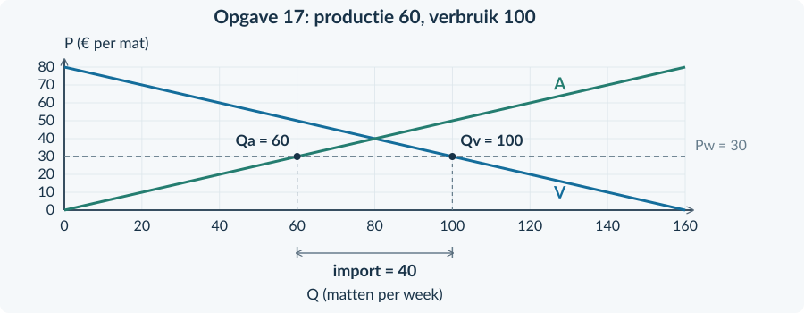

<!-- PAGE {"section": "3.3.2", "title": "Bij één prijs twee hoeveelheden"} -->

## Wereldmarktprijs, import en export

<h3>Opgave 11 · Invullen bij een prijs</h3>
<b>a.</b> Qv = 100 − 2 × 20 = <b>60 producten per week</b>. Qa = 2 × 20 − 20 = <b>20 producten per week</b>. <i>Waarom:</i> Je vult dezelfde gegeven prijs in twee verschillende functies in.

<b>b.</b> Qv = 60 hoort bij binnenlandse kopers. Qa = 20 hoort bij binnenlandse producenten. <i>Waarom:</i> Vraag meet verbruik bij deze prijs; aanbod meet binnenlandse productie.

<h3>Opgave 12 · Welk getal is import?</h3>
<b>a.</b> Import = Qv − Qa = 70 − 30 = <b>40 kratten per week</b>. <i>Waarom:</i> De buitenlandse levering vult het verschil aan.

<b>b.</b> 70 is het totale binnenlandse verbruik. Daarvan worden 30 kratten binnenlands geproduceerd; alleen 40 komen van buiten. <i>Waarom:</i> Binnenlands verbruik bestaat hier uit binnenlandse productie plus import.

<h3>Opgave 13 · Lees de drie labels</h3>
<b>a.</b> De wereldprijslijn is P = € 20. Het punt op A bij Qa = 40 bepaalt de binnenlandse productie. <i>Waarom:</i> Producenten kiezen hun aanbod bij die prijs.

<b>b.</b> Het punt op V bij Qv = 80 bepaalt het verbruik. De pijl toont de 40 tassen die het buitenland levert. <i>Waarom:</i> 80 gevraagde tassen minus 40 binnenlandse tassen geeft de import.

<b>c.</b> De prijs daalt van € 30 naar € 20. Kopers betalen minder, terwijl binnenlandse producenten minder per tas ontvangen. <i>Waarom:</i> Eén prijsverandering werkt verschillend voor betalen en ontvangen.

<!-- PAGE {"section": "3.3.2", "title": "Een gegeven grafiek aanvullen"} -->

<h3>Opgave 14 · Waar komt het verschil vandaan?</h3>
<b>a.</b> Binnenlandse productie is <b>40 paren per week</b>; verbruik is <b>80 paren per week</b>. “Productie” hoort bij Qa = 40; “verbruik” bij Qv = 80. <i>Waarom:</i> De twee punten liggen op verschillende lijnen bij dezelfde prijs.

<b>b.</b> Import = 80 − 40 = <b>40 paren per week</b>. Markeer het horizontale verschil tussen Q = 40 en Q = 80. <i>Waarom:</i> Er wordt meer binnenlands verbruikt dan geproduceerd.

<b>c.</b> Kopers betalen € 10 in plaats van € 15; hun CS stijgt. Binnenlandse producenten ontvangen minder en leveren minder; hun PS daalt. <i>Waarom:</i> De prijsdaling vergroot het kopersvoordeel en verkleint het producentenvoordeel.

<figure><figcaption>Antwoordfiguur bij opgave 14. Productie 40, verbruik 80 en import 40 paren per week.</figcaption></figure>
<h3>Opgave 15 · Drie hoeveelheden</h3>
<b>a.</b> Bij € 15: productie 30, verbruik 90. Import = 90 − 30 = <b>60 boxen per week</b>. <i>Waarom:</i> De wereldprijs ligt beneden de prijs zonder handel.

<b>b.</b> De prijs voor producenten daalt van € 20 naar € 15. Hun productie daalt van 60 naar 30 boxen per week. <i>Waarom:</i> Bij een lagere prijs willen binnenlandse producenten minder leveren.

<b>c.</b> CS stijgt. Niet iedereen wint: binnenlandse producenten verliezen surplus door de lagere prijs. <i>Waarom:</i> Een stijgend totaal is verenigbaar met een daling bij één groep.

<!-- PAGE {"section": "3.3.2", "title": "Doeloefening · Kampeermatten"} -->

<h3>Opgave 16 · De andere handelsrichting</h3>
<b>a.</b> Export = Qa − Qv = 90 − 50 = <b>40 kg kaas per week</b>. <i>Waarom:</i> Buitenlandse kopers nemen het binnenlandse productieoverschot af.

<b>b.</b> Producenten ontvangen € 8 in plaats van € 6 per kg. Binnenlandse kopers moeten die hogere prijs ook betalen. PS stijgt en CS daalt. <i>Waarom:</i> De uitvoermogelijkheid is gunstig voor verkopers, niet automatisch voor binnenlandse kopers.

<b>c.</b> Vela is klein en prijsnemend: zijn export verandert de gegeven wereldmarktprijs niet. <i>Waarom:</i> Dat is de expliciete modelaanname uit de bron.

<h3>Opgave 17 · Import en binnenlandse belangen</h3>
<b>a.</b> Bij P = € 30: Qa = <b>60 matten</b> en Qv = <b>100 matten per week</b>. Import = 100 − 60 = <b>40 matten per week</b>. <i>Waarom:</i> De wereldmarkt vult het verschil tussen verbruik en productie.

<b>b.</b> Zonder handel: P = € 40 en Q = 80. Met import: P = € 30 en Qa = 60. Binnenlandse producenten ontvangen minder en produceren minder. <i>Waarom:</i> De lagere gegeven prijs leidt tot beweging langs de aanbodlijn.

<b>c.</b> Het binnenlandse CS stijgt: kopers betalen minder en het verbruik neemt toe van 80 naar 100 matten. <i>Waarom:</i> Een lagere prijs vergroot het verschil met de betalingsbereidheid voor kopers.

<b>d.</b> De conclusie is onjuist. Binnenlandse producenten verliezen surplus, ook als CS + PS samen stijgt. <i>Waarom:</i> Het totaal zegt niet dat ieder onderdeel toeneemt.

<b>e.</b> Noro is volgens de bron klein en prijsnemend. Zijn handelsomvang heeft geen invloed op de wereldprijs. <i>Waarom:</i> Dit is een expliciete modelaanname, geen algemeen bewijs voor elk land.

<figure><figcaption>Antwoordfiguur bij opgave 17. Het horizontale verschil bij € 30 is de import.</figcaption></figure>

<!-- PAGE {"section": "3.3.2", "title": "Modelgrenzen en herhaling"} -->

<h3>Opgave 18 · Een verborgen transportprobleem</h3>
<b>a.</b> De aanname van beschikbare handel zonder transportproblemen gaat voor het dorp niet op. <i>Waarom:</i> Een lage prijs in de haven betekent niet dat het product ook in het dorp beschikbaar is.

<b>b.</b> De uitspraak is te sterk. Je moet onder meer weten of en tegen welke vervoerskosten graan het dorp kan bereiken. <i>Waarom:</i> Zonder bereikbaarheid kun je de wereldprijs niet rechtstreeks als dorpsprijs gebruiken.

<b>Beoordelingscriteria:</b> de geschonden aanname noemen; havenprijs en bereikbare lokale prijs onderscheiden; aanvullende vervoersinformatie benoemen. Andere correct onderbouwde antwoorden zijn mogelijk.

<h3>Opgave 19 · Relatief minder opofferen</h3>
<b>a.</b> Runo heeft een comparatief voordeel bij schoenen: het offert daarvoor minder meetapparatuur op. <i>Waarom:</i> De relevante vergelijking is de opgegeven andere productie.

<b>b.</b> Ook een land met een absoluut nadeel in beide activiteiten kan een comparatief voordeel in één activiteit hebben. Runo kan zich meer op schoenen richten en die uitvoeren. <i>Waarom:</i> Het absolute voordeel bepaalt niet alleen de zin van handel.

<h3>Opgave 20 · Een prijsnemende onderneming</h3>
<b>a.</b> TO = 5 × 80 = <b>€ 400 per week</b>. GO = 400 / 80 = <b>€ 5 per product</b>. <i>Waarom:</i> Totaal gaat over de hele verkoop; gemiddeld over één product.

<b>b.</b> Extra TO = 5 × 10 = <b>€ 50 per week</b>. MO = ΔTO / ΔQ = 50 / 10 = <b>€ 5 per product</b>. <i>Waarom:</i> Elk extra verkocht product levert bij de vaste prijs hetzelfde bedrag op.

<b>Herhaal bij een fout</b> Import en export: figuren 2 en 3 van §3.3.2. Marginale opbrengst: §§2.1.3 en 3.2.1.
