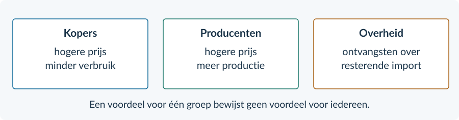

<!-- PAGE {"section": "3.3.4", "title": "Gemengde bronkeuze"} -->

## Gemengde opgaven

<h3>Opgave 31 · Kies het passende begrip</h3>
<b>a.</b> <b>Comparatief voordeel.</b> De vraag gaat over hoeveel andere productie wordt opgegeven. <i>Waarom:</i> Dat zijn alternatieve kosten, niet de absolute hoeveelheid benodigde middelen.

<b>b.</b> <b>Import.</b> Het gaat om wat uit het buitenland wordt gekocht. <i>Waarom:</i> Binnenlands verbruik kan deels met binnenlandse productie worden geleverd.

<h3>Opgave 32 · Een hogere wereldprijs</h3>
<b>a.</b> Export = Qa − Qv = 100 − 60 = <b>40 kg appels per week</b>. <i>Waarom:</i> Het buitenland koopt het verschil tussen productie en binnenlands verbruik.

<b>b.</b> De teler ontvangt € 3 in plaats van € 2 per kg; de koper betaalt juist die hogere prijs. <i>Waarom:</i> Dezelfde prijsstijging is een voordeel voor de verkoper en een nadeel voor de koper.

<h3>Opgave 33 · Een verstandig besluit?</h3>
<b>a.</b> Toren geeft voor extra verpakkingen relatief veel scheepsonderdelen op. Vale geeft daarvoor minder op. Verpakkingen uit Vale kopen kan dus passen bij specialisatie op basis van comparatief voordeel. <i>Waarom:</i> Toren kan absoluut sterker zijn en toch een hogere alternatieve kost van verpakkingen hebben.

<b>b.</b> De levering is export vanuit Vale en import vanuit Toren. <i>Waarom:</i> De grens wordt vanuit twee kanten bekeken.

<b>c.</b> De verpakkingen komen op tijd aan. Dat ondersteunt een voordeel in betrouwbare levering. <i>Waarom:</i> Concurrentiepositie gaat ook over leveringskenmerken, niet alleen over productie-efficiëntie.

<b>d.</b> De bron spreekt de uitspraak tegen: een lokale verpakkingsproducent in Toren verliest een klant. <i>Waarom:</i> Voordeel voor één inkopend bedrijf betekent geen voordeel voor alle bedrijven.

<!-- PAGE {"section": "3.3.4", "title": "Een beleidseffect erkennen en begrenzen"} -->

<h3>Opgave 34 · Een heffing verdedigen of afwijzen</h3>
<b>a.</b> Import = 90 − 70 = <b>20 doeken per week</b>. Opbrengst = 3 × 20 = <b>€ 60 per week</b>. <i>Waarom:</i> Alleen de resterende import wordt belast.

<b>b.</b> De binnenlandse producent ontvangt € 12 in plaats van € 9 en kan 70 in plaats van 50 doeken leveren. <i>Waarom:</i> De heffing beperkt de concurrentiedruk van de goedkope import.

<b>c.</b> De koper moet € 12 in plaats van € 9 betalen; het verbruik daalt van 110 naar 90. <i>Waarom:</i> De bescherming heeft een prijs voor gebruikers.

<b>d.</b> Bijvoorbeeld: “Het productiedoel wordt ondersteund: binnenlandse productie stijgt van 50 naar 70. Dat maakt de heffing niet gunstig voor iedereen, omdat kopers meer betalen.” <i>Waarom:</i> De conclusie gebruikt het gekozen criterium en benoemt een tegengesteld belang.

<figure><figcaption>Bij opgave 34: benoem niet alleen de richting, maar verbind elke groep aan een concreet prijs- of hoeveelheidsgegeven.</figcaption></figure>
<b>Onderbouwde conclusie</b> “De productie neemt toe” erkent het genoemde doel. “Daarom wint iedereen” gaat verder dan de gegevens. Deze twee uitspraken zijn niet gelijkwaardig.

<!-- PAGE {"section": "3.3.4", "title": "Doeloefening · Regenjassen"} -->

<h3>Opgave 35 · Regenjassen in Nerin</h3>
<b>a.</b> Pelta offert voor extra jassen minder machineproductie op. Het heeft dus lagere alternatieve kosten van jassen, ook al gebruikt Nerin absoluut minder middelen voor beide producten. <i>Waarom:</i> De bron maakt het verschil tussen absoluut en comparatief voordeel expliciet.

<b>b.</b> Import = 100 − 60 = <b>40 jassen per week</b>. Opbrengst = 5 × 40 = <b>€ 200 per week</b>. <i>Waarom:</i> De import na de heffing bepaalt de ontvangsten.

<b>c.</b> Jassenmakers ontvangen € 15 in plaats van € 10 en produceren 60 in plaats van 40 jassen. Kopers betalen € 5 meer en gebruiken 100 in plaats van 120. <i>Waarom:</i> De stijgende binnenlandse prijs helpt aanbieders en benadeelt gebruikers.

<b>d.</b> Rechthoek van Q = 60 tot 100 en van P = € 10 tot 15. Breedte = <b>40 jassen per week</b>; hoogte = <b>€ 5 per jas</b>. <i>Waarom:</i> Deze oppervlakte is heffing maal ingevoerde hoeveelheid.

<b>e.</b> Volgens bron C zijn de vergunningen gratis en is er geen invoerheffing. De overheid ontvangt dus niet hetzelfde bedrag per ingevoerde jas. <i>Waarom:</i> Een importgrens creëert niet automatisch belastingontvangsten.

<b>f.</b> Het productiedoel wordt ondersteund: productie stijgt van 40 naar 60. Maar gezinnen betalen € 15 in plaats van € 10 per jas. De conclusie “voor alle inwoners gunstig” is daarom te breed. <i>Waarom:</i> De twee concrete gegevens laten zien dat doelbereik en gevolgen voor alle groepen niet samenvallen.

<figure><figcaption>Antwoordfiguur bij opgave 35. Alleen de 40 ingevoerde jassen bepalen de breedte.</figcaption></figure>

<!-- PAGE {"section": "3.3.4", "title": "Afsluitende herhaling"} -->

<h3>Opgave 36 · Past deze aanname?</h3>
<b>a.</b> De aanname dat de producten volledig gelijkwaardig zijn. De bron noemt verschillen in levensduur en levertijd. <i>Waarom:</i> Dan is één prijs niet het enige relevante onderscheid.

<b>b.</b> Een koper die snel een jas nodig heeft, kan de snelle levering belangrijk vinden. Een andere koper kan meer waarde hechten aan lange levensduur. <i>Waarom:</i> Verschillende voorkeuren kunnen bij gelijke prijzen toch verschillende keuzes geven.

<b>c.</b> Bijvoorbeeld: “In het model met gelijkwaardige jassen is een gelijk prijskaartje voldoende voor die vergelijking. In de bron zijn de jassen niet gelijkwaardig; de voorkeur van de koper bepaalt mede de keuze.” <i>Waarom:</i> Je trekt een modelconclusie niet zonder controle door naar een andere situatie.

<b>Beoordelingscriteria:</b> de gelijkwaardigheidsaanname herkennen; beide bronkenmerken gebruiken; de conclusie beperken tot wat model en bron ondersteunen. Andere correct onderbouwde antwoorden zijn mogelijk.

<h3>Opgave 37 · Een bekende heffing, geen invoerheffing</h3>
<b>a.</b> Belasting per product = 12 − 9 = <b>€ 3</b>. Opbrengst = 3 × 40 = <b>€ 120 per week</b>. <i>Waarom:</i> Het verschil tussen kopersprijs en verkopersontvangst is de belastingwig.

<b>b.</b> De bron zegt dat alle 40 producten belast zijn. Een invoerheffing betreft alleen ingevoerde producten; een deel van de binnenlandse verkoop kan binnenlands geproduceerd zijn. <i>Waarom:</i> De bron en de regeling bepalen welke hoeveelheid belast is.

<h3>Opgave 38 · Een producent onder concurrentie</h3>
<b>a.</b> TO = 8 × 100 = <b>€ 800 per week</b>. Winst = TO − TK = 800 − 650 = <b>€ 150 per week</b>. <i>Waarom:</i> Winst is wat van de opbrengst overblijft na alle opgegeven kosten.

<b>b.</b> De winst maakt toetreding aantrekkelijk. Door toetreding stijgt het marktaanbod, waardoor de prijs daalt bij gelijkblijvende vraag. Onder de opgegeven concurrentie- en kostenvoorwaarden verdwijnt de economische winst op lange termijn. <i>Waarom:</i> Vrije toetreding kan de extra winstmogelijkheid wegnemen.

<b>Hoofdstukcheck</b> Specialisatie: vergelijk alternatieve kosten. Handel: bepaal Qa en Qv bij één prijs. Bescherming: belast alleen de ingevoerde hoeveelheid en benoem de afzonderlijke gevolgen.
