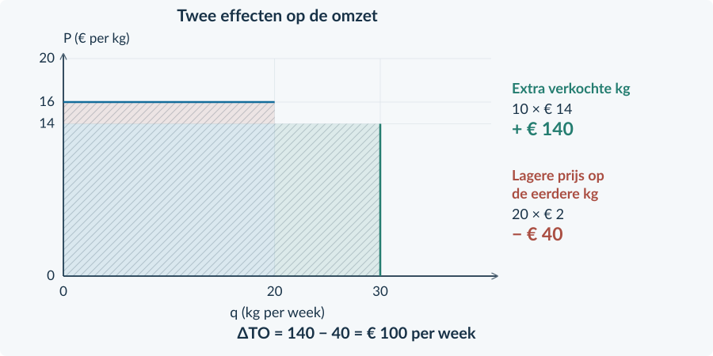
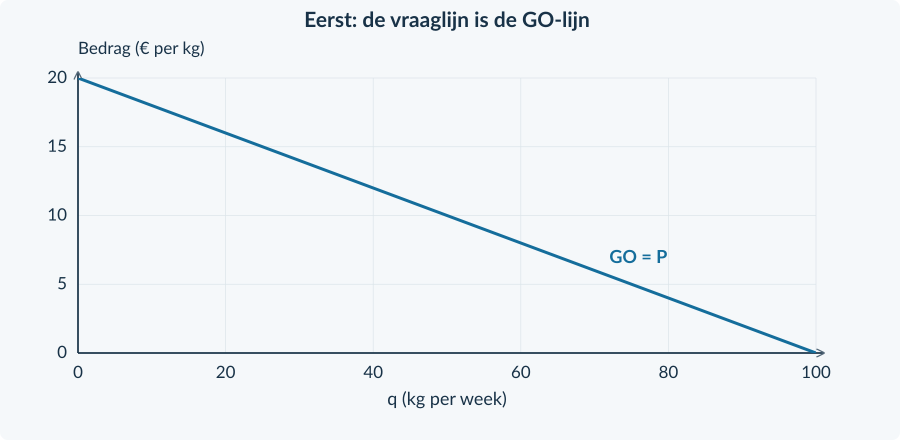
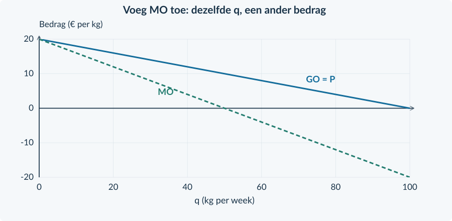
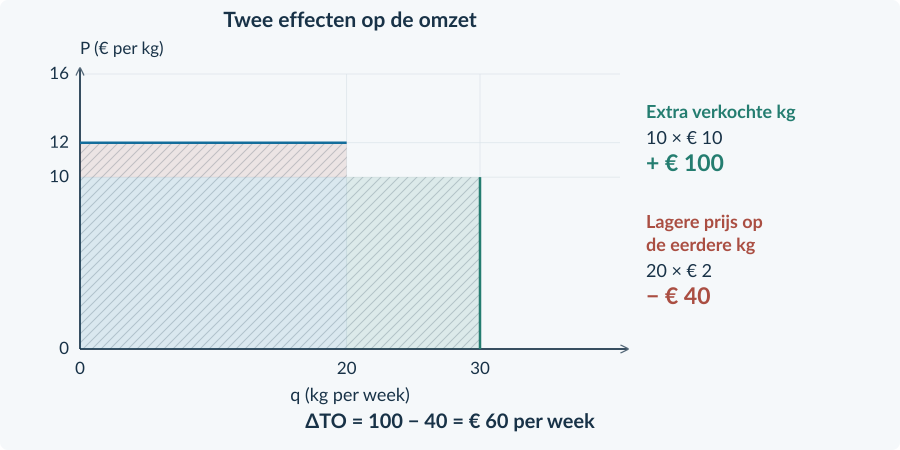
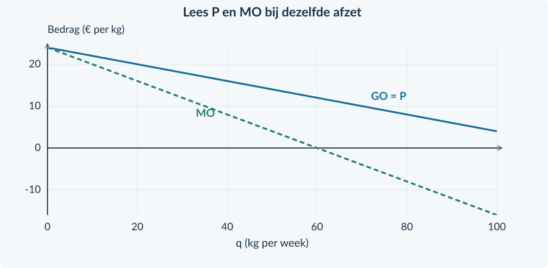
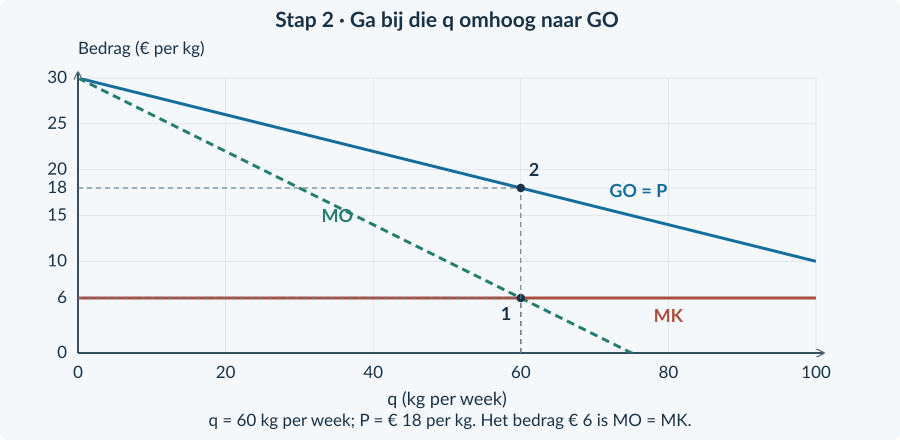
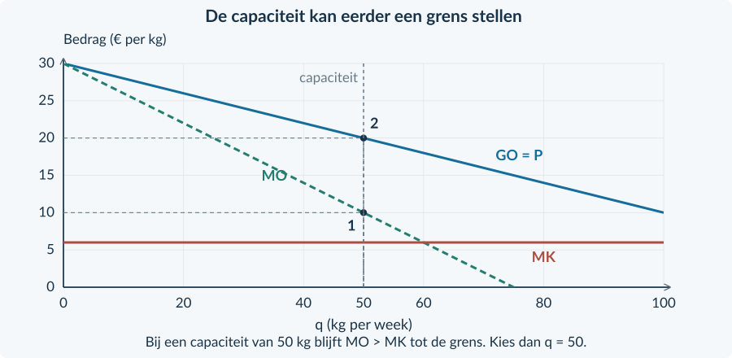
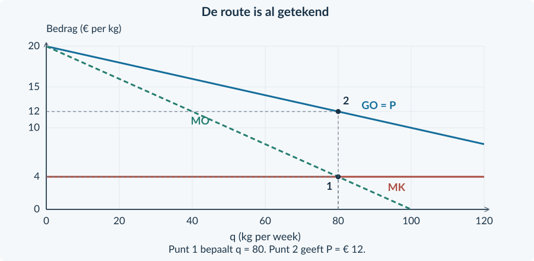
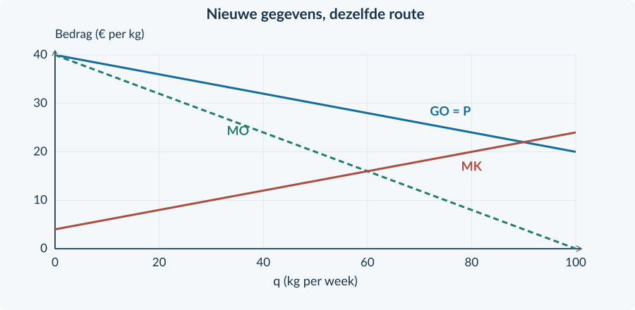

<!-- PAGE {"section": "4.1", "title": "Monopolie"} -->

4VECO · ECONOMIE · 4 VWO · BOEK 4

Monopolie

Eén aanbieder. Toch niet elke prijs.

Een onderneming is als enige toegelaten tot een markt. Zij kan haar prijs zelf veranderen. Maar een hogere prijs kost klanten. Welke afzet en welke verkoopprijs leveren de meeste winst op?

Je gebruikt de kosten- en opbrengstberekeningen uit Boek 2 en de marginale keuze uit Boek 3. **De verandering zit aan de opbrengstenkant:** meer afzet vraagt in ons model om een lagere prijs.

<a href="#s411"><b>4.1.1 · Monopolie: kenmerken 2</b>Marktmacht, toetredingsbarrières en de vraaglijn</a>
<a href="#s412"><b>4.1.2 · Marginale opbrengst bij monopolie 10</b>Van verkoopprijs via totale naar marginale opbrengst</a>
<a href="#s413"><b>4.1.3 · Winstmaximalisatie bij monopolie 21</b>Eerst de hoeveelheid, dan de prijs, dan de winst</a>
<a href="#s414"><b>4.1.4 · Gemengde opgaven: monopolie 32</b>De juiste route kiezen en je conclusie onderbouwen</a>
<a href="#overzicht"><b>Overzicht en begrippen 37</b></a>

<figure><figcaption>De drie stappen worden eerst apart opgebouwd en daarna gecombineerd.</figcaption></figure>

<b>Werken met dit hoofdstuk</b> Werk in je schrift en in de geleverde grafieken. Schrijf formule, invulling, uitkomst en eenheid op. De antwoorden staan in een apart antwoordboek.

Ondernemingen, bronnen en bedragen zijn zelfgemaakte oefencases. Zij beschrijven geen geverifieerde echte markten. Alle rekenmodellen gebruiken één verkoopprijs voor alle eenheden binnen dezelfde situatie.

<!-- PAGE {"section": "4.1.1", "title": "Alleen op de markt"} -->

4.1.1 · MONOPOLIE: KENMERKEN

# Geen concurrent. Geen grenzen?
Op een eiland verzorgt één bedrijf de enige directe veerverbinding. Een tweede bedrijf krijgt voorlopig geen vergunning. Toch kan de eigenaar niet zomaar € 100 per kaartje vragen en verwachten dat iedereen blijft varen.

<b>Lesdoelen</b> Je kunt een monopolie herkennen met gegevens uit een bron. Je kunt een toetredingsbarrière uitleggen. Je kunt de vraag voor een monopolist vergelijken met die voor een prijsnemer. Je kunt een prijs-afzetcombinatie berekenen en beoordelen.

<b>Monopolie</b> Een marktvorm met één aanbieder op de afgebakende markt. Deze aanbieder noemen we de monopolist.

### Kijk eerst welke markt bedoeld wordt
De veerverbinding is één markt in deze oefencase. De markt voor álle uitstapjes is veel breder. Eén merk of één winkel is dus niet vanzelf een monopolie: kopers kunnen soms kiezen uit vergelijkbare producten.

<b>Marktmacht</b> De mogelijkheid van een onderneming om invloed uit te oefenen op haar verkoopprijs. De reactie van kopers begrenst die invloed.

### Waarom verschijnt niet meteen een tweede aanbieder?
Een **toetredingsbarrière** maakt beginnen op deze markt moeilijk of onmogelijk.

| Mogelijke barrière | Wat houdt een nieuwe aanbieder tegen? |
|---|---|
| Een exclusieve vergunning | Alleen de aangewezen onderneming mag in de beschreven periode aanbieden. |
| Een octrooi (patent) | De beschreven beschermde uitvinding kan niet zomaar door een ander worden gebruikt. |
| Een onmisbare voorziening | Een andere onderneming kan niet over het noodzakelijke netwerk of middel beschikken. |

Gebruik steeds de bron. Een patent is niet automatisch bewijs voor een monopolie op een brede markt met goede alternatieven.

<!-- PAGE {"section": "4.1.1", "title": "Van de kleine onderneming naar de hele markt"} -->

### De vraaglijn hoort bij een bepaalde aanbieder
Bij volkomen concurrentie neemt één kleine onderneming de marktprijs als gegeven. Binnen het model verkoopt zij tegen die prijs tot haar productiecapaciteit. Haar opbrengstlijn is horizontaal.

De monopolist bedient de **hele afgebakende markt**. Wil hij meer afzetten, dan moet hij in het getekende model een lagere prijs vragen. Zijn vraaglijn daalt.
<figure><figcaption>Figuur 1. Twee ondernemingsgrafieken. De linker onderneming is klein; de rechter onderneming is de enige aanbieder. Let op de verschillende hoeveelheidsassen.</figcaption></figure>

### Dezelfde afkorting, een andere lijn
**q** is de afzet van één onderneming. **Q** is de afzet van de hele markt. Bij de monopolist geldt q = Q. In dit hoofdstuk gebruiken we voor zijn berekeningen q.

De **gemiddelde opbrengst GO** is TO / q. Als alle verkochte eenheden dezelfde prijs hebben, is GO gelijk aan die prijs. Dat blijft bij monopolie waar: de vraaglijn is ook de GO-lijn.

<b>Wat verandert niet? Wat wel?</b> GO = P blijft gelden bij één uniforme prijs. Maar P is bij de monopolist niet bij elke q hetzelfde. De gelijkheid <b>P = GO = MO</b> van een prijsnemer mag je daarom niet zomaar overnemen. MO bouwen we op in §4.1.2.

De dalende vraaglijn houdt overige vraagfactoren gelijk, zoals inkomen, voorkeuren en het aantal vragers. Veranderen die, dan kan de vraaglijn zelf verschuiven.

<!-- PAGE {"section": "4.1.1", "title": "Een bron gebruiken"} -->

## Uitgewerkt voorbeeld
**Parkveer** heeft voor deze oefencase het alleenrecht op de directe overtocht naar een park. Er is geen vergelijkbare directe overtocht. Mensen kunnen ook besluiten het park niet te bezoeken. De vraag is **P = 12 − 0,10q**. P is euro per kaartje; q is kaartjes per dag, van 0 tot 120.

**1 · Gebruik het bronbewijs.** Parkveer is hier de enige aanbieder. Het alleenrecht vormt een toetredingsbarrière. Bij volkomen concurrentie zouden er juist veel kleine aanbieders zijn, met vrije toetreding.

**2 · Bereken twee combinaties.** Bij q = 40 hoort P = 12 − 0,10 × 40 = € 8. Bij q = 80 hoort P = € 4.
<figure><figcaption>Figuur 2. Punt A geeft 40 kaartjes tegen € 8; punt B geeft 80 kaartjes tegen € 4.</figcaption></figure>

**3 · Leg de afruil uit.** Parkveer kan in deze vraagfunctie niet tegelijk 80 kaartjes verkopen én € 8 per kaartje vragen. Bij € 8 is de gevraagde hoeveelheid 40. Voor 80 kaartjes is een prijs van € 4 nodig.

**4 · Begrens je conclusie.** Er is invloed op de prijs, maar geen onbeperkte afzet. De vraaglijn vertelt welke combinaties mogelijk zijn. Zonder kosten weten we nog niet welke combinatie de meeste winst geeft.

<b>Onthouden</b> Bronbewijs → afgebakende markt → toetredingsbarrière → prijs en afzet uit dezelfde vraaglijn. De monopolist kiest een combinatie, niet twee losstaande getallen. In §4.1.2 bekijken we de bijbehorende opbrengst.

<!-- PAGE {"section": "4.1.1", "title": "De bekende methode terughalen"} -->

## Startopgaven

<b>Korte route:</b> Startopgaven → Zelfstandige oefening → Doeloefening. Extra hulp nodig? Maak eerst Begeleide inoefening.

<b>Opgave 1 · Terug naar de prijsnemer</b>

Eén kleine producent ontvangt € 10 per kg. TK = 0,10q² + 2q + 40 en MK = 0,20q + 2. q is kg per week. De productiecapaciteit is 60 kg. De € 40 blijft deze week ook bij q = 0 bestaan.

<b>a.</b> Geef GO en MO. Bereken met MO = MK de winstmaximale q en controleer of die haalbaar is.

<b>b.</b> Bereken bij die q de totale opbrengst, totale kosten en winst. Waarom hoort de horizontale opbrengstlijn bij deze onderneming en niet bij de hele markt?

<b>Opgave 2 · Eén merk in de winkel</b>

Een winkel verkoopt als enige in het dorp het merk Pico. Twee andere winkels verkopen vergelijkbare producten. Klanten vinden die producten goede alternatieven.

<b>a.</b> Is dit genoeg bewijs voor een monopolie op de markt voor dit soort producten? Leg uit met de bron.

<b>b.</b> Wat kunnen klanten volgens de bron doen als de winkel zijn prijs sterk verhoogt?

<b>Terugblik uit Boek 3</b> Een prijsnemer kiest q bij een gegeven P. Bij een monopolist moeten P en q samen op de vraaglijn passen. De kostengegevens uit opgave 1 zijn alleen bedoeld om de bekende procedure op te halen.

### Zo onderbouw je een bronantwoord
Noem niet alleen een begrip. Verbind het aan een gegeven: **“Alleen dit bedrijf krijgt een vergunning. Daardoor kunnen andere bedrijven deze dienst niet aanbieden. Dat vormt een toetredingsbarrière.”**

De aanwezigheid van één winkel in een foto bewijst dit niet. Je moet weten welke andere aanbieders of vergelijkbare producten binnen de beschreven markt bestaan.

<!-- PAGE {"section": "4.1.1", "title": "Van aflezen naar zelf rekenen"} -->

## Begeleide inoefening

Heb je deze hulp niet nodig? Ga dan verder met Zelfstandige oefening.

<b>Opgave 3 · De gelabelde vraaglijn</b>

Gebruik figuur 3. Deze oefenonderneming is de enige aanbieder van de beschreven toegangsdienst.

<b>a.</b> Lees voor A en B de prijs en de afzet af. Wat gebeurt er met de prijs wanneer de afzet van A naar B gaat?

<b>b.</b> Een manager wil de afzet van B en de prijs van A combineren. Leg uit waarom die combinatie niet bij deze vraaglijn past.

<figure><figcaption>Figuur 3. Lees bij ieder punt beide coördinaten: hoeveelheid én prijs.</figcaption></figure>

<b>Opgave 4 · Een besloten tuin</b>

Alleen Tuinpoort verkoopt toegang tot een historische tuin. Gebruik P = 18 − 0,10q. P is euro per kaartje; q is kaartjes per dag, van 0 tot 180.

<b>a.</b> Bereken de prijzen bij q = 40 en q = 80. Gebruik: P = 18 − 0,10 × … .

<b>b.</b> Los nu 12 = 18 − 0,10q op. Leg uit wat de uitkomst betekent voor Tuinpoort.

<!-- PAGE {"section": "4.1.1", "title": "Bronnen vergelijken"} -->

Begeleide inoefening · vervolg

<b>Opgave 5 · Twee veranderingen tegelijk</b>

De enige aanbieder van grotbezoeken verlaagt zijn eigen toegangsprijs. Tegelijk komen meer toeristen naar de regio. Zij willen bij elke mogelijke prijs samen meer bezoeken boeken. De capaciteit is groot genoeg.

<b>a.</b> Bekijk alleen de prijsverlaging. Is dit een beweging langs de vraaglijn of een verschuiving van de lijn? Wat gebeurt er met de afzet?

<b>b.</b> Bekijk alleen de extra toeristen. Welke verandering van de vraaglijn hoort daarbij?

<b>c.</b> Versterken de twee veranderingen de stijging van de afzet of werken ze elkaar tegen?

<b>d.</b> Een leerling zegt: “De prijsverlaging verschuift de vraaglijn naar rechts.” Leg uit welke twee oorzaken hij verwart.

## Zelfstandige oefening

<b>Opgave 6 · Een beschermd filter</b>

Alleen Filtera mag in deze oefencase een bepaald beschermd filter maken. Er zijn binnen de afgebakende markt geen goede vervangers. Voor de verkoop geldt P = 40 − 0,50q, met q van 0 tot 80 filters per maand en P in euro per filter.

<b>a.</b> Noem de toetredingsbarrière en leg met de bron uit waarom we hier een monopolie onderzoeken.

<b>b.</b> Bereken P bij q = 20 en q = 40. Kan Filtera 40 filters verkopen voor de prijs die bij q = 20 hoort? Verklaar.

<b>Opgave 7 · Twee leverancierssituaties</b>

A: veel kleine bedrijven leveren dezelfde schroeven; kopers kennen de prijzen en nieuwe bedrijven kunnen vrij beginnen. B: één bedrijf bezit de enige toegang tot een noodzakelijke voorziening; andere bedrijven kunnen die niet gebruiken.

<b>a.</b> Koppel elke situatie aan volkomen concurrentie of monopolie. Geef per situatie één brongegeven als bewijs.

<b>b.</b> Welke onderneming krijgt in dit model een horizontale vraaglijn en welke een dalende? Licht het verschil toe.

<!-- PAGE {"section": "4.1.1", "title": "Een prijskeuze beoordelen"} -->

## Doeloefening

<b>Bron A · Eilandveer</b> Voor de directe verbinding tussen Haven en Eiland heeft Eilandveer als enige een vergunning. In de onderzochte periode krijgt geen ander bedrijf toegang. Reizigers kunnen hun reis wel uitstellen of afzien van de overtocht. Alle kaartjes in een gekozen situatie hebben dezelfde prijs. De capaciteit is 240 kaartjes per dag.

<b>Bron B · Vraag</b> P = 24 − 0,10q. P is euro per kaartje; q is kaartjes per dag, van 0 tot 240. Overige vraagfactoren blijven gelijk.

<b>Opgave 8 · Eilandveer</b>

Gebruik beide bronnen en figuur 4.

<b>a.</b> (2p) Welk gegeven vormt hier een toetredingsbarrière? Leg uit waarom dit een monopolie op de beschreven verbinding ondersteunt.

<b>b.</b> (2p) Noem twee verschillen met volkomen concurrentie: één over toetreding en één over de vraaglijn van de onderneming.

<b>c.</b> (2p) Bereken de prijs bij punt A met q = 60 en bij punt B met q = 120.

<b>d.</b> (2p) De eigenaar wil 120 kaartjes verkopen voor € 18. Is dat volgens de bron haalbaar? Onderbouw met de vraagfunctie.

<b>e.</b> (2p) Beoordeel: “Zonder concurrenten kan ik elke prijs vragen én dezelfde afzet houden.” Gebruik de bron om je antwoord te begrenzen.

<figure><figcaption>Figuur 4. Gebruik de lijn om de berekende combinaties te controleren.</figcaption></figure>

<!-- PAGE {"section": "4.1.1", "title": "Waar eindigt de marktmacht?"} -->

## Denkertje / Bonusopgave

<b>Opgave 9 · Welke markt teken je?</b>

Een onderneming is als enige eigenaar van een uitkijktoren. In de omgeving liggen ook een uitzichtheuvel en een panoramacafé. Twee leerlingen tekenen de markt anders: de eerste bekijkt “toegang tot deze toren”, de tweede “uitstapjes met uitzicht”.

<b>a.</b> Leg uit waarom de keuze van de marktgrens invloed heeft op de conclusie “dit is een monopolie”.

<b>b.</b> Noem één extra gegeven over het gedrag van bezoekers dat je zou willen weten. Leg uit hoe dat helpt.

<b>c.</b> Kan alleenrecht op de toren samengaan met een sterke reactie op een prijsverhoging? Licht toe zonder een elasticiteitsformule te gebruiken.

## Herhaling / Herhaling en interleaving

<b>Opgave 10 · Kosten en omzet blijven verschillend</b>

Een onderneming verkoopt 60 kg per week voor € 9 per kg. TK = 100 + 4q; q is kg per week en TK euro per week.

<b>a.</b> Bereken TO, TK, GTK en winst bij q = 60. Reken met ongeronde GTK.

<b>b.</b> In een andere waarneming stijgt de prijs met 10% en daalt de afzet met 15%. Bereken Ev en bepaal of de vraag prijselastisch is.

<b>Controleer je taal</b> Zeg “één aanbieder op deze markt” en niet alleen “één bedrijf”. Zeg “de prijs beïnvloedt de afzet” en niet “de monopolist kiest alles zelf”.

<b>Vooruitblik</b> Een lagere prijs kan meer kopers opleveren. Maar dezelfde lagere prijs geldt ook voor de eenheden die je bij de hogere prijs al zou verkopen. Die twee effecten bepalen de extra opbrengst.

<!-- PAGE {"section": "4.1.2", "title": "Meer verkopen, maar voor minder"} -->

4.1.2 · MARGINALE OPBRENGST BIJ MONOPOLIE

# Wat levert extra afzet op?
Een monopolist verkoopt een eigen reinigingsmiddel. Bij 20 kg per week past een prijs van € 16 per kg. Voor 30 kg moet de prijs naar € 14. De 10 extra kg geven opbrengst. Maar wat gebeurt er met de opbrengst op de eerste 20 kg?

<b>Lesdoelen</b> Je kunt uit een lineaire vraagfunctie TO en MO afleiden. Je kunt een korte opbrengsttabel invullen en controleren. Je kunt het verschil tussen een tabelstap en MO op één punt uitleggen. Je kunt verklaren waarom MO onder de verkoopprijs ligt bij uniforme prijzen.

Voor dit voorbeeld geldt **P = 20 − 0,20q**. q is kg per week, van 0 tot 100; P is euro per kg. Vergelijk twee verkoopplannen voor dezelfde week. Binnen ieder plan betaalt iedereen dezelfde prijs.
<figure><figcaption>Figuur 5. De extra kg leveren € 140 op. Op de eerste 20 kg ontvang je € 40 minder. Netto stijgt TO met € 100.</figcaption></figure>

<b>Geen terugbetaling</b> De eerste 20 kg zijn hier geen verkopen uit een vorige week. We vergelijken twee mogelijke plannen: álles voor € 16 of álles voor € 14. In het tweede plan is ook de prijs op de eerste 20 kg lager.

<!-- PAGE {"section": "4.1.2", "title": "Van vraag naar totale opbrengst"} -->

### Eerst de totale opbrengst
Je kent **TO = P × q**. Nu is P zelf afhankelijk van q. Vul daarom de hele prijsformule in, tussen haakjes.

P = 20 − 0,20q TO = (20 − 0,20q) × q TO = 20q − 0,20q²

De laatste regel betekent: 20 × q minus 0,20 × q × q. De tweede term is kwadratisch omdat q twee keer wordt vermenigvuldigd.
<figure><figcaption>Figuur 6. Dezelfde omzetformule als eerder, maar nu met een prijs die afhangt van q.</figcaption></figure>

### Daarna de marginale opbrengst
Bij een **heel kleine uitbreiding rond één hoeveelheid** geeft MO aan hoe snel TO verandert. Voor deze doorlopende rekenmodellen vinden we MO met de afgeleide van TO.

Je gebruikt dezelfde beperkte differentieerregel als in §3.2.2:

| Term in TO | Bewerking | Bijdrage aan MO |
|---|---|---:|
| 20q | q valt weg. | 20 |
| −0,20q² | Vermenigvuldig −0,20 met 2; q² wordt q. | −0,40q |

MO = 20 − 0,40q

TO is euro per week. P, GO en MO zijn euro per kg. Neem het minteken mee: een term −0,20q² wordt niet +0,40q.

<b>Controleer de hele keten</b> Bij q = 20 is P = 16 en TO = 16 × 20 = 320. De TO-formule geeft ook 20 × 20 − 0,20 × 20² = 320. De MO-formule geeft bij q = 20 een ander soort bedrag: € 12 per kg.

<!-- PAGE {"section": "4.1.2", "title": "Twee lijnen met verschillende betekenissen"} -->

### Eerst alleen de prijs per kg
De vraagfunctie blijft **P = 20 − 0,20q**. Omdat alle kg binnen een verkoopplan dezelfde prijs hebben, is **GO = P** voor q > 0.
<figure><figcaption>Figuur 7. Bij q = 20 is de prijs € 16 per kg. Bij q = 50 is de prijs € 10 per kg.</figcaption></figure>

### Voeg nu MO toe
Uit TO = 20q − 0,20q² volgt **MO = 20 − 0,40q**. Bij eenzelfde q is dit lager dan P, behalve bij het beginpunt q = 0. De prijsverlaging raakt immers ook de kg die je bij de hogere prijs al zou afzetten.

Voor een rechte vraaglijn heeft de MO-lijn hetzelfde beginpunt op de verticale as, maar een tweemaal zo grote daling per extra kg.

Bij q = 20: P = 16 en MO = 12 Bij q = 50: P = 10 en MO = 0

<b>Prijs is niet marginale opbrengst</b> De koper betaalt P voor een kg. MO gaat over de verandering van de <b>totale</b> opbrengst bij iets meer afzet. Dat zijn bij uniforme monopolieprijzen verschillende bedragen.

Bij q = 0 is TO = 0, maar GO = TO / q kun je niet berekenen. Het punt P = 20 op de vraaglijn is de prijsgrens uit het model, geen gemiddelde van feitelijke verkopen.

<!-- PAGE {"section": "4.1.2", "title": "Wanneer neemt de omzet niet meer toe?"} -->

### MO kan nul of negatief zijn
Tot q = 50 is MO positief: een kleine extra afzet verhoogt TO. Bij q = 50 is MO nul. Boven 50 kg is MO negatief: de lagere prijs op alle kg kost meer dan de extra afzet oplevert.
<figure><figcaption>Figuur 8. Boven 50 kg wordt MO negatief. De verkoopprijs blijft hier positief tot q = 100.</figcaption></figure>

Een positieve verkoopprijs garandeert dus niet dat méér verkopen de omzet verhoogt. Bij q = 50 is TO = 10 × 50 = € 500. Bij q = 70 is TO = 6 × 70 = € 420.

<b>Opbrengstmaximum is nog geen winstmaximum</b> Voor deze dalende rechte MO-lijn ligt de hoogste TO waar MO van positief naar negatief gaat. Maar kosten zijn nog niet vergeleken. Een maximale TO hoeft geen maximale winst te geven.

### Een tabelstap is groter dan één punt
Van q = 20 naar q = 30 stijgt TO van € 320 naar € 420. Over die hele stap is de gemiddelde extra opbrengst:

ΔTO / Δq = (420 − 320) / (30 − 20) ΔTO / Δq = € 10 per kg

Op het beginpunt geeft de afgeleide MO(20) = 12; op het eindpunt MO(30) = 8. De marginale opbrengst daalt onderweg. De € 10 over de hele stap hoeft daarom niet gelijk te zijn aan één van die twee puntwaarden.

<!-- PAGE {"section": "4.1.2", "title": "De hele opbrengstroute"} -->

## Uitgewerkt voorbeeld
**Verf Luma.** Voor een uniek verfmengsel geldt P = 12 − 0,10q. q is kg per week, van 0 tot 120; P is euro per kg. Alle kg in een verkoopplan hebben dezelfde prijs.

**1 · Maak TO en MO.**

TO = (12 − 0,10q) × q = 12q − 0,10q² MO = 12 − 0,20q

**2 · Vul een tabel in.** Gebruik voor iedere rij eerst P en daarna TO = P × q.

| q (kg per week) | P (€ per kg) | TO (€ per week) |
|---:|---:|---:|
| 20 | 10 | 200 |
| 30 | 9 | 270 |
| 40 | 8 | 320 |

**3 · Controleer de stap van 30 naar 40.** ΔTO / Δq = (320 − 270) / 10 = € 5 per kg. Op het beginpunt is MO(30) = € 6; op het eindpunt MO(40) = € 4. Dat verschilt, omdat de afgeleide één punt beschrijft en de tabelstap een hele toename.
<figure><figcaption>Figuur 9. Extra afzet: 10 × € 8 = € 80. Lagere prijs op de eerste 30 kg: 30 × € 1 = € 30.</figcaption></figure>

**4 · Leg uit.** De netto omzettoename is 80 − 30 = € 50. Daarom is de extra opbrengst per extra kg niet gelijk aan de verkoopprijs van € 8.

<b>Onthouden</b> P × q → TO → afgeleide MO. Een tabelstap bereken je met ΔTO / Δq. Bij één uniforme prijs verlaagt meer afzet ook de opbrengst op de eerdere hoeveelheid. In §4.1.3 vergelijken we MO met MK.

<!-- PAGE {"section": "4.1.2", "title": "De rekenregels weer paraat"} -->

## Startopgaven

<b>Korte route:</b> Startopgaven → Zelfstandige oefening → Doeloefening. Extra hulp nodig? Maak eerst Begeleide inoefening.

<b>Opgave 11 · Vermenigvuldigen en differentiëren</b>

Gebruik de beperkte regel uit Boek 3: de afgeleide van aq² + bq + c is 2aq + b.

<b>a.</b> Werk uit: (18 − 0,10q) × q. Schrijf daarna de afgeleide van de uitkomst op.

<b>b.</b> Een andere onderneming heeft TK = 0,05q² + 3q + 90. Stel MK op. Wat gebeurt er met de constante term 90?

<b>Opgave 12 · Een extra kg brengt toch de prijs op?</b>

Een leerling bekijkt Luma uit het uitgewerkte voorbeeld en zegt: “De prijs bij 40 kg is € 8. Dus 10 kg extra verkopen geeft € 80 extra totale opbrengst.”

<b>a.</b> Welke verandering op de eerste 30 kg ontbreekt in deze redenering?

<b>b.</b> Herstel de redenering en bereken de werkelijke verandering van TO.

<b>Eenheden houden de begrippen uit elkaar</b> TO is een <b>totaal</b> bedrag per week. De prijs en MO zijn bedragen <b>per kg</b>. Een stijging van TO met € 50 over 10 kg is daarom niet “MO = 50”, maar gemiddeld € 5 per kg.

### Kies de berekening die gevraagd wordt
| De opgave vraagt naar … | Dan gebruik je … |
|---|---|
| De opbrengst van alle verkochte kg | P × q |
| De verandering van TO over een tabelstap | TO nieuw − TO oud |
| De gemiddelde extra opbrengst per kg over die stap | ΔTO / Δq |
| MO bij één punt van een doorlopende functie | De afgeleide van TO, ingevuld met die q |

Deze begrippen zijn geen vier namen voor hetzelfde getal. Lees daarom niet alleen de formule, maar ook wat de vraag precies vraagt.

<!-- PAGE {"section": "4.1.2", "title": "Zien wat er bijkomt en afgaat"} -->

## Begeleide inoefening

Heb je deze hulp niet nodig? Ga dan verder met Zelfstandige oefening.

<b>Opgave 13 · Twee gekleurde stroken</b>

Voor een oefenmonopolist geldt P = 16 − 0,20q. q is kg per week. Vergelijk 20 en 30 kg in figuur 10.

<b>a.</b> Lees af welke prijs bij 20 kg en welke prijs bij 30 kg hoort. Welke strook hoort bij de extra kg?

<b>b.</b> Welke strook hoort bij de lagere prijs op de eerste 20 kg? Controleer daarmee de netto toename van TO.

<b>c.</b> Bereken de gemiddelde extra opbrengst per kg over de toename van 20 naar 30 kg.

<figure><figcaption>Figuur 10. De omzetverandering bestaat uit twee effecten. De lichte basis hoort bij beide verkoopplannen.</figcaption></figure>

<b>De steun neemt straks af</b> Gebruik nu de getekende bedragen om de berekening te volgen. In de volgende opgaven bereken je die bedragen zelf, zonder ingevulde figuur.

<!-- PAGE {"section": "4.1.2", "title": "Stap voor stap, daarna zelf"} -->

Begeleide inoefening · vervolg

<b>Opgave 14 · Van sportgel naar een formule</b>

Sportgel Sana heeft in deze oefencase vraag P = 18 − 0,20q. q is kg per week, van 0 tot 90. Iedereen betaalt dezelfde prijs.

<b>a.</b> Vul aan: TO = (18 − 0,20q) × q = …q − …q². Schrijf daarna MO op.

<b>b.</b> Neem de tabel hieronder over en vul eerst P, daarna TO in.

<b>c.</b> Bereken ΔTO / Δq van 20 naar 30 kg. Bereken ook MO bij q = 20. Waarom mag je niet eisen dat beide uitkomsten gelijk zijn?

| q (kg per week) | P (€ per kg) | TO (€ per week) |
|---:|---:|---:|
| 10 | … | … |
| 20 | … | … |
| 30 | … | … |

<b>Opgave 15 · Twee omzetveranderingen tegelijk</b>

Een verkoper van een uniek mengsel vergelijkt twee weekplannen: 40 kg tegen € 15 of 50 kg tegen € 13. Iedereen betaalt binnen een plan dezelfde prijs.

<b>a.</b> Bereken alleen de opbrengst van de 10 extra kg in het tweede plan.

<b>b.</b> Bereken afzonderlijk hoeveel minder opbrengst de eerste 40 kg in dat plan geven.

<b>c.</b> Combineer beide effecten. Controleer je uitkomst ook met TO nieuw − TO oud.

<b>d.</b> Een leerling noemt alleen de extra kg en concludeert dat de omzet € 130 stijgt. Leg uit waarom zijn antwoord te hoog is.

<!-- PAGE {"section": "4.1.2", "title": "Rekenen zonder invulsteunen"} -->

## Zelfstandige oefening

<b>Opgave 16 · Unieke geurstof</b>

Voor een geurstof geldt P = 25 − 0,25q. q is kg per week, van 0 tot 100; P is euro per kg. De verkoopprijs is uniform.

<b>a.</b> Stel TO en MO op. Bereken P en TO bij q = 20 en q = 40.

<b>b.</b> Bereken de gemiddelde extra opbrengst per kg van 20 naar 40 kg en MO bij q = 20. Verklaar het verschil.

<b>c.</b> Verdeel de verandering in TO over extra afzet en minder opbrengst op de eerste hoeveelheid. Controleer dat het totaal overeenkomt.

<b>Opgave 17 · Prijs positief, MO negatief</b>

Een producent heeft P = 24 − 0,20q en MO = 24 − 0,40q. Gebruik figuur 11; q is kg per week.

<b>a.</b> Lees of bereken P en MO bij q = 80. Leg uit hoe P positief kan zijn terwijl MO negatief is.

<b>b.</b> Een kleine vermindering van de afzet rond 80 kg is gunstig voor TO. Leg uit waarom. Kun je zonder kosten ook de winstmaximale q noemen?

<figure><figcaption>Figuur 11. Vergelijk de twee lijnen bij dezelfde q; verwissel de bedragen niet.</figcaption></figure>

<!-- PAGE {"section": "4.1.2", "title": "De opbrengst van een extra verkoop"} -->

## Doeloefening

<b>Bron · Pigment Prisma</b> Prisma is in dit oefenmodel de enige verkoper van een specifiek pigment. De vraag is P = 30 − 0,50q, voor 0 ≤ q ≤ 60. P is euro per kg; q is kg per week. Alle kg binnen een weekplan hebben dezelfde prijs. De hoeveelheden kunnen in dit rekenmodel ook delen van een kg zijn.

<b>Opgave 18 · Pigment Prisma</b>

Gebruik de bron. Noteer bij ieder bedrag wat het meet.

<b>a.</b> (2p) Stel uit de vraagfunctie de TO-functie en de MO-functie op. Laat de tussenstap met haakjes zien.

<b>b.</b> (2p) Neem de tabel over en vul de prijzen en totale opbrengsten in.

<b>c.</b> (3p) Bereken met de tabel de gemiddelde extra opbrengst per kg van 20 naar 30 kg. Bereken daarnaast MO bij q = 20 en leg uit waarom de uitkomsten verschillen.

<b>d.</b> (3p) Bereken voor de stap van 20 naar 30 kg afzonderlijk de opbrengst van de extra kg en de lagere opbrengst op de eerste 20 kg. Controleer de netto omzettoename.

<b>e.</b> (2p) Een leerling zegt: “Bij q = 20 is de prijs € 20. Daarom moet MO ook € 20 zijn.” Beoordeel met je berekening en de uniforme prijs uit de bron.

| q (kg per week) | P (€ per kg) | TO (€ per week) |
|---:|---:|---:|
| 10 | … | … |
| 20 | … | … |
| 30 | … | … |

<b>Laat je controle zien</b> Je hebt twee manieren gebruikt om dezelfde verandering van TO te berekenen. Die moeten hetzelfde totaalbedrag opleveren. Een MO-puntwaarde en een gemiddelde over een grote stap hoeven niet gelijk te zijn.

<!-- PAGE {"section": "4.1.2", "title": "Een andere blik op dezelfde omzet"} -->

## Denkertje / Bonusopgave

<b>Opgave 19 · Dezelfde TO, een andere reactie</b>

Voor een onderneming geldt P = 20 − 0,20q. Bij 20 kg is P = € 16; bij 80 kg is P = € 4. Beide weekplannen geven TO = € 320.

<b>a.</b> Een leerling zegt: “Omdat de omzet gelijk is, heeft een kleine extra afzet in beide situaties hetzelfde effect.” Beoordeel met de MO-functie.

<b>b.</b> Leg uit welke kleine aanpassing de omzet in elk plan kan verhogen. Beschrijf het verschil met een schets of in woorden.

<b>c.</b> Waarom vertelt gelijke omzet nog niet welke van de twee plannen de grootste winst geeft?

## Herhaling / Herhaling en interleaving

<b>Opgave 20 · De prijsnemer herkennen</b>

Een kleine kruidenleverancier is prijsnemer bij P = € 12 per kg. TK = 0,10q² + 4q + 100. De capaciteit is 60 kg per week; de constante kosten zijn deze week onvermijdbaar.

<b>a.</b> Stel TO, MO en MK op. Bereken de winstmaximale haalbare q.

<b>b.</b> Bereken de winst. Leg uit waarom MO bij deze onderneming wel gelijk is aan de verkoopprijs.

<b>Neem mee</b> Onder een dalende vraaglijn is een extra kg niet hetzelfde als een extra verkoop tegen een onveranderde prijs. Voor de winstkeuze heb je straks zowel MO als MK nodig.

### Controle vóór je verdergaat
Kun je uit P = a − bq de totale opbrengst maken? Kun je het minteken meenemen naar MO? Kun je uitleggen waarom een lagere uniforme prijs ook op de eerdere hoeveelheid doorwerkt? Dan zijn de opbrengsten klaar voor de vergelijking met kosten.

<!-- PAGE {"section": "4.1.3", "title": "Welke afzet geeft de meeste winst?"} -->

4.1.3 · WINSTMAXIMALISATIE BIJ MONOPOLIE

# Meer omzet, minder winst?
Een onderneming verkoopt een eigen mengsel. Door haar prijs te verlagen kan zij meer kg verkopen. Maar meer productie kost ook geld. De afzet met de hoogste omzet hoeft daarom niet de beste afzet te zijn.

<b>Lesdoelen</b> Je kunt MO en MK gebruiken om een winstmaximale haalbare afzet te kiezen. Je kunt daarna de verkoopprijs uit de vraagfunctie halen. Je kunt de totale winst berekenen en de grafische route markeren. Je kunt een verkeerde prijs- of productiekeuze met de berekening weerleggen.

We onderzoeken **P = 30 − 0,20q** en **TK = 6q + 200**. q is kg per week; P is euro per kg; TK is euro per week. De productiecapaciteit is 100 kg. De € 200 blijft deze week bestaan, ook bij q = 0. Alle geproduceerde kg worden tegen dezelfde prijs verkocht.

| q (kg per week) | P (€ per kg) | TO (€ per week) | TK (€ per week) | Winst (€ per week) |
|---:|---:|---:|---:|---:|
| 40 | 22 | 880 | 440 | 440 |
| 60 | 18 | 1.080 | 560 | 520 |
| 80 | 14 | 1.120 | 680 | 440 |

Van 60 naar 80 kg stijgt TO met € 40, maar TK met € 120. De winst daalt dus met € 80. Alleen op de omzet letten leidt hier tot een verkeerde keuze.

<b>De bekende keuze blijft bruikbaar</b> Je vergeleek in Boek 3 al MO en MK. Diezelfde vergelijking gebruik je opnieuw. Nieuw is dat MO daalt en onder de verkoopprijs ligt. Na het kiezen van q heb je daarom een extra stap nodig om P te vinden.

De tabel vergelijkt maar drie afzetten. Om ook tussen de rijen een optimum te vinden, gebruiken we de doorlopende functies. De volgende pagina’s werken de keuze stap voor stap uit.

<!-- PAGE {"section": "4.1.3", "title": "Stap 1: kies de hoeveelheid"} -->

### Vergelijk MO met MK
Uit de vraagfunctie volgt TO = 30q − 0,20q². Dus **MO = 30 − 0,40q**. De totale kosten zijn TK = 6q + 200, dus **MK = 6**.

Als MO groter is dan MK, voegt een kleine uitbreiding meer opbrengst dan kosten toe. De winst stijgt. Als MO kleiner is dan MK, verlaagt een uitbreiding de winst.

MO = MK 30 − 0,40q = 6 24 = 0,40q → q = 60

<figure><figcaption>Figuur 12. Bij punt 1 verandert de marginale vergelijking van MO > MK in MO < MK. Dit punt bepaalt de afzet, nog niet de verkoopprijs.</figcaption></figure>

### Controleer vóór én na de kandidaat
Bij q = 50 is MO = 10 en MK = 6: de winst kan nog stijgen. Bij q = 70 is MO = 2 en MK = 6: verder uitbreiden verlaagt de winst. De kandidaat q = 60 past binnen de capaciteit van 100 kg.

<b>Geen los trucje</b> MO = MK levert eerst een kandidaat op. Controleer het verloop van MO en MK én de haalbaarheid. In deze modellen daalt MO en is MK constant of stijgend. Daardoor stijgt de winst vóór het snijpunt en daalt zij erna.

<!-- PAGE {"section": "4.1.3", "title": "Stap 2: lees de verkoopprijs"} -->

### Blijf bij dezelfde q
Het snijpunt van MO en MK ligt op **q = 60** en op een bedrag van **€ 6 per kg**. Die € 6 is niet wat kopers betalen. Het is de marginale opbrengst en tegelijk de marginale kosten bij de gekozen afzet.

Ga bij q = 60 omhoog naar de **vraaglijn / GO-lijn**. Die lijn geeft de prijs waarvoor de 60 kg verkocht kunnen worden.
<figure><figcaption>Figuur 13. Van punt 1 naar de hoeveelheid; bij dezelfde hoeveelheid naar punt 2 op GO. Lees dan de prijs op de verticale as.</figcaption></figure>

P = 30 − 0,20 × 60 = € 18 per kg

### Controleer met de vraagfunctie
Vul € 18 terug in: 18 = 30 − 0,20q geeft q = 60. De gekozen prijs en hoeveelheid vormen dus één combinatie op de vraaglijn.

<b>De veelgemaakte fout</b> “Bij het snijpunt is het bedrag € 6, dus ik vraag € 6.” Onjuist: dit is het bedrag op MO en MK. De verkoopprijs hoort bij GO. Bij het monopolie-optimum geldt hier <b>P > MO = MK</b>.

Bij de prijsnemer lagen P, GO en MO op dezelfde horizontale lijn. Daarom zag je daar geen apart hoger prijspunt. Juist dit verschil maakt het teruglezen via GO noodzakelijk.

<!-- PAGE {"section": "4.1.3", "title": "Stap 3: bereken de winst"} -->

### Eerst de totale bedragen
We hebben q = 60 kg en P = € 18 per kg. Daarmee berekenen we TO en TK in euro per week.

TO = P × q = 18 × 60 = € 1.080 TK = 6 × 60 + 200 = € 560 Winst = TO − TK = € 520 per week

De constante kosten van € 200 horen bij TK. Zij vielen weg uit MK, maar niet uit de winstberekening.
<figure><figcaption>Figuur 14. De winstrechthoek gebruikt GTK bij de gekozen q. De rechthoek is geen consumentensurplus of welvaartsverlies.</figcaption></figure>

### Waarom is winst hier een rechthoek?
Bij q = 60 zijn de gemiddelde totale kosten **GTK = 560 / 60 = € 9,333… per kg**. Het verschil met P is de winst per kg. Vermenigvuldig met het aantal kg.

Winst = (P − GTK) × q

Reken met ongeronde GTK, of gebruik direct TO − TK. In een grafiek van **totale** bedragen is winst juist de verticale afstand tussen TO en TK. Hier staan bedragen **per kg** op de verticale as, daarom gebruik je een oppervlakte.

<b>Omzet is een ander maximum</b> Voor dit voorbeeld geeft MO = 0 de afzet q = 75 met TO = € 1.125. Maar TK is dan € 650 en de winst € 475: minder dan de € 520 bij q = 60.

<!-- PAGE {"section": "4.1.3", "title": "Wat als het snijpunt niet haalbaar is?"} -->

### Een kleinere productiecapaciteit
Stel dat dezelfde onderneming geen 100 maar **50 kg per week** kan maken. De theoretische kandidaat q = 60 is dan niet uitvoerbaar. MO blijft tot 50 groter dan MK, dus de winst stijgt tot aan de grens.
<figure><figcaption>Figuur 15. De capaciteit is geen nieuwe vraaglijn. Zij begrenst de uitvoerbare hoeveelheden.</figcaption></figure>

q = 50 → P = 30 − 0,20 × 50 = € 20 TO = € 1.000; TK = € 500; winst = € 500

Vergelijk zo nodig ook met q = 0. Dan is de winst deze week −€ 200. De productie van 50 kg is beter. In de oefeningen betekent “haalbare q” dus: niet negatief en niet hoger dan de productiecapaciteit.

<b>Maximale winst kan toch een verlies zijn</b> Een monopolie garandeert geen positieve winst. Als in het oorspronkelijke voorbeeld de onvermijdbare constante kosten € 900 zijn, verandert MO of MK niet. Bij q = 60 is de winst dan 1.080 − (360 + 900) = −€ 180. Dat is nog steeds beter dan −€ 900 bij q = 0.

Dit is een keuze voor de beschreven week met gegeven capaciteit en onvermijdbare constante kosten. We onderzoeken hier geen aparte langetermijnbeslissing om een bedrijf te starten of te sluiten.

<!-- PAGE {"section": "4.1.3", "title": "Eén complete winstberekening"} -->

## Uitgewerkt voorbeeld
**Coating Mira.** P = 24 − 0,20q en TK = 0,10q² + 6q + 80. q is kg per week; P is euro per kg; TK is euro per week. De capaciteit is 50 kg. De € 80 is deze week onvermijdbaar. Alle kg worden tegen één prijs verkocht.

**1 · Maak de marginale functies.**

TO = 24q − 0,20q² → MO = 24 − 0,40q TK = 0,10q² + 6q + 80 → MK = 0,20q + 6

**2 · Kies q en controleer.** 24 − 0,40q = 0,20q + 6 → 18 = 0,60q → **q = 30**. Bij q = 20 is MO = 16 > MK = 10. Bij q = 40 is MO = 8 < MK = 14. De winst stijgt dus eerst en daalt daarna. 30 kg past binnen de capaciteit.

**3 · Lees P uit de vraag.** P = 24 − 0,20 × 30 = **€ 18 per kg**.

**4 · Bereken winst.** TO = 18 × 30 = € 540. TK = 0,10 × 30² + 6 × 30 + 80 = € 350. Winst = **€ 190 per week**. Bij q = 0 zou het verlies € 80 zijn. GTK = 350 / 30 = € 11,666… per kg.
<figure><figcaption>Figuur 16. Het bedrag bij MO = MK is € 12; de prijs op GO is € 18. Deze twee bedragen blijven apart.</figcaption></figure>

<b>Onthouden</b> MO en MK → q → verloop en capaciteit controleren → P uit vraag/GO → TO − TK. Lees nooit P uit MO. In de gemengde opgaven kies je zelf tussen deze route en de prijsnemersroute.

<!-- PAGE {"section": "4.1.3", "title": "De juiste lijn kiezen"} -->

## Startopgaven

<b>Korte route:</b> Startopgaven → Zelfstandige oefening → Doeloefening. Extra hulp nodig? Maak eerst Begeleide inoefening.

<b>Opgave 21 · Opbrengst en kosten terughalen</b>

Voor een onderneming geldt P = 20 − 0,10q en TK = 0,05q² + 2q + 50. q is kg per week.

<b>a.</b> Stel TO, MO en MK op.

<b>b.</b> Bereken P, MO en MK bij q = 40. Is een kleine uitbreiding rond die q gunstig voor de winst?

<b>Opgave 22 · Welk getal is de prijs?</b>

Bij een afzet van 30 kg lees je in een ondernemingsgrafiek af: MO = MK = € 8 per kg en GO = € 14 per kg.

<b>a.</b> Welke prijs betalen de kopers bij die afzet?

<b>b.</b> Bereken TO. Welke informatie ontbreekt nog om de totale winst te berekenen?

## Begeleide inoefening

Heb je deze hulp niet nodig? Ga dan verder met Zelfstandige oefening.

<b>Opgave 23 · Volg de gemarkeerde route</b>

Gebruik figuur 17. De afzet is al gekozen; alle kg worden verkocht.

<b>a.</b> Leg uit waarom punt 1 de afzet bepaalt en punt 2 de verkoopprijs geeft.

<b>b.</b> De totale kosten bij q = 80 zijn € 420. Bereken de winst met de afgelezen prijs.

<figure><figcaption>Figuur 17. De volledige route is eerst zichtbaar, voordat je deze zelf gaat aanvullen.</figcaption></figure>

<!-- PAGE {"section": "4.1.3", "title": "De route zelf aanvullen"} -->

Begeleide inoefening · vervolg

<b>Opgave 24 · Waslaag Wavo</b>

Voor deze oefenmonopolist geldt P = 28 − 0,20q, TO = 28q − 0,20q² en TK = 8q + 100. q is kg per week. De capaciteit is 100 kg; de € 100 blijft ook zonder productie bestaan.

<b>a.</b> Stel MO en MK op. Los MO = MK op. Controleer dat de afzet past binnen de capaciteit en dat MO daarna onder MK ligt.

<b>b.</b> Markeer in figuur 18 de gevonden q en ga bij dezelfde q naar GO. Noteer de prijs.

<b>c.</b> Bereken TO, TK en winst bij deze combinatie.

<figure><figcaption>Figuur 18. De lijnen zijn gegeven; voeg zelf de route naar hoeveelheid en prijs toe.</figcaption></figure>

<b>Opgave 25 · Twee wijzigingen bij Wavo</b>

Begin telkens bij de gegevens van opgave 24. Door meer belangstelling wordt de vraag P = 32 − 0,20q. Tegelijk stijgen de constante kosten van € 100 naar € 180; de variabele kosten en capaciteit blijven gelijk.

<b>a.</b> Bekijk alleen de nieuwe vraag. Welke nieuwe MO hoort erbij en welke q volgt?

<b>b.</b> Bekijk alleen de hogere constante kosten. Verandert MK of de gekozen q? Wat gebeurt er bij dezelfde q met de winst?

<b>c.</b> Welke q en P horen bij beide veranderingen samen?

<b>d.</b> Weerleg: “Alle kosten stijgen, dus de monopolist moet minder produceren.”

<!-- PAGE {"section": "4.1.3", "title": "De volledige methode toepassen"} -->

## Zelfstandige oefening

<b>Opgave 26 · Hars Helder</b>

P = 40 − 0,20q en TK = 0,10q² + 4q + 100. q is kg per week; P is euro per kg; TK is euro per week. De capaciteit is 70 kg en de € 100 blijft deze week ook bij q = 0 bestaan.

<b>a.</b> Stel TO, MO en MK op. Bepaal de winstmaximale haalbare q en onderbouw met de marginale vergelijking.

<b>b.</b> Bereken de verkoopprijs. Markeer q en P in figuur 19.

<b>c.</b> Bereken de totale winst. Controleer dat niet produceren geen betere uitkomst geeft.

<figure><figcaption>Figuur 19. De figuur loopt verder dan de productiecapaciteit. Houd die grens zelf in het oog.</figcaption></figure>

<b>Opgave 27 · Een kleinere machine</b>

P = 22 − 0,20q en TK = 2q + 50. q is kg per week. De machine kan maximaal 40 kg produceren. De € 50 is deze week onvermijdbaar.

<b>a.</b> Bereken eerst de theoretische q bij MO = MK. Kies daarna de beste haalbare q en leg uit.

<b>b.</b> Bereken P en de totale winst bij de werkelijk gekozen q. Waarom hoort daar een andere prijs bij dan bij de theoretische kandidaat?

<!-- PAGE {"section": "4.1.3", "title": "Hoeveelheid, prijs en winst onderbouwen"} -->

## Doeloefening

<b>Bron · Korrels Nova</b> Nova is de enige aanbieder van een specifiek materiaal. Voor deze week geldt P = 40 − 0,25q en TK = 0,125q² + 10q + 200. q is kg per week; P is euro per kg; TK is euro per week. De capaciteit is 80 kg. De € 200 is ook bij q = 0 onvermijdbaar. De hoeveelheden zijn deelbaar; iedere kg heeft binnen een verkoopplan dezelfde prijs.

<b>Opgave 28 · Korrels Nova</b>

Gebruik de bron en figuur 20.

<b>a.</b> (2p) Stel TO, MO en MK op.

<b>b.</b> (3p) Bereken de winstmaximale haalbare q. Controleer het verloop van MO tegenover MK en de capaciteit.

<b>c.</b> (1p) Bereken de bijbehorende verkoopprijs.

<b>d.</b> (3p) Bereken TO, TK, winst en GTK. Controleer ook de uitkomst bij q = 0.

<b>e.</b> (2p) Markeer in de grafiek de gekozen q en P. Maak met hulplijnen zichtbaar hoe je van MO = MK naar de verkoopprijs gaat.

<b>f.</b> (2p) Een leerling gebruikt P = MK en vindt q = 60. Leg uit waarom dit niet de juiste winstkeuze is. Gebruik de marginale bedragen bij q = 60.

<figure><figcaption>Figuur 20. Teken de lijnen niet opnieuw. Voeg de gevraagde route en labels toe.</figcaption></figure>

<!-- PAGE {"section": "4.1.3", "title": "Is het optimum ook een goed resultaat?"} -->

## Denkertje / Bonusopgave

<b>Opgave 29 · Dezelfde keuze, toch verlies</b>

Een analist vergelijkt twee ondernemingen met dezelfde vraag en dezelfde variabele kosten. Alleen hun onvermijdbare constante kosten verschillen. Bij hun beste haalbare q maakt A € 300 winst. B heeft € 500 hogere constante kosten. Beide hebben voldoende capaciteit; de constante kosten blijven in de onderzochte periode ook bij q = 0 bestaan.

<b>a.</b> Leg uit waarom dezelfde q het winstmaximum kan geven voor A én B.

<b>b.</b> Bereken de winst van B bij die q. Is “monopolist” dus een garantie voor positieve winst?

<b>c.</b> Welke vergelijking heb je nodig voordat je in deze periode voor q = 0 kiest? Leg uit waarom een negatief winstbedrag op zichzelf niet genoeg is.

## Herhaling / Herhaling en interleaving

<b>Opgave 30 · Bedragen en percentages</b>

Een marktprijs stijgt van € 10 naar € 11. De verkochte hoeveelheid daalt van 200 naar 180 kg per week.

<b>a.</b> Bereken Ev met de oude waarden als noemer. Bereken ook TO vóór en na. Is de omzet exact gelijk gebleven?

<b>b.</b> Bij een andere onderneming is de subsidie € 2 per verkochte kg en de totale gesubsidieerde afzet 150 kg. Bereken de overheidsuitgaven. Waarom gebruik je niet alleen de extra kg ten opzichte van vroeger?

<b>Laatste controle vóór de gemengde opgaven</b> Kun je q, P en winst apart aanwijzen? Kun je uitleggen waarom MO en MK de hoeveelheid bepalen, maar GO de prijs geeft? Controleer steeds de capaciteit en laat constante kosten niet uit de winstberekening verdwijnen.

In §4.2.1 onderzoeken we het monopolie ook vanuit kopers en de totale welvaart. Hier hebben we alleen de opbrengsten, kosten en keuze van de onderneming onderzocht.

<!-- PAGE {"section": "4.1.4", "title": "Kies eerst het juiste model"} -->

4.1.4 · GEMENGDE OPGAVEN: MONOPOLIE

# Welke lijn heb je nodig?
In deze paragraaf kies je zelf de juiste route. Er komt geen nieuwe theorie bij. De vraag is niet alleen of je kunt rekenen, maar ook of je het juiste economische model gebruikt.

<b>Lesdoelen</b> Je kunt met brongegevens kiezen tussen een prijsnemer en een monopolist. Je kunt de bijbehorende hoeveelheid, prijs en winst berekenen. Je kunt een foutmethode herkennen en verbeteren. Je kunt je conclusie beperken tot wat de gegevens ondersteunen.

<b>Opgave 31 · Drie bronnen, twee routes</b>

Lees de drie beschrijvingen in de tabel.

<b>a.</b> Kies bij A en B de prijsnemersroute of de monopolieroute. Noem per bron het beslissende gegeven.

<b>b.</b> Waarom kun je bij C nog niet zeker dezelfde keuze maken? Noem welke informatie ontbreekt.

| Bron | Beschrijving |
|---|---|
| A | Veel kleine kwekers leveren dezelfde kruiden. De marktprijs is € 6 per kg. Kopers kunnen vrij overstappen. |
| B | Eén onderneming heeft exclusieve toegang tot een grondstof. Er zijn in de afgebakende markt geen goede vervangers. De vraagfunctie geeft P bij elke q. |
| C | Eén reclamefoto toont een winkel met een eigen merk. Er staat niets over andere winkels of vergelijkbare producten. |

<b>Opgave 32 · Vier bedragen bij één afzet</b>

Een monopolist produceert q = 40 kg. In zijn grafiek staan bij die q: GO = 18, MO = 10, MK = 10 en GTK = 13. Alle vier zijn euro per kg. MO daalt door de stijgende MK-lijn. De capaciteit is 70 kg.

<b>a.</b> Geef de verkoopprijs. Bereken TO, TK en winst.

<b>b.</b> Leg uit waarom q = 40 in dit model een winstmaximum is en waarom de winst niet gelijk is aan (MO − MK) × q.

<!-- PAGE {"section": "4.1.4", "title": "Niet elk maximum is hetzelfde"} -->

<b>Opgave 33 · Lees eerst de tabel</b>

Een onderneming vergelijkt vier mogelijke weekplannen. Alle geproduceerde kg worden verkocht. Neem de tabel over en vul eerst de kolom winst in.

<b>a.</b> Welke van deze vier plannen geeft de meeste omzet? Welke geeft de meeste winst?

<b>b.</b> Is de onderneming bij q = 60 break-even? Onderbouw met TO en TK.

<b>c.</b> Bereken bij q = 40 de GO en GTK. Gebruik deze bedragen om de winst nogmaals te controleren.

| q (kg per week) | P (€ per kg) | TO (€ per week) | TK (€ per week) | Winst (€ per week) |
|---:|---:|---:|---:|---:|
| 20 | 24 | 480 | 220 | … |
| 40 | 20 | 800 | 420 | … |
| 60 | 16 | 960 | 700 | … |
| 80 | 12 | 960 | 1.060 | … |

<b>Opgave 34 · Een prijsactie</b>

Een aanbieder van een eigen recept verlaagt zijn uniforme prijs van € 10 naar € 9 per kg. Daardoor stijgt in dit oefenmodel de afzet van 100 naar 120 kg per week. Overige vraagfactoren veranderen niet.

<b>a.</b> Bereken de procentuele prijs- en afzetverandering en Ev. Classificeer de prijsgevoeligheid.

<b>b.</b> Bereken TO vóór en na de prijsverlaging. Leg uit hoe de hoeveelheidstoename en de lagere prijs samen doorwerken.

<b>c.</b> Kun je met alleen deze gegevens concluderen dat dit de winstmaximale prijs is? Leg uit.

<b>Controle bij een tabel</b> Een vergelijking tussen enkele tabelrijen toont welk van die plannen het beste is. Voor een maximum over alle tussenliggende hoeveelheden heb je aanvullende informatie over het verloop nodig.

<!-- PAGE {"section": "4.1.4", "title": "Bronnen bij de gemengde doeloefening"} -->

Doeloefening · bronnen bij opgave 35

<b>Bron A · KleurFix</b> KleurFix verkoopt als enige een specifiek pigmentmengsel. Voor de beschreven periode heeft het bedrijf exclusief toegang tot een noodzakelijke grondstof. Er zijn binnen de afgebakende markt geen goede vervangers. Het bedrijf gebruikt een geel logo.

<b>Bron B · De monopolist</b> Vraag: P = 32 − 0,20q. Kosten: TK = 0,10q² + 8q + 120. q is kg per week; P is euro per kg; TK is euro per week. De productiecapaciteit is 60 kg. De € 120 is deze week onvermijdbaar. Alle kg binnen een plan worden tegen dezelfde prijs verkocht.

<figure><figcaption>Figuur 21. De drie lijnen zijn gegeven. Markeer op de volgende pagina je gekozen hoeveelheids- en prijsroute in deze figuur.</figcaption></figure>

<b>Bron C · Een afzonderlijke prijsnemer</b> Een kleine leverancier verkoopt op een andere markt een standaardmengsel. Hij neemt P = € 18 per kg als gegeven. Ook hier geldt TK = 0,10q² + 8q + 120 en een capaciteit van 60 kg per week. Zijn producten zijn gelijkwaardig aan die van vele andere leveranciers. De € 120 blijft deze week ook zonder productie bestaan.

B en C zijn afzonderlijke oefencases, niet twee beleidsvarianten van dezelfde markt. De kostenformule is bewust gelijk gehouden om de opbrengstroutes te vergelijken. De vragen staan op de tegenoverliggende pagina.

<!-- PAGE {"section": "4.1.4", "title": "De bron bepaalt de prijsroute"} -->

## Doeloefening

<b>Opgave 35 · KleurFix en een prijsnemer</b>

Gebruik bronnen A, B en C en figuur 21 op pagina 34.

<b>a.</b> (2p) Noem het brongegeven dat de toetredingsbarrière verklaart. Welk genoemd detail heb je niet nodig voor de berekeningen?

<b>b.</b> (3p) Stel voor KleurFix TO, MO en MK op. Bereken de winstmaximale q en controleer het marginale verloop en de productiecapaciteit.

<b>c.</b> (3p) Bereken voor KleurFix de verkoopprijs en de totale winst. Laat zien dat niet produceren geen betere keuze voor deze week is.

<b>d.</b> (2p) Markeer in figuur 21 de gekozen q en P. Gebruik hulplijnen die duidelijk maken welke lijn je voor elk getal gebruikt.

<b>e.</b> (3p) Bereken voor de prijsnemer uit bron C de winstmaximale haalbare q en de totale winst. Leg uit waar zijn verkoopprijs vandaan komt.

<b>f.</b> (2p) Een leerling zegt: “Bij beide ondernemingen gebruik ik MO = MK, dus bij beide lees ik de prijs uit het snijpunt af.” Beoordeel. Gebruik beide berekende prijzen en het marginale bedrag van KleurFix.

<b>Controleer vóór je afrondt</b> Past de afzet binnen de capaciteit? Staat de verkoopprijs op de juiste lijn? Heb je TO én TK gebruikt voor winst? Onderbouw je bronconclusie met een concreet gegeven?

<!-- PAGE {"section": "4.1.4", "title": "Verkeerde routes repareren"} -->

<b>Opgave 36 · Welke stap ging mis?</b>

Bekijk drie uitspraken over een monopolist.

<b>a.</b> “Er geldt P = 30 − 0,10q, dus TO = 30 − 0,10q².” Herstel de formule en leg uit welke vermenigvuldiging ontbreekt.

<b>b.</b> “De constante kosten hebben afgeleide nul. Daarom hoef ik ze niet van TO af te trekken.” Leg de denkfout uit.

<b>c.</b> “MO is positief. Meer produceren geeft dus altijd meer winst.” Welke vergelijking ontbreekt? Geef een eenvoudig getallenvoorbeeld.

<b>Opgave 37 · De capaciteit verandert</b>

Voor een monopolist geldt P = 20 − 0,10q en TK = 4q + 100. q is kg per week. De productiecapaciteit is eerst 60 kg en daarna 100 kg. De vraag en kostenformule blijven gelijk.

<b>a.</b> Bepaal de beste haalbare q vóór en na de capaciteitsverruiming. Geef de bijbehorende prijzen.

<b>b.</b> Leg uit waarom de onderneming na de verruiming niet automatisch alle 100 kg moet produceren.

<b>Opgave 38 · Een scherpe conclusie</b>

Een onderzoeker kent alleen de vraagfunctie en de TO- en MO-lijnen van een monopolist. Zij schrijft: “Ik weet nu de winstmaximale afzet en kan ook bewijzen dat deze uitkomst het beste is voor de samenleving.”

<b>a.</b> Welke informatie ontbreekt voor de winstmaximale afzet? Noem behalve kosten nog één mogelijke beperking.

<b>b.</b> Waarom mag je de keuze met de hoogste ondernemingswinst niet zonder meer “het beste voor de samenleving” noemen? Gebruik geen nieuwe welvaartsberekeningen.

<b>Wat neem je mee naar hoofdstuk 4.2?</b> Je kunt de keuze van een monopolist nu berekenen. Het volgende hoofdstuk onderzoekt wie daardoor voor- of nadeel ondervindt en welke welvaartsmaatstaf daarbij hoort.

<!-- PAGE {"section": "4.1", "title": "Het hoofdstuk in één route"} -->

# Overzicht
### Kies eerst: gegeven prijs of dalende vraag?
| Eén prijsnemer | Eén monopolist met uniforme prijs |
|---|---|
| P wordt door de markt gegeven. | P hangt via de vraagfunctie af van q. |
| GO = MO = P | GO = P; bij een dalende vraag is MO lager voor q > 0. |
| TO = P × q met constante P | TO = (a − bq) × q = aq − bq² |
| MO is horizontaal. | MO = a − 2bq is dalend. |

De winstkeuze gebruikt bij beide ondernemingen marginale opbrengsten en kosten. **De stap naar de verkoopprijs verschilt.**
<figure><figcaption>Figuur 22. Bij een monopolist volgt de verkoopprijs pas nadat de afzet is gekozen.</figcaption></figure>

### Formules met hun betekenis

GO = TO / q = P (bij q > 0 en één prijs) Winst = TO − TK GTK = TK / q (bij q > 0) Winst = (P − GTK) × q

**Op een tabelinterval:** gemiddelde extra opbrengst = ΔTO / Δq. **Op een punt:** MO is de afgeleide van TO. Een puntwaarde hoeft niet gelijk te zijn aan het gemiddelde over een grote tabelstap.

**Controleer grenzen.** q moet uitvoerbaar zijn. Bij een bindende capaciteit kan het optimum vóór het snijpunt liggen. Bij onvermijdbare constante kosten vergelijk je zo nodig ook met q = 0.

**Verwar de doelen niet.** MO = 0 kan bij deze opbrengstfuncties het omzetmaximum geven. Voor het winstmaximum heb je ook MK nodig. Positieve omzet of marktmacht bewijst geen positieve winst.

<!-- PAGE {"section": "4.1", "title": "Begrippen om precies te gebruiken"} -->

# Begrippen
| Begrip | Betekenis in dit hoofdstuk |
|---|---|
| Afzet | De verkochte hoeveelheid in een aangegeven periode. Bij één onderneming schrijven we q. |
| Break-even | TO en TK zijn gelijk; de winst is nul. |
| Constante kosten | Totale kosten die in de aangegeven periode gelijk blijven bij verandering van de productie, tot de productiecapaciteit. |
| Gemiddelde opbrengst (GO) | TO per verkochte eenheid. Bij een uniforme prijs is GO = P voor q > 0. |
| Gemiddelde totale kosten (GTK) | TK gedeeld door de productiehoeveelheid, voor q > 0. |
| Marginale kosten (MK) | De extra kosten per extra eenheid; in het doorlopende model de afgeleide van TK. |
| Marginale opbrengst (MO) | De extra opbrengst per extra eenheid; in het doorlopende model de afgeleide van TO. |
| Marktmacht | Invloed kunnen uitoefenen op de verkoopprijs. |
| Monopolie | Eén aanbieder op de afgebakende markt. |
| Prijsnemer | Een onderneming die de marktprijs als gegeven neemt. |
| Productiecapaciteit | De maximaal uitvoerbare productie in de aangegeven periode. |
| Toetredingsbarrière | Een belemmering waardoor nieuwe aanbieders moeilijk of niet kunnen beginnen. |
| Totale opbrengst (TO) | De opbrengst van alle verkochte eenheden: P × q. Ook omzet genoemd. |
| Uniforme verkoopprijs | Binnen één verkoopplan betalen kopers dezelfde prijs per eenheid. |
| Vraaglijn van de monopolist | Geeft de prijs-afzetcombinaties voor de hele afgebakende markt. Bij één prijs is dit ook de GO-lijn. |
| Winst | TO min TK. Een maximum van de winst hoeft niet positief te zijn. |

<b>De kernzin</b> <b>MO en MK bepalen de hoeveelheid; de vraaglijn bepaalt de verkoopprijs; TO en TK bepalen de winst.</b>

Je hebt in dit hoofdstuk geen prijsdiscriminatie of formele welvaartsvergelijking toegepast. Die onderwerpen krijgen hun eigen uitleg en opgaven in hoofdstuk 4.2.
