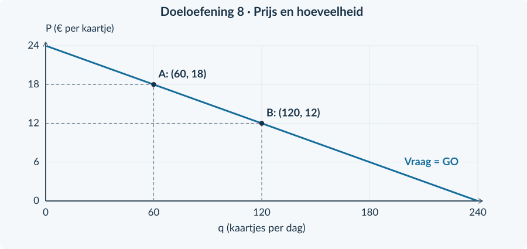
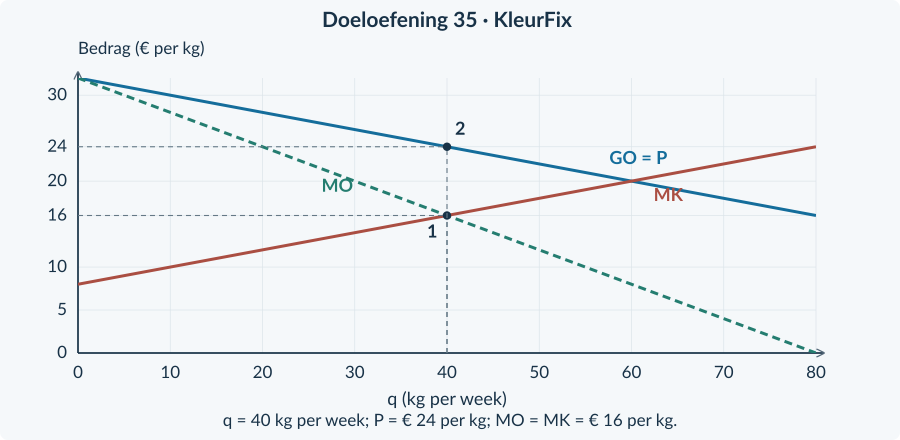

<!-- PAGE {"section": "4.1.1", "title": "Antwoorden bij Monopolie"} -->

BOEK 4 · HOOFDSTUK 1 · ANTWOORDEN

# Monopolie
Gebruik deze antwoorden na een eigen poging. Vergelijk niet alleen het eindgetal, maar ook je formule, de gekozen lijn en de eenheid. Bij bronvragen zijn andere formuleringen goed als het economische verband en het bronbewijs kloppen.

De afkortingen volgen het leerlinghoofdstuk: q is de afzet van één onderneming, P is de prijs per eenheid en TO en TK zijn totaalbedragen per periode. Bij een puntberekening is MO de afgeleide van TO; bij een tabelstap berekenen we het gemiddelde ΔTO / Δq.

## 4.1.1 · Monopolie: kenmerken

<h3>Opgave 1</h3>
<b>a.</b> GO = MO = P = € 10 per kg. Los 10 = 0,20q + 2 op: 8 = 0,20q, dus <b>q = 40 kg per week</b>. Dit is lager dan de capaciteit van 60 kg. MK stijgt; vóór 40 is MK lager dan MO, erna hoger. Daarom ligt hier het maximum.

<b>b.</b> TO = 10 × 40 = <b>€ 400 per week</b>. TK = 0,10 × 40² + 2 × 40 + 40 = 160 + 80 + 40 = <b>€ 280 per week</b>. Winst = 400 − 280 = <b>€ 120 per week</b>. De horizontale lijn beschrijft één kleine prijsnemer. De vraaglijn van alle marktvragers samen is niet daarom horizontaal.

<h3>Opgave 2</h3>
<b>a.</b> Nee. De andere winkels bieden volgens de bron goede alternatieven. Eén winkel met één exclusief merk is daarom geen bewijs voor één aanbieder op de bredere productmarkt.

<b>b.</b> Klanten kunnen overstappen naar de vergelijkbare producten in de andere winkels. Daardoor kan de winkel niet aannemen dat een hogere prijs zijn afzet onveranderd laat.

<h3>Opgave 3</h3>
<b>a.</b> A: q = 80 kaartjes per dag en P = € 12 per kaartje. B: q = 120 en P = € 8. Meer afzet gaat hier samen met een lagere prijs.

<b>b.</b> Bij P = € 12 hoort q = 80, niet 120. De combinatie (120, 12) ligt niet op de gegeven vraaglijn.

<!-- PAGE {"section": "4.1.1", "title": "Prijs en bronbewijs"} -->

<h3>Opgave 4</h3>
<b>a.</b> Bij q = 40: P = 18 − 0,10 × 40 = <b>€ 14 per kaartje</b>. Bij q = 80: P = 18 − 8 = <b>€ 10 per kaartje</b>.

<b>b.</b> 12 = 18 − 0,10q → 0,10q = 6 → <b>q = 60 kaartjes per dag</b>. Bij een prijs van € 12 willen de bezoekers samen 60 kaartjes kopen.

<h3>Opgave 5</h3>
<b>a.</b> De eigen prijsverlaging geeft een <b>beweging langs</b> de bestaande vraaglijn. De afzet stijgt.

<b>b.</b> Er zijn meer vragers. Bij iedere prijs stijgt de gevraagde hoeveelheid, dus de vraaglijn verschuift <b>naar rechts</b>.

<b>c.</b> Beide veranderingen vergroten de afzet en versterken elkaar. De bron geeft niet genoeg cijfers om de totale grootte van de toename te berekenen.

<b>d.</b> De prijs van het product zelf bepaalt een punt op de lijn. De extra toeristen veranderen de vraaglijn. De leerling schrijft het effect van een andere vraagfactor ten onrechte toe aan de eigen prijsverlaging.

<h3>Opgave 6</h3>
<b>a.</b> De bescherming verhindert dat andere ondernemingen hetzelfde filter aanbieden. Samen met het brongegeven dat er binnen de afgebakende markt geen goede vervangers zijn, ondersteunt dit de keuze voor een monopoliemodel.

<b>b.</b> P(20) = 40 − 0,50 × 20 = <b>€ 30</b>. P(40) = 40 − 20 = <b>€ 20</b>. Bij € 30 is de gevraagde hoeveelheid 20 filters per maand. Filtera kan dus niet 40 filters tegen € 30 afzetten volgens deze functie.

<h3>Opgave 7</h3>
<b>a.</b> A: volkomen concurrentie; bijvoorbeeld veel kleine aanbieders met een gelijk product en vrije toetreding. B: monopolie binnen het beschreven model; één bedrijf heeft exclusieve toegang tot de noodzakelijke voorziening.

<b>b.</b> A krijgt als prijsnemer een horizontale vraaglijn voor één kleine onderneming. B moet voor extra afzet rekening houden met de vraag op de hele markt en krijgt in dit model een dalende vraaglijn.

<b>Waarom bronbewijs nodig blijft</b> Een kenmerk benoemen is niet hetzelfde als het aantonen. Het antwoord verbindt steeds het brongegeven aan de economische betekenis.

<!-- PAGE {"section": "4.1.1", "title": "Doeloefening 8"} -->

## Opgave 8 · Eilandveer

<h3>Opgave 8</h3>
<b>a.</b> Alleen Eilandveer krijgt in de onderzochte periode de vergunning. Andere bedrijven krijgen geen toegang. Dit is een <b>toetredingsbarrière</b> en ondersteunt één aanbieder op de afgebakende directe verbinding.

<b>b.</b> Bij volkomen concurrentie is toetreding vrij; hier verhindert een exclusieve vergunning toetreding. Eén kleine prijsnemer heeft een horizontale vraaglijn bij de marktprijs; de monopolist bedient de hele markt en heeft hier een dalende vraaglijn.

<b>c.</b> P(60) = 24 − 0,10 × 60 = <b>€ 18 per kaartje</b>. P(120) = 24 − 12 = <b>€ 12 per kaartje</b>.

<b>d.</b> Nee. Bij € 18 geldt 18 = 24 − 0,10q → q = <b>60 kaartjes</b>. De gewenste 120 kaartjes vragen volgens de functie om € 12 per kaartje. De capaciteit is niet het probleem: 120 ligt onder 240.

<b>e.</b> De uitspraak is onjuist. Het bedrijf heeft invloed op P, maar reizigers kunnen uitstellen of niet reizen. De bron laat zien dat een hogere prijs samengaat met minder afzet. Het alleenrecht neemt de dalende vraag niet weg.

<figure><figcaption>De combinatie (120, 18) ligt boven de vraaglijn. Wel mogelijk zijn A = (60, 18) en B = (120, 12).</figcaption></figure>

<!-- PAGE {"section": "4.1.1", "title": "Bonus en herhaling"} -->

<h3>Opgave 9</h3>
<b>a.</b> Bij de smalle markt “deze toren” is er één aanbieder. Bij de bredere markt “uitstapjes met uitzicht” zijn er alternatieven. De vraag is of bezoekers de heuvel en het café als vervangers zien; de gekozen marktgrens verandert welke aanbieders meetellen.

<b>b.</b> Bijvoorbeeld: hoeveel bezoekers kiezen voor de heuvel of het café als de toren duurder wordt? Veel overstappers wijzen op sterke vervangbaarheid. Ook een onderbouwde vraag naar reistijd, beleving of bereidheid om een alternatief te kiezen is goed.

<b>c.</b> Ja. Alleenrecht op de toren voorkomt geen overstap naar een andere activiteit of afzien van bezoek. Monopolie op een smal omschreven product bewijst dus niet dat bezoekers nauwelijks reageren op prijs.

<b>Beoordeling bonus 9</b> Een goed antwoord noemt de gekozen markt, verbindt alternatieven aan gedrag en vraagt om een relevant aanvullend gegeven. Alleen “er zijn alternatieven” zonder uitleg over bezoekersgedrag is onvoldoende.

<h3>Opgave 10</h3>
<b>a.</b> TO = 9 × 60 = <b>€ 540 per week</b>. TK = 100 + 4 × 60 = <b>€ 340 per week</b>. GTK = 340 / 60 = <b>€ 5,666… per kg</b>. Winst = 540 − 340 = <b>€ 200 per week</b>. Controle: (9 − 5,666…) × 60 = 200.

<b>b.</b> Ev = %Δq / %ΔP = −15% / +10% = <b>−1,5</b>. De absolute waarde is 1,5 > 1, dus de vraag is <b>prijselastisch</b>.

<!-- PAGE {"section": "4.1.2", "title": "De opbrengststappen terughalen"} -->

## 4.1.2 · Marginale opbrengst bij monopolie

<h3>Opgave 11</h3>
<b>a.</b> (18 − 0,10q) × q = <b>18q − 0,10q²</b>. Differentieer term voor term: 18q → 18 en −0,10q² → −0,20q. De afgeleide is <b>18 − 0,20q</b>.

<b>b.</b> MK = <b>0,10q + 3</b>. De constante 90 verandert niet als de productie verandert en heeft afgeleide nul. Dat zegt niets over het weglaten van 90 uit TK.

<h3>Opgave 12</h3>
<b>a.</b> De prijs daalt van € 9 naar € 8 op de eerste 30 kg. Daardoor is de opbrengst op die kg in het tweede verkoopplan <b>30 × € 1 = € 30 lager</b>.

<b>b.</b> Extra afzet: 10 × € 8 = € 80. Lagere opbrengst op de eerste 30 kg: € 30. Netto: 80 − 30 = <b>€ 50 per week</b>. Controle: 40 × 8 − 30 × 9 = 320 − 270 = 50.

<h3>Opgave 13</h3>
<b>a.</b> P(20) = 16 − 0,20 × 20 = <b>€ 12</b>. P(30) = 16 − 6 = <b>€ 10</b>. De rechter strook tussen 20 en 30 kg hoort bij de extra afzet.

<b>b.</b> De bovenste strook boven de eerste 20 kg geeft de lagere opbrengst: 20 × (12 − 10) = <b>€ 40</b>. Extra afzet levert 10 × 10 = € 100. Netto stijgt TO met <b>€ 60</b>. Controle: 300 − 240 = 60.

<b>c.</b> ΔTO / Δq = (300 − 240) / (30 − 20) = 60 / 10 = <b>€ 6 per kg</b> over dit interval.

<b>Niet verwarren</b> € 60 is de totale omzettoename. € 6 is de gemiddelde extra opbrengst per kg over de stap. Geen van beide is de verkoopprijs van € 10.

<!-- PAGE {"section": "4.1.2", "title": "Tabellen en twee effecten"} -->

<h3>Opgave 14</h3>
<b>a.</b> TO = (18 − 0,20q) × q = <b>18q − 0,20q²</b>. Dus <b>MO = 18 − 0,40q</b>.

<b>b.</b> De complete tabel staat hieronder. Elke rij gebruikt eerst de vraagfunctie en dan P × q.

| q (kg per week) | P (€ per kg) | TO (€ per week) |
|---:|---:|---:|
| 10 | 16 | 160 |
| 20 | 14 | 280 |
| 30 | 12 | 360 |

<h3>Opgave 14</h3>
<b>c.</b> ΔTO / Δq = (360 − 280) / 10 = <b>€ 8 per kg</b>. MO(20) = 18 − 0,40 × 20 = <b>€ 10 per kg</b>. Het eerste getal geldt voor de hele stap; de afgeleide beschrijft een heel kleine uitbreiding rond 20 kg. MO daalt over de stap tot € 6 bij q = 30.

<h3>Opgave 15</h3>
<b>a.</b> De 10 extra kg leveren 10 × € 13 = <b>€ 130</b> op.

<b>b.</b> Op de eerste 40 kg is de prijs € 2 lager: 40 × € 2 = <b>€ 80 minder opbrengst</b>.

<b>c.</b> Netto ΔTO = 130 − 80 = <b>€ 50</b>. Controle: TO nieuw − TO oud = 50 × 13 − 40 × 15 = 650 − 600 = € 50.

<b>d.</b> De leerling telt alleen de extra verkopen. Hij vergeet dat ook de eerste 40 kg in het tweede plan voor € 13 in plaats van € 15 worden verkocht. Daardoor is zijn uitkomst € 80 te hoog.

<h3>Opgave 16</h3>
<b>a.</b> TO = (25 − 0,25q) × q = <b>25q − 0,25q²</b>; <b>MO = 25 − 0,50q</b>. Bij q = 20: P = € 20 en TO = € 400. Bij q = 40: P = € 15 en TO = € 600.

<b>b.</b> ΔTO / Δq = (600 − 400) / (40 − 20) = <b>€ 10 per kg</b>. MO(20) = 25 − 0,50 × 20 = <b>€ 15 per kg</b>. De marginale opbrengst daalt onderweg tot € 5 bij q = 40; het intervalgemiddelde hoeft niet gelijk te zijn aan de beginwaarde.

<b>c.</b> Extra afzet: 20 × € 15 = € 300. Minder op de eerste 20 kg: 20 × (€ 20 − € 15) = € 100. Netto: <b>€ 200</b>, gelijk aan 600 − 400.

<!-- PAGE {"section": "4.1.2", "title": "Doeloefening 18: functies en tabel"} -->

<h3>Opgave 17</h3>
<b>a.</b> Bij q = 80: P = 24 − 0,20 × 80 = <b>€ 8 per kg</b>; MO = 24 − 0,40 × 80 = <b>−€ 8 per kg</b>. Iedere kg heeft nog een positieve prijs. Maar voor iets meer afzet moet de prijs op alle kg zo ver dalen dat TO afneemt.

<b>b.</b> Als een kleine uitbreiding TO verlaagt, verhoogt een kleine vermindering TO rond dezelfde q. Minder verkopen tegen een iets hogere prijs is hier gunstig voor de omzet. Zonder de kosten en haalbare productiegrenzen kun je geen winstmaximale q bepalen.

## Doeloefening 18 · Pigment Prisma

<h3>Opgave 18</h3>
<b>a.</b> TO = P × q = (30 − 0,50q) × q = <b>30q − 0,50q²</b>. De afgeleide is <b>MO = 30 − q</b>. TO is euro per week; MO is euro per kg.

<b>b.</b> Gebruik per rij P = 30 − 0,50q en vervolgens TO = P × q. Bij 20 kg is dat bijvoorbeeld P = 30 − 10 = € 20 en TO = 20 × 20 = € 400.

| q (kg per week) | P (€ per kg) | TO (€ per week) |
|---:|---:|---:|
| 10 | 25 | 250 |
| 20 | 20 | 400 |
| 30 | 15 | 450 |

<h3>Opgave 18</h3>
<b>c.</b> Van 20 naar 30 kg: ΔTO / Δq = (450 − 400) / (30 − 20) = <b>€ 5 per kg</b>. MO(20) = 30 − 20 = <b>€ 10 per kg</b>. De tabel geeft een gemiddelde over 10 kg. De afgeleide geldt bij het beginpunt; MO daalt tijdens de toename en bereikt nul bij 30 kg.

<!-- PAGE {"section": "4.1.2", "title": "Doeloefening 18: verklaren en controleren"} -->

Doeloefening 18 · vervolg

<h3>Opgave 18</h3>
<b>d.</b> De 10 extra kg leveren 10 × € 15 = <b>€ 150</b> op. De eerste 20 kg leveren 20 × (€ 20 − € 15) = <b>€ 100 minder</b> op. Netto stijgt TO met 150 − 100 = <b>€ 50 per week</b>. Dat klopt met 450 − 400.

<b>e.</b> Onjuist. De verkoopprijs bij q = 20 is € 20 per kg, maar MO(20) = <b>€ 10 per kg</b>. Om iets meer te verkopen moet Prisma de uniforme prijs verlagen. Dat vermindert ook de opbrengst op de eerste hoeveelheid, waardoor MO lager is dan P.

<figure><figcaption>Bij dezelfde q meet GO de prijs per verkochte kg en MO de verandering van TO bij een heel kleine uitbreiding.</figcaption></figure>

<b>Een goede uitleg van MO</b> Noem beide omzetwerkingen: opbrengst op de extra eenheden én minder opbrengst op de eerdere hoeveelheid. “MO is lager omdat de lijn lager ligt” beschrijft alleen de figuur, niet de oorzaak.

<!-- PAGE {"section": "4.1.2", "title": "Bonus en terugblik naar concurrentie"} -->

<h3>Opgave 19</h3>
<b>a.</b> MO = 20 − 0,40q. MO(20) = <b>€ 12 per kg</b>; MO(80) = <b>−€ 12 per kg</b>. De omzetniveaus zijn gelijk, maar de reacties op een kleine afzetverandering zijn tegengesteld.

<b>b.</b> Rond 20 kg verhoogt iets méér afzet TO. Rond 80 kg verhoogt juist iets mínder afzet TO. In een schets moet zichtbaar zijn dat de eerste hoeveelheid vóór het omzetmaximum ligt en de tweede erna. Ook een correcte verbale uitleg volstaat.

<b>c.</b> Winst = TO − TK. Bij dezelfde TO is het plan met de laagste TK winstgevender. De bron geeft geen TK-waarden waarmee je die vergelijking kunt maken.

<b>Beoordeling bonus 19</b> Het onderscheid tussen een niveau en een verandering is de kern. Het antwoord noemt de twee verschillende MO-tekens en vertaalt die in twee verschillende verbeteringen van TO. Geen nieuwe elasticiteitsregel is nodig.

<h3>Opgave 20</h3>
<b>a.</b> TO = <b>12q</b> en MO = <b>12</b>. Uit TK volgt MK = <b>0,20q + 4</b>. Los 12 = 0,20q + 4 op: q = <b>40 kg per week</b>. Dit ligt onder de capaciteit van 60. MK stijgt door de constante MO heen; dat geeft een maximum.

<b>b.</b> TO = 12 × 40 = € 480. TK = 0,10 × 40² + 4 × 40 + 100 = 160 + 160 + 100 = € 420. Winst = <b>€ 60 per week</b>. Omdat de leverancier bij extra afzet dezelfde marktprijs blijft ontvangen, is iedere extra kg € 12 opbrengst waard. Er is geen prijsverlaging op de eerdere kg.

<!-- PAGE {"section": "4.1.3", "title": "Hoeveelheid en prijs uit elkaar houden"} -->

## 4.1.3 · Winstmaximalisatie bij monopolie

<h3>Opgave 21</h3>
<b>a.</b> TO = (20 − 0,10q) × q = <b>20q − 0,10q²</b>. Dus <b>MO = 20 − 0,20q</b>. Uit TK = 0,05q² + 2q + 50 volgt <b>MK = 0,10q + 2</b>.

<b>b.</b> Bij q = 40: P = 20 − 4 = <b>€ 16</b>; MO = 20 − 8 = <b>€ 12</b>; MK = 4 + 2 = <b>€ 6</b>, telkens per kg. MO > MK, dus een kleine uitbreiding verhoogt de winst.

<h3>Opgave 22</h3>
<b>a.</b> Kopers betalen GO = P = <b>€ 14 per kg</b>. Het snijpuntbedrag van € 8 is niet de verkoopprijs.

<b>b.</b> TO = 14 × 30 = <b>€ 420 per week</b>. Voor winst ontbreekt TK bij deze q, of gelijkwaardige informatie zoals GTK bij q = 30. Alleen de marginale kosten zijn niet genoeg.

<h3>Opgave 23</h3>
<b>a.</b> Punt 1 is het snijpunt van MO en MK. Dat bepaalt de gekozen afzet q = <b>80 kg per week</b>. Bij dezelfde q geeft punt 2 op GO de verkoopprijs <b>€ 12 per kg</b>.

<b>b.</b> TO = 12 × 80 = <b>€ 960 per week</b>. Winst = TO − TK = 960 − 420 = <b>€ 540 per week</b>.

<b>Van berekening naar betekenis</b> De prijs hoort bij de kopers. MO hoort bij de verandering van de totale opbrengst. MK hoort bij de verandering van de totale kosten. Door die drie betekenissen te scheiden, voorkom je de verkeerde prijsstap.

<!-- PAGE {"section": "4.1.3", "title": "Opgaven 24 en 25"} -->

<h3>Opgave 24</h3>
<b>a.</b> MO = <b>28 − 0,40q</b>; MK = <b>8</b>. Los 28 − 0,40q = 8 op: 20 = 0,40q → <b>q = 50 kg per week</b>. MO is boven 8 vóór 50 kg en onder 8 erna; 50 past binnen de capaciteit van 100.

<b>b.</b> Ga bij q = 50 omhoog naar GO. P = 28 − 0,20 × 50 = <b>€ 18 per kg</b>.

<b>c.</b> TO = 18 × 50 = <b>€ 900</b>. TK = 8 × 50 + 100 = <b>€ 500</b>. Winst = <b>€ 400 per week</b>.

<figure><figcaption>De verticale route blijft bij q = 50. Het bedrag € 8 op MO/MK is niet de prijs.</figcaption></figure>

<h3>Opgave 25</h3>
<b>a.</b> Bij alleen de nieuwe vraag wordt TO = 32q − 0,20q², dus MO = <b>32 − 0,40q</b>. Los 32 − 0,40q = 8 op: <b>q = 60 kg</b>.

<b>b.</b> Alleen hogere constante kosten veranderen MK niet. Bij de oude vraag blijft q = <b>50 kg</b>. De winst bij dezelfde q daalt met <b>€ 80</b>, van € 400 naar € 320.

<b>c.</b> Bij beide wijzigingen geldt de nieuwe marginale opbrengst en dezelfde MK = 8. Daarom kiest Wavo <b>q = 60</b> en P = 32 − 0,20 × 60 = <b>€ 20 per kg</b>.

<b>d.</b> De constante kosten zijn gestegen, niet de kosten van iedere extra kg. MK blijft 8. De grotere vraag verhoogt MO; daardoor kiest de onderneming juist een hogere q.

<!-- PAGE {"section": "4.1.3", "title": "Opgave 26: de hele route"} -->

<h3>Opgave 26</h3>
<b>a.</b> TO = (40 − 0,20q) × q = <b>40q − 0,20q²</b>. MO = <b>40 − 0,40q</b>; MK = <b>0,20q + 4</b>. Los MO = MK op: 40 − 0,40q = 0,20q + 4 → 36 = 0,60q → <b>q = 60 kg per week</b>. MO daalt en MK stijgt. Bij q = 50 is MO = 20 > MK = 14; bij q = 70 is MO = 12 < MK = 18. 60 ligt onder de capaciteit van 70.

<b>b.</b> P = 40 − 0,20 × 60 = <b>€ 28 per kg</b>. Markeer eerst q = 60 onder het MO/MK-snijpunt en ga daarna bij diezelfde q naar GO.

<b>c.</b> TO = 28 × 60 = <b>€ 1.680 per week</b>. TK = 0,10 × 60² + 4 × 60 + 100 = 360 + 240 + 100 = <b>€ 700</b>. Winst = 1.680 − 700 = <b>€ 980 per week</b>. Bij q = 0 is TO = 0 en TK = 100, dus winst = −€ 100. Niet produceren is niet beter.

<figure><figcaption>De marginale bedragen zijn bij q = 60 gelijk aan € 16 per kg. De verkoopprijs is € 28.</figcaption></figure>

<b>Capaciteit en tekening</b> Dat de figuur ook hoeveelheden boven 70 kg toont, maakt die niet uitvoerbaar. De productiecapaciteit komt uit de tekst. In de figuur kun je een grens bij 70 toevoegen, maar het berekende optimum ligt er al onder.

<!-- PAGE {"section": "4.1.3", "title": "Opgave 27: een grens vóór het snijpunt"} -->

<h3>Opgave 27</h3>
<b>a.</b> TO = (22 − 0,20q) × q = <b>22q − 0,20q²</b>, dus MO = <b>22 − 0,40q</b>. Uit TK = 2q + 50 volgt MK = <b>2</b>. Los 22 − 0,40q = 2 op: <b>q = 50 kg</b>. Dit is hoger dan de capaciteit van 40 kg. Bij q = 40 is MO = 6 > MK = 2; de winst stijgt nog tot aan de capaciteitsgrens. Kies daarom <b>q = 40 kg per week</b>.

<b>b.</b> Bij de werkelijk gekozen q is P = 22 − 0,20 × 40 = <b>€ 14 per kg</b>. TO = 14 × 40 = <b>€ 560</b>. TK = 2 × 40 + 50 = <b>€ 130</b>. Winst = <b>€ 430 per week</b>. Bij de onhaalbare kandidaat van 50 kg zou P = € 12 zijn. De prijs hoort steeds bij de daadwerkelijk gekozen afzet.

<figure><figcaption>Het optimum ligt hier op de capaciteitsgrens, niet op het onhaalbare MO/MK-snijpunt.</figcaption></figure>

<b>Waarom afronden niet de oplossing is</b> q = 50 is geen afrondingsprobleem. De productiecapaciteit staat die hoeveelheid niet toe. Je kiest eerst de beste uitvoerbare hoeveelheid en berekent pas daarna de bijbehorende prijs.

<!-- PAGE {"section": "4.1.3", "title": "Doeloefening 28: berekenen"} -->

## Opgave 28 · Korrels Nova

<h3>Opgave 28</h3>
<b>a.</b> TO = (40 − 0,25q) × q = <b>40q − 0,25q²</b>. MO = <b>40 − 0,50q</b>. Differentieer TK = 0,125q² + 10q + 200: <b>MK = 0,25q + 10</b>.

<b>b.</b> MO = MK geeft 40 − 0,50q = 0,25q + 10 → 30 = 0,75q → <b>q = 40 kg per week</b>. Dit past binnen 80 kg capaciteit. MO daalt en MK stijgt. Controle: bij q = 20 is MO = 30 > MK = 15; bij q = 60 is MO = 10 < MK = 25. De winst stijgt dus vóór 40 en daalt erna.

<b>c.</b> Lees P uit de vraagfunctie: P = 40 − 0,25 × 40 = <b>€ 30 per kg</b>. Niet uit MO, want MO(40) = € 20.

<b>d.</b> TO = 30 × 40 = <b>€ 1.200 per week</b>. TK = 0,125 × 40² + 10 × 40 + 200 = 200 + 400 + 200 = <b>€ 800 per week</b>. Winst = 1.200 − 800 = <b>€ 400 per week</b>. GTK = 800 / 40 = <b>€ 20 per kg</b>. Bij q = 0 is de winst −€ 200, dus niet produceren is niet beter.

<b>Controle van de winst</b> (P − GTK) × q = (30 − 20) × 40 = € 400. Gebruik in een winstberekening de werkelijke verkoopprijs P, niet de marginale opbrengst.

### Zo worden de uitkomsten gescheiden
| Uitkomst | Getal | Betekenis |
|---|---:|---|
| q | 40 kg per week | De gekozen afzet |
| MO = MK | € 20 per kg | De marginale vergelijking bij die afzet |
| P = GO | € 30 per kg | De prijs voor de kopers |
| GTK | € 20 per kg | De gemiddelde totale kosten |
| Winst | € 400 per week | Het totaal na aftrek van alle kosten |

Dat GTK en MO in dit voorbeeld allebei 20 zijn, is een toevallige gelijkheid van deze getallen. Zij meten verschillende dingen.

<!-- PAGE {"section": "4.1.3", "title": "Doeloefening 28: grafiek en foutmethode"} -->

Doeloefening 28 · vervolg

<h3>Opgave 28</h3>
<b>e.</b> De eerste hulplijn gaat vanaf het MO/MK-snijpunt naar <b>q = 40</b>. De verticale route bij q = 40 gaat vervolgens naar de GO-lijn, waarna je horizontaal <b>P = € 30</b> afleest. Zie de bovenste figuur.

<b>f.</b> Bij q = 60 geldt wel P = MK = € 25, maar <b>MO = € 10</b>. MO < MK, dus een kleine vermindering van q verhoogt de winst. P = MK is niet de monopolistische winstregel. De winst bij 60 kg is bovendien 25 × 60 − (0,125 × 60² + 10 × 60 + 200) = 1.500 − 1.250 = € 250, lager dan € 400.

<figure><figcaption>De juiste route: hoeveelheid uit MO/MK, prijs uit GO.</figcaption></figure>
<figure><figcaption>Een aanvullende winstcontrole met GTK bij q = 40. Dit is dezelfde winstberekening, niet een nieuwe optimalisatieregel.</figcaption></figure>

<!-- PAGE {"section": "4.1.3", "title": "Bonus en herhaling"} -->

<h3>Opgave 29</h3>
<b>a.</b> De vraag en variabele kosten zijn gelijk, dus MO en MK zijn gelijk. Een ander vast bedrag verandert de marginale vergelijking niet. Zolang dezelfde hoeveelheden haalbaar zijn en de vaste kosten in alle opties blijven bestaan, verandert de winstmaximale q niet.

<b>b.</b> B heeft bij dezelfde opbrengst en variabele kosten € 500 meer kosten. Winst B = 300 − 500 = <b>−€ 200</b>. Een monopolie garandeert dus geen positieve winst.

<b>c.</b> Vergelijk de winst bij productie met de winst bij q = 0. Als de constante kosten onvermijdbaar zijn, is winst(0) = <b>−TCK</b>, niet nul. Een negatief bedrag bij productie kan minder ongunstig zijn dan de uitkomst zonder productie.

<b>Beoordeling bonus 29</b> Een goed antwoord maakt onderscheid tussen de marginale keuze en het winstniveau. Het rekent het verlies correct uit en gebruikt de onvermijdbare vaste kosten ook bij q = 0. Een algemene sluitingsregel voor de lange termijn wordt niet gevraagd.

<h3>Opgave 30</h3>
<b>a.</b> %ΔP = (11 − 10) / 10 × 100% = <b>+10%</b>. %Δq = (180 − 200) / 200 × 100% = <b>−10%</b>. Ev = −10% / 10% = <b>−1</b>. TO oud = 10 × 200 = € 2.000; TO nieuw = 11 × 180 = € 1.980. TO daalt € 20, of <b>1%</b>. Bij deze eindige veranderingen met oude waarden als basis geeft Ev = −1 dus niet exact onveranderde omzet. Controleer rechtstreeks met P × q.

<b>b.</b> Overheidsuitgaven = subsidie per kg × alle gesubsidieerde kg = 2 × 150 = <b>€ 300</b>. De regeling geldt voor iedere verkochte kg in deze situatie, niet alleen voor de hoeveelheidstoename.

<!-- PAGE {"section": "4.1.4", "title": "Model, gemiddelde en totaal"} -->

## 4.1.4 · Gemengde opgaven

<h3>Opgave 31</h3>
<b>a.</b> A: de prijsnemersroute. De bron noemt veel kleine aanbieders, hetzelfde product en een gegeven marktprijs. B: de monopolieroute. De exclusieve toegang verhindert andere aanbieders; er zijn binnen de markt geen goede vervangers.

<b>b.</b> Een foto toont niet welke markt wordt bediend of welke concurrenten bestaan. Je moet weten of kopers vergelijkbare producten elders kunnen krijgen en of nieuwe aanbieders kunnen toetreden.

<h3>Opgave 32</h3>
<b>a.</b> P = GO = <b>€ 18 per kg</b>. TO = 18 × 40 = <b>€ 720</b>. TK = GTK × q = 13 × 40 = <b>€ 520</b>. Winst = 720 − 520 = <b>€ 200 per week</b>.

<b>b.</b> MO daalt door de stijgende MK-lijn. Vóór q = 40 verhoogt uitbreiding de winst; erna verlaagt zij de winst. 40 ligt binnen de capaciteit. MO − MK meet een marginale verandering, niet de gemiddelde winst per kg. Totale winst is (P − GTK) × q = (18 − 13) × 40, niet (MO − MK) × q.

<h3>Opgave 33</h3>
<b>a.</b> Winst per rij: 480 − 220 = <b>€ 260</b>; 800 − 420 = <b>€ 380</b>; 960 − 700 = <b>€ 260</b>; 960 − 1.060 = <b>−€ 100</b>. Van deze vier plannen hebben q = 60 en q = 80 de hoogste TO, beide € 960. De hoogste winst ligt bij q = <b>40</b>.

<b>b.</b> Nee. Bij q = 60 is TO = € 960 en TK = € 700. De winst is € 260, niet nul. Break-even vereist TO = TK.

<b>c.</b> GO = 800 / 40 = <b>€ 20 per kg</b>. GTK = 420 / 40 = <b>€ 10,50 per kg</b>. Winst = (20 − 10,50) × 40 = <b>€ 380 per week</b>.

<!-- PAGE {"section": "4.1.4", "title": "De gemengde doeloefening berekenen"} -->

<h3>Opgave 34</h3>
<b>a.</b> %ΔP = (9 − 10) / 10 × 100% = <b>−10%</b>. %Δq = (120 − 100) / 100 × 100% = <b>+20%</b>. Ev = +20% / −10% = <b>−2</b>. |Ev| > 1: de vraag is prijselastisch.

<b>b.</b> TO oud = 10 × 100 = <b>€ 1.000</b>. TO nieuw = 9 × 120 = <b>€ 1.080</b>. Extra afzet geeft 20 × € 9 = € 180 opbrengst; op de eerste 100 kg verlies je 100 × € 1 = € 100. Netto stijgt TO met <b>€ 80</b>.

<b>c.</b> Nee. Er zijn geen kostengegevens en geen gegevens over andere haalbare prijs-afzetcombinaties. Een hogere omzet bewijst geen winstmaximum.

## Doeloefening 35 · KleurFix en een prijsnemer

<h3>Opgave 35</h3>
<b>a.</b> De exclusieve toegang tot de noodzakelijke grondstof vormt de toetredingsbarrière. Het <b>gele logo</b> is niet nodig voor de berekeningen.

<b>b.</b> TO = (32 − 0,20q) × q = <b>32q − 0,20q²</b>; MO = <b>32 − 0,40q</b>; MK = <b>0,20q + 8</b>. Los 32 − 0,40q = 0,20q + 8 op: 24 = 0,60q → <b>q = 40 kg per week</b>. De dalende MO kruist de stijgende MK van boven naar beneden; de winst stijgt vóór 40 en daalt erna. 40 past binnen de capaciteit van 60.

<b>c.</b> P = 32 − 0,20 × 40 = <b>€ 24 per kg</b>. TO = 24 × 40 = <b>€ 960</b>. TK = 0,10 × 40² + 8 × 40 + 120 = 160 + 320 + 120 = <b>€ 600</b>. Winst = <b>€ 360 per week</b>. Bij q = 0 is de winst −€ 120, dus niet produceren is geen betere weekkeuze.

<!-- PAGE {"section": "4.1.4", "title": "De verschillende prijsroutes uitleggen"} -->

Doeloefening 35 · vervolg

<h3>Opgave 35</h3>
<b>d.</b> Markeer q = <b>40 kg</b> onder het MO/MK-snijpunt. Ga bij q = 40 naar de GO-lijn en lees daar <b>P = € 24</b> af. Het snijpuntbedrag zelf is € 16.

<b>e.</b> De prijsnemer ontvangt de gegeven marktprijs € 18. Daarom is MO = 18. MK = 0,20q + 8. Los 18 = 0,20q + 8 op: <b>q = 50 kg per week</b>, onder de capaciteit van 60. MK stijgt door MO, dus dit is een maximum. TO = 18 × 50 = € 900. TK = 0,10 × 50² + 8 × 50 + 120 = 250 + 400 + 120 = € 770. Winst = <b>€ 130 per week</b>.

<b>f.</b> De vergelijking MO = MK wordt bij beide gebruikt voor de hoeveelheid, maar de prijsroute verschilt. Bij de prijsnemer is <b>P = GO = MO = € 18</b>. Bij KleurFix is <b>MO = MK = € 16</b>, maar de verkoopprijs staat op GO en is <b>€ 24</b>. De leerling verwart de marginale opbrengst met de verkoopprijs.

<figure><figcaption>KleurFix: de marginale vergelijking kiest 40 kg; kopers betalen de prijs op GO.</figcaption></figure>

<b>Geen onbedoelde welvaartsvergelijking</b> De twee ondernemingen uit de opgave bedienen verschillende markten. Hun winstverschil is hier geen bewijs voor het maatschappelijke effect van monopolievorming.

<!-- PAGE {"section": "4.1.4", "title": "Fouten herstellen en conclusies begrenzen"} -->

<h3>Opgave 36</h3>
<b>a.</b> TO = P × q = (30 − 0,10q) × q = <b>30q − 0,10q²</b>. De leerling heeft de eerste term 30 niet met q vermenigvuldigd.

<b>b.</b> Een afgeleide meet hoe een totaal verandert. De constante kosten veranderen niet met q, maar blijven wel onderdeel van TK. Voor winst moet je <b>alle</b> totale kosten van TO aftrekken.

<b>c.</b> Vergelijk MO met <b>MK</b>. Als bijvoorbeeld MO = € 5 en MK = € 8 per kg, zijn de extra kosten hoger dan de extra opbrengst. Een kleine uitbreiding verlaagt dan de winst, hoewel MO positief is.

<h3>Opgave 37</h3>
<b>a.</b> TO = 20q − 0,10q², dus MO = 20 − 0,20q. MK = 4. De kandidaat is 20 − 0,20q = 4 → q = <b>80 kg</b>. Eerst is maar 60 kg haalbaar; MO(60) = 8 > 4, dus kies <b>q = 60 en P = € 14</b>. Na de verruiming is 80 haalbaar. Kies dan <b>q = 80 en P = € 12</b>.

<b>b.</b> Boven 80 kg ligt MO onder MK. Meer produceren tot 100 kg zou de winst verlagen. De capaciteit is een bovengrens, geen verplicht productieplan.

<h3>Opgave 38</h3>
<b>a.</b> Voor de winstkeuze ontbreken TK of voldoende informatie om MK en de winstbedragen te bepalen. Daarnaast kan bijvoorbeeld de <b>productiecapaciteit</b> de keuze beperken. Een goed onderbouwde andere uitvoerbaarheidsbeperking is ook juist.

<b>b.</b> Winst gaat over opbrengst minus kosten van de onderneming. “Beste voor de samenleving” vraagt een breder criterium en informatie over gevolgen voor andere betrokkenen. De hoogste ondernemingswinst is niet automatisch het grootste voordeel voor iedereen.

<b>Einde van het hoofdstuk</b> Een volledig antwoord koppelt methode aan model, berekent met de juiste eenheden en zegt niet meer dan de bron ondersteunt.
