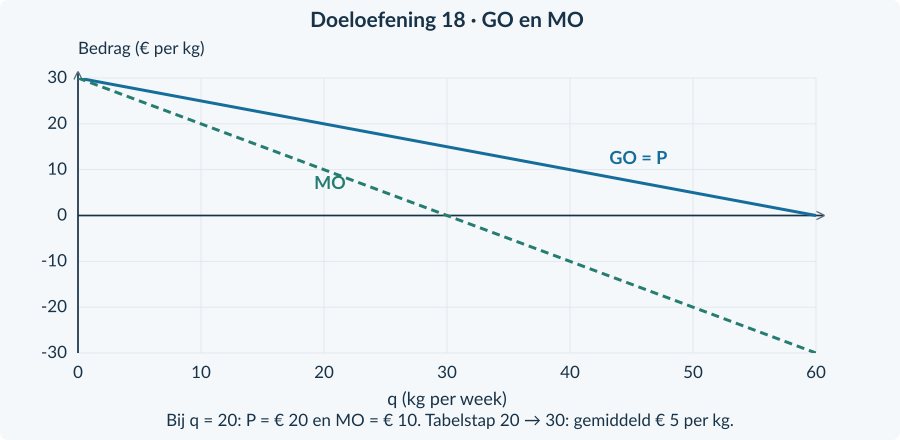

<!-- PAGE {"section": "4.1.2", "title": "De opbrengststappen terughalen"} -->

## 4.1.2 · Marginale opbrengst bij monopolie

<h3>Opgave 11</h3>
<b>a.</b> (18 − 0,10q) × q = <b>18q − 0,10q²</b>. Differentieer term voor term: 18q → 18 en −0,10q² → −0,20q. De afgeleide is <b>18 − 0,20q</b>.

<b>b.</b> MK = <b>0,10q + 3</b>. De constante 90 verandert niet als de productie verandert en heeft afgeleide nul. Dat zegt niets over het weglaten van 90 uit TK.

<h3>Opgave 12</h3>
<b>a.</b> De prijs daalt van € 9 naar € 8 op de eerste 30 kg. Daardoor is de opbrengst op die kg in het tweede verkoopplan <b>30 × € 1 = € 30 lager</b>.

<b>b.</b> Extra afzet: 10 × € 8 = € 80. Lagere opbrengst op de eerste 30 kg: € 30. Netto: 80 − 30 = <b>€ 50 per week</b>. Controle: 40 × 8 − 30 × 9 = 320 − 270 = 50.

<h3>Opgave 13</h3>
<b>a.</b> P(20) = 16 − 0,20 × 20 = <b>€ 12</b>. P(30) = 16 − 6 = <b>€ 10</b>. De rechter strook tussen 20 en 30 kg hoort bij de extra afzet.

<b>b.</b> De bovenste strook boven de eerste 20 kg geeft de lagere opbrengst: 20 × (12 − 10) = <b>€ 40</b>. Extra afzet levert 10 × 10 = € 100. Netto stijgt TO met <b>€ 60</b>. Controle: 300 − 240 = 60.

<b>c.</b> ΔTO / Δq = (300 − 240) / (30 − 20) = 60 / 10 = <b>€ 6 per kg</b> over dit interval.

<b>Niet verwarren</b> € 60 is de totale omzettoename. € 6 is de gemiddelde extra opbrengst per kg over de stap. Geen van beide is de verkoopprijs van € 10.

<!-- PAGE {"section": "4.1.2", "title": "Tabellen en twee effecten"} -->

<h3>Opgave 14</h3>
<b>a.</b> TO = (18 − 0,20q) × q = <b>18q − 0,20q²</b>. Dus <b>MO = 18 − 0,40q</b>.

<b>b.</b> De complete tabel staat hieronder. Elke rij gebruikt eerst de vraagfunctie en dan P × q.

| q (kg per week) | P (€ per kg) | TO (€ per week) |
|---:|---:|---:|
| 10 | 16 | 160 |
| 20 | 14 | 280 |
| 30 | 12 | 360 |

<h3>Opgave 14</h3>
<b>c.</b> ΔTO / Δq = (360 − 280) / 10 = <b>€ 8 per kg</b>. MO(20) = 18 − 0,40 × 20 = <b>€ 10 per kg</b>. Het eerste getal geldt voor de hele stap; de afgeleide beschrijft een heel kleine uitbreiding rond 20 kg. MO daalt over de stap tot € 6 bij q = 30.

<h3>Opgave 15</h3>
<b>a.</b> De 10 extra kg leveren 10 × € 13 = <b>€ 130</b> op.

<b>b.</b> Op de eerste 40 kg is de prijs € 2 lager: 40 × € 2 = <b>€ 80 minder opbrengst</b>.

<b>c.</b> Netto ΔTO = 130 − 80 = <b>€ 50</b>. Controle: TO nieuw − TO oud = 50 × 13 − 40 × 15 = 650 − 600 = € 50.

<b>d.</b> De leerling telt alleen de extra verkopen. Hij vergeet dat ook de eerste 40 kg in het tweede plan voor € 13 in plaats van € 15 worden verkocht. Daardoor is zijn uitkomst € 80 te hoog.

<h3>Opgave 16</h3>
<b>a.</b> TO = (25 − 0,25q) × q = <b>25q − 0,25q²</b>; <b>MO = 25 − 0,50q</b>. Bij q = 20: P = € 20 en TO = € 400. Bij q = 40: P = € 15 en TO = € 600.

<b>b.</b> ΔTO / Δq = (600 − 400) / (40 − 20) = <b>€ 10 per kg</b>. MO(20) = 25 − 0,50 × 20 = <b>€ 15 per kg</b>. De marginale opbrengst daalt onderweg tot € 5 bij q = 40; het intervalgemiddelde hoeft niet gelijk te zijn aan de beginwaarde.

<b>c.</b> Extra afzet: 20 × € 15 = € 300. Minder op de eerste 20 kg: 20 × (€ 20 − € 15) = € 100. Netto: <b>€ 200</b>, gelijk aan 600 − 400.

<!-- PAGE {"section": "4.1.2", "title": "Doeloefening 18: functies en tabel"} -->

<h3>Opgave 17</h3>
<b>a.</b> Bij q = 80: P = 24 − 0,20 × 80 = <b>€ 8 per kg</b>; MO = 24 − 0,40 × 80 = <b>−€ 8 per kg</b>. Iedere kg heeft nog een positieve prijs. Maar voor iets meer afzet moet de prijs op alle kg zo ver dalen dat TO afneemt.

<b>b.</b> Als een kleine uitbreiding TO verlaagt, verhoogt een kleine vermindering TO rond dezelfde q. Minder verkopen tegen een iets hogere prijs is hier gunstig voor de omzet. Zonder de kosten en haalbare productiegrenzen kun je geen winstmaximale q bepalen.

## Doeloefening 18 · Pigment Prisma

<h3>Opgave 18</h3>
<b>a.</b> TO = P × q = (30 − 0,50q) × q = <b>30q − 0,50q²</b>. De afgeleide is <b>MO = 30 − q</b>. TO is euro per week; MO is euro per kg.

<b>b.</b> Gebruik per rij P = 30 − 0,50q en vervolgens TO = P × q. Bij 20 kg is dat bijvoorbeeld P = 30 − 10 = € 20 en TO = 20 × 20 = € 400.

| q (kg per week) | P (€ per kg) | TO (€ per week) |
|---:|---:|---:|
| 10 | 25 | 250 |
| 20 | 20 | 400 |
| 30 | 15 | 450 |

<h3>Opgave 18</h3>
<b>c.</b> Van 20 naar 30 kg: ΔTO / Δq = (450 − 400) / (30 − 20) = <b>€ 5 per kg</b>. MO(20) = 30 − 20 = <b>€ 10 per kg</b>. De tabel geeft een gemiddelde over 10 kg. De afgeleide geldt bij het beginpunt; MO daalt tijdens de toename en bereikt nul bij 30 kg.

<!-- PAGE {"section": "4.1.2", "title": "Doeloefening 18: verklaren en controleren"} -->

Doeloefening 18 · vervolg

<h3>Opgave 18</h3>
<b>d.</b> De 10 extra kg leveren 10 × € 15 = <b>€ 150</b> op. De eerste 20 kg leveren 20 × (€ 20 − € 15) = <b>€ 100 minder</b> op. Netto stijgt TO met 150 − 100 = <b>€ 50 per week</b>. Dat klopt met 450 − 400.

<b>e.</b> Onjuist. De verkoopprijs bij q = 20 is € 20 per kg, maar MO(20) = <b>€ 10 per kg</b>. Om iets meer te verkopen moet Prisma de uniforme prijs verlagen. Dat vermindert ook de opbrengst op de eerste hoeveelheid, waardoor MO lager is dan P.

<figure><figcaption>Bij dezelfde q meet GO de prijs per verkochte kg en MO de verandering van TO bij een heel kleine uitbreiding.</figcaption></figure>

<b>Een goede uitleg van MO</b> Noem beide omzetwerkingen: opbrengst op de extra eenheden én minder opbrengst op de eerdere hoeveelheid. “MO is lager omdat de lijn lager ligt” beschrijft alleen de figuur, niet de oorzaak.

<!-- PAGE {"section": "4.1.2", "title": "Bonus en terugblik naar concurrentie"} -->

<h3>Opgave 19</h3>
<b>a.</b> MO = 20 − 0,40q. MO(20) = <b>€ 12 per kg</b>; MO(80) = <b>−€ 12 per kg</b>. De omzetniveaus zijn gelijk, maar de reacties op een kleine afzetverandering zijn tegengesteld.

<b>b.</b> Rond 20 kg verhoogt iets méér afzet TO. Rond 80 kg verhoogt juist iets mínder afzet TO. In een schets moet zichtbaar zijn dat de eerste hoeveelheid vóór het omzetmaximum ligt en de tweede erna. Ook een correcte verbale uitleg volstaat.

<b>c.</b> Winst = TO − TK. Bij dezelfde TO is het plan met de laagste TK winstgevender. De bron geeft geen TK-waarden waarmee je die vergelijking kunt maken.

<b>Beoordeling bonus 19</b> Het onderscheid tussen een niveau en een verandering is de kern. Het antwoord noemt de twee verschillende MO-tekens en vertaalt die in twee verschillende verbeteringen van TO. Geen nieuwe elasticiteitsregel is nodig.

<h3>Opgave 20</h3>
<b>a.</b> TO = <b>12q</b> en MO = <b>12</b>. Uit TK volgt MK = <b>0,20q + 4</b>. Los 12 = 0,20q + 4 op: q = <b>40 kg per week</b>. Dit ligt onder de capaciteit van 60. MK stijgt door de constante MO heen; dat geeft een maximum.

<b>b.</b> TO = 12 × 40 = € 480. TK = 0,10 × 40² + 4 × 40 + 100 = 160 + 160 + 100 = € 420. Winst = <b>€ 60 per week</b>. Omdat de leverancier bij extra afzet dezelfde marktprijs blijft ontvangen, is iedere extra kg € 12 opbrengst waard. Er is geen prijsverlaging op de eerdere kg.

