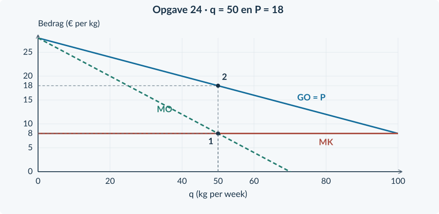
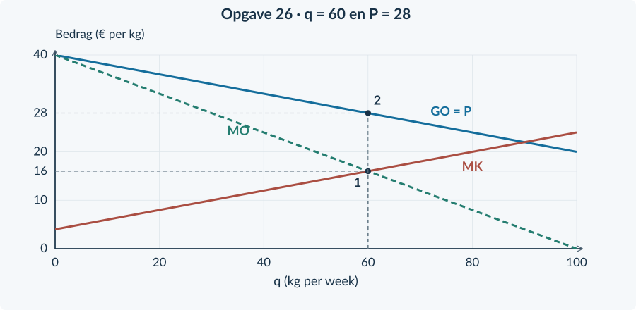
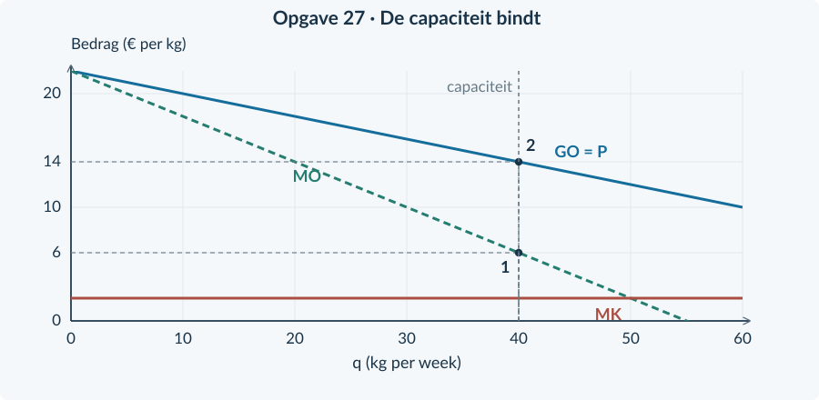
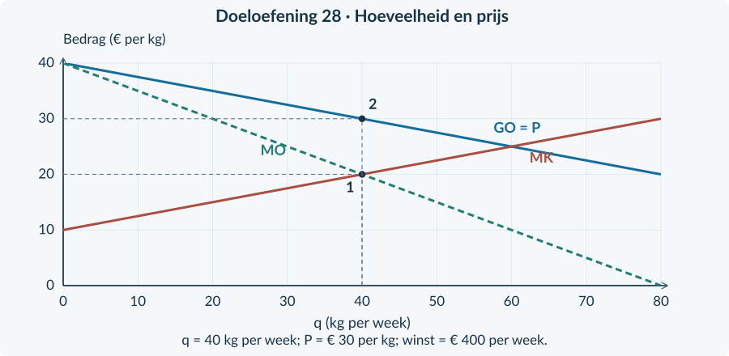
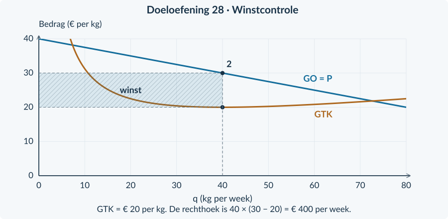

<!-- PAGE {"section": "4.1.3", "title": "Hoeveelheid en prijs uit elkaar houden"} -->

## 4.1.3 · Winstmaximalisatie bij monopolie

<h3>Opgave 21</h3>
<b>a.</b> TO = (20 − 0,10q) × q = <b>20q − 0,10q²</b>. Dus <b>MO = 20 − 0,20q</b>. Uit TK = 0,05q² + 2q + 50 volgt <b>MK = 0,10q + 2</b>.

<b>b.</b> Bij q = 40: P = 20 − 4 = <b>€ 16</b>; MO = 20 − 8 = <b>€ 12</b>; MK = 4 + 2 = <b>€ 6</b>, telkens per kg. MO > MK, dus een kleine uitbreiding verhoogt de winst.

<h3>Opgave 22</h3>
<b>a.</b> Kopers betalen GO = P = <b>€ 14 per kg</b>. Het snijpuntbedrag van € 8 is niet de verkoopprijs.

<b>b.</b> TO = 14 × 30 = <b>€ 420 per week</b>. Voor winst ontbreekt TK bij deze q, of gelijkwaardige informatie zoals GTK bij q = 30. Alleen de marginale kosten zijn niet genoeg.

<h3>Opgave 23</h3>
<b>a.</b> Punt 1 is het snijpunt van MO en MK. Dat bepaalt de gekozen afzet q = <b>80 kg per week</b>. Bij dezelfde q geeft punt 2 op GO de verkoopprijs <b>€ 12 per kg</b>.

<b>b.</b> TO = 12 × 80 = <b>€ 960 per week</b>. Winst = TO − TK = 960 − 420 = <b>€ 540 per week</b>.

<b>Van berekening naar betekenis</b> De prijs hoort bij de kopers. MO hoort bij de verandering van de totale opbrengst. MK hoort bij de verandering van de totale kosten. Door die drie betekenissen te scheiden, voorkom je de verkeerde prijsstap.

<!-- PAGE {"section": "4.1.3", "title": "Opgaven 24 en 25"} -->

<h3>Opgave 24</h3>
<b>a.</b> MO = <b>28 − 0,40q</b>; MK = <b>8</b>. Los 28 − 0,40q = 8 op: 20 = 0,40q → <b>q = 50 kg per week</b>. MO is boven 8 vóór 50 kg en onder 8 erna; 50 past binnen de capaciteit van 100.

<b>b.</b> Ga bij q = 50 omhoog naar GO. P = 28 − 0,20 × 50 = <b>€ 18 per kg</b>.

<b>c.</b> TO = 18 × 50 = <b>€ 900</b>. TK = 8 × 50 + 100 = <b>€ 500</b>. Winst = <b>€ 400 per week</b>.

<figure><figcaption>De verticale route blijft bij q = 50. Het bedrag € 8 op MO/MK is niet de prijs.</figcaption></figure>

<h3>Opgave 25</h3>
<b>a.</b> Bij alleen de nieuwe vraag wordt TO = 32q − 0,20q², dus MO = <b>32 − 0,40q</b>. Los 32 − 0,40q = 8 op: <b>q = 60 kg</b>.

<b>b.</b> Alleen hogere constante kosten veranderen MK niet. Bij de oude vraag blijft q = <b>50 kg</b>. De winst bij dezelfde q daalt met <b>€ 80</b>, van € 400 naar € 320.

<b>c.</b> Bij beide wijzigingen geldt de nieuwe marginale opbrengst en dezelfde MK = 8. Daarom kiest Wavo <b>q = 60</b> en P = 32 − 0,20 × 60 = <b>€ 20 per kg</b>.

<b>d.</b> De constante kosten zijn gestegen, niet de kosten van iedere extra kg. MK blijft 8. De grotere vraag verhoogt MO; daardoor kiest de onderneming juist een hogere q.

<!-- PAGE {"section": "4.1.3", "title": "Opgave 26: de hele route"} -->

<h3>Opgave 26</h3>
<b>a.</b> TO = (40 − 0,20q) × q = <b>40q − 0,20q²</b>. MO = <b>40 − 0,40q</b>; MK = <b>0,20q + 4</b>. Los MO = MK op: 40 − 0,40q = 0,20q + 4 → 36 = 0,60q → <b>q = 60 kg per week</b>. MO daalt en MK stijgt. Bij q = 50 is MO = 20 > MK = 14; bij q = 70 is MO = 12 < MK = 18. 60 ligt onder de capaciteit van 70.

<b>b.</b> P = 40 − 0,20 × 60 = <b>€ 28 per kg</b>. Markeer eerst q = 60 onder het MO/MK-snijpunt en ga daarna bij diezelfde q naar GO.

<b>c.</b> TO = 28 × 60 = <b>€ 1.680 per week</b>. TK = 0,10 × 60² + 4 × 60 + 100 = 360 + 240 + 100 = <b>€ 700</b>. Winst = 1.680 − 700 = <b>€ 980 per week</b>. Bij q = 0 is TO = 0 en TK = 100, dus winst = −€ 100. Niet produceren is niet beter.

<figure><figcaption>De marginale bedragen zijn bij q = 60 gelijk aan € 16 per kg. De verkoopprijs is € 28.</figcaption></figure>

<b>Capaciteit en tekening</b> Dat de figuur ook hoeveelheden boven 70 kg toont, maakt die niet uitvoerbaar. De productiecapaciteit komt uit de tekst. In de figuur kun je een grens bij 70 toevoegen, maar het berekende optimum ligt er al onder.

<!-- PAGE {"section": "4.1.3", "title": "Opgave 27: een grens vóór het snijpunt"} -->

<h3>Opgave 27</h3>
<b>a.</b> TO = (22 − 0,20q) × q = <b>22q − 0,20q²</b>, dus MO = <b>22 − 0,40q</b>. Uit TK = 2q + 50 volgt MK = <b>2</b>. Los 22 − 0,40q = 2 op: <b>q = 50 kg</b>. Dit is hoger dan de capaciteit van 40 kg. Bij q = 40 is MO = 6 > MK = 2; de winst stijgt nog tot aan de capaciteitsgrens. Kies daarom <b>q = 40 kg per week</b>.

<b>b.</b> Bij de werkelijk gekozen q is P = 22 − 0,20 × 40 = <b>€ 14 per kg</b>. TO = 14 × 40 = <b>€ 560</b>. TK = 2 × 40 + 50 = <b>€ 130</b>. Winst = <b>€ 430 per week</b>. Bij de onhaalbare kandidaat van 50 kg zou P = € 12 zijn. De prijs hoort steeds bij de daadwerkelijk gekozen afzet.

<figure><figcaption>Het optimum ligt hier op de capaciteitsgrens, niet op het onhaalbare MO/MK-snijpunt.</figcaption></figure>

<b>Waarom afronden niet de oplossing is</b> q = 50 is geen afrondingsprobleem. De productiecapaciteit staat die hoeveelheid niet toe. Je kiest eerst de beste uitvoerbare hoeveelheid en berekent pas daarna de bijbehorende prijs.

<!-- PAGE {"section": "4.1.3", "title": "Doeloefening 28: berekenen"} -->

## Opgave 28 · Korrels Nova

<h3>Opgave 28</h3>
<b>a.</b> TO = (40 − 0,25q) × q = <b>40q − 0,25q²</b>. MO = <b>40 − 0,50q</b>. Differentieer TK = 0,125q² + 10q + 200: <b>MK = 0,25q + 10</b>.

<b>b.</b> MO = MK geeft 40 − 0,50q = 0,25q + 10 → 30 = 0,75q → <b>q = 40 kg per week</b>. Dit past binnen 80 kg capaciteit. MO daalt en MK stijgt. Controle: bij q = 20 is MO = 30 > MK = 15; bij q = 60 is MO = 10 < MK = 25. De winst stijgt dus vóór 40 en daalt erna.

<b>c.</b> Lees P uit de vraagfunctie: P = 40 − 0,25 × 40 = <b>€ 30 per kg</b>. Niet uit MO, want MO(40) = € 20.

<b>d.</b> TO = 30 × 40 = <b>€ 1.200 per week</b>. TK = 0,125 × 40² + 10 × 40 + 200 = 200 + 400 + 200 = <b>€ 800 per week</b>. Winst = 1.200 − 800 = <b>€ 400 per week</b>. GTK = 800 / 40 = <b>€ 20 per kg</b>. Bij q = 0 is de winst −€ 200, dus niet produceren is niet beter.

<b>Controle van de winst</b> (P − GTK) × q = (30 − 20) × 40 = € 400. Gebruik in een winstberekening de werkelijke verkoopprijs P, niet de marginale opbrengst.

### Zo worden de uitkomsten gescheiden
| Uitkomst | Getal | Betekenis |
|---|---:|---|
| q | 40 kg per week | De gekozen afzet |
| MO = MK | € 20 per kg | De marginale vergelijking bij die afzet |
| P = GO | € 30 per kg | De prijs voor de kopers |
| GTK | € 20 per kg | De gemiddelde totale kosten |
| Winst | € 400 per week | Het totaal na aftrek van alle kosten |

Dat GTK en MO in dit voorbeeld allebei 20 zijn, is een toevallige gelijkheid van deze getallen. Zij meten verschillende dingen.

<!-- PAGE {"section": "4.1.3", "title": "Doeloefening 28: grafiek en foutmethode"} -->

Doeloefening 28 · vervolg

<h3>Opgave 28</h3>
<b>e.</b> De eerste hulplijn gaat vanaf het MO/MK-snijpunt naar <b>q = 40</b>. De verticale route bij q = 40 gaat vervolgens naar de GO-lijn, waarna je horizontaal <b>P = € 30</b> afleest. Zie de bovenste figuur.

<b>f.</b> Bij q = 60 geldt wel P = MK = € 25, maar <b>MO = € 10</b>. MO < MK, dus een kleine vermindering van q verhoogt de winst. P = MK is niet de monopolistische winstregel. De winst bij 60 kg is bovendien 25 × 60 − (0,125 × 60² + 10 × 60 + 200) = 1.500 − 1.250 = € 250, lager dan € 400.

<figure><figcaption>De juiste route: hoeveelheid uit MO/MK, prijs uit GO.</figcaption></figure>
<figure><figcaption>Een aanvullende winstcontrole met GTK bij q = 40. Dit is dezelfde winstberekening, niet een nieuwe optimalisatieregel.</figcaption></figure>

<!-- PAGE {"section": "4.1.3", "title": "Bonus en herhaling"} -->

<h3>Opgave 29</h3>
<b>a.</b> De vraag en variabele kosten zijn gelijk, dus MO en MK zijn gelijk. Een ander vast bedrag verandert de marginale vergelijking niet. Zolang dezelfde hoeveelheden haalbaar zijn en de vaste kosten in alle opties blijven bestaan, verandert de winstmaximale q niet.

<b>b.</b> B heeft bij dezelfde opbrengst en variabele kosten € 500 meer kosten. Winst B = 300 − 500 = <b>−€ 200</b>. Een monopolie garandeert dus geen positieve winst.

<b>c.</b> Vergelijk de winst bij productie met de winst bij q = 0. Als de constante kosten onvermijdbaar zijn, is winst(0) = <b>−TCK</b>, niet nul. Een negatief bedrag bij productie kan minder ongunstig zijn dan de uitkomst zonder productie.

<b>Beoordeling bonus 29</b> Een goed antwoord maakt onderscheid tussen de marginale keuze en het winstniveau. Het rekent het verlies correct uit en gebruikt de onvermijdbare vaste kosten ook bij q = 0. Een algemene sluitingsregel voor de lange termijn wordt niet gevraagd.

<h3>Opgave 30</h3>
<b>a.</b> %ΔP = (11 − 10) / 10 × 100% = <b>+10%</b>. %Δq = (180 − 200) / 200 × 100% = <b>−10%</b>. Ev = −10% / 10% = <b>−1</b>. TO oud = 10 × 200 = € 2.000; TO nieuw = 11 × 180 = € 1.980. TO daalt € 20, of <b>1%</b>. Bij deze eindige veranderingen met oude waarden als basis geeft Ev = −1 dus niet exact onveranderde omzet. Controleer rechtstreeks met P × q.

<b>b.</b> Overheidsuitgaven = subsidie per kg × alle gesubsidieerde kg = 2 × 150 = <b>€ 300</b>. De regeling geldt voor iedere verkochte kg in deze situatie, niet alleen voor de hoeveelheidstoename.

