<!-- PAGE {"section": "front", "title": "Hoofdstukopening"} -->

BOEK 4 · HOOFDSTUK 2 · ECONOMIE · 4 VWO

Marktvormen en marktfalen

Wie wint, wie betaalt en wie staat buiten de markt?

Een aanbieder kan meer winst maken terwijl kopers voordeel verliezen. Een belasting kan geld verplaatsen én schade aan buren verminderen. Dit hoofdstuk gebruikt bekende berekeningen om zulke verschillen zichtbaar te maken.

<a href="#s421"><b>4.2.1 · Welvaartseffecten van monopolie 3</b>Overdracht onderscheiden van verloren surplus.</a>
<a href="#s422"><b>4.2.2 · Prijsdiscriminatie 11</b>Twee klantgroepen, één bedrijf en één kostenrekening.</a>
<a href="#s423"><b>4.2.3 · Marktvormen vergelijken 19</b>Kenmerken gebruiken en een bekend rekenmodel overdragen.</a>
<a href="#s424"><b>4.2.4 · Negatieve externe effecten 25</b>De schade voor derden meetellen bij een heffing.</a>
<a href="#s425"><b>4.2.5 · Positieve externe effecten 36</b>Een subsidie beoordelen met voordeel voor anderen.</a>
<a href="#s426"><b>4.2.6 · Overheidsingrijpen bij marktfalen 47</b>Twee voorstellen afwegen met een duidelijk criterium.</a>
<a href="#s427"><b>4.2.7 · Gemengde opgaven 53</b>Zelf een model kiezen en je conclusie onderbouwen.</a>

<b>Na dit hoofdstuk</b> Je kunt ondernemingsgedrag verbinden met welvaart, gevolgen voor derden in je berekening opnemen en een beleidsvoorstel beoordelen zonder meer te beweren dan de gegevens ondersteunen.

Hoofdstukoverzicht: pagina 59. Begrippenlijst: pagina 60.

<!-- PAGE {"section": "front", "title": "Werken met dit hoofdstuk"} -->

# Een bekende methode, een nieuwe vraag

Uit Boek 2 ken je kosten, opbrengst, elasticiteit en surplus. Boek 3 voegde heffingen, subsidies en andere ingrepen toe. In hoofdstuk 4.1 bepaalde je de hoeveelheid en prijs van een monopolist. Die technieken blijven hier nodig.

Wat verandert, is **de vraag die je ermee beantwoordt**. Gaat het om de winst van één bedrijf, het voordeel van kopers en verkopers samen, of ook de gevolgen voor buitenstaanders?
<figure><figcaption>Figuur 1. Eerst marktgedrag, daarna de volledige welvaartsrekening, ten slotte een onderbouwd beleidsadvies.</figcaption></figure>

### Zo gebruik je de opgaven
Lees de uitleg en het uitgewerkte voorbeeld. De **Startopgaven** halen benodigde voorkennis op en controleren kort het nieuwe idee. De normale route loopt daarna via **Zelfstandige oefening** naar **Doeloefening**.

Heb je meer steun nodig, dan helpt **Begeleide inoefening**. Je werkt naar hetzelfde doel, met meer tussenstappen. Het **Denkertje / Bonusopgave** is extra uitdaging. De afsluitende herhaling oefent eerdere stof. Niet alles hoeft in dezelfde les af.

### Zo schrijf je een berekening
Noteer eerst de relatie of het gebied, dan de ingevulde getallen, de uitkomst met eenheid en een korte economische uitleg. Bij een beleidsadvies hoort ook het criterium waarmee je beoordeelt.

<b>Afspraken voor alle oefencases</b> De bronnen en bedragen in dit hoofdstuk zijn speciaal gemaakte, vereenvoudigde oefencases. Het zijn geen actuele tarieven, gemeten marktcijfers of beleidsadviezen over echte organisaties. Bij elke case staan de relevante aannames en eenheden.

We gebruiken rechte lijnen als doorlopende benadering. Surplus berekenen we daarom met oppervlakten; we tellen niet afzonderlijk alle kopers uit een rijtje op.

Neem je uitwerkingen in je schrift op. Gebruik een liniaal voor markeringen in de gegeven grafieken. Een lichte arcering houdt lijnen, prijzen en hoeveelheden leesbaar.

<!-- PAGE {"section": "4.2.1", "title": "Van winst naar welvaart"} -->

4.2.1 · WELVAARTSEFFECTEN VAN MONOPOLIE

# Meer winst. Ook meer welvaart?

Een verhuurbedrijf verhoogt de prijs en verhuurt minder apparaten. De winst stijgt. Klanten betalen meer of haken af. Is er alleen geld verschoven, of gaat er ook gezamenlijk voordeel verloren?

<b>Lesdoelen</b> Je kunt de monopolie-uitkomst vergelijken met een efficiënte uitkomst. Je kunt CS, PS en totaal surplus berekenen en arceren. Je kunt een overdracht onderscheiden van welvaartsverlies en PS onderscheiden van winst.

### Dezelfde markt, twee verschillende vragen
In hoofdstuk 4.1 zochten we de grootste winst voor één onderneming. Nu kijken we naar het voordeel van **kopers én verkopers samen**. We houden de vraag, productiekosten en kwaliteit gelijk. Er zijn hier geen externe effecten: buitenstaanders hebben geen kosten of baten van de transacties.

**Consumentensurplus (CS)** is het verschil tussen de betalingsbereidheid en de betaalde prijs, opgeteld over de verkochte eenheden. **Producentensurplus (PS)** is de opbrengst boven de variabele kosten. Het ligt tussen de verkoopprijs en de marginale-kostenlijn, tot aan de verkochte hoeveelheid.

TS = CS + PS winst = PS − TCK

We noemen TS het **totale surplus**. TCK zijn de totale constante kosten. Bij de vergelijking blijven die kosten gelijk. Daarom geven veranderingen van TS hier ook de verandering van het gezamenlijke voordeel na aftrek van TCK.

<b>Welke hoeveelheid?</b> In hoofdstuk 4.1 stond q voor één onderneming. Hier gebruiken we Q voor de hele markt. Bij één monopolist zijn q en Q hetzelfde aantal. Bij de vergelijking gebruiken we steeds de kosten van de héle onderzochte productie.

### Welvaart is niet hetzelfde als een eerlijke verdeling
Meer totaal surplus zegt nog niet wie het krijgt. De surplusberekening gebruikt betalingsbereidheid in euro en geeft geen volledig oordeel over alle aspecten van welzijn of rechtvaardigheid.

<!-- PAGE {"section": "4.2.1", "title": "Twee uitkomsten in dezelfde grafiek"} -->

### Eerst de keuze van de monopolist
Voor de verhuur van apparaten geldt **P = 80 − Q** en **MK = 20 + Q**. P en MK zijn euro per verhuur; Q is verhuurbeurten per dag. De capaciteit is 60. Alle klanten betalen in één situatie dezelfde prijs. Andere omstandigheden blijven gelijk.

De bekende route geeft TO = 80Q − Q² en MO = 80 − 2Q. Uit MO = MK volgt **Qm = 20**. Op de vraaglijn hoort daarbij **Pm = € 60**.
<figure><figcaption>Figuur 2. Punt M ligt op de vraaglijn. Het snijpunt van MO en MK bepaalt alleen de hoeveelheid.</figcaption></figure>

### Dan de efficiënte hoeveelheid
Een extra verhuur verhoogt het gezamenlijke voordeel zolang de betalingsbereidheid groter is dan MK. Voor het laatste zinvolle beetje productie geldt daarom **P = MK**: 80 − Q = 20 + Q. Dat geeft **Qe = 30** en **Pe = € 50**.

<b>Een vergelijkingsmaatstaf</b> De efficiënte uitkomst gebruikt dezelfde vraag en dezelfde kosten als de monopolie-uitkomst. We veranderen niet tegelijk de techniek of kwaliteit. Dit is geen bewering dat elke echte concurrerende markt exact zo werkt.

<!-- PAGE {"section": "4.2.1", "title": "De gebieden uit elkaar houden"} -->

### Wat gebeurt er met het voordeel van kopers?
Bij de efficiënte uitkomst is CS = ½ × 30 × (80 − 50) = **€ 450 per dag**. Bij monopolie is CS = ½ × 20 × (80 − 60) = **€ 200 per dag**.

Kopers verliezen € 250. Maar dat bedrag verdwijnt niet helemaal. De twintig blijvende verhuurbeurten worden € 10 duurder: **€ 200 gaat van kopers naar de aanbieder**. Bij de tien weggevallen verhuurbeurten verdwijnt voordeel voor beide kanten.
<figure>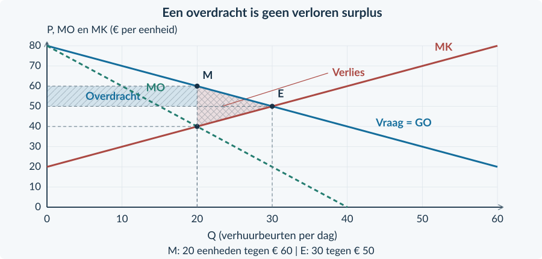<figcaption>Figuur 3. De rechthoek is een overdracht. Alleen de driehoek tussen Q = 20 en Q = 30 is verloren surplus.</figcaption></figure>

### Wat krijgt de aanbieder?
Bij monopolie is MK bij Q = 20 gelijk aan € 40. PS is een rechthoek van 20 × (60 − 40), plus een driehoek van ½ × 20 × (40 − 20): samen **€ 600**. Bij Qe = 30 is PS = ½ × 30 × (50 − 20) = **€ 450**.

PS stijgt met € 150, niet met € 200: de aanbieder krijgt de overdracht, maar verliest ook € 50 surplus door de lagere afzet. TS daalt van € 900 naar € 800. Het **welvaartsverlies is € 100**.

<b>Verloren transacties</b> De driehoek heeft basis 30 − 20 = 10 verhuurbeurten en hoogte 60 − 40 = € 20 per beurt. Welvaartsverlies = ½ × 10 × 20 = € 100 per dag. Het is geen rekening die iemand ontvangt.

<!-- PAGE {"section": "4.2.1", "title": "Eén volledige vergelijking"} -->

## Uitgewerkt voorbeeld

**Studiohuur** is de enige aanbieder in deze oefencase. Vraag: P = 70 − Q. Totale kosten: TK = 100 + 10Q + 0,5Q². Q is sessies per week; P is euro per sessie. De capaciteit is 50 sessies. De € 100 constante kosten zijn in deze week onvermijdelijk. Er zijn geen externe effecten.

**1 · Vind beide hoeveelheden.** MO = 70 − 2Q en MK = 10 + Q. Monopolie: 70 − 2Q = 10 + Q → Qm = 20. Lees Pm = 70 − 20 = € 50. Efficiënt: 70 − Q = 10 + Q → Qe = 30 en Pe = € 40. Beide hoeveelheden zijn haalbaar.

**2 · Selecteer en bereken de gebieden.**

| Per week | Monopolie: Q = 20 | Efficiënt: Q = 30 |
|---|---:|---:|
| CS | ½ × 20 × (70 − 50) = € 200 | ½ × 30 × (70 − 40) = € 450 |
| PS | 20 × (50 − 30) + ½ × 20 × (30 − 10) = € 600 | ½ × 30 × (40 − 10) = € 450 |
| TS | € 800 | € 900 |
| Winst = PS − 100 | € 500 | € 350 |

**3 · Controleer het verlies.** TS daalt € 100. De driehoek geeft hetzelfde: ½ × (30 − 20) × (50 − 30) = € 100.

**4 · Leg de verdeling uit.** De overdracht is 20 × (50 − 40) = € 200. De daling van CS is groter, omdat ook kopersvoordeel van weggevallen sessies verdwijnt. Meer PS is hier dus niet meer TS.
<figure>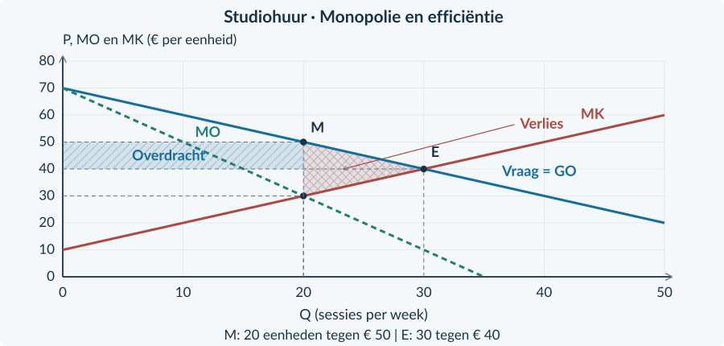<figcaption>Figuur 4. Bij Studiohuur is de driehoek van het verlies los te zien van de rechthoek van de overdracht.</figcaption></figure>

<b>Onthouden</b> Bereken Qm met MO = MK en Qe met P = MK. Lees beide prijzen op de vraaglijn. Bereken CS en PS bij de werkelijk verkochte hoeveelheid. Welvaartsverlies = verschil in TS. Trek constante kosten nog van PS af voor winst. In §4.2.2 onderzoeken we verschillende prijzen per groep.

<!-- PAGE {"section": "4.2.1", "title": "Opfrissen en aflezen"} -->

## Startopgaven

<b>Korte route:</b> Startopgaven → Zelfstandige oefening → Doeloefening. Extra hulp nodig? Maak eerst Begeleide inoefening.

<b>Opgave 1 · De bekende monopolieprocedure</b>

Voor een aanbieder geldt P = 30 − 0,5Q en TK = 40 + 10Q. Q is bezoeken per dag; P is euro per bezoek. De capaciteit is 40 bezoeken.

<b>a.</b> Bepaal MO en MK. Bereken Qm en Pm.

<b>b.</b> Bereken de winst bij die hoeveelheid.

<b>Opgave 2 · Niet elk verlies is verdwenen</b>

Na een prijsverandering daalt CS met € 120 per week. PS stijgt met € 80. Andere onderdelen van de welvaartsvergelijking veranderen niet.

<b>a.</b> Bereken de verandering van TS.

<b>b.</b> Een leerling noemt de hele € 120 welvaartsverlies. Wat vergeet hij?

## Begeleide inoefening

Heb je deze hulp niet nodig? Ga dan verder met Zelfstandige oefening.

<b>Opgave 3 · Herken de twee gebieden</b>

Gebruik de volledig gemarkeerde figuur op deze pagina. Dezelfde vraag en kosten gelden in beide uitkomsten.

<b>a.</b> Lees Qm, Pm, Qe en Pe af. Benoem de economische functie van gebied A en gebied B.

<b>b.</b> Bereken de oppervlakte van A en B.

<figure>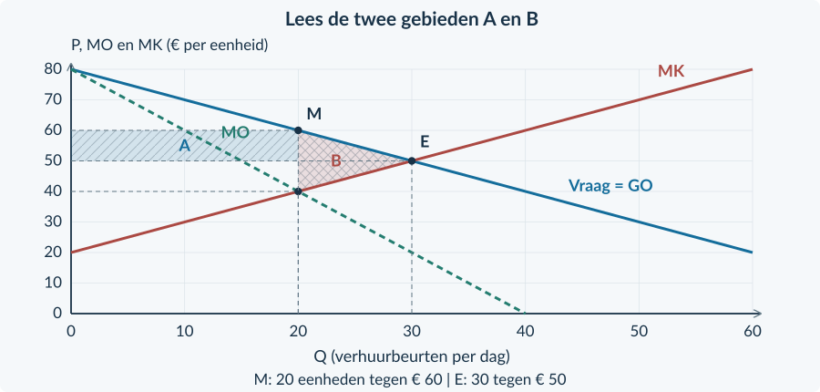<figcaption>Figuur 5. A wordt door andere marktdeelnemers ontvangen; B niet. Beide bedragen zijn euro per dag.</figcaption></figure>

<!-- PAGE {"section": "4.2.1", "title": "Van gebieden naar een conclusie"} -->

<b>Opgave 4 · Een tabel aanvullen</b>

Een aanbieder verhuurt opslagvakken. Bij monopolie zijn Q = 20 en P = € 50; de efficiënte uitkomst is Q = 30 en P = € 40. De vraag begint bij € 70; MK = 10 + Q. Alle bedragen hieronder zijn per week. Er zijn geen externe effecten.

<b>a.</b> Vul de lege cellen van de tabel in. Gebruik voor PS bij monopolie eerst een rechthoek en daarna een driehoek.

<b>b.</b> Bereken de overdracht en het welvaartsverlies.

| Situatie | CS (€ per week) | PS (€ per week) | TS (€ per week) |
|---|---:|---:|---:|
| Monopolie | … | … | … |
| Efficiënt | 450 | 450 | … |

## Zelfstandige oefening

<b>Opgave 5 · Twee effecten tegelijk</b>

Door één prijs- en afzetverandering bij een verhuurder ontstaat een overdracht van € 300 van kopers naar verkopers. Daarnaast vervalt € 60 koperssurplus en € 40 producentensurplus door niet meer gesloten transacties. Er verandert verder niets.

<b>a.</b> Bekijk alleen de overdracht. Wat doet die met CS, PS en TS?

<b>b.</b> Bekijk alleen de weggevallen transacties. Hoe verandert TS?

<b>c.</b> Bereken de totale verandering van CS, PS en TS.

<b>d.</b> Beoordeel: “PS stijgt, dus er is geen marktfalen.”

<b>Opgave 6 · De markt voor prints</b>

P = 60 − Q en MK = Q. Q is prints per week en P euro per print, met 0 ≤ Q ≤ 50. Er zijn geen externe effecten.

<b>a.</b> Bepaal de monopolie-uitkomst en de efficiënte uitkomst.

<b>b.</b> Bereken CS, PS en TS bij monopolie en bepaal het welvaartsverlies.

<!-- PAGE {"section": "4.2.1", "title": "Doel: verdeling en verlies"} -->

## Doeloefening

<b>Bron · De enige VR-studio</b> Eén studio bedient de hele beschreven markt. Vraag: P = 80 − 0,5Q. Kosten: TK = 200 + 20Q + 0,25Q²; dus MK = 20 + 0,5Q. Q is sessies per week, P is euro per sessie. De capaciteit is 100 sessies. De € 200 constante kosten blijven deze week in beide situaties gelijk. Vergelijk met dezelfde vraag en kosten bij de efficiënte hoeveelheid. Geen externe effecten of andere veranderingen.

<b>Opgave 7 · De VR-studio</b>

Gebruik de bron en de basisgrafiek. De lijnen zijn al gegeven.

<b>a.</b> (3p) Bereken Qm en Pm, en daarna Qe en Pe.

<b>b.</b> (3p) Markeer beide uitkomsten en arceer CS en PS bij monopolie. Bereken die bedragen en de winst.

<b>c.</b> (3p) Bereken TS in beide situaties en het welvaartsverlies. Benoem basis en hoogte van de verliesdriehoek.

<b>d.</b> (2p) Bereken de overdracht op de blijvende sessies. Leg uit waarom die niet zelf het welvaartsverlies is.

<b>e.</b> (2p) Beoordeel: “Meer producentensurplus betekent dat deze uitkomst voor de samenleving beter én eerlijker is.”

<figure>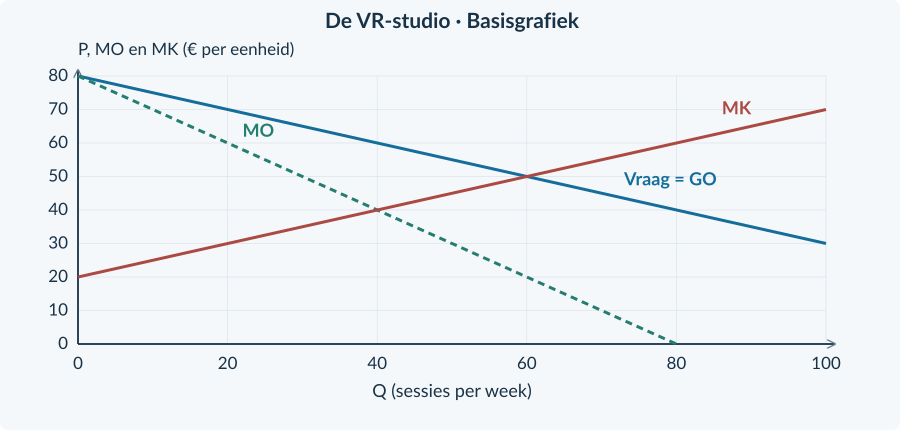<figcaption>Figuur 6. Gegeven lijnen voor de VR-studio. Voeg alleen de gevraagde markeringen en arceringen toe.</figcaption></figure>

<!-- PAGE {"section": "4.2.1", "title": "Een vergelijking zorgvuldig gebruiken"} -->

## Denkertje / Bonusopgave

<b>Opgave 8 · Een betere techniek</b>

Een ontwerper zegt: “Mijn nieuwe techniek heeft lagere kosten. Daarom mag je mijn monopolie niet vergelijken met een concurrerende markt met de oude, dure techniek.” Er zijn nog geen cijfers over de nieuwe kosten of toekomstige uitvindingen.

<b>a.</b> Waarom kan een vergelijking met verschillende technieken de oorzaak van een welvaartsverschil vertroebelen?

<b>b.</b> Stel twee eerlijke vergelijkingen voor die samen meer inzicht geven.

<b>c.</b> Bewijst het bestaan van een patent al dat de totale maatschappelijke uitkomst beter is?

## Herhaling / Herhaling en interleaving

<b>Opgave 9 · De belasting blijft een wig</b>

Op een concurrerende markt is de oorspronkelijke prijs € 12. Na een belasting betalen kopers € 15 en ontvangen producenten € 10. Er worden 80 stuks per week verkocht.

<b>a.</b> Bereken de belasting per stuk en de overheidsopbrengst.

<b>b.</b> Bereken het kopers- en verkopersdeel van de belasting per verkocht stuk.

<b>Terug naar de hoofdvraag</b> Dezelfde prijsverandering kan tegelijk een overdracht én verloren surplus veroorzaken. Houd die twee effecten in je berekening apart.

<!-- PAGE {"section": "4.2.2", "title": "Dezelfde dienst, een andere prijs"} -->

4.2.2 · PRIJSDISCRIMINATIE

# Waarom krijgt de één korting?

Twee bezoekers gebruiken dezelfde klimhal, op hetzelfde tijdstip. Een student betaalt minder dan een andere bezoeker. De toegang kost de hal evenveel. Waarom verkoopt de hal niet aan iedereen voor dezelfde prijs?

<b>Lesdoelen</b> Je kunt prijsdiscriminatie herkennen en de voorwaarden uitleggen. Je kunt twee gescheiden groepen vergelijken met één gezamenlijke prijs. Je kunt omzet, kosten, winst en de verdeling van surplus beoordelen.

<b>Prijsdiscriminatie</b> Een aanbieder vraagt verschillende prijzen voor hetzelfde product of dezelfde dienst, terwijl het prijsverschil niet door een verschil in kosten wordt verklaard.

### Drie voorwaarden moeten passen
De aanbieder heeft **enige marktmacht**: hij kan zijn prijs beïnvloeden. Hij kan groepen met een verschillende betalingsbereidheid of prijsgevoeligheid **herkennen en apart behandelen**. En kopers kunnen het goed niet gemakkelijk goedkoop kopen en vervolgens doorverkopen aan de duurdere groep.

Een persoonlijk toegangsbewijs kan doorverkoop verhinderen. Twee afzonderlijke prijzen werken niet als iedereen zonder controle het goedkoopste kaartje kan kiezen.
<figure><figcaption>Figuur 7. De aanbieder moet de groepen werkelijk kunnen scheiden. Alleen een andere prijslijst is niet genoeg.</figcaption></figure>

<b>Niet elk prijsverschil is prijsdiscriminatie</b> Een product thuisbezorgen kan duurder zijn doordat bezorging extra kost. Een luxere kamer is niet dezelfde dienst als een eenvoudige kamer. Beschrijf daarom eerst het product en de kosten.

<!-- PAGE {"section": "4.2.2", "title": "De bekende methode, nu tweemaal"} -->

### Elke groep heeft haar eigen vraag
Groep A en groep B reageren ieder op hun eigen prijs. De aanbieder bepaalt binnen elke groep één uniforme prijs. De twee prijzen mogen wel verschillen.

Voor een sporthal geldt in een oefenweek: **P_A = 36 − Q_A** en **P_B = 20 − Q_B**. Prijzen zijn euro per bezoek; hoeveelheden zijn bezoeken per week. Q_A loopt van 0 tot 36 en Q_B van 0 tot 20. Andere vraagfactoren blijven gelijk.

De marginale kosten zijn steeds **€ 4 per extra bezoek**, ook als beide groepen samen meer komen. De capaciteit is ruim genoeg voor 56 bezoeken. Daarom kunnen we de bekende MO/MK-keuze voor elke groep apart uitvoeren.
<figure>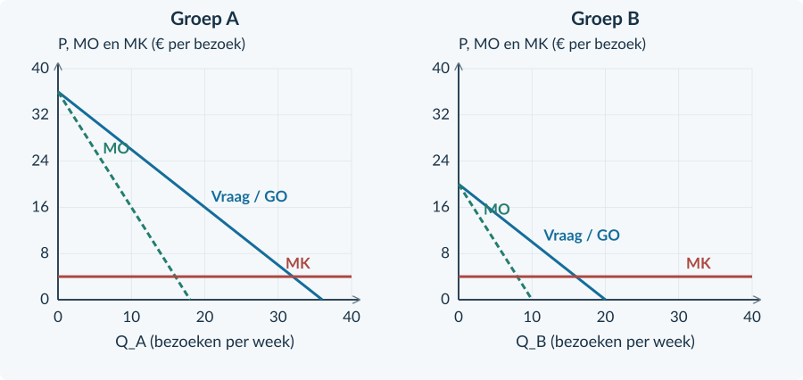<figcaption>Figuur 8. De twee panelen gebruiken dezelfde schaal. Lees de prijs van iedere groep af op haar eigen vraaglijn, niet op MO.</figcaption></figure>

Per groep: MO = MK → Q → P op de eigen vraaglijn TO totaal = P_A × Q_A + P_B × Q_B TK totaal = TCK + 4 × (Q_A + Q_B)

<b>Constante kosten tel je eenmaal</b> Het zijn twee klantgroepen van één bedrijf. Dezelfde huur of installatie is niet ineens twee keer nodig. Als MK zou afhangen van de totale productie, kun je beide groepen niet zomaar los optimaliseren. Dat complexere geval gebruiken we hier niet.

<!-- PAGE {"section": "4.2.2", "title": "Een prijsvergelijking uitwerken"} -->

## Uitgewerkt voorbeeld

**Avondhal** gebruikt de gegevens van de vorige pagina. De constante kosten zijn € 64 per week. Met één gemeenschappelijke prijs van € 16 verkoopt de hal 20 bezoeken aan A en 4 aan B. De bron geeft deze gemeenschappelijke prijs; we hoeven hem niet opnieuw te bepalen. Er zijn geen externe effecten.

**1 · Herken de voorwaarden.** De groepen gebruiken dezelfde voorziening en kosten per bezoek evenveel. Persoonlijke passen houden de groepen gescheiden. Beide vraagfuncties blijven bij de vergelijking gelijk.

**2 · Bepaal de aparte keuzes.** Voor A: MO_A = 36 − 2Q_A = 4 → Q_A = 16 en P_A = € 20. Voor B: MO_B = 20 − 2Q_B = 4 → Q_B = 8 en P_B = € 12. Bij beide groepen ligt MO vóór deze hoeveelheid boven MK en erna eronder.

**3 · Bereken het bedrijfsresultaat.**

| Per week | Eén prijs | Twee groepsprijzen |
|---|---:|---:|
| Totale afzet | 20 + 4 = 24 | 16 + 8 = 24 |
| TO | 16 × 24 = € 384 | 20 × 16 + 12 × 8 = € 416 |
| TK | 64 + 4 × 24 = € 160 | 64 + 4 × 24 = € 160 |
| Winst | € 224 | € 256 |

**4 · Kijk ook naar kopers.** A betaalt meer en koopt minder; B betaalt minder en koopt meer. CS_A daalt van ½ × 20 × 20 = € 200 naar ½ × 16 × 16 = € 128. CS_B stijgt van € 8 naar € 32. Samen daalt CS van € 208 naar € 160.

**5 · Begrens je conclusie.** PS stijgt van 384 − 96 = € 288 naar 416 − 96 = € 320. TS daalt daardoor van € 496 naar € 480. De aanbieder wint, maar dat is geen bewijs voor meer totale welvaart. Zelfs de gelijke totale afzet garandeert dat niet: de verdeling van de bezoeken verandert.

<b>Onthouden</b> Herken groepen en controleer doorverkoop. Kies per groep Q en lees de bijbehorende P. Tel omzet op, maar tel de gezamenlijke constante kosten slechts eenmaal. Beoordeel daarna de verdeling; winst en welvaart zijn verschillende uitkomsten.

<!-- PAGE {"section": "4.2.2", "title": "Herkennen en narekenen"} -->

## Startopgaven

<b>Korte route:</b> Startopgaven → Zelfstandige oefening → Doeloefening. Extra hulp nodig? Maak eerst Begeleide inoefening.

<b>Opgave 10 · Twee inkomsten, één bedrijf</b>

Een aanbieder verkoopt in één week 30 bezoeken voor € 12 en 20 bezoeken voor € 8. De variabele kosten zijn € 3 per bezoek; de gezamenlijke constante kosten zijn € 90.

<b>a.</b> Bereken totale omzet, totale kosten en winst.

<b>b.</b> Waarom trek je de € 90 niet voor elke groep afzonderlijk af?

<b>Opgave 11 · Drie prijskaartjes</b>

A: dezelfde rondleiding is goedkoper met een gecontroleerde studentenpas, zonder kostenverschil. B: een taxi rekent extra voor een langere rit. C: een abonnement met extra opslag kost meer.

<b>a.</b> Welke situatie beschrijft prijsdiscriminatie? Leg uit.

<b>b.</b> Waarom zijn B en C geen voldoende bewijs?

## Begeleide inoefening

Heb je deze hulp niet nodig? Ga dan verder met Zelfstandige oefening.

<b>Opgave 12 · Een volledig ingevuld paneel</b>

Lees in de figuur de keuzes van Lichtzaal voor twee soorten persoonlijke passen. MK = € 4 per bezoek. Er zijn geen extra kosten om groepen te scheiden.

<b>a.</b> Lees voor A en B de hoeveelheid en de prijs af. Bereken de totale omzet.

<b>b.</b> Leg uit waarom het horizontale niveau van € 4 niet de verkoopprijs is.

<figure><figcaption>Figuur 9. Gebruik de gemarkeerde hoeveelheden. Ga daarna naar de vraaglijn voor de prijs.</figcaption></figure>

<!-- PAGE {"section": "4.2.2", "title": "De gezamenlijke kosten bewaken"} -->

<b>Opgave 13 · De rekentabel van de ijsbaan</b>

Dezelfde ijsbaandienst wordt aan twee herkenbare groepen verkocht. De bron geeft de haalbare keuzes in de tabel. Variabele kosten: € 2 per bezoek. Gezamenlijke constante kosten: € 100 per week.

<b>a.</b> Vul eerst de lege cellen TO, TK en winst in voor beide situaties.

<b>b.</b> Een leerling rekent bij twee prijzen € 220 winst. Welke kostenpost ontbreekt in zijn berekening 320 − 100?

| Gegeven | Eén prijs | Twee prijzen |
|---|---:|---:|
| Prijs A / afzet A | € 10 / 20 | € 12 / 15 |
| Prijs B / afzet B | € 10 / 10 | € 7 / 20 |
| TO (€ per week) | … | … |
| TK (€ per week) | … | … |
| Winst (€ per week) | … | … |

## Zelfstandige oefening

<b>Opgave 14 · Toegang tot een tentoonstelling</b>

Voor groep A geldt P_A = 28 − Q_A; voor B geldt P_B = 20 − Q_B. Prijzen zijn euro per bezoek, hoeveelheden bezoeken per week. MK = € 4 voor beide groepen. TCK = € 40 per week. De capaciteit is 48. De groepen gebruiken dezelfde dienst en kunnen niet doorverkopen.

<b>a.</b> Bereken de winstmaximale afzet en de prijs voor elke groep.

<b>b.</b> Bereken de totale winst en geef één reden waarom de twee prijzen uitvoerbaar zijn.

<!-- PAGE {"section": "4.2.2", "title": "Niet alleen het bedrijf beoordelen"} -->

<b>Opgave 15 · Tegengestelde gevolgen</b>

Een ontspanningscentrum vervangt één tarief door groepsprijzen. Deelnemers van A betalen meer; CS_A daalt € 90. B krijgt korting; CS_B stijgt € 30. PS stijgt € 40 per week. Geen andere maatschappelijke posten veranderen.

<b>a.</b> Bekijk eerst alleen de prijsverandering voor A. Wat gebeurt met het surplus van A?

<b>b.</b> Bekijk nu alleen de prijsverandering voor B. Wat gebeurt met het surplus van B?

<b>c.</b> Bereken de verandering van het totale CS en van TS.

<b>d.</b> Beoordeel: “Er is korting en de aanbieder verdient meer, dus alle partijen winnen.”

### Gebruik prijsgevoeligheid als verklaring, niet als etiket
Een groep met goede alternatieven kan sterker afhaken bij een prijsverhoging. Dat maakt een lager tarief aantrekkelijk voor een aanbieder. Maar “student”, “volwassene” of “zakelijke klant” is op zichzelf geen bewijs voor een bepaalde elasticiteit. Gebruik gegevens over keuzes of reacties uit de bron.

Ook de helling van een getekende lijn is niet genoeg. Bij verschillende prijzen en hoeveelheden kunnen dezelfde absolute veranderingen heel andere procentuele veranderingen zijn. In dit hoofdstuk leiden we hiervoor geen nieuwe elasticiteitsformule af.

<b>Een advies in drie zinnen</b> Beschrijf eerst wat met de winst gebeurt. Noem daarna welke klantgroep voordeel of nadeel ondervindt. Beperk ten slotte je welvaartsconclusie tot de bekende bedragen en aannames.

<!-- PAGE {"section": "4.2.2", "title": "Doel: één prijs en twee prijzen"} -->

## Doeloefening

<b>Bron A · FilmLab</b> FilmLab biedt dezelfde toegangsdienst aan A en B. Het heeft marktmacht. De passen zijn persoonlijk; groepen worden gecontroleerd en doorverkoop is onmogelijk. Vraag: P_A = 40 − Q_A en P_B = 24 − Q_B. P is euro per bezoek; Q_A en Q_B zijn bezoeken per week. De hoeveelheden lopen van 0 tot 40 en van 0 tot 24. MK = € 8 voor elk bezoek. TCK = € 80 per week, samen voor beide groepen. Capaciteit: 64 bezoeken.

<b>Bron B · De vergelijking</b> Bij één gegeven prijs van € 20 koopt A 20 bezoeken en B 4. Het totale CS is dan € 208 per week. Bij de afzonderlijk winstmaximale groepsprijzen is het totale CS € 160. De vraag en kosten veranderen niet; er zijn geen externe effecten.

<b>Opgave 16 · FilmLab</b>

Gebruik beide bronnen. Je hoeft de gemeenschappelijke prijs van € 20 niet opnieuw te bepalen.

<b>a.</b> (3p) Bereken per groep MO, de winstmaximale hoeveelheid en de groepsprijs.

<b>b.</b> (3p) Bereken TO en winst bij één prijs en bij de groepsprijzen.

<b>c.</b> (2p) Welke groep betaalt meer en welke minder? Noem één noodzakelijke voorwaarde uit bron A.

<b>d.</b> (3p) Bereken met bron B PS en TS in beide situaties. Is de hogere winst hier ook een hogere totale welvaart?

<b>e.</b> (2p) Waarom bewijst deze ene case niet dat prijsdiscriminatie altijd welvaart verlaagt?

<figure>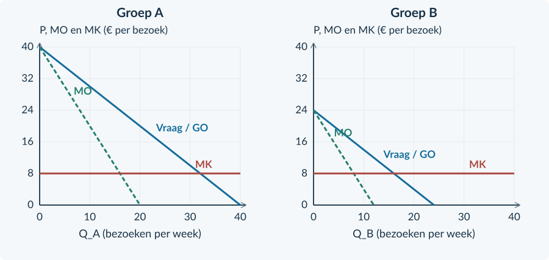<figcaption>Figuur 10. De twee groepen zijn gescheiden. Vul de benodigde hoeveelheden en prijzen aan.</figcaption></figure>

<!-- PAGE {"section": "4.2.2", "title": "Een conclusie kan van geval verschillen"} -->

## Denkertje / Bonusopgave

<b>Opgave 17 · Dezelfde naam, een ander gevolg</b>

Een onderzoeker beschrijft twee denkbeeldige prijsdiscriminatiegevallen. Er zijn geen externe effecten. In geval I verandert CS van € 500 naar € 430 en PS van € 300 naar € 350. In geval II verandert CS van € 100 naar € 160 en PS van € 200 naar € 260. De bedragen zijn per maand.

<b>a.</b> Vergelijk de verandering van TS in beide gevallen.

<b>b.</b> Geef een mogelijke verklaring voor het verschil, zonder te doen alsof de cijfers die verklaring bewijzen.

<b>c.</b> Welke extra broninformatie heb je nodig om te beoordelen wie erop vooruitgaat?

## Herhaling / Herhaling en interleaving

<b>Opgave 18 · Terug naar één uniforme prijs</b>

Een monopolist gebruikt P = 24 − 0,2Q en MK = € 4. Q is stuks per week; de capaciteit is 100.

<b>a.</b> Bereken Qm en Pm.

<b>b.</b> Bereken het consumentensurplus bij monopolie.

<!-- PAGE {"section": "4.2.3", "title": "Vier marktvormen herkennen"} -->

4.2.3 · MARKTVORMEN VERGELIJKEN

# Veel merken. Ook veel concurrentie?

In een winkel staan twintig merken frisdrank. Maar misschien zijn die merken van slechts enkele ondernemingen. Om concurrentie te beoordelen, moet je weten wie aanbiedt, wat kopers als alternatief zien en wie kan toetreden.

<b>Lesdoelen</b> Je kunt vier marktvormen onderscheiden met brongegevens. Je kunt de rol van productverschillen en toetreding uitleggen. Je kunt de bekende winstprocedure toepassen op een gegeven ondernemingsmodel.

### Gebruik kenmerken, niet alleen een bedrijfsnaam
Een **homogeen product** is in de ogen van kopers gelijkwaardig aan dat van andere aanbieders. Bij **heterogene producten** zien kopers verschillen, bijvoorbeeld in kwaliteit, smaak, plaats of service. Het aantal merken hoeft niet gelijk te zijn aan het aantal zelfstandige aanbieders.

| Marktvorm | Aanbieders | Product | Toetreding in het model |
|---|---|---|---|
| Volkomen concurrentie | Veel kleine | Homogeen | Vrij |
| Monopolistische concurrentie | Veel | Heterogeen | Relatief eenvoudig |
| Oligopolie | Enkele grote | Homogeen of heterogeen | Vaak belemmerd |
| Monopolie | Eén | Geen goed alternatief binnen de afgebakende markt | Sterk belemmerd |

Bij **monopolistische concurrentie** heeft elke onderneming enige ruimte voor een eigen prijs, maar er zijn veel alternatieven. Denk aan de verschillende lunchzaken in een beschreven winkelgebied. Dat is niet hetzelfde als een monopolie.

Bij **oligopolie** hangt een prijskeuze mede af van wat de andere grote ondernemingen doen. Er bestaat daarom niet één vraaglijn die voor elke oligopolist in elke situatie geldt.

<b>Marktvorm en uitkomst zijn verschillende vragen</b> Een marktvorm herkennen bewijst nog niet hoeveel winst een onderneming maakt. Daarvoor zijn prijs, vraag en kosten nodig. Een hoge prijs alleen bewijst evenmin een monopolie.

<!-- PAGE {"section": "4.2.3", "title": "Een bekende berekening in een nieuwe markt"} -->

## Uitgewerkt voorbeeld

In het centrum zijn veel onafhankelijke ijszaken. Ze verschillen in smaak en locatie. Nieuwe zaken kunnen relatief eenvoudig beginnen. Voor **IJsatelier** geldt op korte termijn P = 18 − 0,10q. MK = € 6 per portie en TCK = € 120 per dag. q is porties per dag, met een capaciteit van 100. Andere zaken veranderen in deze berekening hun gedrag niet.

**1 · Classificeer met bronbewijs.** Veel aanbieders, productverschillen en relatief eenvoudige toetreding passen bij **monopolistische concurrentie**. De zaak is geen monopolist op de ijsmarkt.

**2 · Gebruik de gegeven vraag voor deze zaak.** TO = 18q − 0,10q² en MO = 18 − 0,20q. De dalende lijn geldt voor één onderneming en voor de beschreven situatie, niet voor alle markten met veel aanbieders.

**3 · Kies q, lees P en bereken winst.** MO = MK geeft 18 − 0,20q = 6 → q = 60. Dat past binnen de capaciteit. Vóór 60 is MO groter dan MK en erna kleiner. P = 18 − 0,10 × 60 = € 12. TO = € 720 en TK = 120 + 6 × 60 = € 480. De winst is **€ 240 per dag**.
<figure>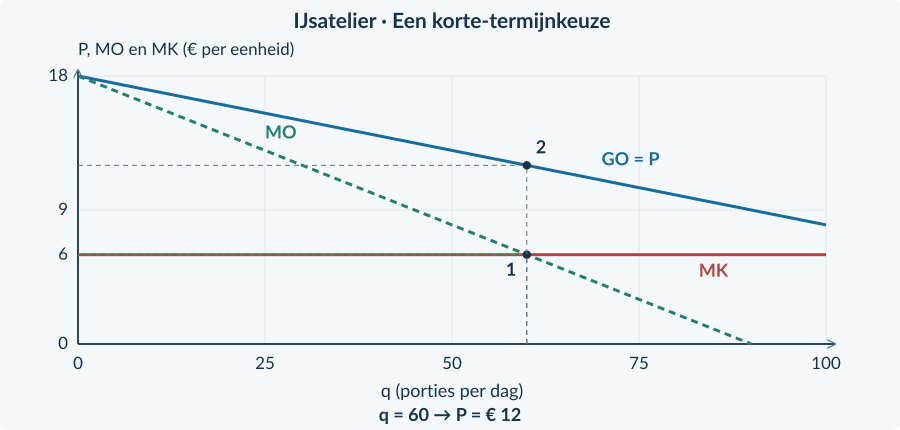<figcaption>Figuur 11. Hetzelfde rekenpad als bij monopolie, maar nu voor één zaak tussen veel aanbieders van verschillende producten.</figcaption></figure>

**4 · Begrens het resultaat.** Dit is een berekening voor deze vraag en deze korte termijn. De marktvorm alleen levert geen bedrag van € 240 op. Een reactie van concurrenten kan de gegeven vraag veranderen.

<b>Onthouden</b> Classificeer met aantal aanbieders, product en toetreding. Kies daarna het gegeven ondernemingsmodel. De rekenregel kan bekend zijn terwijl de economische situatie anders is. We bouwen hier geen apart strategisch model voor oligopolie.

<!-- PAGE {"section": "4.2.3", "title": "Van bron naar kenmerk"} -->

## Startopgaven

<b>Korte route:</b> Startopgaven → Zelfstandige oefening → Doeloefening. Extra hulp nodig? Maak eerst Begeleide inoefening.

<b>Opgave 19 · Prijsnemer of prijszetter?</b>

Onderneming A is een kleine prijsnemer en ontvangt € 9 per kg. Voor onderneming B geldt P = 18 − 0,20q. q is kg per week.

<b>a.</b> Geef voor A GO en MO.

<b>b.</b> Bepaal TO en MO voor B. Is MO bij positieve q gelijk aan P?

<b>Opgave 20 · Vier logo’s</b>

Vier populaire merken meel zijn allemaal eigendom van dezelfde producent. Over andere meelproducenten geeft de bron niets.

<b>a.</b> Bewijzen vier merken dat er vier zelfstandige aanbieders zijn?

<b>b.</b> Kun je nu zeker zeggen dat de hele meelmarkt een monopolie is?

## Begeleide inoefening

Heb je deze hulp niet nodig? Ga dan verder met Zelfstandige oefening.

<b>Opgave 21 · De kenmerken staan er al</b>

A: veel telers leveren een identieke kwaliteit graan; toetreding is vrij. B: veel onafhankelijke kapsalons bieden verschillende service; beginnen is relatief eenvoudig. C: drie grote fabrikanten domineren een markt met hoge startkosten. D: één leverancier bezit de enige toegestane toegang tot een voorziening.

<b>a.</b> Koppel A tot en met D aan de vier marktvormen.

<b>b.</b> Welke informatie onderscheidt B van een monopolie en C van volkomen concurrentie?

<b>Een bronantwoord opbouwen</b> Noem de marktvorm én twee passende gegevens. “Oligopolie, want drie ondernemingen beheersen de markt en starten kost veel geld” is sterker dan alleen “oligopolie”.

<!-- PAGE {"section": "4.2.3", "title": "Het gegeven model toepassen"} -->

<b>Opgave 22 · Een zaak met een eigen vraaglijn</b>

De figuur hoort bij één lunchzaak tussen veel vergelijkbare maar niet identieke lunchzaken. De bron houdt het gedrag van andere zaken gelijk. MK = € 10 per maaltijd; q is maaltijden per dag.

<b>a.</b> Lees de gemarkeerde hoeveelheid en prijs af. Welke twee lijnen gebruik je achtereenvolgens?

<b>b.</b> Waarom mag je dezelfde grafiek niet automatisch voor iedere oligopolist gebruiken?

<figure><figcaption>Figuur 12. De route is gegeven. Het aantal aanbieders verandert de algebra niet, maar wel de betekenis en voorwaarden van de vraaglijn.</figcaption></figure>

## Zelfstandige oefening

<b>Opgave 23 · Twee veranderingen in een winkelstraat</b>

Eerst zijn er veel onafhankelijke gelijksoortige winkels. Daarna kopen twee ketens bijna alle winkels op. Tegelijk gaan de winkels sterk verschillen in assortiment. Er worden geen prijs- of kostencijfers gegeven.

<b>a.</b> Bekijk eerst alleen de overnames. Welk kenmerk verandert?

<b>b.</b> Bekijk alleen de verschillende assortimenten. Welk kenmerk verandert?

<b>c.</b> Combineer de twee veranderingen. Welke marktvorm past nu het best bij de bron?

<b>d.</b> Beoordeel: “Door verschillende assortimenten is er nu zeker monopolistische concurrentie.”

<!-- PAGE {"section": "4.2.3", "title": "Zelf toepassen en doeloefening"} -->

<b>Opgave 24 · Een kleine bakker met een eigen recept</b>

Voor één bakker tussen veel zelfstandige bakkers geldt op korte termijn P = 20 − 0,10q en TK = 80 + 4q. q is producten per dag; de capaciteit is 100. Het gedrag van concurrenten blijft gelijk.

<b>a.</b> Bereken de winstmaximale hoeveelheid, prijs en winst.

<b>b.</b> Maakt de gebruikte rekenprocedure deze bakker tot monopolist?

## Doeloefening

<b>Bron A · Vier afgebakende markten</b> I: veel kleine telers bieden een identieke grondstof aan; kopers kennen de prijzen en toetreding is vrij. II: veel onafhankelijke lunchzaken verschillen in smaak en locatie; toetreding is relatief eenvoudig. III: drie grote aanbieders bedienen vrijwel de hele markt; een nieuw netwerk bouwen kost veel. IV: één aanbieder heeft als enige toegang tot een noodzakelijke voorziening; binnen deze markt zijn geen goede alternatieven.

<b>Bron B · Lunchzaak Puur</b> Puur hoort bij markt II. Voor één dag geldt P = 30 − 0,25q en TK = 144 + 6q. q is maaltijden per dag; P is euro per maaltijd. De productiecapaciteit is 80 maaltijden. De vaste kosten blijven ook bij q = 0 bestaan. Gedrag van concurrenten, kwaliteit en overige vraagfactoren blijven in deze berekening gelijk.

<b>Opgave 25 · Marktvorm is het begin</b>

Gebruik alleen de beschreven markten en de gegeven korte-termijnberekening.

<b>a.</b> (4p) Classificeer I tot en met IV. Geef voor elke markt het beslissende bronbewijs.

<b>b.</b> (2p) Bepaal voor Puur TO, MO en MK.

<b>c.</b> (3p) Bereken de winstmaximale haalbare q, de verkoopprijs en de winst.

<b>d.</b> (2p) Verklaar waarom Puur geen horizontale GO-lijn hoeft te hebben, ook al zijn er veel aanbieders.

<b>e.</b> (2p) Mag je de functie van Puur zonder extra broninformatie gebruiken voor markt III? Leg uit.

<b>Controle van je antwoord</b> Verbind de classificatie aan de bron. Houd de hoeveelheid van één zaak (q) apart van de hele markt (Q). Lees de verkoopprijs op de vraaglijn.

<!-- PAGE {"section": "4.2.3", "title": "Een markt is een afbakening"} -->

## Denkertje / Bonusopgave

<b>Opgave 26 · De enige winkel op het station</b>

Op één perron staat één broodjeswinkel. Buiten het station liggen meerdere lunchzaken. Reizigers met haast blijven vaak op het perron; reizigers met veel tijd lopen geregeld naar buiten.

<b>a.</b> Waarom kan de conclusie over marktmacht verschillen per klantgroep?

<b>b.</b> Welke gegevens zou je verzamelen voordat je de markt definitief afbakent?

<b>c.</b> Waarom is “één winkel in beeld” onvoldoende bewijs van een monopolie?

## Herhaling / Herhaling en interleaving

<b>Opgave 27 · De vaste kosten nogmaals controleren</b>

Twee klantgroepen leveren samen € 900 omzet. Er zijn in totaal 80 bezoeken. Variabele kosten zijn € 5 per bezoek en gezamenlijke constante kosten € 200.

<b>a.</b> Bereken PS en winst.

<b>b.</b> Leg uit welke fout ontstaat als iemand per groep € 200 vaste kosten aftrekt.

<b>Vooruitblik</b> Tot nu toe telden we voordelen binnen de markt. De volgende paragrafen voegen gevolgen toe voor mensen die niet aan de transactie deelnemen.

<!-- PAGE {"section": "4.2.4", "title": "Een derde partij krijgt de rekening"} -->

4.2.4 · NEGATIEVE EXTERNE EFFECTEN

# De koper betaalt. Wie draagt de schade?

Een bedrijf verkoopt leveringen. De klant betaalt de vervoerder, maar omwonenden ondervinden geluidshinder. Zij krijgen daarvoor geen vergoeding. De prijs kan dus lager zijn dan de kosten die de levering voor iedereen samen veroorzaakt.

<b>Lesdoelen</b> Je kunt een negatief extern effect en de getroffen derde partij benoemen. Je kunt private en maatschappelijke kosten onderscheiden. Je kunt een belastinguitkomst berekenen en de welvaartsvergelijking uitbreiden met externe kosten.

<b>Negatief extern effect</b> Nadeel voor een derde partij dat door productie of consumptie ontstaat en niet in de prijs of een vergoeding is verwerkt. De derde partij is geen koper of verkoper in de onderzochte transactie.

<figure>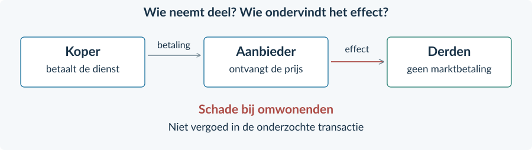<figcaption>Figuur 13. De betaling loopt tussen koper en verkoper. De hinder treft omwonenden buiten die transactie.</figcaption></figure>

### Privé kan de levering aantrekkelijk zijn
De vervoerder vergelijkt zijn ontvangsten met eigen kosten. De klant vergelijkt de prijs met eigen voordeel. Zonder heffing of vergoeding hoeven zij de hinder voor anderen niet mee te wegen.

Dat maakt niet elke levering verkeerd. Sommige leveringen leveren ook na aftrek van de schade voordeel op. De vraag is **hoeveel** activiteit gezamenlijk zinvol is, niet of alle activiteit moet verdwijnen.

<b>Verwar drie dingen niet</b> Een hoge rekening voor de koper is niet op zichzelf een extern effect. Een gewone productiekost van de verkoper is dat evenmin. Zoek een nadeel voor een buitenstaander dat niet wordt vergoed.

<!-- PAGE {"section": "4.2.4", "title": "Een nieuwe lijn, met een nieuwe betekenis"} -->

### Voeg de schade per extra eenheid toe
We gebruiken een concurrerende leveringsmarkt. De vraag is **P = 50 − 0,5Q** en het aanbod is **P = 10 + 0,5Q**. Q is leveringen per dag; P is euro per levering. Andere omstandigheden blijven gelijk. De aanbodlijn geeft hier de **marginale private kosten**: de eigen kosten van een extra levering.

Een onderzoek in deze oefencase waardeert de niet-vergoede schade op **€ 10 per levering**. Dat bedrag blijft bij elke hoeveelheid gelijk. De totale externe kosten zijn dus 10 × Q, niet alleen 10 maal de extra of de “te veel” uitgevoerde leveringen.

MK maatschappelijk = MK privé + externe kosten per extra eenheid Hier: MK maatschappelijk = 20 + 0,5Q

<figure>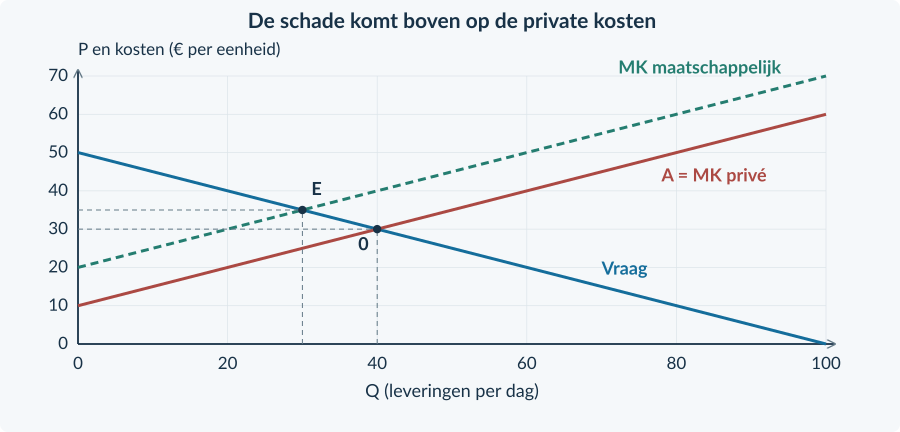<figcaption>Figuur 14. Begin met vraag en private kosten. De maatschappelijke-kostenlijn ligt bij dezelfde Q precies € 10 hoger.</figcaption></figure>

De maatschappelijke-kostenlijn laat **echte kosten voor alle betrokkenen samen** zien. Zij is niet automatisch de lijn waar bedrijven hun ongereguleerde aanbod op baseren. Zonder prikkel verandert hun eigen rekening nog niet.

Zonder ingrijpen: 50 − 0,5Q = 10 + 0,5Q → **Q₀ = 40, P₀ = € 30**. De maatschappelijke vergelijking is anders: 50 − 0,5Q = 20 + 0,5Q → **Qe = 30**.

<!-- PAGE {"section": "4.2.4", "title": "Waarom is veertig hier te veel?"} -->

### Beoordeel de volgende levering
Bij Q = 35 is de betalingsbereidheid € 32,50. De private marginale kosten zijn € 27,50. Koper en verkoper kunnen dus allebei voordeel zien. Maar inclusief € 10 hinder kost die levering de samenleving € 37,50. Het gezamenlijke nadeel is groter dan het gezamenlijke voordeel.

Tussen Q = 30 en Q = 40 worden leveringen uitgevoerd waarvoor de private vergelijking gunstig lijkt, maar de maatschappelijke vergelijking ongunstig is. Dat verschil veroorzaakt welvaartsverlies.
<figure>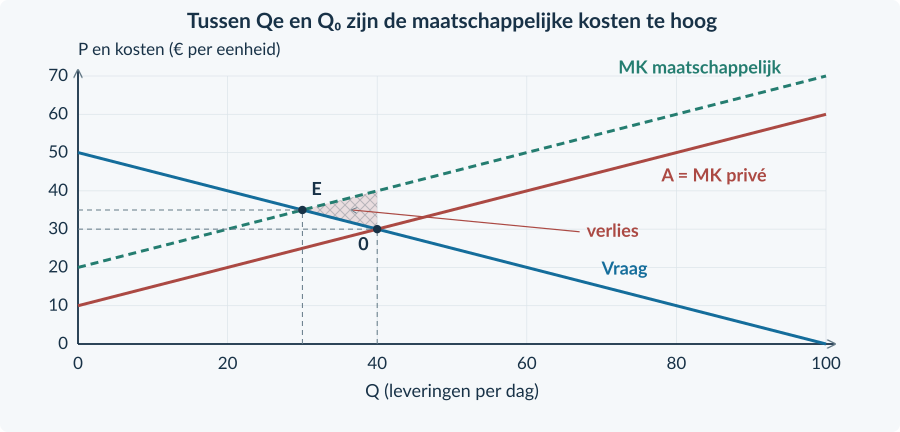<figcaption>Figuur 15. Het verloren surplus ligt tussen vraag en maatschappelijke kosten, van de efficiënte naar de ongereguleerde hoeveelheid.</figcaption></figure>

### Kijk breder dan CS + PS
Zonder belasting is CS = ½ × 40 × (50 − 30) = € 400. PS = ½ × 40 × (30 − 10) = € 400. Het private totale surplus is dus € 800.

De omwonenden dragen echter 40 × € 10 = € 400 schade. Het **maatschappelijk surplus** in dit model is € 800 − € 400 = **€ 400 per dag**.

Maatschappelijk surplus zonder heffing = CS + PS − totale externe kosten

<b>Een begrensde maatstaf</b> We tellen in deze oefencase eurobedragen zonder verdelingsgewichten. Andere externe effecten, vaste kosten en uitvoeringskosten ontbreken. Verander je die aannames, dan verandert mogelijk de beoordeling.

<!-- PAGE {"section": "4.2.4", "title": "De bekende heffing verandert de eigen rekening"} -->

### Gebruik opnieuw de twee prijzen uit Boek 3
Een heffing van **t = € 10 per levering**, afgedragen door de verkoper, maakt de schade voelbaar in de prijskeuze. Kopers betalen Pc. Producenten ontvangen na afdracht Pp. Voor het evenwicht geldt:

Pc = Pp + t 50 − 0,5Q = (10 + 0,5Q) + 10 Q = 30; Pc = € 35; Pp = € 25

<figure>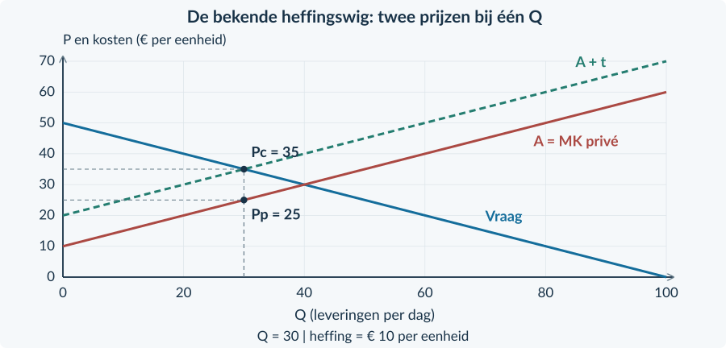<figcaption>Figuur 16. In deze case valt aanbod in kopersprijzen samen met maatschappelijke kosten, omdat t precies € 10 is. De producent blijft op de oorspronkelijke A aflezen.</figcaption></figure>

### Overheidsontvangsten blijven een overdracht
De overheid ontvangt 10 × 30 = € 300. Dat geld verdwijnt niet uit de samenleving. Als we CS en PS na belasting berekenen, is de afdracht daar al buiten gehouden. Daarom tellen we de ontvangst van de overheid weer mee.

Maatschappelijk surplus met heffing = CS + PS + belastingopbrengst − externe kosten

De € 300 belastingopbrengst is geen bewijs dat de omwonenden € 300 schadevergoeding krijgen. Ontvangst van geld en resterende hinder zijn verschillende posten. In deze case zijn de bedragen toevallig gelijk door de gekozen heffing per levering.

<b>Niet: elke belasting is precies goed</b> Bij de gegeven constante schade en zonder andere verstoringen bereikt t = € 10 hier de efficiënte hoeveelheid. Een onbekende schade, een te hoog tarief of uitvoeringskosten kunnen tot een andere conclusie leiden.

<!-- PAGE {"section": "4.2.4", "title": "Uitgewerkt: een kleinere productiemarkt"} -->

## Uitgewerkt voorbeeld

**Kleurwater** is een denkbeeldige concurrerende markt voor wasbeurten. Vraag: Pc = 40 − Q. Aanbod: Pp = Q. Q is wasbeurten per dag, van 0 tot 40; beide prijzen zijn euro per beurt. Elke beurt veroorzaakt € 8 niet-vergoede hinder voor omwonenden. De verkopers dragen een heffing van € 8 per beurt af. Er zijn geen uitvoeringskosten of andere externe effecten.

**1 · Benoem de ontbrekende partij.** Omwonenden ondervinden hinder zonder vergoeding. Hun kosten horen niet bij de oorspronkelijke private aanbodlijn.

**2 · Bereken de ongereguleerde uitkomst.** Zonder heffing: 40 − Q = Q → Q₀ = 20. De prijs is € 20 per beurt.

**3 · Gebruik de heffingswig.** Pc = Pp + 8 geeft 40 − Q = Q + 8 → Q₁ = 16. Kopers betalen € 24; verkopers ontvangen € 16. Controle: 24 − 16 = € 8.

**4 · Bereken ontvangsten en schade.** De heffingsopbrengst is 8 × 16 = **€ 128 per dag**. De schade daalt van 8 × 20 = € 160 naar 8 × 16 = **€ 128 per dag**. Er blijft dus schade bestaan.
<figure>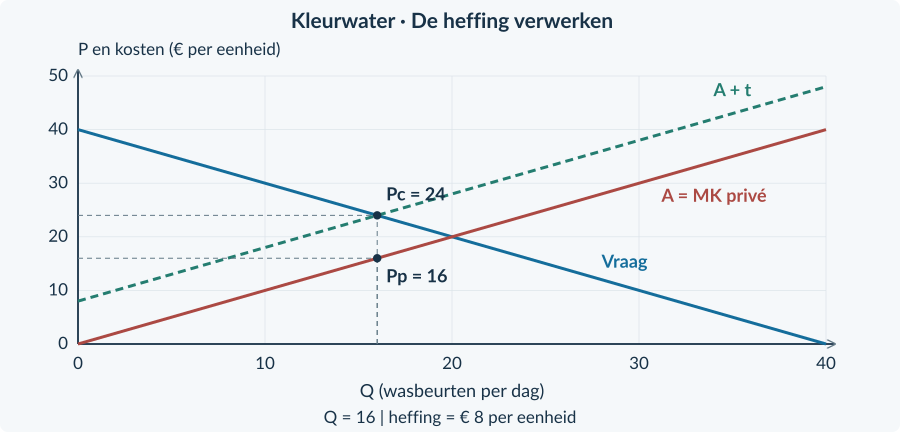<figcaption>Figuur 17. De heffing verlaagt het aantal wasbeurten van 20 naar 16. Het verschil tussen beide prijzen is de heffing, niet het verschil tussen beide hoeveelheden.</figcaption></figure>

<!-- PAGE {"section": "4.2.4", "title": "Uitgewerkt: de volledige welvaartscontrole"} -->

Uitgewerkt voorbeeld · vervolg

**5 · Bereken alle onderdelen met dezelfde grenzen.**

| Post (€ per dag) | Zonder heffing | Met heffing |
|---|---:|---:|
| CS | ½ × 20 × 20 = 200 | ½ × 16 × 16 = 128 |
| PS | ½ × 20 × 20 = 200 | ½ × 16 × 16 = 128 |
| Overheidsontvangsten | 0 | 8 × 16 = 128 |
| Externe kosten | 8 × 20 = 160 | 8 × 16 = 128 |
| Maatschappelijk surplus | 200 + 200 − 160 = **240** | 128 + 128 + 128 − 128 = **256** |

**6 · Vergelijk en verklaar.** CS + PS daalt van € 400 naar € 256. Toch stijgt het maatschappelijk surplus met **€ 16 per dag**. Ontvangsten verschuiven naar de overheid en de externe schade neemt af. Alle onderdelen samen bepalen de uitkomst.

De efficiënte hoeveelheid volgt uit betalingsbereidheid = maatschappelijke MK: 40 − Q = Q + 8 → Qe = 16. De ongereguleerde markt produceerde vier beurten te veel. De verliesdriehoek had basis 4 en hoogte € 8: ½ × 4 × 8 = **€ 16**.

<b>De verdwenen € 144 is niet de hele rekening</b> CS + PS daalt € 144. Daarvan komt € 128 bij de overheid terecht. Het resterende private verlies is € 16. Tegelijk verdwijnt € 32 echte schade. Netto: € 32 − € 16 = € 16 maatschappelijke verbetering.

### Waarom verschilt dit van Boek 3?
In Boek 3 begon de welvaartsvergelijking zonder externe effecten. Een heffing liet toen voordelige transacties verdwijnen. Hier veroorzaakten sommige transacties meer maatschappelijke kosten dan baten. Juist die activiteit verminderen kan de uitkomst verbeteren.

<b>Onthouden</b> Derde partij → eigen kosten en maatschappelijke kosten → oorspronkelijke markt → heffingswig → CS, PS, overheidsontvangst en resterende schade → maatschappelijke conclusie. Hetzelfde rekenmiddel krijgt een andere betekenis door de externe schade.

<!-- PAGE {"section": "4.2.4", "title": "De nieuwe kosten herkennen"} -->

## Startopgaven

<b>Korte route:</b> Startopgaven → Zelfstandige oefening → Doeloefening. Extra hulp nodig? Maak eerst Begeleide inoefening.

<b>Opgave 28 · Een heffing terughalen</b>

Vraag: Pc = 20 − Q. Aanbod: Pp = Q. De verkoper draagt € 4 per eenheid af. Q is stuks per dag.

<b>a.</b> Bereken Q, Pc en Pp na de heffing.

<b>b.</b> Bereken de heffingsopbrengst.

<b>Opgave 29 · Wie staat buiten de transactie?</b>

A: een klant betaalt veel voor een schaars kaartje. B: geluid van een bedrijf verstoort onbetaald de nachtrust van buren. C: een bakker betaalt zijn meelrekening.

<b>a.</b> Welke situatie beschrijft een negatief extern effect? Benoem de derde partij.

<b>b.</b> Waarom zijn A en C op zichzelf geen externe kosten?

## Begeleide inoefening

Heb je deze hulp niet nodig? Ga dan verder met Zelfstandige oefening.

<b>Opgave 30 · Lees beide kostenlijnen</b>

De figuur toont een markt met € 10 externe schade per levering. Gebruik Q = 20.

<b>a.</b> Lees de private en maatschappelijke marginale kosten af.

<b>b.</b> Bereken de totale externe schade bij 20 leveringen. Waarom is die niet € 10?

<b>c.</b> Markeer Q₀ = 40 en Qe = 30. Arceer het oorspronkelijke verlies tussen die hoeveelheden: gebruik de vraag en de maatschappelijke-kostenlijn.

<figure><figcaption>Figuur 18. De verticale afstand geeft schade per levering. Totale schade vereist ook het aantal leveringen.</figcaption></figure>

<!-- PAGE {"section": "4.2.4", "title": "Alle posten meenemen"} -->

<b>Opgave 31 · Een gedeeltelijke correctie</b>

Op een markt veroorzaakt elke eenheid € 8 externe schade. Met een heffing van € 4 worden 18 eenheden per dag verkocht. CS en PS zijn beide € 162 per dag. Zonder heffing was het maatschappelijk surplus € 240.

<b>a.</b> Vul eerst de ontbrekende posten in: overheidsontvangst, externe schade en maatschappelijk surplus.

<b>b.</b> Vergelijk met € 240. Bewijst verbetering dat alle externe schade verdwenen is?

| Post (€ per dag) | Met heffing |
|---|---:|
| CS + PS | 324 |
| Overheidsontvangst | … |
| Externe schade | … |
| Maatschappelijk surplus | … |

## Zelfstandige oefening

<b>Opgave 32 · Eigen kosten en schade veranderen tegelijk</b>

Bij dezelfde hoeveelheid productie stijgen de private kosten per extra eenheid met € 3 door duurder materiaal. Tegelijk daalt de externe schade per eenheid met € 5 door minder geluid. Er verandert verder niets.

<b>a.</b> Wat doet alleen het duurdere materiaal met maatschappelijke MK?

<b>b.</b> Wat doet alleen de afname van geluid met maatschappelijke MK?

<b>c.</b> Bepaal het gezamenlijke effect op de maatschappelijke kosten per extra eenheid.

<b>d.</b> Beoordeel: “Meer eigen kosten betekent hier meer maatschappelijke kosten per extra eenheid.”

<!-- PAGE {"section": "4.2.4", "title": "Zelfstandig: van rekenuitkomst naar verliesgebied"} -->

<b>Opgave 33 · Een nieuwe productiemarkt</b>

Voor behandelingen geldt Pc = 40 − Q en Pp = Q, in euro per behandeling; Q is behandelingen per dag. De schade aan omwonenden is € 8 per behandeling. Een producentenheffing bedraagt € 8. Er zijn geen andere maatschappelijke posten.

<b>a.</b> Bereken de oorspronkelijke en de belaste uitkomst, inclusief beide prijzen.

<b>b.</b> Bereken het maatschappelijk surplus vóór en na.

<b>c.</b> Bepaal de efficiënte hoeveelheid. Arceer het oorspronkelijke welvaartsverlies in de gegeven grafiek en bereken het.

<figure><figcaption>Figuur 19. Gebruik de bron en de gegeven lijnen. Voeg zelf de hoeveelheden, prijzen en het gevraagde gebied toe.</figcaption></figure>

<!-- PAGE {"section": "4.2.4", "title": "Doel: een belasting inclusief derden"} -->

## Doeloefening

<b>Bron · Reinigingsdiensten</b> Veel bedrijven bieden dezelfde reinigingsdienst aan. Vraag: Pc = 60 − Q; aanbod: Pp = Q. Q is diensten per dag van 0 tot 60; prijzen zijn euro per dienst. Elke dienst veroorzaakt € 20 niet-vergoede overlast voor omwonenden. De overheid voert een door producenten afgedragen heffing van € 20 per dienst in. Er zijn geen uitvoeringskosten, vaste kosten of andere externe effecten. Andere vraag- en aanbodfactoren veranderen niet.

<b>Opgave 34 · Wie telt mee?</b>

Gebruik de bron en de basisgrafiek.

<b>a.</b> (3p) Noem de derde partij. Bereken de oorspronkelijke hoeveelheid en prijs, en de totale externe schade.

<b>b.</b> (3p) Bereken met de heffingswig Q, Pc, Pp en de overheidsontvangst.

<b>c.</b> (4p) Bereken het maatschappelijk surplus vóór en na ingrijpen. Laat alle vier posten zien.

<b>d.</b> (2p) Markeer de efficiënte hoeveelheid en arceer het oorspronkelijke welvaartsverlies. Benoem basis en hoogte.

<b>e.</b> (2p) Beoordeel: “CS en PS dalen door de belasting, dus de maatschappij verliest.”

<figure><figcaption>Figuur 20. De private en maatschappelijke kosten zijn gegeven. Voeg de uitkomsten en het gevraagde verliesgebied toe.</figcaption></figure>

<!-- PAGE {"section": "4.2.4", "title": "Een bedrag is nog geen zekerheid"} -->

## Denkertje / Bonusopgave

<b>Opgave 35 · Hoe goed kennen we de schade?</b>

Een gemeente leest een schatting: externe schade ligt tussen € 6 en € 14 per levering. De gemiddelde waarde is € 10. Een adviseur zegt daarom dat een heffing van precies € 10 onder alle omstandigheden het beste is.

<b>a.</b> Welk verschil bestaat er tussen de eerdere oefencase en deze bron?

<b>b.</b> Noem twee gegevens die belangrijk zijn voor een beter advies.

<b>c.</b> Formuleer een voorzichtiger conclusie.

## Herhaling / Herhaling en interleaving

<b>Opgave 36 · Niet de prijs van de MO-lijn</b>

Voor een monopolist geldt P = 40 − Q en MK = 10. Q is stuks per week; de capaciteit is 30.

<b>a.</b> Bereken Qm en Pm.

<b>b.</b> Leg uit waarom € 10 niet de verkoopprijs is.

<!-- PAGE {"section": "4.2.5", "title": "Voordeel voor mensen buiten de markt"} -->

4.2.5 · POSITIEVE EXTERNE EFFECTEN

# Wie profiteert zonder te betalen?

Een inwoner laat een groene voortuin aanleggen. Hij geniet van de tuin en betaalt de hovenier. Ook buren genieten van het uitzicht, zonder daarvoor te betalen. Bij zijn eigen keuze telt hij hun voordeel niet volledig mee.

<b>Lesdoelen</b> Je kunt private voordelen onderscheiden van voordelen voor derden. Je kunt een subsidie-uitkomst en overheidsuitgaven berekenen. Je kunt beoordelen hoe externe baten de welvaartsconclusie veranderen.

<b>Positief extern effect</b> Voordeel voor een derde partij dat door productie of consumptie ontstaat en niet in een betaling of vergoeding is verwerkt. Het voordeel voor de koper zelf is geen extern voordeel.

<figure><figcaption>Figuur 21. De koper krijgt privévoordeel. Het extra voordeel voor buren staat daar los van en wordt niet door hun betaling vergoed.</figcaption></figure>

### Vrijwillige keuzes kunnen te weinig activiteit opleveren
De koper vergelijkt zijn eigen voordeel met de prijs. Als anderen ook voordeel hebben, kan een extra activiteit gezamenlijk aantrekkelijk zijn terwijl de koper haar niet uit zichzelf koopt.

Ook hier geldt niet: zoveel mogelijk is het beste. Een extra tuin, cursus of andere activiteit gebruikt schaarse middelen. We vergelijken daarom de **baten voor iedereen samen** met de extra productiekosten.

<b>Twee verschillende vormen van voordeel</b> De hovenier ontvangt een betaling voor zijn werk. Dat is onderdeel van de markttransactie, geen extern effect. Het onbetaalde uitzichtvoordeel voor buren is in deze oefencase wél extern.

<!-- PAGE {"section": "4.2.5", "title": "De vraaglijn is nog niet het hele voordeel"} -->

### Voeg voordeel voor anderen toe
Voor tuinaanleg geldt in een oefenperiode **P = 50 − 0,5Q** en aanbod **P = 10 + 0,5Q**. Q is aangelegde tuinen per maand; P is euro per gestandaardiseerde aanlegdienst. De getallen zijn een vereenvoudigd rekenmodel. Andere omstandigheden blijven gelijk.

De vraaglijn geeft de **private betalingsbereidheid per extra dienst**. De bron waardeert het bijkomende voordeel voor buren op € 10 per dienst. De maatschappelijke baten per extra dienst liggen dan € 10 boven de vraaglijn.

Baten voor iedereen per extra dienst = private betalingsbereidheid + extern voordeel Hier: 60 − 0,5Q

<figure>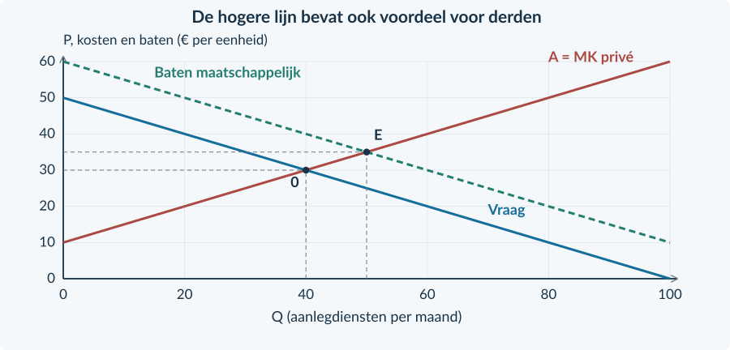<figcaption>Figuur 22. De hogere lijn toont maatschappelijke baten. Zij is niet ineens de prijs die de koper zelf wil betalen.</figcaption></figure>

Zonder subsidie komen vraag en aanbod samen bij Q₀ = 40 en P₀ = € 30. De maatschappelijke vergelijking is **60 − 0,5Q = 10 + 0,5Q**. De efficiënte hoeveelheid is dus **Qe = 50**.

Bij Q = 45 is het private voordeel € 27,50 en zijn de kosten € 32,50. Zonder steun koopt deze extra klant niet. Inclusief € 10 voordeel voor buren zijn de maatschappelijke baten € 37,50: meer dan de kosten.

<!-- PAGE {"section": "4.2.5", "title": "De subsidie en het externe voordeel"} -->

### Hetzelfde rekenmiddel als in Boek 3
De overheid betaalt de **aanbieder € 10 per uitgevoerde dienst**. Kopers betalen Pc. Aanbieders ontvangen Pp: de kopersbetaling plus de subsidie. De hovenier krijgt dus niet alleen het bedrag dat de klant betaalt.

Pp = Pc + s 10 + 0,5Q = (50 − 0,5Q) + 10 Q = 50; Pc = € 25; Pp = € 35

<figure><figcaption>Figuur 23. Vraag en aanbod in kopersprijzen bepalen Q en Pc. Lees bij dezelfde Q op het oorspronkelijke aanbod Pp af.</figcaption></figure>

De subsidie wordt betaald op **alle 50 uitgevoerde diensten**, niet alleen op de tien extra diensten. De overheid geeft dus 10 × 50 = € 500 per maand uit.

Het externe voordeel is volgens de bron eveneens 10 × 50 = € 500. Maar het zijn verschillende posten. De subsidie is een betaling. Het externe voordeel is het echte voordeel voor de buren. De overheid creëert niet automatisch € 1 voordeel door € 1 te betalen.

<b>Het bedrag moet bij de bron passen</b> Bij constante externe baten van € 10 bereikt een subsidie van € 10 hier de efficiënte hoeveelheid. Dat geldt onder deze vraag-, kosten- en uitvoeringsaannames. Een hoger bedrag is niet automatisch beter.

<!-- PAGE {"section": "4.2.5", "title": "De welvaartsrekening verandert"} -->

### Eerst de marktdeelnemers, dan de ontbrekende posten
CS wordt berekend met **de prijs die kopers betalen**. PS wordt berekend met **wat aanbieders ontvangen inclusief subsidie**. De subsidie zit daardoor al in het producentensurplus. Om de samenleving als geheel te bekijken, trekken we de overheidsuitgave af.

Maatschappelijk surplus met subsidie = CS + PS − subsidie-uitgaven + externe baten

Voor de tuinaanlegcase ontstaat deze vergelijking:

| Post (€ per maand) | Zonder subsidie | Met € 10 subsidie |
|---|---:|---:|
| CS | ½ × 40 × (50 − 30) = 400 | ½ × 50 × (50 − 25) = 625 |
| PS | ½ × 40 × (30 − 10) = 400 | ½ × 50 × (35 − 10) = 625 |
| Subsidie-uitgaven | 0 | 10 × 50 = 500 |
| Externe baten | 10 × 40 = 400 | 10 × 50 = 500 |
| Maatschappelijk surplus | **1.200** | **1.250** |

Er ontstaat **€ 50 meer maatschappelijk surplus**. Dat is niet de hele € 500 subsidie en ook niet de hele € 100 extra baten voor buren. De tien extra diensten hebben daarnaast private baten en productiekosten.

Het oorspronkelijke verlies is de driehoek tussen maatschappelijke baten en kosten van Q = 40 tot Q = 50: ½ × 10 × 10 = **€ 50**. De subsidie haalt hier die onderproductie weg.

<b>De vergelijking met Boek 3</b> Zonder extern voordeel zou dezelfde subsidie het maatschappelijk surplus verlagen van € 800 naar € 750. Met de gegeven baten voor derden stijgt het van € 1.200 naar € 1.250. De rekenmethode is niet tegengesproken: de welvaartsgrens is veranderd.

<b>Aannames</b> We veronderstellen concurrentie, geen extra maatschappelijke schade, geen uitvoeringskosten en geen extra kosten van financiering. Een echte beleidsbeoordeling heeft hiervoor meer gegevens nodig.

<!-- PAGE {"section": "4.2.5", "title": "Uitgewerkt: een cursus voor een buurt"} -->

## Uitgewerkt voorbeeld

Voor **Buurtvaardig** geldt vraag Pc = 50 − Q en aanbod Pp = 10 + Q. Q is cursusplaatsen per maand; prijzen zijn euro per plaats. Er zijn veel aanbieders. De bron waardeert het voordeel voor andere buurtbewoners op € 8 per deelnemer, naast het eigen voordeel van de deelnemer. De overheid betaalt aanbieders € 8 per gebruikte cursusplaats. Andere kosten of baten ontbreken.

**1 · Benoem het externe voordeel.** De deelnemer heeft zelf voordeel van de cursus. Dat staat in de vraag. Alleen het bijkomende, onbetaalde voordeel voor andere buurtbewoners telt als externe baat.

**2 · Bereken de oorspronkelijke markt.** 50 − Q = 10 + Q → Q₀ = 20. Zonder subsidie betalen en ontvangen partijen € 30 per plaats.

**3 · Gebruik de omgekeerde wig.** Pp = Pc + 8 geeft 10 + Q = 50 − Q + 8 → Q₁ = 24. Pc = € 26 en Pp = € 34. Controle: 34 − 26 = € 8.

**4 · Bereken overheid en derden.** De subsidie kost 8 × 24 = **€ 192 per maand**. De externe baten nemen toe van 8 × 20 = € 160 naar **€ 192 per maand**. Beide bedragen zijn berekend met alle deelnemers in die situatie.
<figure>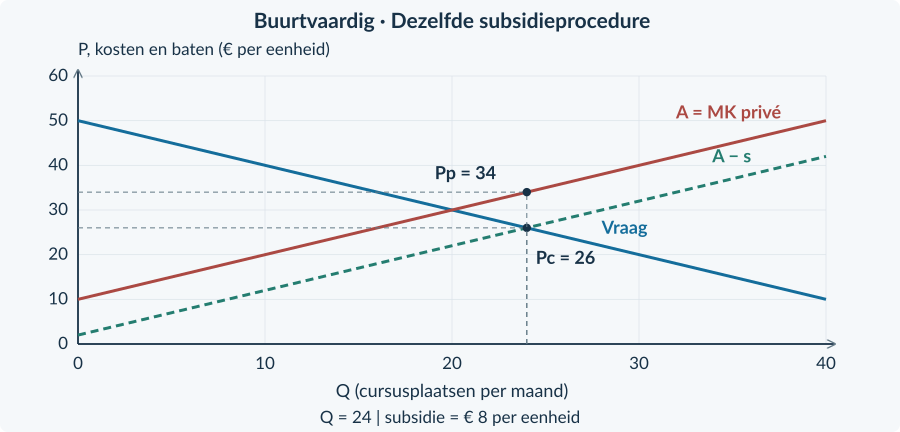<figcaption>Figuur 24. Dezelfde subsidieprocedure als voorheen. Nieuw is het afzonderlijke voordeel voor mensen buiten de markt.</figcaption></figure>

<!-- PAGE {"section": "4.2.5", "title": "Uitgewerkt: marktvoordeel en echte baten"} -->

Uitgewerkt voorbeeld · vervolg

**5 · Bouw de vergelijking op.**

| Post (€ per maand) | Zonder subsidie | Met subsidie |
|---|---:|---:|
| CS | ½ × 20 × (50 − 30) = 200 | ½ × 24 × (50 − 26) = 288 |
| PS | ½ × 20 × (30 − 10) = 200 | ½ × 24 × (34 − 10) = 288 |
| Subsidie-uitgaven | 0 | 192 |
| Externe baten | 160 | 192 |
| Maatschappelijk surplus | 200 + 200 + 160 = **560** | 288 + 288 − 192 + 192 = **576** |

**6 · Trek een begrensde conclusie.** Het maatschappelijk surplus stijgt met € 16. De extra vier plaatsen leveren € 32 extra externe baten op. Na aftrek van de extra private productiekosten en toevoeging van de private voordelen blijft € 16 netto verbetering over.

De maatschappelijke batenlijn is 58 − Q. Vergelijk met MK = 10 + Q: 58 − Q = 10 + Q → **Qe = 24**. Het oorspronkelijke verlies is ½ × (24 − 20) × 8 = **€ 16 per maand**.
<figure>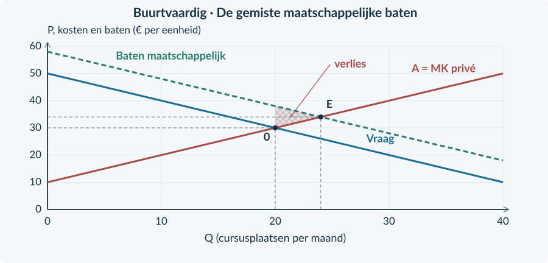<figcaption>Figuur 25. De driehoek markeert gemiste gezamenlijke voordelen van cursusplaatsen die zonder subsidie niet worden gebruikt.</figcaption></figure>

<b>Onthouden</b> Derdenvoordeel apart van kopersvoordeel → oorspronkelijke uitkomst → subsidiewig → alle gebruikte plaatsen → CS + PS − uitgaven + externe baten → conclusie onder de gegeven aannames. Een andere subsidiehoogte vereist opnieuw rekenen.

<!-- PAGE {"section": "4.2.5", "title": "Betalingen en baten herkennen"} -->

## Startopgaven

<b>Korte route:</b> Startopgaven → Zelfstandige oefening → Doeloefening. Extra hulp nodig? Maak eerst Begeleide inoefening.

<b>Opgave 37 · De subsidie uit Boek 3</b>

Vraag: Pc = 20 − Q. Aanbod: Pp = 4 + Q. Producenten ontvangen € 4 subsidie per verkochte eenheid. Q is stuks per dag; prijzen zijn euro per stuk.

<b>a.</b> Bereken Q, Pc en Pp na de subsidie.

<b>b.</b> Bereken de overheidsuitgaven.

<b>Opgave 38 · Wie ontvangt het voordeel?</b>

Een deelnemer betaalt voor een cursus. Zelf leert zij er iets van. De aanbieder ontvangt lesgeld. Volgens de bron helpen de aangeleerde vaardigheden daarnaast andere buurtbewoners, zonder dat zij betalen.

<b>a.</b> Welk voordeel is extern en welk voordeel hoort bij de koper?

<b>b.</b> Is het lesgeld van de aanbieder ook een externe baat?

## Begeleide inoefening

Heb je deze hulp niet nodig? Ga dan verder met Zelfstandige oefening.

<b>Opgave 39 · Twee batenlijnen lezen</b>

Gebruik de figuur. Het externe voordeel is € 10 per aanlegdienst.

<b>a.</b> Lees bij Q = 20 de private en maatschappelijke baten per extra dienst af.

<b>b.</b> Welke van die bedragen is de betalingsbereidheid van de koper zelf?

<b>c.</b> Markeer Q₀ = 40 en Qe = 50. Arceer de oorspronkelijke gemiste baten tussen die hoeveelheden: gebruik de maatschappelijke-batenlijn en MK.

<figure>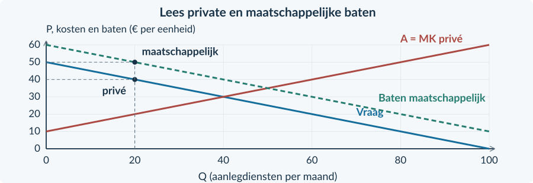<figcaption>Figuur 26. De verticale afstand is extern voordeel per eenheid; de hele hogere lijn is geen extra betaling.</figcaption></figure>

<!-- PAGE {"section": "4.2.5", "title": "De posten stap voor stap combineren"} -->

<b>Opgave 40 · Een lagere subsidie</b>

Een concurrerende cursusmarkt krijgt € 4 subsidie per deelnemer. Er doen 22 deelnemers per maand mee. CS en PS zijn beide € 242. De bron waardeert het externe voordeel op € 8 per deelnemer. Zonder subsidie was het maatschappelijk surplus € 560.

<b>a.</b> Bereken eerst subsidie-uitgaven en externe baten; vul daarna het maatschappelijk surplus in.

<b>b.</b> Vergelijk met de beginsituatie. Waarom mogen uitgaven en externe baten hier niet tegen elkaar worden weggestreept?

| Post (€ per maand) | Nieuwe situatie |
|---|---:|
| CS + PS | 484 |
| Subsidie-uitgaven | … |
| Externe baten | … |
| Maatschappelijk surplus | … |

## Zelfstandige oefening

<b>Opgave 41 · Twee voordelen veranderen tegelijk</b>

Bij dezelfde hoeveelheid activiteit neemt het private voordeel van één extra activiteit met € 2 toe. Tegelijk daalt het extra voordeel voor derden met € 5. De productiekosten veranderen niet.

<b>a.</b> Beschrijf de invloed van alleen de stijging van het private voordeel.

<b>b.</b> Beschrijf de invloed van alleen de daling van het externe voordeel.

<b>c.</b> Bereken het gezamenlijke effect op de maatschappelijke baten per extra activiteit.

<b>d.</b> Beoordeel: “Als kopers meer voordeel krijgen, stijgen de maatschappelijke baten altijd.”

<!-- PAGE {"section": "4.2.5", "title": "Zelfstandig: van subsidie naar gemiste baten"} -->

<b>Opgave 42 · Een cursus met hulp aan anderen</b>

Vraag Pc = 36 − Q; aanbod Pp = 4 + Q. Q is deelnemers per maand, prijzen zijn euro per deelnemer. Het externe voordeel is € 8 per deelnemer. Aanbieders ontvangen een subsidie van € 8; andere maatschappelijke posten ontbreken.

<b>a.</b> Bereken de oorspronkelijke en de gesubsidieerde uitkomst.

<b>b.</b> Bereken het maatschappelijk surplus vóór en na.

<b>c.</b> Bepaal de efficiënte hoeveelheid. Arceer de oorspronkelijk gemiste baten in de gegeven grafiek en bereken het verlies.

<figure><figcaption>Figuur 27. De private vraag, maatschappelijke baten en aanbodlijn zijn gegeven; de uitkomsten en het verliesgebied nog niet.</figcaption></figure>

<!-- PAGE {"section": "4.2.5", "title": "Doel: subsidie en maatschappelijk voordeel"} -->

## Doeloefening

<b>Bron · Buurtcursus</b> Een cursus geeft deelnemers eigen voordeel én helpt andere buurtbewoners. De bron waardeert uitsluitend dat bijkomende voordeel op € 10 per deelnemer. Vraag: Pc = 60 − 0,5Q; aanbod: Pp = 20 + 0,5Q. Q is deelnemers per maand van 0 tot 100; prijzen zijn euro per deelnemer. Er zijn veel aanbieders. De overheid betaalt aanbieders € 10 subsidie voor elke gebruikte cursusplaats. Andere omstandigheden blijven gelijk. Er zijn geen andere externe effecten, vaste kosten, financierings- of uitvoeringskosten.

<b>Opgave 43 · Eigen voordeel en voordeel voor anderen</b>

Gebruik de bron en de basisgrafiek.

<b>a.</b> (2p) Benoem het private en externe voordeel. Bereken de oorspronkelijke hoeveelheid en prijs.

<b>b.</b> (3p) Bereken na de subsidie Q, Pc, Pp en de overheidsuitgaven.

<b>c.</b> (4p) Bereken CS, PS en het maatschappelijk surplus vóór en na.

<b>d.</b> (2p) Bepaal de efficiënte hoeveelheid en arceer het oorspronkelijke welvaartsverlies.

<b>e.</b> (2p) Leg uit waarom dit anders uitpakt dan dezelfde subsidie zonder externe baten.

<figure><figcaption>Figuur 28. De private vraag, maatschappelijke baten en oorspronkelijke aanbodlijn zijn gegeven. De subsidie is geen nieuwe externe baat.</figcaption></figure>

<!-- PAGE {"section": "4.2.5", "title": "Meer steun is niet vanzelf beter"} -->

## Denkertje / Bonusopgave

<b>Opgave 44 · Een te ruime regeling?</b>

Een model voor tuinaanleg heeft € 10 extern voordeel per dienst. Er zijn geen andere maatschappelijke posten. De bron geeft drie volledig berekende scenario’s. Alle bedragen zijn euro per maand.

<b>a.</b> Bereken het maatschappelijk surplus in de drie rijen.

<b>b.</b> Waarom is “meer externe baten” niet voldoende om de grootste subsidie te kiezen?

<b>c.</b> Wat kun je wél en niet concluderen uit deze drie scenario’s?

| Subsidie per dienst | Q (per maand) | CS + PS | Subsidie-uitgaven | Externe baten |
|---|---:|---:|---:|---:|
| € 0 | 40 | 800 | 0 | 400 |
| € 10 | 50 | 1.250 | 500 | 500 |
| € 30 | 70 | 2.450 | 2.100 | 700 |

## Herhaling / Herhaling en interleaving

<b>Opgave 45 · Belasting is niet de schade</b>

Bij 20 verkochte eenheden per dag bedraagt een heffing € 6 per eenheid. De bron schat de resterende externe schade op € 10 per eenheid.

<b>a.</b> Bereken de belastingopbrengst en de totale externe schade.

<b>b.</b> Hoe neem je deze twee posten mee naast CS en PS?

<!-- PAGE {"section": "4.2.6", "title": "Van probleem naar passende maatregel"} -->

4.2.6 · OVERHEIDSINGRIJPEN BIJ MARKTFALEN

# Eerst het probleem. Dan het instrument.

De ene gemeente kiest een heffing, de andere een subsidie of een maximum. Een maatregel is niet goed omdat hij populair is of veel geld oplevert. Eerst moet duidelijk zijn welk probleem hij probeert te veranderen.

<b>Lesdoelen</b> Je kunt beleid koppelen aan een vastgesteld marktprobleem. Je kunt twee voorstellen vergelijken met één criterium en een bekende berekening. Je kunt efficiëntie, verdeling en uitvoeringsproblemen apart beoordelen.

<figure><figcaption>Figuur 29. Deze vier stappen helpen een beleidsadvies op te bouwen. De maatregel moet op de oorzaak aangrijpen.</figcaption></figure>

### Match het mechanisme
Bij **marktmacht** kan een aanbieder afzet beperken om meer winst te maken. Een voorstel kan toetreding mogelijk maken of een prijskeuze begrenzen. Of dat werkt, hangt af van de toegang, kosten en productievoorwaarden in de bron.

Bij **negatieve externe effecten** nemen kopers en verkopers schade aan anderen niet volledig mee. Een heffing kan die schade in hun afweging brengen. Een hoeveelheidseis kan de schadelijke activiteit direct begrenzen, mits die wordt nageleefd.

Bij **positieve externe effecten** kunnen te weinig voordelige activiteiten ontstaan. Een subsidie kan deelname aantrekkelijker maken. Het bedrag en de doelgroep moeten wel bij het beschreven externe voordeel passen.

<b>Niet alles tegelijk onderzoeken</b> Kies het model dat bij de bron past. Een hoge prijs door schaarse productiecapaciteit is niet automatisch misbruik van marktmacht. Een subsidie verandert een toetredingsbarrière niet vanzelf.

### Kies een criterium vóór je concludeert
“Maatschappelijk surplus verhogen”, “een bepaalde groep ontzien” en “binnen een budget blijven” zijn verschillende criteria. Een voorstel kan op het ene criterium beter en op het andere slechter scoren.

<!-- PAGE {"section": "4.2.6", "title": "Een volledig, maar begrensd advies"} -->

## Uitgewerkt voorbeeld

Een concurrerende activiteitenmarkt veroorzaakt € 8 schade per activiteit. Vraag: Pc = 40 − Q; aanbod: Pp = Q. Q is activiteiten per dag. **Plan A** is een door producenten afgedragen heffing van € 8. **Plan B** begrenst de hoeveelheid op 16. De bron veronderstelt bij B dat de kopers met de hoogste betalingsbereidheid en aanbieders met de laagste kosten handelen. Zij geeft het maatschappelijk surplus vóór uitvoering voor beide plannen: € 256 per dag.

A gebruikt € 8 per dag aan echte uitvoeringsmiddelen, B € 20. Beide maatregelen worden in deze case nageleefd. Het criterium is: **het grootste maatschappelijk surplus na uitvoeringskosten**.

**1 · Benoem het probleem.** Derden dragen schade die niet in de oorspronkelijke private afweging zit. Beide plannen beperken daarom schadelijke activiteit.

**2 · Voer de bekende berekening uit.** Bij A: 40 − Q = Q + 8 → Q = 16, Pc = € 24 en Pp = € 16. De overheid ontvangt 8 × 16 = € 128 per dag. Dat is een overdracht en niet zelf de maatschappelijke winst.

**3 · Pas het criterium toe.** A: 256 − 8 = **€ 248**. B: 256 − 20 = **€ 236**. A scoort € 12 hoger per dag.

**4 · Geef het advies én de beperking.** “Bij het genoemde criterium kies ik A: beide plannen leveren vooraf hetzelfde surplus op, maar A gebruikt minder uitvoeringsmiddelen. Dat zegt niet dat iedere groep bij A beter af is. De conclusie veronderstelt de gegeven naleving en uitvoeringskosten.”

<b>Waarom trek je uitvoeringskosten af?</b> Controle en uitvoering gebruiken mensen en middelen die anders elders inzetbaar zijn. De bron geeft hun maatschappelijke kosten. Trek die één keer af. De belastingopbrengst zelf is niet zo’n verbruik van middelen.

<b>Onthouden</b> Probleem → oorzaak → passend instrument → berekening → criterium → conclusie met beperking. Budget, welvaart en verdeling zijn niet hetzelfde. Gebruik geen effecten waarvoor de bron geen steun geeft.

<!-- PAGE {"section": "4.2.6", "title": "Argumenten ordenen"} -->

## Startopgaven

<b>Korte route:</b> Startopgaven → Zelfstandige oefening → Doeloefening. Extra hulp nodig? Maak eerst Begeleide inoefening.

<b>Opgave 46 · De juiste welvaartsrekening</b>

Na een heffing zijn CS = € 300, PS = € 200, overheidsontvangsten = € 100 en externe schade = € 150 per dag. De uitvoering gebruikt daarnaast € 20 aan middelen.

<b>a.</b> Bereken het maatschappelijk surplus na uitvoeringskosten.

<b>b.</b> Waarom is “de overheid ontvangt € 100, dus de welvaart stijgt € 100” geen geldige conclusie?

<b>Opgave 47 · Een doel of een middel?</b>

Een raadslid zegt: “We voeren een subsidie in, want dan hebben we ons doel bereikt.” De bron noemt nog geen probleem of meetbare doelstelling.

<b>a.</b> Waarom is deze uitspraak onvolledig?

<b>b.</b> Formuleer een bruikbare doelstelling voor een geval met positieve externe effecten.

## Begeleide inoefening

Heb je deze hulp niet nodig? Ga dan verder met Zelfstandige oefening.

<b>Opgave 48 · De stappen zijn nog zichtbaar</b>

Een plein heeft hinder van betaalde evenementen. Omwonenden krijgen geen vergoeding. Een heffing kan het aantal evenementen verminderen; een vast maximum kan dat ook. De bron zegt dat beide regels controle nodig hebben.

<b>a.</b> Vul de keten aan: probleem → oorzaak → twee mogelijke instrumenten.

<b>b.</b> Noem twee gegevens die nodig zijn om tussen die instrumenten te kiezen.

<b>Steun afbouwen</b> Bij de volgende opgaven staan niet alle stappen meer voor je uitgeschreven. Gebruik de bron om zelf oorzaak, berekening, criterium en beperking te verbinden.

<!-- PAGE {"section": "4.2.6", "title": "Zelf een vergelijking onderbouwen"} -->

<b>Opgave 49 · Hetzelfde resultaat vóór uitvoering</b>

Voor twee maatregelen tegen geluid geeft een studie per dag: maatschappelijk surplus vóór uitvoering A = € 420 en B = € 450. Echte uitvoeringskosten: A = € 10 en B = € 60. Alle relevante effecten zijn in deze bedragen meegenomen.

<b>a.</b> Bereken beide uitkomsten na uitvoering.

<b>b.</b> Welke maatregel kies je bij het criterium maximaal maatschappelijk surplus? Waarom kun je een hoger bedrag vóór uitvoering niet als eindantwoord nemen?

## Zelfstandige oefening

<b>Opgave 50 · Een prijsvoorstel voor een voorziening</b>

Een bron vergelijkt een monopolie met een uitvoerbaar prijsvoorstel. De oorspronkelijke uitkomst heeft CS = € 400 en PS = € 1.000 per maand. Het voorstel heeft CS = € 650 en PS = € 850. Er zijn geen externe effecten; de bron garandeert de berekende leveringen. Het voorstel vraagt € 40 per maand aan extra uitvoering. De overige kosten blijven gelijk.

<b>a.</b> Bereken de verandering van maatschappelijk surplus, inclusief uitvoering.

<b>b.</b> Geef een advies bij het criterium efficiëntie en noem één verliezende groep.

<b>Opgave 51 · Een lage prijs is geen schadeloosstelling</b>

Een bindende maximumprijs laat 50 activiteiten vragen en 20 aanbieden per dag. Zonder extra voorraad vinden 20 transacties plaats. Elke uitgevoerde activiteit veroorzaakt € 10 niet-vergoede schade aan buren. De bron bevat geen regeling om buren te betalen.

<b>a.</b> Bereken het tekort en de resterende totale externe schade.

<b>b.</b> Beoordeel: “De maximumprijs helpt kopers, dus het externe effect is opgelost.”

<!-- PAGE {"section": "4.2.6", "title": "Doel: heffing of begrenzing?"} -->

## Doeloefening

<b>Bron A · Geluid in een wijk</b> Een concurrerende dienstenmarkt heeft Pc = 50 − 0,5Q en Pp = 10 + 0,5Q. Q is diensten per dag; prijzen zijn euro per dienst. Elke dienst veroorzaakt € 10 externe schade. Plan H: producenten dragen € 10 per dienst af. Plan G: hoogstens 30 diensten per dag. Bij G krijgen de kopers met de hoogste betalingsbereidheid de diensten, geleverd door de aanbieders met de laagste kosten; toestemming wordt gratis toegewezen. Beide regels worden nageleefd.

<b>Bron B · Vergelijking per dag</b> De tabel geeft de berekende surplusposten vóór uitvoering. Controle en uitvoering gebruiken bij H € 20 per dag aan middelen en bij G € 40. Er zijn geen andere kosten of baten. De raad kiest voorlopig het plan met het grootste maatschappelijk surplus na uitvoering.

| Post (€ per dag) | Plan H | Plan G |
|---|---:|---:|
| CS | 225 | 225 |
| PS | 225 | 525 |
| Overheidsontvangsten | Bereken zelf | 0 |
| Externe schade | 300 | 300 |

<b>Opgave 52 · Twee plannen voor hetzelfde probleem</b>

Gebruik de bronnen. Het criterium staat in bron B.

<b>a.</b> (2p) Benoem het marktfalen en leg kort uit hoe elk plan erop aangrijpt.

<b>b.</b> (3p) Bereken voor H Q, Pc, Pp en de overheidsontvangsten.

<b>c.</b> (3p) Bereken voor beide plannen het maatschappelijk surplus na uitvoering.

<b>d.</b> (2p) Adviseer een plan volgens het genoemde criterium. Noem één aanname die voor dit advies belangrijk is.

<b>e.</b> (2p) Waarom kan een producent toch voorkeur hebben voor G? Betekent dat dat de raad verkeerd rekent?

<!-- PAGE {"section": "4.2.6", "title": "Een besluit blijft een afweging"} -->

## Denkertje / Bonusopgave

<b>Opgave 53 · De rangorde is niet zeker</b>

Een bureau schat de welvaartswinst van een maatregel vóór uitvoering op € 100 per dag. Uitvoeringskosten liggen naar verwachting tussen € 20 en € 140. Over de verdeling van de winst is nog niets bekend.

<b>a.</b> Geef de best en slechtst mogelijke netto-uitkomst binnen deze grenzen.

<b>b.</b> Waarom is een stellige aanbeveling “altijd invoeren” met deze bron te sterk?

<b>c.</b> Noem een gerichte vervolgstap die het besluit beter onderbouwt.

## Herhaling / Herhaling en interleaving

<b>Opgave 54 · Een heffing en een subsidie naast elkaar</b>

Situatie A: Pc = € 18, Pp = € 14 en Q = 50. Situatie B: Pc = € 12, Pp = € 17 en Q = 60. Q is transacties per week. Iedere transactie valt onder de maatregel.

<b>a.</b> Welke situatie heeft een heffingswig en welke een subsidiewig? Bereken het bedrag per transactie.

<b>b.</b> Bereken het overheidsbedrag en de richting van de betaling.

<!-- PAGE {"section": "4.2.7", "title": "Gemengde opgaven"} -->

4.2.7 · GEMENGDE OPGAVEN: MARKTVORMEN EN MARKTFALEN

# Welke rekening hoort bij deze markt?

De volgende gevallen gebruiken alleen eerder behandelde technieken. Je moet nu zelf bepalen welke rekening bij de bron past. Een hogere winst, meer deelnemers of een grote overheidsontvangst is nog geen eindconclusie.

<b>Lesdoelen</b> Je kunt uit bronnen het passende model kiezen. Je kunt marktgedrag verbinden met surplus en gevolgen voor derden. Je kunt een beleidsconclusie onderbouwen én begrenzen.

## Gemengde oefening

<b>Opgave 55 · Eerst de juiste vraag</b>

A: één aanbieder verkoopt minder om meer winst te maken; er zijn geen externe effecten. B: veel aanbieders veroorzaken per product niet-vergoede schade bij buren. C: twee herkenbare klantgroepen betalen verschillende prijzen voor dezelfde dienst.

<b>a.</b> Welke vergelijking heb je bij A nodig om welvaartsverlies te bepalen?

<b>b.</b> Welke post mag bij B niet ontbreken? Welke bekende techniek helpt als een heffing wordt ingevoerd?

<b>c.</b> Wat controleer je bij C voordat je afzonderlijke prijzen als haalbaar behandelt?

### Een bruikbaar antwoord laat de keuze zien
Schrijf bijvoorbeeld: **“Deze bron gaat over niet-vergoede schade aan buren. Daarom vergelijk ik niet alleen CS + PS, maar trek ik ook de totale externe kosten af.”**

Noem daarna de berekening en de conclusie. Het is niet nodig om alle formules uit het hoofdstuk op elke bron los te laten.

<b>Werk met dezelfde periode</b> Vergelijk dagbedragen met dagbedragen en maandbedragen met maandbedragen. De twee cases in de doeloefening zijn afzonderlijke markten; hun bedragen worden niet bij elkaar opgeteld.

<!-- PAGE {"section": "4.2.7", "title": "Cijfers en verdeling combineren"} -->

<b>Opgave 56 · Het centrum voor bezoekers</b>

Een aanbieder met marktmacht kan twee klantgroepen betrouwbaar scheiden. Dezelfde dienst kost voor iedere bezoeker € 2 aan variabele kosten. Gezamenlijke vaste kosten: € 60 per week. De tabel geeft twee uitvoerbare prijsplannen. Andere omstandigheden blijven gelijk en er zijn geen externe effecten.

<b>a.</b> Bereken bij ieder plan de totale omzet en winst.

<b>b.</b> Bereken met het gegeven CS voor beide plannen TS.

<b>c.</b> Beoordeel: “De totale afzet is gelijk en de winst stijgt, dus er kan geen nadeel zijn.”

<b>d.</b> Wat zou veranderen als de goedkope kaartjes zonder controle konden worden doorverkocht?

| Gegeven | Eén prijs | Groepsprijzen |
|---|---:|---:|
| Prijs A | € 10 | € 12 |
| Aantal A | 30 | 25 |
| Prijs B | € 10 | € 8 |
| Aantal B | 10 | 15 |
| Totaal CS (€ per week) | 200 | 170 |

<b>Geen nieuw rekenmodel</b> De prijs- en afzetkeuzes zijn in deze bron gegeven. Je vergelijkt hun gevolgen. Je hoeft geen ontbrekende vraagfunctie te reconstrueren of de gezamenlijke prijs opnieuw te optimaliseren.

### Onderbouw per groep
Een verandering van het totale consumentensurplus zegt nog niet dat elk individu hetzelfde ervaart. Begin je uitleg met de prijs- en afzetverandering van A en B afzonderlijk. Maak daarna pas de stap naar totalen.

<!-- PAGE {"section": "4.2.7", "title": "Een extern voordeel en uitvoeringskosten"} -->

<b>Opgave 57 · De gezamenlijke cursus</b>

Een concurrerende cursusmarkt heeft vraag Pc = 40 − Q en aanbod Pp = Q. Q is deelnemers per maand, met 0 ≤ Q ≤ 40; prijzen zijn euro per deelnemer. Andere buurtbewoners hebben € 8 bijkomend voordeel per deelnemer, zonder ervoor te betalen. Aanbieders krijgen € 8 subsidie per gebruikte plaats. De uitvoering verbruikt € 10 aan middelen per maand. Er zijn geen andere maatschappelijke posten.

<b>a.</b> Bereken de oorspronkelijke markt en de uitkomst met subsidie, inclusief beide prijzen.

<b>b.</b> Bereken de overheidsuitgaven en het totale externe voordeel na de subsidie.

<b>c.</b> CS en PS zijn zonder subsidie elk € 200 en met subsidie elk € 288. Bereken de maatschappelijke verandering, inclusief uitvoering.

<b>d.</b> Waarom kun je niet gewoon de stijging van CS + PS als welvaartswinst rapporteren?

<figure><figcaption>Figuur 30. Gebruik de al bekende private vraag, maatschappelijke baten en kosten om de hoeveelheden te controleren.</figcaption></figure>

<b>Van berekening naar oordeel</b> Benoem het criterium en vergelijk de volledige maatschappelijke rekening vóór en na. Geef vervolgens aan of je conclusie gevoelig kan zijn voor veranderende uitvoeringskosten of een overschat extern voordeel. Een begrotingsbedrag alleen is geen welvaartsoordeel.

<!-- PAGE {"section": "4.2.7", "title": "Bronnen bij de doeloefening"} -->

## Doeloefening

<b>Bron A · Studio Solo</b> Eén aanbieder verhuurt de hele afgebakende markt voor studiosessies. Vraag: P = 70 − Q. TK = 100 + 10Q + 0,5Q² en MK = 10 + Q. Q is sessies per week en P euro per sessie. Capaciteit: 50 sessies. Constante kosten blijven in deze week gelijk. Er zijn geen externe effecten. De efficiënte vergelijkingsuitkomst bij dezelfde vraag en kosten is Qe = 30, Pe = € 40 en TSe = € 900 per week.

<figure><figcaption>Figuur 31. Bron A: vraag, MO en MK voor dezelfde markt. De monopolie-uitkomst is nog niet gemarkeerd.</figcaption></figure>

<b>Bron B · Reiniging bij woningen</b> Veel aanbieders leveren dezelfde dienst. Vraag: Pc = 60 − Q; aanbod: Pp = Q. Q is diensten per dag; prijzen zijn euro per dienst. Iedere dienst veroorzaakt € 20 niet-vergoede schade aan omwonenden. Producenten gaan € 20 per dienst afdragen. Na de heffing zijn CS en PS elk € 200 per dag. Zonder ingrijpen is het maatschappelijk surplus € 300 per dag. Geen uitvoeringskosten of andere externe effecten.

<figure>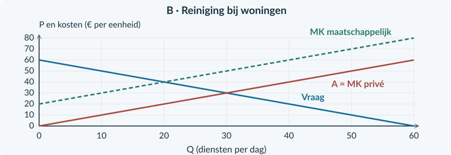<figcaption>Figuur 32. Bron B: private en maatschappelijke kosten. Het gaat hier om een andere markt en een andere periode dan in bron A.</figcaption></figure>

<!-- PAGE {"section": "4.2.7", "title": "Doel: zelf het juiste model kiezen"} -->

<b>Opgave 58 · Twee markten, twee oorzaken</b>

Gebruik de bronnen op de linkerpagina. Onderbouw berekeningen met eenheden en conclusies met brongegevens.

<b>a.</b> (3p) Bepaal voor Studio Solo de winstmaximale hoeveelheid en verkoopprijs. Bereken ook de winst.

<b>b.</b> (4p) Bereken CS, PS en TS bij Solo en vergelijk met het gegeven TSe. Arceer het welvaartsverlies in figuur A.

<b>c.</b> (3p) Bereken in bron B de belaste hoeveelheid, Pc, Pp en de heffingsopbrengst.

<b>d.</b> (2p) Bereken met bron B het maatschappelijk surplus na de heffing en de verandering ten opzichte van de beginsituatie.

<b>e.</b> (2p) Leg uit waarom minder verkopen bij Solo welvaartsverlies geeft, maar minder diensten in bron B juist verbetering kan geven.

<b>f.</b> (2p) Beoordeel: “Een heffing van € 20 is dus ook vanzelf de beste oplossing voor Studio Solo.”

<b>Controleer vóór je afsluit</b> Is PS onderscheiden van winst? Is de prijs op de juiste lijn afgelezen? Zijn schade en overheidsontvangst allebei meegenomen? Gaat je conclusie alleen over de markt waarvoor je hebt gerekend?

### Schrijf geen grotere conclusie dan je bewijs
Een berekende verbetering in bron B is geen bewijs dat elke omwonende schadeloos is gesteld. Het welvaartsverlies in A is geen bewijs dat de hoogste mogelijke afzet altijd gewenst is. Je antwoord moet bij vraag, kosten, derden en de periode uit de bron blijven.

<!-- PAGE {"section": "4.2.7", "title": "De belangrijkste denkfouten herstellen"} -->

## Extra gemengde oefening

<b>Opgave 59 · Drie overtuigend klinkende uitspraken</b>

Beoordeel elke uitspraak. Geef niet alleen “juist” of “onjuist”, maar herstel de redenering.

<b>a.</b> “Bij twee klantgroepen moet je voor elke groep opnieuw de totale huur aftrekken.”

<b>b.</b> “Een producent met een dalende vraaglijn heeft altijd een monopolie.”

<b>c.</b> “Bij een subsidie is het externe voordeel gelijk aan wat de overheid uitgeeft.”

## Herhaling / Herhaling en interleaving

<b>Opgave 60 · Dezelfde techniek in twee vormen</b>

A: voor één onderneming geldt P = 30 − 0,5q en MK = € 10, met capaciteit 30. B: op een markt betalen kopers € 18, ontvangen producenten € 14 en worden 50 stuks verkocht. Alle bedragen bij B gelden per week.

<b>a.</b> Bereken voor A de winstmaximale q en verkoopprijs.

<b>b.</b> Bereken voor B de heffing per stuk en de overheidsontvangst.

<b>c.</b> Welke extra informatie is nodig om in B een maatschappelijke welvaartsverandering vast te stellen?

<b>Je hoofdstuk in één zin</b> Kies het juiste model, tel alle relevante partijen mee en onderscheid een betaling van een echte verandering in kosten of baten.

<!-- PAGE {"section": "back", "title": "Hoofdstukoverzicht"} -->

# Kies eerst de rekening

| Vraag | Rekenroute of beoordelingsstap |
|---|---|
| Welke Q kiest een monopolist? | MO = MK → controle verloop en capaciteit → P uit vraag → winst = TO − TK. |
| Welke Q is efficiënt zonder externe effecten? | Betalingsbereidheid = MK, bij dezelfde vraag en kosten. |
| Welk marktvoordeel verdwijnt? | Vergelijk TS = CS + PS. Een overdracht tussen koper en verkoper is niet zelf het verlies. |
| Twee groepen, één onderneming? | Per groep de gegeven keuze uitvoeren; omzet optellen; gezamenlijke kosten eenmaal aftrekken. |
| Welke marktvorm past? | Aantal zelfstandige aanbieders, productverschillen, toetreding en marktgrens. |
| Zijn er kosten of baten voor derden? | Benoem eerst de derde partij en het niet-vergoede effect. |
| Welke maatregel kiezen? | Oorzaak → mechanisme → uitkomst → criterium → beperking uit de bron. |

### De vier welvaartsrekeningen

Geen extern effect of overheid: TS = CS + PS Heffing en schade: CS + PS + opbrengst − externe kosten Subsidie en derdenvoordeel: CS + PS − uitgaven + externe baten Gegeven echte uitvoeringskosten: trek die daarna eenmaal af

Deze regels gelden voor de beschreven posten en grenzen. Bij een andere bron moet je eerst vaststellen welke echte kosten, baten en overdrachten aanwezig zijn. Gelijke onvermijdelijke constante kosten veranderen de vergelijking niet; winst blijft wel **PS − TCK**.

### Geometrie en budget blijven dezelfde technieken

Driehoek = ½ × basis × hoogte Rechthoek = breedte × hoogte Heffingsopbrengst = t × verkochte hoeveelheid Subsidie-uitgaven = s × gesubsidieerde hoeveelheid

<b>De laatste controle</b> Zijn alle bedragen uit dezelfde periode? Gebruik je bij een heffing Pc − Pp en bij een subsidie Pp − Pc? Is schade per stuk vermenigvuldigd met alle betrokken stuks? Zegt je conclusie iets over totale welvaart of over één groep?

<!-- PAGE {"section": "back", "title": "Begrippenlijst"} -->

# Begrippenlijst

<b>Consumentensurplus (CS)</b> Het gezamenlijke verschil tussen betalingsbereidheid en betaalde prijs op verkochte eenheden.

<b>Efficiënte hoeveelheid</b> Hoeveelheid waarbij het relevante maatschappelijke surplus maximaal is onder de gegeven aannames.

<b>Externe baten</b> Niet-vergoede voordelen voor derden door productie of consumptie.

<b>Externe kosten</b> Niet-vergoede nadelen voor derden door productie of consumptie.

<b>Heffingswig</b> Verschil Pc − Pp door een heffing per transactie.

<b>Heterogeen product</b> Kopers zien relevante verschillen tussen de producten van aanbieders.

<b>Homogeen product</b> Kopers zien de producten van aanbieders als gelijkwaardig.

<b>Maatschappelijk surplus</b> De hier gebruikte euro-maatstaf die ook de opgegeven gevolgen voor derden en overheid meeneemt.

<b>Marginale kosten (MK)</b> Kosten van een extra eenheid; private en maatschappelijke kosten kunnen verschillen.

<b>Marginale opbrengst (MO)</b> Extra opbrengst van meer afzet voor de onderneming. Dit is niet de maatschappelijke batenlijn.

<b>Marktfalen</b> De marktuitkomst benut onder de gegeven omstandigheden niet het maximaal haalbare maatschappelijke surplus.

<b>Marktmacht</b> Mogelijkheid van een aanbieder om de verkoopprijs te beïnvloeden.

<b>Monopolie</b> Eén aanbieder op de afgebakende markt, met belemmerde toetreding.

<b>Monopolistische concurrentie</b> Veel aanbieders met verschillende producten en relatief eenvoudige toetreding.

<b>Oligopolie</b> Enkele grote aanbieders; keuzes kunnen afhangen van reacties van concurrenten.

<b>Overdracht</b> Een betaling of voordeel verschuift tussen partijen binnen de onderzochte groep.

<b>Prijsdiscriminatie</b> Verschillende prijzen voor hetzelfde product die niet door kostenverschillen worden verklaard.

<b>Producentensurplus (PS)</b> Opbrengst boven variabele kosten. Voor winst moeten constante kosten er nog af.

<b>Subsidiewig</b> Verschil Pp − Pc door een subsidie per gesubsidieerde transactie.

<b>Totale surplus (TS)</b> CS + PS; bij externe effecten of overheid is dit alleen niet altijd de volledige maatschappelijke rekening.

<b>Uitvoeringskosten</b> Echte middelen die nodig zijn voor het uitvoeren en controleren van beleid.

<b>Volkomen concurrentie</b> Veel kleine aanbieders, een homogeen product en vrije toetreding; ondernemingen nemen de prijs als gegeven.

<b>Welvaartsverlies</b> Verschil tussen het haalbare en feitelijke maatschappelijke surplus onder dezelfde vergelijkingsvoorwaarden.

In hoofdstuk 4.3 krijgen bekende marktbegrippen andere namen en eenheden: prijs wordt loon en hoeveelheid wordt arbeid. De arbeidsmarkt is geen voorkennis voor dit hoofdstuk.
