<!-- PAGE {"section": "front", "title": "Arbeidsmarkt"} -->

BOEK 4 · HOOFDSTUK 3 · ECONOMIE 4 VWO

Arbeidsmarkt

Als de prijs loon heet

Een werkgever zoekt personeel. Een werknemer zoekt een baan. Je herkent vraag en aanbod, maar de rollen zijn anders dan bij het kopen van een product. Dit hoofdstuk maakt die vertaling stap voor stap.

<a href="#s431"><b>4.3.1 Arbeidsvraag en arbeidsproductiviteit 2</b>Arbeid, productie en loonkosten per product.</a>
<a href="#s432"><b>4.3.2 Arbeidsaanbod, participatie en evenwicht 12</b>Wie doet mee? Welk loon brengt vraag en aanbod bij elkaar?</a>
<a href="#s433"><b>4.3.3 Werkloosheid en veranderingen 20</b>Tellen, verklaren en een nieuw evenwicht onderzoeken.</a>
<a href="#s434"><b>4.3.4 Minimumloon 29</b>Loonvloer, werkgelegenheid en totale loonsom.</a>
<a href="#s435"><b>4.3.5 Vakbonden, cao en arbeidsmarktbeleid 37</b>Een voorstel beoordelen met berekeningen en argumenten.</a>
<a href="#s436"><b>4.3.6 Gemengde opgaven: arbeidsmarkt 44</b>Zelf de passende gegevens en methode kiezen.</a>
<a href="#overzicht"><b>Hoofdstukoverzicht en begrippen 49</b>Formules, eenheden en betekenis bij elkaar.</a>

<b>Na dit hoofdstuk</b> Je kunt productie naar arbeidsinzet vertalen, deelname en werkloosheid berekenen, loon en werkgelegenheid in een model bepalen en arbeidsmarktbeleid beoordelen met een passende berekening en een onderbouwde conclusie.

Alle bedrijven, regio’s, voorstellen en cijfers in de opgaven zijn geconstrueerde lesvoorbeelden. Lonen zijn illustratief, geen actuele wettelijke tarieven. Je werkt in je schrift; gebruik de gegeven grafieken waar de opgave dat vraagt. Antwoorden staan in een apart antwoordboek.

<!-- PAGE {"section": "4.3.1", "title": "Wie vraagt arbeid?"} -->

4.3.1 · ARBEIDSVRAAG EN ARBEIDSPRODUCTIVITEIT

# Wie koopt jouw werktijd?

Een fietsenmaker zoekt een medewerker. Jij zoekt een bijbaan. Wie is hier de vrager? In het dagelijks taalgebruik biedt het bedrijf een baan aan. Economisch koopt het bedrijf jouw arbeid.

<b>Lesdoelen</b> Je kunt werkgevers en werknemers op de arbeidsmarkt onderscheiden. Je kunt arbeidsproductiviteit, benodigde arbeidsuren en loonkosten per product berekenen. Je kunt een loonverandering onderscheiden van een verandering in de arbeidsvraag.

<b>Definitie · arbeidsvraag</b> De hoeveelheid arbeid die werkgevers bij een bepaald loon willen inzetten. Werkgevers vragen arbeid omdat zij daarmee goederen of diensten kunnen produceren.

<figure>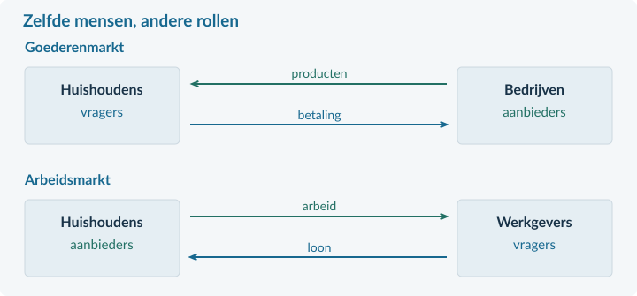<figcaption>Figuur 1. Op de goederenmarkt kopen huishoudens producten. Op de arbeidsmarkt leveren zij arbeid en ontvangen zij loon.</figcaption></figure>

### Dezelfde marktlogica, andere rollen
Een werknemer **biedt arbeid aan**. Een werkgever **vraagt arbeid**. Een vacature is een nog niet vervulde arbeidsplaats: de werkgever zoekt iemand.

De prijs van arbeid heet het **loon**. We gebruiken de letter **w** voor het loon per uur. De hoeveelheid arbeid noemen we **L**. Daarbij vermelden we steeds of het om uren of personen gaat.

Een stijging van de vraag naar fietsen kan dus leiden tot meer vraag naar monteurs. De vraag naar arbeid hangt mede af van wat bedrijven kunnen verkopen.

<!-- PAGE {"section": "4.3.1", "title": "Arbeid meten"} -->

### Zes mensen zijn niet hetzelfde als zes voltijdbanen
Een bedrijf heeft zes medewerkers. Ieder werkt 20 uur per week. Samen leveren zij 6 × 20 = **120 arbeidsuren per week**. Bij een voltijdweek van 40 uur is dat 120 / 40 = **3 fte**.

<figure>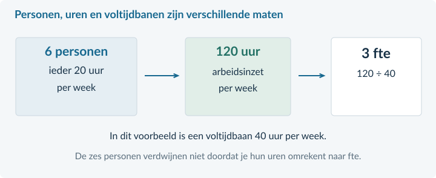<figcaption>Figuur 2. Fte is een rekeneenheid voor de omvang van werk, niet het aantal verschillende mensen.</figcaption></figure>

<b>Definitie · fte</b> Een fulltime-equivalent is de arbeidsduur van één voltijdbaan. Welke arbeidsduur daarbij hoort, staat in de opgave. Twee halve banen tellen samen als één fte.

### Productiviteit: hoeveel productie levert de arbeid op?
Een werkplaats maakt 2.400 onderdelen in 600 arbeidsuren. Gemiddeld zijn dat **4 onderdelen per arbeidsuur**. Dit noemen we arbeidsproductiviteit.

arbeidsproductiviteit = productie / arbeidsinzet benodigde arbeidsinzet = productie / arbeidsproductiviteit

In dit hoofdstuk gebruiken we meestal arbeidsuren. Deel dus producten per week door arbeidsuren per week. De uitkomst is producten **per arbeidsuur**.

Productiviteit per medewerker mag ook, maar alleen met een duidelijke periode en arbeidsduur. Twee bedrijven vergelijken op productie per persoon kan misleiden als hun medewerkers niet evenveel uren werken.

<b>Eerst de eenheid</b> Schrijf vóór het rekenen op wat je moet vinden: personen, arbeidsuren, fte of producten per arbeidsuur. Wissel tijdens een berekening niet ongemerkt van eenheid.

<!-- PAGE {"section": "4.3.1", "title": "Kosten per product"} -->

### Een duurder arbeidsuur kan toch een goedkoper product opleveren
De werkplaats maakt 4 onderdelen per arbeidsuur. Een arbeidsuur kost de werkgever € 24. De loonkosten per onderdeel zijn dan € 24 / 4 = **€ 6**.

loonkosten per product = totale loonkosten / productie loonkosten per product = uurkosten / productie per uur

Uurkosten zijn hier de **volledige loonkosten van de werkgever per arbeidsuur**. Ze kunnen meer omvatten dan het brutoloon. Gebruik de uurkosten die de bron geeft. Voeg niet zelf onbekende kosten toe.

Stijgt de productiviteit naar 5 onderdelen per uur, bij dezelfde uurkosten? Dan dalen de loonkosten naar € 24 / 5 = **€ 4,80 per onderdeel**. De werknemer hoeft daarvoor niet minder loon te ontvangen.

### Meer productie per uur: hoeveel uren zijn nog nodig?
<figure>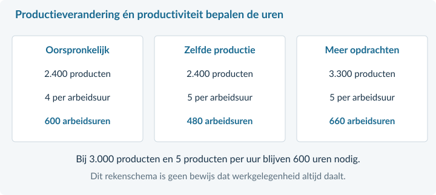<figcaption>Figuur 3. Vergelijk zowel de productie als de productiviteit. Eén van beide veranderingen bekijken is niet genoeg.</figcaption></figure>

Bij dezelfde productie zijn minder uren nodig. Bij voldoende extra opdrachten kan de totale arbeidsinzet juist toenemen. Het rekenschema houdt de gevraagde productie per situatie vast; het voorspelt niet automatisch alle veranderingen in een economie.

<b>Arbeidskosten zijn niet alle kosten</b> Een lagere loonkost per product bewijst nog niet dat de totale kostprijs daalt. Machines, energie en grondstoffen kunnen ook veranderen.

<!-- PAGE {"section": "4.3.1", "title": "Bewegen of verschuiven?"} -->

### Het loon zelf verandert
Een arbeidsvraaglijn toont hoeveel arbeid werkgevers bij verschillende lonen willen inzetten, **terwijl andere omstandigheden gelijk blijven**. In ons eenvoudige model daalt de gevraagde hoeveelheid arbeid als het uurloon stijgt. Arbeid wordt duurder ten opzichte van wat zij oplevert.

<figure>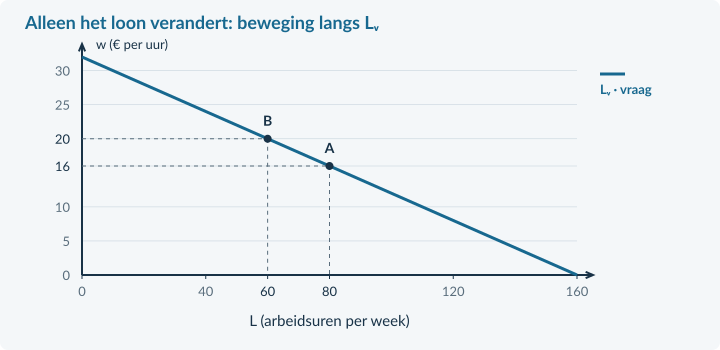<figcaption>Figuur 4. Van A naar B: het loon stijgt van € 16 naar € 20. Langs dezelfde vraaglijn daalt de hoeveelheid van 80 naar 60 arbeidsuren per week.</figcaption></figure>

### Een andere omstandigheid verandert
Meer exportorders kunnen de arbeidsvraag vergroten: bij hetzelfde loon willen werkgevers dan meer mensen of uren inzetten. De vraaglijn verschuift naar rechts. Minder vraag naar het eindproduct kan de lijn naar links verschuiven.

Ook techniek verandert de behoefte aan arbeid. Een machine kan bepaalde taken vervangen, maar nieuwe taken en extra productie mogelijk maken. Zonder verdere gegevens ligt de totale verandering niet vast.

<b>Zo houd je de twee uit elkaar</b> Alleen het loon verandert → <b>beweging langs</b> een arbeidsvraaglijn. Een andere vraagbepalende factor verandert → <b>verschuiving van</b> de arbeidsvraaglijn.

<!-- PAGE {"section": "4.3.1", "title": "Uitgewerkt voorbeeld"} -->

## Uitgewerkt voorbeeld

<b>Verpakkingen voor export</b> Een bedrijf maakt eerst 1.200 dozen per week in 300 arbeidsuren. De volledige uurkosten zijn € 24. Een nieuw werkproces levert 5 dozen per uur op. Het bedrijf ontvangt orders voor 1.800 dozen per week; de uurkosten worden € 25. Alle genoemde veranderingen horen bij dit plan.

### 1 · Bereken de oorspronkelijke productiviteit
Arbeidsproductiviteit = productie / arbeidsuren = 1.200 / 300 = **4 dozen per arbeidsuur**.

### 2 · Bereken de nieuwe benodigde arbeidsinzet
Arbeidsuren = productie / arbeidsproductiviteit = 1.800 / 5 = **360 uur per week**. Dat is 60 uur meer dan eerst, ofwel 60 / 300 × 100% = **20% meer**.

### 3 · Bereken de loonkosten per doos
Oud: € 24 / 4 = **€ 6 per doos**. Nieuw: € 25 / 5 = **€ 5 per doos**.

De uurkosten stijgen, maar de productie per uur stijgt sterker. Daardoor dalen de loonkosten per doos. Tegelijk stijgt de totale arbeidsinzet, omdat het bedrijf veel meer dozen gaat maken.

### 4 · Leg de arbeidsvraag uit
Kijk nu naar twee **afzonderlijke** veranderingen. Alleen een hoger loon, bij verder gelijke omstandigheden, geeft een beweging langs de vraaglijn naar minder arbeid. Alleen meer orders, bij gelijk loon en dezelfde techniek, verschuift de vraaglijn naar rechts.

In het totale rekenplan zijn zowel productie als productiviteit veranderd. Uit alleen de productiviteitsstijging mag je dus niet concluderen dat het bedrijf minder uren nodig heeft.

<b>Samenvatting §4.3.1</b> Werkgevers vragen arbeid; huishoudens bieden arbeid aan. Bereken productiviteit en arbeidsinzet met dezelfde eenheden. Deel uurkosten door productie per uur voor loonkosten per product. Benoem bij een vraagverandering de oorzaak. In §4.3.2 voegen we arbeidsaanbod en evenwicht toe.

<!-- PAGE {"section": "4.3.1", "title": "Start en herkennen"} -->

## Startopgaven

<b>Korte route:</b> Startopgaven → Zelfstandige oefening → Doeloefening. Extra hulp nodig? Maak eerst Begeleide inoefening.

<b>Opgave 1 · Een bekende verhouding</b>

Een drukker produceert 900 posters met € 2.700 totale kosten.

<b>a.</b> Bereken de gemiddelde kosten per poster.

<b>b.</b> De productie stijgt van 900 naar 1.080 posters. Bereken de procentuele stijging.

<b>Opgave 2 · Wie koopt wat?</b>

Een restaurant neemt een kok aan.

<b>a.</b> Wie is de vrager en wie de aanbieder op deze arbeidsmarkt? Licht beide rollen toe.

## Begeleide inoefening

Heb je deze hulp niet nodig? Ga dan verder met Zelfstandige oefening.

<figure>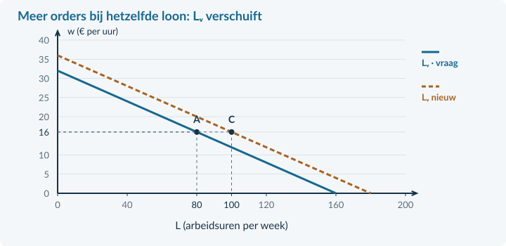<figcaption>Figuur 5. Lees eerst de volledig gemarkeerde verandering: bij € 16 per uur gaat de gevraagde hoeveelheid van A naar C.</figcaption></figure>

<b>Opgave 3 · Een order erbij</b>

Een assemblagebedrijf ontvangt meer orders. De figuur laat alleen die verandering zien; loon en techniek blijven gelijk.

<b>a.</b> Lees af hoeveel extra arbeidsuren per week het bedrijf bij hetzelfde loon wil inzetten.

<b>b.</b> Waarom is dit geen beweging langs de oude vraaglijn?

<!-- PAGE {"section": "4.3.1", "title": "Rekenen met minder steun"} -->

Begeleide inoefening · vervolg

Heb je deze hulp niet nodig? Ga dan verder met Zelfstandige oefening.

<b>Opgave 4 · Een tabel opbouwen</b>

Een kaarsenmaker vergelijkt twee weken. Neem de tabel over en <b>vul eerst de drie lege cellen in</b>.<table><thead><tr><th>Grootheid</th><th>Week 1</th><th>Week 2</th></tr></thead><tbody><tr><td>Productie (kaarsen)</td><td>1.600</td><td>2.400</td></tr><tr><td>Arbeidsuren</td><td>400</td><td>…</td></tr><tr><td>Productiviteit (kaarsen/uur)</td><td>…</td><td>6</td></tr><tr><td>Uurkosten</td><td>€ 20</td><td>€ 21</td></tr><tr><td>Loonkosten per kaars</td><td>€ 5</td><td>…</td></tr></tbody></table>

<b>a.</b> Vul de ontbrekende productiviteit, arbeidsuren en loonkosten per kaars in. Gebruik achtereenvolgens productie / uren, productie / productiviteit en uurkosten / productiviteit.

<b>b.</b> Leg zonder extra berekening uit waarom een stijgend uurbedrag hier samengaat met lagere loonkosten per kaars.

## Zelfstandige oefening

<b>Opgave 5 · Bestellingen voor een meubelmaker</b>

Een meubelmaker levert 1.200 plankdelen in 200 arbeidsuren. De uurkosten bedragen € 30. Volgende week zijn 1.500 delen nodig. De productiviteit stijgt naar 7,5 delen per uur; de uurkosten blijven € 30.

<b>a.</b> Bereken de oorspronkelijke arbeidsproductiviteit.

<b>b.</b> Bereken de benodigde arbeidsuren volgende week en de loonkosten per deel in beide weken.

<!-- PAGE {"section": "4.3.1", "title": "Twee veranderingen tegelijk"} -->

Zelfstandige oefening · vervolg

<b>Opgave 6 · Loon én orders veranderen</b>

Een fietsenonderdelenbedrijf krijgt twee veranderingen: het uurloon stijgt van € 16 naar € 20 en de buitenlandse orders nemen toe. In de basisgrafiek staat alleen de oorspronkelijke arbeidsvraag. De productiviteit blijft gelijk.

<b>a.</b> Bekijk eerst alleen de loonstijging. Lees de oude en nieuwe hoeveelheid af en benoem de verandering.

<b>b.</b> Bekijk nu alleen de extra orders bij een gelijk loon. Welke kant verschuift de arbeidsvraaglijn?

<b>c.</b> Kun je zonder de omvang van de verschuiving vaststellen of er uiteindelijk meer of minder arbeidsuren worden gevraagd dan eerst? Leg uit.

<b>d.</b> Een leerling zegt: “Beide veranderingen verschuiven de vraaglijn.” Verbeter die uitspraak.

<figure>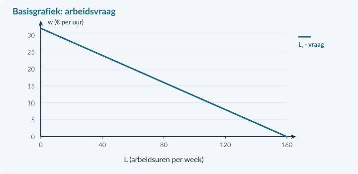<figcaption>Figuur 6. Gebruik de bestaande schaal voor vraag a. Voor de orderverandering hoef je geen nieuwe numerieke lijn te verzinnen.</figcaption></figure>

<b>Een economisch antwoord</b> Noem de oorzaak, de verandering van de lijn of het punt, en de betekenis voor arbeid. Alleen “meer” of “minder” is niet genoeg.

<!-- PAGE {"section": "4.3.1", "title": "Doeloefening"} -->

## Doeloefening

<b>Opgave 7 · FrameWerk groeit</b>

FrameWerk produceert fietsframes voor export. De tabel beschrijft het volledige productieplan.<table><thead><tr><th>Grootheid</th><th>Oude week</th><th>Nieuwe week</th></tr></thead><tbody><tr><td>Productie (frames)</td><td>2.400</td><td>3.300</td></tr><tr><td>Arbeidsuren</td><td>600</td><td>te berekenen</td></tr><tr><td>Productiviteit (frames/uur)</td><td>te berekenen</td><td>5,5</td></tr><tr><td>Volledige uurkosten</td><td>€ 24</td><td>€ 26,40</td></tr></tbody></table>

Los van dit rekenplan beoordeel je bij d twee afzonderlijke veranderingen. Er worden geen huidige wettelijke loonbedragen gebruikt.

<b>a.</b> (3p) Bereken de oorspronkelijke arbeidsproductiviteit en de benodigde arbeidsuren in de nieuwe week.

<b>b.</b> (2p) Bereken de loonkosten per frame in beide weken.

<b>c.</b> (2p) De directeur zegt: “Een hogere productiviteit betekent altijd minder arbeidsuren.” Beoordeel dit met de tabel.

<b>d.</b> (3p) Benoem en verklaar de verandering van de arbeidsvraag bij: (1) alleen een hoger uurloon en (2) alleen extra exportorders bij gelijk loon en gelijke techniek.

<b>Wat lever je in?</b> Berekeningen met eenheden en twee afzonderlijke verklaringen voor de arbeidsvraag.

<!-- PAGE {"section": "4.3.1", "title": "Denkertje en herhaling"} -->

## Denkertje / Bonusopgave

<b>Opgave 8 · Wie lijkt het productiefst?</b>

In dezelfde week maakt atelier A 600 tassen met 10 medewerkers. Atelier B maakt 480 tassen met 8 medewerkers. Een verslaggever noemt de ateliers even productief.

<b>a.</b> Beoordeel het oordeel. Beschrijf welke informatie ontbreekt en bedenk een situatie waarin de vergelijking per medewerker gelijk is, maar per uur verschilt.

## Herhaling / Herhaling en interleaving

<b>Opgave 9 · Kosten uit Boek 2</b>

Een reparatiewerkplaats heeft TK = 600 + 12q, met TK in euro per week en q in reparaties per week. Er zijn deze week 100 reparaties.

<b>a.</b> Bereken TK en GTK.

<b>b.</b> Leg uit waarom GTK daalt als het aantal reparaties stijgt, zolang dezelfde formule geldt.

<b>Terugblik</b> Je kunt nu productie vertalen naar arbeidsinzet. De volgende stap is de andere kant van de markt: hoeveel arbeid willen huishoudens aanbieden?

<!-- PAGE {"section": "4.3.2", "title": "Wie doet mee?"} -->

4.3.2 · ARBEIDSAANBOD, PARTICIPATIE EN EVENWICHT

# Geen baan. Ook werkloos?

Noor heeft een betaalde bijbaan. Amir heeft geen werk, zoekt actief en kan direct beginnen. Tess heeft geen baan en zoekt er ook geen. Alle drie zijn 17. Toch tellen ze niet op dezelfde manier mee.

<b>Lesdoelen</b> Je kunt werkenden, werklozen en niet-deelnemers onderscheiden. Je kunt bruto- en netto-arbeidsparticipatie berekenen. Je kunt met een bekend marktmodel het evenwichtsloon en de werkgelegenheid vinden.

<b>Definitie · beroepsbevolking</b> De mensen die betaald werk hebben, plus de mensen zonder betaald werk die recent werk hebben gezocht en direct beschikbaar zijn. De eerste groep is de werkzame beroepsbevolking; de tweede de werkloze beroepsbevolking.

<figure><figcaption>Figuur 7. Een fictieve bevolking van 1.000 personen: 700 behoren tot de beroepsbevolking. De 100 werklozen zitten al in die 700.</figcaption></figure>

De **niet-beroepsbevolking** bestaat uit mensen zonder betaald werk die niet recent hebben gezocht of niet direct beschikbaar zijn. Geen baan hebben is dus niet voldoende om als werkloos te tellen.

Noor telt als werkzaam, ook met weinig betaalde uren. Amir telt als werkloos. Tess behoort tot de niet-beroepsbevolking. Een leerling of student kan dus in elk van deze groepen vallen.

We gebruiken in de bevolkingsbronnen steeds **15 tot 75 jaar**: 15-jarigen wel, 75-jarigen niet. De definitie van de groepen en de gekozen leeftijdsgrens sluiten aan bij de CBS-begrippen. De cijfers zijn voor dit boek bedacht.

<!-- PAGE {"section": "4.3.2", "title": "Participatie: kies de juiste teller"} -->

### Hoe groot is het aandeel dat meedoet?
**Arbeidsparticipatie** gaat over deelname aan de arbeidsmarkt. Bij bruto-participatie tel je werkenden én werklozen. Bij netto-participatie tel je alleen mensen met betaald werk. Voor beide gebruik je dezelfde bevolking als noemer.

bruto-participatie = beroepsbevolking / bevolking × 100% netto-participatie = werkenden / bevolking × 100%

In de figuur op de vorige pagina is de bevolking 1.000 personen. De beroepsbevolking is 600 + 100 = 700 personen.

Bruto-participatie = 700 / 1.000 × 100% = **70%**. 
Netto-participatie = 600 / 1.000 × 100% = **60%**.

Het verschil van 10 procentpunt is hier het aandeel werklozen **in de hele bevolking**. Het is niet het werkloosheidspercentage. Dat percentage krijgt in §4.3.3 een andere noemer.

### Een waarneming is geen aanbodlijn
De telling zegt hoeveel mensen in een regio op dit moment meedoen. Een **arbeidsaanbodlijn** toont hoeveel arbeid huishoudens bij verschillende lonen willen aanbieden, terwijl de andere omstandigheden gelijk blijven.

In ons model loopt de aanbodlijn op. Een hoger loon kan meer mensen aantrekken of mensen meer uren laten aanbieden. Hoe mensen reageren hangt ook af van beschikbare tijd, zorgtaken, opleiding en voorkeuren. We gebruiken de stijgende lijn als vereenvoudiging voor de onderzochte markt.

Meer beschikbare gekwalificeerde werknemers kunnen de aanbodlijn naar rechts verschuiven. Een verandering van alleen het loon is juist een beweging langs die lijn.

<b>Tel geen groepen dubbel</b> Beroepsbevolking = werkenden + werklozen. Voeg de werklozen niet nogmaals toe aan een al gegeven beroepsbevolking. Houd bevolkingscijfers en een aparte sectorberekening uit elkaar.

<!-- PAGE {"section": "4.3.2", "title": "Evenwicht: nieuwe namen, bekende methode"} -->

### Van productprijs naar uurloon
Bij een gewone markt stelde je gevraagde en aangeboden hoeveelheid aan elkaar gelijk. Hier doe je hetzelfde. Alleen de economische betekenis en eenheden veranderen.

<table><thead><tr><th>Bekende markt</th><th>Arbeidsmarkt</th></tr></thead><tbody><tr><td>Prijs P</td><td>Uurloon w</td></tr><tr><td>Gevraagde hoeveelheid Qᵥ</td><td>Arbeidsvraag Lᵥ door werkgevers</td></tr><tr><td>Aangeboden hoeveelheid Qₐ</td><td>Arbeidsaanbod Lₐ door huishoudens</td></tr><tr><td>Qᵥ = Qₐ</td><td>Lᵥ = Lₐ</td></tr></tbody></table>

In een kleine voorbeeldsector geldt **Lᵥ = 180 − 10w** en **Lₐ = −20 + 10w**. L is het aantal personen; iedereen biedt één baan met 20 uur per week aan. w is het loon in euro per uur. We gebruiken deze functies voor € 2 ≤ w ≤ € 18.

Gelijkstellen: 180 − 10w = −20 + 10w → 200 = 20w → **w = € 10 per uur**.

Invullen: L = 180 − 10 × 10 = **80 personen**. Controle: −20 + 10 × 10 = 80 personen.

<figure>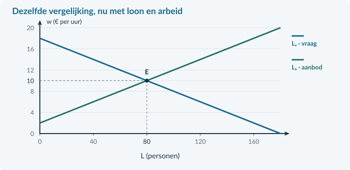<figcaption>Figuur 8. Het snijpunt E geeft het evenwichtsloon en de werkgelegenheid. Loon staat verticaal; de hoeveelheid arbeid staat horizontaal.</figcaption></figure>

<b>De modelafspraak</b> Er zijn veel werkgevers en werknemers, vergelijkbare arbeid en geen loonvloer. Het loon kan zich aanpassen. Iedereen vindt direct een passende werkgever of werknemer. Daardoor worden in het evenwicht alle aangeboden arbeidsplaatsen gevuld. Dit is niet een beschrijving van elke werkelijke arbeidsmarkt.

<!-- PAGE {"section": "4.3.2", "title": "Uitgewerkt voorbeeld"} -->

## Uitgewerkt voorbeeld

<b>Regio en voorbeeldsector</b> Een fictieve regio heeft 2.000 inwoners van 15 tot 75 jaar: 1.260 werken, 140 zijn werkloos en 600 behoren niet tot de beroepsbevolking. Een <b>aparte</b> sector heeft Lᵥ = 160 − 5w en Lₐ = −20 + 5w. L is het aantal personen met elk 20 uur per week; w is het uurloon in euro. Het model geldt voor € 4 ≤ w ≤ € 32 en kent vrije loonaanpassing zonder zoekproblemen.

### 1 · Stel de groepen vast
Beroepsbevolking = werkenden + werklozen = 1.260 + 140 = **1.400 personen**. Controle: 1.400 + 600 = 2.000 personen.

### 2 · Bereken de deelname
Bruto: 1.400 / 2.000 × 100% = **70%**. 
Netto: 1.260 / 2.000 × 100% = **63%**.

### 3 · Stel in de sector vraag en aanbod gelijk
160 − 5w = −20 + 5w → 180 = 10w → **w = € 18 per uur**. 
L = 160 − 5 × 18 = **70 personen**. Controle: −20 + 5 × 18 = 70.

De werkgevers vragen bij dit loon arbeid van 70 personen. Huishoudens bieden bij dit loon arbeid van 70 personen aan. De werkgelegenheid in dit model is dus 70 personen, niet de 1.400 uit de regiotelling.

<figure>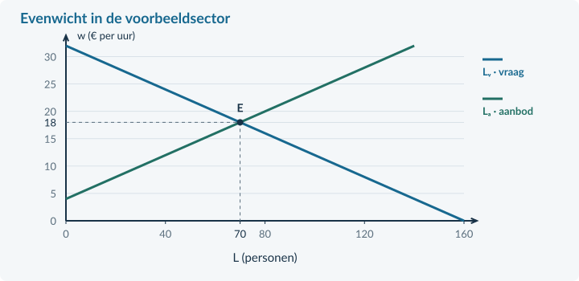<figcaption>Figuur 9. Gebruik het loon uit het snijpunt. De horizontale hoeveelheid blijft een aantal personen, niet een geldbedrag.</figcaption></figure>

<b>Samenvatting §4.3.2</b> Kies eerst groep en leeftijdsbereik. Bruto telt werkenden én werklozen; netto alleen werkenden. Deel door de aangegeven bevolking. Vind het model-evenwicht met Lᵥ = Lₐ en controleer door invullen. In §4.3.3 kijken we naar werkloosheid en veranderingen.

<!-- PAGE {"section": "4.3.2", "title": "Start en groepen herkennen"} -->

## Startopgaven

<b>Korte route:</b> Startopgaven → Zelfstandige oefening → Doeloefening. Extra hulp nodig? Maak eerst Begeleide inoefening.

<b>Opgave 10 · Een bekende markt</b>

Voor een product geldt Qᵥ = 120 − 4P en Qₐ = 20 + P. P is euro per product en Q is producten per week.

<b>a.</b> Bereken de evenwichtsprijs en -hoeveelheid.

<b>b.</b> Bereken hoeveel procent 72 is van 120.

<b>Opgave 11 · Zoeken én beschikbaar zijn</b>

Lina heeft betaald werk. Mo heeft geen betaald werk, zoekt en kan direct beginnen. Bo heeft geen werk en is niet beschikbaar.

<b>a.</b> Deel de drie personen in: werkzaam, werkloos of niet-beroepsbevolking.

## Begeleide inoefening

Heb je deze hulp niet nodig? Ga dan verder met Zelfstandige oefening.

<b>Opgave 12 · Dezelfde bevolking, twee percentages</b>

Een wijk telt 800 inwoners van 15 tot 75 jaar. Er zijn 480 werkenden, 80 werklozen en 240 niet-deelnemers.

<b>a.</b> Bereken eerst de beroepsbevolking. Welke twee groepen tel je op?

<b>b.</b> Bereken bruto- en netto-participatie. Gebruik voor beide de 800 inwoners als noemer.

<b>Opgave 13 · Vul de evenwichtsroute aan</b>

Een arbeidsmarkt heeft Lᵥ = 140 − 5w en Lₐ = −20 + 5w. L is het aantal personen; w is het uurloon in euro. Gebruik € 4 ≤ w ≤ € 28 en vrije loonaanpassing.

<b>a.</b> Vul eerst de ontbrekende waarden in: 140 − 5w = −20 + 5w → … = 10w → w = … → L = … .

<b>b.</b> Wie vragen deze 60 eenheden arbeid en wie bieden ze aan?

<!-- PAGE {"section": "4.3.2", "title": "Van steun naar zelfstandig"} -->

## Zelfstandige oefening

<b>Opgave 14 · Participatie in een dorp</b>

Een dorp heeft 1.200 inwoners van 15 tot 75 jaar. 720 hebben betaald werk; 120 hebben geen werk, hebben recent gezocht en zijn direct beschikbaar. De rest werkt niet en zoekt niet.

<b>a.</b> Bereken de beroepsbevolking en beide participatiepercentages.

<b>Opgave 15 · De markt voor magazijnmedewerkers</b>

Lᵥ = 200 − 8w en Lₐ = −24 + 8w. L is het aantal personen met ieder 20 uur per week; w is het uurloon in euro. De functies gelden voor € 3 ≤ w ≤ € 25. Loon past vrij aan en alle matches komen direct tot stand.

<b>a.</b> Bereken het evenwichtsloon en de werkgelegenheid. Markeer het punt E in de basisgrafiek hieronder.

<figure><figcaption>Figuur 10. Basisgrafiek bij opgave 15. Voeg E en de bijbehorende hulplijnen toe.</figcaption></figure>

<!-- PAGE {"section": "4.3.2", "title": "Doeloefening"} -->

## Doeloefening

<b>Opgave 16 · Waterstad en de bezorgsector</b>

Bron A: Waterstad telt 5.000 inwoners van 15 tot 75 jaar. Er zijn 3.000 werkenden, 500 werklozen en 1.500 niet-deelnemers. Bron B: een afzonderlijk model voor bezorgers geeft Lᵥ = 240 − 10w en Lₐ = −40 + 10w. L is het aantal personen met 20 uur per week; w is het uurloon in euro. Het model geldt voor € 4 ≤ w ≤ € 24. Het loon is flexibel; er zijn geen zoekproblemen of loonafspraken.

<b>a.</b> (3p) Bereken met bron A de beroepsbevolking en de bruto- en netto-participatie.

<b>b.</b> (3p) Bereken met bron B het evenwichtsloon en de werkgelegenheid. Markeer E in de basisgrafiek hieronder.

<b>c.</b> (2p) Leg uit wie bij dit loon arbeid vragen en aanbieden. Waarom vervangt de modeluitkomst de regiotelling niet?

<figure>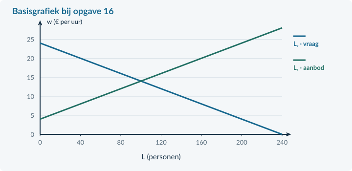<figcaption>Figuur 11. Basisgrafiek bij opgave 16. Benoem het berekende evenwicht met loon en hoeveelheid.</figcaption></figure>

<!-- PAGE {"section": "4.3.2", "title": "Denkertje en herhaling"} -->

## Denkertje / Bonusopgave

<b>Opgave 17 · Meer deelname, evenveel werk</b>

In een gebied met 1.000 inwoners van 15 tot 75 jaar werken eerst 600 mensen en zoeken 100 anderen zonder baan actief werk. Later gaan 50 niet-deelnemers ook zoeken en zijn direct beschikbaar. Niemand vindt of verliest werk.

<b>a.</b> Leg uit wat met bruto- en netto-participatie gebeurt. Beoordeel de uitspraak: “Hogere deelname betekent altijd meer werkenden.”

## Herhaling / Herhaling en interleaving

<b>Opgave 18 · De belastingwig terughalen</b>

Bij een belasting op een product betaalt de koper € 12 en ontvangt de verkoper na afdracht € 9. Er worden 200 producten per week verkocht.

<b>a.</b> Bereken de belasting per product en de overheidsontvangsten.

<b>De volgende stap</b> Een evenwichtsgrafiek laat een vereenvoudigd mechanisme zien. Werkloosheidscijfers zijn waarnemingen. In §4.3.3 leer je die twee gebruiken zonder ze met elkaar te verwarren.

<!-- PAGE {"section": "4.3.3", "title": "Werkloos: kies de juiste noemer"} -->

4.3.3 · WERKLOOSHEID EN VERANDERINGEN OP DE ARBEIDSMARKT

# Vacatures én werklozen. Hoe kan dat?

Een regio telt honderd werklozen, terwijl werkgevers zestig mensen zoeken. Is de werkloosheid dan eigenlijk maar veertig? Nee. Een openstaande baan is nog niet door een werkloze vervuld.

<b>Lesdoelen</b> Je kunt het werkloosheidspercentage berekenen. Je kunt oorzaken van werkloosheid onderscheiden. Je kunt een verschuiving van arbeidsvraag verwerken en uitleggen waarom een model niet alle waargenomen werkloosheid beschrijft.

werklozen = beroepsbevolking − werkenden werkloosheidspercentage = werklozen / beroepsbevolking × 100%

Bij 900 werkenden en 100 werklozen is de beroepsbevolking 1.000 personen. Het werkloosheidspercentage is 100 / 1.000 × 100% = **10%**. De noemer is nu niet de hele bevolking.

<figure><figcaption>Figuur 12. Een fictieve bron telt één baan per werkende en één persoon per vacature. De 900 werkenden komen in beide tellingen voor.</figcaption></figure>

In deze bron is arbeidsvraag = werkgelegenheid + vacatures = 900 + 60 = 960 arbeidsplaatsen. Arbeidsaanbod = beroepsbevolking = 1.000 personen.

Maar aanbod − vraag = 1.000 − 960 = 40 is **niet** het aantal werklozen. Je hebt dan vacatures van werklozen afgetrokken. Er zijn nog steeds 100 mensen zonder werk die zoeken en beschikbaar zijn.

<b>Gelijke eenheden zijn nodig</b> In werkelijke bronnen kunnen banen en personen verschillen: één persoon kan meer banen hebben. Onze rekenvoorbeelden melden daarom expliciet wanneer één persoon bij één baan hoort.

<!-- PAGE {"section": "4.3.3", "title": "Verschillende oorzaken"} -->

### Minder bestedingen, andere productie of zoektijd?
Bij **conjuncturele werkloosheid** is er minder vraag naar goederen en diensten. Huishoudens of bedrijven besteden minder. Bedrijven krijgen minder opdrachten en hebben daardoor minder personeel nodig. Het probleem is hier niet dat iedereen plotseling de verkeerde opleiding heeft.

Bij **structurele werkloosheid** past de beschikbare arbeid niet goed bij het werk dat gevraagd wordt. Techniek kan beroepen veranderen. Een regio kan veel werkzoekenden hebben, terwijl passende banen ergens anders liggen. Scholing en verhuizing kosten tijd en geld.

**Frictiewerkloosheid** ontstaat doordat het tijd kost om een passende baan en werknemer te vinden. Iemand kan tussen twee banen zitten, zonder dat er te weinig banen voor zijn beroep zijn. We rekenen deze zoektijd hier tot structurele werkloosheid.

<figure><figcaption>Figuur 13. De bron moet de oorzaak ondersteunen. “Lang werkloos” of “weinig vacatures” is op zichzelf nog geen volledige verklaring.</figcaption></figure>

### Waarom vallen vacatures en werklozen niet direct samen?
Een installateur zoekt een ervaren elektricien. Een werkloze kandidaat heeft ervaring als winkelmedewerker. Er is een vacature én iemand zoekt werk, maar er is nog geen passende match. Ook reistijd, werktijden en informatie kunnen een match in de weg staan.

Een hoog totaal aantal vacatures bewijst daarom niet dat iedere werkzoekende direct kan beginnen. Evenmin betekent ieder langdurig werkloosheidsgeval automatisch dat het conjunctureel is.

<b>Benoem een mechanisme</b> Schrijf bijvoorbeeld: “Minder consumentenbestedingen → minder winkelverkopen → minder vraag naar winkelpersoneel.” Het woord conjunctureel alleen verklaart nog niets.

<!-- PAGE {"section": "4.3.3", "title": "Een verschuiving bij flexibel loon"} -->

### Minder opdrachten verschuiven de arbeidsvraag
We gebruiken opnieuw het bekende marktmodel. De lijnen tonen verbanden bij verder gelijke omstandigheden. De aanbodlijn blijft nu gelijk; door minder bestedingen daalt de arbeidsvraag bij ieder loon.

Oud: **Lᵥ = 200 − 10w**. Nieuw: **Lᵥ = 160 − 10w**. 
Aanbod: **Lₐ = −40 + 10w**. L is het aantal personen met ieder 20 uur per week; w is het uurloon in euro. We gebruiken € 4 ≤ w ≤ € 16. Het loon kan vrij aanpassen, zonder vacatures of zoekproblemen.

<figure>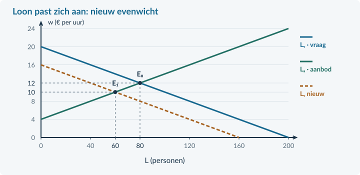<figcaption>Figuur 14. E₀ is het oude evenwicht: € 12 en 80 personen. Na de daling van de arbeidsvraag ligt E₁ bij € 10 en 60 personen.</figcaption></figure>

Nieuwe vergelijking: 160 − 10w = −40 + 10w → 200 = 20w → **w = € 10**. 
Invullen: L = 160 − 10 × 10 = **60 personen**.

De nieuwe evenwichtswerkgelegenheid is lager. Toch is er in dit eenvoudige model geen aanbodoverschot bij het nieuwe loon. Bij € 10 willen minder personen arbeid aanbieden dan bij € 12. Gevraagde en aangeboden hoeveelheid zijn nu beide 60.

Dat betekent niet dat iedereen in de echte regio onmiddellijk werk vindt. Het model laat zoekproblemen, verschillen in vaardigheden en vaste afspraken weg.

<b>Geen dubbele verschuiving</b> De arbeidsvraaglijn verschuift naar links. Het dalende loon veroorzaakt een <b>beweging langs de gelijk gebleven aanbodlijn</b>. Een nieuwe evenwichtsprijs is niet automatisch een verschuiving van beide lijnen.

<!-- PAGE {"section": "4.3.3", "title": "Hetzelfde verlies aan vraag, maar vast loon"} -->

### Het loon daalt niet meteen
Veronderstel nu dat in precies dezelfde sector het uurloon voorlopig **€ 12 blijft**. Dat kan bijvoorbeeld door bestaande loonafspraken. We gebruiken dezelfde nieuwe arbeidsvraag en dezelfde aanbodlijn als op de vorige pagina.

Vraag bij € 12: 160 − 10 × 12 = **40 personen**. 
Aanbod bij € 12: −40 + 10 × 12 = **80 personen**.

<figure>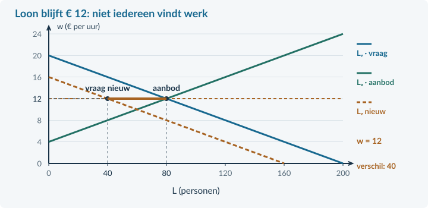<figcaption>Figuur 15. Bij het vastgehouden loon ligt de nieuwe vraag bij 40 en het aanbod bij 80 personen. Het horizontale verschil is 40 personen.</figcaption></figure>

Er zijn in dit model geen vacatures, geen zoekproblemen en geen tweede baan per persoon. Alle 40 gevraagde plaatsen worden gevuld. De overige 40 aanbieders willen werken, zoeken werk en zijn beschikbaar, maar vinden hier geen baan.

Vergelijk de twee situaties. Bij een flexibel loon ontstaat € 10 met 60 werkenden. Bij een loon dat € 12 blijft, zijn er 40 werkenden en 40 niet-geplaatste aanbieders. Hetzelfde verschil in opdrachten krijgt dus een andere uitkomst door de **loonaanpassing**.

### Wat mag je concluderen?
Je kunt de uitkomst onder beide aannames berekenen. Je kunt uit deze berekening niet bewijzen dat werkelijke lonen direct dalen of dat alle echte werkloosheid door vaste lonen ontstaat.

<b>Telling of model?</b> In een waarneming tel je werklozen rechtstreeks of als beroepsbevolking min werkenden. Alleen onder de expliciete modelvoorwaarden zonder vacatures of mismatch mag je het arbeidsaanbodoverschot als modelwerkloosheid lezen.

<!-- PAGE {"section": "4.3.3", "title": "Uitgewerkt voorbeeld"} -->

## Uitgewerkt voorbeeld

<b>Minder evenementen</b> Een regio telt 1.840 werkenden en 160 werklozen. Er zijn 90 vacatures; elke werkende heeft precies één baan. In een aparte evenementenmarkt daalt de arbeidsvraag van Lᵥ = 200 − 8w naar Lᵥ = 168 − 8w. Het aanbod blijft Lₐ = −24 + 8w. L is het aantal personen, w het uurloon in euro; € 3 ≤ w ≤ € 21. Het oude evenwicht is w = € 14 en L = 88. Consumenten besparen op evenementen.

### 1 · Bereken de waargenomen werkloosheid
Beroepsbevolking = 1.840 + 160 = **2.000 personen**. 
Werkloosheidspercentage = 160 / 2.000 × 100% = **8%**.

Arbeidsvraag = 1.840 + 90 = **1.930 arbeidsplaatsen**. Het verschil van 70 is werklozen min vacatures, niet de werkloosheid.

### 2 · Noem de oorzaak en de verschuiving
Minder bestedingen → minder evenementen → minder arbeidsvraag. Dit is **conjunctureel**. Vraag verschuift naar links; aanbod blijft gelijk.

### 3 · Bereken het nieuwe evenwicht bij flexibel loon
168 − 8w = −24 + 8w → 192 = 16w → **w = € 12**. 
L = 168 − 8 × 12 = **72 personen**.

### 4 · Vergelijk met voorlopig vast loon
Bij € 14: Lᵥ = 168 − 8 × 14 = **56** en Lₐ = −24 + 8 × 14 = **88 personen**. Zonder vacatures of zoekproblemen worden 56 plaatsen gevuld en is het aanbodoverschot **32 personen**.

De sectorgrafiek vervangt niet de aparte regiotelling.

<b>Samenvatting §4.3.3</b> Werkloosheid gebruikt de beroepsbevolking als noemer. Trek vacatures niet af. Benoem oorzaak en loonaanpassing. Houd model en waarneming gescheiden. In §4.3.4 voegen we een minimumloon toe.

<!-- PAGE {"section": "4.3.3", "title": "Start en een oorzaak herkennen"} -->

## Startopgaven

<b>Korte route:</b> Startopgaven → Zelfstandige oefening → Doeloefening. Extra hulp nodig? Maak eerst Begeleide inoefening.

<b>Opgave 19 · Terug naar de groepen</b>

Een gemeente telt 4.000 inwoners van 15 tot 75 jaar. Er zijn 2.400 werkenden en 400 werklozen.

<b>a.</b> Bereken de beroepsbevolking en de bruto-participatie.

<b>Opgave 20 · Een andere noemer</b>

In een andere regio is 6% van de bevolking werkloos. De bruto-participatie is 60%.

<b>a.</b> Is het werkloosheidspercentage automatisch 6%? Leg uit zonder het precieze percentage te hoeven berekenen.

<b>b.</b> Een andere werkzoekende is tussen twee banen drie weken op zoek. De vaardigheden sluiten aan bij openstaande vacatures. Welk type werkloosheid past hierbij?

## Begeleide inoefening

Heb je deze hulp niet nodig? Ga dan verder met Zelfstandige oefening.

<b>Opgave 21 · Een vervulde baan ontbreekt nog</b>

Een klein gebied telt 450 werkenden, 50 werklozen en 30 vacatures. Iedereen heeft hoogstens één baan. Een vacature past niet bij iedere werkzoekende.

<b>a.</b> Bereken eerst de beroepsbevolking en daarna het werkloosheidspercentage.

<b>b.</b> Een leerling rekent (500 − 480) / 500 × 100% = 4%. Wat trekt die leerling ten onrechte af?

<!-- PAGE {"section": "4.3.3", "title": "Van oorzaak naar uitkomst"} -->

Begeleide inoefening · vervolg

Heb je deze hulp niet nodig? Ga dan verder met Zelfstandige oefening.

<b>Opgave 22 · Wat verandert er?</b>

Een reisbureau krijgt minder boekingen doordat huishoudens minder besteden. In zijn arbeidsmarkt blijft het loon eerst gelijk.

<b>a.</b> Noem de oorzaak van werkloosheid die bij de bron past en maak de keten af: minder bestedingen → … → minder vraag naar arbeid.

<b>b.</b> Welke lijn verschuift en welke druk op loon en werkgelegenheid ontstaat als het loon later wel kan dalen?

## Zelfstandige oefening

<b>Opgave 23 · Werk en techniek</b>

Een provincie heeft 4.500 werkenden en 500 werklozen. Een deel van de werklozen deed invoerwerk dat nu door software wordt uitgevoerd. Nieuwe vacatures vragen andere vaardigheden.

<b>a.</b> Bereken het werkloosheidspercentage en benoem de best passende oorzaak voor de beschreven groep.

<b>Opgave 24 · Minder schoonmaakopdrachten</b>

Oud: Lᵥ = 180 − 5w. Nieuw: Lᵥ = 160 − 5w. Aanbod blijft Lₐ = −20 + 5w. L is het aantal personen; w is het uurloon in euro. Gebruik € 4 ≤ w ≤ € 32. Oud evenwicht: € 20 en 80 personen. Loon is vrij aanpasbaar; er zijn geen vacatures of zoekproblemen.

<b>a.</b> Bereken het nieuwe evenwicht. Benoem één verschuiving en één beweging langs een lijn.

<b>b.</b> Bereken het aanbodoverschot als het loon toch € 20 blijft.

<!-- PAGE {"section": "4.3.3", "title": "Doeloefening"} -->

## Doeloefening

<b>Opgave 25 · Rivierenregio: cijfers en een sector</b>

Bron A: de regio telt 2.700 werkenden, 300 werklozen en 120 vacatures. Iedere werkende heeft één baan. Bron B: in een afzonderlijke sector nemen de opdrachten af doordat huishoudens minder besteden. Lᵥ daalt van 180 − 6w naar 144 − 6w; Lₐ blijft −12 + 6w. L is het aantal personen; w is het uurloon in euro; € 2 ≤ w ≤ € 24. Het oude evenwicht is € 16 en 84 personen. Er zijn in dit sector-model geen vacatures of zoekproblemen.

<b>a.</b> (3p) Bereken met bron A het werkloosheidspercentage. Leg uit waarom arbeidsaanbod min arbeidsvraag hier niet de werkloosheid geeft.

<b>b.</b> (3p) Benoem met bron B de oorzaak en bereken het nieuwe evenwicht als het loon vrij aanpast.

<b>c.</b> (3p) Markeer het oude en nieuwe evenwicht in de basisgrafiek. Bereken daarna het aanbodoverschot bij een loon dat € 16 blijft.

<figure><figcaption>Figuur 16. De oude en nieuwe vraaglijn en de aanbodlijn zijn gegeven. Voeg alleen E₀ en E₁ toe.</figcaption></figure>

<!-- PAGE {"section": "4.3.3", "title": "Denkertje en herhaling"} -->

## Denkertje / Bonusopgave

<b>Opgave 26 · Een dalend percentage zonder extra banen</b>

Een dorp telt eerst 900 werkenden en 100 werklozen. Later stoppen 50 werklozen met zoeken. Zij hebben geen betaald werk en horen nu bij de niet-beroepsbevolking. Er komt geen baan bij.

<b>a.</b> Beoordeel: “De lagere werkloosheid bewijst dat meer mensen werk hebben.” Gebruik zowel aantallen als percentages.

## Herhaling / Herhaling en interleaving

<b>Opgave 27 · Marginale opbrengst uit hoofdstuk 4.1</b>

Een onderneming heeft P = 30 − 0,5q en TK = 6q + 100. P is euro per product, q producten per week. De gevraagde hoeveelheid is niet negatief.

<b>a.</b> Bepaal TO en MO.

<b>Terugblik</b> Een cijfer wordt pas betekenisvol met de juiste teller, noemer en definitie. Een modeluitkomst vraagt bovendien een expliciete aanname over loonaanpassing.

<!-- PAGE {"section": "4.3.4", "title": "Een ondergrens aan het loon"} -->

4.3.4 · MINIMUMLOON

# Een hoger uurloon voor iedereen?

Een minimumloon kan het uurloon verhogen. Maar is de totale hoeveelheid betaald werk dan ook groter? We gebruiken de minimumprijs uit Boek 3 opnieuw, nu met loon en arbeid.

<b>Lesdoelen</b> Je kunt bepalen of een minimumloon bindend is. Je kunt in een gegeven model arbeidsvraag, arbeidsaanbod, werkgelegenheid en loonsom berekenen. Je kunt verschillen tussen groepen werknemers uitleggen.

<b>Definitie · minimumloon</b> Een ondergrens waaronder het loon niet mag liggen. In dit hoofdstuk gebruiken we fictieve uurlonen om een economisch model te onderzoeken, niet de actuele wettelijke bedragen.

<table><thead><tr><th>Minimumprijs bij een product</th><th>Minimumloon in ons model</th></tr></thead><tbody><tr><td>Vergelijk de ondergrens met de evenwichtsprijs.</td><td>Vergelijk de ondergrens met het evenwichtsloon.</td></tr><tr><td>Bereken vraag en aanbod bij de opgelegde prijs.</td><td>Bereken arbeidsvraag en arbeidsaanbod bij het loon.</td></tr><tr><td>Stel vast hoeveel er werkelijk wordt verkocht.</td><td>Stel vast hoeveel arbeid werkelijk wordt betaald.</td></tr></tbody></table>

Als het evenwichtsloon € 12 is en het minimum € 10, verandert het evenwicht niet. € 12 is immers toegestaan. Het minimum is dan **niet-bindend**. Het feitelijke loon wordt dus niet automatisch € 10.

<figure>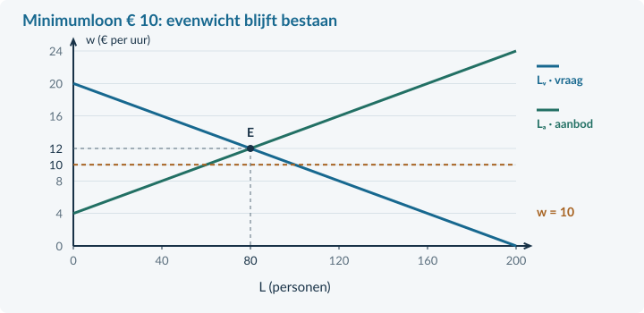<figcaption>Figuur 17. Een loonvloer onder het evenwicht raakt de feitelijke loonvorming in dit model niet.</figcaption></figure>

Model: concurrerende werkgevers, vergelijkbare arbeid en naleving van de vloer. Werkgevers passen personeelsaantallen aan; alle gevraagde plaatsen worden gevuld, zonder vacatures of zoekproblemen.

<!-- PAGE {"section": "4.3.4", "title": "Een bindend minimumloon"} -->

### Hoger dan het evenwicht
In dezelfde voorbeeldmarkt geldt **Lᵥ = 200 − 10w** en **Lₐ = −40 + 10w**, voor € 4 ≤ w ≤ € 20. L is het aantal personen met ieder 20 uur per week; w is het uurloon in euro. Het vrije evenwicht is **€ 12 en 80 personen**.

Nu komt er een minimumloon van € 14. Dat ligt boven het evenwicht en is **bindend**. In dit model wordt het loon € 14.

Arbeidsvraag: 200 − 10 × 14 = **60 personen**. 
Arbeidsaanbod: −40 + 10 × 14 = **100 personen**.

<figure>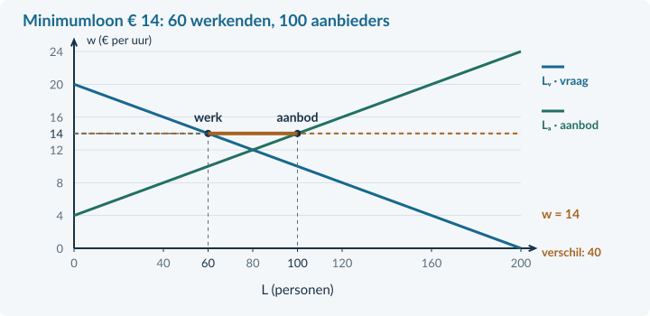<figcaption>Figuur 18. Het minimumloon verandert het loon op de bestaande lijnen. Het aanbodoverschot is een horizontale afstand, geen oppervlakte.</figcaption></figure>

Werkgelegenheid = **60 personen**: werkgevers vullen alle gevraagde plaatsen. Het aanbodoverschot is 100 − 60 = **40 personen**. Die 40 willen bij dit loon werken, zoeken en zijn beschikbaar, maar krijgen in dit model geen baan.

### Niet alle veertig hebben hun baan verloren
Eerst werkten 80 personen; nu 60. Dat zijn **20 minder werkenden**. Tegelijk groeit het aantal aanbieders van 80 naar 100: **20 extra aanbieders**.

Het nieuwe verschil van 40 bestaat dus uit 20 minder werkenden én 20 extra aanbieders. Je mag niet zeggen dat alle 40 een baan hebben verloren.

<b>Wie heeft voordeel?</b> Wie hetzelfde aantal uren blijft werken, krijgt meer loon per uur. Wie geen werk krijgt, ontvangt dat hogere loon niet. Een uitspraak over “de werknemers” moet daarom aangeven over welke groep zij gaat.

<!-- PAGE {"section": "4.3.4", "title": "Loonsom: loon maal betaalde arbeid"} -->

### Het loon per uur en de totale uitbetaling
De **loonsom** is het totale loon dat werknemers samen ontvangen in een periode. Kijk steeds naar de arbeid die werkelijk wordt betaald, niet naar alle arbeid die mensen graag willen aanbieden.

loonsom per week = uurloon × betaalde uren per week = uurloon × uren per werknemer × werkenden

Oud: € 12 × 20 uur × 80 personen = **€ 19.200 per week**. 
Nieuw: € 14 × 20 uur × 60 personen = **€ 16.800 per week**.

De loonsom daalt hier met (€ 16.800 − € 19.200) / € 19.200 × 100% = **12,5%**. Het hogere uurloon weegt niet op tegen de daling van het aantal betaalde uren.

<figure><figcaption>Figuur 19. De rechthoek w × L gebruikt het aantal werkenden. Omdat L hier personen is, vermenigvuldig je nog met 20 uur per persoon per week.</figcaption></figure>

Bij een andere arbeidsvraag kan de werkgelegenheid minder sterk reageren. Dan kan een hoger uurloon samengaan met een hogere totale loonsom. Reken daarom beide situaties uit; onthoud geen vaste uitkomst voor de loonsom.

### Geen algemene voorspelling over de werkelijkheid
Werkgevers kunnen anders reageren dan in dit eenvoudige model. Ook productiviteit, vacatures, prijzen en marktverhoudingen kunnen veranderen. Een berekende daling in ons model bewijst niet dat iedere echte minimumloonsverhoging precies dit effect heeft.

<b>Geen automatische aankoop door de overheid</b> Een minimumloon betekent niet dat de overheid de niet-geplaatste arbeid “opkoopt”. Daarvoor zou een afzonderlijke regeling in de bron moeten staan.

<!-- PAGE {"section": "4.3.4", "title": "Uitgewerkt voorbeeld"} -->

## Uitgewerkt voorbeeld

<b>Een loonvloer in de pakketbranche</b> Lᵥ = 180 − 5w; Lₐ = −20 + 5w, voor € 4 ≤ w ≤ € 36. L is het aantal personen met ieder 20 betaalde uren per week; w is het uurloon in euro. Het minimumloon wordt € 22. Neem concurrerende werkgevers, gelijke arbeid en geen vacatures of zoekproblemen aan. Het brutoloon is in dit model ook de volledige uurkost voor de werkgever.

### 1 · Bereken het vrije evenwicht en toets de ondergrens
180 − 5w = −20 + 5w → 200 = 10w → **w = € 20**. 
L = 180 − 5 × 20 = **80 personen**. € 22 > € 20: de vloer is bindend.

### 2 · Bereken beide hoeveelheden en de werkgelegenheid
Lᵥ = 180 − 5 × 22 = **70 personen**. 
Lₐ = −20 + 5 × 22 = **90 personen**. 
Er werken **70 personen**. Het aanbodoverschot is 90 − 70 = **20 personen**.

### 3 · Vergelijk de loonsommen
Oud: € 20 × 20 × 80 = **€ 32.000 per week**. 
Nieuw: € 22 × 20 × 70 = **€ 30.800 per week**. 
Verandering: (30.800 − 32.000) / 32.000 × 100% = **−3,75%**.

### 4 · Leg de verdeling uit
Wie 20 uur blijft werken, krijgt € 440 in plaats van € 400 per week. Er zijn wel 10 minder werkenden. Het aanbod groeit met 10 personen. Samen geeft dat het nieuwe aanbodoverschot van 20 personen.

Het hogere loon geldt dus niet als inkomen voor alle 90 aanbieders. Zonder individuele gegevens weten we ook niet welke personen hun baan behouden.

<b>Samenvatting §4.3.4</b> Eerst het vrije evenwicht, dan de bindendheid. Bereken vraag, aanbod en betaald werk afzonderlijk. Gebruik betaald werk voor de loonsom. Maak onderscheid tussen blijvende werknemers, minder werkenden en extra aanbieders. In §4.3.5 bekijken we loonafspraken en beleid.

<!-- PAGE {"section": "4.3.4", "title": "Start en een vloer herkennen"} -->

## Startopgaven

<b>Korte route:</b> Startopgaven → Zelfstandige oefening → Doeloefening. Extra hulp nodig? Maak eerst Begeleide inoefening.

<b>Opgave 28 · De minimumprijs terughalen</b>

Op een goederenmarkt is de evenwichtsprijs € 8. Er komt een minimumprijs van € 10. Bij € 10 is de vraag 60 en het aanbod 100 producten per week. De overheid koopt niets op.

<b>a.</b> Hoeveel producten worden verkocht en hoe groot is het aanbodoverschot?

<b>Opgave 29 · Personen zijn geen uren</b>

Er werken 50 mensen. Ieder werkt 20 uur per week tegen € 15 bruto per uur.

<b>a.</b> Bereken de loonsom per week.

## Begeleide inoefening

Heb je deze hulp niet nodig? Ga dan verder met Zelfstandige oefening.

<figure><figcaption>Figuur 20. Bij het voorbeeld worden 70 personen gevraagd en bieden 90 personen arbeid aan. Gebruik de gemarkeerde uitkomst.</figcaption></figure>

<b>Opgave 30 · Begrijpen vóór rekenen</b>

Gebruik het volledig uitgewerkte voorbeeld op de vorige pagina: oud € 20 en 80 werkenden; nieuw € 22, 70 werkenden en 90 aanbieders.

<b>a.</b> Hoeveel minder mensen werken er? Hoeveel extra mensen bieden arbeid aan?

<b>b.</b> Waarom reken je voor de nieuwe loonsom niet met alle 90 aanbieders?

<!-- PAGE {"section": "4.3.4", "title": "Van begeleid naar zelfstandig"} -->

Begeleide inoefening · vervolg

Heb je deze hulp niet nodig? Ga dan verder met Zelfstandige oefening.

<b>Opgave 31 · De vloer stap voor stap</b>

Lᵥ = 180 − 6w en Lₐ = −12 + 6w. L is het aantal personen met 20 uur per week; w is het uurloon in euro. Gebruik € 2 ≤ w ≤ € 30. Het vrije evenwicht is € 16 en 84 personen. Alle gevraagde plaatsen worden gevuld. Een minimum van € 18 wordt ingevoerd.

<b>a.</b> Toets de bindendheid en bereken Lᵥ en Lₐ bij het minimum.

<b>b.</b> Bereken de werkgelegenheid, het aanbodoverschot en de nieuwe loonsom.

## Zelfstandige oefening

<b>Opgave 32 · Een andere reactie</b>

In een cateringmarkt geldt Lᵥ = 140 − 2w en Lₐ = 5w, met L in personen en w in euro per uur. Iedereen werkt 20 uur per week. Het vrije evenwicht is € 20 en 100 personen. Alle gevraagde plaatsen worden gevuld. Het minimum wordt € 22.

<b>a.</b> Bereken werkgelegenheid, aanbodoverschot en loonsom bij de vloer. Vergelijk met de oude loonsom.

<b>Opgave 33 · Een minimum onder de markt</b>

In een aparte markt is het vrije evenwicht € 24 per uur met 60 werkenden. Het minimumloon wordt € 21. Alle overige omstandigheden blijven gelijk.

<b>a.</b> Welk loon en welke werkgelegenheid verwacht je volgens het model? Licht toe.

<!-- PAGE {"section": "4.3.4", "title": "Doeloefening"} -->

## Doeloefening

<b>Opgave 34 · Een loonvloer in de sorteercentra</b>

Lᵥ = 220 − 10w en Lₐ = −20 + 10w, voor € 2 ≤ w ≤ € 22. L is het aantal personen met ieder 25 betaalde uren per week; w is het brutouurloon in euro. Een fictief minimumloon wordt € 14. Werkgevers concurreren; er zijn geen vacatures of zoekproblemen. Alle gevraagde plaatsen worden gevuld. Alle aanbieders zonder baan zoeken en zijn direct beschikbaar.

<b>a.</b> (2p) Bereken het vrije evenwicht en bepaal of de loonvloer bindend is.

<b>b.</b> (3p) Bereken bij de loonvloer arbeidsvraag, arbeidsaanbod, werkgelegenheid en aanbodoverschot. Geef de loonvloer en beide hoeveelheden aan in de basisgrafiek.

<b>c.</b> (3p) Bereken de loonsom vóór en na de verandering en de procentuele verandering.

<b>d.</b> (2p) Leg uit waarom “alle 40 hebben hun baan verloren” en “iedereen verdient meer” geen juiste conclusies zijn.

<figure><figcaption>Figuur 21. De vraag- en aanbodlijn zijn gegeven. Vul de loonvloer, vraag en aanbod aan; teken de lijnen niet opnieuw.</figcaption></figure>

<!-- PAGE {"section": "4.3.4", "title": "Denkertje en herhaling"} -->

## Denkertje / Bonusopgave

<b>Opgave 35 · Een hoger loon, minder uren per persoon</b>

Een werknemer krijgt eerst € 16 per uur en werkt 25 uur per week. Later krijgt deze werknemer € 18 per uur maar werkt 20 uur. Deze verandering geldt voor alle werknemers; hun aantal blijft gelijk.

<b>a.</b> Beoordeel welke uitspraken juist zijn: het uurloon stijgt, het weekloon stijgt, de werkgelegenheid in personen daalt, de arbeidsinzet in uren daalt. Leg uit waarom de eenheid ertoe doet.

## Herhaling / Herhaling en interleaving

<b>Opgave 36 · Productiviteit blijft nodig</b>

Een producent maakt 4.800 producten in 800 arbeidsuren. De volledige uurkosten zijn € 27.

<b>a.</b> Bereken de arbeidsproductiviteit en loonkosten per product.

<b>Terugblik</b> Bij een loonmaatregel reken je niet alleen met het uurloon. Je controleert ook betaald werk, aangeboden arbeid, arbeidsduur en de totale loonsom.

<!-- PAGE {"section": "4.3.5", "title": "Samen afspraken maken"} -->

4.3.5 · VAKBONDEN, CAO EN ARBEIDSMARKTBELEID

# Meer loon én ruimte voor scholing?

Werknemers willen meer loon en tijd om zich te ontwikkelen. Werkgevers willen voldoende goede medewerkers en beheersbare kosten. Een afspraak kan over beide gaan. Beoordeel daarom het hele voorstel, niet alleen het loonpercentage.

<b>Lesdoelen</b> Je kunt uitleggen wat vakbonden en werkgevers in een cao afspreken. Je kunt loon- en productiviteitsveranderingen vergelijken. Je kunt met een berekening, mechanisme en voorwaarde een beleidsvoorstel beoordelen.

<b>Definitie · cao</b> Een collectieve arbeidsovereenkomst bevat schriftelijke afspraken over arbeidsvoorwaarden voor een groep werknemers. Eén of meer werkgevers of werkgeversorganisaties sluiten haar met één of meer werknemersorganisaties, zoals vakbonden.

<figure>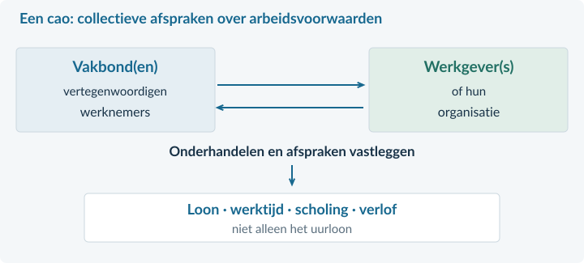<figcaption>Figuur 22. De cao kan loon, werktijden, verlof en scholing combineren. Het is geen afspraak van iedere werknemer afzonderlijk.</figcaption></figure>

Een **vakbond** behartigt belangen van werknemers. Zij kan namens hen onderhandelen over collectieve arbeidsvoorwaarden. Werkgevers kunnen samen worden vertegenwoordigd door een werkgeversorganisatie.

**Flexwerk** betreft werk met bijvoorbeeld een tijdelijk contract of wisselende uren. Een **zzp’er** werkt als zelfstandige zonder personeel. Dat is niet hetzelfde als een werknemer met een flexibel contract. De bron moet duidelijk maken welke groep een voorstel betreft.

Deze begrippen zeggen nog niet automatisch iets over productiviteit, inkomen of baanzekerheid in één concrete situatie. De institutionele beschrijving van de cao sluit aan bij Rijksoverheid; alle voorstellen in de opgaven zijn fictief.

<!-- PAGE {"section": "4.3.5", "title": "Van loonafspraak naar kosten en werk"} -->

### Vergelijk geen losse groeipercentages
De bekende verhouding uit §4.3.1 blijft gelden: **loonkosten per product = uurkosten / productie per uur**. Stel dat de uurkosten 5% stijgen en de productiviteit 12,5%. Reken dan beide bedragen per product uit.

<figure>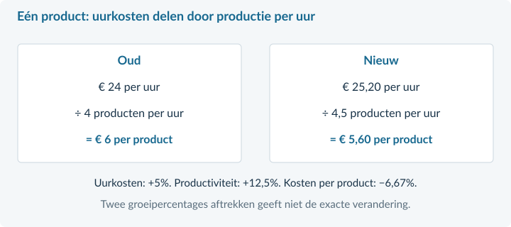<figcaption>Figuur 23. Een stijging van de uurkosten kan samengaan met een daling van de loonkosten per product.</figcaption></figure>

index loonkosten per product = (index uurkosten / index arbeidsproductiviteit) × 100

Met hetzelfde basisjaar: 105 / 112,5 × 100 = **93,33**. De kosten per product dalen dus met **6,67%**. Het verschil 12,5% − 5% = 7,5% is niet de exacte uitkomst. De twee grootheden staan in een verhouding.

### Vraag steeds hoe een voorstel werkt
Een afgesproken hoger loon verandert de beloning. Scholing kan vaardigheden verbeteren en de productie per uur verhogen. Scholing kan ook helpen om een bestaande vacature te vullen. Dat zijn verschillende mechanismen.

Een grotere productiviteit vermindert benodigde uren bij **gelijkblijvende productie**, maar maakt extra productie mogelijk. Hoeveel mensen uiteindelijk werken, hangt ook af van de opdrachten en de arbeidsduur. Alleen lagere loonkosten per product bewijzen dus geen banengroei.

<b>Criterium → bewijs → voorwaarde</b> Bijvoorbeeld: beoordeel of kosten per product dalen; gebruik uurkosten en productiviteit als bewijs; vermeld dat opleidingskosten, kwaliteit en andere kosten ertoe doen. Een advies is sterker als je duidelijk zegt waarop het berust.

<!-- PAGE {"section": "4.3.5", "title": "Uitgewerkt voorbeeld"} -->

## Uitgewerkt voorbeeld

<b>Cao-voorstel voor keukentextiel</b> Vakbonden en werkgevers bespreken meer loon en scholing. Uurloon en volledige uurkosten stijgen beide met 5%. De uurkosten gaan van € 24 naar € 25,20. Productiviteit stijgt door het nieuwe werkproces van 4 naar 4,5 producten per uur. De opleiding kost in het eerste jaar daarnaast € 0,25 per geproduceerd product. Andere kosten per product en kwaliteit blijven gelijk. Het criterium is: dalen de kosten van arbeid plus opleiding per product?

### 1 · Benoem de afspraak en de partijen
Werknemersorganisaties en werkgevers maken een collectieve afspraak over loon en scholing. Een cao betreft dus meer dan alleen de verkoopprijs van een arbeidsuur.

### 2 · Bereken de loonkosten per product
Oud: € 24 / 4 = **€ 6 per product**. 
Nieuw: € 25,20 / 4,5 = **€ 5,60 per product**. 
Verandering: (5,60 − 6) / 6 × 100% ≈ **−6,67%**.

Controle met indexcijfers: 105 / 112,5 × 100 = 93,33. De kostenindex ligt 6,67 onder 100.

### 3 · Neem de extra kosten uit de bron mee
Arbeid plus opleiding: € 5,60 + € 0,25 = **€ 5,85 per product**. 
Verschil met eerst: € 6 − € 5,85 = **€ 0,15 lager per product**.

### 4 · Geef een begrensd oordeel
Het voorstel voldoet aan het genoemde kostencriterium, **als de veronderstelde productiviteitswinst wordt gehaald**. Het loon per uur stijgt terwijl de kosten van arbeid plus opleiding per product dalen.

Daaruit volgt niet dat automatisch meer werknemers nodig zijn. Als de productie gelijk blijft, zijn door de hogere productiviteit minder uren nodig. Extra opdrachten kunnen die uitkomst veranderen. De bron geeft geen complete voorspelling van de werkgelegenheid.

<b>Samenvatting §4.3.5</b> Een cao legt collectieve arbeidsvoorwaarden vast. Vergelijk loonkosten en productiviteit per product, niet met een losse aftrekking. Beoordeel beleid met een criterium, brongegevens en voorwaarden. In §4.3.6 kies je zelf de passende berekening en verklaring.

<!-- PAGE {"section": "4.3.5", "title": "Start en een voorstel lezen"} -->

## Startopgaven

<b>Korte route:</b> Startopgaven → Zelfstandige oefening → Doeloefening. Extra hulp nodig? Maak eerst Begeleide inoefening.

<b>Opgave 37 · Index en verhouding</b>

Een broodjesfabriek had uurkosten van € 20. Die worden € 22. De productiviteit was en blijft 5 broodjes per arbeidsuur.

<b>a.</b> Bereken de index van de uurkosten met de oude situatie als 100.

<b>b.</b> Bereken de nieuwe loonkosten per broodje.

<b>Opgave 38 · Wie onderhandelt?</b>

Een bedrijfstak bespreekt gezamenlijke loon- en scholingsafspraken.

<b>a.</b> Welke twee soorten organisaties kunnen deze cao met elkaar afsluiten?

## Begeleide inoefening

Heb je deze hulp niet nodig? Ga dan verder met Zelfstandige oefening.

<b>Opgave 39 · Controleer beide tellers</b>

In een tapijtfabriek gaan volledige uurkosten van € 30 naar € 31,50 en productiviteit van 5 naar 6 producten per uur. Andere kosten per product veranderen niet.

<b>a.</b> Bereken eerst de oude en nieuwe loonkosten per product.

<b>b.</b> Bereken daarna de procentuele verandering van die kosten.

<!-- PAGE {"section": "4.3.5", "title": "Zelf een argument opbouwen"} -->

Begeleide inoefening · vervolg

Heb je deze hulp niet nodig? Ga dan verder met Zelfstandige oefening.

<b>Opgave 40 · Van berekening naar voorwaarde</b>

Een reparatiebedrijf verwacht loonkosten per reparatie van € 12 vóór en € 11,40 na scholing. De scholing kost € 0,80 per reparatie extra. De kwaliteit en alle overige kosten blijven gelijk.

<b>a.</b> Tel eerst de nieuwe arbeids- en scholingskosten per reparatie op. Beoordeel of het voorstel aan het criterium “lagere kosten per reparatie” voldoet.

<b>b.</b> Kan iemand het voorstel toch steunen? Geef één mogelijk ander criterium, zonder te doen alsof de bron dat voordeel bewijst.

## Zelfstandige oefening

<b>Opgave 41 · Twee indices</b>

In een sector is de index van volledige uurkosten 108 en die van arbeidsproductiviteit 104. Beide gebruiken hetzelfde basisjaar = 100.

<b>a.</b> Bereken de index en procentuele verandering van de loonkosten per product.

<b>Opgave 42 · Scholing bij openstaande banen</b>

Een regio heeft werkloze winkelmedewerkers en vacatures voor monteurs. Een scholingsplan leert kandidaten de benodigde techniek. De bron vermeldt dat zij na scholing aan de functie-eisen voldoen, maar niet dat werkgevers extra orders krijgen.

<b>a.</b> Leg één mechanisme uit waarmee het plan werkloosheid kan verminderen. Leg ook uit wat je niet over de totale arbeidsvraag kunt concluderen.

<!-- PAGE {"section": "4.3.5", "title": "Doeloefening"} -->

## Doeloefening

<b>Opgave 43 · Cao in de houtbewerking</b>

Vakbonden en werkgeversorganisaties bespreken loon en scholing. Uurloon en volledige uurkosten stijgen beide 5%. De tabel geeft het plan voor het eerste jaar.<table><thead><tr><th>Grootheid</th><th>Oud</th><th>Met plan</th></tr></thead><tbody><tr><td>Volledige uurkosten</td><td>€ 30</td><td>€ 31,50</td></tr><tr><td>Productiviteit (delen/uur)</td><td>5</td><td>5,5</td></tr><tr><td>Extra opleidingskosten per deel</td><td>€ 0</td><td>€ 0,20</td></tr></tbody></table>

Kwaliteit en overige kosten per deel blijven gelijk. De productiviteitsverbetering moet in de praktijk nog worden gehaald. Het beoordelingscriterium is: lagere kosten van arbeid plus opleiding per deel. Een werkgever zegt bovendien: “Dit plan zorgt gegarandeerd voor meer banen.”

<b>a.</b> (2p) Benoem de partijen die hier een cao willen afsluiten en noem de twee onderdelen van de afspraak.

<b>b.</b> (3p) Bereken de loonkosten per deel vóór en na het plan en hun procentuele verandering. Rond pas het eindantwoord af.

<b>c.</b> (3p) Beoordeel het plan met het gegeven kostencriterium. Neem de opleiding mee en noem een voorwaarde.

<b>d.</b> (2p) Beoordeel de garantie van meer banen. Betrek de productie en arbeidsduur bij je antwoord.

<!-- PAGE {"section": "4.3.5", "title": "Denkertje en herhaling"} -->

## Denkertje / Bonusopgave

<b>Opgave 44 · Een contractlabel is geen verklaring</b>

Twee schoonmaakbedrijven hebben evenveel betaalde uren en dezelfde omzet. Het ene gebruikt tijdelijke werknemers, het andere vaste werknemers. Een commentator zegt: “Tijdelijk werk is dus productiever.”

<b>a.</b> Beoordeel de redenering. Formuleer welke informatie je nodig hebt voor een goede productiviteitsvergelijking en benoem één ander criterium dat een werknemer belangrijk kan vinden.

## Herhaling / Herhaling en interleaving

<b>Opgave 45 · Een bekende subsidie</b>

Een gemeente vergoedt € 25 per afgeronde cursus. Er worden 40 cursussen afgerond. De bron geeft geen cijfers over externe baten of overige kosten.

<b>a.</b> Bereken de gemeentelijke uitgaven. Kun je alleen daarmee de welvaartswinst bepalen?

<b>Terugblik</b> Een sterk advies bevat een criterium, een controleerbare berekening, een economische oorzaak-gevolgketen en een voorwaarde. Het hoeft geen stellige voorspelling te zijn.

<!-- PAGE {"section": "4.3.6", "title": "Gemengde opgaven"} -->

4.3.6 · GEMENGDE OPGAVEN: ARBEIDSMARKT

# Kies zelf de juiste aanpak

Een regio kan tegelijk een hogere participatie, meer vacatures en onveranderde werkgelegenheid hebben. Je kiest in deze paragraaf zelf welke telling, berekening of modelaanname nodig is. Er komt geen nieuwe theorie bij.

<b>Lesdoelen</b> Je kunt informatie uit verschillende arbeidsmarktbronnen gebruiken. Je kunt zelfstandig een loon en hoeveelheid berekenen. Je kunt participatie, werkloosheid, productiviteit en beleid verbinden zonder verschillende grootheden te verwarren.

## Gemengde oefening

<b>Opgave 46 · Drie uitspraken controleren</b>

Beoordeel de uitspraken met één berekening of een korte economische verklaring.

<b>a.</b> Een bedrijf gebruikt 160 arbeidsuren van 8 mensen. De voltijdweek is 40 uur. “Er werken dus vier mensen.”

<b>b.</b> In een gebied zijn 960 werkenden, 40 werklozen en 30 vacatures. Iedereen heeft één baan. “De werkloosheid is 1%.”

<b>c.</b> Een sector heeft hogere uurkosten maar lagere loonkosten per product. “Dat kan niet.”

<b>Werkwijze</b> Lees eerst over welke groep en periode de bron gaat. Noteer de eenheden. Kies dan pas de formule. Een bron met inwoners en een aparte sectorfunctie zijn niet automatisch één en dezelfde arbeidsmarkt.

<!-- PAGE {"section": "4.3.6", "title": "Rekenen en verklaren"} -->

Gemengde oefening · vervolg

<b>Opgave 47 · Een exporteur automatiseert</b>

Een producent maakt eerst 6.000 onderdelen in 1.000 arbeidsuren. Na een nieuwe machine zijn er orders voor 7.560 onderdelen en maakt het bedrijf 7,2 onderdelen per uur. De volledige uurkosten gaan van € 24 naar € 25,20. Andere productiekosten zijn niet gegeven.

<b>a.</b> Bereken de oude productiviteit, de nieuwe benodigde arbeidsuren en de verandering in uren.

<b>b.</b> Bereken de oude en nieuwe loonkosten per onderdeel. Is daarmee bewezen dat de winst stijgt?

<b>Opgave 48 · Een loonafspraak boven de markt</b>

Lᵥ = 180 − 6w en Lₐ = −12 + 6w. L is het aantal personen met 20 uur per week; w is het uurloon in euro. Het model geldt voor € 2 ≤ w ≤ € 30. Er zijn geen vacatures of zoekproblemen. Een cao legt een loonvloer van € 18 vast. Bij de vraag verandert verder niets.

<b>a.</b> Bereken het vrije evenwicht en de werkgelegenheid en loonsom bij de afspraak.

<b>b.</b> Verandert de arbeidsvraaglijn door alleen deze loonvloer? Wat is het aanbodoverschot?

<!-- PAGE {"section": "4.3.6", "title": "Bronnen bij de doeloefening"} -->

## Doeloefening

### Bronnen bij opgave 49 · Werk in Havenregio
Gebruik deze bronnen voor de vragen op de rechterpagina. **Bron A is een regiotelling. Bron B is een apart vereenvoudigd sectormodel.** Bron C is een voorstel, geen waargenomen resultaat.

<b>Bron A · Inwoners van 15 tot 75 jaar</b> <table><thead><tr><th>Groep</th><th>Personen</th></tr></thead><tbody><tr><td>Betaald werk</td><td>12.600</td></tr><tr><td>Geen betaald werk, recent gezocht en direct beschikbaar</td><td>1.400</td></tr><tr><td>Niet-beroepsbevolking</td><td>6.000</td></tr></tbody></table>

<b>Bron B · Verpakkingssector</b> Oorspronkelijk: Lᵥ = 240 − 10w; Lₐ = −40 + 10w. Door extra buitenlandse orders wordt de vraag Lᵥ = 280 − 10w. Het aanbod verandert niet. L is het aantal personen met ieder 20 uur per week; w is het uurloon in euro. Gebruik € 4 ≤ w ≤ € 24. Werkgevers concurreren, het loon kan vrij aanpassen en alle gevraagde plaatsen worden gevuld zonder vacatures of zoekproblemen.

<figure>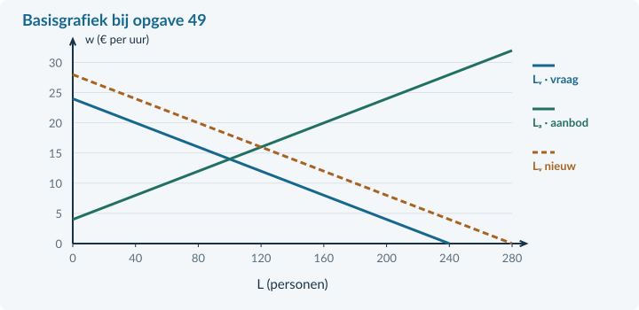<figcaption>Figuur 24. Markeer in deze basisgrafiek het oude en nieuwe evenwicht. De verschuiving van de vraaglijn is al gegeven.</figcaption></figure>

<b>Bron C · Scholingsvoorstel</b> In een afzonderlijk bedrijf zouden de volledige uurkosten stijgen van € 24 naar € 25,20. De productiviteit zou stijgen van 8 naar 8,8 producten per uur. De omvang van de toekomstige orders en opleidingskosten zijn nog onbekend. Een woordvoerder zegt: “Dit voorstel levert gegarandeerd meer banen op.”

<!-- PAGE {"section": "4.3.6", "title": "Doeloefening vragen"} -->

<b>Opgave 49 · Werk in Havenregio</b>

Gebruik uitsluitend de relevante bronnen op de linkerpagina. Geef bij elke berekening de eenheid. Schrijf verklaringen in volledige zinnen.

<b>a.</b> (3p) Bereken met bron A de beroepsbevolking, bruto-participatie en het werkloosheidspercentage.

<b>b.</b> (2p) Bereken met bron B zelfstandig het oorspronkelijke evenwichtsloon en de werkgelegenheid.

<b>c.</b> (2p) Bereken het nieuwe evenwicht na de extra orders. Markeer beide evenwichten in de basisgrafiek.

<b>d.</b> (2p) Een leerling zegt: “De loonstijging verschuift de arbeidsvraag naar rechts.” Verbeter dit met bron B en benoem wat langs de aanbodlijn gebeurt.

<b>e.</b> (3p) Bereken met bron C de loonkosten per product vóór en na het voorstel en de procentuele verandering.

<b>f.</b> (2p) Beoordeel de garantie van meer banen in bron C. Noem één ondersteunde uitkomst en één ontbrekend gegeven dat de werkgelegenheid kan beïnvloeden.

<b>Controle vóór inleveren</b> Heb je de twee noemers onderscheiden? Hebben je lonen en hoeveelheden eenheden? Is je beleidsconclusie niet sterker dan de informatie uit de bron?

<!-- PAGE {"section": "4.3.6", "title": "Afsluiten met een modelkritiek"} -->

## Denkertje / Bonusopgave

<b>Opgave 50 · Hetzelfde bericht, verschillende verklaringen</b>

Een bericht luidt: “Het gemiddelde uurloon is hoger, de werkloosheid is lager en werkgevers melden meer vacatures.” Er staan geen aanvullende cijfers of oorzaken bij.

<b>a.</b> Geef twee verschillende, economisch mogelijke verklaringen voor dit bericht. Geef vervolgens aan welke informatie je nodig hebt om ertussen te kiezen.

### Dit kun je nu zelf controleren
Kies een eerder gemaakte fout en verbeter niet alleen het getal, maar ook de uitleg. Gebruik de terugwijzing die bij je fout past.

<table><thead><tr><th>Een fout die je herkent</th><th>Kijk terug bij</th></tr></thead><tbody><tr><td>Personen als uren gebruiken</td><td>§4.3.1 · arbeid meten</td></tr><tr><td>Werklozen buiten bruto-participatie laten</td><td>§4.3.2 · groepen en deelname</td></tr><tr><td>Vacatures aftrekken van werklozen</td><td>§4.3.3 · tellen versus model</td></tr><tr><td>Het minimum altijd als feitelijk loon gebruiken</td><td>§4.3.4 · bindendheid</td></tr><tr><td>Loon- en productiviteitsgroei gewoon aftrekken</td><td>§4.3.5 · kosten per product</td></tr></tbody></table>

<b>Van uitkomst naar betekenis</b> De berekening beantwoordt een afgebakende vraag. Leg daarna uit wie de uitkomst raakt, welke omstandigheden gelijk blijven en wat je met de bron niet kunt vaststellen.

<!-- PAGE {"section": "back", "title": "Hoofdstukoverzicht"} -->

# Arbeidsmarkt in één overzicht

### Eerst rollen en eenheden
Werkgevers **vragen arbeid**; huishoudens **bieden arbeid aan**. Loon **w** is euro per uur, tenzij de bron anders zegt. Hoeveelheid **L** kan personen of arbeidsuren zijn. Eén fte is een voltijd-equivalent, geen persoon.

<table><thead><tr><th>Vraag</th><th>Rekenroute</th><th>Eenheid of controle</th></tr></thead><tbody><tr><td>Hoe productief is arbeid?</td><td>productie / arbeidsinzet</td><td>Bij uren: producten per arbeidsuur.</td></tr><tr><td>Hoeveel arbeid is nodig?</td><td>productie / productiviteit</td><td>Gebruik dezelfde periode.</td></tr><tr><td>Wat kost arbeid per product?</td><td>uurkosten / productie per uur</td><td>Euro per product.</td></tr><tr><td>Hoeveel fte is dit?</td><td>totale uren / uren voltijdbaan</td><td>Beide in dezelfde periode.</td></tr></tbody></table>

### Wie telt mee in welk percentage?
<table><thead><tr><th>Maatstaf</th><th>Teller</th><th>Noemer</th></tr></thead><tbody><tr><td>Bruto-participatie</td><td>Werkenden + werklozen</td><td>Bevolking in de opgegeven groep</td></tr><tr><td>Netto-participatie</td><td>Werkenden</td><td>Dezelfde bevolking</td></tr><tr><td>Werkloosheidspercentage</td><td>Werklozen</td><td>Beroepsbevolking</td></tr></tbody></table>

Deel de teller door de noemer en vermenigvuldig met 100%. Vacatures worden niet van het aantal werklozen afgetrokken.

### Een arbeidsmarktmodel gebruiken
**Evenwicht:** stel Lᵥ = Lₐ, los op naar w, vul terug in en geef betekenis aan de eenheden.

**Verandering:** benoem de oorzaak en de verschuivende lijn. Een verandering van alleen het loon is een beweging langs een lijn. Geef aan of loon kan aanpassen.

**Minimumloon:** bepaal eerst het vrije evenwicht. Alleen een hogere loonvloer bindt. Bereken dan vraag, aanbod en de betaalde arbeid. Gebruik voor de loonsom bij personen:

loonsom per week = w × uren per persoon × werkenden

### Een cao of beleid beoordelen
Bereken de loonkosten per product, neem opgegeven extra kosten mee en toets aan het criterium. Met hetzelfde basisjaar geldt: **kostenindex = index uurkosten / index productiviteit × 100**. Noem ook een voorwaarde. Een kostenvoordeel per product is nog geen bewijs van meer banen.

<!-- PAGE {"section": "back", "title": "Begrippenlijst"} -->

# Begrippenlijst

<b>Arbeidsaanbod</b> Arbeid die huishoudens bij een bepaald loon willen aanbieden. In bevolkingsbronnen wordt het actuele aanbod in personen vaak met de beroepsbevolking aangeduid.

<b>Arbeidsproductiviteit</b> Productie per eenheid arbeidsinzet, bijvoorbeeld per gewerkt uur.

<b>Arbeidsvraag</b> Arbeid die werkgevers bij een bepaald loon willen inzetten. In de gebruikte tellingen: werkgelegenheid plus vacatures.

<b>Beroepsbevolking</b> Werkenden plus werklozen, binnen het gekozen leeftijdsbereik.

<b>Bindend minimumloon</b> Loonvloer boven het vrije evenwichtsloon, die dat evenwicht uitsluit.

<b>Bruto-arbeidsparticipatie</b> Beroepsbevolking als percentage van de bevolking in de opgegeven groep.

<b>Cao</b> Collectieve arbeidsovereenkomst: gezamenlijke afspraken over arbeidsvoorwaarden.

<b>Conjuncturele werkloosheid</b> Werkloosheid door te weinig vraag naar goederen en diensten.

<b>Evenwichtsloon</b> Loon waarbij arbeidsvraag en arbeidsaanbod in het model gelijk zijn.

<b>Flexwerk</b> Werk met bijvoorbeeld tijdelijke contracten of wisselende uren.

<b>Frictiewerkloosheid</b> Werkloosheid doordat zoeken en overstappen tijd kost. Hier onderdeel van structurele werkloosheid.

<b>Fte</b> Fulltime-equivalent: arbeidsduur omgerekend naar voltijdbanen.

<b>Loonkosten per product</b> Loonkosten gedeeld door de geproduceerde hoeveelheid.

<b>Loonsom</b> Totale loonbetaling voor daadwerkelijk betaalde arbeid in een periode.

<b>Minimumloon</b> Ondergrens aan het loon; niet automatisch het feitelijk betaalde loon.

<b>Netto-arbeidsparticipatie</b> Werkenden als percentage van de bevolking in de opgegeven groep.

<b>Niet-beroepsbevolking</b> Mensen zonder betaald werk die niet recent zoeken of niet direct beschikbaar zijn.

<b>Structurele werkloosheid</b> Werkloosheid door onder meer een blijvend veranderde vraag naar arbeid of een slechte aansluiting tussen werk en werknemers.

<b>Vacature</b> Arbeidsplaats waarvoor nog iemand wordt gezocht.

<b>Vakbond</b> Organisatie die belangen van werknemers behartigt en over arbeidsvoorwaarden kan onderhandelen.

<b>Werkgelegenheid</b> De bezette arbeidsplaatsen of hoeveelheid verrichte arbeid; let op personen, banen, uren of fte.

<b>Werkloze beroepsbevolking</b> Mensen zonder betaald werk die recent hebben gezocht en direct beschikbaar zijn.

<b>Zzp’er</b> Zelfstandige zonder personeel, niet hetzelfde als een flexwerknemer.

Begripscontrole: CBS, Arbeidsdeelname; kerncijfers en begrippen arbeidsvolume (geraadpleegd 8 september 2026). Cao: Rijksoverheid, Wat is een cao? De docententoelichting bevat de bronverantwoording. Alle numerieke gevallen in dit hoofdstuk zijn eigen lesmodellen.
