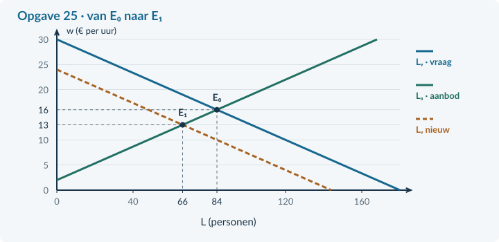

# Antwoorden 4.3.3 · Werkloosheid en veranderingen op de arbeidsmarkt

## Opgave 19 · Terug naar de groepen

**a.** Beroepsbevolking = 2.400 + 400 = <b>2.800 personen</b>. Bruto = 2.800 / 4.000 × 100% = <b>70%</b>. <i>Waarom:</i> Bruto-participatie gebruikt alle inwoners in de opgegeven leeftijdsgroep als noemer.

## Opgave 20 · Een andere noemer

**a.** Nee. Het werkloosheidspercentage deelt werklozen door de beroepsbevolking, niet door alle inwoners. <i>Waarom:</i> Dezelfde teller kan met een andere noemer een ander percentage geven.

**b.** Frictiewerkloosheid: het kost tijd om een passende werkgever en werknemer bij elkaar te brengen. <i>Waarom:</i> De bron wijst op zoektijd, niet op te weinig bestedingen of verdwenen vaardigheden.

## Opgave 21 · Een vervulde baan ontbreekt nog

**a.** Beroepsbevolking = 450 + 50 = <b>500 personen</b>. Werkloosheid = 50 / 500 × 100% = <b>10%</b>. <i>Waarom:</i> De 30 vacatures zijn nog niet vervuld en veranderen de telling van 50 werklozen niet.

**b.** De leerling trekt via de arbeidsvraag van 480 ook de <b>30 vacatures</b> van de 50 werklozen af. <i>Waarom:</i> Arbeidsvraag = 450 werkenden + 30 vacatures; het verschil is niet de werkloosheid.

## Opgave 22 · Wat verandert er?

**a.** Een conjuncturele oorzaak. Minder bestedingen → minder reisboekingen → minder werk voor het reisbureau → minder vraag naar arbeid. <i>Waarom:</i> De bron beschrijft een daling van de vraag naar eindproducten.

**b.** De arbeidsvraag verschuift naar links. In het eenvoudige model ontstaat neerwaartse loondruk en een lagere evenwichtswerkgelegenheid. <i>Waarom:</i> Bij een lager loon beweeg je langs de onveranderde aanbodlijn.

## Opgave 23 · Werk en techniek

**a.** Beroepsbevolking = 4.500 + 500 = <b>5.000 personen</b>. Werkloosheid = 500 / 5.000 × 100% = <b>10%</b>. De beschreven groep heeft een <b>structurele</b> oorzaak: ander werk vraagt andere vaardigheden. <i>Waarom:</i> De bron wijst op een verandering in techniek en aansluiting van vaardigheden, niet op lagere totale bestedingen.

## Opgave 24 · Minder schoonmaakopdrachten

**a.** 160 − 5w = −20 + 5w → 180 = 10w → <b>w = € 18</b>. L = 160 − 5 × 18 = <b>70 personen</b>. Vraag verschuift naar links; het lagere loon geeft een beweging langs aanbod naar minder aanbod. <i>Waarom:</i> De aanbodfunctie blijft gelijk.

**b.** Lᵥ = 160 − 100 = <b>60 personen</b>. Lₐ = −20 + 100 = <b>80 personen</b>. Overschot = 80 − 60 = <b>20 personen</b>. <i>Waarom:</i> Bij het vastgehouden loon wordt de nieuwe vraag niet door loonaanpassing in evenwicht gebracht.

## Opgave 25 · Rivierenregio: cijfers en een sector

**a.** Beroepsbevolking = 2.700 + 300 = <b>3.000 personen</b>. Werkloosheid = 300 / 3.000 × 100% = <b>10%</b>. Arbeidsvraag = 2.700 + 120 = 2.820; het verschil 180 is 300 − 120, niet de 300 werklozen. <i>Waarom:</i> Vacatures zijn nog niet ingevuld.

**b.** Conjuncturele oorzaak: minder bestedingen verlagen opdrachten en arbeidsvraag. 144 − 6w = −12 + 6w → 156 = 12w → <b>w = € 13</b>. L = 144 − 6 × 13 = <b>66 personen</b>. <i>Waarom:</i> De oude evenwichtswerkgelegenheid van 84 daalt; dit is geen berekening van alle werklozen in de regio.

**c.** E₀ = (84;16), E₁ = (66;13). Bij € 16: Lᵥ = 144 − 96 = <b>48</b>, Lₐ = −12 + 96 = <b>84 personen</b>. Overschot = <b>36 personen</b>. <i>Waarom:</i> Een gelijkblijvend loon en een flexibel loon leveren niet dezelfde sectoruitkomst op.

## Opgave 26 · Een dalend percentage zonder extra banen

**a.** Eerst is de beroepsbevolking 1.000 en het werkloosheidspercentage 100 / 1.000 × 100% = 10%. Later zijn er 900 werkenden en 50 werklozen: beroepsbevolking 950; werkloosheidspercentage 50 / 950 × 100% ≈ 5,26%. Het aantal werkenden blijft 900. De daling komt door uitstroom uit de beroepsbevolking, niet door extra banen. <b>Beoordelingscriteria:</b> verandert zowel teller als noemer; houdt werkenden op 900; onderscheidt stoppen met zoeken van een baan vinden.

## Opgave 27 · Marginale opbrengst uit hoofdstuk 4.1

**a.** TO = P × q = (30 − 0,5q)q = <b>30q − 0,5q²</b>, in euro per week. MO = <b>30 − q</b>, in euro per extra product. <i>Waarom:</i> Bij een uniforme lagere prijs verandert ook de opbrengst op eerdere eenheden. Herhaal bij moeite §4.1.2.

