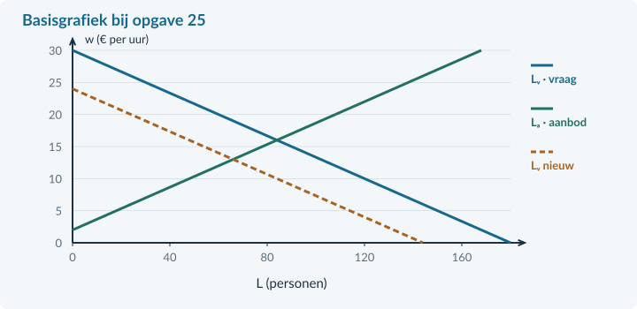

# Opgaven 4.3.3

## Uitgewerkt voorbeeld

<b>Minder evenementen</b> Een regio telt 1.840 werkenden en 160 werklozen. Er zijn 90 vacatures; elke werkende heeft precies één baan. In een aparte evenementenmarkt daalt de arbeidsvraag van Lᵥ = 200 − 8w naar Lᵥ = 168 − 8w. Het aanbod blijft Lₐ = −24 + 8w. L is het aantal personen, w het uurloon in euro; € 3 ≤ w ≤ € 21. Het oude evenwicht is w = € 14 en L = 88. Consumenten besparen op evenementen.

### 1 · Bereken de waargenomen werkloosheid
Beroepsbevolking = 1.840 + 160 = **2.000 personen**. 
Werkloosheidspercentage = 160 / 2.000 × 100% = **8%**.

Arbeidsvraag = 1.840 + 90 = **1.930 arbeidsplaatsen**. Het verschil van 70 is werklozen min vacatures, niet de werkloosheid.

### 2 · Noem de oorzaak en de verschuiving
Minder bestedingen → minder evenementen → minder arbeidsvraag. Dit is **conjunctureel**. Vraag verschuift naar links; aanbod blijft gelijk.

### 3 · Bereken het nieuwe evenwicht bij flexibel loon
168 − 8w = −24 + 8w → 192 = 16w → **w = € 12**. 
L = 168 − 8 × 12 = **72 personen**.

### 4 · Vergelijk met voorlopig vast loon
Bij € 14: Lᵥ = 168 − 8 × 14 = **56** en Lₐ = −24 + 8 × 14 = **88 personen**. Zonder vacatures of zoekproblemen worden 56 plaatsen gevuld en is het aanbodoverschot **32 personen**.

De sectorgrafiek vervangt niet de aparte regiotelling.

<b>Samenvatting §4.3.3</b> Werkloosheid gebruikt de beroepsbevolking als noemer. Trek vacatures niet af. Benoem oorzaak en loonaanpassing. Houd model en waarneming gescheiden. In §4.3.4 voegen we een minimumloon toe.

<!-- PAGE {"section": "4.3.3", "title": "Start en een oorzaak herkennen"} -->

## Startopgaven

<b>Korte route:</b> Startopgaven → Zelfstandige oefening → Doeloefening. Extra hulp nodig? Maak eerst Begeleide inoefening.

<b>Opgave 19 · Terug naar de groepen</b>

Een gemeente telt 4.000 inwoners van 15 tot 75 jaar. Er zijn 2.400 werkenden en 400 werklozen.

<b>a.</b> Bereken de beroepsbevolking en de bruto-participatie.

<b>Opgave 20 · Een andere noemer</b>

In een andere regio is 6% van de bevolking werkloos. De bruto-participatie is 60%.

<b>a.</b> Is het werkloosheidspercentage automatisch 6%? Leg uit zonder het precieze percentage te hoeven berekenen.

<b>b.</b> Een andere werkzoekende is tussen twee banen drie weken op zoek. De vaardigheden sluiten aan bij openstaande vacatures. Welk type werkloosheid past hierbij?

## Begeleide inoefening

Heb je deze hulp niet nodig? Ga dan verder met Zelfstandige oefening.

<b>Opgave 21 · Een vervulde baan ontbreekt nog</b>

Een klein gebied telt 450 werkenden, 50 werklozen en 30 vacatures. Iedereen heeft hoogstens één baan. Een vacature past niet bij iedere werkzoekende.

<b>a.</b> Bereken eerst de beroepsbevolking en daarna het werkloosheidspercentage.

<b>b.</b> Een leerling rekent (500 − 480) / 500 × 100% = 4%. Wat trekt die leerling ten onrechte af?

<!-- PAGE {"section": "4.3.3", "title": "Van oorzaak naar uitkomst"} -->

Begeleide inoefening · vervolg

Heb je deze hulp niet nodig? Ga dan verder met Zelfstandige oefening.

<b>Opgave 22 · Wat verandert er?</b>

Een reisbureau krijgt minder boekingen doordat huishoudens minder besteden. In zijn arbeidsmarkt blijft het loon eerst gelijk.

<b>a.</b> Noem de oorzaak van werkloosheid die bij de bron past en maak de keten af: minder bestedingen → … → minder vraag naar arbeid.

<b>b.</b> Welke lijn verschuift en welke druk op loon en werkgelegenheid ontstaat als het loon later wel kan dalen?

## Zelfstandige oefening

<b>Opgave 23 · Werk en techniek</b>

Een provincie heeft 4.500 werkenden en 500 werklozen. Een deel van de werklozen deed invoerwerk dat nu door software wordt uitgevoerd. Nieuwe vacatures vragen andere vaardigheden.

<b>a.</b> Bereken het werkloosheidspercentage en benoem de best passende oorzaak voor de beschreven groep.

<b>Opgave 24 · Minder schoonmaakopdrachten</b>

Oud: Lᵥ = 180 − 5w. Nieuw: Lᵥ = 160 − 5w. Aanbod blijft Lₐ = −20 + 5w. L is het aantal personen; w is het uurloon in euro. Gebruik € 4 ≤ w ≤ € 32. Oud evenwicht: € 20 en 80 personen. Loon is vrij aanpasbaar; er zijn geen vacatures of zoekproblemen.

<b>a.</b> Bereken het nieuwe evenwicht. Benoem één verschuiving en één beweging langs een lijn.

<b>b.</b> Bereken het aanbodoverschot als het loon toch € 20 blijft.

<!-- PAGE {"section": "4.3.3", "title": "Doeloefening"} -->

## Doeloefening

<b>Opgave 25 · Rivierenregio: cijfers en een sector</b>

Bron A: de regio telt 2.700 werkenden, 300 werklozen en 120 vacatures. Iedere werkende heeft één baan. Bron B: in een afzonderlijke sector nemen de opdrachten af doordat huishoudens minder besteden. Lᵥ daalt van 180 − 6w naar 144 − 6w; Lₐ blijft −12 + 6w. L is het aantal personen; w is het uurloon in euro; € 2 ≤ w ≤ € 24. Het oude evenwicht is € 16 en 84 personen. Er zijn in dit sector-model geen vacatures of zoekproblemen.

<b>a.</b> (3p) Bereken met bron A het werkloosheidspercentage. Leg uit waarom arbeidsaanbod min arbeidsvraag hier niet de werkloosheid geeft.

<b>b.</b> (3p) Benoem met bron B de oorzaak en bereken het nieuwe evenwicht als het loon vrij aanpast.

<b>c.</b> (3p) Markeer het oude en nieuwe evenwicht in de basisgrafiek. Bereken daarna het aanbodoverschot bij een loon dat € 16 blijft.

<figure><figcaption>Figuur 16. De oude en nieuwe vraaglijn en de aanbodlijn zijn gegeven. Voeg alleen E₀ en E₁ toe.</figcaption></figure>

<!-- PAGE {"section": "4.3.3", "title": "Denkertje en herhaling"} -->

## Denkertje / Bonusopgave

<b>Opgave 26 · Een dalend percentage zonder extra banen</b>

Een dorp telt eerst 900 werkenden en 100 werklozen. Later stoppen 50 werklozen met zoeken. Zij hebben geen betaald werk en horen nu bij de niet-beroepsbevolking. Er komt geen baan bij.

<b>a.</b> Beoordeel: “De lagere werkloosheid bewijst dat meer mensen werk hebben.” Gebruik zowel aantallen als percentages.

## Herhaling / Herhaling en interleaving

<b>Opgave 27 · Marginale opbrengst uit hoofdstuk 4.1</b>

Een onderneming heeft P = 30 − 0,5q en TK = 6q + 100. P is euro per product, q producten per week. De gevraagde hoeveelheid is niet negatief.

<b>a.</b> Bepaal TO en MO.

<b>Terugblik</b> Een cijfer wordt pas betekenisvol met de juiste teller, noemer en definitie. Een modeluitkomst vraagt bovendien een expliciete aanname over loonaanpassing.
