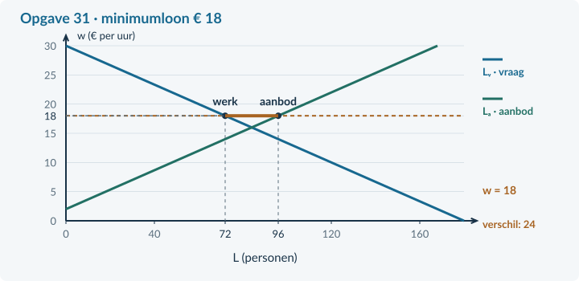

# Antwoorden 4.3.4 · Minimumloon

## Opgave 28 · De minimumprijs terughalen

**a.** Er worden <b>60 producten per week</b> verkocht. Aanbodoverschot = 100 − 60 = <b>40 producten per week</b>. <i>Waarom:</i> Zonder aankoopregeling zijn er niet automatisch kopers voor alle aangeboden producten.

## Opgave 29 · Personen zijn geen uren

**a.** € 15 × 20 × 50 = <b>€ 15.000 per week</b>. <i>Waarom:</i> Het uurloon moet met het aantal betaalde uren worden vermenigvuldigd.

## Opgave 30 · Begrijpen vóór rekenen

**a.** Minder werkenden: 80 − 70 = <b>10 personen</b>. Extra aanbieders: 90 − 80 = <b>10 personen</b>. <i>Waarom:</i> Samen vormen deze veranderingen het nieuwe verschil van 20 personen.

**b.** Alleen de 70 werkenden ontvangen loon voor de gevraagde arbeid. De overige 20 krijgen in dit model geen baan. <i>Waarom:</i> Aanbod is niet hetzelfde als betaalde arbeid.

## Opgave 31 · De vloer stap voor stap

**a.** € 18 > € 16: <b>bindend</b>. Lᵥ = 180 − 6 × 18 = <b>72</b>. Lₐ = −12 + 6 × 18 = <b>96 personen</b>. <i>Waarom:</i> De ondergrens ligt boven het vrije evenwichtsloon.

**b.** Werkgelegenheid = <b>72 personen</b>. Overschot = 96 − 72 = <b>24 personen</b>. Loonsom = € 18 × 20 × 72 = <b>€ 25.920 per week</b>. <i>Waarom:</i> Je gebruikt de daadwerkelijk gevulde plaatsen voor de loonsom.

## Opgave 32 · Een andere reactie

**a.** Lᵥ = 140 − 2 × 22 = <b>96 personen</b>; Lₐ = 5 × 22 = <b>110 personen</b>. Overschot = <b>14 personen</b>. Nieuw: 22 × 20 × 96 = <b>€ 42.240 per week</b>. Oud: 20 × 20 × 100 = <b>€ 40.000 per week</b>. Stijging: <b>€ 2.240</b>. <i>Waarom:</i> Hier daalt betaald werk relatief weinig, zodat de loonsom stijgt.

## Opgave 33 · Een minimum onder de markt

**a.** <b>€ 24 per uur en 60 werkenden</b>. De vloer is niet-bindend, omdat het vrije loon erboven ligt. <i>Waarom:</i> Een minimum is een ondergrens, geen verplichte prijs.

## Opgave 34 · Een loonvloer in de sorteercentra

**a.** 220 − 10w = −20 + 10w → 240 = 20w → <b>w = € 12</b>. L = 220 − 10 × 12 = <b>100 personen</b>. € 14 > € 12: <b>bindend</b>. <i>Waarom:</i> De loonvloer sluit het vrije evenwicht uit.

**b.** Lᵥ = 220 − 140 = <b>80</b>; Lₐ = −20 + 140 = <b>120 personen</b>. Werkgelegenheid = <b>80</b>; overschot = 120 − 80 = <b>40 personen</b>. <i>Waarom:</i> De aangeboden 120 banen aan arbeid worden niet alle door werkgevers gevraagd.

**c.** Oud = 12 × 25 × 100 = <b>€ 30.000 per week</b>. Nieuw = 14 × 25 × 80 = <b>€ 28.000 per week</b>. (28.000 − 30.000) / 30.000 × 100% ≈ <b>−6,67%</b>. <i>Waarom:</i> De stijging van het uurloon compenseert hier de afname van betaalde uren niet.

**d.** Er zijn <b>20 minder werkenden</b> en <b>20 extra aanbieders</b>. Samen vormen zij het verschil van 40. Alleen wie werk houdt en dezelfde uren werkt, krijgt het hogere weekloon. <i>Waarom:</i> Aanbodoverschot, banenverlies en inkomenswinst zijn verschillende grootheden.

## Opgave 35 · Een hoger loon, minder uren per persoon

**a.** Het uurloon stijgt. Het weekloon daalt van 16 × 25 = € 400 naar 18 × 20 = € 360. De werkgelegenheid in personen blijft gelijk, maar het aantal gewerkte uren daalt. Een hogere prijs per uur zegt dus niet genoeg over het inkomen per week. <b>Beoordelingscriteria:</b> rekent beide weeklonen juist; houdt personen gelijk; onderscheidt uren van personen en uurloon van weekloon.

## Opgave 36 · Productiviteit blijft nodig

**a.** Productiviteit = 4.800 / 800 = <b>6 producten per uur</b>. Loonkosten = € 27 / 6 = <b>€ 4,50 per product</b>. <i>Waarom:</i> Een uurkost moet je over de productie in dat uur verdelen. Herhaal bij moeite §4.3.1.

