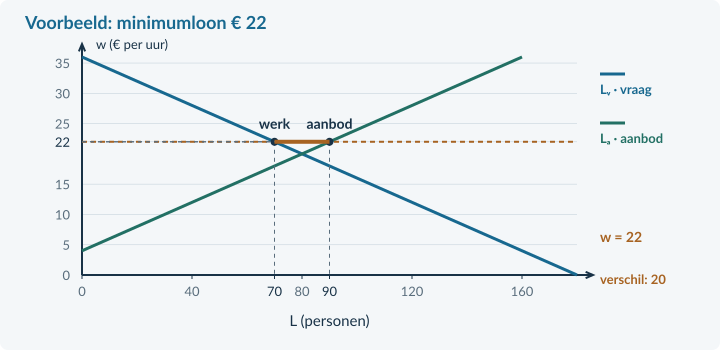

# Opgaven 4.3.4

## Uitgewerkt voorbeeld

<b>Een loonvloer in de pakketbranche</b> Lᵥ = 180 − 5w; Lₐ = −20 + 5w, voor € 4 ≤ w ≤ € 36. L is het aantal personen met ieder 20 betaalde uren per week; w is het uurloon in euro. Het minimumloon wordt € 22. Neem concurrerende werkgevers, gelijke arbeid en geen vacatures of zoekproblemen aan. Het brutoloon is in dit model ook de volledige uurkost voor de werkgever.

### 1 · Bereken het vrije evenwicht en toets de ondergrens
180 − 5w = −20 + 5w → 200 = 10w → **w = € 20**. 
L = 180 − 5 × 20 = **80 personen**. € 22 > € 20: de vloer is bindend.

### 2 · Bereken beide hoeveelheden en de werkgelegenheid
Lᵥ = 180 − 5 × 22 = **70 personen**. 
Lₐ = −20 + 5 × 22 = **90 personen**. 
Er werken **70 personen**. Het aanbodoverschot is 90 − 70 = **20 personen**.

### 3 · Vergelijk de loonsommen
Oud: € 20 × 20 × 80 = **€ 32.000 per week**. 
Nieuw: € 22 × 20 × 70 = **€ 30.800 per week**. 
Verandering: (30.800 − 32.000) / 32.000 × 100% = **−3,75%**.

### 4 · Leg de verdeling uit
Wie 20 uur blijft werken, krijgt € 440 in plaats van € 400 per week. Er zijn wel 10 minder werkenden. Het aanbod groeit met 10 personen. Samen geeft dat het nieuwe aanbodoverschot van 20 personen.

Het hogere loon geldt dus niet als inkomen voor alle 90 aanbieders. Zonder individuele gegevens weten we ook niet welke personen hun baan behouden.

<b>Samenvatting §4.3.4</b> Eerst het vrije evenwicht, dan de bindendheid. Bereken vraag, aanbod en betaald werk afzonderlijk. Gebruik betaald werk voor de loonsom. Maak onderscheid tussen blijvende werknemers, minder werkenden en extra aanbieders. In §4.3.5 bekijken we loonafspraken en beleid.

<!-- PAGE {"section": "4.3.4", "title": "Start en een vloer herkennen"} -->

## Startopgaven

<b>Korte route:</b> Startopgaven → Zelfstandige oefening → Doeloefening. Extra hulp nodig? Maak eerst Begeleide inoefening.

<b>Opgave 28 · De minimumprijs terughalen</b>

Op een goederenmarkt is de evenwichtsprijs € 8. Er komt een minimumprijs van € 10. Bij € 10 is de vraag 60 en het aanbod 100 producten per week. De overheid koopt niets op.

<b>a.</b> Hoeveel producten worden verkocht en hoe groot is het aanbodoverschot?

<b>Opgave 29 · Personen zijn geen uren</b>

Er werken 50 mensen. Ieder werkt 20 uur per week tegen € 15 bruto per uur.

<b>a.</b> Bereken de loonsom per week.

## Begeleide inoefening

Heb je deze hulp niet nodig? Ga dan verder met Zelfstandige oefening.

<figure><figcaption>Figuur 20. Bij het voorbeeld worden 70 personen gevraagd en bieden 90 personen arbeid aan. Gebruik de gemarkeerde uitkomst.</figcaption></figure>

<b>Opgave 30 · Begrijpen vóór rekenen</b>

Gebruik het volledig uitgewerkte voorbeeld op de vorige pagina: oud € 20 en 80 werkenden; nieuw € 22, 70 werkenden en 90 aanbieders.

<b>a.</b> Hoeveel minder mensen werken er? Hoeveel extra mensen bieden arbeid aan?

<b>b.</b> Waarom reken je voor de nieuwe loonsom niet met alle 90 aanbieders?

<!-- PAGE {"section": "4.3.4", "title": "Van begeleid naar zelfstandig"} -->

Begeleide inoefening · vervolg

Heb je deze hulp niet nodig? Ga dan verder met Zelfstandige oefening.

<b>Opgave 31 · De vloer stap voor stap</b>

Lᵥ = 180 − 6w en Lₐ = −12 + 6w. L is het aantal personen met 20 uur per week; w is het uurloon in euro. Gebruik € 2 ≤ w ≤ € 30. Het vrije evenwicht is € 16 en 84 personen. Alle gevraagde plaatsen worden gevuld. Een minimum van € 18 wordt ingevoerd.

<b>a.</b> Toets de bindendheid en bereken Lᵥ en Lₐ bij het minimum.

<b>b.</b> Bereken de werkgelegenheid, het aanbodoverschot en de nieuwe loonsom.

## Zelfstandige oefening

<b>Opgave 32 · Een andere reactie</b>

In een cateringmarkt geldt Lᵥ = 140 − 2w en Lₐ = 5w, met L in personen en w in euro per uur. Iedereen werkt 20 uur per week. Het vrije evenwicht is € 20 en 100 personen. Alle gevraagde plaatsen worden gevuld. Het minimum wordt € 22.

<b>a.</b> Bereken werkgelegenheid, aanbodoverschot en loonsom bij de vloer. Vergelijk met de oude loonsom.

<b>Opgave 33 · Een minimum onder de markt</b>

In een aparte markt is het vrije evenwicht € 24 per uur met 60 werkenden. Het minimumloon wordt € 21. Alle overige omstandigheden blijven gelijk.

<b>a.</b> Welk loon en welke werkgelegenheid verwacht je volgens het model? Licht toe.

<!-- PAGE {"section": "4.3.4", "title": "Doeloefening"} -->

## Doeloefening

<b>Opgave 34 · Een loonvloer in de sorteercentra</b>

Lᵥ = 220 − 10w en Lₐ = −20 + 10w, voor € 2 ≤ w ≤ € 22. L is het aantal personen met ieder 25 betaalde uren per week; w is het brutouurloon in euro. Een fictief minimumloon wordt € 14. Werkgevers concurreren; er zijn geen vacatures of zoekproblemen. Alle gevraagde plaatsen worden gevuld. Alle aanbieders zonder baan zoeken en zijn direct beschikbaar.

<b>a.</b> (2p) Bereken het vrije evenwicht en bepaal of de loonvloer bindend is.

<b>b.</b> (3p) Bereken bij de loonvloer arbeidsvraag, arbeidsaanbod, werkgelegenheid en aanbodoverschot. Geef de loonvloer en beide hoeveelheden aan in de basisgrafiek.

<b>c.</b> (3p) Bereken de loonsom vóór en na de verandering en de procentuele verandering.

<b>d.</b> (2p) Leg uit waarom “alle 40 hebben hun baan verloren” en “iedereen verdient meer” geen juiste conclusies zijn.

<figure><figcaption>Figuur 21. De vraag- en aanbodlijn zijn gegeven. Vul de loonvloer, vraag en aanbod aan; teken de lijnen niet opnieuw.</figcaption></figure>

<!-- PAGE {"section": "4.3.4", "title": "Denkertje en herhaling"} -->

## Denkertje / Bonusopgave

<b>Opgave 35 · Een hoger loon, minder uren per persoon</b>

Een werknemer krijgt eerst € 16 per uur en werkt 25 uur per week. Later krijgt deze werknemer € 18 per uur maar werkt 20 uur. Deze verandering geldt voor alle werknemers; hun aantal blijft gelijk.

<b>a.</b> Beoordeel welke uitspraken juist zijn: het uurloon stijgt, het weekloon stijgt, de werkgelegenheid in personen daalt, de arbeidsinzet in uren daalt. Leg uit waarom de eenheid ertoe doet.

## Herhaling / Herhaling en interleaving

<b>Opgave 36 · Productiviteit blijft nodig</b>

Een producent maakt 4.800 producten in 800 arbeidsuren. De volledige uurkosten zijn € 27.

<b>a.</b> Bereken de arbeidsproductiviteit en loonkosten per product.

<b>Terugblik</b> Bij een loonmaatregel reken je niet alleen met het uurloon. Je controleert ook betaald werk, aangeboden arbeid, arbeidsduur en de totale loonsom.
