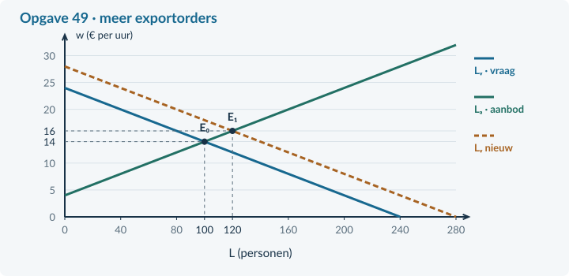

# Antwoorden 4.3.6 · Gemengde opgaven: arbeidsmarkt

## Opgave 46 · Drie uitspraken controleren

**a.** Het bedrijf gebruikt 160 / 40 = <b>4 fte</b>, maar er werken <b>8 personen</b>. <i>Waarom:</i> Fte is de omvang van de arbeidsinzet, geen telling van mensen.

**b.** Beroepsbevolking = 960 + 40 = <b>1.000 personen</b>; werkloosheid = 40 / 1.000 × 100% = <b>4%</b>. <i>Waarom:</i> De 30 vacatures mogen niet van de 40 werklozen worden afgetrokken.

**c.** Dat kan wel als de productiviteit voldoende sterk stijgt. Je deelt uurkosten door productie per uur. <i>Waarom:</i> Het uurbedrag en het productbedrag hebben verschillende eenheden.

## Opgave 47 · Een exporteur automatiseert

**a.** Oude productiviteit = 6.000 / 1.000 = <b>6 onderdelen per uur</b>. Nieuwe uren = 7.560 / 7,2 = <b>1.050 uur</b>. Verandering = 50 / 1.000 × 100% = <b>+5%</b>. <i>Waarom:</i> De productie groeit sterker dan de productiviteit.

**b.** Oud = 24 / 6 = <b>€ 4 per onderdeel</b>. Nieuw = 25,20 / 7,2 = <b>€ 3,50 per onderdeel</b>. Winststijging is niet bewezen: opbrengsten en andere kosten ontbreken. <i>Waarom:</i> Loonkosten per product zijn niet alle kosten en niet de totale winst.

## Opgave 48 · Een loonafspraak boven de markt

**a.** 180 − 6w = −12 + 6w → 192 = 12w → <b>w = € 16</b>, L = <b>84 personen</b>. Bij € 18: Lᵥ = 72; de werkgelegenheid is <b>72 personen</b>. Loonsom = 18 × 20 × 72 = <b>€ 25.920 per week</b>. <i>Waarom:</i> De afspraak ligt boven het vrije loon en bindt.

**b.** Nee; het loon verandert de hoeveelheid langs de vraaglijn. Lₐ = −12 + 6 × 18 = <b>96</b>; overschot = 96 − 72 = <b>24 personen</b>. <i>Waarom:</i> Een loonregel en een verschuiving van de onderliggende arbeidsvraag zijn niet hetzelfde.

## Opgave 49 · Werk in Havenregio

**a.** Bevolking = 12.600 + 1.400 + 6.000 = <b>20.000 personen</b>. Beroepsbevolking = <b>14.000 personen</b>. Bruto = 14.000 / 20.000 × 100% = <b>70%</b>. Werkloosheid = 1.400 / 14.000 × 100% = <b>10%</b>. <i>Waarom:</i> Participatie en werkloosheid hebben verschillende noemers.

**b.** 240 − 10w = −40 + 10w → 280 = 20w → <b>w = € 14</b>. L = 240 − 10 × 14 = <b>100 personen</b>. <i>Waarom:</i> Bij het evenwicht zijn arbeidsvraag en arbeidsaanbod gelijk.

**c.** 280 − 10w = −40 + 10w → 320 = 20w → <b>w = € 16</b>. L = 280 − 10 × 16 = <b>120 personen</b>. E₀ = (100;14); E₁ = (120;16). <i>Waarom:</i> Extra orders verschuiven arbeidsvraag naar rechts; de nieuwe werkgelegenheid is hoger.

**d.** De <b>extra exportorders</b> verschuiven de arbeidsvraag. Het hogere loon is een uitkomst van de nieuwe verhouding. Langs de gelijk gebleven aanbodlijn stijgt de aangeboden hoeveelheid van 100 naar 120 personen. <i>Waarom:</i> Oorzaak van een lijnverschuiving en beweging langs een andere lijn zijn verschillende onderdelen van de aanpassing.

**e.** Oud = 24 / 8 = <b>€ 3 per product</b>. Nieuw = 25,20 / 8,8 = <b>€ 2,863636… ≈ € 2,86 per product</b>. Verandering = (2,863636… − 3) / 3 × 100% ≈ <b>−4,55%</b>. <i>Waarom:</i> Reken met onafgeronde bedragen tot het eindantwoord.

**f.** Onder de veronderstelde veranderingen dalen de loonkosten per product. Meer banen zijn niet gegarandeerd: de toekomstige productie/orders ontbreken. Bij dezelfde productie zou de hogere productiviteit juist minder arbeidsuren vragen. <i>Waarom:</i> Een dalend bedrag per product bepaalt niet vanzelf hoeveel producten worden gemaakt of hoeveel mensen werken.

## Opgave 50 · Hetzelfde bericht, verschillende verklaringen

**a.** Een mogelijkheid is groei van de arbeidsvraag door extra orders: meer aanstellingen verlagen de werkloosheid en concurrentie om personeel geeft opwaartse loondruk. Een andere mogelijkheid is een combinatie van loonafspraken en mensen die stoppen met zoeken; het werkloosheidscijfer kan dan dalen zonder extra banen, terwijl bestaande vacatures door mismatch openblijven. Nodig zijn bijvoorbeeld werkenden, beroepsbevolking, gewerkte uren, nieuwe orders en aard van vacatures. <b>Beoordelingscriteria:</b> geeft twee intern mogelijke mechanismen; trekt geen noodzakelijke causaliteit uit het bericht; noemt gegevens die de verklaringen onderscheiden.

